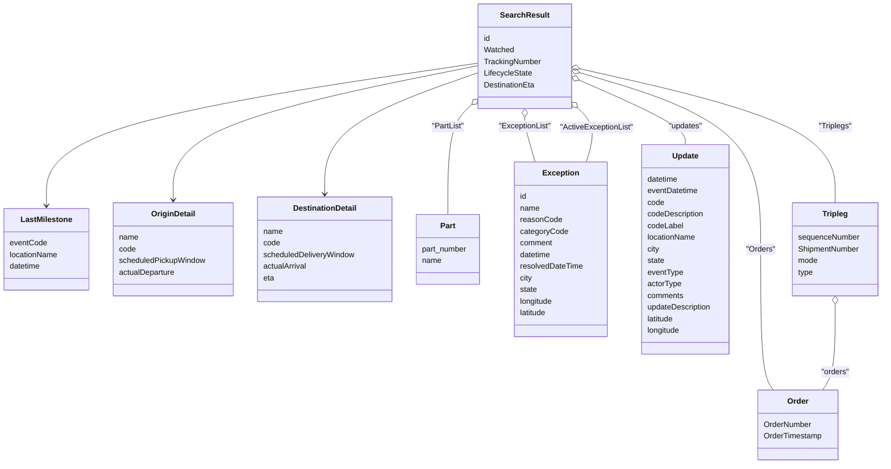
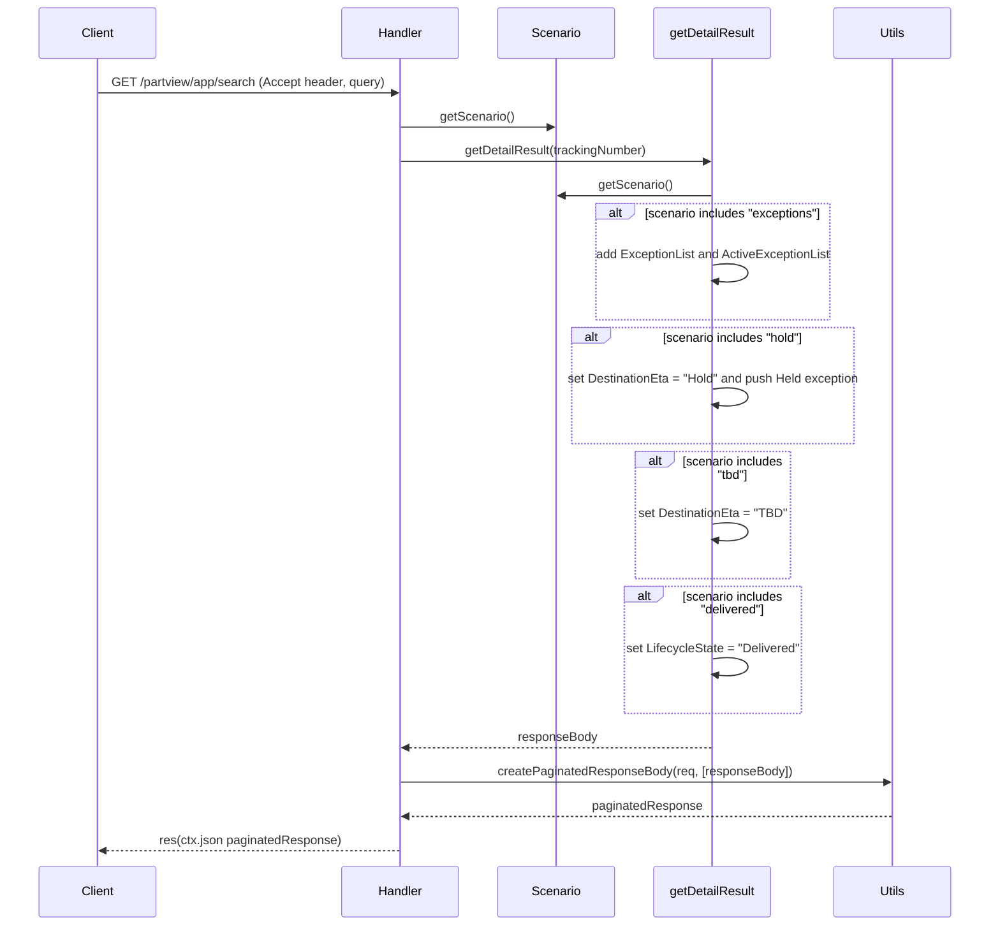

# Diagram: web/portal/src/mocks/handlers/partview/app/search.js


> Auto-generated by Obscura crawlers

## Diagram 1

```mermaid
flowchart TD
  Client[Client]
  API["GET /partview/app/search"]
  Client -->|HTTP GET| API
  API --> Accept{Accept header}
  Accept -->|application/json;version=DETAILS| DETAILS[getDetailResult(trackingNumber)]
  DETAILS --> PAGINATE1[createPaginatedResponseBody]
  PAGINATE1 --> RESP_DETAILS[res(ctx.status 200, ctx.json, ctx.delay 500)]
  Accept -->|application/json;version=COUNT| RESP_COUNT[res(ctx.json counts)]
  Accept -->|application/json;version=PARTSELLER_COUNT| RESP_PARTSELLER[res(ctx.json totals)]
  Accept -->|other| TYPICAL[Typical search flow]
  TYPICAL --> SYNC[Sync WATCHED_PACKAGES_BY_TRACKING_NUMBER]
  SYNC --> FILTER[Apply filters: exception & watched]
  FILTER --> PAGINATE2[createPaginatedResponseBody]
  PAGINATE2 --> RESP_TYPICAL[res(ctx.json paginatedResults)]
```

> SVG rendering failed for this diagram.

## Diagram 2



### SVG

<svg id="container" width="1834.052734375" xmlns="http://www.w3.org/2000/svg" class="classDiagram" height="956" viewBox="0 0 1834.052734375 956" role="graphics-document document" aria-roledescription="class"><style>#container{font-family:"trebuchet ms",verdana,arial,sans-serif;font-size:16px;fill:#333;}@keyframes edge-animation-frame{from{stroke-dashoffset:0;}}@keyframes dash{to{stroke-dashoffset:0;}}#container .edge-animation-slow{stroke-dasharray:9,5!important;stroke-dashoffset:900;animation:dash 50s linear infinite;stroke-linecap:round;}#container .edge-animation-fast{stroke-dasharray:9,5!important;stroke-dashoffset:900;animation:dash 20s linear infinite;stroke-linecap:round;}#container .error-icon{fill:#552222;}#container .error-text{fill:#552222;stroke:#552222;}#container .edge-thickness-normal{stroke-width:1px;}#container .edge-thickness-thick{stroke-width:3.5px;}#container .edge-pattern-solid{stroke-dasharray:0;}#container .edge-thickness-invisible{stroke-width:0;fill:none;}#container .edge-pattern-dashed{stroke-dasharray:3;}#container .edge-pattern-dotted{stroke-dasharray:2;}#container .marker{fill:#333333;stroke:#333333;}#container .marker.cross{stroke:#333333;}#container svg{font-family:"trebuchet ms",verdana,arial,sans-serif;font-size:16px;}#container p{margin:0;}#container g.classGroup text{fill:#9370DB;stroke:none;font-family:"trebuchet ms",verdana,arial,sans-serif;font-size:10px;}#container g.classGroup text .title{font-weight:bolder;}#container .nodeLabel,#container .edgeLabel{color:#131300;}#container .edgeLabel .label rect{fill:#ECECFF;}#container .label text{fill:#131300;}#container .labelBkg{background:#ECECFF;}#container .edgeLabel .label span{background:#ECECFF;}#container .classTitle{font-weight:bolder;}#container .node rect,#container .node circle,#container .node ellipse,#container .node polygon,#container .node path{fill:#ECECFF;stroke:#9370DB;stroke-width:1px;}#container .divider{stroke:#9370DB;stroke-width:1;}#container g.clickable{cursor:pointer;}#container g.classGroup rect{fill:#ECECFF;stroke:#9370DB;}#container g.classGroup line{stroke:#9370DB;stroke-width:1;}#container .classLabel .box{stroke:none;stroke-width:0;fill:#ECECFF;opacity:0.5;}#container .classLabel .label{fill:#9370DB;font-size:10px;}#container .relation{stroke:#333333;stroke-width:1;fill:none;}#container .dashed-line{stroke-dasharray:3;}#container .dotted-line{stroke-dasharray:1 2;}#container #compositionStart,#container .composition{fill:#333333!important;stroke:#333333!important;stroke-width:1;}#container #compositionEnd,#container .composition{fill:#333333!important;stroke:#333333!important;stroke-width:1;}#container #dependencyStart,#container .dependency{fill:#333333!important;stroke:#333333!important;stroke-width:1;}#container #dependencyStart,#container .dependency{fill:#333333!important;stroke:#333333!important;stroke-width:1;}#container #extensionStart,#container .extension{fill:transparent!important;stroke:#333333!important;stroke-width:1;}#container #extensionEnd,#container .extension{fill:transparent!important;stroke:#333333!important;stroke-width:1;}#container #aggregationStart,#container .aggregation{fill:transparent!important;stroke:#333333!important;stroke-width:1;}#container #aggregationEnd,#container .aggregation{fill:transparent!important;stroke:#333333!important;stroke-width:1;}#container #lollipopStart,#container .lollipop{fill:#ECECFF!important;stroke:#333333!important;stroke-width:1;}#container #lollipopEnd,#container .lollipop{fill:#ECECFF!important;stroke:#333333!important;stroke-width:1;}#container .edgeTerminals{font-size:11px;line-height:initial;}#container .classTitleText{text-anchor:middle;font-size:18px;fill:#333;}#container .label-icon{display:inline-block;height:1em;overflow:visible;vertical-align:-0.125em;}#container .node .label-icon path{fill:currentColor;stroke:revert;stroke-width:revert;}#container :root{--mermaid-font-family:"trebuchet ms",verdana,arial,sans-serif;}</style><g><defs><marker id="container_class-aggregationStart" class="marker aggregation class" refX="18" refY="7" markerWidth="190" markerHeight="240" orient="auto"><path d="M 18,7 L9,13 L1,7 L9,1 Z"></path></marker></defs><defs><marker id="container_class-aggregationEnd" class="marker aggregation class" refX="1" refY="7" markerWidth="20" markerHeight="28" orient="auto"><path d="M 18,7 L9,13 L1,7 L9,1 Z"></path></marker></defs><defs><marker id="container_class-extensionStart" class="marker extension class" refX="18" refY="7" markerWidth="190" markerHeight="240" orient="auto"><path d="M 1,7 L18,13 V 1 Z"></path></marker></defs><defs><marker id="container_class-extensionEnd" class="marker extension class" refX="1" refY="7" markerWidth="20" markerHeight="28" orient="auto"><path d="M 1,1 V 13 L18,7 Z"></path></marker></defs><defs><marker id="container_class-compositionStart" class="marker composition class" refX="18" refY="7" markerWidth="190" markerHeight="240" orient="auto"><path d="M 18,7 L9,13 L1,7 L9,1 Z"></path></marker></defs><defs><marker id="container_class-compositionEnd" class="marker composition class" refX="1" refY="7" markerWidth="20" markerHeight="28" orient="auto"><path d="M 18,7 L9,13 L1,7 L9,1 Z"></path></marker></defs><defs><marker id="container_class-dependencyStart" class="marker dependency class" refX="6" refY="7" markerWidth="190" markerHeight="240" orient="auto"><path d="M 5,7 L9,13 L1,7 L9,1 Z"></path></marker></defs><defs><marker id="container_class-dependencyEnd" class="marker dependency class" refX="13" refY="7" markerWidth="20" markerHeight="28" orient="auto"><path d="M 18,7 L9,13 L14,7 L9,1 Z"></path></marker></defs><defs><marker id="container_class-lollipopStart" class="marker lollipop class" refX="13" refY="7" markerWidth="190" markerHeight="240" orient="auto"><circle stroke="black" fill="transparent" cx="7" cy="7" r="6"></circle></marker></defs><defs><marker id="container_class-lollipopEnd" class="marker lollipop class" refX="1" refY="7" markerWidth="190" markerHeight="240" orient="auto"><circle stroke="black" fill="transparent" cx="7" cy="7" r="6"></circle></marker></defs><g class="root"><g class="clusters"></g><g class="edgePaths"><path d="M994.467,129.892L844.748,151.743C695.03,173.595,395.593,217.297,245.875,266.315C96.156,315.333,96.156,369.667,96.156,396.833L96.156,424" id="id_SearchResult_LastMilestone_1" class="edge-thickness-normal edge-pattern-solid relation" style=";;;" data-edge="true" data-et="edge" data-id="id_SearchResult_LastMilestone_1" data-points="W3sieCI6OTk0LjQ2Njc5Njg3NSwieSI6MTI5Ljg5MjAwMDQ5NTQxMDU3fSx7IngiOjk2LjE1NjI1LCJ5IjoyNjF9LHsieCI6OTYuMTU2MjUsInkiOjQzMH1d" marker-end="url(#container_class-dependencyEnd)"></path><path d="M994.467,134.881L888.504,155.901C782.54,176.921,570.614,218.96,464.651,265.147C358.688,311.333,358.688,361.667,358.688,386.833L358.688,412" id="id_SearchResult_OriginDetail_2" class="edge-thickness-normal edge-pattern-solid relation" style=";;;" data-edge="true" data-et="edge" data-id="id_SearchResult_OriginDetail_2" data-points="W3sieCI6OTk0LjQ2Njc5Njg3NSwieSI6MTM0Ljg4MTQyNTEzMjE5NjY4fSx7IngiOjM1OC42ODc1LCJ5IjoyNjF9LHsieCI6MzU4LjY4NzUsInkiOjQxOH1d" marker-end="url(#container_class-dependencyEnd)"></path><path d="M994.467,149.106L940.848,167.755C887.229,186.404,779.992,223.702,726.373,265.518C672.754,307.333,672.754,353.667,672.754,376.833L672.754,400" id="id_SearchResult_DestinationDetail_3" class="edge-thickness-normal edge-pattern-solid relation" style=";;;" data-edge="true" data-et="edge" data-id="id_SearchResult_DestinationDetail_3" data-points="W3sieCI6OTk0LjQ2Njc5Njg3NSwieSI6MTQ5LjEwNTYzMDgwMDUxMTZ9LHsieCI6NjcyLjc1MzkwNjI1LCJ5IjoyNjF9LHsieCI6NjcyLjc1MzkwNjI1LCJ5Ijo0MDZ9XQ==" marker-end="url(#container_class-dependencyEnd)"></path><path d="M981.681,213.782L972.991,221.651C964.302,229.521,946.922,245.261,938.233,283.297C929.543,321.333,929.543,381.667,929.543,411.833L929.543,442" id="id_SearchResult_Part_4" class="edge-thickness-normal edge-pattern-solid relation" style=";;;" data-edge="true" data-et="edge" data-id="id_SearchResult_Part_4" data-points="W3sieCI6OTk0LjQ2Njc5Njg3NSwieSI6MjAyLjIwMjI1Njc4NTYwNTM2fSx7IngiOjkyOS41NDI5Njg3NSwieSI6MjYxfSx7IngiOjkyOS41NDI5Njg3NSwieSI6NDQyfV0=" marker-start="url(#container_class-aggregationStart)"></path><path d="M1201.384,148.839L1264.988,167.533C1328.591,186.226,1455.799,223.613,1519.402,284.473C1583.006,345.333,1583.006,429.667,1583.006,514C1583.006,598.333,1583.006,682.667,1587.37,731C1591.734,779.333,1600.462,791.667,1604.826,797.833L1609.19,804" id="id_SearchResult_Order_5" class="edge-thickness-normal edge-pattern-solid relation" style=";;;" data-edge="true" data-et="edge" data-id="id_SearchResult_Order_5" data-points="W3sieCI6MTE4NC44MzM5ODQzNzUsInkiOjE0My45NzUwMDM3NjA5MTY1Nn0seyJ4IjoxNTgzLjAwNTg1OTM3NSwieSI6MjYxfSx7IngiOjE1ODMuMDA1ODU5Mzc1LCJ5Ijo1MTR9LHsieCI6MTU4My4wMDU4NTkzNzUsInkiOjc2N30seyJ4IjoxNjA5LjE4OTg4MzE3MDg3MTYsInkiOjgwNH1d" marker-start="url(#container_class-aggregationStart)"></path><path d="M1089.65,241.25L1089.65,244.542C1089.65,247.833,1089.65,254.417,1093.271,269.875C1096.892,285.333,1104.133,309.667,1107.753,321.833L1111.374,334" id="id_SearchResult_Exception_6" class="edge-thickness-normal edge-pattern-solid relation" style=";;;" data-edge="true" data-et="edge" data-id="id_SearchResult_Exception_6" data-points="W3sieCI6MTA4OS42NTAzOTA2MjUsInkiOjIyNH0seyJ4IjoxMDg5LjY1MDM5MDYyNSwieSI6MjYxfSx7IngiOjExMTEuMzc0MTEyMjE1OTA5LCJ5IjozMzR9XQ==" marker-start="url(#container_class-aggregationStart)"></path><path d="M1197.26,219.623L1204.421,226.519C1211.583,233.415,1225.906,247.208,1229.446,266.27C1232.987,285.333,1225.746,309.667,1222.125,321.833L1218.505,334" id="id_SearchResult_Exception_7" class="edge-thickness-normal edge-pattern-solid relation" style=";;;" data-edge="true" data-et="edge" data-id="id_SearchResult_Exception_7" data-points="W3sieCI6MTE4NC44MzM5ODQzNzUsInkiOjIwNy42NTc1NDM4NDE0NDQ0NH0seyJ4IjoxMjQwLjIyODUxNTYyNSwieSI6MjYxfSx7IngiOjEyMTguNTA0Nzk0MDM0MDkxLCJ5IjozMzR9XQ==" marker-start="url(#container_class-aggregationStart)"></path><path d="M1200.666,164.018L1238.037,180.181C1275.407,196.345,1350.148,228.673,1387.518,251.003C1424.889,273.333,1424.889,285.667,1424.889,291.833L1424.889,298" id="id_SearchResult_Update_8" class="edge-thickness-normal edge-pattern-solid relation" style=";;;" data-edge="true" data-et="edge" data-id="id_SearchResult_Update_8" data-points="W3sieCI6MTE4NC44MzM5ODQzNzUsInkiOjE1Ny4xNjk1ODU1MzI2Nzg0N30seyJ4IjoxNDI0Ljg4ODY3MTg3NSwieSI6MjYxfSx7IngiOjE0MjQuODg4NjcxODc1LCJ5IjoyOTh9XQ==" marker-start="url(#container_class-aggregationStart)"></path><path d="M1201.667,141.08L1290.936,161.067C1380.205,181.053,1558.742,221.027,1648.011,267.18C1737.279,313.333,1737.279,365.667,1737.279,391.833L1737.279,418" id="id_SearchResult_Tripleg_9" class="edge-thickness-normal edge-pattern-solid relation" style=";;;" data-edge="true" data-et="edge" data-id="id_SearchResult_Tripleg_9" data-points="W3sieCI6MTE4NC44MzM5ODQzNzUsInkiOjEzNy4zMTEwMDIyNzM5MTk4OH0seyJ4IjoxNzM3LjI3OTI5Njg3NSwieSI6MjYxfSx7IngiOjE3MzcuMjc5Mjk2ODc1LCJ5Ijo0MTh9XQ==" marker-start="url(#container_class-aggregationStart)"></path><path d="M1737.279,627.25L1737.279,650.542C1737.279,673.833,1737.279,720.417,1732.915,749.875C1728.551,779.333,1719.823,791.667,1715.459,797.833L1711.095,804" id="id_Tripleg_Order_10" class="edge-thickness-normal edge-pattern-solid relation" style=";;;" data-edge="true" data-et="edge" data-id="id_Tripleg_Order_10" data-points="W3sieCI6MTczNy4yNzkyOTY4NzUsInkiOjYxMH0seyJ4IjoxNzM3LjI3OTI5Njg3NSwieSI6NzY3fSx7IngiOjE3MTEuMDk1MjczMDc5MTI4NCwieSI6ODA0fV0=" marker-start="url(#container_class-aggregationStart)"></path></g><g class="edgeLabels"><g class="edgeLabel"><g class="label" data-id="id_SearchResult_LastMilestone_1" transform="translate(0, 0)"><foreignObject width="0" height="0"><div xmlns="http://www.w3.org/1999/xhtml" class="labelBkg" style="display: table-cell; white-space: nowrap; line-height: 1.5; max-width: 200px; text-align: center;"><span class="edgeLabel"></span></div></foreignObject></g></g><g class="edgeLabel"><g class="label" data-id="id_SearchResult_OriginDetail_2" transform="translate(0, 0)"><foreignObject width="0" height="0"><div xmlns="http://www.w3.org/1999/xhtml" class="labelBkg" style="display: table-cell; white-space: nowrap; line-height: 1.5; max-width: 200px; text-align: center;"><span class="edgeLabel"></span></div></foreignObject></g></g><g class="edgeLabel"><g class="label" data-id="id_SearchResult_DestinationDetail_3" transform="translate(0, 0)"><foreignObject width="0" height="0"><div xmlns="http://www.w3.org/1999/xhtml" class="labelBkg" style="display: table-cell; white-space: nowrap; line-height: 1.5; max-width: 200px; text-align: center;"><span class="edgeLabel"></span></div></foreignObject></g></g><g class="edgeLabel" transform="translate(929.54296875, 261)"><g class="label" data-id="id_SearchResult_Part_4" transform="translate(-33.671875, -12)"><foreignObject width="67.34375" height="24"><div xmlns="http://www.w3.org/1999/xhtml" class="labelBkg" style="display: table-cell; white-space: nowrap; line-height: 1.5; max-width: 200px; text-align: center;"><span class="edgeLabel"><p>"PartList"</p></span></div></foreignObject></g></g><g class="edgeLabel" transform="translate(1583.005859375, 514)"><g class="label" data-id="id_SearchResult_Order_5" transform="translate(-30.5, -12)"><foreignObject width="61" height="24"><div xmlns="http://www.w3.org/1999/xhtml" class="labelBkg" style="display: table-cell; white-space: nowrap; line-height: 1.5; max-width: 200px; text-align: center;"><span class="edgeLabel"><p>"Orders"</p></span></div></foreignObject></g></g><g class="edgeLabel" transform="translate(1089.650390625, 261)"><g class="label" data-id="id_SearchResult_Exception_6" transform="translate(-54.5, -12)"><foreignObject width="109" height="24"><div xmlns="http://www.w3.org/1999/xhtml" class="labelBkg" style="display: table-cell; white-space: nowrap; line-height: 1.5; max-width: 200px; text-align: center;"><span class="edgeLabel"><p>"ExceptionList"</p></span></div></foreignObject></g></g><g class="edgeLabel" transform="translate(1239.96251, 260.74385)"><g class="label" data-id="id_SearchResult_Exception_7" transform="translate(-76.078125, -12)"><foreignObject width="152.15625" height="24"><div xmlns="http://www.w3.org/1999/xhtml" class="labelBkg" style="display: table-cell; white-space: nowrap; line-height: 1.5; max-width: 200px; text-align: center;"><span class="edgeLabel"><p>"ActiveExceptionList"</p></span></div></foreignObject></g></g><g class="edgeLabel" transform="translate(1424.888671875, 261)"><g class="label" data-id="id_SearchResult_Update_8" transform="translate(-35.6796875, -12)"><foreignObject width="71.359375" height="24"><div xmlns="http://www.w3.org/1999/xhtml" class="labelBkg" style="display: table-cell; white-space: nowrap; line-height: 1.5; max-width: 200px; text-align: center;"><span class="edgeLabel"><p>"updates"</p></span></div></foreignObject></g></g><g class="edgeLabel" transform="translate(1737.279296875, 261)"><g class="label" data-id="id_SearchResult_Tripleg_9" transform="translate(-34.84375, -12)"><foreignObject width="69.6875" height="24"><div xmlns="http://www.w3.org/1999/xhtml" class="labelBkg" style="display: table-cell; white-space: nowrap; line-height: 1.5; max-width: 200px; text-align: center;"><span class="edgeLabel"><p>"Triplegs"</p></span></div></foreignObject></g></g><g class="edgeLabel" transform="translate(1737.279296875, 767)"><g class="label" data-id="id_Tripleg_Order_10" transform="translate(-29.5546875, -12)"><foreignObject width="59.109375" height="24"><div xmlns="http://www.w3.org/1999/xhtml" class="labelBkg" style="display: table-cell; white-space: nowrap; line-height: 1.5; max-width: 200px; text-align: center;"><span class="edgeLabel"><p>"orders"</p></span></div></foreignObject></g></g></g><g class="nodes"><g class="node default" id="classId-SearchResult-0" transform="translate(1089.650390625, 116)"><g class="basic label-container"><path d="M-95.18359375 -108 L95.18359375 -108 L95.18359375 108 L-95.18359375 108" stroke="none" stroke-width="0" fill="#ECECFF" style=""></path><path d="M-95.18359375 -108 C-54.47527254805094 -108, -13.766951346101877 -108, 95.18359375 -108 M-95.18359375 -108 C-51.20789310092385 -108, -7.232192451847695 -108, 95.18359375 -108 M95.18359375 -108 C95.18359375 -64.65477103527886, 95.18359375 -21.309542070557725, 95.18359375 108 M95.18359375 -108 C95.18359375 -22.532515230158424, 95.18359375 62.93496953968315, 95.18359375 108 M95.18359375 108 C38.618736329424436 108, -17.946121091151127 108, -95.18359375 108 M95.18359375 108 C52.674868328578434 108, 10.166142907156868 108, -95.18359375 108 M-95.18359375 108 C-95.18359375 22.62105900158211, -95.18359375 -62.75788199683578, -95.18359375 -108 M-95.18359375 108 C-95.18359375 49.963199184526076, -95.18359375 -8.073601630947849, -95.18359375 -108" stroke="#9370DB" stroke-width="1.3" fill="none" stroke-dasharray="0 0" style=""></path></g><g class="annotation-group text" transform="translate(0, -84)"></g><g class="label-group text" transform="translate(-47.8515625, -84)"><g class="label" style="font-weight: bolder" transform="translate(0,-12)"><foreignObject width="95.703125" height="24"><div xmlns="http://www.w3.org/1999/xhtml" style="display: table-cell; white-space: nowrap; line-height: 1.5; max-width: 144px; text-align: center;"><span class="nodeLabel markdown-node-label" style=""><p>SearchResult</p></span></div></foreignObject></g></g><g class="members-group text" transform="translate(-83.18359375, -36)"><g class="label" style="" transform="translate(0,-12)"><foreignObject width="14.09375" height="24"><div xmlns="http://www.w3.org/1999/xhtml" style="display: table-cell; white-space: nowrap; line-height: 1.5; max-width: 64px; text-align: center;"><span class="nodeLabel markdown-node-label" style=""><p>id</p></span></div></foreignObject></g><g class="label" style="" transform="translate(0,12)"><foreignObject width="62.296875" height="24"><div xmlns="http://www.w3.org/1999/xhtml" style="display: table-cell; white-space: nowrap; line-height: 1.5; max-width: 112px; text-align: center;"><span class="nodeLabel markdown-node-label" style=""><p>Watched</p></span></div></foreignObject></g><g class="label" style="" transform="translate(0,36)"><foreignObject width="118.515625" height="24"><div xmlns="http://www.w3.org/1999/xhtml" style="display: table-cell; white-space: nowrap; line-height: 1.5; max-width: 169px; text-align: center;"><span class="nodeLabel markdown-node-label" style=""><p>TrackingNumber</p></span></div></foreignObject></g><g class="label" style="" transform="translate(0,60)"><foreignObject width="100.1875" height="24"><div xmlns="http://www.w3.org/1999/xhtml" style="display: table-cell; white-space: nowrap; line-height: 1.5; max-width: 150px; text-align: center;"><span class="nodeLabel markdown-node-label" style=""><p>LifecycleState</p></span></div></foreignObject></g><g class="label" style="" transform="translate(0,84)"><foreignObject width="106.578125" height="24"><div xmlns="http://www.w3.org/1999/xhtml" style="display: table-cell; white-space: nowrap; line-height: 1.5; max-width: 157px; text-align: center;"><span class="nodeLabel markdown-node-label" style=""><p>DestinationEta</p></span></div></foreignObject></g></g><g class="methods-group text" transform="translate(-83.18359375, 108)"></g><g class="divider" style=""><path d="M-95.18359375 -60 C-22.585006894288526 -60, 50.01357996142295 -60, 95.18359375 -60 M-95.18359375 -60 C-56.98562676591941 -60, -18.787659781838826 -60, 95.18359375 -60" stroke="#9370DB" stroke-width="1.3" fill="none" stroke-dasharray="0 0" style=""></path></g><g class="divider" style=""><path d="M-95.18359375 84 C-46.64975445938851 84, 1.884084831222978 84, 95.18359375 84 M-95.18359375 84 C-30.567529854340847 84, 34.048534041318305 84, 95.18359375 84" stroke="#9370DB" stroke-width="1.3" fill="none" stroke-dasharray="0 0" style=""></path></g></g><g class="node default" id="classId-LastMilestone-1" transform="translate(96.15625, 514)"><g class="basic label-container"><path d="M-88.15625 -84 L88.15625 -84 L88.15625 84 L-88.15625 84" stroke="none" stroke-width="0" fill="#ECECFF" style=""></path><path d="M-88.15625 -84 C-35.58963418400182 -84, 16.976981631996367 -84, 88.15625 -84 M-88.15625 -84 C-50.811930885034094 -84, -13.467611770068189 -84, 88.15625 -84 M88.15625 -84 C88.15625 -42.407163832668225, 88.15625 -0.8143276653364495, 88.15625 84 M88.15625 -84 C88.15625 -33.41257140423945, 88.15625 17.1748571915211, 88.15625 84 M88.15625 84 C30.129810116484613 84, -27.896629767030774 84, -88.15625 84 M88.15625 84 C34.845567409415814 84, -18.465115181168372 84, -88.15625 84 M-88.15625 84 C-88.15625 33.30678820455395, -88.15625 -17.386423590892093, -88.15625 -84 M-88.15625 84 C-88.15625 28.824495418207164, -88.15625 -26.351009163585672, -88.15625 -84" stroke="#9370DB" stroke-width="1.3" fill="none" stroke-dasharray="0 0" style=""></path></g><g class="annotation-group text" transform="translate(0, -60)"></g><g class="label-group text" transform="translate(-51.09375, -60)"><g class="label" style="font-weight: bolder" transform="translate(0,-12)"><foreignObject width="102.1875" height="24"><div xmlns="http://www.w3.org/1999/xhtml" style="display: table-cell; white-space: nowrap; line-height: 1.5; max-width: 150px; text-align: center;"><span class="nodeLabel markdown-node-label" style=""><p>LastMilestone</p></span></div></foreignObject></g></g><g class="members-group text" transform="translate(-76.15625, -12)"><g class="label" style="" transform="translate(0,-12)"><foreignObject width="76.609375" height="24"><div xmlns="http://www.w3.org/1999/xhtml" style="display: table-cell; white-space: nowrap; line-height: 1.5; max-width: 127px; text-align: center;"><span class="nodeLabel markdown-node-label" style=""><p>eventCode</p></span></div></foreignObject></g><g class="label" style="" transform="translate(0,12)"><foreignObject width="101.21875" height="24"><div xmlns="http://www.w3.org/1999/xhtml" style="display: table-cell; white-space: nowrap; line-height: 1.5; max-width: 151px; text-align: center;"><span class="nodeLabel markdown-node-label" style=""><p>locationName</p></span></div></foreignObject></g><g class="label" style="" transform="translate(0,36)"><foreignObject width="65.25" height="24"><div xmlns="http://www.w3.org/1999/xhtml" style="display: table-cell; white-space: nowrap; line-height: 1.5; max-width: 115px; text-align: center;"><span class="nodeLabel markdown-node-label" style=""><p>datetime</p></span></div></foreignObject></g></g><g class="methods-group text" transform="translate(-76.15625, 84)"></g><g class="divider" style=""><path d="M-88.15625 -36 C-35.08975689327867 -36, 17.976736213442663 -36, 88.15625 -36 M-88.15625 -36 C-33.25289278499157 -36, 21.650464430016854 -36, 88.15625 -36" stroke="#9370DB" stroke-width="1.3" fill="none" stroke-dasharray="0 0" style=""></path></g><g class="divider" style=""><path d="M-88.15625 60 C-33.807226744318875 60, 20.54179651136225 60, 88.15625 60 M-88.15625 60 C-20.010124779780583 60, 48.136000440438835 60, 88.15625 60" stroke="#9370DB" stroke-width="1.3" fill="none" stroke-dasharray="0 0" style=""></path></g></g><g class="node default" id="classId-OriginDetail-2" transform="translate(358.6875, 514)"><g class="basic label-container"><path d="M-124.375 -96 L124.375 -96 L124.375 96 L-124.375 96" stroke="none" stroke-width="0" fill="#ECECFF" style=""></path><path d="M-124.375 -96 C-61.954286477725496 -96, 0.4664270445490075 -96, 124.375 -96 M-124.375 -96 C-35.9870587769791 -96, 52.400882446041805 -96, 124.375 -96 M124.375 -96 C124.375 -35.013513398218635, 124.375 25.97297320356273, 124.375 96 M124.375 -96 C124.375 -44.084479021946095, 124.375 7.831041956107811, 124.375 96 M124.375 96 C73.09598406849389 96, 21.816968136987782 96, -124.375 96 M124.375 96 C33.800555818336335 96, -56.77388836332733 96, -124.375 96 M-124.375 96 C-124.375 21.211611805273805, -124.375 -53.57677638945239, -124.375 -96 M-124.375 96 C-124.375 45.79880936513091, -124.375 -4.402381269738186, -124.375 -96" stroke="#9370DB" stroke-width="1.3" fill="none" stroke-dasharray="0 0" style=""></path></g><g class="annotation-group text" transform="translate(0, -72)"></g><g class="label-group text" transform="translate(-43.90625, -72)"><g class="label" style="font-weight: bolder" transform="translate(0,-12)"><foreignObject width="87.8125" height="24"><div xmlns="http://www.w3.org/1999/xhtml" style="display: table-cell; white-space: nowrap; line-height: 1.5; max-width: 137px; text-align: center;"><span class="nodeLabel markdown-node-label" style=""><p>OriginDetail</p></span></div></foreignObject></g></g><g class="members-group text" transform="translate(-112.375, -24)"><g class="label" style="" transform="translate(0,-12)"><foreignObject width="40.515625" height="24"><div xmlns="http://www.w3.org/1999/xhtml" style="display: table-cell; white-space: nowrap; line-height: 1.5; max-width: 91px; text-align: center;"><span class="nodeLabel markdown-node-label" style=""><p>name</p></span></div></foreignObject></g><g class="label" style="" transform="translate(0,12)"><foreignObject width="34.96875" height="24"><div xmlns="http://www.w3.org/1999/xhtml" style="display: table-cell; white-space: nowrap; line-height: 1.5; max-width: 85px; text-align: center;"><span class="nodeLabel markdown-node-label" style=""><p>code</p></span></div></foreignObject></g><g class="label" style="" transform="translate(0,36)"><foreignObject width="180.84375" height="24"><div xmlns="http://www.w3.org/1999/xhtml" style="display: table-cell; white-space: nowrap; line-height: 1.5; max-width: 231px; text-align: center;"><span class="nodeLabel markdown-node-label" style=""><p>scheduledPickupWindow</p></span></div></foreignObject></g><g class="label" style="" transform="translate(0,60)"><foreignObject width="117.4375" height="24"><div xmlns="http://www.w3.org/1999/xhtml" style="display: table-cell; white-space: nowrap; line-height: 1.5; max-width: 167px; text-align: center;"><span class="nodeLabel markdown-node-label" style=""><p>actualDeparture</p></span></div></foreignObject></g></g><g class="methods-group text" transform="translate(-112.375, 96)"></g><g class="divider" style=""><path d="M-124.375 -48 C-42.30148871914477 -48, 39.77202256171046 -48, 124.375 -48 M-124.375 -48 C-30.215587938109834 -48, 63.94382412378033 -48, 124.375 -48" stroke="#9370DB" stroke-width="1.3" fill="none" stroke-dasharray="0 0" style=""></path></g><g class="divider" style=""><path d="M-124.375 72 C-29.990947645720937 72, 64.39310470855813 72, 124.375 72 M-124.375 72 C-38.06887019721515 72, 48.237259605569704 72, 124.375 72" stroke="#9370DB" stroke-width="1.3" fill="none" stroke-dasharray="0 0" style=""></path></g></g><g class="node default" id="classId-DestinationDetail-3" transform="translate(672.75390625, 514)"><g class="basic label-container"><path d="M-139.69140625 -108 L139.69140625 -108 L139.69140625 108 L-139.69140625 108" stroke="none" stroke-width="0" fill="#ECECFF" style=""></path><path d="M-139.69140625 -108 C-60.95869306535255 -108, 17.774020119294903 -108, 139.69140625 -108 M-139.69140625 -108 C-45.654421963840406 -108, 48.38256232231919 -108, 139.69140625 -108 M139.69140625 -108 C139.69140625 -57.154126060385416, 139.69140625 -6.308252120770831, 139.69140625 108 M139.69140625 -108 C139.69140625 -52.902103109879825, 139.69140625 2.1957937802403507, 139.69140625 108 M139.69140625 108 C78.60186401227585 108, 17.512321774551708 108, -139.69140625 108 M139.69140625 108 C72.84347649928074 108, 5.99554674856148 108, -139.69140625 108 M-139.69140625 108 C-139.69140625 32.16233225311731, -139.69140625 -43.675335493765374, -139.69140625 -108 M-139.69140625 108 C-139.69140625 59.40133965766308, -139.69140625 10.80267931532616, -139.69140625 -108" stroke="#9370DB" stroke-width="1.3" fill="none" stroke-dasharray="0 0" style=""></path></g><g class="annotation-group text" transform="translate(0, -84)"></g><g class="label-group text" transform="translate(-64.1015625, -84)"><g class="label" style="font-weight: bolder" transform="translate(0,-12)"><foreignObject width="128.203125" height="24"><div xmlns="http://www.w3.org/1999/xhtml" style="display: table-cell; white-space: nowrap; line-height: 1.5; max-width: 177px; text-align: center;"><span class="nodeLabel markdown-node-label" style=""><p>DestinationDetail</p></span></div></foreignObject></g></g><g class="members-group text" transform="translate(-127.69140625, -36)"><g class="label" style="" transform="translate(0,-12)"><foreignObject width="40.515625" height="24"><div xmlns="http://www.w3.org/1999/xhtml" style="display: table-cell; white-space: nowrap; line-height: 1.5; max-width: 91px; text-align: center;"><span class="nodeLabel markdown-node-label" style=""><p>name</p></span></div></foreignObject></g><g class="label" style="" transform="translate(0,12)"><foreignObject width="34.96875" height="24"><div xmlns="http://www.w3.org/1999/xhtml" style="display: table-cell; white-space: nowrap; line-height: 1.5; max-width: 85px; text-align: center;"><span class="nodeLabel markdown-node-label" style=""><p>code</p></span></div></foreignObject></g><g class="label" style="" transform="translate(0,36)"><foreignObject width="191.28125" height="24"><div xmlns="http://www.w3.org/1999/xhtml" style="display: table-cell; white-space: nowrap; line-height: 1.5; max-width: 242px; text-align: center;"><span class="nodeLabel markdown-node-label" style=""><p>scheduledDeliveryWindow</p></span></div></foreignObject></g><g class="label" style="" transform="translate(0,60)"><foreignObject width="91.5625" height="24"><div xmlns="http://www.w3.org/1999/xhtml" style="display: table-cell; white-space: nowrap; line-height: 1.5; max-width: 142px; text-align: center;"><span class="nodeLabel markdown-node-label" style=""><p>actualArrival</p></span></div></foreignObject></g><g class="label" style="" transform="translate(0,84)"><foreignObject width="23.09375" height="24"><div xmlns="http://www.w3.org/1999/xhtml" style="display: table-cell; white-space: nowrap; line-height: 1.5; max-width: 73px; text-align: center;"><span class="nodeLabel markdown-node-label" style=""><p>eta</p></span></div></foreignObject></g></g><g class="methods-group text" transform="translate(-127.69140625, 108)"></g><g class="divider" style=""><path d="M-139.69140625 -60 C-81.73013318353523 -60, -23.768860117070446 -60, 139.69140625 -60 M-139.69140625 -60 C-29.02847205492604 -60, 81.63446214014792 -60, 139.69140625 -60" stroke="#9370DB" stroke-width="1.3" fill="none" stroke-dasharray="0 0" style=""></path></g><g class="divider" style=""><path d="M-139.69140625 84 C-75.89705277167171 84, -12.10269929334342 84, 139.69140625 84 M-139.69140625 84 C-44.255195235156464 84, 51.18101577968707 84, 139.69140625 84" stroke="#9370DB" stroke-width="1.3" fill="none" stroke-dasharray="0 0" style=""></path></g></g><g class="node default" id="classId-Part-4" transform="translate(929.54296875, 514)"><g class="basic label-container"><path d="M-67.09765625 -72 L67.09765625 -72 L67.09765625 72 L-67.09765625 72" stroke="none" stroke-width="0" fill="#ECECFF" style=""></path><path d="M-67.09765625 -72 C-32.424587361182994 -72, 2.248481527634013 -72, 67.09765625 -72 M-67.09765625 -72 C-31.14764667300073 -72, 4.802362903998542 -72, 67.09765625 -72 M67.09765625 -72 C67.09765625 -21.02294837614666, 67.09765625 29.954103247706684, 67.09765625 72 M67.09765625 -72 C67.09765625 -21.500199960613685, 67.09765625 28.99960007877263, 67.09765625 72 M67.09765625 72 C30.55399779619929 72, -5.989660657601419 72, -67.09765625 72 M67.09765625 72 C35.85465192245509 72, 4.611647594910188 72, -67.09765625 72 M-67.09765625 72 C-67.09765625 36.547499790014356, -67.09765625 1.0949995800287127, -67.09765625 -72 M-67.09765625 72 C-67.09765625 24.993132836026156, -67.09765625 -22.013734327947688, -67.09765625 -72" stroke="#9370DB" stroke-width="1.3" fill="none" stroke-dasharray="0 0" style=""></path></g><g class="annotation-group text" transform="translate(0, -48)"></g><g class="label-group text" transform="translate(-15.0703125, -48)"><g class="label" style="font-weight: bolder" transform="translate(0,-12)"><foreignObject width="30.140625" height="24"><div xmlns="http://www.w3.org/1999/xhtml" style="display: table-cell; white-space: nowrap; line-height: 1.5; max-width: 79px; text-align: center;"><span class="nodeLabel markdown-node-label" style=""><p>Part</p></span></div></foreignObject></g></g><g class="members-group text" transform="translate(-55.09765625, 0)"><g class="label" style="" transform="translate(0,-12)"><foreignObject width="95.125" height="24"><div xmlns="http://www.w3.org/1999/xhtml" style="display: table-cell; white-space: nowrap; line-height: 1.5; max-width: 146px; text-align: center;"><span class="nodeLabel markdown-node-label" style=""><p>part_number</p></span></div></foreignObject></g><g class="label" style="" transform="translate(0,12)"><foreignObject width="40.515625" height="24"><div xmlns="http://www.w3.org/1999/xhtml" style="display: table-cell; white-space: nowrap; line-height: 1.5; max-width: 91px; text-align: center;"><span class="nodeLabel markdown-node-label" style=""><p>name</p></span></div></foreignObject></g></g><g class="methods-group text" transform="translate(-55.09765625, 72)"></g><g class="divider" style=""><path d="M-67.09765625 -24 C-36.07677734321034 -24, -5.0558984364206765 -24, 67.09765625 -24 M-67.09765625 -24 C-19.60544309257706 -24, 27.886770064845877 -24, 67.09765625 -24" stroke="#9370DB" stroke-width="1.3" fill="none" stroke-dasharray="0 0" style=""></path></g><g class="divider" style=""><path d="M-67.09765625 48 C-29.53210897724017 48, 8.033438295519659 48, 67.09765625 48 M-67.09765625 48 C-21.567004016323224 48, 23.96364821735355 48, 67.09765625 48" stroke="#9370DB" stroke-width="1.3" fill="none" stroke-dasharray="0 0" style=""></path></g></g><g class="node default" id="classId-Order-5" transform="translate(1660.142578125, 876)"><g class="basic label-container"><path d="M-83.21875 -72 L83.21875 -72 L83.21875 72 L-83.21875 72" stroke="none" stroke-width="0" fill="#ECECFF" style=""></path><path d="M-83.21875 -72 C-24.319542235699906 -72, 34.57966552860019 -72, 83.21875 -72 M-83.21875 -72 C-47.530166172296774 -72, -11.841582344593547 -72, 83.21875 -72 M83.21875 -72 C83.21875 -26.94673010516952, 83.21875 18.106539789660957, 83.21875 72 M83.21875 -72 C83.21875 -33.05779536352373, 83.21875 5.884409272952539, 83.21875 72 M83.21875 72 C36.34608499915143 72, -10.526580001697141 72, -83.21875 72 M83.21875 72 C29.859571832720086 72, -23.49960633455983 72, -83.21875 72 M-83.21875 72 C-83.21875 18.912759883267427, -83.21875 -34.17448023346515, -83.21875 -72 M-83.21875 72 C-83.21875 16.97460665322184, -83.21875 -38.05078669355632, -83.21875 -72" stroke="#9370DB" stroke-width="1.3" fill="none" stroke-dasharray="0 0" style=""></path></g><g class="annotation-group text" transform="translate(0, -48)"></g><g class="label-group text" transform="translate(-20.921875, -48)"><g class="label" style="font-weight: bolder" transform="translate(0,-12)"><foreignObject width="41.84375" height="24"><div xmlns="http://www.w3.org/1999/xhtml" style="display: table-cell; white-space: nowrap; line-height: 1.5; max-width: 92px; text-align: center;"><span class="nodeLabel markdown-node-label" style=""><p>Order</p></span></div></foreignObject></g></g><g class="members-group text" transform="translate(-71.21875, 0)"><g class="label" style="" transform="translate(0,-12)"><foreignObject width="99.59375" height="24"><div xmlns="http://www.w3.org/1999/xhtml" style="display: table-cell; white-space: nowrap; line-height: 1.5; max-width: 150px; text-align: center;"><span class="nodeLabel markdown-node-label" style=""><p>OrderNumber</p></span></div></foreignObject></g><g class="label" style="" transform="translate(0,12)"><foreignObject width="121.515625" height="24"><div xmlns="http://www.w3.org/1999/xhtml" style="display: table-cell; white-space: nowrap; line-height: 1.5; max-width: 172px; text-align: center;"><span class="nodeLabel markdown-node-label" style=""><p>OrderTimestamp</p></span></div></foreignObject></g></g><g class="methods-group text" transform="translate(-71.21875, 72)"></g><g class="divider" style=""><path d="M-83.21875 -24 C-17.291819557084736 -24, 48.63511088583053 -24, 83.21875 -24 M-83.21875 -24 C-17.916561175535392 -24, 47.385627648929216 -24, 83.21875 -24" stroke="#9370DB" stroke-width="1.3" fill="none" stroke-dasharray="0 0" style=""></path></g><g class="divider" style=""><path d="M-83.21875 48 C-46.46478118869802 48, -9.710812377396039 48, 83.21875 48 M-83.21875 48 C-16.80797219458779 48, 49.60280561082442 48, 83.21875 48" stroke="#9370DB" stroke-width="1.3" fill="none" stroke-dasharray="0 0" style=""></path></g></g><g class="node default" id="classId-Exception-6" transform="translate(1164.939453125, 514)"><g class="basic label-container"><path d="M-94.9453125 -180 L94.9453125 -180 L94.9453125 180 L-94.9453125 180" stroke="none" stroke-width="0" fill="#ECECFF" style=""></path><path d="M-94.9453125 -180 C-52.136804371312 -180, -9.328296242624006 -180, 94.9453125 -180 M-94.9453125 -180 C-28.167310702770934 -180, 38.61069109445813 -180, 94.9453125 -180 M94.9453125 -180 C94.9453125 -63.78493290245551, 94.9453125 52.43013419508898, 94.9453125 180 M94.9453125 -180 C94.9453125 -105.69669100384456, 94.9453125 -31.393382007689127, 94.9453125 180 M94.9453125 180 C28.122910044257992 180, -38.699492411484016 180, -94.9453125 180 M94.9453125 180 C25.126319864821156 180, -44.69267277035769 180, -94.9453125 180 M-94.9453125 180 C-94.9453125 74.280599464197, -94.9453125 -31.438801071606008, -94.9453125 -180 M-94.9453125 180 C-94.9453125 65.75710261666066, -94.9453125 -48.48579476667868, -94.9453125 -180" stroke="#9370DB" stroke-width="1.3" fill="none" stroke-dasharray="0 0" style=""></path></g><g class="annotation-group text" transform="translate(0, -156)"></g><g class="label-group text" transform="translate(-35.703125, -156)"><g class="label" style="font-weight: bolder" transform="translate(0,-12)"><foreignObject width="71.40625" height="24"><div xmlns="http://www.w3.org/1999/xhtml" style="display: table-cell; white-space: nowrap; line-height: 1.5; max-width: 121px; text-align: center;"><span class="nodeLabel markdown-node-label" style=""><p>Exception</p></span></div></foreignObject></g></g><g class="members-group text" transform="translate(-82.9453125, -108)"><g class="label" style="" transform="translate(0,-12)"><foreignObject width="14.09375" height="24"><div xmlns="http://www.w3.org/1999/xhtml" style="display: table-cell; white-space: nowrap; line-height: 1.5; max-width: 64px; text-align: center;"><span class="nodeLabel markdown-node-label" style=""><p>id</p></span></div></foreignObject></g><g class="label" style="" transform="translate(0,12)"><foreignObject width="40.515625" height="24"><div xmlns="http://www.w3.org/1999/xhtml" style="display: table-cell; white-space: nowrap; line-height: 1.5; max-width: 91px; text-align: center;"><span class="nodeLabel markdown-node-label" style=""><p>name</p></span></div></foreignObject></g><g class="label" style="" transform="translate(0,36)"><foreignObject width="85.265625" height="24"><div xmlns="http://www.w3.org/1999/xhtml" style="display: table-cell; white-space: nowrap; line-height: 1.5; max-width: 135px; text-align: center;"><span class="nodeLabel markdown-node-label" style=""><p>reasonCode</p></span></div></foreignObject></g><g class="label" style="" transform="translate(0,60)"><foreignObject width="98.1875" height="24"><div xmlns="http://www.w3.org/1999/xhtml" style="display: table-cell; white-space: nowrap; line-height: 1.5; max-width: 148px; text-align: center;"><span class="nodeLabel markdown-node-label" style=""><p>categoryCode</p></span></div></foreignObject></g><g class="label" style="" transform="translate(0,84)"><foreignObject width="67.96875" height="24"><div xmlns="http://www.w3.org/1999/xhtml" style="display: table-cell; white-space: nowrap; line-height: 1.5; max-width: 118px; text-align: center;"><span class="nodeLabel markdown-node-label" style=""><p>comment</p></span></div></foreignObject></g><g class="label" style="" transform="translate(0,108)"><foreignObject width="65.25" height="24"><div xmlns="http://www.w3.org/1999/xhtml" style="display: table-cell; white-space: nowrap; line-height: 1.5; max-width: 115px; text-align: center;"><span class="nodeLabel markdown-node-label" style=""><p>datetime</p></span></div></foreignObject></g><g class="label" style="" transform="translate(0,132)"><foreignObject width="130.1875" height="24"><div xmlns="http://www.w3.org/1999/xhtml" style="display: table-cell; white-space: nowrap; line-height: 1.5; max-width: 180px; text-align: center;"><span class="nodeLabel markdown-node-label" style=""><p>resolvedDateTime</p></span></div></foreignObject></g><g class="label" style="" transform="translate(0,156)"><foreignObject width="25.734375" height="24"><div xmlns="http://www.w3.org/1999/xhtml" style="display: table-cell; white-space: nowrap; line-height: 1.5; max-width: 76px; text-align: center;"><span class="nodeLabel markdown-node-label" style=""><p>city</p></span></div></foreignObject></g><g class="label" style="" transform="translate(0,180)"><foreignObject width="36.109375" height="24"><div xmlns="http://www.w3.org/1999/xhtml" style="display: table-cell; white-space: nowrap; line-height: 1.5; max-width: 86px; text-align: center;"><span class="nodeLabel markdown-node-label" style=""><p>state</p></span></div></foreignObject></g><g class="label" style="" transform="translate(0,204)"><foreignObject width="69.546875" height="24"><div xmlns="http://www.w3.org/1999/xhtml" style="display: table-cell; white-space: nowrap; line-height: 1.5; max-width: 120px; text-align: center;"><span class="nodeLabel markdown-node-label" style=""><p>longitude</p></span></div></foreignObject></g><g class="label" style="" transform="translate(0,228)"><foreignObject width="56.984375" height="24"><div xmlns="http://www.w3.org/1999/xhtml" style="display: table-cell; white-space: nowrap; line-height: 1.5; max-width: 107px; text-align: center;"><span class="nodeLabel markdown-node-label" style=""><p>latitude</p></span></div></foreignObject></g></g><g class="methods-group text" transform="translate(-82.9453125, 180)"></g><g class="divider" style=""><path d="M-94.9453125 -132 C-25.958456906111664 -132, 43.02839868777667 -132, 94.9453125 -132 M-94.9453125 -132 C-42.10370637535265 -132, 10.737899749294698 -132, 94.9453125 -132" stroke="#9370DB" stroke-width="1.3" fill="none" stroke-dasharray="0 0" style=""></path></g><g class="divider" style=""><path d="M-94.9453125 156 C-39.89942501804839 156, 15.14646246390322 156, 94.9453125 156 M-94.9453125 156 C-31.52413353864395 156, 31.897045422712097 156, 94.9453125 156" stroke="#9370DB" stroke-width="1.3" fill="none" stroke-dasharray="0 0" style=""></path></g></g><g class="node default" id="classId-Update-7" transform="translate(1424.888671875, 514)"><g class="basic label-container"><path d="M-92.6171875 -216 L92.6171875 -216 L92.6171875 216 L-92.6171875 216" stroke="none" stroke-width="0" fill="#ECECFF" style=""></path><path d="M-92.6171875 -216 C-53.62660194026082 -216, -14.636016380521639 -216, 92.6171875 -216 M-92.6171875 -216 C-28.921054892215395 -216, 34.77507771556921 -216, 92.6171875 -216 M92.6171875 -216 C92.6171875 -49.197051799837, 92.6171875 117.605896400326, 92.6171875 216 M92.6171875 -216 C92.6171875 -109.12136568499882, 92.6171875 -2.2427313699976423, 92.6171875 216 M92.6171875 216 C20.35890929954165 216, -51.8993689009167 216, -92.6171875 216 M92.6171875 216 C53.81530437466545 216, 15.013421249330904 216, -92.6171875 216 M-92.6171875 216 C-92.6171875 93.50060678338593, -92.6171875 -28.998786433228133, -92.6171875 -216 M-92.6171875 216 C-92.6171875 91.78242913387703, -92.6171875 -32.43514173224594, -92.6171875 -216" stroke="#9370DB" stroke-width="1.3" fill="none" stroke-dasharray="0 0" style=""></path></g><g class="annotation-group text" transform="translate(0, -192)"></g><g class="label-group text" transform="translate(-26.53125, -192)"><g class="label" style="font-weight: bolder" transform="translate(0,-12)"><foreignObject width="53.0625" height="24"><div xmlns="http://www.w3.org/1999/xhtml" style="display: table-cell; white-space: nowrap; line-height: 1.5; max-width: 103px; text-align: center;"><span class="nodeLabel markdown-node-label" style=""><p>Update</p></span></div></foreignObject></g></g><g class="members-group text" transform="translate(-80.6171875, -144)"><g class="label" style="" transform="translate(0,-12)"><foreignObject width="65.25" height="24"><div xmlns="http://www.w3.org/1999/xhtml" style="display: table-cell; white-space: nowrap; line-height: 1.5; max-width: 115px; text-align: center;"><span class="nodeLabel markdown-node-label" style=""><p>datetime</p></span></div></foreignObject></g><g class="label" style="" transform="translate(0,12)"><foreignObject width="106.171875" height="24"><div xmlns="http://www.w3.org/1999/xhtml" style="display: table-cell; white-space: nowrap; line-height: 1.5; max-width: 156px; text-align: center;"><span class="nodeLabel markdown-node-label" style=""><p>eventDatetime</p></span></div></foreignObject></g><g class="label" style="" transform="translate(0,36)"><foreignObject width="34.96875" height="24"><div xmlns="http://www.w3.org/1999/xhtml" style="display: table-cell; white-space: nowrap; line-height: 1.5; max-width: 85px; text-align: center;"><span class="nodeLabel markdown-node-label" style=""><p>code</p></span></div></foreignObject></g><g class="label" style="" transform="translate(0,60)"><foreignObject width="118.3125" height="24"><div xmlns="http://www.w3.org/1999/xhtml" style="display: table-cell; white-space: nowrap; line-height: 1.5; max-width: 168px; text-align: center;"><span class="nodeLabel markdown-node-label" style=""><p>codeDescription</p></span></div></foreignObject></g><g class="label" style="" transform="translate(0,84)"><foreignObject width="74.390625" height="24"><div xmlns="http://www.w3.org/1999/xhtml" style="display: table-cell; white-space: nowrap; line-height: 1.5; max-width: 125px; text-align: center;"><span class="nodeLabel markdown-node-label" style=""><p>codeLabel</p></span></div></foreignObject></g><g class="label" style="" transform="translate(0,108)"><foreignObject width="101.21875" height="24"><div xmlns="http://www.w3.org/1999/xhtml" style="display: table-cell; white-space: nowrap; line-height: 1.5; max-width: 151px; text-align: center;"><span class="nodeLabel markdown-node-label" style=""><p>locationName</p></span></div></foreignObject></g><g class="label" style="" transform="translate(0,132)"><foreignObject width="25.734375" height="24"><div xmlns="http://www.w3.org/1999/xhtml" style="display: table-cell; white-space: nowrap; line-height: 1.5; max-width: 76px; text-align: center;"><span class="nodeLabel markdown-node-label" style=""><p>city</p></span></div></foreignObject></g><g class="label" style="" transform="translate(0,156)"><foreignObject width="36.109375" height="24"><div xmlns="http://www.w3.org/1999/xhtml" style="display: table-cell; white-space: nowrap; line-height: 1.5; max-width: 86px; text-align: center;"><span class="nodeLabel markdown-node-label" style=""><p>state</p></span></div></foreignObject></g><g class="label" style="" transform="translate(0,180)"><foreignObject width="74.078125" height="24"><div xmlns="http://www.w3.org/1999/xhtml" style="display: table-cell; white-space: nowrap; line-height: 1.5; max-width: 124px; text-align: center;"><span class="nodeLabel markdown-node-label" style=""><p>eventType</p></span></div></foreignObject></g><g class="label" style="" transform="translate(0,204)"><foreignObject width="71.140625" height="24"><div xmlns="http://www.w3.org/1999/xhtml" style="display: table-cell; white-space: nowrap; line-height: 1.5; max-width: 121px; text-align: center;"><span class="nodeLabel markdown-node-label" style=""><p>actorType</p></span></div></foreignObject></g><g class="label" style="" transform="translate(0,228)"><foreignObject width="75.453125" height="24"><div xmlns="http://www.w3.org/1999/xhtml" style="display: table-cell; white-space: nowrap; line-height: 1.5; max-width: 125px; text-align: center;"><span class="nodeLabel markdown-node-label" style=""><p>comments</p></span></div></foreignObject></g><g class="label" style="" transform="translate(0,252)"><foreignObject width="134.703125" height="24"><div xmlns="http://www.w3.org/1999/xhtml" style="display: table-cell; white-space: nowrap; line-height: 1.5; max-width: 185px; text-align: center;"><span class="nodeLabel markdown-node-label" style=""><p>updateDescription</p></span></div></foreignObject></g><g class="label" style="" transform="translate(0,276)"><foreignObject width="56.984375" height="24"><div xmlns="http://www.w3.org/1999/xhtml" style="display: table-cell; white-space: nowrap; line-height: 1.5; max-width: 107px; text-align: center;"><span class="nodeLabel markdown-node-label" style=""><p>latitude</p></span></div></foreignObject></g><g class="label" style="" transform="translate(0,300)"><foreignObject width="69.546875" height="24"><div xmlns="http://www.w3.org/1999/xhtml" style="display: table-cell; white-space: nowrap; line-height: 1.5; max-width: 120px; text-align: center;"><span class="nodeLabel markdown-node-label" style=""><p>longitude</p></span></div></foreignObject></g></g><g class="methods-group text" transform="translate(-80.6171875, 216)"></g><g class="divider" style=""><path d="M-92.6171875 -168 C-21.193223820196877 -168, 50.230739859606246 -168, 92.6171875 -168 M-92.6171875 -168 C-42.449852649260926 -168, 7.717482201478148 -168, 92.6171875 -168" stroke="#9370DB" stroke-width="1.3" fill="none" stroke-dasharray="0 0" style=""></path></g><g class="divider" style=""><path d="M-92.6171875 192 C-46.56138906243806 192, -0.5055906248761204 192, 92.6171875 192 M-92.6171875 192 C-47.14985300081657 192, -1.6825185016331403 192, 92.6171875 192" stroke="#9370DB" stroke-width="1.3" fill="none" stroke-dasharray="0 0" style=""></path></g></g><g class="node default" id="classId-Tripleg-8" transform="translate(1737.279296875, 514)"><g class="basic label-container"><path d="M-88.7734375 -96 L88.7734375 -96 L88.7734375 96 L-88.7734375 96" stroke="none" stroke-width="0" fill="#ECECFF" style=""></path><path d="M-88.7734375 -96 C-30.59454985314123 -96, 27.584337793717538 -96, 88.7734375 -96 M-88.7734375 -96 C-44.458403028963126 -96, -0.14336855792625158 -96, 88.7734375 -96 M88.7734375 -96 C88.7734375 -33.19976615411651, 88.7734375 29.60046769176698, 88.7734375 96 M88.7734375 -96 C88.7734375 -26.07851484644351, 88.7734375 43.84297030711298, 88.7734375 96 M88.7734375 96 C39.74724398756684 96, -9.27894952486632 96, -88.7734375 96 M88.7734375 96 C21.784550524137998 96, -45.204336451724004 96, -88.7734375 96 M-88.7734375 96 C-88.7734375 38.11130463677328, -88.7734375 -19.777390726453433, -88.7734375 -96 M-88.7734375 96 C-88.7734375 28.57355585615896, -88.7734375 -38.85288828768208, -88.7734375 -96" stroke="#9370DB" stroke-width="1.3" fill="none" stroke-dasharray="0 0" style=""></path></g><g class="annotation-group text" transform="translate(0, -72)"></g><g class="label-group text" transform="translate(-25.484375, -72)"><g class="label" style="font-weight: bolder" transform="translate(0,-12)"><foreignObject width="50.96875" height="24"><div xmlns="http://www.w3.org/1999/xhtml" style="display: table-cell; white-space: nowrap; line-height: 1.5; max-width: 100px; text-align: center;"><span class="nodeLabel markdown-node-label" style=""><p>Tripleg</p></span></div></foreignObject></g></g><g class="members-group text" transform="translate(-76.7734375, -24)"><g class="label" style="" transform="translate(0,-12)"><foreignObject width="127.578125" height="24"><div xmlns="http://www.w3.org/1999/xhtml" style="display: table-cell; white-space: nowrap; line-height: 1.5; max-width: 178px; text-align: center;"><span class="nodeLabel markdown-node-label" style=""><p>sequenceNumber</p></span></div></foreignObject></g><g class="label" style="" transform="translate(0,12)"><foreignObject width="128.0625" height="24"><div xmlns="http://www.w3.org/1999/xhtml" style="display: table-cell; white-space: nowrap; line-height: 1.5; max-width: 179px; text-align: center;"><span class="nodeLabel markdown-node-label" style=""><p>ShipmentNumber</p></span></div></foreignObject></g><g class="label" style="" transform="translate(0,36)"><foreignObject width="41.359375" height="24"><div xmlns="http://www.w3.org/1999/xhtml" style="display: table-cell; white-space: nowrap; line-height: 1.5; max-width: 91px; text-align: center;"><span class="nodeLabel markdown-node-label" style=""><p>mode</p></span></div></foreignObject></g><g class="label" style="" transform="translate(0,60)"><foreignObject width="31.796875" height="24"><div xmlns="http://www.w3.org/1999/xhtml" style="display: table-cell; white-space: nowrap; line-height: 1.5; max-width: 82px; text-align: center;"><span class="nodeLabel markdown-node-label" style=""><p>type</p></span></div></foreignObject></g></g><g class="methods-group text" transform="translate(-76.7734375, 96)"></g><g class="divider" style=""><path d="M-88.7734375 -48 C-20.27049941655963 -48, 48.23243866688074 -48, 88.7734375 -48 M-88.7734375 -48 C-42.963229603181134 -48, 2.846978293637733 -48, 88.7734375 -48" stroke="#9370DB" stroke-width="1.3" fill="none" stroke-dasharray="0 0" style=""></path></g><g class="divider" style=""><path d="M-88.7734375 72 C-51.10602261976804 72, -13.438607739536081 72, 88.7734375 72 M-88.7734375 72 C-46.45904837495389 72, -4.144659249907775 72, 88.7734375 72" stroke="#9370DB" stroke-width="1.3" fill="none" stroke-dasharray="0 0" style=""></path></g></g></g></g></g></svg>

## Diagram 3



### SVG

<svg id="container" width="1328.5" xmlns="http://www.w3.org/2000/svg" height="1243" viewBox="-50 -10 1328.5 1243" role="graphics-document document" aria-roledescription="sequence"><g><rect x="1078.5" y="1157" fill="#eaeaea" stroke="#666" width="150" height="65" name="Utils" rx="3" ry="3" class="actor actor-bottom"></rect><text x="1153.5" y="1189.5" dominant-baseline="central" alignment-baseline="central" class="actor actor-box" style="text-anchor: middle; font-size: 16px; font-weight: 400;"><tspan x="1153.5" dy="0">Utils</tspan></text></g><g><rect x="828" y="1157" fill="#eaeaea" stroke="#666" width="150" height="65" name="getDetailResult" rx="3" ry="3" class="actor actor-bottom"></rect><text x="903" y="1189.5" dominant-baseline="central" alignment-baseline="central" class="actor actor-box" style="text-anchor: middle; font-size: 16px; font-weight: 400;"><tspan x="903" dy="0">getDetailResult</tspan></text></g><g><rect x="628" y="1157" fill="#eaeaea" stroke="#666" width="150" height="65" name="Scenario" rx="3" ry="3" class="actor actor-bottom"></rect><text x="703" y="1189.5" dominant-baseline="central" alignment-baseline="central" class="actor actor-box" style="text-anchor: middle; font-size: 16px; font-weight: 400;"><tspan x="703" dy="0">Scenario</tspan></text></g><g><rect x="428" y="1157" fill="#eaeaea" stroke="#666" width="150" height="65" name="Handler" rx="3" ry="3" class="actor actor-bottom"></rect><text x="503" y="1189.5" dominant-baseline="central" alignment-baseline="central" class="actor actor-box" style="text-anchor: middle; font-size: 16px; font-weight: 400;"><tspan x="503" dy="0">Handler</tspan></text></g><g><rect x="0" y="1157" fill="#eaeaea" stroke="#666" width="150" height="65" name="Client" rx="3" ry="3" class="actor actor-bottom"></rect><text x="75" y="1189.5" dominant-baseline="central" alignment-baseline="central" class="actor actor-box" style="text-anchor: middle; font-size: 16px; font-weight: 400;"><tspan x="75" dy="0">Client</tspan></text></g><g><line id="actor4" x1="1153.5" y1="65" x2="1153.5" y2="1157" class="actor-line 200" stroke-width="0.5px" stroke="#999" name="Utils"></line><g id="root-4"><rect x="1078.5" y="0" fill="#eaeaea" stroke="#666" width="150" height="65" name="Utils" rx="3" ry="3" class="actor actor-top"></rect><text x="1153.5" y="32.5" dominant-baseline="central" alignment-baseline="central" class="actor actor-box" style="text-anchor: middle; font-size: 16px; font-weight: 400;"><tspan x="1153.5" dy="0">Utils</tspan></text></g></g><g><line id="actor3" x1="903" y1="65" x2="903" y2="1157" class="actor-line 200" stroke-width="0.5px" stroke="#999" name="getDetailResult"></line><g id="root-3"><rect x="828" y="0" fill="#eaeaea" stroke="#666" width="150" height="65" name="getDetailResult" rx="3" ry="3" class="actor actor-top"></rect><text x="903" y="32.5" dominant-baseline="central" alignment-baseline="central" class="actor actor-box" style="text-anchor: middle; font-size: 16px; font-weight: 400;"><tspan x="903" dy="0">getDetailResult</tspan></text></g></g><g><line id="actor2" x1="703" y1="65" x2="703" y2="1157" class="actor-line 200" stroke-width="0.5px" stroke="#999" name="Scenario"></line><g id="root-2"><rect x="628" y="0" fill="#eaeaea" stroke="#666" width="150" height="65" name="Scenario" rx="3" ry="3" class="actor actor-top"></rect><text x="703" y="32.5" dominant-baseline="central" alignment-baseline="central" class="actor actor-box" style="text-anchor: middle; font-size: 16px; font-weight: 400;"><tspan x="703" dy="0">Scenario</tspan></text></g></g><g><line id="actor1" x1="503" y1="65" x2="503" y2="1157" class="actor-line 200" stroke-width="0.5px" stroke="#999" name="Handler"></line><g id="root-1"><rect x="428" y="0" fill="#eaeaea" stroke="#666" width="150" height="65" name="Handler" rx="3" ry="3" class="actor actor-top"></rect><text x="503" y="32.5" dominant-baseline="central" alignment-baseline="central" class="actor actor-box" style="text-anchor: middle; font-size: 16px; font-weight: 400;"><tspan x="503" dy="0">Handler</tspan></text></g></g><g><line id="actor0" x1="75" y1="65" x2="75" y2="1157" class="actor-line 200" stroke-width="0.5px" stroke="#999" name="Client"></line><g id="root-0"><rect x="0" y="0" fill="#eaeaea" stroke="#666" width="150" height="65" name="Client" rx="3" ry="3" class="actor actor-top"></rect><text x="75" y="32.5" dominant-baseline="central" alignment-baseline="central" class="actor actor-box" style="text-anchor: middle; font-size: 16px; font-weight: 400;"><tspan x="75" dy="0">Client</tspan></text></g></g><style>#container{font-family:"trebuchet ms",verdana,arial,sans-serif;font-size:16px;fill:#333;}@keyframes edge-animation-frame{from{stroke-dashoffset:0;}}@keyframes dash{to{stroke-dashoffset:0;}}#container .edge-animation-slow{stroke-dasharray:9,5!important;stroke-dashoffset:900;animation:dash 50s linear infinite;stroke-linecap:round;}#container .edge-animation-fast{stroke-dasharray:9,5!important;stroke-dashoffset:900;animation:dash 20s linear infinite;stroke-linecap:round;}#container .error-icon{fill:#552222;}#container .error-text{fill:#552222;stroke:#552222;}#container .edge-thickness-normal{stroke-width:1px;}#container .edge-thickness-thick{stroke-width:3.5px;}#container .edge-pattern-solid{stroke-dasharray:0;}#container .edge-thickness-invisible{stroke-width:0;fill:none;}#container .edge-pattern-dashed{stroke-dasharray:3;}#container .edge-pattern-dotted{stroke-dasharray:2;}#container .marker{fill:#333333;stroke:#333333;}#container .marker.cross{stroke:#333333;}#container svg{font-family:"trebuchet ms",verdana,arial,sans-serif;font-size:16px;}#container p{margin:0;}#container .actor{stroke:hsl(259.6261682243, 59.7765363128%, 87.9019607843%);fill:#ECECFF;}#container text.actor&gt;tspan{fill:black;stroke:none;}#container .actor-line{stroke:hsl(259.6261682243, 59.7765363128%, 87.9019607843%);}#container .innerArc{stroke-width:1.5;stroke-dasharray:none;}#container .messageLine0{stroke-width:1.5;stroke-dasharray:none;stroke:#333;}#container .messageLine1{stroke-width:1.5;stroke-dasharray:2,2;stroke:#333;}#container #arrowhead path{fill:#333;stroke:#333;}#container .sequenceNumber{fill:white;}#container #sequencenumber{fill:#333;}#container #crosshead path{fill:#333;stroke:#333;}#container .messageText{fill:#333;stroke:none;}#container .labelBox{stroke:hsl(259.6261682243, 59.7765363128%, 87.9019607843%);fill:#ECECFF;}#container .labelText,#container .labelText&gt;tspan{fill:black;stroke:none;}#container .loopText,#container .loopText&gt;tspan{fill:black;stroke:none;}#container .loopLine{stroke-width:2px;stroke-dasharray:2,2;stroke:hsl(259.6261682243, 59.7765363128%, 87.9019607843%);fill:hsl(259.6261682243, 59.7765363128%, 87.9019607843%);}#container .note{stroke:#aaaa33;fill:#fff5ad;}#container .noteText,#container .noteText&gt;tspan{fill:black;stroke:none;}#container .activation0{fill:#f4f4f4;stroke:#666;}#container .activation1{fill:#f4f4f4;stroke:#666;}#container .activation2{fill:#f4f4f4;stroke:#666;}#container .actorPopupMenu{position:absolute;}#container .actorPopupMenuPanel{position:absolute;fill:#ECECFF;box-shadow:0px 8px 16px 0px rgba(0,0,0,0.2);filter:drop-shadow(3px 5px 2px rgb(0 0 0 / 0.4));}#container .actor-man line{stroke:hsl(259.6261682243, 59.7765363128%, 87.9019607843%);fill:#ECECFF;}#container .actor-man circle,#container line{stroke:hsl(259.6261682243, 59.7765363128%, 87.9019607843%);fill:#ECECFF;stroke-width:2px;}#container :root{--mermaid-font-family:"trebuchet ms",verdana,arial,sans-serif;}</style><g></g><defs><symbol id="computer" width="24" height="24"><path transform="scale(.5)" d="M2 2v13h20v-13h-20zm18 11h-16v-9h16v9zm-10.228 6l.466-1h3.524l.467 1h-4.457zm14.228 3h-24l2-6h2.104l-1.33 4h18.45l-1.297-4h2.073l2 6zm-5-10h-14v-7h14v7z"></path></symbol></defs><defs><symbol id="database" fill-rule="evenodd" clip-rule="evenodd"><path transform="scale(.5)" d="M12.258.001l.256.004.255.005.253.008.251.01.249.012.247.015.246.016.242.019.241.02.239.023.236.024.233.027.231.028.229.031.225.032.223.034.22.036.217.038.214.04.211.041.208.043.205.045.201.046.198.048.194.05.191.051.187.053.183.054.18.056.175.057.172.059.168.06.163.061.16.063.155.064.15.066.074.033.073.033.071.034.07.034.069.035.068.035.067.035.066.035.064.036.064.036.062.036.06.036.06.037.058.037.058.037.055.038.055.038.053.038.052.038.051.039.05.039.048.039.047.039.045.04.044.04.043.04.041.04.04.041.039.041.037.041.036.041.034.041.033.042.032.042.03.042.029.042.027.042.026.043.024.043.023.043.021.043.02.043.018.044.017.043.015.044.013.044.012.044.011.045.009.044.007.045.006.045.004.045.002.045.001.045v17l-.001.045-.002.045-.004.045-.006.045-.007.045-.009.044-.011.045-.012.044-.013.044-.015.044-.017.043-.018.044-.02.043-.021.043-.023.043-.024.043-.026.043-.027.042-.029.042-.03.042-.032.042-.033.042-.034.041-.036.041-.037.041-.039.041-.04.041-.041.04-.043.04-.044.04-.045.04-.047.039-.048.039-.05.039-.051.039-.052.038-.053.038-.055.038-.055.038-.058.037-.058.037-.06.037-.06.036-.062.036-.064.036-.064.036-.066.035-.067.035-.068.035-.069.035-.07.034-.071.034-.073.033-.074.033-.15.066-.155.064-.16.063-.163.061-.168.06-.172.059-.175.057-.18.056-.183.054-.187.053-.191.051-.194.05-.198.048-.201.046-.205.045-.208.043-.211.041-.214.04-.217.038-.22.036-.223.034-.225.032-.229.031-.231.028-.233.027-.236.024-.239.023-.241.02-.242.019-.246.016-.247.015-.249.012-.251.01-.253.008-.255.005-.256.004-.258.001-.258-.001-.256-.004-.255-.005-.253-.008-.251-.01-.249-.012-.247-.015-.245-.016-.243-.019-.241-.02-.238-.023-.236-.024-.234-.027-.231-.028-.228-.031-.226-.032-.223-.034-.22-.036-.217-.038-.214-.04-.211-.041-.208-.043-.204-.045-.201-.046-.198-.048-.195-.05-.19-.051-.187-.053-.184-.054-.179-.056-.176-.057-.172-.059-.167-.06-.164-.061-.159-.063-.155-.064-.151-.066-.074-.033-.072-.033-.072-.034-.07-.034-.069-.035-.068-.035-.067-.035-.066-.035-.064-.036-.063-.036-.062-.036-.061-.036-.06-.037-.058-.037-.057-.037-.056-.038-.055-.038-.053-.038-.052-.038-.051-.039-.049-.039-.049-.039-.046-.039-.046-.04-.044-.04-.043-.04-.041-.04-.04-.041-.039-.041-.037-.041-.036-.041-.034-.041-.033-.042-.032-.042-.03-.042-.029-.042-.027-.042-.026-.043-.024-.043-.023-.043-.021-.043-.02-.043-.018-.044-.017-.043-.015-.044-.013-.044-.012-.044-.011-.045-.009-.044-.007-.045-.006-.045-.004-.045-.002-.045-.001-.045v-17l.001-.045.002-.045.004-.045.006-.045.007-.045.009-.044.011-.045.012-.044.013-.044.015-.044.017-.043.018-.044.02-.043.021-.043.023-.043.024-.043.026-.043.027-.042.029-.042.03-.042.032-.042.033-.042.034-.041.036-.041.037-.041.039-.041.04-.041.041-.04.043-.04.044-.04.046-.04.046-.039.049-.039.049-.039.051-.039.052-.038.053-.038.055-.038.056-.038.057-.037.058-.037.06-.037.061-.036.062-.036.063-.036.064-.036.066-.035.067-.035.068-.035.069-.035.07-.034.072-.034.072-.033.074-.033.151-.066.155-.064.159-.063.164-.061.167-.06.172-.059.176-.057.179-.056.184-.054.187-.053.19-.051.195-.05.198-.048.201-.046.204-.045.208-.043.211-.041.214-.04.217-.038.22-.036.223-.034.226-.032.228-.031.231-.028.234-.027.236-.024.238-.023.241-.02.243-.019.245-.016.247-.015.249-.012.251-.01.253-.008.255-.005.256-.004.258-.001.258.001zm-9.258 20.499v.01l.001.021.003.021.004.022.005.021.006.022.007.022.009.023.01.022.011.023.012.023.013.023.015.023.016.024.017.023.018.024.019.024.021.024.022.025.023.024.024.025.052.049.056.05.061.051.066.051.07.051.075.051.079.052.084.052.088.052.092.052.097.052.102.051.105.052.11.052.114.051.119.051.123.051.127.05.131.05.135.05.139.048.144.049.147.047.152.047.155.047.16.045.163.045.167.043.171.043.176.041.178.041.183.039.187.039.19.037.194.035.197.035.202.033.204.031.209.03.212.029.216.027.219.025.222.024.226.021.23.02.233.018.236.016.24.015.243.012.246.01.249.008.253.005.256.004.259.001.26-.001.257-.004.254-.005.25-.008.247-.011.244-.012.241-.014.237-.016.233-.018.231-.021.226-.021.224-.024.22-.026.216-.027.212-.028.21-.031.205-.031.202-.034.198-.034.194-.036.191-.037.187-.039.183-.04.179-.04.175-.042.172-.043.168-.044.163-.045.16-.046.155-.046.152-.047.148-.048.143-.049.139-.049.136-.05.131-.05.126-.05.123-.051.118-.052.114-.051.11-.052.106-.052.101-.052.096-.052.092-.052.088-.053.083-.051.079-.052.074-.052.07-.051.065-.051.06-.051.056-.05.051-.05.023-.024.023-.025.021-.024.02-.024.019-.024.018-.024.017-.024.015-.023.014-.024.013-.023.012-.023.01-.023.01-.022.008-.022.006-.022.006-.022.004-.022.004-.021.001-.021.001-.021v-4.127l-.077.055-.08.053-.083.054-.085.053-.087.052-.09.052-.093.051-.095.05-.097.05-.1.049-.102.049-.105.048-.106.047-.109.047-.111.046-.114.045-.115.045-.118.044-.12.043-.122.042-.124.042-.126.041-.128.04-.13.04-.132.038-.134.038-.135.037-.138.037-.139.035-.142.035-.143.034-.144.033-.147.032-.148.031-.15.03-.151.03-.153.029-.154.027-.156.027-.158.026-.159.025-.161.024-.162.023-.163.022-.165.021-.166.02-.167.019-.169.018-.169.017-.171.016-.173.015-.173.014-.175.013-.175.012-.177.011-.178.01-.179.008-.179.008-.181.006-.182.005-.182.004-.184.003-.184.002h-.37l-.184-.002-.184-.003-.182-.004-.182-.005-.181-.006-.179-.008-.179-.008-.178-.01-.176-.011-.176-.012-.175-.013-.173-.014-.172-.015-.171-.016-.17-.017-.169-.018-.167-.019-.166-.02-.165-.021-.163-.022-.162-.023-.161-.024-.159-.025-.157-.026-.156-.027-.155-.027-.153-.029-.151-.03-.15-.03-.148-.031-.146-.032-.145-.033-.143-.034-.141-.035-.14-.035-.137-.037-.136-.037-.134-.038-.132-.038-.13-.04-.128-.04-.126-.041-.124-.042-.122-.042-.12-.044-.117-.043-.116-.045-.113-.045-.112-.046-.109-.047-.106-.047-.105-.048-.102-.049-.1-.049-.097-.05-.095-.05-.093-.052-.09-.051-.087-.052-.085-.053-.083-.054-.08-.054-.077-.054v4.127zm0-5.654v.011l.001.021.003.021.004.021.005.022.006.022.007.022.009.022.01.022.011.023.012.023.013.023.015.024.016.023.017.024.018.024.019.024.021.024.022.024.023.025.024.024.052.05.056.05.061.05.066.051.07.051.075.052.079.051.084.052.088.052.092.052.097.052.102.052.105.052.11.051.114.051.119.052.123.05.127.051.131.05.135.049.139.049.144.048.147.048.152.047.155.046.16.045.163.045.167.044.171.042.176.042.178.04.183.04.187.038.19.037.194.036.197.034.202.033.204.032.209.03.212.028.216.027.219.025.222.024.226.022.23.02.233.018.236.016.24.014.243.012.246.01.249.008.253.006.256.003.259.001.26-.001.257-.003.254-.006.25-.008.247-.01.244-.012.241-.015.237-.016.233-.018.231-.02.226-.022.224-.024.22-.025.216-.027.212-.029.21-.03.205-.032.202-.033.198-.035.194-.036.191-.037.187-.039.183-.039.179-.041.175-.042.172-.043.168-.044.163-.045.16-.045.155-.047.152-.047.148-.048.143-.048.139-.05.136-.049.131-.05.126-.051.123-.051.118-.051.114-.052.11-.052.106-.052.101-.052.096-.052.092-.052.088-.052.083-.052.079-.052.074-.051.07-.052.065-.051.06-.05.056-.051.051-.049.023-.025.023-.024.021-.025.02-.024.019-.024.018-.024.017-.024.015-.023.014-.023.013-.024.012-.022.01-.023.01-.023.008-.022.006-.022.006-.022.004-.021.004-.022.001-.021.001-.021v-4.139l-.077.054-.08.054-.083.054-.085.052-.087.053-.09.051-.093.051-.095.051-.097.05-.1.049-.102.049-.105.048-.106.047-.109.047-.111.046-.114.045-.115.044-.118.044-.12.044-.122.042-.124.042-.126.041-.128.04-.13.039-.132.039-.134.038-.135.037-.138.036-.139.036-.142.035-.143.033-.144.033-.147.033-.148.031-.15.03-.151.03-.153.028-.154.028-.156.027-.158.026-.159.025-.161.024-.162.023-.163.022-.165.021-.166.02-.167.019-.169.018-.169.017-.171.016-.173.015-.173.014-.175.013-.175.012-.177.011-.178.009-.179.009-.179.007-.181.007-.182.005-.182.004-.184.003-.184.002h-.37l-.184-.002-.184-.003-.182-.004-.182-.005-.181-.007-.179-.007-.179-.009-.178-.009-.176-.011-.176-.012-.175-.013-.173-.014-.172-.015-.171-.016-.17-.017-.169-.018-.167-.019-.166-.02-.165-.021-.163-.022-.162-.023-.161-.024-.159-.025-.157-.026-.156-.027-.155-.028-.153-.028-.151-.03-.15-.03-.148-.031-.146-.033-.145-.033-.143-.033-.141-.035-.14-.036-.137-.036-.136-.037-.134-.038-.132-.039-.13-.039-.128-.04-.126-.041-.124-.042-.122-.043-.12-.043-.117-.044-.116-.044-.113-.046-.112-.046-.109-.046-.106-.047-.105-.048-.102-.049-.1-.049-.097-.05-.095-.051-.093-.051-.09-.051-.087-.053-.085-.052-.083-.054-.08-.054-.077-.054v4.139zm0-5.666v.011l.001.02.003.022.004.021.005.022.006.021.007.022.009.023.01.022.011.023.012.023.013.023.015.023.016.024.017.024.018.023.019.024.021.025.022.024.023.024.024.025.052.05.056.05.061.05.066.051.07.051.075.052.079.051.084.052.088.052.092.052.097.052.102.052.105.051.11.052.114.051.119.051.123.051.127.05.131.05.135.05.139.049.144.048.147.048.152.047.155.046.16.045.163.045.167.043.171.043.176.042.178.04.183.04.187.038.19.037.194.036.197.034.202.033.204.032.209.03.212.028.216.027.219.025.222.024.226.021.23.02.233.018.236.017.24.014.243.012.246.01.249.008.253.006.256.003.259.001.26-.001.257-.003.254-.006.25-.008.247-.01.244-.013.241-.014.237-.016.233-.018.231-.02.226-.022.224-.024.22-.025.216-.027.212-.029.21-.03.205-.032.202-.033.198-.035.194-.036.191-.037.187-.039.183-.039.179-.041.175-.042.172-.043.168-.044.163-.045.16-.045.155-.047.152-.047.148-.048.143-.049.139-.049.136-.049.131-.051.126-.05.123-.051.118-.052.114-.051.11-.052.106-.052.101-.052.096-.052.092-.052.088-.052.083-.052.079-.052.074-.052.07-.051.065-.051.06-.051.056-.05.051-.049.023-.025.023-.025.021-.024.02-.024.019-.024.018-.024.017-.024.015-.023.014-.024.013-.023.012-.023.01-.022.01-.023.008-.022.006-.022.006-.022.004-.022.004-.021.001-.021.001-.021v-4.153l-.077.054-.08.054-.083.053-.085.053-.087.053-.09.051-.093.051-.095.051-.097.05-.1.049-.102.048-.105.048-.106.048-.109.046-.111.046-.114.046-.115.044-.118.044-.12.043-.122.043-.124.042-.126.041-.128.04-.13.039-.132.039-.134.038-.135.037-.138.036-.139.036-.142.034-.143.034-.144.033-.147.032-.148.032-.15.03-.151.03-.153.028-.154.028-.156.027-.158.026-.159.024-.161.024-.162.023-.163.023-.165.021-.166.02-.167.019-.169.018-.169.017-.171.016-.173.015-.173.014-.175.013-.175.012-.177.01-.178.01-.179.009-.179.007-.181.006-.182.006-.182.004-.184.003-.184.001-.185.001-.185-.001-.184-.001-.184-.003-.182-.004-.182-.006-.181-.006-.179-.007-.179-.009-.178-.01-.176-.01-.176-.012-.175-.013-.173-.014-.172-.015-.171-.016-.17-.017-.169-.018-.167-.019-.166-.02-.165-.021-.163-.023-.162-.023-.161-.024-.159-.024-.157-.026-.156-.027-.155-.028-.153-.028-.151-.03-.15-.03-.148-.032-.146-.032-.145-.033-.143-.034-.141-.034-.14-.036-.137-.036-.136-.037-.134-.038-.132-.039-.13-.039-.128-.041-.126-.041-.124-.041-.122-.043-.12-.043-.117-.044-.116-.044-.113-.046-.112-.046-.109-.046-.106-.048-.105-.048-.102-.048-.1-.05-.097-.049-.095-.051-.093-.051-.09-.052-.087-.052-.085-.053-.083-.053-.08-.054-.077-.054v4.153zm8.74-8.179l-.257.004-.254.005-.25.008-.247.011-.244.012-.241.014-.237.016-.233.018-.231.021-.226.022-.224.023-.22.026-.216.027-.212.028-.21.031-.205.032-.202.033-.198.034-.194.036-.191.038-.187.038-.183.04-.179.041-.175.042-.172.043-.168.043-.163.045-.16.046-.155.046-.152.048-.148.048-.143.048-.139.049-.136.05-.131.05-.126.051-.123.051-.118.051-.114.052-.11.052-.106.052-.101.052-.096.052-.092.052-.088.052-.083.052-.079.052-.074.051-.07.052-.065.051-.06.05-.056.05-.051.05-.023.025-.023.024-.021.024-.02.025-.019.024-.018.024-.017.023-.015.024-.014.023-.013.023-.012.023-.01.023-.01.022-.008.022-.006.023-.006.021-.004.022-.004.021-.001.021-.001.021.001.021.001.021.004.021.004.022.006.021.006.023.008.022.01.022.01.023.012.023.013.023.014.023.015.024.017.023.018.024.019.024.02.025.021.024.023.024.023.025.051.05.056.05.06.05.065.051.07.052.074.051.079.052.083.052.088.052.092.052.096.052.101.052.106.052.11.052.114.052.118.051.123.051.126.051.131.05.136.05.139.049.143.048.148.048.152.048.155.046.16.046.163.045.168.043.172.043.175.042.179.041.183.04.187.038.191.038.194.036.198.034.202.033.205.032.21.031.212.028.216.027.22.026.224.023.226.022.231.021.233.018.237.016.241.014.244.012.247.011.25.008.254.005.257.004.26.001.26-.001.257-.004.254-.005.25-.008.247-.011.244-.012.241-.014.237-.016.233-.018.231-.021.226-.022.224-.023.22-.026.216-.027.212-.028.21-.031.205-.032.202-.033.198-.034.194-.036.191-.038.187-.038.183-.04.179-.041.175-.042.172-.043.168-.043.163-.045.16-.046.155-.046.152-.048.148-.048.143-.048.139-.049.136-.05.131-.05.126-.051.123-.051.118-.051.114-.052.11-.052.106-.052.101-.052.096-.052.092-.052.088-.052.083-.052.079-.052.074-.051.07-.052.065-.051.06-.05.056-.05.051-.05.023-.025.023-.024.021-.024.02-.025.019-.024.018-.024.017-.023.015-.024.014-.023.013-.023.012-.023.01-.023.01-.022.008-.022.006-.023.006-.021.004-.022.004-.021.001-.021.001-.021-.001-.021-.001-.021-.004-.021-.004-.022-.006-.021-.006-.023-.008-.022-.01-.022-.01-.023-.012-.023-.013-.023-.014-.023-.015-.024-.017-.023-.018-.024-.019-.024-.02-.025-.021-.024-.023-.024-.023-.025-.051-.05-.056-.05-.06-.05-.065-.051-.07-.052-.074-.051-.079-.052-.083-.052-.088-.052-.092-.052-.096-.052-.101-.052-.106-.052-.11-.052-.114-.052-.118-.051-.123-.051-.126-.051-.131-.05-.136-.05-.139-.049-.143-.048-.148-.048-.152-.048-.155-.046-.16-.046-.163-.045-.168-.043-.172-.043-.175-.042-.179-.041-.183-.04-.187-.038-.191-.038-.194-.036-.198-.034-.202-.033-.205-.032-.21-.031-.212-.028-.216-.027-.22-.026-.224-.023-.226-.022-.231-.021-.233-.018-.237-.016-.241-.014-.244-.012-.247-.011-.25-.008-.254-.005-.257-.004-.26-.001-.26.001z"></path></symbol></defs><defs><symbol id="clock" width="24" height="24"><path transform="scale(.5)" d="M12 2c5.514 0 10 4.486 10 10s-4.486 10-10 10-10-4.486-10-10 4.486-10 10-10zm0-2c-6.627 0-12 5.373-12 12s5.373 12 12 12 12-5.373 12-12-5.373-12-12-12zm5.848 12.459c.202.038.202.333.001.372-1.907.361-6.045 1.111-6.547 1.111-.719 0-1.301-.582-1.301-1.301 0-.512.77-5.447 1.125-7.445.034-.192.312-.181.343.014l.985 6.238 5.394 1.011z"></path></symbol></defs><defs><marker id="arrowhead" refX="7.9" refY="5" markerUnits="userSpaceOnUse" markerWidth="12" markerHeight="12" orient="auto-start-reverse"><path d="M -1 0 L 10 5 L 0 10 z"></path></marker></defs><defs><marker id="crosshead" markerWidth="15" markerHeight="8" orient="auto" refX="4" refY="4.5"><path fill="none" stroke="#000000" stroke-width="1pt" d="M 1,2 L 6,7 M 6,2 L 1,7" style="stroke-dasharray: 0, 0;"></path></marker></defs><defs><marker id="filled-head" refX="15.5" refY="7" markerWidth="20" markerHeight="28" orient="auto"><path d="M 18,7 L9,13 L14,7 L9,1 Z"></path></marker></defs><defs><marker id="sequencenumber" refX="15" refY="15" markerWidth="60" markerHeight="40" orient="auto"><circle cx="15" cy="15" r="6"></circle></marker></defs><g><line x1="741.5" y1="267" x2="1066.5" y2="267" class="loopLine"></line><line x1="1066.5" y1="267" x2="1066.5" y2="420" class="loopLine"></line><line x1="741.5" y1="420" x2="1066.5" y2="420" class="loopLine"></line><line x1="741.5" y1="267" x2="741.5" y2="420" class="loopLine"></line><polygon points="741.5,267 791.5,267 791.5,280 783.1,287 741.5,287" class="labelBox"></polygon><text x="767" y="280" text-anchor="middle" dominant-baseline="middle" alignment-baseline="middle" class="labelText" style="font-size: 16px; font-weight: 400;">alt</text><text x="929" y="285" text-anchor="middle" class="loopText" style="font-size: 16px; font-weight: 400;"><tspan x="929">[scenario includes "exceptions"]</tspan></text></g><g><line x1="703.5" y1="430" x2="1104.5" y2="430" class="loopLine"></line><line x1="1104.5" y1="430" x2="1104.5" y2="583" class="loopLine"></line><line x1="703.5" y1="583" x2="1104.5" y2="583" class="loopLine"></line><line x1="703.5" y1="430" x2="703.5" y2="583" class="loopLine"></line><polygon points="703.5,430 753.5,430 753.5,443 745.1,450 703.5,450" class="labelBox"></polygon><text x="729" y="443" text-anchor="middle" dominant-baseline="middle" alignment-baseline="middle" class="labelText" style="font-size: 16px; font-weight: 400;">alt</text><text x="929" y="448" text-anchor="middle" class="loopText" style="font-size: 16px; font-weight: 400;"><tspan x="929">[scenario includes "hold"]</tspan></text></g><g><line x1="798.5" y1="593" x2="1009.5" y2="593" class="loopLine"></line><line x1="1009.5" y1="593" x2="1009.5" y2="764" class="loopLine"></line><line x1="798.5" y1="764" x2="1009.5" y2="764" class="loopLine"></line><line x1="798.5" y1="593" x2="798.5" y2="764" class="loopLine"></line><polygon points="798.5,593 848.5,593 848.5,606 840.1,613 798.5,613" class="labelBox"></polygon><text x="824" y="606" text-anchor="middle" dominant-baseline="middle" alignment-baseline="middle" class="labelText" style="font-size: 16px; font-weight: 400;">alt</text><text x="929" y="611" text-anchor="middle" class="loopText" style="font-size: 16px; font-weight: 400;"><tspan x="929">[scenario includes</tspan></text><text x="929" y="630" text-anchor="middle" class="loopText" style="font-size: 16px; font-weight: 400;"><tspan x="929">"tbd"]</tspan></text></g><g><line x1="782" y1="774" x2="1026" y2="774" class="loopLine"></line><line x1="1026" y1="774" x2="1026" y2="945" class="loopLine"></line><line x1="782" y1="945" x2="1026" y2="945" class="loopLine"></line><line x1="782" y1="774" x2="782" y2="945" class="loopLine"></line><polygon points="782,774 832,774 832,787 823.6,794 782,794" class="labelBox"></polygon><text x="807" y="787" text-anchor="middle" dominant-baseline="middle" alignment-baseline="middle" class="labelText" style="font-size: 16px; font-weight: 400;">alt</text><text x="929" y="792" text-anchor="middle" class="loopText" style="font-size: 16px; font-weight: 400;"><tspan x="929">[scenario includes</tspan></text><text x="929" y="811" text-anchor="middle" class="loopText" style="font-size: 16px; font-weight: 400;"><tspan x="929">"delivered"]</tspan></text></g><text x="288" y="80" text-anchor="middle" dominant-baseline="middle" alignment-baseline="middle" class="messageText" dy="1em" style="font-size: 16px; font-weight: 400;">GET /partview/app/search (Accept header, query)</text><line x1="76" y1="113" x2="499" y2="113" class="messageLine0" stroke-width="2" stroke="none" marker-end="url(#arrowhead)" style="fill: none;"></line><text x="602" y="128" text-anchor="middle" dominant-baseline="middle" alignment-baseline="middle" class="messageText" dy="1em" style="font-size: 16px; font-weight: 400;">getScenario()</text><line x1="504" y1="161" x2="699" y2="161" class="messageLine0" stroke-width="2" stroke="none" marker-end="url(#arrowhead)" style="fill: none;"></line><text x="702" y="176" text-anchor="middle" dominant-baseline="middle" alignment-baseline="middle" class="messageText" dy="1em" style="font-size: 16px; font-weight: 400;">getDetailResult(trackingNumber)</text><line x1="504" y1="209" x2="899" y2="209" class="messageLine0" stroke-width="2" stroke="none" marker-end="url(#arrowhead)" style="fill: none;"></line><text x="805" y="224" text-anchor="middle" dominant-baseline="middle" alignment-baseline="middle" class="messageText" dy="1em" style="font-size: 16px; font-weight: 400;">getScenario()</text><line x1="902" y1="257" x2="707" y2="257" class="messageLine0" stroke-width="2" stroke="none" marker-end="url(#arrowhead)" style="fill: none;"></line><text x="904" y="317" text-anchor="middle" dominant-baseline="middle" alignment-baseline="middle" class="messageText" dy="1em" style="font-size: 16px; font-weight: 400;">add ExceptionList and ActiveExceptionList</text><path d="M 904,350 C 964,340 964,380 904,370" class="messageLine0" stroke-width="2" stroke="none" marker-end="url(#arrowhead)" style="fill: none;"></path><text x="904" y="480" text-anchor="middle" dominant-baseline="middle" alignment-baseline="middle" class="messageText" dy="1em" style="font-size: 16px; font-weight: 400;">set DestinationEta = "Hold" and push Held exception</text><path d="M 904,513 C 964,503 964,543 904,533" class="messageLine0" stroke-width="2" stroke="none" marker-end="url(#arrowhead)" style="fill: none;"></path><text x="904" y="661" text-anchor="middle" dominant-baseline="middle" alignment-baseline="middle" class="messageText" dy="1em" style="font-size: 16px; font-weight: 400;">set DestinationEta = "TBD"</text><path d="M 904,694 C 964,684 964,724 904,714" class="messageLine0" stroke-width="2" stroke="none" marker-end="url(#arrowhead)" style="fill: none;"></path><text x="904" y="842" text-anchor="middle" dominant-baseline="middle" alignment-baseline="middle" class="messageText" dy="1em" style="font-size: 16px; font-weight: 400;">set LifecycleState = "Delivered"</text><path d="M 904,875 C 964,865 964,905 904,895" class="messageLine0" stroke-width="2" stroke="none" marker-end="url(#arrowhead)" style="fill: none;"></path><text x="705" y="960" text-anchor="middle" dominant-baseline="middle" alignment-baseline="middle" class="messageText" dy="1em" style="font-size: 16px; font-weight: 400;">responseBody</text><line x1="902" y1="993" x2="507" y2="993" class="messageLine1" stroke-width="2" stroke="none" marker-end="url(#arrowhead)" style="stroke-dasharray: 3, 3; fill: none;"></line><text x="827" y="1008" text-anchor="middle" dominant-baseline="middle" alignment-baseline="middle" class="messageText" dy="1em" style="font-size: 16px; font-weight: 400;">createPaginatedResponseBody(req, [responseBody])</text><line x1="504" y1="1041" x2="1149.5" y2="1041" class="messageLine0" stroke-width="2" stroke="none" marker-end="url(#arrowhead)" style="fill: none;"></line><text x="830" y="1056" text-anchor="middle" dominant-baseline="middle" alignment-baseline="middle" class="messageText" dy="1em" style="font-size: 16px; font-weight: 400;">paginatedResponse</text><line x1="1152.5" y1="1089" x2="507" y2="1089" class="messageLine1" stroke-width="2" stroke="none" marker-end="url(#arrowhead)" style="stroke-dasharray: 3, 3; fill: none;"></line><text x="291" y="1104" text-anchor="middle" dominant-baseline="middle" alignment-baseline="middle" class="messageText" dy="1em" style="font-size: 16px; font-weight: 400;">res(ctx.json paginatedResponse)</text><line x1="502" y1="1137" x2="79" y2="1137" class="messageLine1" stroke-width="2" stroke="none" marker-end="url(#arrowhead)" style="stroke-dasharray: 3, 3; fill: none;"></line></svg>
