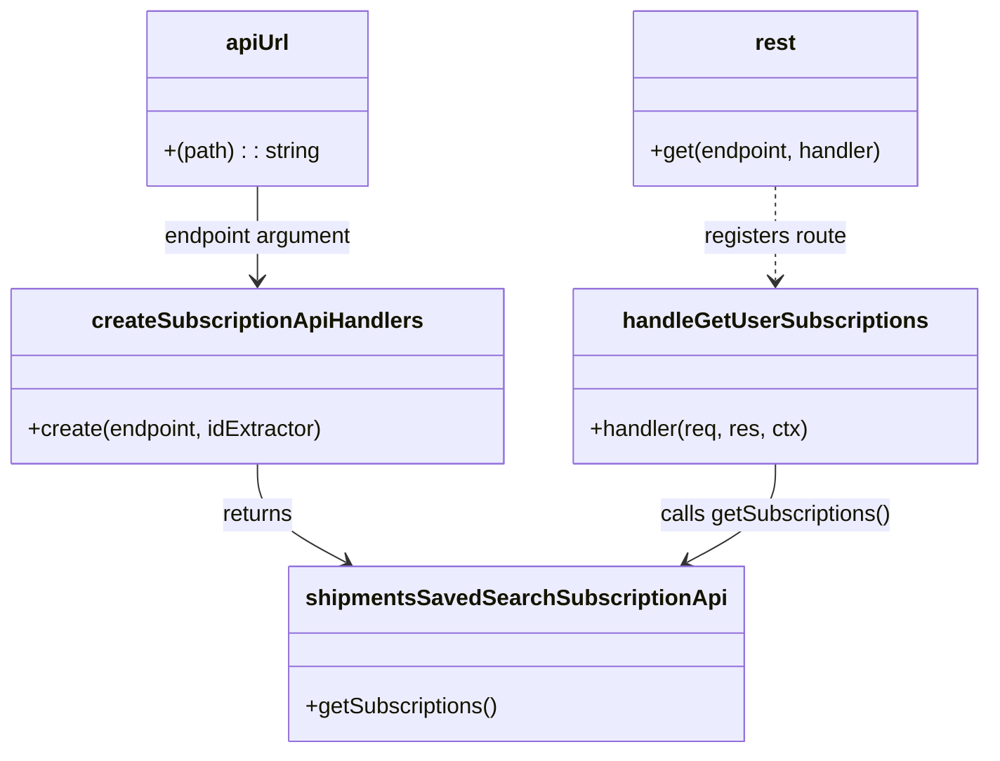

# Diagram: web/portal/src/mocks/handlers/preferences-ng/saved-search-subscription.js


> Auto-generated by Obscura crawlers

## Diagram 1

```mermaid
flowchart TD
  Client[Client] -->|GET| Request[GET /preferences-ng/saved_search/subscription]
  Request --> Handler[msw rest.get handler<br/>(handleGetUserSubscriptions)]
  Handler --> Parse[Parse query params<br/>(email, sourceService, type)]
  Parse --> GetSubs[shipmentsSavedSearchSubscriptionApi.getSubscriptions()]
  GetSubs --> Filter[Filter by email, source_service, type]
  Filter --> Check{filtered.length > 0?}
  Check -- Yes --> Map[Map subscriptions:<br/>id = reference_id<br/>subscribed = true]
  Map --> Respond[res(ctx.json(filteredSubscriptions))]
  Check -- No --> RespondEmpty[res(ctx.json([]))]
  Respond --> ClientRecv[Client receives JSON]
  RespondEmpty --> ClientRecv
```

> SVG rendering failed for this diagram.

## Diagram 2



### SVG

<svg id="container" width="707.6953125" xmlns="http://www.w3.org/2000/svg" class="classDiagram" height="542" viewBox="0 0 707.6953125 542" role="graphics-document document" aria-roledescription="class"><style>#container{font-family:"trebuchet ms",verdana,arial,sans-serif;font-size:16px;fill:#333;}@keyframes edge-animation-frame{from{stroke-dashoffset:0;}}@keyframes dash{to{stroke-dashoffset:0;}}#container .edge-animation-slow{stroke-dasharray:9,5!important;stroke-dashoffset:900;animation:dash 50s linear infinite;stroke-linecap:round;}#container .edge-animation-fast{stroke-dasharray:9,5!important;stroke-dashoffset:900;animation:dash 20s linear infinite;stroke-linecap:round;}#container .error-icon{fill:#552222;}#container .error-text{fill:#552222;stroke:#552222;}#container .edge-thickness-normal{stroke-width:1px;}#container .edge-thickness-thick{stroke-width:3.5px;}#container .edge-pattern-solid{stroke-dasharray:0;}#container .edge-thickness-invisible{stroke-width:0;fill:none;}#container .edge-pattern-dashed{stroke-dasharray:3;}#container .edge-pattern-dotted{stroke-dasharray:2;}#container .marker{fill:#333333;stroke:#333333;}#container .marker.cross{stroke:#333333;}#container svg{font-family:"trebuchet ms",verdana,arial,sans-serif;font-size:16px;}#container p{margin:0;}#container g.classGroup text{fill:#9370DB;stroke:none;font-family:"trebuchet ms",verdana,arial,sans-serif;font-size:10px;}#container g.classGroup text .title{font-weight:bolder;}#container .nodeLabel,#container .edgeLabel{color:#131300;}#container .edgeLabel .label rect{fill:#ECECFF;}#container .label text{fill:#131300;}#container .labelBkg{background:#ECECFF;}#container .edgeLabel .label span{background:#ECECFF;}#container .classTitle{font-weight:bolder;}#container .node rect,#container .node circle,#container .node ellipse,#container .node polygon,#container .node path{fill:#ECECFF;stroke:#9370DB;stroke-width:1px;}#container .divider{stroke:#9370DB;stroke-width:1;}#container g.clickable{cursor:pointer;}#container g.classGroup rect{fill:#ECECFF;stroke:#9370DB;}#container g.classGroup line{stroke:#9370DB;stroke-width:1;}#container .classLabel .box{stroke:none;stroke-width:0;fill:#ECECFF;opacity:0.5;}#container .classLabel .label{fill:#9370DB;font-size:10px;}#container .relation{stroke:#333333;stroke-width:1;fill:none;}#container .dashed-line{stroke-dasharray:3;}#container .dotted-line{stroke-dasharray:1 2;}#container #compositionStart,#container .composition{fill:#333333!important;stroke:#333333!important;stroke-width:1;}#container #compositionEnd,#container .composition{fill:#333333!important;stroke:#333333!important;stroke-width:1;}#container #dependencyStart,#container .dependency{fill:#333333!important;stroke:#333333!important;stroke-width:1;}#container #dependencyStart,#container .dependency{fill:#333333!important;stroke:#333333!important;stroke-width:1;}#container #extensionStart,#container .extension{fill:transparent!important;stroke:#333333!important;stroke-width:1;}#container #extensionEnd,#container .extension{fill:transparent!important;stroke:#333333!important;stroke-width:1;}#container #aggregationStart,#container .aggregation{fill:transparent!important;stroke:#333333!important;stroke-width:1;}#container #aggregationEnd,#container .aggregation{fill:transparent!important;stroke:#333333!important;stroke-width:1;}#container #lollipopStart,#container .lollipop{fill:#ECECFF!important;stroke:#333333!important;stroke-width:1;}#container #lollipopEnd,#container .lollipop{fill:#ECECFF!important;stroke:#333333!important;stroke-width:1;}#container .edgeTerminals{font-size:11px;line-height:initial;}#container .classTitleText{text-anchor:middle;font-size:18px;fill:#333;}#container .label-icon{display:inline-block;height:1em;overflow:visible;vertical-align:-0.125em;}#container .node .label-icon path{fill:currentColor;stroke:revert;stroke-width:revert;}#container :root{--mermaid-font-family:"trebuchet ms",verdana,arial,sans-serif;}</style><g><defs><marker id="container_class-aggregationStart" class="marker aggregation class" refX="18" refY="7" markerWidth="190" markerHeight="240" orient="auto"><path d="M 18,7 L9,13 L1,7 L9,1 Z"></path></marker></defs><defs><marker id="container_class-aggregationEnd" class="marker aggregation class" refX="1" refY="7" markerWidth="20" markerHeight="28" orient="auto"><path d="M 18,7 L9,13 L1,7 L9,1 Z"></path></marker></defs><defs><marker id="container_class-extensionStart" class="marker extension class" refX="18" refY="7" markerWidth="190" markerHeight="240" orient="auto"><path d="M 1,7 L18,13 V 1 Z"></path></marker></defs><defs><marker id="container_class-extensionEnd" class="marker extension class" refX="1" refY="7" markerWidth="20" markerHeight="28" orient="auto"><path d="M 1,1 V 13 L18,7 Z"></path></marker></defs><defs><marker id="container_class-compositionStart" class="marker composition class" refX="18" refY="7" markerWidth="190" markerHeight="240" orient="auto"><path d="M 18,7 L9,13 L1,7 L9,1 Z"></path></marker></defs><defs><marker id="container_class-compositionEnd" class="marker composition class" refX="1" refY="7" markerWidth="20" markerHeight="28" orient="auto"><path d="M 18,7 L9,13 L1,7 L9,1 Z"></path></marker></defs><defs><marker id="container_class-dependencyStart" class="marker dependency class" refX="6" refY="7" markerWidth="190" markerHeight="240" orient="auto"><path d="M 5,7 L9,13 L1,7 L9,1 Z"></path></marker></defs><defs><marker id="container_class-dependencyEnd" class="marker dependency class" refX="13" refY="7" markerWidth="20" markerHeight="28" orient="auto"><path d="M 18,7 L9,13 L14,7 L9,1 Z"></path></marker></defs><defs><marker id="container_class-lollipopStart" class="marker lollipop class" refX="13" refY="7" markerWidth="190" markerHeight="240" orient="auto"><circle stroke="black" fill="transparent" cx="7" cy="7" r="6"></circle></marker></defs><defs><marker id="container_class-lollipopEnd" class="marker lollipop class" refX="1" refY="7" markerWidth="190" markerHeight="240" orient="auto"><circle stroke="black" fill="transparent" cx="7" cy="7" r="6"></circle></marker></defs><g class="root"><g class="clusters"></g><g class="edgePaths"><path d="M185.367,334L185.367,340.167C185.367,346.333,185.367,358.667,195.921,370.525C206.476,382.384,227.584,393.768,238.139,399.46L248.693,405.152" id="id_createSubscriptionApiHandlers_shipmentsSavedSearchSubscriptionApi_1" class="edge-thickness-normal edge-pattern-solid relation" style=";;;" data-edge="true" data-et="edge" data-id="id_createSubscriptionApiHandlers_shipmentsSavedSearchSubscriptionApi_1" data-points="W3sieCI6MTg1LjM2NzE4NzUsInkiOjMzNH0seyJ4IjoxODUuMzY3MTg3NSwieSI6MzcxfSx7IngiOjI1My45NzQwMDM5MDYyNSwieSI6NDA4fV0=" marker-end="url(#container_class-dependencyEnd)"></path><path d="M185.367,134L185.367,140.167C185.367,146.333,185.367,158.667,185.367,170C185.367,181.333,185.367,191.667,185.367,196.833L185.367,202" id="id_apiUrl_createSubscriptionApiHandlers_2" class="edge-thickness-normal edge-pattern-solid relation" style=";;;" data-edge="true" data-et="edge" data-id="id_apiUrl_createSubscriptionApiHandlers_2" data-points="W3sieCI6MTg1LjM2NzE4NzUsInkiOjEzNH0seyJ4IjoxODUuMzY3MTg3NSwieSI6MTcxfSx7IngiOjE4NS4zNjcxODc1LCJ5IjoyMDh9XQ==" marker-end="url(#container_class-dependencyEnd)"></path><path d="M556.215,134L556.215,140.167C556.215,146.333,556.215,158.667,556.215,170C556.215,181.333,556.215,191.667,556.215,196.833L556.215,202" id="id_rest_handleGetUserSubscriptions_3" class="edge-thickness-normal edge-pattern-dashed relation" style=";;;" data-edge="true" data-et="edge" data-id="id_rest_handleGetUserSubscriptions_3" data-points="W3sieCI6NTU2LjIxNDg0Mzc1LCJ5IjoxMzR9LHsieCI6NTU2LjIxNDg0Mzc1LCJ5IjoxNzF9LHsieCI6NTU2LjIxNDg0Mzc1LCJ5IjoyMDh9XQ==" marker-end="url(#container_class-dependencyEnd)"></path><path d="M556.215,334L556.215,340.167C556.215,346.333,556.215,358.667,545.661,370.525C535.106,382.384,513.998,393.768,503.443,399.46L492.889,405.152" id="id_handleGetUserSubscriptions_shipmentsSavedSearchSubscriptionApi_4" class="edge-thickness-normal edge-pattern-solid relation" style=";;;" data-edge="true" data-et="edge" data-id="id_handleGetUserSubscriptions_shipmentsSavedSearchSubscriptionApi_4" data-points="W3sieCI6NTU2LjIxNDg0Mzc1LCJ5IjozMzR9LHsieCI6NTU2LjIxNDg0Mzc1LCJ5IjozNzF9LHsieCI6NDg3LjYwODAyNzM0Mzc1LCJ5Ijo0MDh9XQ==" marker-end="url(#container_class-dependencyEnd)"></path></g><g class="edgeLabels"><g class="edgeLabel" transform="translate(185.3671875, 371)"><g class="label" data-id="id_createSubscriptionApiHandlers_shipmentsSavedSearchSubscriptionApi_1" transform="translate(-26.265625, -12)"><foreignObject width="52.53125" height="24"><div xmlns="http://www.w3.org/1999/xhtml" class="labelBkg" style="display: table-cell; white-space: nowrap; line-height: 1.5; max-width: 200px; text-align: center;"><span class="edgeLabel"><p>returns</p></span></div></foreignObject></g></g><g class="edgeLabel" transform="translate(185.3671875, 171)"><g class="label" data-id="id_apiUrl_createSubscriptionApiHandlers_2" transform="translate(-70.0625, -12)"><foreignObject width="140.125" height="24"><div xmlns="http://www.w3.org/1999/xhtml" class="labelBkg" style="display: table-cell; white-space: nowrap; line-height: 1.5; max-width: 200px; text-align: center;"><span class="edgeLabel"><p>endpoint argument</p></span></div></foreignObject></g></g><g class="edgeLabel" transform="translate(556.21484375, 171)"><g class="label" data-id="id_rest_handleGetUserSubscriptions_3" transform="translate(-52.6171875, -12)"><foreignObject width="105.234375" height="24"><div xmlns="http://www.w3.org/1999/xhtml" class="labelBkg" style="display: table-cell; white-space: nowrap; line-height: 1.5; max-width: 200px; text-align: center;"><span class="edgeLabel"><p>registers route</p></span></div></foreignObject></g></g><g class="edgeLabel" transform="translate(556.21484375, 371)"><g class="label" data-id="id_handleGetUserSubscriptions_shipmentsSavedSearchSubscriptionApi_4" transform="translate(-84.6953125, -12)"><foreignObject width="169.390625" height="24"><div xmlns="http://www.w3.org/1999/xhtml" class="labelBkg" style="display: table-cell; white-space: nowrap; line-height: 1.5; max-width: 200px; text-align: center;"><span class="edgeLabel"><p>calls getSubscriptions()</p></span></div></foreignObject></g></g></g><g class="nodes"><g class="node default" id="classId-createSubscriptionApiHandlers-0" transform="translate(185.3671875, 271)"><g class="basic label-container"><path d="M-177.3671875 -63 L177.3671875 -63 L177.3671875 63 L-177.3671875 63" stroke="none" stroke-width="0" fill="#ECECFF" style=""></path><path d="M-177.3671875 -63 C-75.11925870325132 -63, 27.128670093497362 -63, 177.3671875 -63 M-177.3671875 -63 C-93.10564475178673 -63, -8.844102003573454 -63, 177.3671875 -63 M177.3671875 -63 C177.3671875 -23.132865409427033, 177.3671875 16.734269181145933, 177.3671875 63 M177.3671875 -63 C177.3671875 -23.66158748213823, 177.3671875 15.676825035723539, 177.3671875 63 M177.3671875 63 C69.73829029312147 63, -37.89060691375707 63, -177.3671875 63 M177.3671875 63 C74.17697027160061 63, -29.01324695679878 63, -177.3671875 63 M-177.3671875 63 C-177.3671875 30.146092265909182, -177.3671875 -2.7078154681816358, -177.3671875 -63 M-177.3671875 63 C-177.3671875 21.897161330529485, -177.3671875 -19.20567733894103, -177.3671875 -63" stroke="#9370DB" stroke-width="1.3" fill="none" stroke-dasharray="0 0" style=""></path></g><g class="annotation-group text" transform="translate(0, -39)"></g><g class="label-group text" transform="translate(-113.984375, -39)"><g class="label" style="font-weight: bolder" transform="translate(0,-12)"><foreignObject width="227.96875" height="24"><div xmlns="http://www.w3.org/1999/xhtml" style="display: table-cell; white-space: nowrap; line-height: 1.5; max-width: 275px; text-align: center;"><span class="nodeLabel markdown-node-label" style=""><p>createSubscriptionApiHandlers</p></span></div></foreignObject></g></g><g class="members-group text" transform="translate(-165.3671875, 9)"></g><g class="methods-group text" transform="translate(-165.3671875, 39)"><g class="label" style="" transform="translate(0,-12)"><foreignObject width="216.75" height="24"><div xmlns="http://www.w3.org/1999/xhtml" style="display: table-cell; white-space: nowrap; line-height: 1.5; max-width: 274px; text-align: center;"><span class="nodeLabel markdown-node-label" style=""><p>+create(endpoint, idExtractor)</p></span></div></foreignObject></g></g><g class="divider" style=""><path d="M-177.3671875 -15 C-41.36668823028015 -15, 94.6338110394397 -15, 177.3671875 -15 M-177.3671875 -15 C-50.56967555751608 -15, 76.22783638496784 -15, 177.3671875 -15" stroke="#9370DB" stroke-width="1.3" fill="none" stroke-dasharray="0 0" style=""></path></g><g class="divider" style=""><path d="M-177.3671875 9 C-76.67519728553263 9, 24.016792928934734 9, 177.3671875 9 M-177.3671875 9 C-48.84499650776553 9, 79.67719448446894 9, 177.3671875 9" stroke="#9370DB" stroke-width="1.3" fill="none" stroke-dasharray="0 0" style=""></path></g></g><g class="node default" id="classId-shipmentsSavedSearchSubscriptionApi-1" transform="translate(370.791015625, 471)"><g class="basic label-container"><path d="M-155.3125 -63 L155.3125 -63 L155.3125 63 L-155.3125 63" stroke="none" stroke-width="0" fill="#ECECFF" style=""></path><path d="M-155.3125 -63 C-89.76187152578632 -63, -24.211243051572637 -63, 155.3125 -63 M-155.3125 -63 C-81.09441702608596 -63, -6.876334052171927 -63, 155.3125 -63 M155.3125 -63 C155.3125 -16.700522638057812, 155.3125 29.598954723884376, 155.3125 63 M155.3125 -63 C155.3125 -29.465359462093346, 155.3125 4.069281075813308, 155.3125 63 M155.3125 63 C39.603818872164354 63, -76.10486225567129 63, -155.3125 63 M155.3125 63 C33.19161115184045 63, -88.9292776963191 63, -155.3125 63 M-155.3125 63 C-155.3125 34.88583569447383, -155.3125 6.7716713889476665, -155.3125 -63 M-155.3125 63 C-155.3125 24.275603073875466, -155.3125 -14.448793852249068, -155.3125 -63" stroke="#9370DB" stroke-width="1.3" fill="none" stroke-dasharray="0 0" style=""></path></g><g class="annotation-group text" transform="translate(0, -39)"></g><g class="label-group text" transform="translate(-143.3125, -39)"><g class="label" style="font-weight: bolder" transform="translate(0,-12)"><foreignObject width="286.625" height="24"><div xmlns="http://www.w3.org/1999/xhtml" style="display: table-cell; white-space: nowrap; line-height: 1.5; max-width: 333px; text-align: center;"><span class="nodeLabel markdown-node-label" style=""><p>shipmentsSavedSearchSubscriptionApi</p></span></div></foreignObject></g></g><g class="members-group text" transform="translate(-143.3125, 9)"></g><g class="methods-group text" transform="translate(-143.3125, 39)"><g class="label" style="" transform="translate(0,-12)"><foreignObject width="140.25" height="24"><div xmlns="http://www.w3.org/1999/xhtml" style="display: table-cell; white-space: nowrap; line-height: 1.5; max-width: 198px; text-align: center;"><span class="nodeLabel markdown-node-label" style=""><p>+getSubscriptions()</p></span></div></foreignObject></g></g><g class="divider" style=""><path d="M-155.3125 -15 C-83.85157364209266 -15, -12.39064728418532 -15, 155.3125 -15 M-155.3125 -15 C-35.587551953462324 -15, 84.13739609307535 -15, 155.3125 -15" stroke="#9370DB" stroke-width="1.3" fill="none" stroke-dasharray="0 0" style=""></path></g><g class="divider" style=""><path d="M-155.3125 9 C-87.24004244152884 9, -19.167584883057685 9, 155.3125 9 M-155.3125 9 C-42.215082380987326 9, 70.88233523802535 9, 155.3125 9" stroke="#9370DB" stroke-width="1.3" fill="none" stroke-dasharray="0 0" style=""></path></g></g><g class="node default" id="classId-handleGetUserSubscriptions-2" transform="translate(556.21484375, 271)"><g class="basic label-container"><path d="M-143.48046875 -63 L143.48046875 -63 L143.48046875 63 L-143.48046875 63" stroke="none" stroke-width="0" fill="#ECECFF" style=""></path><path d="M-143.48046875 -63 C-28.99462032235799 -63, 85.49122810528402 -63, 143.48046875 -63 M-143.48046875 -63 C-63.28294612406998 -63, 16.91457650186004 -63, 143.48046875 -63 M143.48046875 -63 C143.48046875 -16.467229287199352, 143.48046875 30.065541425601296, 143.48046875 63 M143.48046875 -63 C143.48046875 -25.029573174800426, 143.48046875 12.940853650399148, 143.48046875 63 M143.48046875 63 C36.01882198502807 63, -71.44282477994386 63, -143.48046875 63 M143.48046875 63 C70.27920237479563 63, -2.9220640004087386 63, -143.48046875 63 M-143.48046875 63 C-143.48046875 14.840694235226458, -143.48046875 -33.318611529547084, -143.48046875 -63 M-143.48046875 63 C-143.48046875 24.495144739068174, -143.48046875 -14.009710521863653, -143.48046875 -63" stroke="#9370DB" stroke-width="1.3" fill="none" stroke-dasharray="0 0" style=""></path></g><g class="annotation-group text" transform="translate(0, -39)"></g><g class="label-group text" transform="translate(-104.8515625, -39)"><g class="label" style="font-weight: bolder" transform="translate(0,-12)"><foreignObject width="209.703125" height="24"><div xmlns="http://www.w3.org/1999/xhtml" style="display: table-cell; white-space: nowrap; line-height: 1.5; max-width: 257px; text-align: center;"><span class="nodeLabel markdown-node-label" style=""><p>handleGetUserSubscriptions</p></span></div></foreignObject></g></g><g class="members-group text" transform="translate(-131.48046875, 9)"></g><g class="methods-group text" transform="translate(-131.48046875, 39)"><g class="label" style="" transform="translate(0,-12)"><foreignObject width="158.109375" height="24"><div xmlns="http://www.w3.org/1999/xhtml" style="display: table-cell; white-space: nowrap; line-height: 1.5; max-width: 215px; text-align: center;"><span class="nodeLabel markdown-node-label" style=""><p>+handler(req, res, ctx)</p></span></div></foreignObject></g></g><g class="divider" style=""><path d="M-143.48046875 -15 C-35.13547278910585 -15, 73.2095231717883 -15, 143.48046875 -15 M-143.48046875 -15 C-68.63330396940238 -15, 6.2138608111952465 -15, 143.48046875 -15" stroke="#9370DB" stroke-width="1.3" fill="none" stroke-dasharray="0 0" style=""></path></g><g class="divider" style=""><path d="M-143.48046875 9 C-76.90549691217853 9, -10.33052507435707 9, 143.48046875 9 M-143.48046875 9 C-50.722419006530274 9, 42.03563073693945 9, 143.48046875 9" stroke="#9370DB" stroke-width="1.3" fill="none" stroke-dasharray="0 0" style=""></path></g></g><g class="node default" id="classId-rest-3" transform="translate(556.21484375, 71)"><g class="basic label-container"><path d="M-105.0546875 -63 L105.0546875 -63 L105.0546875 63 L-105.0546875 63" stroke="none" stroke-width="0" fill="#ECECFF" style=""></path><path d="M-105.0546875 -63 C-48.17088464360386 -63, 8.712918212792275 -63, 105.0546875 -63 M-105.0546875 -63 C-30.5740360522107 -63, 43.9066153955786 -63, 105.0546875 -63 M105.0546875 -63 C105.0546875 -19.614217312405984, 105.0546875 23.771565375188032, 105.0546875 63 M105.0546875 -63 C105.0546875 -27.912887811662074, 105.0546875 7.174224376675852, 105.0546875 63 M105.0546875 63 C51.09999374681576 63, -2.854700006368475 63, -105.0546875 63 M105.0546875 63 C43.93699553324173 63, -17.180696433516545 63, -105.0546875 63 M-105.0546875 63 C-105.0546875 32.5449591539474, -105.0546875 2.0899183078947985, -105.0546875 -63 M-105.0546875 63 C-105.0546875 18.615342647724177, -105.0546875 -25.769314704551647, -105.0546875 -63" stroke="#9370DB" stroke-width="1.3" fill="none" stroke-dasharray="0 0" style=""></path></g><g class="annotation-group text" transform="translate(0, -39)"></g><g class="label-group text" transform="translate(-14.34375, -39)"><g class="label" style="font-weight: bolder" transform="translate(0,-12)"><foreignObject width="28.6875" height="24"><div xmlns="http://www.w3.org/1999/xhtml" style="display: table-cell; white-space: nowrap; line-height: 1.5; max-width: 78px; text-align: center;"><span class="nodeLabel markdown-node-label" style=""><p>rest</p></span></div></foreignObject></g></g><g class="members-group text" transform="translate(-93.0546875, 9)"></g><g class="methods-group text" transform="translate(-93.0546875, 39)"><g class="label" style="" transform="translate(0,-12)"><foreignObject width="171.765625" height="24"><div xmlns="http://www.w3.org/1999/xhtml" style="display: table-cell; white-space: nowrap; line-height: 1.5; max-width: 229px; text-align: center;"><span class="nodeLabel markdown-node-label" style=""><p>+get(endpoint, handler)</p></span></div></foreignObject></g></g><g class="divider" style=""><path d="M-105.0546875 -15 C-21.99725331473863 -15, 61.06018087052274 -15, 105.0546875 -15 M-105.0546875 -15 C-29.039587372888022 -15, 46.975512754223956 -15, 105.0546875 -15" stroke="#9370DB" stroke-width="1.3" fill="none" stroke-dasharray="0 0" style=""></path></g><g class="divider" style=""><path d="M-105.0546875 9 C-60.03523028954543 9, -15.015773079090863 9, 105.0546875 9 M-105.0546875 9 C-56.7543366949115 9, -8.453985889823002 9, 105.0546875 9" stroke="#9370DB" stroke-width="1.3" fill="none" stroke-dasharray="0 0" style=""></path></g></g><g class="node default" id="classId-apiUrl-4" transform="translate(185.3671875, 71)"><g class="basic label-container"><path d="M-79.90234375 -63 L79.90234375 -63 L79.90234375 63 L-79.90234375 63" stroke="none" stroke-width="0" fill="#ECECFF" style=""></path><path d="M-79.90234375 -63 C-24.871364750061886 -63, 30.159614249876228 -63, 79.90234375 -63 M-79.90234375 -63 C-35.79833789626088 -63, 8.305667957478235 -63, 79.90234375 -63 M79.90234375 -63 C79.90234375 -31.844329099767812, 79.90234375 -0.6886581995356238, 79.90234375 63 M79.90234375 -63 C79.90234375 -17.747265382673262, 79.90234375 27.505469234653475, 79.90234375 63 M79.90234375 63 C35.0841029984122 63, -9.734137753175602 63, -79.90234375 63 M79.90234375 63 C43.508724611294255 63, 7.11510547258851 63, -79.90234375 63 M-79.90234375 63 C-79.90234375 28.920353319289504, -79.90234375 -5.159293361420993, -79.90234375 -63 M-79.90234375 63 C-79.90234375 14.21715077613618, -79.90234375 -34.56569844772764, -79.90234375 -63" stroke="#9370DB" stroke-width="1.3" fill="none" stroke-dasharray="0 0" style=""></path></g><g class="annotation-group text" transform="translate(0, -39)"></g><g class="label-group text" transform="translate(-22.2109375, -39)"><g class="label" style="font-weight: bolder" transform="translate(0,-12)"><foreignObject width="44.421875" height="24"><div xmlns="http://www.w3.org/1999/xhtml" style="display: table-cell; white-space: nowrap; line-height: 1.5; max-width: 94px; text-align: center;"><span class="nodeLabel markdown-node-label" style=""><p>apiUrl</p></span></div></foreignObject></g></g><g class="members-group text" transform="translate(-67.90234375, 9)"></g><g class="methods-group text" transform="translate(-67.90234375, 39)"><g class="label" style="" transform="translate(0,-12)"><foreignObject width="113.59375" height="24"><div xmlns="http://www.w3.org/1999/xhtml" style="display: table-cell; white-space: nowrap; line-height: 1.5; max-width: 164px; text-align: center;"><span class="nodeLabel markdown-node-label" style=""><p>+(path) : : string</p></span></div></foreignObject></g></g><g class="divider" style=""><path d="M-79.90234375 -15 C-46.22763217659327 -15, -12.552920603186536 -15, 79.90234375 -15 M-79.90234375 -15 C-22.842357504506936 -15, 34.21762874098613 -15, 79.90234375 -15" stroke="#9370DB" stroke-width="1.3" fill="none" stroke-dasharray="0 0" style=""></path></g><g class="divider" style=""><path d="M-79.90234375 9 C-38.79431635945775 9, 2.3137110310844946 9, 79.90234375 9 M-79.90234375 9 C-22.311627852585055 9, 35.27908804482989 9, 79.90234375 9" stroke="#9370DB" stroke-width="1.3" fill="none" stroke-dasharray="0 0" style=""></path></g></g></g></g></g></svg>
