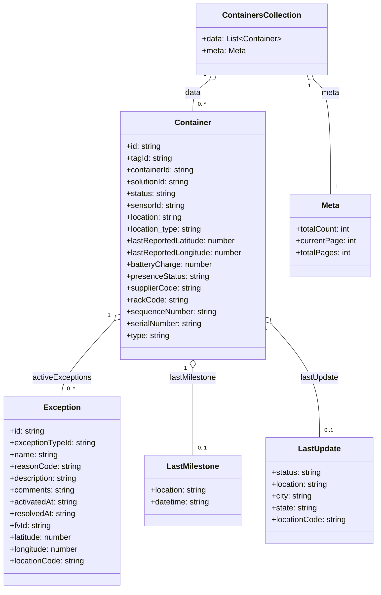

# Diagram: web/portal/src/mocks/handlers/reuse-trip-container-search/container.js


> Auto-generated by Obscura crawlers

## Diagram 1

```mermaid
flowchart TD
  Client[Client] -->|GET| API[/containertracking/api/reuse-trip-container-search/container]
  API --> Handler[rest.get handler: handleContainerTrackingSearch]
  Handler --> ResponseBody[responseBody = containers]
  Handler -->|res(ctx.json(responseBody))| Response[JSON Response]
  Response --> ContainersVar[(containers)]
```

> SVG rendering failed for this diagram.

## Diagram 2



### SVG

<svg id="container" width="769.15625" xmlns="http://www.w3.org/2000/svg" class="classDiagram" height="1196" viewBox="0 0 769.15625 1196" role="graphics-document document" aria-roledescription="class"><style>#container{font-family:"trebuchet ms",verdana,arial,sans-serif;font-size:16px;fill:#333;}@keyframes edge-animation-frame{from{stroke-dashoffset:0;}}@keyframes dash{to{stroke-dashoffset:0;}}#container .edge-animation-slow{stroke-dasharray:9,5!important;stroke-dashoffset:900;animation:dash 50s linear infinite;stroke-linecap:round;}#container .edge-animation-fast{stroke-dasharray:9,5!important;stroke-dashoffset:900;animation:dash 20s linear infinite;stroke-linecap:round;}#container .error-icon{fill:#552222;}#container .error-text{fill:#552222;stroke:#552222;}#container .edge-thickness-normal{stroke-width:1px;}#container .edge-thickness-thick{stroke-width:3.5px;}#container .edge-pattern-solid{stroke-dasharray:0;}#container .edge-thickness-invisible{stroke-width:0;fill:none;}#container .edge-pattern-dashed{stroke-dasharray:3;}#container .edge-pattern-dotted{stroke-dasharray:2;}#container .marker{fill:#333333;stroke:#333333;}#container .marker.cross{stroke:#333333;}#container svg{font-family:"trebuchet ms",verdana,arial,sans-serif;font-size:16px;}#container p{margin:0;}#container g.classGroup text{fill:#9370DB;stroke:none;font-family:"trebuchet ms",verdana,arial,sans-serif;font-size:10px;}#container g.classGroup text .title{font-weight:bolder;}#container .nodeLabel,#container .edgeLabel{color:#131300;}#container .edgeLabel .label rect{fill:#ECECFF;}#container .label text{fill:#131300;}#container .labelBkg{background:#ECECFF;}#container .edgeLabel .label span{background:#ECECFF;}#container .classTitle{font-weight:bolder;}#container .node rect,#container .node circle,#container .node ellipse,#container .node polygon,#container .node path{fill:#ECECFF;stroke:#9370DB;stroke-width:1px;}#container .divider{stroke:#9370DB;stroke-width:1;}#container g.clickable{cursor:pointer;}#container g.classGroup rect{fill:#ECECFF;stroke:#9370DB;}#container g.classGroup line{stroke:#9370DB;stroke-width:1;}#container .classLabel .box{stroke:none;stroke-width:0;fill:#ECECFF;opacity:0.5;}#container .classLabel .label{fill:#9370DB;font-size:10px;}#container .relation{stroke:#333333;stroke-width:1;fill:none;}#container .dashed-line{stroke-dasharray:3;}#container .dotted-line{stroke-dasharray:1 2;}#container #compositionStart,#container .composition{fill:#333333!important;stroke:#333333!important;stroke-width:1;}#container #compositionEnd,#container .composition{fill:#333333!important;stroke:#333333!important;stroke-width:1;}#container #dependencyStart,#container .dependency{fill:#333333!important;stroke:#333333!important;stroke-width:1;}#container #dependencyStart,#container .dependency{fill:#333333!important;stroke:#333333!important;stroke-width:1;}#container #extensionStart,#container .extension{fill:transparent!important;stroke:#333333!important;stroke-width:1;}#container #extensionEnd,#container .extension{fill:transparent!important;stroke:#333333!important;stroke-width:1;}#container #aggregationStart,#container .aggregation{fill:transparent!important;stroke:#333333!important;stroke-width:1;}#container #aggregationEnd,#container .aggregation{fill:transparent!important;stroke:#333333!important;stroke-width:1;}#container #lollipopStart,#container .lollipop{fill:#ECECFF!important;stroke:#333333!important;stroke-width:1;}#container #lollipopEnd,#container .lollipop{fill:#ECECFF!important;stroke:#333333!important;stroke-width:1;}#container .edgeTerminals{font-size:11px;line-height:initial;}#container .classTitleText{text-anchor:middle;font-size:18px;fill:#333;}#container .label-icon{display:inline-block;height:1em;overflow:visible;vertical-align:-0.125em;}#container .node .label-icon path{fill:currentColor;stroke:revert;stroke-width:revert;}#container :root{--mermaid-font-family:"trebuchet ms",verdana,arial,sans-serif;}</style><g><defs><marker id="container_class-aggregationStart" class="marker aggregation class" refX="18" refY="7" markerWidth="190" markerHeight="240" orient="auto"><path d="M 18,7 L9,13 L1,7 L9,1 Z"></path></marker></defs><defs><marker id="container_class-aggregationEnd" class="marker aggregation class" refX="1" refY="7" markerWidth="20" markerHeight="28" orient="auto"><path d="M 18,7 L9,13 L1,7 L9,1 Z"></path></marker></defs><defs><marker id="container_class-extensionStart" class="marker extension class" refX="18" refY="7" markerWidth="190" markerHeight="240" orient="auto"><path d="M 1,7 L18,13 V 1 Z"></path></marker></defs><defs><marker id="container_class-extensionEnd" class="marker extension class" refX="1" refY="7" markerWidth="20" markerHeight="28" orient="auto"><path d="M 1,1 V 13 L18,7 Z"></path></marker></defs><defs><marker id="container_class-compositionStart" class="marker composition class" refX="18" refY="7" markerWidth="190" markerHeight="240" orient="auto"><path d="M 18,7 L9,13 L1,7 L9,1 Z"></path></marker></defs><defs><marker id="container_class-compositionEnd" class="marker composition class" refX="1" refY="7" markerWidth="20" markerHeight="28" orient="auto"><path d="M 18,7 L9,13 L1,7 L9,1 Z"></path></marker></defs><defs><marker id="container_class-dependencyStart" class="marker dependency class" refX="6" refY="7" markerWidth="190" markerHeight="240" orient="auto"><path d="M 5,7 L9,13 L1,7 L9,1 Z"></path></marker></defs><defs><marker id="container_class-dependencyEnd" class="marker dependency class" refX="13" refY="7" markerWidth="20" markerHeight="28" orient="auto"><path d="M 18,7 L9,13 L14,7 L9,1 Z"></path></marker></defs><defs><marker id="container_class-lollipopStart" class="marker lollipop class" refX="13" refY="7" markerWidth="190" markerHeight="240" orient="auto"><circle stroke="black" fill="transparent" cx="7" cy="7" r="6"></circle></marker></defs><defs><marker id="container_class-lollipopEnd" class="marker lollipop class" refX="1" refY="7" markerWidth="190" markerHeight="240" orient="auto"><circle stroke="black" fill="transparent" cx="7" cy="7" r="6"></circle></marker></defs><g class="root"><g class="clusters"></g><g class="edgePaths"><path d="M427.296,162.568L421.613,166.973C415.929,171.379,404.562,180.189,398.879,190.761C393.195,201.333,393.195,213.667,393.195,219.833L393.195,226" id="id_ContainersCollection_Container_1" class="edge-thickness-normal edge-pattern-solid relation" style=";;;" data-edge="true" data-et="edge" data-id="id_ContainersCollection_Container_1" data-points="W3sieCI6NDQwLjkzMDQwNDI0MzExOTI2LCJ5IjoxNTJ9LHsieCI6MzkzLjE5NTMxMjUsInkiOjE4OX0seyJ4IjozOTMuMTk1MzEyNSwieSI6MjI2fV0=" marker-start="url(#container_class-aggregationStart)"></path><path d="M232.296,652.086L214.594,671.238C196.892,690.391,161.489,728.695,143.788,754.014C126.086,779.333,126.086,791.667,126.086,797.833L126.086,804" id="id_Container_Exception_2" class="edge-thickness-normal edge-pattern-solid relation" style=";;;" data-edge="true" data-et="edge" data-id="id_Container_Exception_2" data-points="W3sieCI6MjQ0LjAwMzkwNjI1LCJ5Ijo2MzkuNDE4MjA3MDc4MDkzfSx7IngiOjEyNi4wODU5Mzc1LCJ5Ijo3Njd9LHsieCI6MTI2LjA4NTkzNzUsInkiOjgwNH1d" marker-start="url(#container_class-aggregationStart)"></path><path d="M393.195,747.25L393.195,750.542C393.195,753.833,393.195,760.417,393.195,789.875C393.195,819.333,393.195,871.667,393.195,897.833L393.195,924" id="id_Container_LastMilestone_3" class="edge-thickness-normal edge-pattern-solid relation" style=";;;" data-edge="true" data-et="edge" data-id="id_Container_LastMilestone_3" data-points="W3sieCI6MzkzLjE5NTMxMjUsInkiOjczMH0seyJ4IjozOTMuMTk1MzEyNSwieSI6NzY3fSx7IngiOjM5My4xOTUzMTI1LCJ5Ijo5MjR9XQ==" marker-start="url(#container_class-aggregationStart)"></path><path d="M553.887,657.657L570.187,675.881C586.487,694.104,619.087,730.552,635.387,768.943C651.688,807.333,651.688,847.667,651.688,867.833L651.688,888" id="id_Container_LastUpdate_4" class="edge-thickness-normal edge-pattern-solid relation" style=";;;" data-edge="true" data-et="edge" data-id="id_Container_LastUpdate_4" data-points="W3sieCI6NTQyLjM4NjcxODc1LCJ5Ijo2NDQuNzk5MzAxODQwNjAyMX0seyJ4Ijo2NTEuNjg3NSwieSI6NzY3fSx7IngiOjY1MS42ODc1LCJ5Ijo4ODh9XQ==" marker-start="url(#container_class-aggregationStart)"></path><path d="M640.344,162.568L646.028,166.973C651.711,171.379,663.078,180.189,668.762,218.761C674.445,257.333,674.445,325.667,674.445,359.833L674.445,394" id="id_ContainersCollection_Meta_5" class="edge-thickness-normal edge-pattern-solid relation" style=";;;" data-edge="true" data-et="edge" data-id="id_ContainersCollection_Meta_5" data-points="W3sieCI6NjI2LjcxMDIyMDc1Njg4MDcsInkiOjE1Mn0seyJ4Ijo2NzQuNDQ1MzEyNSwieSI6MTg5fSx7IngiOjY3NC40NDUzMTI1LCJ5IjozOTR9XQ==" marker-start="url(#container_class-aggregationStart)"></path></g><g class="edgeLabels"><g class="edgeLabel" transform="translate(393.1953125, 189)"><g class="label" data-id="id_ContainersCollection_Container_1" transform="translate(-16.3203125, -12)"><foreignObject width="32.640625" height="24"><div xmlns="http://www.w3.org/1999/xhtml" class="labelBkg" style="display: table-cell; white-space: nowrap; line-height: 1.5; max-width: 200px; text-align: center;"><span class="edgeLabel"><p>data</p></span></div></foreignObject></g></g><g class="edgeLabel" transform="translate(126.0859375, 767)"><g class="label" data-id="id_Container_Exception_2" transform="translate(-60.6953125, -12)"><foreignObject width="121.390625" height="24"><div xmlns="http://www.w3.org/1999/xhtml" class="labelBkg" style="display: table-cell; white-space: nowrap; line-height: 1.5; max-width: 200px; text-align: center;"><span class="edgeLabel"><p>activeExceptions</p></span></div></foreignObject></g></g><g class="edgeLabel" transform="translate(393.1953125, 767)"><g class="label" data-id="id_Container_LastMilestone_3" transform="translate(-48.5703125, -12)"><foreignObject width="97.140625" height="24"><div xmlns="http://www.w3.org/1999/xhtml" class="labelBkg" style="display: table-cell; white-space: nowrap; line-height: 1.5; max-width: 200px; text-align: center;"><span class="edgeLabel"><p>lastMilestone</p></span></div></foreignObject></g></g><g class="edgeLabel" transform="translate(651.6875, 767)"><g class="label" data-id="id_Container_LastUpdate_4" transform="translate(-39.515625, -12)"><foreignObject width="79.03125" height="24"><div xmlns="http://www.w3.org/1999/xhtml" class="labelBkg" style="display: table-cell; white-space: nowrap; line-height: 1.5; max-width: 200px; text-align: center;"><span class="edgeLabel"><p>lastUpdate</p></span></div></foreignObject></g></g><g class="edgeLabel" transform="translate(674.4453125, 189)"><g class="label" data-id="id_ContainersCollection_Meta_5" transform="translate(-18.40625, -12)"><foreignObject width="36.8125" height="24"><div xmlns="http://www.w3.org/1999/xhtml" class="labelBkg" style="display: table-cell; white-space: nowrap; line-height: 1.5; max-width: 200px; text-align: center;"><span class="edgeLabel"><p>meta</p></span></div></foreignObject></g></g><g class="edgeTerminals" transform="translate(417.9094878962242, 150.86537805217642)"><g class="inner" transform="translate(0, 0)"><foreignObject style="width: 9px; height: 12px;"><div xmlns="http://www.w3.org/1999/xhtml" style="display: inline-block; padding-right: 1px; white-space: nowrap;"><span class="edgeLabel">1</span></div></foreignObject></g></g><g class="edgeTerminals" transform="translate(221.11025218649158, 642.0885219188381)"><g class="inner" transform="translate(0, 0)"><foreignObject style="width: 9px; height: 12px;"><div xmlns="http://www.w3.org/1999/xhtml" style="display: inline-block; padding-right: 1px; white-space: nowrap;"><span class="edgeLabel">1</span></div></foreignObject></g></g><g class="edgeTerminals" transform="translate(378.1953112500001, 747.4999989285715)"><g class="inner" transform="translate(0, 0)"><foreignObject style="width: 9px; height: 12px;"><div xmlns="http://www.w3.org/1999/xhtml" style="display: inline-block; padding-right: 1px; white-space: nowrap;"><span class="edgeLabel">1</span></div></foreignObject></g></g><g class="edgeTerminals" transform="translate(542.8731670159619, 667.8430296485953)"><g class="inner" transform="translate(0, 0)"><foreignObject style="width: 9px; height: 12px;"><div xmlns="http://www.w3.org/1999/xhtml" style="display: inline-block; padding-right: 1px; white-space: nowrap;"><span class="edgeLabel">1</span></div></foreignObject></g></g><g class="edgeTerminals" transform="translate(631.3523421906833, 174.57655275206216)"><g class="inner" transform="translate(0, 0)"><foreignObject style="width: 9px; height: 12px;"><div xmlns="http://www.w3.org/1999/xhtml" style="display: inline-block; padding-right: 1px; white-space: nowrap;"><span class="edgeLabel">1</span></div></foreignObject></g></g><g class="edgeTerminals" transform="translate(403.19531125, 203.49999892857144)"><g class="inner" transform="translate(0, 0)"></g><foreignObject style="width: 36px; height: 12px;"><div xmlns="http://www.w3.org/1999/xhtml" style="display: inline-block; padding-right: 1px; white-space: nowrap;"><span class="edgeLabel">0..*</span></div></foreignObject></g><g class="edgeTerminals" transform="translate(136.08593874999997, 781.5000010714285)"><g class="inner" transform="translate(0, 0)"></g><foreignObject style="width: 36px; height: 12px;"><div xmlns="http://www.w3.org/1999/xhtml" style="display: inline-block; padding-right: 1px; white-space: nowrap;"><span class="edgeLabel">0..*</span></div></foreignObject></g><g class="edgeTerminals" transform="translate(403.19531125, 901.4999989285715)"><g class="inner" transform="translate(0, 0)"></g><foreignObject style="width: 36px; height: 12px;"><div xmlns="http://www.w3.org/1999/xhtml" style="display: inline-block; padding-right: 1px; white-space: nowrap;"><span class="edgeLabel">0..1</span></div></foreignObject></g><g class="edgeTerminals" transform="translate(661.6875, 865.5)"><g class="inner" transform="translate(0, 0)"></g><foreignObject style="width: 36px; height: 12px;"><div xmlns="http://www.w3.org/1999/xhtml" style="display: inline-block; padding-right: 1px; white-space: nowrap;"><span class="edgeLabel">0..1</span></div></foreignObject></g><g class="edgeTerminals" transform="translate(684.44531125, 371.4999989285714)"><g class="inner" transform="translate(0, 0)"></g><foreignObject style="width: 9px; height: 12px;"><div xmlns="http://www.w3.org/1999/xhtml" style="display: inline-block; padding-right: 1px; white-space: nowrap;"><span class="edgeLabel">1</span></div></foreignObject></g></g><g class="nodes"><g class="node default" id="classId-ContainersCollection-0" transform="translate(533.8203125, 80)"><g class="basic label-container"><path d="M-130.515625 -72 L130.515625 -72 L130.515625 72 L-130.515625 72" stroke="none" stroke-width="0" fill="#ECECFF" style=""></path><path d="M-130.515625 -72 C-44.712176986049045 -72, 41.09127102790191 -72, 130.515625 -72 M-130.515625 -72 C-69.40747971744594 -72, -8.299334434891875 -72, 130.515625 -72 M130.515625 -72 C130.515625 -35.62072145743447, 130.515625 0.7585570851310592, 130.515625 72 M130.515625 -72 C130.515625 -27.161607488503442, 130.515625 17.676785022993116, 130.515625 72 M130.515625 72 C62.894964441628986 72, -4.725696116742029 72, -130.515625 72 M130.515625 72 C34.746609218871725 72, -61.02240656225655 72, -130.515625 72 M-130.515625 72 C-130.515625 22.38985763840246, -130.515625 -27.22028472319508, -130.515625 -72 M-130.515625 72 C-130.515625 28.39673446566121, -130.515625 -15.206531068677577, -130.515625 -72" stroke="#9370DB" stroke-width="1.3" fill="none" stroke-dasharray="0 0" style=""></path></g><g class="annotation-group text" transform="translate(0, -48)"></g><g class="label-group text" transform="translate(-76.078125, -48)"><g class="label" style="font-weight: bolder" transform="translate(0,-12)"><foreignObject width="152.15625" height="24"><div xmlns="http://www.w3.org/1999/xhtml" style="display: table-cell; white-space: nowrap; line-height: 1.5; max-width: 200px; text-align: center;"><span class="nodeLabel markdown-node-label" style=""><p>ContainersCollection</p></span></div></foreignObject></g></g><g class="members-group text" transform="translate(-118.515625, 0)"><g class="label" style="" transform="translate(0,-12)"><foreignObject width="160.953125" height="24"><div xmlns="http://www.w3.org/1999/xhtml" style="display: table-cell; white-space: nowrap; line-height: 1.5; max-width: 258px; text-align: center;"><span class="nodeLabel markdown-node-label" style=""><p>+data: List&lt;Container&gt;</p></span></div></foreignObject></g><g class="label" style="" transform="translate(0,12)"><foreignObject width="88.40625" height="24"><div xmlns="http://www.w3.org/1999/xhtml" style="display: table-cell; white-space: nowrap; line-height: 1.5; max-width: 146px; text-align: center;"><span class="nodeLabel markdown-node-label" style=""><p>+meta: Meta</p></span></div></foreignObject></g></g><g class="methods-group text" transform="translate(-118.515625, 72)"></g><g class="divider" style=""><path d="M-130.515625 -24 C-33.52582168131367 -24, 63.463981637372655 -24, 130.515625 -24 M-130.515625 -24 C-54.61137800943516 -24, 21.292868981129686 -24, 130.515625 -24" stroke="#9370DB" stroke-width="1.3" fill="none" stroke-dasharray="0 0" style=""></path></g><g class="divider" style=""><path d="M-130.515625 48 C-57.02481014370022 48, 16.466004712599556 48, 130.515625 48 M-130.515625 48 C-38.91288779964077 48, 52.68984940071846 48, 130.515625 48" stroke="#9370DB" stroke-width="1.3" fill="none" stroke-dasharray="0 0" style=""></path></g></g><g class="node default" id="classId-Container-1" transform="translate(393.1953125, 478)"><g class="basic label-container"><path d="M-149.19140625 -252 L149.19140625 -252 L149.19140625 252 L-149.19140625 252" stroke="none" stroke-width="0" fill="#ECECFF" style=""></path><path d="M-149.19140625 -252 C-66.0562639988885 -252, 17.078878252223006 -252, 149.19140625 -252 M-149.19140625 -252 C-80.05863320055221 -252, -10.925860151104416 -252, 149.19140625 -252 M149.19140625 -252 C149.19140625 -55.494830939784634, 149.19140625 141.01033812043073, 149.19140625 252 M149.19140625 -252 C149.19140625 -112.71404123790549, 149.19140625 26.57191752418902, 149.19140625 252 M149.19140625 252 C42.90588369597704 252, -63.37963885804592 252, -149.19140625 252 M149.19140625 252 C52.04639567001951 252, -45.098614909960986 252, -149.19140625 252 M-149.19140625 252 C-149.19140625 147.83331005586774, -149.19140625 43.66662011173548, -149.19140625 -252 M-149.19140625 252 C-149.19140625 91.64209622931577, -149.19140625 -68.71580754136846, -149.19140625 -252" stroke="#9370DB" stroke-width="1.3" fill="none" stroke-dasharray="0 0" style=""></path></g><g class="annotation-group text" transform="translate(0, -228)"></g><g class="label-group text" transform="translate(-35.6015625, -228)"><g class="label" style="font-weight: bolder" transform="translate(0,-12)"><foreignObject width="71.203125" height="24"><div xmlns="http://www.w3.org/1999/xhtml" style="display: table-cell; white-space: nowrap; line-height: 1.5; max-width: 121px; text-align: center;"><span class="nodeLabel markdown-node-label" style=""><p>Container</p></span></div></foreignObject></g></g><g class="members-group text" transform="translate(-137.19140625, -180)"><g class="label" style="" transform="translate(0,-12)"><foreignObject width="71.78125" height="24"><div xmlns="http://www.w3.org/1999/xhtml" style="display: table-cell; white-space: nowrap; line-height: 1.5; max-width: 130px; text-align: center;"><span class="nodeLabel markdown-node-label" style=""><p>+id: string</p></span></div></foreignObject></g><g class="label" style="" transform="translate(0,12)"><foreignObject width="94.4375" height="24"><div xmlns="http://www.w3.org/1999/xhtml" style="display: table-cell; white-space: nowrap; line-height: 1.5; max-width: 152px; text-align: center;"><span class="nodeLabel markdown-node-label" style=""><p>+tagId: string</p></span></div></foreignObject></g><g class="label" style="" transform="translate(0,36)"><foreignObject width="141.1875" height="24"><div xmlns="http://www.w3.org/1999/xhtml" style="display: table-cell; white-space: nowrap; line-height: 1.5; max-width: 199px; text-align: center;"><span class="nodeLabel markdown-node-label" style=""><p>+containerId: string</p></span></div></foreignObject></g><g class="label" style="" transform="translate(0,60)"><foreignObject width="131.8125" height="24"><div xmlns="http://www.w3.org/1999/xhtml" style="display: table-cell; white-space: nowrap; line-height: 1.5; max-width: 190px; text-align: center;"><span class="nodeLabel markdown-node-label" style=""><p>+solutionId: string</p></span></div></foreignObject></g><g class="label" style="" transform="translate(0,84)"><foreignObject width="102.109375" height="24"><div xmlns="http://www.w3.org/1999/xhtml" style="display: table-cell; white-space: nowrap; line-height: 1.5; max-width: 160px; text-align: center;"><span class="nodeLabel markdown-node-label" style=""><p>+status: string</p></span></div></foreignObject></g><g class="label" style="" transform="translate(0,108)"><foreignObject width="120.546875" height="24"><div xmlns="http://www.w3.org/1999/xhtml" style="display: table-cell; white-space: nowrap; line-height: 1.5; max-width: 179px; text-align: center;"><span class="nodeLabel markdown-node-label" style=""><p>+sensorId: string</p></span></div></foreignObject></g><g class="label" style="" transform="translate(0,132)"><foreignObject width="116.859375" height="24"><div xmlns="http://www.w3.org/1999/xhtml" style="display: table-cell; white-space: nowrap; line-height: 1.5; max-width: 175px; text-align: center;"><span class="nodeLabel markdown-node-label" style=""><p>+location: string</p></span></div></foreignObject></g><g class="label" style="" transform="translate(0,156)"><foreignObject width="156.640625" height="24"><div xmlns="http://www.w3.org/1999/xhtml" style="display: table-cell; white-space: nowrap; line-height: 1.5; max-width: 215px; text-align: center;"><span class="nodeLabel markdown-node-label" style=""><p>+location_type: string</p></span></div></foreignObject></g><g class="label" style="" transform="translate(0,180)"><foreignObject width="226.453125" height="24"><div xmlns="http://www.w3.org/1999/xhtml" style="display: table-cell; white-space: nowrap; line-height: 1.5; max-width: 285px; text-align: center;"><span class="nodeLabel markdown-node-label" style=""><p>+lastReportedLatitude: number</p></span></div></foreignObject></g><g class="label" style="" transform="translate(0,204)"><foreignObject width="238.78125" height="24"><div xmlns="http://www.w3.org/1999/xhtml" style="display: table-cell; white-space: nowrap; line-height: 1.5; max-width: 297px; text-align: center;"><span class="nodeLabel markdown-node-label" style=""><p>+lastReportedLongitude: number</p></span></div></foreignObject></g><g class="label" style="" transform="translate(0,228)"><foreignObject width="174.59375" height="24"><div xmlns="http://www.w3.org/1999/xhtml" style="display: table-cell; white-space: nowrap; line-height: 1.5; max-width: 233px; text-align: center;"><span class="nodeLabel markdown-node-label" style=""><p>+batteryCharge: number</p></span></div></foreignObject></g><g class="label" style="" transform="translate(0,252)"><foreignObject width="168.890625" height="24"><div xmlns="http://www.w3.org/1999/xhtml" style="display: table-cell; white-space: nowrap; line-height: 1.5; max-width: 227px; text-align: center;"><span class="nodeLabel markdown-node-label" style=""><p>+presenceStatus: string</p></span></div></foreignObject></g><g class="label" style="" transform="translate(0,276)"><foreignObject width="153.859375" height="24"><div xmlns="http://www.w3.org/1999/xhtml" style="display: table-cell; white-space: nowrap; line-height: 1.5; max-width: 212px; text-align: center;"><span class="nodeLabel markdown-node-label" style=""><p>+supplierCode: string</p></span></div></foreignObject></g><g class="label" style="" transform="translate(0,300)"><foreignObject width="124.140625" height="24"><div xmlns="http://www.w3.org/1999/xhtml" style="display: table-cell; white-space: nowrap; line-height: 1.5; max-width: 182px; text-align: center;"><span class="nodeLabel markdown-node-label" style=""><p>+rackCode: string</p></span></div></foreignObject></g><g class="label" style="" transform="translate(0,324)"><foreignObject width="185.4375" height="24"><div xmlns="http://www.w3.org/1999/xhtml" style="display: table-cell; white-space: nowrap; line-height: 1.5; max-width: 243px; text-align: center;"><span class="nodeLabel markdown-node-label" style=""><p>+sequenceNumber: string</p></span></div></foreignObject></g><g class="label" style="" transform="translate(0,348)"><foreignObject width="156.328125" height="24"><div xmlns="http://www.w3.org/1999/xhtml" style="display: table-cell; white-space: nowrap; line-height: 1.5; max-width: 214px; text-align: center;"><span class="nodeLabel markdown-node-label" style=""><p>+serialNumber: string</p></span></div></foreignObject></g><g class="label" style="" transform="translate(0,372)"><foreignObject width="89.421875" height="24"><div xmlns="http://www.w3.org/1999/xhtml" style="display: table-cell; white-space: nowrap; line-height: 1.5; max-width: 147px; text-align: center;"><span class="nodeLabel markdown-node-label" style=""><p>+type: string</p></span></div></foreignObject></g></g><g class="methods-group text" transform="translate(-137.19140625, 252)"></g><g class="divider" style=""><path d="M-149.19140625 -204 C-39.20608510624855 -204, 70.7792360375029 -204, 149.19140625 -204 M-149.19140625 -204 C-63.04252315813629 -204, 23.10635993372742 -204, 149.19140625 -204" stroke="#9370DB" stroke-width="1.3" fill="none" stroke-dasharray="0 0" style=""></path></g><g class="divider" style=""><path d="M-149.19140625 228 C-43.02264318510403 228, 63.14611987979194 228, 149.19140625 228 M-149.19140625 228 C-84.81968090283397 228, -20.44795555566793 228, 149.19140625 228" stroke="#9370DB" stroke-width="1.3" fill="none" stroke-dasharray="0 0" style=""></path></g></g><g class="node default" id="classId-Exception-2" transform="translate(126.0859375, 996)"><g class="basic label-container"><path d="M-118.0859375 -192 L118.0859375 -192 L118.0859375 192 L-118.0859375 192" stroke="none" stroke-width="0" fill="#ECECFF" style=""></path><path d="M-118.0859375 -192 C-57.062652427062865 -192, 3.96063264587427 -192, 118.0859375 -192 M-118.0859375 -192 C-50.668931017994424 -192, 16.74807546401115 -192, 118.0859375 -192 M118.0859375 -192 C118.0859375 -93.08845786277227, 118.0859375 5.823084274455454, 118.0859375 192 M118.0859375 -192 C118.0859375 -48.51368967524678, 118.0859375 94.97262064950644, 118.0859375 192 M118.0859375 192 C66.10762815283974 192, 14.12931880567946 192, -118.0859375 192 M118.0859375 192 C68.36314013816812 192, 18.640342776336254 192, -118.0859375 192 M-118.0859375 192 C-118.0859375 57.03692267802552, -118.0859375 -77.92615464394896, -118.0859375 -192 M-118.0859375 192 C-118.0859375 85.07369196502746, -118.0859375 -21.85261606994507, -118.0859375 -192" stroke="#9370DB" stroke-width="1.3" fill="none" stroke-dasharray="0 0" style=""></path></g><g class="annotation-group text" transform="translate(0, -168)"></g><g class="label-group text" transform="translate(-35.703125, -168)"><g class="label" style="font-weight: bolder" transform="translate(0,-12)"><foreignObject width="71.40625" height="24"><div xmlns="http://www.w3.org/1999/xhtml" style="display: table-cell; white-space: nowrap; line-height: 1.5; max-width: 121px; text-align: center;"><span class="nodeLabel markdown-node-label" style=""><p>Exception</p></span></div></foreignObject></g></g><g class="members-group text" transform="translate(-106.0859375, -120)"><g class="label" style="" transform="translate(0,-12)"><foreignObject width="71.78125" height="24"><div xmlns="http://www.w3.org/1999/xhtml" style="display: table-cell; white-space: nowrap; line-height: 1.5; max-width: 130px; text-align: center;"><span class="nodeLabel markdown-node-label" style=""><p>+id: string</p></span></div></foreignObject></g><g class="label" style="" transform="translate(0,12)"><foreignObject width="176.46875" height="24"><div xmlns="http://www.w3.org/1999/xhtml" style="display: table-cell; white-space: nowrap; line-height: 1.5; max-width: 235px; text-align: center;"><span class="nodeLabel markdown-node-label" style=""><p>+exceptionTypeId: string</p></span></div></foreignObject></g><g class="label" style="" transform="translate(0,36)"><foreignObject width="98.21875" height="24"><div xmlns="http://www.w3.org/1999/xhtml" style="display: table-cell; white-space: nowrap; line-height: 1.5; max-width: 156px; text-align: center;"><span class="nodeLabel markdown-node-label" style=""><p>+name: string</p></span></div></foreignObject></g><g class="label" style="" transform="translate(0,60)"><foreignObject width="142.96875" height="24"><div xmlns="http://www.w3.org/1999/xhtml" style="display: table-cell; white-space: nowrap; line-height: 1.5; max-width: 201px; text-align: center;"><span class="nodeLabel markdown-node-label" style=""><p>+reasonCode: string</p></span></div></foreignObject></g><g class="label" style="" transform="translate(0,84)"><foreignObject width="140.3125" height="24"><div xmlns="http://www.w3.org/1999/xhtml" style="display: table-cell; white-space: nowrap; line-height: 1.5; max-width: 198px; text-align: center;"><span class="nodeLabel markdown-node-label" style=""><p>+description: string</p></span></div></foreignObject></g><g class="label" style="" transform="translate(0,108)"><foreignObject width="133.140625" height="24"><div xmlns="http://www.w3.org/1999/xhtml" style="display: table-cell; white-space: nowrap; line-height: 1.5; max-width: 191px; text-align: center;"><span class="nodeLabel markdown-node-label" style=""><p>+comments: string</p></span></div></foreignObject></g><g class="label" style="" transform="translate(0,132)"><foreignObject width="139.25" height="24"><div xmlns="http://www.w3.org/1999/xhtml" style="display: table-cell; white-space: nowrap; line-height: 1.5; max-width: 197px; text-align: center;"><span class="nodeLabel markdown-node-label" style=""><p>+activatedAt: string</p></span></div></foreignObject></g><g class="label" style="" transform="translate(0,156)"><foreignObject width="134.5625" height="24"><div xmlns="http://www.w3.org/1999/xhtml" style="display: table-cell; white-space: nowrap; line-height: 1.5; max-width: 193px; text-align: center;"><span class="nodeLabel markdown-node-label" style=""><p>+resolvedAt: string</p></span></div></foreignObject></g><g class="label" style="" transform="translate(0,180)"><foreignObject width="84.984375" height="24"><div xmlns="http://www.w3.org/1999/xhtml" style="display: table-cell; white-space: nowrap; line-height: 1.5; max-width: 143px; text-align: center;"><span class="nodeLabel markdown-node-label" style=""><p>+fvId: string</p></span></div></foreignObject></g><g class="label" style="" transform="translate(0,204)"><foreignObject width="129.84375" height="24"><div xmlns="http://www.w3.org/1999/xhtml" style="display: table-cell; white-space: nowrap; line-height: 1.5; max-width: 188px; text-align: center;"><span class="nodeLabel markdown-node-label" style=""><p>+latitude: number</p></span></div></foreignObject></g><g class="label" style="" transform="translate(0,228)"><foreignObject width="142.40625" height="24"><div xmlns="http://www.w3.org/1999/xhtml" style="display: table-cell; white-space: nowrap; line-height: 1.5; max-width: 201px; text-align: center;"><span class="nodeLabel markdown-node-label" style=""><p>+longitude: number</p></span></div></foreignObject></g><g class="label" style="" transform="translate(0,252)"><foreignObject width="153.125" height="24"><div xmlns="http://www.w3.org/1999/xhtml" style="display: table-cell; white-space: nowrap; line-height: 1.5; max-width: 211px; text-align: center;"><span class="nodeLabel markdown-node-label" style=""><p>+locationCode: string</p></span></div></foreignObject></g></g><g class="methods-group text" transform="translate(-106.0859375, 192)"></g><g class="divider" style=""><path d="M-118.0859375 -144 C-57.000366009161475 -144, 4.08520548167705 -144, 118.0859375 -144 M-118.0859375 -144 C-32.426709488658176 -144, 53.23251852268365 -144, 118.0859375 -144" stroke="#9370DB" stroke-width="1.3" fill="none" stroke-dasharray="0 0" style=""></path></g><g class="divider" style=""><path d="M-118.0859375 168 C-26.869451774846368 168, 64.34703395030726 168, 118.0859375 168 M-118.0859375 168 C-32.61176858169608 168, 52.862400336607834 168, 118.0859375 168" stroke="#9370DB" stroke-width="1.3" fill="none" stroke-dasharray="0 0" style=""></path></g></g><g class="node default" id="classId-LastMilestone-3" transform="translate(393.1953125, 996)"><g class="basic label-container"><path d="M-99.0234375 -72 L99.0234375 -72 L99.0234375 72 L-99.0234375 72" stroke="none" stroke-width="0" fill="#ECECFF" style=""></path><path d="M-99.0234375 -72 C-19.926826368176222 -72, 59.169784763647556 -72, 99.0234375 -72 M-99.0234375 -72 C-51.74369180312385 -72, -4.463946106247704 -72, 99.0234375 -72 M99.0234375 -72 C99.0234375 -31.28107010482436, 99.0234375 9.437859790351283, 99.0234375 72 M99.0234375 -72 C99.0234375 -37.657987860626925, 99.0234375 -3.3159757212538494, 99.0234375 72 M99.0234375 72 C58.79305451022001 72, 18.56267152044002 72, -99.0234375 72 M99.0234375 72 C32.843362703954455 72, -33.33671209209109 72, -99.0234375 72 M-99.0234375 72 C-99.0234375 16.597950309162485, -99.0234375 -38.80409938167503, -99.0234375 -72 M-99.0234375 72 C-99.0234375 22.59998833995425, -99.0234375 -26.800023320091498, -99.0234375 -72" stroke="#9370DB" stroke-width="1.3" fill="none" stroke-dasharray="0 0" style=""></path></g><g class="annotation-group text" transform="translate(0, -48)"></g><g class="label-group text" transform="translate(-51.09375, -48)"><g class="label" style="font-weight: bolder" transform="translate(0,-12)"><foreignObject width="102.1875" height="24"><div xmlns="http://www.w3.org/1999/xhtml" style="display: table-cell; white-space: nowrap; line-height: 1.5; max-width: 150px; text-align: center;"><span class="nodeLabel markdown-node-label" style=""><p>LastMilestone</p></span></div></foreignObject></g></g><g class="members-group text" transform="translate(-87.0234375, 0)"><g class="label" style="" transform="translate(0,-12)"><foreignObject width="116.859375" height="24"><div xmlns="http://www.w3.org/1999/xhtml" style="display: table-cell; white-space: nowrap; line-height: 1.5; max-width: 175px; text-align: center;"><span class="nodeLabel markdown-node-label" style=""><p>+location: string</p></span></div></foreignObject></g><g class="label" style="" transform="translate(0,12)"><foreignObject width="122.953125" height="24"><div xmlns="http://www.w3.org/1999/xhtml" style="display: table-cell; white-space: nowrap; line-height: 1.5; max-width: 181px; text-align: center;"><span class="nodeLabel markdown-node-label" style=""><p>+datetime: string</p></span></div></foreignObject></g></g><g class="methods-group text" transform="translate(-87.0234375, 72)"></g><g class="divider" style=""><path d="M-99.0234375 -24 C-33.72073653182278 -24, 31.58196443635444 -24, 99.0234375 -24 M-99.0234375 -24 C-46.44289959491662 -24, 6.137638310166764 -24, 99.0234375 -24" stroke="#9370DB" stroke-width="1.3" fill="none" stroke-dasharray="0 0" style=""></path></g><g class="divider" style=""><path d="M-99.0234375 48 C-44.110143134258536 48, 10.803151231482929 48, 99.0234375 48 M-99.0234375 48 C-41.51544731430079 48, 15.992542871398413 48, 99.0234375 48" stroke="#9370DB" stroke-width="1.3" fill="none" stroke-dasharray="0 0" style=""></path></g></g><g class="node default" id="classId-LastUpdate-4" transform="translate(651.6875, 996)"><g class="basic label-container"><path d="M-109.46875 -108 L109.46875 -108 L109.46875 108 L-109.46875 108" stroke="none" stroke-width="0" fill="#ECECFF" style=""></path><path d="M-109.46875 -108 C-57.773582272446454 -108, -6.078414544892908 -108, 109.46875 -108 M-109.46875 -108 C-29.986236426173477 -108, 49.496277147653046 -108, 109.46875 -108 M109.46875 -108 C109.46875 -54.10868511695468, 109.46875 -0.21737023390936372, 109.46875 108 M109.46875 -108 C109.46875 -39.24122900883215, 109.46875 29.5175419823357, 109.46875 108 M109.46875 108 C59.71510594900364 108, 9.961461898007286 108, -109.46875 108 M109.46875 108 C52.83491209123689 108, -3.798925817526225 108, -109.46875 108 M-109.46875 108 C-109.46875 31.796814132932084, -109.46875 -44.40637173413583, -109.46875 -108 M-109.46875 108 C-109.46875 45.85724631552697, -109.46875 -16.285507368946057, -109.46875 -108" stroke="#9370DB" stroke-width="1.3" fill="none" stroke-dasharray="0 0" style=""></path></g><g class="annotation-group text" transform="translate(0, -84)"></g><g class="label-group text" transform="translate(-41.8125, -84)"><g class="label" style="font-weight: bolder" transform="translate(0,-12)"><foreignObject width="83.625" height="24"><div xmlns="http://www.w3.org/1999/xhtml" style="display: table-cell; white-space: nowrap; line-height: 1.5; max-width: 132px; text-align: center;"><span class="nodeLabel markdown-node-label" style=""><p>LastUpdate</p></span></div></foreignObject></g></g><g class="members-group text" transform="translate(-97.46875, -36)"><g class="label" style="" transform="translate(0,-12)"><foreignObject width="102.109375" height="24"><div xmlns="http://www.w3.org/1999/xhtml" style="display: table-cell; white-space: nowrap; line-height: 1.5; max-width: 160px; text-align: center;"><span class="nodeLabel markdown-node-label" style=""><p>+status: string</p></span></div></foreignObject></g><g class="label" style="" transform="translate(0,12)"><foreignObject width="116.859375" height="24"><div xmlns="http://www.w3.org/1999/xhtml" style="display: table-cell; white-space: nowrap; line-height: 1.5; max-width: 175px; text-align: center;"><span class="nodeLabel markdown-node-label" style=""><p>+location: string</p></span></div></foreignObject></g><g class="label" style="" transform="translate(0,36)"><foreignObject width="83.5" height="24"><div xmlns="http://www.w3.org/1999/xhtml" style="display: table-cell; white-space: nowrap; line-height: 1.5; max-width: 142px; text-align: center;"><span class="nodeLabel markdown-node-label" style=""><p>+city: string</p></span></div></foreignObject></g><g class="label" style="" transform="translate(0,60)"><foreignObject width="93.796875" height="24"><div xmlns="http://www.w3.org/1999/xhtml" style="display: table-cell; white-space: nowrap; line-height: 1.5; max-width: 152px; text-align: center;"><span class="nodeLabel markdown-node-label" style=""><p>+state: string</p></span></div></foreignObject></g><g class="label" style="" transform="translate(0,84)"><foreignObject width="153.125" height="24"><div xmlns="http://www.w3.org/1999/xhtml" style="display: table-cell; white-space: nowrap; line-height: 1.5; max-width: 211px; text-align: center;"><span class="nodeLabel markdown-node-label" style=""><p>+locationCode: string</p></span></div></foreignObject></g></g><g class="methods-group text" transform="translate(-97.46875, 108)"></g><g class="divider" style=""><path d="M-109.46875 -60 C-26.994536810111114 -60, 55.47967637977777 -60, 109.46875 -60 M-109.46875 -60 C-22.33018763274292 -60, 64.80837473451416 -60, 109.46875 -60" stroke="#9370DB" stroke-width="1.3" fill="none" stroke-dasharray="0 0" style=""></path></g><g class="divider" style=""><path d="M-109.46875 84 C-26.582693861411855 84, 56.30336227717629 84, 109.46875 84 M-109.46875 84 C-38.096037412968585 84, 33.27667517406283 84, 109.46875 84" stroke="#9370DB" stroke-width="1.3" fill="none" stroke-dasharray="0 0" style=""></path></g></g><g class="node default" id="classId-Meta-5" transform="translate(674.4453125, 478)"><g class="basic label-container"><path d="M-82.05859375 -84 L82.05859375 -84 L82.05859375 84 L-82.05859375 84" stroke="none" stroke-width="0" fill="#ECECFF" style=""></path><path d="M-82.05859375 -84 C-23.998524704601785 -84, 34.06154434079643 -84, 82.05859375 -84 M-82.05859375 -84 C-49.06633522071452 -84, -16.074076691429042 -84, 82.05859375 -84 M82.05859375 -84 C82.05859375 -35.16798404133045, 82.05859375 13.664031917339102, 82.05859375 84 M82.05859375 -84 C82.05859375 -26.831152987589725, 82.05859375 30.33769402482055, 82.05859375 84 M82.05859375 84 C45.64951251889838 84, 9.240431287796767 84, -82.05859375 84 M82.05859375 84 C34.502099147045506 84, -13.054395455908988 84, -82.05859375 84 M-82.05859375 84 C-82.05859375 36.39743519854406, -82.05859375 -11.205129602911882, -82.05859375 -84 M-82.05859375 84 C-82.05859375 36.9978897139101, -82.05859375 -10.004220572179804, -82.05859375 -84" stroke="#9370DB" stroke-width="1.3" fill="none" stroke-dasharray="0 0" style=""></path></g><g class="annotation-group text" transform="translate(0, -60)"></g><g class="label-group text" transform="translate(-18.0859375, -60)"><g class="label" style="font-weight: bolder" transform="translate(0,-12)"><foreignObject width="36.171875" height="24"><div xmlns="http://www.w3.org/1999/xhtml" style="display: table-cell; white-space: nowrap; line-height: 1.5; max-width: 86px; text-align: center;"><span class="nodeLabel markdown-node-label" style=""><p>Meta</p></span></div></foreignObject></g></g><g class="members-group text" transform="translate(-70.05859375, -12)"><g class="label" style="" transform="translate(0,-12)"><foreignObject width="111.9375" height="24"><div xmlns="http://www.w3.org/1999/xhtml" style="display: table-cell; white-space: nowrap; line-height: 1.5; max-width: 170px; text-align: center;"><span class="nodeLabel markdown-node-label" style=""><p>+totalCount: int</p></span></div></foreignObject></g><g class="label" style="" transform="translate(0,12)"><foreignObject width="122.03125" height="24"><div xmlns="http://www.w3.org/1999/xhtml" style="display: table-cell; white-space: nowrap; line-height: 1.5; max-width: 180px; text-align: center;"><span class="nodeLabel markdown-node-label" style=""><p>+currentPage: int</p></span></div></foreignObject></g><g class="label" style="" transform="translate(0,36)"><foreignObject width="110.640625" height="24"><div xmlns="http://www.w3.org/1999/xhtml" style="display: table-cell; white-space: nowrap; line-height: 1.5; max-width: 168px; text-align: center;"><span class="nodeLabel markdown-node-label" style=""><p>+totalPages: int</p></span></div></foreignObject></g></g><g class="methods-group text" transform="translate(-70.05859375, 84)"></g><g class="divider" style=""><path d="M-82.05859375 -36 C-16.622663632843796 -36, 48.81326648431241 -36, 82.05859375 -36 M-82.05859375 -36 C-36.53274747523588 -36, 8.99309879952824 -36, 82.05859375 -36" stroke="#9370DB" stroke-width="1.3" fill="none" stroke-dasharray="0 0" style=""></path></g><g class="divider" style=""><path d="M-82.05859375 60 C-17.581974323940173 60, 46.894645102119654 60, 82.05859375 60 M-82.05859375 60 C-20.365984541188567 60, 41.326624667622866 60, 82.05859375 60" stroke="#9370DB" stroke-width="1.3" fill="none" stroke-dasharray="0 0" style=""></path></g></g></g></g></g></svg>
