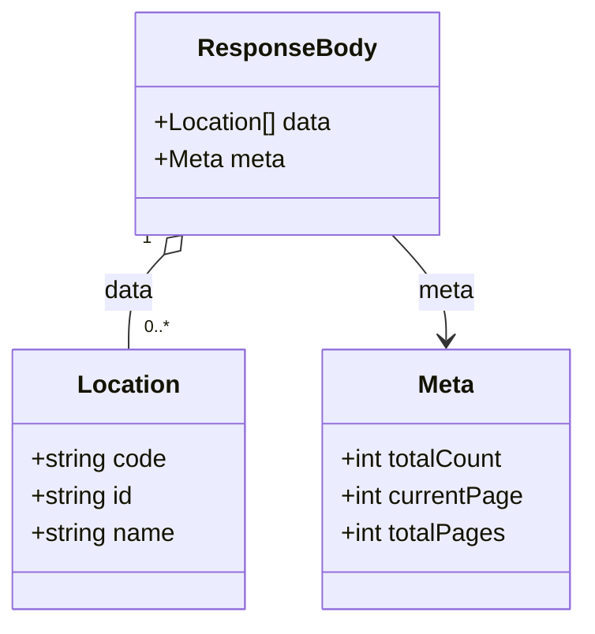

# Diagram: web/portal/src/mocks/handlers/reuse-trip-container/list/location.js

> Auto-generated by Obscura crawlers

## Diagram 1

```mermaid
graph TD
  HF["handleFetchFilterLocations (export)"]
  RG["rest.get(...)"]
  HF --> RG
  API["apiUrl('/reuse-trip-container/list/location')"]
  RG --> API
  Handler["handler(req, res, ctx)"]
  RG --> Handler
  Handler --> RB["responseBody"]
  RB --> Data["data (array of locations)"]
  RB --> Meta["meta (pagination)"]
  Data --> loc_NEWK["NEWK: Port Newark"]
  Data --> loc_RHT["RHT: RHT"]
  Data --> loc_BHA["BHA: BHA"]
  Data --> loc_NVDL["NVDL: Novi Dealership"]
  Data --> loc_22["22: Nashville VDC"]
  Data --> loc_PRTL["PRTL: Port of Portland"]
  Data --> loc_AADL["AADL: Ann Arbor Dealership"]
  Data --> loc_CIU1["CIU1: Coney Island Upfitter"]
  Data --> loc_ASDA["ASDA: Test"]
  Data --> loc_SHEF["SHEF: Sheffield Plant"]
  Data --> loc_LNDNBL["LNDNBL: Port of London [BLACKLISTED]"]
  Data --> loc_SHEFBL["SHEFBL: Sheffield Plant [BLACKLISTED]"]
  Data --> loc_DTW["DTW: Detroit Metro Airport"]
  Data --> loc_DFW["DFW: Dallas/Fort Worth Airport"]
  Data --> loc_15["15: Kansas City Test"]
  Data --> loc_32["32: Miami Dealer"]
  Data --> loc_NICDLR["NICDLR: Nics Dealership"]
  Data --> loc_DETT["DETT: Detroit VDC"]
  Data --> loc_MONDEAL1["MONDEAL1: Montauk Dealer"]
  Data --> loc_LNDN["LNDN: Port of London"]
  Meta --> meta_totalCount["totalCount: 4"]
  Meta --> meta_currentPage["currentPage: 0"]
  Meta --> meta_totalPages["totalPages: 1"]
  Handler --> Res["return res(ctx.json(responseBody))"]
```

### SVG

<svg id="container" width="5810.875" xmlns="http://www.w3.org/2000/svg" class="flowchart" height="686" viewBox="0 0 5810.875 686" role="graphics-document document" aria-roledescription="flowchart-v2"><g><marker id="container_flowchart-v2-pointEnd" class="marker flowchart-v2" viewBox="0 0 10 10" refX="5" refY="5" markerUnits="userSpaceOnUse" markerWidth="8" markerHeight="8" orient="auto"><path d="M 0 0 L 10 5 L 0 10 z" class="arrowMarkerPath" style="stroke-width: 1; stroke-dasharray: 1, 0;"></path></marker><marker id="container_flowchart-v2-pointStart" class="marker flowchart-v2" viewBox="0 0 10 10" refX="4.5" refY="5" markerUnits="userSpaceOnUse" markerWidth="8" markerHeight="8" orient="auto"><path d="M 0 5 L 10 10 L 10 0 z" class="arrowMarkerPath" style="stroke-width: 1; stroke-dasharray: 1, 0;"></path></marker><marker id="container_flowchart-v2-circleEnd" class="marker flowchart-v2" viewBox="0 0 10 10" refX="11" refY="5" markerUnits="userSpaceOnUse" markerWidth="11" markerHeight="11" orient="auto"><circle cx="5" cy="5" r="5" class="arrowMarkerPath" style="stroke-width: 1; stroke-dasharray: 1, 0;"></circle></marker><marker id="container_flowchart-v2-circleStart" class="marker flowchart-v2" viewBox="0 0 10 10" refX="-1" refY="5" markerUnits="userSpaceOnUse" markerWidth="11" markerHeight="11" orient="auto"><circle cx="5" cy="5" r="5" class="arrowMarkerPath" style="stroke-width: 1; stroke-dasharray: 1, 0;"></circle></marker><marker id="container_flowchart-v2-crossEnd" class="marker cross flowchart-v2" viewBox="0 0 11 11" refX="12" refY="5.2" markerUnits="userSpaceOnUse" markerWidth="11" markerHeight="11" orient="auto"><path d="M 1,1 l 9,9 M 10,1 l -9,9" class="arrowMarkerPath" style="stroke-width: 2; stroke-dasharray: 1, 0;"></path></marker><marker id="container_flowchart-v2-crossStart" class="marker cross flowchart-v2" viewBox="0 0 11 11" refX="-1" refY="5.2" markerUnits="userSpaceOnUse" markerWidth="11" markerHeight="11" orient="auto"><path d="M 1,1 l 9,9 M 10,1 l -9,9" class="arrowMarkerPath" style="stroke-width: 2; stroke-dasharray: 1, 0;"></path></marker><g class="root"><g class="clusters"></g><g class="edgePaths"><path d="M3889.891,86L3889.891,90.167C3889.891,94.333,3889.891,102.667,3889.891,110.333C3889.891,118,3889.891,125,3889.891,128.5L3889.891,132" id="L_HF_RG_0" class="edge-thickness-normal edge-pattern-solid edge-thickness-normal edge-pattern-solid flowchart-link" style=";" data-edge="true" data-et="edge" data-id="L_HF_RG_0" data-points="W3sieCI6Mzg4OS44OTA2MjUsInkiOjg2fSx7IngiOjM4ODkuODkwNjI1LCJ5IjoxMTF9LHsieCI6Mzg4OS44OTA2MjUsInkiOjEzNn1d" marker-end="url(#container_flowchart-v2-pointEnd)"></path><path d="M3821.961,187.783L3809.527,192.319C3797.094,196.855,3772.227,205.928,3759.793,213.964C3747.359,222,3747.359,229,3747.359,232.5L3747.359,236" id="L_RG_API_0" class="edge-thickness-normal edge-pattern-solid edge-thickness-normal edge-pattern-solid flowchart-link" style=";" data-edge="true" data-et="edge" data-id="L_RG_API_0" data-points="W3sieCI6MzgyMS45NjA5Mzc1LCJ5IjoxODcuNzgyOTQyMzM3MjA2NzV9LHsieCI6Mzc0Ny4zNTkzNzUsInkiOjIxNX0seyJ4IjozNzQ3LjM1OTM3NSwieSI6MjQwfV0=" marker-end="url(#container_flowchart-v2-pointEnd)"></path><path d="M3957.82,187.783L3970.254,192.319C3982.688,196.855,4007.555,205.928,4019.988,215.964C4032.422,226,4032.422,237,4032.422,242.5L4032.422,248" id="L_RG_Handler_0" class="edge-thickness-normal edge-pattern-solid edge-thickness-normal edge-pattern-solid flowchart-link" style=";" data-edge="true" data-et="edge" data-id="L_RG_Handler_0" data-points="W3sieCI6Mzk1Ny44MjAzMTI1LCJ5IjoxODcuNzgyOTQyMzM3MjA2NzV9LHsieCI6NDAzMi40MjE4NzUsInkiOjIxNX0seyJ4Ijo0MDMyLjQyMTg3NSwieSI6MjUyfV0=" marker-end="url(#container_flowchart-v2-pointEnd)"></path><path d="M3977.153,306L3964.53,312.167C3951.907,318.333,3926.66,330.667,3914.037,342.333C3901.414,354,3901.414,365,3901.414,370.5L3901.414,376" id="L_Handler_RB_0" class="edge-thickness-normal edge-pattern-solid edge-thickness-normal edge-pattern-solid flowchart-link" style=";" data-edge="true" data-et="edge" data-id="L_Handler_RB_0" data-points="W3sieCI6Mzk3Ny4xNTI5NTQxMDE1NjI1LCJ5IjozMDZ9LHsieCI6MzkwMS40MTQwNjI1LCJ5IjozNDN9LHsieCI6MzkwMS40MTQwNjI1LCJ5IjozODB9XQ==" marker-end="url(#container_flowchart-v2-pointEnd)"></path><path d="M3820,410.527L3587.348,420.606C3354.697,430.685,2889.393,450.842,2656.742,464.421C2424.09,478,2424.09,485,2424.09,488.5L2424.09,492" id="L_RB_Data_0" class="edge-thickness-normal edge-pattern-solid edge-thickness-normal edge-pattern-solid flowchart-link" style=";" data-edge="true" data-et="edge" data-id="L_RB_Data_0" data-points="W3sieCI6MzgyMCwieSI6NDEwLjUyNjk4NDc1NjU0MDl9LHsieCI6MjQyNC4wODk4NDM3NSwieSI6NDcxfSx7IngiOjI0MjQuMDg5ODQzNzUsInkiOjQ5Nn1d" marker-end="url(#container_flowchart-v2-pointEnd)"></path><path d="M3982.828,410.217L4239.225,420.347C4495.622,430.478,5008.417,450.739,5264.814,464.369C5521.211,478,5521.211,485,5521.211,488.5L5521.211,492" id="L_RB_Meta_0" class="edge-thickness-normal edge-pattern-solid edge-thickness-normal edge-pattern-solid flowchart-link" style=";" data-edge="true" data-et="edge" data-id="L_RB_Meta_0" data-points="W3sieCI6Mzk4Mi44MjgxMjUsInkiOjQxMC4yMTY3NjEzNjA4OTU5M30seyJ4Ijo1NTIxLjIxMDkzNzUsInkiOjQ3MX0seyJ4Ijo1NTIxLjIxMDkzNzUsInkiOjQ5Nn1d" marker-end="url(#container_flowchart-v2-pointEnd)"></path><path d="M2307.145,525.625L1940.501,533.854C1573.857,542.083,840.569,558.542,473.925,572.271C107.281,586,107.281,597,107.281,602.5L107.281,608" id="L_Data_loc_NEWK_0" class="edge-thickness-normal edge-pattern-solid edge-thickness-normal edge-pattern-solid flowchart-link" style=";" data-edge="true" data-et="edge" data-id="L_Data_loc_NEWK_0" data-points="W3sieCI6MjMwNy4xNDQ1MzEyNSwieSI6NTI1LjYyNDc5ODcyODA0NTZ9LHsieCI6MTA3LjI4MTI1LCJ5Ijo1NzV9LHsieCI6MTA3LjI4MTI1LCJ5Ijo2MTJ9XQ==" marker-end="url(#container_flowchart-v2-pointEnd)"></path><path d="M2307.145,525.889L1975.807,534.074C1644.469,542.259,981.793,558.63,650.455,572.315C319.117,586,319.117,597,319.117,602.5L319.117,608" id="L_Data_loc_RHT_0" class="edge-thickness-normal edge-pattern-solid edge-thickness-normal edge-pattern-solid flowchart-link" style=";" data-edge="true" data-et="edge" data-id="L_Data_loc_RHT_0" data-points="W3sieCI6MjMwNy4xNDQ1MzEyNSwieSI6NTI1Ljg4ODk0Nzg1OTY5OTh9LHsieCI6MzE5LjExNzE4NzUsInkiOjU3NX0seyJ4IjozMTkuMTE3MTg3NSwieSI6NjEyfV0=" marker-end="url(#container_flowchart-v2-pointEnd)"></path><path d="M2307.145,526.153L2005.208,534.294C1703.271,542.435,1099.397,558.718,797.46,572.359C495.523,586,495.523,597,495.523,602.5L495.523,608" id="L_Data_loc_BHA_0" class="edge-thickness-normal edge-pattern-solid edge-thickness-normal edge-pattern-solid flowchart-link" style=";" data-edge="true" data-et="edge" data-id="L_Data_loc_BHA_0" data-points="W3sieCI6MjMwNy4xNDQ1MzEyNSwieSI6NTI2LjE1MzIwMDM0MTA4ODl9LHsieCI6NDk1LjUyMzQzNzUsInkiOjU3NX0seyJ4Ijo0OTUuNTIzNDM3NSwieSI6NjEyfV0=" marker-end="url(#container_flowchart-v2-pointEnd)"></path><path d="M2307.145,526.568L2042.562,534.64C1777.979,542.712,1248.814,558.856,984.231,572.428C719.648,586,719.648,597,719.648,602.5L719.648,608" id="L_Data_loc_NVDL_0" class="edge-thickness-normal edge-pattern-solid edge-thickness-normal edge-pattern-solid flowchart-link" style=";" data-edge="true" data-et="edge" data-id="L_Data_loc_NVDL_0" data-points="W3sieCI6MjMwNy4xNDQ1MzEyNSwieSI6NTI2LjU2NzgyOTQ1MjkyMjl9LHsieCI6NzE5LjY0ODQzNzUsInkiOjU3NX0seyJ4Ijo3MTkuNjQ4NDM3NSwieSI6NjEyfV0=" marker-end="url(#container_flowchart-v2-pointEnd)"></path><path d="M2307.145,527.186L2084.519,535.155C1861.893,543.124,1416.642,559.062,1194.016,572.531C971.391,586,971.391,597,971.391,602.5L971.391,608" id="L_Data_loc_22_0" class="edge-thickness-normal edge-pattern-solid edge-thickness-normal edge-pattern-solid flowchart-link" style=";" data-edge="true" data-et="edge" data-id="L_Data_loc_22_0" data-points="W3sieCI6MjMwNy4xNDQ1MzEyNSwieSI6NTI3LjE4NjEwODI5NTE3MjV9LHsieCI6OTcxLjM5MDYyNSwieSI6NTc1fSx7IngiOjk3MS4zOTA2MjUsInkiOjYxMn1d" marker-end="url(#container_flowchart-v2-pointEnd)"></path><path d="M2307.145,528.059L2126.304,535.883C1945.464,543.706,1583.783,559.353,1402.942,572.677C1222.102,586,1222.102,597,1222.102,602.5L1222.102,608" id="L_Data_loc_PRTL_0" class="edge-thickness-normal edge-pattern-solid edge-thickness-normal edge-pattern-solid flowchart-link" style=";" data-edge="true" data-et="edge" data-id="L_Data_loc_PRTL_0" data-points="W3sieCI6MjMwNy4xNDQ1MzEyNSwieSI6NTI4LjA1OTI0NzUzNTgyMTJ9LHsieCI6MTIyMi4xMDE1NjI1LCJ5Ijo1NzV9LHsieCI6MTIyMi4xMDE1NjI1LCJ5Ijo2MTJ9XQ==" marker-end="url(#container_flowchart-v2-pointEnd)"></path><path d="M2307.145,529.659L2174.428,537.216C2041.711,544.773,1776.277,559.886,1643.561,572.943C1510.844,586,1510.844,597,1510.844,602.5L1510.844,608" id="L_Data_loc_AADL_0" class="edge-thickness-normal edge-pattern-solid edge-thickness-normal edge-pattern-solid flowchart-link" style=";" data-edge="true" data-et="edge" data-id="L_Data_loc_AADL_0" data-points="W3sieCI6MjMwNy4xNDQ1MzEyNSwieSI6NTI5LjY1ODgzNjMxMTA2NDJ9LHsieCI6MTUxMC44NDM3NSwieSI6NTc1fSx7IngiOjE1MTAuODQzNzUsInkiOjYxMn1d" marker-end="url(#container_flowchart-v2-pointEnd)"></path><path d="M2307.145,533.003L2225.312,540.002C2143.479,547.002,1979.814,561.001,1897.981,573.5C1816.148,586,1816.148,597,1816.148,602.5L1816.148,608" id="L_Data_loc_CIU1_0" class="edge-thickness-normal edge-pattern-solid edge-thickness-normal edge-pattern-solid flowchart-link" style=";" data-edge="true" data-et="edge" data-id="L_Data_loc_CIU1_0" data-points="W3sieCI6MjMwNy4xNDQ1MzEyNSwieSI6NTMzLjAwMjg2NTcxNjEzOTl9LHsieCI6MTgxNi4xNDg0Mzc1LCJ5Ijo1NzV9LHsieCI6MTgxNi4xNDg0Mzc1LCJ5Ijo2MTJ9XQ==" marker-end="url(#container_flowchart-v2-pointEnd)"></path><path d="M2307.145,539.671L2265.839,545.559C2224.534,551.447,2141.923,563.224,2100.618,574.612C2059.313,586,2059.313,597,2059.313,602.5L2059.313,608" id="L_Data_loc_ASDA_0" class="edge-thickness-normal edge-pattern-solid edge-thickness-normal edge-pattern-solid flowchart-link" style=";" data-edge="true" data-et="edge" data-id="L_Data_loc_ASDA_0" data-points="W3sieCI6MjMwNy4xNDQ1MzEyNSwieSI6NTM5LjY3MDg3MTU3MTkxMzV9LHsieCI6MjA1OS4zMTI1LCJ5Ijo1NzV9LHsieCI6MjA1OS4zMTI1LCJ5Ijo2MTJ9XQ==" marker-end="url(#container_flowchart-v2-pointEnd)"></path><path d="M2350.114,550L2338.698,554.167C2327.282,558.333,2304.449,566.667,2293.033,576.333C2281.617,586,2281.617,597,2281.617,602.5L2281.617,608" id="L_Data_loc_SHEF_0" class="edge-thickness-normal edge-pattern-solid edge-thickness-normal edge-pattern-solid flowchart-link" style=";" data-edge="true" data-et="edge" data-id="L_Data_loc_SHEF_0" data-points="W3sieCI6MjM1MC4xMTM2NTY4NTA5NjE0LCJ5Ijo1NTB9LHsieCI6MjI4MS42MTcxODc1LCJ5Ijo1NzV9LHsieCI6MjI4MS42MTcxODc1LCJ5Ijo2MTJ9XQ==" marker-end="url(#container_flowchart-v2-pointEnd)"></path><path d="M2498.066,550L2509.482,554.167C2520.898,558.333,2543.73,566.667,2555.146,574.333C2566.563,582,2566.563,589,2566.563,592.5L2566.563,596" id="L_Data_loc_LNDNBL_0" class="edge-thickness-normal edge-pattern-solid edge-thickness-normal edge-pattern-solid flowchart-link" style=";" data-edge="true" data-et="edge" data-id="L_Data_loc_LNDNBL_0" data-points="W3sieCI6MjQ5OC4wNjYwMzA2NDkwMzg2LCJ5Ijo1NTB9LHsieCI6MjU2Ni41NjI1LCJ5Ijo1NzV9LHsieCI6MjU2Ni41NjI1LCJ5Ijo2MDB9XQ==" marker-end="url(#container_flowchart-v2-pointEnd)"></path><path d="M2541.035,536.44L2596.956,542.867C2652.878,549.293,2764.72,562.147,2820.641,572.073C2876.563,582,2876.563,589,2876.563,592.5L2876.563,596" id="L_Data_loc_SHEFBL_0" class="edge-thickness-normal edge-pattern-solid edge-thickness-normal edge-pattern-solid flowchart-link" style=";" data-edge="true" data-et="edge" data-id="L_Data_loc_SHEFBL_0" data-points="W3sieCI6MjU0MS4wMzUxNTYyNSwieSI6NTM2LjQzOTgzMTQ4MTUyOTV9LHsieCI6Mjg3Ni41NjI1LCJ5Ijo1NzV9LHsieCI6Mjg3Ni41NjI1LCJ5Ijo2MDB9XQ==" marker-end="url(#container_flowchart-v2-pointEnd)"></path><path d="M2541.035,531.025L2647.837,538.354C2754.638,545.683,2968.241,560.342,3075.042,573.171C3181.844,586,3181.844,597,3181.844,602.5L3181.844,608" id="L_Data_loc_DTW_0" class="edge-thickness-normal edge-pattern-solid edge-thickness-normal edge-pattern-solid flowchart-link" style=";" data-edge="true" data-et="edge" data-id="L_Data_loc_DTW_0" data-points="W3sieCI6MjU0MS4wMzUxNTYyNSwieSI6NTMxLjAyNTIzOTA2NDg3NjF9LHsieCI6MzE4MS44NDM3NSwieSI6NTc1fSx7IngiOjMxODEuODQzNzUsInkiOjYxMn1d" marker-end="url(#container_flowchart-v2-pointEnd)"></path><path d="M2541.035,528.721L2698.717,536.434C2856.398,544.147,3171.762,559.574,3329.443,570.787C3487.125,582,3487.125,589,3487.125,592.5L3487.125,596" id="L_Data_loc_DFW_0" class="edge-thickness-normal edge-pattern-solid edge-thickness-normal edge-pattern-solid flowchart-link" style=";" data-edge="true" data-et="edge" data-id="L_Data_loc_DFW_0" data-points="W3sieCI6MjU0MS4wMzUxNTYyNSwieSI6NTI4LjcyMDU1OTg2NTA2Nzl9LHsieCI6MzQ4Ny4xMjUsInkiOjU3NX0seyJ4IjozNDg3LjEyNSwieSI6NjAwfV0=" marker-end="url(#container_flowchart-v2-pointEnd)"></path><path d="M2541.035,527.53L2745.269,535.442C2949.503,543.353,3357.97,559.177,3562.204,572.588C3766.438,586,3766.438,597,3766.438,602.5L3766.438,608" id="L_Data_loc_15_0" class="edge-thickness-normal edge-pattern-solid edge-thickness-normal edge-pattern-solid flowchart-link" style=";" data-edge="true" data-et="edge" data-id="L_Data_loc_15_0" data-points="W3sieCI6MjU0MS4wMzUxNTYyNSwieSI6NTI3LjUzMDIzOTQwNjgyMjh9LHsieCI6Mzc2Ni40Mzc1LCJ5Ijo1NzV9LHsieCI6Mzc2Ni40Mzc1LCJ5Ijo2MTJ9XQ==" marker-end="url(#container_flowchart-v2-pointEnd)"></path><path d="M2541.035,526.846L2785.061,534.872C3029.086,542.897,3517.137,558.949,3761.162,572.474C4005.188,586,4005.188,597,4005.188,602.5L4005.188,608" id="L_Data_loc_32_0" class="edge-thickness-normal edge-pattern-solid edge-thickness-normal edge-pattern-solid flowchart-link" style=";" data-edge="true" data-et="edge" data-id="L_Data_loc_32_0" data-points="W3sieCI6MjU0MS4wMzUxNTYyNSwieSI6NTI2Ljg0NjE2MTA2Nzg4OTR9LHsieCI6NDAwNS4xODc1LCJ5Ijo1NzV9LHsieCI6NDAwNS4xODc1LCJ5Ijo2MTJ9XQ==" marker-end="url(#container_flowchart-v2-pointEnd)"></path><path d="M2541.035,526.31L2827.715,534.425C3114.396,542.54,3687.757,558.77,3974.437,572.385C4261.117,586,4261.117,597,4261.117,602.5L4261.117,608" id="L_Data_loc_NICDLR_0" class="edge-thickness-normal edge-pattern-solid edge-thickness-normal edge-pattern-solid flowchart-link" style=";" data-edge="true" data-et="edge" data-id="L_Data_loc_NICDLR_0" data-points="W3sieCI6MjU0MS4wMzUxNTYyNSwieSI6NTI2LjMxMDMyNDI5Njg1MzV9LHsieCI6NDI2MS4xMTcxODc1LCJ5Ijo1NzV9LHsieCI6NDI2MS4xMTcxODc1LCJ5Ijo2MTJ9XQ==" marker-end="url(#container_flowchart-v2-pointEnd)"></path><path d="M2541.035,525.901L2870.913,534.084C3200.792,542.267,3860.548,558.634,4190.426,572.317C4520.305,586,4520.305,597,4520.305,602.5L4520.305,608" id="L_Data_loc_DETT_0" class="edge-thickness-normal edge-pattern-solid edge-thickness-normal edge-pattern-solid flowchart-link" style=";" data-edge="true" data-et="edge" data-id="L_Data_loc_DETT_0" data-points="W3sieCI6MjU0MS4wMzUxNTYyNSwieSI6NTI1LjkwMTAxNzY0NTI3MjF9LHsieCI6NDUyMC4zMDQ2ODc1LCJ5Ijo1NzV9LHsieCI6NDUyMC4zMDQ2ODc1LCJ5Ijo2MTJ9XQ==" marker-end="url(#container_flowchart-v2-pointEnd)"></path><path d="M2541.035,525.568L2916.161,533.807C3291.286,542.046,4041.538,558.523,4416.663,572.261C4791.789,586,4791.789,597,4791.789,602.5L4791.789,608" id="L_Data_loc_MONDEAL1_0" class="edge-thickness-normal edge-pattern-solid edge-thickness-normal edge-pattern-solid flowchart-link" style=";" data-edge="true" data-et="edge" data-id="L_Data_loc_MONDEAL1_0" data-points="W3sieCI6MjU0MS4wMzUxNTYyNSwieSI6NTI1LjU2ODM4MjA4MjQyMTJ9LHsieCI6NDc5MS43ODkwNjI1LCJ5Ijo1NzV9LHsieCI6NDc5MS43ODkwNjI1LCJ5Ijo2MTJ9XQ==" marker-end="url(#container_flowchart-v2-pointEnd)"></path><path d="M2541.035,525.291L2963.967,533.576C3386.898,541.861,4232.762,558.43,4655.693,572.215C5078.625,586,5078.625,597,5078.625,602.5L5078.625,608" id="L_Data_loc_LNDN_0" class="edge-thickness-normal edge-pattern-solid edge-thickness-normal edge-pattern-solid flowchart-link" style=";" data-edge="true" data-et="edge" data-id="L_Data_loc_LNDN_0" data-points="W3sieCI6MjU0MS4wMzUxNTYyNSwieSI6NTI1LjI5MDg1NTQxOTg5Nn0seyJ4Ijo1MDc4LjYyNSwieSI6NTc1fSx7IngiOjUwNzguNjI1LCJ5Ijo2MTJ9XQ==" marker-end="url(#container_flowchart-v2-pointEnd)"></path><path d="M5426.602,546.642L5407.688,551.368C5388.773,556.094,5350.945,565.547,5332.031,575.774C5313.117,586,5313.117,597,5313.117,602.5L5313.117,608" id="L_Meta_meta_totalCount_0" class="edge-thickness-normal edge-pattern-solid edge-thickness-normal edge-pattern-solid flowchart-link" style=";" data-edge="true" data-et="edge" data-id="L_Meta_meta_totalCount_0" data-points="W3sieCI6NTQyNi42MDE1NjI1LCJ5Ijo1NDYuNjQxNjg3OTQxMTMyM30seyJ4Ijo1MzEzLjExNzE4NzUsInkiOjU3NX0seyJ4Ijo1MzEzLjExNzE4NzUsInkiOjYxMn1d" marker-end="url(#container_flowchart-v2-pointEnd)"></path><path d="M5521.211,550L5521.211,554.167C5521.211,558.333,5521.211,566.667,5521.211,576.333C5521.211,586,5521.211,597,5521.211,602.5L5521.211,608" id="L_Meta_meta_currentPage_0" class="edge-thickness-normal edge-pattern-solid edge-thickness-normal edge-pattern-solid flowchart-link" style=";" data-edge="true" data-et="edge" data-id="L_Meta_meta_currentPage_0" data-points="W3sieCI6NTUyMS4yMTA5Mzc1LCJ5Ijo1NTB9LHsieCI6NTUyMS4yMTA5Mzc1LCJ5Ijo1NzV9LHsieCI6NTUyMS4yMTA5Mzc1LCJ5Ijo2MTJ9XQ==" marker-end="url(#container_flowchart-v2-pointEnd)"></path><path d="M5615.82,546.806L5634.495,551.505C5653.169,556.204,5690.518,565.602,5709.193,575.801C5727.867,586,5727.867,597,5727.867,602.5L5727.867,608" id="L_Meta_meta_totalPages_0" class="edge-thickness-normal edge-pattern-solid edge-thickness-normal edge-pattern-solid flowchart-link" style=";" data-edge="true" data-et="edge" data-id="L_Meta_meta_totalPages_0" data-points="W3sieCI6NTYxNS44MjAzMTI1LCJ5Ijo1NDYuODA2MTM5NDIyMzQ5OX0seyJ4Ijo1NzI3Ljg2NzE4NzUsInkiOjU3NX0seyJ4Ijo1NzI3Ljg2NzE4NzUsInkiOjYxMn1d" marker-end="url(#container_flowchart-v2-pointEnd)"></path><path d="M4087.691,306L4100.314,312.167C4112.937,318.333,4138.183,330.667,4150.807,340.333C4163.43,350,4163.43,357,4163.43,360.5L4163.43,364" id="L_Handler_Res_0" class="edge-thickness-normal edge-pattern-solid edge-thickness-normal edge-pattern-solid flowchart-link" style=";" data-edge="true" data-et="edge" data-id="L_Handler_Res_0" data-points="W3sieCI6NDA4Ny42OTA3OTU4OTg0Mzc1LCJ5IjozMDZ9LHsieCI6NDE2My40Mjk2ODc1LCJ5IjozNDN9LHsieCI6NDE2My40Mjk2ODc1LCJ5IjozNjh9XQ==" marker-end="url(#container_flowchart-v2-pointEnd)"></path></g><g class="edgeLabels"><g class="edgeLabel"><g class="label" data-id="L_HF_RG_0" transform="translate(0, 0)"><foreignObject width="0" height="0">

</foreignObject></g></g><g class="edgeLabel"><g class="label" data-id="L_RG_API_0" transform="translate(0, 0)"><foreignObject width="0" height="0">

</foreignObject></g></g><g class="edgeLabel"><g class="label" data-id="L_RG_Handler_0" transform="translate(0, 0)"><foreignObject width="0" height="0">

</foreignObject></g></g><g class="edgeLabel"><g class="label" data-id="L_Handler_RB_0" transform="translate(0, 0)"><foreignObject width="0" height="0">

</foreignObject></g></g><g class="edgeLabel"><g class="label" data-id="L_RB_Data_0" transform="translate(0, 0)"><foreignObject width="0" height="0">

</foreignObject></g></g><g class="edgeLabel"><g class="label" data-id="L_RB_Meta_0" transform="translate(0, 0)"><foreignObject width="0" height="0">

</foreignObject></g></g><g class="edgeLabel"><g class="label" data-id="L_Data_loc_NEWK_0" transform="translate(0, 0)"><foreignObject width="0" height="0">

</foreignObject></g></g><g class="edgeLabel"><g class="label" data-id="L_Data_loc_RHT_0" transform="translate(0, 0)"><foreignObject width="0" height="0">

</foreignObject></g></g><g class="edgeLabel"><g class="label" data-id="L_Data_loc_BHA_0" transform="translate(0, 0)"><foreignObject width="0" height="0">

</foreignObject></g></g><g class="edgeLabel"><g class="label" data-id="L_Data_loc_NVDL_0" transform="translate(0, 0)"><foreignObject width="0" height="0">

</foreignObject></g></g><g class="edgeLabel"><g class="label" data-id="L_Data_loc_22_0" transform="translate(0, 0)"><foreignObject width="0" height="0">

</foreignObject></g></g><g class="edgeLabel"><g class="label" data-id="L_Data_loc_PRTL_0" transform="translate(0, 0)"><foreignObject width="0" height="0">

</foreignObject></g></g><g class="edgeLabel"><g class="label" data-id="L_Data_loc_AADL_0" transform="translate(0, 0)"><foreignObject width="0" height="0">

</foreignObject></g></g><g class="edgeLabel"><g class="label" data-id="L_Data_loc_CIU1_0" transform="translate(0, 0)"><foreignObject width="0" height="0">

</foreignObject></g></g><g class="edgeLabel"><g class="label" data-id="L_Data_loc_ASDA_0" transform="translate(0, 0)"><foreignObject width="0" height="0">

</foreignObject></g></g><g class="edgeLabel"><g class="label" data-id="L_Data_loc_SHEF_0" transform="translate(0, 0)"><foreignObject width="0" height="0">

</foreignObject></g></g><g class="edgeLabel"><g class="label" data-id="L_Data_loc_LNDNBL_0" transform="translate(0, 0)"><foreignObject width="0" height="0">

</foreignObject></g></g><g class="edgeLabel"><g class="label" data-id="L_Data_loc_SHEFBL_0" transform="translate(0, 0)"><foreignObject width="0" height="0">

</foreignObject></g></g><g class="edgeLabel"><g class="label" data-id="L_Data_loc_DTW_0" transform="translate(0, 0)"><foreignObject width="0" height="0">

</foreignObject></g></g><g class="edgeLabel"><g class="label" data-id="L_Data_loc_DFW_0" transform="translate(0, 0)"><foreignObject width="0" height="0">

</foreignObject></g></g><g class="edgeLabel"><g class="label" data-id="L_Data_loc_15_0" transform="translate(0, 0)"><foreignObject width="0" height="0">

</foreignObject></g></g><g class="edgeLabel"><g class="label" data-id="L_Data_loc_32_0" transform="translate(0, 0)"><foreignObject width="0" height="0">

</foreignObject></g></g><g class="edgeLabel"><g class="label" data-id="L_Data_loc_NICDLR_0" transform="translate(0, 0)"><foreignObject width="0" height="0">

</foreignObject></g></g><g class="edgeLabel"><g class="label" data-id="L_Data_loc_DETT_0" transform="translate(0, 0)"><foreignObject width="0" height="0">

</foreignObject></g></g><g class="edgeLabel"><g class="label" data-id="L_Data_loc_MONDEAL1_0" transform="translate(0, 0)"><foreignObject width="0" height="0">

</foreignObject></g></g><g class="edgeLabel"><g class="label" data-id="L_Data_loc_LNDN_0" transform="translate(0, 0)"><foreignObject width="0" height="0">

</foreignObject></g></g><g class="edgeLabel"><g class="label" data-id="L_Meta_meta_totalCount_0" transform="translate(0, 0)"><foreignObject width="0" height="0">

</foreignObject></g></g><g class="edgeLabel"><g class="label" data-id="L_Meta_meta_currentPage_0" transform="translate(0, 0)"><foreignObject width="0" height="0">

</foreignObject></g></g><g class="edgeLabel"><g class="label" data-id="L_Meta_meta_totalPages_0" transform="translate(0, 0)"><foreignObject width="0" height="0">

</foreignObject></g></g><g class="edgeLabel"><g class="label" data-id="L_Handler_Res_0" transform="translate(0, 0)"><foreignObject width="0" height="0">

</foreignObject></g></g></g><g class="nodes"><g class="node default" id="flowchart-HF-0" transform="translate(3889.890625, 47)"><rect class="basic label-container" style="" x="-130" y="-39" width="260" height="78"></rect><g class="label" style="" transform="translate(-100, -24)"><rect></rect><foreignObject width="200" height="48">

handleFetchFilterLocations (export)

</foreignObject></g></g><g class="node default" id="flowchart-RG-1" transform="translate(3889.890625, 163)"><rect class="basic label-container" style="" x="-67.9296875" y="-27" width="135.859375" height="54"></rect><g class="label" style="" transform="translate(-37.9296875, -12)"><rect></rect><foreignObject width="75.859375" height="24">

rest.get(...)

</foreignObject></g></g><g class="node default" id="flowchart-API-4" transform="translate(3747.359375, 279)"><rect class="basic label-container" style="" x="-130" y="-39" width="260" height="78"></rect><g class="label" style="" transform="translate(-100, -24)"><rect></rect><foreignObject width="200" height="48">

apiUrl('/reuse-trip-container/list/location')

</foreignObject></g></g><g class="node default" id="flowchart-Handler-7" transform="translate(4032.421875, 279)"><rect class="basic label-container" style="" x="-105.0625" y="-27" width="210.125" height="54"></rect><g class="label" style="" transform="translate(-75.0625, -12)"><rect></rect><foreignObject width="150.125" height="24">

handler(req, res, ctx)

</foreignObject></g></g><g class="node default" id="flowchart-RB-11" transform="translate(3901.4140625, 407)"><rect class="basic label-container" style="" x="-81.4140625" y="-27" width="162.828125" height="54"></rect><g class="label" style="" transform="translate(-51.4140625, -12)"><rect></rect><foreignObject width="102.828125" height="24">

responseBody

</foreignObject></g></g><g class="node default" id="flowchart-Data-13" transform="translate(2424.08984375, 523)"><rect class="basic label-container" style="" x="-116.9453125" y="-27" width="233.890625" height="54"></rect><g class="label" style="" transform="translate(-86.9453125, -12)"><rect></rect><foreignObject width="173.890625" height="24">

data (array of locations)

</foreignObject></g></g><g class="node default" id="flowchart-Meta-15" transform="translate(5521.2109375, 523)"><rect class="basic label-container" style="" x="-94.609375" y="-27" width="189.21875" height="54"></rect><g class="label" style="" transform="translate(-64.609375, -12)"><rect></rect><foreignObject width="129.21875" height="24">

meta (pagination)

</foreignObject></g></g><g class="node default" id="flowchart-loc_NEWK-17" transform="translate(107.28125, 639)"><rect class="basic label-container" style="" x="-99.28125" y="-27" width="198.5625" height="54"></rect><g class="label" style="" transform="translate(-69.28125, -12)"><rect></rect><foreignObject width="138.5625" height="24">

NEWK: Port Newark

</foreignObject></g></g><g class="node default" id="flowchart-loc_RHT-19" transform="translate(319.1171875, 639)"><rect class="basic label-container" style="" x="-62.5546875" y="-27" width="125.109375" height="54"></rect><g class="label" style="" transform="translate(-32.5546875, -12)"><rect></rect><foreignObject width="65.109375" height="24">

RHT: RHT

</foreignObject></g></g><g class="node default" id="flowchart-loc_BHA-21" transform="translate(495.5234375, 639)"><rect class="basic label-container" style="" x="-63.8515625" y="-27" width="127.703125" height="54"></rect><g class="label" style="" transform="translate(-33.8515625, -12)"><rect></rect><foreignObject width="67.703125" height="24">

BHA: BHA

</foreignObject></g></g><g class="node default" id="flowchart-loc_NVDL-23" transform="translate(719.6484375, 639)"><rect class="basic label-container" style="" x="-110.2734375" y="-27" width="220.546875" height="54"></rect><g class="label" style="" transform="translate(-80.2734375, -12)"><rect></rect><foreignObject width="160.546875" height="24">

NVDL: Novi Dealership

</foreignObject></g></g><g class="node default" id="flowchart-loc_22-25" transform="translate(971.390625, 639)"><rect class="basic label-container" style="" x="-91.46875" y="-27" width="182.9375" height="54"></rect><g class="label" style="" transform="translate(-61.46875, -12)"><rect></rect><foreignObject width="122.9375" height="24">

22: Nashville VDC

</foreignObject></g></g><g class="node default" id="flowchart-loc_PRTL-27" transform="translate(1222.1015625, 639)"><rect class="basic label-container" style="" x="-109.2421875" y="-27" width="218.484375" height="54"></rect><g class="label" style="" transform="translate(-79.2421875, -12)"><rect></rect><foreignObject width="158.484375" height="24">

PRTL: Port of Portland

</foreignObject></g></g><g class="node default" id="flowchart-loc_AADL-29" transform="translate(1510.84375, 639)"><rect class="basic label-container" style="" x="-129.5" y="-27" width="259" height="54"></rect><g class="label" style="" transform="translate(-99.5, -12)"><rect></rect><foreignObject width="199" height="24">

AADL: Ann Arbor Dealership

</foreignObject></g></g><g class="node default" id="flowchart-loc_CIU1-31" transform="translate(1816.1484375, 639)"><rect class="basic label-container" style="" x="-125.8046875" y="-27" width="251.609375" height="54"></rect><g class="label" style="" transform="translate(-95.8046875, -12)"><rect></rect><foreignObject width="191.609375" height="24">

CIU1: Coney Island Upfitter

</foreignObject></g></g><g class="node default" id="flowchart-loc_ASDA-33" transform="translate(2059.3125, 639)"><rect class="basic label-container" style="" x="-67.359375" y="-27" width="134.71875" height="54"></rect><g class="label" style="" transform="translate(-37.359375, -12)"><rect></rect><foreignObject width="74.71875" height="24">

ASDA: Test

</foreignObject></g></g><g class="node default" id="flowchart-loc_SHEF-35" transform="translate(2281.6171875, 639)"><rect class="basic label-container" style="" x="-104.9453125" y="-27" width="209.890625" height="54"></rect><g class="label" style="" transform="translate(-74.9453125, -12)"><rect></rect><foreignObject width="149.890625" height="24">

SHEF: Sheffield Plant

</foreignObject></g></g><g class="node default" id="flowchart-loc_LNDNBL-37" transform="translate(2566.5625, 639)"><rect class="basic label-container" style="" x="-130" y="-39" width="260" height="78"></rect><g class="label" style="" transform="translate(-100, -24)"><rect></rect><foreignObject width="200" height="48">

LNDNBL: Port of London [BLACKLISTED]

</foreignObject></g></g><g class="node default" id="flowchart-loc_SHEFBL-39" transform="translate(2876.5625, 639)"><rect class="basic label-container" style="" x="-130" y="-39" width="260" height="78"></rect><g class="label" style="" transform="translate(-100, -24)"><rect></rect><foreignObject width="200" height="48">

SHEFBL: Sheffield Plant [BLACKLISTED]

</foreignObject></g></g><g class="node default" id="flowchart-loc_DTW-41" transform="translate(3181.84375, 639)"><rect class="basic label-container" style="" x="-125.28125" y="-27" width="250.5625" height="54"></rect><g class="label" style="" transform="translate(-95.28125, -12)"><rect></rect><foreignObject width="190.5625" height="24">

DTW: Detroit Metro Airport

</foreignObject></g></g><g class="node default" id="flowchart-loc_DFW-43" transform="translate(3487.125, 639)"><rect class="basic label-container" style="" x="-130" y="-39" width="260" height="78"></rect><g class="label" style="" transform="translate(-100, -24)"><rect></rect><foreignObject width="200" height="48">

DFW: Dallas/Fort Worth Airport

</foreignObject></g></g><g class="node default" id="flowchart-loc_15-45" transform="translate(3766.4375, 639)"><rect class="basic label-container" style="" x="-99.3125" y="-27" width="198.625" height="54"></rect><g class="label" style="" transform="translate(-69.3125, -12)"><rect></rect><foreignObject width="138.625" height="24">

15: Kansas City Test

</foreignObject></g></g><g class="node default" id="flowchart-loc_32-47" transform="translate(4005.1875, 639)"><rect class="basic label-container" style="" x="-89.4375" y="-27" width="178.875" height="54"></rect><g class="label" style="" transform="translate(-59.4375, -12)"><rect></rect><foreignObject width="118.875" height="24">

32: Miami Dealer

</foreignObject></g></g><g class="node default" id="flowchart-loc_NICDLR-49" transform="translate(4261.1171875, 639)"><rect class="basic label-container" style="" x="-116.4921875" y="-27" width="232.984375" height="54"></rect><g class="label" style="" transform="translate(-86.4921875, -12)"><rect></rect><foreignObject width="172.984375" height="24">

NICDLR: Nics Dealership

</foreignObject></g></g><g class="node default" id="flowchart-loc_DETT-51" transform="translate(4520.3046875, 639)"><rect class="basic label-container" style="" x="-92.6953125" y="-27" width="185.390625" height="54"></rect><g class="label" style="" transform="translate(-62.6953125, -12)"><rect></rect><foreignObject width="125.390625" height="24">

DETT: Detroit VDC

</foreignObject></g></g><g class="node default" id="flowchart-loc_MONDEAL1-53" transform="translate(4791.7890625, 639)"><rect class="basic label-container" style="" x="-128.7890625" y="-27" width="257.578125" height="54"></rect><g class="label" style="" transform="translate(-98.7890625, -12)"><rect></rect><foreignObject width="197.578125" height="24">

MONDEAL1: Montauk Dealer

</foreignObject></g></g><g class="node default" id="flowchart-loc_LNDN-55" transform="translate(5078.625, 639)"><rect class="basic label-container" style="" x="-108.046875" y="-27" width="216.09375" height="54"></rect><g class="label" style="" transform="translate(-78.046875, -12)"><rect></rect><foreignObject width="156.09375" height="24">

LNDN: Port of London

</foreignObject></g></g><g class="node default" id="flowchart-meta_totalCount-57" transform="translate(5313.1171875, 639)"><rect class="basic label-container" style="" x="-76.4453125" y="-27" width="152.890625" height="54"></rect><g class="label" style="" transform="translate(-46.4453125, -12)"><rect></rect><foreignObject width="92.890625" height="24">

totalCount: 4

</foreignObject></g></g><g class="node default" id="flowchart-meta_currentPage-59" transform="translate(5521.2109375, 639)"><rect class="basic label-container" style="" x="-81.6484375" y="-27" width="163.296875" height="54"></rect><g class="label" style="" transform="translate(-51.6484375, -12)"><rect></rect><foreignObject width="103.296875" height="24">

currentPage: 0

</foreignObject></g></g><g class="node default" id="flowchart-meta_totalPages-61" transform="translate(5727.8671875, 639)"><rect class="basic label-container" style="" x="-75.0078125" y="-27" width="150.015625" height="54"></rect><g class="label" style="" transform="translate(-45.0078125, -12)"><rect></rect><foreignObject width="90.015625" height="24">

totalPages: 1

</foreignObject></g></g><g class="node default" id="flowchart-Res-63" transform="translate(4163.4296875, 407)"><rect class="basic label-container" style="" x="-130.6015625" y="-39" width="261.203125" height="78"></rect><g class="label" style="" transform="translate(-100.6015625, -24)"><rect></rect><foreignObject width="201.203125" height="48">

return res(ctx.json(responseBody))

</foreignObject></g></g></g></g></g></svg>

## Diagram 2

### SVG

<svg id="container" width="376" xmlns="http://www.w3.org/2000/svg" class="classDiagram" height="402" viewBox="0 0 376 402" role="graphics-document document" aria-roledescription="class"><g><defs><marker id="container_class-aggregationStart" class="marker aggregation class" refX="18" refY="7" markerWidth="190" markerHeight="240" orient="auto"><path d="M 18,7 L9,13 L1,7 L9,1 Z"></path></marker></defs><defs><marker id="container_class-aggregationEnd" class="marker aggregation class" refX="1" refY="7" markerWidth="20" markerHeight="28" orient="auto"><path d="M 18,7 L9,13 L1,7 L9,1 Z"></path></marker></defs><defs><marker id="container_class-extensionStart" class="marker extension class" refX="18" refY="7" markerWidth="190" markerHeight="240" orient="auto"><path d="M 1,7 L18,13 V 1 Z"></path></marker></defs><defs><marker id="container_class-extensionEnd" class="marker extension class" refX="1" refY="7" markerWidth="20" markerHeight="28" orient="auto"><path d="M 1,1 V 13 L18,7 Z"></path></marker></defs><defs><marker id="container_class-compositionStart" class="marker composition class" refX="18" refY="7" markerWidth="190" markerHeight="240" orient="auto"><path d="M 18,7 L9,13 L1,7 L9,1 Z"></path></marker></defs><defs><marker id="container_class-compositionEnd" class="marker composition class" refX="1" refY="7" markerWidth="20" markerHeight="28" orient="auto"><path d="M 18,7 L9,13 L1,7 L9,1 Z"></path></marker></defs><defs><marker id="container_class-dependencyStart" class="marker dependency class" refX="6" refY="7" markerWidth="190" markerHeight="240" orient="auto"><path d="M 5,7 L9,13 L1,7 L9,1 Z"></path></marker></defs><defs><marker id="container_class-dependencyEnd" class="marker dependency class" refX="13" refY="7" markerWidth="20" markerHeight="28" orient="auto"><path d="M 18,7 L9,13 L14,7 L9,1 Z"></path></marker></defs><defs><marker id="container_class-lollipopStart" class="marker lollipop class" refX="13" refY="7" markerWidth="190" markerHeight="240" orient="auto"><circle stroke="black" fill="transparent" cx="7" cy="7" r="6"></circle></marker></defs><defs><marker id="container_class-lollipopEnd" class="marker lollipop class" refX="1" refY="7" markerWidth="190" markerHeight="240" orient="auto"><circle stroke="black" fill="transparent" cx="7" cy="7" r="6"></circle></marker></defs><g class="root"><g class="clusters"></g><g class="edgePaths"><path d="M105.84,164.567L102.01,168.639C98.181,172.711,90.522,180.856,86.693,191.094C82.863,201.333,82.863,213.667,82.863,219.833L82.863,226" id="id_ResponseBody_Location_1" class="edge-thickness-normal edge-pattern-solid relation" style=";;;" data-edge="true" data-et="edge" data-id="id_ResponseBody_Location_1" data-points="W3sieCI6MTE3LjY1Njg1OTIzMTY1MTM4LCJ5IjoxNTJ9LHsieCI6ODIuODYzMjgxMjUsInkiOjE4OX0seyJ4Ijo4Mi44NjMyODEyNSwieSI6MjI2fV0=" marker-start="url(#container_class-aggregationStart)"></path><path d="M253.07,152L258.869,158.167C264.668,164.333,276.265,176.667,282.064,188C287.863,199.333,287.863,209.667,287.863,214.833L287.863,220" id="id_ResponseBody_Meta_2" class="edge-thickness-normal edge-pattern-solid relation" style=";;;" data-edge="true" data-et="edge" data-id="id_ResponseBody_Meta_2" data-points="W3sieCI6MjUzLjA2OTcwMzI2ODM0ODYzLCJ5IjoxNTJ9LHsieCI6Mjg3Ljg2MzI4MTI1LCJ5IjoxODl9LHsieCI6Mjg3Ljg2MzI4MTI1LCJ5IjoyMjZ9XQ==" marker-end="url(#container_class-dependencyEnd)"></path></g><g class="edgeLabels"><g class="edgeLabel" transform="translate(82.86328125, 189)"><g class="label" data-id="id_ResponseBody_Location_1" transform="translate(-16.3203125, -12)"><foreignObject width="32.640625" height="24">

data

</foreignObject></g></g><g class="edgeLabel" transform="translate(287.86328125, 189)"><g class="label" data-id="id_ResponseBody_Meta_2" transform="translate(-18.40625, -12)"><foreignObject width="36.8125" height="24">

meta

</foreignObject></g></g><g class="edgeTerminals" transform="translate(94.7410360783372, 154.4728710328991)"><g class="inner" transform="translate(0, 0)"><foreignObject style="width: 9px; height: 12px;">
1
</foreignObject></g></g><g class="edgeTerminals" transform="translate(92.86328062499999, 203.4999994642857)"><g class="inner" transform="translate(0, 0)"></g><foreignObject style="width: 36px; height: 12px;">
0..*
</foreignObject></g></g><g class="nodes"><g class="node default" id="classId-Location-0" transform="translate(82.86328125, 310)"><g class="basic label-container"><path d="M-74.86328125 -84 L74.86328125 -84 L74.86328125 84 L-74.86328125 84" stroke="none" stroke-width="0" fill="#ECECFF" style=""></path><path d="M-74.86328125 -84 C-16.240238129322698 -84, 42.382804991354604 -84, 74.86328125 -84 M-74.86328125 -84 C-23.51062554896088 -84, 27.842030152078237 -84, 74.86328125 -84 M74.86328125 -84 C74.86328125 -25.176432147547402, 74.86328125 33.647135704905196, 74.86328125 84 M74.86328125 -84 C74.86328125 -40.432426532517766, 74.86328125 3.1351469349644674, 74.86328125 84 M74.86328125 84 C25.928053778346204 84, -23.007173693307593 84, -74.86328125 84 M74.86328125 84 C43.444453813294444 84, 12.025626376588882 84, -74.86328125 84 M-74.86328125 84 C-74.86328125 32.138565223799574, -74.86328125 -19.72286955240085, -74.86328125 -84 M-74.86328125 84 C-74.86328125 42.70858918590905, -74.86328125 1.4171783718180961, -74.86328125 -84" stroke="#9370DB" stroke-width="1.3" fill="none" stroke-dasharray="0 0" style=""></path></g><g class="annotation-group text" transform="translate(0, -60)"></g><g class="label-group text" transform="translate(-31.3515625, -60)"><g class="label" style="font-weight: bolder" transform="translate(0,-12)"><foreignObject width="62.703125" height="24">

Location

</foreignObject></g></g><g class="members-group text" transform="translate(-62.86328125, -12)"><g class="label" style="" transform="translate(0,-12)"><foreignObject width="88.828125" height="24">

+string code

</foreignObject></g><g class="label" style="" transform="translate(0,12)"><foreignObject width="67.9375" height="24">

+string id

</foreignObject></g><g class="label" style="" transform="translate(0,36)"><foreignObject width="94.375" height="24">

+string name

</foreignObject></g></g><g class="methods-group text" transform="translate(-62.86328125, 84)"></g><g class="divider" style=""><path d="M-74.86328125 -36 C-23.61567775863739 -36, 27.63192573272522 -36, 74.86328125 -36 M-74.86328125 -36 C-39.518886872409546 -36, -4.174492494819091 -36, 74.86328125 -36" stroke="#9370DB" stroke-width="1.3" fill="none" stroke-dasharray="0 0" style=""></path></g><g class="divider" style=""><path d="M-74.86328125 60 C-33.62376600789204 60, 7.615749234215926 60, 74.86328125 60 M-74.86328125 60 C-21.001289895793356 60, 32.86070145841329 60, 74.86328125 60" stroke="#9370DB" stroke-width="1.3" fill="none" stroke-dasharray="0 0" style=""></path></g></g><g class="node default" id="classId-Meta-1" transform="translate(287.86328125, 310)"><g class="basic label-container"><path d="M-80.13671875 -84 L80.13671875 -84 L80.13671875 84 L-80.13671875 84" stroke="none" stroke-width="0" fill="#ECECFF" style=""></path><path d="M-80.13671875 -84 C-44.47968392474232 -84, -8.822649099484636 -84, 80.13671875 -84 M-80.13671875 -84 C-31.090287696365785 -84, 17.95614335726843 -84, 80.13671875 -84 M80.13671875 -84 C80.13671875 -21.598740594167566, 80.13671875 40.80251881166487, 80.13671875 84 M80.13671875 -84 C80.13671875 -37.28534027442404, 80.13671875 9.429319451151926, 80.13671875 84 M80.13671875 84 C28.96461004748621 84, -22.207498655027578 84, -80.13671875 84 M80.13671875 84 C38.572414372598494 84, -2.991890004803011 84, -80.13671875 84 M-80.13671875 84 C-80.13671875 50.27492006899635, -80.13671875 16.549840137992703, -80.13671875 -84 M-80.13671875 84 C-80.13671875 32.405139515149926, -80.13671875 -19.189720969700147, -80.13671875 -84" stroke="#9370DB" stroke-width="1.3" fill="none" stroke-dasharray="0 0" style=""></path></g><g class="annotation-group text" transform="translate(0, -60)"></g><g class="label-group text" transform="translate(-18.0859375, -60)"><g class="label" style="font-weight: bolder" transform="translate(0,-12)"><foreignObject width="36.171875" height="24">

Meta

</foreignObject></g></g><g class="members-group text" transform="translate(-68.13671875, -12)"><g class="label" style="" transform="translate(0,-12)"><foreignObject width="108.125" height="24">

+int totalCount

</foreignObject></g><g class="label" style="" transform="translate(0,12)"><foreignObject width="118.1875" height="24">

+int currentPage

</foreignObject></g><g class="label" style="" transform="translate(0,36)"><foreignObject width="106.890625" height="24">

+int totalPages

</foreignObject></g></g><g class="methods-group text" transform="translate(-68.13671875, 84)"></g><g class="divider" style=""><path d="M-80.13671875 -36 C-47.13760196306294 -36, -14.138485176125883 -36, 80.13671875 -36 M-80.13671875 -36 C-33.866973408932466 -36, 12.402771932135067 -36, 80.13671875 -36" stroke="#9370DB" stroke-width="1.3" fill="none" stroke-dasharray="0 0" style=""></path></g><g class="divider" style=""><path d="M-80.13671875 60 C-45.89610204520961 60, -11.655485340419219 60, 80.13671875 60 M-80.13671875 60 C-44.985578271663385 60, -9.83443779332677 60, 80.13671875 60" stroke="#9370DB" stroke-width="1.3" fill="none" stroke-dasharray="0 0" style=""></path></g></g><g class="node default" id="classId-ResponseBody-2" transform="translate(185.36328125, 80)"><g class="basic label-container"><path d="M-97.63671875 -72 L97.63671875 -72 L97.63671875 72 L-97.63671875 72" stroke="none" stroke-width="0" fill="#ECECFF" style=""></path><path d="M-97.63671875 -72 C-31.665551951900284 -72, 34.30561484619943 -72, 97.63671875 -72 M-97.63671875 -72 C-56.031093510096184 -72, -14.425468270192368 -72, 97.63671875 -72 M97.63671875 -72 C97.63671875 -24.24582495764394, 97.63671875 23.50835008471212, 97.63671875 72 M97.63671875 -72 C97.63671875 -17.11976075686122, 97.63671875 37.76047848627756, 97.63671875 72 M97.63671875 72 C24.441111429622254 72, -48.75449589075549 72, -97.63671875 72 M97.63671875 72 C23.212878364854546 72, -51.21096202029091 72, -97.63671875 72 M-97.63671875 72 C-97.63671875 41.46745828465044, -97.63671875 10.934916569300881, -97.63671875 -72 M-97.63671875 72 C-97.63671875 24.011168433829795, -97.63671875 -23.97766313234041, -97.63671875 -72" stroke="#9370DB" stroke-width="1.3" fill="none" stroke-dasharray="0 0" style=""></path></g><g class="annotation-group text" transform="translate(0, -48)"></g><g class="label-group text" transform="translate(-53.9921875, -48)"><g class="label" style="font-weight: bolder" transform="translate(0,-12)"><foreignObject width="107.984375" height="24">

ResponseBody

</foreignObject></g></g><g class="members-group text" transform="translate(-85.63671875, 0)"><g class="label" style="" transform="translate(0,-12)"><foreignObject width="117.28125" height="24">

+Location[] data

</foreignObject></g><g class="label" style="" transform="translate(0,12)"><foreignObject width="84.5625" height="24">

+Meta meta

</foreignObject></g></g><g class="methods-group text" transform="translate(-85.63671875, 72)"></g><g class="divider" style=""><path d="M-97.63671875 -24 C-33.489611978986986 -24, 30.65749479202603 -24, 97.63671875 -24 M-97.63671875 -24 C-22.936768473347968 -24, 51.763181803304064 -24, 97.63671875 -24" stroke="#9370DB" stroke-width="1.3" fill="none" stroke-dasharray="0 0" style=""></path></g><g class="divider" style=""><path d="M-97.63671875 48 C-57.87543861752153 48, -18.114158485043063 48, 97.63671875 48 M-97.63671875 48 C-58.4682020115976 48, -19.299685273195195 48, 97.63671875 48" stroke="#9370DB" stroke-width="1.3" fill="none" stroke-dasharray="0 0" style=""></path></g></g></g></g></g></svg>
