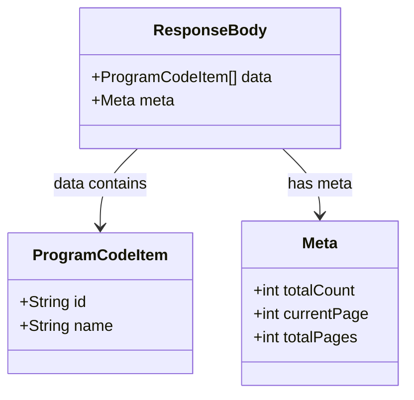

# Diagram: web/portal/src/mocks/handlers/reuse-trip-container/list/program-code.js


> Auto-generated by Obscura crawlers

## Diagram 1

```mermaid
flowchart TD
  Client[Client Request] --> MSWHandler[MSW rest.get handler]
  MSWHandler --> URL[apiUrl("/reuse-trip-container/list/program-code")]
  MSWHandler --> Handler[handler(req, res, ctx)]
  Handler --> Build[Create responseBody]
  Build --> Data[[data: ProgramCode[]]]
  Data --> Item1[ProgramCode (id: 1, name: P001)]
  Data --> Item2[ProgramCode (id: 2, name: P002)]
  Data --> Item3[ProgramCode (id: 3, name: P003)]
  Build --> Meta[meta: totalCount=3, currentPage=0, totalPages=1]
  Build --> Return[res(ctx.json(responseBody))]
  Return --> ClientResponse[Client receives JSON]
```

> SVG rendering failed for this diagram.

## Diagram 2



### SVG

<svg id="container" width="410.8125" xmlns="http://www.w3.org/2000/svg" class="classDiagram" height="402" viewBox="0 0 410.8125 402" role="graphics-document document" aria-roledescription="class"><style>#container{font-family:"trebuchet ms",verdana,arial,sans-serif;font-size:16px;fill:#333;}@keyframes edge-animation-frame{from{stroke-dashoffset:0;}}@keyframes dash{to{stroke-dashoffset:0;}}#container .edge-animation-slow{stroke-dasharray:9,5!important;stroke-dashoffset:900;animation:dash 50s linear infinite;stroke-linecap:round;}#container .edge-animation-fast{stroke-dasharray:9,5!important;stroke-dashoffset:900;animation:dash 20s linear infinite;stroke-linecap:round;}#container .error-icon{fill:#552222;}#container .error-text{fill:#552222;stroke:#552222;}#container .edge-thickness-normal{stroke-width:1px;}#container .edge-thickness-thick{stroke-width:3.5px;}#container .edge-pattern-solid{stroke-dasharray:0;}#container .edge-thickness-invisible{stroke-width:0;fill:none;}#container .edge-pattern-dashed{stroke-dasharray:3;}#container .edge-pattern-dotted{stroke-dasharray:2;}#container .marker{fill:#333333;stroke:#333333;}#container .marker.cross{stroke:#333333;}#container svg{font-family:"trebuchet ms",verdana,arial,sans-serif;font-size:16px;}#container p{margin:0;}#container g.classGroup text{fill:#9370DB;stroke:none;font-family:"trebuchet ms",verdana,arial,sans-serif;font-size:10px;}#container g.classGroup text .title{font-weight:bolder;}#container .nodeLabel,#container .edgeLabel{color:#131300;}#container .edgeLabel .label rect{fill:#ECECFF;}#container .label text{fill:#131300;}#container .labelBkg{background:#ECECFF;}#container .edgeLabel .label span{background:#ECECFF;}#container .classTitle{font-weight:bolder;}#container .node rect,#container .node circle,#container .node ellipse,#container .node polygon,#container .node path{fill:#ECECFF;stroke:#9370DB;stroke-width:1px;}#container .divider{stroke:#9370DB;stroke-width:1;}#container g.clickable{cursor:pointer;}#container g.classGroup rect{fill:#ECECFF;stroke:#9370DB;}#container g.classGroup line{stroke:#9370DB;stroke-width:1;}#container .classLabel .box{stroke:none;stroke-width:0;fill:#ECECFF;opacity:0.5;}#container .classLabel .label{fill:#9370DB;font-size:10px;}#container .relation{stroke:#333333;stroke-width:1;fill:none;}#container .dashed-line{stroke-dasharray:3;}#container .dotted-line{stroke-dasharray:1 2;}#container #compositionStart,#container .composition{fill:#333333!important;stroke:#333333!important;stroke-width:1;}#container #compositionEnd,#container .composition{fill:#333333!important;stroke:#333333!important;stroke-width:1;}#container #dependencyStart,#container .dependency{fill:#333333!important;stroke:#333333!important;stroke-width:1;}#container #dependencyStart,#container .dependency{fill:#333333!important;stroke:#333333!important;stroke-width:1;}#container #extensionStart,#container .extension{fill:transparent!important;stroke:#333333!important;stroke-width:1;}#container #extensionEnd,#container .extension{fill:transparent!important;stroke:#333333!important;stroke-width:1;}#container #aggregationStart,#container .aggregation{fill:transparent!important;stroke:#333333!important;stroke-width:1;}#container #aggregationEnd,#container .aggregation{fill:transparent!important;stroke:#333333!important;stroke-width:1;}#container #lollipopStart,#container .lollipop{fill:#ECECFF!important;stroke:#333333!important;stroke-width:1;}#container #lollipopEnd,#container .lollipop{fill:#ECECFF!important;stroke:#333333!important;stroke-width:1;}#container .edgeTerminals{font-size:11px;line-height:initial;}#container .classTitleText{text-anchor:middle;font-size:18px;fill:#333;}#container .label-icon{display:inline-block;height:1em;overflow:visible;vertical-align:-0.125em;}#container .node .label-icon path{fill:currentColor;stroke:revert;stroke-width:revert;}#container :root{--mermaid-font-family:"trebuchet ms",verdana,arial,sans-serif;}</style><g><defs><marker id="container_class-aggregationStart" class="marker aggregation class" refX="18" refY="7" markerWidth="190" markerHeight="240" orient="auto"><path d="M 18,7 L9,13 L1,7 L9,1 Z"></path></marker></defs><defs><marker id="container_class-aggregationEnd" class="marker aggregation class" refX="1" refY="7" markerWidth="20" markerHeight="28" orient="auto"><path d="M 18,7 L9,13 L1,7 L9,1 Z"></path></marker></defs><defs><marker id="container_class-extensionStart" class="marker extension class" refX="18" refY="7" markerWidth="190" markerHeight="240" orient="auto"><path d="M 1,7 L18,13 V 1 Z"></path></marker></defs><defs><marker id="container_class-extensionEnd" class="marker extension class" refX="1" refY="7" markerWidth="20" markerHeight="28" orient="auto"><path d="M 1,1 V 13 L18,7 Z"></path></marker></defs><defs><marker id="container_class-compositionStart" class="marker composition class" refX="18" refY="7" markerWidth="190" markerHeight="240" orient="auto"><path d="M 18,7 L9,13 L1,7 L9,1 Z"></path></marker></defs><defs><marker id="container_class-compositionEnd" class="marker composition class" refX="1" refY="7" markerWidth="20" markerHeight="28" orient="auto"><path d="M 18,7 L9,13 L1,7 L9,1 Z"></path></marker></defs><defs><marker id="container_class-dependencyStart" class="marker dependency class" refX="6" refY="7" markerWidth="190" markerHeight="240" orient="auto"><path d="M 5,7 L9,13 L1,7 L9,1 Z"></path></marker></defs><defs><marker id="container_class-dependencyEnd" class="marker dependency class" refX="13" refY="7" markerWidth="20" markerHeight="28" orient="auto"><path d="M 18,7 L9,13 L14,7 L9,1 Z"></path></marker></defs><defs><marker id="container_class-lollipopStart" class="marker lollipop class" refX="13" refY="7" markerWidth="190" markerHeight="240" orient="auto"><circle stroke="black" fill="transparent" cx="7" cy="7" r="6"></circle></marker></defs><defs><marker id="container_class-lollipopEnd" class="marker lollipop class" refX="1" refY="7" markerWidth="190" markerHeight="240" orient="auto"><circle stroke="black" fill="transparent" cx="7" cy="7" r="6"></circle></marker></defs><g class="root"><g class="clusters"></g><g class="edgePaths"><path d="M138.017,152L131.726,158.167C125.435,164.333,112.852,176.667,106.561,190C100.27,203.333,100.27,217.667,100.27,224.833L100.27,232" id="id_ResponseBody_ProgramCodeItem_1" class="edge-thickness-normal edge-pattern-solid relation" style=";;;" data-edge="true" data-et="edge" data-id="id_ResponseBody_ProgramCodeItem_1" data-points="W3sieCI6MTM4LjAxNzM4MTAyMDY0MjIsInkiOjE1Mn0seyJ4IjoxMDAuMjY5NTMxMjUsInkiOjE4OX0seyJ4IjoxMDAuMjY5NTMxMjUsInkiOjIzOH1d" marker-end="url(#container_class-dependencyEnd)"></path><path d="M284.928,152L291.219,158.167C297.511,164.333,310.093,176.667,316.384,188C322.676,199.333,322.676,209.667,322.676,214.833L322.676,220" id="id_ResponseBody_Meta_2" class="edge-thickness-normal edge-pattern-solid relation" style=";;;" data-edge="true" data-et="edge" data-id="id_ResponseBody_Meta_2" data-points="W3sieCI6Mjg0LjkyNzkzMTQ3OTM1Nzc3LCJ5IjoxNTJ9LHsieCI6MzIyLjY3NTc4MTI1LCJ5IjoxODl9LHsieCI6MzIyLjY3NTc4MTI1LCJ5IjoyMjZ9XQ==" marker-end="url(#container_class-dependencyEnd)"></path></g><g class="edgeLabels"><g class="edgeLabel" transform="translate(100.26953125, 189)"><g class="label" data-id="id_ResponseBody_ProgramCodeItem_1" transform="translate(-49.328125, -12)"><foreignObject width="98.65625" height="24"><div xmlns="http://www.w3.org/1999/xhtml" class="labelBkg" style="display: table-cell; white-space: nowrap; line-height: 1.5; max-width: 200px; text-align: center;"><span class="edgeLabel"><p>data contains</p></span></div></foreignObject></g></g><g class="edgeLabel" transform="translate(322.67578125, 189)"><g class="label" data-id="id_ResponseBody_Meta_2" transform="translate(-33.21875, -12)"><foreignObject width="66.4375" height="24"><div xmlns="http://www.w3.org/1999/xhtml" class="labelBkg" style="display: table-cell; white-space: nowrap; line-height: 1.5; max-width: 200px; text-align: center;"><span class="edgeLabel"><p>has meta</p></span></div></foreignObject></g></g></g><g class="nodes"><g class="node default" id="classId-ProgramCodeItem-0" transform="translate(100.26953125, 310)"><g class="basic label-container"><path d="M-92.26953125 -72 L92.26953125 -72 L92.26953125 72 L-92.26953125 72" stroke="none" stroke-width="0" fill="#ECECFF" style=""></path><path d="M-92.26953125 -72 C-47.820052788361245 -72, -3.3705743267224904 -72, 92.26953125 -72 M-92.26953125 -72 C-46.2115673930284 -72, -0.15360353605680643 -72, 92.26953125 -72 M92.26953125 -72 C92.26953125 -15.319579649832107, 92.26953125 41.360840700335785, 92.26953125 72 M92.26953125 -72 C92.26953125 -36.99411290610714, 92.26953125 -1.9882258122142815, 92.26953125 72 M92.26953125 72 C35.6101215736905 72, -21.049288102619002 72, -92.26953125 72 M92.26953125 72 C37.689356413333485 72, -16.89081842333303 72, -92.26953125 72 M-92.26953125 72 C-92.26953125 19.933813319731506, -92.26953125 -32.13237336053699, -92.26953125 -72 M-92.26953125 72 C-92.26953125 42.17170730623845, -92.26953125 12.343414612476906, -92.26953125 -72" stroke="#9370DB" stroke-width="1.3" fill="none" stroke-dasharray="0 0" style=""></path></g><g class="annotation-group text" transform="translate(0, -48)"></g><g class="label-group text" transform="translate(-65.5546875, -48)"><g class="label" style="font-weight: bolder" transform="translate(0,-12)"><foreignObject width="131.109375" height="24"><div xmlns="http://www.w3.org/1999/xhtml" style="display: table-cell; white-space: nowrap; line-height: 1.5; max-width: 179px; text-align: center;"><span class="nodeLabel markdown-node-label" style=""><p>ProgramCodeItem</p></span></div></foreignObject></g></g><g class="members-group text" transform="translate(-80.26953125, 0)"><g class="label" style="" transform="translate(0,-12)"><foreignObject width="68.546875" height="24"><div xmlns="http://www.w3.org/1999/xhtml" style="display: table-cell; white-space: nowrap; line-height: 1.5; max-width: 126px; text-align: center;"><span class="nodeLabel markdown-node-label" style=""><p>+String id</p></span></div></foreignObject></g><g class="label" style="" transform="translate(0,12)"><foreignObject width="94.984375" height="24"><div xmlns="http://www.w3.org/1999/xhtml" style="display: table-cell; white-space: nowrap; line-height: 1.5; max-width: 152px; text-align: center;"><span class="nodeLabel markdown-node-label" style=""><p>+String name</p></span></div></foreignObject></g></g><g class="methods-group text" transform="translate(-80.26953125, 72)"></g><g class="divider" style=""><path d="M-92.26953125 -24 C-38.18930502715053 -24, 15.890921195698937 -24, 92.26953125 -24 M-92.26953125 -24 C-31.783075617632036 -24, 28.703380014735927 -24, 92.26953125 -24" stroke="#9370DB" stroke-width="1.3" fill="none" stroke-dasharray="0 0" style=""></path></g><g class="divider" style=""><path d="M-92.26953125 48 C-20.846679675041244 48, 50.57617189991751 48, 92.26953125 48 M-92.26953125 48 C-38.89100218083085 48, 14.487526888338294 48, 92.26953125 48" stroke="#9370DB" stroke-width="1.3" fill="none" stroke-dasharray="0 0" style=""></path></g></g><g class="node default" id="classId-Meta-1" transform="translate(322.67578125, 310)"><g class="basic label-container"><path d="M-80.13671875 -84 L80.13671875 -84 L80.13671875 84 L-80.13671875 84" stroke="none" stroke-width="0" fill="#ECECFF" style=""></path><path d="M-80.13671875 -84 C-18.112401772804503 -84, 43.91191520439099 -84, 80.13671875 -84 M-80.13671875 -84 C-39.081512677454036 -84, 1.973693395091928 -84, 80.13671875 -84 M80.13671875 -84 C80.13671875 -46.57103090366361, 80.13671875 -9.142061807327224, 80.13671875 84 M80.13671875 -84 C80.13671875 -23.397713719369527, 80.13671875 37.204572561260946, 80.13671875 84 M80.13671875 84 C23.264759313632176 84, -33.60720012273565 84, -80.13671875 84 M80.13671875 84 C16.854007700424233 84, -46.42870334915153 84, -80.13671875 84 M-80.13671875 84 C-80.13671875 18.608133018349832, -80.13671875 -46.783733963300335, -80.13671875 -84 M-80.13671875 84 C-80.13671875 38.7574646961813, -80.13671875 -6.485070607637397, -80.13671875 -84" stroke="#9370DB" stroke-width="1.3" fill="none" stroke-dasharray="0 0" style=""></path></g><g class="annotation-group text" transform="translate(0, -60)"></g><g class="label-group text" transform="translate(-18.0859375, -60)"><g class="label" style="font-weight: bolder" transform="translate(0,-12)"><foreignObject width="36.171875" height="24"><div xmlns="http://www.w3.org/1999/xhtml" style="display: table-cell; white-space: nowrap; line-height: 1.5; max-width: 86px; text-align: center;"><span class="nodeLabel markdown-node-label" style=""><p>Meta</p></span></div></foreignObject></g></g><g class="members-group text" transform="translate(-68.13671875, -12)"><g class="label" style="" transform="translate(0,-12)"><foreignObject width="108.125" height="24"><div xmlns="http://www.w3.org/1999/xhtml" style="display: table-cell; white-space: nowrap; line-height: 1.5; max-width: 166px; text-align: center;"><span class="nodeLabel markdown-node-label" style=""><p>+int totalCount</p></span></div></foreignObject></g><g class="label" style="" transform="translate(0,12)"><foreignObject width="118.1875" height="24"><div xmlns="http://www.w3.org/1999/xhtml" style="display: table-cell; white-space: nowrap; line-height: 1.5; max-width: 176px; text-align: center;"><span class="nodeLabel markdown-node-label" style=""><p>+int currentPage</p></span></div></foreignObject></g><g class="label" style="" transform="translate(0,36)"><foreignObject width="106.890625" height="24"><div xmlns="http://www.w3.org/1999/xhtml" style="display: table-cell; white-space: nowrap; line-height: 1.5; max-width: 164px; text-align: center;"><span class="nodeLabel markdown-node-label" style=""><p>+int totalPages</p></span></div></foreignObject></g></g><g class="methods-group text" transform="translate(-68.13671875, 84)"></g><g class="divider" style=""><path d="M-80.13671875 -36 C-19.829185439923755 -36, 40.47834787015249 -36, 80.13671875 -36 M-80.13671875 -36 C-43.01289155872178 -36, -5.8890643674435665 -36, 80.13671875 -36" stroke="#9370DB" stroke-width="1.3" fill="none" stroke-dasharray="0 0" style=""></path></g><g class="divider" style=""><path d="M-80.13671875 60 C-19.14442559139092 60, 41.84786756721816 60, 80.13671875 60 M-80.13671875 60 C-29.61086864713979 60, 20.914981455720422 60, 80.13671875 60" stroke="#9370DB" stroke-width="1.3" fill="none" stroke-dasharray="0 0" style=""></path></g></g><g class="node default" id="classId-ResponseBody-2" transform="translate(211.47265625, 80)"><g class="basic label-container"><path d="M-131.24609375 -72 L131.24609375 -72 L131.24609375 72 L-131.24609375 72" stroke="none" stroke-width="0" fill="#ECECFF" style=""></path><path d="M-131.24609375 -72 C-28.849953386003506 -72, 73.54618697799299 -72, 131.24609375 -72 M-131.24609375 -72 C-33.21303781803638 -72, 64.82001811392723 -72, 131.24609375 -72 M131.24609375 -72 C131.24609375 -42.97131207696938, 131.24609375 -13.942624153938759, 131.24609375 72 M131.24609375 -72 C131.24609375 -19.151810678067676, 131.24609375 33.69637864386465, 131.24609375 72 M131.24609375 72 C41.820119691336515 72, -47.60585436732697 72, -131.24609375 72 M131.24609375 72 C78.28425136063319 72, 25.32240897126637 72, -131.24609375 72 M-131.24609375 72 C-131.24609375 42.19266545591917, -131.24609375 12.38533091183833, -131.24609375 -72 M-131.24609375 72 C-131.24609375 22.838103538504058, -131.24609375 -26.323792922991885, -131.24609375 -72" stroke="#9370DB" stroke-width="1.3" fill="none" stroke-dasharray="0 0" style=""></path></g><g class="annotation-group text" transform="translate(0, -48)"></g><g class="label-group text" transform="translate(-53.9921875, -48)"><g class="label" style="font-weight: bolder" transform="translate(0,-12)"><foreignObject width="107.984375" height="24"><div xmlns="http://www.w3.org/1999/xhtml" style="display: table-cell; white-space: nowrap; line-height: 1.5; max-width: 157px; text-align: center;"><span class="nodeLabel markdown-node-label" style=""><p>ResponseBody</p></span></div></foreignObject></g></g><g class="members-group text" transform="translate(-119.24609375, 0)"><g class="label" style="" transform="translate(0,-12)"><foreignObject width="184.5" height="24"><div xmlns="http://www.w3.org/1999/xhtml" style="display: table-cell; white-space: nowrap; line-height: 1.5; max-width: 242px; text-align: center;"><span class="nodeLabel markdown-node-label" style=""><p>+ProgramCodeItem[] data</p></span></div></foreignObject></g><g class="label" style="" transform="translate(0,12)"><foreignObject width="84.5625" height="24"><div xmlns="http://www.w3.org/1999/xhtml" style="display: table-cell; white-space: nowrap; line-height: 1.5; max-width: 142px; text-align: center;"><span class="nodeLabel markdown-node-label" style=""><p>+Meta meta</p></span></div></foreignObject></g></g><g class="methods-group text" transform="translate(-119.24609375, 72)"></g><g class="divider" style=""><path d="M-131.24609375 -24 C-64.09494852187359 -24, 3.0561967062528197 -24, 131.24609375 -24 M-131.24609375 -24 C-33.389640842092646 -24, 64.46681206581471 -24, 131.24609375 -24" stroke="#9370DB" stroke-width="1.3" fill="none" stroke-dasharray="0 0" style=""></path></g><g class="divider" style=""><path d="M-131.24609375 48 C-33.10236985412469 48, 65.04135404175062 48, 131.24609375 48 M-131.24609375 48 C-73.88410042604521 48, -16.522107102090416 48, 131.24609375 48" stroke="#9370DB" stroke-width="1.3" fill="none" stroke-dasharray="0 0" style=""></path></g></g></g></g></g></svg>
