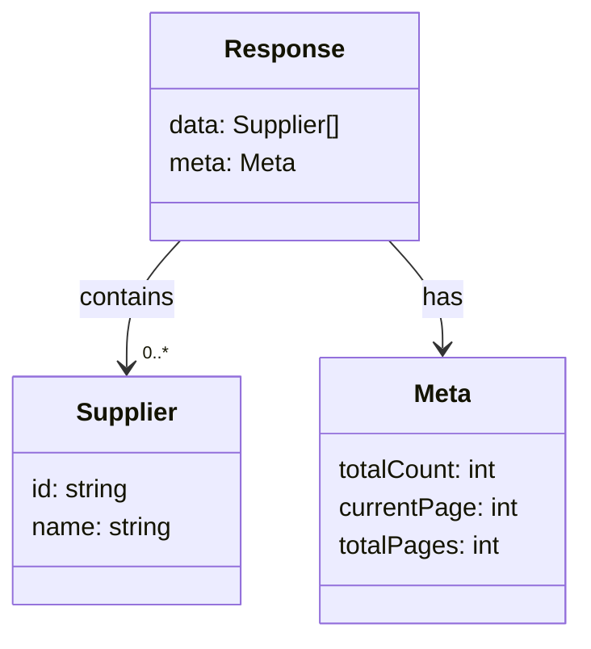

# Diagram: web/portal/src/mocks/handlers/reuse-trip-container/list/supplier-code.js


> Auto-generated by Obscura crawlers

## Diagram 1

```mermaid
sequenceDiagram
    participant Client
    participant MSW
    Client->>MSW: GET /reuse-trip-container/list/supplier-code
    MSW-->>Client: 200 OK (application/json)
    Note right of MSW: data: 3 items (S001, S002, S003); meta: totalCount=3, currentPage=0, totalPages=1
```

> SVG rendering failed for this diagram.

## Diagram 2



### SVG

<svg id="container" width="367.328125" xmlns="http://www.w3.org/2000/svg" class="classDiagram" height="402" viewBox="0 0 367.328125 402" role="graphics-document document" aria-roledescription="class"><style>#container{font-family:"trebuchet ms",verdana,arial,sans-serif;font-size:16px;fill:#333;}@keyframes edge-animation-frame{from{stroke-dashoffset:0;}}@keyframes dash{to{stroke-dashoffset:0;}}#container .edge-animation-slow{stroke-dasharray:9,5!important;stroke-dashoffset:900;animation:dash 50s linear infinite;stroke-linecap:round;}#container .edge-animation-fast{stroke-dasharray:9,5!important;stroke-dashoffset:900;animation:dash 20s linear infinite;stroke-linecap:round;}#container .error-icon{fill:#552222;}#container .error-text{fill:#552222;stroke:#552222;}#container .edge-thickness-normal{stroke-width:1px;}#container .edge-thickness-thick{stroke-width:3.5px;}#container .edge-pattern-solid{stroke-dasharray:0;}#container .edge-thickness-invisible{stroke-width:0;fill:none;}#container .edge-pattern-dashed{stroke-dasharray:3;}#container .edge-pattern-dotted{stroke-dasharray:2;}#container .marker{fill:#333333;stroke:#333333;}#container .marker.cross{stroke:#333333;}#container svg{font-family:"trebuchet ms",verdana,arial,sans-serif;font-size:16px;}#container p{margin:0;}#container g.classGroup text{fill:#9370DB;stroke:none;font-family:"trebuchet ms",verdana,arial,sans-serif;font-size:10px;}#container g.classGroup text .title{font-weight:bolder;}#container .nodeLabel,#container .edgeLabel{color:#131300;}#container .edgeLabel .label rect{fill:#ECECFF;}#container .label text{fill:#131300;}#container .labelBkg{background:#ECECFF;}#container .edgeLabel .label span{background:#ECECFF;}#container .classTitle{font-weight:bolder;}#container .node rect,#container .node circle,#container .node ellipse,#container .node polygon,#container .node path{fill:#ECECFF;stroke:#9370DB;stroke-width:1px;}#container .divider{stroke:#9370DB;stroke-width:1;}#container g.clickable{cursor:pointer;}#container g.classGroup rect{fill:#ECECFF;stroke:#9370DB;}#container g.classGroup line{stroke:#9370DB;stroke-width:1;}#container .classLabel .box{stroke:none;stroke-width:0;fill:#ECECFF;opacity:0.5;}#container .classLabel .label{fill:#9370DB;font-size:10px;}#container .relation{stroke:#333333;stroke-width:1;fill:none;}#container .dashed-line{stroke-dasharray:3;}#container .dotted-line{stroke-dasharray:1 2;}#container #compositionStart,#container .composition{fill:#333333!important;stroke:#333333!important;stroke-width:1;}#container #compositionEnd,#container .composition{fill:#333333!important;stroke:#333333!important;stroke-width:1;}#container #dependencyStart,#container .dependency{fill:#333333!important;stroke:#333333!important;stroke-width:1;}#container #dependencyStart,#container .dependency{fill:#333333!important;stroke:#333333!important;stroke-width:1;}#container #extensionStart,#container .extension{fill:transparent!important;stroke:#333333!important;stroke-width:1;}#container #extensionEnd,#container .extension{fill:transparent!important;stroke:#333333!important;stroke-width:1;}#container #aggregationStart,#container .aggregation{fill:transparent!important;stroke:#333333!important;stroke-width:1;}#container #aggregationEnd,#container .aggregation{fill:transparent!important;stroke:#333333!important;stroke-width:1;}#container #lollipopStart,#container .lollipop{fill:#ECECFF!important;stroke:#333333!important;stroke-width:1;}#container #lollipopEnd,#container .lollipop{fill:#ECECFF!important;stroke:#333333!important;stroke-width:1;}#container .edgeTerminals{font-size:11px;line-height:initial;}#container .classTitleText{text-anchor:middle;font-size:18px;fill:#333;}#container .label-icon{display:inline-block;height:1em;overflow:visible;vertical-align:-0.125em;}#container .node .label-icon path{fill:currentColor;stroke:revert;stroke-width:revert;}#container :root{--mermaid-font-family:"trebuchet ms",verdana,arial,sans-serif;}</style><g><defs><marker id="container_class-aggregationStart" class="marker aggregation class" refX="18" refY="7" markerWidth="190" markerHeight="240" orient="auto"><path d="M 18,7 L9,13 L1,7 L9,1 Z"></path></marker></defs><defs><marker id="container_class-aggregationEnd" class="marker aggregation class" refX="1" refY="7" markerWidth="20" markerHeight="28" orient="auto"><path d="M 18,7 L9,13 L1,7 L9,1 Z"></path></marker></defs><defs><marker id="container_class-extensionStart" class="marker extension class" refX="18" refY="7" markerWidth="190" markerHeight="240" orient="auto"><path d="M 1,7 L18,13 V 1 Z"></path></marker></defs><defs><marker id="container_class-extensionEnd" class="marker extension class" refX="1" refY="7" markerWidth="20" markerHeight="28" orient="auto"><path d="M 1,1 V 13 L18,7 Z"></path></marker></defs><defs><marker id="container_class-compositionStart" class="marker composition class" refX="18" refY="7" markerWidth="190" markerHeight="240" orient="auto"><path d="M 18,7 L9,13 L1,7 L9,1 Z"></path></marker></defs><defs><marker id="container_class-compositionEnd" class="marker composition class" refX="1" refY="7" markerWidth="20" markerHeight="28" orient="auto"><path d="M 18,7 L9,13 L1,7 L9,1 Z"></path></marker></defs><defs><marker id="container_class-dependencyStart" class="marker dependency class" refX="6" refY="7" markerWidth="190" markerHeight="240" orient="auto"><path d="M 5,7 L9,13 L1,7 L9,1 Z"></path></marker></defs><defs><marker id="container_class-dependencyEnd" class="marker dependency class" refX="13" refY="7" markerWidth="20" markerHeight="28" orient="auto"><path d="M 18,7 L9,13 L14,7 L9,1 Z"></path></marker></defs><defs><marker id="container_class-lollipopStart" class="marker lollipop class" refX="13" refY="7" markerWidth="190" markerHeight="240" orient="auto"><circle stroke="black" fill="transparent" cx="7" cy="7" r="6"></circle></marker></defs><defs><marker id="container_class-lollipopEnd" class="marker lollipop class" refX="1" refY="7" markerWidth="190" markerHeight="240" orient="auto"><circle stroke="black" fill="transparent" cx="7" cy="7" r="6"></circle></marker></defs><g class="root"><g class="clusters"></g><g class="edgePaths"><path d="M114.655,152L108.979,158.167C103.303,164.333,91.95,176.667,86.274,190C80.598,203.333,80.598,217.667,80.598,224.833L80.598,232" id="id_Response_Supplier_1" class="edge-thickness-normal edge-pattern-solid relation" style=";;;" data-edge="true" data-et="edge" data-id="id_Response_Supplier_1" data-points="W3sieCI6MTE0LjY1NTMxODIzMzk0NDk1LCJ5IjoxNTJ9LHsieCI6ODAuNTk3NjU2MjUsInkiOjE4OX0seyJ4Ijo4MC41OTc2NTYyNSwieSI6MjM4fV0=" marker-end="url(#container_class-dependencyEnd)"></path><path d="M247.204,152L252.88,158.167C258.557,164.333,269.909,176.667,275.585,188C281.262,199.333,281.262,209.667,281.262,214.833L281.262,220" id="id_Response_Meta_2" class="edge-thickness-normal edge-pattern-solid relation" style=";;;" data-edge="true" data-et="edge" data-id="id_Response_Meta_2" data-points="W3sieCI6MjQ3LjIwNDA1Njc2NjA1NTAzLCJ5IjoxNTJ9LHsieCI6MjgxLjI2MTcxODc1LCJ5IjoxODl9LHsieCI6MjgxLjI2MTcxODc1LCJ5IjoyMjZ9XQ==" marker-end="url(#container_class-dependencyEnd)"></path></g><g class="edgeLabels"><g class="edgeLabel" transform="translate(80.59765625, 189)"><g class="label" data-id="id_Response_Supplier_1" transform="translate(-30.890625, -12)"><foreignObject width="61.78125" height="24"><div xmlns="http://www.w3.org/1999/xhtml" class="labelBkg" style="display: table-cell; white-space: nowrap; line-height: 1.5; max-width: 200px; text-align: center;"><span class="edgeLabel"><p>contains</p></span></div></foreignObject></g></g><g class="edgeLabel" transform="translate(281.26171875, 189)"><g class="label" data-id="id_Response_Meta_2" transform="translate(-12.703125, -12)"><foreignObject width="25.40625" height="24"><div xmlns="http://www.w3.org/1999/xhtml" class="labelBkg" style="display: table-cell; white-space: nowrap; line-height: 1.5; max-width: 200px; text-align: center;"><span class="edgeLabel"><p>has</p></span></div></foreignObject></g></g><g class="edgeTerminals" transform="translate(90.59765812499992, 215.50000160714285)"><g class="inner" transform="translate(0, 0)"></g><foreignObject style="width: 36px; height: 12px;"><div xmlns="http://www.w3.org/1999/xhtml" style="display: inline-block; padding-right: 1px; white-space: nowrap;"><span class="edgeLabel">0..*</span></div></foreignObject></g></g><g class="nodes"><g class="node default" id="classId-Response-0" transform="translate(180.9296875, 80)"><g class="basic label-container"><path d="M-85.80859375 -72 L85.80859375 -72 L85.80859375 72 L-85.80859375 72" stroke="none" stroke-width="0" fill="#ECECFF" style=""></path><path d="M-85.80859375 -72 C-28.771322401832087 -72, 28.265948946335826 -72, 85.80859375 -72 M-85.80859375 -72 C-49.00890724184964 -72, -12.209220733699283 -72, 85.80859375 -72 M85.80859375 -72 C85.80859375 -16.812725586328767, 85.80859375 38.374548827342466, 85.80859375 72 M85.80859375 -72 C85.80859375 -26.897009470473236, 85.80859375 18.205981059053528, 85.80859375 72 M85.80859375 72 C21.924124173851872 72, -41.960345402296255 72, -85.80859375 72 M85.80859375 72 C49.28563247111469 72, 12.762671192229377 72, -85.80859375 72 M-85.80859375 72 C-85.80859375 31.03831945049137, -85.80859375 -9.923361099017256, -85.80859375 -72 M-85.80859375 72 C-85.80859375 15.501513261878152, -85.80859375 -40.996973476243696, -85.80859375 -72" stroke="#9370DB" stroke-width="1.3" fill="none" stroke-dasharray="0 0" style=""></path></g><g class="annotation-group text" transform="translate(0, -48)"></g><g class="label-group text" transform="translate(-35.4453125, -48)"><g class="label" style="font-weight: bolder" transform="translate(0,-12)"><foreignObject width="70.890625" height="24"><div xmlns="http://www.w3.org/1999/xhtml" style="display: table-cell; white-space: nowrap; line-height: 1.5; max-width: 120px; text-align: center;"><span class="nodeLabel markdown-node-label" style=""><p>Response</p></span></div></foreignObject></g></g><g class="members-group text" transform="translate(-73.80859375, 0)"><g class="label" style="" transform="translate(0,-12)"><foreignObject width="112.171875" height="24"><div xmlns="http://www.w3.org/1999/xhtml" style="display: table-cell; white-space: nowrap; line-height: 1.5; max-width: 162px; text-align: center;"><span class="nodeLabel markdown-node-label" style=""><p>data: Supplier[]</p></span></div></foreignObject></g><g class="label" style="" transform="translate(0,12)"><foreignObject width="80.421875" height="24"><div xmlns="http://www.w3.org/1999/xhtml" style="display: table-cell; white-space: nowrap; line-height: 1.5; max-width: 130px; text-align: center;"><span class="nodeLabel markdown-node-label" style=""><p>meta: Meta</p></span></div></foreignObject></g></g><g class="methods-group text" transform="translate(-73.80859375, 72)"></g><g class="divider" style=""><path d="M-85.80859375 -24 C-43.54544656612392 -24, -1.2822993822478423 -24, 85.80859375 -24 M-85.80859375 -24 C-49.56654341721706 -24, -13.324493084434124 -24, 85.80859375 -24" stroke="#9370DB" stroke-width="1.3" fill="none" stroke-dasharray="0 0" style=""></path></g><g class="divider" style=""><path d="M-85.80859375 48 C-40.016876449222345 48, 5.774840851555311 48, 85.80859375 48 M-85.80859375 48 C-39.355063673906244 48, 7.098466402187512 48, 85.80859375 48" stroke="#9370DB" stroke-width="1.3" fill="none" stroke-dasharray="0 0" style=""></path></g></g><g class="node default" id="classId-Supplier-1" transform="translate(80.59765625, 310)"><g class="basic label-container"><path d="M-72.59765625 -72 L72.59765625 -72 L72.59765625 72 L-72.59765625 72" stroke="none" stroke-width="0" fill="#ECECFF" style=""></path><path d="M-72.59765625 -72 C-25.739550880503536 -72, 21.118554488992928 -72, 72.59765625 -72 M-72.59765625 -72 C-14.627477640294998 -72, 43.342700969410004 -72, 72.59765625 -72 M72.59765625 -72 C72.59765625 -22.963228013747994, 72.59765625 26.073543972504012, 72.59765625 72 M72.59765625 -72 C72.59765625 -23.708273834214197, 72.59765625 24.583452331571607, 72.59765625 72 M72.59765625 72 C40.631863248838016 72, 8.666070247676032 72, -72.59765625 72 M72.59765625 72 C16.99818944372931 72, -38.60127736254138 72, -72.59765625 72 M-72.59765625 72 C-72.59765625 15.694204677664125, -72.59765625 -40.61159064467175, -72.59765625 -72 M-72.59765625 72 C-72.59765625 20.935623375841885, -72.59765625 -30.12875324831623, -72.59765625 -72" stroke="#9370DB" stroke-width="1.3" fill="none" stroke-dasharray="0 0" style=""></path></g><g class="annotation-group text" transform="translate(0, -48)"></g><g class="label-group text" transform="translate(-30.9609375, -48)"><g class="label" style="font-weight: bolder" transform="translate(0,-12)"><foreignObject width="61.921875" height="24"><div xmlns="http://www.w3.org/1999/xhtml" style="display: table-cell; white-space: nowrap; line-height: 1.5; max-width: 112px; text-align: center;"><span class="nodeLabel markdown-node-label" style=""><p>Supplier</p></span></div></foreignObject></g></g><g class="members-group text" transform="translate(-60.59765625, 0)"><g class="label" style="" transform="translate(0,-12)"><foreignObject width="63.796875" height="24"><div xmlns="http://www.w3.org/1999/xhtml" style="display: table-cell; white-space: nowrap; line-height: 1.5; max-width: 114px; text-align: center;"><span class="nodeLabel markdown-node-label" style=""><p>id: string</p></span></div></foreignObject></g><g class="label" style="" transform="translate(0,12)"><foreignObject width="90.234375" height="24"><div xmlns="http://www.w3.org/1999/xhtml" style="display: table-cell; white-space: nowrap; line-height: 1.5; max-width: 141px; text-align: center;"><span class="nodeLabel markdown-node-label" style=""><p>name: string</p></span></div></foreignObject></g></g><g class="methods-group text" transform="translate(-60.59765625, 72)"></g><g class="divider" style=""><path d="M-72.59765625 -24 C-19.646677083587782 -24, 33.304302082824435 -24, 72.59765625 -24 M-72.59765625 -24 C-38.48645290890658 -24, -4.375249567813157 -24, 72.59765625 -24" stroke="#9370DB" stroke-width="1.3" fill="none" stroke-dasharray="0 0" style=""></path></g><g class="divider" style=""><path d="M-72.59765625 48 C-27.191753119776294 48, 18.214150010447412 48, 72.59765625 48 M-72.59765625 48 C-17.299193666070877 48, 37.999268917858245 48, 72.59765625 48" stroke="#9370DB" stroke-width="1.3" fill="none" stroke-dasharray="0 0" style=""></path></g></g><g class="node default" id="classId-Meta-2" transform="translate(281.26171875, 310)"><g class="basic label-container"><path d="M-78.06640625 -84 L78.06640625 -84 L78.06640625 84 L-78.06640625 84" stroke="none" stroke-width="0" fill="#ECECFF" style=""></path><path d="M-78.06640625 -84 C-20.017916289188612 -84, 38.030573671622776 -84, 78.06640625 -84 M-78.06640625 -84 C-26.87649139789559 -84, 24.313423454208817 -84, 78.06640625 -84 M78.06640625 -84 C78.06640625 -48.02059339283846, 78.06640625 -12.041186785676913, 78.06640625 84 M78.06640625 -84 C78.06640625 -20.007387036956153, 78.06640625 43.98522592608769, 78.06640625 84 M78.06640625 84 C34.10786648969019 84, -9.850673270619623 84, -78.06640625 84 M78.06640625 84 C37.88356354422975 84, -2.299279161540497 84, -78.06640625 84 M-78.06640625 84 C-78.06640625 39.69522070741895, -78.06640625 -4.609558585162105, -78.06640625 -84 M-78.06640625 84 C-78.06640625 39.76992856238746, -78.06640625 -4.460142875225074, -78.06640625 -84" stroke="#9370DB" stroke-width="1.3" fill="none" stroke-dasharray="0 0" style=""></path></g><g class="annotation-group text" transform="translate(0, -60)"></g><g class="label-group text" transform="translate(-18.0859375, -60)"><g class="label" style="font-weight: bolder" transform="translate(0,-12)"><foreignObject width="36.171875" height="24"><div xmlns="http://www.w3.org/1999/xhtml" style="display: table-cell; white-space: nowrap; line-height: 1.5; max-width: 86px; text-align: center;"><span class="nodeLabel markdown-node-label" style=""><p>Meta</p></span></div></foreignObject></g></g><g class="members-group text" transform="translate(-66.06640625, -12)"><g class="label" style="" transform="translate(0,-12)"><foreignObject width="104.046875" height="24"><div xmlns="http://www.w3.org/1999/xhtml" style="display: table-cell; white-space: nowrap; line-height: 1.5; max-width: 154px; text-align: center;"><span class="nodeLabel markdown-node-label" style=""><p>totalCount: int</p></span></div></foreignObject></g><g class="label" style="" transform="translate(0,12)"><foreignObject width="114.046875" height="24"><div xmlns="http://www.w3.org/1999/xhtml" style="display: table-cell; white-space: nowrap; line-height: 1.5; max-width: 164px; text-align: center;"><span class="nodeLabel markdown-node-label" style=""><p>currentPage: int</p></span></div></foreignObject></g><g class="label" style="" transform="translate(0,36)"><foreignObject width="102.75" height="24"><div xmlns="http://www.w3.org/1999/xhtml" style="display: table-cell; white-space: nowrap; line-height: 1.5; max-width: 153px; text-align: center;"><span class="nodeLabel markdown-node-label" style=""><p>totalPages: int</p></span></div></foreignObject></g></g><g class="methods-group text" transform="translate(-66.06640625, 84)"></g><g class="divider" style=""><path d="M-78.06640625 -36 C-32.606784044409544 -36, 12.852838161180912 -36, 78.06640625 -36 M-78.06640625 -36 C-30.121717177726616 -36, 17.822971894546768 -36, 78.06640625 -36" stroke="#9370DB" stroke-width="1.3" fill="none" stroke-dasharray="0 0" style=""></path></g><g class="divider" style=""><path d="M-78.06640625 60 C-40.56191867420978 60, -3.0574310984195563 60, 78.06640625 60 M-78.06640625 60 C-27.750306228826744 60, 22.56579379234651 60, 78.06640625 60" stroke="#9370DB" stroke-width="1.3" fill="none" stroke-dasharray="0 0" style=""></path></g></g></g></g></g></svg>

## Diagram 3

```mermaid
flowchart LR
    Client[Client] -->|GET /reuse-trip-container/list/supplier-code| MSW[MSW rest.get handler]
    MSW -->|returns 200 JSON| Client
    MSW --> ResponseBody[Response Body]
    ResponseBody --> Suppliers[Suppliers (3)]
    Suppliers --> S1[S001 (id:1)]
    Suppliers --> S2[S002 (id:2)]
    Suppliers --> S3[S003 (id:3)]
    ResponseBody --> Meta[meta: totalCount=3, currentPage=0, totalPages=1]
```

> SVG rendering failed for this diagram.
