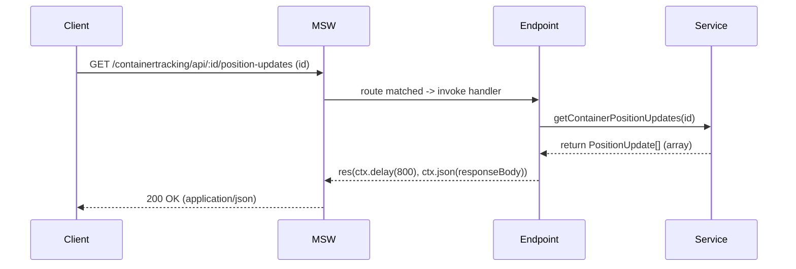
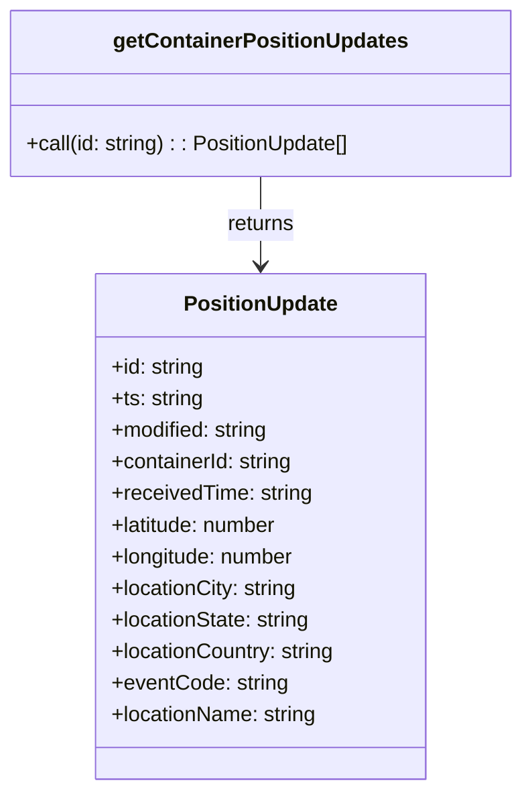
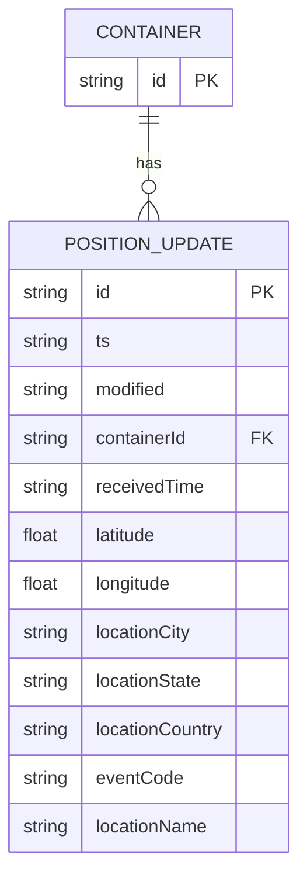

# Diagram: web/portal/src/mocks/handlers/reuse-trip-container/position-updates.js

> Auto-generated by Obscura crawlers

## Diagram 1

### SVG

<svg id="container" width="1390" xmlns="http://www.w3.org/2000/svg" height="459" viewBox="-50 -10 1390 459" role="graphics-document document" aria-roledescription="sequence"><g><rect x="1140" y="373" fill="#eaeaea" stroke="#666" width="150" height="65" name="Service" rx="3" ry="3" class="actor actor-bottom"></rect><text x="1215" y="405.5" dominant-baseline="central" alignment-baseline="central" class="actor actor-box" style="text-anchor: middle; font-size: 16px; font-weight: 400;"><tspan x="1215" dy="0">Service</tspan></text></g><g><rect x="833" y="373" fill="#eaeaea" stroke="#666" width="150" height="65" name="Endpoint" rx="3" ry="3" class="actor actor-bottom"></rect><text x="908" y="405.5" dominant-baseline="central" alignment-baseline="central" class="actor actor-box" style="text-anchor: middle; font-size: 16px; font-weight: 400;"><tspan x="908" dy="0">Endpoint</tspan></text></g><g><rect x="453" y="373" fill="#eaeaea" stroke="#666" width="150" height="65" name="MSW" rx="3" ry="3" class="actor actor-bottom"></rect><text x="528" y="405.5" dominant-baseline="central" alignment-baseline="central" class="actor actor-box" style="text-anchor: middle; font-size: 16px; font-weight: 400;"><tspan x="528" dy="0">MSW</tspan></text></g><g><rect x="0" y="373" fill="#eaeaea" stroke="#666" width="150" height="65" name="Client" rx="3" ry="3" class="actor actor-bottom"></rect><text x="75" y="405.5" dominant-baseline="central" alignment-baseline="central" class="actor actor-box" style="text-anchor: middle; font-size: 16px; font-weight: 400;"><tspan x="75" dy="0">Client</tspan></text></g><g><line id="actor3" x1="1215" y1="65" x2="1215" y2="373" class="actor-line 200" stroke-width="0.5px" stroke="#999" name="Service"></line><g id="root-3"><rect x="1140" y="0" fill="#eaeaea" stroke="#666" width="150" height="65" name="Service" rx="3" ry="3" class="actor actor-top"></rect><text x="1215" y="32.5" dominant-baseline="central" alignment-baseline="central" class="actor actor-box" style="text-anchor: middle; font-size: 16px; font-weight: 400;"><tspan x="1215" dy="0">Service</tspan></text></g></g><g><line id="actor2" x1="908" y1="65" x2="908" y2="373" class="actor-line 200" stroke-width="0.5px" stroke="#999" name="Endpoint"></line><g id="root-2"><rect x="833" y="0" fill="#eaeaea" stroke="#666" width="150" height="65" name="Endpoint" rx="3" ry="3" class="actor actor-top"></rect><text x="908" y="32.5" dominant-baseline="central" alignment-baseline="central" class="actor actor-box" style="text-anchor: middle; font-size: 16px; font-weight: 400;"><tspan x="908" dy="0">Endpoint</tspan></text></g></g><g><line id="actor1" x1="528" y1="65" x2="528" y2="373" class="actor-line 200" stroke-width="0.5px" stroke="#999" name="MSW"></line><g id="root-1"><rect x="453" y="0" fill="#eaeaea" stroke="#666" width="150" height="65" name="MSW" rx="3" ry="3" class="actor actor-top"></rect><text x="528" y="32.5" dominant-baseline="central" alignment-baseline="central" class="actor actor-box" style="text-anchor: middle; font-size: 16px; font-weight: 400;"><tspan x="528" dy="0">MSW</tspan></text></g></g><g><line id="actor0" x1="75" y1="65" x2="75" y2="373" class="actor-line 200" stroke-width="0.5px" stroke="#999" name="Client"></line><g id="root-0"><rect x="0" y="0" fill="#eaeaea" stroke="#666" width="150" height="65" name="Client" rx="3" ry="3" class="actor actor-top"></rect><text x="75" y="32.5" dominant-baseline="central" alignment-baseline="central" class="actor actor-box" style="text-anchor: middle; font-size: 16px; font-weight: 400;"><tspan x="75" dy="0">Client</tspan></text></g></g><g></g><defs><symbol id="computer" width="24" height="24"><path transform="scale(.5)" d="M2 2v13h20v-13h-20zm18 11h-16v-9h16v9zm-10.228 6l.466-1h3.524l.467 1h-4.457zm14.228 3h-24l2-6h2.104l-1.33 4h18.45l-1.297-4h2.073l2 6zm-5-10h-14v-7h14v7z"></path></symbol></defs><defs><symbol id="database" fill-rule="evenodd" clip-rule="evenodd"><path transform="scale(.5)" d="M12.258.001l.256.004.255.005.253.008.251.01.249.012.247.015.246.016.242.019.241.02.239.023.236.024.233.027.231.028.229.031.225.032.223.034.22.036.217.038.214.04.211.041.208.043.205.045.201.046.198.048.194.05.191.051.187.053.183.054.18.056.175.057.172.059.168.06.163.061.16.063.155.064.15.066.074.033.073.033.071.034.07.034.069.035.068.035.067.035.066.035.064.036.064.036.062.036.06.036.06.037.058.037.058.037.055.038.055.038.053.038.052.038.051.039.05.039.048.039.047.039.045.04.044.04.043.04.041.04.04.041.039.041.037.041.036.041.034.041.033.042.032.042.03.042.029.042.027.042.026.043.024.043.023.043.021.043.02.043.018.044.017.043.015.044.013.044.012.044.011.045.009.044.007.045.006.045.004.045.002.045.001.045v17l-.001.045-.002.045-.004.045-.006.045-.007.045-.009.044-.011.045-.012.044-.013.044-.015.044-.017.043-.018.044-.02.043-.021.043-.023.043-.024.043-.026.043-.027.042-.029.042-.03.042-.032.042-.033.042-.034.041-.036.041-.037.041-.039.041-.04.041-.041.04-.043.04-.044.04-.045.04-.047.039-.048.039-.05.039-.051.039-.052.038-.053.038-.055.038-.055.038-.058.037-.058.037-.06.037-.06.036-.062.036-.064.036-.064.036-.066.035-.067.035-.068.035-.069.035-.07.034-.071.034-.073.033-.074.033-.15.066-.155.064-.16.063-.163.061-.168.06-.172.059-.175.057-.18.056-.183.054-.187.053-.191.051-.194.05-.198.048-.201.046-.205.045-.208.043-.211.041-.214.04-.217.038-.22.036-.223.034-.225.032-.229.031-.231.028-.233.027-.236.024-.239.023-.241.02-.242.019-.246.016-.247.015-.249.012-.251.01-.253.008-.255.005-.256.004-.258.001-.258-.001-.256-.004-.255-.005-.253-.008-.251-.01-.249-.012-.247-.015-.245-.016-.243-.019-.241-.02-.238-.023-.236-.024-.234-.027-.231-.028-.228-.031-.226-.032-.223-.034-.22-.036-.217-.038-.214-.04-.211-.041-.208-.043-.204-.045-.201-.046-.198-.048-.195-.05-.19-.051-.187-.053-.184-.054-.179-.056-.176-.057-.172-.059-.167-.06-.164-.061-.159-.063-.155-.064-.151-.066-.074-.033-.072-.033-.072-.034-.07-.034-.069-.035-.068-.035-.067-.035-.066-.035-.064-.036-.063-.036-.062-.036-.061-.036-.06-.037-.058-.037-.057-.037-.056-.038-.055-.038-.053-.038-.052-.038-.051-.039-.049-.039-.049-.039-.046-.039-.046-.04-.044-.04-.043-.04-.041-.04-.04-.041-.039-.041-.037-.041-.036-.041-.034-.041-.033-.042-.032-.042-.03-.042-.029-.042-.027-.042-.026-.043-.024-.043-.023-.043-.021-.043-.02-.043-.018-.044-.017-.043-.015-.044-.013-.044-.012-.044-.011-.045-.009-.044-.007-.045-.006-.045-.004-.045-.002-.045-.001-.045v-17l.001-.045.002-.045.004-.045.006-.045.007-.045.009-.044.011-.045.012-.044.013-.044.015-.044.017-.043.018-.044.02-.043.021-.043.023-.043.024-.043.026-.043.027-.042.029-.042.03-.042.032-.042.033-.042.034-.041.036-.041.037-.041.039-.041.04-.041.041-.04.043-.04.044-.04.046-.04.046-.039.049-.039.049-.039.051-.039.052-.038.053-.038.055-.038.056-.038.057-.037.058-.037.06-.037.061-.036.062-.036.063-.036.064-.036.066-.035.067-.035.068-.035.069-.035.07-.034.072-.034.072-.033.074-.033.151-.066.155-.064.159-.063.164-.061.167-.06.172-.059.176-.057.179-.056.184-.054.187-.053.19-.051.195-.05.198-.048.201-.046.204-.045.208-.043.211-.041.214-.04.217-.038.22-.036.223-.034.226-.032.228-.031.231-.028.234-.027.236-.024.238-.023.241-.02.243-.019.245-.016.247-.015.249-.012.251-.01.253-.008.255-.005.256-.004.258-.001.258.001zm-9.258 20.499v.01l.001.021.003.021.004.022.005.021.006.022.007.022.009.023.01.022.011.023.012.023.013.023.015.023.016.024.017.023.018.024.019.024.021.024.022.025.023.024.024.025.052.049.056.05.061.051.066.051.07.051.075.051.079.052.084.052.088.052.092.052.097.052.102.051.105.052.11.052.114.051.119.051.123.051.127.05.131.05.135.05.139.048.144.049.147.047.152.047.155.047.16.045.163.045.167.043.171.043.176.041.178.041.183.039.187.039.19.037.194.035.197.035.202.033.204.031.209.03.212.029.216.027.219.025.222.024.226.021.23.02.233.018.236.016.24.015.243.012.246.01.249.008.253.005.256.004.259.001.26-.001.257-.004.254-.005.25-.008.247-.011.244-.012.241-.014.237-.016.233-.018.231-.021.226-.021.224-.024.22-.026.216-.027.212-.028.21-.031.205-.031.202-.034.198-.034.194-.036.191-.037.187-.039.183-.04.179-.04.175-.042.172-.043.168-.044.163-.045.16-.046.155-.046.152-.047.148-.048.143-.049.139-.049.136-.05.131-.05.126-.05.123-.051.118-.052.114-.051.11-.052.106-.052.101-.052.096-.052.092-.052.088-.053.083-.051.079-.052.074-.052.07-.051.065-.051.06-.051.056-.05.051-.05.023-.024.023-.025.021-.024.02-.024.019-.024.018-.024.017-.024.015-.023.014-.024.013-.023.012-.023.01-.023.01-.022.008-.022.006-.022.006-.022.004-.022.004-.021.001-.021.001-.021v-4.127l-.077.055-.08.053-.083.054-.085.053-.087.052-.09.052-.093.051-.095.05-.097.05-.1.049-.102.049-.105.048-.106.047-.109.047-.111.046-.114.045-.115.045-.118.044-.12.043-.122.042-.124.042-.126.041-.128.04-.13.04-.132.038-.134.038-.135.037-.138.037-.139.035-.142.035-.143.034-.144.033-.147.032-.148.031-.15.03-.151.03-.153.029-.154.027-.156.027-.158.026-.159.025-.161.024-.162.023-.163.022-.165.021-.166.02-.167.019-.169.018-.169.017-.171.016-.173.015-.173.014-.175.013-.175.012-.177.011-.178.01-.179.008-.179.008-.181.006-.182.005-.182.004-.184.003-.184.002h-.37l-.184-.002-.184-.003-.182-.004-.182-.005-.181-.006-.179-.008-.179-.008-.178-.01-.176-.011-.176-.012-.175-.013-.173-.014-.172-.015-.171-.016-.17-.017-.169-.018-.167-.019-.166-.02-.165-.021-.163-.022-.162-.023-.161-.024-.159-.025-.157-.026-.156-.027-.155-.027-.153-.029-.151-.03-.15-.03-.148-.031-.146-.032-.145-.033-.143-.034-.141-.035-.14-.035-.137-.037-.136-.037-.134-.038-.132-.038-.13-.04-.128-.04-.126-.041-.124-.042-.122-.042-.12-.044-.117-.043-.116-.045-.113-.045-.112-.046-.109-.047-.106-.047-.105-.048-.102-.049-.1-.049-.097-.05-.095-.05-.093-.052-.09-.051-.087-.052-.085-.053-.083-.054-.08-.054-.077-.054v4.127zm0-5.654v.011l.001.021.003.021.004.021.005.022.006.022.007.022.009.022.01.022.011.023.012.023.013.023.015.024.016.023.017.024.018.024.019.024.021.024.022.024.023.025.024.024.052.05.056.05.061.05.066.051.07.051.075.052.079.051.084.052.088.052.092.052.097.052.102.052.105.052.11.051.114.051.119.052.123.05.127.051.131.05.135.049.139.049.144.048.147.048.152.047.155.046.16.045.163.045.167.044.171.042.176.042.178.04.183.04.187.038.19.037.194.036.197.034.202.033.204.032.209.03.212.028.216.027.219.025.222.024.226.022.23.02.233.018.236.016.24.014.243.012.246.01.249.008.253.006.256.003.259.001.26-.001.257-.003.254-.006.25-.008.247-.01.244-.012.241-.015.237-.016.233-.018.231-.02.226-.022.224-.024.22-.025.216-.027.212-.029.21-.03.205-.032.202-.033.198-.035.194-.036.191-.037.187-.039.183-.039.179-.041.175-.042.172-.043.168-.044.163-.045.16-.045.155-.047.152-.047.148-.048.143-.048.139-.05.136-.049.131-.05.126-.051.123-.051.118-.051.114-.052.11-.052.106-.052.101-.052.096-.052.092-.052.088-.052.083-.052.079-.052.074-.051.07-.052.065-.051.06-.05.056-.051.051-.049.023-.025.023-.024.021-.025.02-.024.019-.024.018-.024.017-.024.015-.023.014-.023.013-.024.012-.022.01-.023.01-.023.008-.022.006-.022.006-.022.004-.021.004-.022.001-.021.001-.021v-4.139l-.077.054-.08.054-.083.054-.085.052-.087.053-.09.051-.093.051-.095.051-.097.05-.1.049-.102.049-.105.048-.106.047-.109.047-.111.046-.114.045-.115.044-.118.044-.12.044-.122.042-.124.042-.126.041-.128.04-.13.039-.132.039-.134.038-.135.037-.138.036-.139.036-.142.035-.143.033-.144.033-.147.033-.148.031-.15.03-.151.03-.153.028-.154.028-.156.027-.158.026-.159.025-.161.024-.162.023-.163.022-.165.021-.166.02-.167.019-.169.018-.169.017-.171.016-.173.015-.173.014-.175.013-.175.012-.177.011-.178.009-.179.009-.179.007-.181.007-.182.005-.182.004-.184.003-.184.002h-.37l-.184-.002-.184-.003-.182-.004-.182-.005-.181-.007-.179-.007-.179-.009-.178-.009-.176-.011-.176-.012-.175-.013-.173-.014-.172-.015-.171-.016-.17-.017-.169-.018-.167-.019-.166-.02-.165-.021-.163-.022-.162-.023-.161-.024-.159-.025-.157-.026-.156-.027-.155-.028-.153-.028-.151-.03-.15-.03-.148-.031-.146-.033-.145-.033-.143-.033-.141-.035-.14-.036-.137-.036-.136-.037-.134-.038-.132-.039-.13-.039-.128-.04-.126-.041-.124-.042-.122-.043-.12-.043-.117-.044-.116-.044-.113-.046-.112-.046-.109-.046-.106-.047-.105-.048-.102-.049-.1-.049-.097-.05-.095-.051-.093-.051-.09-.051-.087-.053-.085-.052-.083-.054-.08-.054-.077-.054v4.139zm0-5.666v.011l.001.02.003.022.004.021.005.022.006.021.007.022.009.023.01.022.011.023.012.023.013.023.015.023.016.024.017.024.018.023.019.024.021.025.022.024.023.024.024.025.052.05.056.05.061.05.066.051.07.051.075.052.079.051.084.052.088.052.092.052.097.052.102.052.105.051.11.052.114.051.119.051.123.051.127.05.131.05.135.05.139.049.144.048.147.048.152.047.155.046.16.045.163.045.167.043.171.043.176.042.178.04.183.04.187.038.19.037.194.036.197.034.202.033.204.032.209.03.212.028.216.027.219.025.222.024.226.021.23.02.233.018.236.017.24.014.243.012.246.01.249.008.253.006.256.003.259.001.26-.001.257-.003.254-.006.25-.008.247-.01.244-.013.241-.014.237-.016.233-.018.231-.02.226-.022.224-.024.22-.025.216-.027.212-.029.21-.03.205-.032.202-.033.198-.035.194-.036.191-.037.187-.039.183-.039.179-.041.175-.042.172-.043.168-.044.163-.045.16-.045.155-.047.152-.047.148-.048.143-.049.139-.049.136-.049.131-.051.126-.05.123-.051.118-.052.114-.051.11-.052.106-.052.101-.052.096-.052.092-.052.088-.052.083-.052.079-.052.074-.052.07-.051.065-.051.06-.051.056-.05.051-.049.023-.025.023-.025.021-.024.02-.024.019-.024.018-.024.017-.024.015-.023.014-.024.013-.023.012-.023.01-.022.01-.023.008-.022.006-.022.006-.022.004-.022.004-.021.001-.021.001-.021v-4.153l-.077.054-.08.054-.083.053-.085.053-.087.053-.09.051-.093.051-.095.051-.097.05-.1.049-.102.048-.105.048-.106.048-.109.046-.111.046-.114.046-.115.044-.118.044-.12.043-.122.043-.124.042-.126.041-.128.04-.13.039-.132.039-.134.038-.135.037-.138.036-.139.036-.142.034-.143.034-.144.033-.147.032-.148.032-.15.03-.151.03-.153.028-.154.028-.156.027-.158.026-.159.024-.161.024-.162.023-.163.023-.165.021-.166.02-.167.019-.169.018-.169.017-.171.016-.173.015-.173.014-.175.013-.175.012-.177.01-.178.01-.179.009-.179.007-.181.006-.182.006-.182.004-.184.003-.184.001-.185.001-.185-.001-.184-.001-.184-.003-.182-.004-.182-.006-.181-.006-.179-.007-.179-.009-.178-.01-.176-.01-.176-.012-.175-.013-.173-.014-.172-.015-.171-.016-.17-.017-.169-.018-.167-.019-.166-.02-.165-.021-.163-.023-.162-.023-.161-.024-.159-.024-.157-.026-.156-.027-.155-.028-.153-.028-.151-.03-.15-.03-.148-.032-.146-.032-.145-.033-.143-.034-.141-.034-.14-.036-.137-.036-.136-.037-.134-.038-.132-.039-.13-.039-.128-.041-.126-.041-.124-.041-.122-.043-.12-.043-.117-.044-.116-.044-.113-.046-.112-.046-.109-.046-.106-.048-.105-.048-.102-.048-.1-.05-.097-.049-.095-.051-.093-.051-.09-.052-.087-.052-.085-.053-.083-.053-.08-.054-.077-.054v4.153zm8.74-8.179l-.257.004-.254.005-.25.008-.247.011-.244.012-.241.014-.237.016-.233.018-.231.021-.226.022-.224.023-.22.026-.216.027-.212.028-.21.031-.205.032-.202.033-.198.034-.194.036-.191.038-.187.038-.183.04-.179.041-.175.042-.172.043-.168.043-.163.045-.16.046-.155.046-.152.048-.148.048-.143.048-.139.049-.136.05-.131.05-.126.051-.123.051-.118.051-.114.052-.11.052-.106.052-.101.052-.096.052-.092.052-.088.052-.083.052-.079.052-.074.051-.07.052-.065.051-.06.05-.056.05-.051.05-.023.025-.023.024-.021.024-.02.025-.019.024-.018.024-.017.023-.015.024-.014.023-.013.023-.012.023-.01.023-.01.022-.008.022-.006.023-.006.021-.004.022-.004.021-.001.021-.001.021.001.021.001.021.004.021.004.022.006.021.006.023.008.022.01.022.01.023.012.023.013.023.014.023.015.024.017.023.018.024.019.024.02.025.021.024.023.024.023.025.051.05.056.05.06.05.065.051.07.052.074.051.079.052.083.052.088.052.092.052.096.052.101.052.106.052.11.052.114.052.118.051.123.051.126.051.131.05.136.05.139.049.143.048.148.048.152.048.155.046.16.046.163.045.168.043.172.043.175.042.179.041.183.04.187.038.191.038.194.036.198.034.202.033.205.032.21.031.212.028.216.027.22.026.224.023.226.022.231.021.233.018.237.016.241.014.244.012.247.011.25.008.254.005.257.004.26.001.26-.001.257-.004.254-.005.25-.008.247-.011.244-.012.241-.014.237-.016.233-.018.231-.021.226-.022.224-.023.22-.026.216-.027.212-.028.21-.031.205-.032.202-.033.198-.034.194-.036.191-.038.187-.038.183-.04.179-.041.175-.042.172-.043.168-.043.163-.045.16-.046.155-.046.152-.048.148-.048.143-.048.139-.049.136-.05.131-.05.126-.051.123-.051.118-.051.114-.052.11-.052.106-.052.101-.052.096-.052.092-.052.088-.052.083-.052.079-.052.074-.051.07-.052.065-.051.06-.05.056-.05.051-.05.023-.025.023-.024.021-.024.02-.025.019-.024.018-.024.017-.023.015-.024.014-.023.013-.023.012-.023.01-.023.01-.022.008-.022.006-.023.006-.021.004-.022.004-.021.001-.021.001-.021-.001-.021-.001-.021-.004-.021-.004-.022-.006-.021-.006-.023-.008-.022-.01-.022-.01-.023-.012-.023-.013-.023-.014-.023-.015-.024-.017-.023-.018-.024-.019-.024-.02-.025-.021-.024-.023-.024-.023-.025-.051-.05-.056-.05-.06-.05-.065-.051-.07-.052-.074-.051-.079-.052-.083-.052-.088-.052-.092-.052-.096-.052-.101-.052-.106-.052-.11-.052-.114-.052-.118-.051-.123-.051-.126-.051-.131-.05-.136-.05-.139-.049-.143-.048-.148-.048-.152-.048-.155-.046-.16-.046-.163-.045-.168-.043-.172-.043-.175-.042-.179-.041-.183-.04-.187-.038-.191-.038-.194-.036-.198-.034-.202-.033-.205-.032-.21-.031-.212-.028-.216-.027-.22-.026-.224-.023-.226-.022-.231-.021-.233-.018-.237-.016-.241-.014-.244-.012-.247-.011-.25-.008-.254-.005-.257-.004-.26-.001-.26.001z"></path></symbol></defs><defs><symbol id="clock" width="24" height="24"><path transform="scale(.5)" d="M12 2c5.514 0 10 4.486 10 10s-4.486 10-10 10-10-4.486-10-10 4.486-10 10-10zm0-2c-6.627 0-12 5.373-12 12s5.373 12 12 12 12-5.373 12-12-5.373-12-12-12zm5.848 12.459c.202.038.202.333.001.372-1.907.361-6.045 1.111-6.547 1.111-.719 0-1.301-.582-1.301-1.301 0-.512.77-5.447 1.125-7.445.034-.192.312-.181.343.014l.985 6.238 5.394 1.011z"></path></symbol></defs><defs><marker id="arrowhead" refX="7.9" refY="5" markerUnits="userSpaceOnUse" markerWidth="12" markerHeight="12" orient="auto-start-reverse"><path d="M -1 0 L 10 5 L 0 10 z"></path></marker></defs><defs><marker id="crosshead" markerWidth="15" markerHeight="8" orient="auto" refX="4" refY="4.5"><path fill="none" stroke="#000000" stroke-width="1pt" d="M 1,2 L 6,7 M 6,2 L 1,7" style="stroke-dasharray: 0, 0;"></path></marker></defs><defs><marker id="filled-head" refX="15.5" refY="7" markerWidth="20" markerHeight="28" orient="auto"><path d="M 18,7 L9,13 L14,7 L9,1 Z"></path></marker></defs><defs><marker id="sequencenumber" refX="15" refY="15" markerWidth="60" markerHeight="40" orient="auto"><circle cx="15" cy="15" r="6"></circle></marker></defs><text x="300" y="80" text-anchor="middle" dominant-baseline="middle" alignment-baseline="middle" class="messageText" dy="1em" style="font-size: 16px; font-weight: 400;">GET /containertracking/api/:id/position-updates (id)</text><line x1="76" y1="113" x2="524" y2="113" class="messageLine0" stroke-width="2" stroke="none" marker-end="url(#arrowhead)" style="fill: none;"></line><text x="717" y="128" text-anchor="middle" dominant-baseline="middle" alignment-baseline="middle" class="messageText" dy="1em" style="font-size: 16px; font-weight: 400;">route matched -&gt; invoke handler</text><line x1="529" y1="161" x2="904" y2="161" class="messageLine0" stroke-width="2" stroke="none" marker-end="url(#arrowhead)" style="fill: none;"></line><text x="1060" y="176" text-anchor="middle" dominant-baseline="middle" alignment-baseline="middle" class="messageText" dy="1em" style="font-size: 16px; font-weight: 400;">getContainerPositionUpdates(id)</text><line x1="909" y1="209" x2="1211" y2="209" class="messageLine0" stroke-width="2" stroke="none" marker-end="url(#arrowhead)" style="fill: none;"></line><text x="1063" y="224" text-anchor="middle" dominant-baseline="middle" alignment-baseline="middle" class="messageText" dy="1em" style="font-size: 16px; font-weight: 400;">return PositionUpdate[] (array)</text><line x1="1214" y1="257" x2="912" y2="257" class="messageLine1" stroke-width="2" stroke="none" marker-end="url(#arrowhead)" style="stroke-dasharray: 3, 3; fill: none;"></line><text x="720" y="272" text-anchor="middle" dominant-baseline="middle" alignment-baseline="middle" class="messageText" dy="1em" style="font-size: 16px; font-weight: 400;">res(ctx.delay(800), ctx.json(responseBody))</text><line x1="907" y1="305" x2="532" y2="305" class="messageLine1" stroke-width="2" stroke="none" marker-end="url(#arrowhead)" style="stroke-dasharray: 3, 3; fill: none;"></line><text x="303" y="320" text-anchor="middle" dominant-baseline="middle" alignment-baseline="middle" class="messageText" dy="1em" style="font-size: 16px; font-weight: 400;">200 OK (application/json)</text><line x1="527" y1="353" x2="79" y2="353" class="messageLine1" stroke-width="2" stroke="none" marker-end="url(#arrowhead)" style="stroke-dasharray: 3, 3; fill: none;"></line></svg>

## Diagram 2

### SVG

<svg id="container" width="397.765625" xmlns="http://www.w3.org/2000/svg" class="classDiagram" height="600" viewBox="0 0 397.765625 600" role="graphics-document document" aria-roledescription="class"><g><defs><marker id="container_class-aggregationStart" class="marker aggregation class" refX="18" refY="7" markerWidth="190" markerHeight="240" orient="auto"><path d="M 18,7 L9,13 L1,7 L9,1 Z"></path></marker></defs><defs><marker id="container_class-aggregationEnd" class="marker aggregation class" refX="1" refY="7" markerWidth="20" markerHeight="28" orient="auto"><path d="M 18,7 L9,13 L1,7 L9,1 Z"></path></marker></defs><defs><marker id="container_class-extensionStart" class="marker extension class" refX="18" refY="7" markerWidth="190" markerHeight="240" orient="auto"><path d="M 1,7 L18,13 V 1 Z"></path></marker></defs><defs><marker id="container_class-extensionEnd" class="marker extension class" refX="1" refY="7" markerWidth="20" markerHeight="28" orient="auto"><path d="M 1,1 V 13 L18,7 Z"></path></marker></defs><defs><marker id="container_class-compositionStart" class="marker composition class" refX="18" refY="7" markerWidth="190" markerHeight="240" orient="auto"><path d="M 18,7 L9,13 L1,7 L9,1 Z"></path></marker></defs><defs><marker id="container_class-compositionEnd" class="marker composition class" refX="1" refY="7" markerWidth="20" markerHeight="28" orient="auto"><path d="M 18,7 L9,13 L1,7 L9,1 Z"></path></marker></defs><defs><marker id="container_class-dependencyStart" class="marker dependency class" refX="6" refY="7" markerWidth="190" markerHeight="240" orient="auto"><path d="M 5,7 L9,13 L1,7 L9,1 Z"></path></marker></defs><defs><marker id="container_class-dependencyEnd" class="marker dependency class" refX="13" refY="7" markerWidth="20" markerHeight="28" orient="auto"><path d="M 18,7 L9,13 L14,7 L9,1 Z"></path></marker></defs><defs><marker id="container_class-lollipopStart" class="marker lollipop class" refX="13" refY="7" markerWidth="190" markerHeight="240" orient="auto"><circle stroke="black" fill="transparent" cx="7" cy="7" r="6"></circle></marker></defs><defs><marker id="container_class-lollipopEnd" class="marker lollipop class" refX="1" refY="7" markerWidth="190" markerHeight="240" orient="auto"><circle stroke="black" fill="transparent" cx="7" cy="7" r="6"></circle></marker></defs><g class="root"><g class="clusters"></g><g class="edgePaths"><path d="M198.883,134L198.883,140.167C198.883,146.333,198.883,158.667,198.883,170C198.883,181.333,198.883,191.667,198.883,196.833L198.883,202" id="id_getContainerPositionUpdates_PositionUpdate_1" class="edge-thickness-normal edge-pattern-solid relation" style=";;;" data-edge="true" data-et="edge" data-id="id_getContainerPositionUpdates_PositionUpdate_1" data-points="W3sieCI6MTk4Ljg4MjgxMjUsInkiOjEzNH0seyJ4IjoxOTguODgyODEyNSwieSI6MTcxfSx7IngiOjE5OC44ODI4MTI1LCJ5IjoyMDh9XQ==" marker-end="url(#container_class-dependencyEnd)"></path></g><g class="edgeLabels"><g class="edgeLabel" transform="translate(198.8828125, 171)"><g class="label" data-id="id_getContainerPositionUpdates_PositionUpdate_1" transform="translate(-26.265625, -12)"><foreignObject width="52.53125" height="24">

returns

</foreignObject></g></g></g><g class="nodes"><g class="node default" id="classId-PositionUpdate-0" transform="translate(198.8828125, 400)"><g class="basic label-container"><path d="M-126.96875 -192 L126.96875 -192 L126.96875 192 L-126.96875 192" stroke="none" stroke-width="0" fill="#ECECFF" style=""></path><path d="M-126.96875 -192 C-29.670672216105856 -192, 67.62740556778829 -192, 126.96875 -192 M-126.96875 -192 C-54.07916014726091 -192, 18.810429705478185 -192, 126.96875 -192 M126.96875 -192 C126.96875 -67.34830721025634, 126.96875 57.303385579487326, 126.96875 192 M126.96875 -192 C126.96875 -62.10720543646019, 126.96875 67.78558912707962, 126.96875 192 M126.96875 192 C28.889010023535775 192, -69.19072995292845 192, -126.96875 192 M126.96875 192 C60.64668415844059 192, -5.675381683118815 192, -126.96875 192 M-126.96875 192 C-126.96875 107.88168583539833, -126.96875 23.76337167079666, -126.96875 -192 M-126.96875 192 C-126.96875 64.706759452485, -126.96875 -62.586481095029995, -126.96875 -192" stroke="#9370DB" stroke-width="1.3" fill="none" stroke-dasharray="0 0" style=""></path></g><g class="annotation-group text" transform="translate(0, -168)"></g><g class="label-group text" transform="translate(-56.515625, -168)"><g class="label" style="font-weight: bolder" transform="translate(0,-12)"><foreignObject width="113.03125" height="24">

PositionUpdate

</foreignObject></g></g><g class="members-group text" transform="translate(-114.96875, -120)"><g class="label" style="" transform="translate(0,-12)"><foreignObject width="71.78125" height="24">

+id: string

</foreignObject></g><g class="label" style="" transform="translate(0,12)"><foreignObject width="70.875" height="24">

+ts: string

</foreignObject></g><g class="label" style="" transform="translate(0,36)"><foreignObject width="122.328125" height="24">

+modified: string

</foreignObject></g><g class="label" style="" transform="translate(0,60)"><foreignObject width="141.1875" height="24">

+containerId: string

</foreignObject></g><g class="label" style="" transform="translate(0,84)"><foreignObject width="153.984375" height="24">

+receivedTime: string

</foreignObject></g><g class="label" style="" transform="translate(0,108)"><foreignObject width="129.84375" height="24">

+latitude: number

</foreignObject></g><g class="label" style="" transform="translate(0,132)"><foreignObject width="142.40625" height="24">

+longitude: number

</foreignObject></g><g class="label" style="" transform="translate(0,156)"><foreignObject width="143.953125" height="24">

+locationCity: string

</foreignObject></g><g class="label" style="" transform="translate(0,180)"><foreignObject width="154.203125" height="24">

+locationState: string

</foreignObject></g><g class="label" style="" transform="translate(0,204)"><foreignObject width="173.421875" height="24">

+locationCountry: string

</foreignObject></g><g class="label" style="" transform="translate(0,228)"><foreignObject width="134.3125" height="24">

+eventCode: string

</foreignObject></g><g class="label" style="" transform="translate(0,252)"><foreignObject width="158.921875" height="24">

+locationName: string

</foreignObject></g></g><g class="methods-group text" transform="translate(-114.96875, 192)"></g><g class="divider" style=""><path d="M-126.96875 -144 C-69.67059950167187 -144, -12.372449003343746 -144, 126.96875 -144 M-126.96875 -144 C-28.07332014974189 -144, 70.82210970051622 -144, 126.96875 -144" stroke="#9370DB" stroke-width="1.3" fill="none" stroke-dasharray="0 0" style=""></path></g><g class="divider" style=""><path d="M-126.96875 168 C-66.17510202517856 168, -5.381454050357121 168, 126.96875 168 M-126.96875 168 C-70.41952968391243 168, -13.870309367824845 168, 126.96875 168" stroke="#9370DB" stroke-width="1.3" fill="none" stroke-dasharray="0 0" style=""></path></g></g><g class="node default" id="classId-getContainerPositionUpdates-1" transform="translate(198.8828125, 71)"><g class="basic label-container"><path d="M-190.8828125 -63 L190.8828125 -63 L190.8828125 63 L-190.8828125 63" stroke="none" stroke-width="0" fill="#ECECFF" style=""></path><path d="M-190.8828125 -63 C-102.76604649903747 -63, -14.649280498074944 -63, 190.8828125 -63 M-190.8828125 -63 C-82.57998421350376 -63, 25.722844072992473 -63, 190.8828125 -63 M190.8828125 -63 C190.8828125 -20.757253229518227, 190.8828125 21.485493540963546, 190.8828125 63 M190.8828125 -63 C190.8828125 -37.1519542019537, 190.8828125 -11.303908403907393, 190.8828125 63 M190.8828125 63 C62.641007374173 63, -65.600797751654 63, -190.8828125 63 M190.8828125 63 C52.528537698593624 63, -85.82573710281275 63, -190.8828125 63 M-190.8828125 63 C-190.8828125 23.11963512029098, -190.8828125 -16.76072975941804, -190.8828125 -63 M-190.8828125 63 C-190.8828125 20.56744767330739, -190.8828125 -21.865104653385217, -190.8828125 -63" stroke="#9370DB" stroke-width="1.3" fill="none" stroke-dasharray="0 0" style=""></path></g><g class="annotation-group text" transform="translate(0, -39)"></g><g class="label-group text" transform="translate(-107.71875, -39)"><g class="label" style="font-weight: bolder" transform="translate(0,-12)"><foreignObject width="215.4375" height="24">

getContainerPositionUpdates

</foreignObject></g></g><g class="members-group text" transform="translate(-178.8828125, 9)"></g><g class="methods-group text" transform="translate(-178.8828125, 39)"><g class="label" style="" transform="translate(0,-12)"><foreignObject width="250.046875" height="24">

+call(id: string) : : PositionUpdate[]

</foreignObject></g></g><g class="divider" style=""><path d="M-190.8828125 -15 C-113.49409844649597 -15, -36.10538439299194 -15, 190.8828125 -15 M-190.8828125 -15 C-75.6530411301312 -15, 39.5767302397376 -15, 190.8828125 -15" stroke="#9370DB" stroke-width="1.3" fill="none" stroke-dasharray="0 0" style=""></path></g><g class="divider" style=""><path d="M-190.8828125 9 C-67.01992903026625 9, 56.84295443946749 9, 190.8828125 9 M-190.8828125 9 C-86.5838285017838 9, 17.715155496432402 9, 190.8828125 9" stroke="#9370DB" stroke-width="1.3" fill="none" stroke-dasharray="0 0" style=""></path></g></g></g></g></g></svg>

## Diagram 3

### SVG

<svg id="container" width="267.03125" xmlns="http://www.w3.org/2000/svg" class="erDiagram" height="758.25" viewBox="0 0 267.03125 758.25" role="graphics-document document" aria-roledescription="er"><g><defs><marker id="container_er-onlyOneStart" class="marker onlyOne er" refX="0" refY="9" markerWidth="18" markerHeight="18" orient="auto"><path d="M9,0 L9,18 M15,0 L15,18"></path></marker></defs><defs><marker id="container_er-onlyOneEnd" class="marker onlyOne er" refX="18" refY="9" markerWidth="18" markerHeight="18" orient="auto"><path d="M3,0 L3,18 M9,0 L9,18"></path></marker></defs><defs><marker id="container_er-zeroOrOneStart" class="marker zeroOrOne er" refX="0" refY="9" markerWidth="30" markerHeight="18" orient="auto"><circle fill="white" cx="21" cy="9" r="6"></circle><path d="M9,0 L9,18"></path></marker></defs><defs><marker id="container_er-zeroOrOneEnd" class="marker zeroOrOne er" refX="30" refY="9" markerWidth="30" markerHeight="18" orient="auto"><circle fill="white" cx="9" cy="9" r="6"></circle><path d="M21,0 L21,18"></path></marker></defs><defs><marker id="container_er-oneOrMoreStart" class="marker oneOrMore er" refX="18" refY="18" markerWidth="45" markerHeight="36" orient="auto"><path d="M0,18 Q 18,0 36,18 Q 18,36 0,18 M42,9 L42,27"></path></marker></defs><defs><marker id="container_er-oneOrMoreEnd" class="marker oneOrMore er" refX="27" refY="18" markerWidth="45" markerHeight="36" orient="auto"><path d="M3,9 L3,27 M9,18 Q27,0 45,18 Q27,36 9,18"></path></marker></defs><defs><marker id="container_er-zeroOrMoreStart" class="marker zeroOrMore er" refX="18" refY="18" markerWidth="57" markerHeight="36" orient="auto"><circle fill="white" cx="48" cy="18" r="6"></circle><path d="M0,18 Q18,0 36,18 Q18,36 0,18"></path></marker></defs><defs><marker id="container_er-zeroOrMoreEnd" class="marker zeroOrMore er" refX="39" refY="18" markerWidth="57" markerHeight="36" orient="auto"><circle fill="white" cx="9" cy="18" r="6"></circle><path d="M21,18 Q39,0 57,18 Q39,36 21,18"></path></marker></defs><g class="root"><g class="clusters"></g><g class="edgePaths"><path d="M133.516,93.5L133.516,101.917C133.516,110.333,133.516,127.167,133.516,144C133.516,160.833,133.516,177.667,133.516,186.083L133.516,194.5" id="id_entity-CONTAINER-0_entity-POSITION_UPDATE-1_0" class="edge-thickness-normal edge-pattern-solid relationshipLine" style="undefined;;;undefined" data-edge="true" data-et="edge" data-id="id_entity-CONTAINER-0_entity-POSITION_UPDATE-1_0" data-points="W3sieCI6MTMzLjUxNTYyNSwieSI6OTMuNX0seyJ4IjoxMzMuNTE1NjI1LCJ5IjoxNDR9LHsieCI6MTMzLjUxNTYyNSwieSI6MTk0LjV9XQ==" marker-start="url(#container_er-onlyOneStart)" marker-end="url(#container_er-zeroOrMoreEnd)"></path></g><g class="edgeLabels"><g class="edgeLabel" transform="translate(133.515625, 144)"><g class="label" data-id="id_entity-CONTAINER-0_entity-POSITION_UPDATE-1_0" transform="translate(-11.109375, -10.5)"><foreignObject width="22.21875" height="21">

has

</foreignObject></g></g></g><g class="nodes"><g class="node default" id="entity-CONTAINER-0" transform="translate(133.515625, 50.75)"><g style=""><path d="M-74.734375 -42.75 L74.734375 -42.75 L74.734375 42.75 L-74.734375 42.75" stroke="none" stroke-width="0" fill="#ECECFF"></path><path d="M-74.734375 -42.75 C-43.96512189776222 -42.75, -13.19586879552444 -42.75, 74.734375 -42.75 M-74.734375 -42.75 C-23.064419269026203 -42.75, 28.605536461947594 -42.75, 74.734375 -42.75 M74.734375 -42.75 C74.734375 -22.688860996495784, 74.734375 -2.6277219929915674, 74.734375 42.75 M74.734375 -42.75 C74.734375 -12.462758188651105, 74.734375 17.82448362269779, 74.734375 42.75 M74.734375 42.75 C35.32272638305739 42.75, -4.088922233885214 42.75, -74.734375 42.75 M74.734375 42.75 C40.61675735767677 42.75, 6.499139715353536 42.75, -74.734375 42.75 M-74.734375 42.75 C-74.734375 20.656633864747903, -74.734375 -1.4367322705041943, -74.734375 -42.75 M-74.734375 42.75 C-74.734375 12.774060406187743, -74.734375 -17.201879187624513, -74.734375 -42.75" stroke="#9370DB" stroke-width="1.3" fill="none" stroke-dasharray="0 0"></path></g><g style="" class="row-rect-odd"><path d="M-74.734375 0 L74.734375 0 L74.734375 42.75 L-74.734375 42.75" stroke="none" stroke-width="0" fill="hsl(240, 100%, 100%)"></path><path d="M-74.734375 0 C-24.312286124966164 0, 26.109802750067672 0, 74.734375 0 M-74.734375 0 C-41.39933748947305 0, -8.064299978946096 0, 74.734375 0 M74.734375 0 C74.734375 9.338229457323367, 74.734375 18.676458914646734, 74.734375 42.75 M74.734375 0 C74.734375 10.336406984883899, 74.734375 20.672813969767798, 74.734375 42.75 M74.734375 42.75 C44.486017566901786 42.75, 14.237660133803573 42.75, -74.734375 42.75 M74.734375 42.75 C44.495054070006816 42.75, 14.255733140013625 42.75, -74.734375 42.75 M-74.734375 42.75 C-74.734375 34.11277240258521, -74.734375 25.47554480517042, -74.734375 0 M-74.734375 42.75 C-74.734375 32.0747778269436, -74.734375 21.3995556538872, -74.734375 0" stroke="#9370DB" stroke-width="1.3" fill="none" stroke-dasharray="0 0"></path></g><g class="label name" transform="translate(-40.5859375, -33.375)" style=""><foreignObject width="81.171875" height="24">

CONTAINER

</foreignObject></g><g class="label attribute-type" transform="translate(-62.234375, 9.375)" style=""><foreignObject width="41.640625" height="24">

string

</foreignObject></g><g class="label attribute-name" transform="translate(4.40625, 9.375)" style=""><foreignObject width="14.09375" height="24">

id

</foreignObject></g><g class="label attribute-keys" transform="translate(43.5, 9.375)" style=""><foreignObject width="18.734375" height="24">

PK

</foreignObject></g><g class="label attribute-comment" transform="translate(87.234375, 9.375)" style=""><foreignObject width="0" height="0">

</foreignObject></g><g class="divider"><path d="M-74.734375 0 C-33.06964535494411 0, 8.595084290111785 0, 74.734375 0 M-74.734375 0 C-34.26537353763103 0, 6.203627924737944 0, 74.734375 0" stroke="#9370DB" stroke-width="1.3" fill="none" stroke-dasharray="0 0"></path></g><g class="divider"><path d="M-8.09375 0 C-8.09375 11.792220007582655, -8.09375 23.58444001516531, -8.09375 42.75 M-8.09375 0 C-8.09375 11.310401911313539, -8.09375 22.620803822627078, -8.09375 42.75" stroke="#9370DB" stroke-width="1.3" fill="none" stroke-dasharray="0 0"></path></g><g class="divider"><path d="M31 0 C31 8.64529894692157, 31 17.29059789384314, 31 42.75 M31 0 C31 12.127339736325059, 31 24.254679472650118, 31 42.75" stroke="#9370DB" stroke-width="1.3" fill="none" stroke-dasharray="0 0"></path></g><g class="divider"><path d="M-74.734375 0 C-34.549076649839776 0, 5.636221700320448 0, 74.734375 0 M-74.734375 0 C-44.23398513476428 0, -13.733595269528571 0, 74.734375 0" stroke="#9370DB" stroke-width="1.3" fill="none" stroke-dasharray="0 0"></path></g></g><g class="node default" id="entity-POSITION_UPDATE-1" transform="translate(133.515625, 472.375)"><g style=""><path d="M-125.515625 -277.875 L125.515625 -277.875 L125.515625 277.875 L-125.515625 277.875" stroke="none" stroke-width="0" fill="#ECECFF"></path><path d="M-125.515625 -277.875 C-53.5268204880841 -277.875, 18.461984023831803 -277.875, 125.515625 -277.875 M-125.515625 -277.875 C-52.74885391870886 -277.875, 20.01791716258228 -277.875, 125.515625 -277.875 M125.515625 -277.875 C125.515625 -163.8128777762808, 125.515625 -49.75075555256157, 125.515625 277.875 M125.515625 -277.875 C125.515625 -150.39877718710034, 125.515625 -22.922554374200644, 125.515625 277.875 M125.515625 277.875 C28.5921992149231 277.875, -68.3312265701538 277.875, -125.515625 277.875 M125.515625 277.875 C59.40702833867839 277.875, -6.701568322643226 277.875, -125.515625 277.875 M-125.515625 277.875 C-125.515625 55.60289029366882, -125.515625 -166.66921941266236, -125.515625 -277.875 M-125.515625 277.875 C-125.515625 165.7448549645225, -125.515625 53.61470992904498, -125.515625 -277.875" stroke="#9370DB" stroke-width="1.3" fill="none" stroke-dasharray="0 0"></path></g><g style="" class="row-rect-odd"><path d="M-125.515625 -235.125 L125.515625 -235.125 L125.515625 -192.375 L-125.515625 -192.375" stroke="none" stroke-width="0" fill="hsl(240, 100%, 100%)"></path><path d="M-125.515625 -235.125 C-66.36727491304686 -235.125, -7.218924826093698 -235.125, 125.515625 -235.125 M-125.515625 -235.125 C-58.73532341329627 -235.125, 8.044978173407458 -235.125, 125.515625 -235.125 M125.515625 -235.125 C125.515625 -221.1740724164199, 125.515625 -207.22314483283984, 125.515625 -192.375 M125.515625 -235.125 C125.515625 -225.15115693253134, 125.515625 -215.17731386506264, 125.515625 -192.375 M125.515625 -192.375 C35.85461713537077 -192.375, -53.80639072925845 -192.375, -125.515625 -192.375 M125.515625 -192.375 C63.53951613453759 -192.375, 1.563407269075185 -192.375, -125.515625 -192.375 M-125.515625 -192.375 C-125.515625 -203.26438877958086, -125.515625 -214.1537775591617, -125.515625 -235.125 M-125.515625 -192.375 C-125.515625 -204.62951629540063, -125.515625 -216.88403259080127, -125.515625 -235.125" stroke="#9370DB" stroke-width="1.3" fill="none" stroke-dasharray="0 0"></path></g><g style="" class="row-rect-even"><path d="M-125.515625 -192.375 L125.515625 -192.375 L125.515625 -149.625 L-125.515625 -149.625" stroke="none" stroke-width="0" fill="hsl(240, 100%, 97.2745098039%)"></path><path d="M-125.515625 -192.375 C-28.927004618096916 -192.375, 67.66161576380617 -192.375, 125.515625 -192.375 M-125.515625 -192.375 C-56.09764122397746 -192.375, 13.320342552045076 -192.375, 125.515625 -192.375 M125.515625 -192.375 C125.515625 -176.4930507612866, 125.515625 -160.61110152257325, 125.515625 -149.625 M125.515625 -192.375 C125.515625 -176.70017818799676, 125.515625 -161.02535637599354, 125.515625 -149.625 M125.515625 -149.625 C67.16789310735291 -149.625, 8.820161214705806 -149.625, -125.515625 -149.625 M125.515625 -149.625 C27.161905560902525 -149.625, -71.19181387819495 -149.625, -125.515625 -149.625 M-125.515625 -149.625 C-125.515625 -161.94896400386884, -125.515625 -174.27292800773768, -125.515625 -192.375 M-125.515625 -149.625 C-125.515625 -163.5086105807057, -125.515625 -177.39222116141136, -125.515625 -192.375" stroke="#9370DB" stroke-width="1.3" fill="none" stroke-dasharray="0 0"></path></g><g style="" class="row-rect-odd"><path d="M-125.515625 -149.625 L125.515625 -149.625 L125.515625 -106.875 L-125.515625 -106.875" stroke="none" stroke-width="0" fill="hsl(240, 100%, 100%)"></path><path d="M-125.515625 -149.625 C-38.717934671507635 -149.625, 48.07975565698473 -149.625, 125.515625 -149.625 M-125.515625 -149.625 C-64.87219725242099 -149.625, -4.228769504841992 -149.625, 125.515625 -149.625 M125.515625 -149.625 C125.515625 -136.0459841917361, 125.515625 -122.46696838347216, 125.515625 -106.875 M125.515625 -149.625 C125.515625 -136.5967117868209, 125.515625 -123.56842357364175, 125.515625 -106.875 M125.515625 -106.875 C71.03339727961148 -106.875, 16.55116955922294 -106.875, -125.515625 -106.875 M125.515625 -106.875 C70.82380422202141 -106.875, 16.13198344404283 -106.875, -125.515625 -106.875 M-125.515625 -106.875 C-125.515625 -120.41540838903302, -125.515625 -133.95581677806604, -125.515625 -149.625 M-125.515625 -106.875 C-125.515625 -122.1762266609558, -125.515625 -137.4774533219116, -125.515625 -149.625" stroke="#9370DB" stroke-width="1.3" fill="none" stroke-dasharray="0 0"></path></g><g style="" class="row-rect-even"><path d="M-125.515625 -106.875 L125.515625 -106.875 L125.515625 -64.125 L-125.515625 -64.125" stroke="none" stroke-width="0" fill="hsl(240, 100%, 97.2745098039%)"></path><path d="M-125.515625 -106.875 C-52.17069363441895 -106.875, 21.174237731162094 -106.875, 125.515625 -106.875 M-125.515625 -106.875 C-49.449158727136506 -106.875, 26.617307545726987 -106.875, 125.515625 -106.875 M125.515625 -106.875 C125.515625 -95.99252327589302, 125.515625 -85.11004655178603, 125.515625 -64.125 M125.515625 -106.875 C125.515625 -96.05590277541617, 125.515625 -85.23680555083233, 125.515625 -64.125 M125.515625 -64.125 C72.29436686242772 -64.125, 19.07310872485546 -64.125, -125.515625 -64.125 M125.515625 -64.125 C70.69177330862522 -64.125, 15.867921617250417 -64.125, -125.515625 -64.125 M-125.515625 -64.125 C-125.515625 -80.25208279790199, -125.515625 -96.37916559580398, -125.515625 -106.875 M-125.515625 -64.125 C-125.515625 -75.16566438751867, -125.515625 -86.20632877503736, -125.515625 -106.875" stroke="#9370DB" stroke-width="1.3" fill="none" stroke-dasharray="0 0"></path></g><g style="" class="row-rect-odd"><path d="M-125.515625 -64.125 L125.515625 -64.125 L125.515625 -21.375 L-125.515625 -21.375" stroke="none" stroke-width="0" fill="hsl(240, 100%, 100%)"></path><path d="M-125.515625 -64.125 C-58.63992777004361 -64.125, 8.235769459912774 -64.125, 125.515625 -64.125 M-125.515625 -64.125 C-52.68622324990264 -64.125, 20.143178500194722 -64.125, 125.515625 -64.125 M125.515625 -64.125 C125.515625 -50.76477294654872, 125.515625 -37.404545893097435, 125.515625 -21.375 M125.515625 -64.125 C125.515625 -54.354652408182645, 125.515625 -44.5843048163653, 125.515625 -21.375 M125.515625 -21.375 C57.01232329999321 -21.375, -11.490978400013574 -21.375, -125.515625 -21.375 M125.515625 -21.375 C49.93393877223494 -21.375, -25.647747455530123 -21.375, -125.515625 -21.375 M-125.515625 -21.375 C-125.515625 -38.354420069981124, -125.515625 -55.33384013996225, -125.515625 -64.125 M-125.515625 -21.375 C-125.515625 -31.26064858107079, -125.515625 -41.14629716214158, -125.515625 -64.125" stroke="#9370DB" stroke-width="1.3" fill="none" stroke-dasharray="0 0"></path></g><g style="" class="row-rect-even"><path d="M-125.515625 -21.375 L125.515625 -21.375 L125.515625 21.375 L-125.515625 21.375" stroke="none" stroke-width="0" fill="hsl(240, 100%, 97.2745098039%)"></path><path d="M-125.515625 -21.375 C-63.86354079157793 -21.375, -2.211456583155865 -21.375, 125.515625 -21.375 M-125.515625 -21.375 C-42.728904926084056 -21.375, 40.05781514783189 -21.375, 125.515625 -21.375 M125.515625 -21.375 C125.515625 -8.115652910356495, 125.515625 5.14369417928701, 125.515625 21.375 M125.515625 -21.375 C125.515625 -5.929469677228667, 125.515625 9.516060645542666, 125.515625 21.375 M125.515625 21.375 C72.92134289695983 21.375, 20.327060793919657 21.375, -125.515625 21.375 M125.515625 21.375 C41.228679325750306 21.375, -43.05826634849939 21.375, -125.515625 21.375 M-125.515625 21.375 C-125.515625 6.081805966044998, -125.515625 -9.211388067910004, -125.515625 -21.375 M-125.515625 21.375 C-125.515625 9.397784559480106, -125.515625 -2.5794308810397872, -125.515625 -21.375" stroke="#9370DB" stroke-width="1.3" fill="none" stroke-dasharray="0 0"></path></g><g style="" class="row-rect-odd"><path d="M-125.515625 21.375 L125.515625 21.375 L125.515625 64.125 L-125.515625 64.125" stroke="none" stroke-width="0" fill="hsl(240, 100%, 100%)"></path><path d="M-125.515625 21.375 C-61.40979030737232 21.375, 2.6960443852553624 21.375, 125.515625 21.375 M-125.515625 21.375 C-72.50943946738586 21.375, -19.50325393477172 21.375, 125.515625 21.375 M125.515625 21.375 C125.515625 30.40095050561471, 125.515625 39.42690101122942, 125.515625 64.125 M125.515625 21.375 C125.515625 31.332477404058203, 125.515625 41.289954808116406, 125.515625 64.125 M125.515625 64.125 C48.08766942712562 64.125, -29.340286145748763 64.125, -125.515625 64.125 M125.515625 64.125 C51.867337221397236 64.125, -21.78095055720553 64.125, -125.515625 64.125 M-125.515625 64.125 C-125.515625 53.69627582273474, -125.515625 43.26755164546948, -125.515625 21.375 M-125.515625 64.125 C-125.515625 55.48026665696487, -125.515625 46.835533313929744, -125.515625 21.375" stroke="#9370DB" stroke-width="1.3" fill="none" stroke-dasharray="0 0"></path></g><g style="" class="row-rect-even"><path d="M-125.515625 64.125 L125.515625 64.125 L125.515625 106.875 L-125.515625 106.875" stroke="none" stroke-width="0" fill="hsl(240, 100%, 97.2745098039%)"></path><path d="M-125.515625 64.125 C-60.006163425382624 64.125, 5.503298149234752 64.125, 125.515625 64.125 M-125.515625 64.125 C-28.961544983151242 64.125, 67.59253503369752 64.125, 125.515625 64.125 M125.515625 64.125 C125.515625 77.33090582773792, 125.515625 90.53681165547584, 125.515625 106.875 M125.515625 64.125 C125.515625 76.96171374024223, 125.515625 89.79842748048446, 125.515625 106.875 M125.515625 106.875 C27.633389274045456 106.875, -70.24884645190909 106.875, -125.515625 106.875 M125.515625 106.875 C30.133411485619604 106.875, -65.24880202876079 106.875, -125.515625 106.875 M-125.515625 106.875 C-125.515625 94.79202333359308, -125.515625 82.70904666718616, -125.515625 64.125 M-125.515625 106.875 C-125.515625 94.139079147367, -125.515625 81.403158294734, -125.515625 64.125" stroke="#9370DB" stroke-width="1.3" fill="none" stroke-dasharray="0 0"></path></g><g style="" class="row-rect-odd"><path d="M-125.515625 106.875 L125.515625 106.875 L125.515625 149.625 L-125.515625 149.625" stroke="none" stroke-width="0" fill="hsl(240, 100%, 100%)"></path><path d="M-125.515625 106.875 C-65.27342472081835 106.875, -5.0312244416367236 106.875, 125.515625 106.875 M-125.515625 106.875 C-47.98002234224457 106.875, 29.555580315510866 106.875, 125.515625 106.875 M125.515625 106.875 C125.515625 115.77563035674446, 125.515625 124.67626071348892, 125.515625 149.625 M125.515625 106.875 C125.515625 122.89856941078602, 125.515625 138.92213882157205, 125.515625 149.625 M125.515625 149.625 C52.4695930177177 149.625, -20.576438964564602 149.625, -125.515625 149.625 M125.515625 149.625 C47.863830261142795 149.625, -29.78796447771441 149.625, -125.515625 149.625 M-125.515625 149.625 C-125.515625 139.08816829281514, -125.515625 128.55133658563025, -125.515625 106.875 M-125.515625 149.625 C-125.515625 141.02666320833652, -125.515625 132.42832641667303, -125.515625 106.875" stroke="#9370DB" stroke-width="1.3" fill="none" stroke-dasharray="0 0"></path></g><g style="" class="row-rect-even"><path d="M-125.515625 149.625 L125.515625 149.625 L125.515625 192.375 L-125.515625 192.375" stroke="none" stroke-width="0" fill="hsl(240, 100%, 97.2745098039%)"></path><path d="M-125.515625 149.625 C-59.56045779311866 149.625, 6.394709413762683 149.625, 125.515625 149.625 M-125.515625 149.625 C-67.67618931981823 149.625, -9.836753639636484 149.625, 125.515625 149.625 M125.515625 149.625 C125.515625 160.85860072555343, 125.515625 172.09220145110686, 125.515625 192.375 M125.515625 149.625 C125.515625 165.7821880466597, 125.515625 181.93937609331945, 125.515625 192.375 M125.515625 192.375 C33.99799912016769 192.375, -57.51962675966462 192.375, -125.515625 192.375 M125.515625 192.375 C36.37851728028538 192.375, -52.75859043942924 192.375, -125.515625 192.375 M-125.515625 192.375 C-125.515625 180.200736114727, -125.515625 168.02647222945396, -125.515625 149.625 M-125.515625 192.375 C-125.515625 183.48000636312995, -125.515625 174.5850127262599, -125.515625 149.625" stroke="#9370DB" stroke-width="1.3" fill="none" stroke-dasharray="0 0"></path></g><g style="" class="row-rect-odd"><path d="M-125.515625 192.375 L125.515625 192.375 L125.515625 235.125 L-125.515625 235.125" stroke="none" stroke-width="0" fill="hsl(240, 100%, 100%)"></path><path d="M-125.515625 192.375 C-35.52742153034474 192.375, 54.46078193931052 192.375, 125.515625 192.375 M-125.515625 192.375 C-32.392810929146734 192.375, 60.73000314170653 192.375, 125.515625 192.375 M125.515625 192.375 C125.515625 203.70299364742056, 125.515625 215.03098729484114, 125.515625 235.125 M125.515625 192.375 C125.515625 208.45997433900152, 125.515625 224.544948678003, 125.515625 235.125 M125.515625 235.125 C52.958069757246136 235.125, -19.599485485507728 235.125, -125.515625 235.125 M125.515625 235.125 C59.45232741336855 235.125, -6.610970173262899 235.125, -125.515625 235.125 M-125.515625 235.125 C-125.515625 218.88394865990338, -125.515625 202.64289731980676, -125.515625 192.375 M-125.515625 235.125 C-125.515625 221.19763256046264, -125.515625 207.27026512092527, -125.515625 192.375" stroke="#9370DB" stroke-width="1.3" fill="none" stroke-dasharray="0 0"></path></g><g style="" class="row-rect-even"><path d="M-125.515625 235.125 L125.515625 235.125 L125.515625 277.875 L-125.515625 277.875" stroke="none" stroke-width="0" fill="hsl(240, 100%, 97.2745098039%)"></path><path d="M-125.515625 235.125 C-40.91877187708326 235.125, 43.67808124583348 235.125, 125.515625 235.125 M-125.515625 235.125 C-58.66290935169427 235.125, 8.189806296611465 235.125, 125.515625 235.125 M125.515625 235.125 C125.515625 250.6583655226081, 125.515625 266.1917310452162, 125.515625 277.875 M125.515625 235.125 C125.515625 249.08937069339862, 125.515625 263.05374138679724, 125.515625 277.875 M125.515625 277.875 C54.14758070618801 277.875, -17.220463587623982 277.875, -125.515625 277.875 M125.515625 277.875 C63.7690946851692 277.875, 2.022564370338401 277.875, -125.515625 277.875 M-125.515625 277.875 C-125.515625 267.4536888378336, -125.515625 257.0323776756673, -125.515625 235.125 M-125.515625 277.875 C-125.515625 261.3914649281637, -125.515625 244.90792985632743, -125.515625 235.125" stroke="#9370DB" stroke-width="1.3" fill="none" stroke-dasharray="0 0"></path></g><g class="label name" transform="translate(-65.9375, -268.5)" style=""><foreignObject width="131.875" height="24">

POSITION_UPDATE

</foreignObject></g><g class="label attribute-type" transform="translate(-113.015625, -225.75)" style=""><foreignObject width="41.640625" height="24">

string

</foreignObject></g><g class="label attribute-name" transform="translate(-46.375, -225.75)" style=""><foreignObject width="14.09375" height="24">

id

</foreignObject></g><g class="label attribute-keys" transform="translate(94.28125, -225.75)" style=""><foreignObject width="18.734375" height="24">

PK

</foreignObject></g><g class="label attribute-comment" transform="translate(138.015625, -225.75)" style=""><foreignObject width="0" height="0">

</foreignObject></g><g class="label attribute-type" transform="translate(-113.015625, -183)" style=""><foreignObject width="41.640625" height="24">

string

</foreignObject></g><g class="label attribute-name" transform="translate(-46.375, -183)" style=""><foreignObject width="13.25" height="24">

ts

</foreignObject></g><g class="label attribute-keys" transform="translate(94.28125, -183)" style=""><foreignObject width="0" height="0">

</foreignObject></g><g class="label attribute-comment" transform="translate(138.015625, -183)" style=""><foreignObject width="0" height="0">

</foreignObject></g><g class="label attribute-type" transform="translate(-113.015625, -140.25)" style=""><foreignObject width="41.640625" height="24">

string

</foreignObject></g><g class="label attribute-name" transform="translate(-46.375, -140.25)" style=""><foreignObject width="64.625" height="24">

modified

</foreignObject></g><g class="label attribute-keys" transform="translate(94.28125, -140.25)" style=""><foreignObject width="0" height="0">

</foreignObject></g><g class="label attribute-comment" transform="translate(138.015625, -140.25)" style=""><foreignObject width="0" height="0">

</foreignObject></g><g class="label attribute-type" transform="translate(-113.015625, -97.5)" style=""><foreignObject width="41.640625" height="24">

string

</foreignObject></g><g class="label attribute-name" transform="translate(-46.375, -97.5)" style=""><foreignObject width="83.5" height="24">

containerId

</foreignObject></g><g class="label attribute-keys" transform="translate(94.28125, -97.5)" style=""><foreignObject width="17.28125" height="24">

FK

</foreignObject></g><g class="label attribute-comment" transform="translate(138.015625, -97.5)" style=""><foreignObject width="0" height="0">

</foreignObject></g><g class="label attribute-type" transform="translate(-113.015625, -54.75)" style=""><foreignObject width="41.640625" height="24">

string

</foreignObject></g><g class="label attribute-name" transform="translate(-46.375, -54.75)" style=""><foreignObject width="96.296875" height="24">

receivedTime

</foreignObject></g><g class="label attribute-keys" transform="translate(94.28125, -54.75)" style=""><foreignObject width="0" height="0">

</foreignObject></g><g class="label attribute-comment" transform="translate(138.015625, -54.75)" style=""><foreignObject width="0" height="0">

</foreignObject></g><g class="label attribute-type" transform="translate(-113.015625, -12)" style=""><foreignObject width="33.0625" height="24">

float

</foreignObject></g><g class="label attribute-name" transform="translate(-46.375, -12)" style=""><foreignObject width="56.984375" height="24">

latitude

</foreignObject></g><g class="label attribute-keys" transform="translate(94.28125, -12)" style=""><foreignObject width="0" height="0">

</foreignObject></g><g class="label attribute-comment" transform="translate(138.015625, -12)" style=""><foreignObject width="0" height="0">

</foreignObject></g><g class="label attribute-type" transform="translate(-113.015625, 30.75)" style=""><foreignObject width="33.0625" height="24">

float

</foreignObject></g><g class="label attribute-name" transform="translate(-46.375, 30.75)" style=""><foreignObject width="69.546875" height="24">

longitude

</foreignObject></g><g class="label attribute-keys" transform="translate(94.28125, 30.75)" style=""><foreignObject width="0" height="0">

</foreignObject></g><g class="label attribute-comment" transform="translate(138.015625, 30.75)" style=""><foreignObject width="0" height="0">

</foreignObject></g><g class="label attribute-type" transform="translate(-113.015625, 73.5)" style=""><foreignObject width="41.640625" height="24">

string

</foreignObject></g><g class="label attribute-name" transform="translate(-46.375, 73.5)" style=""><foreignObject width="86.203125" height="24">

locationCity

</foreignObject></g><g class="label attribute-keys" transform="translate(94.28125, 73.5)" style=""><foreignObject width="0" height="0">

</foreignObject></g><g class="label attribute-comment" transform="translate(138.015625, 73.5)" style=""><foreignObject width="0" height="0">

</foreignObject></g><g class="label attribute-type" transform="translate(-113.015625, 116.25)" style=""><foreignObject width="41.640625" height="24">

string

</foreignObject></g><g class="label attribute-name" transform="translate(-46.375, 116.25)" style=""><foreignObject width="96.5" height="24">

locationState

</foreignObject></g><g class="label attribute-keys" transform="translate(94.28125, 116.25)" style=""><foreignObject width="0" height="0">

</foreignObject></g><g class="label attribute-comment" transform="translate(138.015625, 116.25)" style=""><foreignObject width="0" height="0">

</foreignObject></g><g class="label attribute-type" transform="translate(-113.015625, 159)" style=""><foreignObject width="41.640625" height="24">

string

</foreignObject></g><g class="label attribute-name" transform="translate(-46.375, 159)" style=""><foreignObject width="115.65625" height="24">

locationCountry

</foreignObject></g><g class="label attribute-keys" transform="translate(94.28125, 159)" style=""><foreignObject width="0" height="0">

</foreignObject></g><g class="label attribute-comment" transform="translate(138.015625, 159)" style=""><foreignObject width="0" height="0">

</foreignObject></g><g class="label attribute-type" transform="translate(-113.015625, 201.75)" style=""><foreignObject width="41.640625" height="24">

string

</foreignObject></g><g class="label attribute-name" transform="translate(-46.375, 201.75)" style=""><foreignObject width="76.609375" height="24">

eventCode

</foreignObject></g><g class="label attribute-keys" transform="translate(94.28125, 201.75)" style=""><foreignObject width="0" height="0">

</foreignObject></g><g class="label attribute-comment" transform="translate(138.015625, 201.75)" style=""><foreignObject width="0" height="0">

</foreignObject></g><g class="label attribute-type" transform="translate(-113.015625, 244.5)" style=""><foreignObject width="41.640625" height="24">

string

</foreignObject></g><g class="label attribute-name" transform="translate(-46.375, 244.5)" style=""><foreignObject width="101.21875" height="24">

locationName

</foreignObject></g><g class="label attribute-keys" transform="translate(94.28125, 244.5)" style=""><foreignObject width="0" height="0">

</foreignObject></g><g class="label attribute-comment" transform="translate(138.015625, 244.5)" style=""><foreignObject width="0" height="0">

</foreignObject></g><g class="divider"><path d="M-125.515625 -235.125 C-74.81882153344185 -235.125, -24.122018066883683 -235.125, 125.515625 -235.125 M-125.515625 -235.125 C-57.80923779723426 -235.125, 9.89714940553148 -235.125, 125.515625 -235.125" stroke="#9370DB" stroke-width="1.3" fill="none" stroke-dasharray="0 0"></path></g><g class="divider"><path d="M-58.875 -235.125 C-58.875 -45.242948874659476, -58.875 144.63910225068105, -58.875 277.875 M-58.875 -235.125 C-58.875 -96.22999193219437, -58.875 42.66501613561127, -58.875 277.875" stroke="#9370DB" stroke-width="1.3" fill="none" stroke-dasharray="0 0"></path></g><g class="divider"><path d="M81.78125 -235.125 C81.78125 -110.25671106667104, 81.78125 14.61157786665791, 81.78125 277.875 M81.78125 -235.125 C81.78125 -123.60183333201275, 81.78125 -12.07866666402549, 81.78125 277.875" stroke="#9370DB" stroke-width="1.3" fill="none" stroke-dasharray="0 0"></path></g><g class="divider"><path d="M-125.515625 -235.125 C-38.29502763172418 -235.125, 48.92556973655164 -235.125, 125.515625 -235.125 M-125.515625 -235.125 C-58.71446337235001 -235.125, 8.086698255299979 -235.125, 125.515625 -235.125" stroke="#9370DB" stroke-width="1.3" fill="none" stroke-dasharray="0 0"></path></g></g></g></g></g></svg>
