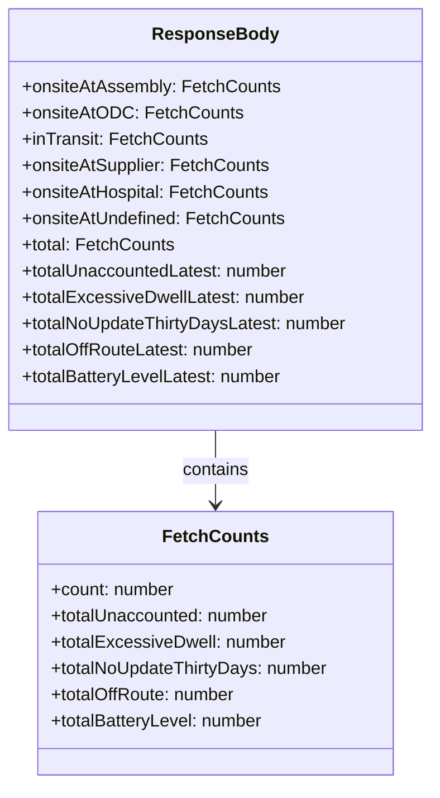

# Diagram: web/portal/src/mocks/handlers/reuse-trip-container/totals.js


> Auto-generated by Obscura crawlers

## Diagram 1

```mermaid
flowchart LR
  Client[Client GET /containertracking/api/reuse-trip-container-totals] --> MSW[MSW rest.get: handleContainerTotals]
  MSW --> FetchA[fetchCounts(...) for onsiteAtAssembly]
  MSW --> FetchB[fetchCounts(...) for onsiteAtODC]
  MSW --> FetchC[fetchCounts(...) for inTransit]
  MSW --> FetchD[fetchCounts(...) for onsiteAtSupplier]
  MSW --> FetchE[fetchCounts(...) for onsiteAtHospital]
  MSW --> FetchF[fetchCounts(...) for onsiteAtUndefined]
  MSW --> FetchTotal[fetchCounts(...) for total + add *Latest fields]
  FetchA --> Ret{{fetchCounts returns counts object}}
  FetchB --> Ret
  FetchC --> Ret
  FetchD --> Ret
  FetchE --> Ret
  FetchF --> Ret
  FetchTotal --> Ret
  Ret --> Assemble[Assemble responseBody with keys: onsiteAtAssembly, onsiteAtODC, inTransit, onsiteAtSupplier, onsiteAtHospital, onsiteAtUndefined, total]
  Assemble --> Respond[res(ctx.json(responseBody))]
  Respond --> ClientResponse[Client receives JSON]
```

> SVG rendering failed for this diagram.

## Diagram 2



### SVG

<svg id="container" width="393.2734375" xmlns="http://www.w3.org/2000/svg" class="classDiagram" height="714" viewBox="0 0 393.2734375 714" role="graphics-document document" aria-roledescription="class"><style>#container{font-family:"trebuchet ms",verdana,arial,sans-serif;font-size:16px;fill:#333;}@keyframes edge-animation-frame{from{stroke-dashoffset:0;}}@keyframes dash{to{stroke-dashoffset:0;}}#container .edge-animation-slow{stroke-dasharray:9,5!important;stroke-dashoffset:900;animation:dash 50s linear infinite;stroke-linecap:round;}#container .edge-animation-fast{stroke-dasharray:9,5!important;stroke-dashoffset:900;animation:dash 20s linear infinite;stroke-linecap:round;}#container .error-icon{fill:#552222;}#container .error-text{fill:#552222;stroke:#552222;}#container .edge-thickness-normal{stroke-width:1px;}#container .edge-thickness-thick{stroke-width:3.5px;}#container .edge-pattern-solid{stroke-dasharray:0;}#container .edge-thickness-invisible{stroke-width:0;fill:none;}#container .edge-pattern-dashed{stroke-dasharray:3;}#container .edge-pattern-dotted{stroke-dasharray:2;}#container .marker{fill:#333333;stroke:#333333;}#container .marker.cross{stroke:#333333;}#container svg{font-family:"trebuchet ms",verdana,arial,sans-serif;font-size:16px;}#container p{margin:0;}#container g.classGroup text{fill:#9370DB;stroke:none;font-family:"trebuchet ms",verdana,arial,sans-serif;font-size:10px;}#container g.classGroup text .title{font-weight:bolder;}#container .nodeLabel,#container .edgeLabel{color:#131300;}#container .edgeLabel .label rect{fill:#ECECFF;}#container .label text{fill:#131300;}#container .labelBkg{background:#ECECFF;}#container .edgeLabel .label span{background:#ECECFF;}#container .classTitle{font-weight:bolder;}#container .node rect,#container .node circle,#container .node ellipse,#container .node polygon,#container .node path{fill:#ECECFF;stroke:#9370DB;stroke-width:1px;}#container .divider{stroke:#9370DB;stroke-width:1;}#container g.clickable{cursor:pointer;}#container g.classGroup rect{fill:#ECECFF;stroke:#9370DB;}#container g.classGroup line{stroke:#9370DB;stroke-width:1;}#container .classLabel .box{stroke:none;stroke-width:0;fill:#ECECFF;opacity:0.5;}#container .classLabel .label{fill:#9370DB;font-size:10px;}#container .relation{stroke:#333333;stroke-width:1;fill:none;}#container .dashed-line{stroke-dasharray:3;}#container .dotted-line{stroke-dasharray:1 2;}#container #compositionStart,#container .composition{fill:#333333!important;stroke:#333333!important;stroke-width:1;}#container #compositionEnd,#container .composition{fill:#333333!important;stroke:#333333!important;stroke-width:1;}#container #dependencyStart,#container .dependency{fill:#333333!important;stroke:#333333!important;stroke-width:1;}#container #dependencyStart,#container .dependency{fill:#333333!important;stroke:#333333!important;stroke-width:1;}#container #extensionStart,#container .extension{fill:transparent!important;stroke:#333333!important;stroke-width:1;}#container #extensionEnd,#container .extension{fill:transparent!important;stroke:#333333!important;stroke-width:1;}#container #aggregationStart,#container .aggregation{fill:transparent!important;stroke:#333333!important;stroke-width:1;}#container #aggregationEnd,#container .aggregation{fill:transparent!important;stroke:#333333!important;stroke-width:1;}#container #lollipopStart,#container .lollipop{fill:#ECECFF!important;stroke:#333333!important;stroke-width:1;}#container #lollipopEnd,#container .lollipop{fill:#ECECFF!important;stroke:#333333!important;stroke-width:1;}#container .edgeTerminals{font-size:11px;line-height:initial;}#container .classTitleText{text-anchor:middle;font-size:18px;fill:#333;}#container .label-icon{display:inline-block;height:1em;overflow:visible;vertical-align:-0.125em;}#container .node .label-icon path{fill:currentColor;stroke:revert;stroke-width:revert;}#container :root{--mermaid-font-family:"trebuchet ms",verdana,arial,sans-serif;}</style><g><defs><marker id="container_class-aggregationStart" class="marker aggregation class" refX="18" refY="7" markerWidth="190" markerHeight="240" orient="auto"><path d="M 18,7 L9,13 L1,7 L9,1 Z"></path></marker></defs><defs><marker id="container_class-aggregationEnd" class="marker aggregation class" refX="1" refY="7" markerWidth="20" markerHeight="28" orient="auto"><path d="M 18,7 L9,13 L1,7 L9,1 Z"></path></marker></defs><defs><marker id="container_class-extensionStart" class="marker extension class" refX="18" refY="7" markerWidth="190" markerHeight="240" orient="auto"><path d="M 1,7 L18,13 V 1 Z"></path></marker></defs><defs><marker id="container_class-extensionEnd" class="marker extension class" refX="1" refY="7" markerWidth="20" markerHeight="28" orient="auto"><path d="M 1,1 V 13 L18,7 Z"></path></marker></defs><defs><marker id="container_class-compositionStart" class="marker composition class" refX="18" refY="7" markerWidth="190" markerHeight="240" orient="auto"><path d="M 18,7 L9,13 L1,7 L9,1 Z"></path></marker></defs><defs><marker id="container_class-compositionEnd" class="marker composition class" refX="1" refY="7" markerWidth="20" markerHeight="28" orient="auto"><path d="M 18,7 L9,13 L1,7 L9,1 Z"></path></marker></defs><defs><marker id="container_class-dependencyStart" class="marker dependency class" refX="6" refY="7" markerWidth="190" markerHeight="240" orient="auto"><path d="M 5,7 L9,13 L1,7 L9,1 Z"></path></marker></defs><defs><marker id="container_class-dependencyEnd" class="marker dependency class" refX="13" refY="7" markerWidth="20" markerHeight="28" orient="auto"><path d="M 18,7 L9,13 L14,7 L9,1 Z"></path></marker></defs><defs><marker id="container_class-lollipopStart" class="marker lollipop class" refX="13" refY="7" markerWidth="190" markerHeight="240" orient="auto"><circle stroke="black" fill="transparent" cx="7" cy="7" r="6"></circle></marker></defs><defs><marker id="container_class-lollipopEnd" class="marker lollipop class" refX="1" refY="7" markerWidth="190" markerHeight="240" orient="auto"><circle stroke="black" fill="transparent" cx="7" cy="7" r="6"></circle></marker></defs><g class="root"><g class="clusters"></g><g class="edgePaths"><path d="M196.637,392L196.637,398.167C196.637,404.333,196.637,416.667,196.637,428C196.637,439.333,196.637,449.667,196.637,454.833L196.637,460" id="id_ResponseBody_FetchCounts_1" class="edge-thickness-normal edge-pattern-solid relation" style=";;;" data-edge="true" data-et="edge" data-id="id_ResponseBody_FetchCounts_1" data-points="W3sieCI6MTk2LjYzNjcxODc1LCJ5IjozOTJ9LHsieCI6MTk2LjYzNjcxODc1LCJ5Ijo0Mjl9LHsieCI6MTk2LjYzNjcxODc1LCJ5Ijo0NjZ9XQ==" marker-end="url(#container_class-dependencyEnd)"></path></g><g class="edgeLabels"><g class="edgeLabel" transform="translate(196.63671875, 429)"><g class="label" data-id="id_ResponseBody_FetchCounts_1" transform="translate(-30.890625, -12)"><foreignObject width="61.78125" height="24"><div xmlns="http://www.w3.org/1999/xhtml" class="labelBkg" style="display: table-cell; white-space: nowrap; line-height: 1.5; max-width: 200px; text-align: center;"><span class="edgeLabel"><p>contains</p></span></div></foreignObject></g></g></g><g class="nodes"><g class="node default" id="classId-FetchCounts-0" transform="translate(196.63671875, 586)"><g class="basic label-container"><path d="M-161.9453125 -120 L161.9453125 -120 L161.9453125 120 L-161.9453125 120" stroke="none" stroke-width="0" fill="#ECECFF" style=""></path><path d="M-161.9453125 -120 C-47.694671381713846 -120, 66.55596973657231 -120, 161.9453125 -120 M-161.9453125 -120 C-53.642643159730284 -120, 54.66002618053943 -120, 161.9453125 -120 M161.9453125 -120 C161.9453125 -31.339954638857677, 161.9453125 57.32009072228465, 161.9453125 120 M161.9453125 -120 C161.9453125 -28.317454006942285, 161.9453125 63.36509198611543, 161.9453125 120 M161.9453125 120 C41.96776483689345 120, -78.0097828262131 120, -161.9453125 120 M161.9453125 120 C58.7100770768247 120, -44.525158346350594 120, -161.9453125 120 M-161.9453125 120 C-161.9453125 50.654885425197094, -161.9453125 -18.690229149605813, -161.9453125 -120 M-161.9453125 120 C-161.9453125 53.59428962932948, -161.9453125 -12.811420741341038, -161.9453125 -120" stroke="#9370DB" stroke-width="1.3" fill="none" stroke-dasharray="0 0" style=""></path></g><g class="annotation-group text" transform="translate(0, -96)"></g><g class="label-group text" transform="translate(-44.6875, -96)"><g class="label" style="font-weight: bolder" transform="translate(0,-12)"><foreignObject width="89.375" height="24"><div xmlns="http://www.w3.org/1999/xhtml" style="display: table-cell; white-space: nowrap; line-height: 1.5; max-width: 139px; text-align: center;"><span class="nodeLabel markdown-node-label" style=""><p>FetchCounts</p></span></div></foreignObject></g></g><g class="members-group text" transform="translate(-149.9453125, -48)"><g class="label" style="" transform="translate(0,-12)"><foreignObject width="114.078125" height="24"><div xmlns="http://www.w3.org/1999/xhtml" style="display: table-cell; white-space: nowrap; line-height: 1.5; max-width: 172px; text-align: center;"><span class="nodeLabel markdown-node-label" style=""><p>+count: number</p></span></div></foreignObject></g><g class="label" style="" transform="translate(0,12)"><foreignObject width="201.75" height="24"><div xmlns="http://www.w3.org/1999/xhtml" style="display: table-cell; white-space: nowrap; line-height: 1.5; max-width: 260px; text-align: center;"><span class="nodeLabel markdown-node-label" style=""><p>+totalUnaccounted: number</p></span></div></foreignObject></g><g class="label" style="" transform="translate(0,36)"><foreignObject width="214.640625" height="24"><div xmlns="http://www.w3.org/1999/xhtml" style="display: table-cell; white-space: nowrap; line-height: 1.5; max-width: 273px; text-align: center;"><span class="nodeLabel markdown-node-label" style=""><p>+totalExcessiveDwell: number</p></span></div></foreignObject></g><g class="label" style="" transform="translate(0,60)"><foreignObject width="255.203125" height="24"><div xmlns="http://www.w3.org/1999/xhtml" style="display: table-cell; white-space: nowrap; line-height: 1.5; max-width: 313px; text-align: center;"><span class="nodeLabel markdown-node-label" style=""><p>+totalNoUpdateThirtyDays: number</p></span></div></foreignObject></g><g class="label" style="" transform="translate(0,84)"><foreignObject width="170.71875" height="24"><div xmlns="http://www.w3.org/1999/xhtml" style="display: table-cell; white-space: nowrap; line-height: 1.5; max-width: 229px; text-align: center;"><span class="nodeLabel markdown-node-label" style=""><p>+totalOffRoute: number</p></span></div></foreignObject></g><g class="label" style="" transform="translate(0,108)"><foreignObject width="196.6875" height="24"><div xmlns="http://www.w3.org/1999/xhtml" style="display: table-cell; white-space: nowrap; line-height: 1.5; max-width: 255px; text-align: center;"><span class="nodeLabel markdown-node-label" style=""><p>+totalBatteryLevel: number</p></span></div></foreignObject></g></g><g class="methods-group text" transform="translate(-149.9453125, 120)"></g><g class="divider" style=""><path d="M-161.9453125 -72 C-53.71423816708467 -72, 54.516836165830654 -72, 161.9453125 -72 M-161.9453125 -72 C-39.12859225539373 -72, 83.68812798921255 -72, 161.9453125 -72" stroke="#9370DB" stroke-width="1.3" fill="none" stroke-dasharray="0 0" style=""></path></g><g class="divider" style=""><path d="M-161.9453125 96 C-74.02326451509698 96, 13.898783469806034 96, 161.9453125 96 M-161.9453125 96 C-32.847198920521066 96, 96.25091465895787 96, 161.9453125 96" stroke="#9370DB" stroke-width="1.3" fill="none" stroke-dasharray="0 0" style=""></path></g></g><g class="node default" id="classId-ResponseBody-1" transform="translate(196.63671875, 200)"><g class="basic label-container"><path d="M-188.63671875 -192 L188.63671875 -192 L188.63671875 192 L-188.63671875 192" stroke="none" stroke-width="0" fill="#ECECFF" style=""></path><path d="M-188.63671875 -192 C-93.28367320295058 -192, 2.069372344098838 -192, 188.63671875 -192 M-188.63671875 -192 C-101.34818178413501 -192, -14.059644818270016 -192, 188.63671875 -192 M188.63671875 -192 C188.63671875 -45.40650667125317, 188.63671875 101.18698665749366, 188.63671875 192 M188.63671875 -192 C188.63671875 -38.72130196975888, 188.63671875 114.55739606048223, 188.63671875 192 M188.63671875 192 C96.61441489361037 192, 4.5921110372207465 192, -188.63671875 192 M188.63671875 192 C57.1896973464909 192, -74.2573240570182 192, -188.63671875 192 M-188.63671875 192 C-188.63671875 84.63198536791879, -188.63671875 -22.736029264162426, -188.63671875 -192 M-188.63671875 192 C-188.63671875 45.79760149179927, -188.63671875 -100.40479701640146, -188.63671875 -192" stroke="#9370DB" stroke-width="1.3" fill="none" stroke-dasharray="0 0" style=""></path></g><g class="annotation-group text" transform="translate(0, -168)"></g><g class="label-group text" transform="translate(-53.9921875, -168)"><g class="label" style="font-weight: bolder" transform="translate(0,-12)"><foreignObject width="107.984375" height="24"><div xmlns="http://www.w3.org/1999/xhtml" style="display: table-cell; white-space: nowrap; line-height: 1.5; max-width: 157px; text-align: center;"><span class="nodeLabel markdown-node-label" style=""><p>ResponseBody</p></span></div></foreignObject></g></g><g class="members-group text" transform="translate(-176.63671875, -120)"><g class="label" style="" transform="translate(0,-12)"><foreignObject width="232.828125" height="24"><div xmlns="http://www.w3.org/1999/xhtml" style="display: table-cell; white-space: nowrap; line-height: 1.5; max-width: 290px; text-align: center;"><span class="nodeLabel markdown-node-label" style=""><p>+onsiteAtAssembly: FetchCounts</p></span></div></foreignObject></g><g class="label" style="" transform="translate(0,12)"><foreignObject width="194.8125" height="24"><div xmlns="http://www.w3.org/1999/xhtml" style="display: table-cell; white-space: nowrap; line-height: 1.5; max-width: 252px; text-align: center;"><span class="nodeLabel markdown-node-label" style=""><p>+onsiteAtODC: FetchCounts</p></span></div></foreignObject></g><g class="label" style="" transform="translate(0,36)"><foreignObject width="167.765625" height="24"><div xmlns="http://www.w3.org/1999/xhtml" style="display: table-cell; white-space: nowrap; line-height: 1.5; max-width: 225px; text-align: center;"><span class="nodeLabel markdown-node-label" style=""><p>+inTransit: FetchCounts</p></span></div></foreignObject></g><g class="label" style="" transform="translate(0,60)"><foreignObject width="225.765625" height="24"><div xmlns="http://www.w3.org/1999/xhtml" style="display: table-cell; white-space: nowrap; line-height: 1.5; max-width: 283px; text-align: center;"><span class="nodeLabel markdown-node-label" style=""><p>+onsiteAtSupplier: FetchCounts</p></span></div></foreignObject></g><g class="label" style="" transform="translate(0,84)"><foreignObject width="225.234375" height="24"><div xmlns="http://www.w3.org/1999/xhtml" style="display: table-cell; white-space: nowrap; line-height: 1.5; max-width: 283px; text-align: center;"><span class="nodeLabel markdown-node-label" style=""><p>+onsiteAtHospital: FetchCounts</p></span></div></foreignObject></g><g class="label" style="" transform="translate(0,108)"><foreignObject width="239.59375" height="24"><div xmlns="http://www.w3.org/1999/xhtml" style="display: table-cell; white-space: nowrap; line-height: 1.5; max-width: 297px; text-align: center;"><span class="nodeLabel markdown-node-label" style=""><p>+onsiteAtUndefined: FetchCounts</p></span></div></foreignObject></g><g class="label" style="" transform="translate(0,132)"><foreignObject width="138.421875" height="24"><div xmlns="http://www.w3.org/1999/xhtml" style="display: table-cell; white-space: nowrap; line-height: 1.5; max-width: 196px; text-align: center;"><span class="nodeLabel markdown-node-label" style=""><p>+total: FetchCounts</p></span></div></foreignObject></g><g class="label" style="" transform="translate(0,156)"><foreignObject width="245.828125" height="24"><div xmlns="http://www.w3.org/1999/xhtml" style="display: table-cell; white-space: nowrap; line-height: 1.5; max-width: 304px; text-align: center;"><span class="nodeLabel markdown-node-label" style=""><p>+totalUnaccountedLatest: number</p></span></div></foreignObject></g><g class="label" style="" transform="translate(0,180)"><foreignObject width="258.5625" height="24"><div xmlns="http://www.w3.org/1999/xhtml" style="display: table-cell; white-space: nowrap; line-height: 1.5; max-width: 317px; text-align: center;"><span class="nodeLabel markdown-node-label" style=""><p>+totalExcessiveDwellLatest: number</p></span></div></foreignObject></g><g class="label" style="" transform="translate(0,204)"><foreignObject width="299.28125" height="24"><div xmlns="http://www.w3.org/1999/xhtml" style="display: table-cell; white-space: nowrap; line-height: 1.5; max-width: 357px; text-align: center;"><span class="nodeLabel markdown-node-label" style=""><p>+totalNoUpdateThirtyDaysLatest: number</p></span></div></foreignObject></g><g class="label" style="" transform="translate(0,228)"><foreignObject width="214.796875" height="24"><div xmlns="http://www.w3.org/1999/xhtml" style="display: table-cell; white-space: nowrap; line-height: 1.5; max-width: 273px; text-align: center;"><span class="nodeLabel markdown-node-label" style=""><p>+totalOffRouteLatest: number</p></span></div></foreignObject></g><g class="label" style="" transform="translate(0,252)"><foreignObject width="240.59375" height="24"><div xmlns="http://www.w3.org/1999/xhtml" style="display: table-cell; white-space: nowrap; line-height: 1.5; max-width: 299px; text-align: center;"><span class="nodeLabel markdown-node-label" style=""><p>+totalBatteryLevelLatest: number</p></span></div></foreignObject></g></g><g class="methods-group text" transform="translate(-176.63671875, 192)"></g><g class="divider" style=""><path d="M-188.63671875 -144 C-61.72683461425608 -144, 65.18304952148785 -144, 188.63671875 -144 M-188.63671875 -144 C-39.93736618559814 -144, 108.76198637880373 -144, 188.63671875 -144" stroke="#9370DB" stroke-width="1.3" fill="none" stroke-dasharray="0 0" style=""></path></g><g class="divider" style=""><path d="M-188.63671875 168 C-111.43312125778473 168, -34.22952376556947 168, 188.63671875 168 M-188.63671875 168 C-91.13541115969103 168, 6.365896430617937 168, 188.63671875 168" stroke="#9370DB" stroke-width="1.3" fill="none" stroke-dasharray="0 0" style=""></path></g></g></g></g></g></svg>
