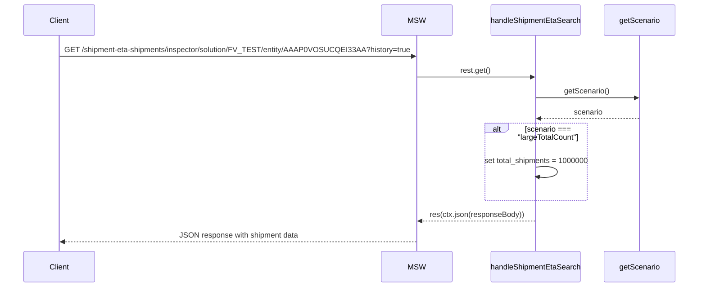
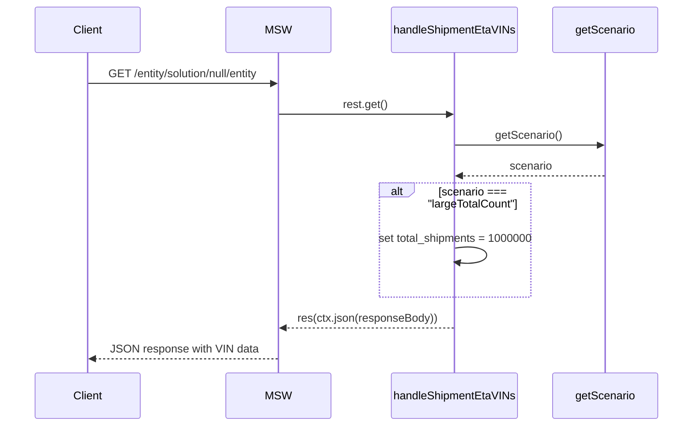
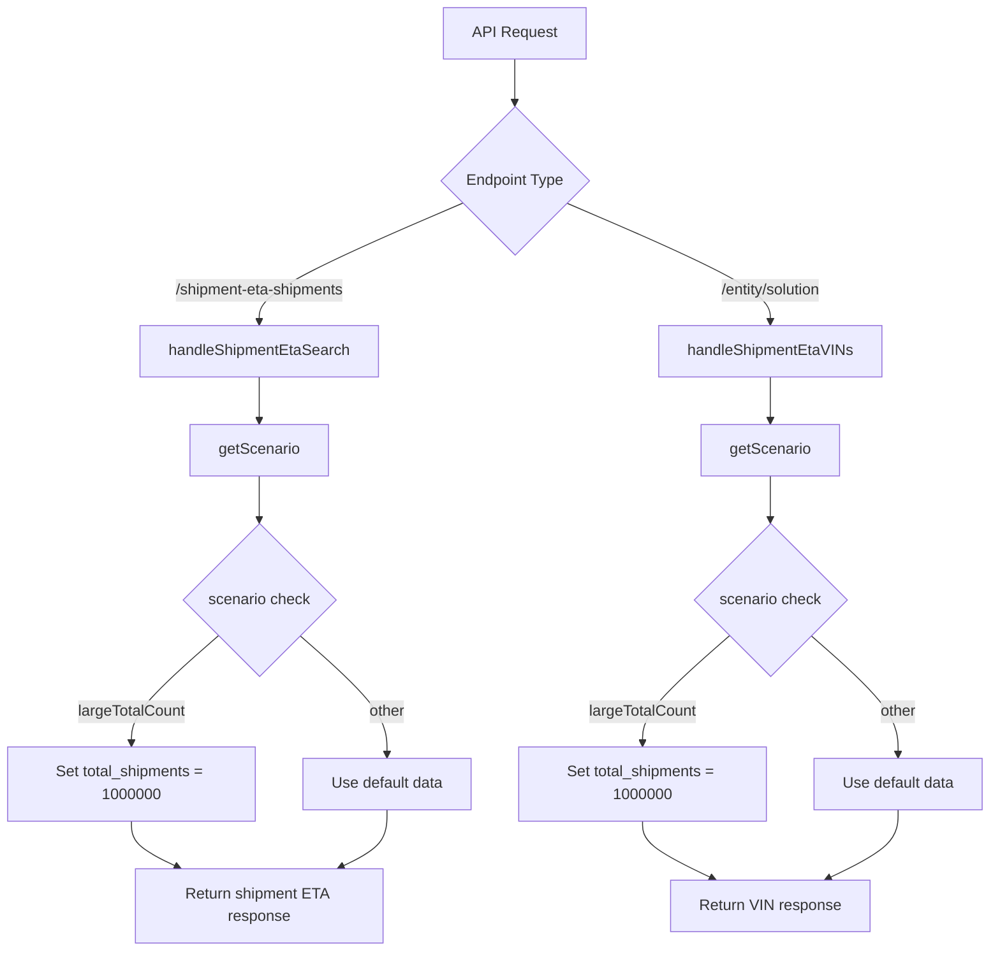
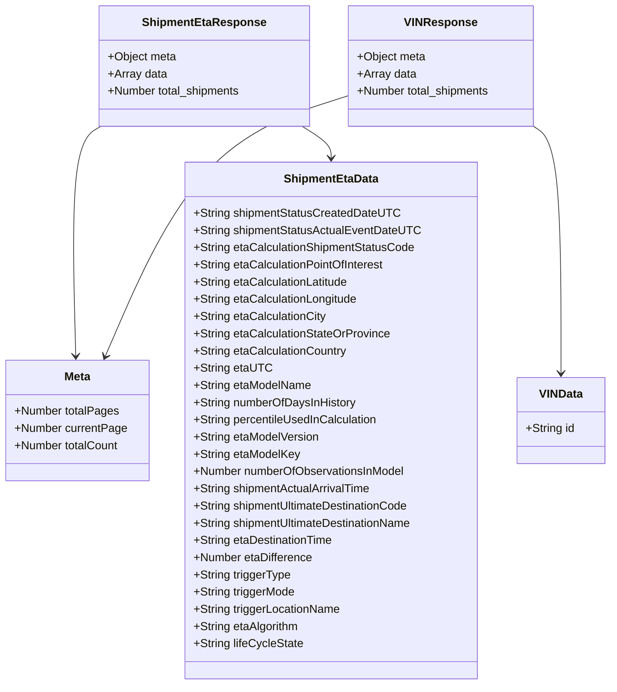
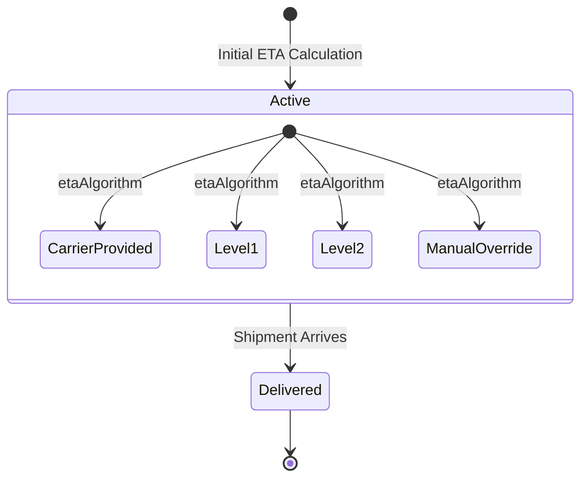

# Diagram: web/portal/src/mocks/handlers/shipment-eta-validator/searchResults.js

> Auto-generated by Obscura crawlers

## Diagram 1

### SVG

<svg id="container" width="1552.5" xmlns="http://www.w3.org/2000/svg" height="640" viewBox="-50 -10 1552.5 640" role="graphics-document document" aria-roledescription="sequence"><g><rect x="1302.5" y="554" fill="#eaeaea" stroke="#666" width="150" height="65" name="getScenario" rx="3" ry="3" class="actor actor-bottom"></rect><text x="1377.5" y="586.5" dominant-baseline="central" alignment-baseline="central" class="actor actor-box" style="text-anchor: middle; font-size: 16px; font-weight: 400;"><tspan x="1377.5" dy="0">getScenario</tspan></text></g><g><rect x="1041.5" y="554" fill="#eaeaea" stroke="#666" width="211" height="65" name="handleShipmentEtaSearch" rx="3" ry="3" class="actor actor-bottom"></rect><text x="1147" y="586.5" dominant-baseline="central" alignment-baseline="central" class="actor actor-box" style="text-anchor: middle; font-size: 16px; font-weight: 400;"><tspan x="1147" dy="0">handleShipmentEtaSearch</tspan></text></g><g><rect x="801" y="554" fill="#eaeaea" stroke="#666" width="150" height="65" name="MSW" rx="3" ry="3" class="actor actor-bottom"></rect><text x="876" y="586.5" dominant-baseline="central" alignment-baseline="central" class="actor actor-box" style="text-anchor: middle; font-size: 16px; font-weight: 400;"><tspan x="876" dy="0">MSW</tspan></text></g><g><rect x="0" y="554" fill="#eaeaea" stroke="#666" width="150" height="65" name="Client" rx="3" ry="3" class="actor actor-bottom"></rect><text x="75" y="586.5" dominant-baseline="central" alignment-baseline="central" class="actor actor-box" style="text-anchor: middle; font-size: 16px; font-weight: 400;"><tspan x="75" dy="0">Client</tspan></text></g><g><line id="actor3" x1="1377.5" y1="65" x2="1377.5" y2="554" class="actor-line 200" stroke-width="0.5px" stroke="#999" name="getScenario"></line><g id="root-3"><rect x="1302.5" y="0" fill="#eaeaea" stroke="#666" width="150" height="65" name="getScenario" rx="3" ry="3" class="actor actor-top"></rect><text x="1377.5" y="32.5" dominant-baseline="central" alignment-baseline="central" class="actor actor-box" style="text-anchor: middle; font-size: 16px; font-weight: 400;"><tspan x="1377.5" dy="0">getScenario</tspan></text></g></g><g><line id="actor2" x1="1147" y1="65" x2="1147" y2="554" class="actor-line 200" stroke-width="0.5px" stroke="#999" name="handleShipmentEtaSearch"></line><g id="root-2"><rect x="1041.5" y="0" fill="#eaeaea" stroke="#666" width="211" height="65" name="handleShipmentEtaSearch" rx="3" ry="3" class="actor actor-top"></rect><text x="1147" y="32.5" dominant-baseline="central" alignment-baseline="central" class="actor actor-box" style="text-anchor: middle; font-size: 16px; font-weight: 400;"><tspan x="1147" dy="0">handleShipmentEtaSearch</tspan></text></g></g><g><line id="actor1" x1="876" y1="65" x2="876" y2="554" class="actor-line 200" stroke-width="0.5px" stroke="#999" name="MSW"></line><g id="root-1"><rect x="801" y="0" fill="#eaeaea" stroke="#666" width="150" height="65" name="MSW" rx="3" ry="3" class="actor actor-top"></rect><text x="876" y="32.5" dominant-baseline="central" alignment-baseline="central" class="actor actor-box" style="text-anchor: middle; font-size: 16px; font-weight: 400;"><tspan x="876" dy="0">MSW</tspan></text></g></g><g><line id="actor0" x1="75" y1="65" x2="75" y2="554" class="actor-line 200" stroke-width="0.5px" stroke="#999" name="Client"></line><g id="root-0"><rect x="0" y="0" fill="#eaeaea" stroke="#666" width="150" height="65" name="Client" rx="3" ry="3" class="actor actor-top"></rect><text x="75" y="32.5" dominant-baseline="central" alignment-baseline="central" class="actor actor-box" style="text-anchor: middle; font-size: 16px; font-weight: 400;"><tspan x="75" dy="0">Client</tspan></text></g></g><g></g><defs><symbol id="computer" width="24" height="24"><path transform="scale(.5)" d="M2 2v13h20v-13h-20zm18 11h-16v-9h16v9zm-10.228 6l.466-1h3.524l.467 1h-4.457zm14.228 3h-24l2-6h2.104l-1.33 4h18.45l-1.297-4h2.073l2 6zm-5-10h-14v-7h14v7z"></path></symbol></defs><defs><symbol id="database" fill-rule="evenodd" clip-rule="evenodd"><path transform="scale(.5)" d="M12.258.001l.256.004.255.005.253.008.251.01.249.012.247.015.246.016.242.019.241.02.239.023.236.024.233.027.231.028.229.031.225.032.223.034.22.036.217.038.214.04.211.041.208.043.205.045.201.046.198.048.194.05.191.051.187.053.183.054.18.056.175.057.172.059.168.06.163.061.16.063.155.064.15.066.074.033.073.033.071.034.07.034.069.035.068.035.067.035.066.035.064.036.064.036.062.036.06.036.06.037.058.037.058.037.055.038.055.038.053.038.052.038.051.039.05.039.048.039.047.039.045.04.044.04.043.04.041.04.04.041.039.041.037.041.036.041.034.041.033.042.032.042.03.042.029.042.027.042.026.043.024.043.023.043.021.043.02.043.018.044.017.043.015.044.013.044.012.044.011.045.009.044.007.045.006.045.004.045.002.045.001.045v17l-.001.045-.002.045-.004.045-.006.045-.007.045-.009.044-.011.045-.012.044-.013.044-.015.044-.017.043-.018.044-.02.043-.021.043-.023.043-.024.043-.026.043-.027.042-.029.042-.03.042-.032.042-.033.042-.034.041-.036.041-.037.041-.039.041-.04.041-.041.04-.043.04-.044.04-.045.04-.047.039-.048.039-.05.039-.051.039-.052.038-.053.038-.055.038-.055.038-.058.037-.058.037-.06.037-.06.036-.062.036-.064.036-.064.036-.066.035-.067.035-.068.035-.069.035-.07.034-.071.034-.073.033-.074.033-.15.066-.155.064-.16.063-.163.061-.168.06-.172.059-.175.057-.18.056-.183.054-.187.053-.191.051-.194.05-.198.048-.201.046-.205.045-.208.043-.211.041-.214.04-.217.038-.22.036-.223.034-.225.032-.229.031-.231.028-.233.027-.236.024-.239.023-.241.02-.242.019-.246.016-.247.015-.249.012-.251.01-.253.008-.255.005-.256.004-.258.001-.258-.001-.256-.004-.255-.005-.253-.008-.251-.01-.249-.012-.247-.015-.245-.016-.243-.019-.241-.02-.238-.023-.236-.024-.234-.027-.231-.028-.228-.031-.226-.032-.223-.034-.22-.036-.217-.038-.214-.04-.211-.041-.208-.043-.204-.045-.201-.046-.198-.048-.195-.05-.19-.051-.187-.053-.184-.054-.179-.056-.176-.057-.172-.059-.167-.06-.164-.061-.159-.063-.155-.064-.151-.066-.074-.033-.072-.033-.072-.034-.07-.034-.069-.035-.068-.035-.067-.035-.066-.035-.064-.036-.063-.036-.062-.036-.061-.036-.06-.037-.058-.037-.057-.037-.056-.038-.055-.038-.053-.038-.052-.038-.051-.039-.049-.039-.049-.039-.046-.039-.046-.04-.044-.04-.043-.04-.041-.04-.04-.041-.039-.041-.037-.041-.036-.041-.034-.041-.033-.042-.032-.042-.03-.042-.029-.042-.027-.042-.026-.043-.024-.043-.023-.043-.021-.043-.02-.043-.018-.044-.017-.043-.015-.044-.013-.044-.012-.044-.011-.045-.009-.044-.007-.045-.006-.045-.004-.045-.002-.045-.001-.045v-17l.001-.045.002-.045.004-.045.006-.045.007-.045.009-.044.011-.045.012-.044.013-.044.015-.044.017-.043.018-.044.02-.043.021-.043.023-.043.024-.043.026-.043.027-.042.029-.042.03-.042.032-.042.033-.042.034-.041.036-.041.037-.041.039-.041.04-.041.041-.04.043-.04.044-.04.046-.04.046-.039.049-.039.049-.039.051-.039.052-.038.053-.038.055-.038.056-.038.057-.037.058-.037.06-.037.061-.036.062-.036.063-.036.064-.036.066-.035.067-.035.068-.035.069-.035.07-.034.072-.034.072-.033.074-.033.151-.066.155-.064.159-.063.164-.061.167-.06.172-.059.176-.057.179-.056.184-.054.187-.053.19-.051.195-.05.198-.048.201-.046.204-.045.208-.043.211-.041.214-.04.217-.038.22-.036.223-.034.226-.032.228-.031.231-.028.234-.027.236-.024.238-.023.241-.02.243-.019.245-.016.247-.015.249-.012.251-.01.253-.008.255-.005.256-.004.258-.001.258.001zm-9.258 20.499v.01l.001.021.003.021.004.022.005.021.006.022.007.022.009.023.01.022.011.023.012.023.013.023.015.023.016.024.017.023.018.024.019.024.021.024.022.025.023.024.024.025.052.049.056.05.061.051.066.051.07.051.075.051.079.052.084.052.088.052.092.052.097.052.102.051.105.052.11.052.114.051.119.051.123.051.127.05.131.05.135.05.139.048.144.049.147.047.152.047.155.047.16.045.163.045.167.043.171.043.176.041.178.041.183.039.187.039.19.037.194.035.197.035.202.033.204.031.209.03.212.029.216.027.219.025.222.024.226.021.23.02.233.018.236.016.24.015.243.012.246.01.249.008.253.005.256.004.259.001.26-.001.257-.004.254-.005.25-.008.247-.011.244-.012.241-.014.237-.016.233-.018.231-.021.226-.021.224-.024.22-.026.216-.027.212-.028.21-.031.205-.031.202-.034.198-.034.194-.036.191-.037.187-.039.183-.04.179-.04.175-.042.172-.043.168-.044.163-.045.16-.046.155-.046.152-.047.148-.048.143-.049.139-.049.136-.05.131-.05.126-.05.123-.051.118-.052.114-.051.11-.052.106-.052.101-.052.096-.052.092-.052.088-.053.083-.051.079-.052.074-.052.07-.051.065-.051.06-.051.056-.05.051-.05.023-.024.023-.025.021-.024.02-.024.019-.024.018-.024.017-.024.015-.023.014-.024.013-.023.012-.023.01-.023.01-.022.008-.022.006-.022.006-.022.004-.022.004-.021.001-.021.001-.021v-4.127l-.077.055-.08.053-.083.054-.085.053-.087.052-.09.052-.093.051-.095.05-.097.05-.1.049-.102.049-.105.048-.106.047-.109.047-.111.046-.114.045-.115.045-.118.044-.12.043-.122.042-.124.042-.126.041-.128.04-.13.04-.132.038-.134.038-.135.037-.138.037-.139.035-.142.035-.143.034-.144.033-.147.032-.148.031-.15.03-.151.03-.153.029-.154.027-.156.027-.158.026-.159.025-.161.024-.162.023-.163.022-.165.021-.166.02-.167.019-.169.018-.169.017-.171.016-.173.015-.173.014-.175.013-.175.012-.177.011-.178.01-.179.008-.179.008-.181.006-.182.005-.182.004-.184.003-.184.002h-.37l-.184-.002-.184-.003-.182-.004-.182-.005-.181-.006-.179-.008-.179-.008-.178-.01-.176-.011-.176-.012-.175-.013-.173-.014-.172-.015-.171-.016-.17-.017-.169-.018-.167-.019-.166-.02-.165-.021-.163-.022-.162-.023-.161-.024-.159-.025-.157-.026-.156-.027-.155-.027-.153-.029-.151-.03-.15-.03-.148-.031-.146-.032-.145-.033-.143-.034-.141-.035-.14-.035-.137-.037-.136-.037-.134-.038-.132-.038-.13-.04-.128-.04-.126-.041-.124-.042-.122-.042-.12-.044-.117-.043-.116-.045-.113-.045-.112-.046-.109-.047-.106-.047-.105-.048-.102-.049-.1-.049-.097-.05-.095-.05-.093-.052-.09-.051-.087-.052-.085-.053-.083-.054-.08-.054-.077-.054v4.127zm0-5.654v.011l.001.021.003.021.004.021.005.022.006.022.007.022.009.022.01.022.011.023.012.023.013.023.015.024.016.023.017.024.018.024.019.024.021.024.022.024.023.025.024.024.052.05.056.05.061.05.066.051.07.051.075.052.079.051.084.052.088.052.092.052.097.052.102.052.105.052.11.051.114.051.119.052.123.05.127.051.131.05.135.049.139.049.144.048.147.048.152.047.155.046.16.045.163.045.167.044.171.042.176.042.178.04.183.04.187.038.19.037.194.036.197.034.202.033.204.032.209.03.212.028.216.027.219.025.222.024.226.022.23.02.233.018.236.016.24.014.243.012.246.01.249.008.253.006.256.003.259.001.26-.001.257-.003.254-.006.25-.008.247-.01.244-.012.241-.015.237-.016.233-.018.231-.02.226-.022.224-.024.22-.025.216-.027.212-.029.21-.03.205-.032.202-.033.198-.035.194-.036.191-.037.187-.039.183-.039.179-.041.175-.042.172-.043.168-.044.163-.045.16-.045.155-.047.152-.047.148-.048.143-.048.139-.05.136-.049.131-.05.126-.051.123-.051.118-.051.114-.052.11-.052.106-.052.101-.052.096-.052.092-.052.088-.052.083-.052.079-.052.074-.051.07-.052.065-.051.06-.05.056-.051.051-.049.023-.025.023-.024.021-.025.02-.024.019-.024.018-.024.017-.024.015-.023.014-.023.013-.024.012-.022.01-.023.01-.023.008-.022.006-.022.006-.022.004-.021.004-.022.001-.021.001-.021v-4.139l-.077.054-.08.054-.083.054-.085.052-.087.053-.09.051-.093.051-.095.051-.097.05-.1.049-.102.049-.105.048-.106.047-.109.047-.111.046-.114.045-.115.044-.118.044-.12.044-.122.042-.124.042-.126.041-.128.04-.13.039-.132.039-.134.038-.135.037-.138.036-.139.036-.142.035-.143.033-.144.033-.147.033-.148.031-.15.03-.151.03-.153.028-.154.028-.156.027-.158.026-.159.025-.161.024-.162.023-.163.022-.165.021-.166.02-.167.019-.169.018-.169.017-.171.016-.173.015-.173.014-.175.013-.175.012-.177.011-.178.009-.179.009-.179.007-.181.007-.182.005-.182.004-.184.003-.184.002h-.37l-.184-.002-.184-.003-.182-.004-.182-.005-.181-.007-.179-.007-.179-.009-.178-.009-.176-.011-.176-.012-.175-.013-.173-.014-.172-.015-.171-.016-.17-.017-.169-.018-.167-.019-.166-.02-.165-.021-.163-.022-.162-.023-.161-.024-.159-.025-.157-.026-.156-.027-.155-.028-.153-.028-.151-.03-.15-.03-.148-.031-.146-.033-.145-.033-.143-.033-.141-.035-.14-.036-.137-.036-.136-.037-.134-.038-.132-.039-.13-.039-.128-.04-.126-.041-.124-.042-.122-.043-.12-.043-.117-.044-.116-.044-.113-.046-.112-.046-.109-.046-.106-.047-.105-.048-.102-.049-.1-.049-.097-.05-.095-.051-.093-.051-.09-.051-.087-.053-.085-.052-.083-.054-.08-.054-.077-.054v4.139zm0-5.666v.011l.001.02.003.022.004.021.005.022.006.021.007.022.009.023.01.022.011.023.012.023.013.023.015.023.016.024.017.024.018.023.019.024.021.025.022.024.023.024.024.025.052.05.056.05.061.05.066.051.07.051.075.052.079.051.084.052.088.052.092.052.097.052.102.052.105.051.11.052.114.051.119.051.123.051.127.05.131.05.135.05.139.049.144.048.147.048.152.047.155.046.16.045.163.045.167.043.171.043.176.042.178.04.183.04.187.038.19.037.194.036.197.034.202.033.204.032.209.03.212.028.216.027.219.025.222.024.226.021.23.02.233.018.236.017.24.014.243.012.246.01.249.008.253.006.256.003.259.001.26-.001.257-.003.254-.006.25-.008.247-.01.244-.013.241-.014.237-.016.233-.018.231-.02.226-.022.224-.024.22-.025.216-.027.212-.029.21-.03.205-.032.202-.033.198-.035.194-.036.191-.037.187-.039.183-.039.179-.041.175-.042.172-.043.168-.044.163-.045.16-.045.155-.047.152-.047.148-.048.143-.049.139-.049.136-.049.131-.051.126-.05.123-.051.118-.052.114-.051.11-.052.106-.052.101-.052.096-.052.092-.052.088-.052.083-.052.079-.052.074-.052.07-.051.065-.051.06-.051.056-.05.051-.049.023-.025.023-.025.021-.024.02-.024.019-.024.018-.024.017-.024.015-.023.014-.024.013-.023.012-.023.01-.022.01-.023.008-.022.006-.022.006-.022.004-.022.004-.021.001-.021.001-.021v-4.153l-.077.054-.08.054-.083.053-.085.053-.087.053-.09.051-.093.051-.095.051-.097.05-.1.049-.102.048-.105.048-.106.048-.109.046-.111.046-.114.046-.115.044-.118.044-.12.043-.122.043-.124.042-.126.041-.128.04-.13.039-.132.039-.134.038-.135.037-.138.036-.139.036-.142.034-.143.034-.144.033-.147.032-.148.032-.15.03-.151.03-.153.028-.154.028-.156.027-.158.026-.159.024-.161.024-.162.023-.163.023-.165.021-.166.02-.167.019-.169.018-.169.017-.171.016-.173.015-.173.014-.175.013-.175.012-.177.01-.178.01-.179.009-.179.007-.181.006-.182.006-.182.004-.184.003-.184.001-.185.001-.185-.001-.184-.001-.184-.003-.182-.004-.182-.006-.181-.006-.179-.007-.179-.009-.178-.01-.176-.01-.176-.012-.175-.013-.173-.014-.172-.015-.171-.016-.17-.017-.169-.018-.167-.019-.166-.02-.165-.021-.163-.023-.162-.023-.161-.024-.159-.024-.157-.026-.156-.027-.155-.028-.153-.028-.151-.03-.15-.03-.148-.032-.146-.032-.145-.033-.143-.034-.141-.034-.14-.036-.137-.036-.136-.037-.134-.038-.132-.039-.13-.039-.128-.041-.126-.041-.124-.041-.122-.043-.12-.043-.117-.044-.116-.044-.113-.046-.112-.046-.109-.046-.106-.048-.105-.048-.102-.048-.1-.05-.097-.049-.095-.051-.093-.051-.09-.052-.087-.052-.085-.053-.083-.053-.08-.054-.077-.054v4.153zm8.74-8.179l-.257.004-.254.005-.25.008-.247.011-.244.012-.241.014-.237.016-.233.018-.231.021-.226.022-.224.023-.22.026-.216.027-.212.028-.21.031-.205.032-.202.033-.198.034-.194.036-.191.038-.187.038-.183.04-.179.041-.175.042-.172.043-.168.043-.163.045-.16.046-.155.046-.152.048-.148.048-.143.048-.139.049-.136.05-.131.05-.126.051-.123.051-.118.051-.114.052-.11.052-.106.052-.101.052-.096.052-.092.052-.088.052-.083.052-.079.052-.074.051-.07.052-.065.051-.06.05-.056.05-.051.05-.023.025-.023.024-.021.024-.02.025-.019.024-.018.024-.017.023-.015.024-.014.023-.013.023-.012.023-.01.023-.01.022-.008.022-.006.023-.006.021-.004.022-.004.021-.001.021-.001.021.001.021.001.021.004.021.004.022.006.021.006.023.008.022.01.022.01.023.012.023.013.023.014.023.015.024.017.023.018.024.019.024.02.025.021.024.023.024.023.025.051.05.056.05.06.05.065.051.07.052.074.051.079.052.083.052.088.052.092.052.096.052.101.052.106.052.11.052.114.052.118.051.123.051.126.051.131.05.136.05.139.049.143.048.148.048.152.048.155.046.16.046.163.045.168.043.172.043.175.042.179.041.183.04.187.038.191.038.194.036.198.034.202.033.205.032.21.031.212.028.216.027.22.026.224.023.226.022.231.021.233.018.237.016.241.014.244.012.247.011.25.008.254.005.257.004.26.001.26-.001.257-.004.254-.005.25-.008.247-.011.244-.012.241-.014.237-.016.233-.018.231-.021.226-.022.224-.023.22-.026.216-.027.212-.028.21-.031.205-.032.202-.033.198-.034.194-.036.191-.038.187-.038.183-.04.179-.041.175-.042.172-.043.168-.043.163-.045.16-.046.155-.046.152-.048.148-.048.143-.048.139-.049.136-.05.131-.05.126-.051.123-.051.118-.051.114-.052.11-.052.106-.052.101-.052.096-.052.092-.052.088-.052.083-.052.079-.052.074-.051.07-.052.065-.051.06-.05.056-.05.051-.05.023-.025.023-.024.021-.024.02-.025.019-.024.018-.024.017-.023.015-.024.014-.023.013-.023.012-.023.01-.023.01-.022.008-.022.006-.023.006-.021.004-.022.004-.021.001-.021.001-.021-.001-.021-.001-.021-.004-.021-.004-.022-.006-.021-.006-.023-.008-.022-.01-.022-.01-.023-.012-.023-.013-.023-.014-.023-.015-.024-.017-.023-.018-.024-.019-.024-.02-.025-.021-.024-.023-.024-.023-.025-.051-.05-.056-.05-.06-.05-.065-.051-.07-.052-.074-.051-.079-.052-.083-.052-.088-.052-.092-.052-.096-.052-.101-.052-.106-.052-.11-.052-.114-.052-.118-.051-.123-.051-.126-.051-.131-.05-.136-.05-.139-.049-.143-.048-.148-.048-.152-.048-.155-.046-.16-.046-.163-.045-.168-.043-.172-.043-.175-.042-.179-.041-.183-.04-.187-.038-.191-.038-.194-.036-.198-.034-.202-.033-.205-.032-.21-.031-.212-.028-.216-.027-.22-.026-.224-.023-.226-.022-.231-.021-.233-.018-.237-.016-.241-.014-.244-.012-.247-.011-.25-.008-.254-.005-.257-.004-.26-.001-.26.001z"></path></symbol></defs><defs><symbol id="clock" width="24" height="24"><path transform="scale(.5)" d="M12 2c5.514 0 10 4.486 10 10s-4.486 10-10 10-10-4.486-10-10 4.486-10 10-10zm0-2c-6.627 0-12 5.373-12 12s5.373 12 12 12 12-5.373 12-12-5.373-12-12-12zm5.848 12.459c.202.038.202.333.001.372-1.907.361-6.045 1.111-6.547 1.111-.719 0-1.301-.582-1.301-1.301 0-.512.77-5.447 1.125-7.445.034-.192.312-.181.343.014l.985 6.238 5.394 1.011z"></path></symbol></defs><defs><marker id="arrowhead" refX="7.9" refY="5" markerUnits="userSpaceOnUse" markerWidth="12" markerHeight="12" orient="auto-start-reverse"><path d="M -1 0 L 10 5 L 0 10 z"></path></marker></defs><defs><marker id="crosshead" markerWidth="15" markerHeight="8" orient="auto" refX="4" refY="4.5"><path fill="none" stroke="#000000" stroke-width="1pt" d="M 1,2 L 6,7 M 6,2 L 1,7" style="stroke-dasharray: 0, 0;"></path></marker></defs><defs><marker id="filled-head" refX="15.5" refY="7" markerWidth="20" markerHeight="28" orient="auto"><path d="M 18,7 L9,13 L14,7 L9,1 Z"></path></marker></defs><defs><marker id="sequencenumber" refX="15" refY="15" markerWidth="60" markerHeight="40" orient="auto"><circle cx="15" cy="15" r="6"></circle></marker></defs><g><line x1="1027.5" y1="267" x2="1268.5" y2="267" class="loopLine"></line><line x1="1268.5" y1="267" x2="1268.5" y2="438" class="loopLine"></line><line x1="1027.5" y1="438" x2="1268.5" y2="438" class="loopLine"></line><line x1="1027.5" y1="267" x2="1027.5" y2="438" class="loopLine"></line><polygon points="1027.5,267 1077.5,267 1077.5,280 1069.1,287 1027.5,287" class="labelBox"></polygon><text x="1053" y="280" text-anchor="middle" dominant-baseline="middle" alignment-baseline="middle" class="labelText" style="font-size: 16px; font-weight: 400;">alt</text><text x="1173" y="285" text-anchor="middle" class="loopText" style="font-size: 16px; font-weight: 400;"><tspan x="1173">[scenario ===</tspan></text><text x="1173" y="304" text-anchor="middle" class="loopText" style="font-size: 16px; font-weight: 400;"><tspan x="1173">"largeTotalCount"]</tspan></text></g><text x="474" y="80" text-anchor="middle" dominant-baseline="middle" alignment-baseline="middle" class="messageText" dy="1em" style="font-size: 16px; font-weight: 400;">GET /shipment-eta-shipments/inspector/solution/FV_TEST/entity/AAAP0VOSUCQEI33AA?history=true</text><line x1="76" y1="113" x2="872" y2="113" class="messageLine0" stroke-width="2" stroke="none" marker-end="url(#arrowhead)" style="fill: none;"></line><text x="1010" y="128" text-anchor="middle" dominant-baseline="middle" alignment-baseline="middle" class="messageText" dy="1em" style="font-size: 16px; font-weight: 400;">rest.get()</text><line x1="877" y1="161" x2="1143" y2="161" class="messageLine0" stroke-width="2" stroke="none" marker-end="url(#arrowhead)" style="fill: none;"></line><text x="1261" y="176" text-anchor="middle" dominant-baseline="middle" alignment-baseline="middle" class="messageText" dy="1em" style="font-size: 16px; font-weight: 400;">getScenario()</text><line x1="1148" y1="209" x2="1373.5" y2="209" class="messageLine0" stroke-width="2" stroke="none" marker-end="url(#arrowhead)" style="fill: none;"></line><text x="1264" y="224" text-anchor="middle" dominant-baseline="middle" alignment-baseline="middle" class="messageText" dy="1em" style="font-size: 16px; font-weight: 400;">scenario</text><line x1="1376.5" y1="257" x2="1151" y2="257" class="messageLine1" stroke-width="2" stroke="none" marker-end="url(#arrowhead)" style="stroke-dasharray: 3, 3; fill: none;"></line><text x="1148" y="335" text-anchor="middle" dominant-baseline="middle" alignment-baseline="middle" class="messageText" dy="1em" style="font-size: 16px; font-weight: 400;">set total_shipments = 1000000</text><path d="M 1148,368 C 1208,358 1208,398 1148,388" class="messageLine0" stroke-width="2" stroke="none" marker-end="url(#arrowhead)" style="fill: none;"></path><text x="1013" y="453" text-anchor="middle" dominant-baseline="middle" alignment-baseline="middle" class="messageText" dy="1em" style="font-size: 16px; font-weight: 400;">res(ctx.json(responseBody))</text><line x1="1146" y1="486" x2="880" y2="486" class="messageLine1" stroke-width="2" stroke="none" marker-end="url(#arrowhead)" style="stroke-dasharray: 3, 3; fill: none;"></line><text x="477" y="501" text-anchor="middle" dominant-baseline="middle" alignment-baseline="middle" class="messageText" dy="1em" style="font-size: 16px; font-weight: 400;">JSON response with shipment data</text><line x1="875" y1="534" x2="79" y2="534" class="messageLine1" stroke-width="2" stroke="none" marker-end="url(#arrowhead)" style="stroke-dasharray: 3, 3; fill: none;"></line></svg>

## Diagram 2

### SVG

<svg id="container" width="1047.5" xmlns="http://www.w3.org/2000/svg" height="640" viewBox="-50 -10 1047.5 640" role="graphics-document document" aria-roledescription="sequence"><g><rect x="797.5" y="554" fill="#eaeaea" stroke="#666" width="150" height="65" name="getScenario" rx="3" ry="3" class="actor actor-bottom"></rect><text x="872.5" y="586.5" dominant-baseline="central" alignment-baseline="central" class="actor actor-box" style="text-anchor: middle; font-size: 16px; font-weight: 400;"><tspan x="872.5" dy="0">getScenario</tspan></text></g><g><rect x="552.5" y="554" fill="#eaeaea" stroke="#666" width="195" height="65" name="handleShipmentEtaVINs" rx="3" ry="3" class="actor actor-bottom"></rect><text x="650" y="586.5" dominant-baseline="central" alignment-baseline="central" class="actor actor-box" style="text-anchor: middle; font-size: 16px; font-weight: 400;"><tspan x="650" dy="0">handleShipmentEtaVINs</tspan></text></g><g><rect x="304" y="554" fill="#eaeaea" stroke="#666" width="150" height="65" name="MSW" rx="3" ry="3" class="actor actor-bottom"></rect><text x="379" y="586.5" dominant-baseline="central" alignment-baseline="central" class="actor actor-box" style="text-anchor: middle; font-size: 16px; font-weight: 400;"><tspan x="379" dy="0">MSW</tspan></text></g><g><rect x="0" y="554" fill="#eaeaea" stroke="#666" width="150" height="65" name="Client" rx="3" ry="3" class="actor actor-bottom"></rect><text x="75" y="586.5" dominant-baseline="central" alignment-baseline="central" class="actor actor-box" style="text-anchor: middle; font-size: 16px; font-weight: 400;"><tspan x="75" dy="0">Client</tspan></text></g><g><line id="actor3" x1="872.5" y1="65" x2="872.5" y2="554" class="actor-line 200" stroke-width="0.5px" stroke="#999" name="getScenario"></line><g id="root-3"><rect x="797.5" y="0" fill="#eaeaea" stroke="#666" width="150" height="65" name="getScenario" rx="3" ry="3" class="actor actor-top"></rect><text x="872.5" y="32.5" dominant-baseline="central" alignment-baseline="central" class="actor actor-box" style="text-anchor: middle; font-size: 16px; font-weight: 400;"><tspan x="872.5" dy="0">getScenario</tspan></text></g></g><g><line id="actor2" x1="650" y1="65" x2="650" y2="554" class="actor-line 200" stroke-width="0.5px" stroke="#999" name="handleShipmentEtaVINs"></line><g id="root-2"><rect x="552.5" y="0" fill="#eaeaea" stroke="#666" width="195" height="65" name="handleShipmentEtaVINs" rx="3" ry="3" class="actor actor-top"></rect><text x="650" y="32.5" dominant-baseline="central" alignment-baseline="central" class="actor actor-box" style="text-anchor: middle; font-size: 16px; font-weight: 400;"><tspan x="650" dy="0">handleShipmentEtaVINs</tspan></text></g></g><g><line id="actor1" x1="379" y1="65" x2="379" y2="554" class="actor-line 200" stroke-width="0.5px" stroke="#999" name="MSW"></line><g id="root-1"><rect x="304" y="0" fill="#eaeaea" stroke="#666" width="150" height="65" name="MSW" rx="3" ry="3" class="actor actor-top"></rect><text x="379" y="32.5" dominant-baseline="central" alignment-baseline="central" class="actor actor-box" style="text-anchor: middle; font-size: 16px; font-weight: 400;"><tspan x="379" dy="0">MSW</tspan></text></g></g><g><line id="actor0" x1="75" y1="65" x2="75" y2="554" class="actor-line 200" stroke-width="0.5px" stroke="#999" name="Client"></line><g id="root-0"><rect x="0" y="0" fill="#eaeaea" stroke="#666" width="150" height="65" name="Client" rx="3" ry="3" class="actor actor-top"></rect><text x="75" y="32.5" dominant-baseline="central" alignment-baseline="central" class="actor actor-box" style="text-anchor: middle; font-size: 16px; font-weight: 400;"><tspan x="75" dy="0">Client</tspan></text></g></g><g></g><defs><symbol id="computer" width="24" height="24"><path transform="scale(.5)" d="M2 2v13h20v-13h-20zm18 11h-16v-9h16v9zm-10.228 6l.466-1h3.524l.467 1h-4.457zm14.228 3h-24l2-6h2.104l-1.33 4h18.45l-1.297-4h2.073l2 6zm-5-10h-14v-7h14v7z"></path></symbol></defs><defs><symbol id="database" fill-rule="evenodd" clip-rule="evenodd"><path transform="scale(.5)" d="M12.258.001l.256.004.255.005.253.008.251.01.249.012.247.015.246.016.242.019.241.02.239.023.236.024.233.027.231.028.229.031.225.032.223.034.22.036.217.038.214.04.211.041.208.043.205.045.201.046.198.048.194.05.191.051.187.053.183.054.18.056.175.057.172.059.168.06.163.061.16.063.155.064.15.066.074.033.073.033.071.034.07.034.069.035.068.035.067.035.066.035.064.036.064.036.062.036.06.036.06.037.058.037.058.037.055.038.055.038.053.038.052.038.051.039.05.039.048.039.047.039.045.04.044.04.043.04.041.04.04.041.039.041.037.041.036.041.034.041.033.042.032.042.03.042.029.042.027.042.026.043.024.043.023.043.021.043.02.043.018.044.017.043.015.044.013.044.012.044.011.045.009.044.007.045.006.045.004.045.002.045.001.045v17l-.001.045-.002.045-.004.045-.006.045-.007.045-.009.044-.011.045-.012.044-.013.044-.015.044-.017.043-.018.044-.02.043-.021.043-.023.043-.024.043-.026.043-.027.042-.029.042-.03.042-.032.042-.033.042-.034.041-.036.041-.037.041-.039.041-.04.041-.041.04-.043.04-.044.04-.045.04-.047.039-.048.039-.05.039-.051.039-.052.038-.053.038-.055.038-.055.038-.058.037-.058.037-.06.037-.06.036-.062.036-.064.036-.064.036-.066.035-.067.035-.068.035-.069.035-.07.034-.071.034-.073.033-.074.033-.15.066-.155.064-.16.063-.163.061-.168.06-.172.059-.175.057-.18.056-.183.054-.187.053-.191.051-.194.05-.198.048-.201.046-.205.045-.208.043-.211.041-.214.04-.217.038-.22.036-.223.034-.225.032-.229.031-.231.028-.233.027-.236.024-.239.023-.241.02-.242.019-.246.016-.247.015-.249.012-.251.01-.253.008-.255.005-.256.004-.258.001-.258-.001-.256-.004-.255-.005-.253-.008-.251-.01-.249-.012-.247-.015-.245-.016-.243-.019-.241-.02-.238-.023-.236-.024-.234-.027-.231-.028-.228-.031-.226-.032-.223-.034-.22-.036-.217-.038-.214-.04-.211-.041-.208-.043-.204-.045-.201-.046-.198-.048-.195-.05-.19-.051-.187-.053-.184-.054-.179-.056-.176-.057-.172-.059-.167-.06-.164-.061-.159-.063-.155-.064-.151-.066-.074-.033-.072-.033-.072-.034-.07-.034-.069-.035-.068-.035-.067-.035-.066-.035-.064-.036-.063-.036-.062-.036-.061-.036-.06-.037-.058-.037-.057-.037-.056-.038-.055-.038-.053-.038-.052-.038-.051-.039-.049-.039-.049-.039-.046-.039-.046-.04-.044-.04-.043-.04-.041-.04-.04-.041-.039-.041-.037-.041-.036-.041-.034-.041-.033-.042-.032-.042-.03-.042-.029-.042-.027-.042-.026-.043-.024-.043-.023-.043-.021-.043-.02-.043-.018-.044-.017-.043-.015-.044-.013-.044-.012-.044-.011-.045-.009-.044-.007-.045-.006-.045-.004-.045-.002-.045-.001-.045v-17l.001-.045.002-.045.004-.045.006-.045.007-.045.009-.044.011-.045.012-.044.013-.044.015-.044.017-.043.018-.044.02-.043.021-.043.023-.043.024-.043.026-.043.027-.042.029-.042.03-.042.032-.042.033-.042.034-.041.036-.041.037-.041.039-.041.04-.041.041-.04.043-.04.044-.04.046-.04.046-.039.049-.039.049-.039.051-.039.052-.038.053-.038.055-.038.056-.038.057-.037.058-.037.06-.037.061-.036.062-.036.063-.036.064-.036.066-.035.067-.035.068-.035.069-.035.07-.034.072-.034.072-.033.074-.033.151-.066.155-.064.159-.063.164-.061.167-.06.172-.059.176-.057.179-.056.184-.054.187-.053.19-.051.195-.05.198-.048.201-.046.204-.045.208-.043.211-.041.214-.04.217-.038.22-.036.223-.034.226-.032.228-.031.231-.028.234-.027.236-.024.238-.023.241-.02.243-.019.245-.016.247-.015.249-.012.251-.01.253-.008.255-.005.256-.004.258-.001.258.001zm-9.258 20.499v.01l.001.021.003.021.004.022.005.021.006.022.007.022.009.023.01.022.011.023.012.023.013.023.015.023.016.024.017.023.018.024.019.024.021.024.022.025.023.024.024.025.052.049.056.05.061.051.066.051.07.051.075.051.079.052.084.052.088.052.092.052.097.052.102.051.105.052.11.052.114.051.119.051.123.051.127.05.131.05.135.05.139.048.144.049.147.047.152.047.155.047.16.045.163.045.167.043.171.043.176.041.178.041.183.039.187.039.19.037.194.035.197.035.202.033.204.031.209.03.212.029.216.027.219.025.222.024.226.021.23.02.233.018.236.016.24.015.243.012.246.01.249.008.253.005.256.004.259.001.26-.001.257-.004.254-.005.25-.008.247-.011.244-.012.241-.014.237-.016.233-.018.231-.021.226-.021.224-.024.22-.026.216-.027.212-.028.21-.031.205-.031.202-.034.198-.034.194-.036.191-.037.187-.039.183-.04.179-.04.175-.042.172-.043.168-.044.163-.045.16-.046.155-.046.152-.047.148-.048.143-.049.139-.049.136-.05.131-.05.126-.05.123-.051.118-.052.114-.051.11-.052.106-.052.101-.052.096-.052.092-.052.088-.053.083-.051.079-.052.074-.052.07-.051.065-.051.06-.051.056-.05.051-.05.023-.024.023-.025.021-.024.02-.024.019-.024.018-.024.017-.024.015-.023.014-.024.013-.023.012-.023.01-.023.01-.022.008-.022.006-.022.006-.022.004-.022.004-.021.001-.021.001-.021v-4.127l-.077.055-.08.053-.083.054-.085.053-.087.052-.09.052-.093.051-.095.05-.097.05-.1.049-.102.049-.105.048-.106.047-.109.047-.111.046-.114.045-.115.045-.118.044-.12.043-.122.042-.124.042-.126.041-.128.04-.13.04-.132.038-.134.038-.135.037-.138.037-.139.035-.142.035-.143.034-.144.033-.147.032-.148.031-.15.03-.151.03-.153.029-.154.027-.156.027-.158.026-.159.025-.161.024-.162.023-.163.022-.165.021-.166.02-.167.019-.169.018-.169.017-.171.016-.173.015-.173.014-.175.013-.175.012-.177.011-.178.01-.179.008-.179.008-.181.006-.182.005-.182.004-.184.003-.184.002h-.37l-.184-.002-.184-.003-.182-.004-.182-.005-.181-.006-.179-.008-.179-.008-.178-.01-.176-.011-.176-.012-.175-.013-.173-.014-.172-.015-.171-.016-.17-.017-.169-.018-.167-.019-.166-.02-.165-.021-.163-.022-.162-.023-.161-.024-.159-.025-.157-.026-.156-.027-.155-.027-.153-.029-.151-.03-.15-.03-.148-.031-.146-.032-.145-.033-.143-.034-.141-.035-.14-.035-.137-.037-.136-.037-.134-.038-.132-.038-.13-.04-.128-.04-.126-.041-.124-.042-.122-.042-.12-.044-.117-.043-.116-.045-.113-.045-.112-.046-.109-.047-.106-.047-.105-.048-.102-.049-.1-.049-.097-.05-.095-.05-.093-.052-.09-.051-.087-.052-.085-.053-.083-.054-.08-.054-.077-.054v4.127zm0-5.654v.011l.001.021.003.021.004.021.005.022.006.022.007.022.009.022.01.022.011.023.012.023.013.023.015.024.016.023.017.024.018.024.019.024.021.024.022.024.023.025.024.024.052.05.056.05.061.05.066.051.07.051.075.052.079.051.084.052.088.052.092.052.097.052.102.052.105.052.11.051.114.051.119.052.123.05.127.051.131.05.135.049.139.049.144.048.147.048.152.047.155.046.16.045.163.045.167.044.171.042.176.042.178.04.183.04.187.038.19.037.194.036.197.034.202.033.204.032.209.03.212.028.216.027.219.025.222.024.226.022.23.02.233.018.236.016.24.014.243.012.246.01.249.008.253.006.256.003.259.001.26-.001.257-.003.254-.006.25-.008.247-.01.244-.012.241-.015.237-.016.233-.018.231-.02.226-.022.224-.024.22-.025.216-.027.212-.029.21-.03.205-.032.202-.033.198-.035.194-.036.191-.037.187-.039.183-.039.179-.041.175-.042.172-.043.168-.044.163-.045.16-.045.155-.047.152-.047.148-.048.143-.048.139-.05.136-.049.131-.05.126-.051.123-.051.118-.051.114-.052.11-.052.106-.052.101-.052.096-.052.092-.052.088-.052.083-.052.079-.052.074-.051.07-.052.065-.051.06-.05.056-.051.051-.049.023-.025.023-.024.021-.025.02-.024.019-.024.018-.024.017-.024.015-.023.014-.023.013-.024.012-.022.01-.023.01-.023.008-.022.006-.022.006-.022.004-.021.004-.022.001-.021.001-.021v-4.139l-.077.054-.08.054-.083.054-.085.052-.087.053-.09.051-.093.051-.095.051-.097.05-.1.049-.102.049-.105.048-.106.047-.109.047-.111.046-.114.045-.115.044-.118.044-.12.044-.122.042-.124.042-.126.041-.128.04-.13.039-.132.039-.134.038-.135.037-.138.036-.139.036-.142.035-.143.033-.144.033-.147.033-.148.031-.15.03-.151.03-.153.028-.154.028-.156.027-.158.026-.159.025-.161.024-.162.023-.163.022-.165.021-.166.02-.167.019-.169.018-.169.017-.171.016-.173.015-.173.014-.175.013-.175.012-.177.011-.178.009-.179.009-.179.007-.181.007-.182.005-.182.004-.184.003-.184.002h-.37l-.184-.002-.184-.003-.182-.004-.182-.005-.181-.007-.179-.007-.179-.009-.178-.009-.176-.011-.176-.012-.175-.013-.173-.014-.172-.015-.171-.016-.17-.017-.169-.018-.167-.019-.166-.02-.165-.021-.163-.022-.162-.023-.161-.024-.159-.025-.157-.026-.156-.027-.155-.028-.153-.028-.151-.03-.15-.03-.148-.031-.146-.033-.145-.033-.143-.033-.141-.035-.14-.036-.137-.036-.136-.037-.134-.038-.132-.039-.13-.039-.128-.04-.126-.041-.124-.042-.122-.043-.12-.043-.117-.044-.116-.044-.113-.046-.112-.046-.109-.046-.106-.047-.105-.048-.102-.049-.1-.049-.097-.05-.095-.051-.093-.051-.09-.051-.087-.053-.085-.052-.083-.054-.08-.054-.077-.054v4.139zm0-5.666v.011l.001.02.003.022.004.021.005.022.006.021.007.022.009.023.01.022.011.023.012.023.013.023.015.023.016.024.017.024.018.023.019.024.021.025.022.024.023.024.024.025.052.05.056.05.061.05.066.051.07.051.075.052.079.051.084.052.088.052.092.052.097.052.102.052.105.051.11.052.114.051.119.051.123.051.127.05.131.05.135.05.139.049.144.048.147.048.152.047.155.046.16.045.163.045.167.043.171.043.176.042.178.04.183.04.187.038.19.037.194.036.197.034.202.033.204.032.209.03.212.028.216.027.219.025.222.024.226.021.23.02.233.018.236.017.24.014.243.012.246.01.249.008.253.006.256.003.259.001.26-.001.257-.003.254-.006.25-.008.247-.01.244-.013.241-.014.237-.016.233-.018.231-.02.226-.022.224-.024.22-.025.216-.027.212-.029.21-.03.205-.032.202-.033.198-.035.194-.036.191-.037.187-.039.183-.039.179-.041.175-.042.172-.043.168-.044.163-.045.16-.045.155-.047.152-.047.148-.048.143-.049.139-.049.136-.049.131-.051.126-.05.123-.051.118-.052.114-.051.11-.052.106-.052.101-.052.096-.052.092-.052.088-.052.083-.052.079-.052.074-.052.07-.051.065-.051.06-.051.056-.05.051-.049.023-.025.023-.025.021-.024.02-.024.019-.024.018-.024.017-.024.015-.023.014-.024.013-.023.012-.023.01-.022.01-.023.008-.022.006-.022.006-.022.004-.022.004-.021.001-.021.001-.021v-4.153l-.077.054-.08.054-.083.053-.085.053-.087.053-.09.051-.093.051-.095.051-.097.05-.1.049-.102.048-.105.048-.106.048-.109.046-.111.046-.114.046-.115.044-.118.044-.12.043-.122.043-.124.042-.126.041-.128.04-.13.039-.132.039-.134.038-.135.037-.138.036-.139.036-.142.034-.143.034-.144.033-.147.032-.148.032-.15.03-.151.03-.153.028-.154.028-.156.027-.158.026-.159.024-.161.024-.162.023-.163.023-.165.021-.166.02-.167.019-.169.018-.169.017-.171.016-.173.015-.173.014-.175.013-.175.012-.177.01-.178.01-.179.009-.179.007-.181.006-.182.006-.182.004-.184.003-.184.001-.185.001-.185-.001-.184-.001-.184-.003-.182-.004-.182-.006-.181-.006-.179-.007-.179-.009-.178-.01-.176-.01-.176-.012-.175-.013-.173-.014-.172-.015-.171-.016-.17-.017-.169-.018-.167-.019-.166-.02-.165-.021-.163-.023-.162-.023-.161-.024-.159-.024-.157-.026-.156-.027-.155-.028-.153-.028-.151-.03-.15-.03-.148-.032-.146-.032-.145-.033-.143-.034-.141-.034-.14-.036-.137-.036-.136-.037-.134-.038-.132-.039-.13-.039-.128-.041-.126-.041-.124-.041-.122-.043-.12-.043-.117-.044-.116-.044-.113-.046-.112-.046-.109-.046-.106-.048-.105-.048-.102-.048-.1-.05-.097-.049-.095-.051-.093-.051-.09-.052-.087-.052-.085-.053-.083-.053-.08-.054-.077-.054v4.153zm8.74-8.179l-.257.004-.254.005-.25.008-.247.011-.244.012-.241.014-.237.016-.233.018-.231.021-.226.022-.224.023-.22.026-.216.027-.212.028-.21.031-.205.032-.202.033-.198.034-.194.036-.191.038-.187.038-.183.04-.179.041-.175.042-.172.043-.168.043-.163.045-.16.046-.155.046-.152.048-.148.048-.143.048-.139.049-.136.05-.131.05-.126.051-.123.051-.118.051-.114.052-.11.052-.106.052-.101.052-.096.052-.092.052-.088.052-.083.052-.079.052-.074.051-.07.052-.065.051-.06.05-.056.05-.051.05-.023.025-.023.024-.021.024-.02.025-.019.024-.018.024-.017.023-.015.024-.014.023-.013.023-.012.023-.01.023-.01.022-.008.022-.006.023-.006.021-.004.022-.004.021-.001.021-.001.021.001.021.001.021.004.021.004.022.006.021.006.023.008.022.01.022.01.023.012.023.013.023.014.023.015.024.017.023.018.024.019.024.02.025.021.024.023.024.023.025.051.05.056.05.06.05.065.051.07.052.074.051.079.052.083.052.088.052.092.052.096.052.101.052.106.052.11.052.114.052.118.051.123.051.126.051.131.05.136.05.139.049.143.048.148.048.152.048.155.046.16.046.163.045.168.043.172.043.175.042.179.041.183.04.187.038.191.038.194.036.198.034.202.033.205.032.21.031.212.028.216.027.22.026.224.023.226.022.231.021.233.018.237.016.241.014.244.012.247.011.25.008.254.005.257.004.26.001.26-.001.257-.004.254-.005.25-.008.247-.011.244-.012.241-.014.237-.016.233-.018.231-.021.226-.022.224-.023.22-.026.216-.027.212-.028.21-.031.205-.032.202-.033.198-.034.194-.036.191-.038.187-.038.183-.04.179-.041.175-.042.172-.043.168-.043.163-.045.16-.046.155-.046.152-.048.148-.048.143-.048.139-.049.136-.05.131-.05.126-.051.123-.051.118-.051.114-.052.11-.052.106-.052.101-.052.096-.052.092-.052.088-.052.083-.052.079-.052.074-.051.07-.052.065-.051.06-.05.056-.05.051-.05.023-.025.023-.024.021-.024.02-.025.019-.024.018-.024.017-.023.015-.024.014-.023.013-.023.012-.023.01-.023.01-.022.008-.022.006-.023.006-.021.004-.022.004-.021.001-.021.001-.021-.001-.021-.001-.021-.004-.021-.004-.022-.006-.021-.006-.023-.008-.022-.01-.022-.01-.023-.012-.023-.013-.023-.014-.023-.015-.024-.017-.023-.018-.024-.019-.024-.02-.025-.021-.024-.023-.024-.023-.025-.051-.05-.056-.05-.06-.05-.065-.051-.07-.052-.074-.051-.079-.052-.083-.052-.088-.052-.092-.052-.096-.052-.101-.052-.106-.052-.11-.052-.114-.052-.118-.051-.123-.051-.126-.051-.131-.05-.136-.05-.139-.049-.143-.048-.148-.048-.152-.048-.155-.046-.16-.046-.163-.045-.168-.043-.172-.043-.175-.042-.179-.041-.183-.04-.187-.038-.191-.038-.194-.036-.198-.034-.202-.033-.205-.032-.21-.031-.212-.028-.216-.027-.22-.026-.224-.023-.226-.022-.231-.021-.233-.018-.237-.016-.241-.014-.244-.012-.247-.011-.25-.008-.254-.005-.257-.004-.26-.001-.26.001z"></path></symbol></defs><defs><symbol id="clock" width="24" height="24"><path transform="scale(.5)" d="M12 2c5.514 0 10 4.486 10 10s-4.486 10-10 10-10-4.486-10-10 4.486-10 10-10zm0-2c-6.627 0-12 5.373-12 12s5.373 12 12 12 12-5.373 12-12-5.373-12-12-12zm5.848 12.459c.202.038.202.333.001.372-1.907.361-6.045 1.111-6.547 1.111-.719 0-1.301-.582-1.301-1.301 0-.512.77-5.447 1.125-7.445.034-.192.312-.181.343.014l.985 6.238 5.394 1.011z"></path></symbol></defs><defs><marker id="arrowhead" refX="7.9" refY="5" markerUnits="userSpaceOnUse" markerWidth="12" markerHeight="12" orient="auto-start-reverse"><path d="M -1 0 L 10 5 L 0 10 z"></path></marker></defs><defs><marker id="crosshead" markerWidth="15" markerHeight="8" orient="auto" refX="4" refY="4.5"><path fill="none" stroke="#000000" stroke-width="1pt" d="M 1,2 L 6,7 M 6,2 L 1,7" style="stroke-dasharray: 0, 0;"></path></marker></defs><defs><marker id="filled-head" refX="15.5" refY="7" markerWidth="20" markerHeight="28" orient="auto"><path d="M 18,7 L9,13 L14,7 L9,1 Z"></path></marker></defs><defs><marker id="sequencenumber" refX="15" refY="15" markerWidth="60" markerHeight="40" orient="auto"><circle cx="15" cy="15" r="6"></circle></marker></defs><g><line x1="530.5" y1="267" x2="771.5" y2="267" class="loopLine"></line><line x1="771.5" y1="267" x2="771.5" y2="438" class="loopLine"></line><line x1="530.5" y1="438" x2="771.5" y2="438" class="loopLine"></line><line x1="530.5" y1="267" x2="530.5" y2="438" class="loopLine"></line><polygon points="530.5,267 580.5,267 580.5,280 572.1,287 530.5,287" class="labelBox"></polygon><text x="556" y="280" text-anchor="middle" dominant-baseline="middle" alignment-baseline="middle" class="labelText" style="font-size: 16px; font-weight: 400;">alt</text><text x="676" y="285" text-anchor="middle" class="loopText" style="font-size: 16px; font-weight: 400;"><tspan x="676">[scenario ===</tspan></text><text x="676" y="304" text-anchor="middle" class="loopText" style="font-size: 16px; font-weight: 400;"><tspan x="676">"largeTotalCount"]</tspan></text></g><text x="226" y="80" text-anchor="middle" dominant-baseline="middle" alignment-baseline="middle" class="messageText" dy="1em" style="font-size: 16px; font-weight: 400;">GET /entity/solution/null/entity</text><line x1="76" y1="113" x2="375" y2="113" class="messageLine0" stroke-width="2" stroke="none" marker-end="url(#arrowhead)" style="fill: none;"></line><text x="513" y="128" text-anchor="middle" dominant-baseline="middle" alignment-baseline="middle" class="messageText" dy="1em" style="font-size: 16px; font-weight: 400;">rest.get()</text><line x1="380" y1="161" x2="646" y2="161" class="messageLine0" stroke-width="2" stroke="none" marker-end="url(#arrowhead)" style="fill: none;"></line><text x="760" y="176" text-anchor="middle" dominant-baseline="middle" alignment-baseline="middle" class="messageText" dy="1em" style="font-size: 16px; font-weight: 400;">getScenario()</text><line x1="651" y1="209" x2="868.5" y2="209" class="messageLine0" stroke-width="2" stroke="none" marker-end="url(#arrowhead)" style="fill: none;"></line><text x="763" y="224" text-anchor="middle" dominant-baseline="middle" alignment-baseline="middle" class="messageText" dy="1em" style="font-size: 16px; font-weight: 400;">scenario</text><line x1="871.5" y1="257" x2="654" y2="257" class="messageLine1" stroke-width="2" stroke="none" marker-end="url(#arrowhead)" style="stroke-dasharray: 3, 3; fill: none;"></line><text x="651" y="335" text-anchor="middle" dominant-baseline="middle" alignment-baseline="middle" class="messageText" dy="1em" style="font-size: 16px; font-weight: 400;">set total_shipments = 1000000</text><path d="M 651,368 C 711,358 711,398 651,388" class="messageLine0" stroke-width="2" stroke="none" marker-end="url(#arrowhead)" style="fill: none;"></path><text x="516" y="453" text-anchor="middle" dominant-baseline="middle" alignment-baseline="middle" class="messageText" dy="1em" style="font-size: 16px; font-weight: 400;">res(ctx.json(responseBody))</text><line x1="649" y1="486" x2="383" y2="486" class="messageLine1" stroke-width="2" stroke="none" marker-end="url(#arrowhead)" style="stroke-dasharray: 3, 3; fill: none;"></line><text x="229" y="501" text-anchor="middle" dominant-baseline="middle" alignment-baseline="middle" class="messageText" dy="1em" style="font-size: 16px; font-weight: 400;">JSON response with VIN data</text><line x1="378" y1="534" x2="79" y2="534" class="messageLine1" stroke-width="2" stroke="none" marker-end="url(#arrowhead)" style="stroke-dasharray: 3, 3; fill: none;"></line></svg>

## Diagram 3

### SVG

<svg id="container" width="1045.21875" xmlns="http://www.w3.org/2000/svg" class="flowchart" height="1001.296875" viewBox="0 0 1045.21875 1001.296875" role="graphics-document document" aria-roledescription="flowchart-v2"><g><marker id="container_flowchart-v2-pointEnd" class="marker flowchart-v2" viewBox="0 0 10 10" refX="5" refY="5" markerUnits="userSpaceOnUse" markerWidth="8" markerHeight="8" orient="auto"><path d="M 0 0 L 10 5 L 0 10 z" class="arrowMarkerPath" style="stroke-width: 1; stroke-dasharray: 1, 0;"></path></marker><marker id="container_flowchart-v2-pointStart" class="marker flowchart-v2" viewBox="0 0 10 10" refX="4.5" refY="5" markerUnits="userSpaceOnUse" markerWidth="8" markerHeight="8" orient="auto"><path d="M 0 5 L 10 10 L 10 0 z" class="arrowMarkerPath" style="stroke-width: 1; stroke-dasharray: 1, 0;"></path></marker><marker id="container_flowchart-v2-circleEnd" class="marker flowchart-v2" viewBox="0 0 10 10" refX="11" refY="5" markerUnits="userSpaceOnUse" markerWidth="11" markerHeight="11" orient="auto"><circle cx="5" cy="5" r="5" class="arrowMarkerPath" style="stroke-width: 1; stroke-dasharray: 1, 0;"></circle></marker><marker id="container_flowchart-v2-circleStart" class="marker flowchart-v2" viewBox="0 0 10 10" refX="-1" refY="5" markerUnits="userSpaceOnUse" markerWidth="11" markerHeight="11" orient="auto"><circle cx="5" cy="5" r="5" class="arrowMarkerPath" style="stroke-width: 1; stroke-dasharray: 1, 0;"></circle></marker><marker id="container_flowchart-v2-crossEnd" class="marker cross flowchart-v2" viewBox="0 0 11 11" refX="12" refY="5.2" markerUnits="userSpaceOnUse" markerWidth="11" markerHeight="11" orient="auto"><path d="M 1,1 l 9,9 M 10,1 l -9,9" class="arrowMarkerPath" style="stroke-width: 2; stroke-dasharray: 1, 0;"></path></marker><marker id="container_flowchart-v2-crossStart" class="marker cross flowchart-v2" viewBox="0 0 11 11" refX="-1" refY="5.2" markerUnits="userSpaceOnUse" markerWidth="11" markerHeight="11" orient="auto"><path d="M 1,1 l 9,9 M 10,1 l -9,9" class="arrowMarkerPath" style="stroke-width: 2; stroke-dasharray: 1, 0;"></path></marker><g class="root"><g class="clusters"></g><g class="edgePaths"><path d="M542.707,62L542.707,66.167C542.707,70.333,542.707,78.667,542.707,86.333C542.707,94,542.707,101,542.707,104.5L542.707,108" id="L_A_B_0" class="edge-thickness-normal edge-pattern-solid edge-thickness-normal edge-pattern-solid flowchart-link" style=";" data-edge="true" data-et="edge" data-id="L_A_B_0" data-points="W3sieCI6NTQyLjcwNzAzMTI1LCJ5Ijo2Mn0seyJ4Ijo1NDIuNzA3MDMxMjUsInkiOjg3fSx7IngiOjU0Mi43MDcwMzEyNSwieSI6MTEyfV0=" marker-end="url(#container_flowchart-v2-pointEnd)"></path><path d="M487.508,214.629L451.74,229.995C415.973,245.362,344.437,276.095,308.67,296.962C272.902,317.828,272.902,328.828,272.902,334.328L272.902,339.828" id="L_B_C_0" class="edge-thickness-normal edge-pattern-solid edge-thickness-normal edge-pattern-solid flowchart-link" style=";" data-edge="true" data-et="edge" data-id="L_B_C_0" data-points="W3sieCI6NDg3LjUwNzc4NTc1Nzg2ODgsInkiOjIxNC42Mjg4Nzk1MDc4Njg4NX0seyJ4IjoyNzIuOTAyMzQzNzUsInkiOjMwNi44MjgxMjV9LHsieCI6MjcyLjkwMjM0Mzc1LCJ5IjozNDMuODI4MTI1fV0=" marker-end="url(#container_flowchart-v2-pointEnd)"></path><path d="M597.906,214.629L633.674,229.995C669.441,245.362,740.977,276.095,776.744,296.962C812.512,317.828,812.512,328.828,812.512,334.328L812.512,339.828" id="L_B_D_0" class="edge-thickness-normal edge-pattern-solid edge-thickness-normal edge-pattern-solid flowchart-link" style=";" data-edge="true" data-et="edge" data-id="L_B_D_0" data-points="W3sieCI6NTk3LjkwNjI3Njc0MjEzMTEsInkiOjIxNC42Mjg4Nzk1MDc4Njg4NX0seyJ4Ijo4MTIuNTExNzE4NzUsInkiOjMwNi44MjgxMjV9LHsieCI6ODEyLjUxMTcxODc1LCJ5IjozNDMuODI4MTI1fV0=" marker-end="url(#container_flowchart-v2-pointEnd)"></path><path d="M272.902,397.828L272.902,401.995C272.902,406.161,272.902,414.495,272.902,422.161C272.902,429.828,272.902,436.828,272.902,440.328L272.902,443.828" id="L_C_E_0" class="edge-thickness-normal edge-pattern-solid edge-thickness-normal edge-pattern-solid flowchart-link" style=";" data-edge="true" data-et="edge" data-id="L_C_E_0" data-points="W3sieCI6MjcyLjkwMjM0Mzc1LCJ5IjozOTcuODI4MTI1fSx7IngiOjI3Mi45MDIzNDM3NSwieSI6NDIyLjgyODEyNX0seyJ4IjoyNzIuOTAyMzQzNzUsInkiOjQ0Ny44MjgxMjV9XQ==" marker-end="url(#container_flowchart-v2-pointEnd)"></path><path d="M812.512,397.828L812.512,401.995C812.512,406.161,812.512,414.495,812.512,422.161C812.512,429.828,812.512,436.828,812.512,440.328L812.512,443.828" id="L_D_F_0" class="edge-thickness-normal edge-pattern-solid edge-thickness-normal edge-pattern-solid flowchart-link" style=";" data-edge="true" data-et="edge" data-id="L_D_F_0" data-points="W3sieCI6ODEyLjUxMTcxODc1LCJ5IjozOTcuODI4MTI1fSx7IngiOjgxMi41MTE3MTg3NSwieSI6NDIyLjgyODEyNX0seyJ4Ijo4MTIuNTExNzE4NzUsInkiOjQ0Ny44MjgxMjV9XQ==" marker-end="url(#container_flowchart-v2-pointEnd)"></path><path d="M272.902,501.828L272.902,505.995C272.902,510.161,272.902,518.495,272.902,526.161C272.902,533.828,272.902,540.828,272.902,544.328L272.902,547.828" id="L_E_G_0" class="edge-thickness-normal edge-pattern-solid edge-thickness-normal edge-pattern-solid flowchart-link" style=";" data-edge="true" data-et="edge" data-id="L_E_G_0" data-points="W3sieCI6MjcyLjkwMjM0Mzc1LCJ5Ijo1MDEuODI4MTI1fSx7IngiOjI3Mi45MDIzNDM3NSwieSI6NTI2LjgyODEyNX0seyJ4IjoyNzIuOTAyMzQzNzUsInkiOjU1MS44MjgxMjV9XQ==" marker-end="url(#container_flowchart-v2-pointEnd)"></path><path d="M812.512,501.828L812.512,505.995C812.512,510.161,812.512,518.495,812.512,526.161C812.512,533.828,812.512,540.828,812.512,544.328L812.512,547.828" id="L_F_H_0" class="edge-thickness-normal edge-pattern-solid edge-thickness-normal edge-pattern-solid flowchart-link" style=";" data-edge="true" data-et="edge" data-id="L_F_H_0" data-points="W3sieCI6ODEyLjUxMTcxODc1LCJ5Ijo1MDEuODI4MTI1fSx7IngiOjgxMi41MTE3MTg3NSwieSI6NTI2LjgyODEyNX0seyJ4Ijo4MTIuNTExNzE4NzUsInkiOjU1MS44MjgxMjV9XQ==" marker-end="url(#container_flowchart-v2-pointEnd)"></path><path d="M229.792,670.187L214.493,683.538C199.195,696.89,168.597,723.593,153.299,742.445C138,761.297,138,772.297,138,777.797L138,783.297" id="L_G_I_0" class="edge-thickness-normal edge-pattern-solid edge-thickness-normal edge-pattern-solid flowchart-link" style=";" data-edge="true" data-et="edge" data-id="L_G_I_0" data-points="W3sieCI6MjI5Ljc5MTk5NzU0NzgzNTM0LCJ5Ijo2NzAuMTg2NTI4Nzk3ODM1M30seyJ4IjoxMzgsInkiOjc1MC4yOTY4NzV9LHsieCI6MTM4LCJ5Ijo3ODcuMjk2ODc1fV0=" marker-end="url(#container_flowchart-v2-pointEnd)"></path><path d="M316.013,670.187L331.311,683.538C346.61,696.89,377.207,723.593,392.506,744.445C407.805,765.297,407.805,780.297,407.805,787.797L407.805,795.297" id="L_G_J_0" class="edge-thickness-normal edge-pattern-solid edge-thickness-normal edge-pattern-solid flowchart-link" style=";" data-edge="true" data-et="edge" data-id="L_G_J_0" data-points="W3sieCI6MzE2LjAxMjY4OTk1MjE2NDcsInkiOjY3MC4xODY1Mjg3OTc4MzUzfSx7IngiOjQwNy44MDQ2ODc1LCJ5Ijo3NTAuMjk2ODc1fSx7IngiOjQwNy44MDQ2ODc1LCJ5Ijo3OTkuMjk2ODc1fV0=" marker-end="url(#container_flowchart-v2-pointEnd)"></path><path d="M769.401,670.187L754.103,683.538C738.804,696.89,708.207,723.593,692.908,742.445C677.609,761.297,677.609,772.297,677.609,777.797L677.609,783.297" id="L_H_K_0" class="edge-thickness-normal edge-pattern-solid edge-thickness-normal edge-pattern-solid flowchart-link" style=";" data-edge="true" data-et="edge" data-id="L_H_K_0" data-points="W3sieCI6NzY5LjQwMTM3MjU0NzgzNTMsInkiOjY3MC4xODY1Mjg3OTc4MzUzfSx7IngiOjY3Ny42MDkzNzUsInkiOjc1MC4yOTY4NzV9LHsieCI6Njc3LjYwOTM3NSwieSI6Nzg3LjI5Njg3NX1d" marker-end="url(#container_flowchart-v2-pointEnd)"></path><path d="M855.622,670.187L870.921,683.538C886.219,696.89,916.817,723.593,932.115,744.445C947.414,765.297,947.414,780.297,947.414,787.797L947.414,795.297" id="L_H_L_0" class="edge-thickness-normal edge-pattern-solid edge-thickness-normal edge-pattern-solid flowchart-link" style=";" data-edge="true" data-et="edge" data-id="L_H_L_0" data-points="W3sieCI6ODU1LjYyMjA2NDk1MjE2NDcsInkiOjY3MC4xODY1Mjg3OTc4MzUzfSx7IngiOjk0Ny40MTQwNjI1LCJ5Ijo3NTAuMjk2ODc1fSx7IngiOjk0Ny40MTQwNjI1LCJ5Ijo3OTkuMjk2ODc1fV0=" marker-end="url(#container_flowchart-v2-pointEnd)"></path><path d="M138,865.297L138,869.464C138,873.63,138,881.964,146.18,890.011C154.361,898.059,170.722,905.821,178.902,909.701L187.082,913.582" id="L_I_M_0" class="edge-thickness-normal edge-pattern-solid edge-thickness-normal edge-pattern-solid flowchart-link" style=";" data-edge="true" data-et="edge" data-id="L_I_M_0" data-points="W3sieCI6MTM4LCJ5Ijo4NjUuMjk2ODc1fSx7IngiOjEzOCwieSI6ODkwLjI5Njg3NX0seyJ4IjoxOTAuNjk2MjI4MDI3MzQzNzUsInkiOjkxNS4yOTY4NzV9XQ==" marker-end="url(#container_flowchart-v2-pointEnd)"></path><path d="M407.805,853.297L407.805,859.464C407.805,865.63,407.805,877.964,399.624,888.011C391.444,898.059,375.083,905.821,366.903,909.701L358.722,913.582" id="L_J_M_0" class="edge-thickness-normal edge-pattern-solid edge-thickness-normal edge-pattern-solid flowchart-link" style=";" data-edge="true" data-et="edge" data-id="L_J_M_0" data-points="W3sieCI6NDA3LjgwNDY4NzUsInkiOjg1My4yOTY4NzV9LHsieCI6NDA3LjgwNDY4NzUsInkiOjg5MC4yOTY4NzV9LHsieCI6MzU1LjEwODQ1OTQ3MjY1NjI1LCJ5Ijo5MTUuMjk2ODc1fV0=" marker-end="url(#container_flowchart-v2-pointEnd)"></path><path d="M677.609,865.297L677.609,869.464C677.609,873.63,677.609,881.964,690.005,892.011C702.402,902.059,727.194,913.821,739.59,919.701L751.986,925.582" id="L_K_N_0" class="edge-thickness-normal edge-pattern-solid edge-thickness-normal edge-pattern-solid flowchart-link" style=";" data-edge="true" data-et="edge" data-id="L_K_N_0" data-points="W3sieCI6Njc3LjYwOTM3NSwieSI6ODY1LjI5Njg3NX0seyJ4Ijo2NzcuNjA5Mzc1LCJ5Ijo4OTAuMjk2ODc1fSx7IngiOjc1NS41OTk3OTI0ODA0Njg4LCJ5Ijo5MjcuMjk2ODc1fV0=" marker-end="url(#container_flowchart-v2-pointEnd)"></path><path d="M947.414,853.297L947.414,859.464C947.414,865.63,947.414,877.964,935.018,890.011C922.622,902.059,897.83,913.821,885.434,919.701L873.038,925.582" id="L_L_N_0" class="edge-thickness-normal edge-pattern-solid edge-thickness-normal edge-pattern-solid flowchart-link" style=";" data-edge="true" data-et="edge" data-id="L_L_N_0" data-points="W3sieCI6OTQ3LjQxNDA2MjUsInkiOjg1My4yOTY4NzV9LHsieCI6OTQ3LjQxNDA2MjUsInkiOjg5MC4yOTY4NzV9LHsieCI6ODY5LjQyMzY0NTAxOTUzMTIsInkiOjkyNy4yOTY4NzV9XQ==" marker-end="url(#container_flowchart-v2-pointEnd)"></path></g><g class="edgeLabels"><g class="edgeLabel"><g class="label" data-id="L_A_B_0" transform="translate(0, 0)"><foreignObject width="0" height="0">

</foreignObject></g></g><g class="edgeLabel" transform="translate(272.90234375, 306.828125)"><g class="label" data-id="L_B_C_0" transform="translate(-93.703125, -12)"><foreignObject width="187.40625" height="24">

/shipment-eta-shipments

</foreignObject></g></g><g class="edgeLabel" transform="translate(812.51171875, 306.828125)"><g class="label" data-id="L_B_D_0" transform="translate(-58.5703125, -12)"><foreignObject width="117.140625" height="24">

/entity/solution

</foreignObject></g></g><g class="edgeLabel"><g class="label" data-id="L_C_E_0" transform="translate(0, 0)"><foreignObject width="0" height="0">

</foreignObject></g></g><g class="edgeLabel"><g class="label" data-id="L_D_F_0" transform="translate(0, 0)"><foreignObject width="0" height="0">

</foreignObject></g></g><g class="edgeLabel"><g class="label" data-id="L_E_G_0" transform="translate(0, 0)"><foreignObject width="0" height="0">

</foreignObject></g></g><g class="edgeLabel"><g class="label" data-id="L_F_H_0" transform="translate(0, 0)"><foreignObject width="0" height="0">

</foreignObject></g></g><g class="edgeLabel" transform="translate(138, 750.296875)"><g class="label" data-id="L_G_I_0" transform="translate(-57.0625, -12)"><foreignObject width="114.125" height="24">

largeTotalCount

</foreignObject></g></g><g class="edgeLabel" transform="translate(407.8046875, 750.296875)"><g class="label" data-id="L_G_J_0" transform="translate(-19.703125, -12)"><foreignObject width="39.40625" height="24">

other

</foreignObject></g></g><g class="edgeLabel" transform="translate(677.609375, 750.296875)"><g class="label" data-id="L_H_K_0" transform="translate(-57.0625, -12)"><foreignObject width="114.125" height="24">

largeTotalCount

</foreignObject></g></g><g class="edgeLabel" transform="translate(947.4140625, 750.296875)"><g class="label" data-id="L_H_L_0" transform="translate(-19.703125, -12)"><foreignObject width="39.40625" height="24">

other

</foreignObject></g></g><g class="edgeLabel"><g class="label" data-id="L_I_M_0" transform="translate(0, 0)"><foreignObject width="0" height="0">

</foreignObject></g></g><g class="edgeLabel"><g class="label" data-id="L_J_M_0" transform="translate(0, 0)"><foreignObject width="0" height="0">

</foreignObject></g></g><g class="edgeLabel"><g class="label" data-id="L_K_N_0" transform="translate(0, 0)"><foreignObject width="0" height="0">

</foreignObject></g></g><g class="edgeLabel"><g class="label" data-id="L_L_N_0" transform="translate(0, 0)"><foreignObject width="0" height="0">

</foreignObject></g></g></g><g class="nodes"><g class="node default" id="flowchart-A-0" transform="translate(542.70703125, 35)"><rect class="basic label-container" style="" x="-73.21875" y="-27" width="146.4375" height="54"></rect><g class="label" style="" transform="translate(-43.21875, -12)"><rect></rect><foreignObject width="86.4375" height="24">

API Request

</foreignObject></g></g><g class="node default" id="flowchart-B-1" transform="translate(542.70703125, 190.9140625)"><polygon points="78.9140625,0 157.828125,-78.9140625 78.9140625,-157.828125 0,-78.9140625" class="label-container" transform="translate(-78.4140625, 78.9140625)"></polygon><g class="label" style="" transform="translate(-51.9140625, -12)"><rect></rect><foreignObject width="103.828125" height="24">

Endpoint Type

</foreignObject></g></g><g class="node default" id="flowchart-C-3" transform="translate(272.90234375, 370.828125)"><rect class="basic label-container" style="" x="-125.734375" y="-27" width="251.46875" height="54"></rect><g class="label" style="" transform="translate(-95.734375, -12)"><rect></rect><foreignObject width="191.46875" height="24">

handleShipmentEtaSearch

</foreignObject></g></g><g class="node default" id="flowchart-D-5" transform="translate(812.51171875, 370.828125)"><rect class="basic label-container" style="" x="-117.390625" y="-27" width="234.78125" height="54"></rect><g class="label" style="" transform="translate(-87.390625, -12)"><rect></rect><foreignObject width="174.78125" height="24">

handleShipmentEtaVINs

</foreignObject></g></g><g class="node default" id="flowchart-E-7" transform="translate(272.90234375, 474.828125)"><rect class="basic label-container" style="" x="-72.7265625" y="-27" width="145.453125" height="54"></rect><g class="label" style="" transform="translate(-42.7265625, -12)"><rect></rect><foreignObject width="85.453125" height="24">

getScenario

</foreignObject></g></g><g class="node default" id="flowchart-F-9" transform="translate(812.51171875, 474.828125)"><rect class="basic label-container" style="" x="-72.7265625" y="-27" width="145.453125" height="54"></rect><g class="label" style="" transform="translate(-42.7265625, -12)"><rect></rect><foreignObject width="85.453125" height="24">

getScenario

</foreignObject></g></g><g class="node default" id="flowchart-G-11" transform="translate(272.90234375, 632.5625)"><polygon points="80.734375,0 161.46875,-80.734375 80.734375,-161.46875 0,-80.734375" class="label-container" transform="translate(-80.234375, 80.734375)"></polygon><g class="label" style="" transform="translate(-53.734375, -12)"><rect></rect><foreignObject width="107.46875" height="24">

scenario check

</foreignObject></g></g><g class="node default" id="flowchart-H-13" transform="translate(812.51171875, 632.5625)"><polygon points="80.734375,0 161.46875,-80.734375 80.734375,-161.46875 0,-80.734375" class="label-container" transform="translate(-80.234375, 80.734375)"></polygon><g class="label" style="" transform="translate(-53.734375, -12)"><rect></rect><foreignObject width="107.46875" height="24">

scenario check

</foreignObject></g></g><g class="node default" id="flowchart-I-15" transform="translate(138, 826.296875)"><rect class="basic label-container" style="" x="-130" y="-39" width="260" height="78"></rect><g class="label" style="" transform="translate(-100, -24)"><rect></rect><foreignObject width="200" height="48">

Set total_shipments = 1000000

</foreignObject></g></g><g class="node default" id="flowchart-J-17" transform="translate(407.8046875, 826.296875)"><rect class="basic label-container" style="" x="-89.8046875" y="-27" width="179.609375" height="54"></rect><g class="label" style="" transform="translate(-59.8046875, -12)"><rect></rect><foreignObject width="119.609375" height="24">

Use default data

</foreignObject></g></g><g class="node default" id="flowchart-K-19" transform="translate(677.609375, 826.296875)"><rect class="basic label-container" style="" x="-130" y="-39" width="260" height="78"></rect><g class="label" style="" transform="translate(-100, -24)"><rect></rect><foreignObject width="200" height="48">

Set total_shipments = 1000000

</foreignObject></g></g><g class="node default" id="flowchart-L-21" transform="translate(947.4140625, 826.296875)"><rect class="basic label-container" style="" x="-89.8046875" y="-27" width="179.609375" height="54"></rect><g class="label" style="" transform="translate(-59.8046875, -12)"><rect></rect><foreignObject width="119.609375" height="24">

Use default data

</foreignObject></g></g><g class="node default" id="flowchart-M-23" transform="translate(272.90234375, 954.296875)"><rect class="basic label-container" style="" x="-130" y="-39" width="260" height="78"></rect><g class="label" style="" transform="translate(-100, -24)"><rect></rect><foreignObject width="200" height="48">

Return shipment ETA response

</foreignObject></g></g><g class="node default" id="flowchart-N-27" transform="translate(812.51171875, 954.296875)"><rect class="basic label-container" style="" x="-104.0703125" y="-27" width="208.140625" height="54"></rect><g class="label" style="" transform="translate(-74.0703125, -12)"><rect></rect><foreignObject width="148.140625" height="24">

Return VIN response

</foreignObject></g></g></g></g></g></svg>

## Diagram 4

### SVG

<svg id="container" width="845.98046875" xmlns="http://www.w3.org/2000/svg" class="classDiagram" height="954" viewBox="0 0 845.98046875 954" role="graphics-document document" aria-roledescription="class"><g><defs><marker id="container_class-aggregationStart" class="marker aggregation class" refX="18" refY="7" markerWidth="190" markerHeight="240" orient="auto"><path d="M 18,7 L9,13 L1,7 L9,1 Z"></path></marker></defs><defs><marker id="container_class-aggregationEnd" class="marker aggregation class" refX="1" refY="7" markerWidth="20" markerHeight="28" orient="auto"><path d="M 18,7 L9,13 L1,7 L9,1 Z"></path></marker></defs><defs><marker id="container_class-extensionStart" class="marker extension class" refX="18" refY="7" markerWidth="190" markerHeight="240" orient="auto"><path d="M 1,7 L18,13 V 1 Z"></path></marker></defs><defs><marker id="container_class-extensionEnd" class="marker extension class" refX="1" refY="7" markerWidth="20" markerHeight="28" orient="auto"><path d="M 1,1 V 13 L18,7 Z"></path></marker></defs><defs><marker id="container_class-compositionStart" class="marker composition class" refX="18" refY="7" markerWidth="190" markerHeight="240" orient="auto"><path d="M 18,7 L9,13 L1,7 L9,1 Z"></path></marker></defs><defs><marker id="container_class-compositionEnd" class="marker composition class" refX="1" refY="7" markerWidth="20" markerHeight="28" orient="auto"><path d="M 18,7 L9,13 L1,7 L9,1 Z"></path></marker></defs><defs><marker id="container_class-dependencyStart" class="marker dependency class" refX="6" refY="7" markerWidth="190" markerHeight="240" orient="auto"><path d="M 5,7 L9,13 L1,7 L9,1 Z"></path></marker></defs><defs><marker id="container_class-dependencyEnd" class="marker dependency class" refX="13" refY="7" markerWidth="20" markerHeight="28" orient="auto"><path d="M 18,7 L9,13 L14,7 L9,1 Z"></path></marker></defs><defs><marker id="container_class-lollipopStart" class="marker lollipop class" refX="13" refY="7" markerWidth="190" markerHeight="240" orient="auto"><circle stroke="black" fill="transparent" cx="7" cy="7" r="6"></circle></marker></defs><defs><marker id="container_class-lollipopEnd" class="marker lollipop class" refX="1" refY="7" markerWidth="190" markerHeight="240" orient="auto"><circle stroke="black" fill="transparent" cx="7" cy="7" r="6"></circle></marker></defs><g class="root"><g class="clusters"></g><g class="edgePaths"><path d="M139.935,176L132.859,180.167C125.783,184.333,111.632,192.667,105.833,246C100.035,299.334,102.589,397.668,103.866,446.835L105.143,496.002" id="id_ShipmentEtaResponse_Meta_1" class="edge-thickness-normal edge-pattern-solid relation" style=";;;" data-edge="true" data-et="edge" data-id="id_ShipmentEtaResponse_Meta_1" data-points="W3sieCI6MTM5LjkzNDUwNzU5NzQ3NzA1LCJ5IjoxNzZ9LHsieCI6OTcuNDgwNDY4NzUsInkiOjIwMX0seyJ4IjoxMDUuMjk4NjUwNTY4MTgxODEsInkiOjUwMn1d" marker-end="url(#container_class-dependencyEnd)"></path><path d="M417.519,176L424.213,180.167C430.906,184.333,444.293,192.667,450.986,200C457.68,207.333,457.68,213.667,457.68,216.833L457.68,220" id="id_ShipmentEtaResponse_ShipmentEtaData_2" class="edge-thickness-normal edge-pattern-solid relation" style=";;;" data-edge="true" data-et="edge" data-id="id_ShipmentEtaResponse_ShipmentEtaData_2" data-points="W3sieCI6NDE3LjUxOTIyNjYzNDE3NDMsInkiOjE3Nn0seyJ4Ijo0NTcuNjc5Njg3NSwieSI6MjAxfSx7IngiOjQ1Ny42Nzk2ODc1LCJ5IjoyMjZ9XQ==" marker-end="url(#container_class-dependencyEnd)"></path><path d="M481.264,133.862L446.483,145.052C411.702,156.242,342.141,178.621,286.242,239.058C230.342,299.495,188.105,397.99,166.986,447.238L145.867,496.486" id="id_VINResponse_Meta_3" class="edge-thickness-normal edge-pattern-solid relation" style=";;;" data-edge="true" data-et="edge" data-id="id_VINResponse_Meta_3" data-points="W3sieCI6NDgxLjI2MzY3MTg3NSwieSI6MTMzLjg2MjQ2NDU0Njc3NTJ9LHsieCI6MjcyLjU4MDA3ODEyNSwieSI6MjAxfSx7IngiOjE0My41MDIyMDE3MDQ1NDU0NiwieSI6NTAyfV0=" marker-end="url(#container_class-dependencyEnd)"></path><path d="M739.135,176L745.472,180.167C751.809,184.333,764.483,192.667,770.819,250C777.156,307.333,777.156,413.667,777.156,466.833L777.156,520" id="id_VINResponse_VINData_4" class="edge-thickness-normal edge-pattern-solid relation" style=";;;" data-edge="true" data-et="edge" data-id="id_VINResponse_VINData_4" data-points="W3sieCI6NzM5LjEzNTI2NzM0NTE4MzUsInkiOjE3Nn0seyJ4Ijo3NzcuMTU2MjUsInkiOjIwMX0seyJ4Ijo3NzcuMTU2MjUsInkiOjUyNn1d" marker-end="url(#container_class-dependencyEnd)"></path></g><g class="edgeLabels"><g class="edgeLabel"><g class="label" data-id="id_ShipmentEtaResponse_Meta_1" transform="translate(0, 0)"><foreignObject width="0" height="0">

</foreignObject></g></g><g class="edgeLabel"><g class="label" data-id="id_ShipmentEtaResponse_ShipmentEtaData_2" transform="translate(0, 0)"><foreignObject width="0" height="0">

</foreignObject></g></g><g class="edgeLabel"><g class="label" data-id="id_VINResponse_Meta_3" transform="translate(0, 0)"><foreignObject width="0" height="0">

</foreignObject></g></g><g class="edgeLabel"><g class="label" data-id="id_VINResponse_VINData_4" transform="translate(0, 0)"><foreignObject width="0" height="0">

</foreignObject></g></g></g><g class="nodes"><g class="node default" id="classId-ShipmentEtaResponse-0" transform="translate(282.580078125, 92)"><g class="basic label-container"><path d="M-147.2890625 -84 L147.2890625 -84 L147.2890625 84 L-147.2890625 84" stroke="none" stroke-width="0" fill="#ECECFF" style=""></path><path d="M-147.2890625 -84 C-67.89106630432593 -84, 11.506929891348136 -84, 147.2890625 -84 M-147.2890625 -84 C-30.674018305237965 -84, 85.94102588952407 -84, 147.2890625 -84 M147.2890625 -84 C147.2890625 -24.246213756506634, 147.2890625 35.50757248698673, 147.2890625 84 M147.2890625 -84 C147.2890625 -40.173771443201545, 147.2890625 3.6524571135969097, 147.2890625 84 M147.2890625 84 C44.74667341036749 84, -57.795715679265015 84, -147.2890625 84 M147.2890625 84 C66.33041935127916 84, -14.628223797441677 84, -147.2890625 84 M-147.2890625 84 C-147.2890625 35.133375884451894, -147.2890625 -13.733248231096212, -147.2890625 -84 M-147.2890625 84 C-147.2890625 26.724276507972675, -147.2890625 -30.55144698405465, -147.2890625 -84" stroke="#9370DB" stroke-width="1.3" fill="none" stroke-dasharray="0 0" style=""></path></g><g class="annotation-group text" transform="translate(0, -60)"></g><g class="label-group text" transform="translate(-81.984375, -60)"><g class="label" style="font-weight: bolder" transform="translate(0,-12)"><foreignObject width="163.96875" height="24">

ShipmentEtaResponse

</foreignObject></g></g><g class="members-group text" transform="translate(-135.2890625, -12)"><g class="label" style="" transform="translate(0,-12)"><foreignObject width="96.234375" height="24">

+Object meta

</foreignObject></g><g class="label" style="" transform="translate(0,12)"><foreignObject width="82.015625" height="24">

+Array data

</foreignObject></g><g class="label" style="" transform="translate(0,36)"><foreignObject width="188.59375" height="24">

+Number total_shipments

</foreignObject></g></g><g class="methods-group text" transform="translate(-135.2890625, 84)"></g><g class="divider" style=""><path d="M-147.2890625 -36 C-83.0522980935754 -36, -18.815533687150804 -36, 147.2890625 -36 M-147.2890625 -36 C-74.54446749957137 -36, -1.7998724991427366 -36, 147.2890625 -36" stroke="#9370DB" stroke-width="1.3" fill="none" stroke-dasharray="0 0" style=""></path></g><g class="divider" style=""><path d="M-147.2890625 60 C-36.73081430369645 60, 73.8274338926071 60, 147.2890625 60 M-147.2890625 60 C-72.91640129001516 60, 1.456259919969682 60, 147.2890625 60" stroke="#9370DB" stroke-width="1.3" fill="none" stroke-dasharray="0 0" style=""></path></g></g><g class="node default" id="classId-Meta-1" transform="translate(107.48046875, 586)"><g class="basic label-container"><path d="M-99.48046875 -84 L99.48046875 -84 L99.48046875 84 L-99.48046875 84" stroke="none" stroke-width="0" fill="#ECECFF" style=""></path><path d="M-99.48046875 -84 C-35.300461697422264 -84, 28.87954535515547 -84, 99.48046875 -84 M-99.48046875 -84 C-39.2131388704095 -84, 21.054191009180997 -84, 99.48046875 -84 M99.48046875 -84 C99.48046875 -32.74828089405786, 99.48046875 18.503438211884287, 99.48046875 84 M99.48046875 -84 C99.48046875 -49.480255368115614, 99.48046875 -14.960510736231228, 99.48046875 84 M99.48046875 84 C54.60875242384609 84, 9.737036097692183 84, -99.48046875 84 M99.48046875 84 C20.53975976991353 84, -58.40094921017294 84, -99.48046875 84 M-99.48046875 84 C-99.48046875 26.590218290415635, -99.48046875 -30.81956341916873, -99.48046875 -84 M-99.48046875 84 C-99.48046875 25.002936768776358, -99.48046875 -33.994126462447284, -99.48046875 -84" stroke="#9370DB" stroke-width="1.3" fill="none" stroke-dasharray="0 0" style=""></path></g><g class="annotation-group text" transform="translate(0, -60)"></g><g class="label-group text" transform="translate(-18.0859375, -60)"><g class="label" style="font-weight: bolder" transform="translate(0,-12)"><foreignObject width="36.171875" height="24">

Meta

</foreignObject></g></g><g class="members-group text" transform="translate(-87.48046875, -12)"><g class="label" style="" transform="translate(0,-12)"><foreignObject width="145.578125" height="24">

+Number totalPages

</foreignObject></g><g class="label" style="" transform="translate(0,12)"><foreignObject width="156.875" height="24">

+Number currentPage

</foreignObject></g><g class="label" style="" transform="translate(0,36)"><foreignObject width="146.8125" height="24">

+Number totalCount

</foreignObject></g></g><g class="methods-group text" transform="translate(-87.48046875, 84)"></g><g class="divider" style=""><path d="M-99.48046875 -36 C-54.049753591088496 -36, -8.619038432176993 -36, 99.48046875 -36 M-99.48046875 -36 C-56.49779687518057 -36, -13.515125000361138 -36, 99.48046875 -36" stroke="#9370DB" stroke-width="1.3" fill="none" stroke-dasharray="0 0" style=""></path></g><g class="divider" style=""><path d="M-99.48046875 60 C-53.8436847232969 60, -8.206900696593806 60, 99.48046875 60 M-99.48046875 60 C-49.20777490409452 60, 1.0649189418109586 60, 99.48046875 60" stroke="#9370DB" stroke-width="1.3" fill="none" stroke-dasharray="0 0" style=""></path></g></g><g class="node default" id="classId-ShipmentEtaData-2" transform="translate(457.6796875, 586)"><g class="basic label-container"><path d="M-200.71875 -360 L200.71875 -360 L200.71875 360 L-200.71875 360" stroke="none" stroke-width="0" fill="#ECECFF" style=""></path><path d="M-200.71875 -360 C-78.55894419894906 -360, 43.60086160210187 -360, 200.71875 -360 M-200.71875 -360 C-112.71380606642477 -360, -24.708862132849532 -360, 200.71875 -360 M200.71875 -360 C200.71875 -145.50673380070165, 200.71875 68.9865323985967, 200.71875 360 M200.71875 -360 C200.71875 -101.14531291452232, 200.71875 157.70937417095536, 200.71875 360 M200.71875 360 C71.3703087638072 360, -57.978132472385596 360, -200.71875 360 M200.71875 360 C112.58591988314517 360, 24.453089766290333 360, -200.71875 360 M-200.71875 360 C-200.71875 150.55133767803102, -200.71875 -58.897324643937964, -200.71875 -360 M-200.71875 360 C-200.71875 141.2036578696012, -200.71875 -77.59268426079763, -200.71875 -360" stroke="#9370DB" stroke-width="1.3" fill="none" stroke-dasharray="0 0" style=""></path></g><g class="annotation-group text" transform="translate(0, -336)"></g><g class="label-group text" transform="translate(-63.4375, -336)"><g class="label" style="font-weight: bolder" transform="translate(0,-12)"><foreignObject width="126.875" height="24">

ShipmentEtaData

</foreignObject></g></g><g class="members-group text" transform="translate(-188.71875, -288)"><g class="label" style="" transform="translate(0,-12)"><foreignObject width="284.4375" height="24">

+String shipmentStatusCreatedDateUTC

</foreignObject></g><g class="label" style="" transform="translate(0,12)"><foreignObject width="314" height="24">

+String shipmentStatusActualEventDateUTC

</foreignObject></g><g class="label" style="" transform="translate(0,36)"><foreignObject width="310.25" height="24">

+String etaCalculationShipmentStatusCode

</foreignObject></g><g class="label" style="" transform="translate(0,60)"><foreignObject width="268.90625" height="24">

+String etaCalculationPointOfInterest

</foreignObject></g><g class="label" style="" transform="translate(0,84)"><foreignObject width="218.8125" height="24">

+String etaCalculationLatitude

</foreignObject></g><g class="label" style="" transform="translate(0,108)"><foreignObject width="231.125" height="24">

+String etaCalculationLongitude

</foreignObject></g><g class="label" style="" transform="translate(0,132)"><foreignObject width="185.671875" height="24">

+String etaCalculationCity

</foreignObject></g><g class="label" style="" transform="translate(0,156)"><foreignObject width="274.984375" height="24">

+String etaCalculationStateOrProvince

</foreignObject></g><g class="label" style="" transform="translate(0,180)"><foreignObject width="215.125" height="24">

+String etaCalculationCountry

</foreignObject></g><g class="label" style="" transform="translate(0,204)"><foreignObject width="104.828125" height="24">

+String etaUTC

</foreignObject></g><g class="label" style="" transform="translate(0,228)"><foreignObject width="164.390625" height="24">

+String etaModelName

</foreignObject></g><g class="label" style="" transform="translate(0,252)"><foreignObject width="227.4375" height="24">

+String numberOfDaysInHistory

</foreignObject></g><g class="label" style="" transform="translate(0,276)"><foreignObject width="258.875" height="24">

+String percentileUsedInCalculation

</foreignObject></g><g class="label" style="" transform="translate(0,300)"><foreignObject width="176.1875" height="24">

+String etaModelVersion

</foreignObject></g><g class="label" style="" transform="translate(0,324)"><foreignObject width="148.0625" height="24">

+String etaModelKey

</foreignObject></g><g class="label" style="" transform="translate(0,348)"><foreignObject width="298.421875" height="24">

+Number numberOfObservationsInModel

</foreignObject></g><g class="label" style="" transform="translate(0,372)"><foreignObject width="250.15625" height="24">

+String shipmentActualArrivalTime

</foreignObject></g><g class="label" style="" transform="translate(0,396)"><foreignObject width="305.296875" height="24">

+String shipmentUltimateDestinationCode

</foreignObject></g><g class="label" style="" transform="translate(0,420)"><foreignObject width="311.09375" height="24">

+String shipmentUltimateDestinationName

</foreignObject></g><g class="label" style="" transform="translate(0,444)"><foreignObject width="196.640625" height="24">

+String etaDestinationTime

</foreignObject></g><g class="label" style="" transform="translate(0,468)"><foreignObject width="167.609375" height="24">

+Number etaDifference

</foreignObject></g><g class="label" style="" transform="translate(0,492)"><foreignObject width="135.9375" height="24">

+String triggerType

</foreignObject></g><g class="label" style="" transform="translate(0,516)"><foreignObject width="142.296875" height="24">

+String triggerMode

</foreignObject></g><g class="label" style="" transform="translate(0,540)"><foreignObject width="206.390625" height="24">

+String triggerLocationName

</foreignObject></g><g class="label" style="" transform="translate(0,564)"><foreignObject width="148.375" height="24">

+String etaAlgorithm

</foreignObject></g><g class="label" style="" transform="translate(0,588)"><foreignObject width="151.875" height="24">

+String lifeCycleState

</foreignObject></g></g><g class="methods-group text" transform="translate(-188.71875, 360)"></g><g class="divider" style=""><path d="M-200.71875 -312 C-99.5307508296261 -312, 1.657248340747799 -312, 200.71875 -312 M-200.71875 -312 C-42.628239868369036 -312, 115.46227026326193 -312, 200.71875 -312" stroke="#9370DB" stroke-width="1.3" fill="none" stroke-dasharray="0 0" style=""></path></g><g class="divider" style=""><path d="M-200.71875 336 C-50.12464254638829 336, 100.46946490722343 336, 200.71875 336 M-200.71875 336 C-96.32389332980075 336, 8.070963340398492 336, 200.71875 336" stroke="#9370DB" stroke-width="1.3" fill="none" stroke-dasharray="0 0" style=""></path></g></g><g class="node default" id="classId-VINResponse-3" transform="translate(611.384765625, 92)"><g class="basic label-container"><path d="M-130.12109375 -84 L130.12109375 -84 L130.12109375 84 L-130.12109375 84" stroke="none" stroke-width="0" fill="#ECECFF" style=""></path><path d="M-130.12109375 -84 C-66.43120227970793 -84, -2.7413108094158645 -84, 130.12109375 -84 M-130.12109375 -84 C-74.64225205399204 -84, -19.163410357984077 -84, 130.12109375 -84 M130.12109375 -84 C130.12109375 -47.18217687217354, 130.12109375 -10.364353744347085, 130.12109375 84 M130.12109375 -84 C130.12109375 -47.55974702655581, 130.12109375 -11.119494053111623, 130.12109375 84 M130.12109375 84 C71.36187645033633 84, 12.602659150672636 84, -130.12109375 84 M130.12109375 84 C40.428720105245645 84, -49.26365353950871 84, -130.12109375 84 M-130.12109375 84 C-130.12109375 37.447336815654765, -130.12109375 -9.10532636869047, -130.12109375 -84 M-130.12109375 84 C-130.12109375 22.486272393136595, -130.12109375 -39.02745521372681, -130.12109375 -84" stroke="#9370DB" stroke-width="1.3" fill="none" stroke-dasharray="0 0" style=""></path></g><g class="annotation-group text" transform="translate(0, -60)"></g><g class="label-group text" transform="translate(-47.6484375, -60)"><g class="label" style="font-weight: bolder" transform="translate(0,-12)"><foreignObject width="95.296875" height="24">

VINResponse

</foreignObject></g></g><g class="members-group text" transform="translate(-118.12109375, -12)"><g class="label" style="" transform="translate(0,-12)"><foreignObject width="96.234375" height="24">

+Object meta

</foreignObject></g><g class="label" style="" transform="translate(0,12)"><foreignObject width="82.015625" height="24">

+Array data

</foreignObject></g><g class="label" style="" transform="translate(0,36)"><foreignObject width="188.59375" height="24">

+Number total_shipments

</foreignObject></g></g><g class="methods-group text" transform="translate(-118.12109375, 84)"></g><g class="divider" style=""><path d="M-130.12109375 -36 C-52.18668358677863 -36, 25.747726576442744 -36, 130.12109375 -36 M-130.12109375 -36 C-51.9505866866773 -36, 26.219920376645405 -36, 130.12109375 -36" stroke="#9370DB" stroke-width="1.3" fill="none" stroke-dasharray="0 0" style=""></path></g><g class="divider" style=""><path d="M-130.12109375 60 C-39.54442070637313 60, 51.03225233725374 60, 130.12109375 60 M-130.12109375 60 C-39.22751890643515 60, 51.6660559371297 60, 130.12109375 60" stroke="#9370DB" stroke-width="1.3" fill="none" stroke-dasharray="0 0" style=""></path></g></g><g class="node default" id="classId-VINData-4" transform="translate(777.15625, 586)"><g class="basic label-container"><path d="M-60.82421875 -60 L60.82421875 -60 L60.82421875 60 L-60.82421875 60" stroke="none" stroke-width="0" fill="#ECECFF" style=""></path><path d="M-60.82421875 -60 C-22.18430077715813 -60, 16.455617195683743 -60, 60.82421875 -60 M-60.82421875 -60 C-32.82214886415494 -60, -4.82007897830988 -60, 60.82421875 -60 M60.82421875 -60 C60.82421875 -25.59853299399738, 60.82421875 8.802934012005238, 60.82421875 60 M60.82421875 -60 C60.82421875 -21.582365124978416, 60.82421875 16.835269750043167, 60.82421875 60 M60.82421875 60 C21.328452463414152 60, -18.167313823171696 60, -60.82421875 60 M60.82421875 60 C31.953223509375693 60, 3.0822282687513862 60, -60.82421875 60 M-60.82421875 60 C-60.82421875 27.13245759085367, -60.82421875 -5.735084818292663, -60.82421875 -60 M-60.82421875 60 C-60.82421875 29.641458329381752, -60.82421875 -0.7170833412364956, -60.82421875 -60" stroke="#9370DB" stroke-width="1.3" fill="none" stroke-dasharray="0 0" style=""></path></g><g class="annotation-group text" transform="translate(0, -36)"></g><g class="label-group text" transform="translate(-29.1015625, -36)"><g class="label" style="font-weight: bolder" transform="translate(0,-12)"><foreignObject width="58.203125" height="24">

VINData

</foreignObject></g></g><g class="members-group text" transform="translate(-48.82421875, 12)"><g class="label" style="" transform="translate(0,-12)"><foreignObject width="68.546875" height="24">

+String id

</foreignObject></g></g><g class="methods-group text" transform="translate(-48.82421875, 60)"></g><g class="divider" style=""><path d="M-60.82421875 -12 C-27.053398612760944 -12, 6.717421524478112 -12, 60.82421875 -12 M-60.82421875 -12 C-20.17284099306879 -12, 20.478536763862422 -12, 60.82421875 -12" stroke="#9370DB" stroke-width="1.3" fill="none" stroke-dasharray="0 0" style=""></path></g><g class="divider" style=""><path d="M-60.82421875 36 C-30.3308727306993 36, 0.16247328860139731 36, 60.82421875 36 M-60.82421875 36 C-17.07772174293298 36, 26.66877526413404 36, 60.82421875 36" stroke="#9370DB" stroke-width="1.3" fill="none" stroke-dasharray="0 0" style=""></path></g></g></g></g></g></svg>

## Diagram 5

### SVG

<svg id="container" width="621.8828125" xmlns="http://www.w3.org/2000/svg" class="statediagram" height="510" viewBox="0 0 621.8828125 510" role="graphics-document document" aria-roledescription="stateDiagram"><g><defs><marker id="container_stateDiagram-barbEnd" refX="19" refY="7" markerWidth="20" markerHeight="14" markerUnits="userSpaceOnUse" orient="auto"><path d="M 19,7 L9,13 L14,7 L9,1 Z"></path></marker></defs><g class="root"><g class="clusters"></g><g class="edgePaths"><path d="M311.441,438.5L311.358,442.583C311.275,446.667,311.108,454.833,311.025,463.083C310.941,471.333,310.941,479.667,310.941,483.833L310.941,488" id="edge2" class="edge-thickness-normal edge-pattern-solid transition" style="fill:none;;;fill:none" data-edge="true" data-et="edge" data-id="edge2" data-points="W3sieCI6MzExLjQ0MTQwNjI1LCJ5Ijo0MzguNX0seyJ4IjozMTAuOTQxNDA2MjUsInkiOjQ2M30seyJ4IjozMTAuOTQxNDA2MjUsInkiOjQ4OH1d" marker-end="url(#container_stateDiagram-barbEnd)"></path><path d="M310.941,22L310.941,28.167C310.941,34.333,310.941,46.667,310.941,59C310.941,71.333,310.941,83.667,310.941,89.833L310.941,96" id="edge0" class="edge-thickness-normal edge-pattern-solid transition" style="fill:none;;;fill:none" data-edge="true" data-et="edge" data-id="edge0" data-points="W3sieCI6MzEwLjk0MTQwNjI1LCJ5IjoyMn0seyJ4IjozMTAuOTQxNDA2MjUsInkiOjU5fSx7IngiOjMxMC45NDE0MDYyNSwieSI6OTZ9XQ==" marker-end="url(#container_stateDiagram-barbEnd)"></path><path d="M310.941,324L310.941,330.167C310.941,336.333,310.941,348.667,310.941,361C310.941,373.333,310.941,385.667,310.941,391.833L310.941,398" id="edge1" class="edge-thickness-normal edge-pattern-solid transition" style="fill:none;;;fill:none" data-edge="true" data-et="edge" data-id="edge1" data-points="W3sieCI6MzEwLjk0MTQwNjI1LCJ5IjozMjR9LHsieCI6MzEwLjk0MTQwNjI1LCJ5IjozNjF9LHsieCI6MzEwLjk0MTQwNjI1LCJ5IjozOTh9XQ==" marker-end="url(#container_stateDiagram-barbEnd)"></path></g><g class="edgeLabels"><g class="edgeLabel"><g class="label" data-id="edge2" transform="translate(0, 0)"><foreignObject width="0" height="0">

</foreignObject></g></g><g class="edgeLabel" transform="translate(310.94140625, 59)"><g class="label" data-id="edge0" transform="translate(-78.4453125, -12)"><foreignObject width="156.890625" height="24">

Initial ETA Calculation

</foreignObject></g></g><g class="edgeLabel" transform="translate(310.94140625, 361)"><g class="label" data-id="edge1" transform="translate(-61.984375, -12)"><foreignObject width="123.96875" height="24">

Shipment Arrives

</foreignObject></g></g></g><g class="nodes"><g class="node default" id="state-root_start-0" transform="translate(310.94140625, 15)"><circle class="state-start" r="7" width="14" height="14"></circle></g><g class="root" transform="translate(0, 88)"><g class="clusters"><g class="statediagram-state statediagram-cluster" id="Active" data-id="Active" data-look="classic"><g><rect class="outer" x="8" y="8" width="605.8828125" height="228" data-look="classic"></rect></g><g class="cluster-label" transform="translate(288.62109375, 9)"><foreignObject width="44.640625" height="19">
Active
</foreignObject></g><rect class="inner" x="8" y="29" width="605.8828125" height="203"></rect></g></g><g class="edgePaths"><path d="M302.674,54.388L270.184,63.49C237.694,72.592,172.714,90.796,140.308,108.231C107.901,125.667,108.068,142.333,108.151,150.667L108.234,159" id="edge3" class="edge-thickness-normal edge-pattern-solid transition" style="fill:none;;;fill:none" data-edge="true" data-et="edge" data-id="edge3" data-points="W3sieCI6MzAyLjY3MzU3MjA0NTcwNzY2LCJ5Ijo1NC4zODgzMjk1MzU3NTIxNn0seyJ4IjoxMDcuNzM0Mzc1LCJ5IjoxMDl9LHsieCI6MTA4LjIzNDM3NSwieSI6MTU5fV0=" marker-end="url(#container_stateDiagram-barbEnd)"></path><path d="M304.445,57.43L295.781,66.025C287.117,74.62,269.789,91.81,261.208,108.738C252.628,125.667,252.794,142.333,252.878,150.667L252.961,159" id="edge4" class="edge-thickness-normal edge-pattern-solid transition" style="fill:none;;;fill:none" data-edge="true" data-et="edge" data-id="edge4" data-points="W3sieCI6MzA0LjQ0NDU4NTY3MTQ1MTI1LCJ5Ijo1Ny40Mjk5MzkxNTI4MjA5NH0seyJ4IjoyNTIuNDYwOTM3NSwieSI6MTA5fSx7IngiOjI1Mi45NjA5Mzc1LCJ5IjoxNTl9XQ==" marker-end="url(#container_stateDiagram-barbEnd)"></path><path d="M314.384,57.43L323.047,66.025C331.711,74.62,349.039,91.81,357.787,108.738C366.534,125.667,366.701,142.333,366.784,150.667L366.867,159" id="edge5" class="edge-thickness-normal edge-pattern-solid transition" style="fill:none;;;fill:none" data-edge="true" data-et="edge" data-id="edge5" data-points="W3sieCI6MzE0LjM4MzUzOTMyODU0ODc1LCJ5Ijo1Ny40Mjk5MzkxNTI4MjA5NH0seyJ4IjozNjYuMzY3MTg3NSwieSI6MTA5fSx7IngiOjM2Ni44NjcxODc1LCJ5IjoxNTl9XQ==" marker-end="url(#container_stateDiagram-barbEnd)"></path><path d="M316.159,54.372L348.961,63.477C381.762,72.581,447.366,90.791,480.25,108.229C513.135,125.667,513.302,142.333,513.385,150.667L513.469,159" id="edge6" class="edge-thickness-normal edge-pattern-solid transition" style="fill:none;;;fill:none" data-edge="true" data-et="edge" data-id="edge6" data-points="W3sieCI6MzE2LjE1OTA1NDkxMDM5NDYsInkiOjU0LjM3MjE4NTE4OTQ4Mjc4NX0seyJ4Ijo1MTIuOTY4NzUsInkiOjEwOX0seyJ4Ijo1MTMuNDY4NzUsInkiOjE1OX1d" marker-end="url(#container_stateDiagram-barbEnd)"></path></g><g class="edgeLabels"><g class="edgeLabel" transform="translate(107.734375, 109)"><g class="label" data-id="edge3" transform="translate(-46.953125, -12)"><foreignObject width="93.90625" height="24">

etaAlgorithm

</foreignObject></g></g><g class="edgeLabel" transform="translate(252.4609375, 109)"><g class="label" data-id="edge4" transform="translate(-46.953125, -12)"><foreignObject width="93.90625" height="24">

etaAlgorithm

</foreignObject></g></g><g class="edgeLabel" transform="translate(366.3671875, 109)"><g class="label" data-id="edge5" transform="translate(-46.953125, -12)"><foreignObject width="93.90625" height="24">

etaAlgorithm

</foreignObject></g></g><g class="edgeLabel" transform="translate(512.96875, 109)"><g class="label" data-id="edge6" transform="translate(-46.953125, -12)"><foreignObject width="93.90625" height="24">

etaAlgorithm

</foreignObject></g></g></g><g class="nodes"><g class="node default" id="state-Active_start-6" transform="translate(309.4140625, 52.5)"><circle class="state-start" r="7" width="14" height="14"></circle></g><g class="node  statediagram-state" id="state-CarrierProvided-3" transform="translate(107.734375, 178.5)"><g class="basic label-container outer-path"><path d="M-59.734375 -20 C-18.97543655156621 -20, 21.783501896867577 -20, 59.734375 -20 C59.734375 -20, 59.734375 -20, 59.734375 -20 C59.81974532385147 -19.996469057287026, 59.90511564770294 -19.992938114574056, 60.14727172736166 -19.982922465033347 C60.272888074272906 -19.967264403720126, 60.39850442118415 -19.951606342406905, 60.55734795140367 -19.931806517013612 C60.699362393566645 -19.902029219847087, 60.841376835729626 -19.87225192268056, 60.961802435703994 -19.847001329696653 C61.049704007213485 -19.820831898019097, 61.137605578722976 -19.794662466341546, 61.35787234602342 -19.729086208503173 C61.4809472131576 -19.681062246323645, 61.60402208029178 -19.633038284144117, 61.742852123264846 -19.578866633275286 C61.87776055051223 -19.512913921985785, 62.01266897775961 -19.446961210696283, 62.114111965185366 -19.397368756032446 C62.220923062254144 -19.33372315683784, 62.32773415932293 -19.270077557643233, 62.469115790612136 -19.185832391312644 C62.60247147629717 -19.09061826181998, 62.73582716198221 -18.99540413232732, 62.80543856344834 -18.94570254698197 C62.88207065664035 -18.88079847482315, 62.95870274983236 -18.815894402664327, 63.120782858128706 -18.678619553365657 C63.20622189091984 -18.59318052057452, 63.29166092371098 -18.507741487783385, 63.41299455336566 -18.386407858128706 C63.493980729946195 -18.290787660126366, 63.57496690652673 -18.19516746212403, 63.68007754698197 -18.07106356344834 C63.7606775086357 -17.9581762933573, 63.84127747028944 -17.845289023266265, 63.920207391312644 -17.734740790612136 C63.99980230628483 -17.601163288053314, 64.07939722125701 -17.467585785494492, 64.13174375603245 -17.37973696518537 C64.19131027078845 -17.257891711742086, 64.25087678554446 -17.136046458298807, 64.31324163327528 -17.008477123264846 C64.34561433997659 -16.92551298629624, 64.3779870466779 -16.842548849327635, 64.46346120850318 -16.623497346023417 C64.5018917291102 -16.494411502780483, 64.54032224971722 -16.36532565953755, 64.58137632969665 -16.227427435703994 C64.60630001780406 -16.10856091657625, 64.63122370591147 -15.989694397448504, 64.66618151701361 -15.82297295140367 C64.67679056630995 -15.737862158301791, 64.68739961560627 -15.652751365199912, 64.71729746503335 -15.412896727361662 C64.72138530756722 -15.314061807245803, 64.7254731501011 -15.215226887129946, 64.734375 -15 C64.734375 -15, 64.734375 -15, 64.734375 -15 C64.734375 -7.4140857242697376, 64.734375 0.1718285514605249, 64.734375 15 C64.734375 15, 64.734375 15, 64.734375 15 C64.72804810507698 15.152970215735424, 64.72172121015396 15.30594043147085, 64.71729746503335 15.412896727361662 C64.70073340716684 15.54578140558555, 64.68416934930033 15.678666083809437, 64.66618151701361 15.822972951403669 C64.64288876913224 15.934061159924285, 64.61959602125087 16.045149368444903, 64.58137632969665 16.227427435703994 C64.55134760600743 16.32829214057152, 64.5213188823182 16.429156845439042, 64.46346120850318 16.623497346023417 C64.41565508273843 16.746013946271876, 64.36784895697367 16.868530546520336, 64.31324163327528 17.008477123264846 C64.26849790351916 17.10000188536422, 64.22375417376304 17.1915266474636, 64.13174375603245 17.379736965185366 C64.08668878183757 17.45534896794845, 64.04163380764268 17.530960970711533, 63.920207391312644 17.734740790612133 C63.829765108742265 17.861413088845165, 63.73932282617188 17.988085387078197, 63.68007754698197 18.07106356344834 C63.607764363723106 18.15644357758588, 63.53545118046425 18.24182359172342, 63.41299455336566 18.386407858128706 C63.31633833406252 18.48306407743184, 63.21968211475939 18.579720296734976, 63.120782858128706 18.678619553365657 C63.03532767188282 18.750996404152588, 62.94987248563693 18.82337325493952, 62.80543856344834 18.94570254698197 C62.69879883021811 19.021841853054212, 62.59215909698787 19.09798115912645, 62.469115790612136 19.185832391312644 C62.35946085607018 19.251172549827015, 62.24980592152822 19.31651270834139, 62.114111965185366 19.397368756032446 C62.01427654463696 19.44617531913781, 61.91444112408855 19.49498188224318, 61.742852123264846 19.578866633275286 C61.62937038508256 19.623147344922057, 61.515888646900265 19.667428056568827, 61.35787234602342 19.729086208503173 C61.277702263818156 19.752953876086657, 61.197532181612885 19.776821543670145, 60.961802435703994 19.847001329696653 C60.844849225782895 19.87152383905104, 60.7278960158618 19.896046348405427, 60.55734795140367 19.931806517013612 C60.444755889825785 19.945841102853098, 60.33216382824791 19.959875688692584, 60.14727172736166 19.982922465033347 C60.001318870094636 19.988959119863207, 59.8553660128276 19.994995774693063, 59.734375 20 C59.734375 20, 59.734375 20, 59.734375 20 C14.513136897590947 20, -30.708101204818107 20, -59.734375 20 C-59.734375 20, -59.734375 20, -59.734375 20 C-59.86278292869395 19.994689008783677, -59.9911908573879 19.989378017567354, -60.14727172736166 19.982922465033347 C-60.29932213146591 19.963969401927265, -60.45137253557015 19.945016338821183, -60.55734795140367 19.931806517013612 C-60.663753624993554 19.909495593459415, -60.77015929858344 19.887184669905213, -60.961802435703994 19.847001329696653 C-61.09222426447586 19.808173068964834, -61.22264609324773 19.76934480823302, -61.35787234602342 19.729086208503173 C-61.49357273066708 19.676135754103985, -61.629273115310745 19.623185299704797, -61.742852123264846 19.578866633275286 C-61.86692443896882 19.51821137412206, -61.9909967546728 19.45755611496883, -62.114111965185366 19.397368756032446 C-62.219101246358626 19.33480872348283, -62.324090527531894 19.27224869093321, -62.469115790612136 19.185832391312644 C-62.60238247527446 19.090681807328803, -62.735649159936784 18.995531223344965, -62.80543856344834 18.94570254698197 C-62.92908164286935 18.840982200526444, -63.05272472229036 18.736261854070914, -63.120782858128706 18.67861955336566 C-63.20184523910493 18.59755717238944, -63.28290762008115 18.516494791413216, -63.41299455336566 18.386407858128706 C-63.507407503513235 18.274934698531915, -63.601820453660814 18.16346153893512, -63.68007754698197 18.07106356344834 C-63.7707625211608 17.944051354468584, -63.86144749533963 17.817039145488828, -63.920207391312644 17.734740790612133 C-63.97375739435437 17.644872289956897, -64.0273073973961 17.55500378930166, -64.13174375603245 17.37973696518537 C-64.18642752786636 17.267879522029098, -64.24111129970026 17.156022078872823, -64.31324163327528 17.00847712326485 C-64.35838855537544 16.89277547794407, -64.4035354774756 16.77707383262329, -64.46346120850318 16.623497346023417 C-64.50705168272171 16.477079524120924, -64.55064215694026 16.330661702218432, -64.58137632969665 16.227427435703994 C-64.60199228134569 16.129105453802048, -64.62260823299472 16.0307834719001, -64.66618151701361 15.82297295140367 C-64.6839448519597 15.680467107273246, -64.70170818690576 15.537961263142822, -64.71729746503335 15.412896727361664 C-64.72246676565453 15.28791456141085, -64.7276360662757 15.162932395460034, -64.734375 15 C-64.734375 15, -64.734375 15, -64.734375 15 C-64.734375 6.404525591227392, -64.734375 -2.190948817545216, -64.734375 -15 C-64.734375 -15, -64.734375 -15, -64.734375 -15 C-64.73018601262723 -15.101280376854957, -64.72599702525446 -15.202560753709914, -64.71729746503335 -15.41289672736166 C-64.70256538189376 -15.531084440985246, -64.68783329875417 -15.649272154608832, -64.66618151701361 -15.822972951403669 C-64.64280151394729 -15.934477298983108, -64.61942151088097 -16.045981646562545, -64.58137632969665 -16.227427435703994 C-64.5529922894031 -16.32276774642739, -64.52460824910953 -16.418108057150793, -64.46346120850318 -16.623497346023417 C-64.41317190975208 -16.752377773234407, -64.36288261100098 -16.881258200445398, -64.31324163327528 -17.008477123264846 C-64.24814443975626 -17.141635560941804, -64.18304724623725 -17.27479399861876, -64.13174375603245 -17.379736965185366 C-64.0687511058478 -17.48545227242791, -64.00575845566313 -17.59116757967045, -63.920207391312644 -17.734740790612133 C-63.83373883306038 -17.855847541651805, -63.74727027480812 -17.976954292691474, -63.68007754698197 -18.07106356344834 C-63.60538492423171 -18.15925297648467, -63.530692301481444 -18.247442389521, -63.41299455336566 -18.386407858128706 C-63.2967427856309 -18.50265962586347, -63.18049101789613 -18.618911393598232, -63.120782858128706 -18.678619553365657 C-63.042240138362 -18.745141843687485, -62.96369741859529 -18.811664134009312, -62.80543856344834 -18.945702546981966 C-62.71216626537307 -19.012297687799528, -62.6188939672978 -19.078892828617086, -62.469115790612136 -19.185832391312644 C-62.3722166199806 -19.24357176433241, -62.27531744934906 -19.301311137352172, -62.114111965185366 -19.397368756032446 C-61.98427263933047 -19.460843334654797, -61.854433313475575 -19.524317913277144, -61.742852123264846 -19.578866633275286 C-61.61983463595693 -19.62686820577713, -61.496817148649 -19.674869778278975, -61.35787234602342 -19.729086208503173 C-61.24881092806208 -19.761555199409532, -61.139749510100735 -19.79402419031589, -60.961802435703994 -19.847001329696653 C-60.880575442947475 -19.864032839058765, -60.79934845019096 -19.881064348420878, -60.55734795140367 -19.931806517013612 C-60.396724828244764 -19.951828168435462, -60.23610170508586 -19.971849819857315, -60.14727172736166 -19.982922465033347 C-60.0239035025182 -19.98802501255655, -59.90053527767474 -19.993127560079753, -59.734375 -20 C-59.734375 -20, -59.734375 -20, -59.734375 -20" stroke="none" stroke-width="0" fill="#ECECFF" style=""></path><path d="M-59.734375 -20 C-33.86940649825169 -20, -8.004437996503384 -20, 59.734375 -20 M-59.734375 -20 C-34.805785790468384 -20, -9.877196580936769 -20, 59.734375 -20 M59.734375 -20 C59.734375 -20, 59.734375 -20, 59.734375 -20 M59.734375 -20 C59.734375 -20, 59.734375 -20, 59.734375 -20 M59.734375 -20 C59.855518857743995 -19.994989452980562, 59.97666271548798 -19.98997890596112, 60.14727172736166 -19.982922465033347 M59.734375 -20 C59.86601981642408 -19.994555130116854, 59.997664632848156 -19.98911026023371, 60.14727172736166 -19.982922465033347 M60.14727172736166 -19.982922465033347 C60.23610203728755 -19.971849778448416, 60.32493234721345 -19.960777091863488, 60.55734795140367 -19.931806517013612 M60.14727172736166 -19.982922465033347 C60.29059548950242 -19.96505717671361, 60.433919251643175 -19.94719188839387, 60.55734795140367 -19.931806517013612 M60.55734795140367 -19.931806517013612 C60.68504133856355 -19.905032029308366, 60.81273472572344 -19.87825754160312, 60.961802435703994 -19.847001329696653 M60.55734795140367 -19.931806517013612 C60.667592307766085 -19.908690706323256, 60.7778366641285 -19.8855748956329, 60.961802435703994 -19.847001329696653 M60.961802435703994 -19.847001329696653 C61.09161827993871 -19.80835347837812, 61.22143412417342 -19.769705627059587, 61.35787234602342 -19.729086208503173 M60.961802435703994 -19.847001329696653 C61.09948347706214 -19.80601190774158, 61.23716451842028 -19.76502248578651, 61.35787234602342 -19.729086208503173 M61.35787234602342 -19.729086208503173 C61.50453510312244 -19.67185822309824, 61.651197860221465 -19.614630237693312, 61.742852123264846 -19.578866633275286 M61.35787234602342 -19.729086208503173 C61.48918913550733 -19.677846238243145, 61.62050592499124 -19.626606267983114, 61.742852123264846 -19.578866633275286 M61.742852123264846 -19.578866633275286 C61.85525985854878 -19.523913840012835, 61.96766759383271 -19.468961046750383, 62.114111965185366 -19.397368756032446 M61.742852123264846 -19.578866633275286 C61.883650560761204 -19.51003447143278, 62.024448998257554 -19.44120230959027, 62.114111965185366 -19.397368756032446 M62.114111965185366 -19.397368756032446 C62.188806972938266 -19.352860192261982, 62.26350198069116 -19.308351628491522, 62.469115790612136 -19.185832391312644 M62.114111965185366 -19.397368756032446 C62.221708344247126 -19.333255230336274, 62.32930472330888 -19.269141704640106, 62.469115790612136 -19.185832391312644 M62.469115790612136 -19.185832391312644 C62.57007869652541 -19.11374626203964, 62.67104160243867 -19.04166013276664, 62.80543856344834 -18.94570254698197 M62.469115790612136 -19.185832391312644 C62.562950975182474 -19.118835357262295, 62.65678615975281 -19.051838323211943, 62.80543856344834 -18.94570254698197 M62.80543856344834 -18.94570254698197 C62.927597561267085 -18.842239153526037, 63.04975655908582 -18.738775760070105, 63.120782858128706 -18.678619553365657 M62.80543856344834 -18.94570254698197 C62.926840294486134 -18.842880525772927, 63.04824202552392 -18.74005850456388, 63.120782858128706 -18.678619553365657 M63.120782858128706 -18.678619553365657 C63.19874049348619 -18.60066191800817, 63.27669812884368 -18.522704282650686, 63.41299455336566 -18.386407858128706 M63.120782858128706 -18.678619553365657 C63.23519840475097 -18.56420400674339, 63.349613951373236 -18.449788460121127, 63.41299455336566 -18.386407858128706 M63.41299455336566 -18.386407858128706 C63.49845996097202 -18.285499042047675, 63.58392536857839 -18.184590225966648, 63.68007754698197 -18.07106356344834 M63.41299455336566 -18.386407858128706 C63.48523403737877 -18.301114860526194, 63.55747352139188 -18.215821862923683, 63.68007754698197 -18.07106356344834 M63.68007754698197 -18.07106356344834 C63.754451869806154 -17.966895843064535, 63.82882619263034 -17.86272812268073, 63.920207391312644 -17.734740790612136 M63.68007754698197 -18.07106356344834 C63.771142318900786 -17.94351941463668, 63.8622070908196 -17.81597526582502, 63.920207391312644 -17.734740790612136 M63.920207391312644 -17.734740790612136 C63.96915276678123 -17.652599852096373, 64.01809814224981 -17.57045891358061, 64.13174375603245 -17.37973696518537 M63.920207391312644 -17.734740790612136 C63.97382728540907 -17.644754997633125, 64.0274471795055 -17.554769204654114, 64.13174375603245 -17.37973696518537 M64.13174375603245 -17.37973696518537 C64.17288295672702 -17.295585385130416, 64.2140221574216 -17.211433805075462, 64.31324163327528 -17.008477123264846 M64.13174375603245 -17.37973696518537 C64.18261249117366 -17.275683304315532, 64.23348122631486 -17.171629643445698, 64.31324163327528 -17.008477123264846 M64.31324163327528 -17.008477123264846 C64.35744037921998 -16.89520544517413, 64.40163912516466 -16.78193376708342, 64.46346120850318 -16.623497346023417 M64.31324163327528 -17.008477123264846 C64.35155515776619 -16.910287975136416, 64.38986868225709 -16.812098827007983, 64.46346120850318 -16.623497346023417 M64.46346120850318 -16.623497346023417 C64.49577588096334 -16.514954274585623, 64.52809055342351 -16.40641120314783, 64.58137632969665 -16.227427435703994 M64.46346120850318 -16.623497346023417 C64.49201449242678 -16.527588555967665, 64.52056777635036 -16.431679765911912, 64.58137632969665 -16.227427435703994 M64.58137632969665 -16.227427435703994 C64.61201516064678 -16.08130415051885, 64.64265399159689 -15.935180865333706, 64.66618151701361 -15.82297295140367 M64.58137632969665 -16.227427435703994 C64.6050520807723 -16.114512601191187, 64.62872783184794 -16.001597766678376, 64.66618151701361 -15.82297295140367 M64.66618151701361 -15.82297295140367 C64.67837909186802 -15.725118257662368, 64.69057666672244 -15.627263563921064, 64.71729746503335 -15.412896727361662 M64.66618151701361 -15.82297295140367 C64.68528487521249 -15.669716809236602, 64.70438823341136 -15.516460667069534, 64.71729746503335 -15.412896727361662 M64.71729746503335 -15.412896727361662 C64.72404757205571 -15.249694186461419, 64.73079767907805 -15.086491645561173, 64.734375 -15 M64.71729746503335 -15.412896727361662 C64.7209560420262 -15.324440491136667, 64.72461461901906 -15.235984254911672, 64.734375 -15 M64.734375 -15 C64.734375 -15, 64.734375 -15, 64.734375 -15 M64.734375 -15 C64.734375 -15, 64.734375 -15, 64.734375 -15 M64.734375 -15 C64.734375 -7.5883734819037745, 64.734375 -0.17674696380754895, 64.734375 15 M64.734375 -15 C64.734375 -4.593675194419106, 64.734375 5.812649611161788, 64.734375 15 M64.734375 15 C64.734375 15, 64.734375 15, 64.734375 15 M64.734375 15 C64.734375 15, 64.734375 15, 64.734375 15 M64.734375 15 C64.72934065176261 15.121719318138055, 64.72430630352521 15.24343863627611, 64.71729746503335 15.412896727361662 M64.734375 15 C64.73069667191731 15.08893377354939, 64.72701834383462 15.17786754709878, 64.71729746503335 15.412896727361662 M64.71729746503335 15.412896727361662 C64.7051071586433 15.51069311005649, 64.69291685225325 15.608489492751318, 64.66618151701361 15.822972951403669 M64.71729746503335 15.412896727361662 C64.7023292967367 15.532978427373255, 64.68736112844006 15.653060127384848, 64.66618151701361 15.822972951403669 M64.66618151701361 15.822972951403669 C64.63345357560334 15.979059661239368, 64.60072563419305 16.135146371075066, 64.58137632969665 16.227427435703994 M64.66618151701361 15.822972951403669 C64.64584978793688 15.919939413701904, 64.62551805886014 16.016905876000138, 64.58137632969665 16.227427435703994 M64.58137632969665 16.227427435703994 C64.5521461593061 16.325609847323697, 64.52291598891556 16.423792258943397, 64.46346120850318 16.623497346023417 M64.58137632969665 16.227427435703994 C64.5494641320099 16.334618618208463, 64.51755193432315 16.44180980071293, 64.46346120850318 16.623497346023417 M64.46346120850318 16.623497346023417 C64.41670739906289 16.743317090661936, 64.36995358962258 16.863136835300455, 64.31324163327528 17.008477123264846 M64.46346120850318 16.623497346023417 C64.41930216408544 16.736667277820537, 64.37514311966771 16.84983720961766, 64.31324163327528 17.008477123264846 M64.31324163327528 17.008477123264846 C64.25346966436892 17.130742639889938, 64.19369769546257 17.253008156515026, 64.13174375603245 17.379736965185366 M64.31324163327528 17.008477123264846 C64.27222760080083 17.092372667633192, 64.23121356832638 17.176268212001542, 64.13174375603245 17.379736965185366 M64.13174375603245 17.379736965185366 C64.08569753232722 17.457012499268913, 64.03965130862198 17.534288033352464, 63.920207391312644 17.734740790612133 M64.13174375603245 17.379736965185366 C64.06026035990938 17.499701582672294, 63.98877696378631 17.619666200159223, 63.920207391312644 17.734740790612133 M63.920207391312644 17.734740790612133 C63.83389062185081 17.855634948223337, 63.74757385238898 17.97652910583454, 63.68007754698197 18.07106356344834 M63.920207391312644 17.734740790612133 C63.82952231213744 17.86175314664846, 63.73883723296224 17.98876550268479, 63.68007754698197 18.07106356344834 M63.68007754698197 18.07106356344834 C63.60196202821695 18.163294382172552, 63.523846509451936 18.25552520089676, 63.41299455336566 18.386407858128706 M63.68007754698197 18.07106356344834 C63.625513179149166 18.135487590811287, 63.57094881131636 18.199911618174234, 63.41299455336566 18.386407858128706 M63.41299455336566 18.386407858128706 C63.33493447614211 18.46446793535225, 63.25687439891857 18.542528012575794, 63.120782858128706 18.678619553365657 M63.41299455336566 18.386407858128706 C63.347635067150286 18.451767344344077, 63.282275580934915 18.517126830559448, 63.120782858128706 18.678619553365657 M63.120782858128706 18.678619553365657 C63.034216708107216 18.751937342472996, 62.947650558085726 18.825255131580338, 62.80543856344834 18.94570254698197 M63.120782858128706 18.678619553365657 C63.00235192340919 18.778925438441924, 62.88392098868968 18.879231323518194, 62.80543856344834 18.94570254698197 M62.80543856344834 18.94570254698197 C62.710056271025245 19.01380419480769, 62.61467397860215 19.08190584263341, 62.469115790612136 19.185832391312644 M62.80543856344834 18.94570254698197 C62.69554224488492 19.024167010290853, 62.585645926321504 19.102631473599736, 62.469115790612136 19.185832391312644 M62.469115790612136 19.185832391312644 C62.33552621440767 19.265434500616056, 62.20193663820321 19.34503660991947, 62.114111965185366 19.397368756032446 M62.469115790612136 19.185832391312644 C62.38878424997255 19.233699599669652, 62.30845270933297 19.281566808026664, 62.114111965185366 19.397368756032446 M62.114111965185366 19.397368756032446 C62.02573795259606 19.44057217821088, 61.937363940006755 19.483775600389315, 61.742852123264846 19.578866633275286 M62.114111965185366 19.397368756032446 C62.01709709479456 19.444796436187225, 61.92008222440376 19.492224116342005, 61.742852123264846 19.578866633275286 M61.742852123264846 19.578866633275286 C61.59400119500978 19.636948445714825, 61.445150266754716 19.695030258154365, 61.35787234602342 19.729086208503173 M61.742852123264846 19.578866633275286 C61.61237628932857 19.629778461662365, 61.4819004553923 19.680690290049444, 61.35787234602342 19.729086208503173 M61.35787234602342 19.729086208503173 C61.249322411565444 19.761402924172973, 61.14077247710746 19.793719639842777, 60.961802435703994 19.847001329696653 M61.35787234602342 19.729086208503173 C61.20589263261071 19.77433252956694, 61.053912919198 19.819578850630705, 60.961802435703994 19.847001329696653 M60.961802435703994 19.847001329696653 C60.854138912256715 19.869575996630918, 60.74647538880944 19.892150663565186, 60.55734795140367 19.931806517013612 M60.961802435703994 19.847001329696653 C60.824190138098174 19.875855594214865, 60.686577840492355 19.904709858733078, 60.55734795140367 19.931806517013612 M60.55734795140367 19.931806517013612 C60.42544794818049 19.948247835269285, 60.293547944957304 19.964689153524958, 60.14727172736166 19.982922465033347 M60.55734795140367 19.931806517013612 C60.46910563248784 19.942805910595574, 60.38086331357201 19.953805304177536, 60.14727172736166 19.982922465033347 M60.14727172736166 19.982922465033347 C60.03980281444796 19.98736741215085, 59.93233390153426 19.99181235926835, 59.734375 20 M60.14727172736166 19.982922465033347 C60.00742344159671 19.988706632918227, 59.86757515583175 19.994490800803106, 59.734375 20 M59.734375 20 C59.734375 20, 59.734375 20, 59.734375 20 M59.734375 20 C59.734375 20, 59.734375 20, 59.734375 20 M59.734375 20 C16.224027068903823 20, -27.286320862192355 20, -59.734375 20 M59.734375 20 C28.064309151242686 20, -3.6057566975146287 20, -59.734375 20 M-59.734375 20 C-59.734375 20, -59.734375 20, -59.734375 20 M-59.734375 20 C-59.734375 20, -59.734375 20, -59.734375 20 M-59.734375 20 C-59.86562562753593 19.994571433889867, -59.99687625507185 19.989142867779737, -60.14727172736166 19.982922465033347 M-59.734375 20 C-59.84201227063755 19.995548089555534, -59.949649541275086 19.991096179111064, -60.14727172736166 19.982922465033347 M-60.14727172736166 19.982922465033347 C-60.3082587087783 19.96285545872697, -60.46924569019493 19.94278845242059, -60.55734795140367 19.931806517013612 M-60.14727172736166 19.982922465033347 C-60.30070774578411 19.96379668528262, -60.45414376420655 19.944670905531897, -60.55734795140367 19.931806517013612 M-60.55734795140367 19.931806517013612 C-60.65483408995396 19.91136582328545, -60.75232022850425 19.89092512955729, -60.961802435703994 19.847001329696653 M-60.55734795140367 19.931806517013612 C-60.65872965479914 19.910549009232884, -60.7601113581946 19.889291501452153, -60.961802435703994 19.847001329696653 M-60.961802435703994 19.847001329696653 C-61.112954663174676 19.80200136187154, -61.26410689064536 19.757001394046426, -61.35787234602342 19.729086208503173 M-60.961802435703994 19.847001329696653 C-61.04747402878892 19.821495791360505, -61.133145621873844 19.795990253024353, -61.35787234602342 19.729086208503173 M-61.35787234602342 19.729086208503173 C-61.455819450310194 19.690867129812364, -61.55376655459696 19.652648051121552, -61.742852123264846 19.578866633275286 M-61.35787234602342 19.729086208503173 C-61.49903941944034 19.674002645525384, -61.64020649285725 19.618919082547595, -61.742852123264846 19.578866633275286 M-61.742852123264846 19.578866633275286 C-61.82483580539274 19.538787253297667, -61.90681948752062 19.498707873320047, -62.114111965185366 19.397368756032446 M-61.742852123264846 19.578866633275286 C-61.88114483318742 19.511259447000395, -62.019437543109994 19.443652260725504, -62.114111965185366 19.397368756032446 M-62.114111965185366 19.397368756032446 C-62.19247474572829 19.350674674058936, -62.27083752627122 19.30398059208543, -62.469115790612136 19.185832391312644 M-62.114111965185366 19.397368756032446 C-62.200636005610406 19.345811618724476, -62.287160046035446 19.29425448141651, -62.469115790612136 19.185832391312644 M-62.469115790612136 19.185832391312644 C-62.570289010663245 19.113596100631433, -62.67146223071436 19.041359809950226, -62.80543856344834 18.94570254698197 M-62.469115790612136 19.185832391312644 C-62.58786403577944 19.101047773886656, -62.70661228094674 19.016263156460667, -62.80543856344834 18.94570254698197 M-62.80543856344834 18.94570254698197 C-62.928316997381295 18.841629822219463, -63.05119543131424 18.737557097456953, -63.120782858128706 18.67861955336566 M-62.80543856344834 18.94570254698197 C-62.884192855337716 18.8790010642129, -62.96294714722709 18.812299581443828, -63.120782858128706 18.67861955336566 M-63.120782858128706 18.67861955336566 C-63.1842104072289 18.61519200426546, -63.2476379563291 18.551764455165262, -63.41299455336566 18.386407858128706 M-63.120782858128706 18.67861955336566 C-63.211385100617484 18.588017310876886, -63.301987343106255 18.497415068388108, -63.41299455336566 18.386407858128706 M-63.41299455336566 18.386407858128706 C-63.509985812854865 18.27189049444465, -63.60697707234408 18.157373130760597, -63.68007754698197 18.07106356344834 M-63.41299455336566 18.386407858128706 C-63.5016023412178 18.28178884070238, -63.59021012906994 18.177169823276056, -63.68007754698197 18.07106356344834 M-63.68007754698197 18.07106356344834 C-63.771510653221334 17.943003530322663, -63.86294375946069 17.814943497196985, -63.920207391312644 17.734740790612133 M-63.68007754698197 18.07106356344834 C-63.74302736329111 17.982896860014897, -63.80597717960026 17.894730156581453, -63.920207391312644 17.734740790612133 M-63.920207391312644 17.734740790612133 C-63.96381110439924 17.661564318240313, -64.00741481748584 17.588387845868496, -64.13174375603245 17.37973696518537 M-63.920207391312644 17.734740790612133 C-63.98280285012184 17.6296920565042, -64.04539830893104 17.52464332239627, -64.13174375603245 17.37973696518537 M-64.13174375603245 17.37973696518537 C-64.17284818799757 17.29565650570325, -64.21395261996271 17.21157604622113, -64.31324163327528 17.00847712326485 M-64.13174375603245 17.37973696518537 C-64.17990396034013 17.28122369269015, -64.22806416464779 17.182710420194937, -64.31324163327528 17.00847712326485 M-64.31324163327528 17.00847712326485 C-64.35593690883431 16.899058509551967, -64.39863218439332 16.789639895839088, -64.46346120850318 16.623497346023417 M-64.31324163327528 17.00847712326485 C-64.37151063874543 16.859146460387194, -64.4297796442156 16.709815797509535, -64.46346120850318 16.623497346023417 M-64.46346120850318 16.623497346023417 C-64.5005935690146 16.4987719456774, -64.537725929526 16.374046545331385, -64.58137632969665 16.227427435703994 M-64.46346120850318 16.623497346023417 C-64.49772734296653 16.50839942926325, -64.53199347742988 16.393301512503086, -64.58137632969665 16.227427435703994 M-64.58137632969665 16.227427435703994 C-64.59959027508363 16.140561146958802, -64.61780422047062 16.053694858213614, -64.66618151701361 15.82297295140367 M-64.58137632969665 16.227427435703994 C-64.60693724501532 16.10552184065103, -64.63249816033397 15.983616245598062, -64.66618151701361 15.82297295140367 M-64.66618151701361 15.82297295140367 C-64.68601738370464 15.66384028090885, -64.70585325039566 15.504707610414032, -64.71729746503335 15.412896727361664 M-64.66618151701361 15.82297295140367 C-64.67923749288718 15.718231760154543, -64.69229346876075 15.613490568905416, -64.71729746503335 15.412896727361664 M-64.71729746503335 15.412896727361664 C-64.72328951344578 15.26802235383456, -64.72928156185819 15.123147980307458, -64.734375 15 M-64.71729746503335 15.412896727361664 C-64.72225280530584 15.293087645695758, -64.72720814557832 15.173278564029852, -64.734375 15 M-64.734375 15 C-64.734375 15, -64.734375 15, -64.734375 15 M-64.734375 15 C-64.734375 15, -64.734375 15, -64.734375 15 M-64.734375 15 C-64.734375 3.4682174302268685, -64.734375 -8.063565139546263, -64.734375 -15 M-64.734375 15 C-64.734375 4.276958719684098, -64.734375 -6.446082560631805, -64.734375 -15 M-64.734375 -15 C-64.734375 -15, -64.734375 -15, -64.734375 -15 M-64.734375 -15 C-64.734375 -15, -64.734375 -15, -64.734375 -15 M-64.734375 -15 C-64.7295380216307 -15.11694735469144, -64.72470104326142 -15.233894709382882, -64.71729746503335 -15.41289672736166 M-64.734375 -15 C-64.73090238730906 -15.08396003394439, -64.7274297746181 -15.16792006788878, -64.71729746503335 -15.41289672736166 M-64.71729746503335 -15.41289672736166 C-64.70697272762996 -15.495726636472858, -64.69664799022657 -15.578556545584053, -64.66618151701361 -15.822972951403669 M-64.71729746503335 -15.41289672736166 C-64.70269555404182 -15.530040138668221, -64.68809364305031 -15.64718354997478, -64.66618151701361 -15.822972951403669 M-64.66618151701361 -15.822972951403669 C-64.64740898088984 -15.912503281530485, -64.62863644476604 -16.002033611657303, -64.58137632969665 -16.227427435703994 M-64.66618151701361 -15.822972951403669 C-64.64466806788326 -15.925575295067095, -64.62315461875292 -16.02817763873052, -64.58137632969665 -16.227427435703994 M-64.58137632969665 -16.227427435703994 C-64.54844173406178 -16.338052792379884, -64.51550713842691 -16.448678149055773, -64.46346120850318 -16.623497346023417 M-64.58137632969665 -16.227427435703994 C-64.55418786182653 -16.318751889447068, -64.5269993939564 -16.41007634319014, -64.46346120850318 -16.623497346023417 M-64.46346120850318 -16.623497346023417 C-64.40892204807821 -16.763269235269455, -64.35438288765323 -16.903041124515493, -64.31324163327528 -17.008477123264846 M-64.46346120850318 -16.623497346023417 C-64.42684582724402 -16.717334526027255, -64.39023044598487 -16.81117170603109, -64.31324163327528 -17.008477123264846 M-64.31324163327528 -17.008477123264846 C-64.24388191634822 -17.15035469193492, -64.17452219942116 -17.292232260604994, -64.13174375603245 -17.379736965185366 M-64.31324163327528 -17.008477123264846 C-64.26461096252228 -17.107952750255745, -64.21598029176928 -17.20742837724664, -64.13174375603245 -17.379736965185366 M-64.13174375603245 -17.379736965185366 C-64.06606174087453 -17.48996560919977, -64.00037972571661 -17.600194253214177, -63.920207391312644 -17.734740790612133 M-64.13174375603245 -17.379736965185366 C-64.07916269164288 -17.46797937697131, -64.02658162725332 -17.556221788757252, -63.920207391312644 -17.734740790612133 M-63.920207391312644 -17.734740790612133 C-63.84130528920333 -17.8452500604531, -63.76240318709403 -17.955759330294068, -63.68007754698197 -18.07106356344834 M-63.920207391312644 -17.734740790612133 C-63.85968507221128 -17.81950757266451, -63.79916275310991 -17.904274354716886, -63.68007754698197 -18.07106356344834 M-63.68007754698197 -18.07106356344834 C-63.59058990156548 -18.176721426737867, -63.50110225614899 -18.282379290027393, -63.41299455336566 -18.386407858128706 M-63.68007754698197 -18.07106356344834 C-63.60706115615244 -18.157273853195665, -63.5340447653229 -18.24348414294299, -63.41299455336566 -18.386407858128706 M-63.41299455336566 -18.386407858128706 C-63.29978244496319 -18.499619966531167, -63.186570336560735 -18.612832074933632, -63.120782858128706 -18.678619553365657 M-63.41299455336566 -18.386407858128706 C-63.29874893043702 -18.50065348105734, -63.184503307508386 -18.61489910398598, -63.120782858128706 -18.678619553365657 M-63.120782858128706 -18.678619553365657 C-63.026553659881685 -18.7584276132495, -62.932324461634664 -18.838235673133344, -62.80543856344834 -18.945702546981966 M-63.120782858128706 -18.678619553365657 C-63.0030605964725 -18.778325222974463, -62.88533833481629 -18.87803089258327, -62.80543856344834 -18.945702546981966 M-62.80543856344834 -18.945702546981966 C-62.727952008098065 -19.001026884127118, -62.65046545274779 -19.05635122127227, -62.469115790612136 -19.185832391312644 M-62.80543856344834 -18.945702546981966 C-62.72184218896378 -19.00538921114183, -62.63824581447921 -19.065075875301687, -62.469115790612136 -19.185832391312644 M-62.469115790612136 -19.185832391312644 C-62.38811180644543 -19.23410028903979, -62.307107822278724 -19.28236818676694, -62.114111965185366 -19.397368756032446 M-62.469115790612136 -19.185832391312644 C-62.338944281303206 -19.263397774829848, -62.20877277199427 -19.340963158347048, -62.114111965185366 -19.397368756032446 M-62.114111965185366 -19.397368756032446 C-61.98264016609782 -19.461641402188434, -61.85116836701028 -19.525914048344426, -61.742852123264846 -19.578866633275286 M-62.114111965185366 -19.397368756032446 C-62.02634868712379 -19.440273608293463, -61.93858540906222 -19.483178460554484, -61.742852123264846 -19.578866633275286 M-61.742852123264846 -19.578866633275286 C-61.6476208446613 -19.616025993496073, -61.552389566057755 -19.653185353716864, -61.35787234602342 -19.729086208503173 M-61.742852123264846 -19.578866633275286 C-61.641282425714735 -19.618499252243826, -61.539712728164616 -19.65813187121237, -61.35787234602342 -19.729086208503173 M-61.35787234602342 -19.729086208503173 C-61.226614935868454 -19.768163232590872, -61.09535752571349 -19.807240256678572, -60.961802435703994 -19.847001329696653 M-61.35787234602342 -19.729086208503173 C-61.26546498938304 -19.75659707053415, -61.17305763274267 -19.784107932565128, -60.961802435703994 -19.847001329696653 M-60.961802435703994 -19.847001329696653 C-60.85056693860083 -19.870324960746135, -60.73933144149766 -19.893648591795618, -60.55734795140367 -19.931806517013612 M-60.961802435703994 -19.847001329696653 C-60.824516340812025 -19.875787196698393, -60.68723024592006 -19.904573063700138, -60.55734795140367 -19.931806517013612 M-60.55734795140367 -19.931806517013612 C-60.41303815296595 -19.949794714629586, -60.268728354528236 -19.967782912245564, -60.14727172736166 -19.982922465033347 M-60.55734795140367 -19.931806517013612 C-60.425184050240915 -19.948280730113147, -60.29302014907816 -19.964754943212682, -60.14727172736166 -19.982922465033347 M-60.14727172736166 -19.982922465033347 C-60.05635064471277 -19.9866829888284, -59.96542956206388 -19.99044351262345, -59.734375 -20 M-60.14727172736166 -19.982922465033347 C-60.034883846509494 -19.987570862169708, -59.922495965657326 -19.99221925930607, -59.734375 -20 M-59.734375 -20 C-59.734375 -20, -59.734375 -20, -59.734375 -20 M-59.734375 -20 C-59.734375 -20, -59.734375 -20, -59.734375 -20" stroke="#9370DB" stroke-width="1.3" fill="none" stroke-dasharray="0 0" style=""></path></g><g class="label" style="" transform="translate(-56.734375, -12)"><rect></rect><foreignObject width="113.46875" height="24">

CarrierProvided

</foreignObject></g></g><g class="node  statediagram-state" id="state-Level1-4" transform="translate(252.4609375, 178.5)"><g class="basic label-container outer-path"><path d="M-24.9921875 -20 C-9.349316228641412 -20, 6.293555042717177 -20, 24.9921875 -20 C24.9921875 -20, 24.9921875 -20, 24.9921875 -20 C25.09723905468132 -19.995655035558563, 25.202290609362638 -19.99131007111713, 25.405084227361662 -19.982922465033347 C25.566833710060035 -19.96276041304132, 25.72858319275841 -19.942598361049292, 25.81516045140367 -19.931806517013612 C25.89975970403809 -19.91406791911193, 25.98435895667251 -19.896329321210242, 26.219614935703998 -19.847001329696653 C26.351265615336615 -19.807807224212688, 26.48291629496923 -19.768613118728723, 26.615684846023417 -19.729086208503173 C26.743692255149057 -19.679137562466067, 26.871699664274697 -19.629188916428962, 27.000664623264846 -19.578866633275286 C27.136721424163042 -19.512352516316845, 27.272778225061238 -19.445838399358404, 27.37192446518537 -19.397368756032446 C27.461833265692945 -19.343794739491, 27.551742066200518 -19.290220722949552, 27.726928290612136 -19.185832391312644 C27.837884712591173 -19.10661102871318, 27.948841134570205 -19.027389666113717, 28.06325106344834 -18.94570254698197 C28.141253631824103 -18.879637741551843, 28.21925620019986 -18.813572936121712, 28.378595358128706 -18.678619553365657 C28.47160411590367 -18.585610795590693, 28.564612873678637 -18.492602037815725, 28.670807053365657 -18.386407858128706 C28.725871876182406 -18.321392944682767, 28.780936698999152 -18.256378031236828, 28.93789004698197 -18.07106356344834 C28.98652530692663 -18.002945643629623, 29.03516056687129 -17.934827723810905, 29.178019891312644 -17.734740790612136 C29.243291465202372 -17.625200955921436, 29.3085630390921 -17.515661121230732, 29.389556256032446 -17.37973696518537 C29.44921094974631 -17.257711338800803, 29.508865643460176 -17.13568571241624, 29.571054133275286 -17.008477123264846 C29.603397364107195 -16.925588526475465, 29.635740594939104 -16.842699929686084, 29.721273708503173 -16.623497346023417 C29.758563995287275 -16.498241480678285, 29.795854282071378 -16.372985615333153, 29.839188829696653 -16.227427435703994 C29.86259985156248 -16.11577515268624, 29.886010873428308 -16.00412286966849, 29.923994017013612 -15.82297295140367 C29.938547767842977 -15.706215903613998, 29.953101518672344 -15.589458855824326, 29.975109965033347 -15.412896727361662 C29.979678506659347 -15.302439574741316, 29.984247048285347 -15.19198242212097, 29.9921875 -15 C29.9921875 -15, 29.9921875 -15, 29.9921875 -15 C29.9921875 -7.215156309863409, 29.9921875 0.5696873802731819, 29.9921875 15 C29.9921875 15, 29.9921875 15, 29.9921875 15 C29.985906181570943 15.151868277707434, 29.979624863141886 15.303736555414869, 29.975109965033347 15.412896727361662 C29.955429022540926 15.570786522925362, 29.9357480800485 15.728676318489063, 29.923994017013612 15.822972951403669 C29.897903605868976 15.947403827845791, 29.87181319472434 16.071834704287916, 29.839188829696653 16.227427435703994 C29.801019855784546 16.355634759084907, 29.762850881872442 16.483842082465824, 29.721273708503173 16.623497346023417 C29.66538339544029 16.766731942714696, 29.609493082377412 16.90996653940598, 29.571054133275286 17.008477123264846 C29.50798322200014 17.137490734363254, 29.44491231072499 17.266504345461662, 29.389556256032446 17.379736965185366 C29.344176551332968 17.455893936051304, 29.298796846633486 17.53205090691724, 29.178019891312644 17.734740790612133 C29.093825092645897 17.85266294320801, 29.009630293979153 17.970585095803887, 28.93789004698197 18.07106356344834 C28.84287320969763 18.183249731240192, 28.747856372413285 18.295435899032046, 28.670807053365657 18.386407858128706 C28.598335866167172 18.45887904532719, 28.525864678968688 18.531350232525675, 28.378595358128706 18.678619553365657 C28.275288850797207 18.76611570187251, 28.171982343465707 18.853611850379366, 28.06325106344834 18.94570254698197 C27.96278143795391 19.017436480805383, 27.86231181245948 19.089170414628793, 27.726928290612136 19.185832391312644 C27.592455923522866 19.265960529805614, 27.4579835564336 19.346088668298588, 27.37192446518537 19.397368756032446 C27.244377900638213 19.459722471950585, 27.116831336091057 19.522076187868727, 27.000664623264846 19.578866633275286 C26.850692186264045 19.637386059785378, 26.700719749263243 19.69590548629547, 26.615684846023417 19.729086208503173 C26.51089522919284 19.760283429111098, 26.406105612362268 19.79148064971902, 26.219614935703998 19.847001329696653 C26.108518287841314 19.87029584712197, 25.997421639978633 19.893590364547283, 25.81516045140367 19.931806517013612 C25.723505747958587 19.943231263883558, 25.631851044513507 19.954656010753503, 25.405084227361662 19.982922465033347 C25.30790440987328 19.986941852016177, 25.210724592384903 19.99096123899901, 24.9921875 20 C24.9921875 20, 24.9921875 20, 24.9921875 20 C14.680440485217005 20, 4.36869347043401 20, -24.9921875 20 C-24.9921875 20, -24.9921875 20, -24.9921875 20 C-25.095320825270456 19.995734374113866, -25.19845415054091 19.991468748227735, -25.405084227361662 19.982922465033347 C-25.560161031825206 19.96359216151589, -25.715237836288754 19.94426185799843, -25.81516045140367 19.931806517013612 C-25.94923381137958 19.903694289684395, -26.083307171355493 19.875582062355182, -26.219614935703994 19.847001329696653 C-26.315305758325124 19.818512937489896, -26.410996580946254 19.790024545283142, -26.615684846023417 19.729086208503173 C-26.72994655908746 19.684501149713117, -26.844208272151498 19.639916090923066, -27.000664623264846 19.578866633275286 C-27.077115617234732 19.54149201972468, -27.153566611204614 19.50411740617407, -27.37192446518537 19.397368756032446 C-27.482094176136282 19.331721857358122, -27.592263887087196 19.266074958683802, -27.726928290612133 19.185832391312644 C-27.79569015862522 19.136737361194328, -27.86445202663831 19.08764233107601, -28.06325106344834 18.94570254698197 C-28.136254140271607 18.88387209490126, -28.209257217094876 18.822041642820547, -28.378595358128706 18.67861955336566 C-28.442195177466676 18.61501973402769, -28.505794996804646 18.551419914689717, -28.670807053365657 18.386407858128706 C-28.725127085214712 18.32227231771664, -28.779447117063764 18.25813677730457, -28.937890046981966 18.07106356344834 C-28.99739541937414 17.98772110388289, -29.056900791766314 17.904378644317443, -29.178019891312644 17.734740790612133 C-29.242611465195434 17.62634214317816, -29.307203039078225 17.517943495744184, -29.389556256032446 17.37973696518537 C-29.446322449441183 17.263619860613616, -29.503088642849924 17.147502756041863, -29.571054133275286 17.00847712326485 C-29.623630945243917 16.873734302104275, -29.676207757212552 16.738991480943696, -29.721273708503173 16.623497346023417 C-29.754334086740002 16.51244949303515, -29.78739446497683 16.40140164004688, -29.839188829696653 16.227427435703994 C-29.859166038541023 16.132151757923687, -29.87914324738539 16.03687608014338, -29.923994017013612 15.82297295140367 C-29.939411395118494 15.699287478614693, -29.954828773223376 15.575602005825715, -29.975109965033347 15.412896727361664 C-29.981166946959245 15.266452406224241, -29.987223928885143 15.120008085086816, -29.9921875 15 C-29.9921875 15, -29.9921875 15, -29.9921875 15 C-29.9921875 4.147970466805168, -29.9921875 -6.704059066389664, -29.9921875 -15 C-29.9921875 -15, -29.9921875 -15, -29.9921875 -15 C-29.98566817867979 -15.157622657074915, -29.979148857359583 -15.31524531414983, -29.975109965033347 -15.41289672736166 C-29.963077412884893 -15.509427531186747, -29.95104486073644 -15.605958335011831, -29.923994017013612 -15.822972951403669 C-29.905629126212954 -15.910559131836841, -29.887264235412296 -15.998145312270013, -29.839188829696653 -16.227427435703994 C-29.79787543329704 -16.366196688038784, -29.756562036897428 -16.504965940373573, -29.721273708503173 -16.623497346023417 C-29.667018978372482 -16.762540302897193, -29.61276424824179 -16.90158325977097, -29.57105413327529 -17.008477123264846 C-29.523920936182794 -17.104889618923714, -29.476787739090295 -17.20130211458258, -29.389556256032446 -17.379736965185366 C-29.317924948669443 -17.49994980976114, -29.24629364130644 -17.62016265433692, -29.178019891312644 -17.734740790612133 C-29.110921663668776 -17.828717705628595, -29.043823436024912 -17.922694620645057, -28.93789004698197 -18.07106356344834 C-28.834907606761526 -18.192654700854984, -28.731925166541085 -18.314245838261627, -28.67080705336566 -18.386407858128706 C-28.566808650658103 -18.490406260836263, -28.462810247950546 -18.594404663543816, -28.378595358128706 -18.678619553365657 C-28.257488066932325 -18.78119219674986, -28.13638077573594 -18.883764840134063, -28.06325106344834 -18.945702546981966 C-27.954030764477494 -19.023684341579006, -27.844810465506647 -19.101666136176043, -27.726928290612136 -19.185832391312644 C-27.636701099498232 -19.239596127475682, -27.54647390838433 -19.29335986363872, -27.371924465185366 -19.397368756032446 C-27.237841672657495 -19.46291783910244, -27.10375888012962 -19.528466922172434, -27.00066462326485 -19.578866633275286 C-26.917984342893167 -19.611128578788772, -26.835304062521484 -19.643390524302255, -26.61568484602342 -19.729086208503173 C-26.507521012116012 -19.76128797705877, -26.399357178208607 -19.793489745614373, -26.219614935703994 -19.847001329696653 C-26.07525713338421 -19.877269977818017, -25.930899331064424 -19.90753862593938, -25.815160451403674 -19.931806517013612 C-25.652208034111247 -19.952118514646415, -25.48925561681882 -19.972430512279217, -25.405084227361662 -19.982922465033347 C-25.29404956043481 -19.98751489282775, -25.183014893507963 -19.992107320622154, -24.9921875 -20 C-24.9921875 -20, -24.9921875 -20, -24.9921875 -20" stroke="none" stroke-width="0" fill="#ECECFF" style=""></path><path d="M-24.9921875 -20 C-7.737374672854038 -20, 9.517438154291924 -20, 24.9921875 -20 M-24.9921875 -20 C-6.8261075991830005 -20, 11.339972301633999 -20, 24.9921875 -20 M24.9921875 -20 C24.9921875 -20, 24.9921875 -20, 24.9921875 -20 M24.9921875 -20 C24.9921875 -20, 24.9921875 -20, 24.9921875 -20 M24.9921875 -20 C25.08004418619531 -19.9963662205798, 25.167900872390618 -19.9927324411596, 25.405084227361662 -19.982922465033347 M24.9921875 -20 C25.142705293788197 -19.993774537999016, 25.29322308757639 -19.98754907599803, 25.405084227361662 -19.982922465033347 M25.405084227361662 -19.982922465033347 C25.540443859065853 -19.966049904537243, 25.675803490770047 -19.949177344041143, 25.81516045140367 -19.931806517013612 M25.405084227361662 -19.982922465033347 C25.505542127669962 -19.970400400818757, 25.60600002797826 -19.957878336604168, 25.81516045140367 -19.931806517013612 M25.81516045140367 -19.931806517013612 C25.939341984009396 -19.90576838777355, 26.06352351661512 -19.87973025853348, 26.219614935703998 -19.847001329696653 M25.81516045140367 -19.931806517013612 C25.95097965850001 -19.903328224038393, 26.086798865596354 -19.874849931063174, 26.219614935703998 -19.847001329696653 M26.219614935703998 -19.847001329696653 C26.366520359334352 -19.80326569015417, 26.51342578296471 -19.75953005061169, 26.615684846023417 -19.729086208503173 M26.219614935703998 -19.847001329696653 C26.328704857990424 -19.81452385268504, 26.437794780276853 -19.782046375673424, 26.615684846023417 -19.729086208503173 M26.615684846023417 -19.729086208503173 C26.724822501723995 -19.686500563100747, 26.833960157424574 -19.64391491769832, 27.000664623264846 -19.578866633275286 M26.615684846023417 -19.729086208503173 C26.709127356881286 -19.692624827622655, 26.802569867739155 -19.656163446742138, 27.000664623264846 -19.578866633275286 M27.000664623264846 -19.578866633275286 C27.135931057698706 -19.512738902937006, 27.271197492132565 -19.446611172598722, 27.37192446518537 -19.397368756032446 M27.000664623264846 -19.578866633275286 C27.14086795782998 -19.510325399528313, 27.28107129239511 -19.441784165781336, 27.37192446518537 -19.397368756032446 M27.37192446518537 -19.397368756032446 C27.48886201287238 -19.32768910199711, 27.60579956055939 -19.25800944796177, 27.726928290612136 -19.185832391312644 M27.37192446518537 -19.397368756032446 C27.469368208780608 -19.33930488795991, 27.566811952375847 -19.281241019887375, 27.726928290612136 -19.185832391312644 M27.726928290612136 -19.185832391312644 C27.83876570154126 -19.105982014692934, 27.950603112470382 -19.026131638073227, 28.06325106344834 -18.94570254698197 M27.726928290612136 -19.185832391312644 C27.801516801326155 -19.132577218266906, 27.876105312040174 -19.079322045221172, 28.06325106344834 -18.94570254698197 M28.06325106344834 -18.94570254698197 C28.165922681732084 -18.858744122069137, 28.268594300015828 -18.7717856971563, 28.378595358128706 -18.678619553365657 M28.06325106344834 -18.94570254698197 C28.15351941021394 -18.869249157180235, 28.243787756979533 -18.7927957673785, 28.378595358128706 -18.678619553365657 M28.378595358128706 -18.678619553365657 C28.44614679190162 -18.611068119592744, 28.51369822567453 -18.54351668581983, 28.670807053365657 -18.386407858128706 M28.378595358128706 -18.678619553365657 C28.445640740447462 -18.6115741710469, 28.512686122766222 -18.54452878872814, 28.670807053365657 -18.386407858128706 M28.670807053365657 -18.386407858128706 C28.758497182894157 -18.282872317837736, 28.846187312422657 -18.179336777546766, 28.93789004698197 -18.07106356344834 M28.670807053365657 -18.386407858128706 C28.77564344584787 -18.262627763422902, 28.88047983833008 -18.138847668717098, 28.93789004698197 -18.07106356344834 M28.93789004698197 -18.07106356344834 C28.993957241769497 -17.992536571234403, 29.050024436557024 -17.91400957902047, 29.178019891312644 -17.734740790612136 M28.93789004698197 -18.07106356344834 C29.024954758704126 -17.949121847522946, 29.112019470426283 -17.82718013159755, 29.178019891312644 -17.734740790612136 M29.178019891312644 -17.734740790612136 C29.220897563521728 -17.662782772047425, 29.263775235730808 -17.590824753482714, 29.389556256032446 -17.37973696518537 M29.178019891312644 -17.734740790612136 C29.258179287326843 -17.60021596663384, 29.338338683341046 -17.46569114265554, 29.389556256032446 -17.37973696518537 M29.389556256032446 -17.37973696518537 C29.440301102747675 -17.275936722141367, 29.491045949462904 -17.172136479097368, 29.571054133275286 -17.008477123264846 M29.389556256032446 -17.37973696518537 C29.454453105957253 -17.24698833688055, 29.51934995588206 -17.114239708575727, 29.571054133275286 -17.008477123264846 M29.571054133275286 -17.008477123264846 C29.61647989898881 -16.892060863007924, 29.661905664702335 -16.775644602751, 29.721273708503173 -16.623497346023417 M29.571054133275286 -17.008477123264846 C29.604853279391705 -16.921857335376952, 29.63865242550812 -16.83523754748906, 29.721273708503173 -16.623497346023417 M29.721273708503173 -16.623497346023417 C29.768045415587512 -16.4663939512859, 29.814817122671855 -16.30929055654839, 29.839188829696653 -16.227427435703994 M29.721273708503173 -16.623497346023417 C29.74825675512135 -16.53286289010262, 29.775239801739527 -16.44222843418182, 29.839188829696653 -16.227427435703994 M29.839188829696653 -16.227427435703994 C29.86371675591227 -16.110448391587067, 29.88824468212789 -15.99346934747014, 29.923994017013612 -15.82297295140367 M29.839188829696653 -16.227427435703994 C29.858959267425554 -16.133137894591975, 29.87872970515446 -16.038848353479956, 29.923994017013612 -15.82297295140367 M29.923994017013612 -15.82297295140367 C29.940586883997632 -15.689857152862448, 29.957179750981656 -15.556741354321225, 29.975109965033347 -15.412896727361662 M29.923994017013612 -15.82297295140367 C29.94115037675395 -15.685336548418295, 29.958306736494286 -15.54770014543292, 29.975109965033347 -15.412896727361662 M29.975109965033347 -15.412896727361662 C29.980097888218715 -15.292299863493914, 29.985085811404083 -15.171702999626165, 29.9921875 -15 M29.975109965033347 -15.412896727361662 C29.978873684897444 -15.321898370887705, 29.982637404761544 -15.230900014413749, 29.9921875 -15 M29.9921875 -15 C29.9921875 -15, 29.9921875 -15, 29.9921875 -15 M29.9921875 -15 C29.9921875 -15, 29.9921875 -15, 29.9921875 -15 M29.9921875 -15 C29.9921875 -5.615729410752872, 29.9921875 3.7685411784942566, 29.9921875 15 M29.9921875 -15 C29.9921875 -8.26748033046372, 29.9921875 -1.5349606609274407, 29.9921875 15 M29.9921875 15 C29.9921875 15, 29.9921875 15, 29.9921875 15 M29.9921875 15 C29.9921875 15, 29.9921875 15, 29.9921875 15 M29.9921875 15 C29.988304736586784 15.093876564127468, 29.98442197317357 15.187753128254935, 29.975109965033347 15.412896727361662 M29.9921875 15 C29.9865653452174 15.135931170100882, 29.9809431904348 15.271862340201764, 29.975109965033347 15.412896727361662 M29.975109965033347 15.412896727361662 C29.95574997074536 15.568211725178553, 29.93638997645737 15.723526722995443, 29.923994017013612 15.822972951403669 M29.975109965033347 15.412896727361662 C29.963560171548284 15.505554613682984, 29.952010378063225 15.598212500004305, 29.923994017013612 15.822972951403669 M29.923994017013612 15.822972951403669 C29.891221755294247 15.979271034485794, 29.85844949357488 16.13556911756792, 29.839188829696653 16.227427435703994 M29.923994017013612 15.822972951403669 C29.896759952400277 15.952858161342768, 29.869525887786942 16.082743371281868, 29.839188829696653 16.227427435703994 M29.839188829696653 16.227427435703994 C29.81127928627395 16.321173939533193, 29.783369742851253 16.41492044336239, 29.721273708503173 16.623497346023417 M29.839188829696653 16.227427435703994 C29.81360834765888 16.313350760245235, 29.78802786562111 16.39927408478648, 29.721273708503173 16.623497346023417 M29.721273708503173 16.623497346023417 C29.66239447557226 16.77439188785328, 29.60351524264135 16.925286429683144, 29.571054133275286 17.008477123264846 M29.721273708503173 16.623497346023417 C29.675381285029594 16.741109547623143, 29.629488861556016 16.85872174922287, 29.571054133275286 17.008477123264846 M29.571054133275286 17.008477123264846 C29.51274120814622 17.127758118140473, 29.45442828301715 17.247039113016104, 29.389556256032446 17.379736965185366 M29.571054133275286 17.008477123264846 C29.518048058605824 17.116902782019416, 29.465041983936366 17.225328440773986, 29.389556256032446 17.379736965185366 M29.389556256032446 17.379736965185366 C29.323648971435556 17.49034366009751, 29.257741686838667 17.600950355009648, 29.178019891312644 17.734740790612133 M29.389556256032446 17.379736965185366 C29.32324725112383 17.49101783376785, 29.256938246215217 17.602298702350332, 29.178019891312644 17.734740790612133 M29.178019891312644 17.734740790612133 C29.098934417275082 17.845506888818367, 29.019848943237516 17.9562729870246, 28.93789004698197 18.07106356344834 M29.178019891312644 17.734740790612133 C29.113603235777433 17.82496193020777, 29.049186580242225 17.91518306980341, 28.93789004698197 18.07106356344834 M28.93789004698197 18.07106356344834 C28.856913486186595 18.16667240811459, 28.77593692539122 18.262281252780838, 28.670807053365657 18.386407858128706 M28.93789004698197 18.07106356344834 C28.860168340266565 18.162829409164196, 28.782446633551164 18.25459525488005, 28.670807053365657 18.386407858128706 M28.670807053365657 18.386407858128706 C28.564928008405012 18.49228690308935, 28.459048963444367 18.598165948049996, 28.378595358128706 18.678619553365657 M28.670807053365657 18.386407858128706 C28.568541321085178 18.488673590409185, 28.466275588804695 18.590939322689668, 28.378595358128706 18.678619553365657 M28.378595358128706 18.678619553365657 C28.314427301618863 18.732967124944718, 28.250259245109024 18.787314696523776, 28.06325106344834 18.94570254698197 M28.378595358128706 18.678619553365657 C28.268299658665338 18.772035245650624, 28.158003959201974 18.86545093793559, 28.06325106344834 18.94570254698197 M28.06325106344834 18.94570254698197 C27.961745247651912 19.018176306461008, 27.860239431855486 19.090650065940046, 27.726928290612136 19.185832391312644 M28.06325106344834 18.94570254698197 C27.948711382102314 19.02748230759515, 27.834171700756286 19.109262068208334, 27.726928290612136 19.185832391312644 M27.726928290612136 19.185832391312644 C27.628639543873167 19.24439977196842, 27.530350797134197 19.3029671526242, 27.37192446518537 19.397368756032446 M27.726928290612136 19.185832391312644 C27.63906056827419 19.23819018925252, 27.551192845936242 19.2905479871924, 27.37192446518537 19.397368756032446 M27.37192446518537 19.397368756032446 C27.288525597502566 19.43813997807085, 27.205126729819767 19.478911200109255, 27.000664623264846 19.578866633275286 M27.37192446518537 19.397368756032446 C27.26816981465474 19.448091313926046, 27.164415164124108 19.498813871819642, 27.000664623264846 19.578866633275286 M27.000664623264846 19.578866633275286 C26.9008758259467 19.61780434281693, 26.801087028628555 19.656742052358574, 26.615684846023417 19.729086208503173 M27.000664623264846 19.578866633275286 C26.916235055716378 19.611811152763256, 26.83180548816791 19.64475567225123, 26.615684846023417 19.729086208503173 M26.615684846023417 19.729086208503173 C26.525515932149776 19.7559306572489, 26.43534701827614 19.782775105994627, 26.219614935703998 19.847001329696653 M26.615684846023417 19.729086208503173 C26.475573224123945 19.770799245637367, 26.335461602224477 19.81251228277156, 26.219614935703998 19.847001329696653 M26.219614935703998 19.847001329696653 C26.057949444045335 19.880899018645554, 25.896283952386675 19.91479670759446, 25.81516045140367 19.931806517013612 M26.219614935703998 19.847001329696653 C26.068885620213557 19.87860594364088, 25.918156304723112 19.91021055758511, 25.81516045140367 19.931806517013612 M25.81516045140367 19.931806517013612 C25.66005563894547 19.951140311723965, 25.504950826487264 19.970474106434317, 25.405084227361662 19.982922465033347 M25.81516045140367 19.931806517013612 C25.690974457652704 19.947286284991343, 25.566788463901734 19.96276605296907, 25.405084227361662 19.982922465033347 M25.405084227361662 19.982922465033347 C25.26170912782211 19.98885250301495, 25.11833402828256 19.994782540996553, 24.9921875 20 M25.405084227361662 19.982922465033347 C25.264305340331344 19.988745122871276, 25.123526453301025 19.9945677807092, 24.9921875 20 M24.9921875 20 C24.9921875 20, 24.9921875 20, 24.9921875 20 M24.9921875 20 C24.9921875 20, 24.9921875 20, 24.9921875 20 M24.9921875 20 C9.222353691664248 20, -6.547480116671505 20, -24.9921875 20 M24.9921875 20 C8.778353726094291 20, -7.435480047811417 20, -24.9921875 20 M-24.9921875 20 C-24.9921875 20, -24.9921875 20, -24.9921875 20 M-24.9921875 20 C-24.9921875 20, -24.9921875 20, -24.9921875 20 M-24.9921875 20 C-25.08210629543095 19.996280931110928, -25.172025090861897 19.99256186222185, -25.405084227361662 19.982922465033347 M-24.9921875 20 C-25.106180514042162 19.99528521406382, -25.22017352808432 19.990570428127644, -25.405084227361662 19.982922465033347 M-25.405084227361662 19.982922465033347 C-25.546455023998913 19.96530061360975, -25.687825820636164 19.94767876218615, -25.81516045140367 19.931806517013612 M-25.405084227361662 19.982922465033347 C-25.503867332036755 19.970609163876723, -25.602650436711844 19.958295862720103, -25.81516045140367 19.931806517013612 M-25.81516045140367 19.931806517013612 C-25.930347239963055 19.907654387269975, -26.04553402852244 19.883502257526338, -26.219614935703994 19.847001329696653 M-25.81516045140367 19.931806517013612 C-25.906298215882902 19.912696937349338, -25.997435980362134 19.893587357685064, -26.219614935703994 19.847001329696653 M-26.219614935703994 19.847001329696653 C-26.310568064923267 19.819923409926965, -26.40152119414254 19.792845490157276, -26.615684846023417 19.729086208503173 M-26.219614935703994 19.847001329696653 C-26.299678227650407 19.82316545495071, -26.379741519596823 19.79932958020477, -26.615684846023417 19.729086208503173 M-26.615684846023417 19.729086208503173 C-26.74721778825953 19.67776189517751, -26.878750730495643 19.626437581851846, -27.000664623264846 19.578866633275286 M-26.615684846023417 19.729086208503173 C-26.723435333886332 19.68704183767064, -26.831185821749248 19.644997466838106, -27.000664623264846 19.578866633275286 M-27.000664623264846 19.578866633275286 C-27.07527363095097 19.542392511947817, -27.149882638637095 19.505918390620348, -27.37192446518537 19.397368756032446 M-27.000664623264846 19.578866633275286 C-27.139928029927614 19.510784902280236, -27.27919143659038 19.44270317128518, -27.37192446518537 19.397368756032446 M-27.37192446518537 19.397368756032446 C-27.483518383466716 19.33087321399231, -27.59511230174806 19.26437767195217, -27.726928290612133 19.185832391312644 M-27.37192446518537 19.397368756032446 C-27.462198899208545 19.34357686920575, -27.55247333323172 19.289784982379057, -27.726928290612133 19.185832391312644 M-27.726928290612133 19.185832391312644 C-27.818915765019653 19.120154596961775, -27.910903239427178 19.054476802610907, -28.06325106344834 18.94570254698197 M-27.726928290612133 19.185832391312644 C-27.81255962189101 19.124692795928066, -27.89819095316988 19.063553200543492, -28.06325106344834 18.94570254698197 M-28.06325106344834 18.94570254698197 C-28.187834005556063 18.840186177436156, -28.312416947663785 18.73466980789034, -28.378595358128706 18.67861955336566 M-28.06325106344834 18.94570254698197 C-28.17759482460802 18.848858321330674, -28.291938585767692 18.752014095679375, -28.378595358128706 18.67861955336566 M-28.378595358128706 18.67861955336566 C-28.478817021299577 18.57839789019479, -28.579038684470447 18.478176227023916, -28.670807053365657 18.386407858128706 M-28.378595358128706 18.67861955336566 C-28.43963429200279 18.617580619491576, -28.500673225876874 18.55654168561749, -28.670807053365657 18.386407858128706 M-28.670807053365657 18.386407858128706 C-28.742054048059163 18.30228669045153, -28.81330104275267 18.218165522774353, -28.937890046981966 18.07106356344834 M-28.670807053365657 18.386407858128706 C-28.730292863816565 18.316173094446672, -28.789778674267474 18.245938330764638, -28.937890046981966 18.07106356344834 M-28.937890046981966 18.07106356344834 C-29.00094457389886 17.982750203683857, -29.063999100815753 17.894436843919372, -29.178019891312644 17.734740790612133 M-28.937890046981966 18.07106356344834 C-29.01019880132002 17.969788851731053, -29.082507555658072 17.86851414001377, -29.178019891312644 17.734740790612133 M-29.178019891312644 17.734740790612133 C-29.259089057475904 17.598689175324917, -29.34015822363916 17.4626375600377, -29.389556256032446 17.37973696518537 M-29.178019891312644 17.734740790612133 C-29.243690341182727 17.62453155565503, -29.30936079105281 17.51432232069793, -29.389556256032446 17.37973696518537 M-29.389556256032446 17.37973696518537 C-29.461886930792858 17.23178220513258, -29.534217605553273 17.083827445079788, -29.571054133275286 17.00847712326485 M-29.389556256032446 17.37973696518537 C-29.451083877107795 17.253880204648073, -29.512611498183144 17.128023444110777, -29.571054133275286 17.00847712326485 M-29.571054133275286 17.00847712326485 C-29.62967119743669 16.858254462408766, -29.688288261598093 16.70803180155268, -29.721273708503173 16.623497346023417 M-29.571054133275286 17.00847712326485 C-29.602957988878085 16.926714548683766, -29.634861844480884 16.844951974102685, -29.721273708503173 16.623497346023417 M-29.721273708503173 16.623497346023417 C-29.763784776956868 16.48070518417328, -29.80629584541056 16.33791302232315, -29.839188829696653 16.227427435703994 M-29.721273708503173 16.623497346023417 C-29.759815454881934 16.494037901998908, -29.7983572012607 16.3645784579744, -29.839188829696653 16.227427435703994 M-29.839188829696653 16.227427435703994 C-29.862669081828685 16.11544497840679, -29.88614933396072 16.00346252110958, -29.923994017013612 15.82297295140367 M-29.839188829696653 16.227427435703994 C-29.87062369698345 16.077507679144617, -29.90205856427025 15.927587922585241, -29.923994017013612 15.82297295140367 M-29.923994017013612 15.82297295140367 C-29.936094335771212 15.725898491904163, -29.94819465452881 15.628824032404657, -29.975109965033347 15.412896727361664 M-29.923994017013612 15.82297295140367 C-29.94150035770379 15.682528836305783, -29.959006698393967 15.542084721207898, -29.975109965033347 15.412896727361664 M-29.975109965033347 15.412896727361664 C-29.980936379108485 15.272027022888723, -29.986762793183626 15.13115731841578, -29.9921875 15 M-29.975109965033347 15.412896727361664 C-29.9798347249879 15.298662563788671, -29.98455948494245 15.184428400215676, -29.9921875 15 M-29.9921875 15 C-29.9921875 15, -29.9921875 15, -29.9921875 15 M-29.9921875 15 C-29.9921875 15, -29.9921875 15, -29.9921875 15 M-29.9921875 15 C-29.9921875 5.569583930571483, -29.9921875 -3.8608321388570346, -29.9921875 -15 M-29.9921875 15 C-29.9921875 3.0347919054715096, -29.9921875 -8.93041618905698, -29.9921875 -15 M-29.9921875 -15 C-29.9921875 -15, -29.9921875 -15, -29.9921875 -15 M-29.9921875 -15 C-29.9921875 -15, -29.9921875 -15, -29.9921875 -15 M-29.9921875 -15 C-29.98787251920609 -15.104326616921735, -29.98355753841218 -15.208653233843469, -29.975109965033347 -15.41289672736166 M-29.9921875 -15 C-29.988650156109276 -15.085525090060356, -29.985112812218556 -15.17105018012071, -29.975109965033347 -15.41289672736166 M-29.975109965033347 -15.41289672736166 C-29.964802233971515 -15.49559020358644, -29.954494502909682 -15.578283679811221, -29.923994017013612 -15.822972951403669 M-29.975109965033347 -15.41289672736166 C-29.96360249839319 -15.505215047786116, -29.95209503175303 -15.597533368210573, -29.923994017013612 -15.822972951403669 M-29.923994017013612 -15.822972951403669 C-29.903485251728213 -15.920783738096949, -29.882976486442814 -16.018594524790227, -29.839188829696653 -16.227427435703994 M-29.923994017013612 -15.822972951403669 C-29.897033967061112 -15.95155132550118, -29.870073917108613 -16.080129699598693, -29.839188829696653 -16.227427435703994 M-29.839188829696653 -16.227427435703994 C-29.81544415822923 -16.307184381238024, -29.791699486761804 -16.38694132677205, -29.721273708503173 -16.623497346023417 M-29.839188829696653 -16.227427435703994 C-29.80260970376969 -16.350294553837916, -29.766030577842727 -16.473161671971837, -29.721273708503173 -16.623497346023417 M-29.721273708503173 -16.623497346023417 C-29.67195852360281 -16.749881333388313, -29.62264333870245 -16.876265320753213, -29.57105413327529 -17.008477123264846 M-29.721273708503173 -16.623497346023417 C-29.68028850961853 -16.72853340881929, -29.63930331073389 -16.833569471615156, -29.57105413327529 -17.008477123264846 M-29.57105413327529 -17.008477123264846 C-29.506058404940298 -17.141428010590502, -29.441062676605302 -17.274378897916154, -29.389556256032446 -17.379736965185366 M-29.57105413327529 -17.008477123264846 C-29.509387550455823 -17.134618134593048, -29.447720967636357 -17.260759145921245, -29.389556256032446 -17.379736965185366 M-29.389556256032446 -17.379736965185366 C-29.332863261097884 -17.474880086810476, -29.27617026616332 -17.57002320843559, -29.178019891312644 -17.734740790612133 M-29.389556256032446 -17.379736965185366 C-29.324967745008088 -17.488130472479668, -29.26037923398373 -17.596523979773966, -29.178019891312644 -17.734740790612133 M-29.178019891312644 -17.734740790612133 C-29.091870387758885 -17.855400677742878, -29.00572088420513 -17.976060564873624, -28.93789004698197 -18.07106356344834 M-29.178019891312644 -17.734740790612133 C-29.09284574790205 -17.85403460086569, -29.007671604491456 -17.973328411119248, -28.93789004698197 -18.07106356344834 M-28.93789004698197 -18.07106356344834 C-28.845838710525285 -18.179748371029238, -28.753787374068597 -18.288433178610134, -28.67080705336566 -18.386407858128706 M-28.93789004698197 -18.07106356344834 C-28.87464419179082 -18.14573780356623, -28.811398336599677 -18.220412043684117, -28.67080705336566 -18.386407858128706 M-28.67080705336566 -18.386407858128706 C-28.560672554098517 -18.49654235739585, -28.450538054831373 -18.606676856662993, -28.378595358128706 -18.678619553365657 M-28.67080705336566 -18.386407858128706 C-28.611132557197404 -18.446082354296962, -28.551458061029145 -18.505756850465218, -28.378595358128706 -18.678619553365657 M-28.378595358128706 -18.678619553365657 C-28.306034687615824 -18.740075306414973, -28.233474017102942 -18.80153105946429, -28.06325106344834 -18.945702546981966 M-28.378595358128706 -18.678619553365657 C-28.270473031674356 -18.77019449260931, -28.162350705220007 -18.861769431852967, -28.06325106344834 -18.945702546981966 M-28.06325106344834 -18.945702546981966 C-27.94510457752007 -19.03005751656944, -27.826958091591795 -19.114412486156912, -27.726928290612136 -19.185832391312644 M-28.06325106344834 -18.945702546981966 C-27.93539487841739 -19.036990108479174, -27.80753869338644 -19.12827766997638, -27.726928290612136 -19.185832391312644 M-27.726928290612136 -19.185832391312644 C-27.65023934449411 -19.231529084458128, -27.573550398376085 -19.27722577760361, -27.371924465185366 -19.397368756032446 M-27.726928290612136 -19.185832391312644 C-27.64584446631707 -19.23414786342999, -27.564760642022005 -19.28246333554733, -27.371924465185366 -19.397368756032446 M-27.371924465185366 -19.397368756032446 C-27.297574226051953 -19.43371637312296, -27.22322398691854 -19.470063990213475, -27.00066462326485 -19.578866633275286 M-27.371924465185366 -19.397368756032446 C-27.231889859714574 -19.465827503151477, -27.091855254243782 -19.534286250270505, -27.00066462326485 -19.578866633275286 M-27.00066462326485 -19.578866633275286 C-26.907521525886853 -19.615211182653415, -26.81437842850886 -19.651555732031543, -26.61568484602342 -19.729086208503173 M-27.00066462326485 -19.578866633275286 C-26.899280836264044 -19.618426709722378, -26.797897049263238 -19.65798678616947, -26.61568484602342 -19.729086208503173 M-26.61568484602342 -19.729086208503173 C-26.479310610913235 -19.76968657738178, -26.342936375803045 -19.810286946260387, -26.219614935703994 -19.847001329696653 M-26.61568484602342 -19.729086208503173 C-26.51705947527528 -19.75844825353997, -26.418434104527137 -19.787810298576765, -26.219614935703994 -19.847001329696653 M-26.219614935703994 -19.847001329696653 C-26.07479769512878 -19.877366311889773, -25.92998045455357 -19.90773129408289, -25.815160451403674 -19.931806517013612 M-26.219614935703994 -19.847001329696653 C-26.102874965314488 -19.8714791274231, -25.98613499492498 -19.89595692514955, -25.815160451403674 -19.931806517013612 M-25.815160451403674 -19.931806517013612 C-25.691766813651725 -19.947187517919065, -25.568373175899776 -19.96256851882452, -25.405084227361662 -19.982922465033347 M-25.815160451403674 -19.931806517013612 C-25.709404322480623 -19.944989004736296, -25.60364819355757 -19.958171492458984, -25.405084227361662 -19.982922465033347 M-25.405084227361662 -19.982922465033347 C-25.29116470914036 -19.98763421115989, -25.17724519091906 -19.99234595728643, -24.9921875 -20 M-25.405084227361662 -19.982922465033347 C-25.281887818803437 -19.988017906182428, -25.15869141024521 -19.99311334733151, -24.9921875 -20 M-24.9921875 -20 C-24.9921875 -20, -24.9921875 -20, -24.9921875 -20 M-24.9921875 -20 C-24.9921875 -20, -24.9921875 -20, -24.9921875 -20" stroke="#9370DB" stroke-width="1.3" fill="none" stroke-dasharray="0 0" style=""></path></g><g class="label" style="" transform="translate(-21.9921875, -12)"><rect></rect><foreignObject width="43.984375" height="24">

Level1

</foreignObject></g></g><g class="node  statediagram-state" id="state-Level2-5" transform="translate(366.3671875, 178.5)"><g class="basic label-container outer-path"><path d="M-25.6875 -20 C-12.959815072902002 -20, -0.23213014580400326 -20, 25.6875 -20 C25.6875 -20, 25.6875 -20, 25.6875 -20 C25.80155853273524 -19.99528250419063, 25.915617065470475 -19.99056500838126, 26.100396727361662 -19.982922465033347 C26.253272711531213 -19.963866493479443, 26.406148695700765 -19.94481052192554, 26.51047295140367 -19.931806517013612 C26.600095920227663 -19.913014556597673, 26.689718889051655 -19.894222596181734, 26.914927435703998 -19.847001329696653 C27.020859906961594 -19.815463866584167, 27.12679237821919 -19.783926403471682, 27.310997346023417 -19.729086208503173 C27.44127457068271 -19.678251877696454, 27.57155179534201 -19.627417546889735, 27.695977123264846 -19.578866633275286 C27.812183722963354 -19.52205668836505, 27.928390322661865 -19.465246743454813, 28.06723696518537 -19.397368756032446 C28.14793632082171 -19.349282377509564, 28.228635676458055 -19.301195998986685, 28.422240790612136 -19.185832391312644 C28.51424143060358 -19.12014519691553, 28.606242070595027 -19.054458002518416, 28.75856356344834 -18.94570254698197 C28.857711807045288 -18.861728268206726, 28.956860050642234 -18.77775398943148, 29.073907858128706 -18.678619553365657 C29.1887363428159 -18.563791068678462, 29.30356482750309 -18.44896258399127, 29.366119553365657 -18.386407858128706 C29.447994778903414 -18.289737962006114, 29.529870004441168 -18.193068065883523, 29.63320254698197 -18.07106356344834 C29.696693467520234 -17.982138996388084, 29.760184388058498 -17.893214429327827, 29.873332391312644 -17.734740790612136 C29.93841500625777 -17.625518069947056, 30.0034976212029 -17.51629534928197, 30.084868756032446 -17.37973696518537 C30.130773640556914 -17.285837023043726, 30.176678525081382 -17.191937080902083, 30.266366633275286 -17.008477123264846 C30.31649927773721 -16.879998166589615, 30.366631922199137 -16.75151920991438, 30.416586208503173 -16.623497346023417 C30.443681748791388 -16.532485030525724, 30.470777289079603 -16.44147271502803, 30.534501329696653 -16.227427435703994 C30.568286841712077 -16.06629694037299, 30.6020723537275 -15.905166445041985, 30.619306517013612 -15.82297295140367 C30.632182562077173 -15.719675249907057, 30.64505860714073 -15.616377548410444, 30.670422465033347 -15.412896727361662 C30.674712352030557 -15.309176822506673, 30.679002239027767 -15.205456917651684, 30.6875 -15 C30.6875 -15, 30.6875 -15, 30.6875 -15 C30.6875 -4.19310404064699, 30.6875 6.613791918706021, 30.6875 15 C30.6875 15, 30.6875 15, 30.6875 15 C30.683730074943874 15.091148384184985, 30.679960149887748 15.182296768369971, 30.670422465033347 15.412896727361662 C30.659988350893308 15.496604108199415, 30.649554236753268 15.580311489037168, 30.619306517013612 15.822972951403669 C30.599418909113687 15.917821302685157, 30.579531301213763 16.012669653966643, 30.534501329696653 16.227427435703994 C30.50295716195548 16.33338242741237, 30.471412994214305 16.439337419120747, 30.416586208503173 16.623497346023417 C30.381956624944706 16.712245362678885, 30.34732704138624 16.80099337933435, 30.266366633275286 17.008477123264846 C30.225109819736765 17.092869284237402, 30.183853006198248 17.17726144520996, 30.084868756032446 17.379736965185366 C30.00812710832873 17.508526067430076, 29.931385460625012 17.637315169674782, 29.873332391312644 17.734740790612133 C29.806500252778054 17.828345024643014, 29.739668114243464 17.92194925867389, 29.63320254698197 18.07106356344834 C29.558179639713178 18.159642942678804, 29.48315673244439 18.24822232190927, 29.366119553365657 18.386407858128706 C29.282761257336784 18.46976615415758, 29.199402961307907 18.553124450186456, 29.073907858128706 18.678619553365657 C28.971579771996378 18.765287021388033, 28.869251685864054 18.85195448941041, 28.75856356344834 18.94570254698197 C28.64722348692939 19.02519783365791, 28.53588341041044 19.10469312033385, 28.422240790612136 19.185832391312644 C28.309206738076277 19.2531860671054, 28.196172685540418 19.32053974289816, 28.06723696518537 19.397368756032446 C27.93981893228342 19.459659636658078, 27.81240089938147 19.52195051728371, 27.695977123264846 19.578866633275286 C27.560497578138193 19.631730915827536, 27.425018033011543 19.684595198379785, 27.310997346023417 19.729086208503173 C27.18524908110015 19.766523088993132, 27.05950081617688 19.803959969483092, 26.914927435703998 19.847001329696653 C26.769431159779906 19.877508690630005, 26.623934883855814 19.908016051563354, 26.51047295140367 19.931806517013612 C26.407830409320532 19.94460089654145, 26.30518786723739 19.957395276069285, 26.100396727361662 19.982922465033347 C25.9980733965386 19.987154589301323, 25.89575006571554 19.991386713569298, 25.6875 20 C25.6875 20, 25.6875 20, 25.6875 20 C10.77030654519109 20, -4.14688690961782 20, -25.6875 20 C-25.6875 20, -25.6875 20, -25.6875 20 C-25.839617511986056 19.993708373164928, -25.99173502397211 19.987416746329856, -26.100396727361662 19.982922465033347 C-26.202275340443627 19.970223309156204, -26.304153953525592 19.957524153279056, -26.51047295140367 19.931806517013612 C-26.63322535573054 19.906068044461982, -26.75597776005741 19.880329571910355, -26.914927435703994 19.847001329696653 C-27.0231908699818 19.814769908826044, -27.131454304259602 19.782538487955435, -27.310997346023417 19.729086208503173 C-27.41326026952574 19.689183091928697, -27.51552319302806 19.64927997535422, -27.695977123264846 19.578866633275286 C-27.82051269693277 19.517984901103492, -27.945048270600694 19.4571031689317, -28.06723696518537 19.397368756032446 C-28.138447159701133 19.354936690234997, -28.209657354216894 19.312504624437548, -28.422240790612133 19.185832391312644 C-28.532930851201364 19.10680120709013, -28.6436209117906 19.027770022867614, -28.75856356344834 18.94570254698197 C-28.828325057462777 18.886617575492608, -28.898086551477213 18.82753260400325, -29.073907858128706 18.67861955336566 C-29.147317835984875 18.60520957550949, -29.220727813841044 18.531799597653322, -29.366119553365657 18.386407858128706 C-29.426580031533174 18.31502230644823, -29.48704050970069 18.243636754767753, -29.633202546981966 18.07106356344834 C-29.689519516973593 17.992186739294674, -29.745836486965224 17.913309915141006, -29.873332391312644 17.734740790612133 C-29.933409780161586 17.633917923152556, -29.99348716901053 17.533095055692975, -30.084868756032446 17.37973696518537 C-30.12852163555554 17.290443572902685, -30.172174515078634 17.20115018062, -30.266366633275286 17.00847712326485 C-30.310665870756615 16.89494790743758, -30.354965108237945 16.781418691610305, -30.416586208503173 16.623497346023417 C-30.462678554658062 16.468675884422876, -30.508770900812955 16.313854422822338, -30.534501329696653 16.227427435703994 C-30.552236852747438 16.14284284770596, -30.56997237579822 16.058258259707927, -30.619306517013612 15.82297295140367 C-30.632872548874754 15.71413985065196, -30.646438580735897 15.605306749900251, -30.670422465033347 15.412896727361664 C-30.676027032468525 15.277390780116837, -30.681631599903703 15.14188483287201, -30.6875 15 C-30.6875 15, -30.6875 15, -30.6875 15 C-30.6875 3.8714796385966608, -30.6875 -7.2570407228066784, -30.6875 -15 C-30.6875 -15, -30.6875 -15, -30.6875 -15 C-30.680687620565244 -15.16470814901856, -30.673875241130485 -15.32941629803712, -30.670422465033347 -15.41289672736166 C-30.65484190756055 -15.537891301940387, -30.639261350087747 -15.662885876519116, -30.619306517013612 -15.822972951403669 C-30.600322719180145 -15.913510834824647, -30.581338921346674 -16.004048718245627, -30.534501329696653 -16.227427435703994 C-30.494597718008485 -16.361461304666577, -30.454694106320314 -16.49549517362916, -30.416586208503173 -16.623497346023417 C-30.36310141775444 -16.760567117369902, -30.309616627005706 -16.897636888716388, -30.26636663327529 -17.008477123264846 C-30.20035642034964 -17.143503171988968, -30.134346207423988 -17.27852922071309, -30.084868756032446 -17.379736965185366 C-30.009602545394355 -17.506049964547397, -29.934336334756267 -17.632362963909426, -29.873332391312644 -17.734740790612133 C-29.811863984132696 -17.820832651464368, -29.750395576952748 -17.9069245123166, -29.63320254698197 -18.07106356344834 C-29.564739767529137 -18.151897414402647, -29.496276988076307 -18.232731265356954, -29.36611955336566 -18.386407858128706 C-29.30245595425684 -18.450071457237527, -29.238792355148018 -18.51373505634635, -29.073907858128706 -18.678619553365657 C-28.96101861231302 -18.77423186736075, -28.848129366497336 -18.869844181355845, -28.75856356344834 -18.945702546981966 C-28.645785635078173 -19.026224440147534, -28.533007706708005 -19.106746333313104, -28.422240790612136 -19.185832391312644 C-28.339719262220285 -19.235004549122912, -28.257197733828434 -19.28417670693318, -28.067236965185366 -19.397368756032446 C-27.96212257521184 -19.448756050034355, -27.85700818523831 -19.50014334403626, -27.69597712326485 -19.578866633275286 C-27.57007434095733 -19.6279940513796, -27.44417155864981 -19.67712146948391, -27.31099734602342 -19.729086208503173 C-27.17260067906957 -19.770288681428912, -27.034204012115723 -19.811491154354655, -26.914927435703994 -19.847001329696653 C-26.757678584754167 -19.87997294647387, -26.60042973380434 -19.912944563251084, -26.510472951403674 -19.931806517013612 C-26.402304247828603 -19.945289731853055, -26.294135544253535 -19.958772946692495, -26.100396727361662 -19.982922465033347 C-26.009850279265365 -19.986667493828687, -25.91930383116907 -19.990412522624027, -25.6875 -20 C-25.6875 -20, -25.6875 -20, -25.6875 -20" stroke="none" stroke-width="0" fill="#ECECFF" style=""></path><path d="M-25.6875 -20 C-7.72239137382817 -20, 10.24271725234366 -20, 25.6875 -20 M-25.6875 -20 C-5.45650638283546 -20, 14.77448723432908 -20, 25.6875 -20 M25.6875 -20 C25.6875 -20, 25.6875 -20, 25.6875 -20 M25.6875 -20 C25.6875 -20, 25.6875 -20, 25.6875 -20 M25.6875 -20 C25.815849886091996 -19.99469140944345, 25.944199772183996 -19.989382818886902, 26.100396727361662 -19.982922465033347 M25.6875 -20 C25.826880662376798 -19.99423517316152, 25.966261324753596 -19.98847034632304, 26.100396727361662 -19.982922465033347 M26.100396727361662 -19.982922465033347 C26.205179036876565 -19.969861363773298, 26.309961346391464 -19.956800262513248, 26.51047295140367 -19.931806517013612 M26.100396727361662 -19.982922465033347 C26.201886277950322 -19.97027180574542, 26.303375828538982 -19.957621146457488, 26.51047295140367 -19.931806517013612 M26.51047295140367 -19.931806517013612 C26.645265552922584 -19.903543480591786, 26.780058154441495 -19.875280444169956, 26.914927435703998 -19.847001329696653 M26.51047295140367 -19.931806517013612 C26.612825063069117 -19.910345536015736, 26.71517717473456 -19.888884555017864, 26.914927435703998 -19.847001329696653 M26.914927435703998 -19.847001329696653 C27.04240904177848 -19.80904841118767, 27.169890647852963 -19.771095492678693, 27.310997346023417 -19.729086208503173 M26.914927435703998 -19.847001329696653 C27.072193584306056 -19.80018116868748, 27.229459732908115 -19.753361007678308, 27.310997346023417 -19.729086208503173 M27.310997346023417 -19.729086208503173 C27.42645287543636 -19.684035321128256, 27.54190840484931 -19.638984433753343, 27.695977123264846 -19.578866633275286 M27.310997346023417 -19.729086208503173 C27.463021798742243 -19.669766082975247, 27.615046251461074 -19.61044595744732, 27.695977123264846 -19.578866633275286 M27.695977123264846 -19.578866633275286 C27.78793890577956 -19.53390925725652, 27.879900688294274 -19.488951881237757, 28.06723696518537 -19.397368756032446 M27.695977123264846 -19.578866633275286 C27.770519681035335 -19.54242499733209, 27.845062238805827 -19.505983361388896, 28.06723696518537 -19.397368756032446 M28.06723696518537 -19.397368756032446 C28.161263325897526 -19.341341206163168, 28.255289686609682 -19.28531365629389, 28.422240790612136 -19.185832391312644 M28.06723696518537 -19.397368756032446 C28.20826902075955 -19.313331891614833, 28.349301076333727 -19.22929502719722, 28.422240790612136 -19.185832391312644 M28.422240790612136 -19.185832391312644 C28.508659928840864 -19.124130312577222, 28.595079067069587 -19.0624282338418, 28.75856356344834 -18.94570254698197 M28.422240790612136 -19.185832391312644 C28.5032616708831 -19.127984594676896, 28.58428255115406 -19.070136798041144, 28.75856356344834 -18.94570254698197 M28.75856356344834 -18.94570254698197 C28.844083037045905 -18.873271247585606, 28.92960251064347 -18.800839948189243, 29.073907858128706 -18.678619553365657 M28.75856356344834 -18.94570254698197 C28.83235495327263 -18.883204427847275, 28.906146343096918 -18.820706308712584, 29.073907858128706 -18.678619553365657 M29.073907858128706 -18.678619553365657 C29.186203000118265 -18.566324411376097, 29.298498142107828 -18.454029269386535, 29.366119553365657 -18.386407858128706 M29.073907858128706 -18.678619553365657 C29.154106802154814 -18.59842060933955, 29.234305746180922 -18.51822166531344, 29.366119553365657 -18.386407858128706 M29.366119553365657 -18.386407858128706 C29.470519512408423 -18.26314305941114, 29.57491947145119 -18.139878260693575, 29.63320254698197 -18.07106356344834 M29.366119553365657 -18.386407858128706 C29.421983377126704 -18.320449566050463, 29.477847200887755 -18.25449127397222, 29.63320254698197 -18.07106356344834 M29.63320254698197 -18.07106356344834 C29.690437636756744 -17.99090083252984, 29.74767272653152 -17.910738101611337, 29.873332391312644 -17.734740790612136 M29.63320254698197 -18.07106356344834 C29.68807913467589 -17.994204120223145, 29.74295572236981 -17.91734467699795, 29.873332391312644 -17.734740790612136 M29.873332391312644 -17.734740790612136 C29.94862962224167 -17.608375732484877, 30.023926853170696 -17.482010674357618, 30.084868756032446 -17.37973696518537 M29.873332391312644 -17.734740790612136 C29.917158625297333 -17.66119087998934, 29.960984859282018 -17.587640969366547, 30.084868756032446 -17.37973696518537 M30.084868756032446 -17.37973696518537 C30.14772165053255 -17.251169314528305, 30.210574545032653 -17.122601663871244, 30.266366633275286 -17.008477123264846 M30.084868756032446 -17.37973696518537 C30.134626107264882 -17.277956676437295, 30.184383458497322 -17.17617638768922, 30.266366633275286 -17.008477123264846 M30.266366633275286 -17.008477123264846 C30.313919187029352 -16.88661037238548, 30.361471740783415 -16.764743621506117, 30.416586208503173 -16.623497346023417 M30.266366633275286 -17.008477123264846 C30.317332094289398 -16.8778638406853, 30.36829755530351 -16.747250558105755, 30.416586208503173 -16.623497346023417 M30.416586208503173 -16.623497346023417 C30.44396243495259 -16.531542222329712, 30.471338661402005 -16.439587098636007, 30.534501329696653 -16.227427435703994 M30.416586208503173 -16.623497346023417 C30.441738776148604 -16.539011360589175, 30.466891343794035 -16.45452537515493, 30.534501329696653 -16.227427435703994 M30.534501329696653 -16.227427435703994 C30.566366418761987 -16.075455857397888, 30.598231507827318 -15.923484279091781, 30.619306517013612 -15.82297295140367 M30.534501329696653 -16.227427435703994 C30.561022324185974 -16.100943013127118, 30.58754331867529 -15.974458590550244, 30.619306517013612 -15.82297295140367 M30.619306517013612 -15.82297295140367 C30.636622175227462 -15.684058580992394, 30.653937833441308 -15.545144210581116, 30.670422465033347 -15.412896727361662 M30.619306517013612 -15.82297295140367 C30.63409556113654 -15.704328269928135, 30.64888460525947 -15.5856835884526, 30.670422465033347 -15.412896727361662 M30.670422465033347 -15.412896727361662 C30.675966698663412 -15.278849517032313, 30.681510932293474 -15.144802306702964, 30.6875 -15 M30.670422465033347 -15.412896727361662 C30.677178310587617 -15.249555441551614, 30.683934156141888 -15.086214155741564, 30.6875 -15 M30.6875 -15 C30.6875 -15, 30.6875 -15, 30.6875 -15 M30.6875 -15 C30.6875 -15, 30.6875 -15, 30.6875 -15 M30.6875 -15 C30.6875 -8.143829052596415, 30.6875 -1.287658105192829, 30.6875 15 M30.6875 -15 C30.6875 -7.779280922441345, 30.6875 -0.5585618448826892, 30.6875 15 M30.6875 15 C30.6875 15, 30.6875 15, 30.6875 15 M30.6875 15 C30.6875 15, 30.6875 15, 30.6875 15 M30.6875 15 C30.68363708518272 15.093396669322939, 30.67977417036544 15.186793338645879, 30.670422465033347 15.412896727361662 M30.6875 15 C30.68079057396874 15.162218965219093, 30.674081147937475 15.324437930438187, 30.670422465033347 15.412896727361662 M30.670422465033347 15.412896727361662 C30.653233176801216 15.550797298226177, 30.636043888569084 15.688697869090692, 30.619306517013612 15.822972951403669 M30.670422465033347 15.412896727361662 C30.658207450701628 15.51089132880849, 30.64599243636991 15.608885930255319, 30.619306517013612 15.822972951403669 M30.619306517013612 15.822972951403669 C30.59403649180706 15.943491227897445, 30.56876646660051 16.064009504391223, 30.534501329696653 16.227427435703994 M30.619306517013612 15.822972951403669 C30.594724528555865 15.94020983017614, 30.570142540098114 16.057446708948614, 30.534501329696653 16.227427435703994 M30.534501329696653 16.227427435703994 C30.503296418265563 16.33224288555421, 30.472091506834474 16.437058335404426, 30.416586208503173 16.623497346023417 M30.534501329696653 16.227427435703994 C30.507776251798273 16.317195389969363, 30.48105117389989 16.40696334423473, 30.416586208503173 16.623497346023417 M30.416586208503173 16.623497346023417 C30.374040118953076 16.732533628762486, 30.33149402940298 16.84156991150155, 30.266366633275286 17.008477123264846 M30.416586208503173 16.623497346023417 C30.381378581136303 16.713726761998895, 30.346170953769434 16.80395617797437, 30.266366633275286 17.008477123264846 M30.266366633275286 17.008477123264846 C30.20729022328849 17.129319851378877, 30.14821381330169 17.25016257949291, 30.084868756032446 17.379736965185366 M30.266366633275286 17.008477123264846 C30.20146553123003 17.141234449421066, 30.136564429184773 17.273991775577286, 30.084868756032446 17.379736965185366 M30.084868756032446 17.379736965185366 C30.031837732445506 17.46873450593727, 29.97880670885857 17.557732046689175, 29.873332391312644 17.734740790612133 M30.084868756032446 17.379736965185366 C30.00945741379694 17.506293526794206, 29.934046071561433 17.63285008840305, 29.873332391312644 17.734740790612133 M29.873332391312644 17.734740790612133 C29.78050222862882 17.864757523033227, 29.68767206594499 17.994774255454324, 29.63320254698197 18.07106356344834 M29.873332391312644 17.734740790612133 C29.815282100508583 17.81604528161195, 29.757231809704518 17.897349772611765, 29.63320254698197 18.07106356344834 M29.63320254698197 18.07106356344834 C29.541725262979774 18.179070588576973, 29.45024797897758 18.287077613705605, 29.366119553365657 18.386407858128706 M29.63320254698197 18.07106356344834 C29.530167709394828 18.192716566308945, 29.427132871807682 18.314369569169546, 29.366119553365657 18.386407858128706 M29.366119553365657 18.386407858128706 C29.274540878584666 18.477986532909696, 29.18296220380368 18.569565207690683, 29.073907858128706 18.678619553365657 M29.366119553365657 18.386407858128706 C29.292502972568528 18.460024438925835, 29.218886391771402 18.53364101972296, 29.073907858128706 18.678619553365657 M29.073907858128706 18.678619553365657 C28.99251171002984 18.747558574206725, 28.911115561930973 18.816497595047796, 28.75856356344834 18.94570254698197 M29.073907858128706 18.678619553365657 C29.006019400631764 18.736118143846436, 28.938130943134823 18.793616734327216, 28.75856356344834 18.94570254698197 M28.75856356344834 18.94570254698197 C28.664413035680873 19.012924731747507, 28.570262507913405 19.080146916513044, 28.422240790612136 19.185832391312644 M28.75856356344834 18.94570254698197 C28.68295514187917 18.999685922381694, 28.60734672031 19.05366929778142, 28.422240790612136 19.185832391312644 M28.422240790612136 19.185832391312644 C28.30353628192539 19.25656492556987, 28.184831773238642 19.327297459827093, 28.06723696518537 19.397368756032446 M28.422240790612136 19.185832391312644 C28.300530912565485 19.258355737002027, 28.178821034518833 19.33087908269141, 28.06723696518537 19.397368756032446 M28.06723696518537 19.397368756032446 C27.939781636137894 19.459677869632607, 27.812326307090423 19.52198698323277, 27.695977123264846 19.578866633275286 M28.06723696518537 19.397368756032446 C27.965308745092386 19.447198426492676, 27.863380524999403 19.49702809695291, 27.695977123264846 19.578866633275286 M27.695977123264846 19.578866633275286 C27.600869177489027 19.61597786887736, 27.505761231713212 19.65308910447943, 27.310997346023417 19.729086208503173 M27.695977123264846 19.578866633275286 C27.56056078219576 19.631706253527742, 27.425144441126676 19.6845458737802, 27.310997346023417 19.729086208503173 M27.310997346023417 19.729086208503173 C27.19622341936842 19.763255886933077, 27.08144949271342 19.797425565362982, 26.914927435703998 19.847001329696653 M27.310997346023417 19.729086208503173 C27.205687886337323 19.76043819303462, 27.100378426651226 19.791790177566067, 26.914927435703998 19.847001329696653 M26.914927435703998 19.847001329696653 C26.799371590638938 19.871230842452, 26.683815745573877 19.895460355207348, 26.51047295140367 19.931806517013612 M26.914927435703998 19.847001329696653 C26.78572192371791 19.874092876636276, 26.656516411731825 19.901184423575902, 26.51047295140367 19.931806517013612 M26.51047295140367 19.931806517013612 C26.384980128270755 19.947449181103924, 26.25948730513784 19.96309184519423, 26.100396727361662 19.982922465033347 M26.51047295140367 19.931806517013612 C26.372120236028568 19.949052165000214, 26.233767520653466 19.966297812986813, 26.100396727361662 19.982922465033347 M26.100396727361662 19.982922465033347 C25.94181987069893 19.98948125234044, 25.783243014036195 19.996040039647532, 25.6875 20 M26.100396727361662 19.982922465033347 C25.994983513938728 19.987282387790984, 25.889570300515793 19.99164231054862, 25.6875 20 M25.6875 20 C25.6875 20, 25.6875 20, 25.6875 20 M25.6875 20 C25.6875 20, 25.6875 20, 25.6875 20 M25.6875 20 C10.625784655621278 20, -4.435930688757445 20, -25.6875 20 M25.6875 20 C9.335692711837826 20, -7.016114576324348 20, -25.6875 20 M-25.6875 20 C-25.6875 20, -25.6875 20, -25.6875 20 M-25.6875 20 C-25.6875 20, -25.6875 20, -25.6875 20 M-25.6875 20 C-25.792275393348792 19.995666457675767, -25.897050786697584 19.991332915351535, -26.100396727361662 19.982922465033347 M-25.6875 20 C-25.830604196428684 19.994081166653945, -25.973708392857368 19.988162333307887, -26.100396727361662 19.982922465033347 M-26.100396727361662 19.982922465033347 C-26.194944266186564 19.971137126609356, -26.28949180501147 19.959351788185366, -26.51047295140367 19.931806517013612 M-26.100396727361662 19.982922465033347 C-26.22573257362019 19.967299368090025, -26.351068419878718 19.9516762711467, -26.51047295140367 19.931806517013612 M-26.51047295140367 19.931806517013612 C-26.59601467084048 19.913870304604437, -26.68155639027729 19.895934092195265, -26.914927435703994 19.847001329696653 M-26.51047295140367 19.931806517013612 C-26.651915417214482 19.902149150676312, -26.79335788302529 19.87249178433901, -26.914927435703994 19.847001329696653 M-26.914927435703994 19.847001329696653 C-27.026560024794758 19.81376686797962, -27.138192613885526 19.780532406262587, -27.310997346023417 19.729086208503173 M-26.914927435703994 19.847001329696653 C-27.010944266508307 19.818415880648594, -27.106961097312624 19.78983043160054, -27.310997346023417 19.729086208503173 M-27.310997346023417 19.729086208503173 C-27.440703400949808 19.67847474881783, -27.5704094558762 19.627863289132485, -27.695977123264846 19.578866633275286 M-27.310997346023417 19.729086208503173 C-27.391080188315343 19.697837786473485, -27.471163030607272 19.666589364443798, -27.695977123264846 19.578866633275286 M-27.695977123264846 19.578866633275286 C-27.793606672547373 19.531138454921035, -27.891236221829896 19.483410276566783, -28.06723696518537 19.397368756032446 M-27.695977123264846 19.578866633275286 C-27.823507653626155 19.516520755992964, -27.951038183987464 19.454174878710642, -28.06723696518537 19.397368756032446 M-28.06723696518537 19.397368756032446 C-28.1892997880123 19.32463510090294, -28.311362610839232 19.25190144577343, -28.422240790612133 19.185832391312644 M-28.06723696518537 19.397368756032446 C-28.17676383803656 19.332104905722616, -28.28629071088775 19.26684105541279, -28.422240790612133 19.185832391312644 M-28.422240790612133 19.185832391312644 C-28.497505794997764 19.132094211069134, -28.5727707993834 19.078356030825624, -28.75856356344834 18.94570254698197 M-28.422240790612133 19.185832391312644 C-28.551635545681858 19.093446311922087, -28.68103030075158 19.00106023253153, -28.75856356344834 18.94570254698197 M-28.75856356344834 18.94570254698197 C-28.86246816708208 18.857699836746974, -28.96637277071582 18.76969712651198, -29.073907858128706 18.67861955336566 M-28.75856356344834 18.94570254698197 C-28.856977110908844 18.862350524092847, -28.955390658369346 18.778998501203727, -29.073907858128706 18.67861955336566 M-29.073907858128706 18.67861955336566 C-29.170956620776458 18.581570790717905, -29.26800538342421 18.484522028070153, -29.366119553365657 18.386407858128706 M-29.073907858128706 18.67861955336566 C-29.164925165594372 18.587602245899994, -29.25594247306004 18.496584938434324, -29.366119553365657 18.386407858128706 M-29.366119553365657 18.386407858128706 C-29.463421440255637 18.271523737365595, -29.560723327145617 18.156639616602483, -29.633202546981966 18.07106356344834 M-29.366119553365657 18.386407858128706 C-29.420713853548865 18.32194848970642, -29.475308153732072 18.257489121284127, -29.633202546981966 18.07106356344834 M-29.633202546981966 18.07106356344834 C-29.707513817304648 17.966984153587532, -29.78182508762733 17.86290474372672, -29.873332391312644 17.734740790612133 M-29.633202546981966 18.07106356344834 C-29.684871418591353 17.998696806132422, -29.73654029020074 17.926330048816506, -29.873332391312644 17.734740790612133 M-29.873332391312644 17.734740790612133 C-29.91870199095379 17.6586007782222, -29.96407159059493 17.58246076583227, -30.084868756032446 17.37973696518537 M-29.873332391312644 17.734740790612133 C-29.933129759524693 17.63438785841606, -29.992927127736742 17.534034926219984, -30.084868756032446 17.37973696518537 M-30.084868756032446 17.37973696518537 C-30.14403838788783 17.258703548691287, -30.203208019743208 17.137670132197204, -30.266366633275286 17.00847712326485 M-30.084868756032446 17.37973696518537 C-30.12366168191375 17.300384766971735, -30.162454607795055 17.221032568758105, -30.266366633275286 17.00847712326485 M-30.266366633275286 17.00847712326485 C-30.30366400508278 16.912892151277298, -30.340961376890274 16.817307179289745, -30.416586208503173 16.623497346023417 M-30.266366633275286 17.00847712326485 C-30.300287094192 16.921546432189245, -30.334207555108716 16.834615741113645, -30.416586208503173 16.623497346023417 M-30.416586208503173 16.623497346023417 C-30.446565413976273 16.522798969911882, -30.47654461944937 16.42210059380035, -30.534501329696653 16.227427435703994 M-30.416586208503173 16.623497346023417 C-30.444617728272835 16.52934113086701, -30.472649248042497 16.435184915710604, -30.534501329696653 16.227427435703994 M-30.534501329696653 16.227427435703994 C-30.554845508866777 16.130401596187685, -30.5751896880369 16.033375756671372, -30.619306517013612 15.82297295140367 M-30.534501329696653 16.227427435703994 C-30.560157717456608 16.10506651169968, -30.585814105216564 15.982705587695365, -30.619306517013612 15.82297295140367 M-30.619306517013612 15.82297295140367 C-30.633700160467907 15.707500360429417, -30.6480938039222 15.592027769455163, -30.670422465033347 15.412896727361664 M-30.619306517013612 15.82297295140367 C-30.63214787421542 15.719953532281124, -30.644989231417224 15.616934113158578, -30.670422465033347 15.412896727361664 M-30.670422465033347 15.412896727361664 C-30.67644556119114 15.267271688561014, -30.682468657348938 15.121646649760361, -30.6875 15 M-30.670422465033347 15.412896727361664 C-30.67686398524046 15.257155127772286, -30.683305505447567 15.101413528182908, -30.6875 15 M-30.6875 15 C-30.6875 15, -30.6875 15, -30.6875 15 M-30.6875 15 C-30.6875 15, -30.6875 15, -30.6875 15 M-30.6875 15 C-30.6875 5.707034433605175, -30.6875 -3.58593113278965, -30.6875 -15 M-30.6875 15 C-30.6875 7.783801375134892, -30.6875 0.5676027502697831, -30.6875 -15 M-30.6875 -15 C-30.6875 -15, -30.6875 -15, -30.6875 -15 M-30.6875 -15 C-30.6875 -15, -30.6875 -15, -30.6875 -15 M-30.6875 -15 C-30.682852616352335 -15.112363376954669, -30.678205232704673 -15.224726753909339, -30.670422465033347 -15.41289672736166 M-30.6875 -15 C-30.683836230792167 -15.088581772409, -30.680172461584334 -15.177163544818, -30.670422465033347 -15.41289672736166 M-30.670422465033347 -15.41289672736166 C-30.65029465655415 -15.574371492462449, -30.63016684807495 -15.735846257563237, -30.619306517013612 -15.822972951403669 M-30.670422465033347 -15.41289672736166 C-30.66017996246471 -15.495066909874295, -30.64993745989607 -15.577237092386929, -30.619306517013612 -15.822972951403669 M-30.619306517013612 -15.822972951403669 C-30.590529865099466 -15.96021509752765, -30.56175321318532 -16.097457243651633, -30.534501329696653 -16.227427435703994 M-30.619306517013612 -15.822972951403669 C-30.597366092134926 -15.927611635785945, -30.57542566725624 -16.03225032016822, -30.534501329696653 -16.227427435703994 M-30.534501329696653 -16.227427435703994 C-30.49067517613973 -16.37463689054951, -30.44684902258281 -16.521846345395026, -30.416586208503173 -16.623497346023417 M-30.534501329696653 -16.227427435703994 C-30.498848453938265 -16.347183334365067, -30.463195578179874 -16.46693923302614, -30.416586208503173 -16.623497346023417 M-30.416586208503173 -16.623497346023417 C-30.35689632726086 -16.77646940142547, -30.29720644601855 -16.929441456827522, -30.26636663327529 -17.008477123264846 M-30.416586208503173 -16.623497346023417 C-30.38398362701614 -16.70705060157838, -30.351381045529106 -16.79060385713335, -30.26636663327529 -17.008477123264846 M-30.26636663327529 -17.008477123264846 C-30.224539527578983 -17.09403583549169, -30.182712421882677 -17.179594547718537, -30.084868756032446 -17.379736965185366 M-30.26636663327529 -17.008477123264846 C-30.21545019228597 -17.112628368006717, -30.164533751296656 -17.21677961274859, -30.084868756032446 -17.379736965185366 M-30.084868756032446 -17.379736965185366 C-30.025163578775768 -17.479935180995586, -29.965458401519086 -17.58013339680581, -29.873332391312644 -17.734740790612133 M-30.084868756032446 -17.379736965185366 C-30.032722135459753 -17.467250286173485, -29.98057551488706 -17.554763607161604, -29.873332391312644 -17.734740790612133 M-29.873332391312644 -17.734740790612133 C-29.79279973034576 -17.847533800226394, -29.712267069378875 -17.960326809840655, -29.63320254698197 -18.07106356344834 M-29.873332391312644 -17.734740790612133 C-29.797217705597472 -17.84134604088678, -29.721103019882296 -17.947951291161427, -29.63320254698197 -18.07106356344834 M-29.63320254698197 -18.07106356344834 C-29.565609173763676 -18.150870908401238, -29.49801580054538 -18.23067825335414, -29.36611955336566 -18.386407858128706 M-29.63320254698197 -18.07106356344834 C-29.567186964382348 -18.149008014537944, -29.501171381782726 -18.226952465627548, -29.36611955336566 -18.386407858128706 M-29.36611955336566 -18.386407858128706 C-29.273695719186517 -18.47883169230785, -29.18127188500737 -18.571255526486993, -29.073907858128706 -18.678619553365657 M-29.36611955336566 -18.386407858128706 C-29.301043666426814 -18.451483745067552, -29.235967779487968 -18.5165596320064, -29.073907858128706 -18.678619553365657 M-29.073907858128706 -18.678619553365657 C-28.985680522866424 -18.75334429460293, -28.89745318760414 -18.8280690358402, -28.75856356344834 -18.945702546981966 M-29.073907858128706 -18.678619553365657 C-28.96732905158486 -18.76888719793058, -28.86075024504101 -18.859154842495506, -28.75856356344834 -18.945702546981966 M-28.75856356344834 -18.945702546981966 C-28.670105818408192 -19.008860163004236, -28.58164807336804 -19.072017779026506, -28.422240790612136 -19.185832391312644 M-28.75856356344834 -18.945702546981966 C-28.674929766553824 -19.005415930228974, -28.591295969659306 -19.06512931347598, -28.422240790612136 -19.185832391312644 M-28.422240790612136 -19.185832391312644 C-28.303555976761086 -19.25655318999507, -28.184871162910035 -19.327273988677494, -28.067236965185366 -19.397368756032446 M-28.422240790612136 -19.185832391312644 C-28.30087117911709 -19.258152982146424, -28.179501567622047 -19.330473572980207, -28.067236965185366 -19.397368756032446 M-28.067236965185366 -19.397368756032446 C-27.955631958778778 -19.451929119059283, -27.844026952372193 -19.506489482086117, -27.69597712326485 -19.578866633275286 M-28.067236965185366 -19.397368756032446 C-27.981468692643766 -19.439298309524034, -27.89570042010217 -19.481227863015626, -27.69597712326485 -19.578866633275286 M-27.69597712326485 -19.578866633275286 C-27.544398805116316 -19.638012676553686, -27.39282048696778 -19.697158719832085, -27.31099734602342 -19.729086208503173 M-27.69597712326485 -19.578866633275286 C-27.59518616396236 -19.61819538763668, -27.49439520465987 -19.657524141998067, -27.31099734602342 -19.729086208503173 M-27.31099734602342 -19.729086208503173 C-27.18258273226862 -19.767316895433414, -27.054168118513825 -19.805547582363655, -26.914927435703994 -19.847001329696653 M-27.31099734602342 -19.729086208503173 C-27.164995370504627 -19.772552879889297, -27.018993394985834 -19.81601955127542, -26.914927435703994 -19.847001329696653 M-26.914927435703994 -19.847001329696653 C-26.817067966649397 -19.867520302599797, -26.719208497594796 -19.88803927550294, -26.510472951403674 -19.931806517013612 M-26.914927435703994 -19.847001329696653 C-26.80004451648086 -19.87108974474066, -26.685161597257725 -19.895178159784674, -26.510472951403674 -19.931806517013612 M-26.510472951403674 -19.931806517013612 C-26.371791954924834 -19.94909308519712, -26.23311095844599 -19.966379653380628, -26.100396727361662 -19.982922465033347 M-26.510472951403674 -19.931806517013612 C-26.38841350037429 -19.947021211717534, -26.266354049344905 -19.96223590642145, -26.100396727361662 -19.982922465033347 M-26.100396727361662 -19.982922465033347 C-26.011451499794564 -19.986601266857715, -25.922506272227466 -19.990280068682086, -25.6875 -20 M-26.100396727361662 -19.982922465033347 C-25.967120061688345 -19.988434828700694, -25.833843396015023 -19.99394719236804, -25.6875 -20 M-25.6875 -20 C-25.6875 -20, -25.6875 -20, -25.6875 -20 M-25.6875 -20 C-25.6875 -20, -25.6875 -20, -25.6875 -20" stroke="#9370DB" stroke-width="1.3" fill="none" stroke-dasharray="0 0" style=""></path></g><g class="label" style="" transform="translate(-22.6875, -12)"><rect></rect><foreignObject width="45.375" height="24">

Level2

</foreignObject></g></g><g class="node  statediagram-state" id="state-ManualOverride-6" transform="translate(512.96875, 178.5)"><g class="basic label-container outer-path"><path d="M-60.9140625 -20 C-31.14945242066882 -20, -1.384842341337638 -20, 60.9140625 -20 C60.9140625 -20, 60.9140625 -20, 60.9140625 -20 C61.03000551067574 -19.995204561606467, 61.14594852135148 -19.990409123212935, 61.32695922736166 -19.982922465033347 C61.457021424282026 -19.966710229094417, 61.587083621202396 -19.95049799315549, 61.73703545140367 -19.931806517013612 C61.8312973722137 -19.912041870653024, 61.92555929302372 -19.89227722429243, 62.141489935703994 -19.847001329696653 C62.228863863894205 -19.8209889842413, 62.31623779208442 -19.794976638785947, 62.53755984602342 -19.729086208503173 C62.66066795870304 -19.68104927387156, 62.78377607138266 -19.633012339239947, 62.922539623264846 -19.578866633275286 C63.00147810222416 -19.540275962413123, 63.08041658118347 -19.50168529155096, 63.293799465185366 -19.397368756032446 C63.403588280137555 -19.331948822109307, 63.513377095089744 -19.266528888186166, 63.648803290612136 -19.185832391312644 C63.76203846665756 -19.104984029581914, 63.87527364270298 -19.024135667851183, 63.98512606344834 -18.94570254698197 C64.05938284589352 -18.88281026040397, 64.1336396283387 -18.819917973825977, 64.3004703581287 -18.678619553365657 C64.3740136940628 -18.60507621743157, 64.44755702999689 -18.531532881497483, 64.59268205336566 -18.386407858128706 C64.64983880532183 -18.318923008615094, 64.70699555727802 -18.25143815910148, 64.85976504698196 -18.07106356344834 C64.9292314160397 -17.973769860012677, 64.99869778509743 -17.876476156577013, 65.09989489131264 -17.734740790612136 C65.17657800065746 -17.606049928409387, 65.25326111000227 -17.47735906620664, 65.31143125603245 -17.37973696518537 C65.35800799730842 -17.284462718092364, 65.40458473858439 -17.189188470999362, 65.49292913327528 -17.008477123264846 C65.53818433169454 -16.892497989519907, 65.58343953011381 -16.77651885577497, 65.64314870850318 -16.623497346023417 C65.6677552339569 -16.540845483979908, 65.69236175941062 -16.4581936219364, 65.76106382969665 -16.227427435703994 C65.79303674987099 -16.07494158725753, 65.82500967004533 -15.922455738811065, 65.84586901701361 -15.82297295140367 C65.86047791125975 -15.705773517137693, 65.87508680550587 -15.588574082871714, 65.89698496503335 -15.412896727361662 C65.90308894618607 -15.265316069687108, 65.90919292733881 -15.117735412012554, 65.9140625 -15 C65.9140625 -15, 65.9140625 -15, 65.9140625 -15 C65.9140625 -6.186472695736953, 65.9140625 2.6270546085260946, 65.9140625 15 C65.9140625 15, 65.9140625 15, 65.9140625 15 C65.91014067040761 15.09482109725614, 65.90621884081523 15.189642194512283, 65.89698496503335 15.412896727361662 C65.87927561038396 15.55496951611328, 65.86156625573454 15.6970423048649, 65.84586901701361 15.822972951403669 C65.81641226020801 15.963458666486677, 65.7869555034024 16.103944381569686, 65.76106382969665 16.227427435703994 C65.72898578270775 16.335175696194437, 65.69690773571885 16.44292395668488, 65.64314870850318 16.623497346023417 C65.60309293386285 16.726151498618837, 65.56303715922253 16.82880565121426, 65.49292913327528 17.008477123264846 C65.44393216843471 17.108702016787756, 65.39493520359413 17.208926910310666, 65.31143125603245 17.379736965185366 C65.26389825169537 17.45950763911202, 65.21636524735827 17.539278313038675, 65.09989489131264 17.734740790612133 C65.03332075173037 17.827983674627255, 64.9667466121481 17.921226558642378, 64.85976504698196 18.07106356344834 C64.75753663069722 18.1917644264764, 64.65530821441247 18.312465289504456, 64.59268205336566 18.386407858128706 C64.4980429216971 18.481046989797267, 64.40340379002853 18.57568612146583, 64.3004703581287 18.678619553365657 C64.22166570354366 18.745363691162108, 64.14286104895864 18.81210782895856, 63.98512606344834 18.94570254698197 C63.854492107368095 19.038973398888054, 63.72385815128786 19.132244250794137, 63.648803290612136 19.185832391312644 C63.56904114464394 19.23336031408947, 63.48927899867575 19.2808882368663, 63.293799465185366 19.397368756032446 C63.15094488336548 19.46720610558417, 63.00809030154561 19.537043455135898, 62.922539623264846 19.578866633275286 C62.82279157327325 19.617788443160773, 62.72304352328165 19.656710253046256, 62.53755984602342 19.729086208503173 C62.431678788281204 19.760608365148947, 62.325797730538994 19.79213052179472, 62.141489935703994 19.847001329696653 C62.02052520053944 19.872364967442252, 61.89956046537488 19.89772860518785, 61.73703545140367 19.931806517013612 C61.62554467291515 19.94570382805917, 61.514053894426624 19.959601139104727, 61.32695922736166 19.982922465033347 C61.190808465287205 19.988553702207156, 61.05465770321275 19.994184939380965, 60.9140625 20 C60.9140625 20, 60.9140625 20, 60.9140625 20 C15.83584241319808 20, -29.24237767360384 20, -60.9140625 20 C-60.9140625 20, -60.9140625 20, -60.9140625 20 C-61.065552475829506 19.993734328252355, -61.217042451659005 19.987468656504706, -61.32695922736166 19.982922465033347 C-61.43274971946817 19.969735693944312, -61.538540211574684 19.956548922855273, -61.73703545140367 19.931806517013612 C-61.88083573492003 19.901654768292286, -62.0246360184364 19.87150301957096, -62.141489935703994 19.847001329696653 C-62.228570755640604 19.82107624634919, -62.315651575577206 19.79515116300173, -62.53755984602342 19.729086208503173 C-62.62090973937026 19.696562979195985, -62.70425963271711 19.664039749888797, -62.922539623264846 19.578866633275286 C-63.050947571256884 19.516091812650725, -63.17935551924892 19.453316992026163, -63.293799465185366 19.397368756032446 C-63.42757361384069 19.31765666542042, -63.56134776249602 19.237944574808395, -63.648803290612136 19.185832391312644 C-63.77705278712626 19.094264010814, -63.90530228364038 19.002695630315362, -63.98512606344834 18.94570254698197 C-64.07995283373928 18.86538836939413, -64.17477960403023 18.785074191806284, -64.3004703581287 18.67861955336566 C-64.37925953185223 18.599830379642146, -64.45804870557573 18.521041205918632, -64.59268205336566 18.386407858128706 C-64.67339179241881 18.291114049298194, -64.75410153147196 18.195820240467683, -64.85976504698196 18.07106356344834 C-64.95384559633254 17.939295555536898, -65.0479261456831 17.807527547625458, -65.09989489131264 17.734740790612133 C-65.18138413895072 17.597984187647043, -65.2628733865888 17.46122758468195, -65.31143125603245 17.37973696518537 C-65.36995806032489 17.260018473488334, -65.42848486461733 17.140299981791298, -65.49292913327528 17.00847712326485 C-65.52419292349664 16.928354895673138, -65.55545671371799 16.848232668081426, -65.64314870850318 16.623497346023417 C-65.68371728128191 16.487229912130037, -65.72428585406065 16.350962478236656, -65.76106382969665 16.227427435703994 C-65.78093068528663 16.132678056726913, -65.80079754087663 16.037928677749832, -65.84586901701361 15.82297295140367 C-65.85747719642212 15.729846665689353, -65.86908537583064 15.636720379975033, -65.89698496503335 15.412896727361664 C-65.90099152099582 15.316027135343798, -65.90499807695826 15.219157543325935, -65.9140625 15 C-65.9140625 15, -65.9140625 15, -65.9140625 15 C-65.9140625 4.012560017551378, -65.9140625 -6.974879964897244, -65.9140625 -15 C-65.9140625 -15, -65.9140625 -15, -65.9140625 -15 C-65.90879427798156 -15.127373864827646, -65.90352605596311 -15.254747729655291, -65.89698496503335 -15.41289672736166 C-65.88057053836113 -15.544580993629474, -65.86415611168889 -15.676265259897287, -65.84586901701361 -15.822972951403669 C-65.82207576864188 -15.93644815621691, -65.79828252027015 -16.04992336103015, -65.76106382969665 -16.227427435703994 C-65.72416357029753 -16.351373222156525, -65.68726331089842 -16.475319008609056, -65.64314870850318 -16.623497346023417 C-65.58946836724185 -16.76106827038317, -65.53578802598052 -16.89863919474292, -65.49292913327528 -17.008477123264846 C-65.4541195978386 -17.087863296867063, -65.41531006240191 -17.16724947046928, -65.31143125603245 -17.379736965185366 C-65.22760333432213 -17.520418369652916, -65.14377541261179 -17.661099774120466, -65.09989489131264 -17.734740790612133 C-65.0376097954816 -17.821976495089665, -64.97532469965054 -17.909212199567197, -64.85976504698196 -18.07106356344834 C-64.75966101566112 -18.18925616988917, -64.6595569843403 -18.30744877633, -64.59268205336566 -18.386407858128706 C-64.5226410970109 -18.45644881448347, -64.45260014065613 -18.526489770838232, -64.3004703581287 -18.678619553365657 C-64.22089325851395 -18.746017918729947, -64.1413161588992 -18.813416284094238, -63.98512606344834 -18.945702546981966 C-63.901230136413 -19.005603087552217, -63.81733420937766 -19.065503628122467, -63.648803290612136 -19.185832391312644 C-63.57054978790583 -19.232461357829227, -63.49229628519952 -19.279090324345805, -63.293799465185366 -19.397368756032446 C-63.20657049738275 -19.44001239992445, -63.119341529580126 -19.482656043816448, -62.922539623264846 -19.578866633275286 C-62.80967328185284 -19.622907216357145, -62.69680694044084 -19.666947799439008, -62.53755984602342 -19.729086208503173 C-62.43570814696441 -19.759408773094407, -62.3338564479054 -19.78973133768564, -62.141489935703994 -19.847001329696653 C-62.048813158803405 -19.86643360633115, -61.956136381902816 -19.885865882965646, -61.73703545140367 -19.931806517013612 C-61.602737889158625 -19.948546690689692, -61.46844032691358 -19.965286864365776, -61.32695922736166 -19.982922465033347 C-61.225344057492386 -19.987125299547618, -61.123728887623116 -19.991328134061888, -60.9140625 -20 C-60.9140625 -20, -60.9140625 -20, -60.9140625 -20" stroke="none" stroke-width="0" fill="#ECECFF" style=""></path><path d="M-60.9140625 -20 C-31.42310984230164 -20, -1.9321571846032768 -20, 60.9140625 -20 M-60.9140625 -20 C-32.70230787852212 -20, -4.49055325704424 -20, 60.9140625 -20 M60.9140625 -20 C60.9140625 -20, 60.9140625 -20, 60.9140625 -20 M60.9140625 -20 C60.9140625 -20, 60.9140625 -20, 60.9140625 -20 M60.9140625 -20 C61.060812361963606 -19.993930380812053, 61.20756222392721 -19.987860761624106, 61.32695922736166 -19.982922465033347 M60.9140625 -20 C61.032623311328024 -19.99509628857059, 61.15118412265605 -19.990192577141183, 61.32695922736166 -19.982922465033347 M61.32695922736166 -19.982922465033347 C61.42893854948514 -19.97021075578727, 61.53091787160862 -19.95749904654119, 61.73703545140367 -19.931806517013612 M61.32695922736166 -19.982922465033347 C61.472815084727635 -19.964741551372942, 61.6186709420936 -19.946560637712537, 61.73703545140367 -19.931806517013612 M61.73703545140367 -19.931806517013612 C61.89494898941369 -19.898695530015925, 62.05286252742372 -19.86558454301824, 62.141489935703994 -19.847001329696653 M61.73703545140367 -19.931806517013612 C61.82698755107109 -19.912945545116994, 61.916939650738506 -19.89408457322038, 62.141489935703994 -19.847001329696653 M62.141489935703994 -19.847001329696653 C62.23047977983694 -19.820507905221508, 62.31946962396989 -19.794014480746362, 62.53755984602342 -19.729086208503173 M62.141489935703994 -19.847001329696653 C62.263925544780825 -19.810550669582007, 62.386361153857656 -19.774100009467357, 62.53755984602342 -19.729086208503173 M62.53755984602342 -19.729086208503173 C62.64220377278877 -19.68825402157245, 62.746847699554124 -19.647421834641733, 62.922539623264846 -19.578866633275286 M62.53755984602342 -19.729086208503173 C62.616491549507046 -19.698286962230327, 62.69542325299068 -19.66748771595748, 62.922539623264846 -19.578866633275286 M62.922539623264846 -19.578866633275286 C63.0670767735603 -19.50820672611794, 63.21161392385576 -19.437546818960595, 63.293799465185366 -19.397368756032446 M62.922539623264846 -19.578866633275286 C63.03769386104926 -19.522571156756005, 63.15284809883368 -19.466275680236723, 63.293799465185366 -19.397368756032446 M63.293799465185366 -19.397368756032446 C63.43505232211089 -19.31320032256728, 63.57630517903642 -19.229031889102114, 63.648803290612136 -19.185832391312644 M63.293799465185366 -19.397368756032446 C63.40245029337194 -19.33262691503748, 63.511101121558525 -19.267885074042514, 63.648803290612136 -19.185832391312644 M63.648803290612136 -19.185832391312644 C63.746742515247824 -19.115905128976802, 63.84468173988351 -19.045977866640964, 63.98512606344834 -18.94570254698197 M63.648803290612136 -19.185832391312644 C63.75723473116099 -19.108413830803126, 63.865666171709854 -19.030995270293612, 63.98512606344834 -18.94570254698197 M63.98512606344834 -18.94570254698197 C64.11062053820349 -18.83941414866519, 64.23611501295863 -18.733125750348407, 64.3004703581287 -18.678619553365657 M63.98512606344834 -18.94570254698197 C64.08525404808854 -18.860898469871326, 64.18538203272875 -18.776094392760687, 64.3004703581287 -18.678619553365657 M64.3004703581287 -18.678619553365657 C64.39676093241299 -18.582328979081375, 64.49305150669727 -18.486038404797092, 64.59268205336566 -18.386407858128706 M64.3004703581287 -18.678619553365657 C64.35895429264482 -18.620135618849535, 64.41743822716094 -18.561651684333416, 64.59268205336566 -18.386407858128706 M64.59268205336566 -18.386407858128706 C64.6760763187559 -18.287944435041368, 64.75947058414616 -18.189481011954033, 64.85976504698196 -18.07106356344834 M64.59268205336566 -18.386407858128706 C64.67610916678537 -18.287905651446266, 64.75953628020508 -18.18940344476383, 64.85976504698196 -18.07106356344834 M64.85976504698196 -18.07106356344834 C64.92695055885389 -17.976964399264197, 64.99413607072582 -17.882865235080054, 65.09989489131264 -17.734740790612136 M64.85976504698196 -18.07106356344834 C64.92026520394401 -17.98632782140337, 64.98076536090608 -17.9015920793584, 65.09989489131264 -17.734740790612136 M65.09989489131264 -17.734740790612136 C65.18129580716347 -17.59813242751314, 65.2626967230143 -17.46152406441414, 65.31143125603245 -17.37973696518537 M65.09989489131264 -17.734740790612136 C65.17093062923762 -17.615527440516118, 65.2419663671626 -17.4963140904201, 65.31143125603245 -17.37973696518537 M65.31143125603245 -17.37973696518537 C65.37667420266773 -17.24628038474374, 65.44191714930301 -17.112823804302113, 65.49292913327528 -17.008477123264846 M65.31143125603245 -17.37973696518537 C65.35254817818259 -17.295630956621462, 65.39366510033271 -17.211524948057555, 65.49292913327528 -17.008477123264846 M65.49292913327528 -17.008477123264846 C65.54569392884221 -16.873252541430368, 65.59845872440914 -16.73802795959589, 65.64314870850318 -16.623497346023417 M65.49292913327528 -17.008477123264846 C65.53989078286308 -16.888124729978067, 65.58685243245088 -16.767772336691287, 65.64314870850318 -16.623497346023417 M65.64314870850318 -16.623497346023417 C65.68903432903703 -16.46937026354367, 65.7349199495709 -16.31524318106392, 65.76106382969665 -16.227427435703994 M65.64314870850318 -16.623497346023417 C65.67466184678534 -16.517646580430593, 65.7061749850675 -16.411795814837774, 65.76106382969665 -16.227427435703994 M65.76106382969665 -16.227427435703994 C65.79116229502672 -16.08388127233301, 65.82126076035681 -15.94033510896202, 65.84586901701361 -15.82297295140367 M65.76106382969665 -16.227427435703994 C65.78654714762939 -16.105891919554168, 65.81203046556215 -15.984356403404343, 65.84586901701361 -15.82297295140367 M65.84586901701361 -15.82297295140367 C65.86571516542385 -15.663757796111968, 65.88556131383407 -15.504542640820263, 65.89698496503335 -15.412896727361662 M65.84586901701361 -15.82297295140367 C65.85629503897776 -15.739330489814442, 65.86672106094191 -15.655688028225212, 65.89698496503335 -15.412896727361662 M65.89698496503335 -15.412896727361662 C65.90159542702295 -15.30142603379569, 65.90620588901254 -15.189955340229721, 65.9140625 -15 M65.89698496503335 -15.412896727361662 C65.90205127228171 -15.290404711579477, 65.90711757953007 -15.167912695797291, 65.9140625 -15 M65.9140625 -15 C65.9140625 -15, 65.9140625 -15, 65.9140625 -15 M65.9140625 -15 C65.9140625 -15, 65.9140625 -15, 65.9140625 -15 M65.9140625 -15 C65.9140625 -3.573243493642469, 65.9140625 7.853513012715062, 65.9140625 15 M65.9140625 -15 C65.9140625 -4.314711318186564, 65.9140625 6.370577363626872, 65.9140625 15 M65.9140625 15 C65.9140625 15, 65.9140625 15, 65.9140625 15 M65.9140625 15 C65.9140625 15, 65.9140625 15, 65.9140625 15 M65.9140625 15 C65.90884854972401 15.126061695074057, 65.90363459944803 15.252123390148114, 65.89698496503335 15.412896727361662 M65.9140625 15 C65.91028928036295 15.09122803980789, 65.90651606072589 15.182456079615777, 65.89698496503335 15.412896727361662 M65.89698496503335 15.412896727361662 C65.87824499796135 15.563237574656329, 65.85950503088935 15.713578421950997, 65.84586901701361 15.822972951403669 M65.89698496503335 15.412896727361662 C65.88593695120599 15.50152910079898, 65.87488893737863 15.590161474236295, 65.84586901701361 15.822972951403669 M65.84586901701361 15.822972951403669 C65.81521968309163 15.969146327558523, 65.78457034916964 16.115319703713375, 65.76106382969665 16.227427435703994 M65.84586901701361 15.822972951403669 C65.82002313196041 15.946237629440473, 65.79417724690722 16.069502307477276, 65.76106382969665 16.227427435703994 M65.76106382969665 16.227427435703994 C65.71808286953211 16.371797935988504, 65.67510190936758 16.516168436273016, 65.64314870850318 16.623497346023417 M65.76106382969665 16.227427435703994 C65.73553505248756 16.31317708678717, 65.71000627527846 16.398926737870344, 65.64314870850318 16.623497346023417 M65.64314870850318 16.623497346023417 C65.59692538778307 16.741957564588056, 65.55070206706297 16.860417783152695, 65.49292913327528 17.008477123264846 M65.64314870850318 16.623497346023417 C65.59752145907987 16.740429964774833, 65.55189420965657 16.85736258352625, 65.49292913327528 17.008477123264846 M65.49292913327528 17.008477123264846 C65.4561065519082 17.08379891735479, 65.41928397054113 17.159120711444736, 65.31143125603245 17.379736965185366 M65.49292913327528 17.008477123264846 C65.42919922312882 17.138838738100304, 65.36546931298237 17.269200352935762, 65.31143125603245 17.379736965185366 M65.31143125603245 17.379736965185366 C65.26157148875727 17.463412451152156, 65.21171172148209 17.547087937118945, 65.09989489131264 17.734740790612133 M65.31143125603245 17.379736965185366 C65.24587260968491 17.489758569622055, 65.18031396333737 17.599780174058743, 65.09989489131264 17.734740790612133 M65.09989489131264 17.734740790612133 C65.0259593767784 17.838293921746406, 64.95202386224416 17.941847052880675, 64.85976504698196 18.07106356344834 M65.09989489131264 17.734740790612133 C65.01180189565305 17.85812270780057, 64.92370889999347 17.98150462498901, 64.85976504698196 18.07106356344834 M64.85976504698196 18.07106356344834 C64.77606061525609 18.16989319923616, 64.6923561835302 18.26872283502398, 64.59268205336566 18.386407858128706 M64.85976504698196 18.07106356344834 C64.79694512766629 18.14523490202835, 64.73412520835062 18.21940624060836, 64.59268205336566 18.386407858128706 M64.59268205336566 18.386407858128706 C64.49850843267491 18.480581478819463, 64.40433481198414 18.574755099510224, 64.3004703581287 18.678619553365657 M64.59268205336566 18.386407858128706 C64.50183199445104 18.477257917043328, 64.41098193553641 18.568107975957947, 64.3004703581287 18.678619553365657 M64.3004703581287 18.678619553365657 C64.22120340394159 18.74575523895211, 64.14193644975447 18.81289092453856, 63.98512606344834 18.94570254698197 M64.3004703581287 18.678619553365657 C64.21105987420925 18.75434637039938, 64.12164939028982 18.830073187433104, 63.98512606344834 18.94570254698197 M63.98512606344834 18.94570254698197 C63.877422157219605 19.022601657971126, 63.76971825099087 19.09950076896028, 63.648803290612136 19.185832391312644 M63.98512606344834 18.94570254698197 C63.8982806343707 19.00770899153338, 63.81143520529306 19.06971543608479, 63.648803290612136 19.185832391312644 M63.648803290612136 19.185832391312644 C63.52330302376426 19.260614318488923, 63.39780275691638 19.335396245665205, 63.293799465185366 19.397368756032446 M63.648803290612136 19.185832391312644 C63.546326063856384 19.246895564331748, 63.44384883710063 19.30795873735085, 63.293799465185366 19.397368756032446 M63.293799465185366 19.397368756032446 C63.14677220085904 19.46924600576139, 62.999744936532714 19.541123255490337, 62.922539623264846 19.578866633275286 M63.293799465185366 19.397368756032446 C63.15614269628359 19.46466504968634, 63.0184859273818 19.53196134334023, 62.922539623264846 19.578866633275286 M62.922539623264846 19.578866633275286 C62.785068405262656 19.632508068995165, 62.647597187260466 19.686149504715043, 62.53755984602342 19.729086208503173 M62.922539623264846 19.578866633275286 C62.82368815712371 19.617438595056704, 62.72483669098258 19.656010556838122, 62.53755984602342 19.729086208503173 M62.53755984602342 19.729086208503173 C62.407094662845225 19.76792737640098, 62.27662947966703 19.806768544298787, 62.141489935703994 19.847001329696653 M62.53755984602342 19.729086208503173 C62.43221412207782 19.760448989372446, 62.32686839813222 19.791811770241715, 62.141489935703994 19.847001329696653 M62.141489935703994 19.847001329696653 C61.99518832163257 19.877677552282154, 61.848886707561135 19.908353774867656, 61.73703545140367 19.931806517013612 M62.141489935703994 19.847001329696653 C61.99957335519676 19.876758107431776, 61.85765677468953 19.906514885166896, 61.73703545140367 19.931806517013612 M61.73703545140367 19.931806517013612 C61.59081605179072 19.950032746167846, 61.444596652177765 19.96825897532208, 61.32695922736166 19.982922465033347 M61.73703545140367 19.931806517013612 C61.60518780973515 19.948241308408303, 61.47334016806663 19.964676099802993, 61.32695922736166 19.982922465033347 M61.32695922736166 19.982922465033347 C61.22453342697875 19.987158827473667, 61.122107626595835 19.99139518991399, 60.9140625 20 M61.32695922736166 19.982922465033347 C61.197295641332246 19.988285390621225, 61.06763205530282 19.993648316209104, 60.9140625 20 M60.9140625 20 C60.9140625 20, 60.9140625 20, 60.9140625 20 M60.9140625 20 C60.9140625 20, 60.9140625 20, 60.9140625 20 M60.9140625 20 C12.683264106738129 20, -35.54753428652374 20, -60.9140625 20 M60.9140625 20 C16.355051673170315 20, -28.20395915365937 20, -60.9140625 20 M-60.9140625 20 C-60.9140625 20, -60.9140625 20, -60.9140625 20 M-60.9140625 20 C-60.9140625 20, -60.9140625 20, -60.9140625 20 M-60.9140625 20 C-61.0300527205937 19.995202608989818, -61.1460429411874 19.990405217979635, -61.32695922736166 19.982922465033347 M-60.9140625 20 C-61.03360924434602 19.995055510079325, -61.153155988692035 19.990111020158654, -61.32695922736166 19.982922465033347 M-61.32695922736166 19.982922465033347 C-61.459652191450616 19.966382304308837, -61.59234515553957 19.949842143584323, -61.73703545140367 19.931806517013612 M-61.32695922736166 19.982922465033347 C-61.41358868556239 19.972124114329862, -61.50021814376311 19.96132576362638, -61.73703545140367 19.931806517013612 M-61.73703545140367 19.931806517013612 C-61.8927016188854 19.899166754062193, -62.048367786367116 19.866526991110774, -62.141489935703994 19.847001329696653 M-61.73703545140367 19.931806517013612 C-61.84793374448044 19.908553590213266, -61.95883203755721 19.885300663412924, -62.141489935703994 19.847001329696653 M-62.141489935703994 19.847001329696653 C-62.22746132925744 19.82140653689391, -62.31343272281088 19.795811744091168, -62.53755984602342 19.729086208503173 M-62.141489935703994 19.847001329696653 C-62.2579997615304 19.812314851692122, -62.3745095873568 19.77762837368759, -62.53755984602342 19.729086208503173 M-62.53755984602342 19.729086208503173 C-62.6577959845968 19.68216992164531, -62.778032123170185 19.635253634787446, -62.922539623264846 19.578866633275286 M-62.53755984602342 19.729086208503173 C-62.68646059333747 19.670984956606492, -62.83536134065153 19.612883704709812, -62.922539623264846 19.578866633275286 M-62.922539623264846 19.578866633275286 C-63.055774275515624 19.513732180721483, -63.1890089277664 19.44859772816768, -63.293799465185366 19.397368756032446 M-62.922539623264846 19.578866633275286 C-63.03691096544186 19.52295389109676, -63.15128230761887 19.467041148918234, -63.293799465185366 19.397368756032446 M-63.293799465185366 19.397368756032446 C-63.374842671755836 19.349077486825575, -63.455885878326306 19.300786217618704, -63.648803290612136 19.185832391312644 M-63.293799465185366 19.397368756032446 C-63.419584879490245 19.322416917851996, -63.545370293795116 19.247465079671546, -63.648803290612136 19.185832391312644 M-63.648803290612136 19.185832391312644 C-63.73015878525226 19.127745684609344, -63.81151427989238 19.06965897790604, -63.98512606344834 18.94570254698197 M-63.648803290612136 19.185832391312644 C-63.73381373762474 19.12513609877357, -63.81882418463735 19.0644398062345, -63.98512606344834 18.94570254698197 M-63.98512606344834 18.94570254698197 C-64.076161788429 18.8685992209855, -64.16719751340966 18.791495894989037, -64.3004703581287 18.67861955336566 M-63.98512606344834 18.94570254698197 C-64.08613224517983 18.86015467487621, -64.1871384269113 18.774606802770453, -64.3004703581287 18.67861955336566 M-64.3004703581287 18.67861955336566 C-64.40327842846956 18.575811483024804, -64.50608649881042 18.473003412683948, -64.59268205336566 18.386407858128706 M-64.3004703581287 18.67861955336566 C-64.40856860952285 18.570521301971528, -64.51666686091697 18.462423050577396, -64.59268205336566 18.386407858128706 M-64.59268205336566 18.386407858128706 C-64.6723241107648 18.292374658645002, -64.75196616816396 18.198341459161295, -64.85976504698196 18.07106356344834 M-64.59268205336566 18.386407858128706 C-64.69292220651725 18.268054532946, -64.79316235966886 18.14970120776329, -64.85976504698196 18.07106356344834 M-64.85976504698196 18.07106356344834 C-64.95534273173023 17.937198686946207, -65.0509204164785 17.803333810444073, -65.09989489131264 17.734740790612133 M-64.85976504698196 18.07106356344834 C-64.91879268081715 17.988390218363953, -64.97782031465233 17.905716873279566, -65.09989489131264 17.734740790612133 M-65.09989489131264 17.734740790612133 C-65.14666165021545 17.656256042444614, -65.19342840911825 17.577771294277095, -65.31143125603245 17.37973696518537 M-65.09989489131264 17.734740790612133 C-65.18293797697241 17.595376510983392, -65.26598106263216 17.456012231354652, -65.31143125603245 17.37973696518537 M-65.31143125603245 17.37973696518537 C-65.3722304356532 17.25537025545965, -65.43302961527394 17.13100354573393, -65.49292913327528 17.00847712326485 M-65.31143125603245 17.37973696518537 C-65.37433981066863 17.251055459900176, -65.4372483653048 17.122373954614982, -65.49292913327528 17.00847712326485 M-65.49292913327528 17.00847712326485 C-65.5499590544069 16.86232196139572, -65.60698897553851 16.716166799526583, -65.64314870850318 16.623497346023417 M-65.49292913327528 17.00847712326485 C-65.53634310975958 16.897216636935166, -65.5797570862439 16.785956150605482, -65.64314870850318 16.623497346023417 M-65.64314870850318 16.623497346023417 C-65.66948185883034 16.53504585326367, -65.69581500915751 16.44659436050393, -65.76106382969665 16.227427435703994 M-65.64314870850318 16.623497346023417 C-65.68571229669246 16.480528773491134, -65.72827588488174 16.337560200958848, -65.76106382969665 16.227427435703994 M-65.76106382969665 16.227427435703994 C-65.79082154645786 16.085506376776003, -65.82057926321907 15.943585317848012, -65.84586901701361 15.82297295140367 M-65.76106382969665 16.227427435703994 C-65.7834172445693 16.120819111723975, -65.80577065944198 16.01421078774396, -65.84586901701361 15.82297295140367 M-65.84586901701361 15.82297295140367 C-65.85955490523551 15.713178306442144, -65.87324079345743 15.603383661480617, -65.89698496503335 15.412896727361664 M-65.84586901701361 15.82297295140367 C-65.86170899324793 15.695897197265781, -65.87754896948223 15.568821443127892, -65.89698496503335 15.412896727361664 M-65.89698496503335 15.412896727361664 C-65.90080286173776 15.320588495656601, -65.90462075844216 15.22828026395154, -65.9140625 15 M-65.89698496503335 15.412896727361664 C-65.90234874556785 15.283212470628937, -65.90771252610233 15.153528213896212, -65.9140625 15 M-65.9140625 15 C-65.9140625 15, -65.9140625 15, -65.9140625 15 M-65.9140625 15 C-65.9140625 15, -65.9140625 15, -65.9140625 15 M-65.9140625 15 C-65.9140625 6.4325962870547, -65.9140625 -2.1348074258905996, -65.9140625 -15 M-65.9140625 15 C-65.9140625 8.734835343885239, -65.9140625 2.4696706877704777, -65.9140625 -15 M-65.9140625 -15 C-65.9140625 -15, -65.9140625 -15, -65.9140625 -15 M-65.9140625 -15 C-65.9140625 -15, -65.9140625 -15, -65.9140625 -15 M-65.9140625 -15 C-65.90818393330036 -15.142130638678202, -65.90230536660071 -15.284261277356405, -65.89698496503335 -15.41289672736166 M-65.9140625 -15 C-65.90989428916807 -15.100778046411369, -65.90572607833613 -15.201556092822736, -65.89698496503335 -15.41289672736166 M-65.89698496503335 -15.41289672736166 C-65.88431288782716 -15.514558102584044, -65.87164081062097 -15.616219477806425, -65.84586901701361 -15.822972951403669 M-65.89698496503335 -15.41289672736166 C-65.8768984242404 -15.574040423635498, -65.85681188344743 -15.735184119909336, -65.84586901701361 -15.822972951403669 M-65.84586901701361 -15.822972951403669 C-65.81363854958867 -15.976687099011047, -65.78140808216374 -16.130401246618426, -65.76106382969665 -16.227427435703994 M-65.84586901701361 -15.822972951403669 C-65.82020970205676 -15.945347835850114, -65.79455038709992 -16.067722720296562, -65.76106382969665 -16.227427435703994 M-65.76106382969665 -16.227427435703994 C-65.72135742895567 -16.36079888477186, -65.68165102821469 -16.49417033383973, -65.64314870850318 -16.623497346023417 M-65.76106382969665 -16.227427435703994 C-65.71526613298622 -16.381259187266856, -65.66946843627578 -16.53509093882972, -65.64314870850318 -16.623497346023417 M-65.64314870850318 -16.623497346023417 C-65.61164415743217 -16.704236590792352, -65.58013960636114 -16.784975835561283, -65.49292913327528 -17.008477123264846 M-65.64314870850318 -16.623497346023417 C-65.61201511009189 -16.703285920601104, -65.58088151168062 -16.783074495178795, -65.49292913327528 -17.008477123264846 M-65.49292913327528 -17.008477123264846 C-65.43231909612385 -17.132456935885642, -65.37170905897241 -17.256436748506438, -65.31143125603245 -17.379736965185366 M-65.49292913327528 -17.008477123264846 C-65.44623749828521 -17.103986389206458, -65.39954586329515 -17.199495655148066, -65.31143125603245 -17.379736965185366 M-65.31143125603245 -17.379736965185366 C-65.24561175331814 -17.490196343090517, -65.17979225060382 -17.60065572099567, -65.09989489131264 -17.734740790612133 M-65.31143125603245 -17.379736965185366 C-65.24753183486658 -17.48697403048375, -65.1836324137007 -17.594211095782136, -65.09989489131264 -17.734740790612133 M-65.09989489131264 -17.734740790612133 C-65.03059781352043 -17.83179738687772, -64.96130073572823 -17.928853983143313, -64.85976504698196 -18.07106356344834 M-65.09989489131264 -17.734740790612133 C-65.04574093858169 -17.81058812059846, -64.99158698585074 -17.886435450584788, -64.85976504698196 -18.07106356344834 M-64.85976504698196 -18.07106356344834 C-64.79956066396196 -18.14214674415953, -64.73935628094193 -18.213229924870717, -64.59268205336566 -18.386407858128706 M-64.85976504698196 -18.07106356344834 C-64.8003900880827 -18.14116744495067, -64.74101512918342 -18.211271326453005, -64.59268205336566 -18.386407858128706 M-64.59268205336566 -18.386407858128706 C-64.48400444545757 -18.495085466036798, -64.37532683754948 -18.60376307394489, -64.3004703581287 -18.678619553365657 M-64.59268205336566 -18.386407858128706 C-64.51823039530666 -18.460859516187707, -64.44377873724765 -18.535311174246704, -64.3004703581287 -18.678619553365657 M-64.3004703581287 -18.678619553365657 C-64.2056988456885 -18.758886929941255, -64.1109273332483 -18.839154306516857, -63.98512606344834 -18.945702546981966 M-64.3004703581287 -18.678619553365657 C-64.20618613645743 -18.758474215712642, -64.11190191478615 -18.83832887805963, -63.98512606344834 -18.945702546981966 M-63.98512606344834 -18.945702546981966 C-63.90176811894546 -19.00521897540696, -63.818410174442576 -19.06473540383196, -63.648803290612136 -19.185832391312644 M-63.98512606344834 -18.945702546981966 C-63.91310751039366 -18.99712280552736, -63.841088957338975 -19.048543064072753, -63.648803290612136 -19.185832391312644 M-63.648803290612136 -19.185832391312644 C-63.52107461078811 -19.261942164405802, -63.39334593096408 -19.338051937498957, -63.293799465185366 -19.397368756032446 M-63.648803290612136 -19.185832391312644 C-63.539230952345925 -19.251123333129453, -63.42965861407971 -19.316414274946258, -63.293799465185366 -19.397368756032446 M-63.293799465185366 -19.397368756032446 C-63.19469240595013 -19.445819244988982, -63.09558534671489 -19.494269733945522, -62.922539623264846 -19.578866633275286 M-63.293799465185366 -19.397368756032446 C-63.18071762091471 -19.45265110109745, -63.06763577664405 -19.507933446162454, -62.922539623264846 -19.578866633275286 M-62.922539623264846 -19.578866633275286 C-62.78747457070571 -19.631569180325805, -62.652409518146584 -19.684271727376327, -62.53755984602342 -19.729086208503173 M-62.922539623264846 -19.578866633275286 C-62.832926741557046 -19.613833688224382, -62.74331385984925 -19.64880074317348, -62.53755984602342 -19.729086208503173 M-62.53755984602342 -19.729086208503173 C-62.396777872465925 -19.770998817972803, -62.255995898908424 -19.812911427442433, -62.141489935703994 -19.847001329696653 M-62.53755984602342 -19.729086208503173 C-62.44010879507801 -19.758098643387186, -62.3426577441326 -19.787111078271202, -62.141489935703994 -19.847001329696653 M-62.141489935703994 -19.847001329696653 C-61.9924174415088 -19.87825854474744, -61.843344947313604 -19.909515759798225, -61.73703545140367 -19.931806517013612 M-62.141489935703994 -19.847001329696653 C-62.02156766181096 -19.87214638629942, -61.90164538791793 -19.897291442902187, -61.73703545140367 -19.931806517013612 M-61.73703545140367 -19.931806517013612 C-61.62686805405909 -19.945538868771607, -61.516700656714505 -19.9592712205296, -61.32695922736166 -19.982922465033347 M-61.73703545140367 -19.931806517013612 C-61.64429345022478 -19.943366795404735, -61.55155144904589 -19.954927073795858, -61.32695922736166 -19.982922465033347 M-61.32695922736166 -19.982922465033347 C-61.23463198456396 -19.98674114804236, -61.14230474176626 -19.99055983105137, -60.9140625 -20 M-61.32695922736166 -19.982922465033347 C-61.19669369475023 -19.98831028731602, -61.0664281621388 -19.99369810959869, -60.9140625 -20 M-60.9140625 -20 C-60.9140625 -20, -60.9140625 -20, -60.9140625 -20 M-60.9140625 -20 C-60.9140625 -20, -60.9140625 -20, -60.9140625 -20" stroke="#9370DB" stroke-width="1.3" fill="none" stroke-dasharray="0 0" style=""></path></g><g class="label" style="" transform="translate(-57.9140625, -12)"><rect></rect><foreignObject width="115.828125" height="24">

ManualOverride

</foreignObject></g></g></g></g><g class="node  statediagram-state" id="state-Delivered-2" transform="translate(310.94140625, 418)"><g class="basic label-container outer-path"><path d="M-37.375 -20 C-20.473067909006495 -20, -3.5711358180129906 -20, 37.375 -20 C37.375 -20, 37.375 -20, 37.375 -20 C37.47455125059169 -19.99588252981849, 37.574102501183376 -19.991765059636986, 37.78789672736166 -19.982922465033347 C37.94279843561396 -19.96361398723586, 38.097700143866255 -19.944305509438372, 38.19797295140367 -19.931806517013612 C38.28313024420162 -19.91395091039417, 38.36828753699957 -19.896095303774732, 38.602427435703994 -19.847001329696653 C38.73607436017414 -19.807212916375065, 38.86972128464429 -19.767424503053476, 38.99849734602342 -19.729086208503173 C39.08841500953548 -19.694000227325013, 39.178332673047535 -19.65891424614685, 39.383477123264846 -19.578866633275286 C39.46331286788077 -19.539837315962284, 39.54314861249668 -19.500807998649286, 39.754736965185366 -19.397368756032446 C39.88776162223577 -19.31810326547974, 40.02078627928617 -19.23883777492703, 40.109740790612136 -19.185832391312644 C40.185797052199135 -19.131529264286055, 40.26185331378613 -19.077226137259466, 40.44606356344834 -18.94570254698197 C40.5272064166724 -18.876978055956634, 40.60834926989646 -18.808253564931302, 40.761407858128706 -18.678619553365657 C40.86495841227382 -18.575068999220537, 40.968508966418945 -18.471518445075418, 41.05361955336566 -18.386407858128706 C41.12152437395805 -18.30623278795607, 41.18942919455045 -18.22605771778343, 41.32070254698197 -18.07106356344834 C41.388477466860934 -17.976138881987023, 41.4562523867399 -17.881214200525704, 41.560832391312644 -17.734740790612136 C41.61504337913274 -17.643763014371196, 41.66925436695285 -17.55278523813026, 41.77236875603245 -17.37973696518537 C41.83796975479341 -17.245547977414255, 41.90357075355437 -17.111358989643144, 41.95386663327529 -17.008477123264846 C42.013891541407645 -16.854646467528568, 42.07391644954 -16.700815811792292, 42.104086208503176 -16.623497346023417 C42.14191062290272 -16.496447377643783, 42.179735037302265 -16.36939740926415, 42.22200132969665 -16.227427435703994 C42.24697008666789 -16.108345973308563, 42.27193884363913 -15.989264510913133, 42.30680651701361 -15.82297295140367 C42.32373827489095 -15.687138410409704, 42.34067003276829 -15.551303869415737, 42.35792246503335 -15.412896727361662 C42.36145097658616 -15.327585183543327, 42.364979488138985 -15.242273639724992, 42.375 -15 C42.375 -15, 42.375 -15, 42.375 -15 C42.375 -7.053611250593863, 42.375 0.8927774988122739, 42.375 15 C42.375 15, 42.375 15, 42.375 15 C42.37059669639004 15.106462065730378, 42.366193392780076 15.212924131460758, 42.35792246503335 15.412896727361662 C42.34576368397488 15.510440198989805, 42.33360490291642 15.60798367061795, 42.30680651701361 15.822972951403669 C42.28914377134711 15.90721044814041, 42.271481025680615 15.99144794487715, 42.22200132969665 16.227427435703994 C42.190918383102456 16.331833212888633, 42.15983543650827 16.436238990073274, 42.104086208503176 16.623497346023417 C42.06478260978615 16.724223836934556, 42.02547901106912 16.824950327845695, 41.95386663327529 17.008477123264846 C41.88506158225453 17.14922010468893, 41.816256531233776 17.289963086113012, 41.77236875603245 17.379736965185366 C41.72717168106857 17.45558744380889, 41.68197460610469 17.531437922432417, 41.560832391312644 17.734740790612133 C41.4913835516202 17.832009942644124, 41.42193471192776 17.929279094676115, 41.32070254698197 18.07106356344834 C41.225526589812425 18.183437603733644, 41.13035063264288 18.295811644018947, 41.05361955336566 18.386407858128706 C40.954201890563475 18.485825520930888, 40.85478422776129 18.58524318373307, 40.761407858128706 18.678619553365657 C40.688385688898464 18.740466175890216, 40.61536351966822 18.802312798414775, 40.44606356344834 18.94570254698197 C40.32292911402121 19.033618854056073, 40.19979466459407 19.121535161130172, 40.109740790612136 19.185832391312644 C39.98098768409791 19.262552590216583, 39.85223457758368 19.33927278912052, 39.754736965185366 19.397368756032446 C39.67470400930538 19.436494484057718, 39.59467105342539 19.47562021208299, 39.383477123264846 19.578866633275286 C39.28956280706359 19.615512113172073, 39.195648490862325 19.652157593068864, 38.99849734602342 19.729086208503173 C38.86953345181634 19.76748042330921, 38.740569557609255 19.80587463811524, 38.602427435703994 19.847001329696653 C38.50474049991954 19.867484126177327, 38.40705356413509 19.887966922658006, 38.19797295140367 19.931806517013612 C38.04516755394473 19.950853689943216, 37.89236215648579 19.969900862872816, 37.78789672736166 19.982922465033347 C37.675811588392726 19.987558340672795, 37.56372644942378 19.992194216312246, 37.375 20 C37.375 20, 37.375 20, 37.375 20 C8.870796866099017 20, -19.633406267801966 20, -37.375 20 C-37.375 20, -37.375 20, -37.375 20 C-37.461744642408775 19.996412215051034, -37.548489284817556 19.99282443010207, -37.78789672736166 19.982922465033347 C-37.912917862921084 19.967338596737758, -38.0379389984805 19.951754728442168, -38.19797295140367 19.931806517013612 C-38.32799703050411 19.904543334599147, -38.458021109604545 19.877280152184685, -38.602427435703994 19.847001329696653 C-38.69977891200135 19.818018539469772, -38.797130388298704 19.789035749242892, -38.99849734602342 19.729086208503173 C-39.146060910182605 19.671506727092634, -39.29362447434179 19.613927245682095, -39.383477123264846 19.578866633275286 C-39.499585369894405 19.522104770250614, -39.61569361652396 19.465342907225946, -39.754736965185366 19.397368756032446 C-39.83115892772545 19.351831150568483, -39.90758089026552 19.306293545104523, -40.109740790612136 19.185832391312644 C-40.23020947547365 19.09981940355518, -40.350678160335164 19.01380641579772, -40.44606356344834 18.94570254698197 C-40.54360050267214 18.86309297339679, -40.641137441895935 18.78048339981161, -40.761407858128706 18.67861955336566 C-40.82089290679814 18.619134504696227, -40.88037795546757 18.559649456026794, -41.05361955336566 18.386407858128706 C-41.13376078766678 18.291785281590546, -41.2139020219679 18.19716270505238, -41.32070254698197 18.07106356344834 C-41.4090795062189 17.947283930524133, -41.49745646545584 17.823504297599925, -41.560832391312644 17.734740790612133 C-41.63415298899736 17.61169295108285, -41.70747358668207 17.48864511155357, -41.77236875603244 17.37973696518537 C-41.830262379710405 17.261313665136917, -41.88815600338837 17.142890365088466, -41.95386663327528 17.00847712326485 C-41.99940537375816 16.891771333487743, -42.044944114241034 16.775065543710635, -42.104086208503176 16.623497346023417 C-42.1422592748459 16.49527627641036, -42.18043234118863 16.367055206797307, -42.22200132969665 16.227427435703994 C-42.24129413971683 16.135415805586955, -42.260586949737004 16.043404175469917, -42.30680651701361 15.82297295140367 C-42.32348070571707 15.689204751705297, -42.340154894420515 15.555436552006924, -42.35792246503335 15.412896727361664 C-42.362684501803926 15.297761293472158, -42.36744653857451 15.182625859582652, -42.375 15 C-42.375 15, -42.375 15, -42.375 15 C-42.375 6.642414597273254, -42.375 -1.7151708054534929, -42.375 -15 C-42.375 -15, -42.375 -15, -42.375 -15 C-42.36886591534987 -15.148308493136966, -42.36273183069974 -15.296616986273932, -42.35792246503335 -15.41289672736166 C-42.346429133042626 -15.505101652967221, -42.3349358010519 -15.59730657857278, -42.30680651701361 -15.822972951403669 C-42.28270027825632 -15.937940875813288, -42.25859403949904 -16.05290880022291, -42.22200132969665 -16.227427435703994 C-42.177228377466236 -16.377817131233716, -42.13245542523582 -16.52820682676344, -42.104086208503176 -16.623497346023417 C-42.05121898433945 -16.758984429854188, -41.99835176017572 -16.89447151368496, -41.95386663327529 -17.008477123264846 C-41.90523119844815 -17.10796249532516, -41.856595763621 -17.207447867385472, -41.77236875603245 -17.379736965185366 C-41.71186572529241 -17.481274151905378, -41.65136269455237 -17.582811338625387, -41.560832391312644 -17.734740790612133 C-41.500144711146156 -17.819739175246422, -41.43945703097967 -17.904737559880708, -41.32070254698197 -18.07106356344834 C-41.256322599954316 -18.147076823267344, -41.19194265292666 -18.22309008308635, -41.05361955336566 -18.386407858128706 C-40.946025804916474 -18.49400160657789, -40.83843205646729 -18.601595355027076, -40.761407858128706 -18.678619553365657 C-40.66296643873831 -18.76199518257523, -40.56452501934792 -18.845370811784807, -40.44606356344834 -18.945702546981966 C-40.326422825396286 -19.031124392079676, -40.20678208734424 -19.11654623717739, -40.109740790612136 -19.185832391312644 C-40.0010395235879 -19.25060428733123, -39.89233825656366 -19.31537618334982, -39.754736965185366 -19.397368756032446 C-39.64108214673846 -19.45293121110387, -39.52742732829156 -19.508493666175298, -39.383477123264846 -19.578866633275286 C-39.29664529896025 -19.612748516258243, -39.20981347465566 -19.646630399241197, -38.99849734602342 -19.729086208503173 C-38.881575342991226 -19.763895396978526, -38.76465333995904 -19.79870458545388, -38.602427435703994 -19.847001329696653 C-38.49489473328299 -19.869548566346253, -38.38736203086199 -19.892095802995854, -38.19797295140367 -19.931806517013612 C-38.10021618646692 -19.94399188505527, -38.002459421530176 -19.95617725309692, -37.78789672736166 -19.982922465033347 C-37.70386976243491 -19.986397846010203, -37.61984279750816 -19.989873226987058, -37.375 -20 C-37.375 -20, -37.375 -20, -37.375 -20" stroke="none" stroke-width="0" fill="#ECECFF" style=""></path><path d="M-37.375 -20 C-20.422594358318822 -20, -3.4701887166376437 -20, 37.375 -20 M-37.375 -20 C-18.926492251512936 -20, -0.4779845030258727 -20, 37.375 -20 M37.375 -20 C37.375 -20, 37.375 -20, 37.375 -20 M37.375 -20 C37.375 -20, 37.375 -20, 37.375 -20 M37.375 -20 C37.50737545982417 -19.99452491048229, 37.63975091964834 -19.98904982096458, 37.78789672736166 -19.982922465033347 M37.375 -20 C37.469856368346306 -19.99607671158453, 37.564712736692606 -19.992153423169057, 37.78789672736166 -19.982922465033347 M37.78789672736166 -19.982922465033347 C37.93869741438424 -19.96412517899904, 38.08949810140681 -19.945327892964734, 38.19797295140367 -19.931806517013612 M37.78789672736166 -19.982922465033347 C37.9039893825554 -19.968451530654697, 38.02008203774914 -19.95398059627605, 38.19797295140367 -19.931806517013612 M38.19797295140367 -19.931806517013612 C38.315707561128235 -19.907120165349955, 38.4334421708528 -19.882433813686298, 38.602427435703994 -19.847001329696653 M38.19797295140367 -19.931806517013612 C38.35366004344565 -19.899162366643285, 38.50934713548764 -19.866518216272958, 38.602427435703994 -19.847001329696653 M38.602427435703994 -19.847001329696653 C38.73454928544473 -19.807666950793895, 38.866671135185456 -19.76833257189114, 38.99849734602342 -19.729086208503173 M38.602427435703994 -19.847001329696653 C38.75599470599624 -19.80128237247201, 38.90956197628848 -19.75556341524737, 38.99849734602342 -19.729086208503173 M38.99849734602342 -19.729086208503173 C39.119654051970166 -19.681810715141566, 39.24081075791691 -19.634535221779956, 39.383477123264846 -19.578866633275286 M38.99849734602342 -19.729086208503173 C39.134254112777704 -19.67611375373615, 39.27001087953199 -19.623141298969127, 39.383477123264846 -19.578866633275286 M39.383477123264846 -19.578866633275286 C39.51363925167854 -19.51523424609792, 39.64380138009223 -19.451601858920547, 39.754736965185366 -19.397368756032446 M39.383477123264846 -19.578866633275286 C39.47105155648805 -19.536054101630242, 39.558625989711246 -19.4932415699852, 39.754736965185366 -19.397368756032446 M39.754736965185366 -19.397368756032446 C39.86995619583327 -19.32871299670994, 39.98517542648116 -19.260057237387436, 40.109740790612136 -19.185832391312644 M39.754736965185366 -19.397368756032446 C39.845258783471124 -19.343429460181262, 39.93578060175688 -19.289490164330083, 40.109740790612136 -19.185832391312644 M40.109740790612136 -19.185832391312644 C40.18276712147168 -19.133692593244668, 40.25579345233122 -19.081552795176687, 40.44606356344834 -18.94570254698197 M40.109740790612136 -19.185832391312644 C40.19978724369771 -19.121540459548335, 40.28983369678329 -19.057248527784026, 40.44606356344834 -18.94570254698197 M40.44606356344834 -18.94570254698197 C40.56936497736315 -18.841271576449046, 40.69266639127796 -18.73684060591612, 40.761407858128706 -18.678619553365657 M40.44606356344834 -18.94570254698197 C40.57015494440251 -18.840602508496048, 40.69424632535668 -18.73550247001013, 40.761407858128706 -18.678619553365657 M40.761407858128706 -18.678619553365657 C40.83553060113108 -18.604496810363276, 40.90965334413347 -18.530374067360896, 41.05361955336566 -18.386407858128706 M40.761407858128706 -18.678619553365657 C40.8558614344647 -18.584165977029667, 40.950315010800686 -18.489712400693676, 41.05361955336566 -18.386407858128706 M41.05361955336566 -18.386407858128706 C41.13946625020178 -18.285048854704787, 41.2253129470379 -18.18368985128087, 41.32070254698197 -18.07106356344834 M41.05361955336566 -18.386407858128706 C41.1381542616223 -18.286597916693434, 41.22268896987894 -18.186787975258163, 41.32070254698197 -18.07106356344834 M41.32070254698197 -18.07106356344834 C41.395818885731806 -17.9658565850985, 41.47093522448164 -17.860649606748655, 41.560832391312644 -17.734740790612136 M41.32070254698197 -18.07106356344834 C41.38514684525317 -17.98080370779206, 41.44959114352436 -17.890543852135778, 41.560832391312644 -17.734740790612136 M41.560832391312644 -17.734740790612136 C41.643612647362296 -17.595817595981462, 41.726392903411956 -17.45689440135079, 41.77236875603245 -17.37973696518537 M41.560832391312644 -17.734740790612136 C41.62313523095547 -17.63018313482822, 41.6854380705983 -17.525625479044304, 41.77236875603245 -17.37973696518537 M41.77236875603245 -17.37973696518537 C41.83344332901206 -17.254806929340173, 41.89451790199168 -17.129876893494977, 41.95386663327529 -17.008477123264846 M41.77236875603245 -17.37973696518537 C41.84406242909568 -17.23308521293075, 41.91575610215891 -17.08643346067613, 41.95386663327529 -17.008477123264846 M41.95386663327529 -17.008477123264846 C41.99916630070058 -16.892384025224583, 42.04446596812586 -16.77629092718432, 42.104086208503176 -16.623497346023417 M41.95386663327529 -17.008477123264846 C41.99114629587964 -16.912937536075333, 42.02842595848398 -16.81739794888582, 42.104086208503176 -16.623497346023417 M42.104086208503176 -16.623497346023417 C42.142181093460145 -16.49553888305599, 42.180275978417114 -16.36758042008856, 42.22200132969665 -16.227427435703994 M42.104086208503176 -16.623497346023417 C42.1373551676747 -16.51174888202562, 42.17062412684622 -16.40000041802783, 42.22200132969665 -16.227427435703994 M42.22200132969665 -16.227427435703994 C42.246851015800026 -16.108913848316927, 42.2717007019034 -15.990400260929862, 42.30680651701361 -15.82297295140367 M42.22200132969665 -16.227427435703994 C42.24216801061343 -16.13124812417483, 42.26233469153022 -16.035068812645665, 42.30680651701361 -15.82297295140367 M42.30680651701361 -15.82297295140367 C42.32371923453517 -15.6872911611168, 42.340631952056725 -15.55160937082993, 42.35792246503335 -15.412896727361662 M42.30680651701361 -15.82297295140367 C42.31757638383459 -15.736572004331776, 42.32834625065557 -15.650171057259882, 42.35792246503335 -15.412896727361662 M42.35792246503335 -15.412896727361662 C42.364049571430776 -15.26475695281948, 42.37017667782821 -15.1166171782773, 42.375 -15 M42.35792246503335 -15.412896727361662 C42.363109039989475 -15.28749690649856, 42.3682956149456 -15.16209708563546, 42.375 -15 M42.375 -15 C42.375 -15, 42.375 -15, 42.375 -15 M42.375 -15 C42.375 -15, 42.375 -15, 42.375 -15 M42.375 -15 C42.375 -3.3301804580194307, 42.375 8.339639083961139, 42.375 15 M42.375 -15 C42.375 -3.1036105114748693, 42.375 8.792778977050261, 42.375 15 M42.375 15 C42.375 15, 42.375 15, 42.375 15 M42.375 15 C42.375 15, 42.375 15, 42.375 15 M42.375 15 C42.369315001641766 15.137450587672937, 42.36363000328353 15.274901175345875, 42.35792246503335 15.412896727361662 M42.375 15 C42.368401831234074 15.159529012550763, 42.36180366246815 15.319058025101526, 42.35792246503335 15.412896727361662 M42.35792246503335 15.412896727361662 C42.33794077663585 15.573199248306171, 42.31795908823834 15.73350176925068, 42.30680651701361 15.822972951403669 M42.35792246503335 15.412896727361662 C42.337807763556675 15.574266341911315, 42.31769306208001 15.735635956460968, 42.30680651701361 15.822972951403669 M42.30680651701361 15.822972951403669 C42.273536743499214 15.981643777036808, 42.240266969984816 16.14031460266995, 42.22200132969665 16.227427435703994 M42.30680651701361 15.822972951403669 C42.28799209363197 15.912703051023518, 42.26917767025032 16.002433150643366, 42.22200132969665 16.227427435703994 M42.22200132969665 16.227427435703994 C42.19276503972418 16.325630402637042, 42.16352874975171 16.423833369570094, 42.104086208503176 16.623497346023417 M42.22200132969665 16.227427435703994 C42.19727469009077 16.31048275407264, 42.17254805048489 16.39353807244129, 42.104086208503176 16.623497346023417 M42.104086208503176 16.623497346023417 C42.063211384457986 16.728250542348377, 42.0223365604128 16.833003738673334, 41.95386663327529 17.008477123264846 M42.104086208503176 16.623497346023417 C42.06096774810987 16.73400048951871, 42.01784928771656 16.844503633014, 41.95386663327529 17.008477123264846 M41.95386663327529 17.008477123264846 C41.90107078901651 17.116472748840952, 41.848274944757726 17.224468374417057, 41.77236875603245 17.379736965185366 M41.95386663327529 17.008477123264846 C41.89222486785606 17.134567369789476, 41.83058310243682 17.260657616314102, 41.77236875603245 17.379736965185366 M41.77236875603245 17.379736965185366 C41.71933532052809 17.468738553656966, 41.666301885023735 17.55774014212857, 41.560832391312644 17.734740790612133 M41.77236875603245 17.379736965185366 C41.71707677033883 17.472528889933987, 41.661784784645214 17.565320814682607, 41.560832391312644 17.734740790612133 M41.560832391312644 17.734740790612133 C41.47062212011602 17.861088136697845, 41.38041184891939 17.98743548278356, 41.32070254698197 18.07106356344834 M41.560832391312644 17.734740790612133 C41.47595915316877 17.853613156817588, 41.3910859150249 17.972485523023042, 41.32070254698197 18.07106356344834 M41.32070254698197 18.07106356344834 C41.221551618158436 18.188130843897042, 41.12240068933491 18.305198124345743, 41.05361955336566 18.386407858128706 M41.32070254698197 18.07106356344834 C41.24792792085489 18.156988402150873, 41.175153294727814 18.242913240853404, 41.05361955336566 18.386407858128706 M41.05361955336566 18.386407858128706 C40.94083475979364 18.49919265170072, 40.82804996622163 18.61197744527274, 40.761407858128706 18.678619553365657 M41.05361955336566 18.386407858128706 C40.9899665045848 18.450060906909563, 40.92631345580394 18.51371395569042, 40.761407858128706 18.678619553365657 M40.761407858128706 18.678619553365657 C40.671866639684325 18.754457096893816, 40.582325421239936 18.83029464042197, 40.44606356344834 18.94570254698197 M40.761407858128706 18.678619553365657 C40.63627848412937 18.7845987271159, 40.511149110130035 18.89057790086614, 40.44606356344834 18.94570254698197 M40.44606356344834 18.94570254698197 C40.37386302085121 18.997252743563166, 40.30166247825408 19.048802940144363, 40.109740790612136 19.185832391312644 M40.44606356344834 18.94570254698197 C40.33941859931138 19.021845587849832, 40.23277363517441 19.09798862871769, 40.109740790612136 19.185832391312644 M40.109740790612136 19.185832391312644 C40.02552331000251 19.236015117294833, 39.94130582939289 19.28619784327702, 39.754736965185366 19.397368756032446 M40.109740790612136 19.185832391312644 C40.019072575141664 19.2398589209513, 39.92840435967119 19.293885450589954, 39.754736965185366 19.397368756032446 M39.754736965185366 19.397368756032446 C39.62484183773302 19.46087061439351, 39.49494671028068 19.524372472754578, 39.383477123264846 19.578866633275286 M39.754736965185366 19.397368756032446 C39.64879624941173 19.449160016102578, 39.542855533638104 19.500951276172707, 39.383477123264846 19.578866633275286 M39.383477123264846 19.578866633275286 C39.25705740798904 19.62819575924975, 39.13063769271323 19.67752488522421, 38.99849734602342 19.729086208503173 M39.383477123264846 19.578866633275286 C39.26021934342474 19.626961968214143, 39.13696156358463 19.675057303153004, 38.99849734602342 19.729086208503173 M38.99849734602342 19.729086208503173 C38.90547938997113 19.756778853855177, 38.812461433918834 19.784471499207182, 38.602427435703994 19.847001329696653 M38.99849734602342 19.729086208503173 C38.84901635606692 19.773588627363083, 38.69953536611042 19.818091046222992, 38.602427435703994 19.847001329696653 M38.602427435703994 19.847001329696653 C38.49728306499406 19.869047785848093, 38.392138694284114 19.891094241999532, 38.19797295140367 19.931806517013612 M38.602427435703994 19.847001329696653 C38.496788646482585 19.869151454508238, 38.39114985726118 19.891301579319826, 38.19797295140367 19.931806517013612 M38.19797295140367 19.931806517013612 C38.090724081499964 19.94517507470549, 37.983475211596264 19.95854363239737, 37.78789672736166 19.982922465033347 M38.19797295140367 19.931806517013612 C38.04266500018211 19.95116563294441, 37.88735704896055 19.970524748875206, 37.78789672736166 19.982922465033347 M37.78789672736166 19.982922465033347 C37.64782745072182 19.988715773168423, 37.50775817408198 19.994509081303498, 37.375 20 M37.78789672736166 19.982922465033347 C37.62995857378322 19.989454835385466, 37.472020420204785 19.995987205737585, 37.375 20 M37.375 20 C37.375 20, 37.375 20, 37.375 20 M37.375 20 C37.375 20, 37.375 20, 37.375 20 M37.375 20 C7.617189764949504 20, -22.14062047010099 20, -37.375 20 M37.375 20 C18.09806339046443 20, -1.1788732190711428 20, -37.375 20 M-37.375 20 C-37.375 20, -37.375 20, -37.375 20 M-37.375 20 C-37.375 20, -37.375 20, -37.375 20 M-37.375 20 C-37.507283255971174 19.994528724061862, -37.63956651194234 19.98905744812372, -37.78789672736166 19.982922465033347 M-37.375 20 C-37.52630182556532 19.993742110204842, -37.67760365113063 19.987484220409687, -37.78789672736166 19.982922465033347 M-37.78789672736166 19.982922465033347 C-37.89771871933517 19.969233168009957, -38.00754071130868 19.955543870986567, -38.19797295140367 19.931806517013612 M-37.78789672736166 19.982922465033347 C-37.912643263234166 19.967372825553035, -38.03738979910667 19.951823186072723, -38.19797295140367 19.931806517013612 M-38.19797295140367 19.931806517013612 C-38.33535191170566 19.903001178183032, -38.47273087200764 19.87419583935245, -38.602427435703994 19.847001329696653 M-38.19797295140367 19.931806517013612 C-38.349427234533614 19.900049893340594, -38.50088151766356 19.86829326966757, -38.602427435703994 19.847001329696653 M-38.602427435703994 19.847001329696653 C-38.68880840354051 19.821284601346754, -38.775189371377024 19.79556787299686, -38.99849734602342 19.729086208503173 M-38.602427435703994 19.847001329696653 C-38.71653933825801 19.813028744381036, -38.830651240812024 19.77905615906542, -38.99849734602342 19.729086208503173 M-38.99849734602342 19.729086208503173 C-39.087532800822444 19.69434446623305, -39.17656825562146 19.65960272396293, -39.383477123264846 19.578866633275286 M-38.99849734602342 19.729086208503173 C-39.131059602054776 19.677360255688274, -39.26362185808613 19.625634302873372, -39.383477123264846 19.578866633275286 M-39.383477123264846 19.578866633275286 C-39.496014809781585 19.52385031072624, -39.60855249629832 19.468833988177188, -39.754736965185366 19.397368756032446 M-39.383477123264846 19.578866633275286 C-39.47412746020577 19.53455038393085, -39.5647777971467 19.49023413458641, -39.754736965185366 19.397368756032446 M-39.754736965185366 19.397368756032446 C-39.8431706055217 19.344673744159834, -39.93160424585803 19.291978732287223, -40.109740790612136 19.185832391312644 M-39.754736965185366 19.397368756032446 C-39.85500430392991 19.337622390447084, -39.955271642674454 19.277876024861722, -40.109740790612136 19.185832391312644 M-40.109740790612136 19.185832391312644 C-40.19494462340718 19.12499802397881, -40.28014845620223 19.06416365664498, -40.44606356344834 18.94570254698197 M-40.109740790612136 19.185832391312644 C-40.232959207389044 19.097856132703118, -40.356177624165944 19.009879874093595, -40.44606356344834 18.94570254698197 M-40.44606356344834 18.94570254698197 C-40.51972609149579 18.88331356820498, -40.593388619543234 18.820924589427992, -40.761407858128706 18.67861955336566 M-40.44606356344834 18.94570254698197 C-40.54307706761496 18.863536300275996, -40.64009057178158 18.781370053570022, -40.761407858128706 18.67861955336566 M-40.761407858128706 18.67861955336566 C-40.858145899529156 18.58188151196521, -40.954883940929605 18.485143470564758, -41.05361955336566 18.386407858128706 M-40.761407858128706 18.67861955336566 C-40.86102957988591 18.578997831608458, -40.960651301643104 18.47937610985126, -41.05361955336566 18.386407858128706 M-41.05361955336566 18.386407858128706 C-41.11289117524524 18.316425986414966, -41.17216279712483 18.246444114701223, -41.32070254698197 18.07106356344834 M-41.05361955336566 18.386407858128706 C-41.122904037360904 18.304603822454453, -41.19218852135616 18.2227997867802, -41.32070254698197 18.07106356344834 M-41.32070254698197 18.07106356344834 C-41.40125020900859 17.95824954354267, -41.481797871035205 17.845435523637, -41.560832391312644 17.734740790612133 M-41.32070254698197 18.07106356344834 C-41.387727786243815 17.97718887502139, -41.45475302550566 17.883314186594436, -41.560832391312644 17.734740790612133 M-41.560832391312644 17.734740790612133 C-41.629877305596516 17.618868473672652, -41.69892221988039 17.502996156733175, -41.77236875603244 17.37973696518537 M-41.560832391312644 17.734740790612133 C-41.604260228675294 17.661859475788685, -41.647688066037944 17.588978160965237, -41.77236875603244 17.37973696518537 M-41.77236875603244 17.37973696518537 C-41.82838400860758 17.26515593464055, -41.88439926118271 17.150574904095727, -41.95386663327528 17.00847712326485 M-41.77236875603244 17.37973696518537 C-41.82857824190262 17.26475862408513, -41.8847877277728 17.149780282984892, -41.95386663327528 17.00847712326485 M-41.95386663327528 17.00847712326485 C-42.012075087737124 16.859301639322148, -42.070283542198965 16.710126155379445, -42.104086208503176 16.623497346023417 M-41.95386663327528 17.00847712326485 C-41.9996997725824 16.891016853962647, -42.045532911889524 16.773556584660444, -42.104086208503176 16.623497346023417 M-42.104086208503176 16.623497346023417 C-42.13557624497685 16.517724178037444, -42.16706628145053 16.411951010051467, -42.22200132969665 16.227427435703994 M-42.104086208503176 16.623497346023417 C-42.15033527742651 16.468149461923257, -42.19658434634984 16.312801577823095, -42.22200132969665 16.227427435703994 M-42.22200132969665 16.227427435703994 C-42.24806851503647 16.103107328204292, -42.274135700376284 15.978787220704593, -42.30680651701361 15.82297295140367 M-42.22200132969665 16.227427435703994 C-42.24609576188685 16.1125158193948, -42.27019019407705 15.997604203085606, -42.30680651701361 15.82297295140367 M-42.30680651701361 15.82297295140367 C-42.32606265359305 15.668491149069022, -42.345318790172485 15.51400934673437, -42.35792246503335 15.412896727361664 M-42.30680651701361 15.82297295140367 C-42.32101441019068 15.708990536690496, -42.33522230336774 15.595008121977322, -42.35792246503335 15.412896727361664 M-42.35792246503335 15.412896727361664 C-42.363354293340656 15.281567227169964, -42.36878612164796 15.150237726978265, -42.375 15 M-42.35792246503335 15.412896727361664 C-42.3624805374222 15.302692697558134, -42.367038609811054 15.192488667754603, -42.375 15 M-42.375 15 C-42.375 15, -42.375 15, -42.375 15 M-42.375 15 C-42.375 15, -42.375 15, -42.375 15 M-42.375 15 C-42.375 7.349317746471932, -42.375 -0.30136450705613527, -42.375 -15 M-42.375 15 C-42.375 6.235326284465968, -42.375 -2.5293474310680644, -42.375 -15 M-42.375 -15 C-42.375 -15, -42.375 -15, -42.375 -15 M-42.375 -15 C-42.375 -15, -42.375 -15, -42.375 -15 M-42.375 -15 C-42.37024733509125 -15.114908843161599, -42.3654946701825 -15.229817686323198, -42.35792246503335 -15.41289672736166 M-42.375 -15 C-42.36865542417614 -15.153397700504499, -42.36231084835228 -15.306795401008998, -42.35792246503335 -15.41289672736166 M-42.35792246503335 -15.41289672736166 C-42.340731478421375 -15.550810923429633, -42.3235404918094 -15.688725119497608, -42.30680651701361 -15.822972951403669 M-42.35792246503335 -15.41289672736166 C-42.34135547230344 -15.545804950442797, -42.324788479573535 -15.678713173523935, -42.30680651701361 -15.822972951403669 M-42.30680651701361 -15.822972951403669 C-42.280189146402826 -15.949917012780253, -42.25357177579204 -16.076861074156835, -42.22200132969665 -16.227427435703994 M-42.30680651701361 -15.822972951403669 C-42.28934806779426 -15.906236113706544, -42.2718896185749 -15.989499276009422, -42.22200132969665 -16.227427435703994 M-42.22200132969665 -16.227427435703994 C-42.17815168063679 -16.374715810552722, -42.13430203157693 -16.52200418540145, -42.104086208503176 -16.623497346023417 M-42.22200132969665 -16.227427435703994 C-42.19275935210307 -16.32564950701961, -42.163517374509475 -16.42387157833522, -42.104086208503176 -16.623497346023417 M-42.104086208503176 -16.623497346023417 C-42.05132315458769 -16.75871746438779, -41.99856010067221 -16.89393758275216, -41.95386663327529 -17.008477123264846 M-42.104086208503176 -16.623497346023417 C-42.047557284803176 -16.768368561513874, -41.991028361103176 -16.913239777004335, -41.95386663327529 -17.008477123264846 M-41.95386663327529 -17.008477123264846 C-41.89018271579437 -17.138744658599233, -41.82649879831344 -17.26901219393362, -41.77236875603245 -17.379736965185366 M-41.95386663327529 -17.008477123264846 C-41.90416191498648 -17.110149749605913, -41.854457196697666 -17.211822375946976, -41.77236875603245 -17.379736965185366 M-41.77236875603245 -17.379736965185366 C-41.70541706568896 -17.492096399092667, -41.63846537534548 -17.604455832999964, -41.560832391312644 -17.734740790612133 M-41.77236875603245 -17.379736965185366 C-41.70835071977643 -17.487173092289556, -41.64433268352042 -17.594609219393742, -41.560832391312644 -17.734740790612133 M-41.560832391312644 -17.734740790612133 C-41.47854698209919 -17.84998867688703, -41.39626157288574 -17.965236563161923, -41.32070254698197 -18.07106356344834 M-41.560832391312644 -17.734740790612133 C-41.50124691204285 -17.81819544684051, -41.44166143277307 -17.90165010306889, -41.32070254698197 -18.07106356344834 M-41.32070254698197 -18.07106356344834 C-41.22309971577088 -18.18630300849996, -41.12549688455979 -18.301542453551576, -41.05361955336566 -18.386407858128706 M-41.32070254698197 -18.07106356344834 C-41.265367541476635 -18.136397480991892, -41.2100325359713 -18.201731398535447, -41.05361955336566 -18.386407858128706 M-41.05361955336566 -18.386407858128706 C-40.950317208836005 -18.48971020265836, -40.847014864306345 -18.593012547188017, -40.761407858128706 -18.678619553365657 M-41.05361955336566 -18.386407858128706 C-40.98915071551231 -18.45087669598205, -40.92468187765897 -18.515345533835394, -40.761407858128706 -18.678619553365657 M-40.761407858128706 -18.678619553365657 C-40.692730132690514 -18.73678661969354, -40.62405240725232 -18.79495368602142, -40.44606356344834 -18.945702546981966 M-40.761407858128706 -18.678619553365657 C-40.68363817443487 -18.74448711553163, -40.605868490741024 -18.810354677697603, -40.44606356344834 -18.945702546981966 M-40.44606356344834 -18.945702546981966 C-40.34272723166889 -19.019483269752076, -40.23939089988944 -19.093263992522186, -40.109740790612136 -19.185832391312644 M-40.44606356344834 -18.945702546981966 C-40.32808117005236 -19.029940356753283, -40.21009877665637 -19.1141781665246, -40.109740790612136 -19.185832391312644 M-40.109740790612136 -19.185832391312644 C-40.00546735829846 -19.2479658705279, -39.901193925984785 -19.310099349743158, -39.754736965185366 -19.397368756032446 M-40.109740790612136 -19.185832391312644 C-40.00050480770139 -19.250922908840884, -39.89126882479064 -19.316013426369125, -39.754736965185366 -19.397368756032446 M-39.754736965185366 -19.397368756032446 C-39.65118828114803 -19.447990623043015, -39.547639597110695 -19.498612490053585, -39.383477123264846 -19.578866633275286 M-39.754736965185366 -19.397368756032446 C-39.637439117703465 -19.454712179476765, -39.520141270221565 -19.512055602921084, -39.383477123264846 -19.578866633275286 M-39.383477123264846 -19.578866633275286 C-39.30344773591867 -19.610094197120418, -39.22341834857249 -19.64132176096555, -38.99849734602342 -19.729086208503173 M-39.383477123264846 -19.578866633275286 C-39.30098712311503 -19.6110543312158, -39.21849712296521 -19.643242029156315, -38.99849734602342 -19.729086208503173 M-38.99849734602342 -19.729086208503173 C-38.84132126663823 -19.77587955474468, -38.684145187253044 -19.82267290098619, -38.602427435703994 -19.847001329696653 M-38.99849734602342 -19.729086208503173 C-38.84778633385189 -19.77395482084251, -38.69707532168036 -19.818823433181844, -38.602427435703994 -19.847001329696653 M-38.602427435703994 -19.847001329696653 C-38.50560241963854 -19.8673034006172, -38.40877740357309 -19.887605471537746, -38.19797295140367 -19.931806517013612 M-38.602427435703994 -19.847001329696653 C-38.507479700949496 -19.866909776119506, -38.41253196619499 -19.886818222542363, -38.19797295140367 -19.931806517013612 M-38.19797295140367 -19.931806517013612 C-38.045366108169375 -19.950828940184923, -37.89275926493507 -19.969851363356234, -37.78789672736166 -19.982922465033347 M-38.19797295140367 -19.931806517013612 C-38.09364334295454 -19.944811189144662, -37.98931373450542 -19.95781586127571, -37.78789672736166 -19.982922465033347 M-37.78789672736166 -19.982922465033347 C-37.6808926962299 -19.98734818449812, -37.573888665098124 -19.991773903962894, -37.375 -20 M-37.78789672736166 -19.982922465033347 C-37.630212991528516 -19.989444312589683, -37.47252925569537 -19.99596616014602, -37.375 -20 M-37.375 -20 C-37.375 -20, -37.375 -20, -37.375 -20 M-37.375 -20 C-37.375 -20, -37.375 -20, -37.375 -20" stroke="#9370DB" stroke-width="1.3" fill="none" stroke-dasharray="0 0" style=""></path></g><g class="label" style="" transform="translate(-34.375, -12)"><rect></rect><foreignObject width="68.75" height="24">

Delivered

</foreignObject></g></g><g class="node default" id="state-root_end-2" transform="translate(310.94140625, 495)"><g><path d="M7 0 C7 0.40517908122283747, 6.964012880168563 0.816513743121899, 6.893654271085456 1.2155372436685123 C6.823295662002349 1.6145607442151257, 6.716427752933756 2.013397210557766, 6.5778483455013586 2.394141003279681 C6.439268938068961 2.7748847960015954, 6.26476736710249 3.149104622578984, 6.062177826491071 3.4999999999999996 C5.859588285879653 3.8508953774210153, 5.622755194947063 4.189128084166967, 5.362311101832846 4.499513267805774 C5.10186700871863 4.809898451444582, 4.809898451444583 5.10186700871863, 4.499513267805775 5.362311101832846 C4.189128084166968 5.622755194947063, 3.8508953774210166 5.859588285879652, 3.500000000000001 6.06217782649107 C3.149104622578985 6.264767367102489, 2.7748847960015963 6.439268938068961, 2.3941410032796817 6.5778483455013586 C2.013397210557767 6.716427752933756, 1.6145607442151264 6.823295662002349, 1.2155372436685128 6.893654271085456 C0.8165137431218992 6.964012880168563, 0.4051790812228379 7, 4.286263797015736e-16 7 C-0.405179081222837 7, -0.8165137431218985 6.964012880168563, -1.2155372436685121 6.893654271085456 C-1.6145607442151257 6.823295662002349, -2.0133972105577667 6.716427752933756, -2.394141003279681 6.5778483455013586 C-2.774884796001595 6.439268938068961, -3.149104622578983 6.26476736710249, -3.4999999999999982 6.062177826491071 C-3.8508953774210135 5.859588285879653, -4.189128084166966 5.6227551949470636, -4.499513267805773 5.362311101832848 C-4.809898451444581 5.101867008718632, -5.101867008718628 4.809898451444586, -5.3623111018328435 4.499513267805779 C-5.622755194947059 4.189128084166971, -5.859588285879649 3.8508953774210206, -6.062177826491068 3.5000000000000053 C-6.264767367102486 3.14910462257899, -6.439268938068958 2.774884796001602, -6.577848345501356 2.394141003279688 C-6.716427752933754 2.0133972105577738, -6.823295662002347 1.614560744215134, -6.893654271085454 1.215537243668521 C-6.9640128801685615 0.816513743121908, -6.999999999999999 0.4051790812228472, -7 1.0183126166254463e-14 C-7.000000000000001 -0.40517908122282686, -6.964012880168565 -0.8165137431218878, -6.893654271085459 -1.215537243668501 C-6.823295662002352 -1.6145607442151142, -6.716427752933759 -2.0133972105577542, -6.577848345501363 -2.394141003279669 C-6.439268938068967 -2.7748847960015834, -6.264767367102496 -3.149104622578972, -6.062177826491078 -3.4999999999999876 C-5.859588285879661 -3.8508953774210033, -5.6227551949470715 -4.1891280841669545, -5.362311101832856 -4.499513267805763 C-5.10186700871864 -4.809898451444571, -4.809898451444594 -5.10186700871862, -4.499513267805787 -5.362311101832836 C-4.189128084166979 -5.622755194947053, -3.850895377421028 -5.859588285879643, -3.5000000000000133 -6.062177826491062 C-3.1491046225789985 -6.264767367102482, -2.774884796001611 -6.439268938068954, -2.3941410032796973 -6.577848345501353 C-2.0133972105577835 -6.716427752933752, -1.6145607442151435 -6.823295662002345, -1.2155372436685306 -6.893654271085453 C-0.8165137431219176 -6.9640128801685615, -0.40517908122285695 -6.999999999999999, -1.9937625952807352e-14 -7 C0.4051790812228171 -7.000000000000001, 0.8165137431218781 -6.964012880168565, 1.2155372436684913 -6.89365427108546 C1.6145607442151044 -6.823295662002354, 2.013397210557745 -6.716427752933763, 2.3941410032796595 -6.5778483455013665 C2.774884796001574 -6.43926893806897, 3.149104622578963 -6.2647673671025, 3.499999999999979 -6.062177826491083 C3.8508953774209953 -5.859588285879665, 4.189128084166947 -5.622755194947077, 4.499513267805756 -5.362311101832862 C4.809898451444564 -5.1018670087186475, 5.101867008718613 -4.809898451444602, 5.362311101832829 -4.499513267805796 C5.622755194947046 -4.189128084166989, 5.859588285879637 -3.8508953774210393, 6.062177826491056 -3.500000000000025 C6.2647673671024755 -3.1491046225790105, 6.439268938068949 -2.774884796001623, 6.577848345501348 -2.3941410032797092 C6.716427752933747 -2.0133972105577955, 6.823295662002342 -1.6145607442151562, 6.893654271085451 -1.2155372436685434 C6.96401288016856 -0.8165137431219307, 6.982275711847575 -0.2025895406114567, 7 -3.2800750208310675e-14 C7.017724288152425 0.2025895406113911, 7.017724288152424 -0.2025895406114242, 7 0" stroke="none" stroke-width="0" fill="#ECECFF" style=""></path><path d="M7 0 C7 0.40517908122283747, 6.964012880168563 0.816513743121899, 6.893654271085456 1.2155372436685123 C6.823295662002349 1.6145607442151257, 6.716427752933756 2.013397210557766, 6.5778483455013586 2.394141003279681 C6.439268938068961 2.7748847960015954, 6.26476736710249 3.149104622578984, 6.062177826491071 3.4999999999999996 C5.859588285879653 3.8508953774210153, 5.622755194947063 4.189128084166967, 5.362311101832846 4.499513267805774 C5.10186700871863 4.809898451444582, 4.809898451444583 5.10186700871863, 4.499513267805775 5.362311101832846 C4.189128084166968 5.622755194947063, 3.8508953774210166 5.859588285879652, 3.500000000000001 6.06217782649107 C3.149104622578985 6.264767367102489, 2.7748847960015963 6.439268938068961, 2.3941410032796817 6.5778483455013586 C2.013397210557767 6.716427752933756, 1.6145607442151264 6.823295662002349, 1.2155372436685128 6.893654271085456 C0.8165137431218992 6.964012880168563, 0.4051790812228379 7, 4.286263797015736e-16 7 C-0.405179081222837 7, -0.8165137431218985 6.964012880168563, -1.2155372436685121 6.893654271085456 C-1.6145607442151257 6.823295662002349, -2.0133972105577667 6.716427752933756, -2.394141003279681 6.5778483455013586 C-2.774884796001595 6.439268938068961, -3.149104622578983 6.26476736710249, -3.4999999999999982 6.062177826491071 C-3.8508953774210135 5.859588285879653, -4.189128084166966 5.6227551949470636, -4.499513267805773 5.362311101832848 C-4.809898451444581 5.101867008718632, -5.101867008718628 4.809898451444586, -5.3623111018328435 4.499513267805779 C-5.622755194947059 4.189128084166971, -5.859588285879649 3.8508953774210206, -6.062177826491068 3.5000000000000053 C-6.264767367102486 3.14910462257899, -6.439268938068958 2.774884796001602, -6.577848345501356 2.394141003279688 C-6.716427752933754 2.0133972105577738, -6.823295662002347 1.614560744215134, -6.893654271085454 1.215537243668521 C-6.9640128801685615 0.816513743121908, -6.999999999999999 0.4051790812228472, -7 1.0183126166254463e-14 C-7.000000000000001 -0.40517908122282686, -6.964012880168565 -0.8165137431218878, -6.893654271085459 -1.215537243668501 C-6.823295662002352 -1.6145607442151142, -6.716427752933759 -2.0133972105577542, -6.577848345501363 -2.394141003279669 C-6.439268938068967 -2.7748847960015834, -6.264767367102496 -3.149104622578972, -6.062177826491078 -3.4999999999999876 C-5.859588285879661 -3.8508953774210033, -5.6227551949470715 -4.1891280841669545, -5.362311101832856 -4.499513267805763 C-5.10186700871864 -4.809898451444571, -4.809898451444594 -5.10186700871862, -4.499513267805787 -5.362311101832836 C-4.189128084166979 -5.622755194947053, -3.850895377421028 -5.859588285879643, -3.5000000000000133 -6.062177826491062 C-3.1491046225789985 -6.264767367102482, -2.774884796001611 -6.439268938068954, -2.3941410032796973 -6.577848345501353 C-2.0133972105577835 -6.716427752933752, -1.6145607442151435 -6.823295662002345, -1.2155372436685306 -6.893654271085453 C-0.8165137431219176 -6.9640128801685615, -0.40517908122285695 -6.999999999999999, -1.9937625952807352e-14 -7 C0.4051790812228171 -7.000000000000001, 0.8165137431218781 -6.964012880168565, 1.2155372436684913 -6.89365427108546 C1.6145607442151044 -6.823295662002354, 2.013397210557745 -6.716427752933763, 2.3941410032796595 -6.5778483455013665 C2.774884796001574 -6.43926893806897, 3.149104622578963 -6.2647673671025, 3.499999999999979 -6.062177826491083 C3.8508953774209953 -5.859588285879665, 4.189128084166947 -5.622755194947077, 4.499513267805756 -5.362311101832862 C4.809898451444564 -5.1018670087186475, 5.101867008718613 -4.809898451444602, 5.362311101832829 -4.499513267805796 C5.622755194947046 -4.189128084166989, 5.859588285879637 -3.8508953774210393, 6.062177826491056 -3.500000000000025 C6.2647673671024755 -3.1491046225790105, 6.439268938068949 -2.774884796001623, 6.577848345501348 -2.3941410032797092 C6.716427752933747 -2.0133972105577955, 6.823295662002342 -1.6145607442151562, 6.893654271085451 -1.2155372436685434 C6.96401288016856 -0.8165137431219307, 6.982275711847575 -0.2025895406114567, 7 -3.2800750208310675e-14 C7.017724288152425 0.2025895406113911, 7.017724288152424 -0.2025895406114242, 7 0" stroke="#333333" stroke-width="2" fill="none" stroke-dasharray="0 0" style=""></path><g><path d="M2.5 0 C2.5 0.14470681472244193, 2.487147457203058 0.29161205111496386, 2.46201938253052 0.4341204441673258 C2.436891307857982 0.5766288372196877, 2.3987241974763416 0.7190704323420595, 2.3492315519647713 0.8550503583141718 C2.299738906453201 0.991030284286284, 2.2374169168223177 1.124680222349637, 2.165063509461097 1.2499999999999998 C2.092710102099876 1.3753197776503625, 2.0081268553382365 1.496117172916774, 1.915111107797445 1.6069690242163481 C1.8220953602566536 1.7178208755159223, 1.7178208755159226 1.8220953602566536, 1.6069690242163484 1.915111107797445 C1.4961171729167742 2.0081268553382365, 1.375319777650363 2.0927101020998755, 1.2500000000000002 2.1650635094610964 C1.1246802223496375 2.2374169168223172, 0.9910302842862845 2.2997389064532, 0.8550503583141721 2.349231551964771 C0.7190704323420597 2.3987241974763416, 0.576628837219688 2.436891307857982, 0.43412044416732604 2.46201938253052 C0.291612051114964 2.487147457203058, 0.14470681472244212 2.5, 1.5308084989341916e-16 2.5 C-0.1447068147224418 2.5, -0.2916120511149638 2.487147457203058, -0.43412044416732576 2.46201938253052 C-0.5766288372196877 2.436891307857982, -0.7190704323420595 2.3987241974763416, -0.8550503583141718 2.3492315519647713 C-0.991030284286284 2.299738906453201, -1.124680222349637 2.2374169168223177, -1.2499999999999996 2.165063509461097 C-1.375319777650362 2.092710102099876, -1.4961171729167733 2.008126855338237, -1.6069690242163475 1.9151111077974459 C-1.7178208755159217 1.8220953602566548, -1.822095360256653 1.7178208755159234, -1.9151111077974443 1.6069690242163495 C-2.0081268553382357 1.4961171729167755, -2.0927101020998746 1.3753197776503645, -2.1650635094610955 1.250000000000002 C-2.2374169168223164 1.1246802223496395, -2.2997389064531992 0.9910302842862865, -2.34923155196477 0.8550503583141743 C-2.3987241974763407 0.7190704323420621, -2.436891307857981 0.5766288372196907, -2.4620193825305194 0.434120444167329 C-2.487147457203058 0.29161205111496724, -2.5 0.14470681472244545, -2.5 3.636830773662308e-15 C-2.5 -0.14470681472243818, -2.4871474572030587 -0.2916120511149599, -2.4620193825305208 -0.4341204441673218 C-2.436891307857983 -0.5766288372196837, -2.398724197476343 -0.7190704323420553, -2.3492315519647726 -0.8550503583141675 C-2.2997389064532023 -0.9910302842862798, -2.23741691682232 -1.1246802223496328, -2.165063509461099 -1.2499999999999956 C-2.092710102099878 -1.3753197776503583, -2.00812685533824 -1.4961171729167695, -1.9151111077974488 -1.606969024216344 C-1.8220953602566576 -1.7178208755159183, -1.7178208755159263 -1.82209536025665, -1.6069690242163523 -1.9151111077974416 C-1.4961171729167784 -2.0081268553382334, -1.3753197776503672 -2.0927101020998724, -1.2500000000000047 -2.1650635094610937 C-1.1246802223496422 -2.237416916822315, -0.9910302842862897 -2.299738906453198, -0.8550503583141776 -2.3492315519647686 C-0.7190704323420656 -2.3987241974763394, -0.5766288372196942 -2.4368913078579806, -0.43412044416733236 -2.462019382530519 C-0.29161205111497057 -2.4871474572030574, -0.1447068147224489 -2.4999999999999996, -7.120580697431198e-15 -2.5 C0.14470681472243463 -2.5000000000000004, 0.29161205111495647 -2.487147457203059, 0.4341204441673183 -2.4620193825305217 C0.5766288372196802 -2.436891307857984, 0.7190704323420518 -2.3987241974763442, 0.8550503583141642 -2.349231551964774 C0.9910302842862766 -2.2997389064532037, 1.1246802223496295 -2.2374169168223212, 1.2499999999999925 -2.165063509461101 C1.3753197776503554 -2.0927101020998804, 1.4961171729167668 -2.008126855338242, 1.6069690242163412 -1.915111107797451 C1.7178208755159157 -1.82209536025666, 1.8220953602566472 -1.7178208755159294, 1.915111107797439 -1.6069690242163557 C2.0081268553382308 -1.496117172916782, 2.09271010209987 -1.3753197776503712, 2.1650635094610915 -1.2500000000000089 C2.237416916822313 -1.1246802223496466, 2.299738906453196 -0.9910302842862939, 2.3492315519647673 -0.855050358314182 C2.3987241974763385 -0.71907043234207, 2.4368913078579792 -0.5766288372196986, 2.462019382530518 -0.4341204441673369 C2.487147457203057 -0.29161205111497523, 2.4936698970884197 -0.07235340736123454, 2.5 -1.1714553645825241e-14 C2.5063301029115803 0.07235340736121111, 2.50633010291158 -0.07235340736122292, 2.5 0" stroke="none" stroke-width="0" fill="#9370DB" style=""></path><path d="M2.5 0 C2.5 0.14470681472244193, 2.487147457203058 0.29161205111496386, 2.46201938253052 0.4341204441673258 C2.436891307857982 0.5766288372196877, 2.3987241974763416 0.7190704323420595, 2.3492315519647713 0.8550503583141718 C2.299738906453201 0.991030284286284, 2.2374169168223177 1.124680222349637, 2.165063509461097 1.2499999999999998 C2.092710102099876 1.3753197776503625, 2.0081268553382365 1.496117172916774, 1.915111107797445 1.6069690242163481 C1.8220953602566536 1.7178208755159223, 1.7178208755159226 1.8220953602566536, 1.6069690242163484 1.915111107797445 C1.4961171729167742 2.0081268553382365, 1.375319777650363 2.0927101020998755, 1.2500000000000002 2.1650635094610964 C1.1246802223496375 2.2374169168223172, 0.9910302842862845 2.2997389064532, 0.8550503583141721 2.349231551964771 C0.7190704323420597 2.3987241974763416, 0.576628837219688 2.436891307857982, 0.43412044416732604 2.46201938253052 C0.291612051114964 2.487147457203058, 0.14470681472244212 2.5, 1.5308084989341916e-16 2.5 C-0.1447068147224418 2.5, -0.2916120511149638 2.487147457203058, -0.43412044416732576 2.46201938253052 C-0.5766288372196877 2.436891307857982, -0.7190704323420595 2.3987241974763416, -0.8550503583141718 2.3492315519647713 C-0.991030284286284 2.299738906453201, -1.124680222349637 2.2374169168223177, -1.2499999999999996 2.165063509461097 C-1.375319777650362 2.092710102099876, -1.4961171729167733 2.008126855338237, -1.6069690242163475 1.9151111077974459 C-1.7178208755159217 1.8220953602566548, -1.822095360256653 1.7178208755159234, -1.9151111077974443 1.6069690242163495 C-2.0081268553382357 1.4961171729167755, -2.0927101020998746 1.3753197776503645, -2.1650635094610955 1.250000000000002 C-2.2374169168223164 1.1246802223496395, -2.2997389064531992 0.9910302842862865, -2.34923155196477 0.8550503583141743 C-2.3987241974763407 0.7190704323420621, -2.436891307857981 0.5766288372196907, -2.4620193825305194 0.434120444167329 C-2.487147457203058 0.29161205111496724, -2.5 0.14470681472244545, -2.5 3.636830773662308e-15 C-2.5 -0.14470681472243818, -2.4871474572030587 -0.2916120511149599, -2.4620193825305208 -0.4341204441673218 C-2.436891307857983 -0.5766288372196837, -2.398724197476343 -0.7190704323420553, -2.3492315519647726 -0.8550503583141675 C-2.2997389064532023 -0.9910302842862798, -2.23741691682232 -1.1246802223496328, -2.165063509461099 -1.2499999999999956 C-2.092710102099878 -1.3753197776503583, -2.00812685533824 -1.4961171729167695, -1.9151111077974488 -1.606969024216344 C-1.8220953602566576 -1.7178208755159183, -1.7178208755159263 -1.82209536025665, -1.6069690242163523 -1.9151111077974416 C-1.4961171729167784 -2.0081268553382334, -1.3753197776503672 -2.0927101020998724, -1.2500000000000047 -2.1650635094610937 C-1.1246802223496422 -2.237416916822315, -0.9910302842862897 -2.299738906453198, -0.8550503583141776 -2.3492315519647686 C-0.7190704323420656 -2.3987241974763394, -0.5766288372196942 -2.4368913078579806, -0.43412044416733236 -2.462019382530519 C-0.29161205111497057 -2.4871474572030574, -0.1447068147224489 -2.4999999999999996, -7.120580697431198e-15 -2.5 C0.14470681472243463 -2.5000000000000004, 0.29161205111495647 -2.487147457203059, 0.4341204441673183 -2.4620193825305217 C0.5766288372196802 -2.436891307857984, 0.7190704323420518 -2.3987241974763442, 0.8550503583141642 -2.349231551964774 C0.9910302842862766 -2.2997389064532037, 1.1246802223496295 -2.2374169168223212, 1.2499999999999925 -2.165063509461101 C1.3753197776503554 -2.0927101020998804, 1.4961171729167668 -2.008126855338242, 1.6069690242163412 -1.915111107797451 C1.7178208755159157 -1.82209536025666, 1.8220953602566472 -1.7178208755159294, 1.915111107797439 -1.6069690242163557 C2.0081268553382308 -1.496117172916782, 2.09271010209987 -1.3753197776503712, 2.1650635094610915 -1.2500000000000089 C2.237416916822313 -1.1246802223496466, 2.299738906453196 -0.9910302842862939, 2.3492315519647673 -0.855050358314182 C2.3987241974763385 -0.71907043234207, 2.4368913078579792 -0.5766288372196986, 2.462019382530518 -0.4341204441673369 C2.487147457203057 -0.29161205111497523, 2.4936698970884197 -0.07235340736123454, 2.5 -1.1714553645825241e-14 C2.5063301029115803 0.07235340736121111, 2.50633010291158 -0.07235340736122292, 2.5 0" stroke="#9370DB" stroke-width="2" fill="none" stroke-dasharray="0 0" style=""></path></g></g></g></g></g></g></svg>
