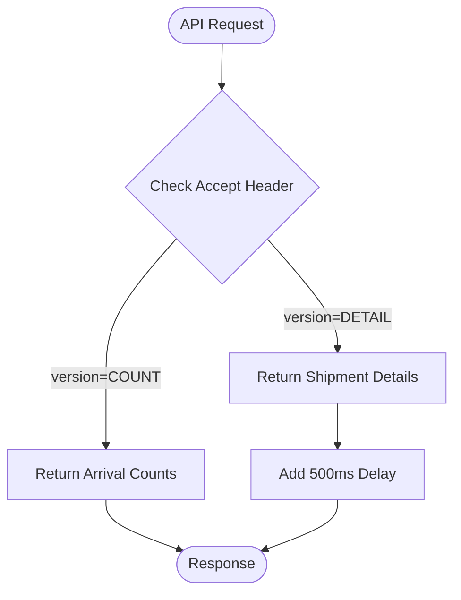

# Diagram: web/portal/src/mocks/handlers/shipping-ng/dwell/arrivalStatusDetails.js


> Auto-generated by Obscura crawlers

## Diagram 1



### SVG

<svg id="container" width="490.5234375" xmlns="http://www.w3.org/2000/svg" class="flowchart" height="631.65625" viewBox="0 0 490.5234375 631.65625" role="graphics-document document" aria-roledescription="flowchart-v2"><style>#container{font-family:"trebuchet ms",verdana,arial,sans-serif;font-size:16px;fill:#333;}@keyframes edge-animation-frame{from{stroke-dashoffset:0;}}@keyframes dash{to{stroke-dashoffset:0;}}#container .edge-animation-slow{stroke-dasharray:9,5!important;stroke-dashoffset:900;animation:dash 50s linear infinite;stroke-linecap:round;}#container .edge-animation-fast{stroke-dasharray:9,5!important;stroke-dashoffset:900;animation:dash 20s linear infinite;stroke-linecap:round;}#container .error-icon{fill:#552222;}#container .error-text{fill:#552222;stroke:#552222;}#container .edge-thickness-normal{stroke-width:1px;}#container .edge-thickness-thick{stroke-width:3.5px;}#container .edge-pattern-solid{stroke-dasharray:0;}#container .edge-thickness-invisible{stroke-width:0;fill:none;}#container .edge-pattern-dashed{stroke-dasharray:3;}#container .edge-pattern-dotted{stroke-dasharray:2;}#container .marker{fill:#333333;stroke:#333333;}#container .marker.cross{stroke:#333333;}#container svg{font-family:"trebuchet ms",verdana,arial,sans-serif;font-size:16px;}#container p{margin:0;}#container .label{font-family:"trebuchet ms",verdana,arial,sans-serif;color:#333;}#container .cluster-label text{fill:#333;}#container .cluster-label span{color:#333;}#container .cluster-label span p{background-color:transparent;}#container .label text,#container span{fill:#333;color:#333;}#container .node rect,#container .node circle,#container .node ellipse,#container .node polygon,#container .node path{fill:#ECECFF;stroke:#9370DB;stroke-width:1px;}#container .rough-node .label text,#container .node .label text,#container .image-shape .label,#container .icon-shape .label{text-anchor:middle;}#container .node .katex path{fill:#000;stroke:#000;stroke-width:1px;}#container .rough-node .label,#container .node .label,#container .image-shape .label,#container .icon-shape .label{text-align:center;}#container .node.clickable{cursor:pointer;}#container .root .anchor path{fill:#333333!important;stroke-width:0;stroke:#333333;}#container .arrowheadPath{fill:#333333;}#container .edgePath .path{stroke:#333333;stroke-width:2.0px;}#container .flowchart-link{stroke:#333333;fill:none;}#container .edgeLabel{background-color:rgba(232,232,232, 0.8);text-align:center;}#container .edgeLabel p{background-color:rgba(232,232,232, 0.8);}#container .edgeLabel rect{opacity:0.5;background-color:rgba(232,232,232, 0.8);fill:rgba(232,232,232, 0.8);}#container .labelBkg{background-color:rgba(232, 232, 232, 0.5);}#container .cluster rect{fill:#ffffde;stroke:#aaaa33;stroke-width:1px;}#container .cluster text{fill:#333;}#container .cluster span{color:#333;}#container div.mermaidTooltip{position:absolute;text-align:center;max-width:200px;padding:2px;font-family:"trebuchet ms",verdana,arial,sans-serif;font-size:12px;background:hsl(80, 100%, 96.2745098039%);border:1px solid #aaaa33;border-radius:2px;pointer-events:none;z-index:100;}#container .flowchartTitleText{text-anchor:middle;font-size:18px;fill:#333;}#container rect.text{fill:none;stroke-width:0;}#container .icon-shape,#container .image-shape{background-color:rgba(232,232,232, 0.8);text-align:center;}#container .icon-shape p,#container .image-shape p{background-color:rgba(232,232,232, 0.8);padding:2px;}#container .icon-shape rect,#container .image-shape rect{opacity:0.5;background-color:rgba(232,232,232, 0.8);fill:rgba(232,232,232, 0.8);}#container .label-icon{display:inline-block;height:1em;overflow:visible;vertical-align:-0.125em;}#container .node .label-icon path{fill:currentColor;stroke:revert;stroke-width:revert;}#container :root{--mermaid-font-family:"trebuchet ms",verdana,arial,sans-serif;}</style><g><marker id="container_flowchart-v2-pointEnd" class="marker flowchart-v2" viewBox="0 0 10 10" refX="5" refY="5" markerUnits="userSpaceOnUse" markerWidth="8" markerHeight="8" orient="auto"><path d="M 0 0 L 10 5 L 0 10 z" class="arrowMarkerPath" style="stroke-width: 1; stroke-dasharray: 1, 0;"></path></marker><marker id="container_flowchart-v2-pointStart" class="marker flowchart-v2" viewBox="0 0 10 10" refX="4.5" refY="5" markerUnits="userSpaceOnUse" markerWidth="8" markerHeight="8" orient="auto"><path d="M 0 5 L 10 10 L 10 0 z" class="arrowMarkerPath" style="stroke-width: 1; stroke-dasharray: 1, 0;"></path></marker><marker id="container_flowchart-v2-circleEnd" class="marker flowchart-v2" viewBox="0 0 10 10" refX="11" refY="5" markerUnits="userSpaceOnUse" markerWidth="11" markerHeight="11" orient="auto"><circle cx="5" cy="5" r="5" class="arrowMarkerPath" style="stroke-width: 1; stroke-dasharray: 1, 0;"></circle></marker><marker id="container_flowchart-v2-circleStart" class="marker flowchart-v2" viewBox="0 0 10 10" refX="-1" refY="5" markerUnits="userSpaceOnUse" markerWidth="11" markerHeight="11" orient="auto"><circle cx="5" cy="5" r="5" class="arrowMarkerPath" style="stroke-width: 1; stroke-dasharray: 1, 0;"></circle></marker><marker id="container_flowchart-v2-crossEnd" class="marker cross flowchart-v2" viewBox="0 0 11 11" refX="12" refY="5.2" markerUnits="userSpaceOnUse" markerWidth="11" markerHeight="11" orient="auto"><path d="M 1,1 l 9,9 M 10,1 l -9,9" class="arrowMarkerPath" style="stroke-width: 2; stroke-dasharray: 1, 0;"></path></marker><marker id="container_flowchart-v2-crossStart" class="marker cross flowchart-v2" viewBox="0 0 11 11" refX="-1" refY="5.2" markerUnits="userSpaceOnUse" markerWidth="11" markerHeight="11" orient="auto"><path d="M 1,1 l 9,9 M 10,1 l -9,9" class="arrowMarkerPath" style="stroke-width: 2; stroke-dasharray: 1, 0;"></path></marker><g class="root"><g class="clusters"></g><g class="edgePaths"><path d="M240.023,47.5L239.94,51.583C239.857,55.667,239.69,63.833,239.607,71.417C239.523,79,239.523,86,239.523,89.5L239.523,93" id="L_Start_CheckHeader_0" class="edge-thickness-normal edge-pattern-solid edge-thickness-normal edge-pattern-solid flowchart-link" style=";" data-edge="true" data-et="edge" data-id="L_Start_CheckHeader_0" data-points="W3sieCI6MjQwLjAyMzQzNzUsInkiOjQ3LjV9LHsieCI6MjM5LjUyMzQzNzUsInkiOjcyfSx7IngiOjIzOS41MjM0Mzc1LCJ5Ijo5N31d" marker-end="url(#container_flowchart-v2-pointEnd)"></path><path d="M191.096,254.228L178.421,268.466C165.746,282.704,140.396,311.18,127.722,336.085C115.047,360.99,115.047,382.323,115.047,401.656C115.047,420.99,115.047,438.323,115.047,450.49C115.047,462.656,115.047,469.656,115.047,473.156L115.047,476.656" id="L_CheckHeader_ReturnCounts_0" class="edge-thickness-normal edge-pattern-solid edge-thickness-normal edge-pattern-solid flowchart-link" style=";" data-edge="true" data-et="edge" data-id="L_CheckHeader_ReturnCounts_0" data-points="W3sieCI6MTkxLjA5NTY0ODkxNDgyNjYzLCJ5IjoyNTQuMjI4NDYxNDE0ODI2NjN9LHsieCI6MTE1LjA0Njg3NSwieSI6MzM5LjY1NjI1fSx7IngiOjExNS4wNDY4NzUsInkiOjQwMy42NTYyNX0seyJ4IjoxMTUuMDQ2ODc1LCJ5Ijo0NTUuNjU2MjV9LHsieCI6MTE1LjA0Njg3NSwieSI6NDgwLjY1NjI1fV0=" marker-end="url(#container_flowchart-v2-pointEnd)"></path><path d="M287.951,254.228L300.626,268.466C313.301,282.704,338.65,311.18,351.325,330.918C364,350.656,364,361.656,364,367.156L364,372.656" id="L_CheckHeader_ReturnDetails_0" class="edge-thickness-normal edge-pattern-solid edge-thickness-normal edge-pattern-solid flowchart-link" style=";" data-edge="true" data-et="edge" data-id="L_CheckHeader_ReturnDetails_0" data-points="W3sieCI6Mjg3Ljk1MTIyNjA4NTE3MzM1LCJ5IjoyNTQuMjI4NDYxNDE0ODI2NjN9LHsieCI6MzY0LCJ5IjozMzkuNjU2MjV9LHsieCI6MzY0LCJ5IjozNzYuNjU2MjV9XQ==" marker-end="url(#container_flowchart-v2-pointEnd)"></path><path d="M115.047,534.656L115.047,538.823C115.047,542.99,115.047,551.323,128.445,560.331C141.843,569.338,168.64,579.02,182.038,583.861L195.436,588.702" id="L_ReturnCounts_End_0" class="edge-thickness-normal edge-pattern-solid edge-thickness-normal edge-pattern-solid flowchart-link" style=";" data-edge="true" data-et="edge" data-id="L_ReturnCounts_End_0" data-points="W3sieCI6MTE1LjA0Njg3NSwieSI6NTM0LjY1NjI1fSx7IngiOjExNS4wNDY4NzUsInkiOjU1OS42NTYyNX0seyJ4IjoxOTkuMTk3OTMxNTc4NDgzNTUsInkiOjU5MC4wNjEyNTMzNDM0NDA3fV0=" marker-end="url(#container_flowchart-v2-pointEnd)"></path><path d="M364,430.656L364,434.823C364,438.99,364,447.323,364,454.99C364,462.656,364,469.656,364,473.156L364,476.656" id="L_ReturnDetails_Delay_0" class="edge-thickness-normal edge-pattern-solid edge-thickness-normal edge-pattern-solid flowchart-link" style=";" data-edge="true" data-et="edge" data-id="L_ReturnDetails_Delay_0" data-points="W3sieCI6MzY0LCJ5Ijo0MzAuNjU2MjV9LHsieCI6MzY0LCJ5Ijo0NTUuNjU2MjV9LHsieCI6MzY0LCJ5Ijo0ODAuNjU2MjV9XQ==" marker-end="url(#container_flowchart-v2-pointEnd)"></path><path d="M364,534.656L364,538.823C364,542.99,364,551.323,350.768,560.328C337.535,569.333,311.07,579.01,297.838,583.849L284.606,588.688" id="L_Delay_End_0" class="edge-thickness-normal edge-pattern-solid edge-thickness-normal edge-pattern-solid flowchart-link" style=";" data-edge="true" data-et="edge" data-id="L_Delay_End_0" data-points="W3sieCI6MzY0LCJ5Ijo1MzQuNjU2MjV9LHsieCI6MzY0LCJ5Ijo1NTkuNjU2MjV9LHsieCI6MjgwLjg0ODk0MTQyODA4NzEsInkiOjU5MC4wNjEyNTQwNTYwODU5fV0=" marker-end="url(#container_flowchart-v2-pointEnd)"></path></g><g class="edgeLabels"><g class="edgeLabel"><g class="label" data-id="L_Start_CheckHeader_0" transform="translate(0, 0)"><foreignObject width="0" height="0"><div xmlns="http://www.w3.org/1999/xhtml" class="labelBkg" style="display: table-cell; white-space: nowrap; line-height: 1.5; max-width: 200px; text-align: center;"><span class="edgeLabel"></span></div></foreignObject></g></g><g class="edgeLabel" transform="translate(115.046875, 403.65625)"><g class="label" data-id="L_CheckHeader_ReturnCounts_0" transform="translate(-55.34375, -12)"><foreignObject width="110.6875" height="24"><div xmlns="http://www.w3.org/1999/xhtml" class="labelBkg" style="display: table-cell; white-space: nowrap; line-height: 1.5; max-width: 200px; text-align: center;"><span class="edgeLabel"><p>version=COUNT</p></span></div></foreignObject></g></g><g class="edgeLabel" transform="translate(364, 339.65625)"><g class="label" data-id="L_CheckHeader_ReturnDetails_0" transform="translate(-54.6875, -12)"><foreignObject width="109.375" height="24"><div xmlns="http://www.w3.org/1999/xhtml" class="labelBkg" style="display: table-cell; white-space: nowrap; line-height: 1.5; max-width: 200px; text-align: center;"><span class="edgeLabel"><p>version=DETAIL</p></span></div></foreignObject></g></g><g class="edgeLabel"><g class="label" data-id="L_ReturnCounts_End_0" transform="translate(0, 0)"><foreignObject width="0" height="0"><div xmlns="http://www.w3.org/1999/xhtml" class="labelBkg" style="display: table-cell; white-space: nowrap; line-height: 1.5; max-width: 200px; text-align: center;"><span class="edgeLabel"></span></div></foreignObject></g></g><g class="edgeLabel"><g class="label" data-id="L_ReturnDetails_Delay_0" transform="translate(0, 0)"><foreignObject width="0" height="0"><div xmlns="http://www.w3.org/1999/xhtml" class="labelBkg" style="display: table-cell; white-space: nowrap; line-height: 1.5; max-width: 200px; text-align: center;"><span class="edgeLabel"></span></div></foreignObject></g></g><g class="edgeLabel"><g class="label" data-id="L_Delay_End_0" transform="translate(0, 0)"><foreignObject width="0" height="0"><div xmlns="http://www.w3.org/1999/xhtml" class="labelBkg" style="display: table-cell; white-space: nowrap; line-height: 1.5; max-width: 200px; text-align: center;"><span class="edgeLabel"></span></div></foreignObject></g></g></g><g class="nodes"><g class="node default" id="flowchart-Start-0" transform="translate(239.5234375, 27.5)"><g class="basic label-container outer-path"><path d="M-36.09375 -19.5 C-16.657424543785027 -19.5, 2.778900912429947 -19.5, 36.09375 -19.5 C36.09375 -19.5, 36.09375 -19.5, 36.09375 -19.5 C36.486529737308224 -19.487404318323904, 36.87930947461645 -19.47480863664781, 37.3431192896239 -19.45993515863156 C37.61613523725571 -19.433597638513234, 37.88915118488752 -19.40726011839491, 38.587354652847864 -19.3399052695533 C39.07549101079522 -19.260987168754365, 39.56362736874257 -19.18206906795543, 39.82134325967676 -19.140403561325776 C40.22727912317308 -19.04775134946181, 40.63321498666941 -18.95509913759784, 41.04001438623539 -18.862249829261074 C41.29527702729897 -18.78648921729435, 41.55053966836256 -18.710728605327624, 42.238360251460605 -18.50658706670804 C42.69409296466051 -18.338873215503455, 43.14982567786042 -18.17115936429887, 43.4114565951478 -18.074876768247425 C43.73555218558493 -17.93140926431501, 44.05964777602206 -17.787941760382598, 44.55448291279238 -17.568892924097174 C44.8472216567441 -17.416171308885676, 45.13996040069581 -17.263449693674183, 45.66274226407678 -16.990714730406097 C45.96161372365238 -16.809537095247723, 46.26048518322797 -16.628359460089346, 46.7316805736057 -16.342718045390892 C47.064799164760196 -16.11034893667291, 47.3979177559147 -15.877979827954926, 47.75690534457871 -15.627565626425154 C48.12500589016386 -15.3340152368879, 48.49310643574901 -15.040464847350645, 48.734203708501866 -14.848196188198123 C49.08417419743971 -14.5303622498565, 49.43414468637755 -14.212528311514877, 49.65955973676799 -14.007812326905688 C49.94506275271891 -13.713007022702818, 50.23056576866984 -13.418201718499947, 50.52917094296865 -13.10986736009568 C50.83417862411122 -12.751587982396904, 51.13918630525379 -12.393308604698127, 51.33946390812658 -12.158051136245305 C51.63767031298768 -11.758481720893794, 51.935876717848785 -11.358912305542281, 52.087108964640635 -11.156274872382312 C52.28171238375155 -10.857311762293067, 52.47631580286245 -10.558348652203822, 52.76903387860425 -10.108655082055241 C52.96351433806707 -9.763335332997016, 53.157994797529895 -9.41801558393879, 53.382436474273504 -9.019496659696287 C53.58346586852379 -8.602054821195589, 53.78449526277408 -8.184612982694889, 53.92479614880834 -7.893275190886684 C54.08345673977688 -7.501380463700552, 54.242117330745415 -7.10948573651442, 54.393884229970325 -6.734618561215508 C54.50244426585584 -6.4076530298211205, 54.61100430174135 -6.080687498426734, 54.78777313421488 -5.548287939305138 C54.86483862825874 -5.2544038101195, 54.9419041223026 -4.960519680933862, 55.10484428754556 -4.339158212148133 C55.18748756951339 -3.91480242590716, 55.27013085148122 -3.490446639666187, 55.343794776581774 -3.1121979531509023 C55.39580748551696 -2.708797653720688, 55.447820194452156 -2.305397354290474, 55.50364270250937 -1.872449005199798 C55.53123718552056 -1.4426426584346628, 55.55883166853176 -1.0128363116695276, 55.58373121591342 -0.6250057626472757 C55.58373121591342 -0.14354223724812104, 55.58373121591342 0.3379212881510336, 55.58373121591342 0.625005762647271 C55.56443427745075 0.9255711554117154, 55.54513733898808 1.2261365481761597, 55.50364270250937 1.8724490051997846 C55.45515102770886 2.2485408591882274, 55.406659352908356 2.6246327131766702, 55.343794776581774 3.1121979531508885 C55.290101019248254 3.387904048878889, 55.236407261914735 3.6636101446068903, 55.10484428754556 4.339158212148129 C55.021106412105766 4.658487023424865, 54.93736853666597 4.977815834701601, 54.78777313421489 5.548287939305125 C54.63109999074093 6.020162484973237, 54.47442684726697 6.492037030641348, 54.393884229970325 6.734618561215495 C54.22810839058331 7.1440880895592365, 54.0623325511963 7.553557617902979, 53.92479614880834 7.893275190886679 C53.71870586116235 8.321226082809334, 53.51261557351636 8.74917697473199, 53.382436474273504 9.019496659696284 C53.20952445824156 9.326519453401254, 53.03661244220962 9.633542247106224, 52.76903387860425 10.108655082055236 C52.62942048917334 10.323138739665463, 52.48980709974244 10.537622397275689, 52.08710896464064 11.156274872382301 C51.90696117732913 11.397656495578683, 51.72681339001762 11.639038118775066, 51.33946390812658 12.158051136245302 C51.151956969328815 12.378307456004228, 50.964450030531054 12.598563775763152, 50.52917094296866 13.10986736009567 C50.2000293922295 13.449733034257724, 49.87088784149035 13.78959870841978, 49.65955973676799 14.007812326905684 C49.44622920274717 14.20155347348677, 49.23289866872634 14.395294620067856, 48.73420370850189 14.848196188198111 C48.39944157560633 15.115160080787827, 48.06467944271078 15.382123973377546, 47.75690534457871 15.627565626425152 C47.50688037864124 15.801972219256799, 47.25685541270377 15.976378812088445, 46.73168057360571 16.34271804539089 C46.36824483533988 16.5630349257131, 46.00480909707405 16.78335180603531, 45.66274226407678 16.990714730406093 C45.225501605997806 17.218822901659887, 44.78826094791883 17.44693107291368, 44.55448291279239 17.56889292409717 C44.323068029341904 17.671333428322086, 44.09165314589142 17.773773932546998, 43.411456595147804 18.07487676824742 C42.9892453148616 18.230254422271038, 42.567034034575386 18.38563207629465, 42.23836025146062 18.506587066708033 C41.99098906665716 18.580005535879852, 41.7436178818537 18.653424005051676, 41.04001438623541 18.86224982926107 C40.64844533939118 18.951622908976436, 40.25687629254695 19.040995988691805, 39.821343259676766 19.140403561325773 C39.52683752806869 19.188016964086106, 39.23233179646062 19.23563036684644, 38.58735465284788 19.3399052695533 C38.125361508045245 19.38447319260436, 37.66336836324261 19.429041115655423, 37.3431192896239 19.45993515863156 C36.995432088984245 19.471084810423992, 36.6477448883446 19.482234462216425, 36.09375000000001 19.5 C36.09375000000001 19.5, 36.09375 19.5, 36.09375 19.5 C18.394735499269718 19.5, 0.6957209985394357 19.5, -36.09374999999999 19.5 C-36.449195486917105 19.488601555067238, -36.80464097383421 19.477203110134475, -37.34311928962389 19.45993515863156 C-37.71686734802201 19.423880132935697, -38.09061540642011 19.387825107239834, -38.58735465284787 19.3399052695533 C-38.88120187308332 19.292398329804858, -39.175049093318776 19.244891390056416, -39.82134325967676 19.140403561325773 C-40.17146611313124 19.06049030478993, -40.52158896658571 18.980577048254087, -41.040014386235384 18.862249829261074 C-41.28960322715797 18.78817317139381, -41.53919206808055 18.71409651352655, -42.23836025146059 18.506587066708043 C-42.5035881973528 18.408980730879456, -42.768816143245004 18.31137439505087, -43.4114565951478 18.074876768247425 C-43.678856414790175 17.95650680022556, -43.94625623443256 17.838136832203702, -44.55448291279238 17.568892924097174 C-44.977002586008936 17.348464681216864, -45.399522259225485 17.128036438336558, -45.66274226407678 16.990714730406097 C-45.927609017482986 16.830150947961442, -46.19247577088919 16.669587165516788, -46.731680573605686 16.3427180453909 C-47.025680121452154 16.137636687848506, -47.31967966929862 15.932555330306112, -47.75690534457871 15.627565626425156 C-48.112302435515254 15.34414590391704, -48.4676995264518 15.060726181408924, -48.734203708501866 14.848196188198125 C-49.02833644373093 14.581072620388808, -49.32246917895999 14.31394905257949, -49.659559736767974 14.007812326905697 C-49.911433432899976 13.747732056434373, -50.16330712903198 13.48765178596305, -50.529170942968655 13.109867360095677 C-50.76682786295024 12.830702018823473, -51.00448478293182 12.551536677551267, -51.339463908126575 12.158051136245307 C-51.628110650006676 11.77129079838513, -51.91675739188677 11.384530460524951, -52.087108964640635 11.156274872382316 C-52.28256657344205 10.855999497546415, -52.47802418224345 10.555724122710517, -52.76903387860425 10.108655082055249 C-52.967096567647864 9.756974721636242, -53.16515925669148 9.405294361217234, -53.382436474273504 9.019496659696289 C-53.565451702401774 8.639461622589364, -53.74846693053005 8.259426585482439, -53.92479614880834 7.893275190886686 C-54.081063821571945 7.507291017930662, -54.23733149433555 7.1213068449746375, -54.393884229970325 6.73461856121551 C-54.51464221177104 6.370914760203277, -54.63540019357176 6.007210959191045, -54.78777313421488 5.5482879393051325 C-54.914119045530356 5.066476220794893, -55.040464956845824 4.584664502284654, -55.10484428754556 4.339158212148136 C-55.186599889691514 3.919360474181278, -55.268355491837475 3.4995627362144197, -55.343794776581774 3.112197953150904 C-55.39831632984188 2.689339552563994, -55.452837883101985 2.2664811519770844, -55.50364270250937 1.872449005199809 C-55.53022047111556 1.4584788059696068, -55.556798239721765 1.0445086067394045, -55.58373121591342 0.6250057626472781 C-55.58373121591342 0.1402660126252373, -55.58373121591342 -0.34447373739680354, -55.58373121591342 -0.6250057626472687 C-55.554334400418455 -1.0828848926636487, -55.5249375849235 -1.5407640226800288, -55.50364270250937 -1.8724490051997822 C-55.45680567327977 -2.2357077548870183, -55.40996864405016 -2.5989665045742543, -55.343794776581774 -3.112197953150895 C-55.29474528660327 -3.364056717577118, -55.24569579662477 -3.61591548200334, -55.10484428754556 -4.339158212148126 C-54.99320355719694 -4.764892702366027, -54.88156282684832 -5.190627192583928, -54.78777313421489 -5.548287939305123 C-54.664778322096424 -5.918728716843881, -54.54178350997797 -6.289169494382639, -54.39388422997033 -6.734618561215485 C-54.25740929358777 -7.071714292643814, -54.1209343572052 -7.408810024072144, -53.92479614880834 -7.893275190886676 C-53.81439436912828 -8.122526848611992, -53.70399258944822 -8.351778506337306, -53.382436474273504 -9.019496659696282 C-53.195834349978064 -9.35082762689688, -53.009232225682624 -9.68215859409748, -52.76903387860425 -10.108655082055243 C-52.62757588946087 -10.32597254016821, -52.48611790031749 -10.543289998281177, -52.08710896464064 -11.156274872382308 C-51.89835352002485 -11.409189972192717, -51.70959807540905 -11.662105072003126, -51.33946390812659 -12.158051136245302 C-51.03503726491165 -12.51564799373229, -50.730610621696705 -12.87324485121928, -50.52917094296866 -13.10986736009567 C-50.25790850189416 -13.389968101565696, -49.98664606081965 -13.67006884303572, -49.659559736767996 -14.007812326905677 C-49.36363124811713 -14.276566750459645, -49.067702759466265 -14.545321174013615, -48.73420370850189 -14.848196188198107 C-48.50634110746196 -15.029910548848978, -48.27847850642203 -15.21162490949985, -47.75690534457872 -15.627565626425149 C-47.354556455991855 -15.908226793700678, -46.95220756740499 -16.188887960976206, -46.731680573605715 -16.342718045390885 C-46.40395397397283 -16.541387836023613, -46.07622737433994 -16.740057626656345, -45.66274226407679 -16.99071473040609 C-45.40102177132294 -17.1272541438358, -45.139301278569086 -17.263793557265508, -44.55448291279239 -17.56889292409717 C-44.273354412179415 -17.69334017193786, -43.99222591156645 -17.81778741977855, -43.411456595147804 -18.07487676824742 C-43.00740702182471 -18.223570746223633, -42.60335744850161 -18.372264724199844, -42.23836025146062 -18.506587066708033 C-41.79204970623242 -18.639049693799905, -41.345739161004225 -18.771512320891773, -41.04001438623541 -18.862249829261067 C-40.563273653131496 -18.971062790568013, -40.08653292002757 -19.079875751874958, -39.821343259676766 -19.140403561325773 C-39.458758417539926 -19.199023466715012, -39.09617357540309 -19.257643372104248, -38.58735465284788 -19.3399052695533 C-38.258709456891985 -19.37160927635349, -37.93006426093609 -19.40331328315368, -37.3431192896239 -19.45993515863156 C-36.947024953483776 -19.472637133040717, -36.55093061734366 -19.485339107449878, -36.09375000000001 -19.5 C-36.09375000000001 -19.5, -36.09375 -19.5, -36.09375 -19.5" stroke="none" stroke-width="0" fill="#ECECFF" style=""></path><path d="M-36.09375 -19.5 C-19.09945290059951 -19.5, -2.105155801199018 -19.5, 36.09375 -19.5 M-36.09375 -19.5 C-11.69270298726114 -19.5, 12.708344025477722 -19.5, 36.09375 -19.5 M36.09375 -19.5 C36.09375 -19.5, 36.09375 -19.5, 36.09375 -19.5 M36.09375 -19.5 C36.09375 -19.5, 36.09375 -19.5, 36.09375 -19.5 M36.09375 -19.5 C36.46271803950132 -19.488167913125913, 36.83168607900263 -19.476335826251827, 37.3431192896239 -19.45993515863156 M36.09375 -19.5 C36.41846118532177 -19.48958714429871, 36.74317237064353 -19.479174288597424, 37.3431192896239 -19.45993515863156 M37.3431192896239 -19.45993515863156 C37.71221084555046 -19.424329340128864, 38.08130240147701 -19.38872352162617, 38.587354652847864 -19.3399052695533 M37.3431192896239 -19.45993515863156 C37.76924904818776 -19.41882693331892, 38.19537880675161 -19.377718708006277, 38.587354652847864 -19.3399052695533 M38.587354652847864 -19.3399052695533 C38.839236315628945 -19.299182995686323, 39.091117978410026 -19.258460721819347, 39.82134325967676 -19.140403561325776 M38.587354652847864 -19.3399052695533 C39.071988751498196 -19.261553386877083, 39.55662285014852 -19.183201504200863, 39.82134325967676 -19.140403561325776 M39.82134325967676 -19.140403561325776 C40.23708785082934 -19.045512571382197, 40.65283244198193 -18.950621581438618, 41.04001438623539 -18.862249829261074 M39.82134325967676 -19.140403561325776 C40.122950128584996 -19.071563761666226, 40.42455699749323 -19.002723962006677, 41.04001438623539 -18.862249829261074 M41.04001438623539 -18.862249829261074 C41.469349096735186 -18.734825540808618, 41.89868380723499 -18.607401252356162, 42.238360251460605 -18.50658706670804 M41.04001438623539 -18.862249829261074 C41.41582680423532 -18.75071067627833, 41.79163922223526 -18.639171523295587, 42.238360251460605 -18.50658706670804 M42.238360251460605 -18.50658706670804 C42.55117736552792 -18.391467477081566, 42.863994479595235 -18.27634788745509, 43.4114565951478 -18.074876768247425 M42.238360251460605 -18.50658706670804 C42.50838159162294 -18.40721671747839, 42.77840293178528 -18.307846368248747, 43.4114565951478 -18.074876768247425 M43.4114565951478 -18.074876768247425 C43.80722957115289 -17.899679811958173, 44.203002547157986 -17.72448285566892, 44.55448291279238 -17.568892924097174 M43.4114565951478 -18.074876768247425 C43.6761102818209 -17.957722431829925, 43.94076396849399 -17.840568095412426, 44.55448291279238 -17.568892924097174 M44.55448291279238 -17.568892924097174 C44.8901483498756 -17.393776480574832, 45.225813786958824 -17.21866003705249, 45.66274226407678 -16.990714730406097 M44.55448291279238 -17.568892924097174 C44.787224177528216 -17.44747195536238, 45.01996544226406 -17.32605098662759, 45.66274226407678 -16.990714730406097 M45.66274226407678 -16.990714730406097 C45.93695039977353 -16.824488147120856, 46.211158535470275 -16.65826156383562, 46.7316805736057 -16.342718045390892 M45.66274226407678 -16.990714730406097 C46.07319890086054 -16.741893505076845, 46.483655537644296 -16.493072279747594, 46.7316805736057 -16.342718045390892 M46.7316805736057 -16.342718045390892 C47.07394206446123 -16.10397124563122, 47.416203555316756 -15.865224445871547, 47.75690534457871 -15.627565626425154 M46.7316805736057 -16.342718045390892 C47.102281455656346 -16.084202913125978, 47.47288233770699 -15.82568778086106, 47.75690534457871 -15.627565626425154 M47.75690534457871 -15.627565626425154 C48.09316404654205 -15.359408259829252, 48.42942274850539 -15.09125089323335, 48.734203708501866 -14.848196188198123 M47.75690534457871 -15.627565626425154 C48.061134031580664 -15.384951344406462, 48.36536271858262 -15.14233706238777, 48.734203708501866 -14.848196188198123 M48.734203708501866 -14.848196188198123 C48.963370189883065 -14.640073253220553, 49.192536671264264 -14.431950318242981, 49.65955973676799 -14.007812326905688 M48.734203708501866 -14.848196188198123 C49.03879760920211 -14.571572066695147, 49.34339150990237 -14.294947945192169, 49.65955973676799 -14.007812326905688 M49.65955973676799 -14.007812326905688 C49.952802000829685 -13.705015613624361, 50.246044264891374 -13.402218900343035, 50.52917094296865 -13.10986736009568 M49.65955973676799 -14.007812326905688 C49.971501711956556 -13.685706626611026, 50.28344368714513 -13.363600926316366, 50.52917094296865 -13.10986736009568 M50.52917094296865 -13.10986736009568 C50.736827845934336 -12.865941745859672, 50.944484748900024 -12.622016131623662, 51.33946390812658 -12.158051136245305 M50.52917094296865 -13.10986736009568 C50.83561022482609 -12.749906342736825, 51.14204950668354 -12.389945325377967, 51.33946390812658 -12.158051136245305 M51.33946390812658 -12.158051136245305 C51.60660999748911 -11.800099714008924, 51.87375608685164 -11.442148291772545, 52.087108964640635 -11.156274872382312 M51.33946390812658 -12.158051136245305 C51.52424887524089 -11.910456114568943, 51.70903384235521 -11.66286109289258, 52.087108964640635 -11.156274872382312 M52.087108964640635 -11.156274872382312 C52.33716187771891 -10.772126449285228, 52.587214790797184 -10.387978026188144, 52.76903387860425 -10.108655082055241 M52.087108964640635 -11.156274872382312 C52.25490540887611 -10.898494474382392, 52.42270185311159 -10.640714076382473, 52.76903387860425 -10.108655082055241 M52.76903387860425 -10.108655082055241 C52.911134314344906 -9.856341369168275, 53.05323475008556 -9.604027656281307, 53.382436474273504 -9.019496659696287 M52.76903387860425 -10.108655082055241 C52.89592149591442 -9.883353268756498, 53.0228091132246 -9.658051455457754, 53.382436474273504 -9.019496659696287 M53.382436474273504 -9.019496659696287 C53.49497064144501 -8.785817053719207, 53.60750480861651 -8.552137447742128, 53.92479614880834 -7.893275190886684 M53.382436474273504 -9.019496659696287 C53.553309728984004 -8.664674690187976, 53.724182983694504 -8.309852720679665, 53.92479614880834 -7.893275190886684 M53.92479614880834 -7.893275190886684 C54.07251108949221 -7.528416431523426, 54.220226030176086 -7.163557672160167, 54.393884229970325 -6.734618561215508 M53.92479614880834 -7.893275190886684 C54.04397899100811 -7.5988912664097565, 54.16316183320788 -7.304507341932829, 54.393884229970325 -6.734618561215508 M54.393884229970325 -6.734618561215508 C54.52865444095319 -6.328712158452195, 54.66342465193605 -5.922805755688882, 54.78777313421488 -5.548287939305138 M54.393884229970325 -6.734618561215508 C54.52942651751517 -6.326386786861205, 54.66496880506001 -5.918155012506901, 54.78777313421488 -5.548287939305138 M54.78777313421488 -5.548287939305138 C54.855842079878094 -5.288711548223645, 54.92391102554131 -5.029135157142152, 55.10484428754556 -4.339158212148133 M54.78777313421488 -5.548287939305138 C54.90573544913441 -5.098446507326281, 55.02369776405394 -4.648605075347423, 55.10484428754556 -4.339158212148133 M55.10484428754556 -4.339158212148133 C55.19754240475566 -3.863172972028267, 55.290240521965764 -3.3871877319084005, 55.343794776581774 -3.1121979531509023 M55.10484428754556 -4.339158212148133 C55.154426752414004 -4.084562734306348, 55.20400921728244 -3.8299672564645633, 55.343794776581774 -3.1121979531509023 M55.343794776581774 -3.1121979531509023 C55.39782030940587 -2.69318658911533, 55.45184584222998 -2.274175225079758, 55.50364270250937 -1.872449005199798 M55.343794776581774 -3.1121979531509023 C55.38453852513454 -2.796197485138869, 55.4252822736873 -2.480197017126835, 55.50364270250937 -1.872449005199798 M55.50364270250937 -1.872449005199798 C55.522822044618934 -1.5737152705570432, 55.542001386728494 -1.2749815359142884, 55.58373121591342 -0.6250057626472757 M55.50364270250937 -1.872449005199798 C55.52032858017369 -1.6125529919799073, 55.53701445783802 -1.3526569787600167, 55.58373121591342 -0.6250057626472757 M55.58373121591342 -0.6250057626472757 C55.58373121591342 -0.29285323309643296, 55.58373121591342 0.03929929645440977, 55.58373121591342 0.625005762647271 M55.58373121591342 -0.6250057626472757 C55.58373121591342 -0.2665318498857461, 55.58373121591342 0.09194206287578355, 55.58373121591342 0.625005762647271 M55.58373121591342 0.625005762647271 C55.56121762725038 0.9756730787157784, 55.53870403858734 1.3263403947842858, 55.50364270250937 1.8724490051997846 M55.58373121591342 0.625005762647271 C55.5589637231707 1.0107794540754043, 55.53419623042798 1.3965531455035376, 55.50364270250937 1.8724490051997846 M55.50364270250937 1.8724490051997846 C55.45049187206378 2.2846763503171257, 55.39734104161819 2.6969036954344667, 55.343794776581774 3.1121979531508885 M55.50364270250937 1.8724490051997846 C55.45368942774744 2.259876739863455, 55.40373615298551 2.647304474527126, 55.343794776581774 3.1121979531508885 M55.343794776581774 3.1121979531508885 C55.29391502911517 3.3683199143035614, 55.24403528164856 3.624441875456234, 55.10484428754556 4.339158212148129 M55.343794776581774 3.1121979531508885 C55.282685234703564 3.42598253518926, 55.221575692825354 3.7397671172276308, 55.10484428754556 4.339158212148129 M55.10484428754556 4.339158212148129 C55.01970614223746 4.663826859313498, 54.93456799692937 4.988495506478867, 54.78777313421489 5.548287939305125 M55.10484428754556 4.339158212148129 C55.005159245484684 4.719300481296771, 54.905474203423815 5.099442750445412, 54.78777313421489 5.548287939305125 M54.78777313421489 5.548287939305125 C54.70795278974794 5.788694099194759, 54.628132445281 6.029100259084393, 54.393884229970325 6.734618561215495 M54.78777313421489 5.548287939305125 C54.682913333672445 5.864108951398622, 54.578053533129996 6.179929963492118, 54.393884229970325 6.734618561215495 M54.393884229970325 6.734618561215495 C54.23044948991393 7.138305528950526, 54.06701474985754 7.541992496685557, 53.92479614880834 7.893275190886679 M54.393884229970325 6.734618561215495 C54.24145025705454 7.111133421427866, 54.08901628413875 7.487648281640236, 53.92479614880834 7.893275190886679 M53.92479614880834 7.893275190886679 C53.76500883069113 8.225076975857974, 53.60522151257393 8.556878760829271, 53.382436474273504 9.019496659696284 M53.92479614880834 7.893275190886679 C53.76995673089025 8.214802555226402, 53.61511731297216 8.536329919566127, 53.382436474273504 9.019496659696284 M53.382436474273504 9.019496659696284 C53.258058660996014 9.240342061789777, 53.13368084771852 9.46118746388327, 52.76903387860425 10.108655082055236 M53.382436474273504 9.019496659696284 C53.23499674986696 9.281290820271147, 53.087557025460406 9.543084980846011, 52.76903387860425 10.108655082055236 M52.76903387860425 10.108655082055236 C52.613113925384006 10.34819000057137, 52.457193972163765 10.587724919087503, 52.08710896464064 11.156274872382301 M52.76903387860425 10.108655082055236 C52.54372913210161 10.45478367547891, 52.31842438559898 10.800912268902582, 52.08710896464064 11.156274872382301 M52.08710896464064 11.156274872382301 C51.88557228099673 11.426315668095551, 51.684035597352825 11.696356463808803, 51.33946390812658 12.158051136245302 M52.08710896464064 11.156274872382301 C51.84400393376995 11.482013466425105, 51.60089890289925 11.80775206046791, 51.33946390812658 12.158051136245302 M51.33946390812658 12.158051136245302 C51.116516963272495 12.419937303711453, 50.89357001841841 12.681823471177605, 50.52917094296866 13.10986736009567 M51.33946390812658 12.158051136245302 C51.05679727079513 12.490087452642136, 50.77413063346368 12.82212376903897, 50.52917094296866 13.10986736009567 M50.52917094296866 13.10986736009567 C50.255331640934045 13.392628922071227, 49.98149233889943 13.675390484046781, 49.65955973676799 14.007812326905684 M50.52917094296866 13.10986736009567 C50.236553926337024 13.41201845407169, 49.94393690970539 13.71416954804771, 49.65955973676799 14.007812326905684 M49.65955973676799 14.007812326905684 C49.30092535341501 14.333514584921058, 48.942290970062025 14.65921684293643, 48.73420370850189 14.848196188198111 M49.65955973676799 14.007812326905684 C49.46848622044231 14.181340238904458, 49.277412704116635 14.35486815090323, 48.73420370850189 14.848196188198111 M48.73420370850189 14.848196188198111 C48.4141997648673 15.10339081758412, 48.09419582123271 15.358585446970128, 47.75690534457871 15.627565626425152 M48.73420370850189 14.848196188198111 C48.347352375598234 15.156699831642461, 47.96050104269458 15.46520347508681, 47.75690534457871 15.627565626425152 M47.75690534457871 15.627565626425152 C47.54326038701799 15.776595100278362, 47.32961542945726 15.925624574131572, 46.73168057360571 16.34271804539089 M47.75690534457871 15.627565626425152 C47.48198003101965 15.819341623838945, 47.20705471746059 16.011117621252737, 46.73168057360571 16.34271804539089 M46.73168057360571 16.34271804539089 C46.4855305010168 16.491935665932676, 46.239380428427886 16.641153286474463, 45.66274226407678 16.990714730406093 M46.73168057360571 16.34271804539089 C46.38454663831606 16.553152676948912, 46.03741270302641 16.76358730850693, 45.66274226407678 16.990714730406093 M45.66274226407678 16.990714730406093 C45.35487436797407 17.15132921460408, 45.04700647187136 17.311943698802065, 44.55448291279239 17.56889292409717 M45.66274226407678 16.990714730406093 C45.2995218060216 17.180206610719676, 44.93630134796642 17.369698491033258, 44.55448291279239 17.56889292409717 M44.55448291279239 17.56889292409717 C44.14176458985452 17.751591082807707, 43.72904626691665 17.93428924151824, 43.411456595147804 18.07487676824742 M44.55448291279239 17.56889292409717 C44.31756404955008 17.673769876906167, 44.08064518630777 17.77864682971516, 43.411456595147804 18.07487676824742 M43.411456595147804 18.07487676824742 C43.03092350377071 18.21491646348353, 42.65039041239361 18.354956158719638, 42.23836025146062 18.506587066708033 M43.411456595147804 18.07487676824742 C42.98334960079251 18.232424099547845, 42.55524260643721 18.38997143084827, 42.23836025146062 18.506587066708033 M42.23836025146062 18.506587066708033 C41.984095916818085 18.58205138656921, 41.72983158217556 18.657515706430384, 41.04001438623541 18.86224982926107 M42.23836025146062 18.506587066708033 C41.80530389111928 18.63511592129812, 41.37224753077795 18.76364477588821, 41.04001438623541 18.86224982926107 M41.04001438623541 18.86224982926107 C40.69760227997937 18.9404031580662, 40.35519017372333 19.018556486871326, 39.821343259676766 19.140403561325773 M41.04001438623541 18.86224982926107 C40.697697312323214 18.94038146755386, 40.35538023841102 19.018513105846647, 39.821343259676766 19.140403561325773 M39.821343259676766 19.140403561325773 C39.52859467415613 19.187732882333563, 39.2358460886355 19.23506220334135, 38.58735465284788 19.3399052695533 M39.821343259676766 19.140403561325773 C39.55472537513994 19.183508273245113, 39.28810749060311 19.22661298516445, 38.58735465284788 19.3399052695533 M38.58735465284788 19.3399052695533 C38.146720517364365 19.382412714663314, 37.70608638188085 19.424920159773325, 37.3431192896239 19.45993515863156 M38.58735465284788 19.3399052695533 C38.11838005994927 19.38514668450576, 37.649405467050656 19.43038809945822, 37.3431192896239 19.45993515863156 M37.3431192896239 19.45993515863156 C37.05329371303648 19.469229300761455, 36.76346813644907 19.47852344289135, 36.09375000000001 19.5 M37.3431192896239 19.45993515863156 C37.022112984053514 19.47022920605033, 36.70110667848312 19.480523253469105, 36.09375000000001 19.5 M36.09375000000001 19.5 C36.09375000000001 19.5, 36.09375 19.5, 36.09375 19.5 M36.09375000000001 19.5 C36.09375000000001 19.5, 36.09375 19.5, 36.09375 19.5 M36.09375 19.5 C11.248685519923086 19.5, -13.596378960153828 19.5, -36.09374999999999 19.5 M36.09375 19.5 C12.460773323990228 19.5, -11.172203352019544 19.5, -36.09374999999999 19.5 M-36.09374999999999 19.5 C-36.3534349085255 19.491672410429597, -36.61311981705101 19.483344820859195, -37.34311928962389 19.45993515863156 M-36.09374999999999 19.5 C-36.5005112202292 19.486955959379934, -36.90727244045841 19.473911918759867, -37.34311928962389 19.45993515863156 M-37.34311928962389 19.45993515863156 C-37.76273382952906 19.419455448627225, -38.18234836943423 19.378975738622895, -38.58735465284787 19.3399052695533 M-37.34311928962389 19.45993515863156 C-37.71855405701367 19.423717418147834, -38.093988824403446 19.387499677664113, -38.58735465284787 19.3399052695533 M-38.58735465284787 19.3399052695533 C-39.038700992832155 19.266935093547783, -39.49004733281644 19.193964917542264, -39.82134325967676 19.140403561325773 M-38.58735465284787 19.3399052695533 C-39.01484468379237 19.270791996584894, -39.44233471473687 19.20167872361649, -39.82134325967676 19.140403561325773 M-39.82134325967676 19.140403561325773 C-40.2517282345056 19.04217099934552, -40.682113209334446 18.94393843736527, -41.040014386235384 18.862249829261074 M-39.82134325967676 19.140403561325773 C-40.24315070919081 19.044128763525038, -40.66495815870486 18.947853965724303, -41.040014386235384 18.862249829261074 M-41.040014386235384 18.862249829261074 C-41.45994973165814 18.737615223025212, -41.87988507708089 18.612980616789347, -42.23836025146059 18.506587066708043 M-41.040014386235384 18.862249829261074 C-41.3357016608656 18.774491398245004, -41.63138893549582 18.686732967228934, -42.23836025146059 18.506587066708043 M-42.23836025146059 18.506587066708043 C-42.62778885408836 18.363273741102486, -43.01721745671612 18.219960415496928, -43.4114565951478 18.074876768247425 M-42.23836025146059 18.506587066708043 C-42.50536556040346 18.408326644847048, -42.77237086934633 18.310066222986052, -43.4114565951478 18.074876768247425 M-43.4114565951478 18.074876768247425 C-43.68192364394152 17.955149028866384, -43.95239069273525 17.835421289485343, -44.55448291279238 17.568892924097174 M-43.4114565951478 18.074876768247425 C-43.656380529916966 17.966456207735497, -43.901304464686135 17.85803564722357, -44.55448291279238 17.568892924097174 M-44.55448291279238 17.568892924097174 C-44.81997997442098 17.430383277104514, -45.08547703604959 17.29187363011186, -45.66274226407678 16.990714730406097 M-44.55448291279238 17.568892924097174 C-44.961298784309754 17.356657344504566, -45.36811465582712 17.144421764911954, -45.66274226407678 16.990714730406097 M-45.66274226407678 16.990714730406097 C-46.080609312753474 16.737401269838937, -46.49847636143016 16.484087809271774, -46.731680573605686 16.3427180453909 M-45.66274226407678 16.990714730406097 C-46.00208279105376 16.785004508766367, -46.341423318030735 16.579294287126633, -46.731680573605686 16.3427180453909 M-46.731680573605686 16.3427180453909 C-47.139984476602905 16.057902917851127, -47.54828837960012 15.773087790311354, -47.75690534457871 15.627565626425156 M-46.731680573605686 16.3427180453909 C-47.03234425911758 16.132988073898975, -47.33300794462947 15.923258102407054, -47.75690534457871 15.627565626425156 M-47.75690534457871 15.627565626425156 C-48.14128708915265 15.321031413955248, -48.52566883372658 15.014497201485343, -48.734203708501866 14.848196188198125 M-47.75690534457871 15.627565626425156 C-47.99373334897226 15.438701595179172, -48.23056135336582 15.249837563933186, -48.734203708501866 14.848196188198125 M-48.734203708501866 14.848196188198125 C-48.9225519002538 14.677143343869087, -49.11090009200574 14.506090499540047, -49.659559736767974 14.007812326905697 M-48.734203708501866 14.848196188198125 C-49.03585106459646 14.574248040544708, -49.33749842069105 14.30029989289129, -49.659559736767974 14.007812326905697 M-49.659559736767974 14.007812326905697 C-49.92178390323228 13.737044346026847, -50.184008069696596 13.466276365147998, -50.529170942968655 13.109867360095677 M-49.659559736767974 14.007812326905697 C-49.88457504495737 13.77546554709977, -50.10959035314677 13.543118767293846, -50.529170942968655 13.109867360095677 M-50.529170942968655 13.109867360095677 C-50.756165198188604 12.843226991575298, -50.983159453408554 12.576586623054919, -51.339463908126575 12.158051136245307 M-50.529170942968655 13.109867360095677 C-50.818068015079625 12.770512420485042, -51.10696508719059 12.431157480874408, -51.339463908126575 12.158051136245307 M-51.339463908126575 12.158051136245307 C-51.605621493253906 11.801424219629506, -51.87177907838124 11.444797303013706, -52.087108964640635 11.156274872382316 M-51.339463908126575 12.158051136245307 C-51.53104761108514 11.901346427915225, -51.72263131404371 11.644641719585143, -52.087108964640635 11.156274872382316 M-52.087108964640635 11.156274872382316 C-52.23623678475168 10.927174494265019, -52.38536460486273 10.698074116147723, -52.76903387860425 10.108655082055249 M-52.087108964640635 11.156274872382316 C-52.25654956432097 10.89596861010154, -52.42599016400131 10.635662347820764, -52.76903387860425 10.108655082055249 M-52.76903387860425 10.108655082055249 C-52.911628552016545 9.855463800135293, -53.054223225428835 9.60227251821534, -53.382436474273504 9.019496659696289 M-52.76903387860425 10.108655082055249 C-53.00736328546259 9.685477086708879, -53.24569269232093 9.262299091362511, -53.382436474273504 9.019496659696289 M-53.382436474273504 9.019496659696289 C-53.56780107522874 8.634583099645633, -53.75316567618399 8.249669539594976, -53.92479614880834 7.893275190886686 M-53.382436474273504 9.019496659696289 C-53.55011814339327 8.671302085956134, -53.717799812513036 8.323107512215978, -53.92479614880834 7.893275190886686 M-53.92479614880834 7.893275190886686 C-54.090536294266535 7.483893827237222, -54.25627643972473 7.074512463587759, -54.393884229970325 6.73461856121551 M-53.92479614880834 7.893275190886686 C-54.06450112342303 7.548201202576479, -54.20420609803771 7.203127214266272, -54.393884229970325 6.73461856121551 M-54.393884229970325 6.73461856121551 C-54.48044083751693 6.473923850207699, -54.566997445063535 6.213229139199889, -54.78777313421488 5.5482879393051325 M-54.393884229970325 6.73461856121551 C-54.50625327281273 6.396180907749807, -54.61862231565514 6.057743254284104, -54.78777313421488 5.5482879393051325 M-54.78777313421488 5.5482879393051325 C-54.85974454093546 5.273829772874594, -54.93171594765603 4.999371606444054, -55.10484428754556 4.339158212148136 M-54.78777313421488 5.5482879393051325 C-54.8830472543253 5.184966427259262, -54.978321374435716 4.821644915213392, -55.10484428754556 4.339158212148136 M-55.10484428754556 4.339158212148136 C-55.17723191628361 3.967463037708991, -55.24961954502166 3.595767863269846, -55.343794776581774 3.112197953150904 M-55.10484428754556 4.339158212148136 C-55.18383397890939 3.933562841472053, -55.262823670273214 3.527967470795971, -55.343794776581774 3.112197953150904 M-55.343794776581774 3.112197953150904 C-55.40149678462159 2.664672573344403, -55.459198792661404 2.217147193537902, -55.50364270250937 1.872449005199809 M-55.343794776581774 3.112197953150904 C-55.379243743627455 2.83726276493492, -55.41469271067314 2.562327576718935, -55.50364270250937 1.872449005199809 M-55.50364270250937 1.872449005199809 C-55.530910287012695 1.4477343665624323, -55.55817787151602 1.0230197279250555, -55.58373121591342 0.6250057626472781 M-55.50364270250937 1.872449005199809 C-55.52702670818884 1.5082242415123097, -55.550410713868324 1.1439994778248104, -55.58373121591342 0.6250057626472781 M-55.58373121591342 0.6250057626472781 C-55.58373121591342 0.37069606981985576, -55.58373121591342 0.11638637699243337, -55.58373121591342 -0.6250057626472687 M-55.58373121591342 0.6250057626472781 C-55.58373121591342 0.13198304218079865, -55.58373121591342 -0.36103967828568084, -55.58373121591342 -0.6250057626472687 M-55.58373121591342 -0.6250057626472687 C-55.552126711236575 -1.1172714336860816, -55.52052220655973 -1.6095371047248945, -55.50364270250937 -1.8724490051997822 M-55.58373121591342 -0.6250057626472687 C-55.5602227434988 -0.9911691962023912, -55.53671427108417 -1.3573326297575137, -55.50364270250937 -1.8724490051997822 M-55.50364270250937 -1.8724490051997822 C-55.44285710369447 -2.343890106133919, -55.382071504879576 -2.815331207068056, -55.343794776581774 -3.112197953150895 M-55.50364270250937 -1.8724490051997822 C-55.44549834155741 -2.3234051868403918, -55.387353980605454 -2.7743613684810016, -55.343794776581774 -3.112197953150895 M-55.343794776581774 -3.112197953150895 C-55.27596834701226 -3.460472333869408, -55.20814191744274 -3.808746714587921, -55.10484428754556 -4.339158212148126 M-55.343794776581774 -3.112197953150895 C-55.2613655628578 -3.5354545442030174, -55.17893634913383 -3.9587111352551396, -55.10484428754556 -4.339158212148126 M-55.10484428754556 -4.339158212148126 C-54.98519170867621 -4.795445353132667, -54.86553912980687 -5.251732494117208, -54.78777313421489 -5.548287939305123 M-55.10484428754556 -4.339158212148126 C-55.00112753255246 -4.734675150062783, -54.89741077755936 -5.130192087977439, -54.78777313421489 -5.548287939305123 M-54.78777313421489 -5.548287939305123 C-54.67739940006569 -5.880716040896149, -54.56702566591649 -6.213144142487176, -54.39388422997033 -6.734618561215485 M-54.78777313421489 -5.548287939305123 C-54.65804591684384 -5.939005648801562, -54.52831869947279 -6.329723358298001, -54.39388422997033 -6.734618561215485 M-54.39388422997033 -6.734618561215485 C-54.251384888023445 -7.086594690861645, -54.10888554607656 -7.438570820507804, -53.92479614880834 -7.893275190886676 M-54.39388422997033 -6.734618561215485 C-54.26571012363099 -7.051211081951425, -54.137536017291644 -7.3678036026873635, -53.92479614880834 -7.893275190886676 M-53.92479614880834 -7.893275190886676 C-53.80507255506411 -8.141883794971108, -53.68534896131988 -8.39049239905554, -53.382436474273504 -9.019496659696282 M-53.92479614880834 -7.893275190886676 C-53.70866872151849 -8.342068418040185, -53.492541294228644 -8.790861645193694, -53.382436474273504 -9.019496659696282 M-53.382436474273504 -9.019496659696282 C-53.252089317430816 -9.250941235751368, -53.12174216058813 -9.482385811806454, -52.76903387860425 -10.108655082055243 M-53.382436474273504 -9.019496659696282 C-53.24027375720945 -9.271920959379614, -53.09811104014539 -9.524345259062947, -52.76903387860425 -10.108655082055243 M-52.76903387860425 -10.108655082055243 C-52.59196140911091 -10.38068594581278, -52.414888939617576 -10.65271680957032, -52.08710896464064 -11.156274872382308 M-52.76903387860425 -10.108655082055243 C-52.60479924535325 -10.360963581902833, -52.44056461210225 -10.613272081750424, -52.08710896464064 -11.156274872382308 M-52.08710896464064 -11.156274872382308 C-51.85373213715698 -11.468978560144048, -51.62035530967332 -11.781682247905787, -51.33946390812659 -12.158051136245302 M-52.08710896464064 -11.156274872382308 C-51.87661600372714 -11.438316263703166, -51.666123042813645 -11.720357655024024, -51.33946390812659 -12.158051136245302 M-51.33946390812659 -12.158051136245302 C-51.06688101588334 -12.478242511880179, -50.7942981236401 -12.798433887515055, -50.52917094296866 -13.10986736009567 M-51.33946390812659 -12.158051136245302 C-51.06130878801905 -12.484787967798326, -50.783153667911506 -12.81152479935135, -50.52917094296866 -13.10986736009567 M-50.52917094296866 -13.10986736009567 C-50.250888200122915 -13.397217139521992, -49.972605457277176 -13.684566918948313, -49.659559736767996 -14.007812326905677 M-50.52917094296866 -13.10986736009567 C-50.182472015748324 -13.467862466961957, -49.83577308852799 -13.825857573828245, -49.659559736767996 -14.007812326905677 M-49.659559736767996 -14.007812326905677 C-49.33834248128353 -14.299533339393813, -49.01712522579907 -14.591254351881949, -48.73420370850189 -14.848196188198107 M-49.659559736767996 -14.007812326905677 C-49.32542311645174 -14.311266364706391, -48.99128649613547 -14.614720402507105, -48.73420370850189 -14.848196188198107 M-48.73420370850189 -14.848196188198107 C-48.36291406277162 -15.144289800235573, -47.99162441704135 -15.440383412273036, -47.75690534457872 -15.627565626425149 M-48.73420370850189 -14.848196188198107 C-48.51052904729398 -15.0265707782787, -48.28685438608608 -15.204945368359294, -47.75690534457872 -15.627565626425149 M-47.75690534457872 -15.627565626425149 C-47.426137179439834 -15.858295179702946, -47.09536901430095 -16.089024732980743, -46.731680573605715 -16.342718045390885 M-47.75690534457872 -15.627565626425149 C-47.39021179163354 -15.883355175051642, -47.02351823868836 -16.139144723678136, -46.731680573605715 -16.342718045390885 M-46.731680573605715 -16.342718045390885 C-46.35947402245503 -16.568351844026914, -45.98726747130435 -16.79398564266294, -45.66274226407679 -16.99071473040609 M-46.731680573605715 -16.342718045390885 C-46.369169185629715 -16.562474579135316, -46.00665779765372 -16.782231112879746, -45.66274226407679 -16.99071473040609 M-45.66274226407679 -16.99071473040609 C-45.41740177182494 -17.118708708065796, -45.17206127957309 -17.246702685725502, -44.55448291279239 -17.56889292409717 M-45.66274226407679 -16.99071473040609 C-45.231373203366466 -17.215759693073593, -44.80000414265615 -17.4408046557411, -44.55448291279239 -17.56889292409717 M-44.55448291279239 -17.56889292409717 C-44.32051933613458 -17.67246165920067, -44.08655575947677 -17.77603039430417, -43.411456595147804 -18.07487676824742 M-44.55448291279239 -17.56889292409717 C-44.18601065652622 -17.732004661605075, -43.817538400260055 -17.895116399112982, -43.411456595147804 -18.07487676824742 M-43.411456595147804 -18.07487676824742 C-43.03693654096817 -18.21270361021096, -42.66241648678853 -18.350530452174493, -42.23836025146062 -18.506587066708033 M-43.411456595147804 -18.07487676824742 C-42.995595066760636 -18.227917654875725, -42.57973353837347 -18.380958541504032, -42.23836025146062 -18.506587066708033 M-42.23836025146062 -18.506587066708033 C-41.975677862263886 -18.584549820973624, -41.712995473067146 -18.66251257523922, -41.04001438623541 -18.862249829261067 M-42.23836025146062 -18.506587066708033 C-41.85326374889613 -18.620881687256382, -41.468167246331646 -18.73517630780473, -41.04001438623541 -18.862249829261067 M-41.04001438623541 -18.862249829261067 C-40.68456122056276 -18.94337969477717, -40.32910805489012 -19.024509560293275, -39.821343259676766 -19.140403561325773 M-41.04001438623541 -18.862249829261067 C-40.716520615796895 -18.936085171369527, -40.39302684535837 -19.009920513477983, -39.821343259676766 -19.140403561325773 M-39.821343259676766 -19.140403561325773 C-39.38661148196879 -19.21068762375031, -38.95187970426082 -19.280971686174848, -38.58735465284788 -19.3399052695533 M-39.821343259676766 -19.140403561325773 C-39.48211530937754 -19.195247305578107, -39.14288735907832 -19.25009104983044, -38.58735465284788 -19.3399052695533 M-38.58735465284788 -19.3399052695533 C-38.119939250136945 -19.384996271303557, -37.65252384742602 -19.43008727305381, -37.3431192896239 -19.45993515863156 M-38.58735465284788 -19.3399052695533 C-38.23044333430893 -19.374336075204088, -37.87353201576998 -19.40876688085488, -37.3431192896239 -19.45993515863156 M-37.3431192896239 -19.45993515863156 C-37.08200847057152 -19.468308474377192, -36.820897651519154 -19.476681790122825, -36.09375000000001 -19.5 M-37.3431192896239 -19.45993515863156 C-36.888519919427246 -19.47451327560977, -36.433920549230585 -19.489091392587984, -36.09375000000001 -19.5 M-36.09375000000001 -19.5 C-36.09375000000001 -19.5, -36.09375 -19.5, -36.09375 -19.5 M-36.09375000000001 -19.5 C-36.09375000000001 -19.5, -36.09375000000001 -19.5, -36.09375 -19.5" stroke="#9370DB" stroke-width="1.3" fill="none" stroke-dasharray="0 0" style=""></path></g><g class="label" style="" transform="translate(-43.21875, -12)"><rect></rect><foreignObject width="86.4375" height="24"><div xmlns="http://www.w3.org/1999/xhtml" style="display: table-cell; white-space: nowrap; line-height: 1.5; max-width: 200px; text-align: center;"><span class="nodeLabel"><p>API Request</p></span></div></foreignObject></g></g><g class="node default" id="flowchart-CheckHeader-1" transform="translate(239.5234375, 199.828125)"><polygon points="102.828125,0 205.65625,-102.828125 102.828125,-205.65625 0,-102.828125" class="label-container" transform="translate(-102.328125, 102.828125)"></polygon><g class="label" style="" transform="translate(-75.828125, -12)"><rect></rect><foreignObject width="151.65625" height="24"><div xmlns="http://www.w3.org/1999/xhtml" style="display: table-cell; white-space: nowrap; line-height: 1.5; max-width: 200px; text-align: center;"><span class="nodeLabel"><p>Check Accept Header</p></span></div></foreignObject></g></g><g class="node default" id="flowchart-ReturnCounts-3" transform="translate(115.046875, 507.65625)"><rect class="basic label-container" style="" x="-107.046875" y="-27" width="214.09375" height="54"></rect><g class="label" style="" transform="translate(-77.046875, -12)"><rect></rect><foreignObject width="154.09375" height="24"><div xmlns="http://www.w3.org/1999/xhtml" style="display: table-cell; white-space: nowrap; line-height: 1.5; max-width: 200px; text-align: center;"><span class="nodeLabel"><p>Return Arrival Counts</p></span></div></foreignObject></g></g><g class="node default" id="flowchart-ReturnDetails-5" transform="translate(364, 403.65625)"><rect class="basic label-container" style="" x="-118.5234375" y="-27" width="237.046875" height="54"></rect><g class="label" style="" transform="translate(-88.5234375, -12)"><rect></rect><foreignObject width="177.046875" height="24"><div xmlns="http://www.w3.org/1999/xhtml" style="display: table-cell; white-space: nowrap; line-height: 1.5; max-width: 200px; text-align: center;"><span class="nodeLabel"><p>Return Shipment Details</p></span></div></foreignObject></g></g><g class="node default" id="flowchart-End-7" transform="translate(239.5234375, 604.15625)"><g class="basic label-container outer-path"><path d="M-27.90625 -19.5 C-9.341975385228618 -19.5, 9.222299229542763 -19.5, 27.90625 -19.5 C27.90625 -19.5, 27.90625 -19.5, 27.90625 -19.5 C28.248471296891474 -19.489025629102034, 28.590692593782947 -19.478051258204072, 29.1556192896239 -19.45993515863156 C29.57416767729059 -19.419558299051435, 29.99271606495728 -19.379181439471314, 30.399854652847864 -19.3399052695533 C30.711319498067148 -19.289550048824196, 31.022784343286432 -19.23919482809509, 31.63384325967676 -19.140403561325776 C31.95906250529435 -19.066174390767472, 32.284281750911944 -18.991945220209168, 32.85251438623539 -18.862249829261074 C33.250548332459665 -18.74411544334453, 33.648582278683946 -18.625981057427982, 34.050860251460605 -18.50658706670804 C34.36950344694084 -18.389323425265903, 34.68814664242108 -18.272059783823764, 35.2239565951478 -18.074876768247425 C35.46793004707296 -17.96687695829547, 35.71190349899812 -17.85887714834351, 36.36698291279238 -17.568892924097174 C36.617155621582825 -17.438377982164468, 36.86732833037327 -17.30786304023176, 37.47524226407678 -16.990714730406097 C37.77259068715649 -16.810460368921884, 38.06993911023619 -16.630206007437675, 38.5441805736057 -16.342718045390892 C38.84943821236702 -16.1297835309812, 39.15469585112834 -15.916849016571508, 39.56940534457871 -15.627565626425154 C39.81129168553391 -15.434667706379244, 40.053178026489114 -15.241769786333336, 40.546703708501866 -14.848196188198123 C40.86587271570646 -14.558335340604085, 41.18504172291106 -14.268474493010046, 41.47205973676799 -14.007812326905688 C41.76033661275288 -13.710142784479599, 42.04861348873778 -13.412473242053512, 42.34167094296865 -13.10986736009568 C42.61922866140515 -12.783832270538573, 42.89678637984166 -12.457797180981467, 43.15196390812658 -12.158051136245305 C43.4273339829724 -11.789080322681807, 43.702704057818224 -11.420109509118308, 43.899608964640635 -11.156274872382312 C44.06881709182826 -10.896325750277946, 44.23802521901589 -10.63637662817358, 44.58153387860425 -10.108655082055241 C44.74375967799317 -9.820606748096724, 44.905985477382096 -9.532558414138208, 45.194936474273504 -9.019496659696287 C45.307822659640614 -8.785086080404046, 45.42070884500773 -8.550675501111806, 45.73729614880834 -7.893275190886684 C45.87376924097692 -7.556184014702547, 46.010242333145506 -7.219092838518409, 46.206384229970325 -6.734618561215508 C46.3505670172225 -6.300362978419394, 46.49474980447467 -5.86610739562328, 46.60027313421488 -5.548287939305138 C46.67534220842502 -5.262017024199314, 46.750411282635156 -4.97574610909349, 46.91734428754556 -4.339158212148133 C47.00283705885844 -3.9001709003601173, 47.08832983017132 -3.4611835885721014, 47.156294776581774 -3.1121979531509023 C47.202196048900184 -2.75619674928078, 47.248097321218594 -2.400195545410658, 47.31614270250937 -1.872449005199798 C47.33220293088576 -1.6222979846544863, 47.34826315926215 -1.3721469641091746, 47.39623121591342 -0.6250057626472757 C47.39623121591342 -0.1531255571837974, 47.39623121591342 0.3187546482796809, 47.39623121591342 0.625005762647271 C47.36738494659235 1.0743096916123225, 47.338538677271295 1.523613620577374, 47.31614270250937 1.8724490051997846 C47.277298800367234 2.173714639618106, 47.23845489822509 2.474980274036427, 47.156294776581774 3.1121979531508885 C47.06076702879291 3.602712748250076, 46.965239281004045 4.093227543349264, 46.91734428754556 4.339158212148129 C46.836178116265565 4.648680000879923, 46.75501194498556 4.958201789611718, 46.60027313421489 5.548287939305125 C46.462109138741845 5.964415880226731, 46.3239451432688 6.380543821148336, 46.206384229970325 6.734618561215495 C46.10316831918846 6.989563856390583, 45.99995240840659 7.24450915156567, 45.73729614880834 7.893275190886679 C45.5317229189758 8.320152401196436, 45.32614968914326 8.747029611506195, 45.194936474273504 9.019496659696284 C44.97897001923477 9.40296696959251, 44.76300356419604 9.786437279488739, 44.58153387860425 10.108655082055236 C44.315852370537876 10.516813223919408, 44.050170862471504 10.92497136578358, 43.89960896464064 11.156274872382301 C43.68688045577809 11.441311694292285, 43.47415194691553 11.72634851620227, 43.15196390812658 12.158051136245302 C42.96218430934782 12.380977051735924, 42.772404710569056 12.603902967226544, 42.34167094296866 13.10986736009567 C42.14380681500221 13.314178317168052, 41.94594268703576 13.518489274240434, 41.47205973676799 14.007812326905684 C41.172150055300904 14.280182364438751, 40.872240373833826 14.55255240197182, 40.54670370850189 14.848196188198111 C40.24041128927135 15.09245624175088, 39.934118870040805 15.336716295303649, 39.56940534457871 15.627565626425152 C39.1973971435248 15.887062443504888, 38.825388942470894 16.146559260584624, 38.54418057360571 16.34271804539089 C38.21639378733141 16.541424321519337, 37.88860700105711 16.740130597647788, 37.47524226407678 16.990714730406093 C37.139101570968876 17.1660791146921, 36.80296087786097 17.341443498978105, 36.36698291279239 17.56889292409717 C35.975587814669424 17.742151923713138, 35.584192716546454 17.915410923329105, 35.223956595147804 18.07487676824742 C34.76987964502517 18.241981283333864, 34.315802694902544 18.409085798420303, 34.05086025146062 18.506587066708033 C33.80966664638338 18.57817206264389, 33.568473041306135 18.64975705857975, 32.85251438623541 18.86224982926107 C32.415315755547695 18.96203756372785, 31.978117124859978 19.06182529819463, 31.633843259676766 19.140403561325773 C31.364522700552236 19.183945220712896, 31.09520214142771 19.22748688010002, 30.39985465284788 19.3399052695533 C30.009380379785547 19.3775738530616, 29.61890610672322 19.415242436569905, 29.1556192896239 19.45993515863156 C28.75234869548356 19.472867261667048, 28.34907810134322 19.485799364702533, 27.906250000000004 19.5 C27.906250000000004 19.5, 27.90625 19.5, 27.90625 19.5 C9.785797586724101 19.5, -8.334654826551798 19.5, -27.906249999999996 19.5 C-28.3203381390649 19.486720999353857, -28.734426278129806 19.473441998707713, -29.155619289623893 19.45993515863156 C-29.469648078741713 19.429641179020237, -29.783676867859537 19.399347199408915, -30.39985465284787 19.3399052695533 C-30.731718776792 19.28625205163873, -31.063582900736126 19.23259883372416, -31.63384325967676 19.140403561325773 C-31.936196240557045 19.07139346647744, -32.23854922143733 19.0023833716291, -32.852514386235384 18.862249829261074 C-33.32626604575357 18.721642823489283, -33.800017705271756 18.581035817717495, -34.05086025146059 18.506587066708043 C-34.50282632609322 18.34025937331464, -34.95479240072586 18.173931679921235, -35.2239565951478 18.074876768247425 C-35.523500021487564 17.942277779046847, -35.823043447827324 17.809678789846267, -36.36698291279238 17.568892924097174 C-36.78304982524331 17.351831082375103, -37.19911673769424 17.13476924065303, -37.47524226407678 16.990714730406097 C-37.81324893309338 16.78581310130057, -38.15125560210997 16.58091147219504, -38.544180573605686 16.3427180453909 C-38.890068878183286 16.101441337380948, -39.23595718276088 15.860164629370995, -39.56940534457871 15.627565626425156 C-39.9486421865403 15.32513433687699, -40.327879028501876 15.022703047328825, -40.546703708501866 14.848196188198125 C-40.86332332575405 14.560650629105702, -41.17994294300624 14.273105070013278, -41.472059736767974 14.007812326905697 C-41.735738924127894 13.735541917492693, -41.99941811148781 13.463271508079687, -42.341670942968655 13.109867360095677 C-42.63616153246139 12.763941956688262, -42.930652121954125 12.418016553280848, -43.151963908126575 12.158051136245307 C-43.34547795648222 11.898759940941227, -43.53899200483786 11.639468745637146, -43.899608964640635 11.156274872382316 C-44.10964765298858 10.833599043794848, -44.31968634133653 10.51092321520738, -44.58153387860425 10.108655082055249 C-44.82140816639415 9.682733994178736, -45.061282454184045 9.256812906302224, -45.194936474273504 9.019496659696289 C-45.36778582511219 8.660571284296102, -45.54063517595089 8.301645908895917, -45.73729614880834 7.893275190886686 C-45.8931561805423 7.508297899155098, -46.04901621227625 7.123320607423509, -46.206384229970325 6.73461856121551 C-46.29531789739151 6.466764524598512, -46.38425156481271 6.1989104879815144, -46.60027313421488 5.5482879393051325 C-46.70193135803456 5.160621072927798, -46.80358958185424 4.772954206550462, -46.91734428754556 4.339158212148136 C-47.01073883640904 3.8595969426790595, -47.10413338527252 3.380035673209983, -47.156294776581774 3.112197953150904 C-47.20276896246284 2.7517533448233666, -47.249243148343915 2.3913087364958296, -47.31614270250937 1.872449005199809 C-47.34247747440016 1.462263675955437, -47.36881224629095 1.052078346711065, -47.39623121591342 0.6250057626472781 C-47.39623121591342 0.1518248865825621, -47.39623121591342 -0.32135598948215394, -47.39623121591342 -0.6250057626472687 C-47.377860376674526 -0.9111464124674716, -47.35948953743564 -1.1972870622876746, -47.31614270250937 -1.8724490051997822 C-47.259226101117896 -2.313882926137785, -47.20230949972643 -2.7553168470757883, -47.156294776581774 -3.112197953150895 C-47.08714694394385 -3.4672574593470347, -47.017999111305926 -3.822316965543174, -46.91734428754556 -4.339158212148126 C-46.83183086701366 -4.6652579463871735, -46.746317446481754 -4.991357680626221, -46.60027313421489 -5.548287939305123 C-46.50585279738837 -5.832666949988912, -46.411432460561855 -6.117045960672702, -46.20638422997033 -6.734618561215485 C-46.05596315307501 -7.1061615293405955, -45.9055420761797 -7.477704497465706, -45.73729614880834 -7.893275190886676 C-45.525519541787 -8.333033846659992, -45.31374293476565 -8.772792502433308, -45.194936474273504 -9.019496659696282 C-44.97780313672029 -9.405038887656644, -44.760669799167076 -9.790581115617007, -44.58153387860425 -10.108655082055243 C-44.42065621072335 -10.355806381622935, -44.259778542842454 -10.60295768119063, -43.89960896464064 -11.156274872382308 C-43.65505875130911 -11.483949879263802, -43.410508537977584 -11.811624886145296, -43.15196390812659 -12.158051136245302 C-42.970615721512075 -12.371073035246852, -42.78926753489756 -12.584094934248402, -42.34167094296866 -13.10986736009567 C-42.077127796650224 -13.383029878065694, -41.81258465033179 -13.656192396035717, -41.472059736767996 -14.007812326905677 C-41.22823097017142 -14.229251161373051, -40.98440220357483 -14.450689995840426, -40.54670370850189 -14.848196188198107 C-40.26107531028619 -15.075977234884238, -39.97544691207048 -15.303758281570367, -39.56940534457872 -15.627565626425149 C-39.283515061330284 -15.826990312028364, -38.99762477808184 -16.02641499763158, -38.544180573605715 -16.342718045390885 C-38.29789374762574 -16.492018566641985, -38.05160692164577 -16.641319087893088, -37.47524226407679 -16.99071473040609 C-37.10590091398716 -17.18339987617342, -36.73655956389754 -17.376085021940753, -36.36698291279239 -17.56889292409717 C-36.02899245703356 -17.718511272730964, -35.691002001274725 -17.86812962136476, -35.223956595147804 -18.07487676824742 C-34.818267174368046 -18.224174225246266, -34.41257775358829 -18.373471682245114, -34.05086025146062 -18.506587066708033 C-33.605544850145456 -18.638754340310133, -33.16022944883029 -18.77092161391223, -32.85251438623541 -18.862249829261067 C-32.448927243478074 -18.954365960943196, -32.04534010072073 -19.046482092625325, -31.633843259676766 -19.140403561325773 C-31.3184650662161 -19.191391461850074, -31.00308687275543 -19.24237936237438, -30.399854652847882 -19.3399052695533 C-30.022618203839748 -19.376296816095905, -29.645381754831615 -19.412688362638512, -29.155619289623903 -19.45993515863156 C-28.789256287134435 -19.471683707039073, -28.42289328464497 -19.483432255446584, -27.906250000000007 -19.5 C-27.906250000000004 -19.5, -27.906250000000004 -19.5, -27.90625 -19.5" stroke="none" stroke-width="0" fill="#ECECFF" style=""></path><path d="M-27.90625 -19.5 C-11.537479259426977 -19.5, 4.831291481146046 -19.5, 27.90625 -19.5 M-27.90625 -19.5 C-5.86443201416288 -19.5, 16.17738597167424 -19.5, 27.90625 -19.5 M27.90625 -19.5 C27.90625 -19.5, 27.90625 -19.5, 27.90625 -19.5 M27.90625 -19.5 C27.90625 -19.5, 27.90625 -19.5, 27.90625 -19.5 M27.90625 -19.5 C28.161866058160133 -19.49180289054128, 28.41748211632026 -19.48360578108256, 29.1556192896239 -19.45993515863156 M27.90625 -19.5 C28.26324343212655 -19.488551915477263, 28.620236864253098 -19.477103830954526, 29.1556192896239 -19.45993515863156 M29.1556192896239 -19.45993515863156 C29.60333122255042 -19.416744926914514, 30.05104315547694 -19.37355469519747, 30.399854652847864 -19.3399052695533 M29.1556192896239 -19.45993515863156 C29.51127112947536 -19.425625853375006, 29.866922969326826 -19.39131654811845, 30.399854652847864 -19.3399052695533 M30.399854652847864 -19.3399052695533 C30.759925267017238 -19.281691845043714, 31.119995881186608 -19.22347842053413, 31.63384325967676 -19.140403561325776 M30.399854652847864 -19.3399052695533 C30.64848769795729 -19.29970820699807, 30.897120743066715 -19.25951114444284, 31.63384325967676 -19.140403561325776 M31.63384325967676 -19.140403561325776 C32.103326334224064 -19.03324711322373, 32.57280940877137 -18.92609066512168, 32.85251438623539 -18.862249829261074 M31.63384325967676 -19.140403561325776 C32.08052868984615 -19.038450526784455, 32.52721412001553 -18.936497492243138, 32.85251438623539 -18.862249829261074 M32.85251438623539 -18.862249829261074 C33.23519385587746 -18.748672571396835, 33.61787332551954 -18.635095313532595, 34.050860251460605 -18.50658706670804 M32.85251438623539 -18.862249829261074 C33.230137824108375 -18.750173175086246, 33.60776126198136 -18.63809652091142, 34.050860251460605 -18.50658706670804 M34.050860251460605 -18.50658706670804 C34.398244631556956 -18.378746403646574, 34.74562901165331 -18.25090574058511, 35.2239565951478 -18.074876768247425 M34.050860251460605 -18.50658706670804 C34.361428303419416 -18.392295152727595, 34.67199635537823 -18.27800323874715, 35.2239565951478 -18.074876768247425 M35.2239565951478 -18.074876768247425 C35.579937812100326 -17.91729444331015, 35.93591902905285 -17.759712118372878, 36.36698291279238 -17.568892924097174 M35.2239565951478 -18.074876768247425 C35.54371977980051 -17.933327091839523, 35.863482964453226 -17.79177741543162, 36.36698291279238 -17.568892924097174 M36.36698291279238 -17.568892924097174 C36.67458797509207 -17.408415560125874, 36.98219303739176 -17.24793819615457, 37.47524226407678 -16.990714730406097 M36.36698291279238 -17.568892924097174 C36.66393620916989 -17.41397257958469, 36.9608895055474 -17.25905223507221, 37.47524226407678 -16.990714730406097 M37.47524226407678 -16.990714730406097 C37.79740514430066 -16.79541769917515, 38.11956802452454 -16.600120667944207, 38.5441805736057 -16.342718045390892 M37.47524226407678 -16.990714730406097 C37.82535719930558 -16.778472999166663, 38.17547213453437 -16.56623126792723, 38.5441805736057 -16.342718045390892 M38.5441805736057 -16.342718045390892 C38.749358206127816 -16.199595010940023, 38.95453583864993 -16.056471976489156, 39.56940534457871 -15.627565626425154 M38.5441805736057 -16.342718045390892 C38.85711022734634 -16.1244318654478, 39.170039881086986 -15.906145685504708, 39.56940534457871 -15.627565626425154 M39.56940534457871 -15.627565626425154 C39.770686701529144 -15.467049100579041, 39.97196805847958 -15.30653257473293, 40.546703708501866 -14.848196188198123 M39.56940534457871 -15.627565626425154 C39.80667503476072 -15.43834936251663, 40.043944724942726 -15.249133098608105, 40.546703708501866 -14.848196188198123 M40.546703708501866 -14.848196188198123 C40.881622557492356 -14.544031751012112, 41.216541406482854 -14.2398673138261, 41.47205973676799 -14.007812326905688 M40.546703708501866 -14.848196188198123 C40.73348976949573 -14.678562029691848, 40.9202758304896 -14.508927871185575, 41.47205973676799 -14.007812326905688 M41.47205973676799 -14.007812326905688 C41.64882722831517 -13.82528537900226, 41.82559471986236 -13.642758431098832, 42.34167094296865 -13.10986736009568 M41.47205973676799 -14.007812326905688 C41.802624239159954 -13.666477338335605, 42.13318874155191 -13.325142349765525, 42.34167094296865 -13.10986736009568 M42.34167094296865 -13.10986736009568 C42.5426918737889 -12.873736736339215, 42.74371280460915 -12.63760611258275, 43.15196390812658 -12.158051136245305 M42.34167094296865 -13.10986736009568 C42.567812769058854 -12.84422830333569, 42.79395459514906 -12.5785892465757, 43.15196390812658 -12.158051136245305 M43.15196390812658 -12.158051136245305 C43.38885904497803 -11.840633234455307, 43.62575418182948 -11.523215332665309, 43.899608964640635 -11.156274872382312 M43.15196390812658 -12.158051136245305 C43.420430333751284 -11.798330583702718, 43.68889675937599 -11.438610031160133, 43.899608964640635 -11.156274872382312 M43.899608964640635 -11.156274872382312 C44.17227972363309 -10.73737936421902, 44.444950482625536 -10.31848385605573, 44.58153387860425 -10.108655082055241 M43.899608964640635 -11.156274872382312 C44.151470969150985 -10.76934719903649, 44.403332973661335 -10.382419525690668, 44.58153387860425 -10.108655082055241 M44.58153387860425 -10.108655082055241 C44.7089729448573 -9.882374115318159, 44.836412011110355 -9.656093148581075, 45.194936474273504 -9.019496659696287 M44.58153387860425 -10.108655082055241 C44.713950640045724 -9.873535713464824, 44.8463674014872 -9.638416344874406, 45.194936474273504 -9.019496659696287 M45.194936474273504 -9.019496659696287 C45.341156214749944 -8.715868239995707, 45.48737595522638 -8.412239820295126, 45.73729614880834 -7.893275190886684 M45.194936474273504 -9.019496659696287 C45.33579688048318 -8.72699701227202, 45.476657286692856 -8.434497364847752, 45.73729614880834 -7.893275190886684 M45.73729614880834 -7.893275190886684 C45.889678939575006 -7.516886751572188, 46.04206173034167 -7.140498312257693, 46.206384229970325 -6.734618561215508 M45.73729614880834 -7.893275190886684 C45.851134345880745 -7.612092643206041, 45.96497254295314 -7.3309100955253985, 46.206384229970325 -6.734618561215508 M46.206384229970325 -6.734618561215508 C46.34781936058785 -6.308638482423322, 46.48925449120538 -5.882658403631137, 46.60027313421488 -5.548287939305138 M46.206384229970325 -6.734618561215508 C46.30848367521219 -6.427111299484476, 46.41058312045404 -6.1196040377534455, 46.60027313421488 -5.548287939305138 M46.60027313421488 -5.548287939305138 C46.715419574710076 -5.10918465691396, 46.83056601520528 -4.6700813745227805, 46.91734428754556 -4.339158212148133 M46.60027313421488 -5.548287939305138 C46.70253621340078 -5.158314497270416, 46.80479929258669 -4.768341055235695, 46.91734428754556 -4.339158212148133 M46.91734428754556 -4.339158212148133 C46.98041477403738 -4.015304593964689, 47.043485260529195 -3.691450975781246, 47.156294776581774 -3.1121979531509023 M46.91734428754556 -4.339158212148133 C46.99159440636547 -3.957899544776038, 47.06584452518539 -3.5766408774039427, 47.156294776581774 -3.1121979531509023 M47.156294776581774 -3.1121979531509023 C47.20753622503244 -2.7147793977360193, 47.25877767348312 -2.3173608423211363, 47.31614270250937 -1.872449005199798 M47.156294776581774 -3.1121979531509023 C47.21216536551393 -2.6788766982887724, 47.26803595444609 -2.245555443426642, 47.31614270250937 -1.872449005199798 M47.31614270250937 -1.872449005199798 C47.33562744195939 -1.568958460467067, 47.35511218140942 -1.2654679157343363, 47.39623121591342 -0.6250057626472757 M47.31614270250937 -1.872449005199798 C47.34562415564398 -1.413251575627513, 47.3751056087786 -0.954054146055228, 47.39623121591342 -0.6250057626472757 M47.39623121591342 -0.6250057626472757 C47.39623121591342 -0.32346783208712504, 47.39623121591342 -0.021929901526974382, 47.39623121591342 0.625005762647271 M47.39623121591342 -0.6250057626472757 C47.39623121591342 -0.2928527119341647, 47.39623121591342 0.03930033877894634, 47.39623121591342 0.625005762647271 M47.39623121591342 0.625005762647271 C47.366608317586625 1.0864063152602446, 47.336985419259825 1.5478068678732182, 47.31614270250937 1.8724490051997846 M47.39623121591342 0.625005762647271 C47.37633194368896 0.9349529899465991, 47.3564326714645 1.2449002172459274, 47.31614270250937 1.8724490051997846 M47.31614270250937 1.8724490051997846 C47.269387932052226 2.2350697720916144, 47.22263316159509 2.5976905389834446, 47.156294776581774 3.1121979531508885 M47.31614270250937 1.8724490051997846 C47.27357508377257 2.202595050195299, 47.231007465035766 2.532741095190813, 47.156294776581774 3.1121979531508885 M47.156294776581774 3.1121979531508885 C47.08544300505858 3.4760068253952716, 47.01459123353539 3.8398156976396547, 46.91734428754556 4.339158212148129 M47.156294776581774 3.1121979531508885 C47.076839917579214 3.5201818613386453, 46.997385058576654 3.9281657695264025, 46.91734428754556 4.339158212148129 M46.91734428754556 4.339158212148129 C46.79496567206711 4.805840912194946, 46.67258705658865 5.2725236122417645, 46.60027313421489 5.548287939305125 M46.91734428754556 4.339158212148129 C46.81247899200514 4.73905503295035, 46.70761369646471 5.13895185375257, 46.60027313421489 5.548287939305125 M46.60027313421489 5.548287939305125 C46.48705120914768 5.889294338143605, 46.373829284080465 6.230300736982084, 46.206384229970325 6.734618561215495 M46.60027313421489 5.548287939305125 C46.44855303025126 6.005244719127795, 46.296832926287635 6.4622014989504635, 46.206384229970325 6.734618561215495 M46.206384229970325 6.734618561215495 C46.05522286811715 7.1079900474989515, 45.90406150626398 7.481361533782407, 45.73729614880834 7.893275190886679 M46.206384229970325 6.734618561215495 C46.06063112631397 7.094631545191251, 45.91487802265761 7.454644529167008, 45.73729614880834 7.893275190886679 M45.73729614880834 7.893275190886679 C45.5218078376188 8.340741279783003, 45.306319526429256 8.788207368679327, 45.194936474273504 9.019496659696284 M45.73729614880834 7.893275190886679 C45.562247030786295 8.256768429910574, 45.38719791276425 8.620261668934468, 45.194936474273504 9.019496659696284 M45.194936474273504 9.019496659696284 C45.06846278100702 9.244063508941096, 44.94198908774054 9.468630358185909, 44.58153387860425 10.108655082055236 M45.194936474273504 9.019496659696284 C45.007115168502736 9.352992407061839, 44.81929386273197 9.686488154427392, 44.58153387860425 10.108655082055236 M44.58153387860425 10.108655082055236 C44.337057522947035 10.484236415438227, 44.09258116728982 10.859817748821218, 43.89960896464064 11.156274872382301 M44.58153387860425 10.108655082055236 C44.341674065966394 10.477144165645111, 44.10181425332855 10.845633249234986, 43.89960896464064 11.156274872382301 M43.89960896464064 11.156274872382301 C43.693129251232236 11.432938877660705, 43.48664953782382 11.709602882939109, 43.15196390812658 12.158051136245302 M43.89960896464064 11.156274872382301 C43.711339754830796 11.408538461849634, 43.52307054502096 11.660802051316969, 43.15196390812658 12.158051136245302 M43.15196390812658 12.158051136245302 C42.877209190169886 12.480793661943578, 42.602454472213196 12.803536187641855, 42.34167094296866 13.10986736009567 M43.15196390812658 12.158051136245302 C42.97960888784869 12.360509150342194, 42.8072538675708 12.562967164439087, 42.34167094296866 13.10986736009567 M42.34167094296866 13.10986736009567 C42.1271357092964 13.331392602532539, 41.91260047562413 13.552917844969409, 41.47205973676799 14.007812326905684 M42.34167094296866 13.10986736009567 C42.15137882621641 13.30635959391571, 41.961086709464155 13.502851827735748, 41.47205973676799 14.007812326905684 M41.47205973676799 14.007812326905684 C41.18850369566189 14.26533042095652, 40.90494765455579 14.522848515007354, 40.54670370850189 14.848196188198111 M41.47205973676799 14.007812326905684 C41.27489599357122 14.18687122181021, 41.07773225037445 14.365930116714733, 40.54670370850189 14.848196188198111 M40.54670370850189 14.848196188198111 C40.21372440734226 15.113738319921573, 39.88074510618263 15.379280451645036, 39.56940534457871 15.627565626425152 M40.54670370850189 14.848196188198111 C40.30303444097444 15.042515944739716, 40.05936517344699 15.236835701281322, 39.56940534457871 15.627565626425152 M39.56940534457871 15.627565626425152 C39.31812833131796 15.802845593269266, 39.06685131805721 15.978125560113378, 38.54418057360571 16.34271804539089 M39.56940534457871 15.627565626425152 C39.30166665562559 15.81432854561781, 39.033927966672465 16.001091464810468, 38.54418057360571 16.34271804539089 M38.54418057360571 16.34271804539089 C38.30076982510932 16.490275071569734, 38.057359076612926 16.63783209774858, 37.47524226407678 16.990714730406093 M38.54418057360571 16.34271804539089 C38.32452165154743 16.475876574801724, 38.104862729489156 16.609035104212563, 37.47524226407678 16.990714730406093 M37.47524226407678 16.990714730406093 C37.13832969598142 17.166481801378644, 36.80141712788606 17.342248872351195, 36.36698291279239 17.56889292409717 M37.47524226407678 16.990714730406093 C37.12314750483264 17.174402340776307, 36.77105274558849 17.35808995114652, 36.36698291279239 17.56889292409717 M36.36698291279239 17.56889292409717 C35.970843387351884 17.744252140948173, 35.57470386191139 17.919611357799177, 35.223956595147804 18.07487676824742 M36.36698291279239 17.56889292409717 C35.97626302306858 17.741853028984174, 35.585543133344785 17.914813133871174, 35.223956595147804 18.07487676824742 M35.223956595147804 18.07487676824742 C34.93318486190829 18.181883453944, 34.64241312866877 18.28889013964058, 34.05086025146062 18.506587066708033 M35.223956595147804 18.07487676824742 C34.808789667195825 18.22766203549476, 34.393622739243845 18.380447302742102, 34.05086025146062 18.506587066708033 M34.05086025146062 18.506587066708033 C33.66690896704023 18.620541792522587, 33.282957682619845 18.73449651833714, 32.85251438623541 18.86224982926107 M34.05086025146062 18.506587066708033 C33.6568848437181 18.623516899706896, 33.26290943597559 18.740446732705763, 32.85251438623541 18.86224982926107 M32.85251438623541 18.86224982926107 C32.40714031206046 18.963903555354058, 31.961766237885513 19.06555728144704, 31.633843259676766 19.140403561325773 M32.85251438623541 18.86224982926107 C32.57561508620997 18.925450287555076, 32.29871578618454 18.988650745849082, 31.633843259676766 19.140403561325773 M31.633843259676766 19.140403561325773 C31.16708940571937 19.215864704703407, 30.70033555176197 19.29132584808104, 30.39985465284788 19.3399052695533 M31.633843259676766 19.140403561325773 C31.186047254639476 19.212799746710317, 30.73825124960219 19.28519593209486, 30.39985465284788 19.3399052695533 M30.39985465284788 19.3399052695533 C30.131616221663542 19.36578190840574, 29.863377790479205 19.39165854725818, 29.1556192896239 19.45993515863156 M30.39985465284788 19.3399052695533 C30.139001375344932 19.365069471512044, 29.878148097841986 19.390233673470785, 29.1556192896239 19.45993515863156 M29.1556192896239 19.45993515863156 C28.66012802053369 19.475824599216033, 28.16463675144348 19.49171403980051, 27.906250000000004 19.5 M29.1556192896239 19.45993515863156 C28.81853330057814 19.47074485020218, 28.48144731153238 19.481554541772805, 27.906250000000004 19.5 M27.906250000000004 19.5 C27.906250000000004 19.5, 27.90625 19.5, 27.90625 19.5 M27.906250000000004 19.5 C27.906250000000004 19.5, 27.90625 19.5, 27.90625 19.5 M27.90625 19.5 C7.444357965627166 19.5, -13.017534068745668 19.5, -27.906249999999996 19.5 M27.90625 19.5 C6.928619827257602 19.5, -14.049010345484795 19.5, -27.906249999999996 19.5 M-27.906249999999996 19.5 C-28.292993474063387 19.487597889537295, -28.679736948126777 19.475195779074586, -29.155619289623893 19.45993515863156 M-27.906249999999996 19.5 C-28.236827794009503 19.489399013576758, -28.567405588019014 19.478798027153513, -29.155619289623893 19.45993515863156 M-29.155619289623893 19.45993515863156 C-29.439126712549584 19.43258553850948, -29.72263413547528 19.405235918387397, -30.39985465284787 19.3399052695533 M-29.155619289623893 19.45993515863156 C-29.576834649965207 19.41930101940502, -29.998050010306525 19.37866688017848, -30.39985465284787 19.3399052695533 M-30.39985465284787 19.3399052695533 C-30.653743161189936 19.298858544459343, -30.907631669532 19.257811819365383, -31.63384325967676 19.140403561325773 M-30.39985465284787 19.3399052695533 C-30.756921660080128 19.282177444919984, -31.113988667312384 19.22444962028667, -31.63384325967676 19.140403561325773 M-31.63384325967676 19.140403561325773 C-31.98368895549336 19.060553564212153, -32.33353465130996 18.98070356709853, -32.852514386235384 18.862249829261074 M-31.63384325967676 19.140403561325773 C-31.95424260543886 19.067274501456698, -32.27464195120096 18.994145441587627, -32.852514386235384 18.862249829261074 M-32.852514386235384 18.862249829261074 C-33.13679880832889 18.777875705023103, -33.421083230422404 18.693501580785135, -34.05086025146059 18.506587066708043 M-32.852514386235384 18.862249829261074 C-33.12703784125431 18.78077270881448, -33.40156129627322 18.699295588367885, -34.05086025146059 18.506587066708043 M-34.05086025146059 18.506587066708043 C-34.3167670138488 18.408730920134015, -34.582673776237016 18.310874773559984, -35.2239565951478 18.074876768247425 M-34.05086025146059 18.506587066708043 C-34.51107132607003 18.33722513710723, -34.97128240067947 18.167863207506418, -35.2239565951478 18.074876768247425 M-35.2239565951478 18.074876768247425 C-35.48267101271274 17.960351570081944, -35.74138543027769 17.845826371916466, -36.36698291279238 17.568892924097174 M-35.2239565951478 18.074876768247425 C-35.60050030925525 17.90819203578447, -35.9770440233627 17.74150730332152, -36.36698291279238 17.568892924097174 M-36.36698291279238 17.568892924097174 C-36.79985845640757 17.34306203026315, -37.23273400002275 17.117231136429126, -37.47524226407678 16.990714730406097 M-36.36698291279238 17.568892924097174 C-36.76562118394927 17.360923593374626, -37.16425945510616 17.152954262652074, -37.47524226407678 16.990714730406097 M-37.47524226407678 16.990714730406097 C-37.75556061766372 16.8207840971282, -38.03587897125065 16.650853463850304, -38.544180573605686 16.3427180453909 M-37.47524226407678 16.990714730406097 C-37.83120392683692 16.774928678577975, -38.187165589597065 16.559142626749853, -38.544180573605686 16.3427180453909 M-38.544180573605686 16.3427180453909 C-38.89739898612368 16.09632817139698, -39.25061739864169 15.849938297403064, -39.56940534457871 15.627565626425156 M-38.544180573605686 16.3427180453909 C-38.878938057002564 16.109205716391134, -39.21369554039945 15.875693387391365, -39.56940534457871 15.627565626425156 M-39.56940534457871 15.627565626425156 C-39.931409216635565 15.338877171787423, -40.29341308869242 15.05018871714969, -40.546703708501866 14.848196188198125 M-39.56940534457871 15.627565626425156 C-39.8066821474487 15.438343690337245, -40.04395895031868 15.249121754249332, -40.546703708501866 14.848196188198125 M-40.546703708501866 14.848196188198125 C-40.88958947823875 14.536796404383415, -41.23247524797562 14.225396620568704, -41.472059736767974 14.007812326905697 M-40.546703708501866 14.848196188198125 C-40.77254879561302 14.643089655617333, -40.99839388272417 14.43798312303654, -41.472059736767974 14.007812326905697 M-41.472059736767974 14.007812326905697 C-41.79061687008883 13.678875932724864, -42.1091740034097 13.349939538544033, -42.341670942968655 13.109867360095677 M-41.472059736767974 14.007812326905697 C-41.66579618185952 13.807763541290722, -41.859532626951065 13.607714755675747, -42.341670942968655 13.109867360095677 M-42.341670942968655 13.109867360095677 C-42.60603030874992 12.79933580657495, -42.87038967453119 12.488804253054223, -43.151963908126575 12.158051136245307 M-42.341670942968655 13.109867360095677 C-42.640155844604685 12.759250010361946, -42.93864074624072 12.408632660628212, -43.151963908126575 12.158051136245307 M-43.151963908126575 12.158051136245307 C-43.44387072125104 11.766922599916283, -43.735777534375494 11.375794063587259, -43.899608964640635 11.156274872382316 M-43.151963908126575 12.158051136245307 C-43.37173767288495 11.863574313270943, -43.59151143764333 11.569097490296581, -43.899608964640635 11.156274872382316 M-43.899608964640635 11.156274872382316 C-44.07920546893074 10.8803664133787, -44.25880197322084 10.604457954375086, -44.58153387860425 10.108655082055249 M-43.899608964640635 11.156274872382316 C-44.146179045268646 10.777477015200304, -44.39274912589666 10.398679158018291, -44.58153387860425 10.108655082055249 M-44.58153387860425 10.108655082055249 C-44.81844853006106 9.687989128183801, -45.05536318151788 9.267323174312354, -45.194936474273504 9.019496659696289 M-44.58153387860425 10.108655082055249 C-44.7473767402978 9.814184287707574, -44.913219601991365 9.5197134933599, -45.194936474273504 9.019496659696289 M-45.194936474273504 9.019496659696289 C-45.37872101180219 8.63786413515881, -45.562505549330886 8.256231610621334, -45.73729614880834 7.893275190886686 M-45.194936474273504 9.019496659696289 C-45.34432772280838 8.709282535652957, -45.49371897134326 8.399068411609624, -45.73729614880834 7.893275190886686 M-45.73729614880834 7.893275190886686 C-45.875356927060416 7.552262399380494, -46.0134177053125 7.211249607874302, -46.206384229970325 6.73461856121551 M-45.73729614880834 7.893275190886686 C-45.8909842569437 7.5136625924349065, -46.044672365079066 7.134049993983126, -46.206384229970325 6.73461856121551 M-46.206384229970325 6.73461856121551 C-46.33357835865211 6.3515301112582545, -46.46077248733389 5.968441661301, -46.60027313421488 5.5482879393051325 M-46.206384229970325 6.73461856121551 C-46.32677408003399 6.372023514341438, -46.447163930097666 6.009428467467368, -46.60027313421488 5.5482879393051325 M-46.60027313421488 5.5482879393051325 C-46.68047098997796 5.242458757309942, -46.76066884574105 4.936629575314751, -46.91734428754556 4.339158212148136 M-46.60027313421488 5.5482879393051325 C-46.67953021288805 5.24604634808917, -46.75878729156121 4.943804756873206, -46.91734428754556 4.339158212148136 M-46.91734428754556 4.339158212148136 C-46.98845811851725 3.974003720022015, -47.059571949488934 3.608849227895895, -47.156294776581774 3.112197953150904 M-46.91734428754556 4.339158212148136 C-47.00025236326782 3.913442765942336, -47.08316043899008 3.4877273197365364, -47.156294776581774 3.112197953150904 M-47.156294776581774 3.112197953150904 C-47.20079673828627 2.7670495260771384, -47.24529869999077 2.4219010990033727, -47.31614270250937 1.872449005199809 M-47.156294776581774 3.112197953150904 C-47.21067368963718 2.6904458418241557, -47.265052602692585 2.2686937304974073, -47.31614270250937 1.872449005199809 M-47.31614270250937 1.872449005199809 C-47.33965780260671 1.5061823401365309, -47.36317290270405 1.1399156750732529, -47.39623121591342 0.6250057626472781 M-47.31614270250937 1.872449005199809 C-47.34075321927883 1.489120341263778, -47.3653637360483 1.1057916773277465, -47.39623121591342 0.6250057626472781 M-47.39623121591342 0.6250057626472781 C-47.39623121591342 0.25277226414858256, -47.39623121591342 -0.11946123435011302, -47.39623121591342 -0.6250057626472687 M-47.39623121591342 0.6250057626472781 C-47.39623121591342 0.34790959604906174, -47.39623121591342 0.07081342945084534, -47.39623121591342 -0.6250057626472687 M-47.39623121591342 -0.6250057626472687 C-47.37414654130627 -0.9689923960821507, -47.35206186669911 -1.3129790295170327, -47.31614270250937 -1.8724490051997822 M-47.39623121591342 -0.6250057626472687 C-47.377717988649785 -0.9133642208864594, -47.359204761386145 -1.2017226791256501, -47.31614270250937 -1.8724490051997822 M-47.31614270250937 -1.8724490051997822 C-47.28109241943839 -2.1442920792370144, -47.246042136367414 -2.4161351532742463, -47.156294776581774 -3.112197953150895 M-47.31614270250937 -1.8724490051997822 C-47.27576772010956 -2.1855893957505614, -47.235392737709766 -2.498729786301341, -47.156294776581774 -3.112197953150895 M-47.156294776581774 -3.112197953150895 C-47.066513823434995 -3.573204172348434, -46.97673287028822 -4.034210391545972, -46.91734428754556 -4.339158212148126 M-47.156294776581774 -3.112197953150895 C-47.096022645139186 -3.4216826095890855, -47.035750513696605 -3.731167266027276, -46.91734428754556 -4.339158212148126 M-46.91734428754556 -4.339158212148126 C-46.84249898604087 -4.624575784944364, -46.767653684536185 -4.909993357740602, -46.60027313421489 -5.548287939305123 M-46.91734428754556 -4.339158212148126 C-46.840725869364256 -4.63133744730594, -46.76410745118295 -4.923516682463755, -46.60027313421489 -5.548287939305123 M-46.60027313421489 -5.548287939305123 C-46.510522272776356 -5.818603234100161, -46.42077141133783 -6.0889185288952, -46.20638422997033 -6.734618561215485 M-46.60027313421489 -5.548287939305123 C-46.45717158977185 -5.979286991032751, -46.31407004532882 -6.41028604276038, -46.20638422997033 -6.734618561215485 M-46.20638422997033 -6.734618561215485 C-46.03956133110704 -7.146674346709147, -45.87273843224375 -7.558730132202808, -45.73729614880834 -7.893275190886676 M-46.20638422997033 -6.734618561215485 C-46.03025069046444 -7.169671809105363, -45.854117150958544 -7.604725056995241, -45.73729614880834 -7.893275190886676 M-45.73729614880834 -7.893275190886676 C-45.609286041948636 -8.159090916758366, -45.48127593508893 -8.424906642630058, -45.194936474273504 -9.019496659696282 M-45.73729614880834 -7.893275190886676 C-45.563345379031425 -8.254487686278669, -45.389394609254516 -8.61570018167066, -45.194936474273504 -9.019496659696282 M-45.194936474273504 -9.019496659696282 C-45.06585529603524 -9.248693362544975, -44.93677411779698 -9.477890065393668, -44.58153387860425 -10.108655082055243 M-45.194936474273504 -9.019496659696282 C-45.02200627593277 -9.326551737931684, -44.849076077592024 -9.633606816167088, -44.58153387860425 -10.108655082055243 M-44.58153387860425 -10.108655082055243 C-44.3424785363344 -10.475908283129334, -44.10342319406454 -10.843161484203424, -43.89960896464064 -11.156274872382308 M-44.58153387860425 -10.108655082055243 C-44.39944940071017 -10.38838573662902, -44.217364922816095 -10.668116391202798, -43.89960896464064 -11.156274872382308 M-43.89960896464064 -11.156274872382308 C-43.687818062174756 -11.44005538713845, -43.47602715970888 -11.723835901894594, -43.15196390812659 -12.158051136245302 M-43.89960896464064 -11.156274872382308 C-43.70974568225402 -11.41067437387953, -43.51988239986739 -11.665073875376754, -43.15196390812659 -12.158051136245302 M-43.15196390812659 -12.158051136245302 C-42.95329556651307 -12.391418274853418, -42.75462722489956 -12.624785413461534, -42.34167094296866 -13.10986736009567 M-43.15196390812659 -12.158051136245302 C-42.95943977379071 -12.384200939369801, -42.766915639454844 -12.610350742494301, -42.34167094296866 -13.10986736009567 M-42.34167094296866 -13.10986736009567 C-42.11915150024625 -13.339636953892573, -41.89663205752383 -13.569406547689475, -41.472059736767996 -14.007812326905677 M-42.34167094296866 -13.10986736009567 C-42.03378087426761 -13.427789134274255, -41.725890805566564 -13.745710908452839, -41.472059736767996 -14.007812326905677 M-41.472059736767996 -14.007812326905677 C-41.15362466187796 -14.297006636590414, -40.83518958698794 -14.586200946275152, -40.54670370850189 -14.848196188198107 M-41.472059736767996 -14.007812326905677 C-41.16216107337495 -14.289254093529925, -40.852262409981904 -14.570695860154173, -40.54670370850189 -14.848196188198107 M-40.54670370850189 -14.848196188198107 C-40.178461453705886 -15.141859587059974, -39.810219198909884 -15.43552298592184, -39.56940534457872 -15.627565626425149 M-40.54670370850189 -14.848196188198107 C-40.30795699886208 -15.038590335819087, -40.069210289222276 -15.228984483440069, -39.56940534457872 -15.627565626425149 M-39.56940534457872 -15.627565626425149 C-39.168231895726464 -15.90740685782578, -38.767058446874216 -16.18724808922641, -38.544180573605715 -16.342718045390885 M-39.56940534457872 -15.627565626425149 C-39.28027831005052 -15.829248129604421, -38.99115127552232 -16.030930632783694, -38.544180573605715 -16.342718045390885 M-38.544180573605715 -16.342718045390885 C-38.221051295038166 -16.53860091297695, -37.89792201647062 -16.73448378056301, -37.47524226407679 -16.99071473040609 M-38.544180573605715 -16.342718045390885 C-38.2589041528254 -16.515654288138244, -37.973627732045095 -16.6885905308856, -37.47524226407679 -16.99071473040609 M-37.47524226407679 -16.99071473040609 C-37.130055911705014 -17.170798229336032, -36.784869559333245 -17.350881728265975, -36.36698291279239 -17.56889292409717 M-37.47524226407679 -16.99071473040609 C-37.14238012319907 -17.16436869609362, -36.80951798232134 -17.338022661781157, -36.36698291279239 -17.56889292409717 M-36.36698291279239 -17.56889292409717 C-35.938561377991725 -17.758542428880133, -35.51013984319106 -17.9481919336631, -35.223956595147804 -18.07487676824742 M-36.36698291279239 -17.56889292409717 C-36.13393860654782 -17.672054725457915, -35.90089430030325 -17.77521652681866, -35.223956595147804 -18.07487676824742 M-35.223956595147804 -18.07487676824742 C-34.77516025793644 -18.240037968969066, -34.32636392072508 -18.40519916969071, -34.05086025146062 -18.506587066708033 M-35.223956595147804 -18.07487676824742 C-34.75692418800351 -18.24674901127677, -34.289891780859215 -18.418621254306114, -34.05086025146062 -18.506587066708033 M-34.05086025146062 -18.506587066708033 C-33.76476796214233 -18.59149775644863, -33.47867567282404 -18.676408446189228, -32.85251438623541 -18.862249829261067 M-34.05086025146062 -18.506587066708033 C-33.70275731827483 -18.609902190047993, -33.354654385089034 -18.713217313387954, -32.85251438623541 -18.862249829261067 M-32.85251438623541 -18.862249829261067 C-32.46941445372832 -18.94968988889512, -32.08631452122122 -19.03712994852917, -31.633843259676766 -19.140403561325773 M-32.85251438623541 -18.862249829261067 C-32.54229103742728 -18.933056284229984, -32.23206768861915 -19.003862739198897, -31.633843259676766 -19.140403561325773 M-31.633843259676766 -19.140403561325773 C-31.382947357023284 -19.180966465140003, -31.1320514543698 -19.221529368954233, -30.399854652847882 -19.3399052695533 M-31.633843259676766 -19.140403561325773 C-31.21698893365149 -19.20779733600396, -30.80013460762621 -19.275191110682147, -30.399854652847882 -19.3399052695533 M-30.399854652847882 -19.3399052695533 C-30.061596675741672 -19.372536609789996, -29.723338698635462 -19.405167950026698, -29.155619289623903 -19.45993515863156 M-30.399854652847882 -19.3399052695533 C-30.052079095229143 -19.373454759335477, -29.7043035376104 -19.407004249117655, -29.155619289623903 -19.45993515863156 M-29.155619289623903 -19.45993515863156 C-28.76785595258822 -19.472369974114745, -28.380092615552538 -19.48480478959793, -27.906250000000007 -19.5 M-29.155619289623903 -19.45993515863156 C-28.66517684624981 -19.47566269320226, -28.17473440287572 -19.491390227772964, -27.906250000000007 -19.5 M-27.906250000000007 -19.5 C-27.906250000000004 -19.5, -27.906250000000004 -19.5, -27.90625 -19.5 M-27.906250000000007 -19.5 C-27.906250000000004 -19.5, -27.906250000000004 -19.5, -27.90625 -19.5" stroke="#9370DB" stroke-width="1.3" fill="none" stroke-dasharray="0 0" style=""></path></g><g class="label" style="" transform="translate(-35.03125, -12)"><rect></rect><foreignObject width="70.0625" height="24"><div xmlns="http://www.w3.org/1999/xhtml" style="display: table-cell; white-space: nowrap; line-height: 1.5; max-width: 200px; text-align: center;"><span class="nodeLabel"><p>Response</p></span></div></foreignObject></g></g><g class="node default" id="flowchart-Delay-9" transform="translate(364, 507.65625)"><rect class="basic label-container" style="" x="-91.90625" y="-27" width="183.8125" height="54"></rect><g class="label" style="" transform="translate(-61.90625, -12)"><rect></rect><foreignObject width="123.8125" height="24"><div xmlns="http://www.w3.org/1999/xhtml" style="display: table-cell; white-space: nowrap; line-height: 1.5; max-width: 200px; text-align: center;"><span class="nodeLabel"><p>Add 500ms Delay</p></span></div></foreignObject></g></g></g></g></g></svg>

## Diagram 2

```mermaid
sequenceDiagram
    participant Client
    participant Handler as handleArrivalStatusDetails
    participant MSW as MSW Server
    
    Client->>MSW: GET /shipping-ng/destination-arrival-status
    MSW->>Handler: Forward Request
    Handler->>Handler: Check Accept Header
    alt Accept: application/json;version=COUNT
        Handler->>Client: Return Count JSON
    else Accept: application/json;version=DETAIL
        Handler->>Handler: Wait 500ms
        Handler->>Client: Return shipmentResults JSON
    end
```

> SVG rendering failed for this diagram.
