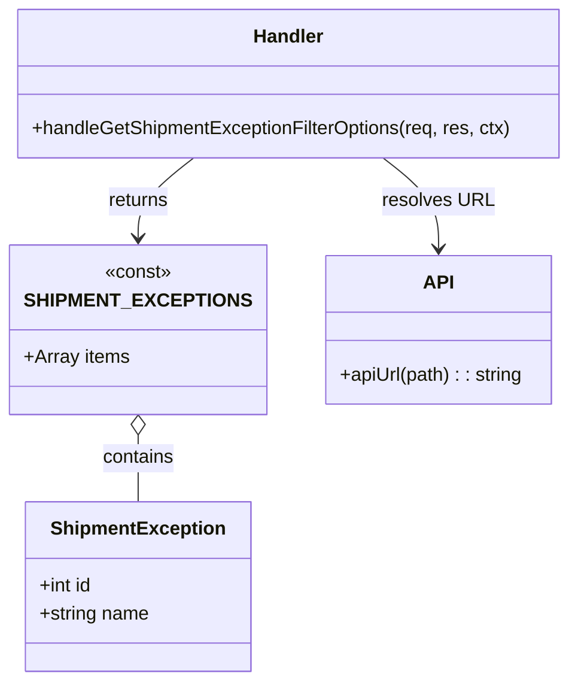

# Diagram: web/portal/src/mocks/handlers/shipping-ng/exception-filters.js


> Auto-generated by Obscura crawlers

## Diagram 1

```mermaid
flowchart TD
  Client[Client] -->|GET /shipping-ng/exception_filters| MSW[MSW rest.get]
  MSW -->|registers| HANDLER[handleGetShipmentExceptionFilterOptions]
  HANDLER -->|uses| API[apiUrl("/shipping-ng/exception_filters")]
  HANDLER -->|responds| RESPONSE[res(ctx.json(SHIPMENT_EXCEPTIONS))]
  RESPONSE --> EXCEPTIONS[SHIPMENT_EXCEPTIONS Array]
  EXCEPTIONS --> EX1["1: Behind Schedule"]
  EXCEPTIONS --> EX2["2: Missed Pickup"]
  EXCEPTIONS --> EX3["3: Missed Drop-Off"]
  EXCEPTIONS --> EX4["4: Bad Order"]
  EXCEPTIONS --> EX5["5: In Hold"]
  EXCEPTIONS --> EX6["6: Idle Train"]
  EXCEPTIONS --> EX8["8: Lost"]
  EXCEPTIONS --> EX9["9: Backorder"]
  EXCEPTIONS --> EX10["10: Carrier Delayed"]
  EXCEPTIONS --> EX14["14: Off Route"]
  EXCEPTIONS --> EX15["15: No Activity"]
```

> SVG rendering failed for this diagram.

## Diagram 2



### SVG

<svg id="container" width="480.03125" xmlns="http://www.w3.org/2000/svg" class="classDiagram" height="578" viewBox="0 0 480.03125 578" role="graphics-document document" aria-roledescription="class"><style>#container{font-family:"trebuchet ms",verdana,arial,sans-serif;font-size:16px;fill:#333;}@keyframes edge-animation-frame{from{stroke-dashoffset:0;}}@keyframes dash{to{stroke-dashoffset:0;}}#container .edge-animation-slow{stroke-dasharray:9,5!important;stroke-dashoffset:900;animation:dash 50s linear infinite;stroke-linecap:round;}#container .edge-animation-fast{stroke-dasharray:9,5!important;stroke-dashoffset:900;animation:dash 20s linear infinite;stroke-linecap:round;}#container .error-icon{fill:#552222;}#container .error-text{fill:#552222;stroke:#552222;}#container .edge-thickness-normal{stroke-width:1px;}#container .edge-thickness-thick{stroke-width:3.5px;}#container .edge-pattern-solid{stroke-dasharray:0;}#container .edge-thickness-invisible{stroke-width:0;fill:none;}#container .edge-pattern-dashed{stroke-dasharray:3;}#container .edge-pattern-dotted{stroke-dasharray:2;}#container .marker{fill:#333333;stroke:#333333;}#container .marker.cross{stroke:#333333;}#container svg{font-family:"trebuchet ms",verdana,arial,sans-serif;font-size:16px;}#container p{margin:0;}#container g.classGroup text{fill:#9370DB;stroke:none;font-family:"trebuchet ms",verdana,arial,sans-serif;font-size:10px;}#container g.classGroup text .title{font-weight:bolder;}#container .nodeLabel,#container .edgeLabel{color:#131300;}#container .edgeLabel .label rect{fill:#ECECFF;}#container .label text{fill:#131300;}#container .labelBkg{background:#ECECFF;}#container .edgeLabel .label span{background:#ECECFF;}#container .classTitle{font-weight:bolder;}#container .node rect,#container .node circle,#container .node ellipse,#container .node polygon,#container .node path{fill:#ECECFF;stroke:#9370DB;stroke-width:1px;}#container .divider{stroke:#9370DB;stroke-width:1;}#container g.clickable{cursor:pointer;}#container g.classGroup rect{fill:#ECECFF;stroke:#9370DB;}#container g.classGroup line{stroke:#9370DB;stroke-width:1;}#container .classLabel .box{stroke:none;stroke-width:0;fill:#ECECFF;opacity:0.5;}#container .classLabel .label{fill:#9370DB;font-size:10px;}#container .relation{stroke:#333333;stroke-width:1;fill:none;}#container .dashed-line{stroke-dasharray:3;}#container .dotted-line{stroke-dasharray:1 2;}#container #compositionStart,#container .composition{fill:#333333!important;stroke:#333333!important;stroke-width:1;}#container #compositionEnd,#container .composition{fill:#333333!important;stroke:#333333!important;stroke-width:1;}#container #dependencyStart,#container .dependency{fill:#333333!important;stroke:#333333!important;stroke-width:1;}#container #dependencyStart,#container .dependency{fill:#333333!important;stroke:#333333!important;stroke-width:1;}#container #extensionStart,#container .extension{fill:transparent!important;stroke:#333333!important;stroke-width:1;}#container #extensionEnd,#container .extension{fill:transparent!important;stroke:#333333!important;stroke-width:1;}#container #aggregationStart,#container .aggregation{fill:transparent!important;stroke:#333333!important;stroke-width:1;}#container #aggregationEnd,#container .aggregation{fill:transparent!important;stroke:#333333!important;stroke-width:1;}#container #lollipopStart,#container .lollipop{fill:#ECECFF!important;stroke:#333333!important;stroke-width:1;}#container #lollipopEnd,#container .lollipop{fill:#ECECFF!important;stroke:#333333!important;stroke-width:1;}#container .edgeTerminals{font-size:11px;line-height:initial;}#container .classTitleText{text-anchor:middle;font-size:18px;fill:#333;}#container .label-icon{display:inline-block;height:1em;overflow:visible;vertical-align:-0.125em;}#container .node .label-icon path{fill:currentColor;stroke:revert;stroke-width:revert;}#container :root{--mermaid-font-family:"trebuchet ms",verdana,arial,sans-serif;}</style><g><defs><marker id="container_class-aggregationStart" class="marker aggregation class" refX="18" refY="7" markerWidth="190" markerHeight="240" orient="auto"><path d="M 18,7 L9,13 L1,7 L9,1 Z"></path></marker></defs><defs><marker id="container_class-aggregationEnd" class="marker aggregation class" refX="1" refY="7" markerWidth="20" markerHeight="28" orient="auto"><path d="M 18,7 L9,13 L1,7 L9,1 Z"></path></marker></defs><defs><marker id="container_class-extensionStart" class="marker extension class" refX="18" refY="7" markerWidth="190" markerHeight="240" orient="auto"><path d="M 1,7 L18,13 V 1 Z"></path></marker></defs><defs><marker id="container_class-extensionEnd" class="marker extension class" refX="1" refY="7" markerWidth="20" markerHeight="28" orient="auto"><path d="M 1,1 V 13 L18,7 Z"></path></marker></defs><defs><marker id="container_class-compositionStart" class="marker composition class" refX="18" refY="7" markerWidth="190" markerHeight="240" orient="auto"><path d="M 18,7 L9,13 L1,7 L9,1 Z"></path></marker></defs><defs><marker id="container_class-compositionEnd" class="marker composition class" refX="1" refY="7" markerWidth="20" markerHeight="28" orient="auto"><path d="M 18,7 L9,13 L1,7 L9,1 Z"></path></marker></defs><defs><marker id="container_class-dependencyStart" class="marker dependency class" refX="6" refY="7" markerWidth="190" markerHeight="240" orient="auto"><path d="M 5,7 L9,13 L1,7 L9,1 Z"></path></marker></defs><defs><marker id="container_class-dependencyEnd" class="marker dependency class" refX="13" refY="7" markerWidth="20" markerHeight="28" orient="auto"><path d="M 18,7 L9,13 L14,7 L9,1 Z"></path></marker></defs><defs><marker id="container_class-lollipopStart" class="marker lollipop class" refX="13" refY="7" markerWidth="190" markerHeight="240" orient="auto"><circle stroke="black" fill="transparent" cx="7" cy="7" r="6"></circle></marker></defs><defs><marker id="container_class-lollipopEnd" class="marker lollipop class" refX="1" refY="7" markerWidth="190" markerHeight="240" orient="auto"><circle stroke="black" fill="transparent" cx="7" cy="7" r="6"></circle></marker></defs><g class="root"><g class="clusters"></g><g class="edgePaths"><path d="M317.442,134L325.02,140.167C332.599,146.333,347.757,158.667,355.335,171.5C362.914,184.333,362.914,197.667,362.914,204.333L362.914,211" id="id_Handler_API_1" class="edge-thickness-normal edge-pattern-solid relation" style=";;;" data-edge="true" data-et="edge" data-id="id_Handler_API_1" data-points="W3sieCI6MzE3LjQ0MTY0MDYyNSwieSI6MTM0fSx7IngiOjM2Mi45MTQwNjI1LCJ5IjoxNzF9LHsieCI6MzYyLjkxNDA2MjUsInkiOjIxN31d" marker-end="url(#container_class-dependencyEnd)"></path><path d="M162.59,134L155.011,140.167C147.432,146.333,132.275,158.667,124.696,170C117.117,181.333,117.117,191.667,117.117,196.833L117.117,202" id="id_Handler_SHIPMENT_EXCEPTIONS_2" class="edge-thickness-normal edge-pattern-solid relation" style=";;;" data-edge="true" data-et="edge" data-id="id_Handler_SHIPMENT_EXCEPTIONS_2" data-points="W3sieCI6MTYyLjU4OTYwOTM3NSwieSI6MTM0fSx7IngiOjExNy4xMTcxODc1LCJ5IjoxNzF9LHsieCI6MTE3LjExNzE4NzUsInkiOjIwOH1d" marker-end="url(#container_class-dependencyEnd)"></path><path d="M117.117,369.25L117.117,372.542C117.117,375.833,117.117,382.417,117.117,391.875C117.117,401.333,117.117,413.667,117.117,419.833L117.117,426" id="id_SHIPMENT_EXCEPTIONS_ShipmentException_3" class="edge-thickness-normal edge-pattern-solid relation" style=";;;" data-edge="true" data-et="edge" data-id="id_SHIPMENT_EXCEPTIONS_ShipmentException_3" data-points="W3sieCI6MTE3LjExNzE4NzUsInkiOjM1Mn0seyJ4IjoxMTcuMTE3MTg3NSwieSI6Mzg5fSx7IngiOjExNy4xMTcxODc1LCJ5Ijo0MjZ9XQ==" marker-start="url(#container_class-aggregationStart)"></path></g><g class="edgeLabels"><g class="edgeLabel" transform="translate(362.9140625, 171)"><g class="label" data-id="id_Handler_API_1" transform="translate(-46.125, -12)"><foreignObject width="92.25" height="24"><div xmlns="http://www.w3.org/1999/xhtml" class="labelBkg" style="display: table-cell; white-space: nowrap; line-height: 1.5; max-width: 200px; text-align: center;"><span class="edgeLabel"><p>resolves URL</p></span></div></foreignObject></g></g><g class="edgeLabel" transform="translate(117.1171875, 171)"><g class="label" data-id="id_Handler_SHIPMENT_EXCEPTIONS_2" transform="translate(-26.265625, -12)"><foreignObject width="52.53125" height="24"><div xmlns="http://www.w3.org/1999/xhtml" class="labelBkg" style="display: table-cell; white-space: nowrap; line-height: 1.5; max-width: 200px; text-align: center;"><span class="edgeLabel"><p>returns</p></span></div></foreignObject></g></g><g class="edgeLabel" transform="translate(117.1171875, 389)"><g class="label" data-id="id_SHIPMENT_EXCEPTIONS_ShipmentException_3" transform="translate(-30.890625, -12)"><foreignObject width="61.78125" height="24"><div xmlns="http://www.w3.org/1999/xhtml" class="labelBkg" style="display: table-cell; white-space: nowrap; line-height: 1.5; max-width: 200px; text-align: center;"><span class="edgeLabel"><p>contains</p></span></div></foreignObject></g></g></g><g class="nodes"><g class="node default" id="classId-ShipmentException-0" transform="translate(117.1171875, 498)"><g class="basic label-container"><path d="M-94.58984375 -72 L94.58984375 -72 L94.58984375 72 L-94.58984375 72" stroke="none" stroke-width="0" fill="#ECECFF" style=""></path><path d="M-94.58984375 -72 C-19.924158812506974 -72, 54.74152612498605 -72, 94.58984375 -72 M-94.58984375 -72 C-54.85732318147136 -72, -15.124802612942716 -72, 94.58984375 -72 M94.58984375 -72 C94.58984375 -21.55056187404488, 94.58984375 28.898876251910238, 94.58984375 72 M94.58984375 -72 C94.58984375 -29.242401291421046, 94.58984375 13.515197417157907, 94.58984375 72 M94.58984375 72 C50.93785576390461 72, 7.285867777809216 72, -94.58984375 72 M94.58984375 72 C47.812421315193916 72, 1.0349988803878318 72, -94.58984375 72 M-94.58984375 72 C-94.58984375 22.595355968424656, -94.58984375 -26.80928806315069, -94.58984375 -72 M-94.58984375 72 C-94.58984375 26.95069942343452, -94.58984375 -18.098601153130957, -94.58984375 -72" stroke="#9370DB" stroke-width="1.3" fill="none" stroke-dasharray="0 0" style=""></path></g><g class="annotation-group text" transform="translate(0, -48)"></g><g class="label-group text" transform="translate(-70.8046875, -48)"><g class="label" style="font-weight: bolder" transform="translate(0,-12)"><foreignObject width="141.609375" height="24"><div xmlns="http://www.w3.org/1999/xhtml" style="display: table-cell; white-space: nowrap; line-height: 1.5; max-width: 190px; text-align: center;"><span class="nodeLabel markdown-node-label" style=""><p>ShipmentException</p></span></div></foreignObject></g></g><g class="members-group text" transform="translate(-82.58984375, 0)"><g class="label" style="" transform="translate(0,-12)"><foreignObject width="45.96875" height="24"><div xmlns="http://www.w3.org/1999/xhtml" style="display: table-cell; white-space: nowrap; line-height: 1.5; max-width: 103px; text-align: center;"><span class="nodeLabel markdown-node-label" style=""><p>+int id</p></span></div></foreignObject></g><g class="label" style="" transform="translate(0,12)"><foreignObject width="94.375" height="24"><div xmlns="http://www.w3.org/1999/xhtml" style="display: table-cell; white-space: nowrap; line-height: 1.5; max-width: 152px; text-align: center;"><span class="nodeLabel markdown-node-label" style=""><p>+string name</p></span></div></foreignObject></g></g><g class="methods-group text" transform="translate(-82.58984375, 72)"></g><g class="divider" style=""><path d="M-94.58984375 -24 C-56.31477040879769 -24, -18.039697067595384 -24, 94.58984375 -24 M-94.58984375 -24 C-50.09780079361671 -24, -5.605757837233426 -24, 94.58984375 -24" stroke="#9370DB" stroke-width="1.3" fill="none" stroke-dasharray="0 0" style=""></path></g><g class="divider" style=""><path d="M-94.58984375 48 C-44.430789514474995 48, 5.72826472105001 48, 94.58984375 48 M-94.58984375 48 C-33.39757007742423 48, 27.794703595151546 48, 94.58984375 48" stroke="#9370DB" stroke-width="1.3" fill="none" stroke-dasharray="0 0" style=""></path></g></g><g class="node default" id="classId-SHIPMENT_EXCEPTIONS-1" transform="translate(117.1171875, 280)"><g class="basic label-container"><path d="M-99.09765625 -72 L99.09765625 -72 L99.09765625 72 L-99.09765625 72" stroke="none" stroke-width="0" fill="#ECECFF" style=""></path><path d="M-99.09765625 -72 C-58.86814877562553 -72, -18.638641301251056 -72, 99.09765625 -72 M-99.09765625 -72 C-45.36199776295897 -72, 8.373660724082058 -72, 99.09765625 -72 M99.09765625 -72 C99.09765625 -41.20266106230643, 99.09765625 -10.405322124612866, 99.09765625 72 M99.09765625 -72 C99.09765625 -31.83648642964394, 99.09765625 8.327027140712119, 99.09765625 72 M99.09765625 72 C38.678493891893744 72, -21.74066846621251 72, -99.09765625 72 M99.09765625 72 C20.5846476046179 72, -57.9283610407642 72, -99.09765625 72 M-99.09765625 72 C-99.09765625 15.215533318740114, -99.09765625 -41.56893336251977, -99.09765625 -72 M-99.09765625 72 C-99.09765625 37.381333392740785, -99.09765625 2.7626667854815707, -99.09765625 -72" stroke="#9370DB" stroke-width="1.3" fill="none" stroke-dasharray="0 0" style=""></path></g><g class="annotation-group text" transform="translate(-28.6171875, -48)"><g class="label" style="" transform="translate(0,-12)"><foreignObject width="57.234375" height="24"><div xmlns="http://www.w3.org/1999/xhtml" style="display: table-cell; white-space: nowrap; line-height: 1.5; max-width: 107px; text-align: center;"><span class="nodeLabel markdown-node-label" style=""><p>«const»</p></span></div></foreignObject></g></g><g class="label-group text" transform="translate(-84.8828125, -24)"><g class="label" style="font-weight: bolder" transform="translate(0,-12)"><foreignObject width="169.765625" height="24"><div xmlns="http://www.w3.org/1999/xhtml" style="display: table-cell; white-space: nowrap; line-height: 1.5; max-width: 218px; text-align: center;"><span class="nodeLabel markdown-node-label" style=""><p>SHIPMENT_EXCEPTIONS</p></span></div></foreignObject></g></g><g class="members-group text" transform="translate(-87.09765625, 24)"><g class="label" style="" transform="translate(0,-12)"><foreignObject width="89.3125" height="24"><div xmlns="http://www.w3.org/1999/xhtml" style="display: table-cell; white-space: nowrap; line-height: 1.5; max-width: 147px; text-align: center;"><span class="nodeLabel markdown-node-label" style=""><p>+Array items</p></span></div></foreignObject></g></g><g class="methods-group text" transform="translate(-87.09765625, 72)"></g><g class="divider" style=""><path d="M-99.09765625 0 C-34.468291776780134 0, 30.16107269643973 0, 99.09765625 0 M-99.09765625 0 C-44.3761813719478 0, 10.345293506104397 0, 99.09765625 0" stroke="#9370DB" stroke-width="1.3" fill="none" stroke-dasharray="0 0" style=""></path></g><g class="divider" style=""><path d="M-99.09765625 48 C-31.66069705762483 48, 35.77626213475034 48, 99.09765625 48 M-99.09765625 48 C-27.29823370011937 48, 44.50118884976126 48, 99.09765625 48" stroke="#9370DB" stroke-width="1.3" fill="none" stroke-dasharray="0 0" style=""></path></g></g><g class="node default" id="classId-Handler-2" transform="translate(240.015625, 71)"><g class="basic label-container"><path d="M-232.015625 -63 L232.015625 -63 L232.015625 63 L-232.015625 63" stroke="none" stroke-width="0" fill="#ECECFF" style=""></path><path d="M-232.015625 -63 C-46.624846320250015 -63, 138.76593235949997 -63, 232.015625 -63 M-232.015625 -63 C-94.88765600916366 -63, 42.24031298167267 -63, 232.015625 -63 M232.015625 -63 C232.015625 -20.792355708110428, 232.015625 21.415288583779144, 232.015625 63 M232.015625 -63 C232.015625 -19.4365301095457, 232.015625 24.1269397809086, 232.015625 63 M232.015625 63 C65.41725525512695 63, -101.18111448974611 63, -232.015625 63 M232.015625 63 C131.5313146722669 63, 31.047004344533775 63, -232.015625 63 M-232.015625 63 C-232.015625 21.367546032006032, -232.015625 -20.264907935987935, -232.015625 -63 M-232.015625 63 C-232.015625 34.888142479361164, -232.015625 6.776284958722329, -232.015625 -63" stroke="#9370DB" stroke-width="1.3" fill="none" stroke-dasharray="0 0" style=""></path></g><g class="annotation-group text" transform="translate(0, -39)"></g><g class="label-group text" transform="translate(-29.09375, -39)"><g class="label" style="font-weight: bolder" transform="translate(0,-12)"><foreignObject width="58.1875" height="24"><div xmlns="http://www.w3.org/1999/xhtml" style="display: table-cell; white-space: nowrap; line-height: 1.5; max-width: 109px; text-align: center;"><span class="nodeLabel markdown-node-label" style=""><p>Handler</p></span></div></foreignObject></g></g><g class="members-group text" transform="translate(-220.015625, 9)"></g><g class="methods-group text" transform="translate(-220.015625, 39)"><g class="label" style="" transform="translate(0,-12)"><foreignObject width="410.9375" height="24"><div xmlns="http://www.w3.org/1999/xhtml" style="display: table-cell; white-space: nowrap; line-height: 1.5; max-width: 468px; text-align: center;"><span class="nodeLabel markdown-node-label" style=""><p>+handleGetShipmentExceptionFilterOptions(req, res, ctx)</p></span></div></foreignObject></g></g><g class="divider" style=""><path d="M-232.015625 -15 C-120.37110808086487 -15, -8.726591161729743 -15, 232.015625 -15 M-232.015625 -15 C-73.94196910214674 -15, 84.13168679570651 -15, 232.015625 -15" stroke="#9370DB" stroke-width="1.3" fill="none" stroke-dasharray="0 0" style=""></path></g><g class="divider" style=""><path d="M-232.015625 9 C-112.67452297727502 9, 6.666579045449964 9, 232.015625 9 M-232.015625 9 C-130.17117764211 9, -28.32673028421999 9, 232.015625 9" stroke="#9370DB" stroke-width="1.3" fill="none" stroke-dasharray="0 0" style=""></path></g></g><g class="node default" id="classId-API-3" transform="translate(362.9140625, 280)"><g class="basic label-container"><path d="M-96.69921875 -63 L96.69921875 -63 L96.69921875 63 L-96.69921875 63" stroke="none" stroke-width="0" fill="#ECECFF" style=""></path><path d="M-96.69921875 -63 C-28.636129209041385 -63, 39.42696033191723 -63, 96.69921875 -63 M-96.69921875 -63 C-54.96080623873734 -63, -13.222393727474682 -63, 96.69921875 -63 M96.69921875 -63 C96.69921875 -23.36383721212421, 96.69921875 16.27232557575158, 96.69921875 63 M96.69921875 -63 C96.69921875 -34.36312487756007, 96.69921875 -5.726249755120136, 96.69921875 63 M96.69921875 63 C27.534309644418997 63, -41.63059946116201 63, -96.69921875 63 M96.69921875 63 C56.92511430103913 63, 17.15100985207826 63, -96.69921875 63 M-96.69921875 63 C-96.69921875 33.47593501105936, -96.69921875 3.951870022118733, -96.69921875 -63 M-96.69921875 63 C-96.69921875 21.699208983952722, -96.69921875 -19.601582032094555, -96.69921875 -63" stroke="#9370DB" stroke-width="1.3" fill="none" stroke-dasharray="0 0" style=""></path></g><g class="annotation-group text" transform="translate(0, -39)"></g><g class="label-group text" transform="translate(-11.8671875, -39)"><g class="label" style="font-weight: bolder" transform="translate(0,-12)"><foreignObject width="23.734375" height="24"><div xmlns="http://www.w3.org/1999/xhtml" style="display: table-cell; white-space: nowrap; line-height: 1.5; max-width: 73px; text-align: center;"><span class="nodeLabel markdown-node-label" style=""><p>API</p></span></div></foreignObject></g></g><g class="members-group text" transform="translate(-84.69921875, 9)"></g><g class="methods-group text" transform="translate(-84.69921875, 39)"><g class="label" style="" transform="translate(0,-12)"><foreignObject width="157.53125" height="24"><div xmlns="http://www.w3.org/1999/xhtml" style="display: table-cell; white-space: nowrap; line-height: 1.5; max-width: 216px; text-align: center;"><span class="nodeLabel markdown-node-label" style=""><p>+apiUrl(path) : : string</p></span></div></foreignObject></g></g><g class="divider" style=""><path d="M-96.69921875 -15 C-23.16520569141143 -15, 50.36880736717714 -15, 96.69921875 -15 M-96.69921875 -15 C-42.75770909396192 -15, 11.183800562076158 -15, 96.69921875 -15" stroke="#9370DB" stroke-width="1.3" fill="none" stroke-dasharray="0 0" style=""></path></g><g class="divider" style=""><path d="M-96.69921875 9 C-54.10815902369868 9, -11.517099297397365 9, 96.69921875 9 M-96.69921875 9 C-25.064243193738918 9, 46.570732362522165 9, 96.69921875 9" stroke="#9370DB" stroke-width="1.3" fill="none" stroke-dasharray="0 0" style=""></path></g></g></g></g></g></svg>
