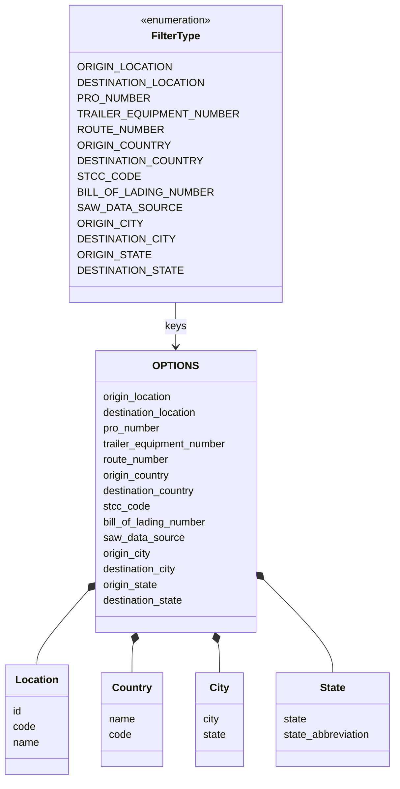

# Diagram: web/portal/src/mocks/handlers/shipping-ng/filters/filter.js


> Auto-generated by Obscura crawlers

## Diagram 1

```mermaid
flowchart TD
    Start([handleShipmentFilter invoked])
    Parse[[Parse request URL and searchParams and iterate FilterType values to set filterName and list]]
    HasFilter{filterName set?}
    ReturnEmpty([Return {}])
    ReadQuery([Read query param])
    QueryPresent{query present?}
    FilterList[[Filter list by rules based on filterName:
    - origin/destination location -> match "name code"
    - origin/destination country -> match name
    - string lists -> includes(query)]]
    BuildResponse[[Build responseBody = { [filterName]: list }]]
    Paginated{paginated? (pageNumber and pageSize present)}
    AddMeta[[responseBody.meta = createPaginatedResponseBody(req, list).meta]]
    ReturnResp([Return ctx.json(responseBody)])

    Start --> Parse
    Parse --> HasFilter
    HasFilter -- No --> ReturnEmpty
    HasFilter -- Yes --> ReadQuery
    ReadQuery --> QueryPresent
    QueryPresent -- Yes --> FilterList --> BuildResponse
    QueryPresent -- No --> BuildResponse
    BuildResponse --> Paginated
    Paginated -- Yes --> AddMeta --> ReturnResp
    Paginated -- No --> ReturnResp
```

> SVG rendering failed for this diagram.

## Diagram 2



### SVG

<svg id="container" width="608.546875" xmlns="http://www.w3.org/2000/svg" class="classDiagram" height="1196" viewBox="0 0 608.546875 1196" role="graphics-document document" aria-roledescription="class"><style>#container{font-family:"trebuchet ms",verdana,arial,sans-serif;font-size:16px;fill:#333;}@keyframes edge-animation-frame{from{stroke-dashoffset:0;}}@keyframes dash{to{stroke-dashoffset:0;}}#container .edge-animation-slow{stroke-dasharray:9,5!important;stroke-dashoffset:900;animation:dash 50s linear infinite;stroke-linecap:round;}#container .edge-animation-fast{stroke-dasharray:9,5!important;stroke-dashoffset:900;animation:dash 20s linear infinite;stroke-linecap:round;}#container .error-icon{fill:#552222;}#container .error-text{fill:#552222;stroke:#552222;}#container .edge-thickness-normal{stroke-width:1px;}#container .edge-thickness-thick{stroke-width:3.5px;}#container .edge-pattern-solid{stroke-dasharray:0;}#container .edge-thickness-invisible{stroke-width:0;fill:none;}#container .edge-pattern-dashed{stroke-dasharray:3;}#container .edge-pattern-dotted{stroke-dasharray:2;}#container .marker{fill:#333333;stroke:#333333;}#container .marker.cross{stroke:#333333;}#container svg{font-family:"trebuchet ms",verdana,arial,sans-serif;font-size:16px;}#container p{margin:0;}#container g.classGroup text{fill:#9370DB;stroke:none;font-family:"trebuchet ms",verdana,arial,sans-serif;font-size:10px;}#container g.classGroup text .title{font-weight:bolder;}#container .nodeLabel,#container .edgeLabel{color:#131300;}#container .edgeLabel .label rect{fill:#ECECFF;}#container .label text{fill:#131300;}#container .labelBkg{background:#ECECFF;}#container .edgeLabel .label span{background:#ECECFF;}#container .classTitle{font-weight:bolder;}#container .node rect,#container .node circle,#container .node ellipse,#container .node polygon,#container .node path{fill:#ECECFF;stroke:#9370DB;stroke-width:1px;}#container .divider{stroke:#9370DB;stroke-width:1;}#container g.clickable{cursor:pointer;}#container g.classGroup rect{fill:#ECECFF;stroke:#9370DB;}#container g.classGroup line{stroke:#9370DB;stroke-width:1;}#container .classLabel .box{stroke:none;stroke-width:0;fill:#ECECFF;opacity:0.5;}#container .classLabel .label{fill:#9370DB;font-size:10px;}#container .relation{stroke:#333333;stroke-width:1;fill:none;}#container .dashed-line{stroke-dasharray:3;}#container .dotted-line{stroke-dasharray:1 2;}#container #compositionStart,#container .composition{fill:#333333!important;stroke:#333333!important;stroke-width:1;}#container #compositionEnd,#container .composition{fill:#333333!important;stroke:#333333!important;stroke-width:1;}#container #dependencyStart,#container .dependency{fill:#333333!important;stroke:#333333!important;stroke-width:1;}#container #dependencyStart,#container .dependency{fill:#333333!important;stroke:#333333!important;stroke-width:1;}#container #extensionStart,#container .extension{fill:transparent!important;stroke:#333333!important;stroke-width:1;}#container #extensionEnd,#container .extension{fill:transparent!important;stroke:#333333!important;stroke-width:1;}#container #aggregationStart,#container .aggregation{fill:transparent!important;stroke:#333333!important;stroke-width:1;}#container #aggregationEnd,#container .aggregation{fill:transparent!important;stroke:#333333!important;stroke-width:1;}#container #lollipopStart,#container .lollipop{fill:#ECECFF!important;stroke:#333333!important;stroke-width:1;}#container #lollipopEnd,#container .lollipop{fill:#ECECFF!important;stroke:#333333!important;stroke-width:1;}#container .edgeTerminals{font-size:11px;line-height:initial;}#container .classTitleText{text-anchor:middle;font-size:18px;fill:#333;}#container .label-icon{display:inline-block;height:1em;overflow:visible;vertical-align:-0.125em;}#container .node .label-icon path{fill:currentColor;stroke:revert;stroke-width:revert;}#container :root{--mermaid-font-family:"trebuchet ms",verdana,arial,sans-serif;}</style><g><defs><marker id="container_class-aggregationStart" class="marker aggregation class" refX="18" refY="7" markerWidth="190" markerHeight="240" orient="auto"><path d="M 18,7 L9,13 L1,7 L9,1 Z"></path></marker></defs><defs><marker id="container_class-aggregationEnd" class="marker aggregation class" refX="1" refY="7" markerWidth="20" markerHeight="28" orient="auto"><path d="M 18,7 L9,13 L1,7 L9,1 Z"></path></marker></defs><defs><marker id="container_class-extensionStart" class="marker extension class" refX="18" refY="7" markerWidth="190" markerHeight="240" orient="auto"><path d="M 1,7 L18,13 V 1 Z"></path></marker></defs><defs><marker id="container_class-extensionEnd" class="marker extension class" refX="1" refY="7" markerWidth="20" markerHeight="28" orient="auto"><path d="M 1,1 V 13 L18,7 Z"></path></marker></defs><defs><marker id="container_class-compositionStart" class="marker composition class" refX="18" refY="7" markerWidth="190" markerHeight="240" orient="auto"><path d="M 18,7 L9,13 L1,7 L9,1 Z"></path></marker></defs><defs><marker id="container_class-compositionEnd" class="marker composition class" refX="1" refY="7" markerWidth="20" markerHeight="28" orient="auto"><path d="M 18,7 L9,13 L1,7 L9,1 Z"></path></marker></defs><defs><marker id="container_class-dependencyStart" class="marker dependency class" refX="6" refY="7" markerWidth="190" markerHeight="240" orient="auto"><path d="M 5,7 L9,13 L1,7 L9,1 Z"></path></marker></defs><defs><marker id="container_class-dependencyEnd" class="marker dependency class" refX="13" refY="7" markerWidth="20" markerHeight="28" orient="auto"><path d="M 18,7 L9,13 L14,7 L9,1 Z"></path></marker></defs><defs><marker id="container_class-lollipopStart" class="marker lollipop class" refX="13" refY="7" markerWidth="190" markerHeight="240" orient="auto"><circle stroke="black" fill="transparent" cx="7" cy="7" r="6"></circle></marker></defs><defs><marker id="container_class-lollipopEnd" class="marker lollipop class" refX="1" refY="7" markerWidth="190" markerHeight="240" orient="auto"><circle stroke="black" fill="transparent" cx="7" cy="7" r="6"></circle></marker></defs><g class="root"><g class="clusters"></g><g class="edgePaths"><path d="M267.357,464L267.357,470.167C267.357,476.333,267.357,488.667,267.357,500C267.357,511.333,267.357,521.667,267.357,526.833L267.357,532" id="id_FilterType_OPTIONS_1" class="edge-thickness-normal edge-pattern-solid relation" style=";;;" data-edge="true" data-et="edge" data-id="id_FilterType_OPTIONS_1" data-points="W3sieCI6MjY3LjM1NzQyMTg3NSwieSI6NDY0fSx7IngiOjI2Ny4zNTc0MjE4NzUsInkiOjUwMX0seyJ4IjoyNjcuMzU3NDIxODc1LCJ5Ijo1Mzh9XQ==" marker-end="url(#container_class-dependencyEnd)"></path><path d="M130.302,910.228L117.907,924.357C105.512,938.486,80.723,966.743,68.328,985.038C55.934,1003.333,55.934,1011.667,55.934,1015.833L55.934,1020" id="id_OPTIONS_Location_2" class="edge-thickness-normal edge-pattern-solid relation" style=";;;" data-edge="true" data-et="edge" data-id="id_OPTIONS_Location_2" data-points="W3sieCI6MTQxLjY3NzczNDM3NSwieSI6ODk3LjI2MTA3NDAwNTMwMjZ9LHsieCI6NTUuOTMzNTkzNzUsInkiOjk5NX0seyJ4Ijo1NS45MzM1OTM3NSwieSI6MTAyMH1d" marker-start="url(#container_class-compositionStart)"></path><path d="M202.824,986.622L202.437,988.019C202.049,989.415,201.275,992.207,200.887,999.77C200.5,1007.333,200.5,1019.667,200.5,1025.833L200.5,1032" id="id_OPTIONS_Country_3" class="edge-thickness-normal edge-pattern-solid relation" style=";;;" data-edge="true" data-et="edge" data-id="id_OPTIONS_Country_3" data-points="W3sieCI6MjA3LjQzNTQxNzIwNjk1MDIsInkiOjk3MH0seyJ4IjoyMDAuNSwieSI6OTk1fSx7IngiOjIwMC41LCJ5IjoxMDMyfV0=" marker-start="url(#container_class-compositionStart)"></path><path d="M331.891,986.622L332.278,988.019C332.665,989.415,333.44,992.207,333.827,999.77C334.215,1007.333,334.215,1019.667,334.215,1025.833L334.215,1032" id="id_OPTIONS_City_4" class="edge-thickness-normal edge-pattern-solid relation" style=";;;" data-edge="true" data-et="edge" data-id="id_OPTIONS_City_4" data-points="W3sieCI6MzI3LjI3OTQyNjU0MzA0OTgsInkiOjk3MH0seyJ4IjozMzQuMjE0ODQzNzUsInkiOjk5NX0seyJ4IjozMzQuMjE0ODQzNzUsInkiOjEwMzJ9XQ==" marker-start="url(#container_class-compositionStart)"></path><path d="M405.299,890.489L422.903,907.908C440.507,925.326,475.714,960.163,493.318,983.748C510.922,1007.333,510.922,1019.667,510.922,1025.833L510.922,1032" id="id_OPTIONS_State_5" class="edge-thickness-normal edge-pattern-solid relation" style=";;;" data-edge="true" data-et="edge" data-id="id_OPTIONS_State_5" data-points="W3sieCI6MzkzLjAzNzEwOTM3NSwieSI6ODc4LjM1NjQyNTE2MzM4NTZ9LHsieCI6NTEwLjkyMTg3NSwieSI6OTk1fSx7IngiOjUxMC45MjE4NzUsInkiOjEwMzJ9XQ==" marker-start="url(#container_class-compositionStart)"></path></g><g class="edgeLabels"><g class="edgeLabel" transform="translate(267.357421875, 501)"><g class="label" data-id="id_FilterType_OPTIONS_1" transform="translate(-15.96875, -12)"><foreignObject width="31.9375" height="24"><div xmlns="http://www.w3.org/1999/xhtml" class="labelBkg" style="display: table-cell; white-space: nowrap; line-height: 1.5; max-width: 200px; text-align: center;"><span class="edgeLabel"><p>keys</p></span></div></foreignObject></g></g><g class="edgeLabel"><g class="label" data-id="id_OPTIONS_Location_2" transform="translate(0, 0)"><foreignObject width="0" height="0"><div xmlns="http://www.w3.org/1999/xhtml" class="labelBkg" style="display: table-cell; white-space: nowrap; line-height: 1.5; max-width: 200px; text-align: center;"><span class="edgeLabel"></span></div></foreignObject></g></g><g class="edgeLabel"><g class="label" data-id="id_OPTIONS_Country_3" transform="translate(0, 0)"><foreignObject width="0" height="0"><div xmlns="http://www.w3.org/1999/xhtml" class="labelBkg" style="display: table-cell; white-space: nowrap; line-height: 1.5; max-width: 200px; text-align: center;"><span class="edgeLabel"></span></div></foreignObject></g></g><g class="edgeLabel"><g class="label" data-id="id_OPTIONS_City_4" transform="translate(0, 0)"><foreignObject width="0" height="0"><div xmlns="http://www.w3.org/1999/xhtml" class="labelBkg" style="display: table-cell; white-space: nowrap; line-height: 1.5; max-width: 200px; text-align: center;"><span class="edgeLabel"></span></div></foreignObject></g></g><g class="edgeLabel"><g class="label" data-id="id_OPTIONS_State_5" transform="translate(0, 0)"><foreignObject width="0" height="0"><div xmlns="http://www.w3.org/1999/xhtml" class="labelBkg" style="display: table-cell; white-space: nowrap; line-height: 1.5; max-width: 200px; text-align: center;"><span class="edgeLabel"></span></div></foreignObject></g></g></g><g class="nodes"><g class="node default" id="classId-FilterType-0" transform="translate(267.357421875, 236)"><g class="basic label-container"><path d="M-149.57421875 -228 L149.57421875 -228 L149.57421875 228 L-149.57421875 228" stroke="none" stroke-width="0" fill="#ECECFF" style=""></path><path d="M-149.57421875 -228 C-63.22775102091539 -228, 23.118716708169217 -228, 149.57421875 -228 M-149.57421875 -228 C-81.06498221899992 -228, -12.555745687999831 -228, 149.57421875 -228 M149.57421875 -228 C149.57421875 -84.99203496688611, 149.57421875 58.01593006622778, 149.57421875 228 M149.57421875 -228 C149.57421875 -134.33125490439812, 149.57421875 -40.662509808796216, 149.57421875 228 M149.57421875 228 C37.9457054386051 228, -73.6828078727898 228, -149.57421875 228 M149.57421875 228 C76.08872673310849 228, 2.603234716216974 228, -149.57421875 228 M-149.57421875 228 C-149.57421875 65.8669863668982, -149.57421875 -96.2660272662036, -149.57421875 -228 M-149.57421875 228 C-149.57421875 109.4512101817931, -149.57421875 -9.097579636413798, -149.57421875 -228" stroke="#9370DB" stroke-width="1.3" fill="none" stroke-dasharray="0 0" style=""></path></g><g class="annotation-group text" transform="translate(-55.5546875, -204)"><g class="label" style="" transform="translate(0,-12)"><foreignObject width="111.109375" height="24"><div xmlns="http://www.w3.org/1999/xhtml" style="display: table-cell; white-space: nowrap; line-height: 1.5; max-width: 161px; text-align: center;"><span class="nodeLabel markdown-node-label" style=""><p>«enumeration»</p></span></div></foreignObject></g></g><g class="label-group text" transform="translate(-36.203125, -180)"><g class="label" style="font-weight: bolder" transform="translate(0,-12)"><foreignObject width="72.40625" height="24"><div xmlns="http://www.w3.org/1999/xhtml" style="display: table-cell; white-space: nowrap; line-height: 1.5; max-width: 121px; text-align: center;"><span class="nodeLabel markdown-node-label" style=""><p>FilterType</p></span></div></foreignObject></g></g><g class="members-group text" transform="translate(-137.57421875, -132)"><g class="label" style="" transform="translate(0,-12)"><foreignObject width="130.1875" height="24"><div xmlns="http://www.w3.org/1999/xhtml" style="display: table-cell; white-space: nowrap; line-height: 1.5; max-width: 180px; text-align: center;"><span class="nodeLabel markdown-node-label" style=""><p>ORIGIN_LOCATION</p></span></div></foreignObject></g><g class="label" style="" transform="translate(0,12)"><foreignObject width="173.3125" height="24"><div xmlns="http://www.w3.org/1999/xhtml" style="display: table-cell; white-space: nowrap; line-height: 1.5; max-width: 223px; text-align: center;"><span class="nodeLabel markdown-node-label" style=""><p>DESTINATION_LOCATION</p></span></div></foreignObject></g><g class="label" style="" transform="translate(0,36)"><foreignObject width="99.53125" height="24"><div xmlns="http://www.w3.org/1999/xhtml" style="display: table-cell; white-space: nowrap; line-height: 1.5; max-width: 150px; text-align: center;"><span class="nodeLabel markdown-node-label" style=""><p>PRO_NUMBER</p></span></div></foreignObject></g><g class="label" style="" transform="translate(0,60)"><foreignObject width="219.59375" height="24"><div xmlns="http://www.w3.org/1999/xhtml" style="display: table-cell; white-space: nowrap; line-height: 1.5; max-width: 270px; text-align: center;"><span class="nodeLabel markdown-node-label" style=""><p>TRAILER_EQUIPMENT_NUMBER</p></span></div></foreignObject></g><g class="label" style="" transform="translate(0,84)"><foreignObject width="118.296875" height="24"><div xmlns="http://www.w3.org/1999/xhtml" style="display: table-cell; white-space: nowrap; line-height: 1.5; max-width: 169px; text-align: center;"><span class="nodeLabel markdown-node-label" style=""><p>ROUTE_NUMBER</p></span></div></foreignObject></g><g class="label" style="" transform="translate(0,108)"><foreignObject width="126.46875" height="24"><div xmlns="http://www.w3.org/1999/xhtml" style="display: table-cell; white-space: nowrap; line-height: 1.5; max-width: 177px; text-align: center;"><span class="nodeLabel markdown-node-label" style=""><p>ORIGIN_COUNTRY</p></span></div></foreignObject></g><g class="label" style="" transform="translate(0,132)"><foreignObject width="169.609375" height="24"><div xmlns="http://www.w3.org/1999/xhtml" style="display: table-cell; white-space: nowrap; line-height: 1.5; max-width: 220px; text-align: center;"><span class="nodeLabel markdown-node-label" style=""><p>DESTINATION_COUNTRY</p></span></div></foreignObject></g><g class="label" style="" transform="translate(0,156)"><foreignObject width="79.9375" height="24"><div xmlns="http://www.w3.org/1999/xhtml" style="display: table-cell; white-space: nowrap; line-height: 1.5; max-width: 130px; text-align: center;"><span class="nodeLabel markdown-node-label" style=""><p>STCC_CODE</p></span></div></foreignObject></g><g class="label" style="" transform="translate(0,180)"><foreignObject width="187.15625" height="24"><div xmlns="http://www.w3.org/1999/xhtml" style="display: table-cell; white-space: nowrap; line-height: 1.5; max-width: 237px; text-align: center;"><span class="nodeLabel markdown-node-label" style=""><p>BILL_OF_LADING_NUMBER</p></span></div></foreignObject></g><g class="label" style="" transform="translate(0,204)"><foreignObject width="138.984375" height="24"><div xmlns="http://www.w3.org/1999/xhtml" style="display: table-cell; white-space: nowrap; line-height: 1.5; max-width: 189px; text-align: center;"><span class="nodeLabel markdown-node-label" style=""><p>SAW_DATA_SOURCE</p></span></div></foreignObject></g><g class="label" style="" transform="translate(0,228)"><foreignObject width="89.65625" height="24"><div xmlns="http://www.w3.org/1999/xhtml" style="display: table-cell; white-space: nowrap; line-height: 1.5; max-width: 140px; text-align: center;"><span class="nodeLabel markdown-node-label" style=""><p>ORIGIN_CITY</p></span></div></foreignObject></g><g class="label" style="" transform="translate(0,252)"><foreignObject width="132.796875" height="24"><div xmlns="http://www.w3.org/1999/xhtml" style="display: table-cell; white-space: nowrap; line-height: 1.5; max-width: 183px; text-align: center;"><span class="nodeLabel markdown-node-label" style=""><p>DESTINATION_CITY</p></span></div></foreignObject></g><g class="label" style="" transform="translate(0,276)"><foreignObject width="100.265625" height="24"><div xmlns="http://www.w3.org/1999/xhtml" style="display: table-cell; white-space: nowrap; line-height: 1.5; max-width: 150px; text-align: center;"><span class="nodeLabel markdown-node-label" style=""><p>ORIGIN_STATE</p></span></div></foreignObject></g><g class="label" style="" transform="translate(0,300)"><foreignObject width="143.40625" height="24"><div xmlns="http://www.w3.org/1999/xhtml" style="display: table-cell; white-space: nowrap; line-height: 1.5; max-width: 193px; text-align: center;"><span class="nodeLabel markdown-node-label" style=""><p>DESTINATION_STATE</p></span></div></foreignObject></g></g><g class="methods-group text" transform="translate(-137.57421875, 228)"></g><g class="divider" style=""><path d="M-149.57421875 -156 C-73.26877145477951 -156, 3.036675840440978 -156, 149.57421875 -156 M-149.57421875 -156 C-32.110546296684234 -156, 85.35312615663153 -156, 149.57421875 -156" stroke="#9370DB" stroke-width="1.3" fill="none" stroke-dasharray="0 0" style=""></path></g><g class="divider" style=""><path d="M-149.57421875 204 C-78.03061389400054 204, -6.4870090380010765 204, 149.57421875 204 M-149.57421875 204 C-61.40864974389058 204, 26.756919262218844 204, 149.57421875 204" stroke="#9370DB" stroke-width="1.3" fill="none" stroke-dasharray="0 0" style=""></path></g></g><g class="node default" id="classId-Location-1" transform="translate(55.93359375, 1104)"><g class="basic label-container"><path d="M-47.93359375 -84 L47.93359375 -84 L47.93359375 84 L-47.93359375 84" stroke="none" stroke-width="0" fill="#ECECFF" style=""></path><path d="M-47.93359375 -84 C-23.226060065130934 -84, 1.4814736197381322 -84, 47.93359375 -84 M-47.93359375 -84 C-11.447443582340227 -84, 25.038706585319545 -84, 47.93359375 -84 M47.93359375 -84 C47.93359375 -24.463059077556238, 47.93359375 35.073881844887524, 47.93359375 84 M47.93359375 -84 C47.93359375 -43.43215323730856, 47.93359375 -2.8643064746171234, 47.93359375 84 M47.93359375 84 C24.800322163819033 84, 1.667050577638065 84, -47.93359375 84 M47.93359375 84 C16.239912234110843 84, -15.453769281778314 84, -47.93359375 84 M-47.93359375 84 C-47.93359375 28.514884869741763, -47.93359375 -26.970230260516473, -47.93359375 -84 M-47.93359375 84 C-47.93359375 45.58137008835359, -47.93359375 7.1627401767071746, -47.93359375 -84" stroke="#9370DB" stroke-width="1.3" fill="none" stroke-dasharray="0 0" style=""></path></g><g class="annotation-group text" transform="translate(0, -60)"></g><g class="label-group text" transform="translate(-31.3515625, -60)"><g class="label" style="font-weight: bolder" transform="translate(0,-12)"><foreignObject width="62.703125" height="24"><div xmlns="http://www.w3.org/1999/xhtml" style="display: table-cell; white-space: nowrap; line-height: 1.5; max-width: 112px; text-align: center;"><span class="nodeLabel markdown-node-label" style=""><p>Location</p></span></div></foreignObject></g></g><g class="members-group text" transform="translate(-35.93359375, -12)"><g class="label" style="" transform="translate(0,-12)"><foreignObject width="14.09375" height="24"><div xmlns="http://www.w3.org/1999/xhtml" style="display: table-cell; white-space: nowrap; line-height: 1.5; max-width: 64px; text-align: center;"><span class="nodeLabel markdown-node-label" style=""><p>id</p></span></div></foreignObject></g><g class="label" style="" transform="translate(0,12)"><foreignObject width="34.96875" height="24"><div xmlns="http://www.w3.org/1999/xhtml" style="display: table-cell; white-space: nowrap; line-height: 1.5; max-width: 85px; text-align: center;"><span class="nodeLabel markdown-node-label" style=""><p>code</p></span></div></foreignObject></g><g class="label" style="" transform="translate(0,36)"><foreignObject width="40.515625" height="24"><div xmlns="http://www.w3.org/1999/xhtml" style="display: table-cell; white-space: nowrap; line-height: 1.5; max-width: 91px; text-align: center;"><span class="nodeLabel markdown-node-label" style=""><p>name</p></span></div></foreignObject></g></g><g class="methods-group text" transform="translate(-35.93359375, 84)"></g><g class="divider" style=""><path d="M-47.93359375 -36 C-22.351918828054163 -36, 3.229756093891673 -36, 47.93359375 -36 M-47.93359375 -36 C-22.793860679827386 -36, 2.345872390345228 -36, 47.93359375 -36" stroke="#9370DB" stroke-width="1.3" fill="none" stroke-dasharray="0 0" style=""></path></g><g class="divider" style=""><path d="M-47.93359375 60 C-25.49599398140883 60, -3.05839421281766 60, 47.93359375 60 M-47.93359375 60 C-15.044408491211911 60, 17.844776767576178 60, 47.93359375 60" stroke="#9370DB" stroke-width="1.3" fill="none" stroke-dasharray="0 0" style=""></path></g></g><g class="node default" id="classId-Country-2" transform="translate(200.5, 1104)"><g class="basic label-container"><path d="M-46.6328125 -72 L46.6328125 -72 L46.6328125 72 L-46.6328125 72" stroke="none" stroke-width="0" fill="#ECECFF" style=""></path><path d="M-46.6328125 -72 C-10.037077604741086 -72, 26.55865729051783 -72, 46.6328125 -72 M-46.6328125 -72 C-18.727948810945403 -72, 9.176914878109194 -72, 46.6328125 -72 M46.6328125 -72 C46.6328125 -15.132987087754309, 46.6328125 41.73402582449138, 46.6328125 72 M46.6328125 -72 C46.6328125 -36.54113815386745, 46.6328125 -1.082276307734901, 46.6328125 72 M46.6328125 72 C23.30932541739305 72, -0.014161665213897834 72, -46.6328125 72 M46.6328125 72 C17.809607222667104 72, -11.013598054665792 72, -46.6328125 72 M-46.6328125 72 C-46.6328125 16.644145937543975, -46.6328125 -38.71170812491205, -46.6328125 -72 M-46.6328125 72 C-46.6328125 23.832056782016878, -46.6328125 -24.335886435966245, -46.6328125 -72" stroke="#9370DB" stroke-width="1.3" fill="none" stroke-dasharray="0 0" style=""></path></g><g class="annotation-group text" transform="translate(0, -48)"></g><g class="label-group text" transform="translate(-28.75, -48)"><g class="label" style="font-weight: bolder" transform="translate(0,-12)"><foreignObject width="57.5" height="24"><div xmlns="http://www.w3.org/1999/xhtml" style="display: table-cell; white-space: nowrap; line-height: 1.5; max-width: 107px; text-align: center;"><span class="nodeLabel markdown-node-label" style=""><p>Country</p></span></div></foreignObject></g></g><g class="members-group text" transform="translate(-34.6328125, 0)"><g class="label" style="" transform="translate(0,-12)"><foreignObject width="40.515625" height="24"><div xmlns="http://www.w3.org/1999/xhtml" style="display: table-cell; white-space: nowrap; line-height: 1.5; max-width: 91px; text-align: center;"><span class="nodeLabel markdown-node-label" style=""><p>name</p></span></div></foreignObject></g><g class="label" style="" transform="translate(0,12)"><foreignObject width="34.96875" height="24"><div xmlns="http://www.w3.org/1999/xhtml" style="display: table-cell; white-space: nowrap; line-height: 1.5; max-width: 85px; text-align: center;"><span class="nodeLabel markdown-node-label" style=""><p>code</p></span></div></foreignObject></g></g><g class="methods-group text" transform="translate(-34.6328125, 72)"></g><g class="divider" style=""><path d="M-46.6328125 -24 C-15.497007157947976 -24, 15.638798184104047 -24, 46.6328125 -24 M-46.6328125 -24 C-23.856799811323363 -24, -1.0807871226467256 -24, 46.6328125 -24" stroke="#9370DB" stroke-width="1.3" fill="none" stroke-dasharray="0 0" style=""></path></g><g class="divider" style=""><path d="M-46.6328125 48 C-10.359976619536553 48, 25.912859260926894 48, 46.6328125 48 M-46.6328125 48 C-23.342687558017214 48, -0.0525626160344288 48, 46.6328125 48" stroke="#9370DB" stroke-width="1.3" fill="none" stroke-dasharray="0 0" style=""></path></g></g><g class="node default" id="classId-City-3" transform="translate(334.21484375, 1104)"><g class="basic label-container"><path d="M-37.08203125 -72 L37.08203125 -72 L37.08203125 72 L-37.08203125 72" stroke="none" stroke-width="0" fill="#ECECFF" style=""></path><path d="M-37.08203125 -72 C-11.339602361776873 -72, 14.402826526446255 -72, 37.08203125 -72 M-37.08203125 -72 C-15.76054762159761 -72, 5.560936006804781 -72, 37.08203125 -72 M37.08203125 -72 C37.08203125 -39.96823689698617, 37.08203125 -7.93647379397234, 37.08203125 72 M37.08203125 -72 C37.08203125 -35.820677942657525, 37.08203125 0.3586441146849495, 37.08203125 72 M37.08203125 72 C13.303060599474563 72, -10.475910051050874 72, -37.08203125 72 M37.08203125 72 C22.077719926484868 72, 7.073408602969739 72, -37.08203125 72 M-37.08203125 72 C-37.08203125 42.04358780766869, -37.08203125 12.087175615337387, -37.08203125 -72 M-37.08203125 72 C-37.08203125 25.89727484541575, -37.08203125 -20.205450309168498, -37.08203125 -72" stroke="#9370DB" stroke-width="1.3" fill="none" stroke-dasharray="0 0" style=""></path></g><g class="annotation-group text" transform="translate(0, -48)"></g><g class="label-group text" transform="translate(-14.0546875, -48)"><g class="label" style="font-weight: bolder" transform="translate(0,-12)"><foreignObject width="28.109375" height="24"><div xmlns="http://www.w3.org/1999/xhtml" style="display: table-cell; white-space: nowrap; line-height: 1.5; max-width: 77px; text-align: center;"><span class="nodeLabel markdown-node-label" style=""><p>City</p></span></div></foreignObject></g></g><g class="members-group text" transform="translate(-25.08203125, 0)"><g class="label" style="" transform="translate(0,-12)"><foreignObject width="25.734375" height="24"><div xmlns="http://www.w3.org/1999/xhtml" style="display: table-cell; white-space: nowrap; line-height: 1.5; max-width: 76px; text-align: center;"><span class="nodeLabel markdown-node-label" style=""><p>city</p></span></div></foreignObject></g><g class="label" style="" transform="translate(0,12)"><foreignObject width="36.109375" height="24"><div xmlns="http://www.w3.org/1999/xhtml" style="display: table-cell; white-space: nowrap; line-height: 1.5; max-width: 86px; text-align: center;"><span class="nodeLabel markdown-node-label" style=""><p>state</p></span></div></foreignObject></g></g><g class="methods-group text" transform="translate(-25.08203125, 72)"></g><g class="divider" style=""><path d="M-37.08203125 -24 C-20.623022181318206 -24, -4.164013112636411 -24, 37.08203125 -24 M-37.08203125 -24 C-12.897173085556183 -24, 11.287685078887634 -24, 37.08203125 -24" stroke="#9370DB" stroke-width="1.3" fill="none" stroke-dasharray="0 0" style=""></path></g><g class="divider" style=""><path d="M-37.08203125 48 C-18.577037300133835 48, -0.07204335026766984 48, 37.08203125 48 M-37.08203125 48 C-20.010827317085578 48, -2.9396233841711563 48, 37.08203125 48" stroke="#9370DB" stroke-width="1.3" fill="none" stroke-dasharray="0 0" style=""></path></g></g><g class="node default" id="classId-State-4" transform="translate(510.921875, 1104)"><g class="basic label-container"><path d="M-89.625 -72 L89.625 -72 L89.625 72 L-89.625 72" stroke="none" stroke-width="0" fill="#ECECFF" style=""></path><path d="M-89.625 -72 C-25.85225675763337 -72, 37.92048648473326 -72, 89.625 -72 M-89.625 -72 C-34.70389244637703 -72, 20.217215107245934 -72, 89.625 -72 M89.625 -72 C89.625 -40.195602171185094, 89.625 -8.391204342370187, 89.625 72 M89.625 -72 C89.625 -40.63889210289451, 89.625 -9.277784205789018, 89.625 72 M89.625 72 C43.902789626317244 72, -1.8194207473655126 72, -89.625 72 M89.625 72 C34.14758196237024 72, -21.32983607525952 72, -89.625 72 M-89.625 72 C-89.625 32.771513977516534, -89.625 -6.456972044966932, -89.625 -72 M-89.625 72 C-89.625 26.710083206220666, -89.625 -18.579833587558667, -89.625 -72" stroke="#9370DB" stroke-width="1.3" fill="none" stroke-dasharray="0 0" style=""></path></g><g class="annotation-group text" transform="translate(0, -48)"></g><g class="label-group text" transform="translate(-19.3125, -48)"><g class="label" style="font-weight: bolder" transform="translate(0,-12)"><foreignObject width="38.625" height="24"><div xmlns="http://www.w3.org/1999/xhtml" style="display: table-cell; white-space: nowrap; line-height: 1.5; max-width: 87px; text-align: center;"><span class="nodeLabel markdown-node-label" style=""><p>State</p></span></div></foreignObject></g></g><g class="members-group text" transform="translate(-77.625, 0)"><g class="label" style="" transform="translate(0,-12)"><foreignObject width="36.109375" height="24"><div xmlns="http://www.w3.org/1999/xhtml" style="display: table-cell; white-space: nowrap; line-height: 1.5; max-width: 86px; text-align: center;"><span class="nodeLabel markdown-node-label" style=""><p>state</p></span></div></foreignObject></g><g class="label" style="" transform="translate(0,12)"><foreignObject width="135.9375" height="24"><div xmlns="http://www.w3.org/1999/xhtml" style="display: table-cell; white-space: nowrap; line-height: 1.5; max-width: 186px; text-align: center;"><span class="nodeLabel markdown-node-label" style=""><p>state_abbreviation</p></span></div></foreignObject></g></g><g class="methods-group text" transform="translate(-77.625, 72)"></g><g class="divider" style=""><path d="M-89.625 -24 C-28.252777490763982 -24, 33.119445018472035 -24, 89.625 -24 M-89.625 -24 C-19.990391800252397 -24, 49.64421639949521 -24, 89.625 -24" stroke="#9370DB" stroke-width="1.3" fill="none" stroke-dasharray="0 0" style=""></path></g><g class="divider" style=""><path d="M-89.625 48 C-28.148349426325417 48, 33.328301147349165 48, 89.625 48 M-89.625 48 C-36.376561724928926 48, 16.871876550142147 48, 89.625 48" stroke="#9370DB" stroke-width="1.3" fill="none" stroke-dasharray="0 0" style=""></path></g></g><g class="node default" id="classId-OPTIONS-5" transform="translate(267.357421875, 754)"><g class="basic label-container"><path d="M-125.6796875 -216 L125.6796875 -216 L125.6796875 216 L-125.6796875 216" stroke="none" stroke-width="0" fill="#ECECFF" style=""></path><path d="M-125.6796875 -216 C-42.92295620406804 -216, 39.83377509186391 -216, 125.6796875 -216 M-125.6796875 -216 C-69.6807303765099 -216, -13.681773253019784 -216, 125.6796875 -216 M125.6796875 -216 C125.6796875 -100.76891612947045, 125.6796875 14.46216774105909, 125.6796875 216 M125.6796875 -216 C125.6796875 -97.27274346329922, 125.6796875 21.454513073401557, 125.6796875 216 M125.6796875 216 C66.53190278269798 216, 7.384118065395953 216, -125.6796875 216 M125.6796875 216 C31.391507152271913 216, -62.896673195456174 216, -125.6796875 216 M-125.6796875 216 C-125.6796875 89.23782961429512, -125.6796875 -37.524340771409754, -125.6796875 -216 M-125.6796875 216 C-125.6796875 67.47280225310018, -125.6796875 -81.05439549379963, -125.6796875 -216" stroke="#9370DB" stroke-width="1.3" fill="none" stroke-dasharray="0 0" style=""></path></g><g class="annotation-group text" transform="translate(0, -192)"></g><g class="label-group text" transform="translate(-32.203125, -192)"><g class="label" style="font-weight: bolder" transform="translate(0,-12)"><foreignObject width="64.40625" height="24"><div xmlns="http://www.w3.org/1999/xhtml" style="display: table-cell; white-space: nowrap; line-height: 1.5; max-width: 114px; text-align: center;"><span class="nodeLabel markdown-node-label" style=""><p>OPTIONS</p></span></div></foreignObject></g></g><g class="members-group text" transform="translate(-113.6796875, -144)"><g class="label" style="" transform="translate(0,-12)"><foreignObject width="109.5625" height="24"><div xmlns="http://www.w3.org/1999/xhtml" style="display: table-cell; white-space: nowrap; line-height: 1.5; max-width: 160px; text-align: center;"><span class="nodeLabel markdown-node-label" style=""><p>origin_location</p></span></div></foreignObject></g><g class="label" style="" transform="translate(0,12)"><foreignObject width="150.453125" height="24"><div xmlns="http://www.w3.org/1999/xhtml" style="display: table-cell; white-space: nowrap; line-height: 1.5; max-width: 200px; text-align: center;"><span class="nodeLabel markdown-node-label" style=""><p>destination_location</p></span></div></foreignObject></g><g class="label" style="" transform="translate(0,36)"><foreignObject width="89.359375" height="24"><div xmlns="http://www.w3.org/1999/xhtml" style="display: table-cell; white-space: nowrap; line-height: 1.5; max-width: 140px; text-align: center;"><span class="nodeLabel markdown-node-label" style=""><p>pro_number</p></span></div></foreignObject></g><g class="label" style="" transform="translate(0,60)"><foreignObject width="195.15625" height="24"><div xmlns="http://www.w3.org/1999/xhtml" style="display: table-cell; white-space: nowrap; line-height: 1.5; max-width: 246px; text-align: center;"><span class="nodeLabel markdown-node-label" style=""><p>trailer_equipment_number</p></span></div></foreignObject></g><g class="label" style="" transform="translate(0,84)"><foreignObject width="103.421875" height="24"><div xmlns="http://www.w3.org/1999/xhtml" style="display: table-cell; white-space: nowrap; line-height: 1.5; max-width: 154px; text-align: center;"><span class="nodeLabel markdown-node-label" style=""><p>route_number</p></span></div></foreignObject></g><g class="label" style="" transform="translate(0,108)"><foreignObject width="105.4375" height="24"><div xmlns="http://www.w3.org/1999/xhtml" style="display: table-cell; white-space: nowrap; line-height: 1.5; max-width: 156px; text-align: center;"><span class="nodeLabel markdown-node-label" style=""><p>origin_country</p></span></div></foreignObject></g><g class="label" style="" transform="translate(0,132)"><foreignObject width="146.328125" height="24"><div xmlns="http://www.w3.org/1999/xhtml" style="display: table-cell; white-space: nowrap; line-height: 1.5; max-width: 196px; text-align: center;"><span class="nodeLabel markdown-node-label" style=""><p>destination_country</p></span></div></foreignObject></g><g class="label" style="" transform="translate(0,156)"><foreignObject width="70.953125" height="24"><div xmlns="http://www.w3.org/1999/xhtml" style="display: table-cell; white-space: nowrap; line-height: 1.5; max-width: 121px; text-align: center;"><span class="nodeLabel markdown-node-label" style=""><p>stcc_code</p></span></div></foreignObject></g><g class="label" style="" transform="translate(0,180)"><foreignObject width="164.0625" height="24"><div xmlns="http://www.w3.org/1999/xhtml" style="display: table-cell; white-space: nowrap; line-height: 1.5; max-width: 215px; text-align: center;"><span class="nodeLabel markdown-node-label" style=""><p>bill_of_lading_number</p></span></div></foreignObject></g><g class="label" style="" transform="translate(0,204)"><foreignObject width="123.921875" height="24"><div xmlns="http://www.w3.org/1999/xhtml" style="display: table-cell; white-space: nowrap; line-height: 1.5; max-width: 174px; text-align: center;"><span class="nodeLabel markdown-node-label" style=""><p>saw_data_source</p></span></div></foreignObject></g><g class="label" style="" transform="translate(0,228)"><foreignObject width="75.96875" height="24"><div xmlns="http://www.w3.org/1999/xhtml" style="display: table-cell; white-space: nowrap; line-height: 1.5; max-width: 126px; text-align: center;"><span class="nodeLabel markdown-node-label" style=""><p>origin_city</p></span></div></foreignObject></g><g class="label" style="" transform="translate(0,252)"><foreignObject width="116.875" height="24"><div xmlns="http://www.w3.org/1999/xhtml" style="display: table-cell; white-space: nowrap; line-height: 1.5; max-width: 167px; text-align: center;"><span class="nodeLabel markdown-node-label" style=""><p>destination_city</p></span></div></foreignObject></g><g class="label" style="" transform="translate(0,276)"><foreignObject width="86.65625" height="24"><div xmlns="http://www.w3.org/1999/xhtml" style="display: table-cell; white-space: nowrap; line-height: 1.5; max-width: 137px; text-align: center;"><span class="nodeLabel markdown-node-label" style=""><p>origin_state</p></span></div></foreignObject></g><g class="label" style="" transform="translate(0,300)"><foreignObject width="127.5625" height="24"><div xmlns="http://www.w3.org/1999/xhtml" style="display: table-cell; white-space: nowrap; line-height: 1.5; max-width: 178px; text-align: center;"><span class="nodeLabel markdown-node-label" style=""><p>destination_state</p></span></div></foreignObject></g></g><g class="methods-group text" transform="translate(-113.6796875, 216)"></g><g class="divider" style=""><path d="M-125.6796875 -168 C-49.586147726157876 -168, 26.50739204768425 -168, 125.6796875 -168 M-125.6796875 -168 C-32.62654692789407 -168, 60.42659364421186 -168, 125.6796875 -168" stroke="#9370DB" stroke-width="1.3" fill="none" stroke-dasharray="0 0" style=""></path></g><g class="divider" style=""><path d="M-125.6796875 192 C-29.66845740467342 192, 66.34277269065316 192, 125.6796875 192 M-125.6796875 192 C-62.78227257504725 192, 0.1151423499054971 192, 125.6796875 192" stroke="#9370DB" stroke-width="1.3" fill="none" stroke-dasharray="0 0" style=""></path></g></g></g></g></g></svg>
