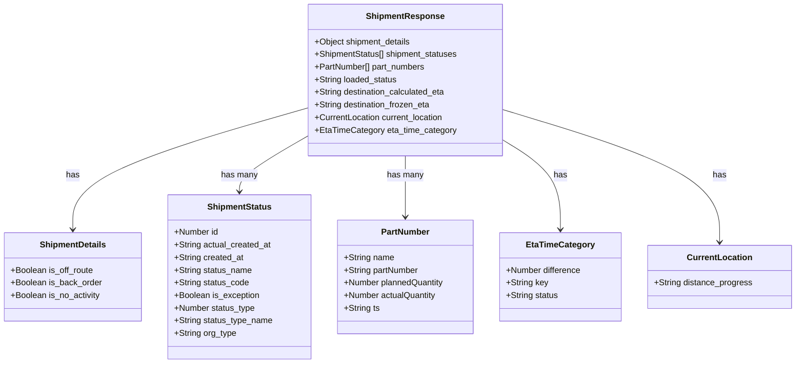

# Diagram: web/portal/src/mocks/handlers/shipping-ng/shipments/shipmentId.js


> Auto-generated by Obscura crawlers

## Diagram 1

```mermaid
flowchart TD
  A[GET /shipping-ng/shipments/:id] --> B[getScenario()]
  B --> C[Fetch original response via ctx.fetch(req)]
  C --> D[Parse JSON -> originalResponseData]
  D --> E[Initialize responseBody = {}]
  E --> F{scenario startsWith flag?}
  F -- yes --> G[flag = scenario.split(':')[1]]
  G --> H{flag in off_route / clear_off_route?}
  H -- yes --> I[Create Off Route updates]
  I --> J{flag == clear_off_route?}
  J -- yes --> K[Push Off Route Cleared update]
  J -- no --> L[No extra update]
  K --> M[Set shipment_details.is_off_route = (flag == off_route)]
  L --> M
  M --> N[shipment_statuses = original + updates]
  H -- no --> O{flag in back_order / clear_back_order?}
  O -- yes --> P[Create Backorder updates]
  P --> Q{flag == clear_back_order?}
  Q -- yes --> R[Push Clear Backorder update]
  Q -- no --> S[No extra update]
  R --> T[Set shipment_details.is_back_order = (flag == back_order)]
  S --> T
  T --> U[shipment_statuses = original + updates]
  O -- no --> V{flag == no_activity?}
  V -- yes --> W[Create No Activity updates]
  W --> X[Set shipment_details.is_no_activity = (flag == no_activity)]
  X --> Y[shipment_statuses = original + updates]
  F -- no --> Z{scenario == parts?}
  Z -- yes --> ZA[Add part_numbers array]
  Z -- no --> ZB{scenario startsWith loadedStatus?}
  ZB -- yes --> ZC{endsWith Loaded?}
  ZC -- yes --> ZD[Set loaded_status = L]
  ZC -- no --> ZE{endsWith Empty?}
  ZE -- yes --> ZF[Set loaded_status = E]
  ZB -- no --> ZG{scenario startsWith eta?}
  ZG -- yes --> ZH{endsWith TBD?}
  ZH -- yes --> ZI[Set destination_calculated_eta = TBD and destination_frozen_eta = null]
  ZG -- no --> ZJ{scenario startsWith distanceProgress?}
  ZJ -- yes --> ZK[Set current_location.distance_progress = "<percent>%"]
  ZJ -- no --> ZL{scenario startsWith etaTimeCategory?}
  ZL -- yes --> ZM[Set eta_time_category based on key (very_early / early / late / very_late)]
  N --> RETURN[Return merged JSON response]
  U --> RETURN
  Y --> RETURN
  ZA --> RETURN
  ZD --> RETURN
  ZF --> RETURN
  ZI --> RETURN
  ZK --> RETURN
  ZM --> RETURN
```

> SVG rendering failed for this diagram.

## Diagram 2



### SVG

<svg id="container" width="1502.2421875" xmlns="http://www.w3.org/2000/svg" class="classDiagram" height="690" viewBox="0 0 1502.2421875 690" role="graphics-document document" aria-roledescription="class"><style>#container{font-family:"trebuchet ms",verdana,arial,sans-serif;font-size:16px;fill:#333;}@keyframes edge-animation-frame{from{stroke-dashoffset:0;}}@keyframes dash{to{stroke-dashoffset:0;}}#container .edge-animation-slow{stroke-dasharray:9,5!important;stroke-dashoffset:900;animation:dash 50s linear infinite;stroke-linecap:round;}#container .edge-animation-fast{stroke-dasharray:9,5!important;stroke-dashoffset:900;animation:dash 20s linear infinite;stroke-linecap:round;}#container .error-icon{fill:#552222;}#container .error-text{fill:#552222;stroke:#552222;}#container .edge-thickness-normal{stroke-width:1px;}#container .edge-thickness-thick{stroke-width:3.5px;}#container .edge-pattern-solid{stroke-dasharray:0;}#container .edge-thickness-invisible{stroke-width:0;fill:none;}#container .edge-pattern-dashed{stroke-dasharray:3;}#container .edge-pattern-dotted{stroke-dasharray:2;}#container .marker{fill:#333333;stroke:#333333;}#container .marker.cross{stroke:#333333;}#container svg{font-family:"trebuchet ms",verdana,arial,sans-serif;font-size:16px;}#container p{margin:0;}#container g.classGroup text{fill:#9370DB;stroke:none;font-family:"trebuchet ms",verdana,arial,sans-serif;font-size:10px;}#container g.classGroup text .title{font-weight:bolder;}#container .nodeLabel,#container .edgeLabel{color:#131300;}#container .edgeLabel .label rect{fill:#ECECFF;}#container .label text{fill:#131300;}#container .labelBkg{background:#ECECFF;}#container .edgeLabel .label span{background:#ECECFF;}#container .classTitle{font-weight:bolder;}#container .node rect,#container .node circle,#container .node ellipse,#container .node polygon,#container .node path{fill:#ECECFF;stroke:#9370DB;stroke-width:1px;}#container .divider{stroke:#9370DB;stroke-width:1;}#container g.clickable{cursor:pointer;}#container g.classGroup rect{fill:#ECECFF;stroke:#9370DB;}#container g.classGroup line{stroke:#9370DB;stroke-width:1;}#container .classLabel .box{stroke:none;stroke-width:0;fill:#ECECFF;opacity:0.5;}#container .classLabel .label{fill:#9370DB;font-size:10px;}#container .relation{stroke:#333333;stroke-width:1;fill:none;}#container .dashed-line{stroke-dasharray:3;}#container .dotted-line{stroke-dasharray:1 2;}#container #compositionStart,#container .composition{fill:#333333!important;stroke:#333333!important;stroke-width:1;}#container #compositionEnd,#container .composition{fill:#333333!important;stroke:#333333!important;stroke-width:1;}#container #dependencyStart,#container .dependency{fill:#333333!important;stroke:#333333!important;stroke-width:1;}#container #dependencyStart,#container .dependency{fill:#333333!important;stroke:#333333!important;stroke-width:1;}#container #extensionStart,#container .extension{fill:transparent!important;stroke:#333333!important;stroke-width:1;}#container #extensionEnd,#container .extension{fill:transparent!important;stroke:#333333!important;stroke-width:1;}#container #aggregationStart,#container .aggregation{fill:transparent!important;stroke:#333333!important;stroke-width:1;}#container #aggregationEnd,#container .aggregation{fill:transparent!important;stroke:#333333!important;stroke-width:1;}#container #lollipopStart,#container .lollipop{fill:#ECECFF!important;stroke:#333333!important;stroke-width:1;}#container #lollipopEnd,#container .lollipop{fill:#ECECFF!important;stroke:#333333!important;stroke-width:1;}#container .edgeTerminals{font-size:11px;line-height:initial;}#container .classTitleText{text-anchor:middle;font-size:18px;fill:#333;}#container .label-icon{display:inline-block;height:1em;overflow:visible;vertical-align:-0.125em;}#container .node .label-icon path{fill:currentColor;stroke:revert;stroke-width:revert;}#container :root{--mermaid-font-family:"trebuchet ms",verdana,arial,sans-serif;}</style><g><defs><marker id="container_class-aggregationStart" class="marker aggregation class" refX="18" refY="7" markerWidth="190" markerHeight="240" orient="auto"><path d="M 18,7 L9,13 L1,7 L9,1 Z"></path></marker></defs><defs><marker id="container_class-aggregationEnd" class="marker aggregation class" refX="1" refY="7" markerWidth="20" markerHeight="28" orient="auto"><path d="M 18,7 L9,13 L1,7 L9,1 Z"></path></marker></defs><defs><marker id="container_class-extensionStart" class="marker extension class" refX="18" refY="7" markerWidth="190" markerHeight="240" orient="auto"><path d="M 1,7 L18,13 V 1 Z"></path></marker></defs><defs><marker id="container_class-extensionEnd" class="marker extension class" refX="1" refY="7" markerWidth="20" markerHeight="28" orient="auto"><path d="M 1,1 V 13 L18,7 Z"></path></marker></defs><defs><marker id="container_class-compositionStart" class="marker composition class" refX="18" refY="7" markerWidth="190" markerHeight="240" orient="auto"><path d="M 18,7 L9,13 L1,7 L9,1 Z"></path></marker></defs><defs><marker id="container_class-compositionEnd" class="marker composition class" refX="1" refY="7" markerWidth="20" markerHeight="28" orient="auto"><path d="M 18,7 L9,13 L1,7 L9,1 Z"></path></marker></defs><defs><marker id="container_class-dependencyStart" class="marker dependency class" refX="6" refY="7" markerWidth="190" markerHeight="240" orient="auto"><path d="M 5,7 L9,13 L1,7 L9,1 Z"></path></marker></defs><defs><marker id="container_class-dependencyEnd" class="marker dependency class" refX="13" refY="7" markerWidth="20" markerHeight="28" orient="auto"><path d="M 18,7 L9,13 L14,7 L9,1 Z"></path></marker></defs><defs><marker id="container_class-lollipopStart" class="marker lollipop class" refX="13" refY="7" markerWidth="190" markerHeight="240" orient="auto"><circle stroke="black" fill="transparent" cx="7" cy="7" r="6"></circle></marker></defs><defs><marker id="container_class-lollipopEnd" class="marker lollipop class" refX="1" refY="7" markerWidth="190" markerHeight="240" orient="auto"><circle stroke="black" fill="transparent" cx="7" cy="7" r="6"></circle></marker></defs><g class="root"><g class="clusters"></g><g class="edgePaths"><path d="M581.172,205.128L507.132,226.44C433.092,247.752,285.013,290.376,210.973,328.855C136.934,367.333,136.934,401.667,136.934,418.833L136.934,436" id="id_ShipmentResponse_ShipmentDetails_1" class="edge-thickness-normal edge-pattern-solid relation" style=";;;" data-edge="true" data-et="edge" data-id="id_ShipmentResponse_ShipmentDetails_1" data-points="W3sieCI6NTgxLjE3MTg3NSwieSI6MjA1LjEyNzgxNDg3ODA4NjY3fSx7IngiOjEzNi45MzM1OTM3NSwieSI6MzMzfSx7IngiOjEzNi45MzM1OTM3NSwieSI6NDQyfV0=" marker-end="url(#container_class-dependencyEnd)"></path><path d="M581.172,258.003L559.408,270.503C537.645,283.002,494.117,308.001,472.354,325.667C450.59,343.333,450.59,353.667,450.59,358.833L450.59,364" id="id_ShipmentResponse_ShipmentStatus_2" class="edge-thickness-normal edge-pattern-solid relation" style=";;;" data-edge="true" data-et="edge" data-id="id_ShipmentResponse_ShipmentStatus_2" data-points="W3sieCI6NTgxLjE3MTg3NSwieSI6MjU4LjAwMzQyMDk2NDU2MzI1fSx7IngiOjQ1MC41ODk4NDM3NSwieSI6MzMzfSx7IngiOjQ1MC41ODk4NDM3NSwieSI6MzcwfV0=" marker-end="url(#container_class-dependencyEnd)"></path><path d="M765.742,296L765.742,302.167C765.742,308.333,765.742,320.667,765.742,340C765.742,359.333,765.742,385.667,765.742,398.833L765.742,412" id="id_ShipmentResponse_PartNumber_3" class="edge-thickness-normal edge-pattern-solid relation" style=";;;" data-edge="true" data-et="edge" data-id="id_ShipmentResponse_PartNumber_3" data-points="W3sieCI6NzY1Ljc0MjE4NzUsInkiOjI5Nn0seyJ4Ijo3NjUuNzQyMTg3NSwieSI6MzMzfSx7IngiOjc2NS43NDIxODc1LCJ5Ijo0MTh9XQ==" marker-end="url(#container_class-dependencyEnd)"></path><path d="M950.313,265.176L968.747,276.48C987.182,287.784,1024.052,310.392,1042.487,338.863C1060.922,367.333,1060.922,401.667,1060.922,418.833L1060.922,436" id="id_ShipmentResponse_EtaTimeCategory_4" class="edge-thickness-normal edge-pattern-solid relation" style=";;;" data-edge="true" data-et="edge" data-id="id_ShipmentResponse_EtaTimeCategory_4" data-points="W3sieCI6OTUwLjMxMjUsInkiOjI2NS4xNzU4OTkyMTM5MzIyfSx7IngiOjEwNjAuOTIxODc1LCJ5IjozMzN9LHsieCI6MTA2MC45MjE4NzUsInkiOjQ0Mn1d" marker-end="url(#container_class-dependencyEnd)"></path><path d="M950.313,208.221L1018.587,229.017C1086.861,249.814,1223.409,291.407,1291.683,333.37C1359.957,375.333,1359.957,417.667,1359.957,438.833L1359.957,460" id="id_ShipmentResponse_CurrentLocation_5" class="edge-thickness-normal edge-pattern-solid relation" style=";;;" data-edge="true" data-et="edge" data-id="id_ShipmentResponse_CurrentLocation_5" data-points="W3sieCI6OTUwLjMxMjUsInkiOjIwOC4yMjA3ODc2NzI4MDg4fSx7IngiOjEzNTkuOTU3MDMxMjUsInkiOjMzM30seyJ4IjoxMzU5Ljk1NzAzMTI1LCJ5Ijo0NjZ9XQ==" marker-end="url(#container_class-dependencyEnd)"></path></g><g class="edgeLabels"><g class="edgeLabel" transform="translate(136.93359375, 333)"><g class="label" data-id="id_ShipmentResponse_ShipmentDetails_1" transform="translate(-12.703125, -12)"><foreignObject width="25.40625" height="24"><div xmlns="http://www.w3.org/1999/xhtml" class="labelBkg" style="display: table-cell; white-space: nowrap; line-height: 1.5; max-width: 200px; text-align: center;"><span class="edgeLabel"><p>has</p></span></div></foreignObject></g></g><g class="edgeLabel" transform="translate(450.58984375, 333)"><g class="label" data-id="id_ShipmentResponse_ShipmentStatus_2" transform="translate(-34.59375, -12)"><foreignObject width="69.1875" height="24"><div xmlns="http://www.w3.org/1999/xhtml" class="labelBkg" style="display: table-cell; white-space: nowrap; line-height: 1.5; max-width: 200px; text-align: center;"><span class="edgeLabel"><p>has many</p></span></div></foreignObject></g></g><g class="edgeLabel" transform="translate(765.7421875, 333)"><g class="label" data-id="id_ShipmentResponse_PartNumber_3" transform="translate(-34.59375, -12)"><foreignObject width="69.1875" height="24"><div xmlns="http://www.w3.org/1999/xhtml" class="labelBkg" style="display: table-cell; white-space: nowrap; line-height: 1.5; max-width: 200px; text-align: center;"><span class="edgeLabel"><p>has many</p></span></div></foreignObject></g></g><g class="edgeLabel" transform="translate(1060.921875, 333)"><g class="label" data-id="id_ShipmentResponse_EtaTimeCategory_4" transform="translate(-12.703125, -12)"><foreignObject width="25.40625" height="24"><div xmlns="http://www.w3.org/1999/xhtml" class="labelBkg" style="display: table-cell; white-space: nowrap; line-height: 1.5; max-width: 200px; text-align: center;"><span class="edgeLabel"><p>has</p></span></div></foreignObject></g></g><g class="edgeLabel" transform="translate(1359.95703125, 333)"><g class="label" data-id="id_ShipmentResponse_CurrentLocation_5" transform="translate(-12.703125, -12)"><foreignObject width="25.40625" height="24"><div xmlns="http://www.w3.org/1999/xhtml" class="labelBkg" style="display: table-cell; white-space: nowrap; line-height: 1.5; max-width: 200px; text-align: center;"><span class="edgeLabel"><p>has</p></span></div></foreignObject></g></g></g><g class="nodes"><g class="node default" id="classId-ShipmentResponse-0" transform="translate(765.7421875, 152)"><g class="basic label-container"><path d="M-184.5703125 -144 L184.5703125 -144 L184.5703125 144 L-184.5703125 144" stroke="none" stroke-width="0" fill="#ECECFF" style=""></path><path d="M-184.5703125 -144 C-100.58491176630577 -144, -16.59951103261153 -144, 184.5703125 -144 M-184.5703125 -144 C-46.43215334797691 -144, 91.70600580404619 -144, 184.5703125 -144 M184.5703125 -144 C184.5703125 -36.20096285400044, 184.5703125 71.59807429199913, 184.5703125 144 M184.5703125 -144 C184.5703125 -80.12989294389548, 184.5703125 -16.25978588779097, 184.5703125 144 M184.5703125 144 C92.81361006717412 144, 1.0569076343482493 144, -184.5703125 144 M184.5703125 144 C50.502622189959396 144, -83.56506812008121 144, -184.5703125 144 M-184.5703125 144 C-184.5703125 51.969521404174756, -184.5703125 -40.06095719165049, -184.5703125 -144 M-184.5703125 144 C-184.5703125 45.40087342310025, -184.5703125 -53.1982531537995, -184.5703125 -144" stroke="#9370DB" stroke-width="1.3" fill="none" stroke-dasharray="0 0" style=""></path></g><g class="annotation-group text" transform="translate(0, -120)"></g><g class="label-group text" transform="translate(-70.546875, -120)"><g class="label" style="font-weight: bolder" transform="translate(0,-12)"><foreignObject width="141.09375" height="24"><div xmlns="http://www.w3.org/1999/xhtml" style="display: table-cell; white-space: nowrap; line-height: 1.5; max-width: 190px; text-align: center;"><span class="nodeLabel markdown-node-label" style=""><p>ShipmentResponse</p></span></div></foreignObject></g></g><g class="members-group text" transform="translate(-172.5703125, -72)"><g class="label" style="" transform="translate(0,-12)"><foreignObject width="185.203125" height="24"><div xmlns="http://www.w3.org/1999/xhtml" style="display: table-cell; white-space: nowrap; line-height: 1.5; max-width: 243px; text-align: center;"><span class="nodeLabel markdown-node-label" style=""><p>+Object shipment_details</p></span></div></foreignObject></g><g class="label" style="" transform="translate(0,12)"><foreignObject width="274.59375" height="24"><div xmlns="http://www.w3.org/1999/xhtml" style="display: table-cell; white-space: nowrap; line-height: 1.5; max-width: 332px; text-align: center;"><span class="nodeLabel markdown-node-label" style=""><p>+ShipmentStatus[] shipment_statuses</p></span></div></foreignObject></g><g class="label" style="" transform="translate(0,36)"><foreignObject width="212.3125" height="24"><div xmlns="http://www.w3.org/1999/xhtml" style="display: table-cell; white-space: nowrap; line-height: 1.5; max-width: 270px; text-align: center;"><span class="nodeLabel markdown-node-label" style=""><p>+PartNumber[] part_numbers</p></span></div></foreignObject></g><g class="label" style="" transform="translate(0,60)"><foreignObject width="157.546875" height="24"><div xmlns="http://www.w3.org/1999/xhtml" style="display: table-cell; white-space: nowrap; line-height: 1.5; max-width: 215px; text-align: center;"><span class="nodeLabel markdown-node-label" style=""><p>+String loaded_status</p></span></div></foreignObject></g><g class="label" style="" transform="translate(0,84)"><foreignObject width="251.265625" height="24"><div xmlns="http://www.w3.org/1999/xhtml" style="display: table-cell; white-space: nowrap; line-height: 1.5; max-width: 309px; text-align: center;"><span class="nodeLabel markdown-node-label" style=""><p>+String destination_calculated_eta</p></span></div></foreignObject></g><g class="label" style="" transform="translate(0,108)"><foreignObject width="221.953125" height="24"><div xmlns="http://www.w3.org/1999/xhtml" style="display: table-cell; white-space: nowrap; line-height: 1.5; max-width: 279px; text-align: center;"><span class="nodeLabel markdown-node-label" style=""><p>+String destination_frozen_eta</p></span></div></foreignObject></g><g class="label" style="" transform="translate(0,132)"><foreignObject width="247.9375" height="24"><div xmlns="http://www.w3.org/1999/xhtml" style="display: table-cell; white-space: nowrap; line-height: 1.5; max-width: 305px; text-align: center;"><span class="nodeLabel markdown-node-label" style=""><p>+CurrentLocation current_location</p></span></div></foreignObject></g><g class="label" style="" transform="translate(0,156)"><foreignObject width="266.765625" height="24"><div xmlns="http://www.w3.org/1999/xhtml" style="display: table-cell; white-space: nowrap; line-height: 1.5; max-width: 324px; text-align: center;"><span class="nodeLabel markdown-node-label" style=""><p>+EtaTimeCategory eta_time_category</p></span></div></foreignObject></g></g><g class="methods-group text" transform="translate(-172.5703125, 144)"></g><g class="divider" style=""><path d="M-184.5703125 -96 C-65.9852831137674 -96, 52.59974627246521 -96, 184.5703125 -96 M-184.5703125 -96 C-107.77566533958125 -96, -30.981018179162504 -96, 184.5703125 -96" stroke="#9370DB" stroke-width="1.3" fill="none" stroke-dasharray="0 0" style=""></path></g><g class="divider" style=""><path d="M-184.5703125 120 C-109.51541676126772 120, -34.46052102253543 120, 184.5703125 120 M-184.5703125 120 C-42.61584281575978 120, 99.33862686848045 120, 184.5703125 120" stroke="#9370DB" stroke-width="1.3" fill="none" stroke-dasharray="0 0" style=""></path></g></g><g class="node default" id="classId-ShipmentDetails-1" transform="translate(136.93359375, 526)"><g class="basic label-container"><path d="M-128.93359375 -84 L128.93359375 -84 L128.93359375 84 L-128.93359375 84" stroke="none" stroke-width="0" fill="#ECECFF" style=""></path><path d="M-128.93359375 -84 C-44.62743756556988 -84, 39.678718618860245 -84, 128.93359375 -84 M-128.93359375 -84 C-36.24853161063679 -84, 56.43653052872642 -84, 128.93359375 -84 M128.93359375 -84 C128.93359375 -43.75791490969629, 128.93359375 -3.5158298193925788, 128.93359375 84 M128.93359375 -84 C128.93359375 -17.6517409078142, 128.93359375 48.6965181843716, 128.93359375 84 M128.93359375 84 C35.43820683599333 84, -58.057180078013346 84, -128.93359375 84 M128.93359375 84 C63.43668845077251 84, -2.060216848454985 84, -128.93359375 84 M-128.93359375 84 C-128.93359375 48.25261058058352, -128.93359375 12.505221161167043, -128.93359375 -84 M-128.93359375 84 C-128.93359375 39.24931206015345, -128.93359375 -5.5013758796931, -128.93359375 -84" stroke="#9370DB" stroke-width="1.3" fill="none" stroke-dasharray="0 0" style=""></path></g><g class="annotation-group text" transform="translate(0, -60)"></g><g class="label-group text" transform="translate(-60.6015625, -60)"><g class="label" style="font-weight: bolder" transform="translate(0,-12)"><foreignObject width="121.203125" height="24"><div xmlns="http://www.w3.org/1999/xhtml" style="display: table-cell; white-space: nowrap; line-height: 1.5; max-width: 170px; text-align: center;"><span class="nodeLabel markdown-node-label" style=""><p>ShipmentDetails</p></span></div></foreignObject></g></g><g class="members-group text" transform="translate(-116.93359375, -12)"><g class="label" style="" transform="translate(0,-12)"><foreignObject width="158.078125" height="24"><div xmlns="http://www.w3.org/1999/xhtml" style="display: table-cell; white-space: nowrap; line-height: 1.5; max-width: 215px; text-align: center;"><span class="nodeLabel markdown-node-label" style=""><p>+Boolean is_off_route</p></span></div></foreignObject></g><g class="label" style="" transform="translate(0,12)"><foreignObject width="173.265625" height="24"><div xmlns="http://www.w3.org/1999/xhtml" style="display: table-cell; white-space: nowrap; line-height: 1.5; max-width: 231px; text-align: center;"><span class="nodeLabel markdown-node-label" style=""><p>+Boolean is_back_order</p></span></div></foreignObject></g><g class="label" style="" transform="translate(0,36)"><foreignObject width="170.875" height="24"><div xmlns="http://www.w3.org/1999/xhtml" style="display: table-cell; white-space: nowrap; line-height: 1.5; max-width: 228px; text-align: center;"><span class="nodeLabel markdown-node-label" style=""><p>+Boolean is_no_activity</p></span></div></foreignObject></g></g><g class="methods-group text" transform="translate(-116.93359375, 84)"></g><g class="divider" style=""><path d="M-128.93359375 -36 C-34.289441432623704 -36, 60.35471088475259 -36, 128.93359375 -36 M-128.93359375 -36 C-69.67387472107634 -36, -10.414155692152704 -36, 128.93359375 -36" stroke="#9370DB" stroke-width="1.3" fill="none" stroke-dasharray="0 0" style=""></path></g><g class="divider" style=""><path d="M-128.93359375 60 C-70.01122771800499 60, -11.088861686009963 60, 128.93359375 60 M-128.93359375 60 C-36.63345542512906 60, 55.666682899741886 60, 128.93359375 60" stroke="#9370DB" stroke-width="1.3" fill="none" stroke-dasharray="0 0" style=""></path></g></g><g class="node default" id="classId-ShipmentStatus-2" transform="translate(450.58984375, 526)"><g class="basic label-container"><path d="M-134.72265625 -156 L134.72265625 -156 L134.72265625 156 L-134.72265625 156" stroke="none" stroke-width="0" fill="#ECECFF" style=""></path><path d="M-134.72265625 -156 C-62.87769495646441 -156, 8.96726633707118 -156, 134.72265625 -156 M-134.72265625 -156 C-51.723623340262975 -156, 31.27540956947405 -156, 134.72265625 -156 M134.72265625 -156 C134.72265625 -89.66208853998819, 134.72265625 -23.32417707997638, 134.72265625 156 M134.72265625 -156 C134.72265625 -84.46958752981186, 134.72265625 -12.939175059623722, 134.72265625 156 M134.72265625 156 C61.703494510436855 156, -11.31566722912629 156, -134.72265625 156 M134.72265625 156 C51.28834302681541 156, -32.14597019636918 156, -134.72265625 156 M-134.72265625 156 C-134.72265625 76.40629916147792, -134.72265625 -3.187401677044164, -134.72265625 -156 M-134.72265625 156 C-134.72265625 39.41625144465718, -134.72265625 -77.16749711068564, -134.72265625 -156" stroke="#9370DB" stroke-width="1.3" fill="none" stroke-dasharray="0 0" style=""></path></g><g class="annotation-group text" transform="translate(0, -132)"></g><g class="label-group text" transform="translate(-58.5859375, -132)"><g class="label" style="font-weight: bolder" transform="translate(0,-12)"><foreignObject width="117.171875" height="24"><div xmlns="http://www.w3.org/1999/xhtml" style="display: table-cell; white-space: nowrap; line-height: 1.5; max-width: 165px; text-align: center;"><span class="nodeLabel markdown-node-label" style=""><p>ShipmentStatus</p></span></div></foreignObject></g></g><g class="members-group text" transform="translate(-122.72265625, -84)"><g class="label" style="" transform="translate(0,-12)"><foreignObject width="84.65625" height="24"><div xmlns="http://www.w3.org/1999/xhtml" style="display: table-cell; white-space: nowrap; line-height: 1.5; max-width: 142px; text-align: center;"><span class="nodeLabel markdown-node-label" style=""><p>+Number id</p></span></div></foreignObject></g><g class="label" style="" transform="translate(0,12)"><foreignObject width="184.0625" height="24"><div xmlns="http://www.w3.org/1999/xhtml" style="display: table-cell; white-space: nowrap; line-height: 1.5; max-width: 242px; text-align: center;"><span class="nodeLabel markdown-node-label" style=""><p>+String actual_created_at</p></span></div></foreignObject></g><g class="label" style="" transform="translate(0,36)"><foreignObject width="131.390625" height="24"><div xmlns="http://www.w3.org/1999/xhtml" style="display: table-cell; white-space: nowrap; line-height: 1.5; max-width: 189px; text-align: center;"><span class="nodeLabel markdown-node-label" style=""><p>+String created_at</p></span></div></foreignObject></g><g class="label" style="" transform="translate(0,60)"><foreignObject width="147.390625" height="24"><div xmlns="http://www.w3.org/1999/xhtml" style="display: table-cell; white-space: nowrap; line-height: 1.5; max-width: 205px; text-align: center;"><span class="nodeLabel markdown-node-label" style=""><p>+String status_name</p></span></div></foreignObject></g><g class="label" style="" transform="translate(0,84)"><foreignObject width="141.515625" height="24"><div xmlns="http://www.w3.org/1999/xhtml" style="display: table-cell; white-space: nowrap; line-height: 1.5; max-width: 199px; text-align: center;"><span class="nodeLabel markdown-node-label" style=""><p>+String status_code</p></span></div></foreignObject></g><g class="label" style="" transform="translate(0,108)"><foreignObject width="162.3125" height="24"><div xmlns="http://www.w3.org/1999/xhtml" style="display: table-cell; white-space: nowrap; line-height: 1.5; max-width: 220px; text-align: center;"><span class="nodeLabel markdown-node-label" style=""><p>+Boolean is_exception</p></span></div></foreignObject></g><g class="label" style="" transform="translate(0,132)"><foreignObject width="154.453125" height="24"><div xmlns="http://www.w3.org/1999/xhtml" style="display: table-cell; white-space: nowrap; line-height: 1.5; max-width: 212px; text-align: center;"><span class="nodeLabel markdown-node-label" style=""><p>+Number status_type</p></span></div></foreignObject></g><g class="label" style="" transform="translate(0,156)"><foreignObject width="186.859375" height="24"><div xmlns="http://www.w3.org/1999/xhtml" style="display: table-cell; white-space: nowrap; line-height: 1.5; max-width: 244px; text-align: center;"><span class="nodeLabel markdown-node-label" style=""><p>+String status_type_name</p></span></div></foreignObject></g><g class="label" style="" transform="translate(0,180)"><foreignObject width="117.921875" height="24"><div xmlns="http://www.w3.org/1999/xhtml" style="display: table-cell; white-space: nowrap; line-height: 1.5; max-width: 175px; text-align: center;"><span class="nodeLabel markdown-node-label" style=""><p>+String org_type</p></span></div></foreignObject></g></g><g class="methods-group text" transform="translate(-122.72265625, 156)"></g><g class="divider" style=""><path d="M-134.72265625 -108 C-46.688417132041025 -108, 41.34582198591795 -108, 134.72265625 -108 M-134.72265625 -108 C-54.23867158336988 -108, 26.245313083260243 -108, 134.72265625 -108" stroke="#9370DB" stroke-width="1.3" fill="none" stroke-dasharray="0 0" style=""></path></g><g class="divider" style=""><path d="M-134.72265625 132 C-31.867987770303657 132, 70.98668070939269 132, 134.72265625 132 M-134.72265625 132 C-64.88908752535083 132, 4.9444811992983375 132, 134.72265625 132" stroke="#9370DB" stroke-width="1.3" fill="none" stroke-dasharray="0 0" style=""></path></g></g><g class="node default" id="classId-PartNumber-3" transform="translate(765.7421875, 526)"><g class="basic label-container"><path d="M-130.4296875 -108 L130.4296875 -108 L130.4296875 108 L-130.4296875 108" stroke="none" stroke-width="0" fill="#ECECFF" style=""></path><path d="M-130.4296875 -108 C-36.818795003244176 -108, 56.79209749351165 -108, 130.4296875 -108 M-130.4296875 -108 C-38.441457730770026 -108, 53.54677203845995 -108, 130.4296875 -108 M130.4296875 -108 C130.4296875 -24.11514610190173, 130.4296875 59.76970779619654, 130.4296875 108 M130.4296875 -108 C130.4296875 -29.774474659543657, 130.4296875 48.45105068091269, 130.4296875 108 M130.4296875 108 C44.90951396741667 108, -40.61065956516666 108, -130.4296875 108 M130.4296875 108 C76.53379706073986 108, 22.6379066214797 108, -130.4296875 108 M-130.4296875 108 C-130.4296875 58.09633321502338, -130.4296875 8.192666430046756, -130.4296875 -108 M-130.4296875 108 C-130.4296875 43.78877529240995, -130.4296875 -20.422449415180097, -130.4296875 -108" stroke="#9370DB" stroke-width="1.3" fill="none" stroke-dasharray="0 0" style=""></path></g><g class="annotation-group text" transform="translate(0, -84)"></g><g class="label-group text" transform="translate(-44.109375, -84)"><g class="label" style="font-weight: bolder" transform="translate(0,-12)"><foreignObject width="88.21875" height="24"><div xmlns="http://www.w3.org/1999/xhtml" style="display: table-cell; white-space: nowrap; line-height: 1.5; max-width: 138px; text-align: center;"><span class="nodeLabel markdown-node-label" style=""><p>PartNumber</p></span></div></foreignObject></g></g><g class="members-group text" transform="translate(-118.4296875, -36)"><g class="label" style="" transform="translate(0,-12)"><foreignObject width="94.984375" height="24"><div xmlns="http://www.w3.org/1999/xhtml" style="display: table-cell; white-space: nowrap; line-height: 1.5; max-width: 152px; text-align: center;"><span class="nodeLabel markdown-node-label" style=""><p>+String name</p></span></div></foreignObject></g><g class="label" style="" transform="translate(0,12)"><foreignObject width="142.828125" height="24"><div xmlns="http://www.w3.org/1999/xhtml" style="display: table-cell; white-space: nowrap; line-height: 1.5; max-width: 201px; text-align: center;"><span class="nodeLabel markdown-node-label" style=""><p>+String partNumber</p></span></div></foreignObject></g><g class="label" style="" transform="translate(0,36)"><foreignObject width="192.75" height="24"><div xmlns="http://www.w3.org/1999/xhtml" style="display: table-cell; white-space: nowrap; line-height: 1.5; max-width: 250px; text-align: center;"><span class="nodeLabel markdown-node-label" style=""><p>+Number plannedQuantity</p></span></div></foreignObject></g><g class="label" style="" transform="translate(0,60)"><foreignObject width="177.5625" height="24"><div xmlns="http://www.w3.org/1999/xhtml" style="display: table-cell; white-space: nowrap; line-height: 1.5; max-width: 235px; text-align: center;"><span class="nodeLabel markdown-node-label" style=""><p>+Number actualQuantity</p></span></div></foreignObject></g><g class="label" style="" transform="translate(0,84)"><foreignObject width="67.71875" height="24"><div xmlns="http://www.w3.org/1999/xhtml" style="display: table-cell; white-space: nowrap; line-height: 1.5; max-width: 125px; text-align: center;"><span class="nodeLabel markdown-node-label" style=""><p>+String ts</p></span></div></foreignObject></g></g><g class="methods-group text" transform="translate(-118.4296875, 108)"></g><g class="divider" style=""><path d="M-130.4296875 -60 C-67.67520693186995 -60, -4.920726363739888 -60, 130.4296875 -60 M-130.4296875 -60 C-36.77263890532383 -60, 56.88440968935234 -60, 130.4296875 -60" stroke="#9370DB" stroke-width="1.3" fill="none" stroke-dasharray="0 0" style=""></path></g><g class="divider" style=""><path d="M-130.4296875 84 C-56.72756184836905 84, 16.9745638032619 84, 130.4296875 84 M-130.4296875 84 C-73.41453657664297 84, -16.399385653285933 84, 130.4296875 84" stroke="#9370DB" stroke-width="1.3" fill="none" stroke-dasharray="0 0" style=""></path></g></g><g class="node default" id="classId-EtaTimeCategory-4" transform="translate(1060.921875, 526)"><g class="basic label-container"><path d="M-114.75 -84 L114.75 -84 L114.75 84 L-114.75 84" stroke="none" stroke-width="0" fill="#ECECFF" style=""></path><path d="M-114.75 -84 C-49.768396266533955 -84, 15.21320746693209 -84, 114.75 -84 M-114.75 -84 C-64.00509836456057 -84, -13.260196729121134 -84, 114.75 -84 M114.75 -84 C114.75 -20.48836665524189, 114.75 43.02326668951622, 114.75 84 M114.75 -84 C114.75 -36.35358832886686, 114.75 11.292823342266274, 114.75 84 M114.75 84 C39.39306581201109 84, -35.963868375977825 84, -114.75 84 M114.75 84 C38.90027651128544 84, -36.94944697742912 84, -114.75 84 M-114.75 84 C-114.75 26.897315901680017, -114.75 -30.205368196639967, -114.75 -84 M-114.75 84 C-114.75 17.335006328778803, -114.75 -49.329987342442394, -114.75 -84" stroke="#9370DB" stroke-width="1.3" fill="none" stroke-dasharray="0 0" style=""></path></g><g class="annotation-group text" transform="translate(0, -60)"></g><g class="label-group text" transform="translate(-61.71875, -60)"><g class="label" style="font-weight: bolder" transform="translate(0,-12)"><foreignObject width="123.4375" height="24"><div xmlns="http://www.w3.org/1999/xhtml" style="display: table-cell; white-space: nowrap; line-height: 1.5; max-width: 171px; text-align: center;"><span class="nodeLabel markdown-node-label" style=""><p>EtaTimeCategory</p></span></div></foreignObject></g></g><g class="members-group text" transform="translate(-102.75, -12)"><g class="label" style="" transform="translate(0,-12)"><foreignObject width="143.78125" height="24"><div xmlns="http://www.w3.org/1999/xhtml" style="display: table-cell; white-space: nowrap; line-height: 1.5; max-width: 201px; text-align: center;"><span class="nodeLabel markdown-node-label" style=""><p>+Number difference</p></span></div></foreignObject></g><g class="label" style="" transform="translate(0,12)"><foreignObject width="79.046875" height="24"><div xmlns="http://www.w3.org/1999/xhtml" style="display: table-cell; white-space: nowrap; line-height: 1.5; max-width: 137px; text-align: center;"><span class="nodeLabel markdown-node-label" style=""><p>+String key</p></span></div></foreignObject></g><g class="label" style="" transform="translate(0,36)"><foreignObject width="98.875" height="24"><div xmlns="http://www.w3.org/1999/xhtml" style="display: table-cell; white-space: nowrap; line-height: 1.5; max-width: 156px; text-align: center;"><span class="nodeLabel markdown-node-label" style=""><p>+String status</p></span></div></foreignObject></g></g><g class="methods-group text" transform="translate(-102.75, 84)"></g><g class="divider" style=""><path d="M-114.75 -36 C-52.9760256871633 -36, 8.7979486256734 -36, 114.75 -36 M-114.75 -36 C-46.512298564311536 -36, 21.72540287137693 -36, 114.75 -36" stroke="#9370DB" stroke-width="1.3" fill="none" stroke-dasharray="0 0" style=""></path></g><g class="divider" style=""><path d="M-114.75 60 C-31.734875223523602 60, 51.280249552952796 60, 114.75 60 M-114.75 60 C-48.53518666815671 60, 17.679626663686577 60, 114.75 60" stroke="#9370DB" stroke-width="1.3" fill="none" stroke-dasharray="0 0" style=""></path></g></g><g class="node default" id="classId-CurrentLocation-5" transform="translate(1359.95703125, 526)"><g class="basic label-container"><path d="M-134.28515625 -60 L134.28515625 -60 L134.28515625 60 L-134.28515625 60" stroke="none" stroke-width="0" fill="#ECECFF" style=""></path><path d="M-134.28515625 -60 C-30.91246706438541 -60, 72.46022212122918 -60, 134.28515625 -60 M-134.28515625 -60 C-46.25440094085974 -60, 41.77635436828052 -60, 134.28515625 -60 M134.28515625 -60 C134.28515625 -33.97271388514428, 134.28515625 -7.9454277702885605, 134.28515625 60 M134.28515625 -60 C134.28515625 -29.50956799388548, 134.28515625 0.9808640122290413, 134.28515625 60 M134.28515625 60 C29.730130937455556 60, -74.82489437508889 60, -134.28515625 60 M134.28515625 60 C29.71101629875521 60, -74.86312365248958 60, -134.28515625 60 M-134.28515625 60 C-134.28515625 34.67880242936921, -134.28515625 9.35760485873842, -134.28515625 -60 M-134.28515625 60 C-134.28515625 19.69053643130819, -134.28515625 -20.618927137383622, -134.28515625 -60" stroke="#9370DB" stroke-width="1.3" fill="none" stroke-dasharray="0 0" style=""></path></g><g class="annotation-group text" transform="translate(0, -36)"></g><g class="label-group text" transform="translate(-58.6953125, -36)"><g class="label" style="font-weight: bolder" transform="translate(0,-12)"><foreignObject width="117.390625" height="24"><div xmlns="http://www.w3.org/1999/xhtml" style="display: table-cell; white-space: nowrap; line-height: 1.5; max-width: 166px; text-align: center;"><span class="nodeLabel markdown-node-label" style=""><p>CurrentLocation</p></span></div></foreignObject></g></g><g class="members-group text" transform="translate(-122.28515625, 12)"><g class="label" style="" transform="translate(0,-12)"><foreignObject width="185.875" height="24"><div xmlns="http://www.w3.org/1999/xhtml" style="display: table-cell; white-space: nowrap; line-height: 1.5; max-width: 243px; text-align: center;"><span class="nodeLabel markdown-node-label" style=""><p>+String distance_progress</p></span></div></foreignObject></g></g><g class="methods-group text" transform="translate(-122.28515625, 60)"></g><g class="divider" style=""><path d="M-134.28515625 -12 C-27.446024741283438 -12, 79.39310676743312 -12, 134.28515625 -12 M-134.28515625 -12 C-70.85379739775345 -12, -7.422438545506921 -12, 134.28515625 -12" stroke="#9370DB" stroke-width="1.3" fill="none" stroke-dasharray="0 0" style=""></path></g><g class="divider" style=""><path d="M-134.28515625 36 C-73.84652958319393 36, -13.40790291638784 36, 134.28515625 36 M-134.28515625 36 C-73.69773793953973 36, -13.11031962907947 36, 134.28515625 36" stroke="#9370DB" stroke-width="1.3" fill="none" stroke-dasharray="0 0" style=""></path></g></g></g></g></g></svg>
