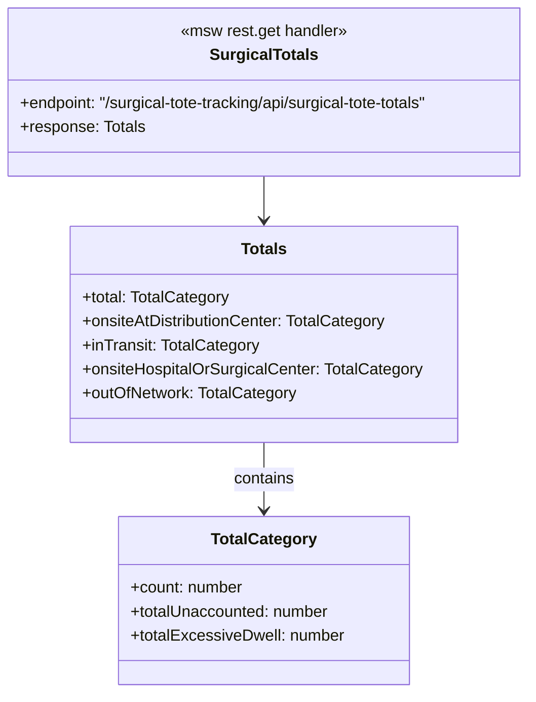

# Diagram: web/portal/src/mocks/handlers/surgical-tote-tracking/totals.js

> Auto-generated by Obscura crawlers

## Mermaid

### SVG

<svg id="container" width="559.328125" xmlns="http://www.w3.org/2000/svg" class="classDiagram" height="692" viewBox="0 0 559.328125 692" role="graphics-document document" aria-roledescription="class"><g><defs><marker id="container_class-aggregationStart" class="marker aggregation class" refX="18" refY="7" markerWidth="190" markerHeight="240" orient="auto"><path d="M 18,7 L9,13 L1,7 L9,1 Z"></path></marker></defs><defs><marker id="container_class-aggregationEnd" class="marker aggregation class" refX="1" refY="7" markerWidth="20" markerHeight="28" orient="auto"><path d="M 18,7 L9,13 L1,7 L9,1 Z"></path></marker></defs><defs><marker id="container_class-extensionStart" class="marker extension class" refX="18" refY="7" markerWidth="190" markerHeight="240" orient="auto"><path d="M 1,7 L18,13 V 1 Z"></path></marker></defs><defs><marker id="container_class-extensionEnd" class="marker extension class" refX="1" refY="7" markerWidth="20" markerHeight="28" orient="auto"><path d="M 1,1 V 13 L18,7 Z"></path></marker></defs><defs><marker id="container_class-compositionStart" class="marker composition class" refX="18" refY="7" markerWidth="190" markerHeight="240" orient="auto"><path d="M 18,7 L9,13 L1,7 L9,1 Z"></path></marker></defs><defs><marker id="container_class-compositionEnd" class="marker composition class" refX="1" refY="7" markerWidth="20" markerHeight="28" orient="auto"><path d="M 18,7 L9,13 L1,7 L9,1 Z"></path></marker></defs><defs><marker id="container_class-dependencyStart" class="marker dependency class" refX="6" refY="7" markerWidth="190" markerHeight="240" orient="auto"><path d="M 5,7 L9,13 L1,7 L9,1 Z"></path></marker></defs><defs><marker id="container_class-dependencyEnd" class="marker dependency class" refX="13" refY="7" markerWidth="20" markerHeight="28" orient="auto"><path d="M 18,7 L9,13 L14,7 L9,1 Z"></path></marker></defs><defs><marker id="container_class-lollipopStart" class="marker lollipop class" refX="13" refY="7" markerWidth="190" markerHeight="240" orient="auto"><circle stroke="black" fill="transparent" cx="7" cy="7" r="6"></circle></marker></defs><defs><marker id="container_class-lollipopEnd" class="marker lollipop class" refX="1" refY="7" markerWidth="190" markerHeight="240" orient="auto"><circle stroke="black" fill="transparent" cx="7" cy="7" r="6"></circle></marker></defs><g class="root"><g class="clusters"></g><g class="edgePaths"><path d="M279.664,176L279.664,180.167C279.664,184.333,279.664,192.667,279.664,200C279.664,207.333,279.664,213.667,279.664,216.833L279.664,220" id="id_SurgicalTotals_Totals_1" class="edge-thickness-normal edge-pattern-solid relation" style=";;;" data-edge="true" data-et="edge" data-id="id_SurgicalTotals_Totals_1" data-points="W3sieCI6Mjc5LjY2NDA2MjUsInkiOjE3Nn0seyJ4IjoyNzkuNjY0MDYyNSwieSI6MjAxfSx7IngiOjI3OS42NjQwNjI1LCJ5IjoyMjZ9XQ==" marker-end="url(#container_class-dependencyEnd)"></path><path d="M279.664,442L279.664,448.167C279.664,454.333,279.664,466.667,279.664,478C279.664,489.333,279.664,499.667,279.664,504.833L279.664,510" id="id_Totals_TotalCategory_2" class="edge-thickness-normal edge-pattern-solid relation" style=";;;" data-edge="true" data-et="edge" data-id="id_Totals_TotalCategory_2" data-points="W3sieCI6Mjc5LjY2NDA2MjUsInkiOjQ0Mn0seyJ4IjoyNzkuNjY0MDYyNSwieSI6NDc5fSx7IngiOjI3OS42NjQwNjI1LCJ5Ijo1MTZ9XQ==" marker-end="url(#container_class-dependencyEnd)"></path></g><g class="edgeLabels"><g class="edgeLabel"><g class="label" data-id="id_SurgicalTotals_Totals_1" transform="translate(0, 0)"><foreignObject width="0" height="0">

</foreignObject></g></g><g class="edgeLabel" transform="translate(279.6640625, 479)"><g class="label" data-id="id_Totals_TotalCategory_2" transform="translate(-30.890625, -12)"><foreignObject width="61.78125" height="24">

contains

</foreignObject></g></g></g><g class="nodes"><g class="node default" id="classId-SurgicalTotals-0" transform="translate(279.6640625, 92)"><g class="basic label-container"><path d="M-271.6640625 -84 L271.6640625 -84 L271.6640625 84 L-271.6640625 84" stroke="none" stroke-width="0" fill="#ECECFF" style=""></path><path d="M-271.6640625 -84 C-89.52968728135579 -84, 92.60468793728842 -84, 271.6640625 -84 M-271.6640625 -84 C-112.0220178500596 -84, 47.620026799880804 -84, 271.6640625 -84 M271.6640625 -84 C271.6640625 -49.39916225613945, 271.6640625 -14.798324512278896, 271.6640625 84 M271.6640625 -84 C271.6640625 -32.27939427394106, 271.6640625 19.441211452117884, 271.6640625 84 M271.6640625 84 C144.09046543765365 84, 16.516868375307297 84, -271.6640625 84 M271.6640625 84 C56.75217815916844 84, -158.15970618166313 84, -271.6640625 84 M-271.6640625 84 C-271.6640625 38.24415175832062, -271.6640625 -7.511696483358762, -271.6640625 -84 M-271.6640625 84 C-271.6640625 37.35189936330259, -271.6640625 -9.296201273394814, -271.6640625 -84" stroke="#9370DB" stroke-width="1.3" fill="none" stroke-dasharray="0 0" style=""></path></g><g class="annotation-group text" transform="translate(-84.8125, -60)"><g class="label" style="" transform="translate(0,-12)"><foreignObject width="169.625" height="24">

«msw rest.get handler»

</foreignObject></g></g><g class="label-group text" transform="translate(-51.453125, -36)"><g class="label" style="font-weight: bolder" transform="translate(0,-12)"><foreignObject width="102.90625" height="24">

SurgicalTotals

</foreignObject></g></g><g class="members-group text" transform="translate(-259.6640625, 12)"><g class="label" style="" transform="translate(0,-12)"><foreignObject width="434.515625" height="24">

+endpoint: "/surgical-tote-tracking/api/surgical-tote-totals"

</foreignObject></g><g class="label" style="" transform="translate(0,12)"><foreignObject width="125.484375" height="24">

+response: Totals

</foreignObject></g></g><g class="methods-group text" transform="translate(-259.6640625, 84)"></g><g class="divider" style=""><path d="M-271.6640625 -12 C-77.23939349883909 -12, 117.18527550232182 -12, 271.6640625 -12 M-271.6640625 -12 C-152.93033114838803 -12, -34.19659979677607 -12, 271.6640625 -12" stroke="#9370DB" stroke-width="1.3" fill="none" stroke-dasharray="0 0" style=""></path></g><g class="divider" style=""><path d="M-271.6640625 60 C-100.02893494449162 60, 71.60619261101675 60, 271.6640625 60 M-271.6640625 60 C-74.3319391051997 60, 123.00018428960061 60, 271.6640625 60" stroke="#9370DB" stroke-width="1.3" fill="none" stroke-dasharray="0 0" style=""></path></g></g><g class="node default" id="classId-Totals-1" transform="translate(279.6640625, 334)"><g class="basic label-container"><path d="M-194.3359375 -108 L194.3359375 -108 L194.3359375 108 L-194.3359375 108" stroke="none" stroke-width="0" fill="#ECECFF" style=""></path><path d="M-194.3359375 -108 C-53.440901989178116 -108, 87.45413352164377 -108, 194.3359375 -108 M-194.3359375 -108 C-52.92351643958068 -108, 88.48890462083864 -108, 194.3359375 -108 M194.3359375 -108 C194.3359375 -29.20531203735804, 194.3359375 49.58937592528392, 194.3359375 108 M194.3359375 -108 C194.3359375 -52.383093703550756, 194.3359375 3.233812592898488, 194.3359375 108 M194.3359375 108 C39.165085669448075 108, -116.00576616110385 108, -194.3359375 108 M194.3359375 108 C88.5407883858307 108, -17.25436072833861 108, -194.3359375 108 M-194.3359375 108 C-194.3359375 55.0505353810329, -194.3359375 2.1010707620658025, -194.3359375 -108 M-194.3359375 108 C-194.3359375 23.417513613429918, -194.3359375 -61.164972773140164, -194.3359375 -108" stroke="#9370DB" stroke-width="1.3" fill="none" stroke-dasharray="0 0" style=""></path></g><g class="annotation-group text" transform="translate(0, -84)"></g><g class="label-group text" transform="translate(-22.09375, -84)"><g class="label" style="font-weight: bolder" transform="translate(0,-12)"><foreignObject width="44.1875" height="24">

Totals

</foreignObject></g></g><g class="members-group text" transform="translate(-182.3359375, -36)"><g class="label" style="" transform="translate(0,-12)"><foreignObject width="148.78125" height="24">

+total: TotalCategory

</foreignObject></g><g class="label" style="" transform="translate(0,12)"><foreignObject width="308.734375" height="24">

+onsiteAtDistributionCenter: TotalCategory

</foreignObject></g><g class="label" style="" transform="translate(0,36)"><foreignObject width="178.125" height="24">

+inTransit: TotalCategory

</foreignObject></g><g class="label" style="" transform="translate(0,60)"><foreignObject width="342.578125" height="24">

+onsiteHospitalOrSurgicalCenter: TotalCategory

</foreignObject></g><g class="label" style="" transform="translate(0,84)"><foreignObject width="216.453125" height="24">

+outOfNetwork: TotalCategory

</foreignObject></g></g><g class="methods-group text" transform="translate(-182.3359375, 108)"></g><g class="divider" style=""><path d="M-194.3359375 -60 C-107.824167279984 -60, -21.312397059967992 -60, 194.3359375 -60 M-194.3359375 -60 C-90.78001601484522 -60, 12.775905470309567 -60, 194.3359375 -60" stroke="#9370DB" stroke-width="1.3" fill="none" stroke-dasharray="0 0" style=""></path></g><g class="divider" style=""><path d="M-194.3359375 84 C-75.19914643587414 84, 43.93764462825172 84, 194.3359375 84 M-194.3359375 84 C-45.479271505588656 84, 103.37739448882269 84, 194.3359375 84" stroke="#9370DB" stroke-width="1.3" fill="none" stroke-dasharray="0 0" style=""></path></g></g><g class="node default" id="classId-TotalCategory-2" transform="translate(279.6640625, 600)"><g class="basic label-container"><path d="M-144.6953125 -84 L144.6953125 -84 L144.6953125 84 L-144.6953125 84" stroke="none" stroke-width="0" fill="#ECECFF" style=""></path><path d="M-144.6953125 -84 C-70.6650701288013 -84, 3.365172242397392 -84, 144.6953125 -84 M-144.6953125 -84 C-38.30238403044203 -84, 68.09054443911594 -84, 144.6953125 -84 M144.6953125 -84 C144.6953125 -17.764946596110363, 144.6953125 48.470106807779274, 144.6953125 84 M144.6953125 -84 C144.6953125 -49.27042552681619, 144.6953125 -14.54085105363238, 144.6953125 84 M144.6953125 84 C52.733795382893845 84, -39.22772173421231 84, -144.6953125 84 M144.6953125 84 C55.7807475410939 84, -33.133817417812196 84, -144.6953125 84 M-144.6953125 84 C-144.6953125 18.579254581820294, -144.6953125 -46.84149083635941, -144.6953125 -84 M-144.6953125 84 C-144.6953125 27.066512148856397, -144.6953125 -29.866975702287206, -144.6953125 -84" stroke="#9370DB" stroke-width="1.3" fill="none" stroke-dasharray="0 0" style=""></path></g><g class="annotation-group text" transform="translate(0, -60)"></g><g class="label-group text" transform="translate(-50.75, -60)"><g class="label" style="font-weight: bolder" transform="translate(0,-12)"><foreignObject width="101.5" height="24">

TotalCategory

</foreignObject></g></g><g class="members-group text" transform="translate(-132.6953125, -12)"><g class="label" style="" transform="translate(0,-12)"><foreignObject width="114.078125" height="24">

+count: number

</foreignObject></g><g class="label" style="" transform="translate(0,12)"><foreignObject width="201.75" height="24">

+totalUnaccounted: number

</foreignObject></g><g class="label" style="" transform="translate(0,36)"><foreignObject width="214.640625" height="24">

+totalExcessiveDwell: number

</foreignObject></g></g><g class="methods-group text" transform="translate(-132.6953125, 84)"></g><g class="divider" style=""><path d="M-144.6953125 -36 C-68.41150020692689 -36, 7.8723120861462235 -36, 144.6953125 -36 M-144.6953125 -36 C-84.8475936766567 -36, -24.9998748533134 -36, 144.6953125 -36" stroke="#9370DB" stroke-width="1.3" fill="none" stroke-dasharray="0 0" style=""></path></g><g class="divider" style=""><path d="M-144.6953125 60 C-85.13293966187264 60, -25.57056682374528 60, 144.6953125 60 M-144.6953125 60 C-38.53878969677329 60, 67.61773310645341 60, 144.6953125 60" stroke="#9370DB" stroke-width="1.3" fill="none" stroke-dasharray="0 0" style=""></path></g></g></g></g></g></svg>
