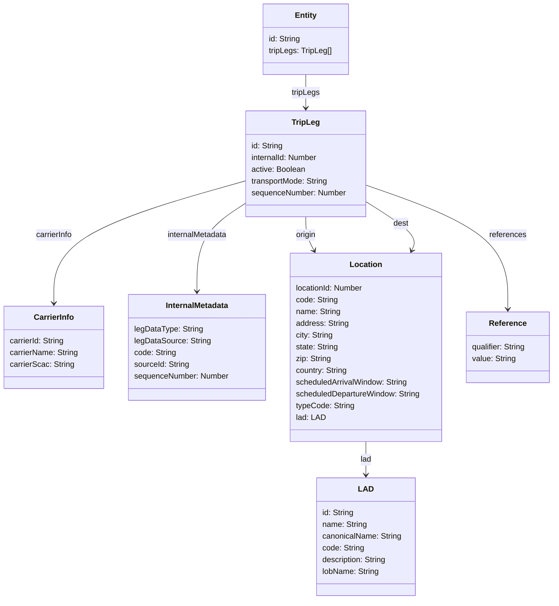
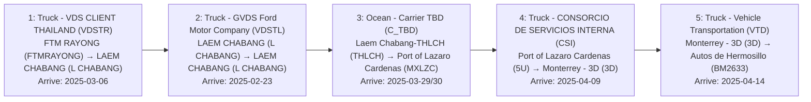

# Diagram: web/portal/src/mocks/handlers/trip-leg/solutionId/planned-trip-leg/data.js

> Auto-generated by Obscura crawlers

## Diagram 1

### SVG

<svg id="container" width="1136.1953125" xmlns="http://www.w3.org/2000/svg" class="classDiagram" height="1222" viewBox="0 0 1136.1953125 1222" role="graphics-document document" aria-roledescription="class"><g><defs><marker id="container_class-aggregationStart" class="marker aggregation class" refX="18" refY="7" markerWidth="190" markerHeight="240" orient="auto"><path d="M 18,7 L9,13 L1,7 L9,1 Z"></path></marker></defs><defs><marker id="container_class-aggregationEnd" class="marker aggregation class" refX="1" refY="7" markerWidth="20" markerHeight="28" orient="auto"><path d="M 18,7 L9,13 L1,7 L9,1 Z"></path></marker></defs><defs><marker id="container_class-extensionStart" class="marker extension class" refX="18" refY="7" markerWidth="190" markerHeight="240" orient="auto"><path d="M 1,7 L18,13 V 1 Z"></path></marker></defs><defs><marker id="container_class-extensionEnd" class="marker extension class" refX="1" refY="7" markerWidth="20" markerHeight="28" orient="auto"><path d="M 1,1 V 13 L18,7 Z"></path></marker></defs><defs><marker id="container_class-compositionStart" class="marker composition class" refX="18" refY="7" markerWidth="190" markerHeight="240" orient="auto"><path d="M 18,7 L9,13 L1,7 L9,1 Z"></path></marker></defs><defs><marker id="container_class-compositionEnd" class="marker composition class" refX="1" refY="7" markerWidth="20" markerHeight="28" orient="auto"><path d="M 18,7 L9,13 L1,7 L9,1 Z"></path></marker></defs><defs><marker id="container_class-dependencyStart" class="marker dependency class" refX="6" refY="7" markerWidth="190" markerHeight="240" orient="auto"><path d="M 5,7 L9,13 L1,7 L9,1 Z"></path></marker></defs><defs><marker id="container_class-dependencyEnd" class="marker dependency class" refX="13" refY="7" markerWidth="20" markerHeight="28" orient="auto"><path d="M 18,7 L9,13 L14,7 L9,1 Z"></path></marker></defs><defs><marker id="container_class-lollipopStart" class="marker lollipop class" refX="13" refY="7" markerWidth="190" markerHeight="240" orient="auto"><circle stroke="black" fill="transparent" cx="7" cy="7" r="6"></circle></marker></defs><defs><marker id="container_class-lollipopEnd" class="marker lollipop class" refX="1" refY="7" markerWidth="190" markerHeight="240" orient="auto"><circle stroke="black" fill="transparent" cx="7" cy="7" r="6"></circle></marker></defs><g class="root"><g class="clusters"></g><g class="edgePaths"><path d="M628.561,152L628.561,158.167C628.561,164.333,628.561,176.667,628.561,188C628.561,199.333,628.561,209.667,628.561,214.833L628.561,220" id="id_Entity_TripLeg_1" class="edge-thickness-normal edge-pattern-solid relation" style=";;;" data-edge="true" data-et="edge" data-id="id_Entity_TripLeg_1" data-points="W3sieCI6NjI4LjU2MDU0Njg3NSwieSI6MTUyfSx7IngiOjYyOC41NjA1NDY4NzUsInkiOjE4OX0seyJ4Ijo2MjguNTYwNTQ2ODc1LCJ5IjoyMjZ9XQ==" marker-end="url(#container_class-dependencyEnd)"></path><path d="M505.947,368.305L440.005,386.754C374.063,405.203,242.178,442.102,176.235,483.717C110.293,525.333,110.293,571.667,110.293,594.833L110.293,618" id="id_TripLeg_CarrierInfo_2" class="edge-thickness-normal edge-pattern-solid relation" style=";;;" data-edge="true" data-et="edge" data-id="id_TripLeg_CarrierInfo_2" data-points="W3sieCI6NTA1Ljk0NzI2NTYyNSwieSI6MzY4LjMwNDUzMDE5MTg1NzZ9LHsieCI6MTEwLjI5Mjk2ODc1LCJ5Ijo0Nzl9LHsieCI6MTEwLjI5Mjk2ODc1LCJ5Ijo2MjR9XQ==" marker-end="url(#container_class-dependencyEnd)"></path><path d="M505.947,412.963L488.857,423.969C471.767,434.976,437.587,456.988,420.496,487.161C403.406,517.333,403.406,555.667,403.406,574.833L403.406,594" id="id_TripLeg_InternalMetadata_3" class="edge-thickness-normal edge-pattern-solid relation" style=";;;" data-edge="true" data-et="edge" data-id="id_TripLeg_InternalMetadata_3" data-points="W3sieCI6NTA1Ljk0NzI2NTYyNSwieSI6NDEyLjk2MzI5NzczODUzfSx7IngiOjQwMy40MDYyNSwieSI6NDc5fSx7IngiOjQwMy40MDYyNSwieSI6NjAwfV0=" marker-end="url(#container_class-dependencyEnd)"></path><path d="M628.561,442L628.561,448.167C628.561,454.333,628.561,466.667,631.363,478.117C634.166,489.567,639.771,500.133,642.573,505.416L645.376,510.7" id="id_TripLeg_Location_4" class="edge-thickness-normal edge-pattern-solid relation" style=";;;" data-edge="true" data-et="edge" data-id="id_TripLeg_Location_4" data-points="W3sieCI6NjI4LjU2MDU0Njg3NSwieSI6NDQyfSx7IngiOjYyOC41NjA1NDY4NzUsInkiOjQ3OX0seyJ4Ijo2NDguMTg3NDQ4ODI2NDE5MiwieSI6NTE2fV0=" marker-end="url(#container_class-dependencyEnd)"></path><path d="M751.174,411.076L769.183,422.397C787.191,433.718,823.209,456.359,838.708,472.943C854.207,489.528,849.187,500.056,846.677,505.32L844.167,510.584" id="id_TripLeg_Location_5" class="edge-thickness-normal edge-pattern-solid relation" style=";;;" data-edge="true" data-et="edge" data-id="id_TripLeg_Location_5" data-points="W3sieCI6NzUxLjE3MzgyODEyNSwieSI6NDExLjA3NjQ4NTM4MTE1Njh9LHsieCI6ODU5LjIyNjU2MjUsInkiOjQ3OX0seyJ4Ijo4NDEuNTg0MjgyODg3NTU0NSwieSI6NTE2fV0=" marker-end="url(#container_class-dependencyEnd)"></path><path d="M750.035,900L750.035,906.167C750.035,912.333,750.035,924.667,750.035,936C750.035,947.333,750.035,957.667,750.035,962.833L750.035,968" id="id_Location_LAD_6" class="edge-thickness-normal edge-pattern-solid relation" style=";;;" data-edge="true" data-et="edge" data-id="id_Location_LAD_6" data-points="W3sieCI6NzUwLjAzNTE1NjI1LCJ5Ijo5MDB9LHsieCI6NzUwLjAzNTE1NjI1LCJ5Ijo5Mzd9LHsieCI6NzUwLjAzNTE1NjI1LCJ5Ijo5NzR9XQ==" marker-end="url(#container_class-dependencyEnd)"></path><path d="M751.174,377L799.648,394C848.122,411,945.071,445,993.545,487.167C1042.02,529.333,1042.02,579.667,1042.02,604.833L1042.02,630" id="id_TripLeg_Reference_7" class="edge-thickness-normal edge-pattern-solid relation" style=";;;" data-edge="true" data-et="edge" data-id="id_TripLeg_Reference_7" data-points="W3sieCI6NzUxLjE3MzgyODEyNSwieSI6Mzc3LjAwMDQ1ODIxNTAzOTh9LHsieCI6MTA0Mi4wMTk1MzEyNSwieSI6NDc5fSx7IngiOjEwNDIuMDE5NTMxMjUsInkiOjYzNn1d" marker-end="url(#container_class-dependencyEnd)"></path></g><g class="edgeLabels"><g class="edgeLabel" transform="translate(628.560546875, 189)"><g class="label" data-id="id_Entity_TripLeg_1" transform="translate(-28.96875, -12)"><foreignObject width="57.9375" height="24">

tripLegs

</foreignObject></g></g><g class="edgeLabel" transform="translate(110.29296875, 479)"><g class="label" data-id="id_TripLeg_CarrierInfo_2" transform="translate(-38.296875, -12)"><foreignObject width="76.59375" height="24">

carrierInfo

</foreignObject></g></g><g class="edgeLabel" transform="translate(403.40625, 479)"><g class="label" data-id="id_TripLeg_InternalMetadata_3" transform="translate(-62.5546875, -12)"><foreignObject width="125.109375" height="24">

internalMetadata

</foreignObject></g></g><g class="edgeLabel" transform="translate(628.560546875, 479)"><g class="label" data-id="id_TripLeg_Location_4" transform="translate(-21.125, -12)"><foreignObject width="42.25" height="24">

origin

</foreignObject></g></g><g class="edgeLabel" transform="translate(822.55204, 455.94586)"><g class="label" data-id="id_TripLeg_Location_5" transform="translate(-15.7734375, -12)"><foreignObject width="31.546875" height="24">

dest

</foreignObject></g></g><g class="edgeLabel" transform="translate(750.03515625, 937)"><g class="label" data-id="id_Location_LAD_6" transform="translate(-11.4453125, -12)"><foreignObject width="22.890625" height="24">

lad

</foreignObject></g></g><g class="edgeLabel" transform="translate(1042.01953125, 479)"><g class="label" data-id="id_TripLeg_Reference_7" transform="translate(-37.828125, -12)"><foreignObject width="75.65625" height="24">

references

</foreignObject></g></g></g><g class="nodes"><g class="node default" id="classId-Entity-0" transform="translate(628.560546875, 80)"><g class="basic label-container"><path d="M-87.1015625 -72 L87.1015625 -72 L87.1015625 72 L-87.1015625 72" stroke="none" stroke-width="0" fill="#ECECFF" style=""></path><path d="M-87.1015625 -72 C-43.734536303666495 -72, -0.36751010733298983 -72, 87.1015625 -72 M-87.1015625 -72 C-35.23912986620635 -72, 16.623302767587305 -72, 87.1015625 -72 M87.1015625 -72 C87.1015625 -24.899380931983416, 87.1015625 22.20123813603317, 87.1015625 72 M87.1015625 -72 C87.1015625 -41.19110316591697, 87.1015625 -10.382206331833949, 87.1015625 72 M87.1015625 72 C36.88682016813318 72, -13.327922163733646 72, -87.1015625 72 M87.1015625 72 C51.94246755714809 72, 16.783372614296184 72, -87.1015625 72 M-87.1015625 72 C-87.1015625 20.391053262590525, -87.1015625 -31.21789347481895, -87.1015625 -72 M-87.1015625 72 C-87.1015625 35.411158256972335, -87.1015625 -1.1776834860553294, -87.1015625 -72" stroke="#9370DB" stroke-width="1.3" fill="none" stroke-dasharray="0 0" style=""></path></g><g class="annotation-group text" transform="translate(0, -48)"></g><g class="label-group text" transform="translate(-21.28125, -48)"><g class="label" style="font-weight: bolder" transform="translate(0,-12)"><foreignObject width="42.5625" height="24">

Entity

</foreignObject></g></g><g class="members-group text" transform="translate(-75.1015625, 0)"><g class="label" style="" transform="translate(0,-12)"><foreignObject width="65.046875" height="24">

id: String

</foreignObject></g><g class="label" style="" transform="translate(0,12)"><foreignObject width="128.921875" height="24">

tripLegs: TripLeg[]

</foreignObject></g></g><g class="methods-group text" transform="translate(-75.1015625, 72)"></g><g class="divider" style=""><path d="M-87.1015625 -24 C-22.30260657589271 -24, 42.49634934821458 -24, 87.1015625 -24 M-87.1015625 -24 C-28.673023600342532 -24, 29.755515299314936 -24, 87.1015625 -24" stroke="#9370DB" stroke-width="1.3" fill="none" stroke-dasharray="0 0" style=""></path></g><g class="divider" style=""><path d="M-87.1015625 48 C-26.701038492077046 48, 33.69948551584591 48, 87.1015625 48 M-87.1015625 48 C-39.07052911456578 48, 8.96050427086844 48, 87.1015625 48" stroke="#9370DB" stroke-width="1.3" fill="none" stroke-dasharray="0 0" style=""></path></g></g><g class="node default" id="classId-TripLeg-1" transform="translate(628.560546875, 334)"><g class="basic label-container"><path d="M-122.61328125 -108 L122.61328125 -108 L122.61328125 108 L-122.61328125 108" stroke="none" stroke-width="0" fill="#ECECFF" style=""></path><path d="M-122.61328125 -108 C-69.74700328831861 -108, -16.880725326637204 -108, 122.61328125 -108 M-122.61328125 -108 C-42.48957772414634 -108, 37.63412580170731 -108, 122.61328125 -108 M122.61328125 -108 C122.61328125 -60.32033700217668, 122.61328125 -12.640674004353357, 122.61328125 108 M122.61328125 -108 C122.61328125 -27.319170825743086, 122.61328125 53.36165834851383, 122.61328125 108 M122.61328125 108 C72.90802032306247 108, 23.202759396124947 108, -122.61328125 108 M122.61328125 108 C33.32228096883192 108, -55.96871931233616 108, -122.61328125 108 M-122.61328125 108 C-122.61328125 22.92278005202718, -122.61328125 -62.15443989594564, -122.61328125 -108 M-122.61328125 108 C-122.61328125 37.88528131337654, -122.61328125 -32.229437373246924, -122.61328125 -108" stroke="#9370DB" stroke-width="1.3" fill="none" stroke-dasharray="0 0" style=""></path></g><g class="annotation-group text" transform="translate(0, -84)"></g><g class="label-group text" transform="translate(-27.0546875, -84)"><g class="label" style="font-weight: bolder" transform="translate(0,-12)"><foreignObject width="54.109375" height="24">

TripLeg

</foreignObject></g></g><g class="members-group text" transform="translate(-110.61328125, -36)"><g class="label" style="" transform="translate(0,-12)"><foreignObject width="65.046875" height="24">

id: String

</foreignObject></g><g class="label" style="" transform="translate(0,12)"><foreignObject width="137.65625" height="24">

internalId: Number

</foreignObject></g><g class="label" style="" transform="translate(0,36)"><foreignObject width="110.921875" height="24">

active: Boolean

</foreignObject></g><g class="label" style="" transform="translate(0,60)"><foreignObject width="158.796875" height="24">

transportMode: String

</foreignObject></g><g class="label" style="" transform="translate(0,84)"><foreignObject width="194.171875" height="24">

sequenceNumber: Number

</foreignObject></g></g><g class="methods-group text" transform="translate(-110.61328125, 108)"></g><g class="divider" style=""><path d="M-122.61328125 -60 C-52.03817427311107 -60, 18.536932703777865 -60, 122.61328125 -60 M-122.61328125 -60 C-73.51422703212694 -60, -24.41517281425388 -60, 122.61328125 -60" stroke="#9370DB" stroke-width="1.3" fill="none" stroke-dasharray="0 0" style=""></path></g><g class="divider" style=""><path d="M-122.61328125 84 C-41.6274391939011 84, 39.358402862197806 84, 122.61328125 84 M-122.61328125 84 C-26.571907459521825 84, 69.46946633095635 84, 122.61328125 84" stroke="#9370DB" stroke-width="1.3" fill="none" stroke-dasharray="0 0" style=""></path></g></g><g class="node default" id="classId-CarrierInfo-2" transform="translate(110.29296875, 708)"><g class="basic label-container"><path d="M-102.29296875 -84 L102.29296875 -84 L102.29296875 84 L-102.29296875 84" stroke="none" stroke-width="0" fill="#ECECFF" style=""></path><path d="M-102.29296875 -84 C-42.02475191828986 -84, 18.243464913420283 -84, 102.29296875 -84 M-102.29296875 -84 C-42.071027244856445 -84, 18.15091426028711 -84, 102.29296875 -84 M102.29296875 -84 C102.29296875 -25.13950175548372, 102.29296875 33.72099648903256, 102.29296875 84 M102.29296875 -84 C102.29296875 -27.84830581426923, 102.29296875 28.303388371461537, 102.29296875 84 M102.29296875 84 C47.756805597636955 84, -6.77935755472609 84, -102.29296875 84 M102.29296875 84 C44.43347051951527 84, -13.426027710969464 84, -102.29296875 84 M-102.29296875 84 C-102.29296875 25.71737490099416, -102.29296875 -32.56525019801168, -102.29296875 -84 M-102.29296875 84 C-102.29296875 18.564899592129237, -102.29296875 -46.870200815741526, -102.29296875 -84" stroke="#9370DB" stroke-width="1.3" fill="none" stroke-dasharray="0 0" style=""></path></g><g class="annotation-group text" transform="translate(0, -60)"></g><g class="label-group text" transform="translate(-39.6015625, -60)"><g class="label" style="font-weight: bolder" transform="translate(0,-12)"><foreignObject width="79.203125" height="24">

CarrierInfo

</foreignObject></g></g><g class="members-group text" transform="translate(-90.29296875, -12)"><g class="label" style="" transform="translate(0,-12)"><foreignObject width="113.203125" height="24">

carrierId: String

</foreignObject></g><g class="label" style="" transform="translate(0,12)"><foreignObject width="140.984375" height="24">

carrierName: String

</foreignObject></g><g class="label" style="" transform="translate(0,36)"><foreignObject width="131.546875" height="24">

carrierScac: String

</foreignObject></g></g><g class="methods-group text" transform="translate(-90.29296875, 84)"></g><g class="divider" style=""><path d="M-102.29296875 -36 C-20.67452730863411 -36, 60.94391413273178 -36, 102.29296875 -36 M-102.29296875 -36 C-41.35243740879216 -36, 19.588093932415674 -36, 102.29296875 -36" stroke="#9370DB" stroke-width="1.3" fill="none" stroke-dasharray="0 0" style=""></path></g><g class="divider" style=""><path d="M-102.29296875 60 C-56.490059466965135 60, -10.687150183930271 60, 102.29296875 60 M-102.29296875 60 C-50.75551271169658 60, 0.7819433266068359 60, 102.29296875 60" stroke="#9370DB" stroke-width="1.3" fill="none" stroke-dasharray="0 0" style=""></path></g></g><g class="node default" id="classId-InternalMetadata-3" transform="translate(403.40625, 708)"><g class="basic label-container"><path d="M-140.8203125 -108 L140.8203125 -108 L140.8203125 108 L-140.8203125 108" stroke="none" stroke-width="0" fill="#ECECFF" style=""></path><path d="M-140.8203125 -108 C-64.3521034170704 -108, 12.116105665859209 -108, 140.8203125 -108 M-140.8203125 -108 C-80.86379718009424 -108, -20.907281860188476 -108, 140.8203125 -108 M140.8203125 -108 C140.8203125 -62.87293398669749, 140.8203125 -17.74586797339498, 140.8203125 108 M140.8203125 -108 C140.8203125 -27.929139408848968, 140.8203125 52.141721182302064, 140.8203125 108 M140.8203125 108 C62.60851457449692 108, -15.603283351006155 108, -140.8203125 108 M140.8203125 108 C65.62018502705013 108, -9.579942445899746 108, -140.8203125 108 M-140.8203125 108 C-140.8203125 35.20134178164146, -140.8203125 -37.59731643671708, -140.8203125 -108 M-140.8203125 108 C-140.8203125 37.81012588233598, -140.8203125 -32.37974823532804, -140.8203125 -108" stroke="#9370DB" stroke-width="1.3" fill="none" stroke-dasharray="0 0" style=""></path></g><g class="annotation-group text" transform="translate(0, -84)"></g><g class="label-group text" transform="translate(-63.46875, -84)"><g class="label" style="font-weight: bolder" transform="translate(0,-12)"><foreignObject width="126.9375" height="24">

InternalMetadata

</foreignObject></g></g><g class="members-group text" transform="translate(-128.8203125, -36)"><g class="label" style="" transform="translate(0,-12)"><foreignObject width="139.5625" height="24">

legDataType: String

</foreignObject></g><g class="label" style="" transform="translate(0,12)"><foreignObject width="154.953125" height="24">

legDataSource: String

</foreignObject></g><g class="label" style="" transform="translate(0,36)"><foreignObject width="85.921875" height="24">

code: String

</foreignObject></g><g class="label" style="" transform="translate(0,60)"><foreignObject width="113.125" height="24">

sourceId: String

</foreignObject></g><g class="label" style="" transform="translate(0,84)"><foreignObject width="194.171875" height="24">

sequenceNumber: Number

</foreignObject></g></g><g class="methods-group text" transform="translate(-128.8203125, 108)"></g><g class="divider" style=""><path d="M-140.8203125 -60 C-40.76978504299048 -60, 59.280742414019045 -60, 140.8203125 -60 M-140.8203125 -60 C-84.10183567795995 -60, -27.38335885591991 -60, 140.8203125 -60" stroke="#9370DB" stroke-width="1.3" fill="none" stroke-dasharray="0 0" style=""></path></g><g class="divider" style=""><path d="M-140.8203125 84 C-61.773859014463014 84, 17.272594471073972 84, 140.8203125 84 M-140.8203125 84 C-44.891144705887626 84, 51.03802308822475 84, 140.8203125 84" stroke="#9370DB" stroke-width="1.3" fill="none" stroke-dasharray="0 0" style=""></path></g></g><g class="node default" id="classId-Location-4" transform="translate(750.03515625, 708)"><g class="basic label-container"><path d="M-155.80859375 -192 L155.80859375 -192 L155.80859375 192 L-155.80859375 192" stroke="none" stroke-width="0" fill="#ECECFF" style=""></path><path d="M-155.80859375 -192 C-74.1373111037147 -192, 7.533971542570612 -192, 155.80859375 -192 M-155.80859375 -192 C-31.56277829398485 -192, 92.6830371620303 -192, 155.80859375 -192 M155.80859375 -192 C155.80859375 -103.25527488686983, 155.80859375 -14.510549773739655, 155.80859375 192 M155.80859375 -192 C155.80859375 -70.05318029030803, 155.80859375 51.89363941938393, 155.80859375 192 M155.80859375 192 C44.97571374048353 192, -65.85716626903294 192, -155.80859375 192 M155.80859375 192 C86.96749586882899 192, 18.12639798765798 192, -155.80859375 192 M-155.80859375 192 C-155.80859375 92.2375319765602, -155.80859375 -7.5249360468795885, -155.80859375 -192 M-155.80859375 192 C-155.80859375 86.29857257827717, -155.80859375 -19.402854843445652, -155.80859375 -192" stroke="#9370DB" stroke-width="1.3" fill="none" stroke-dasharray="0 0" style=""></path></g><g class="annotation-group text" transform="translate(0, -168)"></g><g class="label-group text" transform="translate(-31.3515625, -168)"><g class="label" style="font-weight: bolder" transform="translate(0,-12)"><foreignObject width="62.703125" height="24">

Location

</foreignObject></g></g><g class="members-group text" transform="translate(-143.80859375, -120)"><g class="label" style="" transform="translate(0,-12)"><foreignObject width="139.875" height="24">

locationId: Number

</foreignObject></g><g class="label" style="" transform="translate(0,12)"><foreignObject width="85.921875" height="24">

code: String

</foreignObject></g><g class="label" style="" transform="translate(0,36)"><foreignObject width="91.484375" height="24">

name: String

</foreignObject></g><g class="label" style="" transform="translate(0,60)"><foreignObject width="108.015625" height="24">

address: String

</foreignObject></g><g class="label" style="" transform="translate(0,84)"><foreignObject width="76.765625" height="24">

city: String

</foreignObject></g><g class="label" style="" transform="translate(0,108)"><foreignObject width="87.0625" height="24">

state: String

</foreignObject></g><g class="label" style="" transform="translate(0,132)"><foreignObject width="71.96875" height="24">

zip: String

</foreignObject></g><g class="label" style="" transform="translate(0,156)"><foreignObject width="106.21875" height="24">

country: String

</foreignObject></g><g class="label" style="" transform="translate(0,180)"><foreignObject width="230.390625" height="24">

scheduledArrivalWindow: String

</foreignObject></g><g class="label" style="" transform="translate(0,204)"><foreignObject width="256.265625" height="24">

scheduledDepartureWindow: String

</foreignObject></g><g class="label" style="" transform="translate(0,228)"><foreignObject width="119.03125" height="24">

typeCode: String

</foreignObject></g><g class="label" style="" transform="translate(0,252)"><foreignObject width="58.40625" height="24">

lad: LAD

</foreignObject></g></g><g class="methods-group text" transform="translate(-143.80859375, 192)"></g><g class="divider" style=""><path d="M-155.80859375 -144 C-35.88427607353117 -144, 84.04004160293766 -144, 155.80859375 -144 M-155.80859375 -144 C-73.55534924654717 -144, 8.697895256905667 -144, 155.80859375 -144" stroke="#9370DB" stroke-width="1.3" fill="none" stroke-dasharray="0 0" style=""></path></g><g class="divider" style=""><path d="M-155.80859375 168 C-42.3428223806218 168, 71.1229489887564 168, 155.80859375 168 M-155.80859375 168 C-70.59667524168205 168, 14.6152432666359 168, 155.80859375 168" stroke="#9370DB" stroke-width="1.3" fill="none" stroke-dasharray="0 0" style=""></path></g></g><g class="node default" id="classId-LAD-5" transform="translate(750.03515625, 1094)"><g class="basic label-container"><path d="M-100.29296875 -120 L100.29296875 -120 L100.29296875 120 L-100.29296875 120" stroke="none" stroke-width="0" fill="#ECECFF" style=""></path><path d="M-100.29296875 -120 C-45.935212393971184 -120, 8.422543962057631 -120, 100.29296875 -120 M-100.29296875 -120 C-22.09712789381463 -120, 56.09871296237074 -120, 100.29296875 -120 M100.29296875 -120 C100.29296875 -60.749630297267984, 100.29296875 -1.4992605945359685, 100.29296875 120 M100.29296875 -120 C100.29296875 -29.357303522632634, 100.29296875 61.28539295473473, 100.29296875 120 M100.29296875 120 C20.297827265380505 120, -59.69731421923899 120, -100.29296875 120 M100.29296875 120 C35.52826214311817 120, -29.23644446376366 120, -100.29296875 120 M-100.29296875 120 C-100.29296875 44.70807169480045, -100.29296875 -30.583856610399096, -100.29296875 -120 M-100.29296875 120 C-100.29296875 64.76393270958619, -100.29296875 9.527865419172358, -100.29296875 -120" stroke="#9370DB" stroke-width="1.3" fill="none" stroke-dasharray="0 0" style=""></path></g><g class="annotation-group text" transform="translate(0, -96)"></g><g class="label-group text" transform="translate(-14.0390625, -96)"><g class="label" style="font-weight: bolder" transform="translate(0,-12)"><foreignObject width="28.078125" height="24">

LAD

</foreignObject></g></g><g class="members-group text" transform="translate(-88.29296875, -48)"><g class="label" style="" transform="translate(0,-12)"><foreignObject width="65.046875" height="24">

id: String

</foreignObject></g><g class="label" style="" transform="translate(0,12)"><foreignObject width="91.484375" height="24">

name: String

</foreignObject></g><g class="label" style="" transform="translate(0,36)"><foreignObject width="162.546875" height="24">

canonicalName: String

</foreignObject></g><g class="label" style="" transform="translate(0,60)"><foreignObject width="85.921875" height="24">

code: String

</foreignObject></g><g class="label" style="" transform="translate(0,84)"><foreignObject width="133.578125" height="24">

description: String

</foreignObject></g><g class="label" style="" transform="translate(0,108)"><foreignObject width="116.484375" height="24">

lobName: String

</foreignObject></g></g><g class="methods-group text" transform="translate(-88.29296875, 120)"></g><g class="divider" style=""><path d="M-100.29296875 -72 C-42.78632370808497 -72, 14.720321333830057 -72, 100.29296875 -72 M-100.29296875 -72 C-29.82507639091942 -72, 40.64281596816116 -72, 100.29296875 -72" stroke="#9370DB" stroke-width="1.3" fill="none" stroke-dasharray="0 0" style=""></path></g><g class="divider" style=""><path d="M-100.29296875 96 C-49.32963524740961 96, 1.633698255180775 96, 100.29296875 96 M-100.29296875 96 C-53.74218104698834 96, -7.191393343976685 96, 100.29296875 96" stroke="#9370DB" stroke-width="1.3" fill="none" stroke-dasharray="0 0" style=""></path></g></g><g class="node default" id="classId-Reference-6" transform="translate(1042.01953125, 708)"><g class="basic label-container"><path d="M-86.17578125 -72 L86.17578125 -72 L86.17578125 72 L-86.17578125 72" stroke="none" stroke-width="0" fill="#ECECFF" style=""></path><path d="M-86.17578125 -72 C-39.86808716007441 -72, 6.43960692985118 -72, 86.17578125 -72 M-86.17578125 -72 C-24.349879449610107 -72, 37.476022350779786 -72, 86.17578125 -72 M86.17578125 -72 C86.17578125 -33.14792885554513, 86.17578125 5.704142288909736, 86.17578125 72 M86.17578125 -72 C86.17578125 -29.21432515675351, 86.17578125 13.57134968649298, 86.17578125 72 M86.17578125 72 C25.094400123856964 72, -35.98698100228607 72, -86.17578125 72 M86.17578125 72 C19.778743768681394 72, -46.61829371263721 72, -86.17578125 72 M-86.17578125 72 C-86.17578125 26.574944410691394, -86.17578125 -18.85011117861721, -86.17578125 -72 M-86.17578125 72 C-86.17578125 36.991039992800125, -86.17578125 1.982079985600251, -86.17578125 -72" stroke="#9370DB" stroke-width="1.3" fill="none" stroke-dasharray="0 0" style=""></path></g><g class="annotation-group text" transform="translate(0, -48)"></g><g class="label-group text" transform="translate(-36.5078125, -48)"><g class="label" style="font-weight: bolder" transform="translate(0,-12)"><foreignObject width="73.015625" height="24">

Reference

</foreignObject></g></g><g class="members-group text" transform="translate(-74.17578125, 0)"><g class="label" style="" transform="translate(0,-12)"><foreignObject width="111.84375" height="24">

qualifier: String

</foreignObject></g><g class="label" style="" transform="translate(0,12)"><foreignObject width="89.84375" height="24">

value: String

</foreignObject></g></g><g class="methods-group text" transform="translate(-74.17578125, 72)"></g><g class="divider" style=""><path d="M-86.17578125 -24 C-44.658368782171486 -24, -3.140956314342972 -24, 86.17578125 -24 M-86.17578125 -24 C-27.233790805227684 -24, 31.70819963954463 -24, 86.17578125 -24" stroke="#9370DB" stroke-width="1.3" fill="none" stroke-dasharray="0 0" style=""></path></g><g class="divider" style=""><path d="M-86.17578125 48 C-31.824065214362136 48, 22.527650821275728 48, 86.17578125 48 M-86.17578125 48 C-23.167032603784726 48, 39.84171604243055 48, 86.17578125 48" stroke="#9370DB" stroke-width="1.3" fill="none" stroke-dasharray="0 0" style=""></path></g></g></g></g></g></svg>

## Diagram 2

### SVG

<svg id="container" width="1516" xmlns="http://www.w3.org/2000/svg" class="flowchart" height="190" viewBox="0 0 1516 190" role="graphics-document document" aria-roledescription="flowchart-v2"><g><marker id="container_flowchart-v2-pointEnd" class="marker flowchart-v2" viewBox="0 0 10 10" refX="5" refY="5" markerUnits="userSpaceOnUse" markerWidth="8" markerHeight="8" orient="auto"><path d="M 0 0 L 10 5 L 0 10 z" class="arrowMarkerPath" style="stroke-width: 1; stroke-dasharray: 1, 0;"></path></marker><marker id="container_flowchart-v2-pointStart" class="marker flowchart-v2" viewBox="0 0 10 10" refX="4.5" refY="5" markerUnits="userSpaceOnUse" markerWidth="8" markerHeight="8" orient="auto"><path d="M 0 5 L 10 10 L 10 0 z" class="arrowMarkerPath" style="stroke-width: 1; stroke-dasharray: 1, 0;"></path></marker><marker id="container_flowchart-v2-circleEnd" class="marker flowchart-v2" viewBox="0 0 10 10" refX="11" refY="5" markerUnits="userSpaceOnUse" markerWidth="11" markerHeight="11" orient="auto"><circle cx="5" cy="5" r="5" class="arrowMarkerPath" style="stroke-width: 1; stroke-dasharray: 1, 0;"></circle></marker><marker id="container_flowchart-v2-circleStart" class="marker flowchart-v2" viewBox="0 0 10 10" refX="-1" refY="5" markerUnits="userSpaceOnUse" markerWidth="11" markerHeight="11" orient="auto"><circle cx="5" cy="5" r="5" class="arrowMarkerPath" style="stroke-width: 1; stroke-dasharray: 1, 0;"></circle></marker><marker id="container_flowchart-v2-crossEnd" class="marker cross flowchart-v2" viewBox="0 0 11 11" refX="12" refY="5.2" markerUnits="userSpaceOnUse" markerWidth="11" markerHeight="11" orient="auto"><path d="M 1,1 l 9,9 M 10,1 l -9,9" class="arrowMarkerPath" style="stroke-width: 2; stroke-dasharray: 1, 0;"></path></marker><marker id="container_flowchart-v2-crossStart" class="marker cross flowchart-v2" viewBox="0 0 11 11" refX="-1" refY="5.2" markerUnits="userSpaceOnUse" markerWidth="11" markerHeight="11" orient="auto"><path d="M 1,1 l 9,9 M 10,1 l -9,9" class="arrowMarkerPath" style="stroke-width: 2; stroke-dasharray: 1, 0;"></path></marker><g class="root"><g class="clusters"></g><g class="edgePaths"><path d="M268,95L272.167,95C276.333,95,284.667,95,292.333,95C300,95,307,95,310.5,95L314,95" id="L_TL1_TL2_0" class="edge-thickness-normal edge-pattern-solid edge-thickness-normal edge-pattern-solid flowchart-link" style=";" data-edge="true" data-et="edge" data-id="L_TL1_TL2_0" data-points="W3sieCI6MjY4LCJ5Ijo5NX0seyJ4IjoyOTMsInkiOjk1fSx7IngiOjMxOCwieSI6OTV9XQ==" marker-end="url(#container_flowchart-v2-pointEnd)"></path><path d="M578,95L582.167,95C586.333,95,594.667,95,602.333,95C610,95,617,95,620.5,95L624,95" id="L_TL2_TL3_0" class="edge-thickness-normal edge-pattern-solid edge-thickness-normal edge-pattern-solid flowchart-link" style=";" data-edge="true" data-et="edge" data-id="L_TL2_TL3_0" data-points="W3sieCI6NTc4LCJ5Ijo5NX0seyJ4Ijo2MDMsInkiOjk1fSx7IngiOjYyOCwieSI6OTV9XQ==" marker-end="url(#container_flowchart-v2-pointEnd)"></path><path d="M888,95L892.167,95C896.333,95,904.667,95,912.333,95C920,95,927,95,930.5,95L934,95" id="L_TL3_TL4_0" class="edge-thickness-normal edge-pattern-solid edge-thickness-normal edge-pattern-solid flowchart-link" style=";" data-edge="true" data-et="edge" data-id="L_TL3_TL4_0" data-points="W3sieCI6ODg4LCJ5Ijo5NX0seyJ4Ijo5MTMsInkiOjk1fSx7IngiOjkzOCwieSI6OTV9XQ==" marker-end="url(#container_flowchart-v2-pointEnd)"></path><path d="M1198,95L1202.167,95C1206.333,95,1214.667,95,1222.333,95C1230,95,1237,95,1240.5,95L1244,95" id="L_TL4_TL5_0" class="edge-thickness-normal edge-pattern-solid edge-thickness-normal edge-pattern-solid flowchart-link" style=";" data-edge="true" data-et="edge" data-id="L_TL4_TL5_0" data-points="W3sieCI6MTE5OCwieSI6OTV9LHsieCI6MTIyMywieSI6OTV9LHsieCI6MTI0OCwieSI6OTV9XQ==" marker-end="url(#container_flowchart-v2-pointEnd)"></path></g><g class="edgeLabels"><g class="edgeLabel"><g class="label" data-id="L_TL1_TL2_0" transform="translate(0, 0)"><foreignObject width="0" height="0">

</foreignObject></g></g><g class="edgeLabel"><g class="label" data-id="L_TL2_TL3_0" transform="translate(0, 0)"><foreignObject width="0" height="0">

</foreignObject></g></g><g class="edgeLabel"><g class="label" data-id="L_TL3_TL4_0" transform="translate(0, 0)"><foreignObject width="0" height="0">

</foreignObject></g></g><g class="edgeLabel"><g class="label" data-id="L_TL4_TL5_0" transform="translate(0, 0)"><foreignObject width="0" height="0">

</foreignObject></g></g></g><g class="nodes"><g class="node default" id="flowchart-TL1-0" transform="translate(138, 95)"><rect class="basic label-container" style="" x="-130" y="-87" width="260" height="174"></rect><g class="label" style="" transform="translate(-100, -72)"><rect></rect><foreignObject width="200" height="144">

1: Truck - VDS CLIENT THAILAND (VDSTR)\nFTM RAYONG (FTMRAYONG) → LAEM CHABANG (L CHABANG)\nArrive: 2025-03-06

</foreignObject></g></g><g class="node default" id="flowchart-TL2-1" transform="translate(448, 95)"><rect class="basic label-container" style="" x="-130" y="-87" width="260" height="174"></rect><g class="label" style="" transform="translate(-100, -72)"><rect></rect><foreignObject width="200" height="144">

2: Truck - GVDS Ford Motor Company (VDSTL)\nLAEM CHABANG (L CHABANG) → LAEM CHABANG (L CHABANG)\nArrive: 2025-02-23

</foreignObject></g></g><g class="node default" id="flowchart-TL3-2" transform="translate(758, 95)"><rect class="basic label-container" style="" x="-130" y="-87" width="260" height="174"></rect><g class="label" style="" transform="translate(-100, -72)"><rect></rect><foreignObject width="200" height="144">

3: Ocean - Carrier TBD (C_TBD)\nLaem Chabang-THLCH (THLCH) → Port of Lazaro Cardenas (MXLZC)\nArrive: 2025-03-29/30

</foreignObject></g></g><g class="node default" id="flowchart-TL4-3" transform="translate(1068, 95)"><rect class="basic label-container" style="" x="-130" y="-87" width="260" height="174"></rect><g class="label" style="" transform="translate(-100, -72)"><rect></rect><foreignObject width="200" height="144">

4: Truck - CONSORCIO DE SERVICIOS INTERNA (CSI)\nPort of Lazaro Cardenas (5U) → Monterrey - 3D (3D)\nArrive: 2025-04-09

</foreignObject></g></g><g class="node default" id="flowchart-TL5-4" transform="translate(1378, 95)"><rect class="basic label-container" style="" x="-130" y="-87" width="260" height="174"></rect><g class="label" style="" transform="translate(-100, -72)"><rect></rect><foreignObject width="200" height="144">

5: Truck - Vehicle Transportation (VTD)\nMonterrey - 3D (3D) → Autos de Hermosillo (BM2633)\nArrive: 2025-04-14

</foreignObject></g></g></g></g></g></svg>
