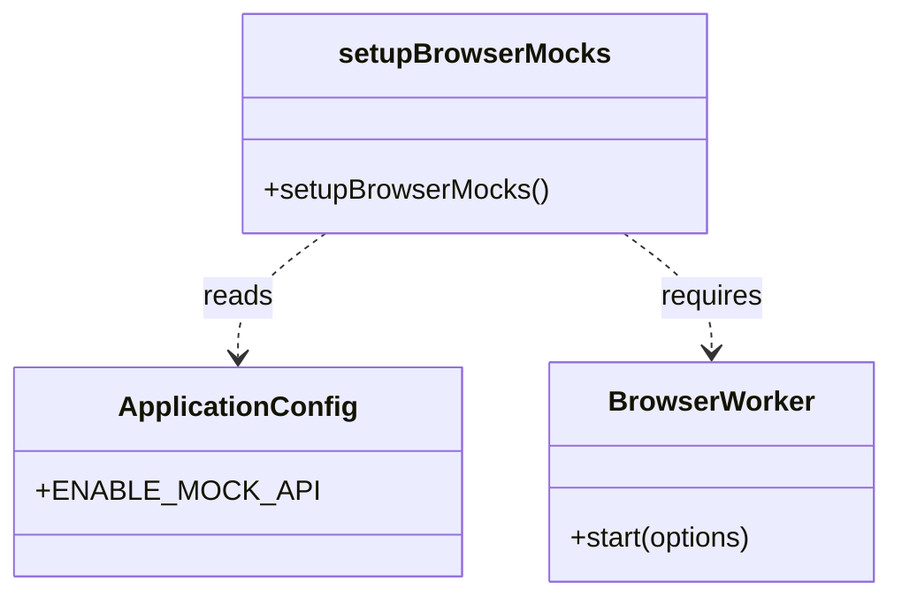

# Diagram: web/portal/src/mocks/setupBrowserMocks.js


> Auto-generated by Obscura crawlers

## Diagram 1



### SVG

<svg id="container" width="487.125" xmlns="http://www.w3.org/2000/svg" class="classDiagram" height="342" viewBox="0 0 487.125 342" role="graphics-document document" aria-roledescription="class"><style>#container{font-family:"trebuchet ms",verdana,arial,sans-serif;font-size:16px;fill:#333;}@keyframes edge-animation-frame{from{stroke-dashoffset:0;}}@keyframes dash{to{stroke-dashoffset:0;}}#container .edge-animation-slow{stroke-dasharray:9,5!important;stroke-dashoffset:900;animation:dash 50s linear infinite;stroke-linecap:round;}#container .edge-animation-fast{stroke-dasharray:9,5!important;stroke-dashoffset:900;animation:dash 20s linear infinite;stroke-linecap:round;}#container .error-icon{fill:#552222;}#container .error-text{fill:#552222;stroke:#552222;}#container .edge-thickness-normal{stroke-width:1px;}#container .edge-thickness-thick{stroke-width:3.5px;}#container .edge-pattern-solid{stroke-dasharray:0;}#container .edge-thickness-invisible{stroke-width:0;fill:none;}#container .edge-pattern-dashed{stroke-dasharray:3;}#container .edge-pattern-dotted{stroke-dasharray:2;}#container .marker{fill:#333333;stroke:#333333;}#container .marker.cross{stroke:#333333;}#container svg{font-family:"trebuchet ms",verdana,arial,sans-serif;font-size:16px;}#container p{margin:0;}#container g.classGroup text{fill:#9370DB;stroke:none;font-family:"trebuchet ms",verdana,arial,sans-serif;font-size:10px;}#container g.classGroup text .title{font-weight:bolder;}#container .nodeLabel,#container .edgeLabel{color:#131300;}#container .edgeLabel .label rect{fill:#ECECFF;}#container .label text{fill:#131300;}#container .labelBkg{background:#ECECFF;}#container .edgeLabel .label span{background:#ECECFF;}#container .classTitle{font-weight:bolder;}#container .node rect,#container .node circle,#container .node ellipse,#container .node polygon,#container .node path{fill:#ECECFF;stroke:#9370DB;stroke-width:1px;}#container .divider{stroke:#9370DB;stroke-width:1;}#container g.clickable{cursor:pointer;}#container g.classGroup rect{fill:#ECECFF;stroke:#9370DB;}#container g.classGroup line{stroke:#9370DB;stroke-width:1;}#container .classLabel .box{stroke:none;stroke-width:0;fill:#ECECFF;opacity:0.5;}#container .classLabel .label{fill:#9370DB;font-size:10px;}#container .relation{stroke:#333333;stroke-width:1;fill:none;}#container .dashed-line{stroke-dasharray:3;}#container .dotted-line{stroke-dasharray:1 2;}#container #compositionStart,#container .composition{fill:#333333!important;stroke:#333333!important;stroke-width:1;}#container #compositionEnd,#container .composition{fill:#333333!important;stroke:#333333!important;stroke-width:1;}#container #dependencyStart,#container .dependency{fill:#333333!important;stroke:#333333!important;stroke-width:1;}#container #dependencyStart,#container .dependency{fill:#333333!important;stroke:#333333!important;stroke-width:1;}#container #extensionStart,#container .extension{fill:transparent!important;stroke:#333333!important;stroke-width:1;}#container #extensionEnd,#container .extension{fill:transparent!important;stroke:#333333!important;stroke-width:1;}#container #aggregationStart,#container .aggregation{fill:transparent!important;stroke:#333333!important;stroke-width:1;}#container #aggregationEnd,#container .aggregation{fill:transparent!important;stroke:#333333!important;stroke-width:1;}#container #lollipopStart,#container .lollipop{fill:#ECECFF!important;stroke:#333333!important;stroke-width:1;}#container #lollipopEnd,#container .lollipop{fill:#ECECFF!important;stroke:#333333!important;stroke-width:1;}#container .edgeTerminals{font-size:11px;line-height:initial;}#container .classTitleText{text-anchor:middle;font-size:18px;fill:#333;}#container .label-icon{display:inline-block;height:1em;overflow:visible;vertical-align:-0.125em;}#container .node .label-icon path{fill:currentColor;stroke:revert;stroke-width:revert;}#container :root{--mermaid-font-family:"trebuchet ms",verdana,arial,sans-serif;}</style><g><defs><marker id="container_class-aggregationStart" class="marker aggregation class" refX="18" refY="7" markerWidth="190" markerHeight="240" orient="auto"><path d="M 18,7 L9,13 L1,7 L9,1 Z"></path></marker></defs><defs><marker id="container_class-aggregationEnd" class="marker aggregation class" refX="1" refY="7" markerWidth="20" markerHeight="28" orient="auto"><path d="M 18,7 L9,13 L1,7 L9,1 Z"></path></marker></defs><defs><marker id="container_class-extensionStart" class="marker extension class" refX="18" refY="7" markerWidth="190" markerHeight="240" orient="auto"><path d="M 1,7 L18,13 V 1 Z"></path></marker></defs><defs><marker id="container_class-extensionEnd" class="marker extension class" refX="1" refY="7" markerWidth="20" markerHeight="28" orient="auto"><path d="M 1,1 V 13 L18,7 Z"></path></marker></defs><defs><marker id="container_class-compositionStart" class="marker composition class" refX="18" refY="7" markerWidth="190" markerHeight="240" orient="auto"><path d="M 18,7 L9,13 L1,7 L9,1 Z"></path></marker></defs><defs><marker id="container_class-compositionEnd" class="marker composition class" refX="1" refY="7" markerWidth="20" markerHeight="28" orient="auto"><path d="M 18,7 L9,13 L1,7 L9,1 Z"></path></marker></defs><defs><marker id="container_class-dependencyStart" class="marker dependency class" refX="6" refY="7" markerWidth="190" markerHeight="240" orient="auto"><path d="M 5,7 L9,13 L1,7 L9,1 Z"></path></marker></defs><defs><marker id="container_class-dependencyEnd" class="marker dependency class" refX="13" refY="7" markerWidth="20" markerHeight="28" orient="auto"><path d="M 18,7 L9,13 L14,7 L9,1 Z"></path></marker></defs><defs><marker id="container_class-lollipopStart" class="marker lollipop class" refX="13" refY="7" markerWidth="190" markerHeight="240" orient="auto"><circle stroke="black" fill="transparent" cx="7" cy="7" r="6"></circle></marker></defs><defs><marker id="container_class-lollipopEnd" class="marker lollipop class" refX="1" refY="7" markerWidth="190" markerHeight="240" orient="auto"><circle stroke="black" fill="transparent" cx="7" cy="7" r="6"></circle></marker></defs><g class="root"><g class="clusters"></g><g class="edgePaths"><path d="M172.739,134L164.705,140.167C156.671,146.333,140.603,158.667,132.569,170.5C124.535,182.333,124.535,193.667,124.535,199.333L124.535,205" id="id_setupBrowserMocks_ApplicationConfig_1" class="edge-thickness-normal edge-pattern-dashed relation" style=";;;" data-edge="true" data-et="edge" data-id="id_setupBrowserMocks_ApplicationConfig_1" data-points="W3sieCI6MTcyLjczOTIxODc1MDAwMDAyLCJ5IjoxMzR9LHsieCI6MTI0LjUzNTE1NjI1LCJ5IjoxNzF9LHsieCI6MTI0LjUzNTE1NjI1LCJ5IjoyMTF9XQ==" marker-end="url(#container_class-dependencyEnd)"></path><path d="M336.894,134L344.928,140.167C352.962,146.333,369.03,158.667,377.064,170C385.098,181.333,385.098,191.667,385.098,196.833L385.098,202" id="id_setupBrowserMocks_BrowserWorker_2" class="edge-thickness-normal edge-pattern-dashed relation" style=";;;" data-edge="true" data-et="edge" data-id="id_setupBrowserMocks_BrowserWorker_2" data-points="W3sieCI6MzM2Ljg5MzU5Mzc1LCJ5IjoxMzR9LHsieCI6Mzg1LjA5NzY1NjI1LCJ5IjoxNzF9LHsieCI6Mzg1LjA5NzY1NjI1LCJ5IjoyMDh9XQ==" marker-end="url(#container_class-dependencyEnd)"></path></g><g class="edgeLabels"><g class="edgeLabel" transform="translate(124.53515625, 171)"><g class="label" data-id="id_setupBrowserMocks_ApplicationConfig_1" transform="translate(-20.0078125, -12)"><foreignObject width="40.015625" height="24"><div xmlns="http://www.w3.org/1999/xhtml" class="labelBkg" style="display: table-cell; white-space: nowrap; line-height: 1.5; max-width: 200px; text-align: center;"><span class="edgeLabel"><p>reads</p></span></div></foreignObject></g></g><g class="edgeLabel" transform="translate(385.09765625, 171)"><g class="label" data-id="id_setupBrowserMocks_BrowserWorker_2" transform="translate(-29.8515625, -12)"><foreignObject width="59.703125" height="24"><div xmlns="http://www.w3.org/1999/xhtml" class="labelBkg" style="display: table-cell; white-space: nowrap; line-height: 1.5; max-width: 200px; text-align: center;"><span class="edgeLabel"><p>requires</p></span></div></foreignObject></g></g></g><g class="nodes"><g class="node default" id="classId-setupBrowserMocks-0" transform="translate(254.81640625, 71)"><g class="basic label-container"><path d="M-130.296875 -63 L130.296875 -63 L130.296875 63 L-130.296875 63" stroke="none" stroke-width="0" fill="#ECECFF" style=""></path><path d="M-130.296875 -63 C-57.28664769214207 -63, 15.723579615715863 -63, 130.296875 -63 M-130.296875 -63 C-34.10577170915347 -63, 62.085331581693055 -63, 130.296875 -63 M130.296875 -63 C130.296875 -30.60756727514879, 130.296875 1.7848654497024228, 130.296875 63 M130.296875 -63 C130.296875 -13.016457459357028, 130.296875 36.967085081285944, 130.296875 63 M130.296875 63 C57.67427733495744 63, -14.948320330085124 63, -130.296875 63 M130.296875 63 C55.39400422956618 63, -19.508866540867643 63, -130.296875 63 M-130.296875 63 C-130.296875 18.79536942764276, -130.296875 -25.409261144714478, -130.296875 -63 M-130.296875 63 C-130.296875 25.839236852007502, -130.296875 -11.321526295984995, -130.296875 -63" stroke="#9370DB" stroke-width="1.3" fill="none" stroke-dasharray="0 0" style=""></path></g><g class="annotation-group text" transform="translate(0, -39)"></g><g class="label-group text" transform="translate(-73.8125, -39)"><g class="label" style="font-weight: bolder" transform="translate(0,-12)"><foreignObject width="147.625" height="24"><div xmlns="http://www.w3.org/1999/xhtml" style="display: table-cell; white-space: nowrap; line-height: 1.5; max-width: 194px; text-align: center;"><span class="nodeLabel markdown-node-label" style=""><p>setupBrowserMocks</p></span></div></foreignObject></g></g><g class="members-group text" transform="translate(-118.296875, 9)"></g><g class="methods-group text" transform="translate(-118.296875, 39)"><g class="label" style="" transform="translate(0,-12)"><foreignObject width="162.78125" height="24"><div xmlns="http://www.w3.org/1999/xhtml" style="display: table-cell; white-space: nowrap; line-height: 1.5; max-width: 220px; text-align: center;"><span class="nodeLabel markdown-node-label" style=""><p>+setupBrowserMocks()</p></span></div></foreignObject></g></g><g class="divider" style=""><path d="M-130.296875 -15 C-71.34734990701514 -15, -12.397824814030287 -15, 130.296875 -15 M-130.296875 -15 C-52.99745943206405 -15, 24.301956135871905 -15, 130.296875 -15" stroke="#9370DB" stroke-width="1.3" fill="none" stroke-dasharray="0 0" style=""></path></g><g class="divider" style=""><path d="M-130.296875 9 C-63.383262887930286 9, 3.530349224139428 9, 130.296875 9 M-130.296875 9 C-49.093465054888426 9, 32.10994489022315 9, 130.296875 9" stroke="#9370DB" stroke-width="1.3" fill="none" stroke-dasharray="0 0" style=""></path></g></g><g class="node default" id="classId-ApplicationConfig-1" transform="translate(124.53515625, 271)"><g class="basic label-container"><path d="M-116.53515625 -60 L116.53515625 -60 L116.53515625 60 L-116.53515625 60" stroke="none" stroke-width="0" fill="#ECECFF" style=""></path><path d="M-116.53515625 -60 C-55.45573802435398 -60, 5.623680201292046 -60, 116.53515625 -60 M-116.53515625 -60 C-57.32622684128395 -60, 1.882702567432105 -60, 116.53515625 -60 M116.53515625 -60 C116.53515625 -25.51491886217665, 116.53515625 8.9701622756467, 116.53515625 60 M116.53515625 -60 C116.53515625 -30.024811351210936, 116.53515625 -0.04962270242187117, 116.53515625 60 M116.53515625 60 C49.945591058117486 60, -16.643974133765028 60, -116.53515625 60 M116.53515625 60 C39.48576880243742 60, -37.56361864512516 60, -116.53515625 60 M-116.53515625 60 C-116.53515625 15.892475229325903, -116.53515625 -28.215049541348193, -116.53515625 -60 M-116.53515625 60 C-116.53515625 18.569626232306668, -116.53515625 -22.860747535386665, -116.53515625 -60" stroke="#9370DB" stroke-width="1.3" fill="none" stroke-dasharray="0 0" style=""></path></g><g class="annotation-group text" transform="translate(0, -36)"></g><g class="label-group text" transform="translate(-64.6015625, -36)"><g class="label" style="font-weight: bolder" transform="translate(0,-12)"><foreignObject width="129.203125" height="24"><div xmlns="http://www.w3.org/1999/xhtml" style="display: table-cell; white-space: nowrap; line-height: 1.5; max-width: 178px; text-align: center;"><span class="nodeLabel markdown-node-label" style=""><p>ApplicationConfig</p></span></div></foreignObject></g></g><g class="members-group text" transform="translate(-104.53515625, 12)"><g class="label" style="" transform="translate(0,-12)"><foreignObject width="144.46875" height="24"><div xmlns="http://www.w3.org/1999/xhtml" style="display: table-cell; white-space: nowrap; line-height: 1.5; max-width: 202px; text-align: center;"><span class="nodeLabel markdown-node-label" style=""><p>+ENABLE_MOCK_API</p></span></div></foreignObject></g></g><g class="methods-group text" transform="translate(-104.53515625, 60)"></g><g class="divider" style=""><path d="M-116.53515625 -12 C-49.92705722347313 -12, 16.681041803053745 -12, 116.53515625 -12 M-116.53515625 -12 C-58.83811656385038 -12, -1.1410768777007547 -12, 116.53515625 -12" stroke="#9370DB" stroke-width="1.3" fill="none" stroke-dasharray="0 0" style=""></path></g><g class="divider" style=""><path d="M-116.53515625 36 C-61.16310973624534 36, -5.791063222490678 36, 116.53515625 36 M-116.53515625 36 C-28.886450637557132 36, 58.762254974885735 36, 116.53515625 36" stroke="#9370DB" stroke-width="1.3" fill="none" stroke-dasharray="0 0" style=""></path></g></g><g class="node default" id="classId-BrowserWorker-2" transform="translate(385.09765625, 271)"><g class="basic label-container"><path d="M-94.02734375 -63 L94.02734375 -63 L94.02734375 63 L-94.02734375 63" stroke="none" stroke-width="0" fill="#ECECFF" style=""></path><path d="M-94.02734375 -63 C-22.124940146875772 -63, 49.777463456248455 -63, 94.02734375 -63 M-94.02734375 -63 C-26.417051581266563 -63, 41.193240587466875 -63, 94.02734375 -63 M94.02734375 -63 C94.02734375 -33.213421010578784, 94.02734375 -3.4268420211575616, 94.02734375 63 M94.02734375 -63 C94.02734375 -31.519749648443483, 94.02734375 -0.03949929688696585, 94.02734375 63 M94.02734375 63 C41.27759889201996 63, -11.472145965960081 63, -94.02734375 63 M94.02734375 63 C47.696287427461606 63, 1.365231104923211 63, -94.02734375 63 M-94.02734375 63 C-94.02734375 20.998356615260683, -94.02734375 -21.003286769478635, -94.02734375 -63 M-94.02734375 63 C-94.02734375 19.96349089778645, -94.02734375 -23.0730182044271, -94.02734375 -63" stroke="#9370DB" stroke-width="1.3" fill="none" stroke-dasharray="0 0" style=""></path></g><g class="annotation-group text" transform="translate(0, -39)"></g><g class="label-group text" transform="translate(-56.5703125, -39)"><g class="label" style="font-weight: bolder" transform="translate(0,-12)"><foreignObject width="113.140625" height="24"><div xmlns="http://www.w3.org/1999/xhtml" style="display: table-cell; white-space: nowrap; line-height: 1.5; max-width: 161px; text-align: center;"><span class="nodeLabel markdown-node-label" style=""><p>BrowserWorker</p></span></div></foreignObject></g></g><g class="members-group text" transform="translate(-82.02734375, 9)"></g><g class="methods-group text" transform="translate(-82.02734375, 39)"><g class="label" style="" transform="translate(0,-12)"><foreignObject width="107.484375" height="24"><div xmlns="http://www.w3.org/1999/xhtml" style="display: table-cell; white-space: nowrap; line-height: 1.5; max-width: 165px; text-align: center;"><span class="nodeLabel markdown-node-label" style=""><p>+start(options)</p></span></div></foreignObject></g></g><g class="divider" style=""><path d="M-94.02734375 -15 C-28.839533371872008 -15, 36.348277006255984 -15, 94.02734375 -15 M-94.02734375 -15 C-46.76137506354417 -15, 0.5045936229116563 -15, 94.02734375 -15" stroke="#9370DB" stroke-width="1.3" fill="none" stroke-dasharray="0 0" style=""></path></g><g class="divider" style=""><path d="M-94.02734375 9 C-43.36188662306561 9, 7.303570503868784 9, 94.02734375 9 M-94.02734375 9 C-36.169659520436376 9, 21.688024709127248 9, 94.02734375 9" stroke="#9370DB" stroke-width="1.3" fill="none" stroke-dasharray="0 0" style=""></path></g></g></g></g></g></svg>

## Diagram 2

```mermaid
flowchart TD
Start([setupBrowserMocks invoked]) --> CheckEnv{process.env.NODE_ENV == development}
CheckEnv -- Yes --> CheckConfig{ApplicationConfig.ENABLE_MOCK_API == true}
CheckEnv -- No --> EndNoMocks([No mocks started])
CheckConfig -- Yes --> RequireBrowser[Require ./utils/browser (const { worker })]
CheckConfig -- No --> EndNoMocks
RequireBrowser --> WorkerStart[worker.start(onUnhandledRequest=bypass)]
WorkerStart --> EndMocks([Mocks started])
```

> SVG rendering failed for this diagram.
