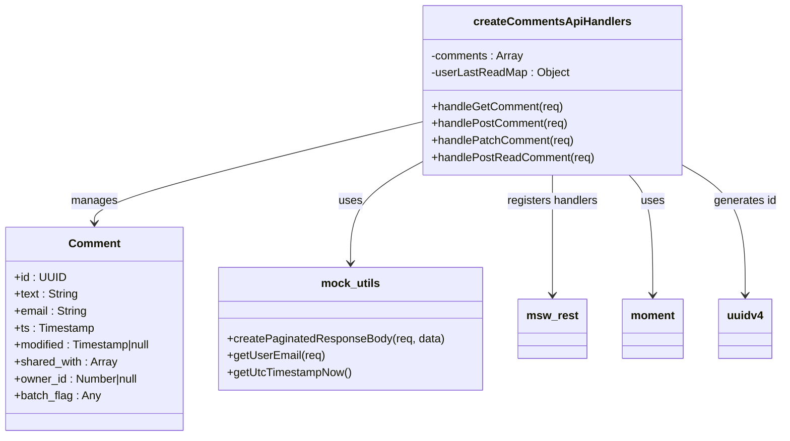
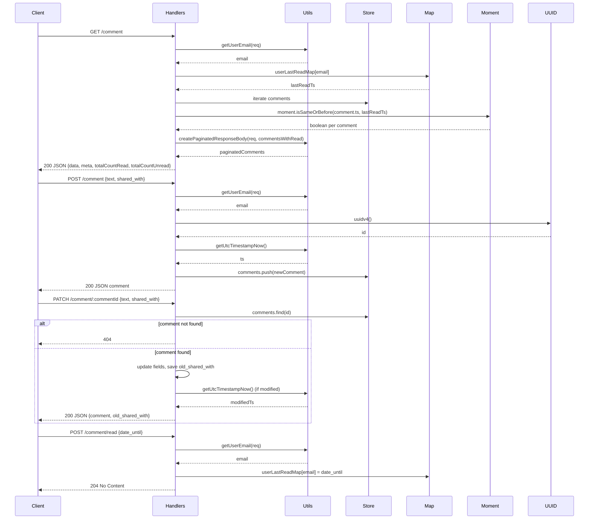

# Diagram: web/portal/src/mocks/utils/createCommentsApiHandlers.js


> Auto-generated by Obscura crawlers

## Diagram 1



### SVG

<svg id="container" width="1104.28125" xmlns="http://www.w3.org/2000/svg" class="classDiagram" height="618" viewBox="0 0 1104.28125 618" role="graphics-document document" aria-roledescription="class"><style>#container{font-family:"trebuchet ms",verdana,arial,sans-serif;font-size:16px;fill:#333;}@keyframes edge-animation-frame{from{stroke-dashoffset:0;}}@keyframes dash{to{stroke-dashoffset:0;}}#container .edge-animation-slow{stroke-dasharray:9,5!important;stroke-dashoffset:900;animation:dash 50s linear infinite;stroke-linecap:round;}#container .edge-animation-fast{stroke-dasharray:9,5!important;stroke-dashoffset:900;animation:dash 20s linear infinite;stroke-linecap:round;}#container .error-icon{fill:#552222;}#container .error-text{fill:#552222;stroke:#552222;}#container .edge-thickness-normal{stroke-width:1px;}#container .edge-thickness-thick{stroke-width:3.5px;}#container .edge-pattern-solid{stroke-dasharray:0;}#container .edge-thickness-invisible{stroke-width:0;fill:none;}#container .edge-pattern-dashed{stroke-dasharray:3;}#container .edge-pattern-dotted{stroke-dasharray:2;}#container .marker{fill:#333333;stroke:#333333;}#container .marker.cross{stroke:#333333;}#container svg{font-family:"trebuchet ms",verdana,arial,sans-serif;font-size:16px;}#container p{margin:0;}#container g.classGroup text{fill:#9370DB;stroke:none;font-family:"trebuchet ms",verdana,arial,sans-serif;font-size:10px;}#container g.classGroup text .title{font-weight:bolder;}#container .nodeLabel,#container .edgeLabel{color:#131300;}#container .edgeLabel .label rect{fill:#ECECFF;}#container .label text{fill:#131300;}#container .labelBkg{background:#ECECFF;}#container .edgeLabel .label span{background:#ECECFF;}#container .classTitle{font-weight:bolder;}#container .node rect,#container .node circle,#container .node ellipse,#container .node polygon,#container .node path{fill:#ECECFF;stroke:#9370DB;stroke-width:1px;}#container .divider{stroke:#9370DB;stroke-width:1;}#container g.clickable{cursor:pointer;}#container g.classGroup rect{fill:#ECECFF;stroke:#9370DB;}#container g.classGroup line{stroke:#9370DB;stroke-width:1;}#container .classLabel .box{stroke:none;stroke-width:0;fill:#ECECFF;opacity:0.5;}#container .classLabel .label{fill:#9370DB;font-size:10px;}#container .relation{stroke:#333333;stroke-width:1;fill:none;}#container .dashed-line{stroke-dasharray:3;}#container .dotted-line{stroke-dasharray:1 2;}#container #compositionStart,#container .composition{fill:#333333!important;stroke:#333333!important;stroke-width:1;}#container #compositionEnd,#container .composition{fill:#333333!important;stroke:#333333!important;stroke-width:1;}#container #dependencyStart,#container .dependency{fill:#333333!important;stroke:#333333!important;stroke-width:1;}#container #dependencyStart,#container .dependency{fill:#333333!important;stroke:#333333!important;stroke-width:1;}#container #extensionStart,#container .extension{fill:transparent!important;stroke:#333333!important;stroke-width:1;}#container #extensionEnd,#container .extension{fill:transparent!important;stroke:#333333!important;stroke-width:1;}#container #aggregationStart,#container .aggregation{fill:transparent!important;stroke:#333333!important;stroke-width:1;}#container #aggregationEnd,#container .aggregation{fill:transparent!important;stroke:#333333!important;stroke-width:1;}#container #lollipopStart,#container .lollipop{fill:#ECECFF!important;stroke:#333333!important;stroke-width:1;}#container #lollipopEnd,#container .lollipop{fill:#ECECFF!important;stroke:#333333!important;stroke-width:1;}#container .edgeTerminals{font-size:11px;line-height:initial;}#container .classTitleText{text-anchor:middle;font-size:18px;fill:#333;}#container .label-icon{display:inline-block;height:1em;overflow:visible;vertical-align:-0.125em;}#container .node .label-icon path{fill:currentColor;stroke:revert;stroke-width:revert;}#container :root{--mermaid-font-family:"trebuchet ms",verdana,arial,sans-serif;}</style><g><defs><marker id="container_class-aggregationStart" class="marker aggregation class" refX="18" refY="7" markerWidth="190" markerHeight="240" orient="auto"><path d="M 18,7 L9,13 L1,7 L9,1 Z"></path></marker></defs><defs><marker id="container_class-aggregationEnd" class="marker aggregation class" refX="1" refY="7" markerWidth="20" markerHeight="28" orient="auto"><path d="M 18,7 L9,13 L1,7 L9,1 Z"></path></marker></defs><defs><marker id="container_class-extensionStart" class="marker extension class" refX="18" refY="7" markerWidth="190" markerHeight="240" orient="auto"><path d="M 1,7 L18,13 V 1 Z"></path></marker></defs><defs><marker id="container_class-extensionEnd" class="marker extension class" refX="1" refY="7" markerWidth="20" markerHeight="28" orient="auto"><path d="M 1,1 V 13 L18,7 Z"></path></marker></defs><defs><marker id="container_class-compositionStart" class="marker composition class" refX="18" refY="7" markerWidth="190" markerHeight="240" orient="auto"><path d="M 18,7 L9,13 L1,7 L9,1 Z"></path></marker></defs><defs><marker id="container_class-compositionEnd" class="marker composition class" refX="1" refY="7" markerWidth="20" markerHeight="28" orient="auto"><path d="M 18,7 L9,13 L1,7 L9,1 Z"></path></marker></defs><defs><marker id="container_class-dependencyStart" class="marker dependency class" refX="6" refY="7" markerWidth="190" markerHeight="240" orient="auto"><path d="M 5,7 L9,13 L1,7 L9,1 Z"></path></marker></defs><defs><marker id="container_class-dependencyEnd" class="marker dependency class" refX="13" refY="7" markerWidth="20" markerHeight="28" orient="auto"><path d="M 18,7 L9,13 L14,7 L9,1 Z"></path></marker></defs><defs><marker id="container_class-lollipopStart" class="marker lollipop class" refX="13" refY="7" markerWidth="190" markerHeight="240" orient="auto"><circle stroke="black" fill="transparent" cx="7" cy="7" r="6"></circle></marker></defs><defs><marker id="container_class-lollipopEnd" class="marker lollipop class" refX="1" refY="7" markerWidth="190" markerHeight="240" orient="auto"><circle stroke="black" fill="transparent" cx="7" cy="7" r="6"></circle></marker></defs><g class="root"><g class="clusters"></g><g class="edgePaths"><path d="M603.508,171.707L525.796,190.589C448.085,209.472,292.661,247.236,214.95,271.285C137.238,295.333,137.238,305.667,137.238,310.833L137.238,316" id="id_createCommentsApiHandlers_Comment_1" class="edge-thickness-normal edge-pattern-solid relation" style=";;;" data-edge="true" data-et="edge" data-id="id_createCommentsApiHandlers_Comment_1" data-points="W3sieCI6NjAzLjUwNzgxMjUsInkiOjE3MS43MDczNDIxMzk0Njc0fSx7IngiOjEzNy4yMzgyODEyNSwieSI6Mjg1fSx7IngiOjEzNy4yMzgyODEyNSwieSI6MzIyfV0=" marker-end="url(#container_class-dependencyEnd)"></path><path d="M603.508,228.184L586.505,237.653C569.503,247.122,535.497,266.061,518.495,290.197C501.492,314.333,501.492,343.667,501.492,358.333L501.492,373" id="id_createCommentsApiHandlers_mock_utils_2" class="edge-thickness-normal edge-pattern-solid relation" style=";;;" data-edge="true" data-et="edge" data-id="id_createCommentsApiHandlers_mock_utils_2" data-points="W3sieCI6NjAzLjUwNzgxMjUsInkiOjIyOC4xODM2MDQ0Njc0Nzc3OH0seyJ4Ijo1MDEuNDkyMTg3NSwieSI6Mjg1fSx7IngiOjUwMS40OTIxODc1LCJ5IjozNzl9XQ==" marker-end="url(#container_class-dependencyEnd)"></path><path d="M783.391,248L783.391,254.167C783.391,260.333,783.391,272.667,783.391,301C783.391,329.333,783.391,373.667,783.391,395.833L783.391,418" id="id_createCommentsApiHandlers_msw_rest_3" class="edge-thickness-normal edge-pattern-solid relation" style=";;;" data-edge="true" data-et="edge" data-id="id_createCommentsApiHandlers_msw_rest_3" data-points="W3sieCI6NzgzLjM5MDYyNSwieSI6MjQ4fSx7IngiOjc4My4zOTA2MjUsInkiOjI4NX0seyJ4Ijo3ODMuMzkwNjI1LCJ5Ijo0MjR9XQ==" marker-end="url(#container_class-dependencyEnd)"></path><path d="M889.782,248L895.249,254.167C900.717,260.333,911.651,272.667,917.119,301C922.586,329.333,922.586,373.667,922.586,395.833L922.586,418" id="id_createCommentsApiHandlers_moment_4" class="edge-thickness-normal edge-pattern-solid relation" style=";;;" data-edge="true" data-et="edge" data-id="id_createCommentsApiHandlers_moment_4" data-points="W3sieCI6ODg5Ljc4MTk0NjY1NjA1MSwieSI6MjQ4fSx7IngiOjkyMi41ODU5Mzc1LCJ5IjoyODV9LHsieCI6OTIyLjU4NTkzNzUsInkiOjQyNH1d" marker-end="url(#container_class-dependencyEnd)"></path><path d="M963.273,233.275L978.004,241.896C992.734,250.517,1022.195,267.758,1036.926,298.546C1051.656,329.333,1051.656,373.667,1051.656,395.833L1051.656,418" id="id_createCommentsApiHandlers_uuidv4_5" class="edge-thickness-normal edge-pattern-solid relation" style=";;;" data-edge="true" data-et="edge" data-id="id_createCommentsApiHandlers_uuidv4_5" data-points="W3sieCI6OTYzLjI3MzQzNzUsInkiOjIzMy4yNzQ3Njg0NzgwNzA5NH0seyJ4IjoxMDUxLjY1NjI1LCJ5IjoyODV9LHsieCI6MTA1MS42NTYyNSwieSI6NDI0fV0=" marker-end="url(#container_class-dependencyEnd)"></path></g><g class="edgeLabels"><g class="edgeLabel" transform="translate(137.23828125, 285)"><g class="label" data-id="id_createCommentsApiHandlers_Comment_1" transform="translate(-32.296875, -12)"><foreignObject width="64.59375" height="24"><div xmlns="http://www.w3.org/1999/xhtml" class="labelBkg" style="display: table-cell; white-space: nowrap; line-height: 1.5; max-width: 200px; text-align: center;"><span class="edgeLabel"><p>manages</p></span></div></foreignObject></g></g><g class="edgeLabel" transform="translate(501.4921875, 285)"><g class="label" data-id="id_createCommentsApiHandlers_mock_utils_2" transform="translate(-16.4921875, -12)"><foreignObject width="32.984375" height="24"><div xmlns="http://www.w3.org/1999/xhtml" class="labelBkg" style="display: table-cell; white-space: nowrap; line-height: 1.5; max-width: 200px; text-align: center;"><span class="edgeLabel"><p>uses</p></span></div></foreignObject></g></g><g class="edgeLabel" transform="translate(783.390625, 285)"><g class="label" data-id="id_createCommentsApiHandlers_msw_rest_3" transform="translate(-65.1953125, -12)"><foreignObject width="130.390625" height="24"><div xmlns="http://www.w3.org/1999/xhtml" class="labelBkg" style="display: table-cell; white-space: nowrap; line-height: 1.5; max-width: 200px; text-align: center;"><span class="edgeLabel"><p>registers handlers</p></span></div></foreignObject></g></g><g class="edgeLabel" transform="translate(922.5859375, 285)"><g class="label" data-id="id_createCommentsApiHandlers_moment_4" transform="translate(-16.4921875, -12)"><foreignObject width="32.984375" height="24"><div xmlns="http://www.w3.org/1999/xhtml" class="labelBkg" style="display: table-cell; white-space: nowrap; line-height: 1.5; max-width: 200px; text-align: center;"><span class="edgeLabel"><p>uses</p></span></div></foreignObject></g></g><g class="edgeLabel" transform="translate(1051.65625, 285)"><g class="label" data-id="id_createCommentsApiHandlers_uuidv4_5" transform="translate(-44.625, -12)"><foreignObject width="89.25" height="24"><div xmlns="http://www.w3.org/1999/xhtml" class="labelBkg" style="display: table-cell; white-space: nowrap; line-height: 1.5; max-width: 200px; text-align: center;"><span class="edgeLabel"><p>generates id</p></span></div></foreignObject></g></g></g><g class="nodes"><g class="node default" id="classId-createCommentsApiHandlers-0" transform="translate(783.390625, 128)"><g class="basic label-container"><path d="M-179.8828125 -120 L179.8828125 -120 L179.8828125 120 L-179.8828125 120" stroke="none" stroke-width="0" fill="#ECECFF" style=""></path><path d="M-179.8828125 -120 C-61.85206270293496 -120, 56.17868709413008 -120, 179.8828125 -120 M-179.8828125 -120 C-69.05101711827825 -120, 41.780778263443494 -120, 179.8828125 -120 M179.8828125 -120 C179.8828125 -32.24265298834099, 179.8828125 55.514694023318015, 179.8828125 120 M179.8828125 -120 C179.8828125 -44.36749961222445, 179.8828125 31.2650007755511, 179.8828125 120 M179.8828125 120 C78.36293069896332 120, -23.15695110207335 120, -179.8828125 120 M179.8828125 120 C73.40816679979427 120, -33.066478900411454 120, -179.8828125 120 M-179.8828125 120 C-179.8828125 31.72692377236163, -179.8828125 -56.54615245527674, -179.8828125 -120 M-179.8828125 120 C-179.8828125 58.776153818223534, -179.8828125 -2.4476923635529317, -179.8828125 -120" stroke="#9370DB" stroke-width="1.3" fill="none" stroke-dasharray="0 0" style=""></path></g><g class="annotation-group text" transform="translate(0, -96)"></g><g class="label-group text" transform="translate(-106.109375, -96)"><g class="label" style="font-weight: bolder" transform="translate(0,-12)"><foreignObject width="212.21875" height="24"><div xmlns="http://www.w3.org/1999/xhtml" style="display: table-cell; white-space: nowrap; line-height: 1.5; max-width: 260px; text-align: center;"><span class="nodeLabel markdown-node-label" style=""><p>createCommentsApiHandlers</p></span></div></foreignObject></g></g><g class="members-group text" transform="translate(-167.8828125, -48)"><g class="label" style="" transform="translate(0,-12)"><foreignObject width="131.515625" height="24"><div xmlns="http://www.w3.org/1999/xhtml" style="display: table-cell; white-space: nowrap; line-height: 1.5; max-width: 189px; text-align: center;"><span class="nodeLabel markdown-node-label" style=""><p>-comments : Array</p></span></div></foreignObject></g><g class="label" style="" transform="translate(0,12)"><foreignObject width="194.1875" height="24"><div xmlns="http://www.w3.org/1999/xhtml" style="display: table-cell; white-space: nowrap; line-height: 1.5; max-width: 252px; text-align: center;"><span class="nodeLabel markdown-node-label" style=""><p>-userLastReadMap : Object</p></span></div></foreignObject></g></g><g class="methods-group text" transform="translate(-167.8828125, 24)"><g class="label" style="" transform="translate(0,-12)"><foreignObject width="186.5625" height="24"><div xmlns="http://www.w3.org/1999/xhtml" style="display: table-cell; white-space: nowrap; line-height: 1.5; max-width: 244px; text-align: center;"><span class="nodeLabel markdown-node-label" style=""><p>+handleGetComment(req)</p></span></div></foreignObject></g><g class="label" style="" transform="translate(0,12)"><foreignObject width="193.390625" height="24"><div xmlns="http://www.w3.org/1999/xhtml" style="display: table-cell; white-space: nowrap; line-height: 1.5; max-width: 251px; text-align: center;"><span class="nodeLabel markdown-node-label" style=""><p>+handlePostComment(req)</p></span></div></foreignObject></g><g class="label" style="" transform="translate(0,36)"><foreignObject width="201.65625" height="24"><div xmlns="http://www.w3.org/1999/xhtml" style="display: table-cell; white-space: nowrap; line-height: 1.5; max-width: 259px; text-align: center;"><span class="nodeLabel markdown-node-label" style=""><p>+handlePatchComment(req)</p></span></div></foreignObject></g><g class="label" style="" transform="translate(0,60)"><foreignObject width="229.65625" height="24"><div xmlns="http://www.w3.org/1999/xhtml" style="display: table-cell; white-space: nowrap; line-height: 1.5; max-width: 287px; text-align: center;"><span class="nodeLabel markdown-node-label" style=""><p>+handlePostReadComment(req)</p></span></div></foreignObject></g></g><g class="divider" style=""><path d="M-179.8828125 -72 C-48.12286238250937 -72, 83.63708773498126 -72, 179.8828125 -72 M-179.8828125 -72 C-101.67240698042933 -72, -23.46200146085866 -72, 179.8828125 -72" stroke="#9370DB" stroke-width="1.3" fill="none" stroke-dasharray="0 0" style=""></path></g><g class="divider" style=""><path d="M-179.8828125 0 C-87.82240214756712 0, 4.238008204865764 0, 179.8828125 0 M-179.8828125 0 C-63.71569426941468 0, 52.45142396117063 0, 179.8828125 0" stroke="#9370DB" stroke-width="1.3" fill="none" stroke-dasharray="0 0" style=""></path></g></g><g class="node default" id="classId-Comment-1" transform="translate(137.23828125, 466)"><g class="basic label-container"><path d="M-129.23828125 -144 L129.23828125 -144 L129.23828125 144 L-129.23828125 144" stroke="none" stroke-width="0" fill="#ECECFF" style=""></path><path d="M-129.23828125 -144 C-38.81350675942001 -144, 51.611267731159984 -144, 129.23828125 -144 M-129.23828125 -144 C-55.93737804756023 -144, 17.36352515487954 -144, 129.23828125 -144 M129.23828125 -144 C129.23828125 -52.19166288218554, 129.23828125 39.61667423562892, 129.23828125 144 M129.23828125 -144 C129.23828125 -83.50714322288229, 129.23828125 -23.01428644576457, 129.23828125 144 M129.23828125 144 C38.21095386066324 144, -52.81637352867352 144, -129.23828125 144 M129.23828125 144 C42.24151582312027 144, -44.75524960375947 144, -129.23828125 144 M-129.23828125 144 C-129.23828125 71.47321392066333, -129.23828125 -1.0535721586733473, -129.23828125 -144 M-129.23828125 144 C-129.23828125 80.78582291129268, -129.23828125 17.571645822585353, -129.23828125 -144" stroke="#9370DB" stroke-width="1.3" fill="none" stroke-dasharray="0 0" style=""></path></g><g class="annotation-group text" transform="translate(0, -120)"></g><g class="label-group text" transform="translate(-34.7578125, -120)"><g class="label" style="font-weight: bolder" transform="translate(0,-12)"><foreignObject width="69.515625" height="24"><div xmlns="http://www.w3.org/1999/xhtml" style="display: table-cell; white-space: nowrap; line-height: 1.5; max-width: 120px; text-align: center;"><span class="nodeLabel markdown-node-label" style=""><p>Comment</p></span></div></foreignObject></g></g><g class="members-group text" transform="translate(-117.23828125, -72)"><g class="label" style="" transform="translate(0,-12)"><foreignObject width="70.59375" height="24"><div xmlns="http://www.w3.org/1999/xhtml" style="display: table-cell; white-space: nowrap; line-height: 1.5; max-width: 128px; text-align: center;"><span class="nodeLabel markdown-node-label" style=""><p>+id : UUID</p></span></div></foreignObject></g><g class="label" style="" transform="translate(0,12)"><foreignObject width="90.765625" height="24"><div xmlns="http://www.w3.org/1999/xhtml" style="display: table-cell; white-space: nowrap; line-height: 1.5; max-width: 149px; text-align: center;"><span class="nodeLabel markdown-node-label" style=""><p>+text : String</p></span></div></foreignObject></g><g class="label" style="" transform="translate(0,36)"><foreignObject width="103.53125" height="24"><div xmlns="http://www.w3.org/1999/xhtml" style="display: table-cell; white-space: nowrap; line-height: 1.5; max-width: 162px; text-align: center;"><span class="nodeLabel markdown-node-label" style=""><p>+email : String</p></span></div></foreignObject></g><g class="label" style="" transform="translate(0,60)"><foreignObject width="113.75" height="24"><div xmlns="http://www.w3.org/1999/xhtml" style="display: table-cell; white-space: nowrap; line-height: 1.5; max-width: 171px; text-align: center;"><span class="nodeLabel markdown-node-label" style=""><p>+ts : Timestamp</p></span></div></foreignObject></g><g class="label" style="" transform="translate(0,84)"><foreignObject width="199.71875" height="24"><div xmlns="http://www.w3.org/1999/xhtml" style="display: table-cell; white-space: nowrap; line-height: 1.5; max-width: 257px; text-align: center;"><span class="nodeLabel markdown-node-label" style=""><p>+modified : Timestamp|null</p></span></div></foreignObject></g><g class="label" style="" transform="translate(0,108)"><foreignObject width="146.28125" height="24"><div xmlns="http://www.w3.org/1999/xhtml" style="display: table-cell; white-space: nowrap; line-height: 1.5; max-width: 204px; text-align: center;"><span class="nodeLabel markdown-node-label" style=""><p>+shared_with : Array</p></span></div></foreignObject></g><g class="label" style="" transform="translate(0,132)"><foreignObject width="179.390625" height="24"><div xmlns="http://www.w3.org/1999/xhtml" style="display: table-cell; white-space: nowrap; line-height: 1.5; max-width: 237px; text-align: center;"><span class="nodeLabel markdown-node-label" style=""><p>+owner_id : Number|null</p></span></div></foreignObject></g><g class="label" style="" transform="translate(0,156)"><foreignObject width="121.484375" height="24"><div xmlns="http://www.w3.org/1999/xhtml" style="display: table-cell; white-space: nowrap; line-height: 1.5; max-width: 179px; text-align: center;"><span class="nodeLabel markdown-node-label" style=""><p>+batch_flag : Any</p></span></div></foreignObject></g></g><g class="methods-group text" transform="translate(-117.23828125, 144)"></g><g class="divider" style=""><path d="M-129.23828125 -96 C-62.417160542340994 -96, 4.403960165318011 -96, 129.23828125 -96 M-129.23828125 -96 C-69.80087855804086 -96, -10.363475866081714 -96, 129.23828125 -96" stroke="#9370DB" stroke-width="1.3" fill="none" stroke-dasharray="0 0" style=""></path></g><g class="divider" style=""><path d="M-129.23828125 120 C-52.588457626190205 120, 24.06136599761959 120, 129.23828125 120 M-129.23828125 120 C-60.900921926617826 120, 7.436437396764347 120, 129.23828125 120" stroke="#9370DB" stroke-width="1.3" fill="none" stroke-dasharray="0 0" style=""></path></g></g><g class="node default" id="classId-mock_utils-2" transform="translate(501.4921875, 466)"><g class="basic label-container"><path d="M-185.015625 -87 L185.015625 -87 L185.015625 87 L-185.015625 87" stroke="none" stroke-width="0" fill="#ECECFF" style=""></path><path d="M-185.015625 -87 C-61.466736753274404 -87, 62.08215149345119 -87, 185.015625 -87 M-185.015625 -87 C-107.80583629827052 -87, -30.59604759654104 -87, 185.015625 -87 M185.015625 -87 C185.015625 -27.589334303236058, 185.015625 31.821331393527885, 185.015625 87 M185.015625 -87 C185.015625 -26.741771105137254, 185.015625 33.51645778972549, 185.015625 87 M185.015625 87 C94.13134644027744 87, 3.24706788055488 87, -185.015625 87 M185.015625 87 C89.86510304140212 87, -5.285418917195756 87, -185.015625 87 M-185.015625 87 C-185.015625 49.080153552246045, -185.015625 11.160307104492091, -185.015625 -87 M-185.015625 87 C-185.015625 20.32784687827406, -185.015625 -46.34430624345188, -185.015625 -87" stroke="#9370DB" stroke-width="1.3" fill="none" stroke-dasharray="0 0" style=""></path></g><g class="annotation-group text" transform="translate(0, -63)"></g><g class="label-group text" transform="translate(-39.84375, -63)"><g class="label" style="font-weight: bolder" transform="translate(0,-12)"><foreignObject width="79.6875" height="24"><div xmlns="http://www.w3.org/1999/xhtml" style="display: table-cell; white-space: nowrap; line-height: 1.5; max-width: 129px; text-align: center;"><span class="nodeLabel markdown-node-label" style=""><p>mock_utils</p></span></div></foreignObject></g></g><g class="members-group text" transform="translate(-173.015625, -15)"></g><g class="methods-group text" transform="translate(-173.015625, 15)"><g class="label" style="" transform="translate(0,-12)"><foreignObject width="306.1875" height="24"><div xmlns="http://www.w3.org/1999/xhtml" style="display: table-cell; white-space: nowrap; line-height: 1.5; max-width: 364px; text-align: center;"><span class="nodeLabel markdown-node-label" style=""><p>+createPaginatedResponseBody(req, data)</p></span></div></foreignObject></g><g class="label" style="" transform="translate(0,12)"><foreignObject width="137.796875" height="24"><div xmlns="http://www.w3.org/1999/xhtml" style="display: table-cell; white-space: nowrap; line-height: 1.5; max-width: 195px; text-align: center;"><span class="nodeLabel markdown-node-label" style=""><p>+getUserEmail(req)</p></span></div></foreignObject></g><g class="label" style="" transform="translate(0,36)"><foreignObject width="176.71875" height="24"><div xmlns="http://www.w3.org/1999/xhtml" style="display: table-cell; white-space: nowrap; line-height: 1.5; max-width: 234px; text-align: center;"><span class="nodeLabel markdown-node-label" style=""><p>+getUtcTimestampNow()</p></span></div></foreignObject></g></g><g class="divider" style=""><path d="M-185.015625 -39 C-51.62154238599197 -39, 81.77254022801606 -39, 185.015625 -39 M-185.015625 -39 C-55.28955548614334 -39, 74.43651402771332 -39, 185.015625 -39" stroke="#9370DB" stroke-width="1.3" fill="none" stroke-dasharray="0 0" style=""></path></g><g class="divider" style=""><path d="M-185.015625 -15 C-79.96377037894632 -15, 25.088084242107357 -15, 185.015625 -15 M-185.015625 -15 C-75.11604040724406 -15, 34.783544185511886 -15, 185.015625 -15" stroke="#9370DB" stroke-width="1.3" fill="none" stroke-dasharray="0 0" style=""></path></g></g><g class="node default" id="classId-msw_rest-3" transform="translate(783.390625, 466)"><g class="basic label-container"><path d="M-46.8828125 -42 L46.8828125 -42 L46.8828125 42 L-46.8828125 42" stroke="none" stroke-width="0" fill="#ECECFF" style=""></path><path d="M-46.8828125 -42 C-27.73580975243141 -42, -8.588807004862822 -42, 46.8828125 -42 M-46.8828125 -42 C-24.739060343173243 -42, -2.595308186346486 -42, 46.8828125 -42 M46.8828125 -42 C46.8828125 -10.829145880023965, 46.8828125 20.34170823995207, 46.8828125 42 M46.8828125 -42 C46.8828125 -14.995520988681495, 46.8828125 12.00895802263701, 46.8828125 42 M46.8828125 42 C18.590363057725835 42, -9.70208638454833 42, -46.8828125 42 M46.8828125 42 C11.954370016188612 42, -22.974072467622776 42, -46.8828125 42 M-46.8828125 42 C-46.8828125 13.939264223101674, -46.8828125 -14.121471553796653, -46.8828125 -42 M-46.8828125 42 C-46.8828125 11.698508273174294, -46.8828125 -18.60298345365141, -46.8828125 -42" stroke="#9370DB" stroke-width="1.3" fill="none" stroke-dasharray="0 0" style=""></path></g><g class="annotation-group text" transform="translate(0, -18)"></g><g class="label-group text" transform="translate(-34.8828125, -18)"><g class="label" style="font-weight: bolder" transform="translate(0,-12)"><foreignObject width="69.765625" height="24"><div xmlns="http://www.w3.org/1999/xhtml" style="display: table-cell; white-space: nowrap; line-height: 1.5; max-width: 118px; text-align: center;"><span class="nodeLabel markdown-node-label" style=""><p>msw_rest</p></span></div></foreignObject></g></g><g class="members-group text" transform="translate(-34.8828125, 30)"></g><g class="methods-group text" transform="translate(-34.8828125, 60)"></g><g class="divider" style=""><path d="M-46.8828125 6 C-21.3036921465855 6, 4.275428206828998 6, 46.8828125 6 M-46.8828125 6 C-14.989709209302983 6, 16.903394081394033 6, 46.8828125 6" stroke="#9370DB" stroke-width="1.3" fill="none" stroke-dasharray="0 0" style=""></path></g><g class="divider" style=""><path d="M-46.8828125 24 C-11.741057716643311 24, 23.400697066713377 24, 46.8828125 24 M-46.8828125 24 C-10.418197507743493 24, 26.046417484513015 24, 46.8828125 24" stroke="#9370DB" stroke-width="1.3" fill="none" stroke-dasharray="0 0" style=""></path></g></g><g class="node default" id="classId-moment-4" transform="translate(922.5859375, 466)"><g class="basic label-container"><path d="M-42.3125 -42 L42.3125 -42 L42.3125 42 L-42.3125 42" stroke="none" stroke-width="0" fill="#ECECFF" style=""></path><path d="M-42.3125 -42 C-15.840867115579407 -42, 10.630765768841187 -42, 42.3125 -42 M-42.3125 -42 C-23.91556190289144 -42, -5.51862380578288 -42, 42.3125 -42 M42.3125 -42 C42.3125 -8.513370968939562, 42.3125 24.973258062120877, 42.3125 42 M42.3125 -42 C42.3125 -12.152591027786354, 42.3125 17.694817944427292, 42.3125 42 M42.3125 42 C17.458368244063383 42, -7.395763511873234 42, -42.3125 42 M42.3125 42 C23.92735357799411 42, 5.542207155988223 42, -42.3125 42 M-42.3125 42 C-42.3125 11.568322210909315, -42.3125 -18.86335557818137, -42.3125 -42 M-42.3125 42 C-42.3125 13.565347254055752, -42.3125 -14.869305491888497, -42.3125 -42" stroke="#9370DB" stroke-width="1.3" fill="none" stroke-dasharray="0 0" style=""></path></g><g class="annotation-group text" transform="translate(0, -18)"></g><g class="label-group text" transform="translate(-30.3125, -18)"><g class="label" style="font-weight: bolder" transform="translate(0,-12)"><foreignObject width="60.625" height="24"><div xmlns="http://www.w3.org/1999/xhtml" style="display: table-cell; white-space: nowrap; line-height: 1.5; max-width: 111px; text-align: center;"><span class="nodeLabel markdown-node-label" style=""><p>moment</p></span></div></foreignObject></g></g><g class="members-group text" transform="translate(-30.3125, 30)"></g><g class="methods-group text" transform="translate(-30.3125, 60)"></g><g class="divider" style=""><path d="M-42.3125 6 C-21.696528696768905 6, -1.0805573935378092 6, 42.3125 6 M-42.3125 6 C-20.6259230461637 6, 1.0606539076726023 6, 42.3125 6" stroke="#9370DB" stroke-width="1.3" fill="none" stroke-dasharray="0 0" style=""></path></g><g class="divider" style=""><path d="M-42.3125 24 C-16.703019459875403 24, 8.906461080249194 24, 42.3125 24 M-42.3125 24 C-23.891706066863723 24, -5.470912133727445 24, 42.3125 24" stroke="#9370DB" stroke-width="1.3" fill="none" stroke-dasharray="0 0" style=""></path></g></g><g class="node default" id="classId-uuidv4-5" transform="translate(1051.65625, 466)"><g class="basic label-container"><path d="M-36.7578125 -42 L36.7578125 -42 L36.7578125 42 L-36.7578125 42" stroke="none" stroke-width="0" fill="#ECECFF" style=""></path><path d="M-36.7578125 -42 C-19.06721000003896 -42, -1.3766075000779168 -42, 36.7578125 -42 M-36.7578125 -42 C-15.27006049362031 -42, 6.21769151275938 -42, 36.7578125 -42 M36.7578125 -42 C36.7578125 -13.088343669172822, 36.7578125 15.823312661654356, 36.7578125 42 M36.7578125 -42 C36.7578125 -22.165097252554403, 36.7578125 -2.330194505108807, 36.7578125 42 M36.7578125 42 C15.986765023444761 42, -4.784282453110478 42, -36.7578125 42 M36.7578125 42 C12.645324098190926 42, -11.467164303618148 42, -36.7578125 42 M-36.7578125 42 C-36.7578125 21.181439426911638, -36.7578125 0.36287885382327545, -36.7578125 -42 M-36.7578125 42 C-36.7578125 24.647034377090726, -36.7578125 7.294068754181453, -36.7578125 -42" stroke="#9370DB" stroke-width="1.3" fill="none" stroke-dasharray="0 0" style=""></path></g><g class="annotation-group text" transform="translate(0, -18)"></g><g class="label-group text" transform="translate(-24.7578125, -18)"><g class="label" style="font-weight: bolder" transform="translate(0,-12)"><foreignObject width="49.515625" height="24"><div xmlns="http://www.w3.org/1999/xhtml" style="display: table-cell; white-space: nowrap; line-height: 1.5; max-width: 99px; text-align: center;"><span class="nodeLabel markdown-node-label" style=""><p>uuidv4</p></span></div></foreignObject></g></g><g class="members-group text" transform="translate(-24.7578125, 30)"></g><g class="methods-group text" transform="translate(-24.7578125, 60)"></g><g class="divider" style=""><path d="M-36.7578125 6 C-10.78849889063914 6, 15.18081471872172 6, 36.7578125 6 M-36.7578125 6 C-17.867874081492737 6, 1.0220643370145268 6, 36.7578125 6" stroke="#9370DB" stroke-width="1.3" fill="none" stroke-dasharray="0 0" style=""></path></g><g class="divider" style=""><path d="M-36.7578125 24 C-14.431678986053125 24, 7.89445452789375 24, 36.7578125 24 M-36.7578125 24 C-13.154399871830389 24, 10.449012756339222 24, 36.7578125 24" stroke="#9370DB" stroke-width="1.3" fill="none" stroke-dasharray="0 0" style=""></path></g></g></g></g></g></svg>

## Diagram 2

```mermaid
flowchart TD
    subgraph GetComments["GET /comment"]
      A[Receive request] --> B[getUserEmail(req)]
      B --> C[userLastReadMap[email]]
      C --> D[comments.map -> commentsWithRead using moment.isSameOrBefore]
      D --> E[createPaginatedResponseBody(req, commentsWithRead)]
      E --> F[totalCountRead = filter(read).length]
      F --> G[totalCountUnread = meta.totalCount - totalCountRead]
      G --> H[Return JSON {data, meta, totalCountRead, totalCountUnread}]
    end

    subgraph PostComment["POST /comment"]
      I[Receive request] --> J[Extract text, shared_with, x-active-org]
      J --> K[Create comment {id: uuidv4(), email: getUserEmail(req), ts: getUtcTimestampNow(), ...}]
      K --> L[comments.push(comment)]
      L --> M[Return 200 JSON comment]
    end

    subgraph PatchComment["PATCH /comment/:commentId"]
      N[Receive request] --> O[Find comment by commentId]
      O --> P{comment exists?}
      P -- No --> Q[Return 404]
      P -- Yes --> R[Update text and/or shared_with, record old_shared_with]
      R --> S[If modified -> comment.modified = getUtcTimestampNow()]
      S --> T[Return 200 JSON {comment, old_shared_with}]
    end

    subgraph PostRead["POST /comment/read"]
      U[Receive request] --> V[Extract date_until]
      V --> W[email = getUserEmail(req)]
      W --> X[userLastReadMap[email] = date_until]
      X --> Y[Return 204 No Content]
    end
```

> SVG rendering failed for this diagram.

## Diagram 3



### SVG

<svg id="container" width="2015" xmlns="http://www.w3.org/2000/svg" height="1837" viewBox="-50 -10 2015 1837" role="graphics-document document" aria-roledescription="sequence"><g><rect x="1765" y="1751" fill="#eaeaea" stroke="#666" width="150" height="65" name="UUID" rx="3" ry="3" class="actor actor-bottom"></rect><text x="1840" y="1783.5" dominant-baseline="central" alignment-baseline="central" class="actor actor-box" style="text-anchor: middle; font-size: 16px; font-weight: 400;"><tspan x="1840" dy="0">UUID</tspan></text></g><g><rect x="1565" y="1751" fill="#eaeaea" stroke="#666" width="150" height="65" name="Moment" rx="3" ry="3" class="actor actor-bottom"></rect><text x="1640" y="1783.5" dominant-baseline="central" alignment-baseline="central" class="actor actor-box" style="text-anchor: middle; font-size: 16px; font-weight: 400;"><tspan x="1640" dy="0">Moment</tspan></text></g><g><rect x="1365" y="1751" fill="#eaeaea" stroke="#666" width="150" height="65" name="Map" rx="3" ry="3" class="actor actor-bottom"></rect><text x="1440" y="1783.5" dominant-baseline="central" alignment-baseline="central" class="actor actor-box" style="text-anchor: middle; font-size: 16px; font-weight: 400;"><tspan x="1440" dy="0">Map</tspan></text></g><g><rect x="1165" y="1751" fill="#eaeaea" stroke="#666" width="150" height="65" name="Store" rx="3" ry="3" class="actor actor-bottom"></rect><text x="1240" y="1783.5" dominant-baseline="central" alignment-baseline="central" class="actor actor-box" style="text-anchor: middle; font-size: 16px; font-weight: 400;"><tspan x="1240" dy="0">Store</tspan></text></g><g><rect x="965" y="1751" fill="#eaeaea" stroke="#666" width="150" height="65" name="Utils" rx="3" ry="3" class="actor actor-bottom"></rect><text x="1040" y="1783.5" dominant-baseline="central" alignment-baseline="central" class="actor actor-box" style="text-anchor: middle; font-size: 16px; font-weight: 400;"><tspan x="1040" dy="0">Utils</tspan></text></g><g><rect x="485" y="1751" fill="#eaeaea" stroke="#666" width="150" height="65" name="Handlers" rx="3" ry="3" class="actor actor-bottom"></rect><text x="560" y="1783.5" dominant-baseline="central" alignment-baseline="central" class="actor actor-box" style="text-anchor: middle; font-size: 16px; font-weight: 400;"><tspan x="560" dy="0">Handlers</tspan></text></g><g><rect x="0" y="1751" fill="#eaeaea" stroke="#666" width="150" height="65" name="Client" rx="3" ry="3" class="actor actor-bottom"></rect><text x="75" y="1783.5" dominant-baseline="central" alignment-baseline="central" class="actor actor-box" style="text-anchor: middle; font-size: 16px; font-weight: 400;"><tspan x="75" dy="0">Client</tspan></text></g><g><line id="actor6" x1="1840" y1="65" x2="1840" y2="1751" class="actor-line 200" stroke-width="0.5px" stroke="#999" name="UUID"></line><g id="root-6"><rect x="1765" y="0" fill="#eaeaea" stroke="#666" width="150" height="65" name="UUID" rx="3" ry="3" class="actor actor-top"></rect><text x="1840" y="32.5" dominant-baseline="central" alignment-baseline="central" class="actor actor-box" style="text-anchor: middle; font-size: 16px; font-weight: 400;"><tspan x="1840" dy="0">UUID</tspan></text></g></g><g><line id="actor5" x1="1640" y1="65" x2="1640" y2="1751" class="actor-line 200" stroke-width="0.5px" stroke="#999" name="Moment"></line><g id="root-5"><rect x="1565" y="0" fill="#eaeaea" stroke="#666" width="150" height="65" name="Moment" rx="3" ry="3" class="actor actor-top"></rect><text x="1640" y="32.5" dominant-baseline="central" alignment-baseline="central" class="actor actor-box" style="text-anchor: middle; font-size: 16px; font-weight: 400;"><tspan x="1640" dy="0">Moment</tspan></text></g></g><g><line id="actor4" x1="1440" y1="65" x2="1440" y2="1751" class="actor-line 200" stroke-width="0.5px" stroke="#999" name="Map"></line><g id="root-4"><rect x="1365" y="0" fill="#eaeaea" stroke="#666" width="150" height="65" name="Map" rx="3" ry="3" class="actor actor-top"></rect><text x="1440" y="32.5" dominant-baseline="central" alignment-baseline="central" class="actor actor-box" style="text-anchor: middle; font-size: 16px; font-weight: 400;"><tspan x="1440" dy="0">Map</tspan></text></g></g><g><line id="actor3" x1="1240" y1="65" x2="1240" y2="1751" class="actor-line 200" stroke-width="0.5px" stroke="#999" name="Store"></line><g id="root-3"><rect x="1165" y="0" fill="#eaeaea" stroke="#666" width="150" height="65" name="Store" rx="3" ry="3" class="actor actor-top"></rect><text x="1240" y="32.5" dominant-baseline="central" alignment-baseline="central" class="actor actor-box" style="text-anchor: middle; font-size: 16px; font-weight: 400;"><tspan x="1240" dy="0">Store</tspan></text></g></g><g><line id="actor2" x1="1040" y1="65" x2="1040" y2="1751" class="actor-line 200" stroke-width="0.5px" stroke="#999" name="Utils"></line><g id="root-2"><rect x="965" y="0" fill="#eaeaea" stroke="#666" width="150" height="65" name="Utils" rx="3" ry="3" class="actor actor-top"></rect><text x="1040" y="32.5" dominant-baseline="central" alignment-baseline="central" class="actor actor-box" style="text-anchor: middle; font-size: 16px; font-weight: 400;"><tspan x="1040" dy="0">Utils</tspan></text></g></g><g><line id="actor1" x1="560" y1="65" x2="560" y2="1751" class="actor-line 200" stroke-width="0.5px" stroke="#999" name="Handlers"></line><g id="root-1"><rect x="485" y="0" fill="#eaeaea" stroke="#666" width="150" height="65" name="Handlers" rx="3" ry="3" class="actor actor-top"></rect><text x="560" y="32.5" dominant-baseline="central" alignment-baseline="central" class="actor actor-box" style="text-anchor: middle; font-size: 16px; font-weight: 400;"><tspan x="560" dy="0">Handlers</tspan></text></g></g><g><line id="actor0" x1="75" y1="65" x2="75" y2="1751" class="actor-line 200" stroke-width="0.5px" stroke="#999" name="Client"></line><g id="root-0"><rect x="0" y="0" fill="#eaeaea" stroke="#666" width="150" height="65" name="Client" rx="3" ry="3" class="actor actor-top"></rect><text x="75" y="32.5" dominant-baseline="central" alignment-baseline="central" class="actor actor-box" style="text-anchor: middle; font-size: 16px; font-weight: 400;"><tspan x="75" dy="0">Client</tspan></text></g></g><style>#container{font-family:"trebuchet ms",verdana,arial,sans-serif;font-size:16px;fill:#333;}@keyframes edge-animation-frame{from{stroke-dashoffset:0;}}@keyframes dash{to{stroke-dashoffset:0;}}#container .edge-animation-slow{stroke-dasharray:9,5!important;stroke-dashoffset:900;animation:dash 50s linear infinite;stroke-linecap:round;}#container .edge-animation-fast{stroke-dasharray:9,5!important;stroke-dashoffset:900;animation:dash 20s linear infinite;stroke-linecap:round;}#container .error-icon{fill:#552222;}#container .error-text{fill:#552222;stroke:#552222;}#container .edge-thickness-normal{stroke-width:1px;}#container .edge-thickness-thick{stroke-width:3.5px;}#container .edge-pattern-solid{stroke-dasharray:0;}#container .edge-thickness-invisible{stroke-width:0;fill:none;}#container .edge-pattern-dashed{stroke-dasharray:3;}#container .edge-pattern-dotted{stroke-dasharray:2;}#container .marker{fill:#333333;stroke:#333333;}#container .marker.cross{stroke:#333333;}#container svg{font-family:"trebuchet ms",verdana,arial,sans-serif;font-size:16px;}#container p{margin:0;}#container .actor{stroke:hsl(259.6261682243, 59.7765363128%, 87.9019607843%);fill:#ECECFF;}#container text.actor&gt;tspan{fill:black;stroke:none;}#container .actor-line{stroke:hsl(259.6261682243, 59.7765363128%, 87.9019607843%);}#container .innerArc{stroke-width:1.5;stroke-dasharray:none;}#container .messageLine0{stroke-width:1.5;stroke-dasharray:none;stroke:#333;}#container .messageLine1{stroke-width:1.5;stroke-dasharray:2,2;stroke:#333;}#container #arrowhead path{fill:#333;stroke:#333;}#container .sequenceNumber{fill:white;}#container #sequencenumber{fill:#333;}#container #crosshead path{fill:#333;stroke:#333;}#container .messageText{fill:#333;stroke:none;}#container .labelBox{stroke:hsl(259.6261682243, 59.7765363128%, 87.9019607843%);fill:#ECECFF;}#container .labelText,#container .labelText&gt;tspan{fill:black;stroke:none;}#container .loopText,#container .loopText&gt;tspan{fill:black;stroke:none;}#container .loopLine{stroke-width:2px;stroke-dasharray:2,2;stroke:hsl(259.6261682243, 59.7765363128%, 87.9019607843%);fill:hsl(259.6261682243, 59.7765363128%, 87.9019607843%);}#container .note{stroke:#aaaa33;fill:#fff5ad;}#container .noteText,#container .noteText&gt;tspan{fill:black;stroke:none;}#container .activation0{fill:#f4f4f4;stroke:#666;}#container .activation1{fill:#f4f4f4;stroke:#666;}#container .activation2{fill:#f4f4f4;stroke:#666;}#container .actorPopupMenu{position:absolute;}#container .actorPopupMenuPanel{position:absolute;fill:#ECECFF;box-shadow:0px 8px 16px 0px rgba(0,0,0,0.2);filter:drop-shadow(3px 5px 2px rgb(0 0 0 / 0.4));}#container .actor-man line{stroke:hsl(259.6261682243, 59.7765363128%, 87.9019607843%);fill:#ECECFF;}#container .actor-man circle,#container line{stroke:hsl(259.6261682243, 59.7765363128%, 87.9019607843%);fill:#ECECFF;stroke-width:2px;}#container :root{--mermaid-font-family:"trebuchet ms",verdana,arial,sans-serif;}</style><g></g><defs><symbol id="computer" width="24" height="24"><path transform="scale(.5)" d="M2 2v13h20v-13h-20zm18 11h-16v-9h16v9zm-10.228 6l.466-1h3.524l.467 1h-4.457zm14.228 3h-24l2-6h2.104l-1.33 4h18.45l-1.297-4h2.073l2 6zm-5-10h-14v-7h14v7z"></path></symbol></defs><defs><symbol id="database" fill-rule="evenodd" clip-rule="evenodd"><path transform="scale(.5)" d="M12.258.001l.256.004.255.005.253.008.251.01.249.012.247.015.246.016.242.019.241.02.239.023.236.024.233.027.231.028.229.031.225.032.223.034.22.036.217.038.214.04.211.041.208.043.205.045.201.046.198.048.194.05.191.051.187.053.183.054.18.056.175.057.172.059.168.06.163.061.16.063.155.064.15.066.074.033.073.033.071.034.07.034.069.035.068.035.067.035.066.035.064.036.064.036.062.036.06.036.06.037.058.037.058.037.055.038.055.038.053.038.052.038.051.039.05.039.048.039.047.039.045.04.044.04.043.04.041.04.04.041.039.041.037.041.036.041.034.041.033.042.032.042.03.042.029.042.027.042.026.043.024.043.023.043.021.043.02.043.018.044.017.043.015.044.013.044.012.044.011.045.009.044.007.045.006.045.004.045.002.045.001.045v17l-.001.045-.002.045-.004.045-.006.045-.007.045-.009.044-.011.045-.012.044-.013.044-.015.044-.017.043-.018.044-.02.043-.021.043-.023.043-.024.043-.026.043-.027.042-.029.042-.03.042-.032.042-.033.042-.034.041-.036.041-.037.041-.039.041-.04.041-.041.04-.043.04-.044.04-.045.04-.047.039-.048.039-.05.039-.051.039-.052.038-.053.038-.055.038-.055.038-.058.037-.058.037-.06.037-.06.036-.062.036-.064.036-.064.036-.066.035-.067.035-.068.035-.069.035-.07.034-.071.034-.073.033-.074.033-.15.066-.155.064-.16.063-.163.061-.168.06-.172.059-.175.057-.18.056-.183.054-.187.053-.191.051-.194.05-.198.048-.201.046-.205.045-.208.043-.211.041-.214.04-.217.038-.22.036-.223.034-.225.032-.229.031-.231.028-.233.027-.236.024-.239.023-.241.02-.242.019-.246.016-.247.015-.249.012-.251.01-.253.008-.255.005-.256.004-.258.001-.258-.001-.256-.004-.255-.005-.253-.008-.251-.01-.249-.012-.247-.015-.245-.016-.243-.019-.241-.02-.238-.023-.236-.024-.234-.027-.231-.028-.228-.031-.226-.032-.223-.034-.22-.036-.217-.038-.214-.04-.211-.041-.208-.043-.204-.045-.201-.046-.198-.048-.195-.05-.19-.051-.187-.053-.184-.054-.179-.056-.176-.057-.172-.059-.167-.06-.164-.061-.159-.063-.155-.064-.151-.066-.074-.033-.072-.033-.072-.034-.07-.034-.069-.035-.068-.035-.067-.035-.066-.035-.064-.036-.063-.036-.062-.036-.061-.036-.06-.037-.058-.037-.057-.037-.056-.038-.055-.038-.053-.038-.052-.038-.051-.039-.049-.039-.049-.039-.046-.039-.046-.04-.044-.04-.043-.04-.041-.04-.04-.041-.039-.041-.037-.041-.036-.041-.034-.041-.033-.042-.032-.042-.03-.042-.029-.042-.027-.042-.026-.043-.024-.043-.023-.043-.021-.043-.02-.043-.018-.044-.017-.043-.015-.044-.013-.044-.012-.044-.011-.045-.009-.044-.007-.045-.006-.045-.004-.045-.002-.045-.001-.045v-17l.001-.045.002-.045.004-.045.006-.045.007-.045.009-.044.011-.045.012-.044.013-.044.015-.044.017-.043.018-.044.02-.043.021-.043.023-.043.024-.043.026-.043.027-.042.029-.042.03-.042.032-.042.033-.042.034-.041.036-.041.037-.041.039-.041.04-.041.041-.04.043-.04.044-.04.046-.04.046-.039.049-.039.049-.039.051-.039.052-.038.053-.038.055-.038.056-.038.057-.037.058-.037.06-.037.061-.036.062-.036.063-.036.064-.036.066-.035.067-.035.068-.035.069-.035.07-.034.072-.034.072-.033.074-.033.151-.066.155-.064.159-.063.164-.061.167-.06.172-.059.176-.057.179-.056.184-.054.187-.053.19-.051.195-.05.198-.048.201-.046.204-.045.208-.043.211-.041.214-.04.217-.038.22-.036.223-.034.226-.032.228-.031.231-.028.234-.027.236-.024.238-.023.241-.02.243-.019.245-.016.247-.015.249-.012.251-.01.253-.008.255-.005.256-.004.258-.001.258.001zm-9.258 20.499v.01l.001.021.003.021.004.022.005.021.006.022.007.022.009.023.01.022.011.023.012.023.013.023.015.023.016.024.017.023.018.024.019.024.021.024.022.025.023.024.024.025.052.049.056.05.061.051.066.051.07.051.075.051.079.052.084.052.088.052.092.052.097.052.102.051.105.052.11.052.114.051.119.051.123.051.127.05.131.05.135.05.139.048.144.049.147.047.152.047.155.047.16.045.163.045.167.043.171.043.176.041.178.041.183.039.187.039.19.037.194.035.197.035.202.033.204.031.209.03.212.029.216.027.219.025.222.024.226.021.23.02.233.018.236.016.24.015.243.012.246.01.249.008.253.005.256.004.259.001.26-.001.257-.004.254-.005.25-.008.247-.011.244-.012.241-.014.237-.016.233-.018.231-.021.226-.021.224-.024.22-.026.216-.027.212-.028.21-.031.205-.031.202-.034.198-.034.194-.036.191-.037.187-.039.183-.04.179-.04.175-.042.172-.043.168-.044.163-.045.16-.046.155-.046.152-.047.148-.048.143-.049.139-.049.136-.05.131-.05.126-.05.123-.051.118-.052.114-.051.11-.052.106-.052.101-.052.096-.052.092-.052.088-.053.083-.051.079-.052.074-.052.07-.051.065-.051.06-.051.056-.05.051-.05.023-.024.023-.025.021-.024.02-.024.019-.024.018-.024.017-.024.015-.023.014-.024.013-.023.012-.023.01-.023.01-.022.008-.022.006-.022.006-.022.004-.022.004-.021.001-.021.001-.021v-4.127l-.077.055-.08.053-.083.054-.085.053-.087.052-.09.052-.093.051-.095.05-.097.05-.1.049-.102.049-.105.048-.106.047-.109.047-.111.046-.114.045-.115.045-.118.044-.12.043-.122.042-.124.042-.126.041-.128.04-.13.04-.132.038-.134.038-.135.037-.138.037-.139.035-.142.035-.143.034-.144.033-.147.032-.148.031-.15.03-.151.03-.153.029-.154.027-.156.027-.158.026-.159.025-.161.024-.162.023-.163.022-.165.021-.166.02-.167.019-.169.018-.169.017-.171.016-.173.015-.173.014-.175.013-.175.012-.177.011-.178.01-.179.008-.179.008-.181.006-.182.005-.182.004-.184.003-.184.002h-.37l-.184-.002-.184-.003-.182-.004-.182-.005-.181-.006-.179-.008-.179-.008-.178-.01-.176-.011-.176-.012-.175-.013-.173-.014-.172-.015-.171-.016-.17-.017-.169-.018-.167-.019-.166-.02-.165-.021-.163-.022-.162-.023-.161-.024-.159-.025-.157-.026-.156-.027-.155-.027-.153-.029-.151-.03-.15-.03-.148-.031-.146-.032-.145-.033-.143-.034-.141-.035-.14-.035-.137-.037-.136-.037-.134-.038-.132-.038-.13-.04-.128-.04-.126-.041-.124-.042-.122-.042-.12-.044-.117-.043-.116-.045-.113-.045-.112-.046-.109-.047-.106-.047-.105-.048-.102-.049-.1-.049-.097-.05-.095-.05-.093-.052-.09-.051-.087-.052-.085-.053-.083-.054-.08-.054-.077-.054v4.127zm0-5.654v.011l.001.021.003.021.004.021.005.022.006.022.007.022.009.022.01.022.011.023.012.023.013.023.015.024.016.023.017.024.018.024.019.024.021.024.022.024.023.025.024.024.052.05.056.05.061.05.066.051.07.051.075.052.079.051.084.052.088.052.092.052.097.052.102.052.105.052.11.051.114.051.119.052.123.05.127.051.131.05.135.049.139.049.144.048.147.048.152.047.155.046.16.045.163.045.167.044.171.042.176.042.178.04.183.04.187.038.19.037.194.036.197.034.202.033.204.032.209.03.212.028.216.027.219.025.222.024.226.022.23.02.233.018.236.016.24.014.243.012.246.01.249.008.253.006.256.003.259.001.26-.001.257-.003.254-.006.25-.008.247-.01.244-.012.241-.015.237-.016.233-.018.231-.02.226-.022.224-.024.22-.025.216-.027.212-.029.21-.03.205-.032.202-.033.198-.035.194-.036.191-.037.187-.039.183-.039.179-.041.175-.042.172-.043.168-.044.163-.045.16-.045.155-.047.152-.047.148-.048.143-.048.139-.05.136-.049.131-.05.126-.051.123-.051.118-.051.114-.052.11-.052.106-.052.101-.052.096-.052.092-.052.088-.052.083-.052.079-.052.074-.051.07-.052.065-.051.06-.05.056-.051.051-.049.023-.025.023-.024.021-.025.02-.024.019-.024.018-.024.017-.024.015-.023.014-.023.013-.024.012-.022.01-.023.01-.023.008-.022.006-.022.006-.022.004-.021.004-.022.001-.021.001-.021v-4.139l-.077.054-.08.054-.083.054-.085.052-.087.053-.09.051-.093.051-.095.051-.097.05-.1.049-.102.049-.105.048-.106.047-.109.047-.111.046-.114.045-.115.044-.118.044-.12.044-.122.042-.124.042-.126.041-.128.04-.13.039-.132.039-.134.038-.135.037-.138.036-.139.036-.142.035-.143.033-.144.033-.147.033-.148.031-.15.03-.151.03-.153.028-.154.028-.156.027-.158.026-.159.025-.161.024-.162.023-.163.022-.165.021-.166.02-.167.019-.169.018-.169.017-.171.016-.173.015-.173.014-.175.013-.175.012-.177.011-.178.009-.179.009-.179.007-.181.007-.182.005-.182.004-.184.003-.184.002h-.37l-.184-.002-.184-.003-.182-.004-.182-.005-.181-.007-.179-.007-.179-.009-.178-.009-.176-.011-.176-.012-.175-.013-.173-.014-.172-.015-.171-.016-.17-.017-.169-.018-.167-.019-.166-.02-.165-.021-.163-.022-.162-.023-.161-.024-.159-.025-.157-.026-.156-.027-.155-.028-.153-.028-.151-.03-.15-.03-.148-.031-.146-.033-.145-.033-.143-.033-.141-.035-.14-.036-.137-.036-.136-.037-.134-.038-.132-.039-.13-.039-.128-.04-.126-.041-.124-.042-.122-.043-.12-.043-.117-.044-.116-.044-.113-.046-.112-.046-.109-.046-.106-.047-.105-.048-.102-.049-.1-.049-.097-.05-.095-.051-.093-.051-.09-.051-.087-.053-.085-.052-.083-.054-.08-.054-.077-.054v4.139zm0-5.666v.011l.001.02.003.022.004.021.005.022.006.021.007.022.009.023.01.022.011.023.012.023.013.023.015.023.016.024.017.024.018.023.019.024.021.025.022.024.023.024.024.025.052.05.056.05.061.05.066.051.07.051.075.052.079.051.084.052.088.052.092.052.097.052.102.052.105.051.11.052.114.051.119.051.123.051.127.05.131.05.135.05.139.049.144.048.147.048.152.047.155.046.16.045.163.045.167.043.171.043.176.042.178.04.183.04.187.038.19.037.194.036.197.034.202.033.204.032.209.03.212.028.216.027.219.025.222.024.226.021.23.02.233.018.236.017.24.014.243.012.246.01.249.008.253.006.256.003.259.001.26-.001.257-.003.254-.006.25-.008.247-.01.244-.013.241-.014.237-.016.233-.018.231-.02.226-.022.224-.024.22-.025.216-.027.212-.029.21-.03.205-.032.202-.033.198-.035.194-.036.191-.037.187-.039.183-.039.179-.041.175-.042.172-.043.168-.044.163-.045.16-.045.155-.047.152-.047.148-.048.143-.049.139-.049.136-.049.131-.051.126-.05.123-.051.118-.052.114-.051.11-.052.106-.052.101-.052.096-.052.092-.052.088-.052.083-.052.079-.052.074-.052.07-.051.065-.051.06-.051.056-.05.051-.049.023-.025.023-.025.021-.024.02-.024.019-.024.018-.024.017-.024.015-.023.014-.024.013-.023.012-.023.01-.022.01-.023.008-.022.006-.022.006-.022.004-.022.004-.021.001-.021.001-.021v-4.153l-.077.054-.08.054-.083.053-.085.053-.087.053-.09.051-.093.051-.095.051-.097.05-.1.049-.102.048-.105.048-.106.048-.109.046-.111.046-.114.046-.115.044-.118.044-.12.043-.122.043-.124.042-.126.041-.128.04-.13.039-.132.039-.134.038-.135.037-.138.036-.139.036-.142.034-.143.034-.144.033-.147.032-.148.032-.15.03-.151.03-.153.028-.154.028-.156.027-.158.026-.159.024-.161.024-.162.023-.163.023-.165.021-.166.02-.167.019-.169.018-.169.017-.171.016-.173.015-.173.014-.175.013-.175.012-.177.01-.178.01-.179.009-.179.007-.181.006-.182.006-.182.004-.184.003-.184.001-.185.001-.185-.001-.184-.001-.184-.003-.182-.004-.182-.006-.181-.006-.179-.007-.179-.009-.178-.01-.176-.01-.176-.012-.175-.013-.173-.014-.172-.015-.171-.016-.17-.017-.169-.018-.167-.019-.166-.02-.165-.021-.163-.023-.162-.023-.161-.024-.159-.024-.157-.026-.156-.027-.155-.028-.153-.028-.151-.03-.15-.03-.148-.032-.146-.032-.145-.033-.143-.034-.141-.034-.14-.036-.137-.036-.136-.037-.134-.038-.132-.039-.13-.039-.128-.041-.126-.041-.124-.041-.122-.043-.12-.043-.117-.044-.116-.044-.113-.046-.112-.046-.109-.046-.106-.048-.105-.048-.102-.048-.1-.05-.097-.049-.095-.051-.093-.051-.09-.052-.087-.052-.085-.053-.083-.053-.08-.054-.077-.054v4.153zm8.74-8.179l-.257.004-.254.005-.25.008-.247.011-.244.012-.241.014-.237.016-.233.018-.231.021-.226.022-.224.023-.22.026-.216.027-.212.028-.21.031-.205.032-.202.033-.198.034-.194.036-.191.038-.187.038-.183.04-.179.041-.175.042-.172.043-.168.043-.163.045-.16.046-.155.046-.152.048-.148.048-.143.048-.139.049-.136.05-.131.05-.126.051-.123.051-.118.051-.114.052-.11.052-.106.052-.101.052-.096.052-.092.052-.088.052-.083.052-.079.052-.074.051-.07.052-.065.051-.06.05-.056.05-.051.05-.023.025-.023.024-.021.024-.02.025-.019.024-.018.024-.017.023-.015.024-.014.023-.013.023-.012.023-.01.023-.01.022-.008.022-.006.023-.006.021-.004.022-.004.021-.001.021-.001.021.001.021.001.021.004.021.004.022.006.021.006.023.008.022.01.022.01.023.012.023.013.023.014.023.015.024.017.023.018.024.019.024.02.025.021.024.023.024.023.025.051.05.056.05.06.05.065.051.07.052.074.051.079.052.083.052.088.052.092.052.096.052.101.052.106.052.11.052.114.052.118.051.123.051.126.051.131.05.136.05.139.049.143.048.148.048.152.048.155.046.16.046.163.045.168.043.172.043.175.042.179.041.183.04.187.038.191.038.194.036.198.034.202.033.205.032.21.031.212.028.216.027.22.026.224.023.226.022.231.021.233.018.237.016.241.014.244.012.247.011.25.008.254.005.257.004.26.001.26-.001.257-.004.254-.005.25-.008.247-.011.244-.012.241-.014.237-.016.233-.018.231-.021.226-.022.224-.023.22-.026.216-.027.212-.028.21-.031.205-.032.202-.033.198-.034.194-.036.191-.038.187-.038.183-.04.179-.041.175-.042.172-.043.168-.043.163-.045.16-.046.155-.046.152-.048.148-.048.143-.048.139-.049.136-.05.131-.05.126-.051.123-.051.118-.051.114-.052.11-.052.106-.052.101-.052.096-.052.092-.052.088-.052.083-.052.079-.052.074-.051.07-.052.065-.051.06-.05.056-.05.051-.05.023-.025.023-.024.021-.024.02-.025.019-.024.018-.024.017-.023.015-.024.014-.023.013-.023.012-.023.01-.023.01-.022.008-.022.006-.023.006-.021.004-.022.004-.021.001-.021.001-.021-.001-.021-.001-.021-.004-.021-.004-.022-.006-.021-.006-.023-.008-.022-.01-.022-.01-.023-.012-.023-.013-.023-.014-.023-.015-.024-.017-.023-.018-.024-.019-.024-.02-.025-.021-.024-.023-.024-.023-.025-.051-.05-.056-.05-.06-.05-.065-.051-.07-.052-.074-.051-.079-.052-.083-.052-.088-.052-.092-.052-.096-.052-.101-.052-.106-.052-.11-.052-.114-.052-.118-.051-.123-.051-.126-.051-.131-.05-.136-.05-.139-.049-.143-.048-.148-.048-.152-.048-.155-.046-.16-.046-.163-.045-.168-.043-.172-.043-.175-.042-.179-.041-.183-.04-.187-.038-.191-.038-.194-.036-.198-.034-.202-.033-.205-.032-.21-.031-.212-.028-.216-.027-.22-.026-.224-.023-.226-.022-.231-.021-.233-.018-.237-.016-.241-.014-.244-.012-.247-.011-.25-.008-.254-.005-.257-.004-.26-.001-.26.001z"></path></symbol></defs><defs><symbol id="clock" width="24" height="24"><path transform="scale(.5)" d="M12 2c5.514 0 10 4.486 10 10s-4.486 10-10 10-10-4.486-10-10 4.486-10 10-10zm0-2c-6.627 0-12 5.373-12 12s5.373 12 12 12 12-5.373 12-12-5.373-12-12-12zm5.848 12.459c.202.038.202.333.001.372-1.907.361-6.045 1.111-6.547 1.111-.719 0-1.301-.582-1.301-1.301 0-.512.77-5.447 1.125-7.445.034-.192.312-.181.343.014l.985 6.238 5.394 1.011z"></path></symbol></defs><defs><marker id="arrowhead" refX="7.9" refY="5" markerUnits="userSpaceOnUse" markerWidth="12" markerHeight="12" orient="auto-start-reverse"><path d="M -1 0 L 10 5 L 0 10 z"></path></marker></defs><defs><marker id="crosshead" markerWidth="15" markerHeight="8" orient="auto" refX="4" refY="4.5"><path fill="none" stroke="#000000" stroke-width="1pt" d="M 1,2 L 6,7 M 6,2 L 1,7" style="stroke-dasharray: 0, 0;"></path></marker></defs><defs><marker id="filled-head" refX="15.5" refY="7" markerWidth="20" markerHeight="28" orient="auto"><path d="M 18,7 L9,13 L14,7 L9,1 Z"></path></marker></defs><defs><marker id="sequencenumber" refX="15" refY="15" markerWidth="60" markerHeight="40" orient="auto"><circle cx="15" cy="15" r="6"></circle></marker></defs><g><line x1="64" y1="1131" x2="1051" y2="1131" class="loopLine"></line><line x1="1051" y1="1131" x2="1051" y2="1491" class="loopLine"></line><line x1="64" y1="1491" x2="1051" y2="1491" class="loopLine"></line><line x1="64" y1="1131" x2="64" y2="1491" class="loopLine"></line><line x1="64" y1="1229" x2="1051" y2="1229" class="loopLine" style="stroke-dasharray: 3, 3;"></line><polygon points="64,1131 114,1131 114,1144 105.6,1151 64,1151" class="labelBox"></polygon><text x="89" y="1144" text-anchor="middle" dominant-baseline="middle" alignment-baseline="middle" class="labelText" style="font-size: 16px; font-weight: 400;">alt</text><text x="582.5" y="1149" text-anchor="middle" class="loopText" style="font-size: 16px; font-weight: 400;"><tspan x="582.5">[comment not found]</tspan></text><text x="557.5" y="1247" text-anchor="middle" class="loopText" style="font-size: 16px; font-weight: 400;">[comment found]</text></g><text x="316" y="80" text-anchor="middle" dominant-baseline="middle" alignment-baseline="middle" class="messageText" dy="1em" style="font-size: 16px; font-weight: 400;">GET /comment</text><line x1="76" y1="113" x2="556" y2="113" class="messageLine0" stroke-width="2" stroke="none" marker-end="url(#arrowhead)" style="fill: none;"></line><text x="799" y="128" text-anchor="middle" dominant-baseline="middle" alignment-baseline="middle" class="messageText" dy="1em" style="font-size: 16px; font-weight: 400;">getUserEmail(req)</text><line x1="561" y1="161" x2="1036" y2="161" class="messageLine0" stroke-width="2" stroke="none" marker-end="url(#arrowhead)" style="fill: none;"></line><text x="802" y="176" text-anchor="middle" dominant-baseline="middle" alignment-baseline="middle" class="messageText" dy="1em" style="font-size: 16px; font-weight: 400;">email</text><line x1="1039" y1="209" x2="564" y2="209" class="messageLine1" stroke-width="2" stroke="none" marker-end="url(#arrowhead)" style="stroke-dasharray: 3, 3; fill: none;"></line><text x="999" y="224" text-anchor="middle" dominant-baseline="middle" alignment-baseline="middle" class="messageText" dy="1em" style="font-size: 16px; font-weight: 400;">userLastReadMap[email]</text><line x1="561" y1="257" x2="1436" y2="257" class="messageLine0" stroke-width="2" stroke="none" marker-end="url(#arrowhead)" style="fill: none;"></line><text x="1002" y="272" text-anchor="middle" dominant-baseline="middle" alignment-baseline="middle" class="messageText" dy="1em" style="font-size: 16px; font-weight: 400;">lastReadTs</text><line x1="1439" y1="305" x2="564" y2="305" class="messageLine1" stroke-width="2" stroke="none" marker-end="url(#arrowhead)" style="stroke-dasharray: 3, 3; fill: none;"></line><text x="899" y="320" text-anchor="middle" dominant-baseline="middle" alignment-baseline="middle" class="messageText" dy="1em" style="font-size: 16px; font-weight: 400;">iterate comments</text><line x1="561" y1="353" x2="1236" y2="353" class="messageLine0" stroke-width="2" stroke="none" marker-end="url(#arrowhead)" style="fill: none;"></line><text x="1099" y="368" text-anchor="middle" dominant-baseline="middle" alignment-baseline="middle" class="messageText" dy="1em" style="font-size: 16px; font-weight: 400;">moment.isSameOrBefore(comment.ts, lastReadTs)</text><line x1="561" y1="401" x2="1636" y2="401" class="messageLine0" stroke-width="2" stroke="none" marker-end="url(#arrowhead)" style="fill: none;"></line><text x="1102" y="416" text-anchor="middle" dominant-baseline="middle" alignment-baseline="middle" class="messageText" dy="1em" style="font-size: 16px; font-weight: 400;">boolean per comment</text><line x1="1639" y1="449" x2="564" y2="449" class="messageLine1" stroke-width="2" stroke="none" marker-end="url(#arrowhead)" style="stroke-dasharray: 3, 3; fill: none;"></line><text x="799" y="464" text-anchor="middle" dominant-baseline="middle" alignment-baseline="middle" class="messageText" dy="1em" style="font-size: 16px; font-weight: 400;">createPaginatedResponseBody(req, commentsWithRead)</text><line x1="561" y1="497" x2="1036" y2="497" class="messageLine0" stroke-width="2" stroke="none" marker-end="url(#arrowhead)" style="fill: none;"></line><text x="802" y="512" text-anchor="middle" dominant-baseline="middle" alignment-baseline="middle" class="messageText" dy="1em" style="font-size: 16px; font-weight: 400;">paginatedComments</text><line x1="1039" y1="545" x2="564" y2="545" class="messageLine1" stroke-width="2" stroke="none" marker-end="url(#arrowhead)" style="stroke-dasharray: 3, 3; fill: none;"></line><text x="319" y="560" text-anchor="middle" dominant-baseline="middle" alignment-baseline="middle" class="messageText" dy="1em" style="font-size: 16px; font-weight: 400;">200 JSON {data, meta, totalCountRead, totalCountUnread}</text><line x1="559" y1="593" x2="79" y2="593" class="messageLine1" stroke-width="2" stroke="none" marker-end="url(#arrowhead)" style="stroke-dasharray: 3, 3; fill: none;"></line><text x="316" y="608" text-anchor="middle" dominant-baseline="middle" alignment-baseline="middle" class="messageText" dy="1em" style="font-size: 16px; font-weight: 400;">POST /comment {text, shared_with}</text><line x1="76" y1="641" x2="556" y2="641" class="messageLine0" stroke-width="2" stroke="none" marker-end="url(#arrowhead)" style="fill: none;"></line><text x="799" y="656" text-anchor="middle" dominant-baseline="middle" alignment-baseline="middle" class="messageText" dy="1em" style="font-size: 16px; font-weight: 400;">getUserEmail(req)</text><line x1="561" y1="689" x2="1036" y2="689" class="messageLine0" stroke-width="2" stroke="none" marker-end="url(#arrowhead)" style="fill: none;"></line><text x="802" y="704" text-anchor="middle" dominant-baseline="middle" alignment-baseline="middle" class="messageText" dy="1em" style="font-size: 16px; font-weight: 400;">email</text><line x1="1039" y1="737" x2="564" y2="737" class="messageLine1" stroke-width="2" stroke="none" marker-end="url(#arrowhead)" style="stroke-dasharray: 3, 3; fill: none;"></line><text x="1199" y="752" text-anchor="middle" dominant-baseline="middle" alignment-baseline="middle" class="messageText" dy="1em" style="font-size: 16px; font-weight: 400;">uuidv4()</text><line x1="561" y1="785" x2="1836" y2="785" class="messageLine0" stroke-width="2" stroke="none" marker-end="url(#arrowhead)" style="fill: none;"></line><text x="1202" y="800" text-anchor="middle" dominant-baseline="middle" alignment-baseline="middle" class="messageText" dy="1em" style="font-size: 16px; font-weight: 400;">id</text><line x1="1839" y1="833" x2="564" y2="833" class="messageLine1" stroke-width="2" stroke="none" marker-end="url(#arrowhead)" style="stroke-dasharray: 3, 3; fill: none;"></line><text x="799" y="848" text-anchor="middle" dominant-baseline="middle" alignment-baseline="middle" class="messageText" dy="1em" style="font-size: 16px; font-weight: 400;">getUtcTimestampNow()</text><line x1="561" y1="881" x2="1036" y2="881" class="messageLine0" stroke-width="2" stroke="none" marker-end="url(#arrowhead)" style="fill: none;"></line><text x="802" y="896" text-anchor="middle" dominant-baseline="middle" alignment-baseline="middle" class="messageText" dy="1em" style="font-size: 16px; font-weight: 400;">ts</text><line x1="1039" y1="929" x2="564" y2="929" class="messageLine1" stroke-width="2" stroke="none" marker-end="url(#arrowhead)" style="stroke-dasharray: 3, 3; fill: none;"></line><text x="899" y="944" text-anchor="middle" dominant-baseline="middle" alignment-baseline="middle" class="messageText" dy="1em" style="font-size: 16px; font-weight: 400;">comments.push(newComment)</text><line x1="561" y1="977" x2="1236" y2="977" class="messageLine0" stroke-width="2" stroke="none" marker-end="url(#arrowhead)" style="fill: none;"></line><text x="319" y="992" text-anchor="middle" dominant-baseline="middle" alignment-baseline="middle" class="messageText" dy="1em" style="font-size: 16px; font-weight: 400;">200 JSON comment</text><line x1="559" y1="1025" x2="79" y2="1025" class="messageLine1" stroke-width="2" stroke="none" marker-end="url(#arrowhead)" style="stroke-dasharray: 3, 3; fill: none;"></line><text x="316" y="1040" text-anchor="middle" dominant-baseline="middle" alignment-baseline="middle" class="messageText" dy="1em" style="font-size: 16px; font-weight: 400;">PATCH /comment/:commentId {text, shared_with}</text><line x1="76" y1="1073" x2="556" y2="1073" class="messageLine0" stroke-width="2" stroke="none" marker-end="url(#arrowhead)" style="fill: none;"></line><text x="899" y="1088" text-anchor="middle" dominant-baseline="middle" alignment-baseline="middle" class="messageText" dy="1em" style="font-size: 16px; font-weight: 400;">comments.find(id)</text><line x1="561" y1="1121" x2="1236" y2="1121" class="messageLine0" stroke-width="2" stroke="none" marker-end="url(#arrowhead)" style="fill: none;"></line><text x="319" y="1181" text-anchor="middle" dominant-baseline="middle" alignment-baseline="middle" class="messageText" dy="1em" style="font-size: 16px; font-weight: 400;">404</text><line x1="559" y1="1214" x2="79" y2="1214" class="messageLine1" stroke-width="2" stroke="none" marker-end="url(#arrowhead)" style="stroke-dasharray: 3, 3; fill: none;"></line><text x="561" y="1274" text-anchor="middle" dominant-baseline="middle" alignment-baseline="middle" class="messageText" dy="1em" style="font-size: 16px; font-weight: 400;">update fields, save old_shared_with</text><path d="M 561,1307 C 621,1297 621,1337 561,1327" class="messageLine0" stroke-width="2" stroke="none" marker-end="url(#arrowhead)" style="fill: none;"></path><text x="799" y="1352" text-anchor="middle" dominant-baseline="middle" alignment-baseline="middle" class="messageText" dy="1em" style="font-size: 16px; font-weight: 400;">getUtcTimestampNow() (if modified)</text><line x1="561" y1="1385" x2="1036" y2="1385" class="messageLine0" stroke-width="2" stroke="none" marker-end="url(#arrowhead)" style="fill: none;"></line><text x="802" y="1400" text-anchor="middle" dominant-baseline="middle" alignment-baseline="middle" class="messageText" dy="1em" style="font-size: 16px; font-weight: 400;">modifiedTs</text><line x1="1039" y1="1433" x2="564" y2="1433" class="messageLine1" stroke-width="2" stroke="none" marker-end="url(#arrowhead)" style="stroke-dasharray: 3, 3; fill: none;"></line><text x="319" y="1448" text-anchor="middle" dominant-baseline="middle" alignment-baseline="middle" class="messageText" dy="1em" style="font-size: 16px; font-weight: 400;">200 JSON {comment, old_shared_with}</text><line x1="559" y1="1481" x2="79" y2="1481" class="messageLine1" stroke-width="2" stroke="none" marker-end="url(#arrowhead)" style="stroke-dasharray: 3, 3; fill: none;"></line><text x="316" y="1506" text-anchor="middle" dominant-baseline="middle" alignment-baseline="middle" class="messageText" dy="1em" style="font-size: 16px; font-weight: 400;">POST /comment/read {date_until}</text><line x1="76" y1="1539" x2="556" y2="1539" class="messageLine0" stroke-width="2" stroke="none" marker-end="url(#arrowhead)" style="fill: none;"></line><text x="799" y="1554" text-anchor="middle" dominant-baseline="middle" alignment-baseline="middle" class="messageText" dy="1em" style="font-size: 16px; font-weight: 400;">getUserEmail(req)</text><line x1="561" y1="1587" x2="1036" y2="1587" class="messageLine0" stroke-width="2" stroke="none" marker-end="url(#arrowhead)" style="fill: none;"></line><text x="802" y="1602" text-anchor="middle" dominant-baseline="middle" alignment-baseline="middle" class="messageText" dy="1em" style="font-size: 16px; font-weight: 400;">email</text><line x1="1039" y1="1635" x2="564" y2="1635" class="messageLine1" stroke-width="2" stroke="none" marker-end="url(#arrowhead)" style="stroke-dasharray: 3, 3; fill: none;"></line><text x="999" y="1650" text-anchor="middle" dominant-baseline="middle" alignment-baseline="middle" class="messageText" dy="1em" style="font-size: 16px; font-weight: 400;">userLastReadMap[email] = date_until</text><line x1="561" y1="1683" x2="1436" y2="1683" class="messageLine0" stroke-width="2" stroke="none" marker-end="url(#arrowhead)" style="fill: none;"></line><text x="319" y="1698" text-anchor="middle" dominant-baseline="middle" alignment-baseline="middle" class="messageText" dy="1em" style="font-size: 16px; font-weight: 400;">204 No Content</text><line x1="559" y1="1731" x2="79" y2="1731" class="messageLine1" stroke-width="2" stroke="none" marker-end="url(#arrowhead)" style="stroke-dasharray: 3, 3; fill: none;"></line></svg>
