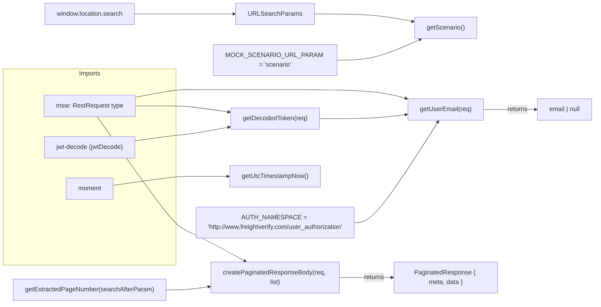

# Diagram: web/portal/src/mocks/utils/mock.utils.ts

> Auto-generated by Obscura crawlers

## Mermaid

### SVG

<svg id="container" width="1523.578125" xmlns="http://www.w3.org/2000/svg" class="flowchart" height="763" viewBox="0 0 1523.578125 763" role="graphics-document document" aria-roledescription="flowchart-v2"><g><marker id="container_flowchart-v2-pointEnd" class="marker flowchart-v2" viewBox="0 0 10 10" refX="5" refY="5" markerUnits="userSpaceOnUse" markerWidth="8" markerHeight="8" orient="auto"><path d="M 0 0 L 10 5 L 0 10 z" class="arrowMarkerPath" style="stroke-width: 1; stroke-dasharray: 1, 0;"></path></marker><marker id="container_flowchart-v2-pointStart" class="marker flowchart-v2" viewBox="0 0 10 10" refX="4.5" refY="5" markerUnits="userSpaceOnUse" markerWidth="8" markerHeight="8" orient="auto"><path d="M 0 5 L 10 10 L 10 0 z" class="arrowMarkerPath" style="stroke-width: 1; stroke-dasharray: 1, 0;"></path></marker><marker id="container_flowchart-v2-circleEnd" class="marker flowchart-v2" viewBox="0 0 10 10" refX="11" refY="5" markerUnits="userSpaceOnUse" markerWidth="11" markerHeight="11" orient="auto"><circle cx="5" cy="5" r="5" class="arrowMarkerPath" style="stroke-width: 1; stroke-dasharray: 1, 0;"></circle></marker><marker id="container_flowchart-v2-circleStart" class="marker flowchart-v2" viewBox="0 0 10 10" refX="-1" refY="5" markerUnits="userSpaceOnUse" markerWidth="11" markerHeight="11" orient="auto"><circle cx="5" cy="5" r="5" class="arrowMarkerPath" style="stroke-width: 1; stroke-dasharray: 1, 0;"></circle></marker><marker id="container_flowchart-v2-crossEnd" class="marker cross flowchart-v2" viewBox="0 0 11 11" refX="12" refY="5.2" markerUnits="userSpaceOnUse" markerWidth="11" markerHeight="11" orient="auto"><path d="M 1,1 l 9,9 M 10,1 l -9,9" class="arrowMarkerPath" style="stroke-width: 2; stroke-dasharray: 1, 0;"></path></marker><marker id="container_flowchart-v2-crossStart" class="marker cross flowchart-v2" viewBox="0 0 11 11" refX="-1" refY="5.2" markerUnits="userSpaceOnUse" markerWidth="11" markerHeight="11" orient="auto"><path d="M 1,1 l 9,9 M 10,1 l -9,9" class="arrowMarkerPath" style="stroke-width: 2; stroke-dasharray: 1, 0;"></path></marker><g class="root"><g class="clusters"><g class="cluster" id="Imports" data-look="classic"><rect style="" x="8" y="173" width="430.484375" height="493"></rect><g class="cluster-label" transform="translate(194.8828125, 173)"><foreignObject width="56.71875" height="24">

Imports

</foreignObject></g></g></g><g class="edgePaths"><path d="M338.133,35L354.858,35C371.583,35,405.034,35,425.926,35C446.818,35,455.151,35,481.93,35C508.708,35,553.932,35,576.544,35L599.156,35" id="L_WINDOW_URLPARAMS_0" class="edge-thickness-normal edge-pattern-solid edge-thickness-normal edge-pattern-solid flowchart-link" style=";" data-edge="true" data-et="edge" data-id="L_WINDOW_URLPARAMS_0" data-points="W3sieCI6MzM4LjEzMjgxMjUsInkiOjM1fSx7IngiOjQzOC40ODQzNzUsInkiOjM1fSx7IngiOjQ2My40ODQzNzUsInkiOjM1fSx7IngiOjYwMy4xNTYyNSwieSI6MzV9XQ==" marker-end="url(#container_flowchart-v2-pointEnd)"></path><path d="M792.5,35L820.156,35C847.813,35,903.125,35,947.353,38.2C991.581,41.4,1024.725,47.799,1041.297,50.999L1057.869,54.199" id="L_URLPARAMS_getScenario_0" class="edge-thickness-normal edge-pattern-solid edge-thickness-normal edge-pattern-solid flowchart-link" style=";" data-edge="true" data-et="edge" data-id="L_URLPARAMS_getScenario_0" data-points="W3sieCI6NzkyLjUsInkiOjM1fSx7IngiOjk1OC40Mzc1LCJ5IjozNX0seyJ4IjoxMDYxLjc5Njg3NSwieSI6NTQuOTU3MzMxMjY0NTQ2MTU2fV0=" marker-end="url(#container_flowchart-v2-pointEnd)"></path><path d="M837.008,151L857.246,151C877.484,151,917.961,151,957.731,142.272C997.501,133.544,1036.565,116.088,1056.097,107.36L1075.629,98.632" id="L_MOCK_getScenario_0" class="edge-thickness-normal edge-pattern-solid edge-thickness-normal edge-pattern-solid flowchart-link" style=";" data-edge="true" data-et="edge" data-id="L_MOCK_getScenario_0" data-points="W3sieCI6ODM3LjAwNzgxMjUsInkiOjE1MX0seyJ4Ijo5NTguNDM3NSwieSI6MTUxfSx7IngiOjEwNzkuMjgxMjUsInkiOjk3fV0=" marker-end="url(#container_flowchart-v2-pointEnd)"></path><path d="M242.05,293L274.789,340C307.528,387,373.006,481,409.912,528C446.818,575,455.151,575,485.298,588.525C515.445,602.051,567.406,629.102,593.387,642.627L619.367,656.153" id="L_MSW_createPaginatedResponseBody_0" class="edge-thickness-normal edge-pattern-solid edge-thickness-normal edge-pattern-solid flowchart-link" style=";" data-edge="true" data-et="edge" data-id="L_MSW_createPaginatedResponseBody_0" data-points="W3sieCI6MjQyLjA0OTc1NzI4MTU1MzQsInkiOjI5M30seyJ4Ijo0MzguNDg0Mzc1LCJ5Ijo1NzV9LHsieCI6NDYzLjQ4NDM3NSwieSI6NTc1fSx7IngiOjYyMi45MTQ5NTkwMTYzOTM1LCJ5Ijo2NTh9XQ==" marker-end="url(#container_flowchart-v2-pointEnd)"></path><path d="M336.813,266L353.758,266C370.703,266,404.594,266,425.706,266C446.818,266,455.151,266,479.101,268.701C503.051,271.403,542.618,276.806,562.402,279.507L582.185,282.209" id="L_MSW_getDecodedToken_0" class="edge-thickness-normal edge-pattern-solid edge-thickness-normal edge-pattern-solid flowchart-link" style=";" data-edge="true" data-et="edge" data-id="L_MSW_getDecodedToken_0" data-points="W3sieCI6MzM2LjgxMjUsInkiOjI2Nn0seyJ4Ijo0MzguNDg0Mzc1LCJ5IjoyNjZ9LHsieCI6NDYzLjQ4NDM3NSwieSI6MjY2fSx7IngiOjU4Ni4xNDg0Mzc1LCJ5IjoyODIuNzQ5OTY2NjYyMjIxNjV9XQ==" marker-end="url(#container_flowchart-v2-pointEnd)"></path><path d="M336.813,244.367L353.758,241.139C370.703,237.911,404.594,231.456,425.706,228.228C446.818,225,455.151,225,498.375,225C541.599,225,619.714,225,702.206,225C784.698,225,871.568,225,928.753,228.793C985.939,232.586,1013.44,240.172,1027.19,243.965L1040.941,247.758" id="L_MSW_getUserEmail_0" class="edge-thickness-normal edge-pattern-solid edge-thickness-normal edge-pattern-solid flowchart-link" style=";" data-edge="true" data-et="edge" data-id="L_MSW_getUserEmail_0" data-points="W3sieCI6MzM2LjgxMjUsInkiOjI0NC4zNjY3NzQzNDU3NTg3OH0seyJ4Ijo0MzguNDg0Mzc1LCJ5IjoyMjV9LHsieCI6NDYzLjQ4NDM3NSwieSI6MjI1fSx7IngiOjY5Ny44MjgxMjUsInkiOjIyNX0seyJ4Ijo5NTguNDM3NSwieSI6MjI1fSx7IngiOjEwNDQuNzk2ODc1LCJ5IjoyNDguODIxMjIyMzA4NDIxNjh9XQ==" marker-end="url(#container_flowchart-v2-pointEnd)"></path><path d="M413.484,728L417.651,728C421.818,728,430.151,728,438.484,728C446.818,728,455.151,728,471.016,726.452C486.881,724.905,510.278,721.81,521.977,720.262L533.675,718.715" id="L_getExtractedPageNumber_createPaginatedResponseBody_0" class="edge-thickness-normal edge-pattern-solid edge-thickness-normal edge-pattern-solid flowchart-link" style=";" data-edge="true" data-et="edge" data-id="L_getExtractedPageNumber_createPaginatedResponseBody_0" data-points="W3sieCI6NDEzLjQ4NDM3NSwieSI6NzI4fSx7IngiOjQzOC40ODQzNzUsInkiOjcyOH0seyJ4Ijo0NjMuNDg0Mzc1LCJ5Ijo3Mjh9LHsieCI6NTM3LjY0MDYyNSwieSI6NzE4LjE5MDI5MjAzODkzODV9XQ==" marker-end="url(#container_flowchart-v2-pointEnd)"></path><path d="M858.016,697L874.753,697C891.49,697,924.964,697,949.578,697C974.193,697,989.948,697,997.826,697L1005.703,697" id="L_createPaginatedResponseBody_PAGED_RESPONSE_0" class="edge-thickness-normal edge-pattern-solid edge-thickness-normal edge-pattern-solid flowchart-link" style=";" data-edge="true" data-et="edge" data-id="L_createPaginatedResponseBody_PAGED_RESPONSE_0" data-points="W3sieCI6ODU4LjAxNTYyNSwieSI6Njk3fSx7IngiOjk1OC40Mzc1LCJ5Ijo2OTd9LHsieCI6MTAwOS43MDMxMjUsInkiOjY5N31d" marker-end="url(#container_flowchart-v2-pointEnd)"></path><path d="M283.563,465.312L309.383,461.594C335.203,457.875,386.844,450.437,416.831,446.719C446.818,443,455.151,443,478.647,443C502.143,443,540.802,443,560.132,443L579.461,443" id="L_MOMENT_getUtcTimestampNow_0" class="edge-thickness-normal edge-pattern-solid edge-thickness-normal edge-pattern-solid flowchart-link" style=";" data-edge="true" data-et="edge" data-id="L_MOMENT_getUtcTimestampNow_0" data-points="W3sieCI6MjgzLjU2MjUsInkiOjQ2NS4zMTI0Mzg3NDk5NTQ2NX0seyJ4Ijo0MzguNDg0Mzc1LCJ5Ijo0NDN9LHsieCI6NDYzLjQ4NDM3NSwieSI6NDQzfSx7IngiOjU4My40NjA5Mzc1LCJ5Ijo0NDN9XQ==" marker-end="url(#container_flowchart-v2-pointEnd)"></path><path d="M339.086,353.316L355.652,350.93C372.219,348.544,405.352,343.772,426.085,341.386C446.818,339,455.151,339,479.105,335.538C503.059,332.076,542.634,325.152,562.421,321.69L582.208,318.228" id="L_JWT_getDecodedToken_0" class="edge-thickness-normal edge-pattern-solid edge-thickness-normal edge-pattern-solid flowchart-link" style=";" data-edge="true" data-et="edge" data-id="L_JWT_getDecodedToken_0" data-points="W3sieCI6MzM5LjA4NTkzNzUsInkiOjM1My4zMTU3NDE3MTUzNjQyNX0seyJ4Ijo0MzguNDg0Mzc1LCJ5IjozMzl9LHsieCI6NDYzLjQ4NDM3NSwieSI6MzM5fSx7IngiOjU4Ni4xNDg0Mzc1LCJ5IjozMTcuNTM5MTA1MjE0MDI4NTV9XQ==" marker-end="url(#container_flowchart-v2-pointEnd)"></path><path d="M809.508,298L834.329,298C859.151,298,908.794,298,947.348,296.258C985.901,294.515,1013.365,291.03,1027.097,289.288L1040.829,287.546" id="L_getDecodedToken_getUserEmail_0" class="edge-thickness-normal edge-pattern-solid edge-thickness-normal edge-pattern-solid flowchart-link" style=";" data-edge="true" data-et="edge" data-id="L_getDecodedToken_getUserEmail_0" data-points="W3sieCI6ODA5LjUwNzgxMjUsInkiOjI5OH0seyJ4Ijo5NTguNDM3NSwieSI6Mjk4fSx7IngiOjEwNDQuNzk2ODc1LCJ5IjoyODcuMDQyMjM3NzM4MTI2fV0=" marker-end="url(#container_flowchart-v2-pointEnd)"></path><path d="M907.172,559L915.716,559C924.26,559,941.349,559,976.873,516.729C1012.398,474.457,1066.358,389.914,1093.338,347.643L1120.318,305.372" id="L_AUTH_getUserEmail_0" class="edge-thickness-normal edge-pattern-solid edge-thickness-normal edge-pattern-solid flowchart-link" style=";" data-edge="true" data-et="edge" data-id="L_AUTH_getUserEmail_0" data-points="W3sieCI6OTA3LjE3MTg3NSwieSI6NTU5fSx7IngiOjk1OC40Mzc1LCJ5Ijo1NTl9LHsieCI6MTEyMi40NzAxMjU0NDAxNDEsInkiOjMwMn1d" marker-end="url(#container_flowchart-v2-pointEnd)"></path><path d="M1234.609,275L1249.003,275C1263.396,275,1292.182,275,1314.453,275C1336.724,275,1352.479,275,1360.357,275L1368.234,275" id="L_getUserEmail_EMAIL_RESULT_0" class="edge-thickness-normal edge-pattern-solid edge-thickness-normal edge-pattern-solid flowchart-link" style=";" data-edge="true" data-et="edge" data-id="L_getUserEmail_EMAIL_RESULT_0" data-points="W3sieCI6MTIzNC42MDkzNzUsInkiOjI3NX0seyJ4IjoxMzIwLjk2ODc1LCJ5IjoyNzV9LHsieCI6MTM3Mi4yMzQzNzUsInkiOjI3NX1d" marker-end="url(#container_flowchart-v2-pointEnd)"></path></g><g class="edgeLabels"><g class="edgeLabel"><g class="label" data-id="L_WINDOW_URLPARAMS_0" transform="translate(0, 0)"><foreignObject width="0" height="0">

</foreignObject></g></g><g class="edgeLabel"><g class="label" data-id="L_URLPARAMS_getScenario_0" transform="translate(0, 0)"><foreignObject width="0" height="0">

</foreignObject></g></g><g class="edgeLabel"><g class="label" data-id="L_MOCK_getScenario_0" transform="translate(0, 0)"><foreignObject width="0" height="0">

</foreignObject></g></g><g class="edgeLabel"><g class="label" data-id="L_MSW_createPaginatedResponseBody_0" transform="translate(0, 0)"><foreignObject width="0" height="0">

</foreignObject></g></g><g class="edgeLabel"><g class="label" data-id="L_MSW_getDecodedToken_0" transform="translate(0, 0)"><foreignObject width="0" height="0">

</foreignObject></g></g><g class="edgeLabel"><g class="label" data-id="L_MSW_getUserEmail_0" transform="translate(0, 0)"><foreignObject width="0" height="0">

</foreignObject></g></g><g class="edgeLabel"><g class="label" data-id="L_getExtractedPageNumber_createPaginatedResponseBody_0" transform="translate(0, 0)"><foreignObject width="0" height="0">

</foreignObject></g></g><g class="edgeLabel" transform="translate(958.4375, 697)"><g class="label" data-id="L_createPaginatedResponseBody_PAGED_RESPONSE_0" transform="translate(-26.265625, -12)"><foreignObject width="52.53125" height="24">

returns

</foreignObject></g></g><g class="edgeLabel"><g class="label" data-id="L_MOMENT_getUtcTimestampNow_0" transform="translate(0, 0)"><foreignObject width="0" height="0">

</foreignObject></g></g><g class="edgeLabel"><g class="label" data-id="L_JWT_getDecodedToken_0" transform="translate(0, 0)"><foreignObject width="0" height="0">

</foreignObject></g></g><g class="edgeLabel"><g class="label" data-id="L_getDecodedToken_getUserEmail_0" transform="translate(0, 0)"><foreignObject width="0" height="0">

</foreignObject></g></g><g class="edgeLabel"><g class="label" data-id="L_AUTH_getUserEmail_0" transform="translate(0, 0)"><foreignObject width="0" height="0">

</foreignObject></g></g><g class="edgeLabel" transform="translate(1320.96875, 275)"><g class="label" data-id="L_getUserEmail_EMAIL_RESULT_0" transform="translate(-26.265625, -12)"><foreignObject width="52.53125" height="24">

returns

</foreignObject></g></g></g><g class="nodes"><g class="node default" id="flowchart-MSW-0" transform="translate(223.2421875, 266)"><rect class="basic label-container" style="" x="-113.5703125" y="-27" width="227.140625" height="54"></rect><g class="label" style="" transform="translate(-83.5703125, -12)"><rect></rect><foreignObject width="167.140625" height="24">

msw: RestRequest type

</foreignObject></g></g><g class="node default" id="flowchart-MOMENT-1" transform="translate(223.2421875, 474)"><rect class="basic label-container" style="" x="-60.3203125" y="-27" width="120.640625" height="54"></rect><g class="label" style="" transform="translate(-30.3203125, -12)"><rect></rect><foreignObject width="60.640625" height="24">

moment

</foreignObject></g></g><g class="node default" id="flowchart-JWT-2" transform="translate(223.2421875, 370)"><rect class="basic label-container" style="" x="-115.84375" y="-27" width="231.6875" height="54"></rect><g class="label" style="" transform="translate(-85.84375, -12)"><rect></rect><foreignObject width="171.6875" height="24">

jwt-decode (jwtDecode)

</foreignObject></g></g><g class="node default" id="flowchart-MOCK-3" transform="translate(697.828125, 151)"><rect class="basic label-container" style="" x="-139.1796875" y="-39" width="278.359375" height="78"></rect><g class="label" style="" transform="translate(-109.1796875, -24)"><rect></rect><foreignObject width="218.359375" height="48">

MOCK_SCENARIO_URL_PARAM = 'scenario'

</foreignObject></g></g><g class="node default" id="flowchart-AUTH-4" transform="translate(697.828125, 559)"><rect class="basic label-container" style="" x="-209.34375" y="-39" width="418.6875" height="78"></rect><g class="label" style="" transform="translate(-179.34375, -24)"><rect></rect><foreignObject width="358.6875" height="48">

AUTH_NAMESPACE = 'http://www.freightverify.com/user_authorization'

</foreignObject></g></g><g class="node default" id="flowchart-WINDOW-5" transform="translate(223.2421875, 35)"><rect class="basic label-container" style="" x="-114.890625" y="-27" width="229.78125" height="54"></rect><g class="label" style="" transform="translate(-84.890625, -12)"><rect></rect><foreignObject width="169.78125" height="24">

window.location.search

</foreignObject></g></g><g class="node default" id="flowchart-URLPARAMS-6" transform="translate(697.828125, 35)"><rect class="basic label-container" style="" x="-94.671875" y="-27" width="189.34375" height="54"></rect><g class="label" style="" transform="translate(-64.671875, -12)"><rect></rect><foreignObject width="129.34375" height="24">

URLSearchParams

</foreignObject></g></g><g class="node default" id="flowchart-getScenario-7" transform="translate(1139.703125, 70)"><rect class="basic label-container" style="" x="-77.90625" y="-27" width="155.8125" height="54"></rect><g class="label" style="" transform="translate(-47.90625, -12)"><rect></rect><foreignObject width="95.8125" height="24">

getScenario()

</foreignObject></g></g><g class="node default" id="flowchart-getExtractedPageNumber-8" transform="translate(223.2421875, 728)"><rect class="basic label-container" style="" x="-190.2421875" y="-27" width="380.484375" height="54"></rect><g class="label" style="" transform="translate(-160.2421875, -12)"><rect></rect><foreignObject width="320.484375" height="24">

getExtractedPageNumber(searchAfterParam)

</foreignObject></g></g><g class="node default" id="flowchart-createPaginatedResponseBody-9" transform="translate(697.828125, 697)"><rect class="basic label-container" style="" x="-160.1875" y="-39" width="320.375" height="78"></rect><g class="label" style="" transform="translate(-130.1875, -24)"><rect></rect><foreignObject width="260.375" height="48">

createPaginatedResponseBody(req, list)

</foreignObject></g></g><g class="node default" id="flowchart-getUtcTimestampNow-10" transform="translate(697.828125, 443)"><rect class="basic label-container" style="" x="-114.3671875" y="-27" width="228.734375" height="54"></rect><g class="label" style="" transform="translate(-84.3671875, -12)"><rect></rect><foreignObject width="168.734375" height="24">

getUtcTimestampNow()

</foreignObject></g></g><g class="node default" id="flowchart-getDecodedToken-11" transform="translate(697.828125, 298)"><rect class="basic label-container" style="" x="-111.6796875" y="-27" width="223.359375" height="54"></rect><g class="label" style="" transform="translate(-81.6796875, -12)"><rect></rect><foreignObject width="163.359375" height="24">

getDecodedToken(req)

</foreignObject></g></g><g class="node default" id="flowchart-getUserEmail-12" transform="translate(1139.703125, 275)"><rect class="basic label-container" style="" x="-94.90625" y="-27" width="189.8125" height="54"></rect><g class="label" style="" transform="translate(-64.90625, -12)"><rect></rect><foreignObject width="129.8125" height="24">

getUserEmail(req)

</foreignObject></g></g><g class="node default" id="flowchart-PAGED_RESPONSE-13" transform="translate(1139.703125, 697)"><rect class="basic label-container" style="" x="-130" y="-39" width="260" height="78"></rect><g class="label" style="" transform="translate(-100, -24)"><rect></rect><foreignObject width="200" height="48">

PaginatedResponse { meta, data }

</foreignObject></g></g><g class="node default" id="flowchart-EMAIL_RESULT-14" transform="translate(1443.90625, 275)"><rect class="basic label-container" style="" x="-71.671875" y="-27" width="143.34375" height="54"></rect><g class="label" style="" transform="translate(-41.671875, -12)"><rect></rect><foreignObject width="83.34375" height="24">

email | null

</foreignObject></g></g></g></g></g></svg>
