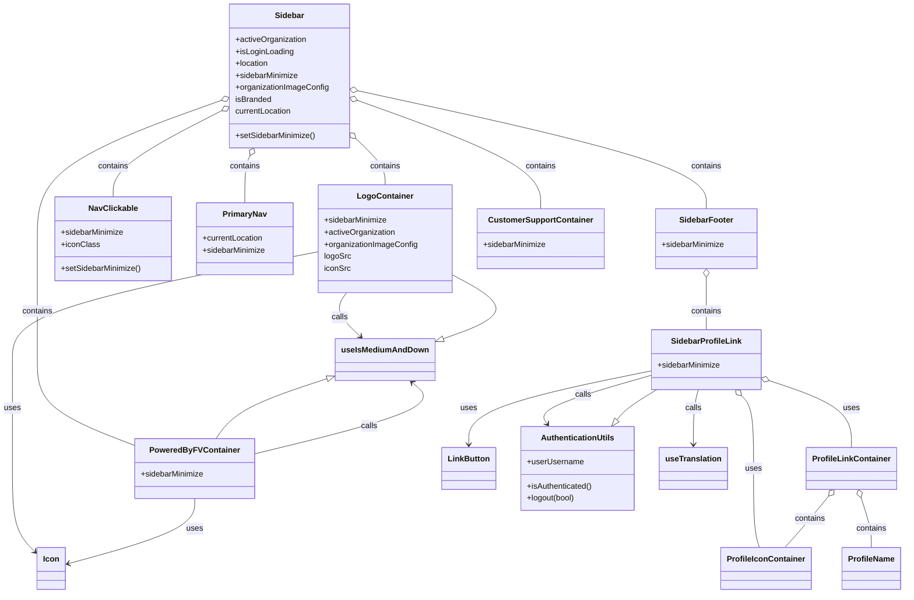

# Diagram: web/portal/src/modules/appnav/SidebarNav.js

> Auto-generated by Obscura crawlers

## Mermaid

### SVG

<svg id="container" width="1792.96875" xmlns="http://www.w3.org/2000/svg" class="classDiagram" height="1188" viewBox="0 0 1792.96875 1188" role="graphics-document document" aria-roledescription="class"><g><defs><marker id="container_class-aggregationStart" class="marker aggregation class" refX="18" refY="7" markerWidth="190" markerHeight="240" orient="auto"><path d="M 18,7 L9,13 L1,7 L9,1 Z"></path></marker></defs><defs><marker id="container_class-aggregationEnd" class="marker aggregation class" refX="1" refY="7" markerWidth="20" markerHeight="28" orient="auto"><path d="M 18,7 L9,13 L1,7 L9,1 Z"></path></marker></defs><defs><marker id="container_class-extensionStart" class="marker extension class" refX="18" refY="7" markerWidth="190" markerHeight="240" orient="auto"><path d="M 1,7 L18,13 V 1 Z"></path></marker></defs><defs><marker id="container_class-extensionEnd" class="marker extension class" refX="1" refY="7" markerWidth="20" markerHeight="28" orient="auto"><path d="M 1,1 V 13 L18,7 Z"></path></marker></defs><defs><marker id="container_class-compositionStart" class="marker composition class" refX="18" refY="7" markerWidth="190" markerHeight="240" orient="auto"><path d="M 18,7 L9,13 L1,7 L9,1 Z"></path></marker></defs><defs><marker id="container_class-compositionEnd" class="marker composition class" refX="1" refY="7" markerWidth="20" markerHeight="28" orient="auto"><path d="M 18,7 L9,13 L1,7 L9,1 Z"></path></marker></defs><defs><marker id="container_class-dependencyStart" class="marker dependency class" refX="6" refY="7" markerWidth="190" markerHeight="240" orient="auto"><path d="M 5,7 L9,13 L1,7 L9,1 Z"></path></marker></defs><defs><marker id="container_class-dependencyEnd" class="marker dependency class" refX="13" refY="7" markerWidth="20" markerHeight="28" orient="auto"><path d="M 18,7 L9,13 L14,7 L9,1 Z"></path></marker></defs><defs><marker id="container_class-lollipopStart" class="marker lollipop class" refX="13" refY="7" markerWidth="190" markerHeight="240" orient="auto"><circle stroke="black" fill="transparent" cx="7" cy="7" r="6"></circle></marker></defs><defs><marker id="container_class-lollipopEnd" class="marker lollipop class" refX="1" refY="7" markerWidth="190" markerHeight="240" orient="auto"><circle stroke="black" fill="transparent" cx="7" cy="7" r="6"></circle></marker></defs><g class="root"><g class="clusters"></g><g class="edgePaths"><path d="M709.437,277.775L719.108,286.98C728.78,296.184,748.122,314.592,757.794,329.963C767.465,345.333,767.465,357.667,767.465,363.833L767.465,370" id="id_Sidebar_LogoContainer_1" class="edge-thickness-normal edge-pattern-solid relation" style=";;;" data-edge="true" data-et="edge" data-id="id_Sidebar_LogoContainer_1" data-points="W3sieCI6Njk2Ljk0MTQwNjI1LCJ5IjoyNjUuODgzMzc5ODg4MjY4MTd9LHsieCI6NzY3LjQ2NDg0Mzc1LCJ5IjozMzN9LHsieCI6NzY3LjQ2NDg0Mzc1LCJ5IjozNzB9XQ==" marker-start="url(#container_class-aggregationStart)"></path><path d="M442.281,221.597L406.266,240.164C370.251,258.731,298.221,295.866,262.206,324.599C226.191,353.333,226.191,373.667,226.191,383.833L226.191,394" id="id_Sidebar_NavClickable_2" class="edge-thickness-normal edge-pattern-solid relation" style=";;;" data-edge="true" data-et="edge" data-id="id_Sidebar_NavClickable_2" data-points="W3sieCI6NDU3LjYxMzI4MTI1LCJ5IjoyMTMuNjkyMDA0NzE3NTA1OTR9LHsieCI6MjI2LjE5MTQwNjI1LCJ5IjozMzN9LHsieCI6MjI2LjE5MTQwNjI1LCJ5IjozOTR9XQ==" marker-start="url(#container_class-aggregationStart)"></path><path d="M499.237,311.495L497.484,315.079C495.73,318.663,492.222,325.832,490.469,341.582C488.715,357.333,488.715,381.667,488.715,393.833L488.715,406" id="id_Sidebar_PrimaryNav_3" class="edge-thickness-normal edge-pattern-solid relation" style=";;;" data-edge="true" data-et="edge" data-id="id_Sidebar_PrimaryNav_3" data-points="W3sieCI6NTA2LjgxODc4MDIxNDA4ODQsInkiOjI5Nn0seyJ4Ijo0ODguNzE0ODQzNzUsInkiOjMzM30seyJ4Ijo0ODguNzE0ODQzNzUsInkiOjQwNn1d" marker-start="url(#container_class-aggregationStart)"></path><path d="M713.153,201.395L773.49,223.329C833.826,245.263,954.499,289.132,1014.835,325.233C1075.172,361.333,1075.172,389.667,1075.172,403.833L1075.172,418" id="id_Sidebar_CustomerSupportContainer_4" class="edge-thickness-normal edge-pattern-solid relation" style=";;;" data-edge="true" data-et="edge" data-id="id_Sidebar_CustomerSupportContainer_4" data-points="W3sieCI6Njk2Ljk0MTQwNjI1LCJ5IjoxOTUuNTAxNTczMDMwMTgxOH0seyJ4IjoxMDc1LjE3MTg3NSwieSI6MzMzfSx7IngiOjEwNzUuMTcxODc1LCJ5Ijo0MTh9XQ==" marker-start="url(#container_class-aggregationStart)"></path><path d="M441.386,201.007L380.386,223.006C319.385,245.005,197.384,289.002,136.383,335.168C75.383,381.333,75.383,429.667,75.383,478C75.383,526.333,75.383,574.667,75.383,615C75.383,655.333,75.383,687.667,75.383,720C75.383,752.333,75.383,784.667,107.951,813.406C140.52,842.145,205.658,867.289,238.226,879.862L270.795,892.434" id="id_Sidebar_PoweredByFVContainer_5" class="edge-thickness-normal edge-pattern-solid relation" style=";;;" data-edge="true" data-et="edge" data-id="id_Sidebar_PoweredByFVContainer_5" data-points="W3sieCI6NDU3LjYxMzI4MTI1LCJ5IjoxOTUuMTU0ODc0MTA5ODE4MjV9LHsieCI6NzUuMzgyODEyNSwieSI6MzMzfSx7IngiOjc1LjM4MjgxMjUsInkiOjQ3OH0seyJ4Ijo3NS4zODI4MTI1LCJ5Ijo2MjN9LHsieCI6NzUuMzgyODEyNSwieSI6NzIwfSx7IngiOjc1LjM4MjgxMjUsInkiOjgxN30seyJ4IjoyNzAuNzk0OTIxODc1LCJ5Ijo4OTIuNDMzOTY2NjE0MTE4M31d" marker-start="url(#container_class-aggregationStart)"></path><path d="M713.792,181.909L828.731,207.091C943.671,232.272,1173.55,282.636,1288.49,321.985C1403.43,361.333,1403.43,389.667,1403.43,403.833L1403.43,418" id="id_Sidebar_SidebarFooter_6" class="edge-thickness-normal edge-pattern-solid relation" style=";;;" data-edge="true" data-et="edge" data-id="id_Sidebar_SidebarFooter_6" data-points="W3sieCI6Njk2Ljk0MTQwNjI1LCJ5IjoxNzguMjE2OTUwNzU1MzM3fSx7IngiOjE0MDMuNDI5Njg3NSwieSI6MzMzfSx7IngiOjE0MDMuNDI5Njg3NSwieSI6NDE4fV0=" marker-start="url(#container_class-aggregationStart)"></path><path d="M1403.43,555.25L1403.43,566.542C1403.43,577.833,1403.43,600.417,1403.43,617.875C1403.43,635.333,1403.43,647.667,1403.43,653.833L1403.43,660" id="id_SidebarFooter_SidebarProfileLink_7" class="edge-thickness-normal edge-pattern-solid relation" style=";;;" data-edge="true" data-et="edge" data-id="id_SidebarFooter_SidebarProfileLink_7" data-points="W3sieCI6MTQwMy40Mjk2ODc1LCJ5Ijo1Mzh9LHsieCI6MTQwMy40Mjk2ODc1LCJ5Ijo2MjN9LHsieCI6MTQwMy40Mjk2ODc1LCJ5Ijo2NjB9XQ==" marker-start="url(#container_class-aggregationStart)"></path><path d="M1529.109,762.933L1555.488,771.944C1581.867,780.955,1634.625,798.978,1661.004,821.155C1687.383,843.333,1687.383,869.667,1687.383,882.833L1687.383,896" id="id_SidebarProfileLink_ProfileLinkContainer_8" class="edge-thickness-normal edge-pattern-solid relation" style=";;;" data-edge="true" data-et="edge" data-id="id_SidebarProfileLink_ProfileLinkContainer_8" data-points="W3sieCI6MTUxMi43ODUxNTYyNSwieSI6NzU3LjM1NjQ0OTEyNzgyN30seyJ4IjoxNjg3LjM4MjgxMjUsInkiOjgxN30seyJ4IjoxNjg3LjM4MjgxMjUsInkiOjg5Nn1d" marker-start="url(#container_class-aggregationStart)"></path><path d="M1472.645,792.475L1476.548,796.562C1480.452,800.65,1488.259,808.825,1492.163,833.079C1496.066,857.333,1496.066,897.667,1496.066,938C1496.066,978.333,1496.066,1018.667,1498.053,1045C1500.039,1071.333,1504.011,1083.667,1505.998,1089.833L1507.984,1096" id="id_SidebarProfileLink_ProfileIconContainer_9" class="edge-thickness-normal edge-pattern-solid relation" style=";;;" data-edge="true" data-et="edge" data-id="id_SidebarProfileLink_ProfileIconContainer_9" data-points="W3sieCI6MTQ2MC43MzA3NTA2NDQzMjk5LCJ5Ijo3ODB9LHsieCI6MTQ5Ni4wNjY0MDYyNSwieSI6ODE3fSx7IngiOjE0OTYuMDY2NDA2MjUsInkiOjkzOH0seyJ4IjoxNDk2LjA2NjQwNjI1LCJ5IjoxMDU5fSx7IngiOjE1MDcuOTgzODMxMDkxNzcyMSwieSI6MTA5Nn1d" marker-start="url(#container_class-aggregationStart)"></path><path d="M1643.042,993.475L1634.313,1004.396C1625.584,1015.316,1608.126,1037.158,1593.999,1054.246C1579.871,1071.333,1569.075,1083.667,1563.677,1089.833L1558.278,1096" id="id_ProfileLinkContainer_ProfileIconContainer_10" class="edge-thickness-normal edge-pattern-solid relation" style=";;;" data-edge="true" data-et="edge" data-id="id_ProfileLinkContainer_ProfileIconContainer_10" data-points="W3sieCI6MTY1My44MTIzNzA4Njc3Njg1LCJ5Ijo5ODB9LHsieCI6MTU5MC42Njc5Njg3NSwieSI6MTA1OX0seyJ4IjoxNTU4LjI3ODMzMjY3NDA1MDcsInkiOjEwOTZ9XQ==" marker-start="url(#container_class-aggregationStart)"></path><path d="M1707.099,996.342L1710.628,1006.785C1714.157,1017.228,1721.215,1038.114,1724.744,1054.724C1728.273,1071.333,1728.273,1083.667,1728.273,1089.833L1728.273,1096" id="id_ProfileLinkContainer_ProfileName_11" class="edge-thickness-normal edge-pattern-solid relation" style=";;;" data-edge="true" data-et="edge" data-id="id_ProfileLinkContainer_ProfileName_11" data-points="W3sieCI6MTcwMS41NzYyNTI1ODI2NDQ3LCJ5Ijo5ODB9LHsieCI6MTcyOC4yNzM0Mzc1LCJ5IjoxMDU5fSx7IngiOjE3MjguMjczNDM3NSwieSI6MTA5Nn1d" marker-start="url(#container_class-aggregationStart)"></path><path d="M1294.074,742.542L1233.872,754.952C1173.671,767.361,1053.267,792.181,993.065,816.757C932.863,841.333,932.863,865.667,932.863,877.833L932.863,890" id="id_SidebarProfileLink_LinkButton_12" class="edge-thickness-normal edge-pattern-solid relation" style=";;;" data-edge="true" data-et="edge" data-id="id_SidebarProfileLink_LinkButton_12" data-points="W3sieCI6MTI5NC4wNzQyMTg3NSwieSI6NzQyLjU0MTk0MTY0MjgwMDh9LHsieCI6OTMyLjg2MzI4MTI1LCJ5Ijo4MTd9LHsieCI6OTMyLjg2MzI4MTI1LCJ5Ijo4OTZ9XQ==" marker-end="url(#container_class-dependencyEnd)"></path><path d="M635.43,503.768L533.607,523.64C431.784,543.512,228.138,583.256,126.315,619.295C24.492,655.333,24.492,687.667,24.492,720C24.492,752.333,24.492,784.667,24.492,821C24.492,857.333,24.492,897.667,24.492,938C24.492,978.333,24.492,1018.667,31.999,1046.583C39.506,1074.5,54.519,1090,62.026,1097.75L69.533,1105.5" id="id_LogoContainer_Icon_13" class="edge-thickness-normal edge-pattern-solid relation" style=";;;" data-edge="true" data-et="edge" data-id="id_LogoContainer_Icon_13" data-points="W3sieCI6NjM1LjQyOTY4NzUsInkiOjUwMy43NjgyMzk5MTQ2MTY2M30seyJ4IjoyNC40OTIxODc1LCJ5Ijo2MjN9LHsieCI6MjQuNDkyMTg3NSwieSI6NzIwfSx7IngiOjI0LjQ5MjE4NzUsInkiOjgxN30seyJ4IjoyNC40OTIxODc1LCJ5Ijo5Mzh9LHsieCI6MjQuNDkyMTg3NSwieSI6MTA1OX0seyJ4Ijo3My43MDcwMzEyNSwieSI6MTEwOS44MTAxOTk2MDE4MTc0fV0=" marker-end="url(#container_class-dependencyEnd)"></path><path d="M388.834,998L388.834,1008.167C388.834,1018.333,388.834,1038.667,346.379,1060.486C303.923,1082.306,219.013,1105.612,176.558,1117.265L134.102,1128.917" id="id_PoweredByFVContainer_Icon_14" class="edge-thickness-normal edge-pattern-solid relation" style=";;;" data-edge="true" data-et="edge" data-id="id_PoweredByFVContainer_Icon_14" data-points="W3sieCI6Mzg4LjgzMzk4NDM3NSwieSI6OTk4fSx7IngiOjM4OC44MzM5ODQzNzUsInkiOjEwNTl9LHsieCI6MTI4LjMxNjQwNjI1LCJ5IjoxMTMwLjUwNTU0NzQ1MDIwODd9XQ==" marker-end="url(#container_class-dependencyEnd)"></path><path d="M1294.074,751.555L1256.274,762.463C1218.474,773.37,1142.874,795.185,1108.667,811.43C1074.461,827.674,1081.648,838.349,1085.242,843.686L1088.835,849.023" id="id_SidebarProfileLink_AuthenticationUtils_15" class="edge-thickness-normal edge-pattern-solid relation" style=";;;" data-edge="true" data-et="edge" data-id="id_SidebarProfileLink_AuthenticationUtils_15" data-points="W3sieCI6MTI5NC4wNzQyMTg3NSwieSI6NzUxLjU1NTIwODIzNjQ5NzJ9LHsieCI6MTA2Ny4yNzM0Mzc1LCJ5Ijo4MTd9LHsieCI6MTA5Mi4xODY1NjM3OTEzMjIyLCJ5Ijo4NTR9XQ==" marker-end="url(#container_class-dependencyEnd)"></path><path d="M691.577,586L687.244,592.167C682.911,598.333,674.244,610.667,678.815,625.31C683.387,639.954,701.195,656.909,710.099,665.386L719.003,673.863" id="id_LogoContainer_useIsMediumAndDown_16" class="edge-thickness-normal edge-pattern-solid relation" style=";;;" data-edge="true" data-et="edge" data-id="id_LogoContainer_useIsMediumAndDown_16" data-points="W3sieCI6NjkxLjU3NjgwNDk1Njg5NjYsInkiOjU4Nn0seyJ4Ijo2NjUuNTc4MTI1LCJ5Ijo2MjN9LHsieCI6NzIzLjM0ODk0NDkwOTc5MzgsInkiOjY3OH1d" marker-end="url(#container_class-dependencyEnd)"></path><path d="M506.873,908.916L569.049,893.597C631.224,878.278,755.575,847.639,807.88,823.806C860.185,799.973,840.444,782.946,830.573,774.432L820.703,765.919" id="id_PoweredByFVContainer_useIsMediumAndDown_17" class="edge-thickness-normal edge-pattern-solid relation" style=";;;" data-edge="true" data-et="edge" data-id="id_PoweredByFVContainer_useIsMediumAndDown_17" data-points="W3sieCI6NTA2Ljg3MzA0Njg3NSwieSI6OTA4LjkxNjM4MTMwOTE4NDN9LHsieCI6ODc5LjkyNTc4MTI1LCJ5Ijo4MTd9LHsieCI6ODE2LjE1OTI3MDI5NjM5MTcsInkiOjc2Mn1d" marker-end="url(#container_class-dependencyEnd)"></path><path d="M1388.002,780L1386.416,786.167C1384.831,792.333,1381.66,804.667,1380.074,823C1378.488,841.333,1378.488,865.667,1378.488,877.833L1378.488,890" id="id_SidebarProfileLink_useTranslation_18" class="edge-thickness-normal edge-pattern-solid relation" style=";;;" data-edge="true" data-et="edge" data-id="id_SidebarProfileLink_useTranslation_18" data-points="W3sieCI6MTM4OC4wMDIwMTM1MzA5Mjc4LCJ5Ijo3ODB9LHsieCI6MTM3OC40ODgyODEyNSwieSI6ODE3fSx7IngiOjEzNzguNDg4MjgxMjUsInkiOjg5Nn1d" marker-end="url(#container_class-dependencyEnd)"></path><path d="M1226.607,840.522L1229.738,836.601C1232.869,832.681,1239.132,824.841,1252.31,814.754C1265.488,804.667,1285.582,792.333,1295.629,786.167L1305.676,780" id="id_AuthenticationUtils_SidebarProfileLink_19" class="edge-thickness-normal edge-pattern-solid relation" style=";;;" data-edge="true" data-et="edge" data-id="id_AuthenticationUtils_SidebarProfileLink_19" data-points="W3sieCI6MTIxNS44NDA4NzY4MDc4NTExLCJ5Ijo4NTR9LHsieCI6MTI0NS4zOTQ1MzEyNSwieSI6ODE3fSx7IngiOjEzMDUuNjc1OTgyNjAzMDkyNywieSI6NzgwfV0=" marker-start="url(#container_class-extensionStart)"></path><path d="M878.467,679.673L904.467,670.228C930.466,660.782,982.466,641.891,985.971,620.23C989.477,598.568,944.488,574.136,921.994,561.92L899.5,549.704" id="id_useIsMediumAndDown_LogoContainer_20" class="edge-thickness-normal edge-pattern-solid relation" style=";;;" data-edge="true" data-et="edge" data-id="id_useIsMediumAndDown_LogoContainer_20" data-points="W3sieCI6ODYyLjI1MzkwNjI1LCJ5Ijo2ODUuNTYzNTI0MTEwNDg2OX0seyJ4IjoxMDM0LjQ2NDg0Mzc1LCJ5Ijo2MjN9LHsieCI6ODk5LjUsInkiOjU0OS43MDQ0ODU2MDM5MzI1fV0=" marker-start="url(#container_class-extensionStart)"></path><path d="M656.289,756.56L625.657,766.634C595.025,776.707,533.762,796.853,496.1,817.093C458.439,837.333,444.38,857.667,437.35,867.833L430.32,878" id="id_useIsMediumAndDown_PoweredByFVContainer_21" class="edge-thickness-normal edge-pattern-solid relation" style=";;;" data-edge="true" data-et="edge" data-id="id_useIsMediumAndDown_PoweredByFVContainer_21" data-points="W3sieCI6NjcyLjY3NTc4MTI1LCJ5Ijo3NTEuMTcxNDM3NDYzMTY3OX0seyJ4Ijo0NzIuNDk4MDQ2ODc1LCJ5Ijo4MTd9LHsieCI6NDMwLjMyMDI5NjM1ODQ3MTA3LCJ5Ijo4Nzh9XQ==" marker-start="url(#container_class-extensionStart)"></path></g><g class="edgeLabels"><g class="edgeLabel" transform="translate(767.46484375, 333)"><g class="label" data-id="id_Sidebar_LogoContainer_1" transform="translate(-30.890625, -12)"><foreignObject width="61.78125" height="24">

contains

</foreignObject></g></g><g class="edgeLabel" transform="translate(226.19140625, 333)"><g class="label" data-id="id_Sidebar_NavClickable_2" transform="translate(-30.890625, -12)"><foreignObject width="61.78125" height="24">

contains

</foreignObject></g></g><g class="edgeLabel" transform="translate(488.71484375, 333)"><g class="label" data-id="id_Sidebar_PrimaryNav_3" transform="translate(-30.890625, -12)"><foreignObject width="61.78125" height="24">

contains

</foreignObject></g></g><g class="edgeLabel" transform="translate(1075.171875, 333)"><g class="label" data-id="id_Sidebar_CustomerSupportContainer_4" transform="translate(-30.890625, -12)"><foreignObject width="61.78125" height="24">

contains

</foreignObject></g></g><g class="edgeLabel" transform="translate(75.3828125, 623)"><g class="label" data-id="id_Sidebar_PoweredByFVContainer_5" transform="translate(-30.890625, -12)"><foreignObject width="61.78125" height="24">

contains

</foreignObject></g></g><g class="edgeLabel" transform="translate(1403.4296875, 333)"><g class="label" data-id="id_Sidebar_SidebarFooter_6" transform="translate(-30.890625, -12)"><foreignObject width="61.78125" height="24">

contains

</foreignObject></g></g><g class="edgeLabel" transform="translate(1403.4296875, 623)"><g class="label" data-id="id_SidebarFooter_SidebarProfileLink_7" transform="translate(-30.890625, -12)"><foreignObject width="61.78125" height="24">

contains

</foreignObject></g></g><g class="edgeLabel" transform="translate(1687.3828125, 817)"><g class="label" data-id="id_SidebarProfileLink_ProfileLinkContainer_8" transform="translate(-16.4921875, -12)"><foreignObject width="32.984375" height="24">

uses

</foreignObject></g></g><g class="edgeLabel" transform="translate(1496.06640625, 938)"><g class="label" data-id="id_SidebarProfileLink_ProfileIconContainer_9" transform="translate(-16.4921875, -12)"><foreignObject width="32.984375" height="24">

uses

</foreignObject></g></g><g class="edgeLabel" transform="translate(1606.88902, 1038.70584)"><g class="label" data-id="id_ProfileLinkContainer_ProfileIconContainer_10" transform="translate(-30.890625, -12)"><foreignObject width="61.78125" height="24">

contains

</foreignObject></g></g><g class="edgeLabel" transform="translate(1728.2734375, 1059)"><g class="label" data-id="id_ProfileLinkContainer_ProfileName_11" transform="translate(-30.890625, -12)"><foreignObject width="61.78125" height="24">

contains

</foreignObject></g></g><g class="edgeLabel" transform="translate(932.86328125, 817)"><g class="label" data-id="id_SidebarProfileLink_LinkButton_12" transform="translate(-16.4921875, -12)"><foreignObject width="32.984375" height="24">

uses

</foreignObject></g></g><g class="edgeLabel" transform="translate(24.4921875, 817)"><g class="label" data-id="id_LogoContainer_Icon_13" transform="translate(-16.4921875, -12)"><foreignObject width="32.984375" height="24">

uses

</foreignObject></g></g><g class="edgeLabel" transform="translate(388.833984375, 1059)"><g class="label" data-id="id_PoweredByFVContainer_Icon_14" transform="translate(-16.4921875, -12)"><foreignObject width="32.984375" height="24">

uses

</foreignObject></g></g><g class="edgeLabel" transform="translate(1159.24529, 790.46094)"><g class="label" data-id="id_SidebarProfileLink_AuthenticationUtils_15" transform="translate(-16.4453125, -12)"><foreignObject width="32.890625" height="24">

calls

</foreignObject></g></g><g class="edgeLabel" transform="translate(678.08764, 634.90953)"><g class="label" data-id="id_LogoContainer_useIsMediumAndDown_16" transform="translate(-16.4453125, -12)"><foreignObject width="32.890625" height="24">

calls

</foreignObject></g></g><g class="edgeLabel" transform="translate(734.28131, 852.88531)"><g class="label" data-id="id_PoweredByFVContainer_useIsMediumAndDown_17" transform="translate(-16.4453125, -12)"><foreignObject width="32.890625" height="24">

calls

</foreignObject></g></g><g class="edgeLabel" transform="translate(1378.48828125, 817)"><g class="label" data-id="id_SidebarProfileLink_useTranslation_18" transform="translate(-16.4453125, -12)"><foreignObject width="32.890625" height="24">

calls

</foreignObject></g></g><g class="edgeLabel"><g class="label" data-id="id_AuthenticationUtils_SidebarProfileLink_19" transform="translate(0, 0)"><foreignObject width="0" height="0">

</foreignObject></g></g><g class="edgeLabel"><g class="label" data-id="id_useIsMediumAndDown_LogoContainer_20" transform="translate(0, 0)"><foreignObject width="0" height="0">

</foreignObject></g></g><g class="edgeLabel"><g class="label" data-id="id_useIsMediumAndDown_PoweredByFVContainer_21" transform="translate(0, 0)"><foreignObject width="0" height="0">

</foreignObject></g></g></g><g class="nodes"><g class="node default" id="classId-Sidebar-0" transform="translate(577.27734375, 152)"><g class="basic label-container"><path d="M-119.6640625 -144 L119.6640625 -144 L119.6640625 144 L-119.6640625 144" stroke="none" stroke-width="0" fill="#ECECFF" style=""></path><path d="M-119.6640625 -144 C-61.41297914099027 -144, -3.161895781980533 -144, 119.6640625 -144 M-119.6640625 -144 C-55.93466980067203 -144, 7.794722898655934 -144, 119.6640625 -144 M119.6640625 -144 C119.6640625 -83.08109649565448, 119.6640625 -22.162192991308956, 119.6640625 144 M119.6640625 -144 C119.6640625 -39.6605141287272, 119.6640625 64.6789717425456, 119.6640625 144 M119.6640625 144 C26.89321780244495 144, -65.8776268951101 144, -119.6640625 144 M119.6640625 144 C60.86706910978011 144, 2.070075719560222 144, -119.6640625 144 M-119.6640625 144 C-119.6640625 31.07628262139731, -119.6640625 -81.84743475720538, -119.6640625 -144 M-119.6640625 144 C-119.6640625 56.94556705638922, -119.6640625 -30.108865887221555, -119.6640625 -144" stroke="#9370DB" stroke-width="1.3" fill="none" stroke-dasharray="0 0" style=""></path></g><g class="annotation-group text" transform="translate(0, -120)"></g><g class="label-group text" transform="translate(-28.34375, -120)"><g class="label" style="font-weight: bolder" transform="translate(0,-12)"><foreignObject width="56.6875" height="24">

Sidebar

</foreignObject></g></g><g class="members-group text" transform="translate(-107.6640625, -72)"><g class="label" style="" transform="translate(0,-12)"><foreignObject width="143" height="24">

+activeOrganization

</foreignObject></g><g class="label" style="" transform="translate(0,12)"><foreignObject width="116.328125" height="24">

+isLoginLoading

</foreignObject></g><g class="label" style="" transform="translate(0,36)"><foreignObject width="67.140625" height="24">

+location

</foreignObject></g><g class="label" style="" transform="translate(0,60)"><foreignObject width="127.15625" height="24">

+sidebarMinimize

</foreignObject></g><g class="label" style="" transform="translate(0,84)"><foreignObject width="186.984375" height="24">

+organizationImageConfig

</foreignObject></g><g class="label" style="" transform="translate(0,108)"><foreignObject width="73.265625" height="24">

isBranded

</foreignObject></g><g class="label" style="" transform="translate(0,132)"><foreignObject width="114.65625" height="24">

currentLocation

</foreignObject></g></g><g class="methods-group text" transform="translate(-107.6640625, 120)"><g class="label" style="" transform="translate(0,-12)"><foreignObject width="160.75" height="24">

+setSidebarMinimize()

</foreignObject></g></g><g class="divider" style=""><path d="M-119.6640625 -96 C-62.41581817311762 -96, -5.167573846235243 -96, 119.6640625 -96 M-119.6640625 -96 C-66.85008593042654 -96, -14.03610936085309 -96, 119.6640625 -96" stroke="#9370DB" stroke-width="1.3" fill="none" stroke-dasharray="0 0" style=""></path></g><g class="divider" style=""><path d="M-119.6640625 96 C-49.29233523469749 96, 21.07939203060502 96, 119.6640625 96 M-119.6640625 96 C-67.7944928710799 96, -15.924923242159792 96, 119.6640625 96" stroke="#9370DB" stroke-width="1.3" fill="none" stroke-dasharray="0 0" style=""></path></g></g><g class="node default" id="classId-LogoContainer-1" transform="translate(767.46484375, 478)"><g class="basic label-container"><path d="M-132.03515625 -108 L132.03515625 -108 L132.03515625 108 L-132.03515625 108" stroke="none" stroke-width="0" fill="#ECECFF" style=""></path><path d="M-132.03515625 -108 C-55.817605612645266 -108, 20.399945024709467 -108, 132.03515625 -108 M-132.03515625 -108 C-31.34962049306128 -108, 69.33591526387744 -108, 132.03515625 -108 M132.03515625 -108 C132.03515625 -53.157259674148634, 132.03515625 1.6854806517027328, 132.03515625 108 M132.03515625 -108 C132.03515625 -31.216612858599916, 132.03515625 45.56677428280017, 132.03515625 108 M132.03515625 108 C43.928964560923546 108, -44.17722712815291 108, -132.03515625 108 M132.03515625 108 C28.344581082340497 108, -75.345994085319 108, -132.03515625 108 M-132.03515625 108 C-132.03515625 50.03926722484278, -132.03515625 -7.921465550314437, -132.03515625 -108 M-132.03515625 108 C-132.03515625 27.7777330233489, -132.03515625 -52.4445339533022, -132.03515625 -108" stroke="#9370DB" stroke-width="1.3" fill="none" stroke-dasharray="0 0" style=""></path></g><g class="annotation-group text" transform="translate(0, -84)"></g><g class="label-group text" transform="translate(-53.0859375, -84)"><g class="label" style="font-weight: bolder" transform="translate(0,-12)"><foreignObject width="106.171875" height="24">

LogoContainer

</foreignObject></g></g><g class="members-group text" transform="translate(-120.03515625, -36)"><g class="label" style="" transform="translate(0,-12)"><foreignObject width="127.15625" height="24">

+sidebarMinimize

</foreignObject></g><g class="label" style="" transform="translate(0,12)"><foreignObject width="143" height="24">

+activeOrganization

</foreignObject></g><g class="label" style="" transform="translate(0,36)"><foreignObject width="186.984375" height="24">

+organizationImageConfig

</foreignObject></g><g class="label" style="" transform="translate(0,60)"><foreignObject width="53.4375" height="24">

logoSrc

</foreignObject></g><g class="label" style="" transform="translate(0,84)"><foreignObject width="52.625" height="24">

iconSrc

</foreignObject></g></g><g class="methods-group text" transform="translate(-120.03515625, 108)"></g><g class="divider" style=""><path d="M-132.03515625 -60 C-78.13482073888329 -60, -24.23448522776657 -60, 132.03515625 -60 M-132.03515625 -60 C-36.6121720991804 -60, 58.8108120516392 -60, 132.03515625 -60" stroke="#9370DB" stroke-width="1.3" fill="none" stroke-dasharray="0 0" style=""></path></g><g class="divider" style=""><path d="M-132.03515625 84 C-69.27646229183844 84, -6.5177683336768695 84, 132.03515625 84 M-132.03515625 84 C-30.131714342193533 84, 71.77172756561293 84, 132.03515625 84" stroke="#9370DB" stroke-width="1.3" fill="none" stroke-dasharray="0 0" style=""></path></g></g><g class="node default" id="classId-NavClickable-2" transform="translate(226.19140625, 478)"><g class="basic label-container"><path d="M-115.80859375 -84 L115.80859375 -84 L115.80859375 84 L-115.80859375 84" stroke="none" stroke-width="0" fill="#ECECFF" style=""></path><path d="M-115.80859375 -84 C-24.999626959622958 -84, 65.80933983075408 -84, 115.80859375 -84 M-115.80859375 -84 C-48.27657225944962 -84, 19.255449231100755 -84, 115.80859375 -84 M115.80859375 -84 C115.80859375 -31.354464344051244, 115.80859375 21.29107131189751, 115.80859375 84 M115.80859375 -84 C115.80859375 -17.56698485723554, 115.80859375 48.86603028552892, 115.80859375 84 M115.80859375 84 C69.05424983547718 84, 22.29990592095436 84, -115.80859375 84 M115.80859375 84 C58.5099146559849 84, 1.2112355619698008 84, -115.80859375 84 M-115.80859375 84 C-115.80859375 47.72557749238681, -115.80859375 11.451154984773623, -115.80859375 -84 M-115.80859375 84 C-115.80859375 48.3356622564347, -115.80859375 12.671324512869404, -115.80859375 -84" stroke="#9370DB" stroke-width="1.3" fill="none" stroke-dasharray="0 0" style=""></path></g><g class="annotation-group text" transform="translate(0, -60)"></g><g class="label-group text" transform="translate(-46.8671875, -60)"><g class="label" style="font-weight: bolder" transform="translate(0,-12)"><foreignObject width="93.734375" height="24">

NavClickable

</foreignObject></g></g><g class="members-group text" transform="translate(-103.80859375, -12)"><g class="label" style="" transform="translate(0,-12)"><foreignObject width="127.15625" height="24">

+sidebarMinimize

</foreignObject></g><g class="label" style="" transform="translate(0,12)"><foreignObject width="75.28125" height="24">

+iconClass

</foreignObject></g></g><g class="methods-group text" transform="translate(-103.80859375, 60)"><g class="label" style="" transform="translate(0,-12)"><foreignObject width="160.75" height="24">

+setSidebarMinimize()

</foreignObject></g></g><g class="divider" style=""><path d="M-115.80859375 -36 C-28.97814899870174 -36, 57.85229575259652 -36, 115.80859375 -36 M-115.80859375 -36 C-33.988520285182744 -36, 47.83155317963451 -36, 115.80859375 -36" stroke="#9370DB" stroke-width="1.3" fill="none" stroke-dasharray="0 0" style=""></path></g><g class="divider" style=""><path d="M-115.80859375 36 C-45.19336569456725 36, 25.421862360865504 36, 115.80859375 36 M-115.80859375 36 C-23.222122179245943 36, 69.36434939150811 36, 115.80859375 36" stroke="#9370DB" stroke-width="1.3" fill="none" stroke-dasharray="0 0" style=""></path></g></g><g class="node default" id="classId-PrimaryNav-3" transform="translate(488.71484375, 478)"><g class="basic label-container"><path d="M-96.71484375 -72 L96.71484375 -72 L96.71484375 72 L-96.71484375 72" stroke="none" stroke-width="0" fill="#ECECFF" style=""></path><path d="M-96.71484375 -72 C-26.65198071910018 -72, 43.41088231179964 -72, 96.71484375 -72 M-96.71484375 -72 C-31.10397969595806 -72, 34.50688435808388 -72, 96.71484375 -72 M96.71484375 -72 C96.71484375 -26.50289370894872, 96.71484375 18.994212582102563, 96.71484375 72 M96.71484375 -72 C96.71484375 -25.746123027895827, 96.71484375 20.507753944208346, 96.71484375 72 M96.71484375 72 C28.50292157204362 72, -39.70900060591276 72, -96.71484375 72 M96.71484375 72 C52.87366966066431 72, 9.032495571328624 72, -96.71484375 72 M-96.71484375 72 C-96.71484375 27.352592255861467, -96.71484375 -17.294815488277067, -96.71484375 -72 M-96.71484375 72 C-96.71484375 25.450239272100006, -96.71484375 -21.099521455799987, -96.71484375 -72" stroke="#9370DB" stroke-width="1.3" fill="none" stroke-dasharray="0 0" style=""></path></g><g class="annotation-group text" transform="translate(0, -48)"></g><g class="label-group text" transform="translate(-42.2734375, -48)"><g class="label" style="font-weight: bolder" transform="translate(0,-12)"><foreignObject width="84.546875" height="24">

PrimaryNav

</foreignObject></g></g><g class="members-group text" transform="translate(-84.71484375, 0)"><g class="label" style="" transform="translate(0,-12)"><foreignObject width="122.640625" height="24">

+currentLocation

</foreignObject></g><g class="label" style="" transform="translate(0,12)"><foreignObject width="127.15625" height="24">

+sidebarMinimize

</foreignObject></g></g><g class="methods-group text" transform="translate(-84.71484375, 72)"></g><g class="divider" style=""><path d="M-96.71484375 -24 C-48.00658867091479 -24, 0.7016664081704249 -24, 96.71484375 -24 M-96.71484375 -24 C-48.064329701948466 -24, 0.5861843461030674 -24, 96.71484375 -24" stroke="#9370DB" stroke-width="1.3" fill="none" stroke-dasharray="0 0" style=""></path></g><g class="divider" style=""><path d="M-96.71484375 48 C-23.651320944343325 48, 49.41220186131335 48, 96.71484375 48 M-96.71484375 48 C-46.99369924436865 48, 2.7274452612627016 48, 96.71484375 48" stroke="#9370DB" stroke-width="1.3" fill="none" stroke-dasharray="0 0" style=""></path></g></g><g class="node default" id="classId-SidebarFooter-4" transform="translate(1403.4296875, 478)"><g class="basic label-container"><path d="M-101.51171875 -60 L101.51171875 -60 L101.51171875 60 L-101.51171875 60" stroke="none" stroke-width="0" fill="#ECECFF" style=""></path><path d="M-101.51171875 -60 C-33.480367626223384 -60, 34.55098349755323 -60, 101.51171875 -60 M-101.51171875 -60 C-21.22604892188832 -60, 59.05962090622336 -60, 101.51171875 -60 M101.51171875 -60 C101.51171875 -14.04508688116303, 101.51171875 31.90982623767394, 101.51171875 60 M101.51171875 -60 C101.51171875 -17.64549022867152, 101.51171875 24.70901954265696, 101.51171875 60 M101.51171875 60 C54.53963358419414 60, 7.567548418388284 60, -101.51171875 60 M101.51171875 60 C39.71810358011105 60, -22.075511589777904 60, -101.51171875 60 M-101.51171875 60 C-101.51171875 20.467809586442222, -101.51171875 -19.064380827115556, -101.51171875 -60 M-101.51171875 60 C-101.51171875 24.383415577081273, -101.51171875 -11.233168845837454, -101.51171875 -60" stroke="#9370DB" stroke-width="1.3" fill="none" stroke-dasharray="0 0" style=""></path></g><g class="annotation-group text" transform="translate(0, -36)"></g><g class="label-group text" transform="translate(-51.8671875, -36)"><g class="label" style="font-weight: bolder" transform="translate(0,-12)"><foreignObject width="103.734375" height="24">

SidebarFooter

</foreignObject></g></g><g class="members-group text" transform="translate(-89.51171875, 12)"><g class="label" style="" transform="translate(0,-12)"><foreignObject width="127.15625" height="24">

+sidebarMinimize

</foreignObject></g></g><g class="methods-group text" transform="translate(-89.51171875, 60)"></g><g class="divider" style=""><path d="M-101.51171875 -12 C-25.702342044518048 -12, 50.107034660963905 -12, 101.51171875 -12 M-101.51171875 -12 C-33.37514980080303 -12, 34.76141914839394 -12, 101.51171875 -12" stroke="#9370DB" stroke-width="1.3" fill="none" stroke-dasharray="0 0" style=""></path></g><g class="divider" style=""><path d="M-101.51171875 36 C-20.633353611090158 36, 60.245011527819685 36, 101.51171875 36 M-101.51171875 36 C-24.037439204204546 36, 53.43684034159091 36, 101.51171875 36" stroke="#9370DB" stroke-width="1.3" fill="none" stroke-dasharray="0 0" style=""></path></g></g><g class="node default" id="classId-PoweredByFVContainer-5" transform="translate(388.833984375, 938)"><g class="basic label-container"><path d="M-118.0390625 -60 L118.0390625 -60 L118.0390625 60 L-118.0390625 60" stroke="none" stroke-width="0" fill="#ECECFF" style=""></path><path d="M-118.0390625 -60 C-55.9439825392305 -60, 6.151097421539006 -60, 118.0390625 -60 M-118.0390625 -60 C-37.35473558322545 -60, 43.329591333549104 -60, 118.0390625 -60 M118.0390625 -60 C118.0390625 -15.930673557835284, 118.0390625 28.13865288432943, 118.0390625 60 M118.0390625 -60 C118.0390625 -35.69177971151841, 118.0390625 -11.383559423036822, 118.0390625 60 M118.0390625 60 C35.2601095974546 60, -47.5188433050908 60, -118.0390625 60 M118.0390625 60 C28.82931747820068 60, -60.38042754359864 60, -118.0390625 60 M-118.0390625 60 C-118.0390625 17.767418801414962, -118.0390625 -24.465162397170076, -118.0390625 -60 M-118.0390625 60 C-118.0390625 26.86453465401619, -118.0390625 -6.270930691967621, -118.0390625 -60" stroke="#9370DB" stroke-width="1.3" fill="none" stroke-dasharray="0 0" style=""></path></g><g class="annotation-group text" transform="translate(0, -36)"></g><g class="label-group text" transform="translate(-84.921875, -36)"><g class="label" style="font-weight: bolder" transform="translate(0,-12)"><foreignObject width="169.84375" height="24">

PoweredByFVContainer

</foreignObject></g></g><g class="members-group text" transform="translate(-106.0390625, 12)"><g class="label" style="" transform="translate(0,-12)"><foreignObject width="127.15625" height="24">

+sidebarMinimize

</foreignObject></g></g><g class="methods-group text" transform="translate(-106.0390625, 60)"></g><g class="divider" style=""><path d="M-118.0390625 -12 C-66.2537273898271 -12, -14.468392279654225 -12, 118.0390625 -12 M-118.0390625 -12 C-51.666261756825435 -12, 14.70653898634913 -12, 118.0390625 -12" stroke="#9370DB" stroke-width="1.3" fill="none" stroke-dasharray="0 0" style=""></path></g><g class="divider" style=""><path d="M-118.0390625 36 C-40.16374090237427 36, 37.711580695251456 36, 118.0390625 36 M-118.0390625 36 C-32.87291386024987 36, 52.29323477950027 36, 118.0390625 36" stroke="#9370DB" stroke-width="1.3" fill="none" stroke-dasharray="0 0" style=""></path></g></g><g class="node default" id="classId-CustomerSupportContainer-6" transform="translate(1075.171875, 478)"><g class="basic label-container"><path d="M-125.671875 -60 L125.671875 -60 L125.671875 60 L-125.671875 60" stroke="none" stroke-width="0" fill="#ECECFF" style=""></path><path d="M-125.671875 -60 C-33.495681582184176 -60, 58.68051183563165 -60, 125.671875 -60 M-125.671875 -60 C-66.13561039484274 -60, -6.599345789685486 -60, 125.671875 -60 M125.671875 -60 C125.671875 -23.688004011436803, 125.671875 12.623991977126394, 125.671875 60 M125.671875 -60 C125.671875 -23.340495030943337, 125.671875 13.319009938113325, 125.671875 60 M125.671875 60 C69.8162983506156 60, 13.96072170123118 60, -125.671875 60 M125.671875 60 C70.62820569476918 60, 15.584536389538371 60, -125.671875 60 M-125.671875 60 C-125.671875 35.59191031033553, -125.671875 11.183820620671057, -125.671875 -60 M-125.671875 60 C-125.671875 26.406498966655356, -125.671875 -7.187002066689288, -125.671875 -60" stroke="#9370DB" stroke-width="1.3" fill="none" stroke-dasharray="0 0" style=""></path></g><g class="annotation-group text" transform="translate(0, -36)"></g><g class="label-group text" transform="translate(-100.1875, -36)"><g class="label" style="font-weight: bolder" transform="translate(0,-12)"><foreignObject width="200.375" height="24">

CustomerSupportContainer

</foreignObject></g></g><g class="members-group text" transform="translate(-113.671875, 12)"><g class="label" style="" transform="translate(0,-12)"><foreignObject width="127.15625" height="24">

+sidebarMinimize

</foreignObject></g></g><g class="methods-group text" transform="translate(-113.671875, 60)"></g><g class="divider" style=""><path d="M-125.671875 -12 C-31.365488457970557 -12, 62.94089808405889 -12, 125.671875 -12 M-125.671875 -12 C-71.86576740241964 -12, -18.059659804839256 -12, 125.671875 -12" stroke="#9370DB" stroke-width="1.3" fill="none" stroke-dasharray="0 0" style=""></path></g><g class="divider" style=""><path d="M-125.671875 36 C-44.19702789547222 36, 37.277819209055565 36, 125.671875 36 M-125.671875 36 C-62.26103561688294 36, 1.1498037662341147 36, 125.671875 36" stroke="#9370DB" stroke-width="1.3" fill="none" stroke-dasharray="0 0" style=""></path></g></g><g class="node default" id="classId-SidebarProfileLink-7" transform="translate(1403.4296875, 720)"><g class="basic label-container"><path d="M-109.35546875 -60 L109.35546875 -60 L109.35546875 60 L-109.35546875 60" stroke="none" stroke-width="0" fill="#ECECFF" style=""></path><path d="M-109.35546875 -60 C-22.050425180694404 -60, 65.25461838861119 -60, 109.35546875 -60 M-109.35546875 -60 C-46.123402728888706 -60, 17.108663292222587 -60, 109.35546875 -60 M109.35546875 -60 C109.35546875 -32.74493514775641, 109.35546875 -5.489870295512823, 109.35546875 60 M109.35546875 -60 C109.35546875 -29.815238132583758, 109.35546875 0.3695237348324838, 109.35546875 60 M109.35546875 60 C54.16555146838838 60, -1.0243658132232412 60, -109.35546875 60 M109.35546875 60 C43.73364701794442 60, -21.88817471411116 60, -109.35546875 60 M-109.35546875 60 C-109.35546875 20.14708730878035, -109.35546875 -19.7058253824393, -109.35546875 -60 M-109.35546875 60 C-109.35546875 33.240450864758074, -109.35546875 6.480901729516141, -109.35546875 -60" stroke="#9370DB" stroke-width="1.3" fill="none" stroke-dasharray="0 0" style=""></path></g><g class="annotation-group text" transform="translate(0, -36)"></g><g class="label-group text" transform="translate(-67.5546875, -36)"><g class="label" style="font-weight: bolder" transform="translate(0,-12)"><foreignObject width="135.109375" height="24">

SidebarProfileLink

</foreignObject></g></g><g class="members-group text" transform="translate(-97.35546875, 12)"><g class="label" style="" transform="translate(0,-12)"><foreignObject width="127.15625" height="24">

+sidebarMinimize

</foreignObject></g></g><g class="methods-group text" transform="translate(-97.35546875, 60)"></g><g class="divider" style=""><path d="M-109.35546875 -12 C-33.04014418327938 -12, 43.27518038344124 -12, 109.35546875 -12 M-109.35546875 -12 C-25.4771974604665 -12, 58.401073829067 -12, 109.35546875 -12" stroke="#9370DB" stroke-width="1.3" fill="none" stroke-dasharray="0 0" style=""></path></g><g class="divider" style=""><path d="M-109.35546875 36 C-57.70677840721799 36, -6.058088064435978 36, 109.35546875 36 M-109.35546875 36 C-42.44822786663916 36, 24.459013016721684 36, 109.35546875 36" stroke="#9370DB" stroke-width="1.3" fill="none" stroke-dasharray="0 0" style=""></path></g></g><g class="node default" id="classId-ProfileLinkContainer-8" transform="translate(1687.3828125, 938)"><g class="basic label-container"><path d="M-86.8203125 -42 L86.8203125 -42 L86.8203125 42 L-86.8203125 42" stroke="none" stroke-width="0" fill="#ECECFF" style=""></path><path d="M-86.8203125 -42 C-29.838069428554086 -42, 27.14417364289183 -42, 86.8203125 -42 M-86.8203125 -42 C-43.427442993106105 -42, -0.034573486212210014 -42, 86.8203125 -42 M86.8203125 -42 C86.8203125 -23.265510808507365, 86.8203125 -4.53102161701473, 86.8203125 42 M86.8203125 -42 C86.8203125 -12.517883416288257, 86.8203125 16.964233167423487, 86.8203125 42 M86.8203125 42 C29.336239239233677 42, -28.147834021532645 42, -86.8203125 42 M86.8203125 42 C29.02020192125849 42, -28.77990865748302 42, -86.8203125 42 M-86.8203125 42 C-86.8203125 13.331046090775754, -86.8203125 -15.337907818448492, -86.8203125 -42 M-86.8203125 42 C-86.8203125 17.787944455896138, -86.8203125 -6.424111088207724, -86.8203125 -42" stroke="#9370DB" stroke-width="1.3" fill="none" stroke-dasharray="0 0" style=""></path></g><g class="annotation-group text" transform="translate(0, -18)"></g><g class="label-group text" transform="translate(-74.8203125, -18)"><g class="label" style="font-weight: bolder" transform="translate(0,-12)"><foreignObject width="149.640625" height="24">

ProfileLinkContainer

</foreignObject></g></g><g class="members-group text" transform="translate(-74.8203125, 30)"></g><g class="methods-group text" transform="translate(-74.8203125, 60)"></g><g class="divider" style=""><path d="M-86.8203125 6 C-37.871556658643954 6, 11.077199182712093 6, 86.8203125 6 M-86.8203125 6 C-49.492727146238224 6, -12.165141792476447 6, 86.8203125 6" stroke="#9370DB" stroke-width="1.3" fill="none" stroke-dasharray="0 0" style=""></path></g><g class="divider" style=""><path d="M-86.8203125 24 C-31.20795902709588 24, 24.404394445808236 24, 86.8203125 24 M-86.8203125 24 C-34.107245564888274 24, 18.605821370223453 24, 86.8203125 24" stroke="#9370DB" stroke-width="1.3" fill="none" stroke-dasharray="0 0" style=""></path></g></g><g class="node default" id="classId-ProfileIconContainer-9" transform="translate(1521.51171875, 1138)"><g class="basic label-container"><path d="M-86.734375 -42 L86.734375 -42 L86.734375 42 L-86.734375 42" stroke="none" stroke-width="0" fill="#ECECFF" style=""></path><path d="M-86.734375 -42 C-47.58190679490114 -42, -8.429438589802274 -42, 86.734375 -42 M-86.734375 -42 C-23.301620270601155 -42, 40.13113445879769 -42, 86.734375 -42 M86.734375 -42 C86.734375 -13.33415021502871, 86.734375 15.331699569942579, 86.734375 42 M86.734375 -42 C86.734375 -12.1829909295287, 86.734375 17.6340181409426, 86.734375 42 M86.734375 42 C39.63402202104819 42, -7.466330957903622 42, -86.734375 42 M86.734375 42 C51.570390232582966 42, 16.406405465165932 42, -86.734375 42 M-86.734375 42 C-86.734375 14.036761682229898, -86.734375 -13.926476635540205, -86.734375 -42 M-86.734375 42 C-86.734375 23.98222223061364, -86.734375 5.964444461227281, -86.734375 -42" stroke="#9370DB" stroke-width="1.3" fill="none" stroke-dasharray="0 0" style=""></path></g><g class="annotation-group text" transform="translate(0, -18)"></g><g class="label-group text" transform="translate(-74.734375, -18)"><g class="label" style="font-weight: bolder" transform="translate(0,-12)"><foreignObject width="149.46875" height="24">

ProfileIconContainer

</foreignObject></g></g><g class="members-group text" transform="translate(-74.734375, 30)"></g><g class="methods-group text" transform="translate(-74.734375, 60)"></g><g class="divider" style=""><path d="M-86.734375 6 C-27.32066121716126 6, 32.09305256567748 6, 86.734375 6 M-86.734375 6 C-42.341634759805274 6, 2.0511054803894524 6, 86.734375 6" stroke="#9370DB" stroke-width="1.3" fill="none" stroke-dasharray="0 0" style=""></path></g><g class="divider" style=""><path d="M-86.734375 24 C-42.33966567679208 24, 2.0550436464158395 24, 86.734375 24 M-86.734375 24 C-19.437611458543742 24, 47.859152082912516 24, 86.734375 24" stroke="#9370DB" stroke-width="1.3" fill="none" stroke-dasharray="0 0" style=""></path></g></g><g class="node default" id="classId-ProfileName-10" transform="translate(1728.2734375, 1138)"><g class="basic label-container"><path d="M-56.6953125 -42 L56.6953125 -42 L56.6953125 42 L-56.6953125 42" stroke="none" stroke-width="0" fill="#ECECFF" style=""></path><path d="M-56.6953125 -42 C-23.832231153783127 -42, 9.030850192433746 -42, 56.6953125 -42 M-56.6953125 -42 C-11.681101184231103 -42, 33.333110131537794 -42, 56.6953125 -42 M56.6953125 -42 C56.6953125 -15.920277471693485, 56.6953125 10.15944505661303, 56.6953125 42 M56.6953125 -42 C56.6953125 -20.765197919899546, 56.6953125 0.4696041602009089, 56.6953125 42 M56.6953125 42 C17.556062846537415 42, -21.58318680692517 42, -56.6953125 42 M56.6953125 42 C16.55768408471402 42, -23.579944330571962 42, -56.6953125 42 M-56.6953125 42 C-56.6953125 17.078035769643556, -56.6953125 -7.843928460712888, -56.6953125 -42 M-56.6953125 42 C-56.6953125 18.222703555278898, -56.6953125 -5.554592889442205, -56.6953125 -42" stroke="#9370DB" stroke-width="1.3" fill="none" stroke-dasharray="0 0" style=""></path></g><g class="annotation-group text" transform="translate(0, -18)"></g><g class="label-group text" transform="translate(-44.6953125, -18)"><g class="label" style="font-weight: bolder" transform="translate(0,-12)"><foreignObject width="89.390625" height="24">

ProfileName

</foreignObject></g></g><g class="members-group text" transform="translate(-44.6953125, 30)"></g><g class="methods-group text" transform="translate(-44.6953125, 60)"></g><g class="divider" style=""><path d="M-56.6953125 6 C-31.19884456408875 6, -5.702376628177497 6, 56.6953125 6 M-56.6953125 6 C-20.931368040096316 6, 14.832576419807367 6, 56.6953125 6" stroke="#9370DB" stroke-width="1.3" fill="none" stroke-dasharray="0 0" style=""></path></g><g class="divider" style=""><path d="M-56.6953125 24 C-25.132380579751707 24, 6.430551340496585 24, 56.6953125 24 M-56.6953125 24 C-25.564629481521578 24, 5.566053536956844 24, 56.6953125 24" stroke="#9370DB" stroke-width="1.3" fill="none" stroke-dasharray="0 0" style=""></path></g></g><g class="node default" id="classId-LinkButton-11" transform="translate(932.86328125, 938)"><g class="basic label-container"><path d="M-52.2265625 -42 L52.2265625 -42 L52.2265625 42 L-52.2265625 42" stroke="none" stroke-width="0" fill="#ECECFF" style=""></path><path d="M-52.2265625 -42 C-12.819510335244928 -42, 26.587541829510144 -42, 52.2265625 -42 M-52.2265625 -42 C-19.1703423491617 -42, 13.8858778016766 -42, 52.2265625 -42 M52.2265625 -42 C52.2265625 -15.946743843729543, 52.2265625 10.106512312540914, 52.2265625 42 M52.2265625 -42 C52.2265625 -9.70145559425005, 52.2265625 22.5970888114999, 52.2265625 42 M52.2265625 42 C12.786884858865356 42, -26.652792782269287 42, -52.2265625 42 M52.2265625 42 C27.112525153317478 42, 1.9984878066349552 42, -52.2265625 42 M-52.2265625 42 C-52.2265625 17.454790127343845, -52.2265625 -7.09041974531231, -52.2265625 -42 M-52.2265625 42 C-52.2265625 18.344217862508938, -52.2265625 -5.311564274982125, -52.2265625 -42" stroke="#9370DB" stroke-width="1.3" fill="none" stroke-dasharray="0 0" style=""></path></g><g class="annotation-group text" transform="translate(0, -18)"></g><g class="label-group text" transform="translate(-40.2265625, -18)"><g class="label" style="font-weight: bolder" transform="translate(0,-12)"><foreignObject width="80.453125" height="24">

LinkButton

</foreignObject></g></g><g class="members-group text" transform="translate(-40.2265625, 30)"></g><g class="methods-group text" transform="translate(-40.2265625, 60)"></g><g class="divider" style=""><path d="M-52.2265625 6 C-22.084129366633046 6, 8.058303766733907 6, 52.2265625 6 M-52.2265625 6 C-24.383920157441867 6, 3.4587221851162653 6, 52.2265625 6" stroke="#9370DB" stroke-width="1.3" fill="none" stroke-dasharray="0 0" style=""></path></g><g class="divider" style=""><path d="M-52.2265625 24 C-11.312780493759377 24, 29.601001512481247 24, 52.2265625 24 M-52.2265625 24 C-25.787355277824474 24, 0.6518519443510513 24, 52.2265625 24" stroke="#9370DB" stroke-width="1.3" fill="none" stroke-dasharray="0 0" style=""></path></g></g><g class="node default" id="classId-Icon-12" transform="translate(101.01171875, 1138)"><g class="basic label-container"><path d="M-27.3046875 -42 L27.3046875 -42 L27.3046875 42 L-27.3046875 42" stroke="none" stroke-width="0" fill="#ECECFF" style=""></path><path d="M-27.3046875 -42 C-11.690093772931535 -42, 3.9244999541369303 -42, 27.3046875 -42 M-27.3046875 -42 C-10.717392707797263 -42, 5.869902084405474 -42, 27.3046875 -42 M27.3046875 -42 C27.3046875 -18.46345192467321, 27.3046875 5.073096150653583, 27.3046875 42 M27.3046875 -42 C27.3046875 -19.178618402989393, 27.3046875 3.6427631940212137, 27.3046875 42 M27.3046875 42 C13.169277687216749 42, -0.966132125566503 42, -27.3046875 42 M27.3046875 42 C5.698558833719947 42, -15.907569832560107 42, -27.3046875 42 M-27.3046875 42 C-27.3046875 22.497792838556798, -27.3046875 2.9955856771135956, -27.3046875 -42 M-27.3046875 42 C-27.3046875 17.92979475293475, -27.3046875 -6.140410494130499, -27.3046875 -42" stroke="#9370DB" stroke-width="1.3" fill="none" stroke-dasharray="0 0" style=""></path></g><g class="annotation-group text" transform="translate(0, -18)"></g><g class="label-group text" transform="translate(-15.3046875, -18)"><g class="label" style="font-weight: bolder" transform="translate(0,-12)"><foreignObject width="30.609375" height="24">

Icon

</foreignObject></g></g><g class="members-group text" transform="translate(-15.3046875, 30)"></g><g class="methods-group text" transform="translate(-15.3046875, 60)"></g><g class="divider" style=""><path d="M-27.3046875 6 C-10.589958670993628 6, 6.124770158012744 6, 27.3046875 6 M-27.3046875 6 C-8.920309618016638 6, 9.464068263966723 6, 27.3046875 6" stroke="#9370DB" stroke-width="1.3" fill="none" stroke-dasharray="0 0" style=""></path></g><g class="divider" style=""><path d="M-27.3046875 24 C-10.767795840051548 24, 5.769095819896904 24, 27.3046875 24 M-27.3046875 24 C-6.331069162985578 24, 14.642549174028844 24, 27.3046875 24" stroke="#9370DB" stroke-width="1.3" fill="none" stroke-dasharray="0 0" style=""></path></g></g><g class="node default" id="classId-AuthenticationUtils-13" transform="translate(1148.74609375, 938)"><g class="basic label-container"><path d="M-113.65625 -84 L113.65625 -84 L113.65625 84 L-113.65625 84" stroke="none" stroke-width="0" fill="#ECECFF" style=""></path><path d="M-113.65625 -84 C-48.03579920077186 -84, 17.584651598456276 -84, 113.65625 -84 M-113.65625 -84 C-45.78816308929278 -84, 22.07992382141444 -84, 113.65625 -84 M113.65625 -84 C113.65625 -36.54082531919866, 113.65625 10.91834936160268, 113.65625 84 M113.65625 -84 C113.65625 -44.982859828658604, 113.65625 -5.965719657317209, 113.65625 84 M113.65625 84 C49.47162761786086 84, -14.712994764278278 84, -113.65625 84 M113.65625 84 C57.479554891198276 84, 1.3028597823965526 84, -113.65625 84 M-113.65625 84 C-113.65625 23.628332921565146, -113.65625 -36.74333415686971, -113.65625 -84 M-113.65625 84 C-113.65625 42.96810135214928, -113.65625 1.936202704298566, -113.65625 -84" stroke="#9370DB" stroke-width="1.3" fill="none" stroke-dasharray="0 0" style=""></path></g><g class="annotation-group text" transform="translate(0, -60)"></g><g class="label-group text" transform="translate(-70.9375, -60)"><g class="label" style="font-weight: bolder" transform="translate(0,-12)"><foreignObject width="141.875" height="24">

AuthenticationUtils

</foreignObject></g></g><g class="members-group text" transform="translate(-101.65625, -12)"><g class="label" style="" transform="translate(0,-12)"><foreignObject width="113.0625" height="24">

+userUsername

</foreignObject></g></g><g class="methods-group text" transform="translate(-101.65625, 36)"><g class="label" style="" transform="translate(0,-12)"><foreignObject width="132.375" height="24">

+isAuthenticated()

</foreignObject></g><g class="label" style="" transform="translate(0,12)"><foreignObject width="97.6875" height="24">

+logout(bool)

</foreignObject></g></g><g class="divider" style=""><path d="M-113.65625 -36 C-41.76860117048169 -36, 30.119047659036625 -36, 113.65625 -36 M-113.65625 -36 C-59.94256056221565 -36, -6.2288711244312935 -36, 113.65625 -36" stroke="#9370DB" stroke-width="1.3" fill="none" stroke-dasharray="0 0" style=""></path></g><g class="divider" style=""><path d="M-113.65625 12 C-37.552992375501745 12, 38.55026524899651 12, 113.65625 12 M-113.65625 12 C-52.293652682827236 12, 9.068944634345527 12, 113.65625 12" stroke="#9370DB" stroke-width="1.3" fill="none" stroke-dasharray="0 0" style=""></path></g></g><g class="node default" id="classId-useIsMediumAndDown-14" transform="translate(767.46484375, 720)"><g class="basic label-container"><path d="M-94.7890625 -42 L94.7890625 -42 L94.7890625 42 L-94.7890625 42" stroke="none" stroke-width="0" fill="#ECECFF" style=""></path><path d="M-94.7890625 -42 C-42.57715714411043 -42, 9.63474821177914 -42, 94.7890625 -42 M-94.7890625 -42 C-25.39456566169929 -42, 43.99993117660142 -42, 94.7890625 -42 M94.7890625 -42 C94.7890625 -11.685810309486502, 94.7890625 18.628379381026996, 94.7890625 42 M94.7890625 -42 C94.7890625 -12.186172625003966, 94.7890625 17.627654749992068, 94.7890625 42 M94.7890625 42 C36.60040389780143 42, -21.588254704397144 42, -94.7890625 42 M94.7890625 42 C40.55056315398603 42, -13.687936192027934 42, -94.7890625 42 M-94.7890625 42 C-94.7890625 16.003468832170263, -94.7890625 -9.993062335659474, -94.7890625 -42 M-94.7890625 42 C-94.7890625 18.85328497065211, -94.7890625 -4.293430058695783, -94.7890625 -42" stroke="#9370DB" stroke-width="1.3" fill="none" stroke-dasharray="0 0" style=""></path></g><g class="annotation-group text" transform="translate(0, -18)"></g><g class="label-group text" transform="translate(-82.7890625, -18)"><g class="label" style="font-weight: bolder" transform="translate(0,-12)"><foreignObject width="165.578125" height="24">

useIsMediumAndDown

</foreignObject></g></g><g class="members-group text" transform="translate(-82.7890625, 30)"></g><g class="methods-group text" transform="translate(-82.7890625, 60)"></g><g class="divider" style=""><path d="M-94.7890625 6 C-43.024764224216675 6, 8.73953405156665 6, 94.7890625 6 M-94.7890625 6 C-24.45613826286656 6, 45.87678597426688 6, 94.7890625 6" stroke="#9370DB" stroke-width="1.3" fill="none" stroke-dasharray="0 0" style=""></path></g><g class="divider" style=""><path d="M-94.7890625 24 C-56.51262816227202 24, -18.236193824544046 24, 94.7890625 24 M-94.7890625 24 C-27.677163133957805 24, 39.43473623208439 24, 94.7890625 24" stroke="#9370DB" stroke-width="1.3" fill="none" stroke-dasharray="0 0" style=""></path></g></g><g class="node default" id="classId-useTranslation-15" transform="translate(1378.48828125, 938)"><g class="basic label-container"><path d="M-66.0859375 -42 L66.0859375 -42 L66.0859375 42 L-66.0859375 42" stroke="none" stroke-width="0" fill="#ECECFF" style=""></path><path d="M-66.0859375 -42 C-19.304062806094706 -42, 27.47781188781059 -42, 66.0859375 -42 M-66.0859375 -42 C-31.046793191381774 -42, 3.9923511172364528 -42, 66.0859375 -42 M66.0859375 -42 C66.0859375 -9.21383424086244, 66.0859375 23.57233151827512, 66.0859375 42 M66.0859375 -42 C66.0859375 -14.907352093717886, 66.0859375 12.185295812564227, 66.0859375 42 M66.0859375 42 C37.37127641013011 42, 8.656615320260215 42, -66.0859375 42 M66.0859375 42 C30.516914254229853 42, -5.052108991540294 42, -66.0859375 42 M-66.0859375 42 C-66.0859375 10.060491971774987, -66.0859375 -21.879016056450027, -66.0859375 -42 M-66.0859375 42 C-66.0859375 8.776687454107481, -66.0859375 -24.446625091785037, -66.0859375 -42" stroke="#9370DB" stroke-width="1.3" fill="none" stroke-dasharray="0 0" style=""></path></g><g class="annotation-group text" transform="translate(0, -18)"></g><g class="label-group text" transform="translate(-54.0859375, -18)"><g class="label" style="font-weight: bolder" transform="translate(0,-12)"><foreignObject width="108.171875" height="24">

useTranslation

</foreignObject></g></g><g class="members-group text" transform="translate(-54.0859375, 30)"></g><g class="methods-group text" transform="translate(-54.0859375, 60)"></g><g class="divider" style=""><path d="M-66.0859375 6 C-32.93329100478012 6, 0.219355490439753 6, 66.0859375 6 M-66.0859375 6 C-23.342402497121043 6, 19.401132505757914 6, 66.0859375 6" stroke="#9370DB" stroke-width="1.3" fill="none" stroke-dasharray="0 0" style=""></path></g><g class="divider" style=""><path d="M-66.0859375 24 C-37.12588764172808 24, -8.165837783456155 24, 66.0859375 24 M-66.0859375 24 C-34.12857249561843 24, -2.1712074912368635 24, 66.0859375 24" stroke="#9370DB" stroke-width="1.3" fill="none" stroke-dasharray="0 0" style=""></path></g></g></g></g></g></svg>
