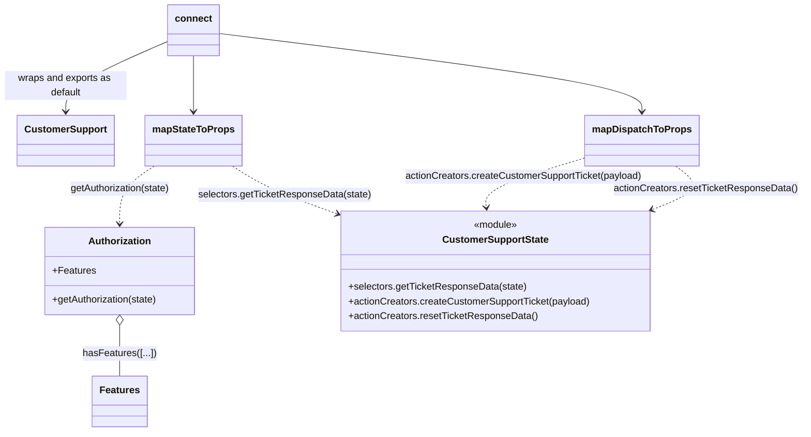

# Diagram: web/portal/src/modules/appnav/components/CustomerSupport/CustomerSupportLink.container.js

> Auto-generated by Obscura crawlers

## Mermaid

### SVG

<svg id="container" width="1318.828125" xmlns="http://www.w3.org/2000/svg" class="classDiagram" height="712" viewBox="0 0 1318.828125 712" role="graphics-document document" aria-roledescription="class"><g><defs><marker id="container_class-aggregationStart" class="marker aggregation class" refX="18" refY="7" markerWidth="190" markerHeight="240" orient="auto"><path d="M 18,7 L9,13 L1,7 L9,1 Z"></path></marker></defs><defs><marker id="container_class-aggregationEnd" class="marker aggregation class" refX="1" refY="7" markerWidth="20" markerHeight="28" orient="auto"><path d="M 18,7 L9,13 L1,7 L9,1 Z"></path></marker></defs><defs><marker id="container_class-extensionStart" class="marker extension class" refX="18" refY="7" markerWidth="190" markerHeight="240" orient="auto"><path d="M 1,7 L18,13 V 1 Z"></path></marker></defs><defs><marker id="container_class-extensionEnd" class="marker extension class" refX="1" refY="7" markerWidth="20" markerHeight="28" orient="auto"><path d="M 1,1 V 13 L18,7 Z"></path></marker></defs><defs><marker id="container_class-compositionStart" class="marker composition class" refX="18" refY="7" markerWidth="190" markerHeight="240" orient="auto"><path d="M 18,7 L9,13 L1,7 L9,1 Z"></path></marker></defs><defs><marker id="container_class-compositionEnd" class="marker composition class" refX="1" refY="7" markerWidth="20" markerHeight="28" orient="auto"><path d="M 18,7 L9,13 L1,7 L9,1 Z"></path></marker></defs><defs><marker id="container_class-dependencyStart" class="marker dependency class" refX="6" refY="7" markerWidth="190" markerHeight="240" orient="auto"><path d="M 5,7 L9,13 L1,7 L9,1 Z"></path></marker></defs><defs><marker id="container_class-dependencyEnd" class="marker dependency class" refX="13" refY="7" markerWidth="20" markerHeight="28" orient="auto"><path d="M 18,7 L9,13 L14,7 L9,1 Z"></path></marker></defs><defs><marker id="container_class-lollipopStart" class="marker lollipop class" refX="13" refY="7" markerWidth="190" markerHeight="240" orient="auto"><circle stroke="black" fill="transparent" cx="7" cy="7" r="6"></circle></marker></defs><defs><marker id="container_class-lollipopEnd" class="marker lollipop class" refX="1" refY="7" markerWidth="190" markerHeight="240" orient="auto"><circle stroke="black" fill="transparent" cx="7" cy="7" r="6"></circle></marker></defs><g class="root"><g class="clusters"></g><g class="edgePaths"><path d="M376.631,274L386.224,280.167C395.817,286.333,415.002,298.667,443.349,311.688C471.696,324.708,509.204,338.417,527.958,345.271L546.712,352.125" id="id_mapStateToProps_CustomerSupportState_1" class="edge-thickness-normal edge-pattern-dashed relation" style=";;;" data-edge="true" data-et="edge" data-id="id_mapStateToProps_CustomerSupportState_1" data-points="W3sieCI6Mzc2LjYzMTEzMTMyOTExMzk0LCJ5IjoyNzR9LHsieCI6NDM0LjE4NzUsInkiOjMxMX0seyJ4Ijo1NTIuMzQ3NjU2MjUsInkiOjM1NC4xODQ3MzI2MzIxMDkzM31d" marker-end="url(#container_class-dependencyEnd)"></path><path d="M245.963,274L236.37,280.167C226.777,286.333,207.592,298.667,197.999,314.5C188.406,330.333,188.406,349.667,188.406,359.333L188.406,369" id="id_mapStateToProps_Authorization_2" class="edge-thickness-normal edge-pattern-dashed relation" style=";;;" data-edge="true" data-et="edge" data-id="id_mapStateToProps_Authorization_2" data-points="W3sieCI6MjQ1Ljk2MjYxODY3MDg4NjA2LCJ5IjoyNzR9LHsieCI6MTg4LjQwNjI1LCJ5IjozMTF9LHsieCI6MTg4LjQwNjI1LCJ5IjozNzV9XQ==" marker-end="url(#container_class-dependencyEnd)"></path><path d="M188.406,536.25L188.406,544.042C188.406,551.833,188.406,567.417,188.406,581.375C188.406,595.333,188.406,607.667,188.406,613.833L188.406,620" id="id_Authorization_Features_3" class="edge-thickness-normal edge-pattern-solid relation" style=";;;" data-edge="true" data-et="edge" data-id="id_Authorization_Features_3" data-points="W3sieCI6MTg4LjQwNjI1LCJ5Ijo1MTl9LHsieCI6MTg4LjQwNjI1LCJ5Ijo1ODN9LHsieCI6MTg4LjQwNjI1LCJ5Ijo2MjB9XQ==" marker-start="url(#container_class-aggregationStart)"></path><path d="M968.898,258.533L939.503,267.278C910.107,276.022,851.315,293.511,822.443,307.427C793.572,321.344,794.62,331.687,795.144,336.859L795.668,342.031" id="id_mapDispatchToProps_CustomerSupportState_4" class="edge-thickness-normal edge-pattern-dashed relation" style=";;;" data-edge="true" data-et="edge" data-id="id_mapDispatchToProps_CustomerSupportState_4" data-points="W3sieCI6OTY4Ljg5ODQzNzUsInkiOjI1OC41MzMxOTgwMTEzNTUzfSx7IngiOjc5Mi41MjM0Mzc1LCJ5IjozMTF9LHsieCI6Nzk2LjI3Mjc0ODE2MTc2NDgsInkiOjM0OH1d" marker-end="url(#container_class-dependencyEnd)"></path><path d="M1112.135,274L1120.069,280.167C1128.004,286.333,1143.873,298.667,1136.161,310.854C1128.449,323.042,1097.155,335.083,1081.508,341.104L1065.861,347.125" id="id_mapDispatchToProps_CustomerSupportState_5" class="edge-thickness-normal edge-pattern-dashed relation" style=";;;" data-edge="true" data-et="edge" data-id="id_mapDispatchToProps_CustomerSupportState_5" data-points="W3sieCI6MTExMi4xMzQ2OTE0NTU2OTYyLCJ5IjoyNzR9LHsieCI6MTE1OS43NDIxODc1LCJ5IjozMTF9LHsieCI6MTA2MC4yNjE3MTg3NSwieSI6MzQ5LjI3OTMxMDM0NDgyNzZ9XQ==" marker-end="url(#container_class-dependencyEnd)"></path><path d="M311.297,92L311.297,100.167C311.297,108.333,311.297,124.667,311.297,140C311.297,155.333,311.297,169.667,311.297,176.833L311.297,184" id="id_connect_mapStateToProps_6" class="edge-thickness-normal edge-pattern-solid relation" style=";;;" data-edge="true" data-et="edge" data-id="id_connect_mapStateToProps_6" data-points="W3sieCI6MzExLjI5Njg3NSwieSI6OTJ9LHsieCI6MzExLjI5Njg3NSwieSI6MTQxfSx7IngiOjMxMS4yOTY4NzUsInkiOjE5MH1d" marker-end="url(#container_class-dependencyEnd)"></path><path d="M352.211,54.986L469.858,69.321C587.505,83.657,822.799,112.329,940.447,133.831C1058.094,155.333,1058.094,169.667,1058.094,176.833L1058.094,184" id="id_connect_mapDispatchToProps_7" class="edge-thickness-normal edge-pattern-solid relation" style=";;;" data-edge="true" data-et="edge" data-id="id_connect_mapDispatchToProps_7" data-points="W3sieCI6MzUyLjIxMDkzNzUsInkiOjU0Ljk4NTUzMTk1OTQwOTk4fSx7IngiOjEwNTguMDkzNzUsInkiOjE0MX0seyJ4IjoxMDU4LjA5Mzc1LCJ5IjoxOTB9XQ==" marker-end="url(#container_class-dependencyEnd)"></path><path d="M270.383,68.314L243.319,80.428C216.255,92.543,162.128,116.771,135.064,136.052C108,155.333,108,169.667,108,176.833L108,184" id="id_connect_CustomerSupport_8" class="edge-thickness-normal edge-pattern-solid relation" style=";;;" data-edge="true" data-et="edge" data-id="id_connect_CustomerSupport_8" data-points="W3sieCI6MjcwLjM4MjgxMjUsInkiOjY4LjMxNDAwMzUzNTQ3fSx7IngiOjEwOCwieSI6MTQxfSx7IngiOjEwOCwieSI6MTkwfV0=" marker-end="url(#container_class-dependencyEnd)"></path></g><g class="edgeLabels"><g class="edgeLabel" transform="translate(461.13477, 320.84859)"><g class="label" data-id="id_mapStateToProps_CustomerSupportState_1" transform="translate(-142.203125, -12)"><foreignObject width="284.40625" height="24">

selectors.getTicketResponseData(state)

</foreignObject></g></g><g class="edgeLabel" transform="translate(188.40625, 311)"><g class="label" data-id="id_mapStateToProps_Authorization_2" transform="translate(-83.578125, -12)"><foreignObject width="167.15625" height="24">

getAuthorization(state)

</foreignObject></g></g><g class="edgeLabel" transform="translate(188.40625, 583)"><g class="label" data-id="id_Authorization_Features_3" transform="translate(-59.59375, -12)"><foreignObject width="119.1875" height="24">

hasFeatures([...])

</foreignObject></g></g><g class="edgeLabel" transform="translate(862.88806, 290.06842)"><g class="label" data-id="id_mapDispatchToProps_CustomerSupportState_4" transform="translate(-196.1328125, -12)"><foreignObject width="392.265625" height="24">

actionCreators.createCustomerSupportTicket(payload)

</foreignObject></g></g><g class="edgeLabel" transform="translate(1159.7421875, 311)"><g class="label" data-id="id_mapDispatchToProps_CustomerSupportState_5" transform="translate(-151.0859375, -12)"><foreignObject width="302.171875" height="24">

actionCreators.resetTicketResponseData()

</foreignObject></g></g><g class="edgeLabel"><g class="label" data-id="id_connect_mapStateToProps_6" transform="translate(0, 0)"><foreignObject width="0" height="0">

</foreignObject></g></g><g class="edgeLabel"><g class="label" data-id="id_connect_mapDispatchToProps_7" transform="translate(0, 0)"><foreignObject width="0" height="0">

</foreignObject></g></g><g class="edgeLabel" transform="translate(108, 141)"><g class="label" data-id="id_connect_CustomerSupport_8" transform="translate(-100, -24)"><foreignObject width="200" height="48">

wraps and exports as default

</foreignObject></g></g></g><g class="nodes"><g class="node default" id="classId-CustomerSupport-0" transform="translate(108, 232)"><g class="basic label-container"><path d="M-76.5859375 -42 L76.5859375 -42 L76.5859375 42 L-76.5859375 42" stroke="none" stroke-width="0" fill="#ECECFF" style=""></path><path d="M-76.5859375 -42 C-45.22997471148287 -42, -13.874011922965728 -42, 76.5859375 -42 M-76.5859375 -42 C-24.957619036949374 -42, 26.67069942610125 -42, 76.5859375 -42 M76.5859375 -42 C76.5859375 -19.30676857737848, 76.5859375 3.386462845243038, 76.5859375 42 M76.5859375 -42 C76.5859375 -22.20292291704117, 76.5859375 -2.405845834082342, 76.5859375 42 M76.5859375 42 C30.676943506883227 42, -15.232050486233547 42, -76.5859375 42 M76.5859375 42 C39.51011516110991 42, 2.434292822219817 42, -76.5859375 42 M-76.5859375 42 C-76.5859375 24.48400969013272, -76.5859375 6.968019380265439, -76.5859375 -42 M-76.5859375 42 C-76.5859375 16.868380531511097, -76.5859375 -8.263238936977807, -76.5859375 -42" stroke="#9370DB" stroke-width="1.3" fill="none" stroke-dasharray="0 0" style=""></path></g><g class="annotation-group text" transform="translate(0, -18)"></g><g class="label-group text" transform="translate(-64.5859375, -18)"><g class="label" style="font-weight: bolder" transform="translate(0,-12)"><foreignObject width="129.171875" height="24">

CustomerSupport

</foreignObject></g></g><g class="members-group text" transform="translate(-64.5859375, 30)"></g><g class="methods-group text" transform="translate(-64.5859375, 60)"></g><g class="divider" style=""><path d="M-76.5859375 6 C-27.193451522413042 6, 22.199034455173916 6, 76.5859375 6 M-76.5859375 6 C-22.664283852967074 6, 31.257369794065852 6, 76.5859375 6" stroke="#9370DB" stroke-width="1.3" fill="none" stroke-dasharray="0 0" style=""></path></g><g class="divider" style=""><path d="M-76.5859375 24 C-17.664342190627224 24, 41.25725311874555 24, 76.5859375 24 M-76.5859375 24 C-25.104342162579066 24, 26.37725317484187 24, 76.5859375 24" stroke="#9370DB" stroke-width="1.3" fill="none" stroke-dasharray="0 0" style=""></path></g></g><g class="node default" id="classId-connect-1" transform="translate(311.296875, 50)"><g class="basic label-container"><path d="M-40.9140625 -42 L40.9140625 -42 L40.9140625 42 L-40.9140625 42" stroke="none" stroke-width="0" fill="#ECECFF" style=""></path><path d="M-40.9140625 -42 C-12.29344889872323 -42, 16.32716470255354 -42, 40.9140625 -42 M-40.9140625 -42 C-22.443500141810542 -42, -3.9729377836210844 -42, 40.9140625 -42 M40.9140625 -42 C40.9140625 -21.878527104699046, 40.9140625 -1.7570542093980919, 40.9140625 42 M40.9140625 -42 C40.9140625 -8.871160071282553, 40.9140625 24.257679857434894, 40.9140625 42 M40.9140625 42 C24.229045167670762 42, 7.544027835341524 42, -40.9140625 42 M40.9140625 42 C14.235856405620378 42, -12.442349688759244 42, -40.9140625 42 M-40.9140625 42 C-40.9140625 12.317099497999116, -40.9140625 -17.365801004001767, -40.9140625 -42 M-40.9140625 42 C-40.9140625 21.017000299158234, -40.9140625 0.03400059831646729, -40.9140625 -42" stroke="#9370DB" stroke-width="1.3" fill="none" stroke-dasharray="0 0" style=""></path></g><g class="annotation-group text" transform="translate(0, -18)"></g><g class="label-group text" transform="translate(-28.9140625, -18)"><g class="label" style="font-weight: bolder" transform="translate(0,-12)"><foreignObject width="57.828125" height="24">

connect

</foreignObject></g></g><g class="members-group text" transform="translate(-28.9140625, 30)"></g><g class="methods-group text" transform="translate(-28.9140625, 60)"></g><g class="divider" style=""><path d="M-40.9140625 6 C-8.190297780658227 6, 24.533466938683546 6, 40.9140625 6 M-40.9140625 6 C-21.405846581443814 6, -1.8976306628876287 6, 40.9140625 6" stroke="#9370DB" stroke-width="1.3" fill="none" stroke-dasharray="0 0" style=""></path></g><g class="divider" style=""><path d="M-40.9140625 24 C-9.12952755400391 24, 22.65500739199218 24, 40.9140625 24 M-40.9140625 24 C-10.670285813483076 24, 19.573490873033847 24, 40.9140625 24" stroke="#9370DB" stroke-width="1.3" fill="none" stroke-dasharray="0 0" style=""></path></g></g><g class="node default" id="classId-mapStateToProps-2" transform="translate(311.296875, 232)"><g class="basic label-container"><path d="M-76.7109375 -42 L76.7109375 -42 L76.7109375 42 L-76.7109375 42" stroke="none" stroke-width="0" fill="#ECECFF" style=""></path><path d="M-76.7109375 -42 C-32.55637854907263 -42, 11.598180401854734 -42, 76.7109375 -42 M-76.7109375 -42 C-32.279984664608854 -42, 12.150968170782292 -42, 76.7109375 -42 M76.7109375 -42 C76.7109375 -14.155495094168888, 76.7109375 13.689009811662224, 76.7109375 42 M76.7109375 -42 C76.7109375 -11.563079258879004, 76.7109375 18.873841482241993, 76.7109375 42 M76.7109375 42 C42.14719174757673 42, 7.583445995153454 42, -76.7109375 42 M76.7109375 42 C19.38744403455317 42, -37.93604943089366 42, -76.7109375 42 M-76.7109375 42 C-76.7109375 23.576492958707394, -76.7109375 5.152985917414789, -76.7109375 -42 M-76.7109375 42 C-76.7109375 8.989684078524142, -76.7109375 -24.020631842951715, -76.7109375 -42" stroke="#9370DB" stroke-width="1.3" fill="none" stroke-dasharray="0 0" style=""></path></g><g class="annotation-group text" transform="translate(0, -18)"></g><g class="label-group text" transform="translate(-64.7109375, -18)"><g class="label" style="font-weight: bolder" transform="translate(0,-12)"><foreignObject width="129.421875" height="24">

mapStateToProps

</foreignObject></g></g><g class="members-group text" transform="translate(-64.7109375, 30)"></g><g class="methods-group text" transform="translate(-64.7109375, 60)"></g><g class="divider" style=""><path d="M-76.7109375 6 C-20.484577389960883 6, 35.741782720078234 6, 76.7109375 6 M-76.7109375 6 C-39.94467512608419 6, -3.1784127521683843 6, 76.7109375 6" stroke="#9370DB" stroke-width="1.3" fill="none" stroke-dasharray="0 0" style=""></path></g><g class="divider" style=""><path d="M-76.7109375 24 C-21.416073546568676 24, 33.87879040686265 24, 76.7109375 24 M-76.7109375 24 C-21.839204429603626 24, 33.03252864079275 24, 76.7109375 24" stroke="#9370DB" stroke-width="1.3" fill="none" stroke-dasharray="0 0" style=""></path></g></g><g class="node default" id="classId-mapDispatchToProps-3" transform="translate(1058.09375, 232)"><g class="basic label-container"><path d="M-89.1953125 -42 L89.1953125 -42 L89.1953125 42 L-89.1953125 42" stroke="none" stroke-width="0" fill="#ECECFF" style=""></path><path d="M-89.1953125 -42 C-44.182671255497496 -42, 0.8299699890050078 -42, 89.1953125 -42 M-89.1953125 -42 C-42.00869491441904 -42, 5.177922671161923 -42, 89.1953125 -42 M89.1953125 -42 C89.1953125 -19.23386106848673, 89.1953125 3.5322778630265432, 89.1953125 42 M89.1953125 -42 C89.1953125 -14.610217405640174, 89.1953125 12.779565188719651, 89.1953125 42 M89.1953125 42 C28.587185480587372 42, -32.020941538825255 42, -89.1953125 42 M89.1953125 42 C44.237123607147595 42, -0.7210652857048103 42, -89.1953125 42 M-89.1953125 42 C-89.1953125 11.15624338104119, -89.1953125 -19.68751323791762, -89.1953125 -42 M-89.1953125 42 C-89.1953125 13.98222927551818, -89.1953125 -14.035541448963642, -89.1953125 -42" stroke="#9370DB" stroke-width="1.3" fill="none" stroke-dasharray="0 0" style=""></path></g><g class="annotation-group text" transform="translate(0, -18)"></g><g class="label-group text" transform="translate(-77.1953125, -18)"><g class="label" style="font-weight: bolder" transform="translate(0,-12)"><foreignObject width="154.390625" height="24">

mapDispatchToProps

</foreignObject></g></g><g class="members-group text" transform="translate(-77.1953125, 30)"></g><g class="methods-group text" transform="translate(-77.1953125, 60)"></g><g class="divider" style=""><path d="M-89.1953125 6 C-39.900440807054075 6, 9.39443088589185 6, 89.1953125 6 M-89.1953125 6 C-22.626782720683266 6, 43.94174705863347 6, 89.1953125 6" stroke="#9370DB" stroke-width="1.3" fill="none" stroke-dasharray="0 0" style=""></path></g><g class="divider" style=""><path d="M-89.1953125 24 C-34.91603235348356 24, 19.363247793032883 24, 89.1953125 24 M-89.1953125 24 C-19.096768613045825 24, 51.00177527390835 24, 89.1953125 24" stroke="#9370DB" stroke-width="1.3" fill="none" stroke-dasharray="0 0" style=""></path></g></g><g class="node default" id="classId-Authorization-4" transform="translate(188.40625, 447)"><g class="basic label-container"><path d="M-124.42578125 -72 L124.42578125 -72 L124.42578125 72 L-124.42578125 72" stroke="none" stroke-width="0" fill="#ECECFF" style=""></path><path d="M-124.42578125 -72 C-54.46597089194046 -72, 15.493839466119084 -72, 124.42578125 -72 M-124.42578125 -72 C-38.03510557934564 -72, 48.35557009130872 -72, 124.42578125 -72 M124.42578125 -72 C124.42578125 -17.892208323160673, 124.42578125 36.21558335367865, 124.42578125 72 M124.42578125 -72 C124.42578125 -41.92036898318045, 124.42578125 -11.840737966360912, 124.42578125 72 M124.42578125 72 C67.38331643236506 72, 10.340851614730141 72, -124.42578125 72 M124.42578125 72 C26.94298825036944 72, -70.53980474926112 72, -124.42578125 72 M-124.42578125 72 C-124.42578125 27.7021745272393, -124.42578125 -16.5956509455214, -124.42578125 -72 M-124.42578125 72 C-124.42578125 25.30667266202677, -124.42578125 -21.38665467594646, -124.42578125 -72" stroke="#9370DB" stroke-width="1.3" fill="none" stroke-dasharray="0 0" style=""></path></g><g class="annotation-group text" transform="translate(0, -48)"></g><g class="label-group text" transform="translate(-49.7109375, -48)"><g class="label" style="font-weight: bolder" transform="translate(0,-12)"><foreignObject width="99.421875" height="24">

Authorization

</foreignObject></g></g><g class="members-group text" transform="translate(-112.42578125, 0)"><g class="label" style="" transform="translate(0,-12)"><foreignObject width="69.53125" height="24">

+Features

</foreignObject></g></g><g class="methods-group text" transform="translate(-112.42578125, 48)"><g class="label" style="" transform="translate(0,-12)"><foreignObject width="175.140625" height="24">

+getAuthorization(state)

</foreignObject></g></g><g class="divider" style=""><path d="M-124.42578125 -24 C-62.13018713126065 -24, 0.16540698747870408 -24, 124.42578125 -24 M-124.42578125 -24 C-59.49298245256335 -24, 5.439816344873293 -24, 124.42578125 -24" stroke="#9370DB" stroke-width="1.3" fill="none" stroke-dasharray="0 0" style=""></path></g><g class="divider" style=""><path d="M-124.42578125 24 C-33.4463563087607 24, 57.5330686324786 24, 124.42578125 24 M-124.42578125 24 C-51.725792310207154 24, 20.97419662958569 24, 124.42578125 24" stroke="#9370DB" stroke-width="1.3" fill="none" stroke-dasharray="0 0" style=""></path></g></g><g class="node default" id="classId-CustomerSupportState-5" transform="translate(806.3046875, 447)"><g class="basic label-container"><path d="M-253.95703125 -99 L253.95703125 -99 L253.95703125 99 L-253.95703125 99" stroke="none" stroke-width="0" fill="#ECECFF" style=""></path><path d="M-253.95703125 -99 C-98.40297692386036 -99, 57.15107740227927 -99, 253.95703125 -99 M-253.95703125 -99 C-75.59277406452227 -99, 102.77148312095545 -99, 253.95703125 -99 M253.95703125 -99 C253.95703125 -42.75134397271662, 253.95703125 13.497312054566763, 253.95703125 99 M253.95703125 -99 C253.95703125 -42.68809578566248, 253.95703125 13.623808428675034, 253.95703125 99 M253.95703125 99 C114.61315399357264 99, -24.730723262854724 99, -253.95703125 99 M253.95703125 99 C109.23146651345854 99, -35.494098223082915 99, -253.95703125 99 M-253.95703125 99 C-253.95703125 56.76705922337466, -253.95703125 14.534118446749318, -253.95703125 -99 M-253.95703125 99 C-253.95703125 56.16220656064687, -253.95703125 13.324413121293745, -253.95703125 -99" stroke="#9370DB" stroke-width="1.3" fill="none" stroke-dasharray="0 0" style=""></path></g><g class="annotation-group text" transform="translate(-36.6015625, -75)"><g class="label" style="" transform="translate(0,-12)"><foreignObject width="73.203125" height="24">

«module»

</foreignObject></g></g><g class="label-group text" transform="translate(-83.8984375, -51)"><g class="label" style="font-weight: bolder" transform="translate(0,-12)"><foreignObject width="167.796875" height="24">

CustomerSupportState

</foreignObject></g></g><g class="members-group text" transform="translate(-241.95703125, -3)"></g><g class="methods-group text" transform="translate(-241.95703125, 27)"><g class="label" style="" transform="translate(0,-12)"><foreignObject width="292.390625" height="24">

+selectors.getTicketResponseData(state)

</foreignObject></g><g class="label" style="" transform="translate(0,12)"><foreignObject width="400.015625" height="24">

+actionCreators.createCustomerSupportTicket(payload)

</foreignObject></g><g class="label" style="" transform="translate(0,36)"><foreignObject width="309.90625" height="24">

+actionCreators.resetTicketResponseData()

</foreignObject></g></g><g class="divider" style=""><path d="M-253.95703125 -27 C-90.05389836465122 -27, 73.84923452069756 -27, 253.95703125 -27 M-253.95703125 -27 C-82.88831733566758 -27, 88.18039657866484 -27, 253.95703125 -27" stroke="#9370DB" stroke-width="1.3" fill="none" stroke-dasharray="0 0" style=""></path></g><g class="divider" style=""><path d="M-253.95703125 -3 C-116.5801693965588 -3, 20.796692456882397 -3, 253.95703125 -3 M-253.95703125 -3 C-57.59790154804813 -3, 138.76122815390374 -3, 253.95703125 -3" stroke="#9370DB" stroke-width="1.3" fill="none" stroke-dasharray="0 0" style=""></path></g></g><g class="node default" id="classId-Features-6" transform="translate(188.40625, 662)"><g class="basic label-container"><path d="M-43.25 -42 L43.25 -42 L43.25 42 L-43.25 42" stroke="none" stroke-width="0" fill="#ECECFF" style=""></path><path d="M-43.25 -42 C-24.208961668780525 -42, -5.167923337561049 -42, 43.25 -42 M-43.25 -42 C-23.90425394453739 -42, -4.558507889074782 -42, 43.25 -42 M43.25 -42 C43.25 -9.092896102305701, 43.25 23.814207795388597, 43.25 42 M43.25 -42 C43.25 -24.95792554438903, 43.25 -7.915851088778062, 43.25 42 M43.25 42 C16.477950457299634 42, -10.294099085400731 42, -43.25 42 M43.25 42 C23.388026001511356 42, 3.5260520030227127 42, -43.25 42 M-43.25 42 C-43.25 13.328879604986113, -43.25 -15.342240790027773, -43.25 -42 M-43.25 42 C-43.25 24.094231471717375, -43.25 6.18846294343475, -43.25 -42" stroke="#9370DB" stroke-width="1.3" fill="none" stroke-dasharray="0 0" style=""></path></g><g class="annotation-group text" transform="translate(0, -18)"></g><g class="label-group text" transform="translate(-31.25, -18)"><g class="label" style="font-weight: bolder" transform="translate(0,-12)"><foreignObject width="62.5" height="24">

Features

</foreignObject></g></g><g class="members-group text" transform="translate(-31.25, 30)"></g><g class="methods-group text" transform="translate(-31.25, 60)"></g><g class="divider" style=""><path d="M-43.25 6 C-12.768158448877202 6, 17.713683102245597 6, 43.25 6 M-43.25 6 C-16.591149983508508 6, 10.067700032982984 6, 43.25 6" stroke="#9370DB" stroke-width="1.3" fill="none" stroke-dasharray="0 0" style=""></path></g><g class="divider" style=""><path d="M-43.25 24 C-19.15387052152121 24, 4.9422589569575806 24, 43.25 24 M-43.25 24 C-13.38279372211117 24, 16.48441255577766 24, 43.25 24" stroke="#9370DB" stroke-width="1.3" fill="none" stroke-dasharray="0 0" style=""></path></g></g></g></g></g></svg>
