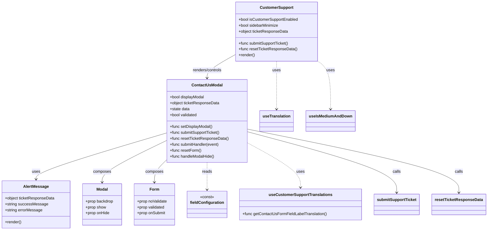
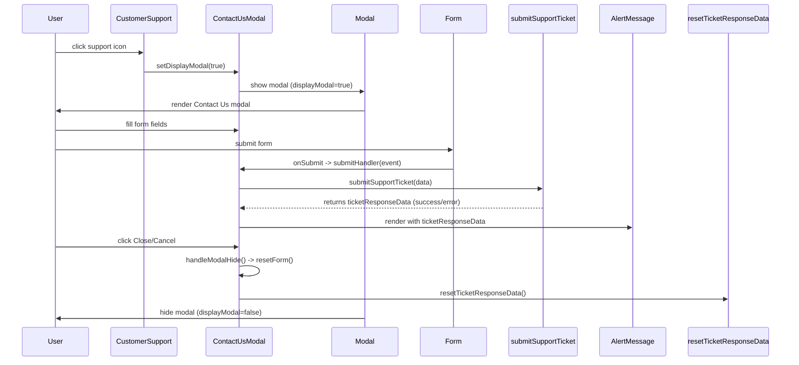

# Diagram: web/portal/src/modules/appnav/components/CustomerSupport/CustomerSupportLink.js

> Auto-generated by Obscura crawlers

## Diagram 1

### SVG

<svg id="container" width="1949.5546875" xmlns="http://www.w3.org/2000/svg" class="classDiagram" height="932" viewBox="0 0 1949.5546875 932" role="graphics-document document" aria-roledescription="class"><g><defs><marker id="container_class-aggregationStart" class="marker aggregation class" refX="18" refY="7" markerWidth="190" markerHeight="240" orient="auto"><path d="M 18,7 L9,13 L1,7 L9,1 Z"></path></marker></defs><defs><marker id="container_class-aggregationEnd" class="marker aggregation class" refX="1" refY="7" markerWidth="20" markerHeight="28" orient="auto"><path d="M 18,7 L9,13 L1,7 L9,1 Z"></path></marker></defs><defs><marker id="container_class-extensionStart" class="marker extension class" refX="18" refY="7" markerWidth="190" markerHeight="240" orient="auto"><path d="M 1,7 L18,13 V 1 Z"></path></marker></defs><defs><marker id="container_class-extensionEnd" class="marker extension class" refX="1" refY="7" markerWidth="20" markerHeight="28" orient="auto"><path d="M 1,1 V 13 L18,7 Z"></path></marker></defs><defs><marker id="container_class-compositionStart" class="marker composition class" refX="18" refY="7" markerWidth="190" markerHeight="240" orient="auto"><path d="M 18,7 L9,13 L1,7 L9,1 Z"></path></marker></defs><defs><marker id="container_class-compositionEnd" class="marker composition class" refX="1" refY="7" markerWidth="20" markerHeight="28" orient="auto"><path d="M 18,7 L9,13 L1,7 L9,1 Z"></path></marker></defs><defs><marker id="container_class-dependencyStart" class="marker dependency class" refX="6" refY="7" markerWidth="190" markerHeight="240" orient="auto"><path d="M 5,7 L9,13 L1,7 L9,1 Z"></path></marker></defs><defs><marker id="container_class-dependencyEnd" class="marker dependency class" refX="13" refY="7" markerWidth="20" markerHeight="28" orient="auto"><path d="M 18,7 L9,13 L14,7 L9,1 Z"></path></marker></defs><defs><marker id="container_class-lollipopStart" class="marker lollipop class" refX="13" refY="7" markerWidth="190" markerHeight="240" orient="auto"><circle stroke="black" fill="transparent" cx="7" cy="7" r="6"></circle></marker></defs><defs><marker id="container_class-lollipopEnd" class="marker lollipop class" refX="1" refY="7" markerWidth="190" markerHeight="240" orient="auto"><circle stroke="black" fill="transparent" cx="7" cy="7" r="6"></circle></marker></defs><g class="root"><g class="clusters"></g><g class="edgePaths"><path d="M946.824,222.324L928.449,232.77C910.073,243.216,873.322,264.108,854.946,279.721C836.57,295.333,836.57,305.667,836.57,310.833L836.57,316" id="id_CustomerSupport_ContactUsModal_1" class="edge-thickness-normal edge-pattern-solid relation" style=";;;" data-edge="true" data-et="edge" data-id="id_CustomerSupport_ContactUsModal_1" data-points="W3sieCI6OTQ2LjgyNDIxODc1LCJ5IjoyMjIuMzIzOTA4ODAwMzE2ODF9LHsieCI6ODM2LjU3MDMxMjUsInkiOjI4NX0seyJ4Ijo4MzYuNTcwMzEyNSwieSI6MzIyfV0=" marker-end="url(#container_class-dependencyEnd)"></path><path d="M676.477,537.472L587.937,563.727C499.397,589.982,322.318,642.491,233.778,673.912C145.238,705.333,145.238,715.667,145.238,720.833L145.238,726" id="id_ContactUsModal_AlertMessage_2" class="edge-thickness-normal edge-pattern-solid relation" style=";;;" data-edge="true" data-et="edge" data-id="id_ContactUsModal_AlertMessage_2" data-points="W3sieCI6Njc2LjQ3NjU2MjUsInkiOjUzNy40NzI0NDA1NDQ0NjUzfSx7IngiOjE0NS4yMzgyODEyNSwieSI6Njk1fSx7IngiOjE0NS4yMzgyODEyNSwieSI6NzMyfV0=" marker-end="url(#container_class-dependencyEnd)"></path><path d="M676.477,567.44L632.525,588.7C588.574,609.96,500.672,652.48,456.721,680.907C412.77,709.333,412.77,723.667,412.77,730.833L412.77,738" id="id_ContactUsModal_Modal_3" class="edge-thickness-normal edge-pattern-solid relation" style=";;;" data-edge="true" data-et="edge" data-id="id_ContactUsModal_Modal_3" data-points="W3sieCI6Njc2LjQ3NjU2MjUsInkiOjU2Ny40NDAyMDM1MTU0MzQyfSx7IngiOjQxMi43Njk1MzEyNSwieSI6Njk1fSx7IngiOjQxMi43Njk1MzEyNSwieSI6NzQ0fV0=" marker-end="url(#container_class-dependencyEnd)"></path><path d="M676.477,645.827L668.057,654.022C659.637,662.218,642.797,678.609,634.377,693.971C625.957,709.333,625.957,723.667,625.957,730.833L625.957,738" id="id_ContactUsModal_Form_4" class="edge-thickness-normal edge-pattern-solid relation" style=";;;" data-edge="true" data-et="edge" data-id="id_ContactUsModal_Form_4" data-points="W3sieCI6Njc2LjQ3NjU2MjUsInkiOjY0NS44MjY5MTkxNTM1MTM3fSx7IngiOjYyNS45NTcwMzEyNSwieSI6Njk1fSx7IngiOjYyNS45NTcwMzEyNSwieSI6NzQ0fV0=" marker-end="url(#container_class-dependencyEnd)"></path><path d="M836.57,658L836.57,664.167C836.57,670.333,836.57,682.667,836.57,701C836.57,719.333,836.57,743.667,836.57,755.833L836.57,768" id="id_ContactUsModal_fieldConfiguration_5" class="edge-thickness-normal edge-pattern-dashed relation" style=";;;" data-edge="true" data-et="edge" data-id="id_ContactUsModal_fieldConfiguration_5" data-points="W3sieCI6ODM2LjU3MDMxMjUsInkiOjY1OH0seyJ4Ijo4MzYuNTcwMzEyNSwieSI6Njk1fSx7IngiOjgzNi41NzAzMTI1LCJ5Ijo3NzR9XQ==" marker-end="url(#container_class-dependencyEnd)"></path><path d="M996.664,578.264L1031.953,597.72C1067.242,617.176,1137.82,656.088,1173.109,686.211C1208.398,716.333,1208.398,737.667,1208.398,748.333L1208.398,759" id="id_ContactUsModal_useCustomerSupportTranslations_6" class="edge-thickness-normal edge-pattern-dashed relation" style=";;;" data-edge="true" data-et="edge" data-id="id_ContactUsModal_useCustomerSupportTranslations_6" data-points="W3sieCI6OTk2LjY2NDA2MjUsInkiOjU3OC4yNjQ0ODcxMjAyMjUyfSx7IngiOjEyMDguMzk4NDM3NSwieSI6Njk1fSx7IngiOjEyMDguMzk4NDM3NSwieSI6NzY1fV0=" marker-end="url(#container_class-dependencyEnd)"></path><path d="M996.664,533.46L1095.841,560.383C1195.018,587.307,1393.372,641.153,1492.549,682.243C1591.727,723.333,1591.727,751.667,1591.727,765.833L1591.727,780" id="id_ContactUsModal_submitSupportTicket_7" class="edge-thickness-normal edge-pattern-solid relation" style=";;;" data-edge="true" data-et="edge" data-id="id_ContactUsModal_submitSupportTicket_7" data-points="W3sieCI6OTk2LjY2NDA2MjUsInkiOjUzMy40NjAxNjk2NjY4NzM1fSx7IngiOjE1OTEuNzI2NTYyNSwieSI6Njk1fSx7IngiOjE1OTEuNzI2NTYyNSwieSI6Nzg2fV0=" marker-end="url(#container_class-dependencyEnd)"></path><path d="M996.664,522.83L1136.595,551.525C1276.526,580.22,1556.388,637.61,1696.319,680.472C1836.25,723.333,1836.25,751.667,1836.25,765.833L1836.25,780" id="id_ContactUsModal_resetTicketResponseData_8" class="edge-thickness-normal edge-pattern-solid relation" style=";;;" data-edge="true" data-et="edge" data-id="id_ContactUsModal_resetTicketResponseData_8" data-points="W3sieCI6OTk2LjY2NDA2MjUsInkiOjUyMi44Mjk3MzQ1MjQzMzk5fSx7IngiOjE4MzYuMjUsInkiOjY5NX0seyJ4IjoxODM2LjI1LCJ5Ijo3ODZ9XQ==" marker-end="url(#container_class-dependencyEnd)"></path><path d="M1112.75,248L1112.75,254.167C1112.75,260.333,1112.75,272.667,1112.75,305C1112.75,337.333,1112.75,389.667,1112.75,415.833L1112.75,442" id="id_CustomerSupport_useTranslation_9" class="edge-thickness-normal edge-pattern-dashed relation" style=";;;" data-edge="true" data-et="edge" data-id="id_CustomerSupport_useTranslation_9" data-points="W3sieCI6MTExMi43NSwieSI6MjQ4fSx7IngiOjExMTIuNzUsInkiOjI4NX0seyJ4IjoxMTEyLjc1LCJ5Ijo0NDh9XQ==" marker-end="url(#container_class-dependencyEnd)"></path><path d="M1273.928,248L1282.211,254.167C1290.494,260.333,1307.059,272.667,1315.342,305C1323.625,337.333,1323.625,389.667,1323.625,415.833L1323.625,442" id="id_CustomerSupport_useIsMediumAndDown_10" class="edge-thickness-normal edge-pattern-dashed relation" style=";;;" data-edge="true" data-et="edge" data-id="id_CustomerSupport_useIsMediumAndDown_10" data-points="W3sieCI6MTI3My45MjgzNDM5NDkwNDQ2LCJ5IjoyNDh9LHsieCI6MTMyMy42MjUsInkiOjI4NX0seyJ4IjoxMzIzLjYyNSwieSI6NDQ4fV0=" marker-end="url(#container_class-dependencyEnd)"></path></g><g class="edgeLabels"><g class="edgeLabel" transform="translate(836.5703125, 285)"><g class="label" data-id="id_CustomerSupport_ContactUsModal_1" transform="translate(-61.0234375, -12)"><foreignObject width="122.046875" height="24">

renders/controls

</foreignObject></g></g><g class="edgeLabel" transform="translate(145.23828125, 695)"><g class="label" data-id="id_ContactUsModal_AlertMessage_2" transform="translate(-16.4921875, -12)"><foreignObject width="32.984375" height="24">

uses

</foreignObject></g></g><g class="edgeLabel" transform="translate(412.76953125, 695)"><g class="label" data-id="id_ContactUsModal_Modal_3" transform="translate(-36.453125, -12)"><foreignObject width="72.90625" height="24">

composes

</foreignObject></g></g><g class="edgeLabel" transform="translate(625.95703125, 695)"><g class="label" data-id="id_ContactUsModal_Form_4" transform="translate(-36.453125, -12)"><foreignObject width="72.90625" height="24">

composes

</foreignObject></g></g><g class="edgeLabel" transform="translate(836.5703125, 695)"><g class="label" data-id="id_ContactUsModal_fieldConfiguration_5" transform="translate(-20.0078125, -12)"><foreignObject width="40.015625" height="24">

reads

</foreignObject></g></g><g class="edgeLabel" transform="translate(1208.3984375, 695)"><g class="label" data-id="id_ContactUsModal_useCustomerSupportTranslations_6" transform="translate(-16.4921875, -12)"><foreignObject width="32.984375" height="24">

uses

</foreignObject></g></g><g class="edgeLabel" transform="translate(1591.7265625, 695)"><g class="label" data-id="id_ContactUsModal_submitSupportTicket_7" transform="translate(-16.4453125, -12)"><foreignObject width="32.890625" height="24">

calls

</foreignObject></g></g><g class="edgeLabel" transform="translate(1836.25, 695)"><g class="label" data-id="id_ContactUsModal_resetTicketResponseData_8" transform="translate(-16.4453125, -12)"><foreignObject width="32.890625" height="24">

calls

</foreignObject></g></g><g class="edgeLabel" transform="translate(1112.75, 285)"><g class="label" data-id="id_CustomerSupport_useTranslation_9" transform="translate(-16.4921875, -12)"><foreignObject width="32.984375" height="24">

uses

</foreignObject></g></g><g class="edgeLabel" transform="translate(1323.625, 285)"><g class="label" data-id="id_CustomerSupport_useIsMediumAndDown_10" transform="translate(-16.4921875, -12)"><foreignObject width="32.984375" height="24">

uses

</foreignObject></g></g></g><g class="nodes"><g class="node default" id="classId-CustomerSupport-0" transform="translate(1112.75, 128)"><g class="basic label-container"><path d="M-165.92578125 -120 L165.92578125 -120 L165.92578125 120 L-165.92578125 120" stroke="none" stroke-width="0" fill="#ECECFF" style=""></path><path d="M-165.92578125 -120 C-36.36509152449699 -120, 93.19559820100602 -120, 165.92578125 -120 M-165.92578125 -120 C-53.848737554682955 -120, 58.22830614063409 -120, 165.92578125 -120 M165.92578125 -120 C165.92578125 -28.75709317635406, 165.92578125 62.48581364729188, 165.92578125 120 M165.92578125 -120 C165.92578125 -64.20841552318933, 165.92578125 -8.416831046378647, 165.92578125 120 M165.92578125 120 C94.44510208668406 120, 22.96442292336812 120, -165.92578125 120 M165.92578125 120 C80.27271837969738 120, -5.380344490605239 120, -165.92578125 120 M-165.92578125 120 C-165.92578125 30.106050477015856, -165.92578125 -59.78789904596829, -165.92578125 -120 M-165.92578125 120 C-165.92578125 64.64989646075236, -165.92578125 9.299792921504704, -165.92578125 -120" stroke="#9370DB" stroke-width="1.3" fill="none" stroke-dasharray="0 0" style=""></path></g><g class="annotation-group text" transform="translate(0, -96)"></g><g class="label-group text" transform="translate(-64.5859375, -96)"><g class="label" style="font-weight: bolder" transform="translate(0,-12)"><foreignObject width="129.171875" height="24">

CustomerSupport

</foreignObject></g></g><g class="members-group text" transform="translate(-153.92578125, -48)"><g class="label" style="" transform="translate(0,-12)"><foreignObject width="243.265625" height="24">

+bool isCustomerSupportEnabled

</foreignObject></g><g class="label" style="" transform="translate(0,12)"><foreignObject width="164.28125" height="24">

+bool sidebarMinimize

</foreignObject></g><g class="label" style="" transform="translate(0,36)"><foreignObject width="201.453125" height="24">

+object ticketResponseData

</foreignObject></g></g><g class="methods-group text" transform="translate(-153.92578125, 48)"><g class="label" style="" transform="translate(0,-12)"><foreignObject width="205.65625" height="24">

+func submitSupportTicket()

</foreignObject></g><g class="label" style="" transform="translate(0,12)"><foreignObject width="236.6875" height="24">

+func resetTicketResponseData()

</foreignObject></g><g class="label" style="" transform="translate(0,36)"><foreignObject width="66.609375" height="24">

+render()

</foreignObject></g></g><g class="divider" style=""><path d="M-165.92578125 -72 C-54.093761030580225 -72, 57.73825918883955 -72, 165.92578125 -72 M-165.92578125 -72 C-35.876433627480594 -72, 94.17291399503881 -72, 165.92578125 -72" stroke="#9370DB" stroke-width="1.3" fill="none" stroke-dasharray="0 0" style=""></path></g><g class="divider" style=""><path d="M-165.92578125 24 C-51.29551294754501 24, 63.33475535490999 24, 165.92578125 24 M-165.92578125 24 C-59.41530774913406 24, 47.095165751731884 24, 165.92578125 24" stroke="#9370DB" stroke-width="1.3" fill="none" stroke-dasharray="0 0" style=""></path></g></g><g class="node default" id="classId-ContactUsModal-1" transform="translate(836.5703125, 490)"><g class="basic label-container"><path d="M-160.09375 -168 L160.09375 -168 L160.09375 168 L-160.09375 168" stroke="none" stroke-width="0" fill="#ECECFF" style=""></path><path d="M-160.09375 -168 C-82.82774889739262 -168, -5.561747794785248 -168, 160.09375 -168 M-160.09375 -168 C-35.72540240906649 -168, 88.64294518186702 -168, 160.09375 -168 M160.09375 -168 C160.09375 -94.77701821691223, 160.09375 -21.55403643382445, 160.09375 168 M160.09375 -168 C160.09375 -48.06202816375509, 160.09375 71.87594367248983, 160.09375 168 M160.09375 168 C83.5115194703754 168, 6.9292889407508085 168, -160.09375 168 M160.09375 168 C89.68042044238494 168, 19.267090884769885 168, -160.09375 168 M-160.09375 168 C-160.09375 76.63081651632241, -160.09375 -14.738366967355176, -160.09375 -168 M-160.09375 168 C-160.09375 72.79918942944498, -160.09375 -22.40162114111004, -160.09375 -168" stroke="#9370DB" stroke-width="1.3" fill="none" stroke-dasharray="0 0" style=""></path></g><g class="annotation-group text" transform="translate(0, -144)"></g><g class="label-group text" transform="translate(-59.5, -144)"><g class="label" style="font-weight: bolder" transform="translate(0,-12)"><foreignObject width="119" height="24">

ContactUsModal

</foreignObject></g></g><g class="members-group text" transform="translate(-148.09375, -96)"><g class="label" style="" transform="translate(0,-12)"><foreignObject width="141.703125" height="24">

+bool displayModal

</foreignObject></g><g class="label" style="" transform="translate(0,12)"><foreignObject width="201.453125" height="24">

+object ticketResponseData

</foreignObject></g><g class="label" style="" transform="translate(0,36)"><foreignObject width="80.96875" height="24">

+state data

</foreignObject></g><g class="label" style="" transform="translate(0,60)"><foreignObject width="112.5625" height="24">

+bool validated

</foreignObject></g></g><g class="methods-group text" transform="translate(-148.09375, 24)"><g class="label" style="" transform="translate(0,-12)"><foreignObject width="173.359375" height="24">

+func setDisplayModal()

</foreignObject></g><g class="label" style="" transform="translate(0,12)"><foreignObject width="205.65625" height="24">

+func submitSupportTicket()

</foreignObject></g><g class="label" style="" transform="translate(0,36)"><foreignObject width="236.6875" height="24">

+func resetTicketResponseData()

</foreignObject></g><g class="label" style="" transform="translate(0,60)"><foreignObject width="202.71875" height="24">

+func submitHandler(event)

</foreignObject></g><g class="label" style="" transform="translate(0,84)"><foreignObject width="126.96875" height="24">

+func resetForm()

</foreignObject></g><g class="label" style="" transform="translate(0,108)"><foreignObject width="182.6875" height="24">

+func handleModalHide()

</foreignObject></g></g><g class="divider" style=""><path d="M-160.09375 -120 C-35.65191555187171 -120, 88.78991889625658 -120, 160.09375 -120 M-160.09375 -120 C-54.19192787222828 -120, 51.709894255543446 -120, 160.09375 -120" stroke="#9370DB" stroke-width="1.3" fill="none" stroke-dasharray="0 0" style=""></path></g><g class="divider" style=""><path d="M-160.09375 0 C-86.67235317368245 0, -13.250956347364905 0, 160.09375 0 M-160.09375 0 C-41.40879950557883 0, 77.27615098884235 0, 160.09375 0" stroke="#9370DB" stroke-width="1.3" fill="none" stroke-dasharray="0 0" style=""></path></g></g><g class="node default" id="classId-AlertMessage-2" transform="translate(145.23828125, 828)"><g class="basic label-container"><path d="M-137.23828125 -96 L137.23828125 -96 L137.23828125 96 L-137.23828125 96" stroke="none" stroke-width="0" fill="#ECECFF" style=""></path><path d="M-137.23828125 -96 C-47.386594958307924 -96, 42.46509133338415 -96, 137.23828125 -96 M-137.23828125 -96 C-34.75167258900356 -96, 67.73493607199288 -96, 137.23828125 -96 M137.23828125 -96 C137.23828125 -45.81289792636133, 137.23828125 4.374204147277339, 137.23828125 96 M137.23828125 -96 C137.23828125 -37.099822941404085, 137.23828125 21.80035411719183, 137.23828125 96 M137.23828125 96 C77.82498539752392 96, 18.411689545047835 96, -137.23828125 96 M137.23828125 96 C71.31592746903095 96, 5.393573688061906 96, -137.23828125 96 M-137.23828125 96 C-137.23828125 40.09898060715556, -137.23828125 -15.802038785688879, -137.23828125 -96 M-137.23828125 96 C-137.23828125 38.155959193727114, -137.23828125 -19.688081612545773, -137.23828125 -96" stroke="#9370DB" stroke-width="1.3" fill="none" stroke-dasharray="0 0" style=""></path></g><g class="annotation-group text" transform="translate(0, -72)"></g><g class="label-group text" transform="translate(-49.0234375, -72)"><g class="label" style="font-weight: bolder" transform="translate(0,-12)"><foreignObject width="98.046875" height="24">

AlertMessage

</foreignObject></g></g><g class="members-group text" transform="translate(-125.23828125, -24)"><g class="label" style="" transform="translate(0,-12)"><foreignObject width="201.453125" height="24">

+object ticketResponseData

</foreignObject></g><g class="label" style="" transform="translate(0,12)"><foreignObject width="169.921875" height="24">

+string successMessage

</foreignObject></g><g class="label" style="" transform="translate(0,36)"><foreignObject width="151.09375" height="24">

+string errorMessage

</foreignObject></g></g><g class="methods-group text" transform="translate(-125.23828125, 72)"><g class="label" style="" transform="translate(0,-12)"><foreignObject width="66.609375" height="24">

+render()

</foreignObject></g></g><g class="divider" style=""><path d="M-137.23828125 -48 C-77.7155019063809 -48, -18.192722562761773 -48, 137.23828125 -48 M-137.23828125 -48 C-34.207686188847106 -48, 68.82290887230579 -48, 137.23828125 -48" stroke="#9370DB" stroke-width="1.3" fill="none" stroke-dasharray="0 0" style=""></path></g><g class="divider" style=""><path d="M-137.23828125 48 C-45.39796006238244 48, 46.442361125235124 48, 137.23828125 48 M-137.23828125 48 C-78.38256083245487 48, -19.526840414909742 48, 137.23828125 48" stroke="#9370DB" stroke-width="1.3" fill="none" stroke-dasharray="0 0" style=""></path></g></g><g class="node default" id="classId-Modal-3" transform="translate(412.76953125, 828)"><g class="basic label-container"><path d="M-80.29296875 -84 L80.29296875 -84 L80.29296875 84 L-80.29296875 84" stroke="none" stroke-width="0" fill="#ECECFF" style=""></path><path d="M-80.29296875 -84 C-45.8542372878551 -84, -11.415505825710198 -84, 80.29296875 -84 M-80.29296875 -84 C-18.07184749607209 -84, 44.14927375785582 -84, 80.29296875 -84 M80.29296875 -84 C80.29296875 -41.1060476438828, 80.29296875 1.7879047122343934, 80.29296875 84 M80.29296875 -84 C80.29296875 -23.75293876301634, 80.29296875 36.49412247396732, 80.29296875 84 M80.29296875 84 C43.334912131107856 84, 6.3768555122157125 84, -80.29296875 84 M80.29296875 84 C46.775532324351495 84, 13.25809589870299 84, -80.29296875 84 M-80.29296875 84 C-80.29296875 35.36591600086345, -80.29296875 -13.2681679982731, -80.29296875 -84 M-80.29296875 84 C-80.29296875 19.970870395530852, -80.29296875 -44.058259208938296, -80.29296875 -84" stroke="#9370DB" stroke-width="1.3" fill="none" stroke-dasharray="0 0" style=""></path></g><g class="annotation-group text" transform="translate(0, -60)"></g><g class="label-group text" transform="translate(-22.4453125, -60)"><g class="label" style="font-weight: bolder" transform="translate(0,-12)"><foreignObject width="44.890625" height="24">

Modal

</foreignObject></g></g><g class="members-group text" transform="translate(-68.29296875, -12)"><g class="label" style="" transform="translate(0,-12)"><foreignObject width="114.140625" height="24">

+prop backdrop

</foreignObject></g><g class="label" style="" transform="translate(0,12)"><foreignObject width="83.9375" height="24">

+prop show

</foreignObject></g><g class="label" style="" transform="translate(0,36)"><foreignObject width="98.6875" height="24">

+prop onHide

</foreignObject></g></g><g class="methods-group text" transform="translate(-68.29296875, 84)"></g><g class="divider" style=""><path d="M-80.29296875 -36 C-29.921641891060204 -36, 20.44968496787959 -36, 80.29296875 -36 M-80.29296875 -36 C-30.687406768837626 -36, 18.91815521232475 -36, 80.29296875 -36" stroke="#9370DB" stroke-width="1.3" fill="none" stroke-dasharray="0 0" style=""></path></g><g class="divider" style=""><path d="M-80.29296875 60 C-20.21561358164248 60, 39.86174158671504 60, 80.29296875 60 M-80.29296875 60 C-24.591822676288118 60, 31.109323397423765 60, 80.29296875 60" stroke="#9370DB" stroke-width="1.3" fill="none" stroke-dasharray="0 0" style=""></path></g></g><g class="node default" id="classId-Form-4" transform="translate(625.95703125, 828)"><g class="basic label-container"><path d="M-82.89453125 -84 L82.89453125 -84 L82.89453125 84 L-82.89453125 84" stroke="none" stroke-width="0" fill="#ECECFF" style=""></path><path d="M-82.89453125 -84 C-22.18522187089424 -84, 38.52408750821152 -84, 82.89453125 -84 M-82.89453125 -84 C-42.71440859420674 -84, -2.5342859384134755 -84, 82.89453125 -84 M82.89453125 -84 C82.89453125 -40.21815325392478, 82.89453125 3.563693492150435, 82.89453125 84 M82.89453125 -84 C82.89453125 -40.508399708829565, 82.89453125 2.9832005823408707, 82.89453125 84 M82.89453125 84 C31.587552361486082 84, -19.719426527027835 84, -82.89453125 84 M82.89453125 84 C19.176649533956073 84, -44.54123218208785 84, -82.89453125 84 M-82.89453125 84 C-82.89453125 17.304400139895606, -82.89453125 -49.39119972020879, -82.89453125 -84 M-82.89453125 84 C-82.89453125 31.94375823201011, -82.89453125 -20.112483535979777, -82.89453125 -84" stroke="#9370DB" stroke-width="1.3" fill="none" stroke-dasharray="0 0" style=""></path></g><g class="annotation-group text" transform="translate(0, -60)"></g><g class="label-group text" transform="translate(-18.2578125, -60)"><g class="label" style="font-weight: bolder" transform="translate(0,-12)"><foreignObject width="36.515625" height="24">

Form

</foreignObject></g></g><g class="members-group text" transform="translate(-70.89453125, -12)"><g class="label" style="" transform="translate(0,-12)"><foreignObject width="123.53125" height="24">

+prop noValidate

</foreignObject></g><g class="label" style="" transform="translate(0,12)"><foreignObject width="113.734375" height="24">

+prop validated

</foreignObject></g><g class="label" style="" transform="translate(0,36)"><foreignObject width="116.53125" height="24">

+prop onSubmit

</foreignObject></g></g><g class="methods-group text" transform="translate(-70.89453125, 84)"></g><g class="divider" style=""><path d="M-82.89453125 -36 C-32.21526415878679 -36, 18.464002932426425 -36, 82.89453125 -36 M-82.89453125 -36 C-17.662124317926526 -36, 47.57028261414695 -36, 82.89453125 -36" stroke="#9370DB" stroke-width="1.3" fill="none" stroke-dasharray="0 0" style=""></path></g><g class="divider" style=""><path d="M-82.89453125 60 C-44.90087717561135 60, -6.907223101222698 60, 82.89453125 60 M-82.89453125 60 C-34.59827512653484 60, 13.697980996930326 60, 82.89453125 60" stroke="#9370DB" stroke-width="1.3" fill="none" stroke-dasharray="0 0" style=""></path></g></g><g class="node default" id="classId-fieldConfiguration-5" transform="translate(836.5703125, 828)"><g class="basic label-container"><path d="M-77.71875 -54 L77.71875 -54 L77.71875 54 L-77.71875 54" stroke="none" stroke-width="0" fill="#ECECFF" style=""></path><path d="M-77.71875 -54 C-35.53833625052321 -54, 6.642077498953583 -54, 77.71875 -54 M-77.71875 -54 C-45.633058489855316 -54, -13.547366979710631 -54, 77.71875 -54 M77.71875 -54 C77.71875 -20.796353835678055, 77.71875 12.40729232864389, 77.71875 54 M77.71875 -54 C77.71875 -27.523632668722517, 77.71875 -1.0472653374450331, 77.71875 54 M77.71875 54 C25.49315036787877 54, -26.73244926424246 54, -77.71875 54 M77.71875 54 C33.36929387189066 54, -10.980162256218676 54, -77.71875 54 M-77.71875 54 C-77.71875 27.402308342609544, -77.71875 0.8046166852190879, -77.71875 -54 M-77.71875 54 C-77.71875 11.274532787910111, -77.71875 -31.450934424179778, -77.71875 -54" stroke="#9370DB" stroke-width="1.3" fill="none" stroke-dasharray="0 0" style=""></path></g><g class="annotation-group text" transform="translate(-28.6171875, -30)"><g class="label" style="" transform="translate(0,-12)"><foreignObject width="57.234375" height="24">

«const»

</foreignObject></g></g><g class="label-group text" transform="translate(-65.71875, -6)"><g class="label" style="font-weight: bolder" transform="translate(0,-12)"><foreignObject width="131.4375" height="24">

fieldConfiguration

</foreignObject></g></g><g class="members-group text" transform="translate(-65.71875, 42)"></g><g class="methods-group text" transform="translate(-65.71875, 72)"></g><g class="divider" style=""><path d="M-77.71875 18 C-19.56936880423904 18, 38.58001239152192 18, 77.71875 18 M-77.71875 18 C-30.68640629737977 18, 16.345937405240463 18, 77.71875 18" stroke="#9370DB" stroke-width="1.3" fill="none" stroke-dasharray="0 0" style=""></path></g><g class="divider" style=""><path d="M-77.71875 36 C-19.257237522555684 36, 39.20427495488863 36, 77.71875 36 M-77.71875 36 C-27.12955053053281 36, 23.45964893893438 36, 77.71875 36" stroke="#9370DB" stroke-width="1.3" fill="none" stroke-dasharray="0 0" style=""></path></g></g><g class="node default" id="classId-useCustomerSupportTranslations-6" transform="translate(1208.3984375, 828)"><g class="basic label-container"><path d="M-244.109375 -63 L244.109375 -63 L244.109375 63 L-244.109375 63" stroke="none" stroke-width="0" fill="#ECECFF" style=""></path><path d="M-244.109375 -63 C-53.028850495773355 -63, 138.0516740084533 -63, 244.109375 -63 M-244.109375 -63 C-107.87247159108105 -63, 28.364431817837897 -63, 244.109375 -63 M244.109375 -63 C244.109375 -12.601095908219797, 244.109375 37.797808183560406, 244.109375 63 M244.109375 -63 C244.109375 -18.765370569670296, 244.109375 25.46925886065941, 244.109375 63 M244.109375 63 C103.6261155568684 63, -36.8571438862632 63, -244.109375 63 M244.109375 63 C61.88156809948907 63, -120.34623880102185 63, -244.109375 63 M-244.109375 63 C-244.109375 17.447815794481897, -244.109375 -28.104368411036205, -244.109375 -63 M-244.109375 63 C-244.109375 14.003497694007564, -244.109375 -34.99300461198487, -244.109375 -63" stroke="#9370DB" stroke-width="1.3" fill="none" stroke-dasharray="0 0" style=""></path></g><g class="annotation-group text" transform="translate(0, -39)"></g><g class="label-group text" transform="translate(-122.53125, -39)"><g class="label" style="font-weight: bolder" transform="translate(0,-12)"><foreignObject width="245.0625" height="24">

useCustomerSupportTranslations

</foreignObject></g></g><g class="members-group text" transform="translate(-232.109375, 9)"></g><g class="methods-group text" transform="translate(-232.109375, 39)"><g class="label" style="" transform="translate(0,-12)"><foreignObject width="341.6875" height="24">

+func getContactUsFormFieldLabelTranslation()

</foreignObject></g></g><g class="divider" style=""><path d="M-244.109375 -15 C-76.80514917962088 -15, 90.49907664075823 -15, 244.109375 -15 M-244.109375 -15 C-82.98709756680452 -15, 78.13517986639096 -15, 244.109375 -15" stroke="#9370DB" stroke-width="1.3" fill="none" stroke-dasharray="0 0" style=""></path></g><g class="divider" style=""><path d="M-244.109375 9 C-131.9526867454677 9, -19.795998490935432 9, 244.109375 9 M-244.109375 9 C-118.60538077946563 9, 6.898613441068733 9, 244.109375 9" stroke="#9370DB" stroke-width="1.3" fill="none" stroke-dasharray="0 0" style=""></path></g></g><g class="node default" id="classId-submitSupportTicket-7" transform="translate(1591.7265625, 828)"><g class="basic label-container"><path d="M-89.21875 -42 L89.21875 -42 L89.21875 42 L-89.21875 42" stroke="none" stroke-width="0" fill="#ECECFF" style=""></path><path d="M-89.21875 -42 C-52.3703079487405 -42, -15.521865897481007 -42, 89.21875 -42 M-89.21875 -42 C-18.75033416888337 -42, 51.71808166223326 -42, 89.21875 -42 M89.21875 -42 C89.21875 -17.380533938099543, 89.21875 7.2389321238009146, 89.21875 42 M89.21875 -42 C89.21875 -12.114689529740495, 89.21875 17.77062094051901, 89.21875 42 M89.21875 42 C41.76687354263998 42, -5.6850029147200445 42, -89.21875 42 M89.21875 42 C52.85690754519621 42, 16.495065090392416 42, -89.21875 42 M-89.21875 42 C-89.21875 13.871299904578638, -89.21875 -14.257400190842723, -89.21875 -42 M-89.21875 42 C-89.21875 8.659234251985467, -89.21875 -24.681531496029066, -89.21875 -42" stroke="#9370DB" stroke-width="1.3" fill="none" stroke-dasharray="0 0" style=""></path></g><g class="annotation-group text" transform="translate(0, -18)"></g><g class="label-group text" transform="translate(-77.21875, -18)"><g class="label" style="font-weight: bolder" transform="translate(0,-12)"><foreignObject width="154.4375" height="24">

submitSupportTicket

</foreignObject></g></g><g class="members-group text" transform="translate(-77.21875, 30)"></g><g class="methods-group text" transform="translate(-77.21875, 60)"></g><g class="divider" style=""><path d="M-89.21875 6 C-46.857927345308205 6, -4.4971046906164105 6, 89.21875 6 M-89.21875 6 C-50.841645513671814 6, -12.464541027343628 6, 89.21875 6" stroke="#9370DB" stroke-width="1.3" fill="none" stroke-dasharray="0 0" style=""></path></g><g class="divider" style=""><path d="M-89.21875 24 C-43.26384610718516 24, 2.691057785629681 24, 89.21875 24 M-89.21875 24 C-50.42550245546147 24, -11.632254910922939 24, 89.21875 24" stroke="#9370DB" stroke-width="1.3" fill="none" stroke-dasharray="0 0" style=""></path></g></g><g class="node default" id="classId-resetTicketResponseData-8" transform="translate(1836.25, 828)"><g class="basic label-container"><path d="M-105.3046875 -42 L105.3046875 -42 L105.3046875 42 L-105.3046875 42" stroke="none" stroke-width="0" fill="#ECECFF" style=""></path><path d="M-105.3046875 -42 C-37.28832657385725 -42, 30.728034352285505 -42, 105.3046875 -42 M-105.3046875 -42 C-59.42408583794553 -42, -13.543484175891066 -42, 105.3046875 -42 M105.3046875 -42 C105.3046875 -20.00668108113442, 105.3046875 1.986637837731159, 105.3046875 42 M105.3046875 -42 C105.3046875 -22.51220047167108, 105.3046875 -3.024400943342158, 105.3046875 42 M105.3046875 42 C60.553359937435815 42, 15.80203237487163 42, -105.3046875 42 M105.3046875 42 C51.68714044724589 42, -1.9304066055082245 42, -105.3046875 42 M-105.3046875 42 C-105.3046875 10.944109373903164, -105.3046875 -20.111781252193673, -105.3046875 -42 M-105.3046875 42 C-105.3046875 8.503448744494612, -105.3046875 -24.993102511010775, -105.3046875 -42" stroke="#9370DB" stroke-width="1.3" fill="none" stroke-dasharray="0 0" style=""></path></g><g class="annotation-group text" transform="translate(0, -18)"></g><g class="label-group text" transform="translate(-93.3046875, -18)"><g class="label" style="font-weight: bolder" transform="translate(0,-12)"><foreignObject width="186.609375" height="24">

resetTicketResponseData

</foreignObject></g></g><g class="members-group text" transform="translate(-93.3046875, 30)"></g><g class="methods-group text" transform="translate(-93.3046875, 60)"></g><g class="divider" style=""><path d="M-105.3046875 6 C-52.41846746795948 6, 0.4677525640810387 6, 105.3046875 6 M-105.3046875 6 C-46.81422149575115 6, 11.676244508497703 6, 105.3046875 6" stroke="#9370DB" stroke-width="1.3" fill="none" stroke-dasharray="0 0" style=""></path></g><g class="divider" style=""><path d="M-105.3046875 24 C-53.442844550267594 24, -1.5810016005351883 24, 105.3046875 24 M-105.3046875 24 C-24.353087370338898 24, 56.598512759322205 24, 105.3046875 24" stroke="#9370DB" stroke-width="1.3" fill="none" stroke-dasharray="0 0" style=""></path></g></g><g class="node default" id="classId-useTranslation-9" transform="translate(1112.75, 490)"><g class="basic label-container"><path d="M-66.0859375 -42 L66.0859375 -42 L66.0859375 42 L-66.0859375 42" stroke="none" stroke-width="0" fill="#ECECFF" style=""></path><path d="M-66.0859375 -42 C-17.478599296268264 -42, 31.12873890746347 -42, 66.0859375 -42 M-66.0859375 -42 C-34.10632867427255 -42, -2.1267198485451004 -42, 66.0859375 -42 M66.0859375 -42 C66.0859375 -23.065662139061715, 66.0859375 -4.131324278123429, 66.0859375 42 M66.0859375 -42 C66.0859375 -10.672852452182497, 66.0859375 20.654295095635007, 66.0859375 42 M66.0859375 42 C18.9254070308723 42, -28.2351234382554 42, -66.0859375 42 M66.0859375 42 C24.40055669090522 42, -17.28482411818956 42, -66.0859375 42 M-66.0859375 42 C-66.0859375 17.777777011283508, -66.0859375 -6.444445977432984, -66.0859375 -42 M-66.0859375 42 C-66.0859375 19.50907453737005, -66.0859375 -2.9818509252598986, -66.0859375 -42" stroke="#9370DB" stroke-width="1.3" fill="none" stroke-dasharray="0 0" style=""></path></g><g class="annotation-group text" transform="translate(0, -18)"></g><g class="label-group text" transform="translate(-54.0859375, -18)"><g class="label" style="font-weight: bolder" transform="translate(0,-12)"><foreignObject width="108.171875" height="24">

useTranslation

</foreignObject></g></g><g class="members-group text" transform="translate(-54.0859375, 30)"></g><g class="methods-group text" transform="translate(-54.0859375, 60)"></g><g class="divider" style=""><path d="M-66.0859375 6 C-30.8060137801968 6, 4.473909939606401 6, 66.0859375 6 M-66.0859375 6 C-36.440810062210296 6, -6.795682624420593 6, 66.0859375 6" stroke="#9370DB" stroke-width="1.3" fill="none" stroke-dasharray="0 0" style=""></path></g><g class="divider" style=""><path d="M-66.0859375 24 C-32.52752608585035 24, 1.0308853282993056 24, 66.0859375 24 M-66.0859375 24 C-20.19770461006744 24, 25.69052827986512 24, 66.0859375 24" stroke="#9370DB" stroke-width="1.3" fill="none" stroke-dasharray="0 0" style=""></path></g></g><g class="node default" id="classId-useIsMediumAndDown-10" transform="translate(1323.625, 490)"><g class="basic label-container"><path d="M-94.7890625 -42 L94.7890625 -42 L94.7890625 42 L-94.7890625 42" stroke="none" stroke-width="0" fill="#ECECFF" style=""></path><path d="M-94.7890625 -42 C-51.480158552001484 -42, -8.171254604002968 -42, 94.7890625 -42 M-94.7890625 -42 C-37.2223504287869 -42, 20.344361642426193 -42, 94.7890625 -42 M94.7890625 -42 C94.7890625 -23.871573555525682, 94.7890625 -5.743147111051364, 94.7890625 42 M94.7890625 -42 C94.7890625 -9.724211926234418, 94.7890625 22.551576147531165, 94.7890625 42 M94.7890625 42 C47.20932465508166 42, -0.3704131898366825 42, -94.7890625 42 M94.7890625 42 C22.386847873795247 42, -50.015366752409506 42, -94.7890625 42 M-94.7890625 42 C-94.7890625 10.707081957332143, -94.7890625 -20.585836085335714, -94.7890625 -42 M-94.7890625 42 C-94.7890625 20.781687477458117, -94.7890625 -0.43662504508376543, -94.7890625 -42" stroke="#9370DB" stroke-width="1.3" fill="none" stroke-dasharray="0 0" style=""></path></g><g class="annotation-group text" transform="translate(0, -18)"></g><g class="label-group text" transform="translate(-82.7890625, -18)"><g class="label" style="font-weight: bolder" transform="translate(0,-12)"><foreignObject width="165.578125" height="24">

useIsMediumAndDown

</foreignObject></g></g><g class="members-group text" transform="translate(-82.7890625, 30)"></g><g class="methods-group text" transform="translate(-82.7890625, 60)"></g><g class="divider" style=""><path d="M-94.7890625 6 C-35.560159994042266 6, 23.668742511915468 6, 94.7890625 6 M-94.7890625 6 C-32.704563816200924 6, 29.379934867598152 6, 94.7890625 6" stroke="#9370DB" stroke-width="1.3" fill="none" stroke-dasharray="0 0" style=""></path></g><g class="divider" style=""><path d="M-94.7890625 24 C-40.09578971936301 24, 14.597483061273977 24, 94.7890625 24 M-94.7890625 24 C-42.96779430839809 24, 8.853473883203819 24, 94.7890625 24" stroke="#9370DB" stroke-width="1.3" fill="none" stroke-dasharray="0 0" style=""></path></g></g></g></g></g></svg>

## Diagram 2

### SVG

<svg id="container" width="1862" xmlns="http://www.w3.org/2000/svg" height="873" viewBox="-50 -10 1862 873" role="graphics-document document" aria-roledescription="sequence"><g><rect x="1559" y="787" fill="#eaeaea" stroke="#666" width="203" height="65" name="resetTicketResponseData" rx="3" ry="3" class="actor actor-bottom"></rect><text x="1660.5" y="819.5" dominant-baseline="central" alignment-baseline="central" class="actor actor-box" style="text-anchor: middle; font-size: 16px; font-weight: 400;"><tspan x="1660.5" dy="0">resetTicketResponseData</tspan></text></g><g><rect x="1359" y="787" fill="#eaeaea" stroke="#666" width="150" height="65" name="AlertMessage" rx="3" ry="3" class="actor actor-bottom"></rect><text x="1434" y="819.5" dominant-baseline="central" alignment-baseline="central" class="actor actor-box" style="text-anchor: middle; font-size: 16px; font-weight: 400;"><tspan x="1434" dy="0">AlertMessage</tspan></text></g><g><rect x="1137" y="787" fill="#eaeaea" stroke="#666" width="172" height="65" name="submitSupportTicket" rx="3" ry="3" class="actor actor-bottom"></rect><text x="1223" y="819.5" dominant-baseline="central" alignment-baseline="central" class="actor actor-box" style="text-anchor: middle; font-size: 16px; font-weight: 400;"><tspan x="1223" dy="0">submitSupportTicket</tspan></text></g><g><rect x="937" y="787" fill="#eaeaea" stroke="#666" width="150" height="65" name="Form" rx="3" ry="3" class="actor actor-bottom"></rect><text x="1012" y="819.5" dominant-baseline="central" alignment-baseline="central" class="actor actor-box" style="text-anchor: middle; font-size: 16px; font-weight: 400;"><tspan x="1012" dy="0">Form</tspan></text></g><g><rect x="737" y="787" fill="#eaeaea" stroke="#666" width="150" height="65" name="Modal" rx="3" ry="3" class="actor actor-bottom"></rect><text x="812" y="819.5" dominant-baseline="central" alignment-baseline="central" class="actor actor-box" style="text-anchor: middle; font-size: 16px; font-weight: 400;"><tspan x="812" dy="0">Modal</tspan></text></g><g><rect x="430" y="787" fill="#eaeaea" stroke="#666" width="150" height="65" name="ContactUsModal" rx="3" ry="3" class="actor actor-bottom"></rect><text x="505" y="819.5" dominant-baseline="central" alignment-baseline="central" class="actor actor-box" style="text-anchor: middle; font-size: 16px; font-weight: 400;"><tspan x="505" dy="0">ContactUsModal</tspan></text></g><g><rect x="200" y="787" fill="#eaeaea" stroke="#666" width="150" height="65" name="CustomerSupport" rx="3" ry="3" class="actor actor-bottom"></rect><text x="275" y="819.5" dominant-baseline="central" alignment-baseline="central" class="actor actor-box" style="text-anchor: middle; font-size: 16px; font-weight: 400;"><tspan x="275" dy="0">CustomerSupport</tspan></text></g><g><rect x="0" y="787" fill="#eaeaea" stroke="#666" width="150" height="65" name="User" rx="3" ry="3" class="actor actor-bottom"></rect><text x="75" y="819.5" dominant-baseline="central" alignment-baseline="central" class="actor actor-box" style="text-anchor: middle; font-size: 16px; font-weight: 400;"><tspan x="75" dy="0">User</tspan></text></g><g><line id="actor7" x1="1660.5" y1="65" x2="1660.5" y2="787" class="actor-line 200" stroke-width="0.5px" stroke="#999" name="resetTicketResponseData"></line><g id="root-7"><rect x="1559" y="0" fill="#eaeaea" stroke="#666" width="203" height="65" name="resetTicketResponseData" rx="3" ry="3" class="actor actor-top"></rect><text x="1660.5" y="32.5" dominant-baseline="central" alignment-baseline="central" class="actor actor-box" style="text-anchor: middle; font-size: 16px; font-weight: 400;"><tspan x="1660.5" dy="0">resetTicketResponseData</tspan></text></g></g><g><line id="actor6" x1="1434" y1="65" x2="1434" y2="787" class="actor-line 200" stroke-width="0.5px" stroke="#999" name="AlertMessage"></line><g id="root-6"><rect x="1359" y="0" fill="#eaeaea" stroke="#666" width="150" height="65" name="AlertMessage" rx="3" ry="3" class="actor actor-top"></rect><text x="1434" y="32.5" dominant-baseline="central" alignment-baseline="central" class="actor actor-box" style="text-anchor: middle; font-size: 16px; font-weight: 400;"><tspan x="1434" dy="0">AlertMessage</tspan></text></g></g><g><line id="actor5" x1="1223" y1="65" x2="1223" y2="787" class="actor-line 200" stroke-width="0.5px" stroke="#999" name="submitSupportTicket"></line><g id="root-5"><rect x="1137" y="0" fill="#eaeaea" stroke="#666" width="172" height="65" name="submitSupportTicket" rx="3" ry="3" class="actor actor-top"></rect><text x="1223" y="32.5" dominant-baseline="central" alignment-baseline="central" class="actor actor-box" style="text-anchor: middle; font-size: 16px; font-weight: 400;"><tspan x="1223" dy="0">submitSupportTicket</tspan></text></g></g><g><line id="actor4" x1="1012" y1="65" x2="1012" y2="787" class="actor-line 200" stroke-width="0.5px" stroke="#999" name="Form"></line><g id="root-4"><rect x="937" y="0" fill="#eaeaea" stroke="#666" width="150" height="65" name="Form" rx="3" ry="3" class="actor actor-top"></rect><text x="1012" y="32.5" dominant-baseline="central" alignment-baseline="central" class="actor actor-box" style="text-anchor: middle; font-size: 16px; font-weight: 400;"><tspan x="1012" dy="0">Form</tspan></text></g></g><g><line id="actor3" x1="812" y1="65" x2="812" y2="787" class="actor-line 200" stroke-width="0.5px" stroke="#999" name="Modal"></line><g id="root-3"><rect x="737" y="0" fill="#eaeaea" stroke="#666" width="150" height="65" name="Modal" rx="3" ry="3" class="actor actor-top"></rect><text x="812" y="32.5" dominant-baseline="central" alignment-baseline="central" class="actor actor-box" style="text-anchor: middle; font-size: 16px; font-weight: 400;"><tspan x="812" dy="0">Modal</tspan></text></g></g><g><line id="actor2" x1="505" y1="65" x2="505" y2="787" class="actor-line 200" stroke-width="0.5px" stroke="#999" name="ContactUsModal"></line><g id="root-2"><rect x="430" y="0" fill="#eaeaea" stroke="#666" width="150" height="65" name="ContactUsModal" rx="3" ry="3" class="actor actor-top"></rect><text x="505" y="32.5" dominant-baseline="central" alignment-baseline="central" class="actor actor-box" style="text-anchor: middle; font-size: 16px; font-weight: 400;"><tspan x="505" dy="0">ContactUsModal</tspan></text></g></g><g><line id="actor1" x1="275" y1="65" x2="275" y2="787" class="actor-line 200" stroke-width="0.5px" stroke="#999" name="CustomerSupport"></line><g id="root-1"><rect x="200" y="0" fill="#eaeaea" stroke="#666" width="150" height="65" name="CustomerSupport" rx="3" ry="3" class="actor actor-top"></rect><text x="275" y="32.5" dominant-baseline="central" alignment-baseline="central" class="actor actor-box" style="text-anchor: middle; font-size: 16px; font-weight: 400;"><tspan x="275" dy="0">CustomerSupport</tspan></text></g></g><g><line id="actor0" x1="75" y1="65" x2="75" y2="787" class="actor-line 200" stroke-width="0.5px" stroke="#999" name="User"></line><g id="root-0"><rect x="0" y="0" fill="#eaeaea" stroke="#666" width="150" height="65" name="User" rx="3" ry="3" class="actor actor-top"></rect><text x="75" y="32.5" dominant-baseline="central" alignment-baseline="central" class="actor actor-box" style="text-anchor: middle; font-size: 16px; font-weight: 400;"><tspan x="75" dy="0">User</tspan></text></g></g><g></g><defs><symbol id="computer" width="24" height="24"><path transform="scale(.5)" d="M2 2v13h20v-13h-20zm18 11h-16v-9h16v9zm-10.228 6l.466-1h3.524l.467 1h-4.457zm14.228 3h-24l2-6h2.104l-1.33 4h18.45l-1.297-4h2.073l2 6zm-5-10h-14v-7h14v7z"></path></symbol></defs><defs><symbol id="database" fill-rule="evenodd" clip-rule="evenodd"><path transform="scale(.5)" d="M12.258.001l.256.004.255.005.253.008.251.01.249.012.247.015.246.016.242.019.241.02.239.023.236.024.233.027.231.028.229.031.225.032.223.034.22.036.217.038.214.04.211.041.208.043.205.045.201.046.198.048.194.05.191.051.187.053.183.054.18.056.175.057.172.059.168.06.163.061.16.063.155.064.15.066.074.033.073.033.071.034.07.034.069.035.068.035.067.035.066.035.064.036.064.036.062.036.06.036.06.037.058.037.058.037.055.038.055.038.053.038.052.038.051.039.05.039.048.039.047.039.045.04.044.04.043.04.041.04.04.041.039.041.037.041.036.041.034.041.033.042.032.042.03.042.029.042.027.042.026.043.024.043.023.043.021.043.02.043.018.044.017.043.015.044.013.044.012.044.011.045.009.044.007.045.006.045.004.045.002.045.001.045v17l-.001.045-.002.045-.004.045-.006.045-.007.045-.009.044-.011.045-.012.044-.013.044-.015.044-.017.043-.018.044-.02.043-.021.043-.023.043-.024.043-.026.043-.027.042-.029.042-.03.042-.032.042-.033.042-.034.041-.036.041-.037.041-.039.041-.04.041-.041.04-.043.04-.044.04-.045.04-.047.039-.048.039-.05.039-.051.039-.052.038-.053.038-.055.038-.055.038-.058.037-.058.037-.06.037-.06.036-.062.036-.064.036-.064.036-.066.035-.067.035-.068.035-.069.035-.07.034-.071.034-.073.033-.074.033-.15.066-.155.064-.16.063-.163.061-.168.06-.172.059-.175.057-.18.056-.183.054-.187.053-.191.051-.194.05-.198.048-.201.046-.205.045-.208.043-.211.041-.214.04-.217.038-.22.036-.223.034-.225.032-.229.031-.231.028-.233.027-.236.024-.239.023-.241.02-.242.019-.246.016-.247.015-.249.012-.251.01-.253.008-.255.005-.256.004-.258.001-.258-.001-.256-.004-.255-.005-.253-.008-.251-.01-.249-.012-.247-.015-.245-.016-.243-.019-.241-.02-.238-.023-.236-.024-.234-.027-.231-.028-.228-.031-.226-.032-.223-.034-.22-.036-.217-.038-.214-.04-.211-.041-.208-.043-.204-.045-.201-.046-.198-.048-.195-.05-.19-.051-.187-.053-.184-.054-.179-.056-.176-.057-.172-.059-.167-.06-.164-.061-.159-.063-.155-.064-.151-.066-.074-.033-.072-.033-.072-.034-.07-.034-.069-.035-.068-.035-.067-.035-.066-.035-.064-.036-.063-.036-.062-.036-.061-.036-.06-.037-.058-.037-.057-.037-.056-.038-.055-.038-.053-.038-.052-.038-.051-.039-.049-.039-.049-.039-.046-.039-.046-.04-.044-.04-.043-.04-.041-.04-.04-.041-.039-.041-.037-.041-.036-.041-.034-.041-.033-.042-.032-.042-.03-.042-.029-.042-.027-.042-.026-.043-.024-.043-.023-.043-.021-.043-.02-.043-.018-.044-.017-.043-.015-.044-.013-.044-.012-.044-.011-.045-.009-.044-.007-.045-.006-.045-.004-.045-.002-.045-.001-.045v-17l.001-.045.002-.045.004-.045.006-.045.007-.045.009-.044.011-.045.012-.044.013-.044.015-.044.017-.043.018-.044.02-.043.021-.043.023-.043.024-.043.026-.043.027-.042.029-.042.03-.042.032-.042.033-.042.034-.041.036-.041.037-.041.039-.041.04-.041.041-.04.043-.04.044-.04.046-.04.046-.039.049-.039.049-.039.051-.039.052-.038.053-.038.055-.038.056-.038.057-.037.058-.037.06-.037.061-.036.062-.036.063-.036.064-.036.066-.035.067-.035.068-.035.069-.035.07-.034.072-.034.072-.033.074-.033.151-.066.155-.064.159-.063.164-.061.167-.06.172-.059.176-.057.179-.056.184-.054.187-.053.19-.051.195-.05.198-.048.201-.046.204-.045.208-.043.211-.041.214-.04.217-.038.22-.036.223-.034.226-.032.228-.031.231-.028.234-.027.236-.024.238-.023.241-.02.243-.019.245-.016.247-.015.249-.012.251-.01.253-.008.255-.005.256-.004.258-.001.258.001zm-9.258 20.499v.01l.001.021.003.021.004.022.005.021.006.022.007.022.009.023.01.022.011.023.012.023.013.023.015.023.016.024.017.023.018.024.019.024.021.024.022.025.023.024.024.025.052.049.056.05.061.051.066.051.07.051.075.051.079.052.084.052.088.052.092.052.097.052.102.051.105.052.11.052.114.051.119.051.123.051.127.05.131.05.135.05.139.048.144.049.147.047.152.047.155.047.16.045.163.045.167.043.171.043.176.041.178.041.183.039.187.039.19.037.194.035.197.035.202.033.204.031.209.03.212.029.216.027.219.025.222.024.226.021.23.02.233.018.236.016.24.015.243.012.246.01.249.008.253.005.256.004.259.001.26-.001.257-.004.254-.005.25-.008.247-.011.244-.012.241-.014.237-.016.233-.018.231-.021.226-.021.224-.024.22-.026.216-.027.212-.028.21-.031.205-.031.202-.034.198-.034.194-.036.191-.037.187-.039.183-.04.179-.04.175-.042.172-.043.168-.044.163-.045.16-.046.155-.046.152-.047.148-.048.143-.049.139-.049.136-.05.131-.05.126-.05.123-.051.118-.052.114-.051.11-.052.106-.052.101-.052.096-.052.092-.052.088-.053.083-.051.079-.052.074-.052.07-.051.065-.051.06-.051.056-.05.051-.05.023-.024.023-.025.021-.024.02-.024.019-.024.018-.024.017-.024.015-.023.014-.024.013-.023.012-.023.01-.023.01-.022.008-.022.006-.022.006-.022.004-.022.004-.021.001-.021.001-.021v-4.127l-.077.055-.08.053-.083.054-.085.053-.087.052-.09.052-.093.051-.095.05-.097.05-.1.049-.102.049-.105.048-.106.047-.109.047-.111.046-.114.045-.115.045-.118.044-.12.043-.122.042-.124.042-.126.041-.128.04-.13.04-.132.038-.134.038-.135.037-.138.037-.139.035-.142.035-.143.034-.144.033-.147.032-.148.031-.15.03-.151.03-.153.029-.154.027-.156.027-.158.026-.159.025-.161.024-.162.023-.163.022-.165.021-.166.02-.167.019-.169.018-.169.017-.171.016-.173.015-.173.014-.175.013-.175.012-.177.011-.178.01-.179.008-.179.008-.181.006-.182.005-.182.004-.184.003-.184.002h-.37l-.184-.002-.184-.003-.182-.004-.182-.005-.181-.006-.179-.008-.179-.008-.178-.01-.176-.011-.176-.012-.175-.013-.173-.014-.172-.015-.171-.016-.17-.017-.169-.018-.167-.019-.166-.02-.165-.021-.163-.022-.162-.023-.161-.024-.159-.025-.157-.026-.156-.027-.155-.027-.153-.029-.151-.03-.15-.03-.148-.031-.146-.032-.145-.033-.143-.034-.141-.035-.14-.035-.137-.037-.136-.037-.134-.038-.132-.038-.13-.04-.128-.04-.126-.041-.124-.042-.122-.042-.12-.044-.117-.043-.116-.045-.113-.045-.112-.046-.109-.047-.106-.047-.105-.048-.102-.049-.1-.049-.097-.05-.095-.05-.093-.052-.09-.051-.087-.052-.085-.053-.083-.054-.08-.054-.077-.054v4.127zm0-5.654v.011l.001.021.003.021.004.021.005.022.006.022.007.022.009.022.01.022.011.023.012.023.013.023.015.024.016.023.017.024.018.024.019.024.021.024.022.024.023.025.024.024.052.05.056.05.061.05.066.051.07.051.075.052.079.051.084.052.088.052.092.052.097.052.102.052.105.052.11.051.114.051.119.052.123.05.127.051.131.05.135.049.139.049.144.048.147.048.152.047.155.046.16.045.163.045.167.044.171.042.176.042.178.04.183.04.187.038.19.037.194.036.197.034.202.033.204.032.209.03.212.028.216.027.219.025.222.024.226.022.23.02.233.018.236.016.24.014.243.012.246.01.249.008.253.006.256.003.259.001.26-.001.257-.003.254-.006.25-.008.247-.01.244-.012.241-.015.237-.016.233-.018.231-.02.226-.022.224-.024.22-.025.216-.027.212-.029.21-.03.205-.032.202-.033.198-.035.194-.036.191-.037.187-.039.183-.039.179-.041.175-.042.172-.043.168-.044.163-.045.16-.045.155-.047.152-.047.148-.048.143-.048.139-.05.136-.049.131-.05.126-.051.123-.051.118-.051.114-.052.11-.052.106-.052.101-.052.096-.052.092-.052.088-.052.083-.052.079-.052.074-.051.07-.052.065-.051.06-.05.056-.051.051-.049.023-.025.023-.024.021-.025.02-.024.019-.024.018-.024.017-.024.015-.023.014-.023.013-.024.012-.022.01-.023.01-.023.008-.022.006-.022.006-.022.004-.021.004-.022.001-.021.001-.021v-4.139l-.077.054-.08.054-.083.054-.085.052-.087.053-.09.051-.093.051-.095.051-.097.05-.1.049-.102.049-.105.048-.106.047-.109.047-.111.046-.114.045-.115.044-.118.044-.12.044-.122.042-.124.042-.126.041-.128.04-.13.039-.132.039-.134.038-.135.037-.138.036-.139.036-.142.035-.143.033-.144.033-.147.033-.148.031-.15.03-.151.03-.153.028-.154.028-.156.027-.158.026-.159.025-.161.024-.162.023-.163.022-.165.021-.166.02-.167.019-.169.018-.169.017-.171.016-.173.015-.173.014-.175.013-.175.012-.177.011-.178.009-.179.009-.179.007-.181.007-.182.005-.182.004-.184.003-.184.002h-.37l-.184-.002-.184-.003-.182-.004-.182-.005-.181-.007-.179-.007-.179-.009-.178-.009-.176-.011-.176-.012-.175-.013-.173-.014-.172-.015-.171-.016-.17-.017-.169-.018-.167-.019-.166-.02-.165-.021-.163-.022-.162-.023-.161-.024-.159-.025-.157-.026-.156-.027-.155-.028-.153-.028-.151-.03-.15-.03-.148-.031-.146-.033-.145-.033-.143-.033-.141-.035-.14-.036-.137-.036-.136-.037-.134-.038-.132-.039-.13-.039-.128-.04-.126-.041-.124-.042-.122-.043-.12-.043-.117-.044-.116-.044-.113-.046-.112-.046-.109-.046-.106-.047-.105-.048-.102-.049-.1-.049-.097-.05-.095-.051-.093-.051-.09-.051-.087-.053-.085-.052-.083-.054-.08-.054-.077-.054v4.139zm0-5.666v.011l.001.02.003.022.004.021.005.022.006.021.007.022.009.023.01.022.011.023.012.023.013.023.015.023.016.024.017.024.018.023.019.024.021.025.022.024.023.024.024.025.052.05.056.05.061.05.066.051.07.051.075.052.079.051.084.052.088.052.092.052.097.052.102.052.105.051.11.052.114.051.119.051.123.051.127.05.131.05.135.05.139.049.144.048.147.048.152.047.155.046.16.045.163.045.167.043.171.043.176.042.178.04.183.04.187.038.19.037.194.036.197.034.202.033.204.032.209.03.212.028.216.027.219.025.222.024.226.021.23.02.233.018.236.017.24.014.243.012.246.01.249.008.253.006.256.003.259.001.26-.001.257-.003.254-.006.25-.008.247-.01.244-.013.241-.014.237-.016.233-.018.231-.02.226-.022.224-.024.22-.025.216-.027.212-.029.21-.03.205-.032.202-.033.198-.035.194-.036.191-.037.187-.039.183-.039.179-.041.175-.042.172-.043.168-.044.163-.045.16-.045.155-.047.152-.047.148-.048.143-.049.139-.049.136-.049.131-.051.126-.05.123-.051.118-.052.114-.051.11-.052.106-.052.101-.052.096-.052.092-.052.088-.052.083-.052.079-.052.074-.052.07-.051.065-.051.06-.051.056-.05.051-.049.023-.025.023-.025.021-.024.02-.024.019-.024.018-.024.017-.024.015-.023.014-.024.013-.023.012-.023.01-.022.01-.023.008-.022.006-.022.006-.022.004-.022.004-.021.001-.021.001-.021v-4.153l-.077.054-.08.054-.083.053-.085.053-.087.053-.09.051-.093.051-.095.051-.097.05-.1.049-.102.048-.105.048-.106.048-.109.046-.111.046-.114.046-.115.044-.118.044-.12.043-.122.043-.124.042-.126.041-.128.04-.13.039-.132.039-.134.038-.135.037-.138.036-.139.036-.142.034-.143.034-.144.033-.147.032-.148.032-.15.03-.151.03-.153.028-.154.028-.156.027-.158.026-.159.024-.161.024-.162.023-.163.023-.165.021-.166.02-.167.019-.169.018-.169.017-.171.016-.173.015-.173.014-.175.013-.175.012-.177.01-.178.01-.179.009-.179.007-.181.006-.182.006-.182.004-.184.003-.184.001-.185.001-.185-.001-.184-.001-.184-.003-.182-.004-.182-.006-.181-.006-.179-.007-.179-.009-.178-.01-.176-.01-.176-.012-.175-.013-.173-.014-.172-.015-.171-.016-.17-.017-.169-.018-.167-.019-.166-.02-.165-.021-.163-.023-.162-.023-.161-.024-.159-.024-.157-.026-.156-.027-.155-.028-.153-.028-.151-.03-.15-.03-.148-.032-.146-.032-.145-.033-.143-.034-.141-.034-.14-.036-.137-.036-.136-.037-.134-.038-.132-.039-.13-.039-.128-.041-.126-.041-.124-.041-.122-.043-.12-.043-.117-.044-.116-.044-.113-.046-.112-.046-.109-.046-.106-.048-.105-.048-.102-.048-.1-.05-.097-.049-.095-.051-.093-.051-.09-.052-.087-.052-.085-.053-.083-.053-.08-.054-.077-.054v4.153zm8.74-8.179l-.257.004-.254.005-.25.008-.247.011-.244.012-.241.014-.237.016-.233.018-.231.021-.226.022-.224.023-.22.026-.216.027-.212.028-.21.031-.205.032-.202.033-.198.034-.194.036-.191.038-.187.038-.183.04-.179.041-.175.042-.172.043-.168.043-.163.045-.16.046-.155.046-.152.048-.148.048-.143.048-.139.049-.136.05-.131.05-.126.051-.123.051-.118.051-.114.052-.11.052-.106.052-.101.052-.096.052-.092.052-.088.052-.083.052-.079.052-.074.051-.07.052-.065.051-.06.05-.056.05-.051.05-.023.025-.023.024-.021.024-.02.025-.019.024-.018.024-.017.023-.015.024-.014.023-.013.023-.012.023-.01.023-.01.022-.008.022-.006.023-.006.021-.004.022-.004.021-.001.021-.001.021.001.021.001.021.004.021.004.022.006.021.006.023.008.022.01.022.01.023.012.023.013.023.014.023.015.024.017.023.018.024.019.024.02.025.021.024.023.024.023.025.051.05.056.05.06.05.065.051.07.052.074.051.079.052.083.052.088.052.092.052.096.052.101.052.106.052.11.052.114.052.118.051.123.051.126.051.131.05.136.05.139.049.143.048.148.048.152.048.155.046.16.046.163.045.168.043.172.043.175.042.179.041.183.04.187.038.191.038.194.036.198.034.202.033.205.032.21.031.212.028.216.027.22.026.224.023.226.022.231.021.233.018.237.016.241.014.244.012.247.011.25.008.254.005.257.004.26.001.26-.001.257-.004.254-.005.25-.008.247-.011.244-.012.241-.014.237-.016.233-.018.231-.021.226-.022.224-.023.22-.026.216-.027.212-.028.21-.031.205-.032.202-.033.198-.034.194-.036.191-.038.187-.038.183-.04.179-.041.175-.042.172-.043.168-.043.163-.045.16-.046.155-.046.152-.048.148-.048.143-.048.139-.049.136-.05.131-.05.126-.051.123-.051.118-.051.114-.052.11-.052.106-.052.101-.052.096-.052.092-.052.088-.052.083-.052.079-.052.074-.051.07-.052.065-.051.06-.05.056-.05.051-.05.023-.025.023-.024.021-.024.02-.025.019-.024.018-.024.017-.023.015-.024.014-.023.013-.023.012-.023.01-.023.01-.022.008-.022.006-.023.006-.021.004-.022.004-.021.001-.021.001-.021-.001-.021-.001-.021-.004-.021-.004-.022-.006-.021-.006-.023-.008-.022-.01-.022-.01-.023-.012-.023-.013-.023-.014-.023-.015-.024-.017-.023-.018-.024-.019-.024-.02-.025-.021-.024-.023-.024-.023-.025-.051-.05-.056-.05-.06-.05-.065-.051-.07-.052-.074-.051-.079-.052-.083-.052-.088-.052-.092-.052-.096-.052-.101-.052-.106-.052-.11-.052-.114-.052-.118-.051-.123-.051-.126-.051-.131-.05-.136-.05-.139-.049-.143-.048-.148-.048-.152-.048-.155-.046-.16-.046-.163-.045-.168-.043-.172-.043-.175-.042-.179-.041-.183-.04-.187-.038-.191-.038-.194-.036-.198-.034-.202-.033-.205-.032-.21-.031-.212-.028-.216-.027-.22-.026-.224-.023-.226-.022-.231-.021-.233-.018-.237-.016-.241-.014-.244-.012-.247-.011-.25-.008-.254-.005-.257-.004-.26-.001-.26.001z"></path></symbol></defs><defs><symbol id="clock" width="24" height="24"><path transform="scale(.5)" d="M12 2c5.514 0 10 4.486 10 10s-4.486 10-10 10-10-4.486-10-10 4.486-10 10-10zm0-2c-6.627 0-12 5.373-12 12s5.373 12 12 12 12-5.373 12-12-5.373-12-12-12zm5.848 12.459c.202.038.202.333.001.372-1.907.361-6.045 1.111-6.547 1.111-.719 0-1.301-.582-1.301-1.301 0-.512.77-5.447 1.125-7.445.034-.192.312-.181.343.014l.985 6.238 5.394 1.011z"></path></symbol></defs><defs><marker id="arrowhead" refX="7.9" refY="5" markerUnits="userSpaceOnUse" markerWidth="12" markerHeight="12" orient="auto-start-reverse"><path d="M -1 0 L 10 5 L 0 10 z"></path></marker></defs><defs><marker id="crosshead" markerWidth="15" markerHeight="8" orient="auto" refX="4" refY="4.5"><path fill="none" stroke="#000000" stroke-width="1pt" d="M 1,2 L 6,7 M 6,2 L 1,7" style="stroke-dasharray: 0, 0;"></path></marker></defs><defs><marker id="filled-head" refX="15.5" refY="7" markerWidth="20" markerHeight="28" orient="auto"><path d="M 18,7 L9,13 L14,7 L9,1 Z"></path></marker></defs><defs><marker id="sequencenumber" refX="15" refY="15" markerWidth="60" markerHeight="40" orient="auto"><circle cx="15" cy="15" r="6"></circle></marker></defs><text x="174" y="80" text-anchor="middle" dominant-baseline="middle" alignment-baseline="middle" class="messageText" dy="1em" style="font-size: 16px; font-weight: 400;">click support icon</text><line x1="76" y1="113" x2="271" y2="113" class="messageLine0" stroke-width="2" stroke="none" marker-end="url(#arrowhead)" style="fill: none;"></line><text x="389" y="128" text-anchor="middle" dominant-baseline="middle" alignment-baseline="middle" class="messageText" dy="1em" style="font-size: 16px; font-weight: 400;">setDisplayModal(true)</text><line x1="276" y1="161" x2="501" y2="161" class="messageLine0" stroke-width="2" stroke="none" marker-end="url(#arrowhead)" style="fill: none;"></line><text x="657" y="176" text-anchor="middle" dominant-baseline="middle" alignment-baseline="middle" class="messageText" dy="1em" style="font-size: 16px; font-weight: 400;">show modal (displayModal=true)</text><line x1="506" y1="209" x2="808" y2="209" class="messageLine0" stroke-width="2" stroke="none" marker-end="url(#arrowhead)" style="fill: none;"></line><text x="445" y="224" text-anchor="middle" dominant-baseline="middle" alignment-baseline="middle" class="messageText" dy="1em" style="font-size: 16px; font-weight: 400;">render Contact Us modal</text><line x1="811" y1="257" x2="79" y2="257" class="messageLine0" stroke-width="2" stroke="none" marker-end="url(#arrowhead)" style="fill: none;"></line><text x="289" y="272" text-anchor="middle" dominant-baseline="middle" alignment-baseline="middle" class="messageText" dy="1em" style="font-size: 16px; font-weight: 400;">fill form fields</text><line x1="76" y1="305" x2="501" y2="305" class="messageLine0" stroke-width="2" stroke="none" marker-end="url(#arrowhead)" style="fill: none;"></line><text x="542" y="320" text-anchor="middle" dominant-baseline="middle" alignment-baseline="middle" class="messageText" dy="1em" style="font-size: 16px; font-weight: 400;">submit form</text><line x1="76" y1="353" x2="1008" y2="353" class="messageLine0" stroke-width="2" stroke="none" marker-end="url(#arrowhead)" style="fill: none;"></line><text x="760" y="368" text-anchor="middle" dominant-baseline="middle" alignment-baseline="middle" class="messageText" dy="1em" style="font-size: 16px; font-weight: 400;">onSubmit -&gt; submitHandler(event)</text><line x1="1011" y1="401" x2="509" y2="401" class="messageLine0" stroke-width="2" stroke="none" marker-end="url(#arrowhead)" style="fill: none;"></line><text x="863" y="416" text-anchor="middle" dominant-baseline="middle" alignment-baseline="middle" class="messageText" dy="1em" style="font-size: 16px; font-weight: 400;">submitSupportTicket(data)</text><line x1="506" y1="449" x2="1219" y2="449" class="messageLine0" stroke-width="2" stroke="none" marker-end="url(#arrowhead)" style="fill: none;"></line><text x="866" y="464" text-anchor="middle" dominant-baseline="middle" alignment-baseline="middle" class="messageText" dy="1em" style="font-size: 16px; font-weight: 400;">returns ticketResponseData (success/error)</text><line x1="1222" y1="497" x2="509" y2="497" class="messageLine1" stroke-width="2" stroke="none" marker-end="url(#arrowhead)" style="stroke-dasharray: 3, 3; fill: none;"></line><text x="968" y="512" text-anchor="middle" dominant-baseline="middle" alignment-baseline="middle" class="messageText" dy="1em" style="font-size: 16px; font-weight: 400;">render with ticketResponseData</text><line x1="506" y1="545" x2="1430" y2="545" class="messageLine0" stroke-width="2" stroke="none" marker-end="url(#arrowhead)" style="fill: none;"></line><text x="289" y="560" text-anchor="middle" dominant-baseline="middle" alignment-baseline="middle" class="messageText" dy="1em" style="font-size: 16px; font-weight: 400;">click Close/Cancel</text><line x1="76" y1="593" x2="501" y2="593" class="messageLine0" stroke-width="2" stroke="none" marker-end="url(#arrowhead)" style="fill: none;"></line><text x="506" y="608" text-anchor="middle" dominant-baseline="middle" alignment-baseline="middle" class="messageText" dy="1em" style="font-size: 16px; font-weight: 400;">handleModalHide() -&gt; resetForm()</text><path d="M 506,641 C 566,631 566,671 506,661" class="messageLine0" stroke-width="2" stroke="none" marker-end="url(#arrowhead)" style="fill: none;"></path><text x="1081" y="686" text-anchor="middle" dominant-baseline="middle" alignment-baseline="middle" class="messageText" dy="1em" style="font-size: 16px; font-weight: 400;">resetTicketResponseData()</text><line x1="506" y1="719" x2="1656.5" y2="719" class="messageLine0" stroke-width="2" stroke="none" marker-end="url(#arrowhead)" style="fill: none;"></line><text x="445" y="734" text-anchor="middle" dominant-baseline="middle" alignment-baseline="middle" class="messageText" dy="1em" style="font-size: 16px; font-weight: 400;">hide modal (displayModal=false)</text><line x1="811" y1="767" x2="79" y2="767" class="messageLine0" stroke-width="2" stroke="none" marker-end="url(#arrowhead)" style="fill: none;"></line></svg>
