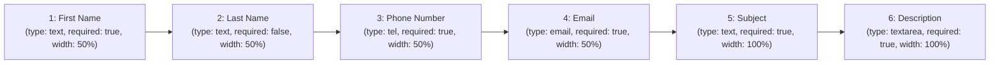
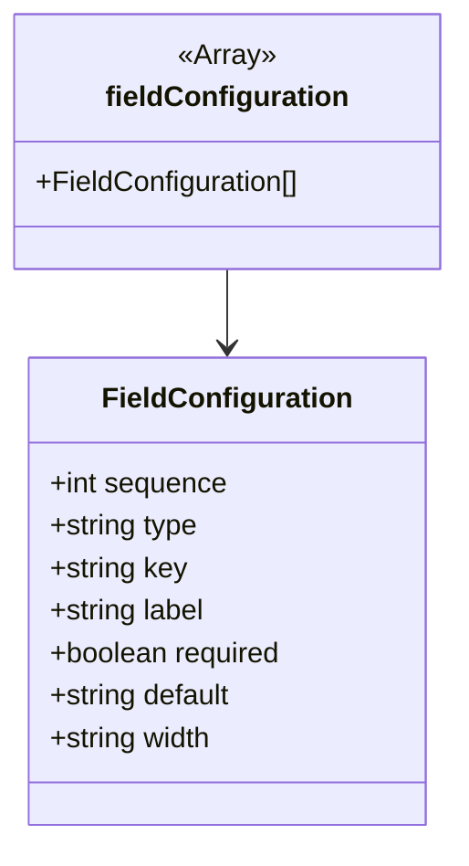

# Diagram: web/portal/src/modules/appnav/components/CustomerSupport/const.js

> Auto-generated by Obscura crawlers

## Diagram 1

### SVG

<svg id="container" width="1826" xmlns="http://www.w3.org/2000/svg" class="flowchart" height="118" viewBox="0 0 1826 118" role="graphics-document document" aria-roledescription="flowchart-v2"><g><marker id="container_flowchart-v2-pointEnd" class="marker flowchart-v2" viewBox="0 0 10 10" refX="5" refY="5" markerUnits="userSpaceOnUse" markerWidth="8" markerHeight="8" orient="auto"><path d="M 0 0 L 10 5 L 0 10 z" class="arrowMarkerPath" style="stroke-width: 1; stroke-dasharray: 1, 0;"></path></marker><marker id="container_flowchart-v2-pointStart" class="marker flowchart-v2" viewBox="0 0 10 10" refX="4.5" refY="5" markerUnits="userSpaceOnUse" markerWidth="8" markerHeight="8" orient="auto"><path d="M 0 5 L 10 10 L 10 0 z" class="arrowMarkerPath" style="stroke-width: 1; stroke-dasharray: 1, 0;"></path></marker><marker id="container_flowchart-v2-circleEnd" class="marker flowchart-v2" viewBox="0 0 10 10" refX="11" refY="5" markerUnits="userSpaceOnUse" markerWidth="11" markerHeight="11" orient="auto"><circle cx="5" cy="5" r="5" class="arrowMarkerPath" style="stroke-width: 1; stroke-dasharray: 1, 0;"></circle></marker><marker id="container_flowchart-v2-circleStart" class="marker flowchart-v2" viewBox="0 0 10 10" refX="-1" refY="5" markerUnits="userSpaceOnUse" markerWidth="11" markerHeight="11" orient="auto"><circle cx="5" cy="5" r="5" class="arrowMarkerPath" style="stroke-width: 1; stroke-dasharray: 1, 0;"></circle></marker><marker id="container_flowchart-v2-crossEnd" class="marker cross flowchart-v2" viewBox="0 0 11 11" refX="12" refY="5.2" markerUnits="userSpaceOnUse" markerWidth="11" markerHeight="11" orient="auto"><path d="M 1,1 l 9,9 M 10,1 l -9,9" class="arrowMarkerPath" style="stroke-width: 2; stroke-dasharray: 1, 0;"></path></marker><marker id="container_flowchart-v2-crossStart" class="marker cross flowchart-v2" viewBox="0 0 11 11" refX="-1" refY="5.2" markerUnits="userSpaceOnUse" markerWidth="11" markerHeight="11" orient="auto"><path d="M 1,1 l 9,9 M 10,1 l -9,9" class="arrowMarkerPath" style="stroke-width: 2; stroke-dasharray: 1, 0;"></path></marker><g class="root"><g class="clusters"></g><g class="edgePaths"><path d="M268,59L272.167,59C276.333,59,284.667,59,292.333,59C300,59,307,59,310.5,59L314,59" id="L_F1_F2_0" class="edge-thickness-normal edge-pattern-solid edge-thickness-normal edge-pattern-solid flowchart-link" style=";" data-edge="true" data-et="edge" data-id="L_F1_F2_0" data-points="W3sieCI6MjY4LCJ5Ijo1OX0seyJ4IjoyOTMsInkiOjU5fSx7IngiOjMxOCwieSI6NTl9XQ==" marker-end="url(#container_flowchart-v2-pointEnd)"></path><path d="M578,59L582.167,59C586.333,59,594.667,59,602.333,59C610,59,617,59,620.5,59L624,59" id="L_F2_F3_0" class="edge-thickness-normal edge-pattern-solid edge-thickness-normal edge-pattern-solid flowchart-link" style=";" data-edge="true" data-et="edge" data-id="L_F2_F3_0" data-points="W3sieCI6NTc4LCJ5Ijo1OX0seyJ4Ijo2MDMsInkiOjU5fSx7IngiOjYyOCwieSI6NTl9XQ==" marker-end="url(#container_flowchart-v2-pointEnd)"></path><path d="M888,59L892.167,59C896.333,59,904.667,59,912.333,59C920,59,927,59,930.5,59L934,59" id="L_F3_F4_0" class="edge-thickness-normal edge-pattern-solid edge-thickness-normal edge-pattern-solid flowchart-link" style=";" data-edge="true" data-et="edge" data-id="L_F3_F4_0" data-points="W3sieCI6ODg4LCJ5Ijo1OX0seyJ4Ijo5MTMsInkiOjU5fSx7IngiOjkzOCwieSI6NTl9XQ==" marker-end="url(#container_flowchart-v2-pointEnd)"></path><path d="M1198,59L1202.167,59C1206.333,59,1214.667,59,1222.333,59C1230,59,1237,59,1240.5,59L1244,59" id="L_F4_F5_0" class="edge-thickness-normal edge-pattern-solid edge-thickness-normal edge-pattern-solid flowchart-link" style=";" data-edge="true" data-et="edge" data-id="L_F4_F5_0" data-points="W3sieCI6MTE5OCwieSI6NTl9LHsieCI6MTIyMywieSI6NTl9LHsieCI6MTI0OCwieSI6NTl9XQ==" marker-end="url(#container_flowchart-v2-pointEnd)"></path><path d="M1508,59L1512.167,59C1516.333,59,1524.667,59,1532.333,59C1540,59,1547,59,1550.5,59L1554,59" id="L_F5_F6_0" class="edge-thickness-normal edge-pattern-solid edge-thickness-normal edge-pattern-solid flowchart-link" style=";" data-edge="true" data-et="edge" data-id="L_F5_F6_0" data-points="W3sieCI6MTUwOCwieSI6NTl9LHsieCI6MTUzMywieSI6NTl9LHsieCI6MTU1OCwieSI6NTl9XQ==" marker-end="url(#container_flowchart-v2-pointEnd)"></path></g><g class="edgeLabels"><g class="edgeLabel"><g class="label" data-id="L_F1_F2_0" transform="translate(0, 0)"><foreignObject width="0" height="0">

</foreignObject></g></g><g class="edgeLabel"><g class="label" data-id="L_F2_F3_0" transform="translate(0, 0)"><foreignObject width="0" height="0">

</foreignObject></g></g><g class="edgeLabel"><g class="label" data-id="L_F3_F4_0" transform="translate(0, 0)"><foreignObject width="0" height="0">

</foreignObject></g></g><g class="edgeLabel"><g class="label" data-id="L_F4_F5_0" transform="translate(0, 0)"><foreignObject width="0" height="0">

</foreignObject></g></g><g class="edgeLabel"><g class="label" data-id="L_F5_F6_0" transform="translate(0, 0)"><foreignObject width="0" height="0">

</foreignObject></g></g></g><g class="nodes"><g class="node default" id="flowchart-F1-0" transform="translate(138, 59)"><rect class="basic label-container" style="" x="-130" y="-51" width="260" height="102"></rect><g class="label" style="" transform="translate(-100, -36)"><rect></rect><foreignObject width="200" height="72">

1: First Name (type: text, required: true, width: 50%)

</foreignObject></g></g><g class="node default" id="flowchart-F2-1" transform="translate(448, 59)"><rect class="basic label-container" style="" x="-130" y="-51" width="260" height="102"></rect><g class="label" style="" transform="translate(-100, -36)"><rect></rect><foreignObject width="200" height="72">

2: Last Name (type: text, required: false, width: 50%)

</foreignObject></g></g><g class="node default" id="flowchart-F3-3" transform="translate(758, 59)"><rect class="basic label-container" style="" x="-130" y="-51" width="260" height="102"></rect><g class="label" style="" transform="translate(-100, -36)"><rect></rect><foreignObject width="200" height="72">

3: Phone Number (type: tel, required: true, width: 50%)

</foreignObject></g></g><g class="node default" id="flowchart-F4-5" transform="translate(1068, 59)"><rect class="basic label-container" style="" x="-130" y="-51" width="260" height="102"></rect><g class="label" style="" transform="translate(-100, -36)"><rect></rect><foreignObject width="200" height="72">

4: Email (type: email, required: true, width: 50%)

</foreignObject></g></g><g class="node default" id="flowchart-F5-7" transform="translate(1378, 59)"><rect class="basic label-container" style="" x="-130" y="-51" width="260" height="102"></rect><g class="label" style="" transform="translate(-100, -36)"><rect></rect><foreignObject width="200" height="72">

5: Subject (type: text, required: true, width: 100%)

</foreignObject></g></g><g class="node default" id="flowchart-F6-9" transform="translate(1688, 59)"><rect class="basic label-container" style="" x="-130" y="-51" width="260" height="102"></rect><g class="label" style="" transform="translate(-100, -36)"><rect></rect><foreignObject width="200" height="72">

6: Description (type: textarea, required: true, width: 100%)

</foreignObject></g></g></g></g></g></svg>

## Diagram 2

### SVG

<svg id="container" width="256.078125" xmlns="http://www.w3.org/2000/svg" class="classDiagram" height="474" viewBox="0 0 256.078125 474" role="graphics-document document" aria-roledescription="class"><g><defs><marker id="container_class-aggregationStart" class="marker aggregation class" refX="18" refY="7" markerWidth="190" markerHeight="240" orient="auto"><path d="M 18,7 L9,13 L1,7 L9,1 Z"></path></marker></defs><defs><marker id="container_class-aggregationEnd" class="marker aggregation class" refX="1" refY="7" markerWidth="20" markerHeight="28" orient="auto"><path d="M 18,7 L9,13 L1,7 L9,1 Z"></path></marker></defs><defs><marker id="container_class-extensionStart" class="marker extension class" refX="18" refY="7" markerWidth="190" markerHeight="240" orient="auto"><path d="M 1,7 L18,13 V 1 Z"></path></marker></defs><defs><marker id="container_class-extensionEnd" class="marker extension class" refX="1" refY="7" markerWidth="20" markerHeight="28" orient="auto"><path d="M 1,1 V 13 L18,7 Z"></path></marker></defs><defs><marker id="container_class-compositionStart" class="marker composition class" refX="18" refY="7" markerWidth="190" markerHeight="240" orient="auto"><path d="M 18,7 L9,13 L1,7 L9,1 Z"></path></marker></defs><defs><marker id="container_class-compositionEnd" class="marker composition class" refX="1" refY="7" markerWidth="20" markerHeight="28" orient="auto"><path d="M 18,7 L9,13 L1,7 L9,1 Z"></path></marker></defs><defs><marker id="container_class-dependencyStart" class="marker dependency class" refX="6" refY="7" markerWidth="190" markerHeight="240" orient="auto"><path d="M 5,7 L9,13 L1,7 L9,1 Z"></path></marker></defs><defs><marker id="container_class-dependencyEnd" class="marker dependency class" refX="13" refY="7" markerWidth="20" markerHeight="28" orient="auto"><path d="M 18,7 L9,13 L14,7 L9,1 Z"></path></marker></defs><defs><marker id="container_class-lollipopStart" class="marker lollipop class" refX="13" refY="7" markerWidth="190" markerHeight="240" orient="auto"><circle stroke="black" fill="transparent" cx="7" cy="7" r="6"></circle></marker></defs><defs><marker id="container_class-lollipopEnd" class="marker lollipop class" refX="1" refY="7" markerWidth="190" markerHeight="240" orient="auto"><circle stroke="black" fill="transparent" cx="7" cy="7" r="6"></circle></marker></defs><g class="root"><g class="clusters"></g><g class="edgePaths"><path d="M128.039,152L128.039,156.167C128.039,160.333,128.039,168.667,128.039,176C128.039,183.333,128.039,189.667,128.039,192.833L128.039,196" id="id_fieldConfiguration_FieldConfiguration_1" class="edge-thickness-normal edge-pattern-solid relation" style=";;;" data-edge="true" data-et="edge" data-id="id_fieldConfiguration_FieldConfiguration_1" data-points="W3sieCI6MTI4LjAzOTA2MjUsInkiOjE1Mn0seyJ4IjoxMjguMDM5MDYyNSwieSI6MTc3fSx7IngiOjEyOC4wMzkwNjI1LCJ5IjoyMDJ9XQ==" marker-end="url(#container_class-dependencyEnd)"></path></g><g class="edgeLabels"><g class="edgeLabel"><g class="label" data-id="id_fieldConfiguration_FieldConfiguration_1" transform="translate(0, 0)"><foreignObject width="0" height="0">

</foreignObject></g></g></g><g class="nodes"><g class="node default" id="classId-FieldConfiguration-0" transform="translate(128.0390625, 334)"><g class="basic label-container"><path d="M-112.15625 -132 L112.15625 -132 L112.15625 132 L-112.15625 132" stroke="none" stroke-width="0" fill="#ECECFF" style=""></path><path d="M-112.15625 -132 C-66.13934401624304 -132, -20.122438032486087 -132, 112.15625 -132 M-112.15625 -132 C-37.20701597801866 -132, 37.74221804396268 -132, 112.15625 -132 M112.15625 -132 C112.15625 -28.145257795746417, 112.15625 75.70948440850717, 112.15625 132 M112.15625 -132 C112.15625 -51.28438865408914, 112.15625 29.431222691821716, 112.15625 132 M112.15625 132 C47.28141568088574 132, -17.593418638228513 132, -112.15625 132 M112.15625 132 C63.77440583038415 132, 15.392561660768294 132, -112.15625 132 M-112.15625 132 C-112.15625 73.20628835791737, -112.15625 14.41257671583476, -112.15625 -132 M-112.15625 132 C-112.15625 63.550797594100814, -112.15625 -4.898404811798372, -112.15625 -132" stroke="#9370DB" stroke-width="1.3" fill="none" stroke-dasharray="0 0" style=""></path></g><g class="annotation-group text" transform="translate(0, -108)"></g><g class="label-group text" transform="translate(-66.84375, -108)"><g class="label" style="font-weight: bolder" transform="translate(0,-12)"><foreignObject width="133.6875" height="24">

FieldConfiguration

</foreignObject></g></g><g class="members-group text" transform="translate(-100.15625, -60)"><g class="label" style="" transform="translate(0,-12)"><foreignObject width="101.109375" height="24">

+int sequence

</foreignObject></g><g class="label" style="" transform="translate(0,12)"><foreignObject width="85.65625" height="24">

+string type

</foreignObject></g><g class="label" style="" transform="translate(0,36)"><foreignObject width="78.4375" height="24">

+string key

</foreignObject></g><g class="label" style="" transform="translate(0,60)"><foreignObject width="90.09375" height="24">

+string label

</foreignObject></g><g class="label" style="" transform="translate(0,84)"><foreignObject width="133.46875" height="24">

+boolean required

</foreignObject></g><g class="label" style="" transform="translate(0,108)"><foreignObject width="105.640625" height="24">

+string default

</foreignObject></g><g class="label" style="" transform="translate(0,132)"><foreignObject width="94.5625" height="24">

+string width

</foreignObject></g></g><g class="methods-group text" transform="translate(-100.15625, 132)"></g><g class="divider" style=""><path d="M-112.15625 -84 C-55.48322914674802 -84, 1.1897917065039536 -84, 112.15625 -84 M-112.15625 -84 C-57.39104175592565 -84, -2.6258335118512974 -84, 112.15625 -84" stroke="#9370DB" stroke-width="1.3" fill="none" stroke-dasharray="0 0" style=""></path></g><g class="divider" style=""><path d="M-112.15625 108 C-31.22876877408939 108, 49.69871245182122 108, 112.15625 108 M-112.15625 108 C-61.012937197286 108, -9.869624394572 108, 112.15625 108" stroke="#9370DB" stroke-width="1.3" fill="none" stroke-dasharray="0 0" style=""></path></g></g><g class="node default" id="classId-fieldConfiguration-1" transform="translate(128.0390625, 80)"><g class="basic label-container"><path d="M-120.0390625 -72 L120.0390625 -72 L120.0390625 72 L-120.0390625 72" stroke="none" stroke-width="0" fill="#ECECFF" style=""></path><path d="M-120.0390625 -72 C-50.10534914962227 -72, 19.82836420075546 -72, 120.0390625 -72 M-120.0390625 -72 C-38.839739255835326 -72, 42.35958398832935 -72, 120.0390625 -72 M120.0390625 -72 C120.0390625 -41.71525420016579, 120.0390625 -11.430508400331568, 120.0390625 72 M120.0390625 -72 C120.0390625 -36.429727454004464, 120.0390625 -0.859454908008928, 120.0390625 72 M120.0390625 72 C30.156111497458227 72, -59.72683950508355 72, -120.0390625 72 M120.0390625 72 C46.258069715823154 72, -27.52292306835369 72, -120.0390625 72 M-120.0390625 72 C-120.0390625 19.97036276874769, -120.0390625 -32.05927446250462, -120.0390625 -72 M-120.0390625 72 C-120.0390625 26.608746328887293, -120.0390625 -18.782507342225415, -120.0390625 -72" stroke="#9370DB" stroke-width="1.3" fill="none" stroke-dasharray="0 0" style=""></path></g><g class="annotation-group text" transform="translate(-27.78125, -48)"><g class="label" style="" transform="translate(0,-12)"><foreignObject width="55.5625" height="24">

«Array»

</foreignObject></g></g><g class="label-group text" transform="translate(-65.71875, -24)"><g class="label" style="font-weight: bolder" transform="translate(0,-12)"><foreignObject width="131.4375" height="24">

fieldConfiguration

</foreignObject></g></g><g class="members-group text" transform="translate(-108.0390625, 24)"><g class="label" style="" transform="translate(0,-12)"><foreignObject width="150.359375" height="24">

+FieldConfiguration[]

</foreignObject></g></g><g class="methods-group text" transform="translate(-108.0390625, 72)"></g><g class="divider" style=""><path d="M-120.0390625 0 C-62.58225802358363 0, -5.125453547167254 0, 120.0390625 0 M-120.0390625 0 C-28.73253817272807 0, 62.57398615454386 0, 120.0390625 0" stroke="#9370DB" stroke-width="1.3" fill="none" stroke-dasharray="0 0" style=""></path></g><g class="divider" style=""><path d="M-120.0390625 48 C-25.143095825343792 48, 69.75287084931242 48, 120.0390625 48 M-120.0390625 48 C-64.88402137451892 48, -9.728980249037846 48, 120.0390625 48" stroke="#9370DB" stroke-width="1.3" fill="none" stroke-dasharray="0 0" style=""></path></g></g></g></g></g></svg>
