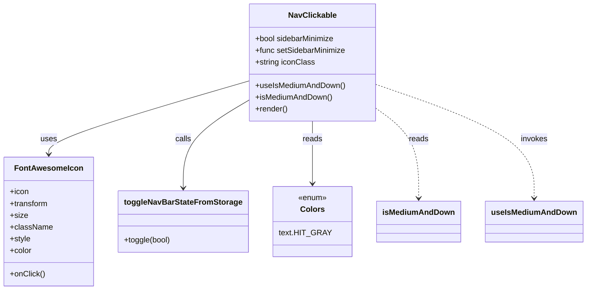

# Diagram: web/portal/src/modules/appnav/components/NavClickable.js


> Auto-generated by Obscura crawlers

## Diagram 1



### SVG

<svg id="container" width="1151.421875" xmlns="http://www.w3.org/2000/svg" class="classDiagram" height="594" viewBox="0 0 1151.421875 594" role="graphics-document document" aria-roledescription="class"><style>#container{font-family:"trebuchet ms",verdana,arial,sans-serif;font-size:16px;fill:#333;}@keyframes edge-animation-frame{from{stroke-dashoffset:0;}}@keyframes dash{to{stroke-dashoffset:0;}}#container .edge-animation-slow{stroke-dasharray:9,5!important;stroke-dashoffset:900;animation:dash 50s linear infinite;stroke-linecap:round;}#container .edge-animation-fast{stroke-dasharray:9,5!important;stroke-dashoffset:900;animation:dash 20s linear infinite;stroke-linecap:round;}#container .error-icon{fill:#552222;}#container .error-text{fill:#552222;stroke:#552222;}#container .edge-thickness-normal{stroke-width:1px;}#container .edge-thickness-thick{stroke-width:3.5px;}#container .edge-pattern-solid{stroke-dasharray:0;}#container .edge-thickness-invisible{stroke-width:0;fill:none;}#container .edge-pattern-dashed{stroke-dasharray:3;}#container .edge-pattern-dotted{stroke-dasharray:2;}#container .marker{fill:#333333;stroke:#333333;}#container .marker.cross{stroke:#333333;}#container svg{font-family:"trebuchet ms",verdana,arial,sans-serif;font-size:16px;}#container p{margin:0;}#container g.classGroup text{fill:#9370DB;stroke:none;font-family:"trebuchet ms",verdana,arial,sans-serif;font-size:10px;}#container g.classGroup text .title{font-weight:bolder;}#container .nodeLabel,#container .edgeLabel{color:#131300;}#container .edgeLabel .label rect{fill:#ECECFF;}#container .label text{fill:#131300;}#container .labelBkg{background:#ECECFF;}#container .edgeLabel .label span{background:#ECECFF;}#container .classTitle{font-weight:bolder;}#container .node rect,#container .node circle,#container .node ellipse,#container .node polygon,#container .node path{fill:#ECECFF;stroke:#9370DB;stroke-width:1px;}#container .divider{stroke:#9370DB;stroke-width:1;}#container g.clickable{cursor:pointer;}#container g.classGroup rect{fill:#ECECFF;stroke:#9370DB;}#container g.classGroup line{stroke:#9370DB;stroke-width:1;}#container .classLabel .box{stroke:none;stroke-width:0;fill:#ECECFF;opacity:0.5;}#container .classLabel .label{fill:#9370DB;font-size:10px;}#container .relation{stroke:#333333;stroke-width:1;fill:none;}#container .dashed-line{stroke-dasharray:3;}#container .dotted-line{stroke-dasharray:1 2;}#container #compositionStart,#container .composition{fill:#333333!important;stroke:#333333!important;stroke-width:1;}#container #compositionEnd,#container .composition{fill:#333333!important;stroke:#333333!important;stroke-width:1;}#container #dependencyStart,#container .dependency{fill:#333333!important;stroke:#333333!important;stroke-width:1;}#container #dependencyStart,#container .dependency{fill:#333333!important;stroke:#333333!important;stroke-width:1;}#container #extensionStart,#container .extension{fill:transparent!important;stroke:#333333!important;stroke-width:1;}#container #extensionEnd,#container .extension{fill:transparent!important;stroke:#333333!important;stroke-width:1;}#container #aggregationStart,#container .aggregation{fill:transparent!important;stroke:#333333!important;stroke-width:1;}#container #aggregationEnd,#container .aggregation{fill:transparent!important;stroke:#333333!important;stroke-width:1;}#container #lollipopStart,#container .lollipop{fill:#ECECFF!important;stroke:#333333!important;stroke-width:1;}#container #lollipopEnd,#container .lollipop{fill:#ECECFF!important;stroke:#333333!important;stroke-width:1;}#container .edgeTerminals{font-size:11px;line-height:initial;}#container .classTitleText{text-anchor:middle;font-size:18px;fill:#333;}#container .label-icon{display:inline-block;height:1em;overflow:visible;vertical-align:-0.125em;}#container .node .label-icon path{fill:currentColor;stroke:revert;stroke-width:revert;}#container :root{--mermaid-font-family:"trebuchet ms",verdana,arial,sans-serif;}</style><g><defs><marker id="container_class-aggregationStart" class="marker aggregation class" refX="18" refY="7" markerWidth="190" markerHeight="240" orient="auto"><path d="M 18,7 L9,13 L1,7 L9,1 Z"></path></marker></defs><defs><marker id="container_class-aggregationEnd" class="marker aggregation class" refX="1" refY="7" markerWidth="20" markerHeight="28" orient="auto"><path d="M 18,7 L9,13 L1,7 L9,1 Z"></path></marker></defs><defs><marker id="container_class-extensionStart" class="marker extension class" refX="18" refY="7" markerWidth="190" markerHeight="240" orient="auto"><path d="M 1,7 L18,13 V 1 Z"></path></marker></defs><defs><marker id="container_class-extensionEnd" class="marker extension class" refX="1" refY="7" markerWidth="20" markerHeight="28" orient="auto"><path d="M 1,1 V 13 L18,7 Z"></path></marker></defs><defs><marker id="container_class-compositionStart" class="marker composition class" refX="18" refY="7" markerWidth="190" markerHeight="240" orient="auto"><path d="M 18,7 L9,13 L1,7 L9,1 Z"></path></marker></defs><defs><marker id="container_class-compositionEnd" class="marker composition class" refX="1" refY="7" markerWidth="20" markerHeight="28" orient="auto"><path d="M 18,7 L9,13 L1,7 L9,1 Z"></path></marker></defs><defs><marker id="container_class-dependencyStart" class="marker dependency class" refX="6" refY="7" markerWidth="190" markerHeight="240" orient="auto"><path d="M 5,7 L9,13 L1,7 L9,1 Z"></path></marker></defs><defs><marker id="container_class-dependencyEnd" class="marker dependency class" refX="13" refY="7" markerWidth="20" markerHeight="28" orient="auto"><path d="M 18,7 L9,13 L14,7 L9,1 Z"></path></marker></defs><defs><marker id="container_class-lollipopStart" class="marker lollipop class" refX="13" refY="7" markerWidth="190" markerHeight="240" orient="auto"><circle stroke="black" fill="transparent" cx="7" cy="7" r="6"></circle></marker></defs><defs><marker id="container_class-lollipopEnd" class="marker lollipop class" refX="1" refY="7" markerWidth="190" markerHeight="240" orient="auto"><circle stroke="black" fill="transparent" cx="7" cy="7" r="6"></circle></marker></defs><g class="root"><g class="clusters"></g><g class="edgePaths"><path d="M485.285,166.949L420.386,186.624C355.487,206.299,225.689,245.65,160.79,270.491C95.891,295.333,95.891,305.667,95.891,310.833L95.891,316" id="id_NavClickable_FontAwesomeIcon_1" class="edge-thickness-normal edge-pattern-solid relation" style=";;;" data-edge="true" data-et="edge" data-id="id_NavClickable_FontAwesomeIcon_1" data-points="W3sieCI6NDg1LjI4NTE1NjI1LCJ5IjoxNjYuOTQ4NjA5ODMyOTk4OTN9LHsieCI6OTUuODkwNjI1LCJ5IjoyODV9LHsieCI6OTUuODkwNjI1LCJ5IjozMjJ9XQ==" marker-end="url(#container_class-dependencyEnd)"></path><path d="M485.285,207.665L464.499,220.554C443.714,233.443,402.142,259.222,381.356,288.778C360.57,318.333,360.57,351.667,360.57,368.333L360.57,385" id="id_NavClickable_toggleNavBarStateFromStorage_2" class="edge-thickness-normal edge-pattern-solid relation" style=";;;" data-edge="true" data-et="edge" data-id="id_NavClickable_toggleNavBarStateFromStorage_2" data-points="W3sieCI6NDg1LjI4NTE1NjI1LCJ5IjoyMDcuNjY1MDk4MTIzOTIwMDJ9LHsieCI6MzYwLjU3MDMxMjUsInkiOjI4NX0seyJ4IjozNjAuNTcwMzEyNSwieSI6MzkxfV0=" marker-end="url(#container_class-dependencyEnd)"></path><path d="M613.758,248L613.758,254.167C613.758,260.333,613.758,272.667,613.758,294C613.758,315.333,613.758,345.667,613.758,360.833L613.758,376" id="id_NavClickable_Colors_3" class="edge-thickness-normal edge-pattern-solid relation" style=";;;" data-edge="true" data-et="edge" data-id="id_NavClickable_Colors_3" data-points="W3sieCI6NjEzLjc1NzgxMjUsInkiOjI0OH0seyJ4Ijo2MTMuNzU3ODEyNSwieSI6Mjg1fSx7IngiOjYxMy43NTc4MTI1LCJ5IjozODJ9XQ==" marker-end="url(#container_class-dependencyEnd)"></path><path d="M742.23,224.859L755.525,234.883C768.82,244.906,795.41,264.953,808.705,295.143C822,325.333,822,365.667,822,385.833L822,406" id="id_NavClickable_isMediumAndDown_4" class="edge-thickness-normal edge-pattern-dashed relation" style=";;;" data-edge="true" data-et="edge" data-id="id_NavClickable_isMediumAndDown_4" data-points="W3sieCI6NzQyLjIzMDQ2ODc1LCJ5IjoyMjQuODU5MzY5NzI0MjU0MzV9LHsieCI6ODIyLCJ5IjoyODV9LHsieCI6ODIyLCJ5Ijo0MTJ9XQ==" marker-end="url(#container_class-dependencyEnd)"></path><path d="M742.23,174.382L793.298,192.818C844.365,211.254,946.499,248.127,997.566,286.73C1048.633,325.333,1048.633,365.667,1048.633,385.833L1048.633,406" id="id_NavClickable_useIsMediumAndDown_5" class="edge-thickness-normal edge-pattern-dashed relation" style=";;;" data-edge="true" data-et="edge" data-id="id_NavClickable_useIsMediumAndDown_5" data-points="W3sieCI6NzQyLjIzMDQ2ODc1LCJ5IjoxNzQuMzgxNjIwMDc3NjA4NTJ9LHsieCI6MTA0OC42MzI4MTI1LCJ5IjoyODV9LHsieCI6MTA0OC42MzI4MTI1LCJ5Ijo0MTJ9XQ==" marker-end="url(#container_class-dependencyEnd)"></path></g><g class="edgeLabels"><g class="edgeLabel" transform="translate(95.890625, 285)"><g class="label" data-id="id_NavClickable_FontAwesomeIcon_1" transform="translate(-16.4921875, -12)"><foreignObject width="32.984375" height="24"><div xmlns="http://www.w3.org/1999/xhtml" class="labelBkg" style="display: table-cell; white-space: nowrap; line-height: 1.5; max-width: 200px; text-align: center;"><span class="edgeLabel"><p>uses</p></span></div></foreignObject></g></g><g class="edgeLabel" transform="translate(360.5703125, 285)"><g class="label" data-id="id_NavClickable_toggleNavBarStateFromStorage_2" transform="translate(-16.4453125, -12)"><foreignObject width="32.890625" height="24"><div xmlns="http://www.w3.org/1999/xhtml" class="labelBkg" style="display: table-cell; white-space: nowrap; line-height: 1.5; max-width: 200px; text-align: center;"><span class="edgeLabel"><p>calls</p></span></div></foreignObject></g></g><g class="edgeLabel" transform="translate(613.7578125, 285)"><g class="label" data-id="id_NavClickable_Colors_3" transform="translate(-20.0078125, -12)"><foreignObject width="40.015625" height="24"><div xmlns="http://www.w3.org/1999/xhtml" class="labelBkg" style="display: table-cell; white-space: nowrap; line-height: 1.5; max-width: 200px; text-align: center;"><span class="edgeLabel"><p>reads</p></span></div></foreignObject></g></g><g class="edgeLabel" transform="translate(822, 285)"><g class="label" data-id="id_NavClickable_isMediumAndDown_4" transform="translate(-20.0078125, -12)"><foreignObject width="40.015625" height="24"><div xmlns="http://www.w3.org/1999/xhtml" class="labelBkg" style="display: table-cell; white-space: nowrap; line-height: 1.5; max-width: 200px; text-align: center;"><span class="edgeLabel"><p>reads</p></span></div></foreignObject></g></g><g class="edgeLabel" transform="translate(1048.6328125, 285)"><g class="label" data-id="id_NavClickable_useIsMediumAndDown_5" transform="translate(-27.5859375, -12)"><foreignObject width="55.171875" height="24"><div xmlns="http://www.w3.org/1999/xhtml" class="labelBkg" style="display: table-cell; white-space: nowrap; line-height: 1.5; max-width: 200px; text-align: center;"><span class="edgeLabel"><p>invokes</p></span></div></foreignObject></g></g></g><g class="nodes"><g class="node default" id="classId-NavClickable-0" transform="translate(613.7578125, 128)"><g class="basic label-container"><path d="M-128.47265625 -120 L128.47265625 -120 L128.47265625 120 L-128.47265625 120" stroke="none" stroke-width="0" fill="#ECECFF" style=""></path><path d="M-128.47265625 -120 C-47.56873819076577 -120, 33.33517986846846 -120, 128.47265625 -120 M-128.47265625 -120 C-75.66773124069515 -120, -22.862806231390294 -120, 128.47265625 -120 M128.47265625 -120 C128.47265625 -43.49532593923847, 128.47265625 33.00934812152306, 128.47265625 120 M128.47265625 -120 C128.47265625 -24.676894105777848, 128.47265625 70.6462117884443, 128.47265625 120 M128.47265625 120 C48.36684154632263 120, -31.738973157354735 120, -128.47265625 120 M128.47265625 120 C61.53076393094099 120, -5.411128388118016 120, -128.47265625 120 M-128.47265625 120 C-128.47265625 32.85364440464333, -128.47265625 -54.292711190713334, -128.47265625 -120 M-128.47265625 120 C-128.47265625 41.46438139211875, -128.47265625 -37.071237215762494, -128.47265625 -120" stroke="#9370DB" stroke-width="1.3" fill="none" stroke-dasharray="0 0" style=""></path></g><g class="annotation-group text" transform="translate(0, -96)"></g><g class="label-group text" transform="translate(-46.8671875, -96)"><g class="label" style="font-weight: bolder" transform="translate(0,-12)"><foreignObject width="93.734375" height="24"><div xmlns="http://www.w3.org/1999/xhtml" style="display: table-cell; white-space: nowrap; line-height: 1.5; max-width: 142px; text-align: center;"><span class="nodeLabel markdown-node-label" style=""><p>NavClickable</p></span></div></foreignObject></g></g><g class="members-group text" transform="translate(-116.47265625, -48)"><g class="label" style="" transform="translate(0,-12)"><foreignObject width="164.28125" height="24"><div xmlns="http://www.w3.org/1999/xhtml" style="display: table-cell; white-space: nowrap; line-height: 1.5; max-width: 222px; text-align: center;"><span class="nodeLabel markdown-node-label" style=""><p>+bool sidebarMinimize</p></span></div></foreignObject></g><g class="label" style="" transform="translate(0,12)"><foreignObject width="186.078125" height="24"><div xmlns="http://www.w3.org/1999/xhtml" style="display: table-cell; white-space: nowrap; line-height: 1.5; max-width: 243px; text-align: center;"><span class="nodeLabel markdown-node-label" style=""><p>+func setSidebarMinimize</p></span></div></foreignObject></g><g class="label" style="" transform="translate(0,36)"><foreignObject width="121.15625" height="24"><div xmlns="http://www.w3.org/1999/xhtml" style="display: table-cell; white-space: nowrap; line-height: 1.5; max-width: 179px; text-align: center;"><span class="nodeLabel markdown-node-label" style=""><p>+string iconClass</p></span></div></foreignObject></g></g><g class="methods-group text" transform="translate(-116.47265625, 48)"><g class="label" style="" transform="translate(0,-12)"><foreignObject width="182.9375" height="24"><div xmlns="http://www.w3.org/1999/xhtml" style="display: table-cell; white-space: nowrap; line-height: 1.5; max-width: 240px; text-align: center;"><span class="nodeLabel markdown-node-label" style=""><p>+useIsMediumAndDown()</p></span></div></foreignObject></g><g class="label" style="" transform="translate(0,12)"><foreignObject width="157.21875" height="24"><div xmlns="http://www.w3.org/1999/xhtml" style="display: table-cell; white-space: nowrap; line-height: 1.5; max-width: 215px; text-align: center;"><span class="nodeLabel markdown-node-label" style=""><p>+isMediumAndDown()</p></span></div></foreignObject></g><g class="label" style="" transform="translate(0,36)"><foreignObject width="66.609375" height="24"><div xmlns="http://www.w3.org/1999/xhtml" style="display: table-cell; white-space: nowrap; line-height: 1.5; max-width: 124px; text-align: center;"><span class="nodeLabel markdown-node-label" style=""><p>+render()</p></span></div></foreignObject></g></g><g class="divider" style=""><path d="M-128.47265625 -72 C-74.83293948860631 -72, -21.193222727212614 -72, 128.47265625 -72 M-128.47265625 -72 C-40.28432509464551 -72, 47.90400606070898 -72, 128.47265625 -72" stroke="#9370DB" stroke-width="1.3" fill="none" stroke-dasharray="0 0" style=""></path></g><g class="divider" style=""><path d="M-128.47265625 24 C-49.44422350322533 24, 29.58420924354934 24, 128.47265625 24 M-128.47265625 24 C-49.61136386468279 24, 29.249928520634427 24, 128.47265625 24" stroke="#9370DB" stroke-width="1.3" fill="none" stroke-dasharray="0 0" style=""></path></g></g><g class="node default" id="classId-FontAwesomeIcon-1" transform="translate(95.890625, 454)"><g class="basic label-container"><path d="M-87.890625 -132 L87.890625 -132 L87.890625 132 L-87.890625 132" stroke="none" stroke-width="0" fill="#ECECFF" style=""></path><path d="M-87.890625 -132 C-37.89068788653885 -132, 12.109249226922302 -132, 87.890625 -132 M-87.890625 -132 C-25.96810018027417 -132, 35.95442463945166 -132, 87.890625 -132 M87.890625 -132 C87.890625 -57.827296685056325, 87.890625 16.34540662988735, 87.890625 132 M87.890625 -132 C87.890625 -28.0165601441567, 87.890625 75.9668797116866, 87.890625 132 M87.890625 132 C42.31921239901198 132, -3.252200201976038 132, -87.890625 132 M87.890625 132 C46.364255895558635 132, 4.8378867911172705 132, -87.890625 132 M-87.890625 132 C-87.890625 61.723238882301686, -87.890625 -8.553522235396628, -87.890625 -132 M-87.890625 132 C-87.890625 33.36268241902947, -87.890625 -65.27463516194106, -87.890625 -132" stroke="#9370DB" stroke-width="1.3" fill="none" stroke-dasharray="0 0" style=""></path></g><g class="annotation-group text" transform="translate(0, -108)"></g><g class="label-group text" transform="translate(-66.140625, -108)"><g class="label" style="font-weight: bolder" transform="translate(0,-12)"><foreignObject width="132.28125" height="24"><div xmlns="http://www.w3.org/1999/xhtml" style="display: table-cell; white-space: nowrap; line-height: 1.5; max-width: 181px; text-align: center;"><span class="nodeLabel markdown-node-label" style=""><p>FontAwesomeIcon</p></span></div></foreignObject></g></g><g class="members-group text" transform="translate(-75.890625, -60)"><g class="label" style="" transform="translate(0,-12)"><foreignObject width="38.546875" height="24"><div xmlns="http://www.w3.org/1999/xhtml" style="display: table-cell; white-space: nowrap; line-height: 1.5; max-width: 96px; text-align: center;"><span class="nodeLabel markdown-node-label" style=""><p>+icon</p></span></div></foreignObject></g><g class="label" style="" transform="translate(0,12)"><foreignObject width="79.28125" height="24"><div xmlns="http://www.w3.org/1999/xhtml" style="display: table-cell; white-space: nowrap; line-height: 1.5; max-width: 137px; text-align: center;"><span class="nodeLabel markdown-node-label" style=""><p>+transform</p></span></div></foreignObject></g><g class="label" style="" transform="translate(0,36)"><foreignObject width="35.578125" height="24"><div xmlns="http://www.w3.org/1999/xhtml" style="display: table-cell; white-space: nowrap; line-height: 1.5; max-width: 93px; text-align: center;"><span class="nodeLabel markdown-node-label" style=""><p>+size</p></span></div></foreignObject></g><g class="label" style="" transform="translate(0,60)"><foreignObject width="85.640625" height="24"><div xmlns="http://www.w3.org/1999/xhtml" style="display: table-cell; white-space: nowrap; line-height: 1.5; max-width: 143px; text-align: center;"><span class="nodeLabel markdown-node-label" style=""><p>+className</p></span></div></foreignObject></g><g class="label" style="" transform="translate(0,84)"><foreignObject width="42.359375" height="24"><div xmlns="http://www.w3.org/1999/xhtml" style="display: table-cell; white-space: nowrap; line-height: 1.5; max-width: 100px; text-align: center;"><span class="nodeLabel markdown-node-label" style=""><p>+style</p></span></div></foreignObject></g><g class="label" style="" transform="translate(0,108)"><foreignObject width="44.796875" height="24"><div xmlns="http://www.w3.org/1999/xhtml" style="display: table-cell; white-space: nowrap; line-height: 1.5; max-width: 103px; text-align: center;"><span class="nodeLabel markdown-node-label" style=""><p>+color</p></span></div></foreignObject></g></g><g class="methods-group text" transform="translate(-75.890625, 108)"><g class="label" style="" transform="translate(0,-12)"><foreignObject width="70.921875" height="24"><div xmlns="http://www.w3.org/1999/xhtml" style="display: table-cell; white-space: nowrap; line-height: 1.5; max-width: 128px; text-align: center;"><span class="nodeLabel markdown-node-label" style=""><p>+onClick()</p></span></div></foreignObject></g></g><g class="divider" style=""><path d="M-87.890625 -84 C-38.78503182824432 -84, 10.320561343511358 -84, 87.890625 -84 M-87.890625 -84 C-45.96238247665983 -84, -4.0341399533196665 -84, 87.890625 -84" stroke="#9370DB" stroke-width="1.3" fill="none" stroke-dasharray="0 0" style=""></path></g><g class="divider" style=""><path d="M-87.890625 84 C-36.17061194052429 84, 15.549401118951423 84, 87.890625 84 M-87.890625 84 C-20.031692071774017 84, 47.827240856451965 84, 87.890625 84" stroke="#9370DB" stroke-width="1.3" fill="none" stroke-dasharray="0 0" style=""></path></g></g><g class="node default" id="classId-toggleNavBarStateFromStorage-2" transform="translate(360.5703125, 454)"><g class="basic label-container"><path d="M-126.7890625 -63 L126.7890625 -63 L126.7890625 63 L-126.7890625 63" stroke="none" stroke-width="0" fill="#ECECFF" style=""></path><path d="M-126.7890625 -63 C-42.80581261433018 -63, 41.17743727133964 -63, 126.7890625 -63 M-126.7890625 -63 C-61.02423221252539 -63, 4.740598074949219 -63, 126.7890625 -63 M126.7890625 -63 C126.7890625 -16.63549334195821, 126.7890625 29.72901331608358, 126.7890625 63 M126.7890625 -63 C126.7890625 -28.363299328442118, 126.7890625 6.273401343115765, 126.7890625 63 M126.7890625 63 C32.604038392973706 63, -61.58098571405259 63, -126.7890625 63 M126.7890625 63 C56.75900457808467 63, -13.271053343830658 63, -126.7890625 63 M-126.7890625 63 C-126.7890625 31.864672921423526, -126.7890625 0.729345842847053, -126.7890625 -63 M-126.7890625 63 C-126.7890625 23.122396352691062, -126.7890625 -16.755207294617875, -126.7890625 -63" stroke="#9370DB" stroke-width="1.3" fill="none" stroke-dasharray="0 0" style=""></path></g><g class="annotation-group text" transform="translate(0, -39)"></g><g class="label-group text" transform="translate(-114.7890625, -39)"><g class="label" style="font-weight: bolder" transform="translate(0,-12)"><foreignObject width="229.578125" height="24"><div xmlns="http://www.w3.org/1999/xhtml" style="display: table-cell; white-space: nowrap; line-height: 1.5; max-width: 275px; text-align: center;"><span class="nodeLabel markdown-node-label" style=""><p>toggleNavBarStateFromStorage</p></span></div></foreignObject></g></g><g class="members-group text" transform="translate(-114.7890625, 9)"></g><g class="methods-group text" transform="translate(-114.7890625, 39)"><g class="label" style="" transform="translate(0,-12)"><foreignObject width="96.015625" height="24"><div xmlns="http://www.w3.org/1999/xhtml" style="display: table-cell; white-space: nowrap; line-height: 1.5; max-width: 153px; text-align: center;"><span class="nodeLabel markdown-node-label" style=""><p>+toggle(bool)</p></span></div></foreignObject></g></g><g class="divider" style=""><path d="M-126.7890625 -15 C-70.24813386762997 -15, -13.707205235259963 -15, 126.7890625 -15 M-126.7890625 -15 C-54.209831858270974 -15, 18.369398783458053 -15, 126.7890625 -15" stroke="#9370DB" stroke-width="1.3" fill="none" stroke-dasharray="0 0" style=""></path></g><g class="divider" style=""><path d="M-126.7890625 9 C-33.14292963820289 9, 60.50320322359423 9, 126.7890625 9 M-126.7890625 9 C-70.38049894635833 9, -13.971935392716645 9, 126.7890625 9" stroke="#9370DB" stroke-width="1.3" fill="none" stroke-dasharray="0 0" style=""></path></g></g><g class="node default" id="classId-Colors-3" transform="translate(613.7578125, 454)"><g class="basic label-container"><path d="M-76.3984375 -72 L76.3984375 -72 L76.3984375 72 L-76.3984375 72" stroke="none" stroke-width="0" fill="#ECECFF" style=""></path><path d="M-76.3984375 -72 C-30.813657811579468 -72, 14.771121876841065 -72, 76.3984375 -72 M-76.3984375 -72 C-19.18339474272463 -72, 38.03164801455074 -72, 76.3984375 -72 M76.3984375 -72 C76.3984375 -42.65947519943069, 76.3984375 -13.318950398861368, 76.3984375 72 M76.3984375 -72 C76.3984375 -34.22406033214928, 76.3984375 3.551879335701443, 76.3984375 72 M76.3984375 72 C27.442910474034292 72, -21.512616551931416 72, -76.3984375 72 M76.3984375 72 C41.535834079509 72, 6.673230659018003 72, -76.3984375 72 M-76.3984375 72 C-76.3984375 29.824626349737322, -76.3984375 -12.350747300525356, -76.3984375 -72 M-76.3984375 72 C-76.3984375 26.438240737511073, -76.3984375 -19.123518524977854, -76.3984375 -72" stroke="#9370DB" stroke-width="1.3" fill="none" stroke-dasharray="0 0" style=""></path></g><g class="annotation-group text" transform="translate(-29.53125, -48)"><g class="label" style="" transform="translate(0,-12)"><foreignObject width="59.0625" height="24"><div xmlns="http://www.w3.org/1999/xhtml" style="display: table-cell; white-space: nowrap; line-height: 1.5; max-width: 109px; text-align: center;"><span class="nodeLabel markdown-node-label" style=""><p>«enum»</p></span></div></foreignObject></g></g><g class="label-group text" transform="translate(-23.1015625, -24)"><g class="label" style="font-weight: bolder" transform="translate(0,-12)"><foreignObject width="46.203125" height="24"><div xmlns="http://www.w3.org/1999/xhtml" style="display: table-cell; white-space: nowrap; line-height: 1.5; max-width: 95px; text-align: center;"><span class="nodeLabel markdown-node-label" style=""><p>Colors</p></span></div></foreignObject></g></g><g class="members-group text" transform="translate(-64.3984375, 24)"><g class="label" style="" transform="translate(0,-12)"><foreignObject width="99.265625" height="24"><div xmlns="http://www.w3.org/1999/xhtml" style="display: table-cell; white-space: nowrap; line-height: 1.5; max-width: 149px; text-align: center;"><span class="nodeLabel markdown-node-label" style=""><p>text.HIT_GRAY</p></span></div></foreignObject></g></g><g class="methods-group text" transform="translate(-64.3984375, 72)"></g><g class="divider" style=""><path d="M-76.3984375 0 C-18.040806038484533 0, 40.316825423030934 0, 76.3984375 0 M-76.3984375 0 C-15.72873622100002 0, 44.94096505799996 0, 76.3984375 0" stroke="#9370DB" stroke-width="1.3" fill="none" stroke-dasharray="0 0" style=""></path></g><g class="divider" style=""><path d="M-76.3984375 48 C-17.98867785784423 48, 40.42108178431154 48, 76.3984375 48 M-76.3984375 48 C-36.11683926719939 48, 4.164758965601223 48, 76.3984375 48" stroke="#9370DB" stroke-width="1.3" fill="none" stroke-dasharray="0 0" style=""></path></g></g><g class="node default" id="classId-isMediumAndDown-4" transform="translate(822, 454)"><g class="basic label-container"><path d="M-81.84375 -42 L81.84375 -42 L81.84375 42 L-81.84375 42" stroke="none" stroke-width="0" fill="#ECECFF" style=""></path><path d="M-81.84375 -42 C-18.71647344790432 -42, 44.41080310419136 -42, 81.84375 -42 M-81.84375 -42 C-40.2029728097698 -42, 1.4378043804604062 -42, 81.84375 -42 M81.84375 -42 C81.84375 -11.650980744708036, 81.84375 18.698038510583928, 81.84375 42 M81.84375 -42 C81.84375 -16.294367245691337, 81.84375 9.411265508617326, 81.84375 42 M81.84375 42 C20.048867771044357 42, -41.746014457911286 42, -81.84375 42 M81.84375 42 C40.38919430494832 42, -1.0653613901033623 42, -81.84375 42 M-81.84375 42 C-81.84375 18.53798078912487, -81.84375 -4.924038421750261, -81.84375 -42 M-81.84375 42 C-81.84375 9.154178629950422, -81.84375 -23.691642740099155, -81.84375 -42" stroke="#9370DB" stroke-width="1.3" fill="none" stroke-dasharray="0 0" style=""></path></g><g class="annotation-group text" transform="translate(0, -18)"></g><g class="label-group text" transform="translate(-69.84375, -18)"><g class="label" style="font-weight: bolder" transform="translate(0,-12)"><foreignObject width="139.6875" height="24"><div xmlns="http://www.w3.org/1999/xhtml" style="display: table-cell; white-space: nowrap; line-height: 1.5; max-width: 189px; text-align: center;"><span class="nodeLabel markdown-node-label" style=""><p>isMediumAndDown</p></span></div></foreignObject></g></g><g class="members-group text" transform="translate(-69.84375, 30)"></g><g class="methods-group text" transform="translate(-69.84375, 60)"></g><g class="divider" style=""><path d="M-81.84375 6 C-24.63691679881355 6, 32.5699164023729 6, 81.84375 6 M-81.84375 6 C-46.22648584933402 6, -10.609221698668037 6, 81.84375 6" stroke="#9370DB" stroke-width="1.3" fill="none" stroke-dasharray="0 0" style=""></path></g><g class="divider" style=""><path d="M-81.84375 24 C-37.27005633080666 24, 7.303637338386679 24, 81.84375 24 M-81.84375 24 C-22.198575223503774 24, 37.44659955299245 24, 81.84375 24" stroke="#9370DB" stroke-width="1.3" fill="none" stroke-dasharray="0 0" style=""></path></g></g><g class="node default" id="classId-useIsMediumAndDown-5" transform="translate(1048.6328125, 454)"><g class="basic label-container"><path d="M-94.7890625 -42 L94.7890625 -42 L94.7890625 42 L-94.7890625 42" stroke="none" stroke-width="0" fill="#ECECFF" style=""></path><path d="M-94.7890625 -42 C-39.03433132391482 -42, 16.72039985217036 -42, 94.7890625 -42 M-94.7890625 -42 C-23.1685146511588 -42, 48.4520331976824 -42, 94.7890625 -42 M94.7890625 -42 C94.7890625 -9.887616015333208, 94.7890625 22.224767969333584, 94.7890625 42 M94.7890625 -42 C94.7890625 -13.338577124435215, 94.7890625 15.32284575112957, 94.7890625 42 M94.7890625 42 C42.336390278591246 42, -10.116281942817508 42, -94.7890625 42 M94.7890625 42 C55.04409792837105 42, 15.299133356742104 42, -94.7890625 42 M-94.7890625 42 C-94.7890625 12.939214930834204, -94.7890625 -16.12157013833159, -94.7890625 -42 M-94.7890625 42 C-94.7890625 14.006254100533326, -94.7890625 -13.987491798933348, -94.7890625 -42" stroke="#9370DB" stroke-width="1.3" fill="none" stroke-dasharray="0 0" style=""></path></g><g class="annotation-group text" transform="translate(0, -18)"></g><g class="label-group text" transform="translate(-82.7890625, -18)"><g class="label" style="font-weight: bolder" transform="translate(0,-12)"><foreignObject width="165.578125" height="24"><div xmlns="http://www.w3.org/1999/xhtml" style="display: table-cell; white-space: nowrap; line-height: 1.5; max-width: 215px; text-align: center;"><span class="nodeLabel markdown-node-label" style=""><p>useIsMediumAndDown</p></span></div></foreignObject></g></g><g class="members-group text" transform="translate(-82.7890625, 30)"></g><g class="methods-group text" transform="translate(-82.7890625, 60)"></g><g class="divider" style=""><path d="M-94.7890625 6 C-55.12343829343443 6, -15.457814086868865 6, 94.7890625 6 M-94.7890625 6 C-50.81310914202693 6, -6.837155784053863 6, 94.7890625 6" stroke="#9370DB" stroke-width="1.3" fill="none" stroke-dasharray="0 0" style=""></path></g><g class="divider" style=""><path d="M-94.7890625 24 C-52.83259916724575 24, -10.876135834491507 24, 94.7890625 24 M-94.7890625 24 C-50.43654869314187 24, -6.084034886283746 24, 94.7890625 24" stroke="#9370DB" stroke-width="1.3" fill="none" stroke-dasharray="0 0" style=""></path></g></g></g></g></g></svg>

## Diagram 2

```mermaid
flowchart TD
    A[NavClickable mount] --> B[call useIsMediumAndDown()]
    A --> C[const meduimAndDown = isMediumAndDown()]
    C --> D[render div.iconClass with span.faNavClickableCircle]
    D --> E[FontAwesomeIcon displayed]
    E --> F{click event}
    F -->|onClick| G[setSidebarMinimize(!sidebarMinimize)]
    F -->|onClick| H[toggleNavBarStateFromStorage(!sidebarMinimize)]
    G --> I[UI updates (chevron rotation)]
    H --> J[persist navbar state]
```

> SVG rendering failed for this diagram.
