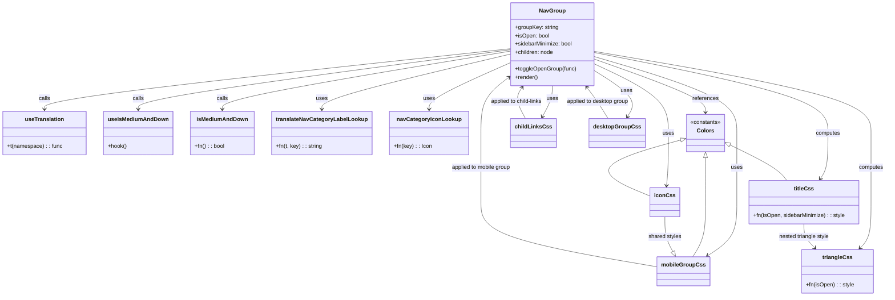

# Diagram: web/portal/src/modules/appnav/components/NavGroup.js

> Auto-generated by Obscura crawlers

## Mermaid

### SVG

<svg id="container" width="2531.7578125" xmlns="http://www.w3.org/2000/svg" class="classDiagram" height="856" viewBox="0 0 2531.7578125 856" role="graphics-document document" aria-roledescription="class"><g><defs><marker id="container_class-aggregationStart" class="marker aggregation class" refX="18" refY="7" markerWidth="190" markerHeight="240" orient="auto"><path d="M 18,7 L9,13 L1,7 L9,1 Z"></path></marker></defs><defs><marker id="container_class-aggregationEnd" class="marker aggregation class" refX="1" refY="7" markerWidth="20" markerHeight="28" orient="auto"><path d="M 18,7 L9,13 L1,7 L9,1 Z"></path></marker></defs><defs><marker id="container_class-extensionStart" class="marker extension class" refX="18" refY="7" markerWidth="190" markerHeight="240" orient="auto"><path d="M 1,7 L18,13 V 1 Z"></path></marker></defs><defs><marker id="container_class-extensionEnd" class="marker extension class" refX="1" refY="7" markerWidth="20" markerHeight="28" orient="auto"><path d="M 1,1 V 13 L18,7 Z"></path></marker></defs><defs><marker id="container_class-compositionStart" class="marker composition class" refX="18" refY="7" markerWidth="190" markerHeight="240" orient="auto"><path d="M 18,7 L9,13 L1,7 L9,1 Z"></path></marker></defs><defs><marker id="container_class-compositionEnd" class="marker composition class" refX="1" refY="7" markerWidth="20" markerHeight="28" orient="auto"><path d="M 18,7 L9,13 L1,7 L9,1 Z"></path></marker></defs><defs><marker id="container_class-dependencyStart" class="marker dependency class" refX="6" refY="7" markerWidth="190" markerHeight="240" orient="auto"><path d="M 5,7 L9,13 L1,7 L9,1 Z"></path></marker></defs><defs><marker id="container_class-dependencyEnd" class="marker dependency class" refX="13" refY="7" markerWidth="20" markerHeight="28" orient="auto"><path d="M 18,7 L9,13 L14,7 L9,1 Z"></path></marker></defs><defs><marker id="container_class-lollipopStart" class="marker lollipop class" refX="13" refY="7" markerWidth="190" markerHeight="240" orient="auto"><circle stroke="black" fill="transparent" cx="7" cy="7" r="6"></circle></marker></defs><defs><marker id="container_class-lollipopEnd" class="marker lollipop class" refX="1" refY="7" markerWidth="190" markerHeight="240" orient="auto"><circle stroke="black" fill="transparent" cx="7" cy="7" r="6"></circle></marker></defs><g class="root"><g class="clusters"></g><g class="edgePaths"><path d="M1445.445,140.954L1225.564,164.961C1005.684,188.969,565.922,236.985,346.041,266.159C126.16,295.333,126.16,305.667,126.16,310.833L126.16,316" id="id_NavGroup_useTranslation_1" class="edge-thickness-normal edge-pattern-solid relation" style=";;;" data-edge="true" data-et="edge" data-id="id_NavGroup_useTranslation_1" data-points="W3sieCI6MTQ0NS40NDUzMTI1LCJ5IjoxNDAuOTUzNzgyNzExMDk5MTd9LHsieCI6MTI2LjE2MDE1NjI1LCJ5IjoyODV9LHsieCI6MTI2LjE2MDE1NjI1LCJ5IjozMjJ9XQ==" marker-end="url(#container_class-dependencyEnd)"></path><path d="M1445.445,143.853L1269.389,167.377C1093.333,190.902,741.221,237.951,565.165,266.642C389.109,295.333,389.109,305.667,389.109,310.833L389.109,316" id="id_NavGroup_useIsMediumAndDown_2" class="edge-thickness-normal edge-pattern-solid relation" style=";;;" data-edge="true" data-et="edge" data-id="id_NavGroup_useIsMediumAndDown_2" data-points="W3sieCI6MTQ0NS40NDUzMTI1LCJ5IjoxNDMuODUyNzIzMTI2MTI2Mn0seyJ4IjozODkuMTA5Mzc1LCJ5IjoyODV9LHsieCI6Mzg5LjEwOTM3NSwieSI6MzIyfV0=" marker-end="url(#container_class-dependencyEnd)"></path><path d="M1445.445,147.811L1308.52,170.676C1171.594,193.541,897.742,239.27,760.816,267.302C623.891,295.333,623.891,305.667,623.891,310.833L623.891,316" id="id_NavGroup_isMediumAndDown_3" class="edge-thickness-normal edge-pattern-solid relation" style=";;;" data-edge="true" data-et="edge" data-id="id_NavGroup_isMediumAndDown_3" data-points="W3sieCI6MTQ0NS40NDUzMTI1LCJ5IjoxNDcuODExMzkyMjQ3Mjg5MDR9LHsieCI6NjIzLjg5MDYyNSwieSI6Mjg1fSx7IngiOjYyMy44OTA2MjUsInkiOjMyMn1d" marker-end="url(#container_class-dependencyEnd)"></path><path d="M1445.445,156.288L1355.474,177.74C1265.503,199.192,1085.56,242.096,995.589,268.715C905.617,295.333,905.617,305.667,905.617,310.833L905.617,316" id="id_NavGroup_translateNavCategoryLabelLookup_4" class="edge-thickness-normal edge-pattern-solid relation" style=";;;" data-edge="true" data-et="edge" data-id="id_NavGroup_translateNavCategoryLabelLookup_4" data-points="W3sieCI6MTQ0NS40NDUzMTI1LCJ5IjoxNTYuMjg3NzE3NzE2MjkyNTV9LHsieCI6OTA1LjYxNzE4NzUsInkiOjI4NX0seyJ4Ijo5MDUuNjE3MTg3NSwieSI6MzIyfV0=" marker-end="url(#container_class-dependencyEnd)"></path><path d="M1445.445,180.24L1405.792,197.7C1366.139,215.16,1286.833,250.08,1247.18,272.707C1207.527,295.333,1207.527,305.667,1207.527,310.833L1207.527,316" id="id_NavGroup_navCategoryIconLookup_5" class="edge-thickness-normal edge-pattern-solid relation" style=";;;" data-edge="true" data-et="edge" data-id="id_NavGroup_navCategoryIconLookup_5" data-points="W3sieCI6MTQ0NS40NDUzMTI1LCJ5IjoxODAuMjM5ODc5OTI4NTcwNjR9LHsieCI6MTIwNy41MjczNDM3NSwieSI6Mjg1fSx7IngiOjEyMDcuNTI3MzQzNzUsInkiOjMyMn1d" marker-end="url(#container_class-dependencyEnd)"></path><path d="M1682.727,169.751L1737.309,188.959C1791.891,208.167,1901.055,246.584,1955.637,272.459C2010.219,298.333,2010.219,311.667,2010.219,318.333L2010.219,325" id="id_NavGroup_Colors_6" class="edge-thickness-normal edge-pattern-solid relation" style=";;;" data-edge="true" data-et="edge" data-id="id_NavGroup_Colors_6" data-points="W3sieCI6MTY4Mi43MjY1NjI1LCJ5IjoxNjkuNzUxMTk1MTY2Nzk4fSx7IngiOjIwMTAuMjE4NzUsInkiOjI4NX0seyJ4IjoyMDEwLjIxODc1LCJ5IjozMzF9XQ==" marker-end="url(#container_class-dependencyEnd)"></path><path d="M1682.727,183.041L1719.355,200.034C1755.984,217.027,1829.242,251.014,1865.871,284.673C1902.5,318.333,1902.5,351.667,1902.5,385C1902.5,418.333,1902.5,451.667,1901.633,477.005C1900.766,502.343,1899.031,519.687,1898.164,528.358L1897.297,537.03" id="id_NavGroup_iconCss_7" class="edge-thickness-normal edge-pattern-solid relation" style=";;;" data-edge="true" data-et="edge" data-id="id_NavGroup_iconCss_7" data-points="W3sieCI6MTY4Mi43MjY1NjI1LCJ5IjoxODMuMDQwNzkyMjk4NjM1NjR9LHsieCI6MTkwMi41LCJ5IjoyODV9LHsieCI6MTkwMi41LCJ5IjozODV9LHsieCI6MTkwMi41LCJ5Ijo0ODV9LHsieCI6MTg5Ni43LCJ5Ijo1NDN9XQ==" marker-end="url(#container_class-dependencyEnd)"></path><path d="M1564.086,248L1564.086,254.167C1564.086,260.333,1564.086,272.667,1559.074,287.631C1554.062,302.596,1544.038,320.191,1539.026,328.989L1534.014,337.787" id="id_NavGroup_childLinksCss_8" class="edge-thickness-normal edge-pattern-solid relation" style=";;;" data-edge="true" data-et="edge" data-id="id_NavGroup_childLinksCss_8" data-points="W3sieCI6MTU2NC4wODU5Mzc1LCJ5IjoyNDh9LHsieCI6MTU2NC4wODU5Mzc1LCJ5IjoyODV9LHsieCI6MTUzMS4wNDQwNjI1LCJ5IjozNDN9XQ==" marker-end="url(#container_class-dependencyEnd)"></path><path d="M1682.727,162.663L1752.513,183.053C1822.299,203.442,1961.872,244.221,2031.659,281.277C2101.445,318.333,2101.445,351.667,2101.445,385C2101.445,418.333,2101.445,451.667,2101.445,485C2101.445,518.333,2101.445,551.667,2101.445,585C2101.445,618.333,2101.445,651.667,2087.294,677.458C2073.143,703.25,2044.84,721.499,2030.689,730.624L2016.538,739.749" id="id_NavGroup_mobileGroupCss_9" class="edge-thickness-normal edge-pattern-solid relation" style=";;;" data-edge="true" data-et="edge" data-id="id_NavGroup_mobileGroupCss_9" data-points="W3sieCI6MTY4Mi43MjY1NjI1LCJ5IjoxNjIuNjYzMTY3Njg5MjIxfSx7IngiOjIxMDEuNDQ1MzEyNSwieSI6Mjg1fSx7IngiOjIxMDEuNDQ1MzEyNSwieSI6Mzg1fSx7IngiOjIxMDEuNDQ1MzEyNSwieSI6NDg1fSx7IngiOjIxMDEuNDQ1MzEyNSwieSI6NTg1fSx7IngiOjIxMDEuNDQ1MzEyNSwieSI6Njg1fSx7IngiOjIwMTEuNDk1NDY4NzUsInkiOjc0M31d" marker-end="url(#container_class-dependencyEnd)"></path><path d="M1682.727,200.676L1705.669,214.73C1728.612,228.784,1774.497,256.892,1791.786,279.771C1809.074,302.649,1797.765,320.299,1792.111,329.123L1786.457,337.948" id="id_NavGroup_desktopGroupCss_10" class="edge-thickness-normal edge-pattern-solid relation" style=";;;" data-edge="true" data-et="edge" data-id="id_NavGroup_desktopGroupCss_10" data-points="W3sieCI6MTY4Mi43MjY1NjI1LCJ5IjoyMDAuNjc1NzkxMDEzODM4OTN9LHsieCI6MTgyMC4zODI4MTI1LCJ5IjoyODV9LHsieCI6MTc4My4yMTk3NjU2MjUsInkiOjM0M31d" marker-end="url(#container_class-dependencyEnd)"></path><path d="M1682.727,151.29L1796.246,173.575C1909.766,195.86,2136.805,240.43,2250.324,279.382C2363.844,318.333,2363.844,351.667,2363.844,385C2363.844,418.333,2363.844,451.667,2360.158,473.677C2356.472,495.687,2349.101,506.374,2345.415,511.717L2341.729,517.061" id="id_NavGroup_titleCss_11" class="edge-thickness-normal edge-pattern-solid relation" style=";;;" data-edge="true" data-et="edge" data-id="id_NavGroup_titleCss_11" data-points="W3sieCI6MTY4Mi43MjY1NjI1LCJ5IjoxNTEuMjkwMjczNDIyNjE4MTh9LHsieCI6MjM2My44NDM3NSwieSI6Mjg1fSx7IngiOjIzNjMuODQzNzUsInkiOjM4NX0seyJ4IjoyMzYzLjg0Mzc1LCJ5Ijo0ODV9LHsieCI6MjMzOC4zMjI0MjE4NzUsInkiOjUyMn1d" marker-end="url(#container_class-dependencyEnd)"></path><path d="M1682.727,148.154L1816.987,170.962C1951.247,193.769,2219.768,239.385,2354.029,278.859C2488.289,318.333,2488.289,351.667,2488.289,385C2488.289,418.333,2488.289,451.667,2488.289,485C2488.289,518.333,2488.289,551.667,2488.289,585C2488.289,618.333,2488.289,651.667,2483.02,673.781C2477.752,695.896,2467.214,706.791,2461.946,712.239L2456.677,717.687" id="id_NavGroup_triangleCss_12" class="edge-thickness-normal edge-pattern-solid relation" style=";;;" data-edge="true" data-et="edge" data-id="id_NavGroup_triangleCss_12" data-points="W3sieCI6MTY4Mi43MjY1NjI1LCJ5IjoxNDguMTU0MjAzNzkwNDI3NTd9LHsieCI6MjQ4OC4yODkwNjI1LCJ5IjoyODV9LHsieCI6MjQ4OC4yODkwNjI1LCJ5IjozODV9LHsieCI6MjQ4OC4yODkwNjI1LCJ5Ijo0ODV9LHsieCI6MjQ4OC4yODkwNjI1LCJ5Ijo1ODV9LHsieCI6MjQ4OC4yODkwNjI1LCJ5Ijo2ODV9LHsieCI6MjQ1Mi41MDYwMTU2MjUsInkiOjcyMn1d" marker-end="url(#container_class-dependencyEnd)"></path><path d="M1937.366,405.148L1889.245,418.457C1841.123,431.765,1744.88,458.383,1730.831,485.663C1716.781,512.944,1784.926,540.887,1818.998,554.859L1853.07,568.831" id="id_Colors_iconCss_13" class="edge-thickness-normal edge-pattern-solid relation" style=";;;" data-edge="true" data-et="edge" data-id="id_Colors_iconCss_13" data-points="W3sieCI6MTk1My45OTIxODc1LCJ5Ijo0MDAuNTUwMTUzOTQ1ODc1OX0seyJ4IjoxNjQ4LjYzNjcxODc1LCJ5Ijo0ODV9LHsieCI6MTg1My4wNzAzMTI1LCJ5Ijo1NjguODMxMjMyMjc5ODY5OX1d" marker-start="url(#container_class-extensionStart)"></path><path d="M2010.219,456.25L2010.219,461.042C2010.219,465.833,2010.219,475.417,2010.219,496.875C2010.219,518.333,2010.219,551.667,2010.219,585C2010.219,618.333,2010.219,651.667,2004.046,678C1997.873,704.333,1985.526,723.667,1979.353,733.333L1973.18,743" id="id_Colors_mobileGroupCss_14" class="edge-thickness-normal edge-pattern-solid relation" style=";;;" data-edge="true" data-et="edge" data-id="id_Colors_mobileGroupCss_14" data-points="W3sieCI6MjAxMC4yMTg3NSwieSI6NDM5fSx7IngiOjIwMTAuMjE4NzUsInkiOjQ4NX0seyJ4IjoyMDEwLjIxODc1LCJ5Ijo1ODV9LHsieCI6MjAxMC4yMTg3NSwieSI6Njg1fSx7IngiOjE5NzMuMTgwMzEyNSwieSI6NzQzfV0=" marker-start="url(#container_class-extensionStart)"></path><path d="M2081.966,419.798L2104.372,430.665C2126.778,441.532,2171.59,463.266,2198.835,480.3C2226.08,497.333,2235.757,509.667,2240.596,515.833L2245.434,522" id="id_Colors_titleCss_15" class="edge-thickness-normal edge-pattern-solid relation" style=";;;" data-edge="true" data-et="edge" data-id="id_Colors_titleCss_15" data-points="W3sieCI6MjA2Ni40NDUzMTI1LCJ5Ijo0MTIuMjcwMTQzNzk2Mjk4MDR9LHsieCI6MjIxNi40MDIzNDM3NSwieSI6NDg1fSx7IngiOjIyNDUuNDM0MzM1OTM3NSwieSI6NTIyfV0=" marker-start="url(#container_class-extensionStart)"></path><path d="M1892.5,627L1892.5,636.667C1892.5,646.333,1892.5,665.667,1896.343,682.469C1900.186,699.271,1907.872,713.542,1911.716,720.677L1915.559,727.813" id="id_iconCss_mobileGroupCss_16" class="edge-thickness-normal edge-pattern-solid relation" style=";;;" data-edge="true" data-et="edge" data-id="id_iconCss_mobileGroupCss_16" data-points="W3sieCI6MTg5Mi41LCJ5Ijo2Mjd9LHsieCI6MTg5Mi41LCJ5Ijo2ODV9LHsieCI6MTkyMy43Mzg0Mzc1LCJ5Ijo3NDN9XQ==" marker-end="url(#container_class-extensionEnd)"></path><path d="M2294.867,648L2294.867,654.167C2294.867,660.333,2294.867,672.667,2300.136,684.281C2305.404,695.896,2315.942,706.791,2321.21,712.239L2326.479,717.687" id="id_titleCss_triangleCss_17" class="edge-thickness-normal edge-pattern-solid relation" style=";;;" data-edge="true" data-et="edge" data-id="id_titleCss_triangleCss_17" data-points="W3sieCI6MjI5NC44NjcxODc1LCJ5Ijo2NDh9LHsieCI6MjI5NC44NjcxODc1LCJ5Ijo2ODV9LHsieCI6MjMzMC42NTAyMzQzNzUsInkiOjcyMn1d" marker-end="url(#container_class-dependencyEnd)"></path><path d="M1483.19,343L1477.683,333.333C1472.176,323.667,1461.162,304.333,1459.543,289.309C1457.924,274.285,1465.7,263.571,1469.588,258.213L1473.476,252.856" id="id_childLinksCss_NavGroup_18" class="edge-thickness-normal edge-pattern-solid relation" style=";;;" data-edge="true" data-et="edge" data-id="id_childLinksCss_NavGroup_18" data-points="W3sieCI6MTQ4My4xOTAzMTI1LCJ5IjozNDN9LHsieCI6MTQ1MC4xNDg0Mzc1LCJ5IjoyODV9LHsieCI6MTQ3Ni45OTk5NTAyMzg4NTM0LCJ5IjoyNDh9XQ==" marker-end="url(#container_class-dependencyEnd)"></path><path d="M1874.781,772.943L1787.768,758.286C1700.755,743.629,1526.729,714.314,1439.716,682.99C1352.703,651.667,1352.703,618.333,1352.703,585C1352.703,551.667,1352.703,518.333,1352.703,485C1352.703,451.667,1352.703,418.333,1352.703,385C1352.703,351.667,1352.703,318.333,1367.357,290.783C1382.012,263.232,1411.32,241.464,1425.974,230.579L1440.629,219.695" id="id_mobileGroupCss_NavGroup_19" class="edge-thickness-normal edge-pattern-solid relation" style=";;;" data-edge="true" data-et="edge" data-id="id_mobileGroupCss_NavGroup_19" data-points="W3sieCI6MTg3NC43ODEyNSwieSI6NzcyLjk0MjgzMzA3ODkwNzF9LHsieCI6MTM1Mi43MDMxMjUsInkiOjY4NX0seyJ4IjoxMzUyLjcwMzEyNSwieSI6NTg1fSx7IngiOjEzNTIuNzAzMTI1LCJ5Ijo0ODV9LHsieCI6MTM1Mi43MDMxMjUsInkiOjM4NX0seyJ4IjoxMzUyLjcwMzEyNSwieSI6Mjg1fSx7IngiOjE0NDUuNDQ1MzEyNSwieSI6MjE2LjExNzc1MTQxMzY4MjI0fV0=" marker-end="url(#container_class-dependencyEnd)"></path><path d="M1729.397,343L1723.204,333.333C1717.01,323.667,1704.622,304.333,1694.027,289.275C1683.432,274.216,1674.63,263.432,1670.229,258.04L1665.828,252.648" id="id_desktopGroupCss_NavGroup_20" class="edge-thickness-normal edge-pattern-solid relation" style=";;;" data-edge="true" data-et="edge" data-id="id_desktopGroupCss_NavGroup_20" data-points="W3sieCI6MTcyOS4zOTc0MjE4NzUsInkiOjM0M30seyJ4IjoxNjkyLjIzNDM3NSwieSI6Mjg1fSx7IngiOjE2NjIuMDMzNzg3ODE4NDcxNCwieSI6MjQ4fV0=" marker-end="url(#container_class-dependencyEnd)"></path></g><g class="edgeLabels"><g class="edgeLabel" transform="translate(126.16015625, 285)"><g class="label" data-id="id_NavGroup_useTranslation_1" transform="translate(-16.4453125, -12)"><foreignObject width="32.890625" height="24">

calls

</foreignObject></g></g><g class="edgeLabel" transform="translate(389.109375, 285)"><g class="label" data-id="id_NavGroup_useIsMediumAndDown_2" transform="translate(-16.4453125, -12)"><foreignObject width="32.890625" height="24">

calls

</foreignObject></g></g><g class="edgeLabel" transform="translate(623.890625, 285)"><g class="label" data-id="id_NavGroup_isMediumAndDown_3" transform="translate(-16.4453125, -12)"><foreignObject width="32.890625" height="24">

calls

</foreignObject></g></g><g class="edgeLabel" transform="translate(905.6171875, 285)"><g class="label" data-id="id_NavGroup_translateNavCategoryLabelLookup_4" transform="translate(-16.4921875, -12)"><foreignObject width="32.984375" height="24">

uses

</foreignObject></g></g><g class="edgeLabel" transform="translate(1207.52734375, 285)"><g class="label" data-id="id_NavGroup_navCategoryIconLookup_5" transform="translate(-16.4921875, -12)"><foreignObject width="32.984375" height="24">

uses

</foreignObject></g></g><g class="edgeLabel" transform="translate(2010.21875, 285)"><g class="label" data-id="id_NavGroup_Colors_6" transform="translate(-37.828125, -12)"><foreignObject width="75.65625" height="24">

references

</foreignObject></g></g><g class="edgeLabel" transform="translate(1902.5, 385)"><g class="label" data-id="id_NavGroup_iconCss_7" transform="translate(-16.4921875, -12)"><foreignObject width="32.984375" height="24">

uses

</foreignObject></g></g><g class="edgeLabel" transform="translate(1564.0859375, 285)"><g class="label" data-id="id_NavGroup_childLinksCss_8" transform="translate(-16.4921875, -12)"><foreignObject width="32.984375" height="24">

uses

</foreignObject></g></g><g class="edgeLabel" transform="translate(2101.4453125, 485)"><g class="label" data-id="id_NavGroup_mobileGroupCss_9" transform="translate(-16.4921875, -12)"><foreignObject width="32.984375" height="24">

uses

</foreignObject></g></g><g class="edgeLabel" transform="translate(1780.9246, 260.82905)"><g class="label" data-id="id_NavGroup_desktopGroupCss_10" transform="translate(-16.4921875, -12)"><foreignObject width="32.984375" height="24">

uses

</foreignObject></g></g><g class="edgeLabel" transform="translate(2363.84375, 385)"><g class="label" data-id="id_NavGroup_titleCss_11" transform="translate(-35.46875, -12)"><foreignObject width="70.9375" height="24">

computes

</foreignObject></g></g><g class="edgeLabel" transform="translate(2488.2890625, 485)"><g class="label" data-id="id_NavGroup_triangleCss_12" transform="translate(-35.46875, -12)"><foreignObject width="70.9375" height="24">

computes

</foreignObject></g></g><g class="edgeLabel"><g class="label" data-id="id_Colors_iconCss_13" transform="translate(0, 0)"><foreignObject width="0" height="0">

</foreignObject></g></g><g class="edgeLabel"><g class="label" data-id="id_Colors_mobileGroupCss_14" transform="translate(0, 0)"><foreignObject width="0" height="0">

</foreignObject></g></g><g class="edgeLabel"><g class="label" data-id="id_Colors_titleCss_15" transform="translate(0, 0)"><foreignObject width="0" height="0">

</foreignObject></g></g><g class="edgeLabel" transform="translate(1892.5, 685)"><g class="label" data-id="id_iconCss_mobileGroupCss_16" transform="translate(-47.8125, -12)"><foreignObject width="95.625" height="24">

shared styles

</foreignObject></g></g><g class="edgeLabel" transform="translate(2294.8671875, 685)"><g class="label" data-id="id_titleCss_triangleCss_17" transform="translate(-74.21875, -12)"><foreignObject width="148.4375" height="24">

nested triangle style

</foreignObject></g></g><g class="edgeLabel" transform="translate(1455.35457, 294.13858)"><g class="label" data-id="id_childLinksCss_NavGroup_18" transform="translate(-77.4453125, -12)"><foreignObject width="154.890625" height="24">

applied to child-links

</foreignObject></g></g><g class="edgeLabel" transform="translate(1352.703125, 485)"><g class="label" data-id="id_mobileGroupCss_NavGroup_19" transform="translate(-87.6953125, -12)"><foreignObject width="175.390625" height="24">

applied to mobile group

</foreignObject></g></g><g class="edgeLabel" transform="translate(1697.93255, 293.89308)"><g class="label" data-id="id_desktopGroupCss_NavGroup_20" transform="translate(-91.65625, -12)"><foreignObject width="183.3125" height="24">

applied to desktop group

</foreignObject></g></g></g><g class="nodes"><g class="node default" id="classId-NavGroup-0" transform="translate(1564.0859375, 128)"><g class="basic label-container"><path d="M-118.640625 -120 L118.640625 -120 L118.640625 120 L-118.640625 120" stroke="none" stroke-width="0" fill="#ECECFF" style=""></path><path d="M-118.640625 -120 C-34.34365693817938 -120, 49.95331112364124 -120, 118.640625 -120 M-118.640625 -120 C-35.820931990224366 -120, 46.99876101955127 -120, 118.640625 -120 M118.640625 -120 C118.640625 -38.08384710579335, 118.640625 43.832305788413294, 118.640625 120 M118.640625 -120 C118.640625 -46.44713727686023, 118.640625 27.105725446279536, 118.640625 120 M118.640625 120 C35.6731150934836 120, -47.294394813032795 120, -118.640625 120 M118.640625 120 C37.0442920758382 120, -44.5520408483236 120, -118.640625 120 M-118.640625 120 C-118.640625 62.54813310328596, -118.640625 5.096266206571926, -118.640625 -120 M-118.640625 120 C-118.640625 47.21480056634719, -118.640625 -25.570398867305613, -118.640625 -120" stroke="#9370DB" stroke-width="1.3" fill="none" stroke-dasharray="0 0" style=""></path></g><g class="annotation-group text" transform="translate(0, -96)"></g><g class="label-group text" transform="translate(-35.828125, -96)"><g class="label" style="font-weight: bolder" transform="translate(0,-12)"><foreignObject width="71.65625" height="24">

NavGroup

</foreignObject></g></g><g class="members-group text" transform="translate(-106.640625, -48)"><g class="label" style="" transform="translate(0,-12)"><foreignObject width="125.671875" height="24">

+groupKey: string

</foreignObject></g><g class="label" style="" transform="translate(0,12)"><foreignObject width="99.609375" height="24">

+isOpen: bool

</foreignObject></g><g class="label" style="" transform="translate(0,36)"><foreignObject width="168.125" height="24">

+sidebarMinimize: bool

</foreignObject></g><g class="label" style="" transform="translate(0,60)"><foreignObject width="112.578125" height="24">

+children: node

</foreignObject></g></g><g class="methods-group text" transform="translate(-106.640625, 72)"><g class="label" style="" transform="translate(0,-12)"><foreignObject width="177.453125" height="24">

+toggleOpenGroup(func)

</foreignObject></g><g class="label" style="" transform="translate(0,12)"><foreignObject width="66.609375" height="24">

+render()

</foreignObject></g></g><g class="divider" style=""><path d="M-118.640625 -72 C-53.784787575734796 -72, 11.071049848530407 -72, 118.640625 -72 M-118.640625 -72 C-56.243125292425184 -72, 6.154374415149633 -72, 118.640625 -72" stroke="#9370DB" stroke-width="1.3" fill="none" stroke-dasharray="0 0" style=""></path></g><g class="divider" style=""><path d="M-118.640625 48 C-55.1513644513904 48, 8.3378960972192 48, 118.640625 48 M-118.640625 48 C-47.38884521619393 48, 23.862934567612143 48, 118.640625 48" stroke="#9370DB" stroke-width="1.3" fill="none" stroke-dasharray="0 0" style=""></path></g></g><g class="node default" id="classId-useTranslation-1" transform="translate(126.16015625, 385)"><g class="basic label-container"><path d="M-118.16015625 -63 L118.16015625 -63 L118.16015625 63 L-118.16015625 63" stroke="none" stroke-width="0" fill="#ECECFF" style=""></path><path d="M-118.16015625 -63 C-63.60365690281618 -63, -9.047157555632353 -63, 118.16015625 -63 M-118.16015625 -63 C-59.157819942637786 -63, -0.15548363527557285 -63, 118.16015625 -63 M118.16015625 -63 C118.16015625 -28.72447868060849, 118.16015625 5.5510426387830165, 118.16015625 63 M118.16015625 -63 C118.16015625 -18.626838730238475, 118.16015625 25.74632253952305, 118.16015625 63 M118.16015625 63 C43.988561054756275 63, -30.18303414048745 63, -118.16015625 63 M118.16015625 63 C28.845092353613936 63, -60.46997154277213 63, -118.16015625 63 M-118.16015625 63 C-118.16015625 18.759634026974766, -118.16015625 -25.48073194605047, -118.16015625 -63 M-118.16015625 63 C-118.16015625 37.1816186407773, -118.16015625 11.363237281554596, -118.16015625 -63" stroke="#9370DB" stroke-width="1.3" fill="none" stroke-dasharray="0 0" style=""></path></g><g class="annotation-group text" transform="translate(0, -39)"></g><g class="label-group text" transform="translate(-54.0859375, -39)"><g class="label" style="font-weight: bolder" transform="translate(0,-12)"><foreignObject width="108.171875" height="24">

useTranslation

</foreignObject></g></g><g class="members-group text" transform="translate(-106.16015625, 9)"></g><g class="methods-group text" transform="translate(-106.16015625, 39)"><g class="label" style="" transform="translate(0,-12)"><foreignObject width="158.234375" height="24">

+t(namespace) : : func

</foreignObject></g></g><g class="divider" style=""><path d="M-118.16015625 -15 C-48.39436515630105 -15, 21.371425937397902 -15, 118.16015625 -15 M-118.16015625 -15 C-43.53523472633573 -15, 31.08968679732854 -15, 118.16015625 -15" stroke="#9370DB" stroke-width="1.3" fill="none" stroke-dasharray="0 0" style=""></path></g><g class="divider" style=""><path d="M-118.16015625 9 C-56.86823021840866 9, 4.423695813182675 9, 118.16015625 9 M-118.16015625 9 C-30.888975881402672 9, 56.382204487194656 9, 118.16015625 9" stroke="#9370DB" stroke-width="1.3" fill="none" stroke-dasharray="0 0" style=""></path></g></g><g class="node default" id="classId-useIsMediumAndDown-2" transform="translate(389.109375, 385)"><g class="basic label-container"><path d="M-94.7890625 -63 L94.7890625 -63 L94.7890625 63 L-94.7890625 63" stroke="none" stroke-width="0" fill="#ECECFF" style=""></path><path d="M-94.7890625 -63 C-38.2982204133907 -63, 18.192621673218596 -63, 94.7890625 -63 M-94.7890625 -63 C-27.615158998822224 -63, 39.55874450235555 -63, 94.7890625 -63 M94.7890625 -63 C94.7890625 -15.171449902369723, 94.7890625 32.657100195260554, 94.7890625 63 M94.7890625 -63 C94.7890625 -18.69068792476974, 94.7890625 25.61862415046052, 94.7890625 63 M94.7890625 63 C40.0349158499491 63, -14.719230800101798 63, -94.7890625 63 M94.7890625 63 C31.506400090249095 63, -31.77626231950181 63, -94.7890625 63 M-94.7890625 63 C-94.7890625 14.4282103401042, -94.7890625 -34.1435793197916, -94.7890625 -63 M-94.7890625 63 C-94.7890625 34.72779431976953, -94.7890625 6.455588639539052, -94.7890625 -63" stroke="#9370DB" stroke-width="1.3" fill="none" stroke-dasharray="0 0" style=""></path></g><g class="annotation-group text" transform="translate(0, -39)"></g><g class="label-group text" transform="translate(-82.7890625, -39)"><g class="label" style="font-weight: bolder" transform="translate(0,-12)"><foreignObject width="165.578125" height="24">

useIsMediumAndDown

</foreignObject></g></g><g class="members-group text" transform="translate(-82.7890625, 9)"></g><g class="methods-group text" transform="translate(-82.7890625, 39)"><g class="label" style="" transform="translate(0,-12)"><foreignObject width="54.609375" height="24">

+hook()

</foreignObject></g></g><g class="divider" style=""><path d="M-94.7890625 -15 C-33.63426311627581 -15, 27.520536267448378 -15, 94.7890625 -15 M-94.7890625 -15 C-52.16532380724625 -15, -9.541585114492506 -15, 94.7890625 -15" stroke="#9370DB" stroke-width="1.3" fill="none" stroke-dasharray="0 0" style=""></path></g><g class="divider" style=""><path d="M-94.7890625 9 C-24.442908339237675 9, 45.90324582152465 9, 94.7890625 9 M-94.7890625 9 C-46.59190773770412 9, 1.6052470245917618 9, 94.7890625 9" stroke="#9370DB" stroke-width="1.3" fill="none" stroke-dasharray="0 0" style=""></path></g></g><g class="node default" id="classId-isMediumAndDown-3" transform="translate(623.890625, 385)"><g class="basic label-container"><path d="M-89.9921875 -63 L89.9921875 -63 L89.9921875 63 L-89.9921875 63" stroke="none" stroke-width="0" fill="#ECECFF" style=""></path><path d="M-89.9921875 -63 C-18.211708036855427 -63, 53.568771426289146 -63, 89.9921875 -63 M-89.9921875 -63 C-43.602245628752684 -63, 2.7876962424946328 -63, 89.9921875 -63 M89.9921875 -63 C89.9921875 -19.30108451244019, 89.9921875 24.397830975119618, 89.9921875 63 M89.9921875 -63 C89.9921875 -19.35730262889828, 89.9921875 24.285394742203437, 89.9921875 63 M89.9921875 63 C47.37838281928716 63, 4.764578138574322 63, -89.9921875 63 M89.9921875 63 C52.71964952410197 63, 15.447111548203935 63, -89.9921875 63 M-89.9921875 63 C-89.9921875 24.309031551853963, -89.9921875 -14.381936896292075, -89.9921875 -63 M-89.9921875 63 C-89.9921875 18.55865211167464, -89.9921875 -25.88269577665072, -89.9921875 -63" stroke="#9370DB" stroke-width="1.3" fill="none" stroke-dasharray="0 0" style=""></path></g><g class="annotation-group text" transform="translate(0, -39)"></g><g class="label-group text" transform="translate(-69.84375, -39)"><g class="label" style="font-weight: bolder" transform="translate(0,-12)"><foreignObject width="139.6875" height="24">

isMediumAndDown

</foreignObject></g></g><g class="members-group text" transform="translate(-77.9921875, 9)"></g><g class="methods-group text" transform="translate(-77.9921875, 39)"><g class="label" style="" transform="translate(0,-12)"><foreignObject width="86.140625" height="24">

+fn() : : bool

</foreignObject></g></g><g class="divider" style=""><path d="M-89.9921875 -15 C-28.321619863642418 -15, 33.348947772715164 -15, 89.9921875 -15 M-89.9921875 -15 C-50.232643107381016 -15, -10.473098714762031 -15, 89.9921875 -15" stroke="#9370DB" stroke-width="1.3" fill="none" stroke-dasharray="0 0" style=""></path></g><g class="divider" style=""><path d="M-89.9921875 9 C-25.075759266563978 9, 39.840668966872045 9, 89.9921875 9 M-89.9921875 9 C-21.407765125648908 9, 47.176657248702185 9, 89.9921875 9" stroke="#9370DB" stroke-width="1.3" fill="none" stroke-dasharray="0 0" style=""></path></g></g><g class="node default" id="classId-translateNavCategoryLabelLookup-4" transform="translate(905.6171875, 385)"><g class="basic label-container"><path d="M-141.734375 -63 L141.734375 -63 L141.734375 63 L-141.734375 63" stroke="none" stroke-width="0" fill="#ECECFF" style=""></path><path d="M-141.734375 -63 C-73.69498383845918 -63, -5.65559267691836 -63, 141.734375 -63 M-141.734375 -63 C-54.52926524040312 -63, 32.67584451919376 -63, 141.734375 -63 M141.734375 -63 C141.734375 -27.913797406497864, 141.734375 7.172405187004273, 141.734375 63 M141.734375 -63 C141.734375 -30.1093265016951, 141.734375 2.7813469966097983, 141.734375 63 M141.734375 63 C80.98183375835401 63, 20.229292516708043 63, -141.734375 63 M141.734375 63 C42.26869248596098 63, -57.196990028078034 63, -141.734375 63 M-141.734375 63 C-141.734375 29.57300885654422, -141.734375 -3.8539822869115596, -141.734375 -63 M-141.734375 63 C-141.734375 15.624100563430034, -141.734375 -31.751798873139933, -141.734375 -63" stroke="#9370DB" stroke-width="1.3" fill="none" stroke-dasharray="0 0" style=""></path></g><g class="annotation-group text" transform="translate(0, -39)"></g><g class="label-group text" transform="translate(-126.078125, -39)"><g class="label" style="font-weight: bolder" transform="translate(0,-12)"><foreignObject width="252.15625" height="24">

translateNavCategoryLabelLookup

</foreignObject></g></g><g class="members-group text" transform="translate(-129.734375, 9)"></g><g class="methods-group text" transform="translate(-129.734375, 39)"><g class="label" style="" transform="translate(0,-12)"><foreignObject width="133.390625" height="24">

+fn(t, key) : : string

</foreignObject></g></g><g class="divider" style=""><path d="M-141.734375 -15 C-68.15513629999883 -15, 5.42410240000234 -15, 141.734375 -15 M-141.734375 -15 C-59.03062576163805 -15, 23.6731234767239 -15, 141.734375 -15" stroke="#9370DB" stroke-width="1.3" fill="none" stroke-dasharray="0 0" style=""></path></g><g class="divider" style=""><path d="M-141.734375 9 C-36.261616459749376 9, 69.21114208050125 9, 141.734375 9 M-141.734375 9 C-36.632928906429086 9, 68.46851718714183 9, 141.734375 9" stroke="#9370DB" stroke-width="1.3" fill="none" stroke-dasharray="0 0" style=""></path></g></g><g class="node default" id="classId-navCategoryIconLookup-5" transform="translate(1207.52734375, 385)"><g class="basic label-container"><path d="M-110.17578125 -63 L110.17578125 -63 L110.17578125 63 L-110.17578125 63" stroke="none" stroke-width="0" fill="#ECECFF" style=""></path><path d="M-110.17578125 -63 C-31.496616602570555 -63, 47.18254804485889 -63, 110.17578125 -63 M-110.17578125 -63 C-30.92873472461423 -63, 48.31831180077154 -63, 110.17578125 -63 M110.17578125 -63 C110.17578125 -15.709973189380243, 110.17578125 31.580053621239514, 110.17578125 63 M110.17578125 -63 C110.17578125 -26.750798639028652, 110.17578125 9.498402721942696, 110.17578125 63 M110.17578125 63 C37.82777093422234 63, -34.520239381555314 63, -110.17578125 63 M110.17578125 63 C44.47159234582875 63, -21.232596558342493 63, -110.17578125 63 M-110.17578125 63 C-110.17578125 24.84607273135982, -110.17578125 -13.307854537280363, -110.17578125 -63 M-110.17578125 63 C-110.17578125 33.27346343500577, -110.17578125 3.5469268700115464, -110.17578125 -63" stroke="#9370DB" stroke-width="1.3" fill="none" stroke-dasharray="0 0" style=""></path></g><g class="annotation-group text" transform="translate(0, -39)"></g><g class="label-group text" transform="translate(-87.7578125, -39)"><g class="label" style="font-weight: bolder" transform="translate(0,-12)"><foreignObject width="175.515625" height="24">

navCategoryIconLookup

</foreignObject></g></g><g class="members-group text" transform="translate(-98.17578125, 9)"></g><g class="methods-group text" transform="translate(-98.17578125, 39)"><g class="label" style="" transform="translate(0,-12)"><foreignObject width="108.59375" height="24">

+fn(key) : : Icon

</foreignObject></g></g><g class="divider" style=""><path d="M-110.17578125 -15 C-52.83821140395971 -15, 4.4993584420805774 -15, 110.17578125 -15 M-110.17578125 -15 C-48.872386853564535 -15, 12.43100754287093 -15, 110.17578125 -15" stroke="#9370DB" stroke-width="1.3" fill="none" stroke-dasharray="0 0" style=""></path></g><g class="divider" style=""><path d="M-110.17578125 9 C-53.68566686023708 9, 2.804447529525845 9, 110.17578125 9 M-110.17578125 9 C-52.39714605949052 9, 5.3814891310189665 9, 110.17578125 9" stroke="#9370DB" stroke-width="1.3" fill="none" stroke-dasharray="0 0" style=""></path></g></g><g class="node default" id="classId-Colors-6" transform="translate(2010.21875, 385)"><g class="basic label-container"><path d="M-56.2265625 -54 L56.2265625 -54 L56.2265625 54 L-56.2265625 54" stroke="none" stroke-width="0" fill="#ECECFF" style=""></path><path d="M-56.2265625 -54 C-18.07117221906995 -54, 20.0842180618601 -54, 56.2265625 -54 M-56.2265625 -54 C-28.35629184472133 -54, -0.4860211894426598 -54, 56.2265625 -54 M56.2265625 -54 C56.2265625 -17.39012052538837, 56.2265625 19.219758949223262, 56.2265625 54 M56.2265625 -54 C56.2265625 -16.163370618274115, 56.2265625 21.67325876345177, 56.2265625 54 M56.2265625 54 C23.654424684379222 54, -8.917713131241555 54, -56.2265625 54 M56.2265625 54 C18.81881530369821 54, -18.588931892603583 54, -56.2265625 54 M-56.2265625 54 C-56.2265625 15.756243170406037, -56.2265625 -22.487513659187925, -56.2265625 -54 M-56.2265625 54 C-56.2265625 14.649056483302225, -56.2265625 -24.70188703339555, -56.2265625 -54" stroke="#9370DB" stroke-width="1.3" fill="none" stroke-dasharray="0 0" style=""></path></g><g class="annotation-group text" transform="translate(-44.2265625, -30)"><g class="label" style="" transform="translate(0,-12)"><foreignObject width="88.453125" height="24">

«constants»

</foreignObject></g></g><g class="label-group text" transform="translate(-23.1015625, -6)"><g class="label" style="font-weight: bolder" transform="translate(0,-12)"><foreignObject width="46.203125" height="24">

Colors

</foreignObject></g></g><g class="members-group text" transform="translate(-44.2265625, 42)"></g><g class="methods-group text" transform="translate(-44.2265625, 72)"></g><g class="divider" style=""><path d="M-56.2265625 18 C-13.659943274681957 18, 28.906675950636085 18, 56.2265625 18 M-56.2265625 18 C-27.082699592470515 18, 2.0611633150589697 18, 56.2265625 18" stroke="#9370DB" stroke-width="1.3" fill="none" stroke-dasharray="0 0" style=""></path></g><g class="divider" style=""><path d="M-56.2265625 36 C-12.536007596642825 36, 31.15454730671435 36, 56.2265625 36 M-56.2265625 36 C-27.689304292631913 36, 0.8479539147361734 36, 56.2265625 36" stroke="#9370DB" stroke-width="1.3" fill="none" stroke-dasharray="0 0" style=""></path></g></g><g class="node default" id="classId-iconCss-7" transform="translate(1892.5, 585)"><g class="basic label-container"><path d="M-39.4296875 -42 L39.4296875 -42 L39.4296875 42 L-39.4296875 42" stroke="none" stroke-width="0" fill="#ECECFF" style=""></path><path d="M-39.4296875 -42 C-15.994332949102699 -42, 7.441021601794603 -42, 39.4296875 -42 M-39.4296875 -42 C-20.838147967146003 -42, -2.246608434292007 -42, 39.4296875 -42 M39.4296875 -42 C39.4296875 -18.322401617696457, 39.4296875 5.355196764607086, 39.4296875 42 M39.4296875 -42 C39.4296875 -12.459547531534525, 39.4296875 17.08090493693095, 39.4296875 42 M39.4296875 42 C18.35828229036235 42, -2.7131229192752997 42, -39.4296875 42 M39.4296875 42 C8.150074202055315 42, -23.12953909588937 42, -39.4296875 42 M-39.4296875 42 C-39.4296875 9.496357777520672, -39.4296875 -23.007284444958657, -39.4296875 -42 M-39.4296875 42 C-39.4296875 10.655820572175465, -39.4296875 -20.68835885564907, -39.4296875 -42" stroke="#9370DB" stroke-width="1.3" fill="none" stroke-dasharray="0 0" style=""></path></g><g class="annotation-group text" transform="translate(0, -18)"></g><g class="label-group text" transform="translate(-27.4296875, -18)"><g class="label" style="font-weight: bolder" transform="translate(0,-12)"><foreignObject width="54.859375" height="24">

iconCss

</foreignObject></g></g><g class="members-group text" transform="translate(-27.4296875, 30)"></g><g class="methods-group text" transform="translate(-27.4296875, 60)"></g><g class="divider" style=""><path d="M-39.4296875 6 C-19.68293960283709 6, 0.06380829432581692 6, 39.4296875 6 M-39.4296875 6 C-12.570897357298321 6, 14.287892785403358 6, 39.4296875 6" stroke="#9370DB" stroke-width="1.3" fill="none" stroke-dasharray="0 0" style=""></path></g><g class="divider" style=""><path d="M-39.4296875 24 C-18.657329224962087 24, 2.115029050075826 24, 39.4296875 24 M-39.4296875 24 C-10.413964253275307 24, 18.601758993449387 24, 39.4296875 24" stroke="#9370DB" stroke-width="1.3" fill="none" stroke-dasharray="0 0" style=""></path></g></g><g class="node default" id="classId-childLinksCss-8" transform="translate(1507.1171875, 385)"><g class="basic label-container"><path d="M-61.265625 -42 L61.265625 -42 L61.265625 42 L-61.265625 42" stroke="none" stroke-width="0" fill="#ECECFF" style=""></path><path d="M-61.265625 -42 C-24.706050315029636 -42, 11.853524369940729 -42, 61.265625 -42 M-61.265625 -42 C-22.016963304897672 -42, 17.231698390204656 -42, 61.265625 -42 M61.265625 -42 C61.265625 -20.472262108269685, 61.265625 1.0554757834606292, 61.265625 42 M61.265625 -42 C61.265625 -23.908826456087372, 61.265625 -5.817652912174744, 61.265625 42 M61.265625 42 C24.548712738257947 42, -12.168199523484105 42, -61.265625 42 M61.265625 42 C16.192158076299073 42, -28.881308847401854 42, -61.265625 42 M-61.265625 42 C-61.265625 15.59533010750527, -61.265625 -10.809339784989461, -61.265625 -42 M-61.265625 42 C-61.265625 17.301578544212358, -61.265625 -7.396842911575284, -61.265625 -42" stroke="#9370DB" stroke-width="1.3" fill="none" stroke-dasharray="0 0" style=""></path></g><g class="annotation-group text" transform="translate(0, -18)"></g><g class="label-group text" transform="translate(-49.265625, -18)"><g class="label" style="font-weight: bolder" transform="translate(0,-12)"><foreignObject width="98.53125" height="24">

childLinksCss

</foreignObject></g></g><g class="members-group text" transform="translate(-49.265625, 30)"></g><g class="methods-group text" transform="translate(-49.265625, 60)"></g><g class="divider" style=""><path d="M-61.265625 6 C-14.646547889227215 6, 31.97252922154557 6, 61.265625 6 M-61.265625 6 C-17.110672669356155 6, 27.04427966128769 6, 61.265625 6" stroke="#9370DB" stroke-width="1.3" fill="none" stroke-dasharray="0 0" style=""></path></g><g class="divider" style=""><path d="M-61.265625 24 C-24.563307451222492 24, 12.139010097555015 24, 61.265625 24 M-61.265625 24 C-19.22464554216174 24, 22.816333915676523 24, 61.265625 24" stroke="#9370DB" stroke-width="1.3" fill="none" stroke-dasharray="0 0" style=""></path></g></g><g class="node default" id="classId-mobileGroupCss-9" transform="translate(1946.359375, 785)"><g class="basic label-container"><path d="M-71.578125 -42 L71.578125 -42 L71.578125 42 L-71.578125 42" stroke="none" stroke-width="0" fill="#ECECFF" style=""></path><path d="M-71.578125 -42 C-39.47570860581608 -42, -7.373292211632162 -42, 71.578125 -42 M-71.578125 -42 C-25.62412667278577 -42, 20.32987165442846 -42, 71.578125 -42 M71.578125 -42 C71.578125 -18.63157288417974, 71.578125 4.736854231640521, 71.578125 42 M71.578125 -42 C71.578125 -16.28109625221938, 71.578125 9.437807495561238, 71.578125 42 M71.578125 42 C26.52756041675204 42, -18.523004166495923 42, -71.578125 42 M71.578125 42 C27.452485294512627 42, -16.673154410974746 42, -71.578125 42 M-71.578125 42 C-71.578125 12.02426831341674, -71.578125 -17.95146337316652, -71.578125 -42 M-71.578125 42 C-71.578125 8.898720622236027, -71.578125 -24.202558755527946, -71.578125 -42" stroke="#9370DB" stroke-width="1.3" fill="none" stroke-dasharray="0 0" style=""></path></g><g class="annotation-group text" transform="translate(0, -18)"></g><g class="label-group text" transform="translate(-59.578125, -18)"><g class="label" style="font-weight: bolder" transform="translate(0,-12)"><foreignObject width="119.15625" height="24">

mobileGroupCss

</foreignObject></g></g><g class="members-group text" transform="translate(-59.578125, 30)"></g><g class="methods-group text" transform="translate(-59.578125, 60)"></g><g class="divider" style=""><path d="M-71.578125 6 C-25.754268369786395 6, 20.06958826042721 6, 71.578125 6 M-71.578125 6 C-30.773021344158522 6, 10.032082311682956 6, 71.578125 6" stroke="#9370DB" stroke-width="1.3" fill="none" stroke-dasharray="0 0" style=""></path></g><g class="divider" style=""><path d="M-71.578125 24 C-15.224890066795098 24, 41.128344866409805 24, 71.578125 24 M-71.578125 24 C-29.686678007185378 24, 12.204768985629244 24, 71.578125 24" stroke="#9370DB" stroke-width="1.3" fill="none" stroke-dasharray="0 0" style=""></path></g></g><g class="node default" id="classId-desktopGroupCss-10" transform="translate(1756.30859375, 385)"><g class="basic label-container"><path d="M-76.25 -42 L76.25 -42 L76.25 42 L-76.25 42" stroke="none" stroke-width="0" fill="#ECECFF" style=""></path><path d="M-76.25 -42 C-35.98606509676064 -42, 4.277869806478719 -42, 76.25 -42 M-76.25 -42 C-19.26941400873003 -42, 37.71117198253994 -42, 76.25 -42 M76.25 -42 C76.25 -23.674785803376942, 76.25 -5.349571606753884, 76.25 42 M76.25 -42 C76.25 -22.791350983224582, 76.25 -3.5827019664491644, 76.25 42 M76.25 42 C30.27777166844588 42, -15.694456663108241 42, -76.25 42 M76.25 42 C20.079322909525303 42, -36.091354180949395 42, -76.25 42 M-76.25 42 C-76.25 15.863455542778617, -76.25 -10.273088914442766, -76.25 -42 M-76.25 42 C-76.25 14.165291034773617, -76.25 -13.669417930452767, -76.25 -42" stroke="#9370DB" stroke-width="1.3" fill="none" stroke-dasharray="0 0" style=""></path></g><g class="annotation-group text" transform="translate(0, -18)"></g><g class="label-group text" transform="translate(-64.25, -18)"><g class="label" style="font-weight: bolder" transform="translate(0,-12)"><foreignObject width="128.5" height="24">

desktopGroupCss

</foreignObject></g></g><g class="members-group text" transform="translate(-64.25, 30)"></g><g class="methods-group text" transform="translate(-64.25, 60)"></g><g class="divider" style=""><path d="M-76.25 6 C-24.32923897856832 6, 27.59152204286336 6, 76.25 6 M-76.25 6 C-27.735677457688595 6, 20.77864508462281 6, 76.25 6" stroke="#9370DB" stroke-width="1.3" fill="none" stroke-dasharray="0 0" style=""></path></g><g class="divider" style=""><path d="M-76.25 24 C-29.414809177325083 24, 17.420381645349835 24, 76.25 24 M-76.25 24 C-18.904720203035886 24, 38.44055959392823 24, 76.25 24" stroke="#9370DB" stroke-width="1.3" fill="none" stroke-dasharray="0 0" style=""></path></g></g><g class="node default" id="classId-titleCss-11" transform="translate(2294.8671875, 585)"><g class="basic label-container"><path d="M-158.421875 -63 L158.421875 -63 L158.421875 63 L-158.421875 63" stroke="none" stroke-width="0" fill="#ECECFF" style=""></path><path d="M-158.421875 -63 C-39.98873236709416 -63, 78.44441026581168 -63, 158.421875 -63 M-158.421875 -63 C-57.354089126498195 -63, 43.71369674700361 -63, 158.421875 -63 M158.421875 -63 C158.421875 -27.978948741767518, 158.421875 7.042102516464965, 158.421875 63 M158.421875 -63 C158.421875 -29.670026141821715, 158.421875 3.6599477163565695, 158.421875 63 M158.421875 63 C60.58490827567134 63, -37.25205844865732 63, -158.421875 63 M158.421875 63 C62.08443950276042 63, -34.252995994479164 63, -158.421875 63 M-158.421875 63 C-158.421875 15.99219566374174, -158.421875 -31.01560867251652, -158.421875 -63 M-158.421875 63 C-158.421875 35.789513885767974, -158.421875 8.579027771535948, -158.421875 -63" stroke="#9370DB" stroke-width="1.3" fill="none" stroke-dasharray="0 0" style=""></path></g><g class="annotation-group text" transform="translate(0, -39)"></g><g class="label-group text" transform="translate(-27.3125, -39)"><g class="label" style="font-weight: bolder" transform="translate(0,-12)"><foreignObject width="54.625" height="24">

titleCss

</foreignObject></g></g><g class="members-group text" transform="translate(-146.421875, 9)"></g><g class="methods-group text" transform="translate(-146.421875, 39)"><g class="label" style="" transform="translate(0,-12)"><foreignObject width="265.53125" height="24">

+fn(isOpen, sidebarMinimize) : : style

</foreignObject></g></g><g class="divider" style=""><path d="M-158.421875 -15 C-63.51004762829538 -15, 31.401779743409236 -15, 158.421875 -15 M-158.421875 -15 C-53.56038416183621 -15, 51.30110667632758 -15, 158.421875 -15" stroke="#9370DB" stroke-width="1.3" fill="none" stroke-dasharray="0 0" style=""></path></g><g class="divider" style=""><path d="M-158.421875 9 C-36.92828070802463 9, 84.56531358395074 9, 158.421875 9 M-158.421875 9 C-33.265326989740146 9, 91.89122102051971 9, 158.421875 9" stroke="#9370DB" stroke-width="1.3" fill="none" stroke-dasharray="0 0" style=""></path></g></g><g class="node default" id="classId-triangleCss-12" transform="translate(2391.578125, 785)"><g class="basic label-container"><path d="M-101.6015625 -63 L101.6015625 -63 L101.6015625 63 L-101.6015625 63" stroke="none" stroke-width="0" fill="#ECECFF" style=""></path><path d="M-101.6015625 -63 C-56.455010916471025 -63, -11.30845933294205 -63, 101.6015625 -63 M-101.6015625 -63 C-49.65014029086576 -63, 2.3012819182684865 -63, 101.6015625 -63 M101.6015625 -63 C101.6015625 -21.280611426577586, 101.6015625 20.438777146844828, 101.6015625 63 M101.6015625 -63 C101.6015625 -16.665436489705222, 101.6015625 29.669127020589556, 101.6015625 63 M101.6015625 63 C53.22845076540143 63, 4.855339030802867 63, -101.6015625 63 M101.6015625 63 C22.434719038634753 63, -56.73212442273049 63, -101.6015625 63 M-101.6015625 63 C-101.6015625 29.906393721073563, -101.6015625 -3.187212557852874, -101.6015625 -63 M-101.6015625 63 C-101.6015625 24.46033606143746, -101.6015625 -14.079327877125081, -101.6015625 -63" stroke="#9370DB" stroke-width="1.3" fill="none" stroke-dasharray="0 0" style=""></path></g><g class="annotation-group text" transform="translate(0, -39)"></g><g class="label-group text" transform="translate(-40.921875, -39)"><g class="label" style="font-weight: bolder" transform="translate(0,-12)"><foreignObject width="81.84375" height="24">

triangleCss

</foreignObject></g></g><g class="members-group text" transform="translate(-89.6015625, 9)"></g><g class="methods-group text" transform="translate(-89.6015625, 39)"><g class="label" style="" transform="translate(0,-12)"><foreignObject width="138.28125" height="24">

+fn(isOpen) : : style

</foreignObject></g></g><g class="divider" style=""><path d="M-101.6015625 -15 C-29.77453063517082 -15, 42.05250122965836 -15, 101.6015625 -15 M-101.6015625 -15 C-58.17387735758313 -15, -14.74619221516626 -15, 101.6015625 -15" stroke="#9370DB" stroke-width="1.3" fill="none" stroke-dasharray="0 0" style=""></path></g><g class="divider" style=""><path d="M-101.6015625 9 C-57.7996696065578 9, -13.997776713115599 9, 101.6015625 9 M-101.6015625 9 C-38.90079241503818 9, 23.799977669923635 9, 101.6015625 9" stroke="#9370DB" stroke-width="1.3" fill="none" stroke-dasharray="0 0" style=""></path></g></g></g></g></g></svg>
