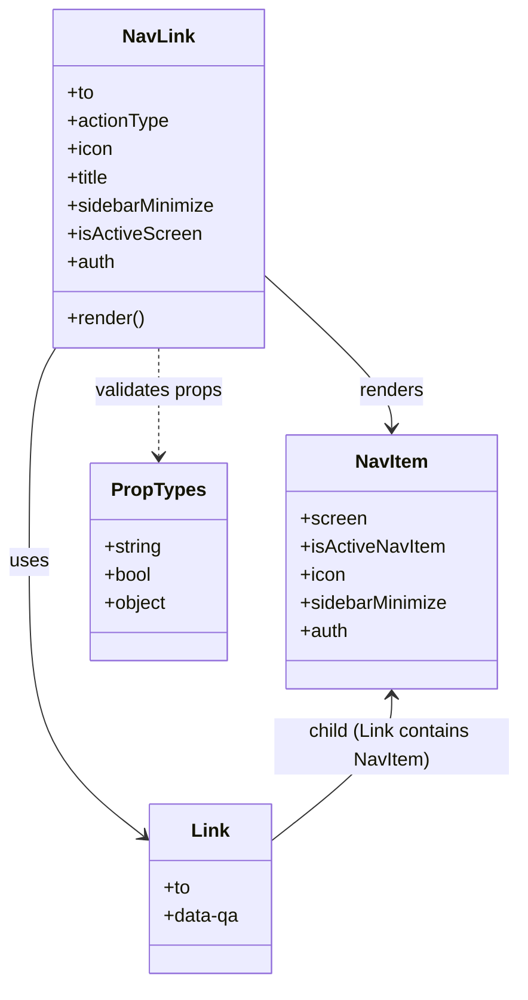

# Diagram: web/portal/src/modules/appnav/components/NavLink.js

> Auto-generated by Obscura crawlers

## Mermaid

### SVG

<svg id="container" width="440.359375" xmlns="http://www.w3.org/2000/svg" class="classDiagram" height="836" viewBox="0 0 440.359375 836" role="graphics-document document" aria-roledescription="class"><g><defs><marker id="container_class-aggregationStart" class="marker aggregation class" refX="18" refY="7" markerWidth="190" markerHeight="240" orient="auto"><path d="M 18,7 L9,13 L1,7 L9,1 Z"></path></marker></defs><defs><marker id="container_class-aggregationEnd" class="marker aggregation class" refX="1" refY="7" markerWidth="20" markerHeight="28" orient="auto"><path d="M 18,7 L9,13 L1,7 L9,1 Z"></path></marker></defs><defs><marker id="container_class-extensionStart" class="marker extension class" refX="18" refY="7" markerWidth="190" markerHeight="240" orient="auto"><path d="M 1,7 L18,13 V 1 Z"></path></marker></defs><defs><marker id="container_class-extensionEnd" class="marker extension class" refX="1" refY="7" markerWidth="20" markerHeight="28" orient="auto"><path d="M 1,1 V 13 L18,7 Z"></path></marker></defs><defs><marker id="container_class-compositionStart" class="marker composition class" refX="18" refY="7" markerWidth="190" markerHeight="240" orient="auto"><path d="M 18,7 L9,13 L1,7 L9,1 Z"></path></marker></defs><defs><marker id="container_class-compositionEnd" class="marker composition class" refX="1" refY="7" markerWidth="20" markerHeight="28" orient="auto"><path d="M 18,7 L9,13 L1,7 L9,1 Z"></path></marker></defs><defs><marker id="container_class-dependencyStart" class="marker dependency class" refX="6" refY="7" markerWidth="190" markerHeight="240" orient="auto"><path d="M 5,7 L9,13 L1,7 L9,1 Z"></path></marker></defs><defs><marker id="container_class-dependencyEnd" class="marker dependency class" refX="13" refY="7" markerWidth="20" markerHeight="28" orient="auto"><path d="M 18,7 L9,13 L14,7 L9,1 Z"></path></marker></defs><defs><marker id="container_class-lollipopStart" class="marker lollipop class" refX="13" refY="7" markerWidth="190" markerHeight="240" orient="auto"><circle stroke="black" fill="transparent" cx="7" cy="7" r="6"></circle></marker></defs><defs><marker id="container_class-lollipopEnd" class="marker lollipop class" refX="1" refY="7" markerWidth="190" markerHeight="240" orient="auto"><circle stroke="black" fill="transparent" cx="7" cy="7" r="6"></circle></marker></defs><g class="root"><g class="clusters"></g><g class="edgePaths"><path d="M46.847,296L43.121,302.167C39.395,308.333,31.944,320.667,28.218,351C24.492,381.333,24.492,429.667,24.492,480C24.492,530.333,24.492,582.667,40.646,621.531C56.8,660.396,89.108,685.791,105.262,698.489L121.416,711.187" id="id_NavLink_Link_1" class="edge-thickness-normal edge-pattern-solid relation" style=";;;" data-edge="true" data-et="edge" data-id="id_NavLink_Link_1" data-points="W3sieCI6NDYuODQ2NjIwMzM4Mzk3Nzg0LCJ5IjoyOTZ9LHsieCI6MjQuNDkyMTg3NSwieSI6MzMzfSx7IngiOjI0LjQ5MjE4NzUsInkiOjQ3OH0seyJ4IjoyNC40OTIxODc1LCJ5Ijo2MzV9LHsieCI6MTI2LjEzMjgxMjUsInkiOjcxNC44OTQ5NDI1MjI5MDJ9XQ==" marker-end="url(#container_class-dependencyEnd)"></path><path d="M223.961,234.164L242.027,250.637C260.094,267.109,296.227,300.055,314.293,321.694C332.359,343.333,332.359,353.667,332.359,358.833L332.359,364" id="id_NavLink_NavItem_2" class="edge-thickness-normal edge-pattern-solid relation" style=";;;" data-edge="true" data-et="edge" data-id="id_NavLink_NavItem_2" data-points="W3sieCI6MjIzLjk2MDkzNzUsInkiOjIzNC4xNjM5MzQ3NDg4MTQ0M30seyJ4IjozMzIuMzU5Mzc1LCJ5IjozMzN9LHsieCI6MzMyLjM1OTM3NSwieSI6MzcwfV0=" marker-end="url(#container_class-dependencyEnd)"></path><path d="M133.848,296L133.848,302.167C133.848,308.333,133.848,320.667,133.848,336C133.848,351.333,133.848,369.667,133.848,378.833L133.848,388" id="id_NavLink_PropTypes_3" class="edge-thickness-normal edge-pattern-dashed relation" style=";;;" data-edge="true" data-et="edge" data-id="id_NavLink_PropTypes_3" data-points="W3sieCI6MTMzLjg0NzY1NjI1LCJ5IjoyOTZ9LHsieCI6MTMzLjg0NzY1NjI1LCJ5IjozMzN9LHsieCI6MTMzLjg0NzY1NjI1LCJ5IjozOTR9XQ==" marker-end="url(#container_class-dependencyEnd)"></path><path d="M332.359,592L332.359,599.167C332.359,606.333,332.359,620.667,315.419,641.149C298.479,661.632,264.599,688.263,247.659,701.579L230.719,714.895" id="id_NavItem_Link_4" class="edge-thickness-normal edge-pattern-solid relation" style=";;;" data-edge="true" data-et="edge" data-id="id_NavItem_Link_4" data-points="W3sieCI6MzMyLjM1OTM3NSwieSI6NTg2fSx7IngiOjMzMi4zNTkzNzUsInkiOjYzNX0seyJ4IjoyMzAuNzE4NzUsInkiOjcxNC44OTQ5NDI1MjI5MDJ9XQ==" marker-start="url(#container_class-dependencyStart)"></path></g><g class="edgeLabels"><g class="edgeLabel" transform="translate(24.4921875, 478)"><g class="label" data-id="id_NavLink_Link_1" transform="translate(-16.4921875, -12)"><foreignObject width="32.984375" height="24">

uses

</foreignObject></g></g><g class="edgeLabel" transform="translate(332.359375, 333)"><g class="label" data-id="id_NavLink_NavItem_2" transform="translate(-27.75, -12)"><foreignObject width="55.5" height="24">

renders

</foreignObject></g></g><g class="edgeLabel" transform="translate(133.84765625, 333)"><g class="label" data-id="id_NavLink_PropTypes_3" transform="translate(-55.5625, -12)"><foreignObject width="111.125" height="24">

validates props

</foreignObject></g></g><g class="edgeLabel" transform="translate(332.359375, 635)"><g class="label" data-id="id_NavItem_Link_4" transform="translate(-100, -24)"><foreignObject width="200" height="48">

child (Link contains NavItem)

</foreignObject></g></g></g><g class="nodes"><g class="node default" id="classId-NavLink-0" transform="translate(133.84765625, 152)"><g class="basic label-container"><path d="M-90.11328125 -144 L90.11328125 -144 L90.11328125 144 L-90.11328125 144" stroke="none" stroke-width="0" fill="#ECECFF" style=""></path><path d="M-90.11328125 -144 C-38.239830827982246 -144, 13.633619594035508 -144, 90.11328125 -144 M-90.11328125 -144 C-46.81727340474203 -144, -3.521265559484064 -144, 90.11328125 -144 M90.11328125 -144 C90.11328125 -44.72699311894432, 90.11328125 54.54601376211136, 90.11328125 144 M90.11328125 -144 C90.11328125 -48.36162632469643, 90.11328125 47.27674735060714, 90.11328125 144 M90.11328125 144 C38.469301715760864 144, -13.174677818478273 144, -90.11328125 144 M90.11328125 144 C19.04835362488491 144, -52.01657400023018 144, -90.11328125 144 M-90.11328125 144 C-90.11328125 70.78532339382403, -90.11328125 -2.4293532123519412, -90.11328125 -144 M-90.11328125 144 C-90.11328125 66.96875854341768, -90.11328125 -10.062482913164644, -90.11328125 -144" stroke="#9370DB" stroke-width="1.3" fill="none" stroke-dasharray="0 0" style=""></path></g><g class="annotation-group text" transform="translate(0, -120)"></g><g class="label-group text" transform="translate(-29.0703125, -120)"><g class="label" style="font-weight: bolder" transform="translate(0,-12)"><foreignObject width="58.140625" height="24">

NavLink

</foreignObject></g></g><g class="members-group text" transform="translate(-78.11328125, -72)"><g class="label" style="" transform="translate(0,-12)"><foreignObject width="22.796875" height="24">

+to

</foreignObject></g><g class="label" style="" transform="translate(0,12)"><foreignObject width="86.84375" height="24">

+actionType

</foreignObject></g><g class="label" style="" transform="translate(0,36)"><foreignObject width="38.546875" height="24">

+icon

</foreignObject></g><g class="label" style="" transform="translate(0,60)"><foreignObject width="37.140625" height="24">

+title

</foreignObject></g><g class="label" style="" transform="translate(0,84)"><foreignObject width="127.15625" height="24">

+sidebarMinimize

</foreignObject></g><g class="label" style="" transform="translate(0,108)"><foreignObject width="112.484375" height="24">

+isActiveScreen

</foreignObject></g><g class="label" style="" transform="translate(0,132)"><foreignObject width="40.921875" height="24">

+auth

</foreignObject></g></g><g class="methods-group text" transform="translate(-78.11328125, 120)"><g class="label" style="" transform="translate(0,-12)"><foreignObject width="66.609375" height="24">

+render()

</foreignObject></g></g><g class="divider" style=""><path d="M-90.11328125 -96 C-41.74835652931885 -96, 6.616568191362305 -96, 90.11328125 -96 M-90.11328125 -96 C-25.035224679039928 -96, 40.042831891920144 -96, 90.11328125 -96" stroke="#9370DB" stroke-width="1.3" fill="none" stroke-dasharray="0 0" style=""></path></g><g class="divider" style=""><path d="M-90.11328125 96 C-47.839929172859534 96, -5.566577095719069 96, 90.11328125 96 M-90.11328125 96 C-52.47502742680976 96, -14.83677360361952 96, 90.11328125 96" stroke="#9370DB" stroke-width="1.3" fill="none" stroke-dasharray="0 0" style=""></path></g></g><g class="node default" id="classId-Link-1" transform="translate(178.42578125, 756)"><g class="basic label-container"><path d="M-52.29296875 -72 L52.29296875 -72 L52.29296875 72 L-52.29296875 72" stroke="none" stroke-width="0" fill="#ECECFF" style=""></path><path d="M-52.29296875 -72 C-18.633445024060116 -72, 15.026078701879769 -72, 52.29296875 -72 M-52.29296875 -72 C-14.132940202809444 -72, 24.027088344381113 -72, 52.29296875 -72 M52.29296875 -72 C52.29296875 -40.338326001466, 52.29296875 -8.676652002932009, 52.29296875 72 M52.29296875 -72 C52.29296875 -20.240401921189715, 52.29296875 31.51919615762057, 52.29296875 72 M52.29296875 72 C13.384448779862709 72, -25.524071190274583 72, -52.29296875 72 M52.29296875 72 C23.267108321125157 72, -5.758752107749686 72, -52.29296875 72 M-52.29296875 72 C-52.29296875 22.813532373372773, -52.29296875 -26.372935253254454, -52.29296875 -72 M-52.29296875 72 C-52.29296875 40.71392134383391, -52.29296875 9.42784268766782, -52.29296875 -72" stroke="#9370DB" stroke-width="1.3" fill="none" stroke-dasharray="0 0" style=""></path></g><g class="annotation-group text" transform="translate(0, -48)"></g><g class="label-group text" transform="translate(-15.3984375, -48)"><g class="label" style="font-weight: bolder" transform="translate(0,-12)"><foreignObject width="30.796875" height="24">

Link

</foreignObject></g></g><g class="members-group text" transform="translate(-40.29296875, 0)"><g class="label" style="" transform="translate(0,-12)"><foreignObject width="22.796875" height="24">

+to

</foreignObject></g><g class="label" style="" transform="translate(0,12)"><foreignObject width="65.1875" height="24">

+data-qa

</foreignObject></g></g><g class="methods-group text" transform="translate(-40.29296875, 72)"></g><g class="divider" style=""><path d="M-52.29296875 -24 C-21.76852597326094 -24, 8.755916803478122 -24, 52.29296875 -24 M-52.29296875 -24 C-16.01403151834868 -24, 20.26490571330264 -24, 52.29296875 -24" stroke="#9370DB" stroke-width="1.3" fill="none" stroke-dasharray="0 0" style=""></path></g><g class="divider" style=""><path d="M-52.29296875 48 C-27.886966206017853 48, -3.4809636620357054 48, 52.29296875 48 M-52.29296875 48 C-19.218125392009576 48, 13.856717965980849 48, 52.29296875 48" stroke="#9370DB" stroke-width="1.3" fill="none" stroke-dasharray="0 0" style=""></path></g></g><g class="node default" id="classId-NavItem-2" transform="translate(332.359375, 478)"><g class="basic label-container"><path d="M-90.6484375 -108 L90.6484375 -108 L90.6484375 108 L-90.6484375 108" stroke="none" stroke-width="0" fill="#ECECFF" style=""></path><path d="M-90.6484375 -108 C-41.106634851215176 -108, 8.435167797569648 -108, 90.6484375 -108 M-90.6484375 -108 C-48.67198996641205 -108, -6.695542432824098 -108, 90.6484375 -108 M90.6484375 -108 C90.6484375 -34.52696835914742, 90.6484375 38.946063281705165, 90.6484375 108 M90.6484375 -108 C90.6484375 -37.115422435716226, 90.6484375 33.76915512856755, 90.6484375 108 M90.6484375 108 C40.98756482540258 108, -8.673307849194842 108, -90.6484375 108 M90.6484375 108 C38.4255845478686 108, -13.797268404262795 108, -90.6484375 108 M-90.6484375 108 C-90.6484375 42.51247111416117, -90.6484375 -22.975057771677655, -90.6484375 -108 M-90.6484375 108 C-90.6484375 43.826707592165036, -90.6484375 -20.346584815669928, -90.6484375 -108" stroke="#9370DB" stroke-width="1.3" fill="none" stroke-dasharray="0 0" style=""></path></g><g class="annotation-group text" transform="translate(0, -84)"></g><g class="label-group text" transform="translate(-30.140625, -84)"><g class="label" style="font-weight: bolder" transform="translate(0,-12)"><foreignObject width="60.28125" height="24">

NavItem

</foreignObject></g></g><g class="members-group text" transform="translate(-78.6484375, -36)"><g class="label" style="" transform="translate(0,-12)"><foreignObject width="55.625" height="24">

+screen

</foreignObject></g><g class="label" style="" transform="translate(0,12)"><foreignObject width="123.5625" height="24">

+isActiveNavItem

</foreignObject></g><g class="label" style="" transform="translate(0,36)"><foreignObject width="38.546875" height="24">

+icon

</foreignObject></g><g class="label" style="" transform="translate(0,60)"><foreignObject width="127.15625" height="24">

+sidebarMinimize

</foreignObject></g><g class="label" style="" transform="translate(0,84)"><foreignObject width="40.921875" height="24">

+auth

</foreignObject></g></g><g class="methods-group text" transform="translate(-78.6484375, 108)"></g><g class="divider" style=""><path d="M-90.6484375 -60 C-46.58210237539812 -60, -2.5157672507962445 -60, 90.6484375 -60 M-90.6484375 -60 C-46.23758701117419 -60, -1.8267365223483836 -60, 90.6484375 -60" stroke="#9370DB" stroke-width="1.3" fill="none" stroke-dasharray="0 0" style=""></path></g><g class="divider" style=""><path d="M-90.6484375 84 C-33.47653949919919 84, 23.695358501601618 84, 90.6484375 84 M-90.6484375 84 C-33.12101309128717 84, 24.406411317425665 84, 90.6484375 84" stroke="#9370DB" stroke-width="1.3" fill="none" stroke-dasharray="0 0" style=""></path></g></g><g class="node default" id="classId-PropTypes-3" transform="translate(133.84765625, 478)"><g class="basic label-container"><path d="M-57.86328125 -84 L57.86328125 -84 L57.86328125 84 L-57.86328125 84" stroke="none" stroke-width="0" fill="#ECECFF" style=""></path><path d="M-57.86328125 -84 C-19.261441534311288 -84, 19.340398181377424 -84, 57.86328125 -84 M-57.86328125 -84 C-27.715010722241708 -84, 2.4332598055165846 -84, 57.86328125 -84 M57.86328125 -84 C57.86328125 -32.485844043209696, 57.86328125 19.02831191358061, 57.86328125 84 M57.86328125 -84 C57.86328125 -43.09682152660265, 57.86328125 -2.1936430532053066, 57.86328125 84 M57.86328125 84 C30.352707541622735 84, 2.8421338332454695 84, -57.86328125 84 M57.86328125 84 C15.114428127967415 84, -27.63442499406517 84, -57.86328125 84 M-57.86328125 84 C-57.86328125 31.92710556304828, -57.86328125 -20.14578887390344, -57.86328125 -84 M-57.86328125 84 C-57.86328125 18.868735469581708, -57.86328125 -46.262529060836584, -57.86328125 -84" stroke="#9370DB" stroke-width="1.3" fill="none" stroke-dasharray="0 0" style=""></path></g><g class="annotation-group text" transform="translate(0, -60)"></g><g class="label-group text" transform="translate(-38.2578125, -60)"><g class="label" style="font-weight: bolder" transform="translate(0,-12)"><foreignObject width="76.515625" height="24">

PropTypes

</foreignObject></g></g><g class="members-group text" transform="translate(-45.86328125, -12)"><g class="label" style="" transform="translate(0,-12)"><foreignObject width="49.625" height="24">

+string

</foreignObject></g><g class="label" style="" transform="translate(0,12)"><foreignObject width="40.875" height="24">

+bool

</foreignObject></g><g class="label" style="" transform="translate(0,36)"><foreignObject width="53.46875" height="24">

+object

</foreignObject></g></g><g class="methods-group text" transform="translate(-45.86328125, 84)"></g><g class="divider" style=""><path d="M-57.86328125 -36 C-33.131971777592234 -36, -8.400662305184468 -36, 57.86328125 -36 M-57.86328125 -36 C-28.60764608649907 -36, 0.6479890770018599 -36, 57.86328125 -36" stroke="#9370DB" stroke-width="1.3" fill="none" stroke-dasharray="0 0" style=""></path></g><g class="divider" style=""><path d="M-57.86328125 60 C-16.26642427561515 60, 25.330432698769698 60, 57.86328125 60 M-57.86328125 60 C-29.192626694652894 60, -0.5219721393057881 60, 57.86328125 60" stroke="#9370DB" stroke-width="1.3" fill="none" stroke-dasharray="0 0" style=""></path></g></g></g></g></g></svg>
