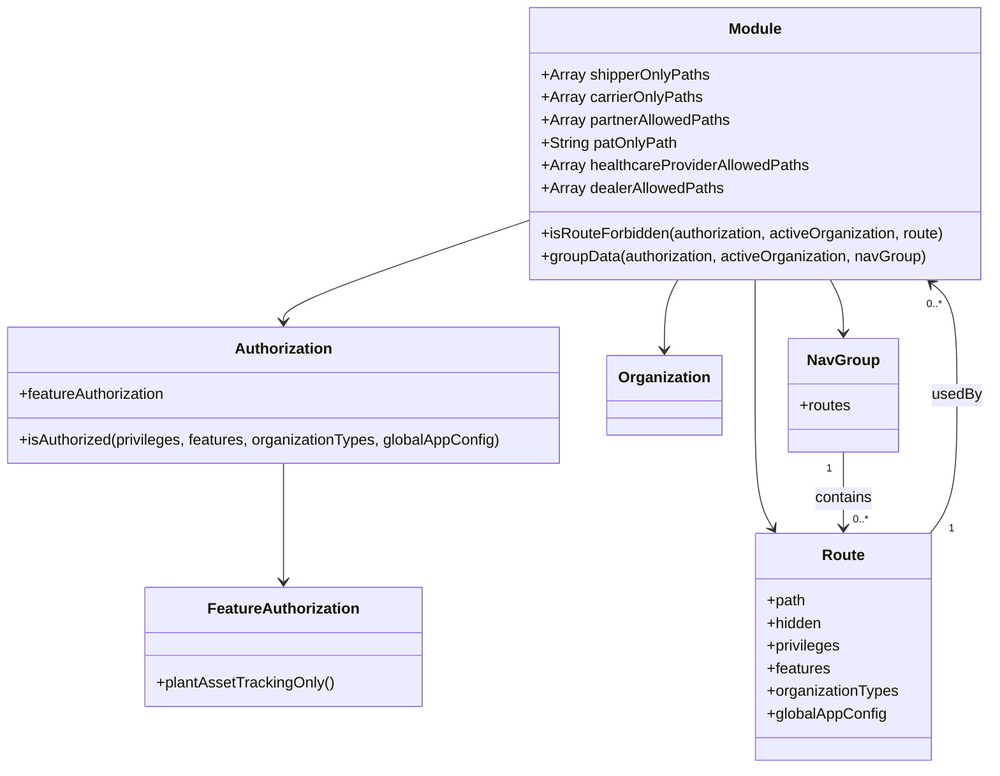

# Diagram: web/portal/src/modules/appnav/components/NavRouteAuthorization.js


> Auto-generated by Obscura crawlers

## Diagram 1

```mermaid
flowchart TD
  Start(["isRouteForbidden(authorization, activeOrganization, route)"])
  Start --> A{isShipper(activeOrganization)?}
  A -- false & route in shipperOnlyPaths --> Forbidden1(["return true"])
  A -- true or not in list --> B{isCarrier(activeOrganization)?}
  B -- false & route in carrierOnlyPaths --> Forbidden2(["return true"])
  B -- true or not in list --> C{isPartner(activeOrganization)?}
  C -- true & route NOT in partnerAllowedPaths --> Forbidden3(["return true"])
  C -- else --> D{isHealthcareProvider(activeOrganization)?}
  D -- true & route NOT in healthcareProviderAllowedPaths & !includes("reports") --> Forbidden4(["return true"])
  D -- else --> E{isDealer(activeOrganization)?}
  E -- true & route NOT in dealerAllowedPaths & !includes("documentation") --> Forbidden5(["return true"])
  E -- else --> F{authorization.featureAuthorization.plantAssetTrackingOnly()?}
  F -- true & !route.includes(patOnlyPath) --> Forbidden6(["return true"])
  F -- else --> Allowed(["return false"])
  Forbidden1 --> End1([END])
  Forbidden2 --> End1
  Forbidden3 --> End1
  Forbidden4 --> End1
  Forbidden5 --> End1
  Forbidden6 --> End1
  Allowed --> End1
```

> SVG rendering failed for this diagram.

## Diagram 2



### SVG

<svg id="container" width="1047.3359375" xmlns="http://www.w3.org/2000/svg" class="classDiagram" height="812" viewBox="0 0 1047.3359375 812" role="graphics-document document" aria-roledescription="class"><style>#container{font-family:"trebuchet ms",verdana,arial,sans-serif;font-size:16px;fill:#333;}@keyframes edge-animation-frame{from{stroke-dashoffset:0;}}@keyframes dash{to{stroke-dashoffset:0;}}#container .edge-animation-slow{stroke-dasharray:9,5!important;stroke-dashoffset:900;animation:dash 50s linear infinite;stroke-linecap:round;}#container .edge-animation-fast{stroke-dasharray:9,5!important;stroke-dashoffset:900;animation:dash 20s linear infinite;stroke-linecap:round;}#container .error-icon{fill:#552222;}#container .error-text{fill:#552222;stroke:#552222;}#container .edge-thickness-normal{stroke-width:1px;}#container .edge-thickness-thick{stroke-width:3.5px;}#container .edge-pattern-solid{stroke-dasharray:0;}#container .edge-thickness-invisible{stroke-width:0;fill:none;}#container .edge-pattern-dashed{stroke-dasharray:3;}#container .edge-pattern-dotted{stroke-dasharray:2;}#container .marker{fill:#333333;stroke:#333333;}#container .marker.cross{stroke:#333333;}#container svg{font-family:"trebuchet ms",verdana,arial,sans-serif;font-size:16px;}#container p{margin:0;}#container g.classGroup text{fill:#9370DB;stroke:none;font-family:"trebuchet ms",verdana,arial,sans-serif;font-size:10px;}#container g.classGroup text .title{font-weight:bolder;}#container .nodeLabel,#container .edgeLabel{color:#131300;}#container .edgeLabel .label rect{fill:#ECECFF;}#container .label text{fill:#131300;}#container .labelBkg{background:#ECECFF;}#container .edgeLabel .label span{background:#ECECFF;}#container .classTitle{font-weight:bolder;}#container .node rect,#container .node circle,#container .node ellipse,#container .node polygon,#container .node path{fill:#ECECFF;stroke:#9370DB;stroke-width:1px;}#container .divider{stroke:#9370DB;stroke-width:1;}#container g.clickable{cursor:pointer;}#container g.classGroup rect{fill:#ECECFF;stroke:#9370DB;}#container g.classGroup line{stroke:#9370DB;stroke-width:1;}#container .classLabel .box{stroke:none;stroke-width:0;fill:#ECECFF;opacity:0.5;}#container .classLabel .label{fill:#9370DB;font-size:10px;}#container .relation{stroke:#333333;stroke-width:1;fill:none;}#container .dashed-line{stroke-dasharray:3;}#container .dotted-line{stroke-dasharray:1 2;}#container #compositionStart,#container .composition{fill:#333333!important;stroke:#333333!important;stroke-width:1;}#container #compositionEnd,#container .composition{fill:#333333!important;stroke:#333333!important;stroke-width:1;}#container #dependencyStart,#container .dependency{fill:#333333!important;stroke:#333333!important;stroke-width:1;}#container #dependencyStart,#container .dependency{fill:#333333!important;stroke:#333333!important;stroke-width:1;}#container #extensionStart,#container .extension{fill:transparent!important;stroke:#333333!important;stroke-width:1;}#container #extensionEnd,#container .extension{fill:transparent!important;stroke:#333333!important;stroke-width:1;}#container #aggregationStart,#container .aggregation{fill:transparent!important;stroke:#333333!important;stroke-width:1;}#container #aggregationEnd,#container .aggregation{fill:transparent!important;stroke:#333333!important;stroke-width:1;}#container #lollipopStart,#container .lollipop{fill:#ECECFF!important;stroke:#333333!important;stroke-width:1;}#container #lollipopEnd,#container .lollipop{fill:#ECECFF!important;stroke:#333333!important;stroke-width:1;}#container .edgeTerminals{font-size:11px;line-height:initial;}#container .classTitleText{text-anchor:middle;font-size:18px;fill:#333;}#container .label-icon{display:inline-block;height:1em;overflow:visible;vertical-align:-0.125em;}#container .node .label-icon path{fill:currentColor;stroke:revert;stroke-width:revert;}#container :root{--mermaid-font-family:"trebuchet ms",verdana,arial,sans-serif;}</style><g><defs><marker id="container_class-aggregationStart" class="marker aggregation class" refX="18" refY="7" markerWidth="190" markerHeight="240" orient="auto"><path d="M 18,7 L9,13 L1,7 L9,1 Z"></path></marker></defs><defs><marker id="container_class-aggregationEnd" class="marker aggregation class" refX="1" refY="7" markerWidth="20" markerHeight="28" orient="auto"><path d="M 18,7 L9,13 L1,7 L9,1 Z"></path></marker></defs><defs><marker id="container_class-extensionStart" class="marker extension class" refX="18" refY="7" markerWidth="190" markerHeight="240" orient="auto"><path d="M 1,7 L18,13 V 1 Z"></path></marker></defs><defs><marker id="container_class-extensionEnd" class="marker extension class" refX="1" refY="7" markerWidth="20" markerHeight="28" orient="auto"><path d="M 1,1 V 13 L18,7 Z"></path></marker></defs><defs><marker id="container_class-compositionStart" class="marker composition class" refX="18" refY="7" markerWidth="190" markerHeight="240" orient="auto"><path d="M 18,7 L9,13 L1,7 L9,1 Z"></path></marker></defs><defs><marker id="container_class-compositionEnd" class="marker composition class" refX="1" refY="7" markerWidth="20" markerHeight="28" orient="auto"><path d="M 18,7 L9,13 L1,7 L9,1 Z"></path></marker></defs><defs><marker id="container_class-dependencyStart" class="marker dependency class" refX="6" refY="7" markerWidth="190" markerHeight="240" orient="auto"><path d="M 5,7 L9,13 L1,7 L9,1 Z"></path></marker></defs><defs><marker id="container_class-dependencyEnd" class="marker dependency class" refX="13" refY="7" markerWidth="20" markerHeight="28" orient="auto"><path d="M 18,7 L9,13 L14,7 L9,1 Z"></path></marker></defs><defs><marker id="container_class-lollipopStart" class="marker lollipop class" refX="13" refY="7" markerWidth="190" markerHeight="240" orient="auto"><circle stroke="black" fill="transparent" cx="7" cy="7" r="6"></circle></marker></defs><defs><marker id="container_class-lollipopEnd" class="marker lollipop class" refX="1" refY="7" markerWidth="190" markerHeight="240" orient="auto"><circle stroke="black" fill="transparent" cx="7" cy="7" r="6"></circle></marker></defs><g class="root"><g class="clusters"></g><g class="edgePaths"><path d="M553.805,234.803L511.686,249.169C469.566,263.535,385.328,292.268,343.209,309.801C301.09,327.333,301.09,333.667,301.09,336.833L301.09,340" id="id_Module_Authorization_1" class="edge-thickness-normal edge-pattern-solid relation" style=";;;" data-edge="true" data-et="edge" data-id="id_Module_Authorization_1" data-points="W3sieCI6NTUzLjgwNDY4NzUsInkiOjIzNC44MDMyNDQ5NTYzNjMzNn0seyJ4IjozMDEuMDg5ODQzNzUsInkiOjMyMX0seyJ4IjozMDEuMDg5ODQzNzUsInkiOjM0Nn1d" marker-end="url(#container_class-dependencyEnd)"></path><path d="M301.09,490L301.09,496.167C301.09,502.333,301.09,514.667,301.09,535.5C301.09,556.333,301.09,585.667,301.09,600.333L301.09,615" id="id_Authorization_FeatureAuthorization_2" class="edge-thickness-normal edge-pattern-solid relation" style=";;;" data-edge="true" data-et="edge" data-id="id_Authorization_FeatureAuthorization_2" data-points="W3sieCI6MzAxLjA4OTg0Mzc1LCJ5Ijo0OTB9LHsieCI6MzAxLjA4OTg0Mzc1LCJ5Ijo1Mjd9LHsieCI6MzAxLjA4OTg0Mzc1LCJ5Ijo2MjF9XQ==" marker-end="url(#container_class-dependencyEnd)"></path><path d="M716.735,296L714.425,300.167C712.115,304.333,707.495,312.667,705.185,325C702.875,337.333,702.875,353.667,702.875,361.833L702.875,370" id="id_Module_Organization_3" class="edge-thickness-normal edge-pattern-solid relation" style=";;;" data-edge="true" data-et="edge" data-id="id_Module_Organization_3" data-points="W3sieCI6NzE2LjczNTI1MzMyODQwMjMsInkiOjI5Nn0seyJ4Ijo3MDIuODc1LCJ5IjozMjF9LHsieCI6NzAyLjg3NSwieSI6Mzc2fV0=" marker-end="url(#container_class-dependencyEnd)"></path><path d="M796.57,296L796.57,300.167C796.57,304.333,796.57,312.667,796.57,333C796.57,353.333,796.57,385.667,796.57,420C796.57,454.333,796.57,490.667,799.677,514.137C802.783,537.608,808.996,548.215,812.102,553.519L815.208,558.823" id="id_Module_Route_4" class="edge-thickness-normal edge-pattern-solid relation" style=";;;" data-edge="true" data-et="edge" data-id="id_Module_Route_4" data-points="W3sieCI6Nzk2LjU3MDMxMjUsInkiOjI5Nn0seyJ4Ijo3OTYuNTcwMzEyNSwieSI6MzIxfSx7IngiOjc5Ni41NzAzMTI1LCJ5Ijo0MTh9LHsieCI6Nzk2LjU3MDMxMjUsInkiOjUyN30seyJ4Ijo4MTguMjQwNzk0MTg3ODk4MSwieSI6NTY0fV0=" marker-end="url(#container_class-dependencyEnd)"></path><path d="M874.921,296L877.188,300.167C879.455,304.333,883.989,312.667,886.256,322C888.523,331.333,888.523,341.667,888.523,346.833L888.523,352" id="id_Module_NavGroup_5" class="edge-thickness-normal edge-pattern-solid relation" style=";;;" data-edge="true" data-et="edge" data-id="id_Module_NavGroup_5" data-points="W3sieCI6ODc0LjkyMDkwNDIxNTk3NjMsInkiOjI5Nn0seyJ4Ijo4ODguNTIzNDM3NSwieSI6MzIxfSx7IngiOjg4OC41MjM0Mzc1LCJ5IjozNTh9XQ==" marker-end="url(#container_class-dependencyEnd)"></path><path d="M978.941,564L983.588,557.833C988.234,551.667,997.527,539.333,1002.174,515C1006.82,490.667,1006.82,454.333,1006.82,420C1006.82,385.667,1006.82,353.333,1002.416,333.627C998.012,313.92,989.203,306.839,984.799,303.299L980.395,299.759" id="id_Route_Module_6" class="edge-thickness-normal edge-pattern-solid relation" style=";;;" data-edge="true" data-et="edge" data-id="id_Route_Module_6" data-points="W3sieCI6OTc4Ljk0MTQzMTEzMDU3MzMsInkiOjU2NH0seyJ4IjoxMDA2LjgyMDMxMjUsInkiOjUyN30seyJ4IjoxMDA2LjgyMDMxMjUsInkiOjQxOH0seyJ4IjoxMDA2LjgyMDMxMjUsInkiOjMyMX0seyJ4Ijo5NzUuNzE4MjQxNDk0MDgyOCwieSI6Mjk2fV0=" marker-end="url(#container_class-dependencyEnd)"></path><path d="M888.523,478L888.523,486.167C888.523,494.333,888.523,510.667,888.523,524C888.523,537.333,888.523,547.667,888.523,552.833L888.523,558" id="id_NavGroup_Route_7" class="edge-thickness-normal edge-pattern-solid relation" style=";;;" data-edge="true" data-et="edge" data-id="id_NavGroup_Route_7" data-points="W3sieCI6ODg4LjUyMzQzNzUsInkiOjQ3OH0seyJ4Ijo4ODguNTIzNDM3NSwieSI6NTI3fSx7IngiOjg4OC41MjM0Mzc1LCJ5Ijo1NjR9XQ==" marker-end="url(#container_class-dependencyEnd)"></path></g><g class="edgeLabels"><g class="edgeLabel"><g class="label" data-id="id_Module_Authorization_1" transform="translate(0, 0)"><foreignObject width="0" height="0"><div xmlns="http://www.w3.org/1999/xhtml" class="labelBkg" style="display: table-cell; white-space: nowrap; line-height: 1.5; max-width: 200px; text-align: center;"><span class="edgeLabel"></span></div></foreignObject></g></g><g class="edgeLabel"><g class="label" data-id="id_Authorization_FeatureAuthorization_2" transform="translate(0, 0)"><foreignObject width="0" height="0"><div xmlns="http://www.w3.org/1999/xhtml" class="labelBkg" style="display: table-cell; white-space: nowrap; line-height: 1.5; max-width: 200px; text-align: center;"><span class="edgeLabel"></span></div></foreignObject></g></g><g class="edgeLabel"><g class="label" data-id="id_Module_Organization_3" transform="translate(0, 0)"><foreignObject width="0" height="0"><div xmlns="http://www.w3.org/1999/xhtml" class="labelBkg" style="display: table-cell; white-space: nowrap; line-height: 1.5; max-width: 200px; text-align: center;"><span class="edgeLabel"></span></div></foreignObject></g></g><g class="edgeLabel"><g class="label" data-id="id_Module_Route_4" transform="translate(0, 0)"><foreignObject width="0" height="0"><div xmlns="http://www.w3.org/1999/xhtml" class="labelBkg" style="display: table-cell; white-space: nowrap; line-height: 1.5; max-width: 200px; text-align: center;"><span class="edgeLabel"></span></div></foreignObject></g></g><g class="edgeLabel"><g class="label" data-id="id_Module_NavGroup_5" transform="translate(0, 0)"><foreignObject width="0" height="0"><div xmlns="http://www.w3.org/1999/xhtml" class="labelBkg" style="display: table-cell; white-space: nowrap; line-height: 1.5; max-width: 200px; text-align: center;"><span class="edgeLabel"></span></div></foreignObject></g></g><g class="edgeLabel" transform="translate(1006.8203125, 418)"><g class="label" data-id="id_Route_Module_6" transform="translate(-26.34375, -12)"><foreignObject width="52.6875" height="24"><div xmlns="http://www.w3.org/1999/xhtml" class="labelBkg" style="display: table-cell; white-space: nowrap; line-height: 1.5; max-width: 200px; text-align: center;"><span class="edgeLabel"><p>usedBy</p></span></div></foreignObject></g></g><g class="edgeLabel" transform="translate(888.5234375, 527)"><g class="label" data-id="id_NavGroup_Route_7" transform="translate(-30.890625, -12)"><foreignObject width="61.78125" height="24"><div xmlns="http://www.w3.org/1999/xhtml" class="labelBkg" style="display: table-cell; white-space: nowrap; line-height: 1.5; max-width: 200px; text-align: center;"><span class="edgeLabel"><p>contains</p></span></div></foreignObject></g></g><g class="edgeTerminals" transform="translate(1001.4525041313163, 559.0500916542578)"><g class="inner" transform="translate(0, 0)"><foreignObject style="width: 9px; height: 12px;"><div xmlns="http://www.w3.org/1999/xhtml" style="display: inline-block; padding-right: 1px; white-space: nowrap;"><span class="edgeLabel">1</span></div></foreignObject></g></g><g class="edgeTerminals" transform="translate(873.52343875, 495.5000010714286)"><g class="inner" transform="translate(0, 0)"><foreignObject style="width: 9px; height: 12px;"><div xmlns="http://www.w3.org/1999/xhtml" style="display: inline-block; padding-right: 1px; white-space: nowrap;"><span class="edgeLabel">1</span></div></foreignObject></g></g><g class="edgeTerminals" transform="translate(974.9605644118566, 313.6550801321286)"><g class="inner" transform="translate(0, 0)"></g><foreignObject style="width: 36px; height: 12px;"><div xmlns="http://www.w3.org/1999/xhtml" style="display: inline-block; padding-right: 1px; white-space: nowrap;"><span class="edgeLabel">0..*</span></div></foreignObject></g><g class="edgeTerminals" transform="translate(898.52343875, 541.5000010714286)"><g class="inner" transform="translate(0, 0)"></g><foreignObject style="width: 36px; height: 12px;"><div xmlns="http://www.w3.org/1999/xhtml" style="display: inline-block; padding-right: 1px; white-space: nowrap;"><span class="edgeLabel">0..*</span></div></foreignObject></g></g><g class="nodes"><g class="node default" id="classId-Module-0" transform="translate(796.5703125, 152)"><g class="basic label-container"><path d="M-242.765625 -144 L242.765625 -144 L242.765625 144 L-242.765625 144" stroke="none" stroke-width="0" fill="#ECECFF" style=""></path><path d="M-242.765625 -144 C-87.55551875588583 -144, 67.65458748822834 -144, 242.765625 -144 M-242.765625 -144 C-96.67615364968972 -144, 49.41331770062055 -144, 242.765625 -144 M242.765625 -144 C242.765625 -76.31820652271918, 242.765625 -8.63641304543836, 242.765625 144 M242.765625 -144 C242.765625 -71.73443024386887, 242.765625 0.5311395122622571, 242.765625 144 M242.765625 144 C136.96149800181365 144, 31.157371003627276 144, -242.765625 144 M242.765625 144 C121.40579168666184 144, 0.045958373323685464 144, -242.765625 144 M-242.765625 144 C-242.765625 47.662277739699576, -242.765625 -48.67544452060085, -242.765625 -144 M-242.765625 144 C-242.765625 68.2871733358592, -242.765625 -7.425653328281612, -242.765625 -144" stroke="#9370DB" stroke-width="1.3" fill="none" stroke-dasharray="0 0" style=""></path></g><g class="annotation-group text" transform="translate(0, -120)"></g><g class="label-group text" transform="translate(-27.09375, -120)"><g class="label" style="font-weight: bolder" transform="translate(0,-12)"><foreignObject width="54.1875" height="24"><div xmlns="http://www.w3.org/1999/xhtml" style="display: table-cell; white-space: nowrap; line-height: 1.5; max-width: 104px; text-align: center;"><span class="nodeLabel markdown-node-label" style=""><p>Module</p></span></div></foreignObject></g></g><g class="members-group text" transform="translate(-230.765625, -72)"><g class="label" style="" transform="translate(0,-12)"><foreignObject width="177.21875" height="24"><div xmlns="http://www.w3.org/1999/xhtml" style="display: table-cell; white-space: nowrap; line-height: 1.5; max-width: 235px; text-align: center;"><span class="nodeLabel markdown-node-label" style=""><p>+Array shipperOnlyPaths</p></span></div></foreignObject></g><g class="label" style="" transform="translate(0,12)"><foreignObject width="169.90625" height="24"><div xmlns="http://www.w3.org/1999/xhtml" style="display: table-cell; white-space: nowrap; line-height: 1.5; max-width: 227px; text-align: center;"><span class="nodeLabel markdown-node-label" style=""><p>+Array carrierOnlyPaths</p></span></div></foreignObject></g><g class="label" style="" transform="translate(0,36)"><foreignObject width="200.953125" height="24"><div xmlns="http://www.w3.org/1999/xhtml" style="display: table-cell; white-space: nowrap; line-height: 1.5; max-width: 258px; text-align: center;"><span class="nodeLabel markdown-node-label" style=""><p>+Array partnerAllowedPaths</p></span></div></foreignObject></g><g class="label" style="" transform="translate(0,60)"><foreignObject width="143.421875" height="24"><div xmlns="http://www.w3.org/1999/xhtml" style="display: table-cell; white-space: nowrap; line-height: 1.5; max-width: 201px; text-align: center;"><span class="nodeLabel markdown-node-label" style=""><p>+String patOnlyPath</p></span></div></foreignObject></g><g class="label" style="" transform="translate(0,84)"><foreignObject width="284.40625" height="24"><div xmlns="http://www.w3.org/1999/xhtml" style="display: table-cell; white-space: nowrap; line-height: 1.5; max-width: 342px; text-align: center;"><span class="nodeLabel markdown-node-label" style=""><p>+Array healthcareProviderAllowedPaths</p></span></div></foreignObject></g><g class="label" style="" transform="translate(0,108)"><foreignObject width="192.859375" height="24"><div xmlns="http://www.w3.org/1999/xhtml" style="display: table-cell; white-space: nowrap; line-height: 1.5; max-width: 250px; text-align: center;"><span class="nodeLabel markdown-node-label" style=""><p>+Array dealerAllowedPaths</p></span></div></foreignObject></g></g><g class="methods-group text" transform="translate(-230.765625, 96)"><g class="label" style="" transform="translate(0,-12)"><foreignObject width="434.4375" height="24"><div xmlns="http://www.w3.org/1999/xhtml" style="display: table-cell; white-space: nowrap; line-height: 1.5; max-width: 492px; text-align: center;"><span class="nodeLabel markdown-node-label" style=""><p>+isRouteForbidden(authorization, activeOrganization, route)</p></span></div></foreignObject></g><g class="label" style="" transform="translate(0,12)"><foreignObject width="412.484375" height="24"><div xmlns="http://www.w3.org/1999/xhtml" style="display: table-cell; white-space: nowrap; line-height: 1.5; max-width: 470px; text-align: center;"><span class="nodeLabel markdown-node-label" style=""><p>+groupData(authorization, activeOrganization, navGroup)</p></span></div></foreignObject></g></g><g class="divider" style=""><path d="M-242.765625 -96 C-142.16751417901077 -96, -41.5694033580215 -96, 242.765625 -96 M-242.765625 -96 C-117.8945590248425 -96, 6.976506950315013 -96, 242.765625 -96" stroke="#9370DB" stroke-width="1.3" fill="none" stroke-dasharray="0 0" style=""></path></g><g class="divider" style=""><path d="M-242.765625 72 C-86.63479294954351 72, 69.49603910091298 72, 242.765625 72 M-242.765625 72 C-98.36073711382531 72, 46.04415077234938 72, 242.765625 72" stroke="#9370DB" stroke-width="1.3" fill="none" stroke-dasharray="0 0" style=""></path></g></g><g class="node default" id="classId-Authorization-1" transform="translate(301.08984375, 418)"><g class="basic label-container"><path d="M-293.08984375 -72 L293.08984375 -72 L293.08984375 72 L-293.08984375 72" stroke="none" stroke-width="0" fill="#ECECFF" style=""></path><path d="M-293.08984375 -72 C-150.8063365963005 -72, -8.522829442600994 -72, 293.08984375 -72 M-293.08984375 -72 C-110.03763954731062 -72, 73.01456465537876 -72, 293.08984375 -72 M293.08984375 -72 C293.08984375 -17.91049539557008, 293.08984375 36.17900920885984, 293.08984375 72 M293.08984375 -72 C293.08984375 -15.107886088964229, 293.08984375 41.78422782207154, 293.08984375 72 M293.08984375 72 C146.65337803582153 72, 0.21691232164306484 72, -293.08984375 72 M293.08984375 72 C118.17349071707102 72, -56.74286231585796 72, -293.08984375 72 M-293.08984375 72 C-293.08984375 37.79576368634592, -293.08984375 3.591527372691843, -293.08984375 -72 M-293.08984375 72 C-293.08984375 25.950964343055254, -293.08984375 -20.09807131388949, -293.08984375 -72" stroke="#9370DB" stroke-width="1.3" fill="none" stroke-dasharray="0 0" style=""></path></g><g class="annotation-group text" transform="translate(0, -48)"></g><g class="label-group text" transform="translate(-49.7109375, -48)"><g class="label" style="font-weight: bolder" transform="translate(0,-12)"><foreignObject width="99.421875" height="24"><div xmlns="http://www.w3.org/1999/xhtml" style="display: table-cell; white-space: nowrap; line-height: 1.5; max-width: 148px; text-align: center;"><span class="nodeLabel markdown-node-label" style=""><p>Authorization</p></span></div></foreignObject></g></g><g class="members-group text" transform="translate(-281.08984375, 0)"><g class="label" style="" transform="translate(0,-12)"><foreignObject width="157.84375" height="24"><div xmlns="http://www.w3.org/1999/xhtml" style="display: table-cell; white-space: nowrap; line-height: 1.5; max-width: 215px; text-align: center;"><span class="nodeLabel markdown-node-label" style=""><p>+featureAuthorization</p></span></div></foreignObject></g></g><g class="methods-group text" transform="translate(-281.08984375, 48)"><g class="label" style="" transform="translate(0,-12)"><foreignObject width="512.46875" height="24"><div xmlns="http://www.w3.org/1999/xhtml" style="display: table-cell; white-space: nowrap; line-height: 1.5; max-width: 570px; text-align: center;"><span class="nodeLabel markdown-node-label" style=""><p>+isAuthorized(privileges, features, organizationTypes, globalAppConfig)</p></span></div></foreignObject></g></g><g class="divider" style=""><path d="M-293.08984375 -24 C-65.54935610237592 -24, 161.99113154524815 -24, 293.08984375 -24 M-293.08984375 -24 C-142.47903966361952 -24, 8.131764422760966 -24, 293.08984375 -24" stroke="#9370DB" stroke-width="1.3" fill="none" stroke-dasharray="0 0" style=""></path></g><g class="divider" style=""><path d="M-293.08984375 24 C-68.40352918947102 24, 156.28278537105797 24, 293.08984375 24 M-293.08984375 24 C-130.86265978176453 24, 31.36452418647093 24, 293.08984375 24" stroke="#9370DB" stroke-width="1.3" fill="none" stroke-dasharray="0 0" style=""></path></g></g><g class="node default" id="classId-FeatureAuthorization-2" transform="translate(301.08984375, 684)"><g class="basic label-container"><path d="M-144.4375 -63 L144.4375 -63 L144.4375 63 L-144.4375 63" stroke="none" stroke-width="0" fill="#ECECFF" style=""></path><path d="M-144.4375 -63 C-35.10527683178309 -63, 74.22694633643383 -63, 144.4375 -63 M-144.4375 -63 C-77.9718389136245 -63, -11.50617782724899 -63, 144.4375 -63 M144.4375 -63 C144.4375 -14.250252456094799, 144.4375 34.4994950878104, 144.4375 63 M144.4375 -63 C144.4375 -17.570025282734775, 144.4375 27.85994943453045, 144.4375 63 M144.4375 63 C43.022376329909804 63, -58.39274734018039 63, -144.4375 63 M144.4375 63 C46.44837807348651 63, -51.54074385302698 63, -144.4375 63 M-144.4375 63 C-144.4375 28.277513986965367, -144.4375 -6.444972026069266, -144.4375 -63 M-144.4375 63 C-144.4375 32.268376435721606, -144.4375 1.5367528714432197, -144.4375 -63" stroke="#9370DB" stroke-width="1.3" fill="none" stroke-dasharray="0 0" style=""></path></g><g class="annotation-group text" transform="translate(0, -39)"></g><g class="label-group text" transform="translate(-77.09375, -39)"><g class="label" style="font-weight: bolder" transform="translate(0,-12)"><foreignObject width="154.1875" height="24"><div xmlns="http://www.w3.org/1999/xhtml" style="display: table-cell; white-space: nowrap; line-height: 1.5; max-width: 202px; text-align: center;"><span class="nodeLabel markdown-node-label" style=""><p>FeatureAuthorization</p></span></div></foreignObject></g></g><g class="members-group text" transform="translate(-132.4375, 9)"></g><g class="methods-group text" transform="translate(-132.4375, 39)"><g class="label" style="" transform="translate(0,-12)"><foreignObject width="187.78125" height="24"><div xmlns="http://www.w3.org/1999/xhtml" style="display: table-cell; white-space: nowrap; line-height: 1.5; max-width: 245px; text-align: center;"><span class="nodeLabel markdown-node-label" style=""><p>+plantAssetTrackingOnly()</p></span></div></foreignObject></g></g><g class="divider" style=""><path d="M-144.4375 -15 C-32.71239462029777 -15, 79.01271075940446 -15, 144.4375 -15 M-144.4375 -15 C-63.08276553740578 -15, 18.271968925188446 -15, 144.4375 -15" stroke="#9370DB" stroke-width="1.3" fill="none" stroke-dasharray="0 0" style=""></path></g><g class="divider" style=""><path d="M-144.4375 9 C-38.00032852192278 9, 68.43684295615444 9, 144.4375 9 M-144.4375 9 C-69.25430554091844 9, 5.928888918163125 9, 144.4375 9" stroke="#9370DB" stroke-width="1.3" fill="none" stroke-dasharray="0 0" style=""></path></g></g><g class="node default" id="classId-Organization-3" transform="translate(702.875, 418)"><g class="basic label-container"><path d="M-58.6953125 -42 L58.6953125 -42 L58.6953125 42 L-58.6953125 42" stroke="none" stroke-width="0" fill="#ECECFF" style=""></path><path d="M-58.6953125 -42 C-18.104161723835375 -42, 22.48698905232925 -42, 58.6953125 -42 M-58.6953125 -42 C-18.881292660869747 -42, 20.932727178260507 -42, 58.6953125 -42 M58.6953125 -42 C58.6953125 -16.0802949322003, 58.6953125 9.839410135599401, 58.6953125 42 M58.6953125 -42 C58.6953125 -15.223220739644884, 58.6953125 11.553558520710233, 58.6953125 42 M58.6953125 42 C19.6612449961612 42, -19.372822507677597 42, -58.6953125 42 M58.6953125 42 C33.532239199700946 42, 8.369165899401892 42, -58.6953125 42 M-58.6953125 42 C-58.6953125 11.535150640971146, -58.6953125 -18.929698718057708, -58.6953125 -42 M-58.6953125 42 C-58.6953125 14.317345038086867, -58.6953125 -13.365309923826267, -58.6953125 -42" stroke="#9370DB" stroke-width="1.3" fill="none" stroke-dasharray="0 0" style=""></path></g><g class="annotation-group text" transform="translate(0, -18)"></g><g class="label-group text" transform="translate(-46.6953125, -18)"><g class="label" style="font-weight: bolder" transform="translate(0,-12)"><foreignObject width="93.390625" height="24"><div xmlns="http://www.w3.org/1999/xhtml" style="display: table-cell; white-space: nowrap; line-height: 1.5; max-width: 142px; text-align: center;"><span class="nodeLabel markdown-node-label" style=""><p>Organization</p></span></div></foreignObject></g></g><g class="members-group text" transform="translate(-46.6953125, 30)"></g><g class="methods-group text" transform="translate(-46.6953125, 60)"></g><g class="divider" style=""><path d="M-58.6953125 6 C-33.881851799824766 6, -9.068391099649531 6, 58.6953125 6 M-58.6953125 6 C-18.81912893897961 6, 21.05705462204078 6, 58.6953125 6" stroke="#9370DB" stroke-width="1.3" fill="none" stroke-dasharray="0 0" style=""></path></g><g class="divider" style=""><path d="M-58.6953125 24 C-28.52466776445384 24, 1.6459769710923169 24, 58.6953125 24 M-58.6953125 24 C-21.987911065251176 24, 14.719490369497649 24, 58.6953125 24" stroke="#9370DB" stroke-width="1.3" fill="none" stroke-dasharray="0 0" style=""></path></g></g><g class="node default" id="classId-Route-4" transform="translate(888.5234375, 684)"><g class="basic label-container"><path d="M-92.48828125 -120 L92.48828125 -120 L92.48828125 120 L-92.48828125 120" stroke="none" stroke-width="0" fill="#ECECFF" style=""></path><path d="M-92.48828125 -120 C-55.05526500058251 -120, -17.622248751165017 -120, 92.48828125 -120 M-92.48828125 -120 C-31.63427124787807 -120, 29.219738754243863 -120, 92.48828125 -120 M92.48828125 -120 C92.48828125 -24.04157598026245, 92.48828125 71.9168480394751, 92.48828125 120 M92.48828125 -120 C92.48828125 -70.92010729136895, 92.48828125 -21.8402145827379, 92.48828125 120 M92.48828125 120 C31.570813572154456 120, -29.346654105691087 120, -92.48828125 120 M92.48828125 120 C35.56112184417879 120, -21.366037561642415 120, -92.48828125 120 M-92.48828125 120 C-92.48828125 61.08000980583646, -92.48828125 2.1600196116729222, -92.48828125 -120 M-92.48828125 120 C-92.48828125 24.15400571810288, -92.48828125 -71.69198856379424, -92.48828125 -120" stroke="#9370DB" stroke-width="1.3" fill="none" stroke-dasharray="0 0" style=""></path></g><g class="annotation-group text" transform="translate(0, -96)"></g><g class="label-group text" transform="translate(-21.4296875, -96)"><g class="label" style="font-weight: bolder" transform="translate(0,-12)"><foreignObject width="42.859375" height="24"><div xmlns="http://www.w3.org/1999/xhtml" style="display: table-cell; white-space: nowrap; line-height: 1.5; max-width: 92px; text-align: center;"><span class="nodeLabel markdown-node-label" style=""><p>Route</p></span></div></foreignObject></g></g><g class="members-group text" transform="translate(-80.48828125, -48)"><g class="label" style="" transform="translate(0,-12)"><foreignObject width="41.1875" height="24"><div xmlns="http://www.w3.org/1999/xhtml" style="display: table-cell; white-space: nowrap; line-height: 1.5; max-width: 99px; text-align: center;"><span class="nodeLabel markdown-node-label" style=""><p>+path</p></span></div></foreignObject></g><g class="label" style="" transform="translate(0,12)"><foreignObject width="59.109375" height="24"><div xmlns="http://www.w3.org/1999/xhtml" style="display: table-cell; white-space: nowrap; line-height: 1.5; max-width: 116px; text-align: center;"><span class="nodeLabel markdown-node-label" style=""><p>+hidden</p></span></div></foreignObject></g><g class="label" style="" transform="translate(0,36)"><foreignObject width="78.15625" height="24"><div xmlns="http://www.w3.org/1999/xhtml" style="display: table-cell; white-space: nowrap; line-height: 1.5; max-width: 136px; text-align: center;"><span class="nodeLabel markdown-node-label" style=""><p>+privileges</p></span></div></foreignObject></g><g class="label" style="" transform="translate(0,60)"><foreignObject width="67.1875" height="24"><div xmlns="http://www.w3.org/1999/xhtml" style="display: table-cell; white-space: nowrap; line-height: 1.5; max-width: 125px; text-align: center;"><span class="nodeLabel markdown-node-label" style=""><p>+features</p></span></div></foreignObject></g><g class="label" style="" transform="translate(0,84)"><foreignObject width="139.546875" height="24"><div xmlns="http://www.w3.org/1999/xhtml" style="display: table-cell; white-space: nowrap; line-height: 1.5; max-width: 197px; text-align: center;"><span class="nodeLabel markdown-node-label" style=""><p>+organizationTypes</p></span></div></foreignObject></g><g class="label" style="" transform="translate(0,108)"><foreignObject width="125.890625" height="24"><div xmlns="http://www.w3.org/1999/xhtml" style="display: table-cell; white-space: nowrap; line-height: 1.5; max-width: 184px; text-align: center;"><span class="nodeLabel markdown-node-label" style=""><p>+globalAppConfig</p></span></div></foreignObject></g></g><g class="methods-group text" transform="translate(-80.48828125, 120)"></g><g class="divider" style=""><path d="M-92.48828125 -72 C-39.5057169350202 -72, 13.476847379959594 -72, 92.48828125 -72 M-92.48828125 -72 C-27.659356532590536 -72, 37.16956818481893 -72, 92.48828125 -72" stroke="#9370DB" stroke-width="1.3" fill="none" stroke-dasharray="0 0" style=""></path></g><g class="divider" style=""><path d="M-92.48828125 96 C-53.5013745041367 96, -14.514467758273398 96, 92.48828125 96 M-92.48828125 96 C-42.876957386173295 96, 6.73436647765341 96, 92.48828125 96" stroke="#9370DB" stroke-width="1.3" fill="none" stroke-dasharray="0 0" style=""></path></g></g><g class="node default" id="classId-NavGroup-5" transform="translate(888.5234375, 418)"><g class="basic label-container"><path d="M-56.953125 -60 L56.953125 -60 L56.953125 60 L-56.953125 60" stroke="none" stroke-width="0" fill="#ECECFF" style=""></path><path d="M-56.953125 -60 C-27.75773004344215 -60, 1.4376649131156967 -60, 56.953125 -60 M-56.953125 -60 C-14.201659337475895 -60, 28.54980632504821 -60, 56.953125 -60 M56.953125 -60 C56.953125 -15.592481834147947, 56.953125 28.815036331704107, 56.953125 60 M56.953125 -60 C56.953125 -25.814405602426326, 56.953125 8.371188795147347, 56.953125 60 M56.953125 60 C20.822184504066364 60, -15.308755991867272 60, -56.953125 60 M56.953125 60 C26.850429416290925 60, -3.2522661674181492 60, -56.953125 60 M-56.953125 60 C-56.953125 28.343148468517015, -56.953125 -3.3137030629659705, -56.953125 -60 M-56.953125 60 C-56.953125 22.072525669085415, -56.953125 -15.85494866182917, -56.953125 -60" stroke="#9370DB" stroke-width="1.3" fill="none" stroke-dasharray="0 0" style=""></path></g><g class="annotation-group text" transform="translate(0, -36)"></g><g class="label-group text" transform="translate(-35.828125, -36)"><g class="label" style="font-weight: bolder" transform="translate(0,-12)"><foreignObject width="71.65625" height="24"><div xmlns="http://www.w3.org/1999/xhtml" style="display: table-cell; white-space: nowrap; line-height: 1.5; max-width: 121px; text-align: center;"><span class="nodeLabel markdown-node-label" style=""><p>NavGroup</p></span></div></foreignObject></g></g><g class="members-group text" transform="translate(-44.953125, 12)"><g class="label" style="" transform="translate(0,-12)"><foreignObject width="54.078125" height="24"><div xmlns="http://www.w3.org/1999/xhtml" style="display: table-cell; white-space: nowrap; line-height: 1.5; max-width: 111px; text-align: center;"><span class="nodeLabel markdown-node-label" style=""><p>+routes</p></span></div></foreignObject></g></g><g class="methods-group text" transform="translate(-44.953125, 60)"></g><g class="divider" style=""><path d="M-56.953125 -12 C-20.302217357443304 -12, 16.348690285113392 -12, 56.953125 -12 M-56.953125 -12 C-22.679639517786548 -12, 11.593845964426905 -12, 56.953125 -12" stroke="#9370DB" stroke-width="1.3" fill="none" stroke-dasharray="0 0" style=""></path></g><g class="divider" style=""><path d="M-56.953125 36 C-33.27799756068377 36, -9.602870121367538 36, 56.953125 36 M-56.953125 36 C-33.469627352157865 36, -9.98612970431573 36, 56.953125 36" stroke="#9370DB" stroke-width="1.3" fill="none" stroke-dasharray="0 0" style=""></path></g></g></g></g></g></svg>
