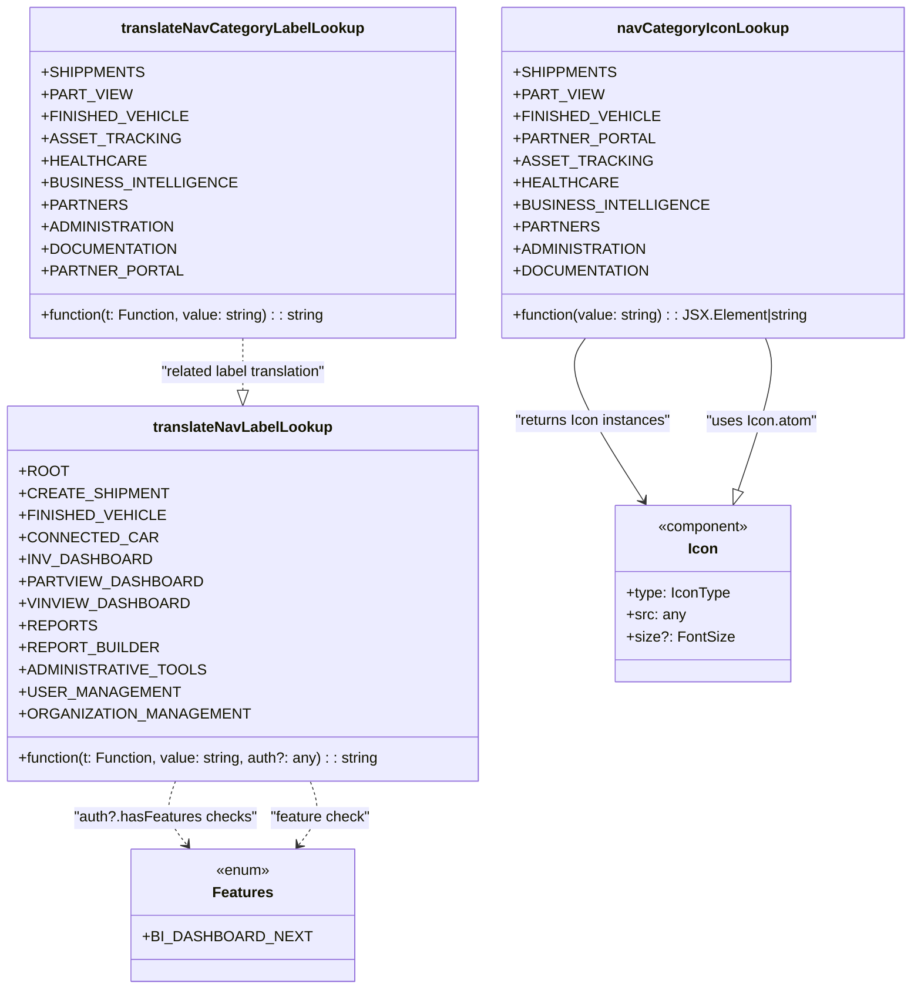

# Diagram: web/portal/src/modules/appnav/nav-utils.tsx

> Auto-generated by Obscura crawlers

## Mermaid

### SVG

<svg id="container" width="987.87109375" xmlns="http://www.w3.org/2000/svg" class="classDiagram" height="1076" viewBox="0 0 987.87109375 1076" role="graphics-document document" aria-roledescription="class"><g><defs><marker id="container_class-aggregationStart" class="marker aggregation class" refX="18" refY="7" markerWidth="190" markerHeight="240" orient="auto"><path d="M 18,7 L9,13 L1,7 L9,1 Z"></path></marker></defs><defs><marker id="container_class-aggregationEnd" class="marker aggregation class" refX="1" refY="7" markerWidth="20" markerHeight="28" orient="auto"><path d="M 18,7 L9,13 L1,7 L9,1 Z"></path></marker></defs><defs><marker id="container_class-extensionStart" class="marker extension class" refX="18" refY="7" markerWidth="190" markerHeight="240" orient="auto"><path d="M 1,7 L18,13 V 1 Z"></path></marker></defs><defs><marker id="container_class-extensionEnd" class="marker extension class" refX="1" refY="7" markerWidth="20" markerHeight="28" orient="auto"><path d="M 1,1 V 13 L18,7 Z"></path></marker></defs><defs><marker id="container_class-compositionStart" class="marker composition class" refX="18" refY="7" markerWidth="190" markerHeight="240" orient="auto"><path d="M 18,7 L9,13 L1,7 L9,1 Z"></path></marker></defs><defs><marker id="container_class-compositionEnd" class="marker composition class" refX="1" refY="7" markerWidth="20" markerHeight="28" orient="auto"><path d="M 18,7 L9,13 L1,7 L9,1 Z"></path></marker></defs><defs><marker id="container_class-dependencyStart" class="marker dependency class" refX="6" refY="7" markerWidth="190" markerHeight="240" orient="auto"><path d="M 5,7 L9,13 L1,7 L9,1 Z"></path></marker></defs><defs><marker id="container_class-dependencyEnd" class="marker dependency class" refX="13" refY="7" markerWidth="20" markerHeight="28" orient="auto"><path d="M 18,7 L9,13 L14,7 L9,1 Z"></path></marker></defs><defs><marker id="container_class-lollipopStart" class="marker lollipop class" refX="13" refY="7" markerWidth="190" markerHeight="240" orient="auto"><circle stroke="black" fill="transparent" cx="7" cy="7" r="6"></circle></marker></defs><defs><marker id="container_class-lollipopEnd" class="marker lollipop class" refX="1" refY="7" markerWidth="190" markerHeight="240" orient="auto"><circle stroke="black" fill="transparent" cx="7" cy="7" r="6"></circle></marker></defs><g class="root"><g class="clusters"></g><g class="edgePaths"><path d="M639.78,368L635.546,374.167C631.311,380.333,622.842,392.667,633.024,422.149C643.206,451.632,672.038,498.264,686.455,521.581L700.871,544.897" id="id_navCategoryIconLookup_Icon_1" class="edge-thickness-normal edge-pattern-solid relation" style=";;;" data-edge="true" data-et="edge" data-id="id_navCategoryIconLookup_Icon_1" data-points="W3sieCI6NjM5Ljc4MDI0MTkzNTQ4MzksInkiOjM2OH0seyJ4Ijo2MTQuMzczMDQ2ODc1LCJ5Ijo0MDV9LHsieCI6NzA0LjAyNjIyNTM2MzA3MDYsInkiOjU1MH1d" marker-end="url(#container_class-dependencyEnd)"></path><path d="M264.824,368L264.824,374.167C264.824,380.333,264.824,392.667,264.824,402.125C264.824,411.583,264.824,418.167,264.824,421.458L264.824,424.75" id="id_translateNavCategoryLabelLookup_translateNavLabelLookup_2" class="edge-thickness-normal edge-pattern-dashed relation" style=";;;" data-edge="true" data-et="edge" data-id="id_translateNavCategoryLabelLookup_translateNavLabelLookup_2" data-points="W3sieCI6MjY0LjgyNDIxODc1LCJ5IjozNjh9LHsieCI6MjY0LjgyNDIxODc1LCJ5Ijo0MDV9LHsieCI6MjY0LjgyNDIxODc1LCJ5Ijo0NDJ9XQ==" marker-end="url(#container_class-extensionEnd)"></path><path d="M191.756,850L189.548,856.167C187.339,862.333,182.921,874.667,184.975,886.216C187.029,897.765,195.555,908.531,199.818,913.914L204.08,919.296" id="id_translateNavLabelLookup_Features_3" class="edge-thickness-normal edge-pattern-dashed relation" style=";;;" data-edge="true" data-et="edge" data-id="id_translateNavLabelLookup_Features_3" data-points="W3sieCI6MTkxLjc1NjQwMjM1OTk1ODQ5LCJ5Ijo4NTB9LHsieCI6MTc4LjUwMzkwNjI1LCJ5Ijo4ODd9LHsieCI6MjA3LjgwNTI5NjczMTY1MTM3LCJ5Ijo5MjR9XQ==" marker-end="url(#container_class-dependencyEnd)"></path><path d="M802.369,533.704L809.816,512.253C817.263,490.803,832.157,447.901,837.226,420.284C842.295,392.667,837.54,380.333,835.162,374.167L832.785,368" id="id_Icon_navCategoryIconLookup_4" class="edge-thickness-normal edge-pattern-solid relation" style=";;;" data-edge="true" data-et="edge" data-id="id_Icon_navCategoryIconLookup_4" data-points="W3sieCI6Nzk2LjcxMTEzMjAwMjA3NDcsInkiOjU1MH0seyJ4Ijo4NDcuMDUwNzgxMjUsInkiOjQwNX0seyJ4Ijo4MzIuNzg0ODE0MjI4MTEwNiwieSI6MzY4fV0=" marker-start="url(#container_class-extensionStart)"></path><path d="M325.568,919.296L329.831,913.914C334.094,908.531,342.619,897.765,344.673,886.216C346.727,874.667,342.31,862.333,340.101,856.167L337.892,850" id="id_Features_translateNavLabelLookup_5" class="edge-thickness-normal edge-pattern-dashed relation" style=";;;" data-edge="true" data-et="edge" data-id="id_Features_translateNavLabelLookup_5" data-points="W3sieCI6MzIxLjg0MzE0MDc2ODM0ODYzLCJ5Ijo5MjR9LHsieCI6MzUxLjE0NDUzMTI1LCJ5Ijo4ODd9LHsieCI6MzM3Ljg5MjAzNTE0MDA0MTUsInkiOjg1MH1d" marker-start="url(#container_class-dependencyStart)"></path></g><g class="edgeLabels"><g class="edgeLabel" transform="translate(647.39768, 458.41217)"><g class="label" data-id="id_navCategoryIconLookup_Icon_1" transform="translate(-86.46875, -12)"><foreignObject width="172.9375" height="24">

"returns Icon instances"

</foreignObject></g></g><g class="edgeLabel" transform="translate(264.82421875, 405)"><g class="label" data-id="id_translateNavCategoryLabelLookup_translateNavLabelLookup_2" transform="translate(-94.0703125, -12)"><foreignObject width="188.140625" height="24">

"related label translation"

</foreignObject></g></g><g class="edgeLabel" transform="translate(180.95475, 890.09478)"><g class="label" data-id="id_translateNavLabelLookup_Features_3" transform="translate(-97.359375, -12)"><foreignObject width="194.71875" height="24">

"auth?.hasFeatures checks"

</foreignObject></g></g><g class="edgeLabel" transform="translate(828.38373, 458.76919)"><g class="label" data-id="id_Icon_navCategoryIconLookup_4" transform="translate(-60.8671875, -12)"><foreignObject width="121.734375" height="24">

"uses Icon.atom"

</foreignObject></g></g><g class="edgeLabel" transform="translate(348.69368, 890.09478)"><g class="label" data-id="id_Features_translateNavLabelLookup_5" transform="translate(-55.28125, -12)"><foreignObject width="110.5625" height="24">

"feature check"

</foreignObject></g></g></g><g class="nodes"><g class="node default" id="classId-navCategoryIconLookup-0" transform="translate(763.3828125, 188)"><g class="basic label-container"><path d="M-216.48828125 -180 L216.48828125 -180 L216.48828125 180 L-216.48828125 180" stroke="none" stroke-width="0" fill="#ECECFF" style=""></path><path d="M-216.48828125 -180 C-101.7616680374768 -180, 12.96494517504641 -180, 216.48828125 -180 M-216.48828125 -180 C-114.13561329068335 -180, -11.782945331366705 -180, 216.48828125 -180 M216.48828125 -180 C216.48828125 -49.11551573856974, 216.48828125 81.76896852286052, 216.48828125 180 M216.48828125 -180 C216.48828125 -72.69835763065949, 216.48828125 34.603284738681026, 216.48828125 180 M216.48828125 180 C81.82870346556152 180, -52.830874318876965 180, -216.48828125 180 M216.48828125 180 C55.535324600198976 180, -105.41763204960205 180, -216.48828125 180 M-216.48828125 180 C-216.48828125 107.83672607765476, -216.48828125 35.67345215530952, -216.48828125 -180 M-216.48828125 180 C-216.48828125 73.41825163594466, -216.48828125 -33.16349672811069, -216.48828125 -180" stroke="#9370DB" stroke-width="1.3" fill="none" stroke-dasharray="0 0" style=""></path></g><g class="annotation-group text" transform="translate(0, -156)"></g><g class="label-group text" transform="translate(-87.7578125, -156)"><g class="label" style="font-weight: bolder" transform="translate(0,-12)"><foreignObject width="175.515625" height="24">

navCategoryIconLookup

</foreignObject></g></g><g class="members-group text" transform="translate(-204.48828125, -108)"><g class="label" style="" transform="translate(0,-12)"><foreignObject width="98.390625" height="24">

+SHIPPMENTS

</foreignObject></g><g class="label" style="" transform="translate(0,12)"><foreignObject width="85.234375" height="24">

+PART_VIEW

</foreignObject></g><g class="label" style="" transform="translate(0,36)"><foreignObject width="140.109375" height="24">

+FINISHED_VEHICLE

</foreignObject></g><g class="label" style="" transform="translate(0,60)"><foreignObject width="134.953125" height="24">

+PARTNER_PORTAL

</foreignObject></g><g class="label" style="" transform="translate(0,84)"><foreignObject width="128.890625" height="24">

+ASSET_TRACKING

</foreignObject></g><g class="label" style="" transform="translate(0,108)"><foreignObject width="98.765625" height="24">

+HEALTHCARE

</foreignObject></g><g class="label" style="" transform="translate(0,132)"><foreignObject width="186.296875" height="24">

+BUSINESS_INTELLIGENCE

</foreignObject></g><g class="label" style="" transform="translate(0,156)"><foreignObject width="80.90625" height="24">

+PARTNERS

</foreignObject></g><g class="label" style="" transform="translate(0,180)"><foreignObject width="129.6875" height="24">

+ADMINISTRATION

</foreignObject></g><g class="label" style="" transform="translate(0,204)"><foreignObject width="131.53125" height="24">

+DOCUMENTATION

</foreignObject></g></g><g class="methods-group text" transform="translate(-204.48828125, 156)"><g class="label" style="" transform="translate(0,-12)"><foreignObject width="321.21875" height="24">

+function(value: string) : : JSX.Element|string

</foreignObject></g></g><g class="divider" style=""><path d="M-216.48828125 -132 C-91.32242362452776 -132, 33.843434000944484 -132, 216.48828125 -132 M-216.48828125 -132 C-73.87706959094322 -132, 68.73414206811356 -132, 216.48828125 -132" stroke="#9370DB" stroke-width="1.3" fill="none" stroke-dasharray="0 0" style=""></path></g><g class="divider" style=""><path d="M-216.48828125 132 C-106.29567829657152 132, 3.896924656856953 132, 216.48828125 132 M-216.48828125 132 C-95.4209480321578 132, 25.64638518568441 132, 216.48828125 132" stroke="#9370DB" stroke-width="1.3" fill="none" stroke-dasharray="0 0" style=""></path></g></g><g class="node default" id="classId-translateNavCategoryLabelLookup-1" transform="translate(264.82421875, 188)"><g class="basic label-container"><path d="M-232.0703125 -180 L232.0703125 -180 L232.0703125 180 L-232.0703125 180" stroke="none" stroke-width="0" fill="#ECECFF" style=""></path><path d="M-232.0703125 -180 C-55.41525766333183 -180, 121.23979717333634 -180, 232.0703125 -180 M-232.0703125 -180 C-109.80990255175136 -180, 12.450507396497272 -180, 232.0703125 -180 M232.0703125 -180 C232.0703125 -68.49991630493702, 232.0703125 43.00016739012597, 232.0703125 180 M232.0703125 -180 C232.0703125 -81.11054155606087, 232.0703125 17.778916887878268, 232.0703125 180 M232.0703125 180 C94.38745623499031 180, -43.29540003001938 180, -232.0703125 180 M232.0703125 180 C115.76743014868563 180, -0.5354522026287327 180, -232.0703125 180 M-232.0703125 180 C-232.0703125 51.614899950683935, -232.0703125 -76.77020009863213, -232.0703125 -180 M-232.0703125 180 C-232.0703125 70.74123944277201, -232.0703125 -38.517521114455974, -232.0703125 -180" stroke="#9370DB" stroke-width="1.3" fill="none" stroke-dasharray="0 0" style=""></path></g><g class="annotation-group text" transform="translate(0, -156)"></g><g class="label-group text" transform="translate(-126.078125, -156)"><g class="label" style="font-weight: bolder" transform="translate(0,-12)"><foreignObject width="252.15625" height="24">

translateNavCategoryLabelLookup

</foreignObject></g></g><g class="members-group text" transform="translate(-220.0703125, -108)"><g class="label" style="" transform="translate(0,-12)"><foreignObject width="98.390625" height="24">

+SHIPPMENTS

</foreignObject></g><g class="label" style="" transform="translate(0,12)"><foreignObject width="85.234375" height="24">

+PART_VIEW

</foreignObject></g><g class="label" style="" transform="translate(0,36)"><foreignObject width="140.109375" height="24">

+FINISHED_VEHICLE

</foreignObject></g><g class="label" style="" transform="translate(0,60)"><foreignObject width="128.890625" height="24">

+ASSET_TRACKING

</foreignObject></g><g class="label" style="" transform="translate(0,84)"><foreignObject width="98.765625" height="24">

+HEALTHCARE

</foreignObject></g><g class="label" style="" transform="translate(0,108)"><foreignObject width="186.296875" height="24">

+BUSINESS_INTELLIGENCE

</foreignObject></g><g class="label" style="" transform="translate(0,132)"><foreignObject width="80.90625" height="24">

+PARTNERS

</foreignObject></g><g class="label" style="" transform="translate(0,156)"><foreignObject width="129.6875" height="24">

+ADMINISTRATION

</foreignObject></g><g class="label" style="" transform="translate(0,180)"><foreignObject width="131.53125" height="24">

+DOCUMENTATION

</foreignObject></g><g class="label" style="" transform="translate(0,204)"><foreignObject width="134.953125" height="24">

+PARTNER_PORTAL

</foreignObject></g></g><g class="methods-group text" transform="translate(-220.0703125, 156)"><g class="label" style="" transform="translate(0,-12)"><foreignObject width="314.0625" height="24">

+function(t: Function, value: string) : : string

</foreignObject></g></g><g class="divider" style=""><path d="M-232.0703125 -132 C-50.634750170356824 -132, 130.80081215928635 -132, 232.0703125 -132 M-232.0703125 -132 C-118.66232721893266 -132, -5.25434193786532 -132, 232.0703125 -132" stroke="#9370DB" stroke-width="1.3" fill="none" stroke-dasharray="0 0" style=""></path></g><g class="divider" style=""><path d="M-232.0703125 132 C-115.03292904665211 132, 2.0044544066957712 132, 232.0703125 132 M-232.0703125 132 C-48.044987639258466 132, 135.98033722148307 132, 232.0703125 132" stroke="#9370DB" stroke-width="1.3" fill="none" stroke-dasharray="0 0" style=""></path></g></g><g class="node default" id="classId-translateNavLabelLookup-2" transform="translate(264.82421875, 646)"><g class="basic label-container"><path d="M-256.82421875 -204 L256.82421875 -204 L256.82421875 204 L-256.82421875 204" stroke="none" stroke-width="0" fill="#ECECFF" style=""></path><path d="M-256.82421875 -204 C-134.59853596942207 -204, -12.372853188844118 -204, 256.82421875 -204 M-256.82421875 -204 C-85.16003701719671 -204, 86.50414471560657 -204, 256.82421875 -204 M256.82421875 -204 C256.82421875 -74.46874054416901, 256.82421875 55.06251891166198, 256.82421875 204 M256.82421875 -204 C256.82421875 -103.73954779736424, 256.82421875 -3.479095594728477, 256.82421875 204 M256.82421875 204 C96.27856227607299 204, -64.26709419785402 204, -256.82421875 204 M256.82421875 204 C147.03735320630568 204, 37.25048766261136 204, -256.82421875 204 M-256.82421875 204 C-256.82421875 97.12058777700238, -256.82421875 -9.75882444599523, -256.82421875 -204 M-256.82421875 204 C-256.82421875 61.70397614097263, -256.82421875 -80.59204771805474, -256.82421875 -204" stroke="#9370DB" stroke-width="1.3" fill="none" stroke-dasharray="0 0" style=""></path></g><g class="annotation-group text" transform="translate(0, -180)"></g><g class="label-group text" transform="translate(-93.5546875, -180)"><g class="label" style="font-weight: bolder" transform="translate(0,-12)"><foreignObject width="187.109375" height="24">

translateNavLabelLookup

</foreignObject></g></g><g class="members-group text" transform="translate(-244.82421875, -132)"><g class="label" style="" transform="translate(0,-12)"><foreignObject width="47.390625" height="24">

+ROOT

</foreignObject></g><g class="label" style="" transform="translate(0,12)"><foreignObject width="141.734375" height="24">

+CREATE_SHIPMENT

</foreignObject></g><g class="label" style="" transform="translate(0,36)"><foreignObject width="140.109375" height="24">

+FINISHED_VEHICLE

</foreignObject></g><g class="label" style="" transform="translate(0,60)"><foreignObject width="128.71875" height="24">

+CONNECTED_CAR

</foreignObject></g><g class="label" style="" transform="translate(0,84)"><foreignObject width="128.765625" height="24">

+INV_DASHBOARD

</foreignObject></g><g class="label" style="" transform="translate(0,108)"><foreignObject width="174.578125" height="24">

+PARTVIEW_DASHBOARD

</foreignObject></g><g class="label" style="" transform="translate(0,132)"><foreignObject width="163.59375" height="24">

+VINVIEW_DASHBOARD

</foreignObject></g><g class="label" style="" transform="translate(0,156)"><foreignObject width="72.625" height="24">

+REPORTS

</foreignObject></g><g class="label" style="" transform="translate(0,180)"><foreignObject width="133.296875" height="24">

+REPORT_BUILDER

</foreignObject></g><g class="label" style="" transform="translate(0,204)"><foreignObject width="178.96875" height="24">

+ADMINISTRATIVE_TOOLS

</foreignObject></g><g class="label" style="" transform="translate(0,228)"><foreignObject width="154.171875" height="24">

+USER_MANAGEMENT

</foreignObject></g><g class="label" style="" transform="translate(0,252)"><foreignObject width="223.953125" height="24">

+ORGANIZATION_MANAGEMENT

</foreignObject></g></g><g class="methods-group text" transform="translate(-244.82421875, 180)"><g class="label" style="" transform="translate(0,-12)"><foreignObject width="396.09375" height="24">

+function(t: Function, value: string, auth?: any) : : string

</foreignObject></g></g><g class="divider" style=""><path d="M-256.82421875 -156 C-53.07072842688248 -156, 150.68276189623504 -156, 256.82421875 -156 M-256.82421875 -156 C-149.87461017826598 -156, -42.925001606531964 -156, 256.82421875 -156" stroke="#9370DB" stroke-width="1.3" fill="none" stroke-dasharray="0 0" style=""></path></g><g class="divider" style=""><path d="M-256.82421875 156 C-99.18721609278691 156, 58.44978656442618 156, 256.82421875 156 M-256.82421875 156 C-70.78271416904417 156, 115.25879041191166 156, 256.82421875 156" stroke="#9370DB" stroke-width="1.3" fill="none" stroke-dasharray="0 0" style=""></path></g></g><g class="node default" id="classId-Icon-3" transform="translate(763.3828125, 646)"><g class="basic label-container"><path d="M-93.24609375 -96 L93.24609375 -96 L93.24609375 96 L-93.24609375 96" stroke="none" stroke-width="0" fill="#ECECFF" style=""></path><path d="M-93.24609375 -96 C-53.196952814844394 -96, -13.147811879688788 -96, 93.24609375 -96 M-93.24609375 -96 C-46.58005918151891 -96, 0.08597538696217555 -96, 93.24609375 -96 M93.24609375 -96 C93.24609375 -19.842699125333695, 93.24609375 56.31460174933261, 93.24609375 96 M93.24609375 -96 C93.24609375 -24.410206119234005, 93.24609375 47.17958776153199, 93.24609375 96 M93.24609375 96 C46.446465888440166 96, -0.35316197311966846 96, -93.24609375 96 M93.24609375 96 C30.92388661168522 96, -31.39832052662956 96, -93.24609375 96 M-93.24609375 96 C-93.24609375 20.12098299117325, -93.24609375 -55.7580340176535, -93.24609375 -96 M-93.24609375 96 C-93.24609375 46.14831170121406, -93.24609375 -3.703376597571875, -93.24609375 -96" stroke="#9370DB" stroke-width="1.3" fill="none" stroke-dasharray="0 0" style=""></path></g><g class="annotation-group text" transform="translate(-50.2109375, -72)"><g class="label" style="" transform="translate(0,-12)"><foreignObject width="100.421875" height="24">

«component»

</foreignObject></g></g><g class="label-group text" transform="translate(-15.3046875, -48)"><g class="label" style="font-weight: bolder" transform="translate(0,-12)"><foreignObject width="30.609375" height="24">

Icon

</foreignObject></g></g><g class="members-group text" transform="translate(-81.24609375, 0)"><g class="label" style="" transform="translate(0,-12)"><foreignObject width="112.28125" height="24">

+type: IconType

</foreignObject></g><g class="label" style="" transform="translate(0,12)"><foreignObject width="62.796875" height="24">

+src: any

</foreignObject></g><g class="label" style="" transform="translate(0,36)"><foreignObject width="110.984375" height="24">

+size?: FontSize

</foreignObject></g></g><g class="methods-group text" transform="translate(-81.24609375, 96)"></g><g class="divider" style=""><path d="M-93.24609375 -24 C-20.45096585510923 -24, 52.34416203978154 -24, 93.24609375 -24 M-93.24609375 -24 C-21.044679176922457 -24, 51.156735396155085 -24, 93.24609375 -24" stroke="#9370DB" stroke-width="1.3" fill="none" stroke-dasharray="0 0" style=""></path></g><g class="divider" style=""><path d="M-93.24609375 72 C-39.995647499350234 72, 13.254798751299532 72, 93.24609375 72 M-93.24609375 72 C-44.124923701558565 72, 4.99624634688287 72, 93.24609375 72" stroke="#9370DB" stroke-width="1.3" fill="none" stroke-dasharray="0 0" style=""></path></g></g><g class="node default" id="classId-Features-4" transform="translate(264.82421875, 996)"><g class="basic label-container"><path d="M-109.3984375 -72 L109.3984375 -72 L109.3984375 72 L-109.3984375 72" stroke="none" stroke-width="0" fill="#ECECFF" style=""></path><path d="M-109.3984375 -72 C-62.58173430258278 -72, -15.765031105165562 -72, 109.3984375 -72 M-109.3984375 -72 C-49.00570246594747 -72, 11.387032568105056 -72, 109.3984375 -72 M109.3984375 -72 C109.3984375 -33.041393929639646, 109.3984375 5.917212140720707, 109.3984375 72 M109.3984375 -72 C109.3984375 -21.901388807668134, 109.3984375 28.197222384663732, 109.3984375 72 M109.3984375 72 C65.30407081859772 72, 21.20970413719546 72, -109.3984375 72 M109.3984375 72 C54.3092002361083 72, -0.7800370277833935 72, -109.3984375 72 M-109.3984375 72 C-109.3984375 21.029653197584196, -109.3984375 -29.94069360483161, -109.3984375 -72 M-109.3984375 72 C-109.3984375 33.20962852079845, -109.3984375 -5.580742958403107, -109.3984375 -72" stroke="#9370DB" stroke-width="1.3" fill="none" stroke-dasharray="0 0" style=""></path></g><g class="annotation-group text" transform="translate(-29.53125, -48)"><g class="label" style="" transform="translate(0,-12)"><foreignObject width="59.0625" height="24">

«enum»

</foreignObject></g></g><g class="label-group text" transform="translate(-31.25, -24)"><g class="label" style="font-weight: bolder" transform="translate(0,-12)"><foreignObject width="62.5" height="24">

Features

</foreignObject></g></g><g class="members-group text" transform="translate(-97.3984375, 24)"><g class="label" style="" transform="translate(0,-12)"><foreignObject width="163.546875" height="24">

+BI_DASHBOARD_NEXT

</foreignObject></g></g><g class="methods-group text" transform="translate(-97.3984375, 72)"></g><g class="divider" style=""><path d="M-109.3984375 0 C-27.81116342399085 0, 53.7761106520183 0, 109.3984375 0 M-109.3984375 0 C-28.652233034504803 0, 52.09397143099039 0, 109.3984375 0" stroke="#9370DB" stroke-width="1.3" fill="none" stroke-dasharray="0 0" style=""></path></g><g class="divider" style=""><path d="M-109.3984375 48 C-45.58778640407796 48, 18.22286469184408 48, 109.3984375 48 M-109.3984375 48 C-64.21284526668745 48, -19.02725303337489 48, 109.3984375 48" stroke="#9370DB" stroke-width="1.3" fill="none" stroke-dasharray="0 0" style=""></path></g></g></g></g></g></svg>
