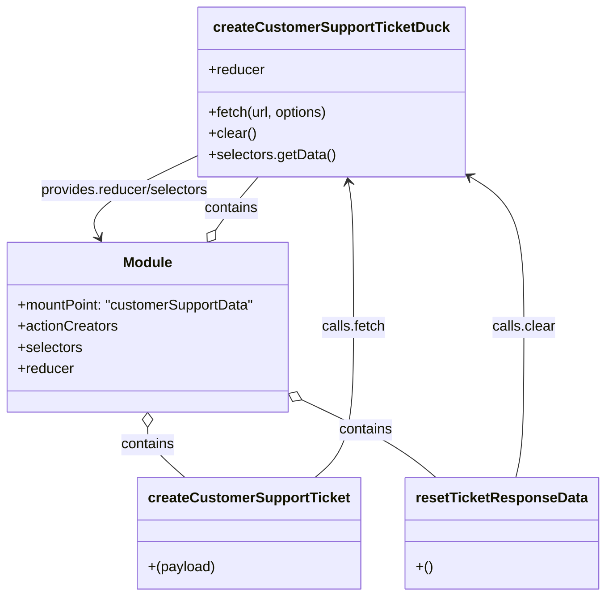

# Diagram: web/portal/src/modules/appnav/redux/CustomerSupportState.js


> Auto-generated by Obscura crawlers

## Diagram 1



### SVG

<svg id="container" width="681.0703125" xmlns="http://www.w3.org/2000/svg" class="classDiagram" height="674" viewBox="9.02734375 0 681.0703125 674" role="graphics-document document" aria-roledescription="class"><style>#container{font-family:"trebuchet ms",verdana,arial,sans-serif;font-size:16px;fill:#333;}@keyframes edge-animation-frame{from{stroke-dashoffset:0;}}@keyframes dash{to{stroke-dashoffset:0;}}#container .edge-animation-slow{stroke-dasharray:9,5!important;stroke-dashoffset:900;animation:dash 50s linear infinite;stroke-linecap:round;}#container .edge-animation-fast{stroke-dasharray:9,5!important;stroke-dashoffset:900;animation:dash 20s linear infinite;stroke-linecap:round;}#container .error-icon{fill:#552222;}#container .error-text{fill:#552222;stroke:#552222;}#container .edge-thickness-normal{stroke-width:1px;}#container .edge-thickness-thick{stroke-width:3.5px;}#container .edge-pattern-solid{stroke-dasharray:0;}#container .edge-thickness-invisible{stroke-width:0;fill:none;}#container .edge-pattern-dashed{stroke-dasharray:3;}#container .edge-pattern-dotted{stroke-dasharray:2;}#container .marker{fill:#333333;stroke:#333333;}#container .marker.cross{stroke:#333333;}#container svg{font-family:"trebuchet ms",verdana,arial,sans-serif;font-size:16px;}#container p{margin:0;}#container g.classGroup text{fill:#9370DB;stroke:none;font-family:"trebuchet ms",verdana,arial,sans-serif;font-size:10px;}#container g.classGroup text .title{font-weight:bolder;}#container .nodeLabel,#container .edgeLabel{color:#131300;}#container .edgeLabel .label rect{fill:#ECECFF;}#container .label text{fill:#131300;}#container .labelBkg{background:#ECECFF;}#container .edgeLabel .label span{background:#ECECFF;}#container .classTitle{font-weight:bolder;}#container .node rect,#container .node circle,#container .node ellipse,#container .node polygon,#container .node path{fill:#ECECFF;stroke:#9370DB;stroke-width:1px;}#container .divider{stroke:#9370DB;stroke-width:1;}#container g.clickable{cursor:pointer;}#container g.classGroup rect{fill:#ECECFF;stroke:#9370DB;}#container g.classGroup line{stroke:#9370DB;stroke-width:1;}#container .classLabel .box{stroke:none;stroke-width:0;fill:#ECECFF;opacity:0.5;}#container .classLabel .label{fill:#9370DB;font-size:10px;}#container .relation{stroke:#333333;stroke-width:1;fill:none;}#container .dashed-line{stroke-dasharray:3;}#container .dotted-line{stroke-dasharray:1 2;}#container #compositionStart,#container .composition{fill:#333333!important;stroke:#333333!important;stroke-width:1;}#container #compositionEnd,#container .composition{fill:#333333!important;stroke:#333333!important;stroke-width:1;}#container #dependencyStart,#container .dependency{fill:#333333!important;stroke:#333333!important;stroke-width:1;}#container #dependencyStart,#container .dependency{fill:#333333!important;stroke:#333333!important;stroke-width:1;}#container #extensionStart,#container .extension{fill:transparent!important;stroke:#333333!important;stroke-width:1;}#container #extensionEnd,#container .extension{fill:transparent!important;stroke:#333333!important;stroke-width:1;}#container #aggregationStart,#container .aggregation{fill:transparent!important;stroke:#333333!important;stroke-width:1;}#container #aggregationEnd,#container .aggregation{fill:transparent!important;stroke:#333333!important;stroke-width:1;}#container #lollipopStart,#container .lollipop{fill:#ECECFF!important;stroke:#333333!important;stroke-width:1;}#container #lollipopEnd,#container .lollipop{fill:#ECECFF!important;stroke:#333333!important;stroke-width:1;}#container .edgeTerminals{font-size:11px;line-height:initial;}#container .classTitleText{text-anchor:middle;font-size:18px;fill:#333;}#container .label-icon{display:inline-block;height:1em;overflow:visible;vertical-align:-0.125em;}#container .node .label-icon path{fill:currentColor;stroke:revert;stroke-width:revert;}#container :root{--mermaid-font-family:"trebuchet ms",verdana,arial,sans-serif;}</style><g><defs><marker id="container_class-aggregationStart" class="marker aggregation class" refX="18" refY="7" markerWidth="190" markerHeight="240" orient="auto"><path d="M 18,7 L9,13 L1,7 L9,1 Z"></path></marker></defs><defs><marker id="container_class-aggregationEnd" class="marker aggregation class" refX="1" refY="7" markerWidth="20" markerHeight="28" orient="auto"><path d="M 18,7 L9,13 L1,7 L9,1 Z"></path></marker></defs><defs><marker id="container_class-extensionStart" class="marker extension class" refX="18" refY="7" markerWidth="190" markerHeight="240" orient="auto"><path d="M 1,7 L18,13 V 1 Z"></path></marker></defs><defs><marker id="container_class-extensionEnd" class="marker extension class" refX="1" refY="7" markerWidth="20" markerHeight="28" orient="auto"><path d="M 1,1 V 13 L18,7 Z"></path></marker></defs><defs><marker id="container_class-compositionStart" class="marker composition class" refX="18" refY="7" markerWidth="190" markerHeight="240" orient="auto"><path d="M 18,7 L9,13 L1,7 L9,1 Z"></path></marker></defs><defs><marker id="container_class-compositionEnd" class="marker composition class" refX="1" refY="7" markerWidth="20" markerHeight="28" orient="auto"><path d="M 18,7 L9,13 L1,7 L9,1 Z"></path></marker></defs><defs><marker id="container_class-dependencyStart" class="marker dependency class" refX="6" refY="7" markerWidth="190" markerHeight="240" orient="auto"><path d="M 5,7 L9,13 L1,7 L9,1 Z"></path></marker></defs><defs><marker id="container_class-dependencyEnd" class="marker dependency class" refX="13" refY="7" markerWidth="20" markerHeight="28" orient="auto"><path d="M 18,7 L9,13 L14,7 L9,1 Z"></path></marker></defs><defs><marker id="container_class-lollipopStart" class="marker lollipop class" refX="13" refY="7" markerWidth="190" markerHeight="240" orient="auto"><circle stroke="black" fill="transparent" cx="7" cy="7" r="6"></circle></marker></defs><defs><marker id="container_class-lollipopEnd" class="marker lollipop class" refX="1" refY="7" markerWidth="190" markerHeight="240" orient="auto"><circle stroke="black" fill="transparent" cx="7" cy="7" r="6"></circle></marker></defs><g class="root"><g class="clusters"></g><g class="edgePaths"><path d="M179.191,483.25L179.191,486.542C179.191,489.833,179.191,496.417,186.396,505.875C193.6,515.333,208.009,527.667,215.213,533.833L222.418,540" id="id_Module_createCustomerSupportTicket_1" class="edge-thickness-normal edge-pattern-solid relation" style=";;;" data-edge="true" data-et="edge" data-id="id_Module_createCustomerSupportTicket_1" data-points="W3sieCI6MTc5LjE5MTQwNjI1LCJ5Ijo0NjZ9LHsieCI6MTc5LjE5MTQwNjI1LCJ5Ijo1MDN9LHsieCI6MjIyLjQxNzgxMjUsInkiOjU0MH1d" marker-start="url(#container_class-aggregationStart)"></path><path d="M356.983,453.101L374.775,461.418C392.568,469.734,428.153,486.367,452.917,500.85C477.682,515.333,491.625,527.667,498.597,533.833L505.569,540" id="id_Module_resetTicketResponseData_2" class="edge-thickness-normal edge-pattern-solid relation" style=";;;" data-edge="true" data-et="edge" data-id="id_Module_resetTicketResponseData_2" data-points="W3sieCI6MzQxLjM1NTQ2ODc1LCJ5Ijo0NDUuNzk3MDczMTk3NTE4fSx7IngiOjQ2My43MzgyODEyNSwieSI6NTAzfSx7IngiOjUwNS41Njg1MTU2MjUwMDAwMywieSI6NTQwfV0=" marker-start="url(#container_class-aggregationStart)"></path><path d="M254.921,259.783L257.53,255.985C260.138,252.188,265.356,244.594,273.382,234.63C281.408,224.667,292.242,212.333,297.658,206.167L303.075,200" id="id_Module_createCustomerSupportTicketDuck_3" class="edge-thickness-normal edge-pattern-solid relation" style=";;;" data-edge="true" data-et="edge" data-id="id_Module_createCustomerSupportTicketDuck_3" data-points="W3sieCI6MjQ1LjE1MTkzMjU2NTc4OTQ4LCJ5IjoyNzR9LHsieCI6MjcwLjU3NDIxODc1LCJ5IjoyMzd9LHsieCI6MzAzLjA3NTI3NjA4MDgyNzA1LCJ5IjoyMDB9XQ==" marker-start="url(#container_class-aggregationStart)"></path><path d="M369.621,540L376.826,533.833C384.03,527.667,398.439,515.333,405.643,487C412.848,458.667,412.848,414.333,412.848,370C412.848,325.667,412.848,281.333,411.856,253.982C410.864,226.631,408.88,216.262,407.888,211.078L406.896,205.893" id="id_createCustomerSupportTicket_createCustomerSupportTicketDuck_4" class="edge-thickness-normal edge-pattern-solid relation" style=";;;" data-edge="true" data-et="edge" data-id="id_createCustomerSupportTicket_createCustomerSupportTicketDuck_4" data-points="W3sieCI6MzY5LjYyMTI1MDAwMDAwMDAzLCJ5Ijo1NDB9LHsieCI6NDEyLjg0NzY1NjI1LCJ5Ijo1MDN9LHsieCI6NDEyLjg0NzY1NjI1LCJ5IjozNzB9LHsieCI6NDEyLjg0NzY1NjI1LCJ5IjoyMzd9LHsieCI6NDA1Ljc2ODg4NTEwMzM4MzQ3LCJ5IjoyMDB9XQ==" marker-end="url(#container_class-dependencyEnd)"></path><path d="M592.824,540L594.393,533.833C595.962,527.667,599.1,515.333,600.669,487C602.238,458.667,602.238,414.333,602.238,370C602.238,325.667,602.238,281.333,591.865,252.745C581.492,224.157,560.746,211.313,550.373,204.891L540,198.47" id="id_resetTicketResponseData_createCustomerSupportTicketDuck_5" class="edge-thickness-normal edge-pattern-solid relation" style=";;;" data-edge="true" data-et="edge" data-id="id_resetTicketResponseData_createCustomerSupportTicketDuck_5" data-points="W3sieCI6NTkyLjgyMzUxNTYyNSwieSI6NTQwfSx7IngiOjYwMi4yMzgyODEyNSwieSI6NTAzfSx7IngiOjYwMi4yMzgyODEyNSwieSI6MzcwfSx7IngiOjYwMi4yMzgyODEyNSwieSI6MjM3fSx7IngiOjUzNC44OTg0Mzc1LCJ5IjoxOTUuMzExNDQ3Njg5MDA2ODV9XQ==" marker-end="url(#container_class-dependencyEnd)"></path><path d="M239.906,173.505L217.449,184.088C194.992,194.67,150.078,215.835,130.567,231.71C111.056,247.586,116.948,258.172,119.894,263.464L122.84,268.757" id="id_createCustomerSupportTicketDuck_Module_6" class="edge-thickness-normal edge-pattern-solid relation" style=";;;" data-edge="true" data-et="edge" data-id="id_createCustomerSupportTicketDuck_Module_6" data-points="W3sieCI6MjM5LjkwNjI1LCJ5IjoxNzMuNTA1MDMwOTMyOTcxNjR9LHsieCI6MTA1LjE2NDA2MjUsInkiOjIzN30seyJ4IjoxMjUuNzU4MTM1NTczMzA4MjcsInkiOjI3NH1d" marker-end="url(#container_class-dependencyEnd)"></path></g><g class="edgeLabels"><g class="edgeLabel" transform="translate(179.19140625, 503)"><g class="label" data-id="id_Module_createCustomerSupportTicket_1" transform="translate(-30.890625, -12)"><foreignObject width="61.78125" height="24"><div xmlns="http://www.w3.org/1999/xhtml" class="labelBkg" style="display: table-cell; white-space: nowrap; line-height: 1.5; max-width: 200px; text-align: center;"><span class="edgeLabel"><p>contains</p></span></div></foreignObject></g></g><g class="edgeLabel" transform="translate(427.84299, 486.22219)"><g class="label" data-id="id_Module_resetTicketResponseData_2" transform="translate(-30.890625, -12)"><foreignObject width="61.78125" height="24"><div xmlns="http://www.w3.org/1999/xhtml" class="labelBkg" style="display: table-cell; white-space: nowrap; line-height: 1.5; max-width: 200px; text-align: center;"><span class="edgeLabel"><p>contains</p></span></div></foreignObject></g></g><g class="edgeLabel" transform="translate(272.01144, 235.36384)"><g class="label" data-id="id_Module_createCustomerSupportTicketDuck_3" transform="translate(-30.890625, -12)"><foreignObject width="61.78125" height="24"><div xmlns="http://www.w3.org/1999/xhtml" class="labelBkg" style="display: table-cell; white-space: nowrap; line-height: 1.5; max-width: 200px; text-align: center;"><span class="edgeLabel"><p>contains</p></span></div></foreignObject></g></g><g class="edgeLabel" transform="translate(412.84765625, 370)"><g class="label" data-id="id_createCustomerSupportTicket_createCustomerSupportTicketDuck_4" transform="translate(-36.4921875, -12)"><foreignObject width="72.984375" height="24"><div xmlns="http://www.w3.org/1999/xhtml" class="labelBkg" style="display: table-cell; white-space: nowrap; line-height: 1.5; max-width: 200px; text-align: center;"><span class="edgeLabel"><p>calls.fetch</p></span></div></foreignObject></g></g><g class="edgeLabel" transform="translate(602.23828125, 370)"><g class="label" data-id="id_resetTicketResponseData_createCustomerSupportTicketDuck_5" transform="translate(-36.1328125, -12)"><foreignObject width="72.265625" height="24"><div xmlns="http://www.w3.org/1999/xhtml" class="labelBkg" style="display: table-cell; white-space: nowrap; line-height: 1.5; max-width: 200px; text-align: center;"><span class="edgeLabel"><p>calls.clear</p></span></div></foreignObject></g></g><g class="edgeLabel" transform="translate(153.38255, 214.27785)"><g class="label" data-id="id_createCustomerSupportTicketDuck_Module_6" transform="translate(-97.1640625, -12)"><foreignObject width="194.328125" height="24"><div xmlns="http://www.w3.org/1999/xhtml" class="labelBkg" style="display: table-cell; white-space: nowrap; line-height: 1.5; max-width: 200px; text-align: center;"><span class="edgeLabel"><p>provides.reducer/selectors</p></span></div></foreignObject></g></g></g><g class="nodes"><g class="node default" id="classId-createCustomerSupportTicketDuck-0" transform="translate(387.40234375, 104)"><g class="basic label-container"><path d="M-147.49609375 -96 L147.49609375 -96 L147.49609375 96 L-147.49609375 96" stroke="none" stroke-width="0" fill="#ECECFF" style=""></path><path d="M-147.49609375 -96 C-76.48140727157471 -96, -5.46672079314942 -96, 147.49609375 -96 M-147.49609375 -96 C-60.60780770002164 -96, 26.280478349956724 -96, 147.49609375 -96 M147.49609375 -96 C147.49609375 -44.7601783974264, 147.49609375 6.479643205147198, 147.49609375 96 M147.49609375 -96 C147.49609375 -40.27819164459635, 147.49609375 15.443616710807305, 147.49609375 96 M147.49609375 96 C59.72884476584244 96, -28.038404218315122 96, -147.49609375 96 M147.49609375 96 C35.01534106309187 96, -77.46541162381627 96, -147.49609375 96 M-147.49609375 96 C-147.49609375 38.722535232253314, -147.49609375 -18.554929535493372, -147.49609375 -96 M-147.49609375 96 C-147.49609375 53.58433758950221, -147.49609375 11.168675179004424, -147.49609375 -96" stroke="#9370DB" stroke-width="1.3" fill="none" stroke-dasharray="0 0" style=""></path></g><g class="annotation-group text" transform="translate(0, -72)"></g><g class="label-group text" transform="translate(-127.7265625, -72)"><g class="label" style="font-weight: bolder" transform="translate(0,-12)"><foreignObject width="255.453125" height="24"><div xmlns="http://www.w3.org/1999/xhtml" style="display: table-cell; white-space: nowrap; line-height: 1.5; max-width: 301px; text-align: center;"><span class="nodeLabel markdown-node-label" style=""><p>createCustomerSupportTicketDuck</p></span></div></foreignObject></g></g><g class="members-group text" transform="translate(-135.49609375, -24)"><g class="label" style="" transform="translate(0,-12)"><foreignObject width="63.515625" height="24"><div xmlns="http://www.w3.org/1999/xhtml" style="display: table-cell; white-space: nowrap; line-height: 1.5; max-width: 122px; text-align: center;"><span class="nodeLabel markdown-node-label" style=""><p>+reducer</p></span></div></foreignObject></g></g><g class="methods-group text" transform="translate(-135.49609375, 24)"><g class="label" style="" transform="translate(0,-12)"><foreignObject width="138.25" height="24"><div xmlns="http://www.w3.org/1999/xhtml" style="display: table-cell; white-space: nowrap; line-height: 1.5; max-width: 196px; text-align: center;"><span class="nodeLabel markdown-node-label" style=""><p>+fetch(url, options)</p></span></div></foreignObject></g><g class="label" style="" transform="translate(0,12)"><foreignObject width="54.0625" height="24"><div xmlns="http://www.w3.org/1999/xhtml" style="display: table-cell; white-space: nowrap; line-height: 1.5; max-width: 111px; text-align: center;"><span class="nodeLabel markdown-node-label" style=""><p>+clear()</p></span></div></foreignObject></g><g class="label" style="" transform="translate(0,36)"><foreignObject width="143.265625" height="24"><div xmlns="http://www.w3.org/1999/xhtml" style="display: table-cell; white-space: nowrap; line-height: 1.5; max-width: 201px; text-align: center;"><span class="nodeLabel markdown-node-label" style=""><p>+selectors.getData()</p></span></div></foreignObject></g></g><g class="divider" style=""><path d="M-147.49609375 -48 C-57.36717305083101 -48, 32.76174764833797 -48, 147.49609375 -48 M-147.49609375 -48 C-30.65815436698793 -48, 86.17978501602414 -48, 147.49609375 -48" stroke="#9370DB" stroke-width="1.3" fill="none" stroke-dasharray="0 0" style=""></path></g><g class="divider" style=""><path d="M-147.49609375 0 C-58.87321761890641 0, 29.74965851218718 0, 147.49609375 0 M-147.49609375 0 C-59.15475988478654 0, 29.186573980426914 0, 147.49609375 0" stroke="#9370DB" stroke-width="1.3" fill="none" stroke-dasharray="0 0" style=""></path></g></g><g class="node default" id="classId-createCustomerSupportTicket-1" transform="translate(296.01953125, 603)"><g class="basic label-container"><path d="M-121.6953125 -63 L121.6953125 -63 L121.6953125 63 L-121.6953125 63" stroke="none" stroke-width="0" fill="#ECECFF" style=""></path><path d="M-121.6953125 -63 C-61.91669052165908 -63, -2.1380685433181554 -63, 121.6953125 -63 M-121.6953125 -63 C-47.35764547995947 -63, 26.980021540081054 -63, 121.6953125 -63 M121.6953125 -63 C121.6953125 -34.108659356810634, 121.6953125 -5.2173187136212675, 121.6953125 63 M121.6953125 -63 C121.6953125 -32.88916211117171, 121.6953125 -2.7783242223434144, 121.6953125 63 M121.6953125 63 C70.07236137415114 63, 18.449410248302286 63, -121.6953125 63 M121.6953125 63 C54.61283645935622 63, -12.469639581287566 63, -121.6953125 63 M-121.6953125 63 C-121.6953125 14.520859082034178, -121.6953125 -33.95828183593164, -121.6953125 -63 M-121.6953125 63 C-121.6953125 13.267275389266175, -121.6953125 -36.46544922146765, -121.6953125 -63" stroke="#9370DB" stroke-width="1.3" fill="none" stroke-dasharray="0 0" style=""></path></g><g class="annotation-group text" transform="translate(0, -39)"></g><g class="label-group text" transform="translate(-109.6953125, -39)"><g class="label" style="font-weight: bolder" transform="translate(0,-12)"><foreignObject width="219.390625" height="24"><div xmlns="http://www.w3.org/1999/xhtml" style="display: table-cell; white-space: nowrap; line-height: 1.5; max-width: 265px; text-align: center;"><span class="nodeLabel markdown-node-label" style=""><p>createCustomerSupportTicket</p></span></div></foreignObject></g></g><g class="members-group text" transform="translate(-109.6953125, 9)"></g><g class="methods-group text" transform="translate(-109.6953125, 39)"><g class="label" style="" transform="translate(0,-12)"><foreignObject width="76.109375" height="24"><div xmlns="http://www.w3.org/1999/xhtml" style="display: table-cell; white-space: nowrap; line-height: 1.5; max-width: 126px; text-align: center;"><span class="nodeLabel markdown-node-label" style=""><p>+(payload)</p></span></div></foreignObject></g></g><g class="divider" style=""><path d="M-121.6953125 -15 C-46.70029562168776 -15, 28.294721256624484 -15, 121.6953125 -15 M-121.6953125 -15 C-45.80970146348906 -15, 30.075909573021875 -15, 121.6953125 -15" stroke="#9370DB" stroke-width="1.3" fill="none" stroke-dasharray="0 0" style=""></path></g><g class="divider" style=""><path d="M-121.6953125 9 C-44.99113318096417 9, 31.71304613807166 9, 121.6953125 9 M-121.6953125 9 C-36.8634029134445 9, 47.968506673110994 9, 121.6953125 9" stroke="#9370DB" stroke-width="1.3" fill="none" stroke-dasharray="0 0" style=""></path></g></g><g class="node default" id="classId-resetTicketResponseData-2" transform="translate(576.79296875, 603)"><g class="basic label-container"><path d="M-105.3046875 -63 L105.3046875 -63 L105.3046875 63 L-105.3046875 63" stroke="none" stroke-width="0" fill="#ECECFF" style=""></path><path d="M-105.3046875 -63 C-51.75004293773871 -63, 1.8046016245225758 -63, 105.3046875 -63 M-105.3046875 -63 C-40.01172240598699 -63, 25.281242688026026 -63, 105.3046875 -63 M105.3046875 -63 C105.3046875 -24.20011975949987, 105.3046875 14.59976048100026, 105.3046875 63 M105.3046875 -63 C105.3046875 -27.98543796322268, 105.3046875 7.029124073554641, 105.3046875 63 M105.3046875 63 C38.06112985484846 63, -29.18242779030308 63, -105.3046875 63 M105.3046875 63 C53.090857229105964 63, 0.8770269582119283 63, -105.3046875 63 M-105.3046875 63 C-105.3046875 27.432778190328143, -105.3046875 -8.134443619343713, -105.3046875 -63 M-105.3046875 63 C-105.3046875 18.92020521522017, -105.3046875 -25.159589569559657, -105.3046875 -63" stroke="#9370DB" stroke-width="1.3" fill="none" stroke-dasharray="0 0" style=""></path></g><g class="annotation-group text" transform="translate(0, -39)"></g><g class="label-group text" transform="translate(-93.3046875, -39)"><g class="label" style="font-weight: bolder" transform="translate(0,-12)"><foreignObject width="186.609375" height="24"><div xmlns="http://www.w3.org/1999/xhtml" style="display: table-cell; white-space: nowrap; line-height: 1.5; max-width: 233px; text-align: center;"><span class="nodeLabel markdown-node-label" style=""><p>resetTicketResponseData</p></span></div></foreignObject></g></g><g class="members-group text" transform="translate(-93.3046875, 9)"></g><g class="methods-group text" transform="translate(-93.3046875, 39)"><g class="label" style="" transform="translate(0,-12)"><foreignObject width="18.359375" height="24"><div xmlns="http://www.w3.org/1999/xhtml" style="display: table-cell; white-space: nowrap; line-height: 1.5; max-width: 68px; text-align: center;"><span class="nodeLabel markdown-node-label" style=""><p>+()</p></span></div></foreignObject></g></g><g class="divider" style=""><path d="M-105.3046875 -15 C-30.951916863502305 -15, 43.40085377299539 -15, 105.3046875 -15 M-105.3046875 -15 C-60.39876622769835 -15, -15.492844955396706 -15, 105.3046875 -15" stroke="#9370DB" stroke-width="1.3" fill="none" stroke-dasharray="0 0" style=""></path></g><g class="divider" style=""><path d="M-105.3046875 9 C-33.87121099492674 9, 37.56226551014652 9, 105.3046875 9 M-105.3046875 9 C-61.015877478948894 9, -16.72706745789779 9, 105.3046875 9" stroke="#9370DB" stroke-width="1.3" fill="none" stroke-dasharray="0 0" style=""></path></g></g><g class="node default" id="classId-Module-3" transform="translate(179.19140625, 370)"><g class="basic label-container"><path d="M-162.1640625 -96 L162.1640625 -96 L162.1640625 96 L-162.1640625 96" stroke="none" stroke-width="0" fill="#ECECFF" style=""></path><path d="M-162.1640625 -96 C-44.2760680036605 -96, 73.611926492679 -96, 162.1640625 -96 M-162.1640625 -96 C-68.51875333803582 -96, 25.126555823928356 -96, 162.1640625 -96 M162.1640625 -96 C162.1640625 -47.27391862680564, 162.1640625 1.4521627463887228, 162.1640625 96 M162.1640625 -96 C162.1640625 -42.337345668696095, 162.1640625 11.32530866260781, 162.1640625 96 M162.1640625 96 C97.0216496375354 96, 31.879236775070808 96, -162.1640625 96 M162.1640625 96 C71.33150627950955 96, -19.50104994098089 96, -162.1640625 96 M-162.1640625 96 C-162.1640625 26.73699475080474, -162.1640625 -42.52601049839052, -162.1640625 -96 M-162.1640625 96 C-162.1640625 53.02055436551207, -162.1640625 10.041108731024138, -162.1640625 -96" stroke="#9370DB" stroke-width="1.3" fill="none" stroke-dasharray="0 0" style=""></path></g><g class="annotation-group text" transform="translate(0, -72)"></g><g class="label-group text" transform="translate(-27.09375, -72)"><g class="label" style="font-weight: bolder" transform="translate(0,-12)"><foreignObject width="54.1875" height="24"><div xmlns="http://www.w3.org/1999/xhtml" style="display: table-cell; white-space: nowrap; line-height: 1.5; max-width: 104px; text-align: center;"><span class="nodeLabel markdown-node-label" style=""><p>Module</p></span></div></foreignObject></g></g><g class="members-group text" transform="translate(-150.1640625, -24)"><g class="label" style="" transform="translate(0,-12)"><foreignObject width="273.234375" height="24"><div xmlns="http://www.w3.org/1999/xhtml" style="display: table-cell; white-space: nowrap; line-height: 1.5; max-width: 331px; text-align: center;"><span class="nodeLabel markdown-node-label" style=""><p>+mountPoint: "customerSupportData"</p></span></div></foreignObject></g><g class="label" style="" transform="translate(0,12)"><foreignObject width="113.078125" height="24"><div xmlns="http://www.w3.org/1999/xhtml" style="display: table-cell; white-space: nowrap; line-height: 1.5; max-width: 170px; text-align: center;"><span class="nodeLabel markdown-node-label" style=""><p>+actionCreators</p></span></div></foreignObject></g><g class="label" style="" transform="translate(0,36)"><foreignObject width="73.453125" height="24"><div xmlns="http://www.w3.org/1999/xhtml" style="display: table-cell; white-space: nowrap; line-height: 1.5; max-width: 131px; text-align: center;"><span class="nodeLabel markdown-node-label" style=""><p>+selectors</p></span></div></foreignObject></g><g class="label" style="" transform="translate(0,60)"><foreignObject width="63.515625" height="24"><div xmlns="http://www.w3.org/1999/xhtml" style="display: table-cell; white-space: nowrap; line-height: 1.5; max-width: 122px; text-align: center;"><span class="nodeLabel markdown-node-label" style=""><p>+reducer</p></span></div></foreignObject></g></g><g class="methods-group text" transform="translate(-150.1640625, 96)"></g><g class="divider" style=""><path d="M-162.1640625 -48 C-93.97669694977003 -48, -25.78933139954006 -48, 162.1640625 -48 M-162.1640625 -48 C-91.73285259432181 -48, -21.301642688643625 -48, 162.1640625 -48" stroke="#9370DB" stroke-width="1.3" fill="none" stroke-dasharray="0 0" style=""></path></g><g class="divider" style=""><path d="M-162.1640625 72 C-50.47699924134446 72, 61.21006401731108 72, 162.1640625 72 M-162.1640625 72 C-33.16856197120853 72, 95.82693855758293 72, 162.1640625 72" stroke="#9370DB" stroke-width="1.3" fill="none" stroke-dasharray="0 0" style=""></path></g></g></g></g></g></svg>

## Diagram 2

```mermaid
flowchart TD
    A[createCustomerSupportTicket(payload)] --> B[dispatch(createCustomerSupportTicketDuck.fetch(...))]
    B --> C[createCustomerSupportTicketDuck.fetch]
    C --> D[POST to /support/ticket/ (CREATE_CUSTOMER_SUPPORT_TICKET_URL)]
    D --> E[API Response]
    E --> F[createCustomerSupportTicketDuck.reducer]
    F --> G[Store updated at "customerSupportData" mount point]
    subgraph reset_flow [Reset Ticket Flow]
        H[resetTicketResponseData()] --> I[dispatch(createCustomerSupportTicketDuck.clear())]
        I --> J[createCustomerSupportTicketDuck.clear()]
        J --> K[Store cleared at "customerSupportData"]
    end
```

> SVG rendering failed for this diagram.
