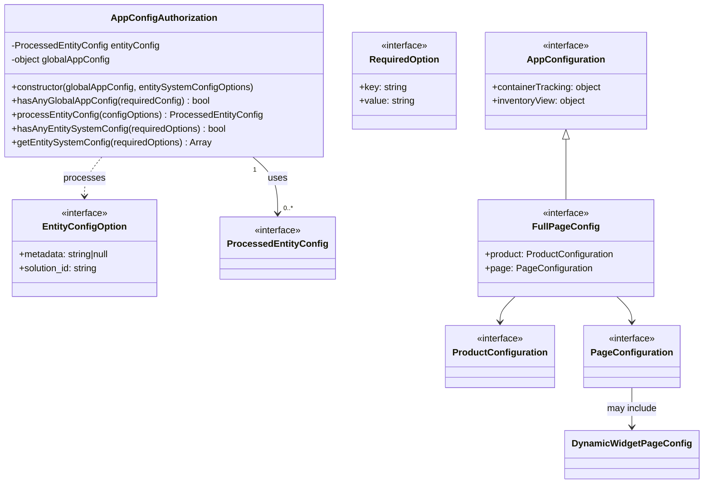

# Diagram: web/portal/src/modules/auth/AppConfigAuthorization.ts


> Auto-generated by Obscura crawlers

## Diagram 1



### SVG

<svg id="container" width="1195.796875" xmlns="http://www.w3.org/2000/svg" class="classDiagram" height="838" viewBox="0 0 1195.796875 838" role="graphics-document document" aria-roledescription="class"><style>#container{font-family:"trebuchet ms",verdana,arial,sans-serif;font-size:16px;fill:#333;}@keyframes edge-animation-frame{from{stroke-dashoffset:0;}}@keyframes dash{to{stroke-dashoffset:0;}}#container .edge-animation-slow{stroke-dasharray:9,5!important;stroke-dashoffset:900;animation:dash 50s linear infinite;stroke-linecap:round;}#container .edge-animation-fast{stroke-dasharray:9,5!important;stroke-dashoffset:900;animation:dash 20s linear infinite;stroke-linecap:round;}#container .error-icon{fill:#552222;}#container .error-text{fill:#552222;stroke:#552222;}#container .edge-thickness-normal{stroke-width:1px;}#container .edge-thickness-thick{stroke-width:3.5px;}#container .edge-pattern-solid{stroke-dasharray:0;}#container .edge-thickness-invisible{stroke-width:0;fill:none;}#container .edge-pattern-dashed{stroke-dasharray:3;}#container .edge-pattern-dotted{stroke-dasharray:2;}#container .marker{fill:#333333;stroke:#333333;}#container .marker.cross{stroke:#333333;}#container svg{font-family:"trebuchet ms",verdana,arial,sans-serif;font-size:16px;}#container p{margin:0;}#container g.classGroup text{fill:#9370DB;stroke:none;font-family:"trebuchet ms",verdana,arial,sans-serif;font-size:10px;}#container g.classGroup text .title{font-weight:bolder;}#container .nodeLabel,#container .edgeLabel{color:#131300;}#container .edgeLabel .label rect{fill:#ECECFF;}#container .label text{fill:#131300;}#container .labelBkg{background:#ECECFF;}#container .edgeLabel .label span{background:#ECECFF;}#container .classTitle{font-weight:bolder;}#container .node rect,#container .node circle,#container .node ellipse,#container .node polygon,#container .node path{fill:#ECECFF;stroke:#9370DB;stroke-width:1px;}#container .divider{stroke:#9370DB;stroke-width:1;}#container g.clickable{cursor:pointer;}#container g.classGroup rect{fill:#ECECFF;stroke:#9370DB;}#container g.classGroup line{stroke:#9370DB;stroke-width:1;}#container .classLabel .box{stroke:none;stroke-width:0;fill:#ECECFF;opacity:0.5;}#container .classLabel .label{fill:#9370DB;font-size:10px;}#container .relation{stroke:#333333;stroke-width:1;fill:none;}#container .dashed-line{stroke-dasharray:3;}#container .dotted-line{stroke-dasharray:1 2;}#container #compositionStart,#container .composition{fill:#333333!important;stroke:#333333!important;stroke-width:1;}#container #compositionEnd,#container .composition{fill:#333333!important;stroke:#333333!important;stroke-width:1;}#container #dependencyStart,#container .dependency{fill:#333333!important;stroke:#333333!important;stroke-width:1;}#container #dependencyStart,#container .dependency{fill:#333333!important;stroke:#333333!important;stroke-width:1;}#container #extensionStart,#container .extension{fill:transparent!important;stroke:#333333!important;stroke-width:1;}#container #extensionEnd,#container .extension{fill:transparent!important;stroke:#333333!important;stroke-width:1;}#container #aggregationStart,#container .aggregation{fill:transparent!important;stroke:#333333!important;stroke-width:1;}#container #aggregationEnd,#container .aggregation{fill:transparent!important;stroke:#333333!important;stroke-width:1;}#container #lollipopStart,#container .lollipop{fill:#ECECFF!important;stroke:#333333!important;stroke-width:1;}#container #lollipopEnd,#container .lollipop{fill:#ECECFF!important;stroke:#333333!important;stroke-width:1;}#container .edgeTerminals{font-size:11px;line-height:initial;}#container .classTitleText{text-anchor:middle;font-size:18px;fill:#333;}#container .label-icon{display:inline-block;height:1em;overflow:visible;vertical-align:-0.125em;}#container .node .label-icon path{fill:currentColor;stroke:revert;stroke-width:revert;}#container :root{--mermaid-font-family:"trebuchet ms",verdana,arial,sans-serif;}</style><g><defs><marker id="container_class-aggregationStart" class="marker aggregation class" refX="18" refY="7" markerWidth="190" markerHeight="240" orient="auto"><path d="M 18,7 L9,13 L1,7 L9,1 Z"></path></marker></defs><defs><marker id="container_class-aggregationEnd" class="marker aggregation class" refX="1" refY="7" markerWidth="20" markerHeight="28" orient="auto"><path d="M 18,7 L9,13 L1,7 L9,1 Z"></path></marker></defs><defs><marker id="container_class-extensionStart" class="marker extension class" refX="18" refY="7" markerWidth="190" markerHeight="240" orient="auto"><path d="M 1,7 L18,13 V 1 Z"></path></marker></defs><defs><marker id="container_class-extensionEnd" class="marker extension class" refX="1" refY="7" markerWidth="20" markerHeight="28" orient="auto"><path d="M 1,1 V 13 L18,7 Z"></path></marker></defs><defs><marker id="container_class-compositionStart" class="marker composition class" refX="18" refY="7" markerWidth="190" markerHeight="240" orient="auto"><path d="M 18,7 L9,13 L1,7 L9,1 Z"></path></marker></defs><defs><marker id="container_class-compositionEnd" class="marker composition class" refX="1" refY="7" markerWidth="20" markerHeight="28" orient="auto"><path d="M 18,7 L9,13 L1,7 L9,1 Z"></path></marker></defs><defs><marker id="container_class-dependencyStart" class="marker dependency class" refX="6" refY="7" markerWidth="190" markerHeight="240" orient="auto"><path d="M 5,7 L9,13 L1,7 L9,1 Z"></path></marker></defs><defs><marker id="container_class-dependencyEnd" class="marker dependency class" refX="13" refY="7" markerWidth="20" markerHeight="28" orient="auto"><path d="M 18,7 L9,13 L14,7 L9,1 Z"></path></marker></defs><defs><marker id="container_class-lollipopStart" class="marker lollipop class" refX="13" refY="7" markerWidth="190" markerHeight="240" orient="auto"><circle stroke="black" fill="transparent" cx="7" cy="7" r="6"></circle></marker></defs><defs><marker id="container_class-lollipopEnd" class="marker lollipop class" refX="1" refY="7" markerWidth="190" markerHeight="240" orient="auto"><circle stroke="black" fill="transparent" cx="7" cy="7" r="6"></circle></marker></defs><g class="root"><g class="clusters"></g><g class="edgePaths"><path d="M433.803,272L440.994,278.167C448.185,284.333,462.567,296.667,469.758,313C476.949,329.333,476.949,349.667,476.949,359.833L476.949,370" id="id_AppConfigAuthorization_ProcessedEntityConfig_1" class="edge-thickness-normal edge-pattern-solid relation" style=";;;" data-edge="true" data-et="edge" data-id="id_AppConfigAuthorization_ProcessedEntityConfig_1" data-points="W3sieCI6NDMzLjgwMjc5MjE1OTc2MzI3LCJ5IjoyNzJ9LHsieCI6NDc2Ljk0OTIxODc1LCJ5IjozMDl9LHsieCI6NDc2Ljk0OTIxODc1LCJ5IjozNzZ9XQ==" marker-end="url(#container_class-dependencyEnd)"></path><path d="M174.091,272L169.149,278.167C164.207,284.333,154.323,296.667,149.381,308C144.439,319.333,144.439,329.667,144.439,334.833L144.439,340" id="id_AppConfigAuthorization_EntityConfigOption_2" class="edge-thickness-normal edge-pattern-dashed relation" style=";;;" data-edge="true" data-et="edge" data-id="id_AppConfigAuthorization_EntityConfigOption_2" data-points="W3sieCI6MTc0LjA5MTAyMjU1OTE3MTYsInkiOjI3Mn0seyJ4IjoxNDQuNDM5NDUzMTI1LCJ5IjozMDl9LHsieCI6MTQ0LjQzOTQ1MzEyNSwieSI6MzQ2fV0=" marker-end="url(#container_class-dependencyEnd)"></path><path d="M885.177,514L880.998,518.167C876.818,522.333,868.46,530.667,864.281,538C860.102,545.333,860.102,551.667,860.102,554.833L860.102,558" id="id_FullPageConfig_ProductConfiguration_3" class="edge-thickness-normal edge-pattern-solid relation" style=";;;" data-edge="true" data-et="edge" data-id="id_FullPageConfig_ProductConfiguration_3" data-points="W3sieCI6ODg1LjE3NjgyMDUyNzUyMywieSI6NTE0fSx7IngiOjg2MC4xMDE1NjI1LCJ5Ijo1Mzl9LHsieCI6ODYwLjEwMTU2MjUsInkiOjU2NH1d" marker-end="url(#container_class-dependencyEnd)"></path><path d="M1053.683,514L1057.862,518.167C1062.041,522.333,1070.399,530.667,1074.579,538C1078.758,545.333,1078.758,551.667,1078.758,554.833L1078.758,558" id="id_FullPageConfig_PageConfiguration_4" class="edge-thickness-normal edge-pattern-solid relation" style=";;;" data-edge="true" data-et="edge" data-id="id_FullPageConfig_PageConfiguration_4" data-points="W3sieCI6MTA1My42ODI1NTQ0NzI0NzcsInkiOjUxNH0seyJ4IjoxMDc4Ljc1NzgxMjUsInkiOjUzOX0seyJ4IjoxMDc4Ljc1NzgxMjUsInkiOjU2NH1d" marker-end="url(#container_class-dependencyEnd)"></path><path d="M1078.758,672L1078.758,678.167C1078.758,684.333,1078.758,696.667,1078.758,708C1078.758,719.333,1078.758,729.667,1078.758,734.833L1078.758,740" id="id_PageConfiguration_DynamicWidgetPageConfig_5" class="edge-thickness-normal edge-pattern-solid relation" style=";;;" data-edge="true" data-et="edge" data-id="id_PageConfiguration_DynamicWidgetPageConfig_5" data-points="W3sieCI6MTA3OC43NTc4MTI1LCJ5Ijo2NzJ9LHsieCI6MTA3OC43NTc4MTI1LCJ5Ijo3MDl9LHsieCI6MTA3OC43NTc4MTI1LCJ5Ijo3NDZ9XQ==" marker-end="url(#container_class-dependencyEnd)"></path><path d="M969.43,241.25L969.43,252.542C969.43,263.833,969.43,286.417,969.43,303.875C969.43,321.333,969.43,333.667,969.43,339.833L969.43,346" id="id_AppConfiguration_FullPageConfig_6" class="edge-thickness-normal edge-pattern-solid relation" style=";;;" data-edge="true" data-et="edge" data-id="id_AppConfiguration_FullPageConfig_6" data-points="W3sieCI6OTY5LjQyOTY4NzUsInkiOjIyNH0seyJ4Ijo5NjkuNDI5Njg3NSwieSI6MzA5fSx7IngiOjk2OS40Mjk2ODc1LCJ5IjozNDZ9XQ==" marker-start="url(#container_class-extensionStart)"></path></g><g class="edgeLabels"><g class="edgeLabel" transform="translate(476.94921875, 309)"><g class="label" data-id="id_AppConfigAuthorization_ProcessedEntityConfig_1" transform="translate(-16.4921875, -12)"><foreignObject width="32.984375" height="24"><div xmlns="http://www.w3.org/1999/xhtml" class="labelBkg" style="display: table-cell; white-space: nowrap; line-height: 1.5; max-width: 200px; text-align: center;"><span class="edgeLabel"><p>uses</p></span></div></foreignObject></g></g><g class="edgeLabel" transform="translate(144.439453125, 309)"><g class="label" data-id="id_AppConfigAuthorization_EntityConfigOption_2" transform="translate(-35.7890625, -12)"><foreignObject width="71.578125" height="24"><div xmlns="http://www.w3.org/1999/xhtml" class="labelBkg" style="display: table-cell; white-space: nowrap; line-height: 1.5; max-width: 200px; text-align: center;"><span class="edgeLabel"><p>processes</p></span></div></foreignObject></g></g><g class="edgeLabel"><g class="label" data-id="id_FullPageConfig_ProductConfiguration_3" transform="translate(0, 0)"><foreignObject width="0" height="0"><div xmlns="http://www.w3.org/1999/xhtml" class="labelBkg" style="display: table-cell; white-space: nowrap; line-height: 1.5; max-width: 200px; text-align: center;"><span class="edgeLabel"></span></div></foreignObject></g></g><g class="edgeLabel"><g class="label" data-id="id_FullPageConfig_PageConfiguration_4" transform="translate(0, 0)"><foreignObject width="0" height="0"><div xmlns="http://www.w3.org/1999/xhtml" class="labelBkg" style="display: table-cell; white-space: nowrap; line-height: 1.5; max-width: 200px; text-align: center;"><span class="edgeLabel"></span></div></foreignObject></g></g><g class="edgeLabel" transform="translate(1078.7578125, 709)"><g class="label" data-id="id_PageConfiguration_DynamicWidgetPageConfig_5" transform="translate(-44.0625, -12)"><foreignObject width="88.125" height="24"><div xmlns="http://www.w3.org/1999/xhtml" class="labelBkg" style="display: table-cell; white-space: nowrap; line-height: 1.5; max-width: 200px; text-align: center;"><span class="edgeLabel"><p>may include</p></span></div></foreignObject></g></g><g class="edgeLabel"><g class="label" data-id="id_AppConfiguration_FullPageConfig_6" transform="translate(0, 0)"><foreignObject width="0" height="0"><div xmlns="http://www.w3.org/1999/xhtml" class="labelBkg" style="display: table-cell; white-space: nowrap; line-height: 1.5; max-width: 200px; text-align: center;"><span class="edgeLabel"></span></div></foreignObject></g></g><g class="edgeTerminals" transform="translate(437.32262957728085, 294.7785148749999)"><g class="inner" transform="translate(0, 0)"><foreignObject style="width: 9px; height: 12px;"><div xmlns="http://www.w3.org/1999/xhtml" style="display: inline-block; padding-right: 1px; white-space: nowrap;"><span class="edgeLabel">1</span></div></foreignObject></g></g><g class="edgeTerminals" transform="translate(486.949219375, 353.5000005357143)"><g class="inner" transform="translate(0, 0)"></g><foreignObject style="width: 36px; height: 12px;"><div xmlns="http://www.w3.org/1999/xhtml" style="display: inline-block; padding-right: 1px; white-space: nowrap;"><span class="edgeLabel">0..*</span></div></foreignObject></g></g><g class="nodes"><g class="node default" id="classId-AppConfigAuthorization-0" transform="translate(279.875, 140)"><g class="basic label-container"><path d="M-271.875 -132 L271.875 -132 L271.875 132 L-271.875 132" stroke="none" stroke-width="0" fill="#ECECFF" style=""></path><path d="M-271.875 -132 C-67.29990994672656 -132, 137.27518010654688 -132, 271.875 -132 M-271.875 -132 C-61.8598561584173 -132, 148.1552876831654 -132, 271.875 -132 M271.875 -132 C271.875 -32.751295142777494, 271.875 66.49740971444501, 271.875 132 M271.875 -132 C271.875 -39.94258474122245, 271.875 52.114830517555106, 271.875 132 M271.875 132 C60.81142296927189 132, -150.25215406145622 132, -271.875 132 M271.875 132 C129.3113421148541 132, -13.252315770291773 132, -271.875 132 M-271.875 132 C-271.875 79.17853807143844, -271.875 26.357076142876878, -271.875 -132 M-271.875 132 C-271.875 56.17805167820876, -271.875 -19.64389664358248, -271.875 -132" stroke="#9370DB" stroke-width="1.3" fill="none" stroke-dasharray="0 0" style=""></path></g><g class="annotation-group text" transform="translate(0, -108)"></g><g class="label-group text" transform="translate(-86.90625, -108)"><g class="label" style="font-weight: bolder" transform="translate(0,-12)"><foreignObject width="173.8125" height="24"><div xmlns="http://www.w3.org/1999/xhtml" style="display: table-cell; white-space: nowrap; line-height: 1.5; max-width: 221px; text-align: center;"><span class="nodeLabel markdown-node-label" style=""><p>AppConfigAuthorization</p></span></div></foreignObject></g></g><g class="members-group text" transform="translate(-259.875, -60)"><g class="label" style="" transform="translate(0,-12)"><foreignObject width="257.171875" height="24"><div xmlns="http://www.w3.org/1999/xhtml" style="display: table-cell; white-space: nowrap; line-height: 1.5; max-width: 315px; text-align: center;"><span class="nodeLabel markdown-node-label" style=""><p>-ProcessedEntityConfig entityConfig</p></span></div></foreignObject></g><g class="label" style="" transform="translate(0,12)"><foreignObject width="174.078125" height="24"><div xmlns="http://www.w3.org/1999/xhtml" style="display: table-cell; white-space: nowrap; line-height: 1.5; max-width: 232px; text-align: center;"><span class="nodeLabel markdown-node-label" style=""><p>-object globalAppConfig</p></span></div></foreignObject></g></g><g class="methods-group text" transform="translate(-259.875, 12)"><g class="label" style="" transform="translate(0,-12)"><foreignObject width="423.484375" height="24"><div xmlns="http://www.w3.org/1999/xhtml" style="display: table-cell; white-space: nowrap; line-height: 1.5; max-width: 481px; text-align: center;"><span class="nodeLabel markdown-node-label" style=""><p>+constructor(globalAppConfig, entitySystemConfigOptions)</p></span></div></foreignObject></g><g class="label" style="" transform="translate(0,12)"><foreignObject width="341.609375" height="24"><div xmlns="http://www.w3.org/1999/xhtml" style="display: table-cell; white-space: nowrap; line-height: 1.5; max-width: 399px; text-align: center;"><span class="nodeLabel markdown-node-label" style=""><p>+hasAnyGlobalAppConfig(requiredConfig) : bool</p></span></div></foreignObject></g><g class="label" style="" transform="translate(0,36)"><foreignObject width="432.84375" height="24"><div xmlns="http://www.w3.org/1999/xhtml" style="display: table-cell; white-space: nowrap; line-height: 1.5; max-width: 491px; text-align: center;"><span class="nodeLabel markdown-node-label" style=""><p>+processEntityConfig(configOptions) : ProcessedEntityConfig</p></span></div></foreignObject></g><g class="label" style="" transform="translate(0,60)"><foreignObject width="372.375" height="24"><div xmlns="http://www.w3.org/1999/xhtml" style="display: table-cell; white-space: nowrap; line-height: 1.5; max-width: 430px; text-align: center;"><span class="nodeLabel markdown-node-label" style=""><p>+hasAnyEntitySystemConfig(requiredOptions) : bool</p></span></div></foreignObject></g><g class="label" style="" transform="translate(0,84)"><foreignObject width="347.65625" height="24"><div xmlns="http://www.w3.org/1999/xhtml" style="display: table-cell; white-space: nowrap; line-height: 1.5; max-width: 405px; text-align: center;"><span class="nodeLabel markdown-node-label" style=""><p>+getEntitySystemConfig(requiredOptions) : Array</p></span></div></foreignObject></g></g><g class="divider" style=""><path d="M-271.875 -84 C-149.34915634935783 -84, -26.823312698715625 -84, 271.875 -84 M-271.875 -84 C-86.90236087131811 -84, 98.07027825736378 -84, 271.875 -84" stroke="#9370DB" stroke-width="1.3" fill="none" stroke-dasharray="0 0" style=""></path></g><g class="divider" style=""><path d="M-271.875 -12 C-151.8127560359194 -12, -31.750512071838756 -12, 271.875 -12 M-271.875 -12 C-101.90238598842666 -12, 68.07022802314668 -12, 271.875 -12" stroke="#9370DB" stroke-width="1.3" fill="none" stroke-dasharray="0 0" style=""></path></g></g><g class="node default" id="classId-EntityConfigOption-1" transform="translate(144.439453125, 430)"><g class="basic label-container"><path d="M-127.40234375 -84 L127.40234375 -84 L127.40234375 84 L-127.40234375 84" stroke="none" stroke-width="0" fill="#ECECFF" style=""></path><path d="M-127.40234375 -84 C-62.356907464602884 -84, 2.6885288207942324 -84, 127.40234375 -84 M-127.40234375 -84 C-67.29553386695645 -84, -7.18872398391288 -84, 127.40234375 -84 M127.40234375 -84 C127.40234375 -46.42022900862384, 127.40234375 -8.840458017247684, 127.40234375 84 M127.40234375 -84 C127.40234375 -47.16111556999495, 127.40234375 -10.322231139989896, 127.40234375 84 M127.40234375 84 C64.87576582162222 84, 2.349187893244462 84, -127.40234375 84 M127.40234375 84 C55.779690537024635 84, -15.84296267595073 84, -127.40234375 84 M-127.40234375 84 C-127.40234375 40.50824251792764, -127.40234375 -2.9835149641447174, -127.40234375 -84 M-127.40234375 84 C-127.40234375 42.438542587742404, -127.40234375 0.8770851754848081, -127.40234375 -84" stroke="#9370DB" stroke-width="1.3" fill="none" stroke-dasharray="0 0" style=""></path></g><g class="annotation-group text" transform="translate(-41.015625, -60)"><g class="label" style="" transform="translate(0,-12)"><foreignObject width="82.03125" height="24"><div xmlns="http://www.w3.org/1999/xhtml" style="display: table-cell; white-space: nowrap; line-height: 1.5; max-width: 132px; text-align: center;"><span class="nodeLabel markdown-node-label" style=""><p>«interface»</p></span></div></foreignObject></g></g><g class="label-group text" transform="translate(-69.1484375, -36)"><g class="label" style="font-weight: bolder" transform="translate(0,-12)"><foreignObject width="138.296875" height="24"><div xmlns="http://www.w3.org/1999/xhtml" style="display: table-cell; white-space: nowrap; line-height: 1.5; max-width: 186px; text-align: center;"><span class="nodeLabel markdown-node-label" style=""><p>EntityConfigOption</p></span></div></foreignObject></g></g><g class="members-group text" transform="translate(-115.40234375, 12)"><g class="label" style="" transform="translate(0,-12)"><foreignObject width="161.65625" height="24"><div xmlns="http://www.w3.org/1999/xhtml" style="display: table-cell; white-space: nowrap; line-height: 1.5; max-width: 219px; text-align: center;"><span class="nodeLabel markdown-node-label" style=""><p>+metadata: string|null</p></span></div></foreignObject></g><g class="label" style="" transform="translate(0,12)"><foreignObject width="139.921875" height="24"><div xmlns="http://www.w3.org/1999/xhtml" style="display: table-cell; white-space: nowrap; line-height: 1.5; max-width: 198px; text-align: center;"><span class="nodeLabel markdown-node-label" style=""><p>+solution_id: string</p></span></div></foreignObject></g></g><g class="methods-group text" transform="translate(-115.40234375, 84)"></g><g class="divider" style=""><path d="M-127.40234375 -12 C-60.24106018812043 -12, 6.920223373759143 -12, 127.40234375 -12 M-127.40234375 -12 C-63.817270182628526 -12, -0.23219661525705249 -12, 127.40234375 -12" stroke="#9370DB" stroke-width="1.3" fill="none" stroke-dasharray="0 0" style=""></path></g><g class="divider" style=""><path d="M-127.40234375 60 C-44.84216933666224 60, 37.718005076675524 60, 127.40234375 60 M-127.40234375 60 C-49.48016008967244 60, 28.442023570655124 60, 127.40234375 60" stroke="#9370DB" stroke-width="1.3" fill="none" stroke-dasharray="0 0" style=""></path></g></g><g class="node default" id="classId-ProcessedEntityConfig-2" transform="translate(476.94921875, 430)"><g class="basic label-container"><path d="M-93.46875 -54 L93.46875 -54 L93.46875 54 L-93.46875 54" stroke="none" stroke-width="0" fill="#ECECFF" style=""></path><path d="M-93.46875 -54 C-33.98601237724109 -54, 25.496725245517823 -54, 93.46875 -54 M-93.46875 -54 C-39.241811818216604 -54, 14.985126363566792 -54, 93.46875 -54 M93.46875 -54 C93.46875 -29.28142162498103, 93.46875 -4.562843249962057, 93.46875 54 M93.46875 -54 C93.46875 -17.26270009141556, 93.46875 19.47459981716888, 93.46875 54 M93.46875 54 C36.2404949668934 54, -20.9877600662132 54, -93.46875 54 M93.46875 54 C27.111415841964643 54, -39.245918316070714 54, -93.46875 54 M-93.46875 54 C-93.46875 24.023594577384518, -93.46875 -5.952810845230964, -93.46875 -54 M-93.46875 54 C-93.46875 14.594703488481585, -93.46875 -24.81059302303683, -93.46875 -54" stroke="#9370DB" stroke-width="1.3" fill="none" stroke-dasharray="0 0" style=""></path></g><g class="annotation-group text" transform="translate(-41.015625, -30)"><g class="label" style="" transform="translate(0,-12)"><foreignObject width="82.03125" height="24"><div xmlns="http://www.w3.org/1999/xhtml" style="display: table-cell; white-space: nowrap; line-height: 1.5; max-width: 132px; text-align: center;"><span class="nodeLabel markdown-node-label" style=""><p>«interface»</p></span></div></foreignObject></g></g><g class="label-group text" transform="translate(-81.46875, -6)"><g class="label" style="font-weight: bolder" transform="translate(0,-12)"><foreignObject width="162.9375" height="24"><div xmlns="http://www.w3.org/1999/xhtml" style="display: table-cell; white-space: nowrap; line-height: 1.5; max-width: 210px; text-align: center;"><span class="nodeLabel markdown-node-label" style=""><p>ProcessedEntityConfig</p></span></div></foreignObject></g></g><g class="members-group text" transform="translate(-81.46875, 42)"></g><g class="methods-group text" transform="translate(-81.46875, 72)"></g><g class="divider" style=""><path d="M-93.46875 18 C-44.5600550227274 18, 4.348639954545206 18, 93.46875 18 M-93.46875 18 C-30.731094206595458 18, 32.006561586809084 18, 93.46875 18" stroke="#9370DB" stroke-width="1.3" fill="none" stroke-dasharray="0 0" style=""></path></g><g class="divider" style=""><path d="M-93.46875 36 C-27.268975700275774 36, 38.93079859944845 36, 93.46875 36 M-93.46875 36 C-30.95721264402993 36, 31.55432471194014 36, 93.46875 36" stroke="#9370DB" stroke-width="1.3" fill="none" stroke-dasharray="0 0" style=""></path></g></g><g class="node default" id="classId-RequiredOption-3" transform="translate(690.953125, 140)"><g class="basic label-container"><path d="M-89.203125 -84 L89.203125 -84 L89.203125 84 L-89.203125 84" stroke="none" stroke-width="0" fill="#ECECFF" style=""></path><path d="M-89.203125 -84 C-22.185720395587566 -84, 44.83168420882487 -84, 89.203125 -84 M-89.203125 -84 C-35.10651561162106 -84, 18.990093776757874 -84, 89.203125 -84 M89.203125 -84 C89.203125 -22.223487083868598, 89.203125 39.553025832262804, 89.203125 84 M89.203125 -84 C89.203125 -30.96094284159045, 89.203125 22.078114316819097, 89.203125 84 M89.203125 84 C24.426949732965085 84, -40.34922553406983 84, -89.203125 84 M89.203125 84 C51.07013028420651 84, 12.937135568413026 84, -89.203125 84 M-89.203125 84 C-89.203125 19.617117883830247, -89.203125 -44.76576423233951, -89.203125 -84 M-89.203125 84 C-89.203125 21.27716819685515, -89.203125 -41.4456636062897, -89.203125 -84" stroke="#9370DB" stroke-width="1.3" fill="none" stroke-dasharray="0 0" style=""></path></g><g class="annotation-group text" transform="translate(-41.015625, -60)"><g class="label" style="" transform="translate(0,-12)"><foreignObject width="82.03125" height="24"><div xmlns="http://www.w3.org/1999/xhtml" style="display: table-cell; white-space: nowrap; line-height: 1.5; max-width: 132px; text-align: center;"><span class="nodeLabel markdown-node-label" style=""><p>«interface»</p></span></div></foreignObject></g></g><g class="label-group text" transform="translate(-57.984375, -36)"><g class="label" style="font-weight: bolder" transform="translate(0,-12)"><foreignObject width="115.96875" height="24"><div xmlns="http://www.w3.org/1999/xhtml" style="display: table-cell; white-space: nowrap; line-height: 1.5; max-width: 165px; text-align: center;"><span class="nodeLabel markdown-node-label" style=""><p>RequiredOption</p></span></div></foreignObject></g></g><g class="members-group text" transform="translate(-77.203125, 12)"><g class="label" style="" transform="translate(0,-12)"><foreignObject width="82.34375" height="24"><div xmlns="http://www.w3.org/1999/xhtml" style="display: table-cell; white-space: nowrap; line-height: 1.5; max-width: 140px; text-align: center;"><span class="nodeLabel markdown-node-label" style=""><p>+key: string</p></span></div></foreignObject></g><g class="label" style="" transform="translate(0,12)"><foreignObject width="96.421875" height="24"><div xmlns="http://www.w3.org/1999/xhtml" style="display: table-cell; white-space: nowrap; line-height: 1.5; max-width: 154px; text-align: center;"><span class="nodeLabel markdown-node-label" style=""><p>+value: string</p></span></div></foreignObject></g></g><g class="methods-group text" transform="translate(-77.203125, 84)"></g><g class="divider" style=""><path d="M-89.203125 -12 C-52.30143864140193 -12, -15.39975228280386 -12, 89.203125 -12 M-89.203125 -12 C-20.579187339936155 -12, 48.04475032012769 -12, 89.203125 -12" stroke="#9370DB" stroke-width="1.3" fill="none" stroke-dasharray="0 0" style=""></path></g><g class="divider" style=""><path d="M-89.203125 60 C-34.104573680377186 60, 20.993977639245628 60, 89.203125 60 M-89.203125 60 C-35.288849381741244 60, 18.625426236517512 60, 89.203125 60" stroke="#9370DB" stroke-width="1.3" fill="none" stroke-dasharray="0 0" style=""></path></g></g><g class="node default" id="classId-AppConfiguration-4" transform="translate(969.4296875, 140)"><g class="basic label-container"><path d="M-139.2734375 -84 L139.2734375 -84 L139.2734375 84 L-139.2734375 84" stroke="none" stroke-width="0" fill="#ECECFF" style=""></path><path d="M-139.2734375 -84 C-44.050857346033325 -84, 51.17172280793335 -84, 139.2734375 -84 M-139.2734375 -84 C-77.58322648728655 -84, -15.893015474573104 -84, 139.2734375 -84 M139.2734375 -84 C139.2734375 -47.74274143566108, 139.2734375 -11.485482871322162, 139.2734375 84 M139.2734375 -84 C139.2734375 -32.28166350309486, 139.2734375 19.436672993810276, 139.2734375 84 M139.2734375 84 C31.316687735602343 84, -76.64006202879531 84, -139.2734375 84 M139.2734375 84 C53.374176324530225 84, -32.52508485093955 84, -139.2734375 84 M-139.2734375 84 C-139.2734375 23.64834922443316, -139.2734375 -36.70330155113368, -139.2734375 -84 M-139.2734375 84 C-139.2734375 29.29342151557718, -139.2734375 -25.41315696884564, -139.2734375 -84" stroke="#9370DB" stroke-width="1.3" fill="none" stroke-dasharray="0 0" style=""></path></g><g class="annotation-group text" transform="translate(-41.015625, -60)"><g class="label" style="" transform="translate(0,-12)"><foreignObject width="82.03125" height="24"><div xmlns="http://www.w3.org/1999/xhtml" style="display: table-cell; white-space: nowrap; line-height: 1.5; max-width: 132px; text-align: center;"><span class="nodeLabel markdown-node-label" style=""><p>«interface»</p></span></div></foreignObject></g></g><g class="label-group text" transform="translate(-63.640625, -36)"><g class="label" style="font-weight: bolder" transform="translate(0,-12)"><foreignObject width="127.28125" height="24"><div xmlns="http://www.w3.org/1999/xhtml" style="display: table-cell; white-space: nowrap; line-height: 1.5; max-width: 176px; text-align: center;"><span class="nodeLabel markdown-node-label" style=""><p>AppConfiguration</p></span></div></foreignObject></g></g><g class="members-group text" transform="translate(-127.2734375, 12)"><g class="label" style="" transform="translate(0,-12)"><foreignObject width="190.90625" height="24"><div xmlns="http://www.w3.org/1999/xhtml" style="display: table-cell; white-space: nowrap; line-height: 1.5; max-width: 248px; text-align: center;"><span class="nodeLabel markdown-node-label" style=""><p>+containerTracking: object</p></span></div></foreignObject></g><g class="label" style="" transform="translate(0,12)"><foreignObject width="163.8125" height="24"><div xmlns="http://www.w3.org/1999/xhtml" style="display: table-cell; white-space: nowrap; line-height: 1.5; max-width: 221px; text-align: center;"><span class="nodeLabel markdown-node-label" style=""><p>+inventoryView: object</p></span></div></foreignObject></g></g><g class="methods-group text" transform="translate(-127.2734375, 84)"></g><g class="divider" style=""><path d="M-139.2734375 -12 C-37.98786084803159 -12, 63.297715803936825 -12, 139.2734375 -12 M-139.2734375 -12 C-64.69848448987969 -12, 9.876468520240621 -12, 139.2734375 -12" stroke="#9370DB" stroke-width="1.3" fill="none" stroke-dasharray="0 0" style=""></path></g><g class="divider" style=""><path d="M-139.2734375 60 C-32.697486424776045 60, 73.87846465044791 60, 139.2734375 60 M-139.2734375 60 C-78.66942385556416 60, -18.06541021112831 60, 139.2734375 60" stroke="#9370DB" stroke-width="1.3" fill="none" stroke-dasharray="0 0" style=""></path></g></g><g class="node default" id="classId-FullPageConfig-5" transform="translate(969.4296875, 430)"><g class="basic label-container"><path d="M-151.9375 -84 L151.9375 -84 L151.9375 84 L-151.9375 84" stroke="none" stroke-width="0" fill="#ECECFF" style=""></path><path d="M-151.9375 -84 C-55.509740500158316 -84, 40.91801899968337 -84, 151.9375 -84 M-151.9375 -84 C-41.38519813459186 -84, 69.16710373081628 -84, 151.9375 -84 M151.9375 -84 C151.9375 -23.651042179101452, 151.9375 36.697915641797096, 151.9375 84 M151.9375 -84 C151.9375 -37.77274329140024, 151.9375 8.454513417199522, 151.9375 84 M151.9375 84 C54.23884671894909 84, -43.45980656210182 84, -151.9375 84 M151.9375 84 C33.89027540155867 84, -84.15694919688266 84, -151.9375 84 M-151.9375 84 C-151.9375 35.652679696109935, -151.9375 -12.69464060778013, -151.9375 -84 M-151.9375 84 C-151.9375 17.3527611774511, -151.9375 -49.2944776450978, -151.9375 -84" stroke="#9370DB" stroke-width="1.3" fill="none" stroke-dasharray="0 0" style=""></path></g><g class="annotation-group text" transform="translate(-41.015625, -60)"><g class="label" style="" transform="translate(0,-12)"><foreignObject width="82.03125" height="24"><div xmlns="http://www.w3.org/1999/xhtml" style="display: table-cell; white-space: nowrap; line-height: 1.5; max-width: 132px; text-align: center;"><span class="nodeLabel markdown-node-label" style=""><p>«interface»</p></span></div></foreignObject></g></g><g class="label-group text" transform="translate(-53.203125, -36)"><g class="label" style="font-weight: bolder" transform="translate(0,-12)"><foreignObject width="106.40625" height="24"><div xmlns="http://www.w3.org/1999/xhtml" style="display: table-cell; white-space: nowrap; line-height: 1.5; max-width: 155px; text-align: center;"><span class="nodeLabel markdown-node-label" style=""><p>FullPageConfig</p></span></div></foreignObject></g></g><g class="members-group text" transform="translate(-139.9375, 12)"><g class="label" style="" transform="translate(0,-12)"><foreignObject width="226.671875" height="24"><div xmlns="http://www.w3.org/1999/xhtml" style="display: table-cell; white-space: nowrap; line-height: 1.5; max-width: 284px; text-align: center;"><span class="nodeLabel markdown-node-label" style=""><p>+product: ProductConfiguration</p></span></div></foreignObject></g><g class="label" style="" transform="translate(0,12)"><foreignObject width="181.84375" height="24"><div xmlns="http://www.w3.org/1999/xhtml" style="display: table-cell; white-space: nowrap; line-height: 1.5; max-width: 239px; text-align: center;"><span class="nodeLabel markdown-node-label" style=""><p>+page: PageConfiguration</p></span></div></foreignObject></g></g><g class="methods-group text" transform="translate(-139.9375, 84)"></g><g class="divider" style=""><path d="M-151.9375 -12 C-76.48582290676073 -12, -1.0341458135214623 -12, 151.9375 -12 M-151.9375 -12 C-32.08830664699873 -12, 87.76088670600254 -12, 151.9375 -12" stroke="#9370DB" stroke-width="1.3" fill="none" stroke-dasharray="0 0" style=""></path></g><g class="divider" style=""><path d="M-151.9375 60 C-61.92521311785161 60, 28.087073764296775 60, 151.9375 60 M-151.9375 60 C-50.52921301779834 60, 50.87907396440332 60, 151.9375 60" stroke="#9370DB" stroke-width="1.3" fill="none" stroke-dasharray="0 0" style=""></path></g></g><g class="node default" id="classId-ProductConfiguration-6" transform="translate(860.1015625, 618)"><g class="basic label-container"><path d="M-89.9453125 -54 L89.9453125 -54 L89.9453125 54 L-89.9453125 54" stroke="none" stroke-width="0" fill="#ECECFF" style=""></path><path d="M-89.9453125 -54 C-37.81098080482374 -54, 14.323350890352515 -54, 89.9453125 -54 M-89.9453125 -54 C-51.92518735802674 -54, -13.90506221605348 -54, 89.9453125 -54 M89.9453125 -54 C89.9453125 -17.468695114720227, 89.9453125 19.062609770559547, 89.9453125 54 M89.9453125 -54 C89.9453125 -27.96842727907685, 89.9453125 -1.9368545581536978, 89.9453125 54 M89.9453125 54 C20.39530259887583 54, -49.15470730224834 54, -89.9453125 54 M89.9453125 54 C48.30773300111641 54, 6.6701535022328216 54, -89.9453125 54 M-89.9453125 54 C-89.9453125 29.619566077915877, -89.9453125 5.239132155831754, -89.9453125 -54 M-89.9453125 54 C-89.9453125 21.038180186729157, -89.9453125 -11.923639626541686, -89.9453125 -54" stroke="#9370DB" stroke-width="1.3" fill="none" stroke-dasharray="0 0" style=""></path></g><g class="annotation-group text" transform="translate(-41.015625, -30)"><g class="label" style="" transform="translate(0,-12)"><foreignObject width="82.03125" height="24"><div xmlns="http://www.w3.org/1999/xhtml" style="display: table-cell; white-space: nowrap; line-height: 1.5; max-width: 132px; text-align: center;"><span class="nodeLabel markdown-node-label" style=""><p>«interface»</p></span></div></foreignObject></g></g><g class="label-group text" transform="translate(-77.9453125, -6)"><g class="label" style="font-weight: bolder" transform="translate(0,-12)"><foreignObject width="155.890625" height="24"><div xmlns="http://www.w3.org/1999/xhtml" style="display: table-cell; white-space: nowrap; line-height: 1.5; max-width: 204px; text-align: center;"><span class="nodeLabel markdown-node-label" style=""><p>ProductConfiguration</p></span></div></foreignObject></g></g><g class="members-group text" transform="translate(-77.9453125, 42)"></g><g class="methods-group text" transform="translate(-77.9453125, 72)"></g><g class="divider" style=""><path d="M-89.9453125 18 C-47.97259761143031 18, -5.999882722860619 18, 89.9453125 18 M-89.9453125 18 C-45.686247568356556 18, -1.4271826367131126 18, 89.9453125 18" stroke="#9370DB" stroke-width="1.3" fill="none" stroke-dasharray="0 0" style=""></path></g><g class="divider" style=""><path d="M-89.9453125 36 C-23.380591755876154 36, 43.18412898824769 36, 89.9453125 36 M-89.9453125 36 C-44.04358056103231 36, 1.8581513779353855 36, 89.9453125 36" stroke="#9370DB" stroke-width="1.3" fill="none" stroke-dasharray="0 0" style=""></path></g></g><g class="node default" id="classId-PageConfiguration-7" transform="translate(1078.7578125, 618)"><g class="basic label-container"><path d="M-78.7109375 -54 L78.7109375 -54 L78.7109375 54 L-78.7109375 54" stroke="none" stroke-width="0" fill="#ECECFF" style=""></path><path d="M-78.7109375 -54 C-30.11652742168493 -54, 18.477882656630143 -54, 78.7109375 -54 M-78.7109375 -54 C-43.187822354889555 -54, -7.66470720977911 -54, 78.7109375 -54 M78.7109375 -54 C78.7109375 -31.14976086854384, 78.7109375 -8.29952173708768, 78.7109375 54 M78.7109375 -54 C78.7109375 -30.175016444231968, 78.7109375 -6.350032888463936, 78.7109375 54 M78.7109375 54 C41.77779618087932 54, 4.844654861758642 54, -78.7109375 54 M78.7109375 54 C31.11835314941152 54, -16.474231201176963 54, -78.7109375 54 M-78.7109375 54 C-78.7109375 24.121006658525154, -78.7109375 -5.757986682949692, -78.7109375 -54 M-78.7109375 54 C-78.7109375 14.528208830804289, -78.7109375 -24.943582338391423, -78.7109375 -54" stroke="#9370DB" stroke-width="1.3" fill="none" stroke-dasharray="0 0" style=""></path></g><g class="annotation-group text" transform="translate(-41.015625, -30)"><g class="label" style="" transform="translate(0,-12)"><foreignObject width="82.03125" height="24"><div xmlns="http://www.w3.org/1999/xhtml" style="display: table-cell; white-space: nowrap; line-height: 1.5; max-width: 132px; text-align: center;"><span class="nodeLabel markdown-node-label" style=""><p>«interface»</p></span></div></foreignObject></g></g><g class="label-group text" transform="translate(-66.7109375, -6)"><g class="label" style="font-weight: bolder" transform="translate(0,-12)"><foreignObject width="133.421875" height="24"><div xmlns="http://www.w3.org/1999/xhtml" style="display: table-cell; white-space: nowrap; line-height: 1.5; max-width: 181px; text-align: center;"><span class="nodeLabel markdown-node-label" style=""><p>PageConfiguration</p></span></div></foreignObject></g></g><g class="members-group text" transform="translate(-66.7109375, 42)"></g><g class="methods-group text" transform="translate(-66.7109375, 72)"></g><g class="divider" style=""><path d="M-78.7109375 18 C-41.91048561292584 18, -5.110033725851679 18, 78.7109375 18 M-78.7109375 18 C-18.338538326485846 18, 42.03386084702831 18, 78.7109375 18" stroke="#9370DB" stroke-width="1.3" fill="none" stroke-dasharray="0 0" style=""></path></g><g class="divider" style=""><path d="M-78.7109375 36 C-38.435299587600205 36, 1.840338324799589 36, 78.7109375 36 M-78.7109375 36 C-23.956116858236648 36, 30.798703783526705 36, 78.7109375 36" stroke="#9370DB" stroke-width="1.3" fill="none" stroke-dasharray="0 0" style=""></path></g></g><g class="node default" id="classId-DynamicWidgetPageConfig-8" transform="translate(1078.7578125, 788)"><g class="basic label-container"><path d="M-109.0390625 -42 L109.0390625 -42 L109.0390625 42 L-109.0390625 42" stroke="none" stroke-width="0" fill="#ECECFF" style=""></path><path d="M-109.0390625 -42 C-32.37453485320424 -42, 44.28999279359152 -42, 109.0390625 -42 M-109.0390625 -42 C-54.37462776682478 -42, 0.2898069663504401 -42, 109.0390625 -42 M109.0390625 -42 C109.0390625 -22.694744184003596, 109.0390625 -3.3894883680071928, 109.0390625 42 M109.0390625 -42 C109.0390625 -23.26420247929406, 109.0390625 -4.528404958588119, 109.0390625 42 M109.0390625 42 C35.49376115565167 42, -38.05154018869666 42, -109.0390625 42 M109.0390625 42 C39.99234491813357 42, -29.054372663732863 42, -109.0390625 42 M-109.0390625 42 C-109.0390625 20.845365965125236, -109.0390625 -0.30926806974952825, -109.0390625 -42 M-109.0390625 42 C-109.0390625 17.588145490313412, -109.0390625 -6.823709019373176, -109.0390625 -42" stroke="#9370DB" stroke-width="1.3" fill="none" stroke-dasharray="0 0" style=""></path></g><g class="annotation-group text" transform="translate(0, -18)"></g><g class="label-group text" transform="translate(-97.0390625, -18)"><g class="label" style="font-weight: bolder" transform="translate(0,-12)"><foreignObject width="194.078125" height="24"><div xmlns="http://www.w3.org/1999/xhtml" style="display: table-cell; white-space: nowrap; line-height: 1.5; max-width: 241px; text-align: center;"><span class="nodeLabel markdown-node-label" style=""><p>DynamicWidgetPageConfig</p></span></div></foreignObject></g></g><g class="members-group text" transform="translate(-97.0390625, 30)"></g><g class="methods-group text" transform="translate(-97.0390625, 60)"></g><g class="divider" style=""><path d="M-109.0390625 6 C-63.687638390013056 6, -18.336214280026113 6, 109.0390625 6 M-109.0390625 6 C-41.08418180184728 6, 26.87069889630544 6, 109.0390625 6" stroke="#9370DB" stroke-width="1.3" fill="none" stroke-dasharray="0 0" style=""></path></g><g class="divider" style=""><path d="M-109.0390625 24 C-55.564478642912235 24, -2.0898947858244696 24, 109.0390625 24 M-109.0390625 24 C-59.60669608631739 24, -10.174329672634784 24, 109.0390625 24" stroke="#9370DB" stroke-width="1.3" fill="none" stroke-dasharray="0 0" style=""></path></g></g></g></g></g></svg>

## Diagram 2

```mermaid
flowchart LR
  start[Start: invoke getPageConfig(fvId, routeKey, routesMap)]
  sub1[getConfigForProduct] --> prodCfg[ProductConfiguration returned]
  sub2[getConfigForRoute] --> routeCfg[PageConfiguration returned]
  start --> sub1
  start --> sub2
  sub2 --> checkDetails{routeKey in PartViewDetailsPages?}
  checkDetails -- yes --> setTabs[set pageConfig.tabs.order.isVisible = false]
  setTabs --> dealerCheck{routeKey == "DEALER_PARTVIEW_DETAILS"?}
  dealerCheck -- yes --> setDealerTrue[pageConfig.isDealerView = true]
  dealerCheck -- no --> setDealerFalse[pageConfig.isDealerView = false]
  dealerCheck --> smartcabCheck{fvId == "SMARTCAB" and tabs.order exists?}
  smartcabCheck -- yes --> setSmartcabVisible[set tabs.order.isVisible = true]
  smartcabCheck -- no --> continue1[continue]
  checkDetails -- no --> continue1
  continue1 --> dashCheck1{routeKey == "PARTVIEW_DASHBOARD"?}
  dashCheck1 -- yes --> setNonDealerWidgets[pageConfig.dashboardWidgets = pageConfigNonDealer]
  dashCheck1 -- no --> dashCheck2{routeKey == "DEALER_PARTVIEW_DASHBOARD"?}
  dashCheck2 -- yes --> setDealerWidgets[pageConfig.dashboardWidgets = pageConfigDealer]
  dashCheck2 -- no --> done
  setNonDealerWidgets --> done
  setDealerWidgets --> done
  setDealerTrue --> smartcabCheck
  done --> result[Return { product: prodCfg, page: routeCfg }]
```

> SVG rendering failed for this diagram.
