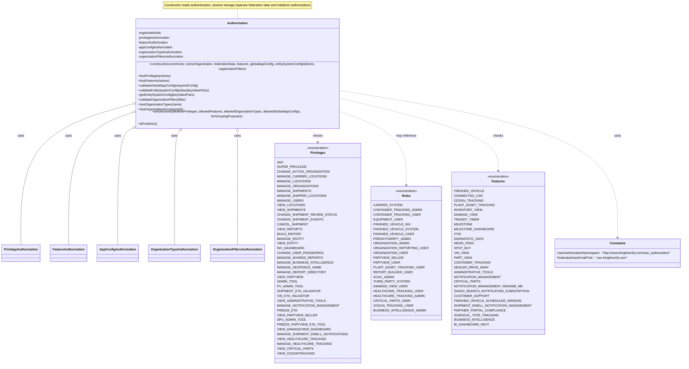

# Diagram: web/portal/src/modules/auth/Authorization.js

> Auto-generated by Obscura crawlers

## Mermaid

```mermaid
classDiagram
    class Authorization {
        +constructor(currentUser, activeOrganization, federationData, features, globalAppConfig, entitySystemConfigOptions, organizationFilters)
        -organizationIds
        -privilegeAuthorization
        -featureAuthorization
        -appConfigAuthorization
        -organizationTypeAuthorization
        -organizationFiltersAuthorzation
        +hasPrivileges(names)
        +hasFeatures(names)
        +validateGlobalAppConfig(requiredConfig)
        +validateEntitySystemConfigValue(keyValuePairs)
        +getEntitySystemConfig(keyValuePairs)
        +validateOrganizationFilters(filter)
        +hasOrganizationTypes(name)
        +hasOrganizationAccess(orgId)
        +isAuthorized(allowedPrivileges, allowedFeatures, allowedOrganizationTypes, allowedGlobalAppConfigs, forGroupingPurposes)
        +isFvAdmin()
    }

    class PrivilegeAuthorization
    class FeatureAuthorization
    class AppConfigAuthorization
    class OrganizationTypeAuthorization
    class OrganizationFiltersAuthorization

    Authorization o-- PrivilegeAuthorization : uses
    Authorization o-- FeatureAuthorization : uses
    Authorization o-- AppConfigAuthorization : uses
    Authorization o-- OrganizationTypeAuthorization : uses
    Authorization o-- OrganizationFiltersAuthorization : uses

    class Privileges <<enumeration>> {
        ANY
        SUPER_PRIVILEGE
        CHANGE_ACTIVE_ORGANIZATION
        MANAGE_CARRIER_LOCATIONS
        MANAGE_LOCATIONS
        MANAGE_ORGANIZATIONS
        MANAGE_SHIPMENTS
        MANAGE_SHIPPER_LOCATIONS
        MANAGE_USERS
        VIEW_LOCATIONS
        VIEW_SHIPMENTS
        CHANGE_SHIPMENT_REVIEW_STATUS
        CHANGE_SHIPMENT_EVENTS
        CANCEL_SHIPMENT
        VIEW_REPORTS
        BUILD_REPORT
        MANAGE_ENTITY
        VIEW_ENTITY
        INV_DASHBOARD
        CHANGE_USER_PASSWORDS
        MANAGE_SHARED_REPORTS
        MANAGE_BUSINESS_INTELLIGENCE
        MANAGE_GEOFENCE_NAME
        MANAGE_REPORT_DIRECTORY
        VIEW_PARTVIEW
        ADMIN_TOOL
        FV_ADMIN_TOOL
        SHIPMENT_ETA_VALIDATOR
        VIN_ETA_VALIDATOR
        VIEW_ADMINISTRATIVE_TOOLS
        MANAGE_NOTIFICATION_MANAGEMENT
        FREEZE_ETA
        VIEW_PARTVIEW_SELLER
        DPU_ADMIN_TOOL
        FREEZE_PARTVIEW_ETA_TOOL
        VIEW_DAMAGEVIEW_DASHBOARD
        MANAGE_SHIPMENT_DWELL_NOTIFICATIONS
        VIEW_HEALTHCARE_TRACKING
        MANAGE_HEALTHCARE_TRACKING
        VIEW_CRITICAL_PARTS
        VIEW_OCEANTRACKING
    }

    class Roles <<enumeration>> {
        CARRIER_SYSTEM
        CONTAINER_TRACKING_ADMIN
        CONTAINER_TRACKING_USER
        EQUIPMENT_USER
        FINISHED_VEHICLE_INV
        FINISHED_VEHICLE_SYSTEM
        FINISHED_VEHICLE_USER
        FREIGHTVERIFY_ADMIN
        ORGANIZATION_ADMIN
        ORGANIZATION_REPORTING_USER
        ORGANIZATION_USER
        PARTVIEW_SELLER
        PARTVIEW_USER
        PLANT_ASSET_TRACKING_USER
        REPORT_BUILDER_USER
        SCAC_ADMIN
        THIRD_PARTY_SYSTEM
        DAMAGE_VIEW_USER
        HEALTHCARE_TRACKING_USER
        HEALTHCARE_TRACKING_ADMIN
        CRITICAL_PARTS_USER
        OCEAN_TRACKING_USER
        BUSINESS_INTELLIGENCE_ADMIN
    }

    class Features <<enumeration>> {
        FINISHED_VEHICLE
        CONNECTED_CAR
        OCEAN_TRACKING
        PLANT_ASSET_TRACKING
        INVENTORY_VIEW
        DAMAGE_VIEW
        TRANSIT_TIMER
        MILESTONE
        MILESTONE_DASHBOARD
        ITSS
        DIAGNOSTIC_DATA
        NEWS_FEED
        SPOT_BUY
        VIN_VIEW
        PART_VIEW
        CONTAINER_TRACKING
        DEALER_DRIVE_AWAY
        ADMINISTRATIVE_TOOLS
        NOTIFICATION_MANAGEMENT
        CRITICAL_PARTS
        NOTIFICATION_MANAGEMENT_RENAME_ME
        SAVED_SEARCH_NOTIFICATION_SUBSCRIPTION
        CUSTOMER_SUPPORT
        FINISHED_VEHICLE_SCHEDULED_WINDOW
        SHIPMENT_DWELL_NOTIFICATION_MANAGEMENT
        PARTNER_PORTAL_COMPLIANCE
        SURGICAL_TOTE_TRACKING
        BUSINESS_INTELLIGENCE
        BI_DASHBOARD_NEXT
    }

    class Constants {
        UserAuthorizationNamespace : "http://www.freightverify.com/user_authorization"
        FederatedUserEmailTrail : ".sso.freightverify.com"
    }

    Authorization ..> Privileges : checks
    Authorization ..> Roles : may reference
    Authorization ..> Features : checks
    Authorization ..> Constants : uses

    note for Authorization "Constructor reads authentication, session storage,\nparses federation data and initializes authorizations"
```

> SVG rendering failed for this diagram.
