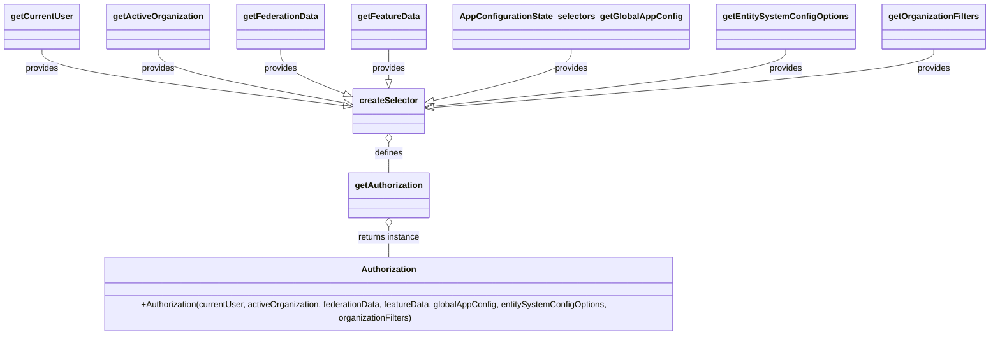

# Diagram: web/portal/src/modules/auth/AuthorizationSelectors.js


> Auto-generated by Obscura crawlers

## Diagram 1



### SVG

<svg id="container" width="1783.484375" xmlns="http://www.w3.org/2000/svg" class="classDiagram" height="616" viewBox="0 0 1783.484375 616" role="graphics-document document" aria-roledescription="class"><style>#container{font-family:"trebuchet ms",verdana,arial,sans-serif;font-size:16px;fill:#333;}@keyframes edge-animation-frame{from{stroke-dashoffset:0;}}@keyframes dash{to{stroke-dashoffset:0;}}#container .edge-animation-slow{stroke-dasharray:9,5!important;stroke-dashoffset:900;animation:dash 50s linear infinite;stroke-linecap:round;}#container .edge-animation-fast{stroke-dasharray:9,5!important;stroke-dashoffset:900;animation:dash 20s linear infinite;stroke-linecap:round;}#container .error-icon{fill:#552222;}#container .error-text{fill:#552222;stroke:#552222;}#container .edge-thickness-normal{stroke-width:1px;}#container .edge-thickness-thick{stroke-width:3.5px;}#container .edge-pattern-solid{stroke-dasharray:0;}#container .edge-thickness-invisible{stroke-width:0;fill:none;}#container .edge-pattern-dashed{stroke-dasharray:3;}#container .edge-pattern-dotted{stroke-dasharray:2;}#container .marker{fill:#333333;stroke:#333333;}#container .marker.cross{stroke:#333333;}#container svg{font-family:"trebuchet ms",verdana,arial,sans-serif;font-size:16px;}#container p{margin:0;}#container g.classGroup text{fill:#9370DB;stroke:none;font-family:"trebuchet ms",verdana,arial,sans-serif;font-size:10px;}#container g.classGroup text .title{font-weight:bolder;}#container .nodeLabel,#container .edgeLabel{color:#131300;}#container .edgeLabel .label rect{fill:#ECECFF;}#container .label text{fill:#131300;}#container .labelBkg{background:#ECECFF;}#container .edgeLabel .label span{background:#ECECFF;}#container .classTitle{font-weight:bolder;}#container .node rect,#container .node circle,#container .node ellipse,#container .node polygon,#container .node path{fill:#ECECFF;stroke:#9370DB;stroke-width:1px;}#container .divider{stroke:#9370DB;stroke-width:1;}#container g.clickable{cursor:pointer;}#container g.classGroup rect{fill:#ECECFF;stroke:#9370DB;}#container g.classGroup line{stroke:#9370DB;stroke-width:1;}#container .classLabel .box{stroke:none;stroke-width:0;fill:#ECECFF;opacity:0.5;}#container .classLabel .label{fill:#9370DB;font-size:10px;}#container .relation{stroke:#333333;stroke-width:1;fill:none;}#container .dashed-line{stroke-dasharray:3;}#container .dotted-line{stroke-dasharray:1 2;}#container #compositionStart,#container .composition{fill:#333333!important;stroke:#333333!important;stroke-width:1;}#container #compositionEnd,#container .composition{fill:#333333!important;stroke:#333333!important;stroke-width:1;}#container #dependencyStart,#container .dependency{fill:#333333!important;stroke:#333333!important;stroke-width:1;}#container #dependencyStart,#container .dependency{fill:#333333!important;stroke:#333333!important;stroke-width:1;}#container #extensionStart,#container .extension{fill:transparent!important;stroke:#333333!important;stroke-width:1;}#container #extensionEnd,#container .extension{fill:transparent!important;stroke:#333333!important;stroke-width:1;}#container #aggregationStart,#container .aggregation{fill:transparent!important;stroke:#333333!important;stroke-width:1;}#container #aggregationEnd,#container .aggregation{fill:transparent!important;stroke:#333333!important;stroke-width:1;}#container #lollipopStart,#container .lollipop{fill:#ECECFF!important;stroke:#333333!important;stroke-width:1;}#container #lollipopEnd,#container .lollipop{fill:#ECECFF!important;stroke:#333333!important;stroke-width:1;}#container .edgeTerminals{font-size:11px;line-height:initial;}#container .classTitleText{text-anchor:middle;font-size:18px;fill:#333;}#container .label-icon{display:inline-block;height:1em;overflow:visible;vertical-align:-0.125em;}#container .node .label-icon path{fill:currentColor;stroke:revert;stroke-width:revert;}#container :root{--mermaid-font-family:"trebuchet ms",verdana,arial,sans-serif;}</style><g><defs><marker id="container_class-aggregationStart" class="marker aggregation class" refX="18" refY="7" markerWidth="190" markerHeight="240" orient="auto"><path d="M 18,7 L9,13 L1,7 L9,1 Z"></path></marker></defs><defs><marker id="container_class-aggregationEnd" class="marker aggregation class" refX="1" refY="7" markerWidth="20" markerHeight="28" orient="auto"><path d="M 18,7 L9,13 L1,7 L9,1 Z"></path></marker></defs><defs><marker id="container_class-extensionStart" class="marker extension class" refX="18" refY="7" markerWidth="190" markerHeight="240" orient="auto"><path d="M 1,7 L18,13 V 1 Z"></path></marker></defs><defs><marker id="container_class-extensionEnd" class="marker extension class" refX="1" refY="7" markerWidth="20" markerHeight="28" orient="auto"><path d="M 1,1 V 13 L18,7 Z"></path></marker></defs><defs><marker id="container_class-compositionStart" class="marker composition class" refX="18" refY="7" markerWidth="190" markerHeight="240" orient="auto"><path d="M 18,7 L9,13 L1,7 L9,1 Z"></path></marker></defs><defs><marker id="container_class-compositionEnd" class="marker composition class" refX="1" refY="7" markerWidth="20" markerHeight="28" orient="auto"><path d="M 18,7 L9,13 L1,7 L9,1 Z"></path></marker></defs><defs><marker id="container_class-dependencyStart" class="marker dependency class" refX="6" refY="7" markerWidth="190" markerHeight="240" orient="auto"><path d="M 5,7 L9,13 L1,7 L9,1 Z"></path></marker></defs><defs><marker id="container_class-dependencyEnd" class="marker dependency class" refX="13" refY="7" markerWidth="20" markerHeight="28" orient="auto"><path d="M 18,7 L9,13 L14,7 L9,1 Z"></path></marker></defs><defs><marker id="container_class-lollipopStart" class="marker lollipop class" refX="13" refY="7" markerWidth="190" markerHeight="240" orient="auto"><circle stroke="black" fill="transparent" cx="7" cy="7" r="6"></circle></marker></defs><defs><marker id="container_class-lollipopEnd" class="marker lollipop class" refX="1" refY="7" markerWidth="190" markerHeight="240" orient="auto"><circle stroke="black" fill="transparent" cx="7" cy="7" r="6"></circle></marker></defs><g class="root"><g class="clusters"></g><g class="edgePaths"><path d="M75.742,92L75.742,98.167C75.742,104.333,75.742,116.667,167.169,134.281C258.597,151.894,441.451,174.789,532.878,186.236L624.306,197.683" id="id_getCurrentUser_createSelector_1" class="edge-thickness-normal edge-pattern-solid relation" style=";;;" data-edge="true" data-et="edge" data-id="id_getCurrentUser_createSelector_1" data-points="W3sieCI6NzUuNzQyMTg3NSwieSI6OTJ9LHsieCI6NzUuNzQyMTg3NSwieSI6MTI5fSx7IngiOjY0MS40MjE4NzUsInkiOjE5OS44MjY0MDU2NTYwNTUzOX1d" marker-end="url(#container_class-extensionEnd)"></path><path d="M286.266,92L286.266,98.167C286.266,104.333,286.266,116.667,342.633,133.425C399,150.183,511.734,171.365,568.101,181.957L624.469,192.548" id="id_getActiveOrganization_createSelector_2" class="edge-thickness-normal edge-pattern-solid relation" style=";;;" data-edge="true" data-et="edge" data-id="id_getActiveOrganization_createSelector_2" data-points="W3sieCI6Mjg2LjI2NTYyNSwieSI6OTJ9LHsieCI6Mjg2LjI2NTYyNSwieSI6MTI5fSx7IngiOjY0MS40MjE4NzUsInkiOjE5NS43MzM2ODUxNDkzOTc5Nn1d" marker-end="url(#container_class-extensionEnd)"></path><path d="M508.867,92L508.867,98.167C508.867,104.333,508.867,116.667,528.29,130.589C547.712,144.512,586.557,160.023,605.979,167.779L625.402,175.535" id="id_getFederationData_createSelector_3" class="edge-thickness-normal edge-pattern-solid relation" style=";;;" data-edge="true" data-et="edge" data-id="id_getFederationData_createSelector_3" data-points="W3sieCI6NTA4Ljg2NzE4NzUsInkiOjkyfSx7IngiOjUwOC44NjcxODc1LCJ5IjoxMjl9LHsieCI6NjQxLjQyMTg3NSwieSI6MTgxLjkzMTg0MDYxOTE5OTkzfV0=" marker-end="url(#container_class-extensionEnd)"></path><path d="M706.703,92L706.703,98.167C706.703,104.333,706.703,116.667,706.703,126.125C706.703,135.583,706.703,142.167,706.703,145.458L706.703,148.75" id="id_getFeatureData_createSelector_4" class="edge-thickness-normal edge-pattern-solid relation" style=";;;" data-edge="true" data-et="edge" data-id="id_getFeatureData_createSelector_4" data-points="W3sieCI6NzA2LjcwMzEyNSwieSI6OTJ9LHsieCI6NzA2LjcwMzEyNSwieSI6MTI5fSx7IngiOjcwNi43MDMxMjUsInkiOjE2Nn1d" marker-end="url(#container_class-extensionEnd)"></path><path d="M1033.742,92L1033.742,98.167C1033.742,104.333,1033.742,116.667,992.911,132.697C952.079,148.727,870.415,168.453,829.584,178.317L788.752,188.18" id="id_AppConfigurationState_selectors_getGlobalAppConfig_createSelector_5" class="edge-thickness-normal edge-pattern-solid relation" style=";;;" data-edge="true" data-et="edge" data-id="id_AppConfigurationState_selectors_getGlobalAppConfig_createSelector_5" data-points="W3sieCI6MTAzMy43NDIxODc1LCJ5Ijo5Mn0seyJ4IjoxMDMzLjc0MjE4NzUsInkiOjEyOX0seyJ4Ijo3NzEuOTg0Mzc1LCJ5IjoxOTIuMjMwNTcyNjA5MzV9XQ==" marker-end="url(#container_class-extensionEnd)"></path><path d="M1416.063,92L1416.063,98.167C1416.063,104.333,1416.063,116.667,1311.573,134.47C1207.084,152.273,998.106,175.547,893.617,187.184L789.128,198.82" id="id_getEntitySystemConfigOptions_createSelector_6" class="edge-thickness-normal edge-pattern-solid relation" style=";;;" data-edge="true" data-et="edge" data-id="id_getEntitySystemConfigOptions_createSelector_6" data-points="W3sieCI6MTQxNi4wNjI1LCJ5Ijo5Mn0seyJ4IjoxNDE2LjA2MjUsInkiOjEyOX0seyJ4Ijo3NzEuOTg0Mzc1LCJ5IjoyMDAuNzI5NzUxNzU2NjQ2NjR9XQ==" marker-end="url(#container_class-extensionEnd)"></path><path d="M1682.422,92L1682.422,98.167C1682.422,104.333,1682.422,116.667,1533.548,134.887C1384.674,153.107,1086.926,177.215,938.052,189.269L789.178,201.322" id="id_getOrganizationFilters_createSelector_7" class="edge-thickness-normal edge-pattern-solid relation" style=";;;" data-edge="true" data-et="edge" data-id="id_getOrganizationFilters_createSelector_7" data-points="W3sieCI6MTY4Mi40MjE4NzUsInkiOjkyfSx7IngiOjE2ODIuNDIxODc1LCJ5IjoxMjl9LHsieCI6NzcxLjk4NDM3NSwieSI6MjAyLjcxNDQ0MTI3NzI2MzU1fV0=" marker-end="url(#container_class-extensionEnd)"></path><path d="M706.703,267.25L706.703,270.542C706.703,273.833,706.703,280.417,706.703,289.875C706.703,299.333,706.703,311.667,706.703,317.833L706.703,324" id="id_createSelector_getAuthorization_8" class="edge-thickness-normal edge-pattern-solid relation" style=";;;" data-edge="true" data-et="edge" data-id="id_createSelector_getAuthorization_8" data-points="W3sieCI6NzA2LjcwMzEyNSwieSI6MjUwfSx7IngiOjcwNi43MDMxMjUsInkiOjI4N30seyJ4Ijo3MDYuNzAzMTI1LCJ5IjozMjR9XQ==" marker-start="url(#container_class-aggregationStart)"></path><path d="M706.703,425.25L706.703,428.542C706.703,431.833,706.703,438.417,706.703,447.875C706.703,457.333,706.703,469.667,706.703,475.833L706.703,482" id="id_getAuthorization_Authorization_9" class="edge-thickness-normal edge-pattern-solid relation" style=";;;" data-edge="true" data-et="edge" data-id="id_getAuthorization_Authorization_9" data-points="W3sieCI6NzA2LjcwMzEyNSwieSI6NDA4fSx7IngiOjcwNi43MDMxMjUsInkiOjQ0NX0seyJ4Ijo3MDYuNzAzMTI1LCJ5Ijo0ODJ9XQ==" marker-start="url(#container_class-aggregationStart)"></path></g><g class="edgeLabels"><g class="edgeLabel" transform="translate(75.7421875, 129)"><g class="label" data-id="id_getCurrentUser_createSelector_1" transform="translate(-31.3125, -12)"><foreignObject width="62.625" height="24"><div xmlns="http://www.w3.org/1999/xhtml" class="labelBkg" style="display: table-cell; white-space: nowrap; line-height: 1.5; max-width: 200px; text-align: center;"><span class="edgeLabel"><p>provides</p></span></div></foreignObject></g></g><g class="edgeLabel" transform="translate(286.265625, 129)"><g class="label" data-id="id_getActiveOrganization_createSelector_2" transform="translate(-31.3125, -12)"><foreignObject width="62.625" height="24"><div xmlns="http://www.w3.org/1999/xhtml" class="labelBkg" style="display: table-cell; white-space: nowrap; line-height: 1.5; max-width: 200px; text-align: center;"><span class="edgeLabel"><p>provides</p></span></div></foreignObject></g></g><g class="edgeLabel" transform="translate(508.8671875, 129)"><g class="label" data-id="id_getFederationData_createSelector_3" transform="translate(-31.3125, -12)"><foreignObject width="62.625" height="24"><div xmlns="http://www.w3.org/1999/xhtml" class="labelBkg" style="display: table-cell; white-space: nowrap; line-height: 1.5; max-width: 200px; text-align: center;"><span class="edgeLabel"><p>provides</p></span></div></foreignObject></g></g><g class="edgeLabel" transform="translate(706.703125, 129)"><g class="label" data-id="id_getFeatureData_createSelector_4" transform="translate(-31.3125, -12)"><foreignObject width="62.625" height="24"><div xmlns="http://www.w3.org/1999/xhtml" class="labelBkg" style="display: table-cell; white-space: nowrap; line-height: 1.5; max-width: 200px; text-align: center;"><span class="edgeLabel"><p>provides</p></span></div></foreignObject></g></g><g class="edgeLabel" transform="translate(1033.7421875, 129)"><g class="label" data-id="id_AppConfigurationState_selectors_getGlobalAppConfig_createSelector_5" transform="translate(-31.3125, -12)"><foreignObject width="62.625" height="24"><div xmlns="http://www.w3.org/1999/xhtml" class="labelBkg" style="display: table-cell; white-space: nowrap; line-height: 1.5; max-width: 200px; text-align: center;"><span class="edgeLabel"><p>provides</p></span></div></foreignObject></g></g><g class="edgeLabel" transform="translate(1416.0625, 129)"><g class="label" data-id="id_getEntitySystemConfigOptions_createSelector_6" transform="translate(-31.3125, -12)"><foreignObject width="62.625" height="24"><div xmlns="http://www.w3.org/1999/xhtml" class="labelBkg" style="display: table-cell; white-space: nowrap; line-height: 1.5; max-width: 200px; text-align: center;"><span class="edgeLabel"><p>provides</p></span></div></foreignObject></g></g><g class="edgeLabel" transform="translate(1682.421875, 129)"><g class="label" data-id="id_getOrganizationFilters_createSelector_7" transform="translate(-31.3125, -12)"><foreignObject width="62.625" height="24"><div xmlns="http://www.w3.org/1999/xhtml" class="labelBkg" style="display: table-cell; white-space: nowrap; line-height: 1.5; max-width: 200px; text-align: center;"><span class="edgeLabel"><p>provides</p></span></div></foreignObject></g></g><g class="edgeLabel" transform="translate(706.703125, 287)"><g class="label" data-id="id_createSelector_getAuthorization_8" transform="translate(-26.53125, -12)"><foreignObject width="53.0625" height="24"><div xmlns="http://www.w3.org/1999/xhtml" class="labelBkg" style="display: table-cell; white-space: nowrap; line-height: 1.5; max-width: 200px; text-align: center;"><span class="edgeLabel"><p>defines</p></span></div></foreignObject></g></g><g class="edgeLabel" transform="translate(706.703125, 445)"><g class="label" data-id="id_getAuthorization_Authorization_9" transform="translate(-58.9609375, -12)"><foreignObject width="117.921875" height="24"><div xmlns="http://www.w3.org/1999/xhtml" class="labelBkg" style="display: table-cell; white-space: nowrap; line-height: 1.5; max-width: 200px; text-align: center;"><span class="edgeLabel"><p>returns instance</p></span></div></foreignObject></g></g></g><g class="nodes"><g class="node default" id="classId-Authorization-0" transform="translate(706.703125, 545)"><g class="basic label-container"><path d="M-549.95703125 -63 L549.95703125 -63 L549.95703125 63 L-549.95703125 63" stroke="none" stroke-width="0" fill="#ECECFF" style=""></path><path d="M-549.95703125 -63 C-228.58470573590228 -63, 92.78761977819545 -63, 549.95703125 -63 M-549.95703125 -63 C-110.72587526582942 -63, 328.50528071834117 -63, 549.95703125 -63 M549.95703125 -63 C549.95703125 -27.94635997839284, 549.95703125 7.107280043214317, 549.95703125 63 M549.95703125 -63 C549.95703125 -15.640635217738271, 549.95703125 31.718729564523457, 549.95703125 63 M549.95703125 63 C246.1643993488256 63, -57.62823255234878 63, -549.95703125 63 M549.95703125 63 C265.92185507137265 63, -18.113321107254706 63, -549.95703125 63 M-549.95703125 63 C-549.95703125 22.56016089059242, -549.95703125 -17.879678218815158, -549.95703125 -63 M-549.95703125 63 C-549.95703125 27.25445053593895, -549.95703125 -8.4910989281221, -549.95703125 -63" stroke="#9370DB" stroke-width="1.3" fill="none" stroke-dasharray="0 0" style=""></path></g><g class="annotation-group text" transform="translate(0, -39)"></g><g class="label-group text" transform="translate(-49.7109375, -39)"><g class="label" style="font-weight: bolder" transform="translate(0,-12)"><foreignObject width="99.421875" height="24"><div xmlns="http://www.w3.org/1999/xhtml" style="display: table-cell; white-space: nowrap; line-height: 1.5; max-width: 148px; text-align: center;"><span class="nodeLabel markdown-node-label" style=""><p>Authorization</p></span></div></foreignObject></g></g><g class="members-group text" transform="translate(-537.95703125, 9)"></g><g class="methods-group text" transform="translate(-537.95703125, 39)"><g class="label" style="" transform="translate(0,-12)"><foreignObject width="1026.203125" height="24"><div xmlns="http://www.w3.org/1999/xhtml" style="display: table-cell; white-space: nowrap; line-height: 1.5; max-width: 1084px; text-align: center;"><span class="nodeLabel markdown-node-label" style=""><p>+Authorization(currentUser, activeOrganization, federationData, featureData, globalAppConfig, entitySystemConfigOptions, organizationFilters)</p></span></div></foreignObject></g></g><g class="divider" style=""><path d="M-549.95703125 -15 C-233.93703566139698 -15, 82.08295992720605 -15, 549.95703125 -15 M-549.95703125 -15 C-269.32035189545286 -15, 11.316327459094282 -15, 549.95703125 -15" stroke="#9370DB" stroke-width="1.3" fill="none" stroke-dasharray="0 0" style=""></path></g><g class="divider" style=""><path d="M-549.95703125 9 C-183.59686573354446 9, 182.76329978291108 9, 549.95703125 9 M-549.95703125 9 C-164.24554014625403 9, 221.46595095749194 9, 549.95703125 9" stroke="#9370DB" stroke-width="1.3" fill="none" stroke-dasharray="0 0" style=""></path></g></g><g class="node default" id="classId-getCurrentUser-1" transform="translate(75.7421875, 50)"><g class="basic label-container"><path d="M-67.7421875 -42 L67.7421875 -42 L67.7421875 42 L-67.7421875 42" stroke="none" stroke-width="0" fill="#ECECFF" style=""></path><path d="M-67.7421875 -42 C-25.81424304390356 -42, 16.11370141219288 -42, 67.7421875 -42 M-67.7421875 -42 C-26.59771912616651 -42, 14.54674924766698 -42, 67.7421875 -42 M67.7421875 -42 C67.7421875 -15.278058542900215, 67.7421875 11.44388291419957, 67.7421875 42 M67.7421875 -42 C67.7421875 -12.688072038706611, 67.7421875 16.623855922586777, 67.7421875 42 M67.7421875 42 C32.38545250530384 42, -2.9712824893923226 42, -67.7421875 42 M67.7421875 42 C25.879367774926827 42, -15.983451950146346 42, -67.7421875 42 M-67.7421875 42 C-67.7421875 21.576755958068304, -67.7421875 1.1535119161366083, -67.7421875 -42 M-67.7421875 42 C-67.7421875 8.693171791750459, -67.7421875 -24.613656416499083, -67.7421875 -42" stroke="#9370DB" stroke-width="1.3" fill="none" stroke-dasharray="0 0" style=""></path></g><g class="annotation-group text" transform="translate(0, -18)"></g><g class="label-group text" transform="translate(-55.7421875, -18)"><g class="label" style="font-weight: bolder" transform="translate(0,-12)"><foreignObject width="111.484375" height="24"><div xmlns="http://www.w3.org/1999/xhtml" style="display: table-cell; white-space: nowrap; line-height: 1.5; max-width: 160px; text-align: center;"><span class="nodeLabel markdown-node-label" style=""><p>getCurrentUser</p></span></div></foreignObject></g></g><g class="members-group text" transform="translate(-55.7421875, 30)"></g><g class="methods-group text" transform="translate(-55.7421875, 60)"></g><g class="divider" style=""><path d="M-67.7421875 6 C-40.07565235237891 6, -12.409117204757827 6, 67.7421875 6 M-67.7421875 6 C-40.428928959232906 6, -13.115670418465811 6, 67.7421875 6" stroke="#9370DB" stroke-width="1.3" fill="none" stroke-dasharray="0 0" style=""></path></g><g class="divider" style=""><path d="M-67.7421875 24 C-16.81617527063404 24, 34.10983695873192 24, 67.7421875 24 M-67.7421875 24 C-24.908283271481857 24, 17.925620957036287 24, 67.7421875 24" stroke="#9370DB" stroke-width="1.3" fill="none" stroke-dasharray="0 0" style=""></path></g></g><g class="node default" id="classId-getActiveOrganization-2" transform="translate(286.265625, 50)"><g class="basic label-container"><path d="M-92.78125 -42 L92.78125 -42 L92.78125 42 L-92.78125 42" stroke="none" stroke-width="0" fill="#ECECFF" style=""></path><path d="M-92.78125 -42 C-18.65174871965867 -42, 55.47775256068266 -42, 92.78125 -42 M-92.78125 -42 C-31.43945495169484 -42, 29.902340096610317 -42, 92.78125 -42 M92.78125 -42 C92.78125 -8.68038289891875, 92.78125 24.6392342021625, 92.78125 42 M92.78125 -42 C92.78125 -20.402724837772208, 92.78125 1.1945503244555837, 92.78125 42 M92.78125 42 C32.40891559531157 42, -27.96341880937686 42, -92.78125 42 M92.78125 42 C30.51192489147457 42, -31.757400217050858 42, -92.78125 42 M-92.78125 42 C-92.78125 14.274262056663929, -92.78125 -13.451475886672142, -92.78125 -42 M-92.78125 42 C-92.78125 17.30126742005377, -92.78125 -7.397465159892462, -92.78125 -42" stroke="#9370DB" stroke-width="1.3" fill="none" stroke-dasharray="0 0" style=""></path></g><g class="annotation-group text" transform="translate(0, -18)"></g><g class="label-group text" transform="translate(-80.78125, -18)"><g class="label" style="font-weight: bolder" transform="translate(0,-12)"><foreignObject width="161.5625" height="24"><div xmlns="http://www.w3.org/1999/xhtml" style="display: table-cell; white-space: nowrap; line-height: 1.5; max-width: 208px; text-align: center;"><span class="nodeLabel markdown-node-label" style=""><p>getActiveOrganization</p></span></div></foreignObject></g></g><g class="members-group text" transform="translate(-80.78125, 30)"></g><g class="methods-group text" transform="translate(-80.78125, 60)"></g><g class="divider" style=""><path d="M-92.78125 6 C-24.83986187390454 6, 43.10152625219092 6, 92.78125 6 M-92.78125 6 C-24.88317934866194 6, 43.01489130267612 6, 92.78125 6" stroke="#9370DB" stroke-width="1.3" fill="none" stroke-dasharray="0 0" style=""></path></g><g class="divider" style=""><path d="M-92.78125 24 C-39.01383080721953 24, 14.753588385560946 24, 92.78125 24 M-92.78125 24 C-27.179797061966923 24, 38.421655876066154 24, 92.78125 24" stroke="#9370DB" stroke-width="1.3" fill="none" stroke-dasharray="0 0" style=""></path></g></g><g class="node default" id="classId-getFederationData-3" transform="translate(508.8671875, 50)"><g class="basic label-container"><path d="M-79.8203125 -42 L79.8203125 -42 L79.8203125 42 L-79.8203125 42" stroke="none" stroke-width="0" fill="#ECECFF" style=""></path><path d="M-79.8203125 -42 C-23.122416261758218 -42, 33.575479976483564 -42, 79.8203125 -42 M-79.8203125 -42 C-40.13922491318568 -42, -0.4581373263713573 -42, 79.8203125 -42 M79.8203125 -42 C79.8203125 -21.126384928128648, 79.8203125 -0.2527698562572951, 79.8203125 42 M79.8203125 -42 C79.8203125 -25.059786989254476, 79.8203125 -8.119573978508953, 79.8203125 42 M79.8203125 42 C35.94029155787932 42, -7.93972938424136 42, -79.8203125 42 M79.8203125 42 C46.49340738423048 42, 13.16650226846096 42, -79.8203125 42 M-79.8203125 42 C-79.8203125 21.372591427516703, -79.8203125 0.7451828550334056, -79.8203125 -42 M-79.8203125 42 C-79.8203125 13.21042886643911, -79.8203125 -15.579142267121782, -79.8203125 -42" stroke="#9370DB" stroke-width="1.3" fill="none" stroke-dasharray="0 0" style=""></path></g><g class="annotation-group text" transform="translate(0, -18)"></g><g class="label-group text" transform="translate(-67.8203125, -18)"><g class="label" style="font-weight: bolder" transform="translate(0,-12)"><foreignObject width="135.640625" height="24"><div xmlns="http://www.w3.org/1999/xhtml" style="display: table-cell; white-space: nowrap; line-height: 1.5; max-width: 183px; text-align: center;"><span class="nodeLabel markdown-node-label" style=""><p>getFederationData</p></span></div></foreignObject></g></g><g class="members-group text" transform="translate(-67.8203125, 30)"></g><g class="methods-group text" transform="translate(-67.8203125, 60)"></g><g class="divider" style=""><path d="M-79.8203125 6 C-34.9516306206488 6, 9.9170512587024 6, 79.8203125 6 M-79.8203125 6 C-20.20003499107507 6, 39.42024251784986 6, 79.8203125 6" stroke="#9370DB" stroke-width="1.3" fill="none" stroke-dasharray="0 0" style=""></path></g><g class="divider" style=""><path d="M-79.8203125 24 C-30.245521778664227 24, 19.329268942671547 24, 79.8203125 24 M-79.8203125 24 C-43.872075016689145 24, -7.92383753337829 24, 79.8203125 24" stroke="#9370DB" stroke-width="1.3" fill="none" stroke-dasharray="0 0" style=""></path></g></g><g class="node default" id="classId-getFeatureData-4" transform="translate(706.703125, 50)"><g class="basic label-container"><path d="M-68.015625 -42 L68.015625 -42 L68.015625 42 L-68.015625 42" stroke="none" stroke-width="0" fill="#ECECFF" style=""></path><path d="M-68.015625 -42 C-23.87418688622691 -42, 20.267251227546183 -42, 68.015625 -42 M-68.015625 -42 C-29.185852281741127 -42, 9.643920436517746 -42, 68.015625 -42 M68.015625 -42 C68.015625 -11.92570507452647, 68.015625 18.14858985094706, 68.015625 42 M68.015625 -42 C68.015625 -10.689040351038763, 68.015625 20.621919297922474, 68.015625 42 M68.015625 42 C27.647933016202145 42, -12.719758967595709 42, -68.015625 42 M68.015625 42 C31.649789403803204 42, -4.716046192393591 42, -68.015625 42 M-68.015625 42 C-68.015625 24.280115370257118, -68.015625 6.5602307405142355, -68.015625 -42 M-68.015625 42 C-68.015625 24.240038917713708, -68.015625 6.480077835427416, -68.015625 -42" stroke="#9370DB" stroke-width="1.3" fill="none" stroke-dasharray="0 0" style=""></path></g><g class="annotation-group text" transform="translate(0, -18)"></g><g class="label-group text" transform="translate(-56.015625, -18)"><g class="label" style="font-weight: bolder" transform="translate(0,-12)"><foreignObject width="112.03125" height="24"><div xmlns="http://www.w3.org/1999/xhtml" style="display: table-cell; white-space: nowrap; line-height: 1.5; max-width: 160px; text-align: center;"><span class="nodeLabel markdown-node-label" style=""><p>getFeatureData</p></span></div></foreignObject></g></g><g class="members-group text" transform="translate(-56.015625, 30)"></g><g class="methods-group text" transform="translate(-56.015625, 60)"></g><g class="divider" style=""><path d="M-68.015625 6 C-21.642003951065064 6, 24.731617097869872 6, 68.015625 6 M-68.015625 6 C-30.854218630965 6, 6.307187738069999 6, 68.015625 6" stroke="#9370DB" stroke-width="1.3" fill="none" stroke-dasharray="0 0" style=""></path></g><g class="divider" style=""><path d="M-68.015625 24 C-15.52009008015964 24, 36.97544483968072 24, 68.015625 24 M-68.015625 24 C-26.209645924900776 24, 15.596333150198447 24, 68.015625 24" stroke="#9370DB" stroke-width="1.3" fill="none" stroke-dasharray="0 0" style=""></path></g></g><g class="node default" id="classId-AppConfigurationState_selectors_getGlobalAppConfig-5" transform="translate(1033.7421875, 50)"><g class="basic label-container"><path d="M-209.0234375 -42 L209.0234375 -42 L209.0234375 42 L-209.0234375 42" stroke="none" stroke-width="0" fill="#ECECFF" style=""></path><path d="M-209.0234375 -42 C-57.81524652691138 -42, 93.39294444617724 -42, 209.0234375 -42 M-209.0234375 -42 C-115.15163865822096 -42, -21.27983981644192 -42, 209.0234375 -42 M209.0234375 -42 C209.0234375 -15.91516037596552, 209.0234375 10.16967924806896, 209.0234375 42 M209.0234375 -42 C209.0234375 -18.255800934133465, 209.0234375 5.488398131733071, 209.0234375 42 M209.0234375 42 C57.78066914541273 42, -93.46209920917454 42, -209.0234375 42 M209.0234375 42 C100.06170243154554 42, -8.900032636908918 42, -209.0234375 42 M-209.0234375 42 C-209.0234375 13.070362436413504, -209.0234375 -15.859275127172992, -209.0234375 -42 M-209.0234375 42 C-209.0234375 19.13559335576045, -209.0234375 -3.7288132884791025, -209.0234375 -42" stroke="#9370DB" stroke-width="1.3" fill="none" stroke-dasharray="0 0" style=""></path></g><g class="annotation-group text" transform="translate(0, -18)"></g><g class="label-group text" transform="translate(-197.0234375, -18)"><g class="label" style="font-weight: bolder" transform="translate(0,-12)"><foreignObject width="394.046875" height="24"><div xmlns="http://www.w3.org/1999/xhtml" style="display: table-cell; white-space: nowrap; line-height: 1.5; max-width: 437px; text-align: center;"><span class="nodeLabel markdown-node-label" style=""><p>AppConfigurationState_selectors_getGlobalAppConfig</p></span></div></foreignObject></g></g><g class="members-group text" transform="translate(-197.0234375, 30)"></g><g class="methods-group text" transform="translate(-197.0234375, 60)"></g><g class="divider" style=""><path d="M-209.0234375 6 C-90.30058232631131 6, 28.42227284737737 6, 209.0234375 6 M-209.0234375 6 C-122.77005033614893 6, -36.516663172297854 6, 209.0234375 6" stroke="#9370DB" stroke-width="1.3" fill="none" stroke-dasharray="0 0" style=""></path></g><g class="divider" style=""><path d="M-209.0234375 24 C-63.839446802359674 24, 81.34454389528065 24, 209.0234375 24 M-209.0234375 24 C-76.2070686857333 24, 56.60930012853339 24, 209.0234375 24" stroke="#9370DB" stroke-width="1.3" fill="none" stroke-dasharray="0 0" style=""></path></g></g><g class="node default" id="classId-getEntitySystemConfigOptions-6" transform="translate(1416.0625, 50)"><g class="basic label-container"><path d="M-123.296875 -42 L123.296875 -42 L123.296875 42 L-123.296875 42" stroke="none" stroke-width="0" fill="#ECECFF" style=""></path><path d="M-123.296875 -42 C-46.95408529871459 -42, 29.388704402570824 -42, 123.296875 -42 M-123.296875 -42 C-26.415865300547026 -42, 70.46514439890595 -42, 123.296875 -42 M123.296875 -42 C123.296875 -17.70536105174243, 123.296875 6.589277896515142, 123.296875 42 M123.296875 -42 C123.296875 -24.21558422778271, 123.296875 -6.43116845556542, 123.296875 42 M123.296875 42 C31.358653030731148 42, -60.579568938537705 42, -123.296875 42 M123.296875 42 C31.797483161742107 42, -59.701908676515785 42, -123.296875 42 M-123.296875 42 C-123.296875 8.791353350717259, -123.296875 -24.417293298565482, -123.296875 -42 M-123.296875 42 C-123.296875 16.804069623136083, -123.296875 -8.391860753727833, -123.296875 -42" stroke="#9370DB" stroke-width="1.3" fill="none" stroke-dasharray="0 0" style=""></path></g><g class="annotation-group text" transform="translate(0, -18)"></g><g class="label-group text" transform="translate(-111.296875, -18)"><g class="label" style="font-weight: bolder" transform="translate(0,-12)"><foreignObject width="222.59375" height="24"><div xmlns="http://www.w3.org/1999/xhtml" style="display: table-cell; white-space: nowrap; line-height: 1.5; max-width: 268px; text-align: center;"><span class="nodeLabel markdown-node-label" style=""><p>getEntitySystemConfigOptions</p></span></div></foreignObject></g></g><g class="members-group text" transform="translate(-111.296875, 30)"></g><g class="methods-group text" transform="translate(-111.296875, 60)"></g><g class="divider" style=""><path d="M-123.296875 6 C-24.875774766760543 6, 73.54532546647891 6, 123.296875 6 M-123.296875 6 C-49.20836643494522 6, 24.88014213010956 6, 123.296875 6" stroke="#9370DB" stroke-width="1.3" fill="none" stroke-dasharray="0 0" style=""></path></g><g class="divider" style=""><path d="M-123.296875 24 C-58.97242320292128 24, 5.352028594157446 24, 123.296875 24 M-123.296875 24 C-71.84533664321054 24, -20.393798286421102 24, 123.296875 24" stroke="#9370DB" stroke-width="1.3" fill="none" stroke-dasharray="0 0" style=""></path></g></g><g class="node default" id="classId-getOrganizationFilters-7" transform="translate(1682.421875, 50)"><g class="basic label-container"><path d="M-93.0625 -42 L93.0625 -42 L93.0625 42 L-93.0625 42" stroke="none" stroke-width="0" fill="#ECECFF" style=""></path><path d="M-93.0625 -42 C-45.68014280860449 -42, 1.702214382791027 -42, 93.0625 -42 M-93.0625 -42 C-20.316486155403382 -42, 52.429527689193236 -42, 93.0625 -42 M93.0625 -42 C93.0625 -23.59408528991659, 93.0625 -5.1881705798331765, 93.0625 42 M93.0625 -42 C93.0625 -19.90986795201465, 93.0625 2.180264095970699, 93.0625 42 M93.0625 42 C44.9555798732003 42, -3.1513402535994004 42, -93.0625 42 M93.0625 42 C45.01240484313025 42, -3.0376903137395033 42, -93.0625 42 M-93.0625 42 C-93.0625 22.223285386153265, -93.0625 2.4465707723065293, -93.0625 -42 M-93.0625 42 C-93.0625 13.495837774709912, -93.0625 -15.008324450580176, -93.0625 -42" stroke="#9370DB" stroke-width="1.3" fill="none" stroke-dasharray="0 0" style=""></path></g><g class="annotation-group text" transform="translate(0, -18)"></g><g class="label-group text" transform="translate(-81.0625, -18)"><g class="label" style="font-weight: bolder" transform="translate(0,-12)"><foreignObject width="162.125" height="24"><div xmlns="http://www.w3.org/1999/xhtml" style="display: table-cell; white-space: nowrap; line-height: 1.5; max-width: 209px; text-align: center;"><span class="nodeLabel markdown-node-label" style=""><p>getOrganizationFilters</p></span></div></foreignObject></g></g><g class="members-group text" transform="translate(-81.0625, 30)"></g><g class="methods-group text" transform="translate(-81.0625, 60)"></g><g class="divider" style=""><path d="M-93.0625 6 C-47.20320232935924 6, -1.3439046587184862 6, 93.0625 6 M-93.0625 6 C-37.40614774874226 6, 18.250204502515487 6, 93.0625 6" stroke="#9370DB" stroke-width="1.3" fill="none" stroke-dasharray="0 0" style=""></path></g><g class="divider" style=""><path d="M-93.0625 24 C-36.952215195916736 24, 19.158069608166528 24, 93.0625 24 M-93.0625 24 C-50.866572834605954 24, -8.670645669211908 24, 93.0625 24" stroke="#9370DB" stroke-width="1.3" fill="none" stroke-dasharray="0 0" style=""></path></g></g><g class="node default" id="classId-createSelector-8" transform="translate(706.703125, 208)"><g class="basic label-container"><path d="M-65.28125 -42 L65.28125 -42 L65.28125 42 L-65.28125 42" stroke="none" stroke-width="0" fill="#ECECFF" style=""></path><path d="M-65.28125 -42 C-26.64307482539555 -42, 11.995100349208897 -42, 65.28125 -42 M-65.28125 -42 C-21.389499307535388 -42, 22.502251384929224 -42, 65.28125 -42 M65.28125 -42 C65.28125 -12.298767000332742, 65.28125 17.402465999334517, 65.28125 42 M65.28125 -42 C65.28125 -15.051584124106114, 65.28125 11.896831751787772, 65.28125 42 M65.28125 42 C29.99158605610529 42, -5.298077887789418 42, -65.28125 42 M65.28125 42 C35.835478085814515 42, 6.3897061716290295 42, -65.28125 42 M-65.28125 42 C-65.28125 20.938805331500504, -65.28125 -0.12238933699899235, -65.28125 -42 M-65.28125 42 C-65.28125 18.283205623730545, -65.28125 -5.43358875253891, -65.28125 -42" stroke="#9370DB" stroke-width="1.3" fill="none" stroke-dasharray="0 0" style=""></path></g><g class="annotation-group text" transform="translate(0, -18)"></g><g class="label-group text" transform="translate(-53.28125, -18)"><g class="label" style="font-weight: bolder" transform="translate(0,-12)"><foreignObject width="106.5625" height="24"><div xmlns="http://www.w3.org/1999/xhtml" style="display: table-cell; white-space: nowrap; line-height: 1.5; max-width: 155px; text-align: center;"><span class="nodeLabel markdown-node-label" style=""><p>createSelector</p></span></div></foreignObject></g></g><g class="members-group text" transform="translate(-53.28125, 30)"></g><g class="methods-group text" transform="translate(-53.28125, 60)"></g><g class="divider" style=""><path d="M-65.28125 6 C-30.01972538410873 6, 5.241799231782537 6, 65.28125 6 M-65.28125 6 C-24.945740334083382 6, 15.389769331833236 6, 65.28125 6" stroke="#9370DB" stroke-width="1.3" fill="none" stroke-dasharray="0 0" style=""></path></g><g class="divider" style=""><path d="M-65.28125 24 C-27.179979237665982 24, 10.921291524668035 24, 65.28125 24 M-65.28125 24 C-37.43833655421928 24, -9.595423108438567 24, 65.28125 24" stroke="#9370DB" stroke-width="1.3" fill="none" stroke-dasharray="0 0" style=""></path></g></g><g class="node default" id="classId-getAuthorization-9" transform="translate(706.703125, 366)"><g class="basic label-container"><path d="M-73.4453125 -42 L73.4453125 -42 L73.4453125 42 L-73.4453125 42" stroke="none" stroke-width="0" fill="#ECECFF" style=""></path><path d="M-73.4453125 -42 C-42.91860406375173 -42, -12.391895627503466 -42, 73.4453125 -42 M-73.4453125 -42 C-30.95309492994879 -42, 11.53912264010242 -42, 73.4453125 -42 M73.4453125 -42 C73.4453125 -23.03338142238486, 73.4453125 -4.06676284476972, 73.4453125 42 M73.4453125 -42 C73.4453125 -22.757020984151115, 73.4453125 -3.51404196830223, 73.4453125 42 M73.4453125 42 C25.963634613011074 42, -21.518043273977852 42, -73.4453125 42 M73.4453125 42 C37.196717034392464 42, 0.9481215687849271 42, -73.4453125 42 M-73.4453125 42 C-73.4453125 9.712534363705593, -73.4453125 -22.574931272588813, -73.4453125 -42 M-73.4453125 42 C-73.4453125 14.399540053408955, -73.4453125 -13.200919893182089, -73.4453125 -42" stroke="#9370DB" stroke-width="1.3" fill="none" stroke-dasharray="0 0" style=""></path></g><g class="annotation-group text" transform="translate(0, -18)"></g><g class="label-group text" transform="translate(-61.4453125, -18)"><g class="label" style="font-weight: bolder" transform="translate(0,-12)"><foreignObject width="122.890625" height="24"><div xmlns="http://www.w3.org/1999/xhtml" style="display: table-cell; white-space: nowrap; line-height: 1.5; max-width: 171px; text-align: center;"><span class="nodeLabel markdown-node-label" style=""><p>getAuthorization</p></span></div></foreignObject></g></g><g class="members-group text" transform="translate(-61.4453125, 30)"></g><g class="methods-group text" transform="translate(-61.4453125, 60)"></g><g class="divider" style=""><path d="M-73.4453125 6 C-42.50496803176819 6, -11.564623563536387 6, 73.4453125 6 M-73.4453125 6 C-28.995972181570835 6, 15.45336813685833 6, 73.4453125 6" stroke="#9370DB" stroke-width="1.3" fill="none" stroke-dasharray="0 0" style=""></path></g><g class="divider" style=""><path d="M-73.4453125 24 C-41.596873386558656 24, -9.748434273117311 24, 73.4453125 24 M-73.4453125 24 C-31.60736860907621 24, 10.230575281847578 24, 73.4453125 24" stroke="#9370DB" stroke-width="1.3" fill="none" stroke-dasharray="0 0" style=""></path></g></g></g></g></g></svg>

## Diagram 2

```mermaid
flowchart LR
  subgraph Selectors
    A[getCurrentUser]
    B[getActiveOrganization]
    C[getFederationData]
    D[getFeatureData]
    E[AppConfigurationState.selectors.getGlobalAppConfig]
    F[getEntitySystemConfigOptions]
    G[getOrganizationFilters]
  end
  H[createSelector] --> I[getAuthorization]
  A --> H
  B --> H
  C --> H
  D --> H
  E --> H
  F --> H
  G --> H
  I --> J[new Authorization(...) ]
  J -->|constructed with| A
  J -->|constructed with| B
  J -->|constructed with| C
  J -->|constructed with| D
  J -->|constructed with| E
  J -->|constructed with| F
  J -->|constructed with| G
```

> SVG rendering failed for this diagram.
