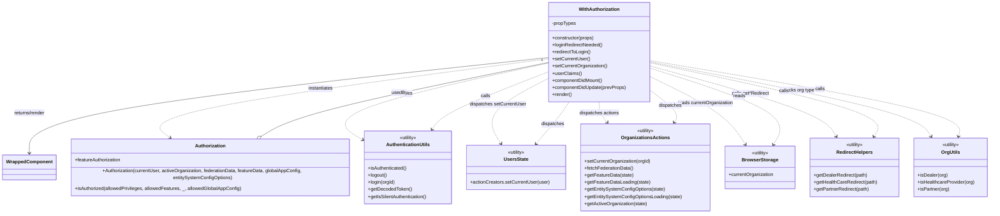

# Diagram: web/portal/src/modules/auth/AuthorizedComponentWithRedirect.js

> Auto-generated by Obscura crawlers

## Mermaid

```mermaid
classDiagram
class WithAuthorization {
  +constructor(props)
  +loginRedirectNeeded()
  +redirectToLogin()
  +setCurrentUser()
  +setCurrentOrganization()
  +userClaims()
  +componentDidMount()
  +componentDidUpdate(prevProps)
  +render()
  -propTypes
}
class WrappedComponent
class Authorization {
  +Authorization(currentUser, activeOrganization, federationData, featureData, globalAppConfig, entitySystemConfigOptions)
  +isAuthorized(allowedPrivileges, allowedFeatures, _, allowedGlobalAppConfig)
  +featureAuthorization
}
class AuthenticationUtils <<utility>> {
  +isAuthenticated()
  +logout()
  +login(orgId)
  +getDecodedToken()
  +getIsSilentAuthentication()
}
class UsersState <<utility>> {
  +actionCreators.setCurrentUser(user)
}
class OrganizationsActions <<utility>> {
  +setCurrentOrganization(orgId)
  +fetchFederationData()
  +getFeatureData(state)
  +getFeatureDataLoading(state)
  +getEntitySystemConfigOptions(state)
  +getEntitySystemConfigOptionsLoading(state)
  +getActiveOrganization(state)
}
class BrowserStorage <<utility>> {
  +currentOrganization
}
class RedirectHelpers <<utility>> {
  +getDealerRedirect(path)
  +getHealthCareRedirect(path)
  +getPartnerRedirect(path)
}
class OrgUtils <<utility>> {
  +isDealer(org)
  +isHealthcareProvider(org)
  +isPartner(org)
}
WithAuthorization --> WrappedComponent : returns/render
WithAuthorization ..> Authorization : instantiates
WithAuthorization ..> AuthenticationUtils : uses
WithAuthorization ..> UsersState : dispatches setCurrentUser
WithAuthorization ..> OrganizationsActions : dispatches actions
WithAuthorization ..> BrowserStorage : reads currentOrganization
WithAuthorization ..> RedirectHelpers : calls get*Redirect
WithAuthorization ..> OrgUtils : checks org type
Authorization o-- "1" WithAuthorization : usedBy
AuthenticationUtils <.. WithAuthorization : calls
UsersState <.. WithAuthorization : dispatches
OrganizationsActions <.. WithAuthorization : dispatches
BrowserStorage <.. WithAuthorization : reads
RedirectHelpers <.. WithAuthorization : calls
OrgUtils <.. WithAuthorization : calls
```

> SVG rendering failed for this diagram.
