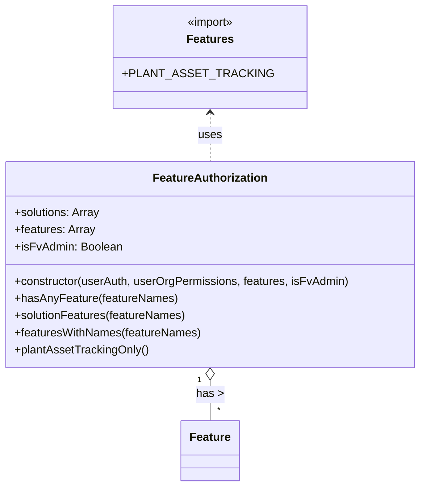

# Diagram: web/portal/src/modules/auth/FeatureAuthorization.js

> Auto-generated by Obscura crawlers

## Mermaid

### SVG

<svg id="container" width="585.859375" xmlns="http://www.w3.org/2000/svg" class="classDiagram" height="680" viewBox="0 0 585.859375 680" role="graphics-document document" aria-roledescription="class"><g><defs><marker id="container_class-aggregationStart" class="marker aggregation class" refX="18" refY="7" markerWidth="190" markerHeight="240" orient="auto"><path d="M 18,7 L9,13 L1,7 L9,1 Z"></path></marker></defs><defs><marker id="container_class-aggregationEnd" class="marker aggregation class" refX="1" refY="7" markerWidth="20" markerHeight="28" orient="auto"><path d="M 18,7 L9,13 L1,7 L9,1 Z"></path></marker></defs><defs><marker id="container_class-extensionStart" class="marker extension class" refX="18" refY="7" markerWidth="190" markerHeight="240" orient="auto"><path d="M 1,7 L18,13 V 1 Z"></path></marker></defs><defs><marker id="container_class-extensionEnd" class="marker extension class" refX="1" refY="7" markerWidth="20" markerHeight="28" orient="auto"><path d="M 1,1 V 13 L18,7 Z"></path></marker></defs><defs><marker id="container_class-compositionStart" class="marker composition class" refX="18" refY="7" markerWidth="190" markerHeight="240" orient="auto"><path d="M 18,7 L9,13 L1,7 L9,1 Z"></path></marker></defs><defs><marker id="container_class-compositionEnd" class="marker composition class" refX="1" refY="7" markerWidth="20" markerHeight="28" orient="auto"><path d="M 18,7 L9,13 L1,7 L9,1 Z"></path></marker></defs><defs><marker id="container_class-dependencyStart" class="marker dependency class" refX="6" refY="7" markerWidth="190" markerHeight="240" orient="auto"><path d="M 5,7 L9,13 L1,7 L9,1 Z"></path></marker></defs><defs><marker id="container_class-dependencyEnd" class="marker dependency class" refX="13" refY="7" markerWidth="20" markerHeight="28" orient="auto"><path d="M 18,7 L9,13 L14,7 L9,1 Z"></path></marker></defs><defs><marker id="container_class-lollipopStart" class="marker lollipop class" refX="13" refY="7" markerWidth="190" markerHeight="240" orient="auto"><circle stroke="black" fill="transparent" cx="7" cy="7" r="6"></circle></marker></defs><defs><marker id="container_class-lollipopEnd" class="marker lollipop class" refX="1" refY="7" markerWidth="190" markerHeight="240" orient="auto"><circle stroke="black" fill="transparent" cx="7" cy="7" r="6"></circle></marker></defs><g class="root"><g class="clusters"></g><g class="edgePaths"><path d="M292.93,158L292.93,163.167C292.93,168.333,292.93,178.667,292.93,190C292.93,201.333,292.93,213.667,292.93,219.833L292.93,226" id="id_Features_FeatureAuthorization_1" class="edge-thickness-normal edge-pattern-dashed relation" style=";;;" data-edge="true" data-et="edge" data-id="id_Features_FeatureAuthorization_1" data-points="W3sieCI6MjkyLjkyOTY4NzUsInkiOjE1Mn0seyJ4IjoyOTIuOTI5Njg3NSwieSI6MTg5fSx7IngiOjI5Mi45Mjk2ODc1LCJ5IjoyMjZ9XQ==" marker-start="url(#container_class-dependencyStart)"></path><path d="M292.93,531.25L292.93,534.542C292.93,537.833,292.93,544.417,292.93,553.875C292.93,563.333,292.93,575.667,292.93,581.833L292.93,588" id="id_FeatureAuthorization_Feature_2" class="edge-thickness-normal edge-pattern-solid relation" style=";;;" data-edge="true" data-et="edge" data-id="id_FeatureAuthorization_Feature_2" data-points="W3sieCI6MjkyLjkyOTY4NzUsInkiOjUxNH0seyJ4IjoyOTIuOTI5Njg3NSwieSI6NTUxfSx7IngiOjI5Mi45Mjk2ODc1LCJ5Ijo1ODh9XQ==" marker-start="url(#container_class-aggregationStart)"></path></g><g class="edgeLabels"><g class="edgeLabel" transform="translate(292.9296875, 189)"><g class="label" data-id="id_Features_FeatureAuthorization_1" transform="translate(-16.4921875, -12)"><foreignObject width="32.984375" height="24">

uses

</foreignObject></g></g><g class="edgeLabel" transform="translate(292.9296875, 551)"><g class="label" data-id="id_FeatureAuthorization_Feature_2" transform="translate(-18.8203125, -12)"><foreignObject width="37.640625" height="24">

has &gt;

</foreignObject></g></g><g class="edgeTerminals" transform="translate(277.92968875, 531.5000010714285)"><g class="inner" transform="translate(0, 0)"><foreignObject style="width: 9px; height: 12px;">
1
</foreignObject></g></g><g class="edgeTerminals" transform="translate(302.9296887499999, 565.5000010714285)"><g class="inner" transform="translate(0, 0)"></g><foreignObject style="width: 9px; height: 12px;">
*
</foreignObject></g></g><g class="nodes"><g class="node default" id="classId-FeatureAuthorization-0" transform="translate(292.9296875, 370)"><g class="basic label-container"><path d="M-284.9296875 -144 L284.9296875 -144 L284.9296875 144 L-284.9296875 144" stroke="none" stroke-width="0" fill="#ECECFF" style=""></path><path d="M-284.9296875 -144 C-147.03156489659656 -144, -9.133442293193127 -144, 284.9296875 -144 M-284.9296875 -144 C-124.59830373419953 -144, 35.733080031600934 -144, 284.9296875 -144 M284.9296875 -144 C284.9296875 -42.50187010451802, 284.9296875 58.99625979096396, 284.9296875 144 M284.9296875 -144 C284.9296875 -55.80647055891069, 284.9296875 32.38705888217862, 284.9296875 144 M284.9296875 144 C150.25919606383192 144, 15.588704627663844 144, -284.9296875 144 M284.9296875 144 C128.11298399559334 144, -28.70371950881332 144, -284.9296875 144 M-284.9296875 144 C-284.9296875 68.30691822054868, -284.9296875 -7.386163558902638, -284.9296875 -144 M-284.9296875 144 C-284.9296875 78.10287722690171, -284.9296875 12.205754453803422, -284.9296875 -144" stroke="#9370DB" stroke-width="1.3" fill="none" stroke-dasharray="0 0" style=""></path></g><g class="annotation-group text" transform="translate(0, -120)"></g><g class="label-group text" transform="translate(-77.09375, -120)"><g class="label" style="font-weight: bolder" transform="translate(0,-12)"><foreignObject width="154.1875" height="24">

FeatureAuthorization

</foreignObject></g></g><g class="members-group text" transform="translate(-272.9296875, -72)"><g class="label" style="" transform="translate(0,-12)"><foreignObject width="120.65625" height="24">

+solutions: Array

</foreignObject></g><g class="label" style="" transform="translate(0,12)"><foreignObject width="112.5625" height="24">

+features: Array

</foreignObject></g><g class="label" style="" transform="translate(0,36)"><foreignObject width="149.21875" height="24">

+isFvAdmin: Boolean

</foreignObject></g></g><g class="methods-group text" transform="translate(-272.9296875, 24)"><g class="label" style="" transform="translate(0,-12)"><foreignObject width="468.765625" height="24">

+constructor(userAuth, userOrgPermissions, features, isFvAdmin)

</foreignObject></g><g class="label" style="" transform="translate(0,12)"><foreignObject width="225.625" height="24">

+hasAnyFeature(featureNames)

</foreignObject></g><g class="label" style="" transform="translate(0,36)"><foreignObject width="241.21875" height="24">

+solutionFeatures(featureNames)

</foreignObject></g><g class="label" style="" transform="translate(0,60)"><foreignObject width="261.484375" height="24">

+featuresWithNames(featureNames)

</foreignObject></g><g class="label" style="" transform="translate(0,84)"><foreignObject width="187.78125" height="24">

+plantAssetTrackingOnly()

</foreignObject></g></g><g class="divider" style=""><path d="M-284.9296875 -96 C-57.217474821203666 -96, 170.49473785759267 -96, 284.9296875 -96 M-284.9296875 -96 C-104.11105978003454 -96, 76.70756793993093 -96, 284.9296875 -96" stroke="#9370DB" stroke-width="1.3" fill="none" stroke-dasharray="0 0" style=""></path></g><g class="divider" style=""><path d="M-284.9296875 0 C-109.42184996052339 0, 66.08598757895322 0, 284.9296875 0 M-284.9296875 0 C-64.24512917997208 0, 156.43942914005584 0, 284.9296875 0" stroke="#9370DB" stroke-width="1.3" fill="none" stroke-dasharray="0 0" style=""></path></g></g><g class="node default" id="classId-Features-1" transform="translate(292.9296875, 80)"><g class="basic label-container"><path d="M-119.921875 -72 L119.921875 -72 L119.921875 72 L-119.921875 72" stroke="none" stroke-width="0" fill="#ECECFF" style=""></path><path d="M-119.921875 -72 C-47.311802951413625 -72, 25.29826909717275 -72, 119.921875 -72 M-119.921875 -72 C-58.033716662098776 -72, 3.8544416758024482 -72, 119.921875 -72 M119.921875 -72 C119.921875 -27.6375612537148, 119.921875 16.7248774925704, 119.921875 72 M119.921875 -72 C119.921875 -31.754657300912257, 119.921875 8.490685398175486, 119.921875 72 M119.921875 72 C45.89816048631485 72, -28.1255540273703 72, -119.921875 72 M119.921875 72 C46.3479419906715 72, -27.225991018656998 72, -119.921875 72 M-119.921875 72 C-119.921875 23.997928883913758, -119.921875 -24.004142232172484, -119.921875 -72 M-119.921875 72 C-119.921875 15.427493225448096, -119.921875 -41.14501354910381, -119.921875 -72" stroke="#9370DB" stroke-width="1.3" fill="none" stroke-dasharray="0 0" style=""></path></g><g class="annotation-group text" transform="translate(-33.640625, -48)"><g class="label" style="" transform="translate(0,-12)"><foreignObject width="67.28125" height="24">

«import»

</foreignObject></g></g><g class="label-group text" transform="translate(-31.25, -24)"><g class="label" style="font-weight: bolder" transform="translate(0,-12)"><foreignObject width="62.5" height="24">

Features

</foreignObject></g></g><g class="members-group text" transform="translate(-107.921875, 24)"><g class="label" style="" transform="translate(0,-12)"><foreignObject width="182.203125" height="24">

+PLANT_ASSET_TRACKING

</foreignObject></g></g><g class="methods-group text" transform="translate(-107.921875, 72)"></g><g class="divider" style=""><path d="M-119.921875 0 C-62.34368342170111 0, -4.765491843402216 0, 119.921875 0 M-119.921875 0 C-57.511138328390395 0, 4.8995983432192105 0, 119.921875 0" stroke="#9370DB" stroke-width="1.3" fill="none" stroke-dasharray="0 0" style=""></path></g><g class="divider" style=""><path d="M-119.921875 48 C-39.002887293544134 48, 41.91610041291173 48, 119.921875 48 M-119.921875 48 C-41.77969124998309 48, 36.362492500033824 48, 119.921875 48" stroke="#9370DB" stroke-width="1.3" fill="none" stroke-dasharray="0 0" style=""></path></g></g><g class="node default" id="classId-Feature-2" transform="translate(292.9296875, 630)"><g class="basic label-container"><path d="M-39.390625 -42 L39.390625 -42 L39.390625 42 L-39.390625 42" stroke="none" stroke-width="0" fill="#ECECFF" style=""></path><path d="M-39.390625 -42 C-23.01806203990322 -42, -6.6454990798064415 -42, 39.390625 -42 M-39.390625 -42 C-15.338489407923813 -42, 8.713646184152374 -42, 39.390625 -42 M39.390625 -42 C39.390625 -21.05736402096758, 39.390625 -0.11472804193515884, 39.390625 42 M39.390625 -42 C39.390625 -18.740788520330813, 39.390625 4.518422959338373, 39.390625 42 M39.390625 42 C8.76374771986574 42, -21.86312956026852 42, -39.390625 42 M39.390625 42 C18.87059931005848 42, -1.6494263798830389 42, -39.390625 42 M-39.390625 42 C-39.390625 12.691946189291436, -39.390625 -16.61610762141713, -39.390625 -42 M-39.390625 42 C-39.390625 22.61619442966088, -39.390625 3.232388859321759, -39.390625 -42" stroke="#9370DB" stroke-width="1.3" fill="none" stroke-dasharray="0 0" style=""></path></g><g class="annotation-group text" transform="translate(0, -18)"></g><g class="label-group text" transform="translate(-27.390625, -18)"><g class="label" style="font-weight: bolder" transform="translate(0,-12)"><foreignObject width="54.78125" height="24">

Feature

</foreignObject></g></g><g class="members-group text" transform="translate(-27.390625, 30)"></g><g class="methods-group text" transform="translate(-27.390625, 60)"></g><g class="divider" style=""><path d="M-39.390625 6 C-14.94939484216092 6, 9.49183531567816 6, 39.390625 6 M-39.390625 6 C-21.203854781797386 6, -3.0170845635947714 6, 39.390625 6" stroke="#9370DB" stroke-width="1.3" fill="none" stroke-dasharray="0 0" style=""></path></g><g class="divider" style=""><path d="M-39.390625 24 C-21.911506571236654 24, -4.432388142473307 24, 39.390625 24 M-39.390625 24 C-14.239702183603313 24, 10.911220632793373 24, 39.390625 24" stroke="#9370DB" stroke-width="1.3" fill="none" stroke-dasharray="0 0" style=""></path></g></g></g></g></g></svg>
