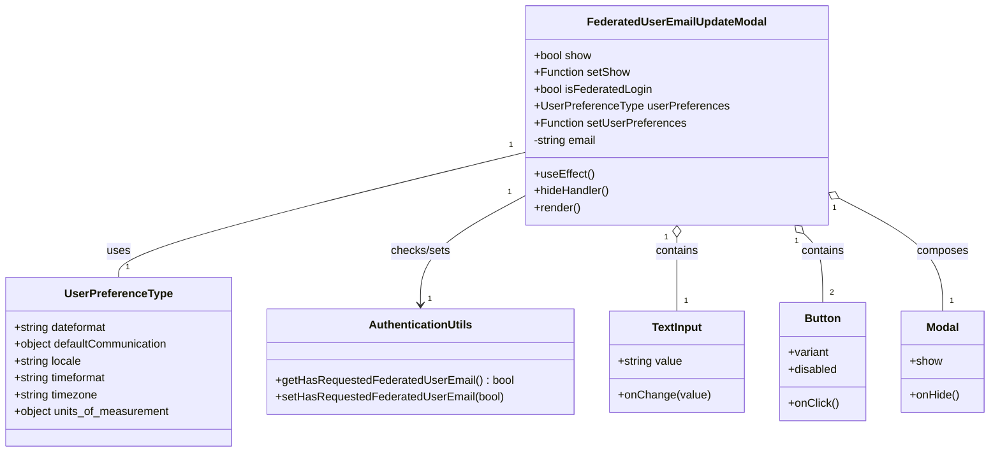

# Diagram: web/portal/src/modules/auth/FederatedUserPreferenceUpdateModal.tsx


> Auto-generated by Obscura crawlers

## Diagram 1



### SVG

<svg id="container" width="1392.3671875" xmlns="http://www.w3.org/2000/svg" class="classDiagram" height="642" viewBox="0 0 1392.3671875 642" role="graphics-document document" aria-roledescription="class"><style>#container{font-family:"trebuchet ms",verdana,arial,sans-serif;font-size:16px;fill:#333;}@keyframes edge-animation-frame{from{stroke-dashoffset:0;}}@keyframes dash{to{stroke-dashoffset:0;}}#container .edge-animation-slow{stroke-dasharray:9,5!important;stroke-dashoffset:900;animation:dash 50s linear infinite;stroke-linecap:round;}#container .edge-animation-fast{stroke-dasharray:9,5!important;stroke-dashoffset:900;animation:dash 20s linear infinite;stroke-linecap:round;}#container .error-icon{fill:#552222;}#container .error-text{fill:#552222;stroke:#552222;}#container .edge-thickness-normal{stroke-width:1px;}#container .edge-thickness-thick{stroke-width:3.5px;}#container .edge-pattern-solid{stroke-dasharray:0;}#container .edge-thickness-invisible{stroke-width:0;fill:none;}#container .edge-pattern-dashed{stroke-dasharray:3;}#container .edge-pattern-dotted{stroke-dasharray:2;}#container .marker{fill:#333333;stroke:#333333;}#container .marker.cross{stroke:#333333;}#container svg{font-family:"trebuchet ms",verdana,arial,sans-serif;font-size:16px;}#container p{margin:0;}#container g.classGroup text{fill:#9370DB;stroke:none;font-family:"trebuchet ms",verdana,arial,sans-serif;font-size:10px;}#container g.classGroup text .title{font-weight:bolder;}#container .nodeLabel,#container .edgeLabel{color:#131300;}#container .edgeLabel .label rect{fill:#ECECFF;}#container .label text{fill:#131300;}#container .labelBkg{background:#ECECFF;}#container .edgeLabel .label span{background:#ECECFF;}#container .classTitle{font-weight:bolder;}#container .node rect,#container .node circle,#container .node ellipse,#container .node polygon,#container .node path{fill:#ECECFF;stroke:#9370DB;stroke-width:1px;}#container .divider{stroke:#9370DB;stroke-width:1;}#container g.clickable{cursor:pointer;}#container g.classGroup rect{fill:#ECECFF;stroke:#9370DB;}#container g.classGroup line{stroke:#9370DB;stroke-width:1;}#container .classLabel .box{stroke:none;stroke-width:0;fill:#ECECFF;opacity:0.5;}#container .classLabel .label{fill:#9370DB;font-size:10px;}#container .relation{stroke:#333333;stroke-width:1;fill:none;}#container .dashed-line{stroke-dasharray:3;}#container .dotted-line{stroke-dasharray:1 2;}#container #compositionStart,#container .composition{fill:#333333!important;stroke:#333333!important;stroke-width:1;}#container #compositionEnd,#container .composition{fill:#333333!important;stroke:#333333!important;stroke-width:1;}#container #dependencyStart,#container .dependency{fill:#333333!important;stroke:#333333!important;stroke-width:1;}#container #dependencyStart,#container .dependency{fill:#333333!important;stroke:#333333!important;stroke-width:1;}#container #extensionStart,#container .extension{fill:transparent!important;stroke:#333333!important;stroke-width:1;}#container #extensionEnd,#container .extension{fill:transparent!important;stroke:#333333!important;stroke-width:1;}#container #aggregationStart,#container .aggregation{fill:transparent!important;stroke:#333333!important;stroke-width:1;}#container #aggregationEnd,#container .aggregation{fill:transparent!important;stroke:#333333!important;stroke-width:1;}#container #lollipopStart,#container .lollipop{fill:#ECECFF!important;stroke:#333333!important;stroke-width:1;}#container #lollipopEnd,#container .lollipop{fill:#ECECFF!important;stroke:#333333!important;stroke-width:1;}#container .edgeTerminals{font-size:11px;line-height:initial;}#container .classTitleText{text-anchor:middle;font-size:18px;fill:#333;}#container .label-icon{display:inline-block;height:1em;overflow:visible;vertical-align:-0.125em;}#container .node .label-icon path{fill:currentColor;stroke:revert;stroke-width:revert;}#container :root{--mermaid-font-family:"trebuchet ms",verdana,arial,sans-serif;}</style><g><defs><marker id="container_class-aggregationStart" class="marker aggregation class" refX="18" refY="7" markerWidth="190" markerHeight="240" orient="auto"><path d="M 18,7 L9,13 L1,7 L9,1 Z"></path></marker></defs><defs><marker id="container_class-aggregationEnd" class="marker aggregation class" refX="1" refY="7" markerWidth="20" markerHeight="28" orient="auto"><path d="M 18,7 L9,13 L1,7 L9,1 Z"></path></marker></defs><defs><marker id="container_class-extensionStart" class="marker extension class" refX="18" refY="7" markerWidth="190" markerHeight="240" orient="auto"><path d="M 1,7 L18,13 V 1 Z"></path></marker></defs><defs><marker id="container_class-extensionEnd" class="marker extension class" refX="1" refY="7" markerWidth="20" markerHeight="28" orient="auto"><path d="M 1,1 V 13 L18,7 Z"></path></marker></defs><defs><marker id="container_class-compositionStart" class="marker composition class" refX="18" refY="7" markerWidth="190" markerHeight="240" orient="auto"><path d="M 18,7 L9,13 L1,7 L9,1 Z"></path></marker></defs><defs><marker id="container_class-compositionEnd" class="marker composition class" refX="1" refY="7" markerWidth="20" markerHeight="28" orient="auto"><path d="M 18,7 L9,13 L1,7 L9,1 Z"></path></marker></defs><defs><marker id="container_class-dependencyStart" class="marker dependency class" refX="6" refY="7" markerWidth="190" markerHeight="240" orient="auto"><path d="M 5,7 L9,13 L1,7 L9,1 Z"></path></marker></defs><defs><marker id="container_class-dependencyEnd" class="marker dependency class" refX="13" refY="7" markerWidth="20" markerHeight="28" orient="auto"><path d="M 18,7 L9,13 L14,7 L9,1 Z"></path></marker></defs><defs><marker id="container_class-lollipopStart" class="marker lollipop class" refX="13" refY="7" markerWidth="190" markerHeight="240" orient="auto"><circle stroke="black" fill="transparent" cx="7" cy="7" r="6"></circle></marker></defs><defs><marker id="container_class-lollipopEnd" class="marker lollipop class" refX="1" refY="7" markerWidth="190" markerHeight="240" orient="auto"><circle stroke="black" fill="transparent" cx="7" cy="7" r="6"></circle></marker></defs><g class="root"><g class="clusters"></g><g class="edgePaths"><path d="M744.234,215.46L648.3,239.05C552.366,262.64,360.497,309.82,264.563,339.577C168.629,369.333,168.629,381.667,168.629,387.833L168.629,394" id="id_FederatedUserEmailUpdateModal_UserPreferenceType_1" class="edge-thickness-normal edge-pattern-solid relation" style=";;;" data-edge="true" data-et="edge" data-id="id_FederatedUserEmailUpdateModal_UserPreferenceType_1" data-points="W3sieCI6NzQ0LjIzNDM3NSwieSI6MjE1LjQ1OTg3ODg2MjY4Mjg0fSx7IngiOjE2OC42Mjg5MDYyNSwieSI6MzU3fSx7IngiOjE2OC42Mjg5MDYyNSwieSI6Mzk0fV0="></path><path d="M744.234,276.484L719.268,289.904C694.302,303.323,644.37,330.161,619.404,356.247C594.438,382.333,594.438,407.667,594.438,420.333L594.438,433" id="id_FederatedUserEmailUpdateModal_AuthenticationUtils_2" class="edge-thickness-normal edge-pattern-solid relation" style=";;;" data-edge="true" data-et="edge" data-id="id_FederatedUserEmailUpdateModal_AuthenticationUtils_2" data-points="W3sieCI6NzQ0LjIzNDM3NSwieSI6Mjc2LjQ4NDMwMTkwODEzOTV9LHsieCI6NTk0LjQzNzUsInkiOjM1N30seyJ4Ijo1OTQuNDM3NSwieSI6NDM5fV0=" marker-end="url(#container_class-dependencyEnd)"></path><path d="M953.508,337.25L953.508,340.542C953.508,343.833,953.508,350.417,953.508,367.875C953.508,385.333,953.508,413.667,953.508,427.833L953.508,442" id="id_FederatedUserEmailUpdateModal_TextInput_3" class="edge-thickness-normal edge-pattern-solid relation" style=";;;" data-edge="true" data-et="edge" data-id="id_FederatedUserEmailUpdateModal_TextInput_3" data-points="W3sieCI6OTUzLjUwNzgxMjUsInkiOjMyMH0seyJ4Ijo5NTMuNTA3ODEyNSwieSI6MzU3fSx7IngiOjk1My41MDc4MTI1LCJ5Ijo0NDJ9XQ==" marker-start="url(#container_class-aggregationStart)"></path><path d="M1130.737,331.862L1135.16,336.052C1139.584,340.241,1148.43,348.621,1152.854,364.977C1157.277,381.333,1157.277,405.667,1157.277,417.833L1157.277,430" id="id_FederatedUserEmailUpdateModal_Button_4" class="edge-thickness-normal edge-pattern-solid relation" style=";;;" data-edge="true" data-et="edge" data-id="id_FederatedUserEmailUpdateModal_Button_4" data-points="W3sieCI6MTExOC4yMTI3MTg1ODgwODMsInkiOjMyMH0seyJ4IjoxMTU3LjI3NzM0Mzc1LCJ5IjozNTd9LHsieCI6MTE1Ny4yNzczNDM3NSwieSI6NDMwfV0=" marker-start="url(#container_class-aggregationStart)"></path><path d="M1178.095,280.44L1202.706,293.2C1227.317,305.96,1276.54,331.48,1301.151,358.407C1325.762,385.333,1325.762,413.667,1325.762,427.833L1325.762,442" id="id_FederatedUserEmailUpdateModal_Modal_5" class="edge-thickness-normal edge-pattern-solid relation" style=";;;" data-edge="true" data-et="edge" data-id="id_FederatedUserEmailUpdateModal_Modal_5" data-points="W3sieCI6MTE2Mi43ODEyNSwieSI6MjcyLjUwMDYwMzM3NjgxMTQ1fSx7IngiOjEzMjUuNzYxNzE4NzUsInkiOjM1N30seyJ4IjoxMzI1Ljc2MTcxODc1LCJ5Ijo0NDJ9XQ==" marker-start="url(#container_class-aggregationStart)"></path></g><g class="edgeLabels"><g class="edgeLabel" transform="translate(168.62890625, 357)"><g class="label" data-id="id_FederatedUserEmailUpdateModal_UserPreferenceType_1" transform="translate(-16.4921875, -12)"><foreignObject width="32.984375" height="24"><div xmlns="http://www.w3.org/1999/xhtml" class="labelBkg" style="display: table-cell; white-space: nowrap; line-height: 1.5; max-width: 200px; text-align: center;"><span class="edgeLabel"><p>uses</p></span></div></foreignObject></g></g><g class="edgeLabel" transform="translate(594.4375, 357)"><g class="label" data-id="id_FederatedUserEmailUpdateModal_AuthenticationUtils_2" transform="translate(-43.1328125, -12)"><foreignObject width="86.265625" height="24"><div xmlns="http://www.w3.org/1999/xhtml" class="labelBkg" style="display: table-cell; white-space: nowrap; line-height: 1.5; max-width: 200px; text-align: center;"><span class="edgeLabel"><p>checks/sets</p></span></div></foreignObject></g></g><g class="edgeLabel" transform="translate(953.5078125, 357)"><g class="label" data-id="id_FederatedUserEmailUpdateModal_TextInput_3" transform="translate(-30.890625, -12)"><foreignObject width="61.78125" height="24"><div xmlns="http://www.w3.org/1999/xhtml" class="labelBkg" style="display: table-cell; white-space: nowrap; line-height: 1.5; max-width: 200px; text-align: center;"><span class="edgeLabel"><p>contains</p></span></div></foreignObject></g></g><g class="edgeLabel" transform="translate(1157.27734375, 357)"><g class="label" data-id="id_FederatedUserEmailUpdateModal_Button_4" transform="translate(-30.890625, -12)"><foreignObject width="61.78125" height="24"><div xmlns="http://www.w3.org/1999/xhtml" class="labelBkg" style="display: table-cell; white-space: nowrap; line-height: 1.5; max-width: 200px; text-align: center;"><span class="edgeLabel"><p>contains</p></span></div></foreignObject></g></g><g class="edgeLabel" transform="translate(1325.76171875, 357)"><g class="label" data-id="id_FederatedUserEmailUpdateModal_Modal_5" transform="translate(-36.453125, -12)"><foreignObject width="72.90625" height="24"><div xmlns="http://www.w3.org/1999/xhtml" class="labelBkg" style="display: table-cell; white-space: nowrap; line-height: 1.5; max-width: 200px; text-align: center;"><span class="edgeLabel"><p>composes</p></span></div></foreignObject></g></g><g class="edgeTerminals" transform="translate(723.6588379909257, 205.07252117183037)"><g class="inner" transform="translate(0, 0)"><foreignObject style="width: 9px; height: 12px;"><div xmlns="http://www.w3.org/1999/xhtml" style="display: inline-block; padding-right: 1px; white-space: nowrap;"><span class="edgeLabel">1</span></div></foreignObject></g></g><g class="edgeTerminals" transform="translate(721.7183047254484, 271.5571752009058)"><g class="inner" transform="translate(0, 0)"><foreignObject style="width: 9px; height: 12px;"><div xmlns="http://www.w3.org/1999/xhtml" style="display: inline-block; padding-right: 1px; white-space: nowrap;"><span class="edgeLabel">1</span></div></foreignObject></g></g><g class="edgeTerminals" transform="translate(938.50781125, 337.4999989285714)"><g class="inner" transform="translate(0, 0)"><foreignObject style="width: 9px; height: 12px;"><div xmlns="http://www.w3.org/1999/xhtml" style="display: inline-block; padding-right: 1px; white-space: nowrap;"><span class="edgeLabel">1</span></div></foreignObject></g></g><g class="edgeTerminals" transform="translate(1120.6033757224784, 342.9245448909633)"><g class="inner" transform="translate(0, 0)"><foreignObject style="width: 9px; height: 12px;"><div xmlns="http://www.w3.org/1999/xhtml" style="display: inline-block; padding-right: 1px; white-space: nowrap;"><span class="edgeLabel">1</span></div></foreignObject></g></g><g class="edgeTerminals" transform="translate(1171.4131277521083, 293.8720954983625)"><g class="inner" transform="translate(0, 0)"><foreignObject style="width: 9px; height: 12px;"><div xmlns="http://www.w3.org/1999/xhtml" style="display: inline-block; padding-right: 1px; white-space: nowrap;"><span class="edgeLabel">1</span></div></foreignObject></g></g><g class="edgeTerminals" transform="translate(178.62890812499992, 371.50000160714285)"><g class="inner" transform="translate(0, 0)"></g><foreignObject style="width: 9px; height: 12px;"><div xmlns="http://www.w3.org/1999/xhtml" style="display: inline-block; padding-right: 1px; white-space: nowrap;"><span class="edgeLabel">1</span></div></foreignObject></g><g class="edgeTerminals" transform="translate(604.4375, 416.5)"><g class="inner" transform="translate(0, 0)"></g><foreignObject style="width: 9px; height: 12px;"><div xmlns="http://www.w3.org/1999/xhtml" style="display: inline-block; padding-right: 1px; white-space: nowrap;"><span class="edgeLabel">1</span></div></foreignObject></g><g class="edgeTerminals" transform="translate(963.50781125, 419.4999989285714)"><g class="inner" transform="translate(0, 0)"></g><foreignObject style="width: 9px; height: 12px;"><div xmlns="http://www.w3.org/1999/xhtml" style="display: inline-block; padding-right: 1px; white-space: nowrap;"><span class="edgeLabel">1</span></div></foreignObject></g><g class="edgeTerminals" transform="translate(1167.277341875, 407.4999983928572)"><g class="inner" transform="translate(0, 0)"></g><foreignObject style="width: 9px; height: 12px;"><div xmlns="http://www.w3.org/1999/xhtml" style="display: inline-block; padding-right: 1px; white-space: nowrap;"><span class="edgeLabel">2</span></div></foreignObject></g><g class="edgeTerminals" transform="translate(1335.761719375, 419.50000053571426)"><g class="inner" transform="translate(0, 0)"></g><foreignObject style="width: 9px; height: 12px;"><div xmlns="http://www.w3.org/1999/xhtml" style="display: inline-block; padding-right: 1px; white-space: nowrap;"><span class="edgeLabel">1</span></div></foreignObject></g></g><g class="nodes"><g class="node default" id="classId-FederatedUserEmailUpdateModal-0" transform="translate(953.5078125, 164)"><g class="basic label-container"><path d="M-209.2734375 -156 L209.2734375 -156 L209.2734375 156 L-209.2734375 156" stroke="none" stroke-width="0" fill="#ECECFF" style=""></path><path d="M-209.2734375 -156 C-110.55333388448084 -156, -11.833230268961671 -156, 209.2734375 -156 M-209.2734375 -156 C-69.564142521131 -156, 70.14515245773799 -156, 209.2734375 -156 M209.2734375 -156 C209.2734375 -45.02572225458138, 209.2734375 65.94855549083724, 209.2734375 156 M209.2734375 -156 C209.2734375 -62.62991821223382, 209.2734375 30.740163575532364, 209.2734375 156 M209.2734375 156 C58.86088446006289 156, -91.55166857987422 156, -209.2734375 156 M209.2734375 156 C63.727277207194646 156, -81.81888308561071 156, -209.2734375 156 M-209.2734375 156 C-209.2734375 73.20368209162481, -209.2734375 -9.592635816750374, -209.2734375 -156 M-209.2734375 156 C-209.2734375 42.036439759732616, -209.2734375 -71.92712048053477, -209.2734375 -156" stroke="#9370DB" stroke-width="1.3" fill="none" stroke-dasharray="0 0" style=""></path></g><g class="annotation-group text" transform="translate(0, -132)"></g><g class="label-group text" transform="translate(-122.25, -132)"><g class="label" style="font-weight: bolder" transform="translate(0,-12)"><foreignObject width="244.5" height="24"><div xmlns="http://www.w3.org/1999/xhtml" style="display: table-cell; white-space: nowrap; line-height: 1.5; max-width: 293px; text-align: center;"><span class="nodeLabel markdown-node-label" style=""><p>FederatedUserEmailUpdateModal</p></span></div></foreignObject></g></g><g class="members-group text" transform="translate(-197.2734375, -84)"><g class="label" style="" transform="translate(0,-12)"><foreignObject width="82.78125" height="24"><div xmlns="http://www.w3.org/1999/xhtml" style="display: table-cell; white-space: nowrap; line-height: 1.5; max-width: 141px; text-align: center;"><span class="nodeLabel markdown-node-label" style=""><p>+bool show</p></span></div></foreignObject></g><g class="label" style="" transform="translate(0,12)"><foreignObject width="135.71875" height="24"><div xmlns="http://www.w3.org/1999/xhtml" style="display: table-cell; white-space: nowrap; line-height: 1.5; max-width: 194px; text-align: center;"><span class="nodeLabel markdown-node-label" style=""><p>+Function setShow</p></span></div></foreignObject></g><g class="label" style="" transform="translate(0,36)"><foreignObject width="168.671875" height="24"><div xmlns="http://www.w3.org/1999/xhtml" style="display: table-cell; white-space: nowrap; line-height: 1.5; max-width: 226px; text-align: center;"><span class="nodeLabel markdown-node-label" style=""><p>+bool isFederatedLogin</p></span></div></foreignObject></g><g class="label" style="" transform="translate(0,60)"><foreignObject width="272.296875" height="24"><div xmlns="http://www.w3.org/1999/xhtml" style="display: table-cell; white-space: nowrap; line-height: 1.5; max-width: 330px; text-align: center;"><span class="nodeLabel markdown-node-label" style=""><p>+UserPreferenceType userPreferences</p></span></div></foreignObject></g><g class="label" style="" transform="translate(0,84)"><foreignObject width="214.3125" height="24"><div xmlns="http://www.w3.org/1999/xhtml" style="display: table-cell; white-space: nowrap; line-height: 1.5; max-width: 272px; text-align: center;"><span class="nodeLabel markdown-node-label" style=""><p>+Function setUserPreferences</p></span></div></foreignObject></g><g class="label" style="" transform="translate(0,108)"><foreignObject width="92.65625" height="24"><div xmlns="http://www.w3.org/1999/xhtml" style="display: table-cell; white-space: nowrap; line-height: 1.5; max-width: 150px; text-align: center;"><span class="nodeLabel markdown-node-label" style=""><p>-string email</p></span></div></foreignObject></g></g><g class="methods-group text" transform="translate(-197.2734375, 84)"><g class="label" style="" transform="translate(0,-12)"><foreignObject width="84.8125" height="24"><div xmlns="http://www.w3.org/1999/xhtml" style="display: table-cell; white-space: nowrap; line-height: 1.5; max-width: 142px; text-align: center;"><span class="nodeLabel markdown-node-label" style=""><p>+useEffect()</p></span></div></foreignObject></g><g class="label" style="" transform="translate(0,12)"><foreignObject width="108.5625" height="24"><div xmlns="http://www.w3.org/1999/xhtml" style="display: table-cell; white-space: nowrap; line-height: 1.5; max-width: 166px; text-align: center;"><span class="nodeLabel markdown-node-label" style=""><p>+hideHandler()</p></span></div></foreignObject></g><g class="label" style="" transform="translate(0,36)"><foreignObject width="66.609375" height="24"><div xmlns="http://www.w3.org/1999/xhtml" style="display: table-cell; white-space: nowrap; line-height: 1.5; max-width: 124px; text-align: center;"><span class="nodeLabel markdown-node-label" style=""><p>+render()</p></span></div></foreignObject></g></g><g class="divider" style=""><path d="M-209.2734375 -108 C-88.56188691097752 -108, 32.14966367804496 -108, 209.2734375 -108 M-209.2734375 -108 C-100.90474349612617 -108, 7.463950507747654 -108, 209.2734375 -108" stroke="#9370DB" stroke-width="1.3" fill="none" stroke-dasharray="0 0" style=""></path></g><g class="divider" style=""><path d="M-209.2734375 60 C-97.93340737780512 60, 13.40662274438975 60, 209.2734375 60 M-209.2734375 60 C-70.10460962893245 60, 69.0642182421351 60, 209.2734375 60" stroke="#9370DB" stroke-width="1.3" fill="none" stroke-dasharray="0 0" style=""></path></g></g><g class="node default" id="classId-UserPreferenceType-1" transform="translate(168.62890625, 514)"><g class="basic label-container"><path d="M-160.62890625 -120 L160.62890625 -120 L160.62890625 120 L-160.62890625 120" stroke="none" stroke-width="0" fill="#ECECFF" style=""></path><path d="M-160.62890625 -120 C-54.007053987871046 -120, 52.61479827425791 -120, 160.62890625 -120 M-160.62890625 -120 C-39.433402640196206 -120, 81.76210096960759 -120, 160.62890625 -120 M160.62890625 -120 C160.62890625 -34.47116054402183, 160.62890625 51.057678911956344, 160.62890625 120 M160.62890625 -120 C160.62890625 -28.03192206696552, 160.62890625 63.93615586606896, 160.62890625 120 M160.62890625 120 C72.84910636497067 120, -14.930693520058668 120, -160.62890625 120 M160.62890625 120 C47.874275468502944 120, -64.88035531299411 120, -160.62890625 120 M-160.62890625 120 C-160.62890625 36.41822592359236, -160.62890625 -47.16354815281528, -160.62890625 -120 M-160.62890625 120 C-160.62890625 49.372739942664836, -160.62890625 -21.254520114670328, -160.62890625 -120" stroke="#9370DB" stroke-width="1.3" fill="none" stroke-dasharray="0 0" style=""></path></g><g class="annotation-group text" transform="translate(0, -96)"></g><g class="label-group text" transform="translate(-73.2890625, -96)"><g class="label" style="font-weight: bolder" transform="translate(0,-12)"><foreignObject width="146.578125" height="24"><div xmlns="http://www.w3.org/1999/xhtml" style="display: table-cell; white-space: nowrap; line-height: 1.5; max-width: 194px; text-align: center;"><span class="nodeLabel markdown-node-label" style=""><p>UserPreferenceType</p></span></div></foreignObject></g></g><g class="members-group text" transform="translate(-148.62890625, -48)"><g class="label" style="" transform="translate(0,-12)"><foreignObject width="135.296875" height="24"><div xmlns="http://www.w3.org/1999/xhtml" style="display: table-cell; white-space: nowrap; line-height: 1.5; max-width: 193px; text-align: center;"><span class="nodeLabel markdown-node-label" style=""><p>+string dateformat</p></span></div></foreignObject></g><g class="label" style="" transform="translate(0,12)"><foreignObject width="223.28125" height="24"><div xmlns="http://www.w3.org/1999/xhtml" style="display: table-cell; white-space: nowrap; line-height: 1.5; max-width: 281px; text-align: center;"><span class="nodeLabel markdown-node-label" style=""><p>+object defaultCommunication</p></span></div></foreignObject></g><g class="label" style="" transform="translate(0,36)"><foreignObject width="97.171875" height="24"><div xmlns="http://www.w3.org/1999/xhtml" style="display: table-cell; white-space: nowrap; line-height: 1.5; max-width: 155px; text-align: center;"><span class="nodeLabel markdown-node-label" style=""><p>+string locale</p></span></div></foreignObject></g><g class="label" style="" transform="translate(0,60)"><foreignObject width="135.5" height="24"><div xmlns="http://www.w3.org/1999/xhtml" style="display: table-cell; white-space: nowrap; line-height: 1.5; max-width: 193px; text-align: center;"><span class="nodeLabel markdown-node-label" style=""><p>+string timeformat</p></span></div></foreignObject></g><g class="label" style="" transform="translate(0,84)"><foreignObject width="120.796875" height="24"><div xmlns="http://www.w3.org/1999/xhtml" style="display: table-cell; white-space: nowrap; line-height: 1.5; max-width: 178px; text-align: center;"><span class="nodeLabel markdown-node-label" style=""><p>+string timezone</p></span></div></foreignObject></g><g class="label" style="" transform="translate(0,108)"><foreignObject width="223.96875" height="24"><div xmlns="http://www.w3.org/1999/xhtml" style="display: table-cell; white-space: nowrap; line-height: 1.5; max-width: 282px; text-align: center;"><span class="nodeLabel markdown-node-label" style=""><p>+object units_of_measurement</p></span></div></foreignObject></g></g><g class="methods-group text" transform="translate(-148.62890625, 120)"></g><g class="divider" style=""><path d="M-160.62890625 -72 C-65.27048475255073 -72, 30.087936744898542 -72, 160.62890625 -72 M-160.62890625 -72 C-55.52697751879673 -72, 49.574951212406546 -72, 160.62890625 -72" stroke="#9370DB" stroke-width="1.3" fill="none" stroke-dasharray="0 0" style=""></path></g><g class="divider" style=""><path d="M-160.62890625 96 C-81.05329718534658 96, -1.4776881206931591 96, 160.62890625 96 M-160.62890625 96 C-42.95176981693692 96, 74.72536661612617 96, 160.62890625 96" stroke="#9370DB" stroke-width="1.3" fill="none" stroke-dasharray="0 0" style=""></path></g></g><g class="node default" id="classId-AuthenticationUtils-2" transform="translate(594.4375, 514)"><g class="basic label-container"><path d="M-215.1796875 -75 L215.1796875 -75 L215.1796875 75 L-215.1796875 75" stroke="none" stroke-width="0" fill="#ECECFF" style=""></path><path d="M-215.1796875 -75 C-125.35165308626233 -75, -35.52361867252466 -75, 215.1796875 -75 M-215.1796875 -75 C-119.8773485654189 -75, -24.575009630837798 -75, 215.1796875 -75 M215.1796875 -75 C215.1796875 -43.52885518699506, 215.1796875 -12.057710373990126, 215.1796875 75 M215.1796875 -75 C215.1796875 -39.81578729822424, 215.1796875 -4.631574596448473, 215.1796875 75 M215.1796875 75 C79.62402589609127 75, -55.93163570781746 75, -215.1796875 75 M215.1796875 75 C115.94867702341946 75, 16.717666546838927 75, -215.1796875 75 M-215.1796875 75 C-215.1796875 20.619544606904974, -215.1796875 -33.76091078619005, -215.1796875 -75 M-215.1796875 75 C-215.1796875 24.670154817031175, -215.1796875 -25.65969036593765, -215.1796875 -75" stroke="#9370DB" stroke-width="1.3" fill="none" stroke-dasharray="0 0" style=""></path></g><g class="annotation-group text" transform="translate(0, -51)"></g><g class="label-group text" transform="translate(-70.9375, -51)"><g class="label" style="font-weight: bolder" transform="translate(0,-12)"><foreignObject width="141.875" height="24"><div xmlns="http://www.w3.org/1999/xhtml" style="display: table-cell; white-space: nowrap; line-height: 1.5; max-width: 190px; text-align: center;"><span class="nodeLabel markdown-node-label" style=""><p>AuthenticationUtils</p></span></div></foreignObject></g></g><g class="members-group text" transform="translate(-203.1796875, -3)"></g><g class="methods-group text" transform="translate(-203.1796875, 27)"><g class="label" style="" transform="translate(0,-12)"><foreignObject width="335.421875" height="24"><div xmlns="http://www.w3.org/1999/xhtml" style="display: table-cell; white-space: nowrap; line-height: 1.5; max-width: 393px; text-align: center;"><span class="nodeLabel markdown-node-label" style=""><p>+getHasRequestedFederatedUserEmail() : bool</p></span></div></foreignObject></g><g class="label" style="" transform="translate(0,12)"><foreignObject width="322.5" height="24"><div xmlns="http://www.w3.org/1999/xhtml" style="display: table-cell; white-space: nowrap; line-height: 1.5; max-width: 380px; text-align: center;"><span class="nodeLabel markdown-node-label" style=""><p>+setHasRequestedFederatedUserEmail(bool)</p></span></div></foreignObject></g></g><g class="divider" style=""><path d="M-215.1796875 -27 C-84.16692215547604 -27, 46.84584318904791 -27, 215.1796875 -27 M-215.1796875 -27 C-86.88708023209827 -27, 41.40552703580346 -27, 215.1796875 -27" stroke="#9370DB" stroke-width="1.3" fill="none" stroke-dasharray="0 0" style=""></path></g><g class="divider" style=""><path d="M-215.1796875 -3 C-122.05059485330369 -3, -28.921502206607386 -3, 215.1796875 -3 M-215.1796875 -3 C-71.6421987621986 -3, 71.8952899756028 -3, 215.1796875 -3" stroke="#9370DB" stroke-width="1.3" fill="none" stroke-dasharray="0 0" style=""></path></g></g><g class="node default" id="classId-TextInput-3" transform="translate(953.5078125, 514)"><g class="basic label-container"><path d="M-93.890625 -72 L93.890625 -72 L93.890625 72 L-93.890625 72" stroke="none" stroke-width="0" fill="#ECECFF" style=""></path><path d="M-93.890625 -72 C-50.87725339840126 -72, -7.8638817968025165 -72, 93.890625 -72 M-93.890625 -72 C-28.41286865249708 -72, 37.06488769500584 -72, 93.890625 -72 M93.890625 -72 C93.890625 -32.4663038242692, 93.890625 7.067392351461606, 93.890625 72 M93.890625 -72 C93.890625 -37.15695656521014, 93.890625 -2.313913130420275, 93.890625 72 M93.890625 72 C27.43199292314044 72, -39.02663915371912 72, -93.890625 72 M93.890625 72 C55.614763367813744 72, 17.338901735627488 72, -93.890625 72 M-93.890625 72 C-93.890625 19.61481618047366, -93.890625 -32.77036763905268, -93.890625 -72 M-93.890625 72 C-93.890625 21.842704549612293, -93.890625 -28.314590900775414, -93.890625 -72" stroke="#9370DB" stroke-width="1.3" fill="none" stroke-dasharray="0 0" style=""></path></g><g class="annotation-group text" transform="translate(0, -48)"></g><g class="label-group text" transform="translate(-34.78125, -48)"><g class="label" style="font-weight: bolder" transform="translate(0,-12)"><foreignObject width="69.5625" height="24"><div xmlns="http://www.w3.org/1999/xhtml" style="display: table-cell; white-space: nowrap; line-height: 1.5; max-width: 118px; text-align: center;"><span class="nodeLabel markdown-node-label" style=""><p>TextInput</p></span></div></foreignObject></g></g><g class="members-group text" transform="translate(-81.890625, 0)"><g class="label" style="" transform="translate(0,-12)"><foreignObject width="92.75" height="24"><div xmlns="http://www.w3.org/1999/xhtml" style="display: table-cell; white-space: nowrap; line-height: 1.5; max-width: 150px; text-align: center;"><span class="nodeLabel markdown-node-label" style=""><p>+string value</p></span></div></foreignObject></g></g><g class="methods-group text" transform="translate(-81.890625, 48)"><g class="label" style="" transform="translate(0,-12)"><foreignObject width="129" height="24"><div xmlns="http://www.w3.org/1999/xhtml" style="display: table-cell; white-space: nowrap; line-height: 1.5; max-width: 186px; text-align: center;"><span class="nodeLabel markdown-node-label" style=""><p>+onChange(value)</p></span></div></foreignObject></g></g><g class="divider" style=""><path d="M-93.890625 -24 C-51.10768470380785 -24, -8.324744407615697 -24, 93.890625 -24 M-93.890625 -24 C-51.693163713213394 -24, -9.495702426426789 -24, 93.890625 -24" stroke="#9370DB" stroke-width="1.3" fill="none" stroke-dasharray="0 0" style=""></path></g><g class="divider" style=""><path d="M-93.890625 24 C-23.95868037848038 24, 45.97326424303924 24, 93.890625 24 M-93.890625 24 C-31.59572876564853 24, 30.69916746870294 24, 93.890625 24" stroke="#9370DB" stroke-width="1.3" fill="none" stroke-dasharray="0 0" style=""></path></g></g><g class="node default" id="classId-Button-4" transform="translate(1157.27734375, 514)"><g class="basic label-container"><path d="M-59.87890625 -84 L59.87890625 -84 L59.87890625 84 L-59.87890625 84" stroke="none" stroke-width="0" fill="#ECECFF" style=""></path><path d="M-59.87890625 -84 C-33.33948935687748 -84, -6.800072463754965 -84, 59.87890625 -84 M-59.87890625 -84 C-24.622558592526843 -84, 10.633789064946313 -84, 59.87890625 -84 M59.87890625 -84 C59.87890625 -38.48042232691568, 59.87890625 7.039155346168641, 59.87890625 84 M59.87890625 -84 C59.87890625 -48.9386602911621, 59.87890625 -13.877320582324202, 59.87890625 84 M59.87890625 84 C24.831821330395634 84, -10.215263589208732 84, -59.87890625 84 M59.87890625 84 C23.92956903677654 84, -12.019768176446917 84, -59.87890625 84 M-59.87890625 84 C-59.87890625 41.032697385786186, -59.87890625 -1.9346052284276283, -59.87890625 -84 M-59.87890625 84 C-59.87890625 27.96009844238732, -59.87890625 -28.07980311522536, -59.87890625 -84" stroke="#9370DB" stroke-width="1.3" fill="none" stroke-dasharray="0 0" style=""></path></g><g class="annotation-group text" transform="translate(0, -60)"></g><g class="label-group text" transform="translate(-24.8359375, -60)"><g class="label" style="font-weight: bolder" transform="translate(0,-12)"><foreignObject width="49.671875" height="24"><div xmlns="http://www.w3.org/1999/xhtml" style="display: table-cell; white-space: nowrap; line-height: 1.5; max-width: 99px; text-align: center;"><span class="nodeLabel markdown-node-label" style=""><p>Button</p></span></div></foreignObject></g></g><g class="members-group text" transform="translate(-47.87890625, -12)"><g class="label" style="" transform="translate(0,-12)"><foreignObject width="58.703125" height="24"><div xmlns="http://www.w3.org/1999/xhtml" style="display: table-cell; white-space: nowrap; line-height: 1.5; max-width: 116px; text-align: center;"><span class="nodeLabel markdown-node-label" style=""><p>+variant</p></span></div></foreignObject></g><g class="label" style="" transform="translate(0,12)"><foreignObject width="70.484375" height="24"><div xmlns="http://www.w3.org/1999/xhtml" style="display: table-cell; white-space: nowrap; line-height: 1.5; max-width: 128px; text-align: center;"><span class="nodeLabel markdown-node-label" style=""><p>+disabled</p></span></div></foreignObject></g></g><g class="methods-group text" transform="translate(-47.87890625, 60)"><g class="label" style="" transform="translate(0,-12)"><foreignObject width="70.921875" height="24"><div xmlns="http://www.w3.org/1999/xhtml" style="display: table-cell; white-space: nowrap; line-height: 1.5; max-width: 128px; text-align: center;"><span class="nodeLabel markdown-node-label" style=""><p>+onClick()</p></span></div></foreignObject></g></g><g class="divider" style=""><path d="M-59.87890625 -36 C-25.09689269987276 -36, 9.685120850254478 -36, 59.87890625 -36 M-59.87890625 -36 C-12.795221423197638 -36, 34.28846340360472 -36, 59.87890625 -36" stroke="#9370DB" stroke-width="1.3" fill="none" stroke-dasharray="0 0" style=""></path></g><g class="divider" style=""><path d="M-59.87890625 36 C-33.430003616557066 36, -6.981100983114132 36, 59.87890625 36 M-59.87890625 36 C-20.43598068544064 36, 19.00694487911872 36, 59.87890625 36" stroke="#9370DB" stroke-width="1.3" fill="none" stroke-dasharray="0 0" style=""></path></g></g><g class="node default" id="classId-Modal-5" transform="translate(1325.76171875, 514)"><g class="basic label-container"><path d="M-58.60546875 -72 L58.60546875 -72 L58.60546875 72 L-58.60546875 72" stroke="none" stroke-width="0" fill="#ECECFF" style=""></path><path d="M-58.60546875 -72 C-21.381932641132003 -72, 15.841603467735993 -72, 58.60546875 -72 M-58.60546875 -72 C-34.49387290835759 -72, -10.382277066715176 -72, 58.60546875 -72 M58.60546875 -72 C58.60546875 -22.023426523286354, 58.60546875 27.953146953427293, 58.60546875 72 M58.60546875 -72 C58.60546875 -29.58699408217761, 58.60546875 12.826011835644778, 58.60546875 72 M58.60546875 72 C18.241461649584203 72, -22.122545450831595 72, -58.60546875 72 M58.60546875 72 C23.003819888794723 72, -12.597828972410554 72, -58.60546875 72 M-58.60546875 72 C-58.60546875 15.662064323333453, -58.60546875 -40.67587135333309, -58.60546875 -72 M-58.60546875 72 C-58.60546875 35.39251432252996, -58.60546875 -1.2149713549400758, -58.60546875 -72" stroke="#9370DB" stroke-width="1.3" fill="none" stroke-dasharray="0 0" style=""></path></g><g class="annotation-group text" transform="translate(0, -48)"></g><g class="label-group text" transform="translate(-22.4453125, -48)"><g class="label" style="font-weight: bolder" transform="translate(0,-12)"><foreignObject width="44.890625" height="24"><div xmlns="http://www.w3.org/1999/xhtml" style="display: table-cell; white-space: nowrap; line-height: 1.5; max-width: 95px; text-align: center;"><span class="nodeLabel markdown-node-label" style=""><p>Modal</p></span></div></foreignObject></g></g><g class="members-group text" transform="translate(-46.60546875, 0)"><g class="label" style="" transform="translate(0,-12)"><foreignObject width="45.65625" height="24"><div xmlns="http://www.w3.org/1999/xhtml" style="display: table-cell; white-space: nowrap; line-height: 1.5; max-width: 104px; text-align: center;"><span class="nodeLabel markdown-node-label" style=""><p>+show</p></span></div></foreignObject></g></g><g class="methods-group text" transform="translate(-46.60546875, 48)"><g class="label" style="" transform="translate(0,-12)"><foreignObject width="70.765625" height="24"><div xmlns="http://www.w3.org/1999/xhtml" style="display: table-cell; white-space: nowrap; line-height: 1.5; max-width: 128px; text-align: center;"><span class="nodeLabel markdown-node-label" style=""><p>+onHide()</p></span></div></foreignObject></g></g><g class="divider" style=""><path d="M-58.60546875 -24 C-32.86508324823492 -24, -7.124697746469835 -24, 58.60546875 -24 M-58.60546875 -24 C-23.524439613368003 -24, 11.556589523263995 -24, 58.60546875 -24" stroke="#9370DB" stroke-width="1.3" fill="none" stroke-dasharray="0 0" style=""></path></g><g class="divider" style=""><path d="M-58.60546875 24 C-34.149824756074324 24, -9.694180762148648 24, 58.60546875 24 M-58.60546875 24 C-18.924116554690457 24, 20.757235640619086 24, 58.60546875 24" stroke="#9370DB" stroke-width="1.3" fill="none" stroke-dasharray="0 0" style=""></path></g></g></g></g></g></svg>

## Diagram 2

```mermaid
flowchart TD
    A[Start: Component mounts or props change] --> B{Has userPreferences.defaultCommunication.email?}
    B -- Yes --> C{show true?}
    B -- No --> D{show true?}
    C -- Yes --> E[Do nothing]
    C -- No --> F{AuthenticationUtils.getHasRequestedFederatedUserEmail() false?}
    D -- Yes --> E
    D -- No --> F
    F -- Yes --> G[AuthenticationUtils.setHasRequestedFederatedUserEmail(true)]
    G --> H[setShow(true) -> Modal opens]
    F -- No --> E
    H --> I[User enters email in TextInput -> sets email state]
    I --> J{isValidEmail(email)?}
    J -- No --> K[Save Button disabled]
    J -- Yes --> L[Click Save -> setUserPreferences updated with defaultCommunication.email]
    L --> M[hideHandler() called -> setShow(false), email reset]
    M --> N[Modal closed]
    K --> N
```

> SVG rendering failed for this diagram.
