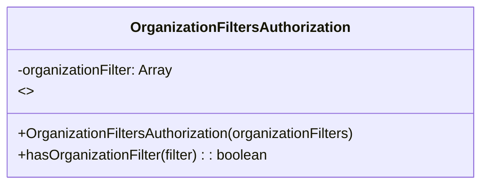

# Diagram: web/portal/src/modules/auth/OrganizationFiltersAuthorization.js

> Auto-generated by Obscura crawlers

## Mermaid

### SVG

<svg id="container" width="546.265625" xmlns="http://www.w3.org/2000/svg" class="classDiagram" height="208" viewBox="0 0 546.265625 208" role="graphics-document document" aria-roledescription="class"><g><defs><marker id="container_class-aggregationStart" class="marker aggregation class" refX="18" refY="7" markerWidth="190" markerHeight="240" orient="auto"><path d="M 18,7 L9,13 L1,7 L9,1 Z"></path></marker></defs><defs><marker id="container_class-aggregationEnd" class="marker aggregation class" refX="1" refY="7" markerWidth="20" markerHeight="28" orient="auto"><path d="M 18,7 L9,13 L1,7 L9,1 Z"></path></marker></defs><defs><marker id="container_class-extensionStart" class="marker extension class" refX="18" refY="7" markerWidth="190" markerHeight="240" orient="auto"><path d="M 1,7 L18,13 V 1 Z"></path></marker></defs><defs><marker id="container_class-extensionEnd" class="marker extension class" refX="1" refY="7" markerWidth="20" markerHeight="28" orient="auto"><path d="M 1,1 V 13 L18,7 Z"></path></marker></defs><defs><marker id="container_class-compositionStart" class="marker composition class" refX="18" refY="7" markerWidth="190" markerHeight="240" orient="auto"><path d="M 18,7 L9,13 L1,7 L9,1 Z"></path></marker></defs><defs><marker id="container_class-compositionEnd" class="marker composition class" refX="1" refY="7" markerWidth="20" markerHeight="28" orient="auto"><path d="M 18,7 L9,13 L1,7 L9,1 Z"></path></marker></defs><defs><marker id="container_class-dependencyStart" class="marker dependency class" refX="6" refY="7" markerWidth="190" markerHeight="240" orient="auto"><path d="M 5,7 L9,13 L1,7 L9,1 Z"></path></marker></defs><defs><marker id="container_class-dependencyEnd" class="marker dependency class" refX="13" refY="7" markerWidth="20" markerHeight="28" orient="auto"><path d="M 18,7 L9,13 L14,7 L9,1 Z"></path></marker></defs><defs><marker id="container_class-lollipopStart" class="marker lollipop class" refX="13" refY="7" markerWidth="190" markerHeight="240" orient="auto"><circle stroke="black" fill="transparent" cx="7" cy="7" r="6"></circle></marker></defs><defs><marker id="container_class-lollipopEnd" class="marker lollipop class" refX="1" refY="7" markerWidth="190" markerHeight="240" orient="auto"><circle stroke="black" fill="transparent" cx="7" cy="7" r="6"></circle></marker></defs><g class="root"><g class="clusters"></g><g class="edgePaths"></g><g class="edgeLabels"></g><g class="nodes"><g class="node default" id="classId-OrganizationFiltersAuthorization-0" transform="translate(273.1328125, 104)"><g class="basic label-container"><path d="M-265.1328125 -96 L265.1328125 -96 L265.1328125 96 L-265.1328125 96" stroke="none" stroke-width="0" fill="#ECECFF" style=""></path><path d="M-265.1328125 -96 C-101.18289186866642 -96, 62.76702876266717 -96, 265.1328125 -96 M-265.1328125 -96 C-132.15838641828344 -96, 0.8160396634331164 -96, 265.1328125 -96 M265.1328125 -96 C265.1328125 -53.9800661624745, 265.1328125 -11.960132324949, 265.1328125 96 M265.1328125 -96 C265.1328125 -21.98636563299719, 265.1328125 52.02726873400562, 265.1328125 96 M265.1328125 96 C95.43164121333922 96, -74.26953007332156 96, -265.1328125 96 M265.1328125 96 C55.64895703378315 96, -153.8348984324337 96, -265.1328125 96 M-265.1328125 96 C-265.1328125 25.258120560549713, -265.1328125 -45.483758878900574, -265.1328125 -96 M-265.1328125 96 C-265.1328125 38.36405496157561, -265.1328125 -19.271890076848777, -265.1328125 -96" stroke="#9370DB" stroke-width="1.3" fill="none" stroke-dasharray="0 0" style=""></path></g><g class="annotation-group text" transform="translate(0, -72)"></g><g class="label-group text" transform="translate(-119.03125, -72)"><g class="label" style="font-weight: bolder" transform="translate(0,-12)"><foreignObject width="238.0625" height="24">

OrganizationFiltersAuthorization

</foreignObject></g></g><g class="members-group text" transform="translate(-253.1328125, -24)"><g class="label" style="" transform="translate(0,-12)"><foreignObject width="179.265625" height="24">

-organizationFilter: Array

</foreignObject></g><g class="label" style="" transform="translate(0,12)"><foreignObject width="16.015625" height="24">

&lt;&gt;

</foreignObject></g></g><g class="methods-group text" transform="translate(-253.1328125, 48)"><g class="label" style="" transform="translate(0,-12)"><foreignObject width="387.234375" height="24">

+OrganizationFiltersAuthorization(organizationFilters)

</foreignObject></g><g class="label" style="" transform="translate(0,12)"><foreignObject width="286.921875" height="24">

+hasOrganizationFilter(filter) : : boolean

</foreignObject></g></g><g class="divider" style=""><path d="M-265.1328125 -48 C-135.920794152439 -48, -6.708775804877973 -48, 265.1328125 -48 M-265.1328125 -48 C-116.29002029622961 -48, 32.55277190754077 -48, 265.1328125 -48" stroke="#9370DB" stroke-width="1.3" fill="none" stroke-dasharray="0 0" style=""></path></g><g class="divider" style=""><path d="M-265.1328125 24 C-92.43659059013606 24, 80.25963131972787 24, 265.1328125 24 M-265.1328125 24 C-56.3640829886989 24, 152.4046465226022 24, 265.1328125 24" stroke="#9370DB" stroke-width="1.3" fill="none" stroke-dasharray="0 0" style=""></path></g></g></g></g></g></svg>
