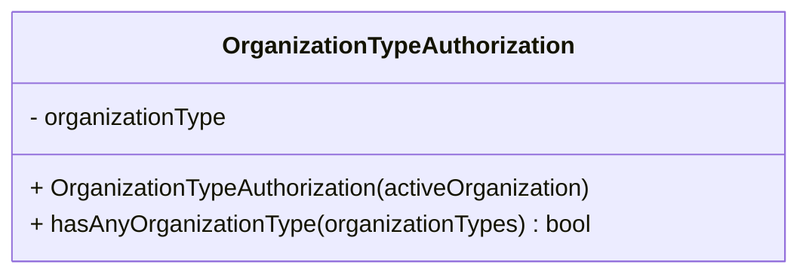

# Diagram: web/portal/src/modules/auth/OrganizationTypeAuthorization.js

> Auto-generated by Obscura crawlers

## Mermaid

### SVG

<svg id="container" width="535.515625" xmlns="http://www.w3.org/2000/svg" class="classDiagram" height="184" viewBox="0 0 535.515625 184" role="graphics-document document" aria-roledescription="class"><g><defs><marker id="container_class-aggregationStart" class="marker aggregation class" refX="18" refY="7" markerWidth="190" markerHeight="240" orient="auto"><path d="M 18,7 L9,13 L1,7 L9,1 Z"></path></marker></defs><defs><marker id="container_class-aggregationEnd" class="marker aggregation class" refX="1" refY="7" markerWidth="20" markerHeight="28" orient="auto"><path d="M 18,7 L9,13 L1,7 L9,1 Z"></path></marker></defs><defs><marker id="container_class-extensionStart" class="marker extension class" refX="18" refY="7" markerWidth="190" markerHeight="240" orient="auto"><path d="M 1,7 L18,13 V 1 Z"></path></marker></defs><defs><marker id="container_class-extensionEnd" class="marker extension class" refX="1" refY="7" markerWidth="20" markerHeight="28" orient="auto"><path d="M 1,1 V 13 L18,7 Z"></path></marker></defs><defs><marker id="container_class-compositionStart" class="marker composition class" refX="18" refY="7" markerWidth="190" markerHeight="240" orient="auto"><path d="M 18,7 L9,13 L1,7 L9,1 Z"></path></marker></defs><defs><marker id="container_class-compositionEnd" class="marker composition class" refX="1" refY="7" markerWidth="20" markerHeight="28" orient="auto"><path d="M 18,7 L9,13 L1,7 L9,1 Z"></path></marker></defs><defs><marker id="container_class-dependencyStart" class="marker dependency class" refX="6" refY="7" markerWidth="190" markerHeight="240" orient="auto"><path d="M 5,7 L9,13 L1,7 L9,1 Z"></path></marker></defs><defs><marker id="container_class-dependencyEnd" class="marker dependency class" refX="13" refY="7" markerWidth="20" markerHeight="28" orient="auto"><path d="M 18,7 L9,13 L14,7 L9,1 Z"></path></marker></defs><defs><marker id="container_class-lollipopStart" class="marker lollipop class" refX="13" refY="7" markerWidth="190" markerHeight="240" orient="auto"><circle stroke="black" fill="transparent" cx="7" cy="7" r="6"></circle></marker></defs><defs><marker id="container_class-lollipopEnd" class="marker lollipop class" refX="1" refY="7" markerWidth="190" markerHeight="240" orient="auto"><circle stroke="black" fill="transparent" cx="7" cy="7" r="6"></circle></marker></defs><g class="root"><g class="clusters"></g><g class="edgePaths"></g><g class="edgeLabels"></g><g class="nodes"><g class="node default" id="classId-OrganizationTypeAuthorization-0" transform="translate(267.7578125, 92)"><g class="basic label-container"><path d="M-259.7578125 -84 L259.7578125 -84 L259.7578125 84 L-259.7578125 84" stroke="none" stroke-width="0" fill="#ECECFF" style=""></path><path d="M-259.7578125 -84 C-89.61000303010479 -84, 80.53780643979042 -84, 259.7578125 -84 M-259.7578125 -84 C-146.89244219367401 -84, -34.02707188734806 -84, 259.7578125 -84 M259.7578125 -84 C259.7578125 -40.05722040168037, 259.7578125 3.8855591966392637, 259.7578125 84 M259.7578125 -84 C259.7578125 -47.70518773687844, 259.7578125 -11.410375473756886, 259.7578125 84 M259.7578125 84 C122.35862666151695 84, -15.040559176966099 84, -259.7578125 84 M259.7578125 84 C147.83373209846917 84, 35.90965169693834 84, -259.7578125 84 M-259.7578125 84 C-259.7578125 19.11472167429386, -259.7578125 -45.77055665141228, -259.7578125 -84 M-259.7578125 84 C-259.7578125 35.436116032013636, -259.7578125 -13.127767935972727, -259.7578125 -84" stroke="#9370DB" stroke-width="1.3" fill="none" stroke-dasharray="0 0" style=""></path></g><g class="annotation-group text" transform="translate(0, -60)"></g><g class="label-group text" transform="translate(-113.734375, -60)"><g class="label" style="font-weight: bolder" transform="translate(0,-12)"><foreignObject width="227.46875" height="24">

OrganizationTypeAuthorization

</foreignObject></g></g><g class="members-group text" transform="translate(-247.7578125, -12)"><g class="label" style="" transform="translate(0,-12)"><foreignObject width="134.78125" height="24">

- organizationType

</foreignObject></g></g><g class="methods-group text" transform="translate(-247.7578125, 36)"><g class="label" style="" transform="translate(0,-12)"><foreignObject width="381.78125" height="24">

+ OrganizationTypeAuthorization(activeOrganization)

</foreignObject></g><g class="label" style="" transform="translate(0,12)"><foreignObject width="376.859375" height="24">

+ hasAnyOrganizationType(organizationTypes) : bool

</foreignObject></g></g><g class="divider" style=""><path d="M-259.7578125 -36 C-130.71394362882313 -36, -1.6700747576462618 -36, 259.7578125 -36 M-259.7578125 -36 C-126.50758961619579 -36, 6.742633267608426 -36, 259.7578125 -36" stroke="#9370DB" stroke-width="1.3" fill="none" stroke-dasharray="0 0" style=""></path></g><g class="divider" style=""><path d="M-259.7578125 12 C-137.93929455411248 12, -16.120776608224958 12, 259.7578125 12 M-259.7578125 12 C-144.45593607194172 12, -29.154059643883443 12, 259.7578125 12" stroke="#9370DB" stroke-width="1.3" fill="none" stroke-dasharray="0 0" style=""></path></g></g></g></g></g></svg>
