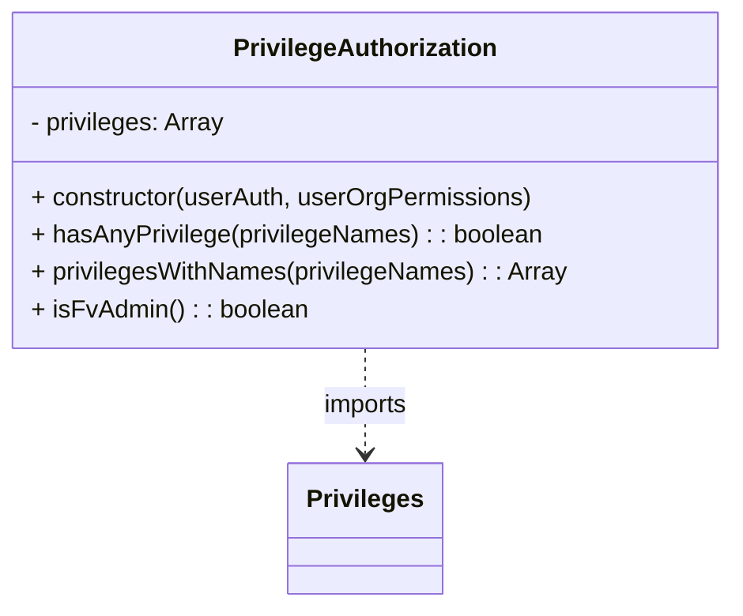
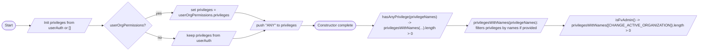

# Diagram: web/portal/src/modules/auth/PrivilegeAuthorization.js

> Auto-generated by Obscura crawlers

## Diagram 1

### SVG

<svg id="container" width="466.6640625" xmlns="http://www.w3.org/2000/svg" class="classDiagram" height="390" viewBox="0 0 466.6640625 390" role="graphics-document document" aria-roledescription="class"><g><defs><marker id="container_class-aggregationStart" class="marker aggregation class" refX="18" refY="7" markerWidth="190" markerHeight="240" orient="auto"><path d="M 18,7 L9,13 L1,7 L9,1 Z"></path></marker></defs><defs><marker id="container_class-aggregationEnd" class="marker aggregation class" refX="1" refY="7" markerWidth="20" markerHeight="28" orient="auto"><path d="M 18,7 L9,13 L1,7 L9,1 Z"></path></marker></defs><defs><marker id="container_class-extensionStart" class="marker extension class" refX="18" refY="7" markerWidth="190" markerHeight="240" orient="auto"><path d="M 1,7 L18,13 V 1 Z"></path></marker></defs><defs><marker id="container_class-extensionEnd" class="marker extension class" refX="1" refY="7" markerWidth="20" markerHeight="28" orient="auto"><path d="M 1,1 V 13 L18,7 Z"></path></marker></defs><defs><marker id="container_class-compositionStart" class="marker composition class" refX="18" refY="7" markerWidth="190" markerHeight="240" orient="auto"><path d="M 18,7 L9,13 L1,7 L9,1 Z"></path></marker></defs><defs><marker id="container_class-compositionEnd" class="marker composition class" refX="1" refY="7" markerWidth="20" markerHeight="28" orient="auto"><path d="M 18,7 L9,13 L1,7 L9,1 Z"></path></marker></defs><defs><marker id="container_class-dependencyStart" class="marker dependency class" refX="6" refY="7" markerWidth="190" markerHeight="240" orient="auto"><path d="M 5,7 L9,13 L1,7 L9,1 Z"></path></marker></defs><defs><marker id="container_class-dependencyEnd" class="marker dependency class" refX="13" refY="7" markerWidth="20" markerHeight="28" orient="auto"><path d="M 18,7 L9,13 L14,7 L9,1 Z"></path></marker></defs><defs><marker id="container_class-lollipopStart" class="marker lollipop class" refX="13" refY="7" markerWidth="190" markerHeight="240" orient="auto"><circle stroke="black" fill="transparent" cx="7" cy="7" r="6"></circle></marker></defs><defs><marker id="container_class-lollipopEnd" class="marker lollipop class" refX="1" refY="7" markerWidth="190" markerHeight="240" orient="auto"><circle stroke="black" fill="transparent" cx="7" cy="7" r="6"></circle></marker></defs><g class="root"><g class="clusters"></g><g class="edgePaths"><path d="M233.332,224L233.332,230.167C233.332,236.333,233.332,248.667,233.332,260C233.332,271.333,233.332,281.667,233.332,286.833L233.332,292" id="id_PrivilegeAuthorization_Privileges_1" class="edge-thickness-normal edge-pattern-dashed relation" style=";;;" data-edge="true" data-et="edge" data-id="id_PrivilegeAuthorization_Privileges_1" data-points="W3sieCI6MjMzLjMzMjAzMTI1LCJ5IjoyMjR9LHsieCI6MjMzLjMzMjAzMTI1LCJ5IjoyNjF9LHsieCI6MjMzLjMzMjAzMTI1LCJ5IjoyOTh9XQ==" marker-end="url(#container_class-dependencyEnd)"></path></g><g class="edgeLabels"><g class="edgeLabel" transform="translate(233.33203125, 261)"><g class="label" data-id="id_PrivilegeAuthorization_Privileges_1" transform="translate(-28.25, -12)"><foreignObject width="56.5" height="24">

imports

</foreignObject></g></g></g><g class="nodes"><g class="node default" id="classId-PrivilegeAuthorization-0" transform="translate(233.33203125, 116)"><g class="basic label-container"><path d="M-225.33203125 -108 L225.33203125 -108 L225.33203125 108 L-225.33203125 108" stroke="none" stroke-width="0" fill="#ECECFF" style=""></path><path d="M-225.33203125 -108 C-64.455269539027 -108, 96.421492171946 -108, 225.33203125 -108 M-225.33203125 -108 C-132.73946160686518 -108, -40.146891963730326 -108, 225.33203125 -108 M225.33203125 -108 C225.33203125 -50.041157012547345, 225.33203125 7.917685974905311, 225.33203125 108 M225.33203125 -108 C225.33203125 -21.871074748609047, 225.33203125 64.2578505027819, 225.33203125 108 M225.33203125 108 C64.09279099772505 108, -97.1464492545499 108, -225.33203125 108 M225.33203125 108 C95.4463233052854 108, -34.43938463942919 108, -225.33203125 108 M-225.33203125 108 C-225.33203125 44.048711027046245, -225.33203125 -19.90257794590751, -225.33203125 -108 M-225.33203125 108 C-225.33203125 34.2777035490691, -225.33203125 -39.444592901861796, -225.33203125 -108" stroke="#9370DB" stroke-width="1.3" fill="none" stroke-dasharray="0 0" style=""></path></g><g class="annotation-group text" transform="translate(0, -84)"></g><g class="label-group text" transform="translate(-81.5703125, -84)"><g class="label" style="font-weight: bolder" transform="translate(0,-12)"><foreignObject width="163.140625" height="24">

PrivilegeAuthorization

</foreignObject></g></g><g class="members-group text" transform="translate(-213.33203125, -36)"><g class="label" style="" transform="translate(0,-12)"><foreignObject width="126.234375" height="24">

- privileges: Array

</foreignObject></g></g><g class="methods-group text" transform="translate(-213.33203125, 12)"><g class="label" style="" transform="translate(0,-12)"><foreignObject width="323.90625" height="24">

+ constructor(userAuth, userOrgPermissions)

</foreignObject></g><g class="label" style="" transform="translate(0,12)"><foreignObject width="328.515625" height="24">

+ hasAnyPrivilege(privilegeNames) : : boolean

</foreignObject></g><g class="label" style="" transform="translate(0,36)"><foreignObject width="345.09375" height="24">

+ privilegesWithNames(privilegeNames) : : Array

</foreignObject></g><g class="label" style="" transform="translate(0,60)"><foreignObject width="175.921875" height="24">

+ isFvAdmin() : : boolean

</foreignObject></g></g><g class="divider" style=""><path d="M-225.33203125 -60 C-105.62338410712779 -60, 14.085263035744418 -60, 225.33203125 -60 M-225.33203125 -60 C-95.62293071268203 -60, 34.08616982463593 -60, 225.33203125 -60" stroke="#9370DB" stroke-width="1.3" fill="none" stroke-dasharray="0 0" style=""></path></g><g class="divider" style=""><path d="M-225.33203125 -12 C-49.82127138231999 -12, 125.68948848536002 -12, 225.33203125 -12 M-225.33203125 -12 C-93.48658318837155 -12, 38.35886487325689 -12, 225.33203125 -12" stroke="#9370DB" stroke-width="1.3" fill="none" stroke-dasharray="0 0" style=""></path></g></g><g class="node default" id="classId-Privileges-1" transform="translate(233.33203125, 340)"><g class="basic label-container"><path d="M-47.734375 -42 L47.734375 -42 L47.734375 42 L-47.734375 42" stroke="none" stroke-width="0" fill="#ECECFF" style=""></path><path d="M-47.734375 -42 C-18.578346378131233 -42, 10.577682243737534 -42, 47.734375 -42 M-47.734375 -42 C-28.13258526903145 -42, -8.530795538062897 -42, 47.734375 -42 M47.734375 -42 C47.734375 -23.377482580479665, 47.734375 -4.75496516095933, 47.734375 42 M47.734375 -42 C47.734375 -20.44676358565626, 47.734375 1.1064728286874796, 47.734375 42 M47.734375 42 C15.552711766200197 42, -16.628951467599606 42, -47.734375 42 M47.734375 42 C23.4371401647463 42, -0.8600946705074008 42, -47.734375 42 M-47.734375 42 C-47.734375 8.571365554780208, -47.734375 -24.857268890439585, -47.734375 -42 M-47.734375 42 C-47.734375 12.182559411282625, -47.734375 -17.63488117743475, -47.734375 -42" stroke="#9370DB" stroke-width="1.3" fill="none" stroke-dasharray="0 0" style=""></path></g><g class="annotation-group text" transform="translate(0, -18)"></g><g class="label-group text" transform="translate(-35.734375, -18)"><g class="label" style="font-weight: bolder" transform="translate(0,-12)"><foreignObject width="71.46875" height="24">

Privileges

</foreignObject></g></g><g class="members-group text" transform="translate(-35.734375, 30)"></g><g class="methods-group text" transform="translate(-35.734375, 60)"></g><g class="divider" style=""><path d="M-47.734375 6 C-13.742967287189998 6, 20.248440425620004 6, 47.734375 6 M-47.734375 6 C-18.563789237859705 6, 10.60679652428059 6, 47.734375 6" stroke="#9370DB" stroke-width="1.3" fill="none" stroke-dasharray="0 0" style=""></path></g><g class="divider" style=""><path d="M-47.734375 24 C-10.88786438784038 24, 25.95864622431924 24, 47.734375 24 M-47.734375 24 C-16.40136848161811 24, 14.931638036763779 24, 47.734375 24" stroke="#9370DB" stroke-width="1.3" fill="none" stroke-dasharray="0 0" style=""></path></g></g></g></g></g></svg>

## Diagram 2

### SVG

<svg id="container" width="2977.0693359375" xmlns="http://www.w3.org/2000/svg" class="flowchart" height="221.296875" viewBox="0.0000019073486328125 0 2977.0693359375 221.296875" role="graphics-document document" aria-roledescription="flowchart-v2"><g><marker id="container_flowchart-v2-pointEnd" class="marker flowchart-v2" viewBox="0 0 10 10" refX="5" refY="5" markerUnits="userSpaceOnUse" markerWidth="8" markerHeight="8" orient="auto"><path d="M 0 0 L 10 5 L 0 10 z" class="arrowMarkerPath" style="stroke-width: 1; stroke-dasharray: 1, 0;"></path></marker><marker id="container_flowchart-v2-pointStart" class="marker flowchart-v2" viewBox="0 0 10 10" refX="4.5" refY="5" markerUnits="userSpaceOnUse" markerWidth="8" markerHeight="8" orient="auto"><path d="M 0 5 L 10 10 L 10 0 z" class="arrowMarkerPath" style="stroke-width: 1; stroke-dasharray: 1, 0;"></path></marker><marker id="container_flowchart-v2-circleEnd" class="marker flowchart-v2" viewBox="0 0 10 10" refX="11" refY="5" markerUnits="userSpaceOnUse" markerWidth="11" markerHeight="11" orient="auto"><circle cx="5" cy="5" r="5" class="arrowMarkerPath" style="stroke-width: 1; stroke-dasharray: 1, 0;"></circle></marker><marker id="container_flowchart-v2-circleStart" class="marker flowchart-v2" viewBox="0 0 10 10" refX="-1" refY="5" markerUnits="userSpaceOnUse" markerWidth="11" markerHeight="11" orient="auto"><circle cx="5" cy="5" r="5" class="arrowMarkerPath" style="stroke-width: 1; stroke-dasharray: 1, 0;"></circle></marker><marker id="container_flowchart-v2-crossEnd" class="marker cross flowchart-v2" viewBox="0 0 11 11" refX="12" refY="5.2" markerUnits="userSpaceOnUse" markerWidth="11" markerHeight="11" orient="auto"><path d="M 1,1 l 9,9 M 10,1 l -9,9" class="arrowMarkerPath" style="stroke-width: 2; stroke-dasharray: 1, 0;"></path></marker><marker id="container_flowchart-v2-crossStart" class="marker cross flowchart-v2" viewBox="0 0 11 11" refX="-1" refY="5.2" markerUnits="userSpaceOnUse" markerWidth="11" markerHeight="11" orient="auto"><path d="M 1,1 l 9,9 M 10,1 l -9,9" class="arrowMarkerPath" style="stroke-width: 2; stroke-dasharray: 1, 0;"></path></marker><g class="root"><g class="clusters"></g><g class="edgePaths"><path d="M68.277,111.148L72.36,111.065C76.444,110.982,84.61,110.815,94.902,110.807C105.194,110.799,117.61,110.949,123.819,111.025L130.027,111.1" id="L_Start_InitPrivs_0" class="edge-thickness-normal edge-pattern-solid edge-thickness-normal edge-pattern-solid flowchart-link" style=";" data-edge="true" data-et="edge" data-id="L_Start_InitPrivs_0" data-points="W3sieCI6NjguMjc2ODM3NDMxODI2NTYsInkiOjExMS4xNDg0Mzc1MDAwMDAwMX0seyJ4Ijo5Mi43NzY4MzYzOTUyNjM2NywieSI6MTEwLjY0ODQzNzV9LHsieCI6MTM0LjAyNjgzNjM5NTI2MzY3LCJ5IjoxMTEuMTQ4NDM3NX1d" marker-end="url(#container_flowchart-v2-pointEnd)"></path><path d="M380.527,111.148L387.235,111.065C393.944,110.982,407.36,110.815,417.569,110.732C427.777,110.648,434.777,110.648,438.277,110.648L441.777,110.648" id="L_InitPrivs_CheckOrg_0" class="edge-thickness-normal edge-pattern-solid edge-thickness-normal edge-pattern-solid flowchart-link" style=";" data-edge="true" data-et="edge" data-id="L_InitPrivs_CheckOrg_0" data-points="W3sieCI6MzgwLjUyNjgzNjM5NTI2MzcsInkiOjExMS4xNDg0Mzc1fSx7IngiOjQyMC43NzY4MzYzOTUyNjM3LCJ5IjoxMTAuNjQ4NDM3NX0seyJ4Ijo0NDUuNzc2ODM2Mzk1MjYzNywieSI6MTEwLjY0ODQzNzV9XQ==" marker-end="url(#container_flowchart-v2-pointEnd)"></path><path d="M621.507,81.082L632.603,76.593C643.699,72.104,665.89,63.126,685.195,58.714C704.501,54.303,720.92,54.457,729.13,54.534L737.34,54.611" id="L_CheckOrg_UseOrg_0" class="edge-thickness-normal edge-pattern-solid edge-thickness-normal edge-pattern-solid flowchart-link" style=";" data-edge="true" data-et="edge" data-id="L_CheckOrg_UseOrg_0" data-points="W3sieCI6NjIxLjUwNzI5ODI5OTgzNTgsInkiOjgxLjA4MjAyNDQwNDU3MjI1fSx7IngiOjY4OC4wODE1MjM4OTUyNjM3LCJ5Ijo1NC4xNDg0Mzc1fSx7IngiOjc0MS4zMzkzMzYzOTUyNjM3LCJ5Ijo1NC42NDg0Mzc1fV0=" marker-end="url(#container_flowchart-v2-pointEnd)"></path><path d="M621.507,140.215L632.603,144.704C643.699,149.193,665.89,158.171,686.731,162.738C707.571,167.304,727.061,167.46,736.806,167.538L746.55,167.616" id="L_CheckOrg_KeepUser_0" class="edge-thickness-normal edge-pattern-solid edge-thickness-normal edge-pattern-solid flowchart-link" style=";" data-edge="true" data-et="edge" data-id="L_CheckOrg_KeepUser_0" data-points="W3sieCI6NjIxLjUwNzI5ODI5OTgzNTgsInkiOjE0MC4yMTQ4NTA1OTU0Mjc3NX0seyJ4Ijo2ODguMDgxNTIzODk1MjYzNywieSI6MTY3LjE0ODQzNzV9LHsieCI6NzUwLjU1MDI3Mzg5NTI2MzcsInkiOjE2Ny42NDg0Mzc1fV0=" marker-end="url(#container_flowchart-v2-pointEnd)"></path><path d="M1006.261,54.648L1012.97,54.565C1019.678,54.482,1033.095,54.315,1054.483,60.23C1075.871,66.144,1105.231,78.14,1119.911,84.138L1134.591,90.136" id="L_UseOrg_AddAny_0" class="edge-thickness-normal edge-pattern-solid edge-thickness-normal edge-pattern-solid flowchart-link" style=";" data-edge="true" data-et="edge" data-id="L_UseOrg_AddAny_0" data-points="W3sieCI6MTAwNi4yNjEyMTEzOTUyNjM3LCJ5Ijo1NC42NDg0Mzc1fSx7IngiOjEwNDYuNTExMjExMzk1MjYzNywieSI6NTQuMTQ4NDM3NX0seyJ4IjoxMTM4LjI5MzU2NzU4OTk1NCwieSI6OTEuNjQ4NDM3NX1d" marker-end="url(#container_flowchart-v2-pointEnd)"></path><path d="M997.05,167.648L1005.294,167.565C1013.537,167.482,1030.024,167.315,1052.945,161.395C1075.866,155.474,1105.222,143.801,1119.899,137.964L1134.577,132.127" id="L_KeepUser_AddAny_0" class="edge-thickness-normal edge-pattern-solid edge-thickness-normal edge-pattern-solid flowchart-link" style=";" data-edge="true" data-et="edge" data-id="L_KeepUser_AddAny_0" data-points="W3sieCI6OTk3LjA1MDI3Mzg5NTI2MzcsInkiOjE2Ny42NDg0Mzc1fSx7IngiOjEwNDYuNTExMjExMzk1MjYzNywieSI6MTY3LjE0ODQzNzV9LHsieCI6MTEzOC4yOTM1Njc1ODk5NTQsInkiOjEzMC42NDg0Mzc1fV0=" marker-end="url(#container_flowchart-v2-pointEnd)"></path><path d="M1291.042,111.148L1296.751,111.065C1302.459,110.982,1313.876,110.815,1323.168,110.802C1332.459,110.789,1339.626,110.929,1343.21,111L1346.793,111.07" id="L_AddAny_End_0" class="edge-thickness-normal edge-pattern-solid edge-thickness-normal edge-pattern-solid flowchart-link" style=";" data-edge="true" data-et="edge" data-id="L_AddAny_End_0" data-points="W3sieCI6MTI5MS4wNDI0NjEzOTUyNjM3LCJ5IjoxMTEuMTQ4NDM3NX0seyJ4IjoxMzI1LjI5MjQ2MTM5NTI2MzcsInkiOjExMC42NDg0Mzc1fSx7IngiOjEzNTAuNzkyNDYxMzk1MjU4NCwieSI6MTExLjE0ODQzNzV9XQ==" marker-end="url(#container_flowchart-v2-pointEnd)"></path><path d="M1532.038,111.148L1536.121,111.065C1540.205,110.982,1548.371,110.815,1560.663,110.809C1572.955,110.803,1589.372,110.957,1597.58,111.034L1605.788,111.111" id="L_End_HasAny_0" class="edge-thickness-normal edge-pattern-solid edge-thickness-normal edge-pattern-solid flowchart-link" style=";" data-edge="true" data-et="edge" data-id="L_End_HasAny_0" data-points="W3sieCI6MTUzMi4wMzgwNDg4MjcwODcsInkiOjExMS4xNDg0Mzc0OTk5OTk5OX0seyJ4IjoxNTU2LjUzODA1MTYwNTIyNDYsInkiOjExMC42NDg0Mzc1fSx7IngiOjE2MDkuNzg4MDUxNjA1MjI0NiwieSI6MTExLjE0ODQzNzV9XQ==" marker-end="url(#container_flowchart-v2-pointEnd)"></path><path d="M1920.991,111.148L1929.7,111.065C1938.408,110.982,1955.825,110.815,1970.741,110.807C1985.658,110.799,1998.075,110.949,2004.283,111.025L2010.491,111.1" id="L_HasAny_PrivsWith_0" class="edge-thickness-normal edge-pattern-solid edge-thickness-normal edge-pattern-solid flowchart-link" style=";" data-edge="true" data-et="edge" data-id="L_HasAny_PrivsWith_0" data-points="W3sieCI6MTkyMC45OTExNzY2MDUyMjQ2LCJ5IjoxMTEuMTQ4NDM3NX0seyJ4IjoxOTczLjI0MTE3NjYwNTIyNDYsInkiOjExMC42NDg0Mzc1fSx7IngiOjIwMTQuNDkxMTc2NjA1MjI0NiwieSI6MTExLjE0ODQzNzV9XQ==" marker-end="url(#container_flowchart-v2-pointEnd)"></path><path d="M2344.241,111.148L2350.95,111.065C2357.658,110.982,2371.075,110.815,2384.991,110.808C2398.908,110.801,2413.325,110.954,2420.533,111.03L2427.741,111.106" id="L_PrivsWith_IsAdmin_0" class="edge-thickness-normal edge-pattern-solid edge-thickness-normal edge-pattern-solid flowchart-link" style=";" data-edge="true" data-et="edge" data-id="L_PrivsWith_IsAdmin_0" data-points="W3sieCI6MjM0NC4yNDExNzY2MDUyMjQ2LCJ5IjoxMTEuMTQ4NDM3NX0seyJ4IjoyMzg0LjQ5MTE3NjYwNTIyNDYsInkiOjExMC42NDg0Mzc1fSx7IngiOjI0MzEuNzQxMTc2NjA1MjI0NiwieSI6MTExLjE0ODQzNzV9XQ==" marker-end="url(#container_flowchart-v2-pointEnd)"></path></g><g class="edgeLabels"><g class="edgeLabel"><g class="label" data-id="L_Start_InitPrivs_0" transform="translate(0, 0)"><foreignObject width="0" height="0">

</foreignObject></g></g><g class="edgeLabel"><g class="label" data-id="L_InitPrivs_CheckOrg_0" transform="translate(0, 0)"><foreignObject width="0" height="0">

</foreignObject></g></g><g class="edgeLabel" transform="translate(688.0815238952637, 54.1484375)"><g class="label" data-id="L_CheckOrg_UseOrg_0" transform="translate(-12.0078125, -12)"><foreignObject width="24.015625" height="24">

yes

</foreignObject></g></g><g class="edgeLabel" transform="translate(688.0815238952637, 167.1484375)"><g class="label" data-id="L_CheckOrg_KeepUser_0" transform="translate(-9.3671875, -12)"><foreignObject width="18.734375" height="24">

no

</foreignObject></g></g><g class="edgeLabel"><g class="label" data-id="L_UseOrg_AddAny_0" transform="translate(0, 0)"><foreignObject width="0" height="0">

</foreignObject></g></g><g class="edgeLabel"><g class="label" data-id="L_KeepUser_AddAny_0" transform="translate(0, 0)"><foreignObject width="0" height="0">

</foreignObject></g></g><g class="edgeLabel"><g class="label" data-id="L_AddAny_End_0" transform="translate(0, 0)"><foreignObject width="0" height="0">

</foreignObject></g></g><g class="edgeLabel"><g class="label" data-id="L_End_HasAny_0" transform="translate(0, 0)"><foreignObject width="0" height="0">

</foreignObject></g></g><g class="edgeLabel"><g class="label" data-id="L_HasAny_PrivsWith_0" transform="translate(0, 0)"><foreignObject width="0" height="0">

</foreignObject></g></g><g class="edgeLabel"><g class="label" data-id="L_PrivsWith_IsAdmin_0" transform="translate(0, 0)"><foreignObject width="0" height="0">

</foreignObject></g></g></g><g class="nodes"><g class="node default" id="flowchart-Start-0" transform="translate(37.888418197631836, 110.6484375)"><g class="basic label-container outer-path"><path d="M-10.3984375 -19.5 C-4.959871122804922 -19.5, 0.47869525439015526 -19.5, 10.3984375 -19.5 C10.3984375 -19.5, 10.398437499999998 -19.5, 10.398437499999998 -19.5 C10.893069577278357 -19.484138112024617, 11.387701654556716 -19.46827622404923, 11.6478067896239 -19.45993515863156 C12.062814374296295 -19.41989987605786, 12.47782195896869 -19.379864593484154, 12.892042152847864 -19.3399052695533 C13.217881318224723 -19.287226120215635, 13.543720483601584 -19.23454697087797, 14.126030759676757 -19.140403561325776 C14.508330114429437 -19.053146228339912, 14.890629469182116 -18.96588889535405, 15.34470188623539 -18.862249829261074 C15.592659124566124 -18.788657422478618, 15.840616362896858 -18.715065015696158, 16.543047751460602 -18.50658706670804 C17.008518896975307 -18.335289382390528, 17.47399004249001 -18.163991698073012, 17.716144095147794 -18.074876768247425 C18.1034034057036 -17.903448559103662, 18.490662716259408 -17.732020349959896, 18.85917041279238 -17.568892924097174 C19.279683764487856 -17.3495113778693, 19.70019711618333 -17.13012983164143, 19.967429764076783 -16.990714730406097 C20.319304772436503 -16.77740603249136, 20.67117978079622 -16.56409733457662, 21.036368073605697 -16.342718045390892 C21.445676812576814 -16.057201987774377, 21.85498555154793 -15.771685930157862, 22.061592844578712 -15.627565626425154 C22.358798528771125 -15.390552002257117, 22.656004212963538 -15.153538378089078, 23.03889120850187 -14.848196188198123 C23.317482414793766 -14.595187025763217, 23.59607362108566 -14.34217786332831, 23.964247236767985 -14.007812326905688 C24.20840456917094 -13.755699835509846, 24.452561901573898 -13.503587344114004, 24.833858442968648 -13.10986736009568 C25.129790825382493 -12.762248344682792, 25.425723207796338 -12.414629329269902, 25.644151408126582 -12.158051136245305 C25.922445256097834 -11.785162733054937, 26.200739104069086 -11.41227432986457, 26.391796464640635 -11.156274872382312 C26.649280707933436 -10.760709930484149, 26.906764951226233 -10.365144988585985, 27.073721378604247 -10.108655082055241 C27.305412268438886 -9.697264445907193, 27.537103158273528 -9.285873809759142, 27.6871239742735 -9.019496659696287 C27.820118238445364 -8.743331224522018, 27.953112502617227 -8.46716578934775, 28.22948364880834 -7.893275190886684 C28.40791838745882 -7.452537936619019, 28.586353126109298 -7.011800682351354, 28.698571729970325 -6.734618561215508 C28.784546637284983 -6.47567583862498, 28.87052154459964 -6.216733116034453, 29.09246063421488 -5.548287939305138 C29.16957065566202 -5.254234007832499, 29.246680677109158 -4.960180076359862, 29.40953178754556 -4.339158212148133 C29.481123998093143 -3.9715473420053633, 29.55271620864072 -3.6039364718625935, 29.648482276581777 -3.1121979531509023 C29.692453868385225 -2.7711629702963085, 29.73642546018867 -2.4301279874417143, 29.808330202509367 -1.872449005199798 C29.837839485449965 -1.4128181039354895, 29.867348768390563 -0.953187202671181, 29.888418715913414 -0.6250057626472757 C29.888418715913414 -0.37299834724495384, 29.888418715913414 -0.12099093184263199, 29.888418715913414 0.625005762647271 C29.863953901485367 1.0060649950069018, 29.839489087057316 1.3871242273665327, 29.808330202509367 1.8724490051997846 C29.745864820715227 2.356918171210303, 29.683399438921086 2.8413873372208216, 29.648482276581777 3.1121979531508885 C29.56044104004366 3.5642710952521988, 29.47239980350554 4.016344237353509, 29.40953178754556 4.339158212148129 C29.33149298442145 4.636753990691595, 29.253454181297336 4.9343497692350615, 29.092460634214884 5.548287939305125 C28.95918583227654 5.949690408287425, 28.825911030338197 6.351092877269724, 28.69857172997033 6.734618561215495 C28.524350641129246 7.164948018988576, 28.350129552288166 7.595277476761657, 28.229483648808344 7.893275190886679 C28.107792113539016 8.145970267655175, 27.98610057826969 8.39866534442367, 27.687123974273504 9.019496659696284 C27.55598430648017 9.252348419194677, 27.42484463868683 9.48520017869307, 27.07372137860425 10.108655082055236 C26.90765435226172 10.363778629757862, 26.741587325919184 10.618902177460486, 26.39179646464064 11.156274872382301 C26.116050907102625 11.525748798546166, 25.84030534956461 11.895222724710031, 25.644151408126582 12.158051136245302 C25.454050686855762 12.381354260487479, 25.263949965584946 12.604657384729656, 24.83385844296866 13.10986736009567 C24.603147334244593 13.348095521587561, 24.37243622552053 13.586323683079453, 23.96424723676799 14.007812326905684 C23.756726316445988 14.196277336039456, 23.549205396123984 14.38474234517323, 23.038891208501887 14.848196188198111 C22.819876910326744 15.022854262777543, 22.6008626121516 15.197512337356976, 22.061592844578715 15.627565626425152 C21.7239982470943 15.863057003395696, 21.38640364960989 16.09854838036624, 21.036368073605708 16.34271804539089 C20.75150192203922 16.515405580529816, 20.466635770472735 16.688093115668746, 19.967429764076787 16.990714730406093 C19.613034570876742 17.175602475697602, 19.258639377676694 17.36049022098911, 18.859170412792388 17.56889292409717 C18.573352427660577 17.695416067625736, 18.287534442528766 17.8219392111543, 17.716144095147804 18.07487676824742 C17.305510435088472 18.2259937510052, 16.89487677502914 18.377110733762976, 16.543047751460616 18.506587066708033 C16.29060907176738 18.581509541763317, 16.038170392074147 18.6564320168186, 15.344701886235413 18.86224982926107 C14.960759412888898 18.949882193343626, 14.57681693954238 19.03751455742618, 14.126030759676766 19.140403561325773 C13.726161695760466 19.205051290548855, 13.326292631844165 19.269699019771938, 12.892042152847878 19.3399052695533 C12.574399868840791 19.370547838670724, 12.256757584833705 19.40119040778815, 11.6478067896239 19.45993515863156 C11.331136634572642 19.470090154142987, 11.014466479521385 19.48024514965442, 10.398437500000004 19.5 C10.398437500000002 19.5, 10.398437500000002 19.5, 10.3984375 19.5 C4.025549841537828 19.5, -2.3473378169243446 19.5, -10.398437499999996 19.5 C-10.72264552704385 19.489603279605348, -11.046853554087702 19.47920655921069, -11.647806789623893 19.45993515863156 C-12.000084566173577 19.425951345203824, -12.352362342723263 19.39196753177609, -12.892042152847871 19.3399052695533 C-13.2508646810004 19.281893625911863, -13.609687209152929 19.223881982270427, -14.126030759676759 19.140403561325773 C-14.401502689138844 19.077528891048388, -14.67697461860093 19.014654220771003, -15.344701886235388 18.862249829261074 C-15.66434019919888 18.767382855789254, -15.983978512162372 18.67251588231743, -16.54304775146059 18.506587066708043 C-16.89950885280972 18.375406086321263, -17.25596995415885 18.244225105934486, -17.716144095147797 18.074876768247425 C-18.143780724670602 17.88557471774758, -18.571417354193407 17.696272667247737, -18.85917041279238 17.568892924097174 C-19.093021307800665 17.446893061959997, -19.326872202808953 17.32489319982282, -19.96742976407678 16.990714730406097 C-20.382280847001546 16.739229566001534, -20.79713192992631 16.48774440159697, -21.036368073605686 16.3427180453909 C-21.441452435003956 16.060148730698845, -21.846536796402223 15.777579416006793, -22.061592844578712 15.627565626425156 C-22.265746578500718 15.464758456381377, -22.469900312422723 15.301951286337598, -23.03889120850187 14.848196188198125 C-23.407051473158802 14.513842776823513, -23.77521173781573 14.1794893654489, -23.964247236767974 14.007812326905697 C-24.248163648393827 13.714645321931105, -24.532080060019677 13.421478316956513, -24.833858442968655 13.109867360095677 C-25.154570559398095 12.733140659101256, -25.47528267582754 12.356413958106835, -25.64415140812658 12.158051136245307 C-25.89245339398244 11.82534909597472, -26.1407553798383 11.492647055704133, -26.391796464640635 11.156274872382316 C-26.555894244828668 10.904176615589632, -26.719992025016705 10.65207835879695, -27.073721378604244 10.108655082055249 C-27.262720898468118 9.773067296260269, -27.451720418331995 9.437479510465288, -27.6871239742735 9.019496659696289 C-27.842564587511585 8.696720900411082, -27.99800520074967 8.373945141125876, -28.22948364880834 7.893275190886686 C-28.41368461743175 7.438295237103416, -28.597885586055153 6.983315283320147, -28.698571729970325 6.73461856121551 C-28.846891004029022 6.287904539217816, -28.99521027808772 5.841190517220123, -29.09246063421488 5.5482879393051325 C-29.167919698847264 5.260529821696362, -29.24337876347965 4.972771704087592, -29.409531787545557 4.339158212148136 C-29.49889873599949 3.8802778195484393, -29.588265684453425 3.421397426948743, -29.648482276581777 3.112197953150904 C-29.685824592034773 2.822578328571703, -29.723166907487773 2.5329587039925023, -29.808330202509364 1.872449005199809 C-29.830094540323913 1.5334518758809164, -29.85185887813846 1.1944547465620237, -29.888418715913414 0.6250057626472781 C-29.888418715913414 0.2567754979079579, -29.888418715913414 -0.11145476683136235, -29.888418715913414 -0.6250057626472687 C-29.859296958905407 -1.0786006347061488, -29.8301752018974 -1.5321955067650286, -29.808330202509367 -1.8724490051997822 C-29.7551897591146 -2.2845957904021104, -29.702049315719837 -2.6967425756044383, -29.648482276581777 -3.112197953150895 C-29.56897831466478 -3.5204339944263756, -29.48947435274778 -3.928670035701856, -29.40953178754556 -4.339158212148126 C-29.30617983493871 -4.733284000457657, -29.202827882331857 -5.127409788767189, -29.092460634214884 -5.548287939305123 C-28.938826664237403 -6.011008978628394, -28.785192694259923 -6.473730017951666, -28.698571729970332 -6.734618561215485 C-28.512209098328356 -7.194937864447539, -28.32584646668638 -7.655257167679593, -28.229483648808344 -7.893275190886676 C-28.091137712470218 -8.180553487821633, -27.952791776132088 -8.46783178475659, -27.687123974273504 -9.019496659696282 C-27.445934879033327 -9.447752321339456, -27.204745783793147 -9.876007982982632, -27.073721378604247 -10.108655082055243 C-26.84374840372241 -10.461955327864207, -26.61377542884058 -10.815255573673172, -26.39179646464064 -11.156274872382308 C-26.165280875844324 -11.459785125374713, -25.938765287048003 -11.76329537836712, -25.644151408126586 -12.158051136245302 C-25.39239636462318 -12.453776935612193, -25.140641321119777 -12.749502734979085, -24.833858442968662 -13.10986736009567 C-24.61111940380028 -13.339863705252236, -24.388380364631896 -13.569860050408801, -23.964247236767996 -14.007812326905677 C-23.717502615262152 -14.23189926365235, -23.47075799375631 -14.455986200399025, -23.038891208501887 -14.848196188198107 C-22.722328812613082 -15.100646274840289, -22.405766416724276 -15.353096361482468, -22.06159284457872 -15.627565626425149 C-21.724414106382365 -15.862766917958599, -21.387235368186012 -16.09796820949205, -21.03636807360571 -16.342718045390885 C-20.798158038953694 -16.487122368274484, -20.55994800430168 -16.631526691158083, -19.96742976407679 -16.99071473040609 C-19.65108663433895 -17.155750738562876, -19.33474350460111 -17.320786746719662, -18.859170412792388 -17.56889292409717 C-18.58537041702266 -17.69009606023613, -18.31157042125293 -17.81129919637509, -17.716144095147804 -18.07487676824742 C-17.47716330501661 -18.16282390812991, -17.23818251488542 -18.250771048012393, -16.54304775146062 -18.506587066708033 C-16.07147882626103 -18.64654624839147, -15.599909901061437 -18.78650543007491, -15.344701886235413 -18.862249829261067 C-15.076311672934713 -18.923508144037132, -14.807921459634013 -18.984766458813198, -14.126030759676768 -19.140403561325773 C-13.83432374970345 -19.18756448847661, -13.542616739730134 -19.234725415627448, -12.89204215284788 -19.3399052695533 C-12.48302122006796 -19.379363027018936, -12.074000287288037 -19.418820784484573, -11.647806789623903 -19.45993515863156 C-11.160711293970879 -19.475555363103286, -10.673615798317854 -19.491175567575013, -10.398437500000005 -19.5 C-10.398437500000004 -19.5, -10.398437500000004 -19.5, -10.3984375 -19.5" stroke="none" stroke-width="0" fill="#ECECFF" style=""></path><path d="M-10.3984375 -19.5 C-2.1402562394166846 -19.5, 6.117925021166631 -19.5, 10.3984375 -19.5 M-10.3984375 -19.5 C-3.332248612215378 -19.5, 3.7339402755692443 -19.5, 10.3984375 -19.5 M10.3984375 -19.5 C10.3984375 -19.5, 10.3984375 -19.5, 10.398437499999998 -19.5 M10.3984375 -19.5 C10.3984375 -19.5, 10.3984375 -19.5, 10.398437499999998 -19.5 M10.398437499999998 -19.5 C10.659755660409061 -19.491620035220624, 10.921073820818124 -19.483240070441248, 11.6478067896239 -19.45993515863156 M10.398437499999998 -19.5 C10.649193397794487 -19.491958746424476, 10.899949295588977 -19.483917492848953, 11.6478067896239 -19.45993515863156 M11.6478067896239 -19.45993515863156 C12.140105754160668 -19.412443669598826, 12.632404718697439 -19.364952180566092, 12.892042152847864 -19.3399052695533 M11.6478067896239 -19.45993515863156 C12.11217434448431 -19.41513817909787, 12.576541899344722 -19.370341199564177, 12.892042152847864 -19.3399052695533 M12.892042152847864 -19.3399052695533 C13.263786513525671 -19.279804524239484, 13.63553087420348 -19.219703778925673, 14.126030759676757 -19.140403561325776 M12.892042152847864 -19.3399052695533 C13.196487525012545 -19.290684902790836, 13.500932897177226 -19.241464536028374, 14.126030759676757 -19.140403561325776 M14.126030759676757 -19.140403561325776 C14.600869088687205 -19.032024811338818, 15.075707417697652 -18.92364606135186, 15.34470188623539 -18.862249829261074 M14.126030759676757 -19.140403561325776 C14.442460318823567 -19.068180579346365, 14.758889877970375 -18.995957597366953, 15.34470188623539 -18.862249829261074 M15.34470188623539 -18.862249829261074 C15.708463782781129 -18.75428720779146, 16.072225679326866 -18.646324586321843, 16.543047751460602 -18.50658706670804 M15.34470188623539 -18.862249829261074 C15.819508185631266 -18.721329811909502, 16.29431448502714 -18.580409794557934, 16.543047751460602 -18.50658706670804 M16.543047751460602 -18.50658706670804 C16.798641719180324 -18.412526123902445, 17.05423568690005 -18.318465181096848, 17.716144095147794 -18.074876768247425 M16.543047751460602 -18.50658706670804 C16.879959947364203 -18.382600264233314, 17.2168721432678 -18.258613461758593, 17.716144095147794 -18.074876768247425 M17.716144095147794 -18.074876768247425 C18.124076148899846 -17.89429734892582, 18.532008202651895 -17.71371792960422, 18.85917041279238 -17.568892924097174 M17.716144095147794 -18.074876768247425 C18.037106809176315 -17.93279609576763, 18.358069523204836 -17.790715423287832, 18.85917041279238 -17.568892924097174 M18.85917041279238 -17.568892924097174 C19.284080272918576 -17.347217722237094, 19.708990133044775 -17.12554252037701, 19.967429764076783 -16.990714730406097 M18.85917041279238 -17.568892924097174 C19.25019944278803 -17.36489332961449, 19.641228472783684 -17.160893735131808, 19.967429764076783 -16.990714730406097 M19.967429764076783 -16.990714730406097 C20.3699286733892 -16.746717526234768, 20.772427582701614 -16.502720322063443, 21.036368073605697 -16.342718045390892 M19.967429764076783 -16.990714730406097 C20.366084774713503 -16.749047720201233, 20.764739785350223 -16.507380709996365, 21.036368073605697 -16.342718045390892 M21.036368073605697 -16.342718045390892 C21.35035594861002 -16.123693696103917, 21.66434382361434 -15.904669346816942, 22.061592844578712 -15.627565626425154 M21.036368073605697 -16.342718045390892 C21.31826279984389 -16.14608048739315, 21.600157526082082 -15.949442929395408, 22.061592844578712 -15.627565626425154 M22.061592844578712 -15.627565626425154 C22.287923009691873 -15.447073342646046, 22.514253174805035 -15.26658105886694, 23.03889120850187 -14.848196188198123 M22.061592844578712 -15.627565626425154 C22.410869973500112 -15.34902641076509, 22.76014710242151 -15.070487195105024, 23.03889120850187 -14.848196188198123 M23.03889120850187 -14.848196188198123 C23.29078743428761 -14.619430700748431, 23.542683660073344 -14.390665213298739, 23.964247236767985 -14.007812326905688 M23.03889120850187 -14.848196188198123 C23.360246211342158 -14.556350077206021, 23.68160121418245 -14.264503966213917, 23.964247236767985 -14.007812326905688 M23.964247236767985 -14.007812326905688 C24.180153389119287 -13.784871498378198, 24.39605954147059 -13.561930669850708, 24.833858442968648 -13.10986736009568 M23.964247236767985 -14.007812326905688 C24.300446616255105 -13.660658865102844, 24.636645995742224 -13.313505403299999, 24.833858442968648 -13.10986736009568 M24.833858442968648 -13.10986736009568 C25.01974505661354 -12.891514366460436, 25.20563167025843 -12.67316137282519, 25.644151408126582 -12.158051136245305 M24.833858442968648 -13.10986736009568 C25.039422188870695 -12.868400487250637, 25.24498593477274 -12.626933614405594, 25.644151408126582 -12.158051136245305 M25.644151408126582 -12.158051136245305 C25.861779683685825 -11.86644907333969, 26.079407959245064 -11.574847010434075, 26.391796464640635 -11.156274872382312 M25.644151408126582 -12.158051136245305 C25.795952573919376 -11.954651403453664, 25.947753739712166 -11.751251670662022, 26.391796464640635 -11.156274872382312 M26.391796464640635 -11.156274872382312 C26.65540018845515 -10.751308765092189, 26.919003912269662 -10.346342657802065, 27.073721378604247 -10.108655082055241 M26.391796464640635 -11.156274872382312 C26.53193929111858 -10.940977857294074, 26.672082117596528 -10.725680842205838, 27.073721378604247 -10.108655082055241 M27.073721378604247 -10.108655082055241 C27.318820254779677 -9.673457208453277, 27.563919130955107 -9.238259334851314, 27.6871239742735 -9.019496659696287 M27.073721378604247 -10.108655082055241 C27.238758037343995 -9.815615782688957, 27.403794696083747 -9.522576483322672, 27.6871239742735 -9.019496659696287 M27.6871239742735 -9.019496659696287 C27.891956754152954 -8.594157009557215, 28.096789534032403 -8.16881735941814, 28.22948364880834 -7.893275190886684 M27.6871239742735 -9.019496659696287 C27.860552324543402 -8.659368979588594, 28.033980674813304 -8.2992412994809, 28.22948364880834 -7.893275190886684 M28.22948364880834 -7.893275190886684 C28.377872317851995 -7.526752309449115, 28.526260986895647 -7.1602294280115455, 28.698571729970325 -6.734618561215508 M28.22948364880834 -7.893275190886684 C28.34744392355957 -7.6019110316443825, 28.4654041983108 -7.310546872402082, 28.698571729970325 -6.734618561215508 M28.698571729970325 -6.734618561215508 C28.795972778257088 -6.441262122525335, 28.89337382654385 -6.1479056838351624, 29.09246063421488 -5.548287939305138 M28.698571729970325 -6.734618561215508 C28.83828715706982 -6.313817955422085, 28.978002584169314 -5.8930173496286615, 29.09246063421488 -5.548287939305138 M29.09246063421488 -5.548287939305138 C29.160398073665366 -5.289213038407921, 29.228335513115855 -5.030138137510703, 29.40953178754556 -4.339158212148133 M29.09246063421488 -5.548287939305138 C29.196848378718332 -5.150212227578823, 29.301236123221784 -4.752136515852508, 29.40953178754556 -4.339158212148133 M29.40953178754556 -4.339158212148133 C29.478039347884234 -3.987386368887051, 29.546546908222908 -3.635614525625969, 29.648482276581777 -3.1121979531509023 M29.40953178754556 -4.339158212148133 C29.46675793795796 -4.045314024531632, 29.523984088370362 -3.751469836915131, 29.648482276581777 -3.1121979531509023 M29.648482276581777 -3.1121979531509023 C29.70049383521612 -2.708806575226924, 29.75250539385046 -2.305415197302945, 29.808330202509367 -1.872449005199798 M29.648482276581777 -3.1121979531509023 C29.695969883841865 -2.7438934487303825, 29.743457491101953 -2.3755889443098632, 29.808330202509367 -1.872449005199798 M29.808330202509367 -1.872449005199798 C29.827398938916975 -1.5754380436442883, 29.846467675324586 -1.2784270820887786, 29.888418715913414 -0.6250057626472757 M29.808330202509367 -1.872449005199798 C29.839590843055767 -1.385539295554735, 29.870851483602166 -0.898629585909672, 29.888418715913414 -0.6250057626472757 M29.888418715913414 -0.6250057626472757 C29.888418715913414 -0.2961246320393064, 29.888418715913414 0.03275649856866292, 29.888418715913414 0.625005762647271 M29.888418715913414 -0.6250057626472757 C29.888418715913414 -0.32547914694838337, 29.888418715913414 -0.02595253124949104, 29.888418715913414 0.625005762647271 M29.888418715913414 0.625005762647271 C29.869839019947072 0.9143995245836897, 29.85125932398073 1.2037932865201082, 29.808330202509367 1.8724490051997846 M29.888418715913414 0.625005762647271 C29.860384020200502 1.0616687775749405, 29.83234932448759 1.49833179250261, 29.808330202509367 1.8724490051997846 M29.808330202509367 1.8724490051997846 C29.77365393267598 2.1413913064235355, 29.738977662842593 2.410333607647286, 29.648482276581777 3.1121979531508885 M29.808330202509367 1.8724490051997846 C29.75205767415447 2.3088876228527453, 29.695785145799576 2.7453262405057064, 29.648482276581777 3.1121979531508885 M29.648482276581777 3.1121979531508885 C29.592960845826195 3.397288765622262, 29.53743941507061 3.6823795780936357, 29.40953178754556 4.339158212148129 M29.648482276581777 3.1121979531508885 C29.568719470248592 3.521763105796718, 29.488956663915403 3.931328258442548, 29.40953178754556 4.339158212148129 M29.40953178754556 4.339158212148129 C29.309335328882838 4.72125073444897, 29.209138870220116 5.103343256749811, 29.092460634214884 5.548287939305125 M29.40953178754556 4.339158212148129 C29.2882787954202 4.801548422501342, 29.167025803294838 5.263938632854555, 29.092460634214884 5.548287939305125 M29.092460634214884 5.548287939305125 C28.983883818802635 5.8753040079605885, 28.875307003390382 6.202320076616052, 28.69857172997033 6.734618561215495 M29.092460634214884 5.548287939305125 C29.011554380677424 5.791964684299045, 28.93064812713996 6.035641429292965, 28.69857172997033 6.734618561215495 M28.69857172997033 6.734618561215495 C28.591590005687337 6.998865488545419, 28.48460828140434 7.263112415875343, 28.229483648808344 7.893275190886679 M28.69857172997033 6.734618561215495 C28.542492291637007 7.120137791489457, 28.386412853303685 7.505657021763419, 28.229483648808344 7.893275190886679 M28.229483648808344 7.893275190886679 C28.01257659842012 8.343687322085215, 27.795669548031903 8.794099453283751, 27.687123974273504 9.019496659696284 M28.229483648808344 7.893275190886679 C28.065964580499774 8.232826034976997, 27.902445512191207 8.572376879067313, 27.687123974273504 9.019496659696284 M27.687123974273504 9.019496659696284 C27.513956832740142 9.326972454563284, 27.340789691206783 9.634448249430285, 27.07372137860425 10.108655082055236 M27.687123974273504 9.019496659696284 C27.49423384632801 9.361992614106962, 27.30134371838252 9.704488568517641, 27.07372137860425 10.108655082055236 M27.07372137860425 10.108655082055236 C26.812930494794966 10.509299911744026, 26.55213961098568 10.909944741432817, 26.39179646464064 11.156274872382301 M27.07372137860425 10.108655082055236 C26.93141010251671 10.327283418054058, 26.789098826429175 10.54591175405288, 26.39179646464064 11.156274872382301 M26.39179646464064 11.156274872382301 C26.18145443868759 11.438114024606612, 25.971112412734545 11.719953176830924, 25.644151408126582 12.158051136245302 M26.39179646464064 11.156274872382301 C26.10904387127974 11.535137588194736, 25.82629127791884 11.914000304007171, 25.644151408126582 12.158051136245302 M25.644151408126582 12.158051136245302 C25.36827706894046 12.482108832747915, 25.09240272975434 12.806166529250529, 24.83385844296866 13.10986736009567 M25.644151408126582 12.158051136245302 C25.43982084885675 12.39806943790184, 25.235490289586917 12.63808773955838, 24.83385844296866 13.10986736009567 M24.83385844296866 13.10986736009567 C24.598424871950417 13.352971851627665, 24.362991300932176 13.596076343159659, 23.96424723676799 14.007812326905684 M24.83385844296866 13.10986736009567 C24.516770822258422 13.437286361856804, 24.199683201548186 13.764705363617937, 23.96424723676799 14.007812326905684 M23.96424723676799 14.007812326905684 C23.75345562565181 14.199247690880993, 23.542664014535628 14.390683054856302, 23.038891208501887 14.848196188198111 M23.96424723676799 14.007812326905684 C23.757816086629855 14.195287635592207, 23.551384936491722 14.38276294427873, 23.038891208501887 14.848196188198111 M23.038891208501887 14.848196188198111 C22.81797033168332 15.024374708509487, 22.59704945486475 15.200553228820864, 22.061592844578715 15.627565626425152 M23.038891208501887 14.848196188198111 C22.823519334351076 15.019949526547112, 22.608147460200264 15.191702864896115, 22.061592844578715 15.627565626425152 M22.061592844578715 15.627565626425152 C21.678645245863642 15.894693293754422, 21.295697647148568 16.16182096108369, 21.036368073605708 16.34271804539089 M22.061592844578715 15.627565626425152 C21.82144220656905 15.79508431554713, 21.58129156855938 15.96260300466911, 21.036368073605708 16.34271804539089 M21.036368073605708 16.34271804539089 C20.7632034856619 16.50831202389573, 20.49003889771809 16.67390600240057, 19.967429764076787 16.990714730406093 M21.036368073605708 16.34271804539089 C20.64083281442741 16.582493843927963, 20.24529755524911 16.822269642465038, 19.967429764076787 16.990714730406093 M19.967429764076787 16.990714730406093 C19.64331372146797 17.159805862228882, 19.319197678859148 17.328896994051668, 18.859170412792388 17.56889292409717 M19.967429764076787 16.990714730406093 C19.549239304922487 17.20888442508312, 19.131048845768188 17.427054119760143, 18.859170412792388 17.56889292409717 M18.859170412792388 17.56889292409717 C18.457742886223823 17.746592982184588, 18.056315359655258 17.924293040272005, 17.716144095147804 18.07487676824742 M18.859170412792388 17.56889292409717 C18.548528410303174 17.706404923731547, 18.23788640781396 17.84391692336592, 17.716144095147804 18.07487676824742 M17.716144095147804 18.07487676824742 C17.34713828603915 18.210674317051712, 16.978132476930494 18.346471865856003, 16.543047751460616 18.506587066708033 M17.716144095147804 18.07487676824742 C17.39601018079637 18.192689008014213, 17.075876266444933 18.310501247781005, 16.543047751460616 18.506587066708033 M16.543047751460616 18.506587066708033 C16.100327140095178 18.637984220273385, 15.65760652872974 18.769381373838737, 15.344701886235413 18.86224982926107 M16.543047751460616 18.506587066708033 C16.09739419845227 18.638854701957676, 15.65174064544393 18.771122337207316, 15.344701886235413 18.86224982926107 M15.344701886235413 18.86224982926107 C15.092242687099908 18.919871994013512, 14.839783487964402 18.977494158765953, 14.126030759676766 19.140403561325773 M15.344701886235413 18.86224982926107 C15.04711190445486 18.930172800646364, 14.749521922674306 18.99809577203166, 14.126030759676766 19.140403561325773 M14.126030759676766 19.140403561325773 C13.836993522072879 19.187132860384313, 13.547956284468992 19.233862159442857, 12.892042152847878 19.3399052695533 M14.126030759676766 19.140403561325773 C13.844619626490239 19.18589993096344, 13.56320849330371 19.231396300601105, 12.892042152847878 19.3399052695533 M12.892042152847878 19.3399052695533 C12.395498842884443 19.38780620548477, 11.898955532921006 19.43570714141624, 11.6478067896239 19.45993515863156 M12.892042152847878 19.3399052695533 C12.63218646937386 19.364973234815853, 12.372330785899841 19.39004120007841, 11.6478067896239 19.45993515863156 M11.6478067896239 19.45993515863156 C11.37461133243165 19.468696005201014, 11.1014158752394 19.477456851770473, 10.398437500000004 19.5 M11.6478067896239 19.45993515863156 C11.263332504944486 19.47226450060743, 10.878858220265073 19.484593842583305, 10.398437500000004 19.5 M10.398437500000004 19.5 C10.398437500000002 19.5, 10.398437500000002 19.5, 10.3984375 19.5 M10.398437500000004 19.5 C10.398437500000002 19.5, 10.398437500000002 19.5, 10.3984375 19.5 M10.3984375 19.5 C3.4960230819168814 19.5, -3.4063913361662372 19.5, -10.398437499999996 19.5 M10.3984375 19.5 C3.1481991195632784 19.5, -4.102039260873443 19.5, -10.398437499999996 19.5 M-10.398437499999996 19.5 C-10.848375460418715 19.48557136536048, -11.298313420837435 19.471142730720967, -11.647806789623893 19.45993515863156 M-10.398437499999996 19.5 C-10.891423222934366 19.484190907403992, -11.384408945868733 19.468381814807987, -11.647806789623893 19.45993515863156 M-11.647806789623893 19.45993515863156 C-12.128077272896384 19.413604042720024, -12.608347756168875 19.367272926808493, -12.892042152847871 19.3399052695533 M-11.647806789623893 19.45993515863156 C-11.990547827772446 19.426871342887775, -12.333288865920998 19.39380752714399, -12.892042152847871 19.3399052695533 M-12.892042152847871 19.3399052695533 C-13.326719900798752 19.26962994224088, -13.76139764874963 19.199354614928463, -14.126030759676759 19.140403561325773 M-12.892042152847871 19.3399052695533 C-13.352163865921574 19.26551635928072, -13.812285578995274 19.19112744900814, -14.126030759676759 19.140403561325773 M-14.126030759676759 19.140403561325773 C-14.379516614115195 19.08254706919999, -14.63300246855363 19.024690577074203, -15.344701886235388 18.862249829261074 M-14.126030759676759 19.140403561325773 C-14.512614322283662 19.05216838585425, -14.899197884890567 18.96393321038273, -15.344701886235388 18.862249829261074 M-15.344701886235388 18.862249829261074 C-15.652120587819843 18.771009572304504, -15.959539289404297 18.67976931534793, -16.54304775146059 18.506587066708043 M-15.344701886235388 18.862249829261074 C-15.790887254832098 18.729824353936365, -16.23707262342881 18.597398878611656, -16.54304775146059 18.506587066708043 M-16.54304775146059 18.506587066708043 C-16.93236679234291 18.363314060837585, -17.321685833225235 18.22004105496713, -17.716144095147797 18.074876768247425 M-16.54304775146059 18.506587066708043 C-16.819449511556954 18.40486866396272, -17.095851271653316 18.303150261217397, -17.716144095147797 18.074876768247425 M-17.716144095147797 18.074876768247425 C-18.00773390152491 17.945798610668557, -18.299323707902023 17.81672045308969, -18.85917041279238 17.568892924097174 M-17.716144095147797 18.074876768247425 C-18.069879534374156 17.918288582490895, -18.423614973600515 17.76170039673437, -18.85917041279238 17.568892924097174 M-18.85917041279238 17.568892924097174 C-19.097716067422358 17.4444438088725, -19.33626172205233 17.319994693647825, -19.96742976407678 16.990714730406097 M-18.85917041279238 17.568892924097174 C-19.11675740519151 17.43450995515489, -19.374344397590637 17.30012698621261, -19.96742976407678 16.990714730406097 M-19.96742976407678 16.990714730406097 C-20.200587368070117 16.849373220679166, -20.433744972063455 16.708031710952238, -21.036368073605686 16.3427180453909 M-19.96742976407678 16.990714730406097 C-20.324703894944214 16.774133052698417, -20.681978025811645 16.557551374990737, -21.036368073605686 16.3427180453909 M-21.036368073605686 16.3427180453909 C-21.396576424142033 16.091452293224922, -21.756784774678376 15.840186541058948, -22.061592844578712 15.627565626425156 M-21.036368073605686 16.3427180453909 C-21.32661212561239 16.140256359173534, -21.616856177619088 15.937794672956167, -22.061592844578712 15.627565626425156 M-22.061592844578712 15.627565626425156 C-22.367804534198818 15.383369952588403, -22.67401622381892 15.139174278751652, -23.03889120850187 14.848196188198125 M-22.061592844578712 15.627565626425156 C-22.299978132697888 15.437459702849047, -22.538363420817067 15.247353779272938, -23.03889120850187 14.848196188198125 M-23.03889120850187 14.848196188198125 C-23.352043885676338 14.563799212354077, -23.665196562850806 14.279402236510027, -23.964247236767974 14.007812326905697 M-23.03889120850187 14.848196188198125 C-23.23566245423368 14.669493749106362, -23.43243369996549 14.490791310014597, -23.964247236767974 14.007812326905697 M-23.964247236767974 14.007812326905697 C-24.198554752741252 13.765870579658468, -24.43286226871453 13.52392883241124, -24.833858442968655 13.109867360095677 M-23.964247236767974 14.007812326905697 C-24.17073915971051 13.794592463165365, -24.377231082653047 13.581372599425036, -24.833858442968655 13.109867360095677 M-24.833858442968655 13.109867360095677 C-25.013854614244718 12.898433615242523, -25.19385078552078 12.686999870389366, -25.64415140812658 12.158051136245307 M-24.833858442968655 13.109867360095677 C-25.088467122442946 12.810789517540893, -25.343075801917237 12.511711674986111, -25.64415140812658 12.158051136245307 M-25.64415140812658 12.158051136245307 C-25.910228492593106 11.801532083181222, -26.176305577059633 11.445013030117138, -26.391796464640635 11.156274872382316 M-25.64415140812658 12.158051136245307 C-25.822750489809724 11.918744637500952, -26.00134957149287 11.679438138756598, -26.391796464640635 11.156274872382316 M-26.391796464640635 11.156274872382316 C-26.57900329902349 10.868674902696462, -26.766210133406346 10.58107493301061, -27.073721378604244 10.108655082055249 M-26.391796464640635 11.156274872382316 C-26.549604908974143 10.913838724385336, -26.70741335330765 10.671402576388356, -27.073721378604244 10.108655082055249 M-27.073721378604244 10.108655082055249 C-27.201574316289648 9.881639244681, -27.32942725397505 9.654623407306753, -27.6871239742735 9.019496659696289 M-27.073721378604244 10.108655082055249 C-27.295236807473067 9.71533200722916, -27.51675223634189 9.32200893240307, -27.6871239742735 9.019496659696289 M-27.6871239742735 9.019496659696289 C-27.813385199021873 8.757312524948867, -27.93964642377024 8.495128390201446, -28.22948364880834 7.893275190886686 M-27.6871239742735 9.019496659696289 C-27.875636854958866 8.62804562942364, -28.064149735644232 8.236594599150992, -28.22948364880834 7.893275190886686 M-28.22948364880834 7.893275190886686 C-28.35797346231435 7.575902867345291, -28.486463275820366 7.258530543803895, -28.698571729970325 6.73461856121551 M-28.22948364880834 7.893275190886686 C-28.41425517350024 7.436885952583283, -28.599026698192144 6.98049671427988, -28.698571729970325 6.73461856121551 M-28.698571729970325 6.73461856121551 C-28.818841553238787 6.372385015924929, -28.939111376507253 6.01015147063435, -29.09246063421488 5.5482879393051325 M-28.698571729970325 6.73461856121551 C-28.77739140713002 6.497226251820626, -28.856211084289715 6.259833942425741, -29.09246063421488 5.5482879393051325 M-29.09246063421488 5.5482879393051325 C-29.193600519416037 5.162597722729596, -29.294740404617194 4.77690750615406, -29.409531787545557 4.339158212148136 M-29.09246063421488 5.5482879393051325 C-29.204542248023337 5.120872169374782, -29.316623861831793 4.693456399444432, -29.409531787545557 4.339158212148136 M-29.409531787545557 4.339158212148136 C-29.47708526899902 3.992285362317972, -29.54463875045248 3.645412512487808, -29.648482276581777 3.112197953150904 M-29.409531787545557 4.339158212148136 C-29.49259348886168 3.91265393098664, -29.5756551901778 3.486149649825144, -29.648482276581777 3.112197953150904 M-29.648482276581777 3.112197953150904 C-29.693302123615446 2.764584070237633, -29.738121970649118 2.416970187324362, -29.808330202509364 1.872449005199809 M-29.648482276581777 3.112197953150904 C-29.684689280139832 2.8313835834362013, -29.720896283697883 2.550569213721498, -29.808330202509364 1.872449005199809 M-29.808330202509364 1.872449005199809 C-29.839831184436264 1.3817957845533766, -29.871332166363167 0.8911425639069442, -29.888418715913414 0.6250057626472781 M-29.808330202509364 1.872449005199809 C-29.82736029660518 1.5760399288419995, -29.846390390700996 1.2796308524841897, -29.888418715913414 0.6250057626472781 M-29.888418715913414 0.6250057626472781 C-29.888418715913414 0.2927061920330614, -29.888418715913414 -0.0395933785811553, -29.888418715913414 -0.6250057626472687 M-29.888418715913414 0.6250057626472781 C-29.888418715913414 0.2789516646655762, -29.888418715913414 -0.06710243331612575, -29.888418715913414 -0.6250057626472687 M-29.888418715913414 -0.6250057626472687 C-29.864185603525694 -1.00245604870224, -29.83995249113798 -1.3799063347572116, -29.808330202509367 -1.8724490051997822 M-29.888418715913414 -0.6250057626472687 C-29.870750502486707 -0.9002024482933959, -29.853082289060005 -1.175399133939523, -29.808330202509367 -1.8724490051997822 M-29.808330202509367 -1.8724490051997822 C-29.748665563465565 -2.335196163507879, -29.689000924421766 -2.7979433218159757, -29.648482276581777 -3.112197953150895 M-29.808330202509367 -1.8724490051997822 C-29.76044047122966 -2.2438723041081046, -29.712550739949954 -2.6152956030164267, -29.648482276581777 -3.112197953150895 M-29.648482276581777 -3.112197953150895 C-29.592653084524073 -3.3988690548632854, -29.53682389246637 -3.685540156575676, -29.40953178754556 -4.339158212148126 M-29.648482276581777 -3.112197953150895 C-29.561169692213266 -3.5605296203619594, -29.473857107844754 -4.008861287573024, -29.40953178754556 -4.339158212148126 M-29.40953178754556 -4.339158212148126 C-29.300281730796744 -4.755776027805475, -29.191031674047927 -5.1723938434628245, -29.092460634214884 -5.548287939305123 M-29.40953178754556 -4.339158212148126 C-29.324395865358028 -4.663818381591267, -29.2392599431705 -4.988478551034408, -29.092460634214884 -5.548287939305123 M-29.092460634214884 -5.548287939305123 C-29.00080711373262 -5.824333739992343, -28.909153593250355 -6.100379540679564, -28.698571729970332 -6.734618561215485 M-29.092460634214884 -5.548287939305123 C-28.97336439920327 -5.906986823751969, -28.854268164191655 -6.2656857081988155, -28.698571729970332 -6.734618561215485 M-28.698571729970332 -6.734618561215485 C-28.53280970998668 -7.144053955365746, -28.367047690003027 -7.553489349516007, -28.229483648808344 -7.893275190886676 M-28.698571729970332 -6.734618561215485 C-28.52237666961273 -7.169823766798517, -28.346181609255126 -7.605028972381549, -28.229483648808344 -7.893275190886676 M-28.229483648808344 -7.893275190886676 C-28.074423261840586 -8.215261402186016, -27.919362874872824 -8.537247613485356, -27.687123974273504 -9.019496659696282 M-28.229483648808344 -7.893275190886676 C-28.10858095166735 -8.14433222840326, -27.98767825452635 -8.395389265919844, -27.687123974273504 -9.019496659696282 M-27.687123974273504 -9.019496659696282 C-27.499697199850058 -9.352291876704033, -27.312270425426615 -9.685087093711784, -27.073721378604247 -10.108655082055243 M-27.687123974273504 -9.019496659696282 C-27.49929432177896 -9.353007227515096, -27.31146466928442 -9.686517795333911, -27.073721378604247 -10.108655082055243 M-27.073721378604247 -10.108655082055243 C-26.838034624870666 -10.470733226544944, -26.602347871137084 -10.832811371034644, -26.39179646464064 -11.156274872382308 M-27.073721378604247 -10.108655082055243 C-26.867297449992115 -10.425777668989607, -26.660873521379983 -10.742900255923969, -26.39179646464064 -11.156274872382308 M-26.39179646464064 -11.156274872382308 C-26.15391676450905 -11.475011999272139, -25.91603706437746 -11.79374912616197, -25.644151408126586 -12.158051136245302 M-26.39179646464064 -11.156274872382308 C-26.130088673124618 -11.506939470943497, -25.86838088160859 -11.857604069504685, -25.644151408126586 -12.158051136245302 M-25.644151408126586 -12.158051136245302 C-25.42820725031672 -12.41171143157944, -25.21226309250686 -12.665371726913577, -24.833858442968662 -13.10986736009567 M-25.644151408126586 -12.158051136245302 C-25.46553861891137 -12.367859881813114, -25.28692582969616 -12.577668627380925, -24.833858442968662 -13.10986736009567 M-24.833858442968662 -13.10986736009567 C-24.48765200564308 -13.467353930711452, -24.141445568317497 -13.824840501327236, -23.964247236767996 -14.007812326905677 M-24.833858442968662 -13.10986736009567 C-24.495927688596517 -13.458808608615822, -24.157996934224375 -13.807749857135972, -23.964247236767996 -14.007812326905677 M-23.964247236767996 -14.007812326905677 C-23.74181573275191 -14.20981873363799, -23.519384228735824 -14.411825140370302, -23.038891208501887 -14.848196188198107 M-23.964247236767996 -14.007812326905677 C-23.75832956593589 -14.194821307272381, -23.552411895103788 -14.381830287639083, -23.038891208501887 -14.848196188198107 M-23.038891208501887 -14.848196188198107 C-22.719762125400603 -15.102693139589825, -22.40063304229932 -15.357190090981542, -22.06159284457872 -15.627565626425149 M-23.038891208501887 -14.848196188198107 C-22.649979911716194 -15.158342598020445, -22.2610686149305 -15.468489007842784, -22.06159284457872 -15.627565626425149 M-22.06159284457872 -15.627565626425149 C-21.847686935469333 -15.776777128782294, -21.633781026359944 -15.92598863113944, -21.03636807360571 -16.342718045390885 M-22.06159284457872 -15.627565626425149 C-21.847526080133385 -15.776889334501336, -21.633459315688054 -15.926213042577523, -21.03636807360571 -16.342718045390885 M-21.03636807360571 -16.342718045390885 C-20.73784074663198 -16.523687065343662, -20.439313419658255 -16.70465608529644, -19.96742976407679 -16.99071473040609 M-21.03636807360571 -16.342718045390885 C-20.685850411639077 -16.555203911945483, -20.33533274967244 -16.76768977850008, -19.96742976407679 -16.99071473040609 M-19.96742976407679 -16.99071473040609 C-19.595301721882585 -17.18485369165942, -19.22317367968838 -17.37899265291275, -18.859170412792388 -17.56889292409717 M-19.96742976407679 -16.99071473040609 C-19.688665744012766 -17.136145741116614, -19.409901723948746 -17.28157675182714, -18.859170412792388 -17.56889292409717 M-18.859170412792388 -17.56889292409717 C-18.557160664689945 -17.702583680781252, -18.2551509165875 -17.836274437465335, -17.716144095147804 -18.07487676824742 M-18.859170412792388 -17.56889292409717 C-18.621275379245663 -17.67420199854287, -18.383380345698935 -17.779511072988566, -17.716144095147804 -18.07487676824742 M-17.716144095147804 -18.07487676824742 C-17.29166874404372 -18.231087621260855, -16.867193392939633 -18.387298474274292, -16.54304775146062 -18.506587066708033 M-17.716144095147804 -18.07487676824742 C-17.451223124391582 -18.17237013438832, -17.18630215363536 -18.26986350052922, -16.54304775146062 -18.506587066708033 M-16.54304775146062 -18.506587066708033 C-16.208111561944378 -18.605994369640516, -15.87317537242814 -18.705401672573004, -15.344701886235413 -18.862249829261067 M-16.54304775146062 -18.506587066708033 C-16.12754178539445 -18.629907056401148, -15.71203581932828 -18.753227046094267, -15.344701886235413 -18.862249829261067 M-15.344701886235413 -18.862249829261067 C-15.060721346639868 -18.927066534277543, -14.776740807044323 -18.991883239294022, -14.126030759676768 -19.140403561325773 M-15.344701886235413 -18.862249829261067 C-14.92382221473765 -18.958312867783903, -14.502942543239888 -19.05437590630674, -14.126030759676768 -19.140403561325773 M-14.126030759676768 -19.140403561325773 C-13.690013060700583 -19.210895521528485, -13.253995361724396 -19.2813874817312, -12.89204215284788 -19.3399052695533 M-14.126030759676768 -19.140403561325773 C-13.783079164342992 -19.195849315629996, -13.440127569009215 -19.251295069934216, -12.89204215284788 -19.3399052695533 M-12.89204215284788 -19.3399052695533 C-12.462259694425892 -19.38136586642824, -12.032477236003903 -19.422826463303178, -11.647806789623903 -19.45993515863156 M-12.89204215284788 -19.3399052695533 C-12.41161412233349 -19.38625158385778, -11.931186091819098 -19.432597898162264, -11.647806789623903 -19.45993515863156 M-11.647806789623903 -19.45993515863156 C-11.200282653323482 -19.474286386629824, -10.752758517023059 -19.488637614628093, -10.398437500000005 -19.5 M-11.647806789623903 -19.45993515863156 C-11.251771886101507 -19.472635227152345, -10.855736982579112 -19.485335295673135, -10.398437500000005 -19.5 M-10.398437500000005 -19.5 C-10.398437500000004 -19.5, -10.398437500000002 -19.5, -10.3984375 -19.5 M-10.398437500000005 -19.5 C-10.398437500000004 -19.5, -10.398437500000002 -19.5, -10.3984375 -19.5" stroke="#9370DB" stroke-width="1.3" fill="none" stroke-dasharray="0 0" style=""></path></g><g class="label" style="" transform="translate(-17.5234375, -12)"><rect></rect><foreignObject width="35.046875" height="24">

Start

</foreignObject></g></g><g class="node default" id="flowchart-InitPrivs-1" transform="translate(256.7768363952637, 110.6484375)"><polygon points="-31.5,0 215,0 246.5,-63 0,-63" class="label-container" transform="translate(-107.5,31.5)"></polygon><g class="label" style="" transform="translate(-100, -24)"><rect></rect><foreignObject width="200" height="48">

Init privileges from userAuth or []

</foreignObject></g></g><g class="node default" id="flowchart-CheckOrg-3" transform="translate(548.4252738952637, 110.6484375)"><polygon points="102.6484375,0 205.296875,-102.6484375 102.6484375,-205.296875 0,-102.6484375" class="label-container" transform="translate(-102.1484375, 102.6484375)"></polygon><g class="label" style="" transform="translate(-75.6484375, -12)"><rect></rect><foreignObject width="151.296875" height="24">

userOrgPermissions?

</foreignObject></g></g><g class="node default" id="flowchart-UseOrg-5" transform="translate(873.3002738952637, 54.1484375)"><polygon points="-31.5,0 233.421875,0 264.921875,-63 0,-63" class="label-container" transform="translate(-116.7109375,31.5)"></polygon><g class="label" style="" transform="translate(-109.2109375, -24)"><rect></rect><foreignObject width="218.421875" height="48">

set privileges = userOrgPermissions.privileges

</foreignObject></g></g><g class="node default" id="flowchart-KeepUser-7" transform="translate(873.3002738952637, 167.1484375)"><polygon points="-31.5,0 215,0 246.5,-63 0,-63" class="label-container" transform="translate(-107.5,31.5)"></polygon><g class="label" style="" transform="translate(-100, -24)"><rect></rect><foreignObject width="200" height="48">

keep privileges from userAuth

</foreignObject></g></g><g class="node default" id="flowchart-AddAny-9" transform="translate(1185.9018363952637, 110.6484375)"><polygon points="-19.5,0 189.78125,0 209.28125,-39 0,-39" class="label-container" transform="translate(-94.890625,19.5)"></polygon><g class="label" style="" transform="translate(-87.390625, -12)"><rect></rect><foreignObject width="174.78125" height="24">

push "ANY" to privileges

</foreignObject></g></g><g class="node default" id="flowchart-End-13" transform="translate(1440.9152565002441, 110.6484375)"><g class="basic label-container outer-path"><path d="M-71.1328125 -19.5 C-39.03257031662843 -19.5, -6.93232813325686 -19.5, 71.1328125 -19.5 C71.1328125 -19.5, 71.1328125 -19.5, 71.1328125 -19.5 C71.50874642906935 -19.48794453060575, 71.8846803581387 -19.475889061211497, 72.3821817896239 -19.45993515863156 C72.81657616397789 -19.4180296557733, 73.25097053833186 -19.37612415291504, 73.62641715284786 -19.3399052695533 C74.08769720059442 -19.265329088713834, 74.54897724834096 -19.19075290787437, 74.86040575967675 -19.140403561325776 C75.11486630786726 -19.08232460171155, 75.36932685605778 -19.024245642097323, 76.07907688623538 -18.862249829261074 C76.50682638092336 -18.735296024540602, 76.93457587561132 -18.60834221982013, 77.2774227514606 -18.50658706670804 C77.73876862502813 -18.336807520600683, 78.20011449859565 -18.16702797449333, 78.4505190951478 -18.074876768247425 C78.8600004536114 -17.893611517688505, 79.26948181207503 -17.712346267129583, 79.59354541279238 -17.568892924097174 C79.82842341581124 -17.446357220368775, 80.06330141883011 -17.323821516640372, 80.70180476407678 -16.990714730406097 C81.05148409554336 -16.77873706472721, 81.40116342700993 -16.566759399048326, 81.7707430736057 -16.342718045390892 C82.09501876940415 -16.116517357670524, 82.41929446520258 -15.890316669950154, 82.79596784457871 -15.627565626425154 C83.04849906411341 -15.426178698984204, 83.30103028364813 -15.224791771543254, 83.77326620850187 -14.848196188198123 C84.11754296086256 -14.535533150767847, 84.46181971322326 -14.222870113337569, 84.69862223676799 -14.007812326905688 C85.02523896785543 -13.670553736325582, 85.35185569894286 -13.333295145745476, 85.56823344296865 -13.10986736009568 C85.76651818409046 -12.876950820452604, 85.96480292521227 -12.644034280809528, 86.37852640812658 -12.158051136245305 C86.55137278653797 -11.926452735803046, 86.72421916494937 -11.694854335360787, 87.12617146464063 -11.156274872382312 C87.28664170835987 -10.909749485735645, 87.4471119520791 -10.66322409908898, 87.80809637860425 -10.108655082055241 C88.0105914298561 -9.749104613710168, 88.21308648110795 -9.389554145365093, 88.4214989742735 -9.019496659696287 C88.53452695380663 -8.784791641784405, 88.64755493333976 -8.550086623872525, 88.96385864880834 -7.893275190886684 C89.1481767639799 -7.438005882864577, 89.33249487915148 -6.982736574842471, 89.43294672997033 -6.734618561215508 C89.52101998548251 -6.469355948180421, 89.6090932409947 -6.204093335145333, 89.82683563421489 -5.548287939305138 C89.9347631496295 -5.136713546948105, 90.04269066504413 -4.725139154591072, 90.14390678754556 -4.339158212148133 C90.21505391778538 -3.973832735317965, 90.28620104802519 -3.608507258487797, 90.38285727658177 -3.1121979531509023 C90.43300693144974 -2.723247133164479, 90.48315658631769 -2.334296313178056, 90.54270520250937 -1.872449005199798 C90.56499009396265 -1.5253438327743287, 90.58727498541593 -1.1782386603488595, 90.62279371591342 -0.6250057626472757 C90.62279371591342 -0.2448250921769053, 90.62279371591342 0.13535557829346512, 90.62279371591342 0.625005762647271 C90.59802000262295 1.0108763441278381, 90.57324628933247 1.3967469256084053, 90.54270520250937 1.8724490051997846 C90.50358706967212 2.1758415187363425, 90.46446893683489 2.4792340322729, 90.38285727658177 3.1121979531508885 C90.29268132567667 3.5752324023546156, 90.20250537477158 4.038266851558343, 90.14390678754556 4.339158212148129 C90.0289134072105 4.777677809812043, 89.91392002687543 5.216197407475957, 89.82683563421489 5.548287939305125 C89.72520750810669 5.854375662900074, 89.62357938199848 6.160463386495022, 89.43294672997033 6.734618561215495 C89.30850705809978 7.04198695661314, 89.18406738622923 7.349355352010786, 88.96385864880834 7.893275190886679 C88.80539431708854 8.22232976629639, 88.64692998536873 8.5513843417061, 88.4214989742735 9.019496659696284 C88.22222300473997 9.373331322483098, 88.02294703520644 9.727165985269913, 87.80809637860425 10.108655082055236 C87.60567523399028 10.419628317870412, 87.40325408937632 10.730601553685586, 87.12617146464065 11.156274872382301 C86.93006269629475 11.419042756089475, 86.73395392794885 11.68181063979665, 86.37852640812659 12.158051136245302 C86.13636782825981 12.442504383370371, 85.89420924839301 12.726957630495443, 85.56823344296866 13.10986736009567 C85.28511912296487 13.402206139617535, 85.00200480296108 13.694544919139398, 84.69862223676799 14.007812326905684 C84.39683008119357 14.281891977615507, 84.09503792561914 14.555971628325329, 83.7732662085019 14.848196188198111 C83.43784927312288 15.115682268343367, 83.10243233774385 15.383168348488624, 82.79596784457871 15.627565626425152 C82.4202654081199 15.889639382202468, 82.04456297166111 16.151713137979783, 81.7707430736057 16.34271804539089 C81.47743253621105 16.52052461684357, 81.1841219988164 16.698331188296255, 80.70180476407678 16.990714730406093 C80.34497314778432 17.17687355606432, 79.98814153149183 17.36303238172254, 79.59354541279238 17.56889292409717 C79.15807283513966 17.761663716388984, 78.72260025748695 17.954434508680794, 78.4505190951478 18.07487676824742 C78.07350311876772 18.21362213265277, 77.69648714238765 18.352367497058122, 77.27742275146062 18.506587066708033 C76.81978407870476 18.64241182258756, 76.3621454059489 18.77823657846709, 76.07907688623541 18.86224982926107 C75.70746078443047 18.947068779476353, 75.33584468262552 19.03188772969164, 74.86040575967677 19.140403561325773 C74.51519672612477 19.196214280734424, 74.16998769257276 19.25202500014307, 73.62641715284788 19.3399052695533 C73.23226526718061 19.37792862792662, 72.83811338151335 19.415951986299948, 72.3821817896239 19.45993515863156 C72.01394474299839 19.47174380398691, 71.64570769637287 19.48355244934226, 71.1328125 19.5 C71.1328125 19.5, 71.1328125 19.5, 71.1328125 19.5 C30.088816614171648 19.5, -10.955179271656704 19.5, -71.1328125 19.5 C-71.59924145580582 19.485042531236193, -72.06567041161163 19.47008506247239, -72.3821817896239 19.45993515863156 C-72.79989512676684 19.419638855371165, -73.21760846390978 19.379342552110774, -73.62641715284786 19.3399052695533 C-74.0442407363875 19.272354792836897, -74.46206431992711 19.20480431612049, -74.86040575967675 19.140403561325773 C-75.11357506946248 19.08261931845132, -75.36674437924822 19.02483507557687, -76.07907688623538 18.862249829261074 C-76.36377933093243 18.77775163810862, -76.64848177562948 18.693253446956163, -77.27742275146059 18.506587066708043 C-77.6052636245951 18.385938594866737, -77.9331044977296 18.265290123025427, -78.4505190951478 18.074876768247425 C-78.76962577163954 17.93361770852776, -79.0887324481313 17.792358648808094, -79.59354541279238 17.568892924097174 C-79.97312658637722 17.370865668971312, -80.35270775996204 17.172838413845454, -80.70180476407678 16.990714730406097 C-81.0038807708422 16.807594479909238, -81.30595677760763 16.624474229412375, -81.77074307360569 16.3427180453909 C-82.1481202051183 16.079476094840427, -82.52549733663092 15.816234144289954, -82.79596784457871 15.627565626425156 C-83.03191283075364 15.439405778710423, -83.26785781692857 15.251245930995688, -83.77326620850187 14.848196188198125 C-84.05559371599631 14.591793815868181, -84.33792122349075 14.335391443538237, -84.69862223676797 14.007812326905697 C-84.89187625373144 13.808261687941048, -85.0851302706949 13.6087110489764, -85.56823344296865 13.109867360095677 C-85.74785343264153 12.898875499558947, -85.92747342231443 12.687883639022216, -86.37852640812658 12.158051136245307 C-86.65084452391015 11.793169669786025, -86.92316263969373 11.42828820332674, -87.12617146464063 11.156274872382316 C-87.38487002229452 10.758844417536451, -87.64356857994842 10.361413962690587, -87.80809637860425 10.108655082055249 C-87.95467574618054 9.848388572153066, -88.10125511375685 9.588122062250886, -88.4214989742735 9.019496659696289 C-88.57765886317638 8.695227309103114, -88.73381875207924 8.370957958509937, -88.96385864880834 7.893275190886686 C-89.06799287503462 7.636061638809495, -89.17212710126088 7.378848086732304, -89.43294672997033 6.73461856121551 C-89.56207614489749 6.345701337433165, -89.69120555982465 5.956784113650821, -89.82683563421489 5.5482879393051325 C-89.92260894646694 5.183062791271966, -90.01838225871899 4.817837643238799, -90.14390678754556 4.339158212148136 C-90.23921630583429 3.8497639794093335, -90.33452582412302 3.3603697466705316, -90.38285727658177 3.112197953150904 C-90.43094551081903 2.739235104502705, -90.47903374505628 2.3662722558545064, -90.54270520250937 1.872449005199809 C-90.56490094009818 1.526732476177088, -90.587096677687 1.181015947154367, -90.62279371591342 0.6250057626472781 C-90.62279371591342 0.341322225057622, -90.62279371591342 0.057638687467965855, -90.62279371591342 -0.6250057626472687 C-90.59221235472721 -1.1013351479529911, -90.56163099354099 -1.5776645332587136, -90.54270520250937 -1.8724490051997822 C-90.5011389378561 -2.1948287456631594, -90.45957267320283 -2.517208486126537, -90.38285727658177 -3.112197953150895 C-90.29955080057191 -3.5399591006316333, -90.21624432456204 -3.9677202481123715, -90.14390678754556 -4.339158212148126 C-90.07403200489647 -4.60562104231149, -90.00415722224737 -4.872083872474854, -89.82683563421489 -5.548287939305123 C-89.70504548668511 -5.91510045904001, -89.58325533915533 -6.281912978774899, -89.43294672997033 -6.734618561215485 C-89.32787695556878 -6.994142935373178, -89.22280718116725 -7.253667309530872, -88.96385864880834 -7.893275190886676 C-88.8151456440573 -8.202080927200793, -88.66643263930625 -8.51088666351491, -88.4214989742735 -9.019496659696282 C-88.19688081212448 -9.418328951647197, -87.97226264997543 -9.817161243598111, -87.80809637860425 -10.108655082055243 C-87.63338107826723 -10.377064701000116, -87.45866577793024 -10.645474319944986, -87.12617146464063 -11.156274872382308 C-86.91136462679846 -11.444096465785314, -86.6965577889563 -11.73191805918832, -86.37852640812659 -12.158051136245302 C-86.08233923220081 -12.505969446615474, -85.78615205627503 -12.853887756985646, -85.56823344296866 -13.10986736009567 C-85.33523384079463 -13.350458578963456, -85.1022342386206 -13.591049797831241, -84.69862223676799 -14.007812326905677 C-84.49633274281004 -14.19152629303157, -84.2940432488521 -14.375240259157463, -83.7732662085019 -14.848196188198107 C-83.5332286104364 -15.039619784986595, -83.29319101237088 -15.231043381775082, -82.79596784457871 -15.627565626425149 C-82.45931099197159 -15.862402873163617, -82.12265413936447 -16.097240119902086, -81.77074307360571 -16.342718045390885 C-81.46198236046722 -16.529890604174792, -81.15322164732872 -16.7170631629587, -80.70180476407678 -16.99071473040609 C-80.36921589030798 -17.16422613281793, -80.0366270165392 -17.337737535229774, -79.5935454127924 -17.56889292409717 C-79.24971132529254 -17.721098075157542, -78.90587723779268 -17.87330322621791, -78.45051909514781 -18.07487676824742 C-78.11528300202673 -18.198246749404454, -77.78004690890565 -18.321616730561487, -77.27742275146062 -18.506587066708033 C-76.98464142215438 -18.593483028405565, -76.69186009284815 -18.680378990103097, -76.07907688623541 -18.862249829261067 C-75.67297798950148 -18.95493925239763, -75.26687909276754 -19.04762867553419, -74.86040575967677 -19.140403561325773 C-74.57412462041104 -19.186687275778862, -74.2878434811453 -19.232970990231955, -73.62641715284788 -19.3399052695533 C-73.25019043509586 -19.376199408536007, -72.87396371734384 -19.412493547518718, -72.3821817896239 -19.45993515863156 C-72.01626058947055 -19.47166953929807, -71.6503393893172 -19.48340391996458, -71.1328125 -19.5 C-71.1328125 -19.5, -71.1328125 -19.5, -71.1328125 -19.5" stroke="none" stroke-width="0" fill="#ECECFF" style=""></path><path d="M-71.1328125 -19.5 C-24.871179730333864 -19.5, 21.39045303933227 -19.5, 71.1328125 -19.5 M-71.1328125 -19.5 C-16.78939226171915 -19.5, 37.5540279765617 -19.5, 71.1328125 -19.5 M71.1328125 -19.5 C71.1328125 -19.5, 71.1328125 -19.5, 71.1328125 -19.5 M71.1328125 -19.5 C71.1328125 -19.5, 71.1328125 -19.5, 71.1328125 -19.5 M71.1328125 -19.5 C71.56895138119737 -19.486013874972834, 72.00509026239475 -19.472027749945667, 72.3821817896239 -19.45993515863156 M71.1328125 -19.5 C71.40808011949386 -19.49117270321875, 71.6833477389877 -19.4823454064375, 72.3821817896239 -19.45993515863156 M72.3821817896239 -19.45993515863156 C72.80869955760285 -19.418789502517296, 73.2352173255818 -19.37764384640303, 73.62641715284786 -19.3399052695533 M72.3821817896239 -19.45993515863156 C72.77914114264583 -19.421640967259005, 73.17610049566774 -19.383346775886448, 73.62641715284786 -19.3399052695533 M73.62641715284786 -19.3399052695533 C74.06983201511586 -19.268217393355425, 74.51324687738388 -19.196529517157547, 74.86040575967675 -19.140403561325776 M73.62641715284786 -19.3399052695533 C74.05955282941831 -19.26987925238273, 74.49268850598875 -19.19985323521216, 74.86040575967675 -19.140403561325776 M74.86040575967675 -19.140403561325776 C75.23921885167437 -19.053941945063766, 75.61803194367198 -18.967480328801756, 76.07907688623538 -18.862249829261074 M74.86040575967675 -19.140403561325776 C75.28225055744373 -19.04412023903003, 75.70409535521071 -18.947836916734285, 76.07907688623538 -18.862249829261074 M76.07907688623538 -18.862249829261074 C76.53102382033946 -18.728114351536856, 76.98297075444351 -18.593978873812638, 77.2774227514606 -18.50658706670804 M76.07907688623538 -18.862249829261074 C76.49075023584244 -18.740067340015212, 76.90242358544948 -18.617884850769347, 77.2774227514606 -18.50658706670804 M77.2774227514606 -18.50658706670804 C77.66157508154538 -18.365215458171633, 78.04572741163014 -18.223843849635227, 78.4505190951478 -18.074876768247425 M77.2774227514606 -18.50658706670804 C77.61575912124441 -18.382076155080483, 77.95409549102821 -18.257565243452923, 78.4505190951478 -18.074876768247425 M78.4505190951478 -18.074876768247425 C78.86687232994832 -17.890569541881124, 79.28322556474883 -17.706262315514824, 79.59354541279238 -17.568892924097174 M78.4505190951478 -18.074876768247425 C78.72550747121052 -17.953147571404806, 79.00049584727324 -17.831418374562183, 79.59354541279238 -17.568892924097174 M79.59354541279238 -17.568892924097174 C79.94797333723443 -17.383988102937682, 80.30240126167647 -17.199083281778186, 80.70180476407678 -16.990714730406097 M79.59354541279238 -17.568892924097174 C79.95399180430303 -17.380848272523, 80.3144381958137 -17.192803620948823, 80.70180476407678 -16.990714730406097 M80.70180476407678 -16.990714730406097 C81.0722420782296 -16.766153453635365, 81.44267939238242 -16.541592176864633, 81.7707430736057 -16.342718045390892 M80.70180476407678 -16.990714730406097 C81.0960171636896 -16.751740857111606, 81.4902295633024 -16.512766983817116, 81.7707430736057 -16.342718045390892 M81.7707430736057 -16.342718045390892 C82.14208547630648 -16.083685660420354, 82.51342787900727 -15.824653275449815, 82.79596784457871 -15.627565626425154 M81.7707430736057 -16.342718045390892 C81.98301724210887 -16.194644774643727, 82.19529141061206 -16.046571503896562, 82.79596784457871 -15.627565626425154 M82.79596784457871 -15.627565626425154 C83.03699996675412 -15.43534892312441, 83.27803208892954 -15.243132219823668, 83.77326620850187 -14.848196188198123 M82.79596784457871 -15.627565626425154 C83.0601632141985 -15.416876849687428, 83.32435858381827 -15.206188072949702, 83.77326620850187 -14.848196188198123 M83.77326620850187 -14.848196188198123 C83.99211990062591 -14.649439055562445, 84.21097359274997 -14.450681922926767, 84.69862223676799 -14.007812326905688 M83.77326620850187 -14.848196188198123 C83.96441439719669 -14.674600460729414, 84.15556258589152 -14.501004733260704, 84.69862223676799 -14.007812326905688 M84.69862223676799 -14.007812326905688 C85.02537116471439 -13.670417232215142, 85.35212009266078 -13.333022137524596, 85.56823344296865 -13.10986736009568 M84.69862223676799 -14.007812326905688 C84.97446339106402 -13.722983688115091, 85.25030454536005 -13.438155049324495, 85.56823344296865 -13.10986736009568 M85.56823344296865 -13.10986736009568 C85.80920581090037 -12.826807505006913, 86.05017817883208 -12.543747649918148, 86.37852640812658 -12.158051136245305 M85.56823344296865 -13.10986736009568 C85.75084922078278 -12.89535647634307, 85.93346499859692 -12.68084559259046, 86.37852640812658 -12.158051136245305 M86.37852640812658 -12.158051136245305 C86.57646164844004 -11.892835946496609, 86.77439688875351 -11.627620756747913, 87.12617146464063 -11.156274872382312 M86.37852640812658 -12.158051136245305 C86.60577316751434 -11.85356118127138, 86.8330199269021 -11.549071226297452, 87.12617146464063 -11.156274872382312 M87.12617146464063 -11.156274872382312 C87.34860489439745 -10.814557392536713, 87.57103832415427 -10.472839912691116, 87.80809637860425 -10.108655082055241 M87.12617146464063 -11.156274872382312 C87.38846903081053 -10.753315373986762, 87.65076659698042 -10.350355875591212, 87.80809637860425 -10.108655082055241 M87.80809637860425 -10.108655082055241 C87.99692184171487 -9.773376351650834, 88.18574730482548 -9.438097621246426, 88.4214989742735 -9.019496659696287 M87.80809637860425 -10.108655082055241 C87.98305227616649 -9.798003169727767, 88.15800817372875 -9.487351257400293, 88.4214989742735 -9.019496659696287 M88.4214989742735 -9.019496659696287 C88.58189399705786 -8.68643296298086, 88.74228901984222 -8.353369266265432, 88.96385864880834 -7.893275190886684 M88.4214989742735 -9.019496659696287 C88.60985660510441 -8.62836800906823, 88.79821423593532 -8.237239358440174, 88.96385864880834 -7.893275190886684 M88.96385864880834 -7.893275190886684 C89.14911215957284 -7.4356954376653945, 89.33436567033735 -6.978115684444106, 89.43294672997033 -6.734618561215508 M88.96385864880834 -7.893275190886684 C89.07643979162991 -7.615197591509097, 89.18902093445148 -7.337119992131509, 89.43294672997033 -6.734618561215508 M89.43294672997033 -6.734618561215508 C89.57920613811163 -6.294108527165962, 89.72546554625292 -5.853598493116416, 89.82683563421489 -5.548287939305138 M89.43294672997033 -6.734618561215508 C89.58138005424424 -6.287561038141027, 89.72981337851816 -5.840503515066546, 89.82683563421489 -5.548287939305138 M89.82683563421489 -5.548287939305138 C89.89263195567771 -5.297378049261291, 89.95842827714053 -5.046468159217444, 90.14390678754556 -4.339158212148133 M89.82683563421489 -5.548287939305138 C89.93449610478247 -5.13773190468783, 90.04215657535005 -4.727175870070521, 90.14390678754556 -4.339158212148133 M90.14390678754556 -4.339158212148133 C90.19575219187125 -4.072943018465774, 90.24759759619695 -3.8067278247834153, 90.38285727658177 -3.1121979531509023 M90.14390678754556 -4.339158212148133 C90.20413885956222 -4.029879252395492, 90.26437093157888 -3.7206002926428505, 90.38285727658177 -3.1121979531509023 M90.38285727658177 -3.1121979531509023 C90.41822535994787 -2.837890082781555, 90.45359344331395 -2.563582212412208, 90.54270520250937 -1.872449005199798 M90.38285727658177 -3.1121979531509023 C90.41973009207152 -2.826219677573464, 90.45660290756126 -2.5402414019960253, 90.54270520250937 -1.872449005199798 M90.54270520250937 -1.872449005199798 C90.57003983387152 -1.4466900576169512, 90.59737446523367 -1.0209311100341045, 90.62279371591342 -0.6250057626472757 M90.54270520250937 -1.872449005199798 C90.56894718576757 -1.4637089338057296, 90.59518916902576 -1.0549688624116613, 90.62279371591342 -0.6250057626472757 M90.62279371591342 -0.6250057626472757 C90.62279371591342 -0.21737564758928152, 90.62279371591342 0.19025446746871266, 90.62279371591342 0.625005762647271 M90.62279371591342 -0.6250057626472757 C90.62279371591342 -0.19983366590451757, 90.62279371591342 0.22533843083824057, 90.62279371591342 0.625005762647271 M90.62279371591342 0.625005762647271 C90.59929355030108 0.9910398110516022, 90.57579338468875 1.3570738594559333, 90.54270520250937 1.8724490051997846 M90.62279371591342 0.625005762647271 C90.59946061514025 0.9884376413294798, 90.57612751436706 1.3518695200116884, 90.54270520250937 1.8724490051997846 M90.54270520250937 1.8724490051997846 C90.50191788110472 2.1887874156465914, 90.46113055970008 2.5051258260933986, 90.38285727658177 3.1121979531508885 M90.54270520250937 1.8724490051997846 C90.50120131085879 2.19434499297124, 90.45969741920821 2.5162409807426958, 90.38285727658177 3.1121979531508885 M90.38285727658177 3.1121979531508885 C90.33338728721347 3.366215893071211, 90.28391729784515 3.6202338329915342, 90.14390678754556 4.339158212148129 M90.38285727658177 3.1121979531508885 C90.3151782446888 3.4597154779529147, 90.2474992127958 3.8072330027549413, 90.14390678754556 4.339158212148129 M90.14390678754556 4.339158212148129 C90.07527227619406 4.600891350316819, 90.00663776484254 4.862624488485509, 89.82683563421489 5.548287939305125 M90.14390678754556 4.339158212148129 C90.0638768813322 4.644346929720416, 89.98384697511885 4.949535647292704, 89.82683563421489 5.548287939305125 M89.82683563421489 5.548287939305125 C89.72856479438084 5.844264051553225, 89.63029395454681 6.140240163801324, 89.43294672997033 6.734618561215495 M89.82683563421489 5.548287939305125 C89.68516065830664 5.974990393898775, 89.54348568239841 6.401692848492425, 89.43294672997033 6.734618561215495 M89.43294672997033 6.734618561215495 C89.31107012822761 7.035656123843806, 89.18919352648489 7.336693686472118, 88.96385864880834 7.893275190886679 M89.43294672997033 6.734618561215495 C89.25202974717912 7.1814870065016745, 89.07111276438792 7.628355451787854, 88.96385864880834 7.893275190886679 M88.96385864880834 7.893275190886679 C88.777118683986 8.281044723435437, 88.59037871916365 8.668814255984197, 88.4214989742735 9.019496659696284 M88.96385864880834 7.893275190886679 C88.76522273833552 8.305746909111113, 88.56658682786271 8.718218627335547, 88.4214989742735 9.019496659696284 M88.4214989742735 9.019496659696284 C88.2309374231674 9.357857990134644, 88.0403758720613 9.696219320573006, 87.80809637860425 10.108655082055236 M88.4214989742735 9.019496659696284 C88.23464679654813 9.35127162208237, 88.04779461882276 9.683046584468457, 87.80809637860425 10.108655082055236 M87.80809637860425 10.108655082055236 C87.56160847784399 10.487326688891995, 87.31512057708375 10.865998295728755, 87.12617146464065 11.156274872382301 M87.80809637860425 10.108655082055236 C87.59198405122174 10.44066165120023, 87.37587172383925 10.772668220345222, 87.12617146464065 11.156274872382301 M87.12617146464065 11.156274872382301 C86.91775234864036 11.435537500450614, 86.70933323264008 11.71480012851893, 86.37852640812659 12.158051136245302 M87.12617146464065 11.156274872382301 C86.92041701812377 11.431967086099231, 86.7146625716069 11.70765929981616, 86.37852640812659 12.158051136245302 M86.37852640812659 12.158051136245302 C86.08606549254411 12.501592369186016, 85.79360457696163 12.845133602126731, 85.56823344296866 13.10986736009567 M86.37852640812659 12.158051136245302 C86.15598644411588 12.419459240854955, 85.93344648010518 12.68086734546461, 85.56823344296866 13.10986736009567 M85.56823344296866 13.10986736009567 C85.3591696329919 13.3257429083547, 85.15010582301512 13.54161845661373, 84.69862223676799 14.007812326905684 M85.56823344296866 13.10986736009567 C85.29330144152185 13.393757223926611, 85.01836944007503 13.677647087757554, 84.69862223676799 14.007812326905684 M84.69862223676799 14.007812326905684 C84.4058033975148 14.273742649153498, 84.11298455826162 14.53967297140131, 83.7732662085019 14.848196188198111 M84.69862223676799 14.007812326905684 C84.4140333587078 14.266268416150858, 84.1294444806476 14.524724505396033, 83.7732662085019 14.848196188198111 M83.7732662085019 14.848196188198111 C83.47050655042683 15.089638958740107, 83.16774689235177 15.3310817292821, 82.79596784457871 15.627565626425152 M83.7732662085019 14.848196188198111 C83.436780924587 15.116534247870774, 83.10029564067212 15.384872307543437, 82.79596784457871 15.627565626425152 M82.79596784457871 15.627565626425152 C82.41000702421427 15.89679518673676, 82.02404620384982 16.16602474704837, 81.7707430736057 16.34271804539089 M82.79596784457871 15.627565626425152 C82.53197869164524 15.811713031605303, 82.26798953871176 15.995860436785453, 81.7707430736057 16.34271804539089 M81.7707430736057 16.34271804539089 C81.42467378907457 16.552507279402512, 81.07860450454345 16.762296513414135, 80.70180476407678 16.990714730406093 M81.7707430736057 16.34271804539089 C81.371927165229 16.584482592751275, 80.97311125685228 16.82624714011166, 80.70180476407678 16.990714730406093 M80.70180476407678 16.990714730406093 C80.39132622218085 17.1526911868422, 80.08084768028492 17.314667643278312, 79.59354541279238 17.56889292409717 M80.70180476407678 16.990714730406093 C80.45802210873657 17.117895985546838, 80.21423945339636 17.245077240687582, 79.59354541279238 17.56889292409717 M79.59354541279238 17.56889292409717 C79.24168882288026 17.72464939899637, 78.88983223296815 17.880405873895565, 78.4505190951478 18.07487676824742 M79.59354541279238 17.56889292409717 C79.30437285848276 17.696901035890992, 79.01520030417313 17.824909147684814, 78.4505190951478 18.07487676824742 M78.4505190951478 18.07487676824742 C78.20151454709594 18.16651274370332, 77.95250999904407 18.258148719159212, 77.27742275146062 18.506587066708033 M78.4505190951478 18.07487676824742 C78.06652626525435 18.21618967923902, 77.6825334353609 18.35750259023062, 77.27742275146062 18.506587066708033 M77.27742275146062 18.506587066708033 C76.97863085222919 18.59526693400924, 76.67983895299776 18.683946801310444, 76.07907688623541 18.86224982926107 M77.27742275146062 18.506587066708033 C76.92119616345889 18.61231324815543, 76.56496957545716 18.71803942960283, 76.07907688623541 18.86224982926107 M76.07907688623541 18.86224982926107 C75.8300200576189 18.919095425145095, 75.58096322900239 18.97594102102912, 74.86040575967677 19.140403561325773 M76.07907688623541 18.86224982926107 C75.69478819757056 18.94996121473077, 75.3104995089057 19.03767260020047, 74.86040575967677 19.140403561325773 M74.86040575967677 19.140403561325773 C74.45499072297812 19.205947920418645, 74.04957568627948 19.271492279511516, 73.62641715284788 19.3399052695533 M74.86040575967677 19.140403561325773 C74.43150302962331 19.20974522853047, 74.00260029956985 19.279086895735162, 73.62641715284788 19.3399052695533 M73.62641715284788 19.3399052695533 C73.34861342722061 19.366704660856698, 73.07080970159336 19.3935040521601, 72.3821817896239 19.45993515863156 M73.62641715284788 19.3399052695533 C73.36497418069183 19.365126358646016, 73.1035312085358 19.390347447738733, 72.3821817896239 19.45993515863156 M72.3821817896239 19.45993515863156 C72.00540941939501 19.47201751520187, 71.62863704916613 19.48409987177218, 71.1328125 19.5 M72.3821817896239 19.45993515863156 C72.01975583355214 19.47155745362345, 71.65732987748036 19.483179748615346, 71.1328125 19.5 M71.1328125 19.5 C71.1328125 19.5, 71.1328125 19.5, 71.1328125 19.5 M71.1328125 19.5 C71.1328125 19.5, 71.1328125 19.5, 71.1328125 19.5 M71.1328125 19.5 C31.079067228695386 19.5, -8.974678042609227 19.5, -71.1328125 19.5 M71.1328125 19.5 C16.903149572127568 19.5, -37.326513355744865 19.5, -71.1328125 19.5 M-71.1328125 19.5 C-71.44701383480295 19.489924174748666, -71.76121516960589 19.479848349497335, -72.3821817896239 19.45993515863156 M-71.1328125 19.5 C-71.52758675139476 19.487340358139235, -71.92236100278954 19.47468071627847, -72.3821817896239 19.45993515863156 M-72.3821817896239 19.45993515863156 C-72.6354780219457 19.435499975732764, -72.8887742542675 19.41106479283397, -73.62641715284786 19.3399052695533 M-72.3821817896239 19.45993515863156 C-72.65834949821108 19.433293591924418, -72.93451720679825 19.406652025217277, -73.62641715284786 19.3399052695533 M-73.62641715284786 19.3399052695533 C-73.999832841088 19.279534316960547, -74.37324852932814 19.219163364367795, -74.86040575967675 19.140403561325773 M-73.62641715284786 19.3399052695533 C-73.95688569011959 19.286477679268987, -74.2873542273913 19.23305008898468, -74.86040575967675 19.140403561325773 M-74.86040575967675 19.140403561325773 C-75.12722900076336 19.079502897732127, -75.39405224184996 19.018602234138477, -76.07907688623538 18.862249829261074 M-74.86040575967675 19.140403561325773 C-75.2193796482828 19.058470113774984, -75.57835353688886 18.9765366662242, -76.07907688623538 18.862249829261074 M-76.07907688623538 18.862249829261074 C-76.42756660987216 18.75881990854557, -76.77605633350892 18.655389987830066, -77.27742275146059 18.506587066708043 M-76.07907688623538 18.862249829261074 C-76.42150865631808 18.76061787736157, -76.76394042640077 18.658985925462073, -77.27742275146059 18.506587066708043 M-77.27742275146059 18.506587066708043 C-77.59656456469003 18.38913992932503, -77.91570637791946 18.271692791942016, -78.4505190951478 18.074876768247425 M-77.27742275146059 18.506587066708043 C-77.62524632331396 18.37858477702015, -77.97306989516733 18.25058248733226, -78.4505190951478 18.074876768247425 M-78.4505190951478 18.074876768247425 C-78.88526260496593 17.882428712658953, -79.32000611478406 17.689980657070482, -79.59354541279238 17.568892924097174 M-78.4505190951478 18.074876768247425 C-78.80562920029755 17.91768005866463, -79.1607393054473 17.76048334908183, -79.59354541279238 17.568892924097174 M-79.59354541279238 17.568892924097174 C-79.90615491716359 17.40580474590266, -80.21876442153479 17.242716567708147, -80.70180476407678 16.990714730406097 M-79.59354541279238 17.568892924097174 C-79.89574681457724 17.41123464635525, -80.1979482163621 17.25357636861333, -80.70180476407678 16.990714730406097 M-80.70180476407678 16.990714730406097 C-81.08431141668541 16.75883694973615, -81.46681806929402 16.526959169066206, -81.77074307360569 16.3427180453909 M-80.70180476407678 16.990714730406097 C-81.06749569491075 16.7690307390961, -81.43318662574471 16.5473467477861, -81.77074307360569 16.3427180453909 M-81.77074307360569 16.3427180453909 C-82.15996867714313 16.071211113667996, -82.54919428068057 15.799704181945092, -82.79596784457871 15.627565626425156 M-81.77074307360569 16.3427180453909 C-82.05469992867687 16.144642035587385, -82.33865678374805 15.946566025783868, -82.79596784457871 15.627565626425156 M-82.79596784457871 15.627565626425156 C-83.09293050811858 15.390745804760469, -83.38989317165846 15.153925983095782, -83.77326620850187 14.848196188198125 M-82.79596784457871 15.627565626425156 C-83.02377889633878 15.445892374953184, -83.25158994809885 15.264219123481212, -83.77326620850187 14.848196188198125 M-83.77326620850187 14.848196188198125 C-84.14332032277537 14.512122832710254, -84.51337443704888 14.176049477222383, -84.69862223676797 14.007812326905697 M-83.77326620850187 14.848196188198125 C-83.98266187671685 14.65802858263106, -84.19205754493183 14.467860977063994, -84.69862223676797 14.007812326905697 M-84.69862223676797 14.007812326905697 C-84.97871893617588 13.718589488400337, -85.25881563558379 13.429366649894979, -85.56823344296865 13.109867360095677 M-84.69862223676797 14.007812326905697 C-84.95407148230004 13.744040008120738, -85.20952072783211 13.48026768933578, -85.56823344296865 13.109867360095677 M-85.56823344296865 13.109867360095677 C-85.7822679782351 12.858450216061629, -85.99630251350156 12.607033072027582, -86.37852640812658 12.158051136245307 M-85.56823344296865 13.109867360095677 C-85.82960501427326 12.802845439977562, -86.09097658557786 12.495823519859446, -86.37852640812658 12.158051136245307 M-86.37852640812658 12.158051136245307 C-86.63643787127856 11.812473271839309, -86.89434933443054 11.466895407433311, -87.12617146464063 11.156274872382316 M-86.37852640812658 12.158051136245307 C-86.61413542423455 11.842356519083566, -86.8497444403425 11.526661901921827, -87.12617146464063 11.156274872382316 M-87.12617146464063 11.156274872382316 C-87.33056227459687 10.84227570167221, -87.53495308455311 10.528276530962106, -87.80809637860425 10.108655082055249 M-87.12617146464063 11.156274872382316 C-87.3282196029978 10.845874674343793, -87.53026774135496 10.535474476305271, -87.80809637860425 10.108655082055249 M-87.80809637860425 10.108655082055249 C-87.97318354179923 9.81552610691456, -88.13827070499423 9.522397131773872, -88.4214989742735 9.019496659696289 M-87.80809637860425 10.108655082055249 C-88.05340912659466 9.673077457388919, -88.29872187458507 9.237499832722591, -88.4214989742735 9.019496659696289 M-88.4214989742735 9.019496659696289 C-88.59187414535667 8.665708971497423, -88.76224931643983 8.31192128329856, -88.96385864880834 7.893275190886686 M-88.4214989742735 9.019496659696289 C-88.55384461607579 8.744678102750736, -88.68619025787808 8.469859545805182, -88.96385864880834 7.893275190886686 M-88.96385864880834 7.893275190886686 C-89.1248802025114 7.495548840100154, -89.28590175621447 7.097822489313623, -89.43294672997033 6.73461856121551 M-88.96385864880834 7.893275190886686 C-89.12675646224251 7.4909144422893, -89.2896542756767 7.088553693691914, -89.43294672997033 6.73461856121551 M-89.43294672997033 6.73461856121551 C-89.56127311806449 6.348119926309188, -89.68959950615867 5.9616212914028655, -89.82683563421489 5.5482879393051325 M-89.43294672997033 6.73461856121551 C-89.53834953500025 6.417162106121739, -89.64375234003018 6.099705651027968, -89.82683563421489 5.5482879393051325 M-89.82683563421489 5.5482879393051325 C-89.95297990738162 5.067245154446549, -90.07912418054835 4.586202369587964, -90.14390678754556 4.339158212148136 M-89.82683563421489 5.5482879393051325 C-89.89192074934243 5.30009018725648, -89.95700586446998 5.051892435207828, -90.14390678754556 4.339158212148136 M-90.14390678754556 4.339158212148136 C-90.2212919301443 3.9418018602592557, -90.29867707274305 3.544445508370376, -90.38285727658177 3.112197953150904 M-90.14390678754556 4.339158212148136 C-90.19417534407279 4.08103979864401, -90.24444390060002 3.822921385139884, -90.38285727658177 3.112197953150904 M-90.38285727658177 3.112197953150904 C-90.4199147805142 2.824787270482829, -90.45697228444664 2.5373765878147543, -90.54270520250937 1.872449005199809 M-90.38285727658177 3.112197953150904 C-90.44633915447186 2.6198450441500953, -90.50982103236196 2.1274921351492866, -90.54270520250937 1.872449005199809 M-90.54270520250937 1.872449005199809 C-90.56515508948488 1.5227738943335956, -90.5876049764604 1.1730987834673818, -90.62279371591342 0.6250057626472781 M-90.54270520250937 1.872449005199809 C-90.56131993399411 1.5825095367839699, -90.57993466547887 1.2925700683681307, -90.62279371591342 0.6250057626472781 M-90.62279371591342 0.6250057626472781 C-90.62279371591342 0.2352685821119025, -90.62279371591342 -0.15446859842347316, -90.62279371591342 -0.6250057626472687 M-90.62279371591342 0.6250057626472781 C-90.62279371591342 0.22988054427975452, -90.62279371591342 -0.1652446740877691, -90.62279371591342 -0.6250057626472687 M-90.62279371591342 -0.6250057626472687 C-90.59988545790418 -0.9818203723542436, -90.57697719989494 -1.3386349820612184, -90.54270520250937 -1.8724490051997822 M-90.62279371591342 -0.6250057626472687 C-90.59096607855103 -1.1207469053729384, -90.55913844118864 -1.6164880480986081, -90.54270520250937 -1.8724490051997822 M-90.54270520250937 -1.8724490051997822 C-90.5065823118826 -2.1526110116294643, -90.47045942125581 -2.4327730180591467, -90.38285727658177 -3.112197953150895 M-90.54270520250937 -1.8724490051997822 C-90.4911306687726 -2.2724509043185335, -90.43955613503583 -2.672452803437285, -90.38285727658177 -3.112197953150895 M-90.38285727658177 -3.112197953150895 C-90.3198141539491 -3.4359110637010284, -90.25677103131642 -3.759624174251162, -90.14390678754556 -4.339158212148126 M-90.38285727658177 -3.112197953150895 C-90.30611710121622 -3.5062425346111987, -90.22937692585067 -3.9002871160715027, -90.14390678754556 -4.339158212148126 M-90.14390678754556 -4.339158212148126 C-90.02768327837676 -4.78236882419629, -89.91145976920795 -5.225579436244453, -89.82683563421489 -5.548287939305123 M-90.14390678754556 -4.339158212148126 C-90.0524923301499 -4.6877611574742435, -89.96107787275423 -5.036364102800361, -89.82683563421489 -5.548287939305123 M-89.82683563421489 -5.548287939305123 C-89.7297335929656 -5.840743816438727, -89.6326315517163 -6.133199693572331, -89.43294672997033 -6.734618561215485 M-89.82683563421489 -5.548287939305123 C-89.71666156664172 -5.880114676981674, -89.60648749906856 -6.2119414146582255, -89.43294672997033 -6.734618561215485 M-89.43294672997033 -6.734618561215485 C-89.28802815429681 -7.092570244939137, -89.14310957862328 -7.450521928662789, -88.96385864880834 -7.893275190886676 M-89.43294672997033 -6.734618561215485 C-89.25046644368075 -7.185348396367078, -89.06798615739116 -7.636078231518672, -88.96385864880834 -7.893275190886676 M-88.96385864880834 -7.893275190886676 C-88.81842304116067 -8.195275341990563, -88.672987433513 -8.497275493094449, -88.4214989742735 -9.019496659696282 M-88.96385864880834 -7.893275190886676 C-88.75337747133509 -8.330343859485644, -88.54289629386182 -8.767412528084613, -88.4214989742735 -9.019496659696282 M-88.4214989742735 -9.019496659696282 C-88.29572425057574 -9.24282241769349, -88.16994952687797 -9.4661481756907, -87.80809637860425 -10.108655082055243 M-88.4214989742735 -9.019496659696282 C-88.28973804679441 -9.253451528676107, -88.1579771193153 -9.487406397655933, -87.80809637860425 -10.108655082055243 M-87.80809637860425 -10.108655082055243 C-87.61620539514732 -10.403451162589015, -87.42431441169039 -10.698247243122788, -87.12617146464063 -11.156274872382308 M-87.80809637860425 -10.108655082055243 C-87.60531120207364 -10.420187568650645, -87.40252602554301 -10.731720055246047, -87.12617146464063 -11.156274872382308 M-87.12617146464063 -11.156274872382308 C-86.86301575580511 -11.508879548243655, -86.59986004696958 -11.861484224105002, -86.37852640812659 -12.158051136245302 M-87.12617146464063 -11.156274872382308 C-86.97167896361779 -11.363280749196543, -86.81718646259495 -11.570286626010777, -86.37852640812659 -12.158051136245302 M-86.37852640812659 -12.158051136245302 C-86.17248995706531 -12.400073275468065, -85.96645350600403 -12.642095414690829, -85.56823344296866 -13.10986736009567 M-86.37852640812659 -12.158051136245302 C-86.0806948687235 -12.507901009522854, -85.7828633293204 -12.857750882800408, -85.56823344296866 -13.10986736009567 M-85.56823344296866 -13.10986736009567 C-85.26552996105201 -13.42243355759267, -84.96282647913536 -13.734999755089671, -84.69862223676799 -14.007812326905677 M-85.56823344296866 -13.10986736009567 C-85.28821268079228 -13.39901178717491, -85.0081919186159 -13.688156214254152, -84.69862223676799 -14.007812326905677 M-84.69862223676799 -14.007812326905677 C-84.33905895244479 -14.33435818820483, -83.9794956681216 -14.660904049503982, -83.7732662085019 -14.848196188198107 M-84.69862223676799 -14.007812326905677 C-84.37837937337405 -14.298648422278209, -84.0581365099801 -14.589484517650742, -83.7732662085019 -14.848196188198107 M-83.7732662085019 -14.848196188198107 C-83.53451556011319 -15.038593476866513, -83.29576491172449 -15.22899076553492, -82.79596784457871 -15.627565626425149 M-83.7732662085019 -14.848196188198107 C-83.50436457994006 -15.062638081203305, -83.23546295137824 -15.277079974208503, -82.79596784457871 -15.627565626425149 M-82.79596784457871 -15.627565626425149 C-82.43872796505502 -15.876760701715744, -82.08148808553132 -16.12595577700634, -81.77074307360571 -16.342718045390885 M-82.79596784457871 -15.627565626425149 C-82.50157533466735 -15.832921097292962, -82.20718282475599 -16.038276568160775, -81.77074307360571 -16.342718045390885 M-81.77074307360571 -16.342718045390885 C-81.52116030346386 -16.494016587362037, -81.271577533322 -16.645315129333184, -80.70180476407678 -16.99071473040609 M-81.77074307360571 -16.342718045390885 C-81.39910365756694 -16.568008043389213, -81.02746424152818 -16.79329804138754, -80.70180476407678 -16.99071473040609 M-80.70180476407678 -16.99071473040609 C-80.39447173892707 -17.151050172770503, -80.08713871377734 -17.311385615134917, -79.5935454127924 -17.56889292409717 M-80.70180476407678 -16.99071473040609 C-80.33847481192859 -17.180263733717865, -79.9751448597804 -17.369812737029637, -79.5935454127924 -17.56889292409717 M-79.5935454127924 -17.56889292409717 C-79.25435943893027 -17.719040493131512, -78.91517346506812 -17.869188062165854, -78.45051909514781 -18.07487676824742 M-79.5935454127924 -17.56889292409717 C-79.17015614412487 -17.756314793939865, -78.74676687545735 -17.943736663782555, -78.45051909514781 -18.07487676824742 M-78.45051909514781 -18.07487676824742 C-78.07481887988922 -18.2131379203973, -77.69911866463063 -18.35139907254718, -77.27742275146062 -18.506587066708033 M-78.45051909514781 -18.07487676824742 C-78.17005686443527 -18.178089461714077, -77.88959463372272 -18.281302155180732, -77.27742275146062 -18.506587066708033 M-77.27742275146062 -18.506587066708033 C-76.80487930856442 -18.646835480128477, -76.33233586566823 -18.78708389354892, -76.07907688623541 -18.862249829261067 M-77.27742275146062 -18.506587066708033 C-77.01187001410767 -18.585401725239628, -76.74631727675471 -18.66421638377122, -76.07907688623541 -18.862249829261067 M-76.07907688623541 -18.862249829261067 C-75.82116964037475 -18.9211154751267, -75.56326239451408 -18.979981120992335, -74.86040575967677 -19.140403561325773 M-76.07907688623541 -18.862249829261067 C-75.6100654647443 -18.969298625630863, -75.14105404325318 -19.07634742200066, -74.86040575967677 -19.140403561325773 M-74.86040575967677 -19.140403561325773 C-74.43137383675081 -19.20976611543219, -74.00234191382484 -19.279128669538604, -73.62641715284788 -19.3399052695533 M-74.86040575967677 -19.140403561325773 C-74.5030462240766 -19.19817867967702, -74.14568668847642 -19.25595379802827, -73.62641715284788 -19.3399052695533 M-73.62641715284788 -19.3399052695533 C-73.22067907425149 -19.37904633402406, -72.81494099565509 -19.418187398494823, -72.3821817896239 -19.45993515863156 M-73.62641715284788 -19.3399052695533 C-73.28778647068218 -19.372572564198844, -72.94915578851648 -19.40523985884439, -72.3821817896239 -19.45993515863156 M-72.3821817896239 -19.45993515863156 C-72.09693588260288 -19.469082439672245, -71.81168997558186 -19.478229720712935, -71.1328125 -19.5 M-72.3821817896239 -19.45993515863156 C-72.11068641338146 -19.468641486913963, -71.83919103713902 -19.477347815196367, -71.1328125 -19.5 M-71.1328125 -19.5 C-71.1328125 -19.5, -71.1328125 -19.5, -71.1328125 -19.5 M-71.1328125 -19.5 C-71.1328125 -19.5, -71.1328125 -19.5, -71.1328125 -19.5" stroke="#9370DB" stroke-width="1.3" fill="none" stroke-dasharray="0 0" style=""></path></g><g class="label" style="" transform="translate(-78.2578125, -12)"><rect></rect><foreignObject width="156.515625" height="24">

Constructor complete

</foreignObject></g></g><g class="node default" id="flowchart-HasAny-15" transform="translate(1764.8896141052246, 110.6484375)"><polygon points="-55.5,0 255.703125,0 311.203125,-111 0,-111" class="label-container" transform="translate(-127.8515625,55.5)"></polygon><g class="label" style="" transform="translate(-120.3515625, -48)"><rect></rect><foreignObject width="240.703125" height="96">

hasAnyPrivilege(privilegeNames) -&gt; privilegesWithNames(...).length &gt; 0

</foreignObject></g></g><g class="node default" id="flowchart-PrivsWith-17" transform="translate(2178.8661766052246, 110.6484375)"><polygon points="-31.5,0 298.25,0 329.75,-63 0,-63" class="label-container" transform="translate(-149.125,31.5)"></polygon><g class="label" style="" transform="translate(-141.625, -24)"><rect></rect><foreignObject width="283.25" height="48">

privilegesWithNames(privilegeNames): filters privileges by names if provided

</foreignObject></g></g><g class="node default" id="flowchart-IsAdmin-19" transform="translate(2689.2802391052246, 110.6484375)"><polygon points="-43.5,0 472.578125,0 516.078125,-87 0,-87" class="label-container" transform="translate(-236.2890625,43.5)"></polygon><g class="label" style="" transform="translate(-228.7890625, -36)"><rect></rect><foreignObject width="457.578125" height="72">

isFvAdmin() -&gt; privilegesWithNames([CHANGE_ACTIVE_ORGANIZATION]).length &gt; 0

</foreignObject></g></g></g></g></g></svg>
