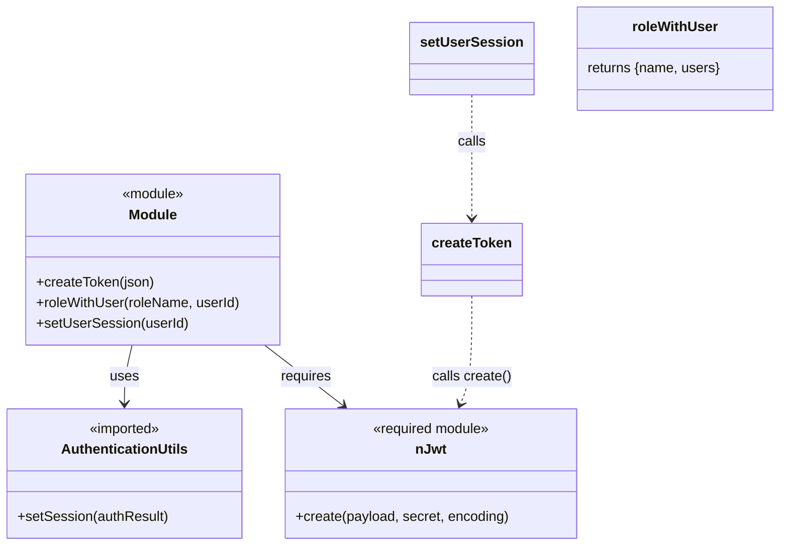

# Diagram: web/portal/src/modules/auth/tests/auth-test-utils.js


> Auto-generated by Obscura crawlers

## Diagram 1



### SVG

<svg id="container" width="898.44921875" xmlns="http://www.w3.org/2000/svg" class="classDiagram" height="632" viewBox="0 0 898.44921875 632" role="graphics-document document" aria-roledescription="class"><style>#container{font-family:"trebuchet ms",verdana,arial,sans-serif;font-size:16px;fill:#333;}@keyframes edge-animation-frame{from{stroke-dashoffset:0;}}@keyframes dash{to{stroke-dashoffset:0;}}#container .edge-animation-slow{stroke-dasharray:9,5!important;stroke-dashoffset:900;animation:dash 50s linear infinite;stroke-linecap:round;}#container .edge-animation-fast{stroke-dasharray:9,5!important;stroke-dashoffset:900;animation:dash 20s linear infinite;stroke-linecap:round;}#container .error-icon{fill:#552222;}#container .error-text{fill:#552222;stroke:#552222;}#container .edge-thickness-normal{stroke-width:1px;}#container .edge-thickness-thick{stroke-width:3.5px;}#container .edge-pattern-solid{stroke-dasharray:0;}#container .edge-thickness-invisible{stroke-width:0;fill:none;}#container .edge-pattern-dashed{stroke-dasharray:3;}#container .edge-pattern-dotted{stroke-dasharray:2;}#container .marker{fill:#333333;stroke:#333333;}#container .marker.cross{stroke:#333333;}#container svg{font-family:"trebuchet ms",verdana,arial,sans-serif;font-size:16px;}#container p{margin:0;}#container g.classGroup text{fill:#9370DB;stroke:none;font-family:"trebuchet ms",verdana,arial,sans-serif;font-size:10px;}#container g.classGroup text .title{font-weight:bolder;}#container .nodeLabel,#container .edgeLabel{color:#131300;}#container .edgeLabel .label rect{fill:#ECECFF;}#container .label text{fill:#131300;}#container .labelBkg{background:#ECECFF;}#container .edgeLabel .label span{background:#ECECFF;}#container .classTitle{font-weight:bolder;}#container .node rect,#container .node circle,#container .node ellipse,#container .node polygon,#container .node path{fill:#ECECFF;stroke:#9370DB;stroke-width:1px;}#container .divider{stroke:#9370DB;stroke-width:1;}#container g.clickable{cursor:pointer;}#container g.classGroup rect{fill:#ECECFF;stroke:#9370DB;}#container g.classGroup line{stroke:#9370DB;stroke-width:1;}#container .classLabel .box{stroke:none;stroke-width:0;fill:#ECECFF;opacity:0.5;}#container .classLabel .label{fill:#9370DB;font-size:10px;}#container .relation{stroke:#333333;stroke-width:1;fill:none;}#container .dashed-line{stroke-dasharray:3;}#container .dotted-line{stroke-dasharray:1 2;}#container #compositionStart,#container .composition{fill:#333333!important;stroke:#333333!important;stroke-width:1;}#container #compositionEnd,#container .composition{fill:#333333!important;stroke:#333333!important;stroke-width:1;}#container #dependencyStart,#container .dependency{fill:#333333!important;stroke:#333333!important;stroke-width:1;}#container #dependencyStart,#container .dependency{fill:#333333!important;stroke:#333333!important;stroke-width:1;}#container #extensionStart,#container .extension{fill:transparent!important;stroke:#333333!important;stroke-width:1;}#container #extensionEnd,#container .extension{fill:transparent!important;stroke:#333333!important;stroke-width:1;}#container #aggregationStart,#container .aggregation{fill:transparent!important;stroke:#333333!important;stroke-width:1;}#container #aggregationEnd,#container .aggregation{fill:transparent!important;stroke:#333333!important;stroke-width:1;}#container #lollipopStart,#container .lollipop{fill:#ECECFF!important;stroke:#333333!important;stroke-width:1;}#container #lollipopEnd,#container .lollipop{fill:#ECECFF!important;stroke:#333333!important;stroke-width:1;}#container .edgeTerminals{font-size:11px;line-height:initial;}#container .classTitleText{text-anchor:middle;font-size:18px;fill:#333;}#container .label-icon{display:inline-block;height:1em;overflow:visible;vertical-align:-0.125em;}#container .node .label-icon path{fill:currentColor;stroke:revert;stroke-width:revert;}#container :root{--mermaid-font-family:"trebuchet ms",verdana,arial,sans-serif;}</style><g><defs><marker id="container_class-aggregationStart" class="marker aggregation class" refX="18" refY="7" markerWidth="190" markerHeight="240" orient="auto"><path d="M 18,7 L9,13 L1,7 L9,1 Z"></path></marker></defs><defs><marker id="container_class-aggregationEnd" class="marker aggregation class" refX="1" refY="7" markerWidth="20" markerHeight="28" orient="auto"><path d="M 18,7 L9,13 L1,7 L9,1 Z"></path></marker></defs><defs><marker id="container_class-extensionStart" class="marker extension class" refX="18" refY="7" markerWidth="190" markerHeight="240" orient="auto"><path d="M 1,7 L18,13 V 1 Z"></path></marker></defs><defs><marker id="container_class-extensionEnd" class="marker extension class" refX="1" refY="7" markerWidth="20" markerHeight="28" orient="auto"><path d="M 1,1 V 13 L18,7 Z"></path></marker></defs><defs><marker id="container_class-compositionStart" class="marker composition class" refX="18" refY="7" markerWidth="190" markerHeight="240" orient="auto"><path d="M 18,7 L9,13 L1,7 L9,1 Z"></path></marker></defs><defs><marker id="container_class-compositionEnd" class="marker composition class" refX="1" refY="7" markerWidth="20" markerHeight="28" orient="auto"><path d="M 18,7 L9,13 L1,7 L9,1 Z"></path></marker></defs><defs><marker id="container_class-dependencyStart" class="marker dependency class" refX="6" refY="7" markerWidth="190" markerHeight="240" orient="auto"><path d="M 5,7 L9,13 L1,7 L9,1 Z"></path></marker></defs><defs><marker id="container_class-dependencyEnd" class="marker dependency class" refX="13" refY="7" markerWidth="20" markerHeight="28" orient="auto"><path d="M 18,7 L9,13 L14,7 L9,1 Z"></path></marker></defs><defs><marker id="container_class-lollipopStart" class="marker lollipop class" refX="13" refY="7" markerWidth="190" markerHeight="240" orient="auto"><circle stroke="black" fill="transparent" cx="7" cy="7" r="6"></circle></marker></defs><defs><marker id="container_class-lollipopEnd" class="marker lollipop class" refX="1" refY="7" markerWidth="190" markerHeight="240" orient="auto"><circle stroke="black" fill="transparent" cx="7" cy="7" r="6"></circle></marker></defs><g class="root"><g class="clusters"></g><g class="edgePaths"><path d="M151.673,400L150.169,406.167C148.665,412.333,145.657,424.667,144.153,436C142.648,447.333,142.648,457.667,142.648,462.833L142.648,468" id="id_Module_AuthenticationUtils_1" class="edge-thickness-normal edge-pattern-solid relation" style=";;;" data-edge="true" data-et="edge" data-id="id_Module_AuthenticationUtils_1" data-points="W3sieCI6MTUxLjY3MzEzODc4Njc2NDcsInkiOjQwMH0seyJ4IjoxNDIuNjQ4NDM3NSwieSI6NDM3fSx7IngiOjE0Mi42NDg0Mzc1LCJ5Ijo0NzR9XQ==" marker-end="url(#container_class-dependencyEnd)"></path><path d="M305.154,400L313.21,406.167C321.266,412.333,337.378,424.667,352.6,436.387C367.821,448.108,382.153,459.216,389.318,464.77L396.484,470.324" id="id_Module_nJwt_2" class="edge-thickness-normal edge-pattern-solid relation" style=";;;" data-edge="true" data-et="edge" data-id="id_Module_nJwt_2" data-points="W3sieCI6MzA1LjE1MzU2NDQ1MzEyNSwieSI6NDAwfSx7IngiOjM1My40OTAyMzQzNzUsInkiOjQzN30seyJ4Ijo0MDEuMjI2MTk2Mjg5MDYyNSwieSI6NDc0fV0=" marker-end="url(#container_class-dependencyEnd)"></path><path d="M546.004,343L546.004,358.667C546.004,374.333,546.004,405.667,543.754,426.581C541.505,447.495,537.005,457.99,534.755,463.238L532.506,468.485" id="id_createToken_nJwt_3" class="edge-thickness-normal edge-pattern-dashed relation" style=";;;" data-edge="true" data-et="edge" data-id="id_createToken_nJwt_3" data-points="W3sieCI6NTQ2LjAwMzkwNjI1LCJ5IjozNDN9LHsieCI6NTQ2LjAwMzkwNjI1LCJ5Ijo0Mzd9LHsieCI6NTMwLjE0MTYwMTU2MjUsInkiOjQ3NH1d" marker-end="url(#container_class-dependencyEnd)"></path><path d="M546.004,110L546.004,119.167C546.004,128.333,546.004,146.667,546.004,170.5C546.004,194.333,546.004,223.667,546.004,238.333L546.004,253" id="id_setUserSession_createToken_4" class="edge-thickness-normal edge-pattern-dashed relation" style=";;;" data-edge="true" data-et="edge" data-id="id_setUserSession_createToken_4" data-points="W3sieCI6NTQ2LjAwMzkwNjI1LCJ5IjoxMTB9LHsieCI6NTQ2LjAwMzkwNjI1LCJ5IjoxNjV9LHsieCI6NTQ2LjAwMzkwNjI1LCJ5IjoyNTl9XQ==" marker-end="url(#container_class-dependencyEnd)"></path></g><g class="edgeLabels"><g class="edgeLabel" transform="translate(142.6484375, 437)"><g class="label" data-id="id_Module_AuthenticationUtils_1" transform="translate(-16.4921875, -12)"><foreignObject width="32.984375" height="24"><div xmlns="http://www.w3.org/1999/xhtml" class="labelBkg" style="display: table-cell; white-space: nowrap; line-height: 1.5; max-width: 200px; text-align: center;"><span class="edgeLabel"><p>uses</p></span></div></foreignObject></g></g><g class="edgeLabel" transform="translate(353.490234375, 437)"><g class="label" data-id="id_Module_nJwt_2" transform="translate(-29.8515625, -12)"><foreignObject width="59.703125" height="24"><div xmlns="http://www.w3.org/1999/xhtml" class="labelBkg" style="display: table-cell; white-space: nowrap; line-height: 1.5; max-width: 200px; text-align: center;"><span class="edgeLabel"><p>requires</p></span></div></foreignObject></g></g><g class="edgeLabel" transform="translate(546.00390625, 437)"><g class="label" data-id="id_createToken_nJwt_3" transform="translate(-46.1796875, -12)"><foreignObject width="92.359375" height="24"><div xmlns="http://www.w3.org/1999/xhtml" class="labelBkg" style="display: table-cell; white-space: nowrap; line-height: 1.5; max-width: 200px; text-align: center;"><span class="edgeLabel"><p>calls create()</p></span></div></foreignObject></g></g><g class="edgeLabel" transform="translate(546.00390625, 165)"><g class="label" data-id="id_setUserSession_createToken_4" transform="translate(-16.4453125, -12)"><foreignObject width="32.890625" height="24"><div xmlns="http://www.w3.org/1999/xhtml" class="labelBkg" style="display: table-cell; white-space: nowrap; line-height: 1.5; max-width: 200px; text-align: center;"><span class="edgeLabel"><p>calls</p></span></div></foreignObject></g></g></g><g class="nodes"><g class="node default" id="classId-Module-0" transform="translate(175.8203125, 301)"><g class="basic label-container"><path d="M-148.70703125 -99 L148.70703125 -99 L148.70703125 99 L-148.70703125 99" stroke="none" stroke-width="0" fill="#ECECFF" style=""></path><path d="M-148.70703125 -99 C-47.89331693729507 -99, 52.92039737540986 -99, 148.70703125 -99 M-148.70703125 -99 C-43.31098172951637 -99, 62.08506779096726 -99, 148.70703125 -99 M148.70703125 -99 C148.70703125 -32.091471755012506, 148.70703125 34.81705648997499, 148.70703125 99 M148.70703125 -99 C148.70703125 -43.79394051514259, 148.70703125 11.412118969714825, 148.70703125 99 M148.70703125 99 C49.06817503363612 99, -50.57068118272775 99, -148.70703125 99 M148.70703125 99 C67.10803691544766 99, -14.490957419104689 99, -148.70703125 99 M-148.70703125 99 C-148.70703125 58.2634535132729, -148.70703125 17.5269070265458, -148.70703125 -99 M-148.70703125 99 C-148.70703125 57.50552796490973, -148.70703125 16.011055929819463, -148.70703125 -99" stroke="#9370DB" stroke-width="1.3" fill="none" stroke-dasharray="0 0" style=""></path></g><g class="annotation-group text" transform="translate(-36.6015625, -75)"><g class="label" style="" transform="translate(0,-12)"><foreignObject width="73.203125" height="24"><div xmlns="http://www.w3.org/1999/xhtml" style="display: table-cell; white-space: nowrap; line-height: 1.5; max-width: 123px; text-align: center;"><span class="nodeLabel markdown-node-label" style=""><p>«module»</p></span></div></foreignObject></g></g><g class="label-group text" transform="translate(-27.09375, -51)"><g class="label" style="font-weight: bolder" transform="translate(0,-12)"><foreignObject width="54.1875" height="24"><div xmlns="http://www.w3.org/1999/xhtml" style="display: table-cell; white-space: nowrap; line-height: 1.5; max-width: 104px; text-align: center;"><span class="nodeLabel markdown-node-label" style=""><p>Module</p></span></div></foreignObject></g></g><g class="members-group text" transform="translate(-136.70703125, -3)"></g><g class="methods-group text" transform="translate(-136.70703125, 27)"><g class="label" style="" transform="translate(0,-12)"><foreignObject width="137.359375" height="24"><div xmlns="http://www.w3.org/1999/xhtml" style="display: table-cell; white-space: nowrap; line-height: 1.5; max-width: 195px; text-align: center;"><span class="nodeLabel markdown-node-label" style=""><p>+createToken(json)</p></span></div></foreignObject></g><g class="label" style="" transform="translate(0,12)"><foreignObject width="236.8125" height="24"><div xmlns="http://www.w3.org/1999/xhtml" style="display: table-cell; white-space: nowrap; line-height: 1.5; max-width: 294px; text-align: center;"><span class="nodeLabel markdown-node-label" style=""><p>+roleWithUser(roleName, userId)</p></span></div></foreignObject></g><g class="label" style="" transform="translate(0,36)"><foreignObject width="174.625" height="24"><div xmlns="http://www.w3.org/1999/xhtml" style="display: table-cell; white-space: nowrap; line-height: 1.5; max-width: 232px; text-align: center;"><span class="nodeLabel markdown-node-label" style=""><p>+setUserSession(userId)</p></span></div></foreignObject></g></g><g class="divider" style=""><path d="M-148.70703125 -27 C-37.33729819098049 -27, 74.03243486803902 -27, 148.70703125 -27 M-148.70703125 -27 C-83.38397131006985 -27, -18.060911370139706 -27, 148.70703125 -27" stroke="#9370DB" stroke-width="1.3" fill="none" stroke-dasharray="0 0" style=""></path></g><g class="divider" style=""><path d="M-148.70703125 -3 C-58.200818703194145 -3, 32.30539384361171 -3, 148.70703125 -3 M-148.70703125 -3 C-65.17651585935285 -3, 18.353999531294306 -3, 148.70703125 -3" stroke="#9370DB" stroke-width="1.3" fill="none" stroke-dasharray="0 0" style=""></path></g></g><g class="node default" id="classId-AuthenticationUtils-1" transform="translate(142.6484375, 549)"><g class="basic label-container"><path d="M-134.6484375 -75 L134.6484375 -75 L134.6484375 75 L-134.6484375 75" stroke="none" stroke-width="0" fill="#ECECFF" style=""></path><path d="M-134.6484375 -75 C-29.854076600003367 -75, 74.94028429999327 -75, 134.6484375 -75 M-134.6484375 -75 C-52.08894440876324 -75, 30.47054868247352 -75, 134.6484375 -75 M134.6484375 -75 C134.6484375 -34.10756932948041, 134.6484375 6.784861341039175, 134.6484375 75 M134.6484375 -75 C134.6484375 -34.054098797867844, 134.6484375 6.891802404264311, 134.6484375 75 M134.6484375 75 C30.570538616920516 75, -73.50736026615897 75, -134.6484375 75 M134.6484375 75 C60.57348869307573 75, -13.501460113848538 75, -134.6484375 75 M-134.6484375 75 C-134.6484375 32.06518420541411, -134.6484375 -10.869631589171775, -134.6484375 -75 M-134.6484375 75 C-134.6484375 24.916499557268942, -134.6484375 -25.167000885462116, -134.6484375 -75" stroke="#9370DB" stroke-width="1.3" fill="none" stroke-dasharray="0 0" style=""></path></g><g class="annotation-group text" transform="translate(-42.671875, -51)"><g class="label" style="" transform="translate(0,-12)"><foreignObject width="85.34375" height="24"><div xmlns="http://www.w3.org/1999/xhtml" style="display: table-cell; white-space: nowrap; line-height: 1.5; max-width: 135px; text-align: center;"><span class="nodeLabel markdown-node-label" style=""><p>«imported»</p></span></div></foreignObject></g></g><g class="label-group text" transform="translate(-70.9375, -27)"><g class="label" style="font-weight: bolder" transform="translate(0,-12)"><foreignObject width="141.875" height="24"><div xmlns="http://www.w3.org/1999/xhtml" style="display: table-cell; white-space: nowrap; line-height: 1.5; max-width: 190px; text-align: center;"><span class="nodeLabel markdown-node-label" style=""><p>AuthenticationUtils</p></span></div></foreignObject></g></g><g class="members-group text" transform="translate(-122.6484375, 21)"></g><g class="methods-group text" transform="translate(-122.6484375, 51)"><g class="label" style="" transform="translate(0,-12)"><foreignObject width="174.359375" height="24"><div xmlns="http://www.w3.org/1999/xhtml" style="display: table-cell; white-space: nowrap; line-height: 1.5; max-width: 232px; text-align: center;"><span class="nodeLabel markdown-node-label" style=""><p>+setSession(authResult)</p></span></div></foreignObject></g></g><g class="divider" style=""><path d="M-134.6484375 -3 C-44.67532608605471 -3, 45.29778532789058 -3, 134.6484375 -3 M-134.6484375 -3 C-62.30281164902472 -3, 10.042814201950563 -3, 134.6484375 -3" stroke="#9370DB" stroke-width="1.3" fill="none" stroke-dasharray="0 0" style=""></path></g><g class="divider" style=""><path d="M-134.6484375 21 C-57.646504839630566 21, 19.355427820738868 21, 134.6484375 21 M-134.6484375 21 C-67.41045503682018 21, -0.17247257364036273 21, 134.6484375 21" stroke="#9370DB" stroke-width="1.3" fill="none" stroke-dasharray="0 0" style=""></path></g></g><g class="node default" id="classId-nJwt-2" transform="translate(497.98828125, 549)"><g class="basic label-container"><path d="M-170.69140625 -75 L170.69140625 -75 L170.69140625 75 L-170.69140625 75" stroke="none" stroke-width="0" fill="#ECECFF" style=""></path><path d="M-170.69140625 -75 C-86.58741492242966 -75, -2.4834235948593175 -75, 170.69140625 -75 M-170.69140625 -75 C-87.83507722350957 -75, -4.978748197019144 -75, 170.69140625 -75 M170.69140625 -75 C170.69140625 -31.87797834049882, 170.69140625 11.244043319002358, 170.69140625 75 M170.69140625 -75 C170.69140625 -35.23462629192733, 170.69140625 4.530747416145346, 170.69140625 75 M170.69140625 75 C98.84968487457091 75, 27.007963499141823 75, -170.69140625 75 M170.69140625 75 C83.26829569175338 75, -4.15481486649324 75, -170.69140625 75 M-170.69140625 75 C-170.69140625 41.27159297476009, -170.69140625 7.543185949520179, -170.69140625 -75 M-170.69140625 75 C-170.69140625 35.53460831756533, -170.69140625 -3.9307833648693418, -170.69140625 -75" stroke="#9370DB" stroke-width="1.3" fill="none" stroke-dasharray="0 0" style=""></path></g><g class="annotation-group text" transform="translate(-69.6171875, -51)"><g class="label" style="" transform="translate(0,-12)"><foreignObject width="139.234375" height="24"><div xmlns="http://www.w3.org/1999/xhtml" style="display: table-cell; white-space: nowrap; line-height: 1.5; max-width: 189px; text-align: center;"><span class="nodeLabel markdown-node-label" style=""><p>«required module»</p></span></div></foreignObject></g></g><g class="label-group text" transform="translate(-16.234375, -27)"><g class="label" style="font-weight: bolder" transform="translate(0,-12)"><foreignObject width="32.46875" height="24"><div xmlns="http://www.w3.org/1999/xhtml" style="display: table-cell; white-space: nowrap; line-height: 1.5; max-width: 82px; text-align: center;"><span class="nodeLabel markdown-node-label" style=""><p>nJwt</p></span></div></foreignObject></g></g><g class="members-group text" transform="translate(-158.69140625, 21)"></g><g class="methods-group text" transform="translate(-158.69140625, 51)"><g class="label" style="" transform="translate(0,-12)"><foreignObject width="247.765625" height="24"><div xmlns="http://www.w3.org/1999/xhtml" style="display: table-cell; white-space: nowrap; line-height: 1.5; max-width: 305px; text-align: center;"><span class="nodeLabel markdown-node-label" style=""><p>+create(payload, secret, encoding)</p></span></div></foreignObject></g></g><g class="divider" style=""><path d="M-170.69140625 -3 C-81.737648906094 -3, 7.216108437812011 -3, 170.69140625 -3 M-170.69140625 -3 C-93.60146135606192 -3, -16.511516462123836 -3, 170.69140625 -3" stroke="#9370DB" stroke-width="1.3" fill="none" stroke-dasharray="0 0" style=""></path></g><g class="divider" style=""><path d="M-170.69140625 21 C-81.88558801571567 21, 6.920230218568662 21, 170.69140625 21 M-170.69140625 21 C-52.55287181914292 21, 65.58566261171416 21, 170.69140625 21" stroke="#9370DB" stroke-width="1.3" fill="none" stroke-dasharray="0 0" style=""></path></g></g><g class="node default" id="classId-createToken-3" transform="translate(546.00390625, 301)"><g class="basic label-container"><path d="M-56.78125 -42 L56.78125 -42 L56.78125 42 L-56.78125 42" stroke="none" stroke-width="0" fill="#ECECFF" style=""></path><path d="M-56.78125 -42 C-33.557878502571846 -42, -10.334507005143692 -42, 56.78125 -42 M-56.78125 -42 C-29.370283062494074 -42, -1.959316124988149 -42, 56.78125 -42 M56.78125 -42 C56.78125 -22.484834782845137, 56.78125 -2.9696695656902747, 56.78125 42 M56.78125 -42 C56.78125 -14.21827244811222, 56.78125 13.56345510377556, 56.78125 42 M56.78125 42 C17.074010398216032 42, -22.633229203567936 42, -56.78125 42 M56.78125 42 C31.780343983690255 42, 6.77943796738051 42, -56.78125 42 M-56.78125 42 C-56.78125 9.315104236416907, -56.78125 -23.369791527166186, -56.78125 -42 M-56.78125 42 C-56.78125 18.95895380285335, -56.78125 -4.082092394293298, -56.78125 -42" stroke="#9370DB" stroke-width="1.3" fill="none" stroke-dasharray="0 0" style=""></path></g><g class="annotation-group text" transform="translate(0, -18)"></g><g class="label-group text" transform="translate(-44.78125, -18)"><g class="label" style="font-weight: bolder" transform="translate(0,-12)"><foreignObject width="89.5625" height="24"><div xmlns="http://www.w3.org/1999/xhtml" style="display: table-cell; white-space: nowrap; line-height: 1.5; max-width: 138px; text-align: center;"><span class="nodeLabel markdown-node-label" style=""><p>createToken</p></span></div></foreignObject></g></g><g class="members-group text" transform="translate(-44.78125, 30)"></g><g class="methods-group text" transform="translate(-44.78125, 60)"></g><g class="divider" style=""><path d="M-56.78125 6 C-29.648916077261216 6, -2.516582154522432 6, 56.78125 6 M-56.78125 6 C-25.39313509286842 6, 5.994979814263161 6, 56.78125 6" stroke="#9370DB" stroke-width="1.3" fill="none" stroke-dasharray="0 0" style=""></path></g><g class="divider" style=""><path d="M-56.78125 24 C-28.4968755106617 24, -0.21250102132339777 24, 56.78125 24 M-56.78125 24 C-24.206355453361567 24, 8.368539093276866 24, 56.78125 24" stroke="#9370DB" stroke-width="1.3" fill="none" stroke-dasharray="0 0" style=""></path></g></g><g class="node default" id="classId-setUserSession-4" transform="translate(546.00390625, 68)"><g class="basic label-container"><path d="M-68.234375 -42 L68.234375 -42 L68.234375 42 L-68.234375 42" stroke="none" stroke-width="0" fill="#ECECFF" style=""></path><path d="M-68.234375 -42 C-24.496408788872834 -42, 19.24155742225433 -42, 68.234375 -42 M-68.234375 -42 C-24.384474345383673 -42, 19.465426309232654 -42, 68.234375 -42 M68.234375 -42 C68.234375 -10.931173306755593, 68.234375 20.137653386488815, 68.234375 42 M68.234375 -42 C68.234375 -8.639078719960125, 68.234375 24.72184256007975, 68.234375 42 M68.234375 42 C21.214434086126133 42, -25.805506827747735 42, -68.234375 42 M68.234375 42 C35.048364156131036 42, 1.8623533122620728 42, -68.234375 42 M-68.234375 42 C-68.234375 10.290810811533532, -68.234375 -21.418378376932935, -68.234375 -42 M-68.234375 42 C-68.234375 16.200364022817375, -68.234375 -9.59927195436525, -68.234375 -42" stroke="#9370DB" stroke-width="1.3" fill="none" stroke-dasharray="0 0" style=""></path></g><g class="annotation-group text" transform="translate(0, -18)"></g><g class="label-group text" transform="translate(-56.234375, -18)"><g class="label" style="font-weight: bolder" transform="translate(0,-12)"><foreignObject width="112.46875" height="24"><div xmlns="http://www.w3.org/1999/xhtml" style="display: table-cell; white-space: nowrap; line-height: 1.5; max-width: 160px; text-align: center;"><span class="nodeLabel markdown-node-label" style=""><p>setUserSession</p></span></div></foreignObject></g></g><g class="members-group text" transform="translate(-56.234375, 30)"></g><g class="methods-group text" transform="translate(-56.234375, 60)"></g><g class="divider" style=""><path d="M-68.234375 6 C-23.529893327721993 6, 21.174588344556014 6, 68.234375 6 M-68.234375 6 C-36.176307943738365 6, -4.1182408874767304 6, 68.234375 6" stroke="#9370DB" stroke-width="1.3" fill="none" stroke-dasharray="0 0" style=""></path></g><g class="divider" style=""><path d="M-68.234375 24 C-38.91848423404515 24, -9.602593468090305 24, 68.234375 24 M-68.234375 24 C-25.995739083831843 24, 16.242896832336314 24, 68.234375 24" stroke="#9370DB" stroke-width="1.3" fill="none" stroke-dasharray="0 0" style=""></path></g></g><g class="node default" id="classId-roleWithUser-5" transform="translate(777.34375, 68)"><g class="basic label-container"><path d="M-113.10546875 -60 L113.10546875 -60 L113.10546875 60 L-113.10546875 60" stroke="none" stroke-width="0" fill="#ECECFF" style=""></path><path d="M-113.10546875 -60 C-61.850285410845956 -60, -10.595102071691912 -60, 113.10546875 -60 M-113.10546875 -60 C-61.58377397206795 -60, -10.062079194135904 -60, 113.10546875 -60 M113.10546875 -60 C113.10546875 -22.47379884379466, 113.10546875 15.052402312410678, 113.10546875 60 M113.10546875 -60 C113.10546875 -13.72756256575613, 113.10546875 32.54487486848774, 113.10546875 60 M113.10546875 60 C35.61262447527568 60, -41.88021979944864 60, -113.10546875 60 M113.10546875 60 C45.59662483341002 60, -21.912219083179963 60, -113.10546875 60 M-113.10546875 60 C-113.10546875 32.211177083683694, -113.10546875 4.422354167367388, -113.10546875 -60 M-113.10546875 60 C-113.10546875 24.200672151071657, -113.10546875 -11.598655697856685, -113.10546875 -60" stroke="#9370DB" stroke-width="1.3" fill="none" stroke-dasharray="0 0" style=""></path></g><g class="annotation-group text" transform="translate(0, -36)"></g><g class="label-group text" transform="translate(-47.7890625, -36)"><g class="label" style="font-weight: bolder" transform="translate(0,-12)"><foreignObject width="95.578125" height="24"><div xmlns="http://www.w3.org/1999/xhtml" style="display: table-cell; white-space: nowrap; line-height: 1.5; max-width: 145px; text-align: center;"><span class="nodeLabel markdown-node-label" style=""><p>roleWithUser</p></span></div></foreignObject></g></g><g class="members-group text" transform="translate(-101.10546875, 12)"><g class="label" style="" transform="translate(0,-12)"><foreignObject width="154.421875" height="24"><div xmlns="http://www.w3.org/1999/xhtml" style="display: table-cell; white-space: nowrap; line-height: 1.5; max-width: 204px; text-align: center;"><span class="nodeLabel markdown-node-label" style=""><p>returns {name, users}</p></span></div></foreignObject></g></g><g class="methods-group text" transform="translate(-101.10546875, 60)"></g><g class="divider" style=""><path d="M-113.10546875 -12 C-53.46288152569169 -12, 6.1797056986166155 -12, 113.10546875 -12 M-113.10546875 -12 C-36.928615411563015 -12, 39.24823792687397 -12, 113.10546875 -12" stroke="#9370DB" stroke-width="1.3" fill="none" stroke-dasharray="0 0" style=""></path></g><g class="divider" style=""><path d="M-113.10546875 36 C-33.09703997698857 36, 46.91138879602286 36, 113.10546875 36 M-113.10546875 36 C-34.73841099659877 36, 43.62864675680245 36, 113.10546875 36" stroke="#9370DB" stroke-width="1.3" fill="none" stroke-dasharray="0 0" style=""></path></g></g></g></g></g></svg>

## Diagram 2

```mermaid
flowchart LR
A[setUserSession(userId)] --> B[createToken(access payload: {"http://www.freightverify.com/user_authorization": {user_id: userId}})]
B --> C[nJwt.create(access payload, "secret", "HS256")]
A --> D[createToken(id payload: {id_token: "test_token"})]
D --> E[nJwt.create(id payload, "secret", "HS256")]
C --> F[access_token]
E --> G[id_token]
F & G --> H[authResult = {expires_in: 1000, access_token, id_token}]
H --> I[AuthenticationUtils.setSession(authResult)]
```

> SVG rendering failed for this diagram.
