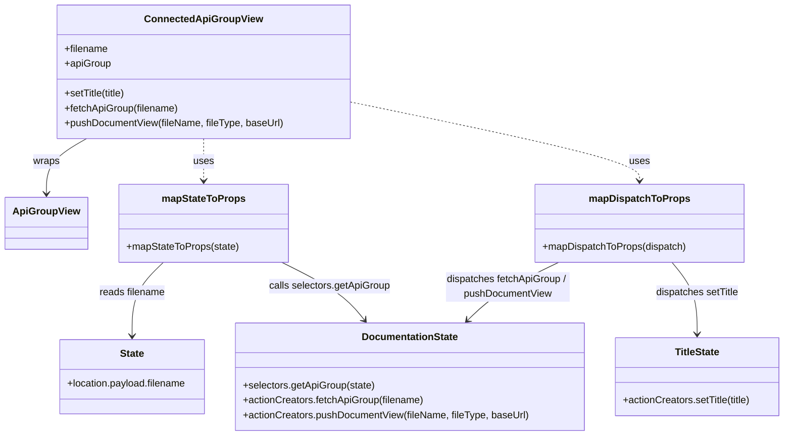

# Diagram: web/portal/src/modules/documentation/ApiGroupContainer.js

> Auto-generated by Obscura crawlers

## Mermaid

### SVG

<svg id="container" width="1262.541015625" xmlns="http://www.w3.org/2000/svg" class="classDiagram" height="704" viewBox="0 0 1262.541015625 704" role="graphics-document document" aria-roledescription="class"><g><defs><marker id="container_class-aggregationStart" class="marker aggregation class" refX="18" refY="7" markerWidth="190" markerHeight="240" orient="auto"><path d="M 18,7 L9,13 L1,7 L9,1 Z"></path></marker></defs><defs><marker id="container_class-aggregationEnd" class="marker aggregation class" refX="1" refY="7" markerWidth="20" markerHeight="28" orient="auto"><path d="M 18,7 L9,13 L1,7 L9,1 Z"></path></marker></defs><defs><marker id="container_class-extensionStart" class="marker extension class" refX="18" refY="7" markerWidth="190" markerHeight="240" orient="auto"><path d="M 1,7 L18,13 V 1 Z"></path></marker></defs><defs><marker id="container_class-extensionEnd" class="marker extension class" refX="1" refY="7" markerWidth="20" markerHeight="28" orient="auto"><path d="M 1,1 V 13 L18,7 Z"></path></marker></defs><defs><marker id="container_class-compositionStart" class="marker composition class" refX="18" refY="7" markerWidth="190" markerHeight="240" orient="auto"><path d="M 18,7 L9,13 L1,7 L9,1 Z"></path></marker></defs><defs><marker id="container_class-compositionEnd" class="marker composition class" refX="1" refY="7" markerWidth="20" markerHeight="28" orient="auto"><path d="M 18,7 L9,13 L1,7 L9,1 Z"></path></marker></defs><defs><marker id="container_class-dependencyStart" class="marker dependency class" refX="6" refY="7" markerWidth="190" markerHeight="240" orient="auto"><path d="M 5,7 L9,13 L1,7 L9,1 Z"></path></marker></defs><defs><marker id="container_class-dependencyEnd" class="marker dependency class" refX="13" refY="7" markerWidth="20" markerHeight="28" orient="auto"><path d="M 18,7 L9,13 L14,7 L9,1 Z"></path></marker></defs><defs><marker id="container_class-lollipopStart" class="marker lollipop class" refX="13" refY="7" markerWidth="190" markerHeight="240" orient="auto"><circle stroke="black" fill="transparent" cx="7" cy="7" r="6"></circle></marker></defs><defs><marker id="container_class-lollipopEnd" class="marker lollipop class" refX="1" refY="7" markerWidth="190" markerHeight="240" orient="auto"><circle stroke="black" fill="transparent" cx="7" cy="7" r="6"></circle></marker></defs><g class="root"><g class="clusters"></g><g class="edgePaths"><path d="M134.47,224L123.914,230.167C113.358,236.333,92.245,248.667,81.689,263.5C71.133,278.333,71.133,295.667,71.133,304.333L71.133,313" id="id_ConnectedApiGroupView_ApiGroupView_1" class="edge-thickness-normal edge-pattern-solid relation" style=";;;" data-edge="true" data-et="edge" data-id="id_ConnectedApiGroupView_ApiGroupView_1" data-points="W3sieCI6MTM0LjQ3MDM5MzMxODk2NTUsInkiOjIyNH0seyJ4Ijo3MS4xMzI4MTI1LCJ5IjoyNjF9LHsieCI6NzEuMTMyODEyNSwieSI6MzE5fV0=" marker-end="url(#container_class-dependencyEnd)"></path><path d="M319.348,224L319.348,230.167C319.348,236.333,319.348,248.667,319.348,260C319.348,271.333,319.348,281.667,319.348,286.833L319.348,292" id="id_ConnectedApiGroupView_mapStateToProps_2" class="edge-thickness-normal edge-pattern-dashed relation" style=";;;" data-edge="true" data-et="edge" data-id="id_ConnectedApiGroupView_mapStateToProps_2" data-points="W3sieCI6MzE5LjM0NzY1NjI1LCJ5IjoyMjR9LHsieCI6MzE5LjM0NzY1NjI1LCJ5IjoyNjF9LHsieCI6MzE5LjM0NzY1NjI1LCJ5IjoyOTh9XQ==" marker-end="url(#container_class-dependencyEnd)"></path><path d="M553.227,164.024L631.939,180.187C710.652,196.349,868.077,228.675,946.789,250.004C1025.502,271.333,1025.502,281.667,1025.502,286.833L1025.502,292" id="id_ConnectedApiGroupView_mapDispatchToProps_3" class="edge-thickness-normal edge-pattern-dashed relation" style=";;;" data-edge="true" data-et="edge" data-id="id_ConnectedApiGroupView_mapDispatchToProps_3" data-points="W3sieCI6NTUzLjIyNjU2MjUsInkiOjE2NC4wMjQxMjM4NDQyMTU2fSx7IngiOjEwMjUuNTAxOTUzMTI1LCJ5IjoyNjF9LHsieCI6MTAyNS41MDE5NTMxMjUsInkiOjI5OH1d" marker-end="url(#container_class-dependencyEnd)"></path><path d="M253.974,424L245.499,432.167C237.025,440.333,220.076,456.667,211.601,476.5C203.127,496.333,203.127,519.667,203.127,531.333L203.127,543" id="id_mapStateToProps_State_4" class="edge-thickness-normal edge-pattern-solid relation" style=";;;" data-edge="true" data-et="edge" data-id="id_mapStateToProps_State_4" data-points="W3sieCI6MjUzLjk3MzUxMDc0MjE4NzUsInkiOjQyNH0seyJ4IjoyMDMuMTI2OTUzMTI1LCJ5Ijo0NzN9LHsieCI6MjAzLjEyNjk1MzEyNSwieSI6NTQ5fV0=" marker-end="url(#container_class-dependencyEnd)"></path><path d="M446.028,424L462.449,432.167C478.871,440.333,511.714,456.667,534.054,472.22C556.395,487.773,568.234,502.545,574.153,509.932L580.072,517.318" id="id_mapStateToProps_DocumentationState_5" class="edge-thickness-normal edge-pattern-solid relation" style=";;;" data-edge="true" data-et="edge" data-id="id_mapStateToProps_DocumentationState_5" data-points="W3sieCI6NDQ2LjAyNzcwOTk2MDkzNzUsInkiOjQyNH0seyJ4Ijo1NDQuNTU2NjQwNjI1LCJ5Ijo0NzN9LHsieCI6NTgzLjgyNDQ3NzI1MTgzODMsInkiOjUyMn1d" marker-end="url(#container_class-dependencyEnd)"></path><path d="M894.431,424L877.44,432.167C860.449,440.333,826.468,456.667,801.848,472.3C777.229,487.934,761.972,502.869,754.343,510.336L746.714,517.803" id="id_mapDispatchToProps_DocumentationState_6" class="edge-thickness-normal edge-pattern-solid relation" style=";;;" data-edge="true" data-et="edge" data-id="id_mapDispatchToProps_DocumentationState_6" data-points="W3sieCI6ODk0LjQzMDY2NDA2MjUsInkiOjQyNH0seyJ4Ijo3OTIuNDg2MzI4MTI1LCJ5Ijo0NzN9LHsieCI6NzQyLjQyNjU1Njc1NTUxNDgsInkiOjUyMn1d" marker-end="url(#container_class-dependencyEnd)"></path><path d="M1078.419,424L1085.278,432.167C1092.138,440.333,1105.857,456.667,1112.717,476C1119.576,495.333,1119.576,517.667,1119.576,528.833L1119.576,540" id="id_mapDispatchToProps_TitleState_7" class="edge-thickness-normal edge-pattern-solid relation" style=";;;" data-edge="true" data-et="edge" data-id="id_mapDispatchToProps_TitleState_7" data-points="W3sieCI6MTA3OC40MTg3MDExNzE4NzUsInkiOjQyNH0seyJ4IjoxMTE5LjU3NjE3MTg3NSwieSI6NDczfSx7IngiOjExMTkuNTc2MTcxODc1LCJ5Ijo1NDZ9XQ==" marker-end="url(#container_class-dependencyEnd)"></path></g><g class="edgeLabels"><g class="edgeLabel" transform="translate(71.1328125, 261)"><g class="label" data-id="id_ConnectedApiGroupView_ApiGroupView_1" transform="translate(-21.390625, -12)"><foreignObject width="42.78125" height="24">

wraps

</foreignObject></g></g><g class="edgeLabel" transform="translate(319.34765625, 261)"><g class="label" data-id="id_ConnectedApiGroupView_mapStateToProps_2" transform="translate(-16.4921875, -12)"><foreignObject width="32.984375" height="24">

uses

</foreignObject></g></g><g class="edgeLabel" transform="translate(1025.501953125, 261)"><g class="label" data-id="id_ConnectedApiGroupView_mapDispatchToProps_3" transform="translate(-16.4921875, -12)"><foreignObject width="32.984375" height="24">

uses

</foreignObject></g></g><g class="edgeLabel" transform="translate(203.126953125, 473)"><g class="label" data-id="id_mapStateToProps_State_4" transform="translate(-53.640625, -12)"><foreignObject width="107.28125" height="24">

reads filename

</foreignObject></g></g><g class="edgeLabel" transform="translate(523.40418, 462.48055)"><g class="label" data-id="id_mapStateToProps_DocumentationState_5" transform="translate(-97.9765625, -12)"><foreignObject width="195.953125" height="24">

calls selectors.getApiGroup

</foreignObject></g></g><g class="edgeLabel" transform="translate(811.89079, 463.67316)"><g class="label" data-id="id_mapDispatchToProps_DocumentationState_6" transform="translate(-100, -24)"><foreignObject width="200" height="48">

dispatches fetchApiGroup / pushDocumentView

</foreignObject></g></g><g class="edgeLabel" transform="translate(1119.576171875, 473)"><g class="label" data-id="id_mapDispatchToProps_TitleState_7" transform="translate(-68.1484375, -12)"><foreignObject width="136.296875" height="24">

dispatches setTitle

</foreignObject></g></g></g><g class="nodes"><g class="node default" id="classId-ApiGroupView-0" transform="translate(71.1328125, 361)"><g class="basic label-container"><path d="M-63.1328125 -42 L63.1328125 -42 L63.1328125 42 L-63.1328125 42" stroke="none" stroke-width="0" fill="#ECECFF" style=""></path><path d="M-63.1328125 -42 C-29.403460474825543 -42, 4.3258915503489135 -42, 63.1328125 -42 M-63.1328125 -42 C-30.57629740320921 -42, 1.9802176935815794 -42, 63.1328125 -42 M63.1328125 -42 C63.1328125 -21.002919363455575, 63.1328125 -0.005838726911150616, 63.1328125 42 M63.1328125 -42 C63.1328125 -20.043822399820183, 63.1328125 1.9123552003596345, 63.1328125 42 M63.1328125 42 C26.31696318024261 42, -10.49888613951478 42, -63.1328125 42 M63.1328125 42 C20.766393542706567 42, -21.600025414586867 42, -63.1328125 42 M-63.1328125 42 C-63.1328125 21.544678543077914, -63.1328125 1.0893570861558288, -63.1328125 -42 M-63.1328125 42 C-63.1328125 21.943948675936966, -63.1328125 1.8878973518739315, -63.1328125 -42" stroke="#9370DB" stroke-width="1.3" fill="none" stroke-dasharray="0 0" style=""></path></g><g class="annotation-group text" transform="translate(0, -18)"></g><g class="label-group text" transform="translate(-51.1328125, -18)"><g class="label" style="font-weight: bolder" transform="translate(0,-12)"><foreignObject width="102.265625" height="24">

ApiGroupView

</foreignObject></g></g><g class="members-group text" transform="translate(-51.1328125, 30)"></g><g class="methods-group text" transform="translate(-51.1328125, 60)"></g><g class="divider" style=""><path d="M-63.1328125 6 C-25.821422794542585 6, 11.48996691091483 6, 63.1328125 6 M-63.1328125 6 C-35.992750479655044 6, -8.852688459310087 6, 63.1328125 6" stroke="#9370DB" stroke-width="1.3" fill="none" stroke-dasharray="0 0" style=""></path></g><g class="divider" style=""><path d="M-63.1328125 24 C-14.986431243891069 24, 33.15995001221786 24, 63.1328125 24 M-63.1328125 24 C-33.54263973762809 24, -3.952466975256179 24, 63.1328125 24" stroke="#9370DB" stroke-width="1.3" fill="none" stroke-dasharray="0 0" style=""></path></g></g><g class="node default" id="classId-ConnectedApiGroupView-1" transform="translate(319.34765625, 116)"><g class="basic label-container"><path d="M-233.87890625 -108 L233.87890625 -108 L233.87890625 108 L-233.87890625 108" stroke="none" stroke-width="0" fill="#ECECFF" style=""></path><path d="M-233.87890625 -108 C-130.5078531092344 -108, -27.13679996846878 -108, 233.87890625 -108 M-233.87890625 -108 C-101.73025820015269 -108, 30.41838984969462 -108, 233.87890625 -108 M233.87890625 -108 C233.87890625 -44.02244832389156, 233.87890625 19.95510335221688, 233.87890625 108 M233.87890625 -108 C233.87890625 -34.42122208504489, 233.87890625 39.15755582991022, 233.87890625 108 M233.87890625 108 C102.01670611426258 108, -29.84549402147485 108, -233.87890625 108 M233.87890625 108 C52.50638851287903 108, -128.86612922424194 108, -233.87890625 108 M-233.87890625 108 C-233.87890625 23.30604352576816, -233.87890625 -61.38791294846368, -233.87890625 -108 M-233.87890625 108 C-233.87890625 36.046937663025375, -233.87890625 -35.90612467394925, -233.87890625 -108" stroke="#9370DB" stroke-width="1.3" fill="none" stroke-dasharray="0 0" style=""></path></g><g class="annotation-group text" transform="translate(0, -84)"></g><g class="label-group text" transform="translate(-89.8828125, -84)"><g class="label" style="font-weight: bolder" transform="translate(0,-12)"><foreignObject width="179.765625" height="24">

ConnectedApiGroupView

</foreignObject></g></g><g class="members-group text" transform="translate(-221.87890625, -36)"><g class="label" style="" transform="translate(0,-12)"><foreignObject width="70.796875" height="24">

+filename

</foreignObject></g><g class="label" style="" transform="translate(0,12)"><foreignObject width="74.421875" height="24">

+apiGroup

</foreignObject></g></g><g class="methods-group text" transform="translate(-221.87890625, 36)"><g class="label" style="" transform="translate(0,-12)"><foreignObject width="101.28125" height="24">

+setTitle(title)

</foreignObject></g><g class="label" style="" transform="translate(0,12)"><foreignObject width="184.78125" height="24">

+fetchApiGroup(filename)

</foreignObject></g><g class="label" style="" transform="translate(0,36)"><foreignObject width="353.875" height="24">

+pushDocumentView(fileName, fileType, baseUrl)

</foreignObject></g></g><g class="divider" style=""><path d="M-233.87890625 -60 C-112.1412256239181 -60, 9.596455002163793 -60, 233.87890625 -60 M-233.87890625 -60 C-135.12543946195615 -60, -36.37197267391227 -60, 233.87890625 -60" stroke="#9370DB" stroke-width="1.3" fill="none" stroke-dasharray="0 0" style=""></path></g><g class="divider" style=""><path d="M-233.87890625 12 C-55.077022870601326 12, 123.72486050879735 12, 233.87890625 12 M-233.87890625 12 C-75.24139066034738 12, 83.39612492930524 12, 233.87890625 12" stroke="#9370DB" stroke-width="1.3" fill="none" stroke-dasharray="0 0" style=""></path></g></g><g class="node default" id="classId-mapStateToProps-2" transform="translate(319.34765625, 361)"><g class="basic label-container"><path d="M-135.08203125 -63 L135.08203125 -63 L135.08203125 63 L-135.08203125 63" stroke="none" stroke-width="0" fill="#ECECFF" style=""></path><path d="M-135.08203125 -63 C-65.77752816772764 -63, 3.5269749145447236 -63, 135.08203125 -63 M-135.08203125 -63 C-70.14415549921452 -63, -5.20627974842904 -63, 135.08203125 -63 M135.08203125 -63 C135.08203125 -30.230152290389363, 135.08203125 2.5396954192212746, 135.08203125 63 M135.08203125 -63 C135.08203125 -26.593349034916386, 135.08203125 9.813301930167228, 135.08203125 63 M135.08203125 63 C75.65763766241827 63, 16.233244074836534 63, -135.08203125 63 M135.08203125 63 C37.54845683730976 63, -59.985117575380485 63, -135.08203125 63 M-135.08203125 63 C-135.08203125 27.376299257009947, -135.08203125 -8.247401485980106, -135.08203125 -63 M-135.08203125 63 C-135.08203125 22.612433170339557, -135.08203125 -17.775133659320886, -135.08203125 -63" stroke="#9370DB" stroke-width="1.3" fill="none" stroke-dasharray="0 0" style=""></path></g><g class="annotation-group text" transform="translate(0, -39)"></g><g class="label-group text" transform="translate(-64.7109375, -39)"><g class="label" style="font-weight: bolder" transform="translate(0,-12)"><foreignObject width="129.421875" height="24">

mapStateToProps

</foreignObject></g></g><g class="members-group text" transform="translate(-123.08203125, 9)"></g><g class="methods-group text" transform="translate(-123.08203125, 39)"><g class="label" style="" transform="translate(0,-12)"><foreignObject width="181.453125" height="24">

+mapStateToProps(state)

</foreignObject></g></g><g class="divider" style=""><path d="M-135.08203125 -15 C-79.47164154305024 -15, -23.86125183610048 -15, 135.08203125 -15 M-135.08203125 -15 C-38.41601832773411 -15, 58.249994594531785 -15, 135.08203125 -15" stroke="#9370DB" stroke-width="1.3" fill="none" stroke-dasharray="0 0" style=""></path></g><g class="divider" style=""><path d="M-135.08203125 9 C-41.93123185698235 9, 51.2195675360353 9, 135.08203125 9 M-135.08203125 9 C-55.152419446548976 9, 24.77719235690205 9, 135.08203125 9" stroke="#9370DB" stroke-width="1.3" fill="none" stroke-dasharray="0 0" style=""></path></g></g><g class="node default" id="classId-mapDispatchToProps-3" transform="translate(1025.501953125, 361)"><g class="basic label-container"><path d="M-167.12890625 -63 L167.12890625 -63 L167.12890625 63 L-167.12890625 63" stroke="none" stroke-width="0" fill="#ECECFF" style=""></path><path d="M-167.12890625 -63 C-83.22400258425287 -63, 0.6809010814942553 -63, 167.12890625 -63 M-167.12890625 -63 C-63.65271369603455 -63, 39.823478857930894 -63, 167.12890625 -63 M167.12890625 -63 C167.12890625 -20.837478031458367, 167.12890625 21.325043937083265, 167.12890625 63 M167.12890625 -63 C167.12890625 -19.16393391092656, 167.12890625 24.67213217814688, 167.12890625 63 M167.12890625 63 C39.902374411257256 63, -87.32415742748549 63, -167.12890625 63 M167.12890625 63 C44.03611294667482 63, -79.05668035665036 63, -167.12890625 63 M-167.12890625 63 C-167.12890625 20.34851385634706, -167.12890625 -22.302972287305877, -167.12890625 -63 M-167.12890625 63 C-167.12890625 33.03772532885087, -167.12890625 3.0754506577017366, -167.12890625 -63" stroke="#9370DB" stroke-width="1.3" fill="none" stroke-dasharray="0 0" style=""></path></g><g class="annotation-group text" transform="translate(0, -39)"></g><g class="label-group text" transform="translate(-77.1953125, -39)"><g class="label" style="font-weight: bolder" transform="translate(0,-12)"><foreignObject width="154.390625" height="24">

mapDispatchToProps

</foreignObject></g></g><g class="members-group text" transform="translate(-155.12890625, 9)"></g><g class="methods-group text" transform="translate(-155.12890625, 39)"><g class="label" style="" transform="translate(0,-12)"><foreignObject width="233.0625" height="24">

+mapDispatchToProps(dispatch)

</foreignObject></g></g><g class="divider" style=""><path d="M-167.12890625 -15 C-38.00864453460008 -15, 91.11161718079984 -15, 167.12890625 -15 M-167.12890625 -15 C-96.71688248706059 -15, -26.304858724121175 -15, 167.12890625 -15" stroke="#9370DB" stroke-width="1.3" fill="none" stroke-dasharray="0 0" style=""></path></g><g class="divider" style=""><path d="M-167.12890625 9 C-57.105935420082105 9, 52.91703540983579 9, 167.12890625 9 M-167.12890625 9 C-38.80072107014345 9, 89.5274641097131 9, 167.12890625 9" stroke="#9370DB" stroke-width="1.3" fill="none" stroke-dasharray="0 0" style=""></path></g></g><g class="node default" id="classId-DocumentationState-4" transform="translate(653.544921875, 609)"><g class="basic label-container"><path d="M-281.06640625 -87 L281.06640625 -87 L281.06640625 87 L-281.06640625 87" stroke="none" stroke-width="0" fill="#ECECFF" style=""></path><path d="M-281.06640625 -87 C-155.06790599354892 -87, -29.06940573709784 -87, 281.06640625 -87 M-281.06640625 -87 C-126.94206838531107 -87, 27.18226947937785 -87, 281.06640625 -87 M281.06640625 -87 C281.06640625 -51.33051094885931, 281.06640625 -15.661021897718626, 281.06640625 87 M281.06640625 -87 C281.06640625 -35.90135261597936, 281.06640625 15.197294768041274, 281.06640625 87 M281.06640625 87 C87.82096523790673 87, -105.42447577418653 87, -281.06640625 87 M281.06640625 87 C138.1261190691697 87, -4.814168111660592 87, -281.06640625 87 M-281.06640625 87 C-281.06640625 47.20521105782196, -281.06640625 7.410422115643925, -281.06640625 -87 M-281.06640625 87 C-281.06640625 20.516352616698242, -281.06640625 -45.967294766603516, -281.06640625 -87" stroke="#9370DB" stroke-width="1.3" fill="none" stroke-dasharray="0 0" style=""></path></g><g class="annotation-group text" transform="translate(0, -63)"></g><g class="label-group text" transform="translate(-75.3203125, -63)"><g class="label" style="font-weight: bolder" transform="translate(0,-12)"><foreignObject width="150.640625" height="24">

DocumentationState

</foreignObject></g></g><g class="members-group text" transform="translate(-269.06640625, -15)"></g><g class="methods-group text" transform="translate(-269.06640625, 15)"><g class="label" style="" transform="translate(0,-12)"><foreignObject width="213.28125" height="24">

+selectors.getApiGroup(state)

</foreignObject></g><g class="label" style="" transform="translate(0,12)"><foreignObject width="293.71875" height="24">

+actionCreators.fetchApiGroup(filename)

</foreignObject></g><g class="label" style="" transform="translate(0,36)"><foreignObject width="462.8125" height="24">

+actionCreators.pushDocumentView(fileName, fileType, baseUrl)

</foreignObject></g></g><g class="divider" style=""><path d="M-281.06640625 -39 C-97.80818542458269 -39, 85.45003540083462 -39, 281.06640625 -39 M-281.06640625 -39 C-87.607071352817 -39, 105.852263544366 -39, 281.06640625 -39" stroke="#9370DB" stroke-width="1.3" fill="none" stroke-dasharray="0 0" style=""></path></g><g class="divider" style=""><path d="M-281.06640625 -15 C-123.170758733371 -15, 34.724888783257995 -15, 281.06640625 -15 M-281.06640625 -15 C-128.401345694718 -15, 24.263714860563994 -15, 281.06640625 -15" stroke="#9370DB" stroke-width="1.3" fill="none" stroke-dasharray="0 0" style=""></path></g></g><g class="node default" id="classId-TitleState-5" transform="translate(1119.576171875, 609)"><g class="basic label-container"><path d="M-134.96484375 -63 L134.96484375 -63 L134.96484375 63 L-134.96484375 63" stroke="none" stroke-width="0" fill="#ECECFF" style=""></path><path d="M-134.96484375 -63 C-57.10359123988789 -63, 20.75766127022422 -63, 134.96484375 -63 M-134.96484375 -63 C-65.89938315119613 -63, 3.1660774476077336 -63, 134.96484375 -63 M134.96484375 -63 C134.96484375 -24.364575412186838, 134.96484375 14.270849175626324, 134.96484375 63 M134.96484375 -63 C134.96484375 -28.46346314001228, 134.96484375 6.07307371997544, 134.96484375 63 M134.96484375 63 C52.75849320584943 63, -29.447857338301134 63, -134.96484375 63 M134.96484375 63 C49.5245536846829 63, -35.9157363806342 63, -134.96484375 63 M-134.96484375 63 C-134.96484375 26.84351991422932, -134.96484375 -9.312960171541363, -134.96484375 -63 M-134.96484375 63 C-134.96484375 22.205799217987213, -134.96484375 -18.588401564025574, -134.96484375 -63" stroke="#9370DB" stroke-width="1.3" fill="none" stroke-dasharray="0 0" style=""></path></g><g class="annotation-group text" transform="translate(0, -39)"></g><g class="label-group text" transform="translate(-35.6484375, -39)"><g class="label" style="font-weight: bolder" transform="translate(0,-12)"><foreignObject width="71.296875" height="24">

TitleState

</foreignObject></g></g><g class="members-group text" transform="translate(-122.96484375, 9)"></g><g class="methods-group text" transform="translate(-122.96484375, 39)"><g class="label" style="" transform="translate(0,-12)"><foreignObject width="210.28125" height="24">

+actionCreators.setTitle(title)

</foreignObject></g></g><g class="divider" style=""><path d="M-134.96484375 -15 C-41.6408720188832 -15, 51.6830997122336 -15, 134.96484375 -15 M-134.96484375 -15 C-67.83306136324825 -15, -0.7012789764964964 -15, 134.96484375 -15" stroke="#9370DB" stroke-width="1.3" fill="none" stroke-dasharray="0 0" style=""></path></g><g class="divider" style=""><path d="M-134.96484375 9 C-68.51470899959517 9, -2.0645742491903434 9, 134.96484375 9 M-134.96484375 9 C-40.29584210110143 9, 54.373159547797144 9, 134.96484375 9" stroke="#9370DB" stroke-width="1.3" fill="none" stroke-dasharray="0 0" style=""></path></g></g><g class="node default" id="classId-State-6" transform="translate(203.126953125, 609)"><g class="basic label-container"><path d="M-119.3515625 -60 L119.3515625 -60 L119.3515625 60 L-119.3515625 60" stroke="none" stroke-width="0" fill="#ECECFF" style=""></path><path d="M-119.3515625 -60 C-52.16196015594113 -60, 15.027642188117738 -60, 119.3515625 -60 M-119.3515625 -60 C-50.643023508498146 -60, 18.065515483003708 -60, 119.3515625 -60 M119.3515625 -60 C119.3515625 -34.63173172142446, 119.3515625 -9.26346344284891, 119.3515625 60 M119.3515625 -60 C119.3515625 -20.788264451109143, 119.3515625 18.423471097781714, 119.3515625 60 M119.3515625 60 C44.83496583599418 60, -29.681630828011635 60, -119.3515625 60 M119.3515625 60 C24.41788198918981 60, -70.51579852162038 60, -119.3515625 60 M-119.3515625 60 C-119.3515625 22.21107300774998, -119.3515625 -15.577853984500038, -119.3515625 -60 M-119.3515625 60 C-119.3515625 23.02160026452733, -119.3515625 -13.956799470945342, -119.3515625 -60" stroke="#9370DB" stroke-width="1.3" fill="none" stroke-dasharray="0 0" style=""></path></g><g class="annotation-group text" transform="translate(0, -36)"></g><g class="label-group text" transform="translate(-19.3125, -36)"><g class="label" style="font-weight: bolder" transform="translate(0,-12)"><foreignObject width="38.625" height="24">

State

</foreignObject></g></g><g class="members-group text" transform="translate(-107.3515625, 12)"><g class="label" style="" transform="translate(0,-12)"><foreignObject width="195.390625" height="24">

+location.payload.filename

</foreignObject></g></g><g class="methods-group text" transform="translate(-107.3515625, 60)"></g><g class="divider" style=""><path d="M-119.3515625 -12 C-60.94021647505291 -12, -2.5288704501058135 -12, 119.3515625 -12 M-119.3515625 -12 C-63.97703383946965 -12, -8.602505178939296 -12, 119.3515625 -12" stroke="#9370DB" stroke-width="1.3" fill="none" stroke-dasharray="0 0" style=""></path></g><g class="divider" style=""><path d="M-119.3515625 36 C-27.764242207275785 36, 63.82307808544843 36, 119.3515625 36 M-119.3515625 36 C-30.04849369060615 36, 59.2545751187877 36, 119.3515625 36" stroke="#9370DB" stroke-width="1.3" fill="none" stroke-dasharray="0 0" style=""></path></g></g></g></g></g></svg>
