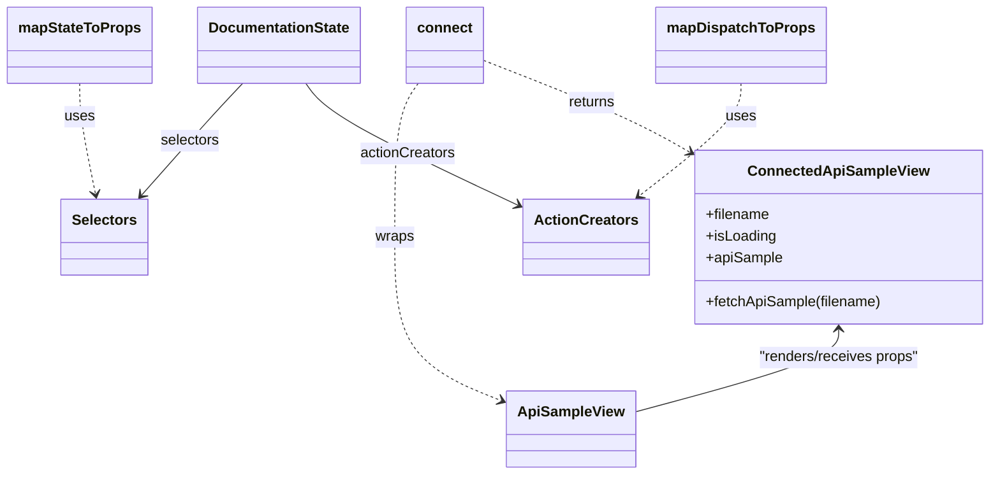

# Diagram: web/portal/src/modules/documentation/ApiSampleContainer.js

> Auto-generated by Obscura crawlers

## Mermaid

### SVG

<svg id="container" width="1065.953125" xmlns="http://www.w3.org/2000/svg" class="classDiagram" height="524" viewBox="0 0 1065.953125 524" role="graphics-document document" aria-roledescription="class"><g><defs><marker id="container_class-aggregationStart" class="marker aggregation class" refX="18" refY="7" markerWidth="190" markerHeight="240" orient="auto"><path d="M 18,7 L9,13 L1,7 L9,1 Z"></path></marker></defs><defs><marker id="container_class-aggregationEnd" class="marker aggregation class" refX="1" refY="7" markerWidth="20" markerHeight="28" orient="auto"><path d="M 18,7 L9,13 L1,7 L9,1 Z"></path></marker></defs><defs><marker id="container_class-extensionStart" class="marker extension class" refX="18" refY="7" markerWidth="190" markerHeight="240" orient="auto"><path d="M 1,7 L18,13 V 1 Z"></path></marker></defs><defs><marker id="container_class-extensionEnd" class="marker extension class" refX="1" refY="7" markerWidth="20" markerHeight="28" orient="auto"><path d="M 1,1 V 13 L18,7 Z"></path></marker></defs><defs><marker id="container_class-compositionStart" class="marker composition class" refX="18" refY="7" markerWidth="190" markerHeight="240" orient="auto"><path d="M 18,7 L9,13 L1,7 L9,1 Z"></path></marker></defs><defs><marker id="container_class-compositionEnd" class="marker composition class" refX="1" refY="7" markerWidth="20" markerHeight="28" orient="auto"><path d="M 18,7 L9,13 L1,7 L9,1 Z"></path></marker></defs><defs><marker id="container_class-dependencyStart" class="marker dependency class" refX="6" refY="7" markerWidth="190" markerHeight="240" orient="auto"><path d="M 5,7 L9,13 L1,7 L9,1 Z"></path></marker></defs><defs><marker id="container_class-dependencyEnd" class="marker dependency class" refX="13" refY="7" markerWidth="20" markerHeight="28" orient="auto"><path d="M 18,7 L9,13 L14,7 L9,1 Z"></path></marker></defs><defs><marker id="container_class-lollipopStart" class="marker lollipop class" refX="13" refY="7" markerWidth="190" markerHeight="240" orient="auto"><circle stroke="black" fill="transparent" cx="7" cy="7" r="6"></circle></marker></defs><defs><marker id="container_class-lollipopEnd" class="marker lollipop class" refX="1" refY="7" markerWidth="190" markerHeight="240" orient="auto"><circle stroke="black" fill="transparent" cx="7" cy="7" r="6"></circle></marker></defs><g class="root"><g class="clusters"></g><g class="edgePaths"><path d="M261.581,92L256.125,98.167C250.669,104.333,239.756,116.667,221.794,137.245C203.832,157.823,178.82,186.646,166.315,201.057L153.809,215.468" id="id_DocumentationState_Selectors_1" class="edge-thickness-normal edge-pattern-solid relation" style=";;;" data-edge="true" data-et="edge" data-id="id_DocumentationState_Selectors_1" data-points="W3sieCI6MjYxLjU4MDk5Mjg3OTc0NjgsInkiOjkyfSx7IngiOjIyOC44NDM3NSwieSI6MTI5fSx7IngiOjE0OS44NzYyMzM1NTI2MzE2LCJ5IjoyMjB9XQ==" marker-end="url(#container_class-dependencyEnd)"></path><path d="M328.134,92L332.45,98.167C336.765,104.333,345.396,116.667,383.515,139.23C421.633,161.794,489.238,194.588,523.041,210.985L556.844,227.381" id="id_DocumentationState_ActionCreators_2" class="edge-thickness-normal edge-pattern-solid relation" style=";;;" data-edge="true" data-et="edge" data-id="id_DocumentationState_ActionCreators_2" data-points="W3sieCI6MzI4LjEzNDI5NTg4NjA3NTk2LCJ5Ijo5Mn0seyJ4IjozNTQuMDI3MzQzNzUsInkiOjEyOX0seyJ4Ijo1NjIuMjQyMTg3NSwieSI6MjMwLjAwMDExMzk3NDcyNjF9XQ==" marker-end="url(#container_class-dependencyEnd)"></path><path d="M84.711,92L84.711,98.167C84.711,104.333,84.711,116.667,87.775,137.023C90.839,157.378,96.966,185.757,100.03,199.946L103.094,214.135" id="id_mapStateToProps_Selectors_3" class="edge-thickness-normal edge-pattern-dashed relation" style=";;;" data-edge="true" data-et="edge" data-id="id_mapStateToProps_Selectors_3" data-points="W3sieCI6ODQuNzEwOTM3NSwieSI6OTJ9LHsieCI6ODQuNzEwOTM3NSwieSI6MTI5fSx7IngiOjEwNC4zNjA2MDg1NTI2MzE1OCwieSI6MjIwfV0=" marker-end="url(#container_class-dependencyEnd)"></path><path d="M798.521,92L798.521,98.167C798.521,104.333,798.521,116.667,779.888,137.385C761.255,158.102,723.989,187.205,705.355,201.756L686.722,216.307" id="id_mapDispatchToProps_ActionCreators_4" class="edge-thickness-normal edge-pattern-dashed relation" style=";;;" data-edge="true" data-et="edge" data-id="id_mapDispatchToProps_ActionCreators_4" data-points="W3sieCI6Nzk4LjUyMTQ4NDM3NSwieSI6OTJ9LHsieCI6Nzk4LjUyMTQ4NDM3NSwieSI6MTI5fSx7IngiOjY4MS45OTMyMTU0NjA1MjY0LCJ5IjoyMjB9XQ==" marker-end="url(#container_class-dependencyEnd)"></path><path d="M451.42,92L447.299,98.167C443.179,104.333,434.939,116.667,430.819,145C426.699,173.333,426.699,217.667,426.699,262C426.699,306.333,426.699,350.667,445.94,380.867C465.181,411.067,503.663,427.135,522.904,435.168L542.145,443.202" id="id_connect_ApiSampleView_5" class="edge-thickness-normal edge-pattern-dashed relation" style=";;;" data-edge="true" data-et="edge" data-id="id_connect_ApiSampleView_5" data-points="W3sieCI6NDUxLjQxOTU1MTAyODQ4MSwieSI6OTJ9LHsieCI6NDI2LjY5OTIxODc1LCJ5IjoxMjl9LHsieCI6NDI2LjY5OTIxODc1LCJ5IjoyNjJ9LHsieCI6NDI2LjY5OTIxODc1LCJ5IjozOTV9LHsieCI6NTQ3LjY4MTY0MDYyNSwieSI6NDQ1LjUxMzUxNzQxOTM1NDg2fV0=" marker-end="url(#container_class-dependencyEnd)"></path><path d="M520.395,66.567L546.093,76.972C571.791,87.378,623.188,108.189,659.623,124.9C696.058,141.61,717.532,154.221,728.269,160.526L739.006,166.831" id="id_connect_ConnectedApiSampleView_6" class="edge-thickness-normal edge-pattern-dashed relation" style=";;;" data-edge="true" data-et="edge" data-id="id_connect_ConnectedApiSampleView_6" data-points="W3sieCI6NTIwLjM5NDUzMTI1LCJ5Ijo2Ni41NjY2NDYzMTE1NTMzN30seyJ4Ijo2NzQuNTgzOTg0Mzc1LCJ5IjoxMjl9LHsieCI6NzQ0LjE3OTY4NzUsInkiOjE2OS44Njk1MjI4NDg1OTMwMn1d" marker-end="url(#container_class-dependencyEnd)"></path><path d="M901.066,364L901.066,369.167C901.066,374.333,901.066,384.667,864.911,399.85C828.756,415.033,756.445,435.066,720.29,445.082L684.135,455.099" id="id_ConnectedApiSampleView_ApiSampleView_7" class="edge-thickness-normal edge-pattern-solid relation" style=";;;" data-edge="true" data-et="edge" data-id="id_ConnectedApiSampleView_ApiSampleView_7" data-points="W3sieCI6OTAxLjA2NjQwNjI1LCJ5IjozNTh9LHsieCI6OTAxLjA2NjQwNjI1LCJ5IjozOTV9LHsieCI6Njg0LjEzNDc2NTYyNSwieSI6NDU1LjA5ODU2NzgxODAyODY0fV0=" marker-start="url(#container_class-dependencyStart)"></path></g><g class="edgeLabels"><g class="edgeLabel" transform="translate(205.5498, 155.84331)"><g class="label" data-id="id_DocumentationState_Selectors_1" transform="translate(-32.734375, -12)"><foreignObject width="65.46875" height="24">

selectors

</foreignObject></g></g><g class="edgeLabel" transform="translate(437.81866, 169.64519)"><g class="label" data-id="id_DocumentationState_ActionCreators_2" transform="translate(-52.671875, -12)"><foreignObject width="105.34375" height="24">

actionCreators

</foreignObject></g></g><g class="edgeLabel" transform="translate(84.7109375, 129)"><g class="label" data-id="id_mapStateToProps_Selectors_3" transform="translate(-16.4921875, -12)"><foreignObject width="32.984375" height="24">

uses

</foreignObject></g></g><g class="edgeLabel" transform="translate(798.521484375, 129)"><g class="label" data-id="id_mapDispatchToProps_ActionCreators_4" transform="translate(-16.4921875, -12)"><foreignObject width="32.984375" height="24">

uses

</foreignObject></g></g><g class="edgeLabel" transform="translate(426.69921875, 262)"><g class="label" data-id="id_connect_ApiSampleView_5" transform="translate(-21.390625, -12)"><foreignObject width="42.78125" height="24">

wraps

</foreignObject></g></g><g class="edgeLabel" transform="translate(634.89358, 112.92883)"><g class="label" data-id="id_connect_ConnectedApiSampleView_6" transform="translate(-26.265625, -12)"><foreignObject width="52.53125" height="24">

returns

</foreignObject></g></g><g class="edgeLabel" transform="translate(901.06640625, 395)"><g class="label" data-id="id_ConnectedApiSampleView_ApiSampleView_7" transform="translate(-90.296875, -12)"><foreignObject width="180.59375" height="24">

"renders/receives props"

</foreignObject></g></g></g><g class="nodes"><g class="node default" id="classId-ApiSampleView-0" transform="translate(615.908203125, 474)"><g class="basic label-container"><path d="M-68.2265625 -42 L68.2265625 -42 L68.2265625 42 L-68.2265625 42" stroke="none" stroke-width="0" fill="#ECECFF" style=""></path><path d="M-68.2265625 -42 C-38.799427193829956 -42, -9.372291887659912 -42, 68.2265625 -42 M-68.2265625 -42 C-30.849967152162904 -42, 6.526628195674192 -42, 68.2265625 -42 M68.2265625 -42 C68.2265625 -18.20516160563855, 68.2265625 5.5896767887228975, 68.2265625 42 M68.2265625 -42 C68.2265625 -15.589590217950843, 68.2265625 10.820819564098315, 68.2265625 42 M68.2265625 42 C16.159916954868116 42, -35.90672859026377 42, -68.2265625 42 M68.2265625 42 C34.752859246194745 42, 1.2791559923894908 42, -68.2265625 42 M-68.2265625 42 C-68.2265625 13.562329338781904, -68.2265625 -14.875341322436192, -68.2265625 -42 M-68.2265625 42 C-68.2265625 9.917650923487905, -68.2265625 -22.16469815302419, -68.2265625 -42" stroke="#9370DB" stroke-width="1.3" fill="none" stroke-dasharray="0 0" style=""></path></g><g class="annotation-group text" transform="translate(0, -18)"></g><g class="label-group text" transform="translate(-56.2265625, -18)"><g class="label" style="font-weight: bolder" transform="translate(0,-12)"><foreignObject width="112.453125" height="24">

ApiSampleView

</foreignObject></g></g><g class="members-group text" transform="translate(-56.2265625, 30)"></g><g class="methods-group text" transform="translate(-56.2265625, 60)"></g><g class="divider" style=""><path d="M-68.2265625 6 C-20.607488822771188 6, 27.011584854457624 6, 68.2265625 6 M-68.2265625 6 C-36.748180783548634 6, -5.269799067097274 6, 68.2265625 6" stroke="#9370DB" stroke-width="1.3" fill="none" stroke-dasharray="0 0" style=""></path></g><g class="divider" style=""><path d="M-68.2265625 24 C-23.526156083717204 24, 21.17425033256559 24, 68.2265625 24 M-68.2265625 24 C-24.381108295562946 24, 19.464345908874108 24, 68.2265625 24" stroke="#9370DB" stroke-width="1.3" fill="none" stroke-dasharray="0 0" style=""></path></g></g><g class="node default" id="classId-ConnectedApiSampleView-1" transform="translate(901.06640625, 262)"><g class="basic label-container"><path d="M-156.88671875 -96 L156.88671875 -96 L156.88671875 96 L-156.88671875 96" stroke="none" stroke-width="0" fill="#ECECFF" style=""></path><path d="M-156.88671875 -96 C-47.15208269054703 -96, 62.582553368905934 -96, 156.88671875 -96 M-156.88671875 -96 C-82.25858299762055 -96, -7.6304472452411005 -96, 156.88671875 -96 M156.88671875 -96 C156.88671875 -21.84874272886435, 156.88671875 52.3025145422713, 156.88671875 96 M156.88671875 -96 C156.88671875 -34.54423568254104, 156.88671875 26.911528634917914, 156.88671875 96 M156.88671875 96 C87.30031026884126 96, 17.713901787682516 96, -156.88671875 96 M156.88671875 96 C82.79989197299466 96, 8.713065195989316 96, -156.88671875 96 M-156.88671875 96 C-156.88671875 21.219146638961803, -156.88671875 -53.561706722076394, -156.88671875 -96 M-156.88671875 96 C-156.88671875 53.47180032698375, -156.88671875 10.943600653967493, -156.88671875 -96" stroke="#9370DB" stroke-width="1.3" fill="none" stroke-dasharray="0 0" style=""></path></g><g class="annotation-group text" transform="translate(0, -72)"></g><g class="label-group text" transform="translate(-94.9765625, -72)"><g class="label" style="font-weight: bolder" transform="translate(0,-12)"><foreignObject width="189.953125" height="24">

ConnectedApiSampleView

</foreignObject></g></g><g class="members-group text" transform="translate(-144.88671875, -24)"><g class="label" style="" transform="translate(0,-12)"><foreignObject width="70.796875" height="24">

+filename

</foreignObject></g><g class="label" style="" transform="translate(0,12)"><foreignObject width="77.203125" height="24">

+isLoading

</foreignObject></g><g class="label" style="" transform="translate(0,36)"><foreignObject width="84.4375" height="24">

+apiSample

</foreignObject></g></g><g class="methods-group text" transform="translate(-144.88671875, 72)"><g class="label" style="" transform="translate(0,-12)"><foreignObject width="194.796875" height="24">

+fetchApiSample(filename)

</foreignObject></g></g><g class="divider" style=""><path d="M-156.88671875 -48 C-37.99014102916226 -48, 80.90643669167548 -48, 156.88671875 -48 M-156.88671875 -48 C-40.675340186924274 -48, 75.53603837615145 -48, 156.88671875 -48" stroke="#9370DB" stroke-width="1.3" fill="none" stroke-dasharray="0 0" style=""></path></g><g class="divider" style=""><path d="M-156.88671875 48 C-47.20966569051143 48, 62.46738736897714 48, 156.88671875 48 M-156.88671875 48 C-45.707248418819205 48, 65.47222191236159 48, 156.88671875 48" stroke="#9370DB" stroke-width="1.3" fill="none" stroke-dasharray="0 0" style=""></path></g></g><g class="node default" id="classId-mapStateToProps-2" transform="translate(84.7109375, 50)"><g class="basic label-container"><path d="M-76.7109375 -42 L76.7109375 -42 L76.7109375 42 L-76.7109375 42" stroke="none" stroke-width="0" fill="#ECECFF" style=""></path><path d="M-76.7109375 -42 C-17.015810288901477 -42, 42.679316922197046 -42, 76.7109375 -42 M-76.7109375 -42 C-42.75908920415459 -42, -8.807240908309183 -42, 76.7109375 -42 M76.7109375 -42 C76.7109375 -10.881846871045667, 76.7109375 20.236306257908666, 76.7109375 42 M76.7109375 -42 C76.7109375 -18.679150406394058, 76.7109375 4.641699187211884, 76.7109375 42 M76.7109375 42 C34.43694420588888 42, -7.837049088222244 42, -76.7109375 42 M76.7109375 42 C27.662194299595832 42, -21.386548900808336 42, -76.7109375 42 M-76.7109375 42 C-76.7109375 12.426147972096064, -76.7109375 -17.14770405580787, -76.7109375 -42 M-76.7109375 42 C-76.7109375 20.618738816380418, -76.7109375 -0.7625223672391641, -76.7109375 -42" stroke="#9370DB" stroke-width="1.3" fill="none" stroke-dasharray="0 0" style=""></path></g><g class="annotation-group text" transform="translate(0, -18)"></g><g class="label-group text" transform="translate(-64.7109375, -18)"><g class="label" style="font-weight: bolder" transform="translate(0,-12)"><foreignObject width="129.421875" height="24">

mapStateToProps

</foreignObject></g></g><g class="members-group text" transform="translate(-64.7109375, 30)"></g><g class="methods-group text" transform="translate(-64.7109375, 60)"></g><g class="divider" style=""><path d="M-76.7109375 6 C-27.869745267621695 6, 20.97144696475661 6, 76.7109375 6 M-76.7109375 6 C-44.06173547152382 6, -11.412533443047636 6, 76.7109375 6" stroke="#9370DB" stroke-width="1.3" fill="none" stroke-dasharray="0 0" style=""></path></g><g class="divider" style=""><path d="M-76.7109375 24 C-40.58804504113842 24, -4.465152582276843 24, 76.7109375 24 M-76.7109375 24 C-26.036788105191178 24, 24.637361289617644 24, 76.7109375 24" stroke="#9370DB" stroke-width="1.3" fill="none" stroke-dasharray="0 0" style=""></path></g></g><g class="node default" id="classId-mapDispatchToProps-3" transform="translate(798.521484375, 50)"><g class="basic label-container"><path d="M-89.1953125 -42 L89.1953125 -42 L89.1953125 42 L-89.1953125 42" stroke="none" stroke-width="0" fill="#ECECFF" style=""></path><path d="M-89.1953125 -42 C-19.126890127240486 -42, 50.94153224551903 -42, 89.1953125 -42 M-89.1953125 -42 C-49.456398422939316 -42, -9.717484345878631 -42, 89.1953125 -42 M89.1953125 -42 C89.1953125 -14.056067843303907, 89.1953125 13.887864313392186, 89.1953125 42 M89.1953125 -42 C89.1953125 -25.103692260346925, 89.1953125 -8.20738452069385, 89.1953125 42 M89.1953125 42 C37.885132121621716 42, -13.425048256756568 42, -89.1953125 42 M89.1953125 42 C33.181932915373075 42, -22.83144666925385 42, -89.1953125 42 M-89.1953125 42 C-89.1953125 18.53584001219609, -89.1953125 -4.92831997560782, -89.1953125 -42 M-89.1953125 42 C-89.1953125 12.239257087449676, -89.1953125 -17.521485825100648, -89.1953125 -42" stroke="#9370DB" stroke-width="1.3" fill="none" stroke-dasharray="0 0" style=""></path></g><g class="annotation-group text" transform="translate(0, -18)"></g><g class="label-group text" transform="translate(-77.1953125, -18)"><g class="label" style="font-weight: bolder" transform="translate(0,-12)"><foreignObject width="154.390625" height="24">

mapDispatchToProps

</foreignObject></g></g><g class="members-group text" transform="translate(-77.1953125, 30)"></g><g class="methods-group text" transform="translate(-77.1953125, 60)"></g><g class="divider" style=""><path d="M-89.1953125 6 C-49.90797223088218 6, -10.62063196176436 6, 89.1953125 6 M-89.1953125 6 C-49.35899856724738 6, -9.522684634494766 6, 89.1953125 6" stroke="#9370DB" stroke-width="1.3" fill="none" stroke-dasharray="0 0" style=""></path></g><g class="divider" style=""><path d="M-89.1953125 24 C-44.63481752880804 24, -0.0743225576160853 24, 89.1953125 24 M-89.1953125 24 C-32.04160099395004 24, 25.112110512099918 24, 89.1953125 24" stroke="#9370DB" stroke-width="1.3" fill="none" stroke-dasharray="0 0" style=""></path></g></g><g class="node default" id="classId-DocumentationState-4" transform="translate(298.7421875, 50)"><g class="basic label-container"><path d="M-87.3203125 -42 L87.3203125 -42 L87.3203125 42 L-87.3203125 42" stroke="none" stroke-width="0" fill="#ECECFF" style=""></path><path d="M-87.3203125 -42 C-45.89127319488572 -42, -4.46223388977144 -42, 87.3203125 -42 M-87.3203125 -42 C-28.781713981502826 -42, 29.75688453699435 -42, 87.3203125 -42 M87.3203125 -42 C87.3203125 -11.876297447557842, 87.3203125 18.247405104884315, 87.3203125 42 M87.3203125 -42 C87.3203125 -16.22628744907916, 87.3203125 9.547425101841682, 87.3203125 42 M87.3203125 42 C50.03913436887709 42, 12.757956237754186 42, -87.3203125 42 M87.3203125 42 C31.29768041278833 42, -24.724951674423338 42, -87.3203125 42 M-87.3203125 42 C-87.3203125 19.750029705891645, -87.3203125 -2.4999405882167096, -87.3203125 -42 M-87.3203125 42 C-87.3203125 11.079132575860857, -87.3203125 -19.841734848278286, -87.3203125 -42" stroke="#9370DB" stroke-width="1.3" fill="none" stroke-dasharray="0 0" style=""></path></g><g class="annotation-group text" transform="translate(0, -18)"></g><g class="label-group text" transform="translate(-75.3203125, -18)"><g class="label" style="font-weight: bolder" transform="translate(0,-12)"><foreignObject width="150.640625" height="24">

DocumentationState

</foreignObject></g></g><g class="members-group text" transform="translate(-75.3203125, 30)"></g><g class="methods-group text" transform="translate(-75.3203125, 60)"></g><g class="divider" style=""><path d="M-87.3203125 6 C-31.75633458691759 6, 23.807643326164822 6, 87.3203125 6 M-87.3203125 6 C-44.39273024922448 6, -1.4651479984489555 6, 87.3203125 6" stroke="#9370DB" stroke-width="1.3" fill="none" stroke-dasharray="0 0" style=""></path></g><g class="divider" style=""><path d="M-87.3203125 24 C-41.474525673305756 24, 4.371261153388488 24, 87.3203125 24 M-87.3203125 24 C-33.6533909023809 24, 20.013530695238202 24, 87.3203125 24" stroke="#9370DB" stroke-width="1.3" fill="none" stroke-dasharray="0 0" style=""></path></g></g><g class="node default" id="classId-Selectors-5" transform="translate(113.4296875, 262)"><g class="basic label-container"><path d="M-46.171875 -42 L46.171875 -42 L46.171875 42 L-46.171875 42" stroke="none" stroke-width="0" fill="#ECECFF" style=""></path><path d="M-46.171875 -42 C-12.07607326312381 -42, 22.01972847375238 -42, 46.171875 -42 M-46.171875 -42 C-20.650795187177696 -42, 4.870284625644608 -42, 46.171875 -42 M46.171875 -42 C46.171875 -11.260703550252014, 46.171875 19.478592899495972, 46.171875 42 M46.171875 -42 C46.171875 -14.24080654325667, 46.171875 13.518386913486658, 46.171875 42 M46.171875 42 C27.013215698790138 42, 7.854556397580275 42, -46.171875 42 M46.171875 42 C18.801613517922902 42, -8.568647964154195 42, -46.171875 42 M-46.171875 42 C-46.171875 11.815303249940154, -46.171875 -18.369393500119692, -46.171875 -42 M-46.171875 42 C-46.171875 14.143567979692815, -46.171875 -13.71286404061437, -46.171875 -42" stroke="#9370DB" stroke-width="1.3" fill="none" stroke-dasharray="0 0" style=""></path></g><g class="annotation-group text" transform="translate(0, -18)"></g><g class="label-group text" transform="translate(-34.171875, -18)"><g class="label" style="font-weight: bolder" transform="translate(0,-12)"><foreignObject width="68.34375" height="24">

Selectors

</foreignObject></g></g><g class="members-group text" transform="translate(-34.171875, 30)"></g><g class="methods-group text" transform="translate(-34.171875, 60)"></g><g class="divider" style=""><path d="M-46.171875 6 C-21.65369598265313 6, 2.864483034693741 6, 46.171875 6 M-46.171875 6 C-10.425807580113762 6, 25.320259839772476 6, 46.171875 6" stroke="#9370DB" stroke-width="1.3" fill="none" stroke-dasharray="0 0" style=""></path></g><g class="divider" style=""><path d="M-46.171875 24 C-13.661039854598307 24, 18.849795290803385 24, 46.171875 24 M-46.171875 24 C-23.422683876102408 24, -0.6734927522048153 24, 46.171875 24" stroke="#9370DB" stroke-width="1.3" fill="none" stroke-dasharray="0 0" style=""></path></g></g><g class="node default" id="classId-ActionCreators-6" transform="translate(628.2109375, 262)"><g class="basic label-container"><path d="M-65.96875 -42 L65.96875 -42 L65.96875 42 L-65.96875 42" stroke="none" stroke-width="0" fill="#ECECFF" style=""></path><path d="M-65.96875 -42 C-32.825946597233816 -42, 0.3168568055323675 -42, 65.96875 -42 M-65.96875 -42 C-19.42434573734267 -42, 27.12005852531466 -42, 65.96875 -42 M65.96875 -42 C65.96875 -21.89753994886971, 65.96875 -1.79507989773942, 65.96875 42 M65.96875 -42 C65.96875 -23.923030086766758, 65.96875 -5.846060173533516, 65.96875 42 M65.96875 42 C34.39137526113146 42, 2.8140005222629227 42, -65.96875 42 M65.96875 42 C23.27921709466456 42, -19.41031581067088 42, -65.96875 42 M-65.96875 42 C-65.96875 23.523494999675535, -65.96875 5.046989999351069, -65.96875 -42 M-65.96875 42 C-65.96875 24.29218765177702, -65.96875 6.58437530355404, -65.96875 -42" stroke="#9370DB" stroke-width="1.3" fill="none" stroke-dasharray="0 0" style=""></path></g><g class="annotation-group text" transform="translate(0, -18)"></g><g class="label-group text" transform="translate(-53.96875, -18)"><g class="label" style="font-weight: bolder" transform="translate(0,-12)"><foreignObject width="107.9375" height="24">

ActionCreators

</foreignObject></g></g><g class="members-group text" transform="translate(-53.96875, 30)"></g><g class="methods-group text" transform="translate(-53.96875, 60)"></g><g class="divider" style=""><path d="M-65.96875 6 C-35.05981330565338 6, -4.1508766113067495 6, 65.96875 6 M-65.96875 6 C-29.80700597404018 6, 6.3547380519196395 6, 65.96875 6" stroke="#9370DB" stroke-width="1.3" fill="none" stroke-dasharray="0 0" style=""></path></g><g class="divider" style=""><path d="M-65.96875 24 C-34.20231759458149 24, -2.435885189162981 24, 65.96875 24 M-65.96875 24 C-34.72299866776031 24, -3.477247335520623 24, 65.96875 24" stroke="#9370DB" stroke-width="1.3" fill="none" stroke-dasharray="0 0" style=""></path></g></g><g class="node default" id="classId-connect-7" transform="translate(479.48046875, 50)"><g class="basic label-container"><path d="M-40.9140625 -42 L40.9140625 -42 L40.9140625 42 L-40.9140625 42" stroke="none" stroke-width="0" fill="#ECECFF" style=""></path><path d="M-40.9140625 -42 C-9.777407374988268 -42, 21.359247750023464 -42, 40.9140625 -42 M-40.9140625 -42 C-20.368938884021215 -42, 0.17618473195756934 -42, 40.9140625 -42 M40.9140625 -42 C40.9140625 -11.722076001321746, 40.9140625 18.55584799735651, 40.9140625 42 M40.9140625 -42 C40.9140625 -18.541182006178122, 40.9140625 4.917635987643756, 40.9140625 42 M40.9140625 42 C11.973832381360985 42, -16.96639773727803 42, -40.9140625 42 M40.9140625 42 C21.636755592196625 42, 2.35944868439325 42, -40.9140625 42 M-40.9140625 42 C-40.9140625 14.475720991742428, -40.9140625 -13.048558016515145, -40.9140625 -42 M-40.9140625 42 C-40.9140625 10.585786383829166, -40.9140625 -20.828427232341667, -40.9140625 -42" stroke="#9370DB" stroke-width="1.3" fill="none" stroke-dasharray="0 0" style=""></path></g><g class="annotation-group text" transform="translate(0, -18)"></g><g class="label-group text" transform="translate(-28.9140625, -18)"><g class="label" style="font-weight: bolder" transform="translate(0,-12)"><foreignObject width="57.828125" height="24">

connect

</foreignObject></g></g><g class="members-group text" transform="translate(-28.9140625, 30)"></g><g class="methods-group text" transform="translate(-28.9140625, 60)"></g><g class="divider" style=""><path d="M-40.9140625 6 C-21.885360125209957 6, -2.856657750419913 6, 40.9140625 6 M-40.9140625 6 C-15.485979103874133 6, 9.942104292251734 6, 40.9140625 6" stroke="#9370DB" stroke-width="1.3" fill="none" stroke-dasharray="0 0" style=""></path></g><g class="divider" style=""><path d="M-40.9140625 24 C-12.074825141536351 24, 16.764412216927298 24, 40.9140625 24 M-40.9140625 24 C-14.988135836917937 24, 10.937790826164125 24, 40.9140625 24" stroke="#9370DB" stroke-width="1.3" fill="none" stroke-dasharray="0 0" style=""></path></g></g></g></g></g></svg>
