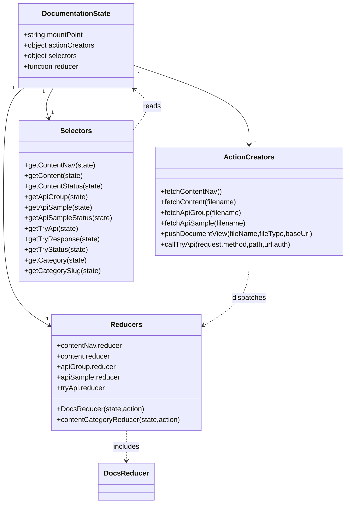
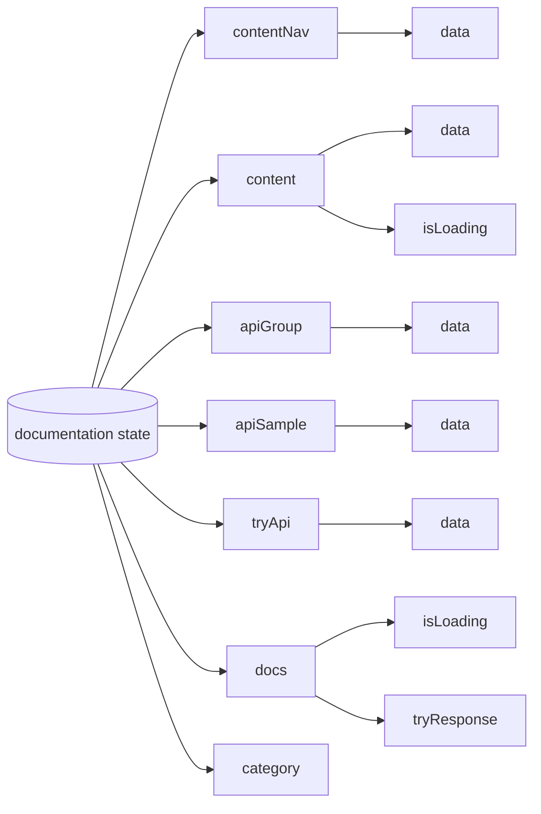

# Diagram: web/portal/src/modules/documentation/DocumentationState.js


> Auto-generated by Obscura crawlers

## Diagram 1



### SVG

<svg id="container" width="782.1245727539062" xmlns="http://www.w3.org/2000/svg" class="classDiagram" height="1144" viewBox="-32.81599998474121 0 782.1245727539062 1144" role="graphics-document document" aria-roledescription="class"><style>#container{font-family:"trebuchet ms",verdana,arial,sans-serif;font-size:16px;fill:#333;}@keyframes edge-animation-frame{from{stroke-dashoffset:0;}}@keyframes dash{to{stroke-dashoffset:0;}}#container .edge-animation-slow{stroke-dasharray:9,5!important;stroke-dashoffset:900;animation:dash 50s linear infinite;stroke-linecap:round;}#container .edge-animation-fast{stroke-dasharray:9,5!important;stroke-dashoffset:900;animation:dash 20s linear infinite;stroke-linecap:round;}#container .error-icon{fill:#552222;}#container .error-text{fill:#552222;stroke:#552222;}#container .edge-thickness-normal{stroke-width:1px;}#container .edge-thickness-thick{stroke-width:3.5px;}#container .edge-pattern-solid{stroke-dasharray:0;}#container .edge-thickness-invisible{stroke-width:0;fill:none;}#container .edge-pattern-dashed{stroke-dasharray:3;}#container .edge-pattern-dotted{stroke-dasharray:2;}#container .marker{fill:#333333;stroke:#333333;}#container .marker.cross{stroke:#333333;}#container svg{font-family:"trebuchet ms",verdana,arial,sans-serif;font-size:16px;}#container p{margin:0;}#container g.classGroup text{fill:#9370DB;stroke:none;font-family:"trebuchet ms",verdana,arial,sans-serif;font-size:10px;}#container g.classGroup text .title{font-weight:bolder;}#container .nodeLabel,#container .edgeLabel{color:#131300;}#container .edgeLabel .label rect{fill:#ECECFF;}#container .label text{fill:#131300;}#container .labelBkg{background:#ECECFF;}#container .edgeLabel .label span{background:#ECECFF;}#container .classTitle{font-weight:bolder;}#container .node rect,#container .node circle,#container .node ellipse,#container .node polygon,#container .node path{fill:#ECECFF;stroke:#9370DB;stroke-width:1px;}#container .divider{stroke:#9370DB;stroke-width:1;}#container g.clickable{cursor:pointer;}#container g.classGroup rect{fill:#ECECFF;stroke:#9370DB;}#container g.classGroup line{stroke:#9370DB;stroke-width:1;}#container .classLabel .box{stroke:none;stroke-width:0;fill:#ECECFF;opacity:0.5;}#container .classLabel .label{fill:#9370DB;font-size:10px;}#container .relation{stroke:#333333;stroke-width:1;fill:none;}#container .dashed-line{stroke-dasharray:3;}#container .dotted-line{stroke-dasharray:1 2;}#container #compositionStart,#container .composition{fill:#333333!important;stroke:#333333!important;stroke-width:1;}#container #compositionEnd,#container .composition{fill:#333333!important;stroke:#333333!important;stroke-width:1;}#container #dependencyStart,#container .dependency{fill:#333333!important;stroke:#333333!important;stroke-width:1;}#container #dependencyStart,#container .dependency{fill:#333333!important;stroke:#333333!important;stroke-width:1;}#container #extensionStart,#container .extension{fill:transparent!important;stroke:#333333!important;stroke-width:1;}#container #extensionEnd,#container .extension{fill:transparent!important;stroke:#333333!important;stroke-width:1;}#container #aggregationStart,#container .aggregation{fill:transparent!important;stroke:#333333!important;stroke-width:1;}#container #aggregationEnd,#container .aggregation{fill:transparent!important;stroke:#333333!important;stroke-width:1;}#container #lollipopStart,#container .lollipop{fill:#ECECFF!important;stroke:#333333!important;stroke-width:1;}#container #lollipopEnd,#container .lollipop{fill:#ECECFF!important;stroke:#333333!important;stroke-width:1;}#container .edgeTerminals{font-size:11px;line-height:initial;}#container .classTitleText{text-anchor:middle;font-size:18px;fill:#333;}#container .label-icon{display:inline-block;height:1em;overflow:visible;vertical-align:-0.125em;}#container .node .label-icon path{fill:currentColor;stroke:revert;stroke-width:revert;}#container :root{--mermaid-font-family:"trebuchet ms",verdana,arial,sans-serif;}</style><g><defs><marker id="container_class-aggregationStart" class="marker aggregation class" refX="18" refY="7" markerWidth="190" markerHeight="240" orient="auto"><path d="M 18,7 L9,13 L1,7 L9,1 Z"></path></marker></defs><defs><marker id="container_class-aggregationEnd" class="marker aggregation class" refX="1" refY="7" markerWidth="20" markerHeight="28" orient="auto"><path d="M 18,7 L9,13 L1,7 L9,1 Z"></path></marker></defs><defs><marker id="container_class-extensionStart" class="marker extension class" refX="18" refY="7" markerWidth="190" markerHeight="240" orient="auto"><path d="M 1,7 L18,13 V 1 Z"></path></marker></defs><defs><marker id="container_class-extensionEnd" class="marker extension class" refX="1" refY="7" markerWidth="20" markerHeight="28" orient="auto"><path d="M 1,1 V 13 L18,7 Z"></path></marker></defs><defs><marker id="container_class-compositionStart" class="marker composition class" refX="18" refY="7" markerWidth="190" markerHeight="240" orient="auto"><path d="M 18,7 L9,13 L1,7 L9,1 Z"></path></marker></defs><defs><marker id="container_class-compositionEnd" class="marker composition class" refX="1" refY="7" markerWidth="20" markerHeight="28" orient="auto"><path d="M 18,7 L9,13 L1,7 L9,1 Z"></path></marker></defs><defs><marker id="container_class-dependencyStart" class="marker dependency class" refX="6" refY="7" markerWidth="190" markerHeight="240" orient="auto"><path d="M 5,7 L9,13 L1,7 L9,1 Z"></path></marker></defs><defs><marker id="container_class-dependencyEnd" class="marker dependency class" refX="13" refY="7" markerWidth="20" markerHeight="28" orient="auto"><path d="M 18,7 L9,13 L14,7 L9,1 Z"></path></marker></defs><defs><marker id="container_class-lollipopStart" class="marker lollipop class" refX="13" refY="7" markerWidth="190" markerHeight="240" orient="auto"><circle stroke="black" fill="transparent" cx="7" cy="7" r="6"></circle></marker></defs><defs><marker id="container_class-lollipopEnd" class="marker lollipop class" refX="1" refY="7" markerWidth="190" markerHeight="240" orient="auto"><circle stroke="black" fill="transparent" cx="7" cy="7" r="6"></circle></marker></defs><g class="root"><g class="clusters"></g><g class="edgePaths"><path d="M270.352,148.67L313.583,163.392C356.814,178.113,443.276,207.557,486.507,237.445C529.738,267.333,529.738,297.667,529.738,312.833L529.738,328" id="id_DocumentationState_ActionCreators_1" class="edge-thickness-normal edge-pattern-solid relation" style=";;;" data-edge="true" data-et="edge" data-id="id_DocumentationState_ActionCreators_1" data-points="W3sieCI6MjcwLjM1MTU2MjUsInkiOjE0OC42Njk4NzcxODAzNDg4Nn0seyJ4Ijo1MjkuNzM4MjgxMjUsInkiOjIzN30seyJ4Ijo1MjkuNzM4MjgxMjUsInkiOjMzNH1d" marker-end="url(#container_class-dependencyEnd)"></path><path d="M87.209,200L83.871,206.167C80.532,212.333,73.856,224.667,72.225,236.05C70.594,247.433,74.008,257.865,75.715,263.081L77.422,268.298" id="id_DocumentationState_Selectors_2" class="edge-thickness-normal edge-pattern-solid relation" style=";;;" data-edge="true" data-et="edge" data-id="id_DocumentationState_Selectors_2" data-points="W3sieCI6ODcuMjA4Njc1OTg2ODQyMTEsInkiOjIwMH0seyJ4Ijo2Ny4xNzk2ODc1LCJ5IjoyMzd9LHsieCI6NzkuMjg4MTIxNDQ4ODYzNjMsInkiOjI3NH1d" marker-end="url(#container_class-dependencyEnd)"></path><path d="M20.805,200L13.202,206.167C5.598,212.333,-9.609,224.667,-17.213,267.5C-24.816,310.333,-24.816,383.667,-24.816,457C-24.816,530.333,-24.816,603.667,-7.717,650.755C9.382,697.844,43.581,718.688,60.68,729.11L77.779,739.532" id="id_DocumentationState_Reducers_3" class="edge-thickness-normal edge-pattern-solid relation" style=";;;" data-edge="true" data-et="edge" data-id="id_DocumentationState_Reducers_3" data-points="W3sieCI6MjAuODA1NDgwNDk4MTIwMzAzLCJ5IjoyMDB9LHsieCI6LTI0LjgxNjQwNjI1LCJ5IjoyMzd9LHsieCI6LTI0LjgxNjQwNjI1LCJ5Ijo0NTd9LHsieCI6LTI0LjgxNjQwNjI1LCJ5Ijo2Nzd9LHsieCI6ODIuOTAyMzQzNzUsInkiOjc0Mi42NTQzNjc5NDcyNTV9XQ==" marker-end="url(#container_class-dependencyEnd)"></path><path d="M529.738,580L529.738,596.167C529.738,612.333,529.738,644.667,512.639,671.255C495.54,697.844,461.341,718.688,444.242,729.11L427.143,739.532" id="id_ActionCreators_Reducers_4" class="edge-thickness-normal edge-pattern-dashed relation" style=";;;" data-edge="true" data-et="edge" data-id="id_ActionCreators_Reducers_4" data-points="W3sieCI6NTI5LjczODI4MTI1LCJ5Ijo1ODB9LHsieCI6NTI5LjczODI4MTI1LCJ5Ijo2Nzd9LHsieCI6NDIyLjAxOTUzMTI1LCJ5Ijo3NDIuNjU0MzY3OTQ3MjU1fV0=" marker-end="url(#container_class-dependencyEnd)"></path><path d="M268.168,295.095L275.882,285.412C283.596,275.73,299.025,256.365,299.409,241.12C299.793,225.876,285.132,214.751,277.802,209.189L270.471,203.627" id="id_Selectors_DocumentationState_5" class="edge-thickness-normal edge-pattern-dashed relation" style=";;;" data-edge="true" data-et="edge" data-id="id_Selectors_DocumentationState_5" data-points="W3sieCI6MjY4LjE2Nzk2ODc1LCJ5IjoyOTUuMDk0OTgzMzk2ODQ4NzZ9LHsieCI6MzE0LjQ1MzEyNSwieSI6MjM3fSx7IngiOjI2NS42OTE3NTg2OTM2MDksInkiOjIwMH1d" marker-end="url(#container_class-dependencyEnd)"></path><path d="M252.461,978L252.461,984.167C252.461,990.333,252.461,1002.667,252.461,1014C252.461,1025.333,252.461,1035.667,252.461,1040.833L252.461,1046" id="id_Reducers_DocsReducer_6" class="edge-thickness-normal edge-pattern-dashed relation" style=";;;" data-edge="true" data-et="edge" data-id="id_Reducers_DocsReducer_6" data-points="W3sieCI6MjUyLjQ2MDkzNzUsInkiOjk3OH0seyJ4IjoyNTIuNDYwOTM3NSwieSI6MTAxNX0seyJ4IjoyNTIuNDYwOTM3NSwieSI6MTA1Mn1d" marker-end="url(#container_class-dependencyEnd)"></path></g><g class="edgeLabels"><g class="edgeLabel"><g class="label" data-id="id_DocumentationState_ActionCreators_1" transform="translate(0, 0)"><foreignObject width="0" height="0"><div xmlns="http://www.w3.org/1999/xhtml" class="labelBkg" style="display: table-cell; white-space: nowrap; line-height: 1.5; max-width: 200px; text-align: center;"><span class="edgeLabel"></span></div></foreignObject></g></g><g class="edgeLabel"><g class="label" data-id="id_DocumentationState_Selectors_2" transform="translate(0, 0)"><foreignObject width="0" height="0"><div xmlns="http://www.w3.org/1999/xhtml" class="labelBkg" style="display: table-cell; white-space: nowrap; line-height: 1.5; max-width: 200px; text-align: center;"><span class="edgeLabel"></span></div></foreignObject></g></g><g class="edgeLabel"><g class="label" data-id="id_DocumentationState_Reducers_3" transform="translate(0, 0)"><foreignObject width="0" height="0"><div xmlns="http://www.w3.org/1999/xhtml" class="labelBkg" style="display: table-cell; white-space: nowrap; line-height: 1.5; max-width: 200px; text-align: center;"><span class="edgeLabel"></span></div></foreignObject></g></g><g class="edgeLabel" transform="translate(529.73828125, 677)"><g class="label" data-id="id_ActionCreators_Reducers_4" transform="translate(-39.1796875, -12)"><foreignObject width="78.359375" height="24"><div xmlns="http://www.w3.org/1999/xhtml" class="labelBkg" style="display: table-cell; white-space: nowrap; line-height: 1.5; max-width: 200px; text-align: center;"><span class="edgeLabel"><p>dispatches</p></span></div></foreignObject></g></g><g class="edgeLabel" transform="translate(310.38137, 242.11067)"><g class="label" data-id="id_Selectors_DocumentationState_5" transform="translate(-20.0078125, -12)"><foreignObject width="40.015625" height="24"><div xmlns="http://www.w3.org/1999/xhtml" class="labelBkg" style="display: table-cell; white-space: nowrap; line-height: 1.5; max-width: 200px; text-align: center;"><span class="edgeLabel"><p>reads</p></span></div></foreignObject></g></g><g class="edgeLabel" transform="translate(252.4609375, 1015)"><g class="label" data-id="id_Reducers_DocsReducer_6" transform="translate(-30.6484375, -12)"><foreignObject width="61.296875" height="24"><div xmlns="http://www.w3.org/1999/xhtml" class="labelBkg" style="display: table-cell; white-space: nowrap; line-height: 1.5; max-width: 200px; text-align: center;"><span class="edgeLabel"><p>includes</p></span></div></foreignObject></g></g><g class="edgeTerminals" transform="translate(282.0820451073803, 168.51038589694215)"><g class="inner" transform="translate(0, 0)"><foreignObject style="width: 9px; height: 12px;"><div xmlns="http://www.w3.org/1999/xhtml" style="display: inline-block; padding-right: 1px; white-space: nowrap;"><span class="edgeLabel">1</span></div></foreignObject></g></g><g class="edgeTerminals" transform="translate(65.68652656931269, 208.24906166330632)"><g class="inner" transform="translate(0, 0)"><foreignObject style="width: 9px; height: 12px;"><div xmlns="http://www.w3.org/1999/xhtml" style="display: inline-block; padding-right: 1px; white-space: nowrap;"><span class="edgeLabel">1</span></div></foreignObject></g></g><g class="edgeTerminals" transform="translate(-2.234851723709127, 199.3730214248138)"><g class="inner" transform="translate(0, 0)"><foreignObject style="width: 9px; height: 12px;"><div xmlns="http://www.w3.org/1999/xhtml" style="display: inline-block; padding-right: 1px; white-space: nowrap;"><span class="edgeLabel">1</span></div></foreignObject></g></g><g class="edgeTerminals" transform="translate(539.738280625, 311.49999946428574)"><g class="inner" transform="translate(0, 0)"></g><foreignObject style="width: 9px; height: 12px;"><div xmlns="http://www.w3.org/1999/xhtml" style="display: inline-block; padding-right: 1px; white-space: nowrap;"><span class="edgeLabel">1</span></div></foreignObject></g><g class="edgeTerminals" transform="translate(83.10123759052924, 247.70260805408313)"><g class="inner" transform="translate(0, 0)"></g><foreignObject style="width: 9px; height: 12px;"><div xmlns="http://www.w3.org/1999/xhtml" style="display: inline-block; padding-right: 1px; white-space: nowrap;"><span class="edgeLabel">1</span></div></foreignObject></g><g class="edgeTerminals" transform="translate(70.76589878886831, 715.7381374707126)"><g class="inner" transform="translate(0, 0)"></g><foreignObject style="width: 9px; height: 12px;"><div xmlns="http://www.w3.org/1999/xhtml" style="display: inline-block; padding-right: 1px; white-space: nowrap;"><span class="edgeLabel">1</span></div></foreignObject></g></g><g class="nodes"><g class="node default" id="classId-DocumentationState-0" transform="translate(139.17578125, 104)"><g class="basic label-container"><path d="M-131.17578125 -96 L131.17578125 -96 L131.17578125 96 L-131.17578125 96" stroke="none" stroke-width="0" fill="#ECECFF" style=""></path><path d="M-131.17578125 -96 C-42.96331851179801 -96, 45.249144226403985 -96, 131.17578125 -96 M-131.17578125 -96 C-67.54557976550547 -96, -3.9153782810109306 -96, 131.17578125 -96 M131.17578125 -96 C131.17578125 -56.0547695087941, 131.17578125 -16.109539017588205, 131.17578125 96 M131.17578125 -96 C131.17578125 -25.790690942551336, 131.17578125 44.41861811489733, 131.17578125 96 M131.17578125 96 C27.54025877526962 96, -76.09526369946076 96, -131.17578125 96 M131.17578125 96 C65.79387211268448 96, 0.4119629753689651 96, -131.17578125 96 M-131.17578125 96 C-131.17578125 25.673345284994156, -131.17578125 -44.65330943001169, -131.17578125 -96 M-131.17578125 96 C-131.17578125 52.93338577197996, -131.17578125 9.866771543959914, -131.17578125 -96" stroke="#9370DB" stroke-width="1.3" fill="none" stroke-dasharray="0 0" style=""></path></g><g class="annotation-group text" transform="translate(0, -72)"></g><g class="label-group text" transform="translate(-75.3203125, -72)"><g class="label" style="font-weight: bolder" transform="translate(0,-12)"><foreignObject width="150.640625" height="24"><div xmlns="http://www.w3.org/1999/xhtml" style="display: table-cell; white-space: nowrap; line-height: 1.5; max-width: 199px; text-align: center;"><span class="nodeLabel markdown-node-label" style=""><p>DocumentationState</p></span></div></foreignObject></g></g><g class="members-group text" transform="translate(-119.17578125, -24)"><g class="label" style="" transform="translate(0,-12)"><foreignObject width="139.203125" height="24"><div xmlns="http://www.w3.org/1999/xhtml" style="display: table-cell; white-space: nowrap; line-height: 1.5; max-width: 197px; text-align: center;"><span class="nodeLabel markdown-node-label" style=""><p>+string mountPoint</p></span></div></foreignObject></g><g class="label" style="" transform="translate(0,12)"><foreignObject width="163.03125" height="24"><div xmlns="http://www.w3.org/1999/xhtml" style="display: table-cell; white-space: nowrap; line-height: 1.5; max-width: 220px; text-align: center;"><span class="nodeLabel markdown-node-label" style=""><p>+object actionCreators</p></span></div></foreignObject></g><g class="label" style="" transform="translate(0,36)"><foreignObject width="123.15625" height="24"><div xmlns="http://www.w3.org/1999/xhtml" style="display: table-cell; white-space: nowrap; line-height: 1.5; max-width: 181px; text-align: center;"><span class="nodeLabel markdown-node-label" style=""><p>+object selectors</p></span></div></foreignObject></g><g class="label" style="" transform="translate(0,60)"><foreignObject width="128.21875" height="24"><div xmlns="http://www.w3.org/1999/xhtml" style="display: table-cell; white-space: nowrap; line-height: 1.5; max-width: 186px; text-align: center;"><span class="nodeLabel markdown-node-label" style=""><p>+function reducer</p></span></div></foreignObject></g></g><g class="methods-group text" transform="translate(-119.17578125, 96)"></g><g class="divider" style=""><path d="M-131.17578125 -48 C-66.52915151383033 -48, -1.8825217776606564 -48, 131.17578125 -48 M-131.17578125 -48 C-29.298400344208844 -48, 72.57898056158231 -48, 131.17578125 -48" stroke="#9370DB" stroke-width="1.3" fill="none" stroke-dasharray="0 0" style=""></path></g><g class="divider" style=""><path d="M-131.17578125 72 C-38.868656819595614 72, 53.43846761080877 72, 131.17578125 72 M-131.17578125 72 C-47.709393036620526 72, 35.75699517675895 72, 131.17578125 72" stroke="#9370DB" stroke-width="1.3" fill="none" stroke-dasharray="0 0" style=""></path></g></g><g class="node default" id="classId-ActionCreators-1" transform="translate(529.73828125, 457)"><g class="basic label-container"><path d="M-211.5703125 -123 L211.5703125 -123 L211.5703125 123 L-211.5703125 123" stroke="none" stroke-width="0" fill="#ECECFF" style=""></path><path d="M-211.5703125 -123 C-45.35130809653856 -123, 120.86769630692288 -123, 211.5703125 -123 M-211.5703125 -123 C-86.36087023925114 -123, 38.848572021497716 -123, 211.5703125 -123 M211.5703125 -123 C211.5703125 -29.354288829128606, 211.5703125 64.29142234174279, 211.5703125 123 M211.5703125 -123 C211.5703125 -44.10118981186467, 211.5703125 34.79762037627066, 211.5703125 123 M211.5703125 123 C58.33426849540987 123, -94.90177550918025 123, -211.5703125 123 M211.5703125 123 C60.56367302663364 123, -90.44296644673273 123, -211.5703125 123 M-211.5703125 123 C-211.5703125 32.678676934166404, -211.5703125 -57.64264613166719, -211.5703125 -123 M-211.5703125 123 C-211.5703125 51.674339299244934, -211.5703125 -19.65132140151013, -211.5703125 -123" stroke="#9370DB" stroke-width="1.3" fill="none" stroke-dasharray="0 0" style=""></path></g><g class="annotation-group text" transform="translate(0, -99)"></g><g class="label-group text" transform="translate(-53.96875, -99)"><g class="label" style="font-weight: bolder" transform="translate(0,-12)"><foreignObject width="107.9375" height="24"><div xmlns="http://www.w3.org/1999/xhtml" style="display: table-cell; white-space: nowrap; line-height: 1.5; max-width: 156px; text-align: center;"><span class="nodeLabel markdown-node-label" style=""><p>ActionCreators</p></span></div></foreignObject></g></g><g class="members-group text" transform="translate(-199.5703125, -51)"></g><g class="methods-group text" transform="translate(-199.5703125, -21)"><g class="label" style="" transform="translate(0,-12)"><foreignObject width="138.625" height="24"><div xmlns="http://www.w3.org/1999/xhtml" style="display: table-cell; white-space: nowrap; line-height: 1.5; max-width: 196px; text-align: center;"><span class="nodeLabel markdown-node-label" style=""><p>+fetchContentNav()</p></span></div></foreignObject></g><g class="label" style="" transform="translate(0,12)"><foreignObject width="174.40625" height="24"><div xmlns="http://www.w3.org/1999/xhtml" style="display: table-cell; white-space: nowrap; line-height: 1.5; max-width: 232px; text-align: center;"><span class="nodeLabel markdown-node-label" style=""><p>+fetchContent(filename)</p></span></div></foreignObject></g><g class="label" style="" transform="translate(0,36)"><foreignObject width="184.78125" height="24"><div xmlns="http://www.w3.org/1999/xhtml" style="display: table-cell; white-space: nowrap; line-height: 1.5; max-width: 242px; text-align: center;"><span class="nodeLabel markdown-node-label" style=""><p>+fetchApiGroup(filename)</p></span></div></foreignObject></g><g class="label" style="" transform="translate(0,60)"><foreignObject width="194.796875" height="24"><div xmlns="http://www.w3.org/1999/xhtml" style="display: table-cell; white-space: nowrap; line-height: 1.5; max-width: 252px; text-align: center;"><span class="nodeLabel markdown-node-label" style=""><p>+fetchApiSample(filename)</p></span></div></foreignObject></g><g class="label" style="" transform="translate(0,84)"><foreignObject width="345.171875" height="24"><div xmlns="http://www.w3.org/1999/xhtml" style="display: table-cell; white-space: nowrap; line-height: 1.5; max-width: 403px; text-align: center;"><span class="nodeLabel markdown-node-label" style=""><p>+pushDocumentView(fileName,fileType,baseUrl)</p></span></div></foreignObject></g><g class="label" style="" transform="translate(0,108)"><foreignObject width="302.421875" height="24"><div xmlns="http://www.w3.org/1999/xhtml" style="display: table-cell; white-space: nowrap; line-height: 1.5; max-width: 360px; text-align: center;"><span class="nodeLabel markdown-node-label" style=""><p>+callTryApi(request,method,path,url,auth)</p></span></div></foreignObject></g></g><g class="divider" style=""><path d="M-211.5703125 -75 C-120.50598470500996 -75, -29.44165691001993 -75, 211.5703125 -75 M-211.5703125 -75 C-107.93683341962264 -75, -4.303354339245288 -75, 211.5703125 -75" stroke="#9370DB" stroke-width="1.3" fill="none" stroke-dasharray="0 0" style=""></path></g><g class="divider" style=""><path d="M-211.5703125 -51 C-125.58437425826342 -51, -39.59843601652685 -51, 211.5703125 -51 M-211.5703125 -51 C-125.9810000234996 -51, -40.39168754699921 -51, 211.5703125 -51" stroke="#9370DB" stroke-width="1.3" fill="none" stroke-dasharray="0 0" style=""></path></g></g><g class="node default" id="classId-Selectors-2" transform="translate(139.17578125, 457)"><g class="basic label-container"><path d="M-128.9921875 -183 L128.9921875 -183 L128.9921875 183 L-128.9921875 183" stroke="none" stroke-width="0" fill="#ECECFF" style=""></path><path d="M-128.9921875 -183 C-43.4389003986343 -183, 42.114386702731395 -183, 128.9921875 -183 M-128.9921875 -183 C-35.58165946519897 -183, 57.828868569602065 -183, 128.9921875 -183 M128.9921875 -183 C128.9921875 -50.00748148394183, 128.9921875 82.98503703211634, 128.9921875 183 M128.9921875 -183 C128.9921875 -109.57060424488621, 128.9921875 -36.141208489772424, 128.9921875 183 M128.9921875 183 C28.870445056120673 183, -71.25129738775865 183, -128.9921875 183 M128.9921875 183 C74.65318693380843 183, 20.314186367616855 183, -128.9921875 183 M-128.9921875 183 C-128.9921875 72.47568916440049, -128.9921875 -38.048621671199015, -128.9921875 -183 M-128.9921875 183 C-128.9921875 108.95066656817707, -128.9921875 34.90133313635414, -128.9921875 -183" stroke="#9370DB" stroke-width="1.3" fill="none" stroke-dasharray="0 0" style=""></path></g><g class="annotation-group text" transform="translate(0, -159)"></g><g class="label-group text" transform="translate(-34.171875, -159)"><g class="label" style="font-weight: bolder" transform="translate(0,-12)"><foreignObject width="68.34375" height="24"><div xmlns="http://www.w3.org/1999/xhtml" style="display: table-cell; white-space: nowrap; line-height: 1.5; max-width: 117px; text-align: center;"><span class="nodeLabel markdown-node-label" style=""><p>Selectors</p></span></div></foreignObject></g></g><g class="members-group text" transform="translate(-116.9921875, -111)"></g><g class="methods-group text" transform="translate(-116.9921875, -81)"><g class="label" style="" transform="translate(0,-12)"><foreignObject width="161.046875" height="24"><div xmlns="http://www.w3.org/1999/xhtml" style="display: table-cell; white-space: nowrap; line-height: 1.5; max-width: 218px; text-align: center;"><span class="nodeLabel markdown-node-label" style=""><p>+getContentNav(state)</p></span></div></foreignObject></g><g class="label" style="" transform="translate(0,12)"><foreignObject width="133.78125" height="24"><div xmlns="http://www.w3.org/1999/xhtml" style="display: table-cell; white-space: nowrap; line-height: 1.5; max-width: 191px; text-align: center;"><span class="nodeLabel markdown-node-label" style=""><p>+getContent(state)</p></span></div></foreignObject></g><g class="label" style="" transform="translate(0,36)"><foreignObject width="179.4375" height="24"><div xmlns="http://www.w3.org/1999/xhtml" style="display: table-cell; white-space: nowrap; line-height: 1.5; max-width: 237px; text-align: center;"><span class="nodeLabel markdown-node-label" style=""><p>+getContentStatus(state)</p></span></div></foreignObject></g><g class="label" style="" transform="translate(0,60)"><foreignObject width="144.15625" height="24"><div xmlns="http://www.w3.org/1999/xhtml" style="display: table-cell; white-space: nowrap; line-height: 1.5; max-width: 202px; text-align: center;"><span class="nodeLabel markdown-node-label" style=""><p>+getApiGroup(state)</p></span></div></foreignObject></g><g class="label" style="" transform="translate(0,84)"><foreignObject width="154.171875" height="24"><div xmlns="http://www.w3.org/1999/xhtml" style="display: table-cell; white-space: nowrap; line-height: 1.5; max-width: 212px; text-align: center;"><span class="nodeLabel markdown-node-label" style=""><p>+getApiSample(state)</p></span></div></foreignObject></g><g class="label" style="" transform="translate(0,108)"><foreignObject width="199.8125" height="24"><div xmlns="http://www.w3.org/1999/xhtml" style="display: table-cell; white-space: nowrap; line-height: 1.5; max-width: 257px; text-align: center;"><span class="nodeLabel markdown-node-label" style=""><p>+getApiSampleStatus(state)</p></span></div></foreignObject></g><g class="label" style="" transform="translate(0,132)"><foreignObject width="122.046875" height="24"><div xmlns="http://www.w3.org/1999/xhtml" style="display: table-cell; white-space: nowrap; line-height: 1.5; max-width: 179px; text-align: center;"><span class="nodeLabel markdown-node-label" style=""><p>+getTryApi(state)</p></span></div></foreignObject></g><g class="label" style="" transform="translate(0,156)"><foreignObject width="168.90625" height="24"><div xmlns="http://www.w3.org/1999/xhtml" style="display: table-cell; white-space: nowrap; line-height: 1.5; max-width: 226px; text-align: center;"><span class="nodeLabel markdown-node-label" style=""><p>+getTryResponse(state)</p></span></div></foreignObject></g><g class="label" style="" transform="translate(0,180)"><foreignObject width="144.5" height="24"><div xmlns="http://www.w3.org/1999/xhtml" style="display: table-cell; white-space: nowrap; line-height: 1.5; max-width: 202px; text-align: center;"><span class="nodeLabel markdown-node-label" style=""><p>+getTryStatus(state)</p></span></div></foreignObject></g><g class="label" style="" transform="translate(0,204)"><foreignObject width="140.234375" height="24"><div xmlns="http://www.w3.org/1999/xhtml" style="display: table-cell; white-space: nowrap; line-height: 1.5; max-width: 198px; text-align: center;"><span class="nodeLabel markdown-node-label" style=""><p>+getCategory(state)</p></span></div></foreignObject></g><g class="label" style="" transform="translate(0,228)"><foreignObject width="171.265625" height="24"><div xmlns="http://www.w3.org/1999/xhtml" style="display: table-cell; white-space: nowrap; line-height: 1.5; max-width: 229px; text-align: center;"><span class="nodeLabel markdown-node-label" style=""><p>+getCategorySlug(state)</p></span></div></foreignObject></g></g><g class="divider" style=""><path d="M-128.9921875 -135 C-71.0004773512041 -135, -13.008767202408194 -135, 128.9921875 -135 M-128.9921875 -135 C-72.03519828987271 -135, -15.078209079745434 -135, 128.9921875 -135" stroke="#9370DB" stroke-width="1.3" fill="none" stroke-dasharray="0 0" style=""></path></g><g class="divider" style=""><path d="M-128.9921875 -111 C-61.9598645270389 -111, 5.072458445922194 -111, 128.9921875 -111 M-128.9921875 -111 C-33.80657066459521 -111, 61.37904617080957 -111, 128.9921875 -111" stroke="#9370DB" stroke-width="1.3" fill="none" stroke-dasharray="0 0" style=""></path></g></g><g class="node default" id="classId-Reducers-3" transform="translate(252.4609375, 846)"><g class="basic label-container"><path d="M-169.55859375 -132 L169.55859375 -132 L169.55859375 132 L-169.55859375 132" stroke="none" stroke-width="0" fill="#ECECFF" style=""></path><path d="M-169.55859375 -132 C-51.019091271134045 -132, 67.52041120773191 -132, 169.55859375 -132 M-169.55859375 -132 C-67.74343861554908 -132, 34.07171651890184 -132, 169.55859375 -132 M169.55859375 -132 C169.55859375 -76.34636448799615, 169.55859375 -20.69272897599231, 169.55859375 132 M169.55859375 -132 C169.55859375 -65.74436065018112, 169.55859375 0.5112786996377565, 169.55859375 132 M169.55859375 132 C39.01517399342336 132, -91.52824576315328 132, -169.55859375 132 M169.55859375 132 C84.03288137210488 132, -1.4928310057902365 132, -169.55859375 132 M-169.55859375 132 C-169.55859375 64.35176092957666, -169.55859375 -3.2964781408466877, -169.55859375 -132 M-169.55859375 132 C-169.55859375 69.7376636542651, -169.55859375 7.475327308530225, -169.55859375 -132" stroke="#9370DB" stroke-width="1.3" fill="none" stroke-dasharray="0 0" style=""></path></g><g class="annotation-group text" transform="translate(0, -108)"></g><g class="label-group text" transform="translate(-33.6796875, -108)"><g class="label" style="font-weight: bolder" transform="translate(0,-12)"><foreignObject width="67.359375" height="24"><div xmlns="http://www.w3.org/1999/xhtml" style="display: table-cell; white-space: nowrap; line-height: 1.5; max-width: 117px; text-align: center;"><span class="nodeLabel markdown-node-label" style=""><p>Reducers</p></span></div></foreignObject></g></g><g class="members-group text" transform="translate(-157.55859375, -60)"><g class="label" style="" transform="translate(0,-12)"><foreignObject width="149.4375" height="24"><div xmlns="http://www.w3.org/1999/xhtml" style="display: table-cell; white-space: nowrap; line-height: 1.5; max-width: 208px; text-align: center;"><span class="nodeLabel markdown-node-label" style=""><p>+contentNav.reducer</p></span></div></foreignObject></g><g class="label" style="" transform="translate(0,12)"><foreignObject width="122.875" height="24"><div xmlns="http://www.w3.org/1999/xhtml" style="display: table-cell; white-space: nowrap; line-height: 1.5; max-width: 181px; text-align: center;"><span class="nodeLabel markdown-node-label" style=""><p>+content.reducer</p></span></div></foreignObject></g><g class="label" style="" transform="translate(0,36)"><foreignObject width="133.625" height="24"><div xmlns="http://www.w3.org/1999/xhtml" style="display: table-cell; white-space: nowrap; line-height: 1.5; max-width: 192px; text-align: center;"><span class="nodeLabel markdown-node-label" style=""><p>+apiGroup.reducer</p></span></div></foreignObject></g><g class="label" style="" transform="translate(0,60)"><foreignObject width="143.640625" height="24"><div xmlns="http://www.w3.org/1999/xhtml" style="display: table-cell; white-space: nowrap; line-height: 1.5; max-width: 202px; text-align: center;"><span class="nodeLabel markdown-node-label" style=""><p>+apiSample.reducer</p></span></div></foreignObject></g><g class="label" style="" transform="translate(0,84)"><foreignObject width="110.28125" height="24"><div xmlns="http://www.w3.org/1999/xhtml" style="display: table-cell; white-space: nowrap; line-height: 1.5; max-width: 168px; text-align: center;"><span class="nodeLabel markdown-node-label" style=""><p>+tryApi.reducer</p></span></div></foreignObject></g></g><g class="methods-group text" transform="translate(-157.55859375, 84)"><g class="label" style="" transform="translate(0,-12)"><foreignObject width="197.53125" height="24"><div xmlns="http://www.w3.org/1999/xhtml" style="display: table-cell; white-space: nowrap; line-height: 1.5; max-width: 255px; text-align: center;"><span class="nodeLabel markdown-node-label" style=""><p>+DocsReducer(state,action)</p></span></div></foreignObject></g><g class="label" style="" transform="translate(0,12)"><foreignObject width="281.4375" height="24"><div xmlns="http://www.w3.org/1999/xhtml" style="display: table-cell; white-space: nowrap; line-height: 1.5; max-width: 339px; text-align: center;"><span class="nodeLabel markdown-node-label" style=""><p>+contentCategoryReducer(state,action)</p></span></div></foreignObject></g></g><g class="divider" style=""><path d="M-169.55859375 -84 C-54.507006840242596 -84, 60.54458006951481 -84, 169.55859375 -84 M-169.55859375 -84 C-44.7023830684431 -84, 80.1538276131138 -84, 169.55859375 -84" stroke="#9370DB" stroke-width="1.3" fill="none" stroke-dasharray="0 0" style=""></path></g><g class="divider" style=""><path d="M-169.55859375 60 C-58.78352112422087 60, 51.99155150155826 60, 169.55859375 60 M-169.55859375 60 C-100.89015094987906 60, -32.221708149758115 60, 169.55859375 60" stroke="#9370DB" stroke-width="1.3" fill="none" stroke-dasharray="0 0" style=""></path></g></g><g class="node default" id="classId-DocsReducer-4" transform="translate(252.4609375, 1094)"><g class="basic label-container"><path d="M-59.484375 -42 L59.484375 -42 L59.484375 42 L-59.484375 42" stroke="none" stroke-width="0" fill="#ECECFF" style=""></path><path d="M-59.484375 -42 C-18.01639507719073 -42, 23.45158484561854 -42, 59.484375 -42 M-59.484375 -42 C-26.798247041596653 -42, 5.887880916806694 -42, 59.484375 -42 M59.484375 -42 C59.484375 -20.646350642357973, 59.484375 0.707298715284054, 59.484375 42 M59.484375 -42 C59.484375 -25.113182693113437, 59.484375 -8.226365386226874, 59.484375 42 M59.484375 42 C19.148953119447057 42, -21.186468761105886 42, -59.484375 42 M59.484375 42 C23.332605888134147 42, -12.819163223731707 42, -59.484375 42 M-59.484375 42 C-59.484375 9.789280496488196, -59.484375 -22.421439007023608, -59.484375 -42 M-59.484375 42 C-59.484375 10.63272477173976, -59.484375 -20.73455045652048, -59.484375 -42" stroke="#9370DB" stroke-width="1.3" fill="none" stroke-dasharray="0 0" style=""></path></g><g class="annotation-group text" transform="translate(0, -18)"></g><g class="label-group text" transform="translate(-47.484375, -18)"><g class="label" style="font-weight: bolder" transform="translate(0,-12)"><foreignObject width="94.96875" height="24"><div xmlns="http://www.w3.org/1999/xhtml" style="display: table-cell; white-space: nowrap; line-height: 1.5; max-width: 145px; text-align: center;"><span class="nodeLabel markdown-node-label" style=""><p>DocsReducer</p></span></div></foreignObject></g></g><g class="members-group text" transform="translate(-47.484375, 30)"></g><g class="methods-group text" transform="translate(-47.484375, 60)"></g><g class="divider" style=""><path d="M-59.484375 6 C-35.243334686267985 6, -11.002294372535964 6, 59.484375 6 M-59.484375 6 C-25.4354183638047 6, 8.613538272390599 6, 59.484375 6" stroke="#9370DB" stroke-width="1.3" fill="none" stroke-dasharray="0 0" style=""></path></g><g class="divider" style=""><path d="M-59.484375 24 C-18.284698624503072 24, 22.914977750993856 24, 59.484375 24 M-59.484375 24 C-28.344291604892305 24, 2.7957917902153895 24, 59.484375 24" stroke="#9370DB" stroke-width="1.3" fill="none" stroke-dasharray="0 0" style=""></path></g></g></g></g></g></svg>

## Diagram 2

```mermaid
flowchart TD
  A[callTryApi(request, method, path, url, auth)] --> B[build fullUrl ("https://" + url + path) normalize //]
  B --> C[separate parameters]
  C --> C1[qsParams = parameters except path]
  C --> C2[pathParams = parameters in path]
  C1 --> D[hdrs = requestToObject(headers)]
  C1 --> E[params = requestToObject(qsParams)]
  C2 --> F[insert path params into fullUrl]
  F --> G[dispatch EXECUTE_TRY_API]
  G --> H[tryApiAxios({method, url: fullUrl, data: body, headers: hdrs, params, auth})]
  H -->|then| I[dispatch EXECUTE_TRY_API_SUCCEEDED (response)]
  H -->|catch| J[console.error(error) & dispatch EXECUTE_TRY_API_FAILED (error)]
```

> SVG rendering failed for this diagram.

## Diagram 3



### SVG

<svg id="container" width="574.84375" xmlns="http://www.w3.org/2000/svg" class="flowchart" height="850" viewBox="0 0 574.84375 850" role="graphics-document document" aria-roledescription="flowchart-v2"><style>#container{font-family:"trebuchet ms",verdana,arial,sans-serif;font-size:16px;fill:#333;}@keyframes edge-animation-frame{from{stroke-dashoffset:0;}}@keyframes dash{to{stroke-dashoffset:0;}}#container .edge-animation-slow{stroke-dasharray:9,5!important;stroke-dashoffset:900;animation:dash 50s linear infinite;stroke-linecap:round;}#container .edge-animation-fast{stroke-dasharray:9,5!important;stroke-dashoffset:900;animation:dash 20s linear infinite;stroke-linecap:round;}#container .error-icon{fill:#552222;}#container .error-text{fill:#552222;stroke:#552222;}#container .edge-thickness-normal{stroke-width:1px;}#container .edge-thickness-thick{stroke-width:3.5px;}#container .edge-pattern-solid{stroke-dasharray:0;}#container .edge-thickness-invisible{stroke-width:0;fill:none;}#container .edge-pattern-dashed{stroke-dasharray:3;}#container .edge-pattern-dotted{stroke-dasharray:2;}#container .marker{fill:#333333;stroke:#333333;}#container .marker.cross{stroke:#333333;}#container svg{font-family:"trebuchet ms",verdana,arial,sans-serif;font-size:16px;}#container p{margin:0;}#container .label{font-family:"trebuchet ms",verdana,arial,sans-serif;color:#333;}#container .cluster-label text{fill:#333;}#container .cluster-label span{color:#333;}#container .cluster-label span p{background-color:transparent;}#container .label text,#container span{fill:#333;color:#333;}#container .node rect,#container .node circle,#container .node ellipse,#container .node polygon,#container .node path{fill:#ECECFF;stroke:#9370DB;stroke-width:1px;}#container .rough-node .label text,#container .node .label text,#container .image-shape .label,#container .icon-shape .label{text-anchor:middle;}#container .node .katex path{fill:#000;stroke:#000;stroke-width:1px;}#container .rough-node .label,#container .node .label,#container .image-shape .label,#container .icon-shape .label{text-align:center;}#container .node.clickable{cursor:pointer;}#container .root .anchor path{fill:#333333!important;stroke-width:0;stroke:#333333;}#container .arrowheadPath{fill:#333333;}#container .edgePath .path{stroke:#333333;stroke-width:2.0px;}#container .flowchart-link{stroke:#333333;fill:none;}#container .edgeLabel{background-color:rgba(232,232,232, 0.8);text-align:center;}#container .edgeLabel p{background-color:rgba(232,232,232, 0.8);}#container .edgeLabel rect{opacity:0.5;background-color:rgba(232,232,232, 0.8);fill:rgba(232,232,232, 0.8);}#container .labelBkg{background-color:rgba(232, 232, 232, 0.5);}#container .cluster rect{fill:#ffffde;stroke:#aaaa33;stroke-width:1px;}#container .cluster text{fill:#333;}#container .cluster span{color:#333;}#container div.mermaidTooltip{position:absolute;text-align:center;max-width:200px;padding:2px;font-family:"trebuchet ms",verdana,arial,sans-serif;font-size:12px;background:hsl(80, 100%, 96.2745098039%);border:1px solid #aaaa33;border-radius:2px;pointer-events:none;z-index:100;}#container .flowchartTitleText{text-anchor:middle;font-size:18px;fill:#333;}#container rect.text{fill:none;stroke-width:0;}#container .icon-shape,#container .image-shape{background-color:rgba(232,232,232, 0.8);text-align:center;}#container .icon-shape p,#container .image-shape p{background-color:rgba(232,232,232, 0.8);padding:2px;}#container .icon-shape rect,#container .image-shape rect{opacity:0.5;background-color:rgba(232,232,232, 0.8);fill:rgba(232,232,232, 0.8);}#container .label-icon{display:inline-block;height:1em;overflow:visible;vertical-align:-0.125em;}#container .node .label-icon path{fill:currentColor;stroke:revert;stroke-width:revert;}#container :root{--mermaid-font-family:"trebuchet ms",verdana,arial,sans-serif;}</style><g><marker id="container_flowchart-v2-pointEnd" class="marker flowchart-v2" viewBox="0 0 10 10" refX="5" refY="5" markerUnits="userSpaceOnUse" markerWidth="8" markerHeight="8" orient="auto"><path d="M 0 0 L 10 5 L 0 10 z" class="arrowMarkerPath" style="stroke-width: 1; stroke-dasharray: 1, 0;"></path></marker><marker id="container_flowchart-v2-pointStart" class="marker flowchart-v2" viewBox="0 0 10 10" refX="4.5" refY="5" markerUnits="userSpaceOnUse" markerWidth="8" markerHeight="8" orient="auto"><path d="M 0 5 L 10 10 L 10 0 z" class="arrowMarkerPath" style="stroke-width: 1; stroke-dasharray: 1, 0;"></path></marker><marker id="container_flowchart-v2-circleEnd" class="marker flowchart-v2" viewBox="0 0 10 10" refX="11" refY="5" markerUnits="userSpaceOnUse" markerWidth="11" markerHeight="11" orient="auto"><circle cx="5" cy="5" r="5" class="arrowMarkerPath" style="stroke-width: 1; stroke-dasharray: 1, 0;"></circle></marker><marker id="container_flowchart-v2-circleStart" class="marker flowchart-v2" viewBox="0 0 10 10" refX="-1" refY="5" markerUnits="userSpaceOnUse" markerWidth="11" markerHeight="11" orient="auto"><circle cx="5" cy="5" r="5" class="arrowMarkerPath" style="stroke-width: 1; stroke-dasharray: 1, 0;"></circle></marker><marker id="container_flowchart-v2-crossEnd" class="marker cross flowchart-v2" viewBox="0 0 11 11" refX="12" refY="5.2" markerUnits="userSpaceOnUse" markerWidth="11" markerHeight="11" orient="auto"><path d="M 1,1 l 9,9 M 10,1 l -9,9" class="arrowMarkerPath" style="stroke-width: 2; stroke-dasharray: 1, 0;"></path></marker><marker id="container_flowchart-v2-crossStart" class="marker cross flowchart-v2" viewBox="0 0 11 11" refX="-1" refY="5.2" markerUnits="userSpaceOnUse" markerWidth="11" markerHeight="11" orient="auto"><path d="M 1,1 l 9,9 M 10,1 l -9,9" class="arrowMarkerPath" style="stroke-width: 2; stroke-dasharray: 1, 0;"></path></marker><g class="root"><g class="clusters"></g><g class="edgePaths"><path d="M101.748,410.212L117.996,347.677C134.244,285.142,166.739,160.071,186.487,97.535C206.234,35,213.234,35,216.734,35L220.234,35" id="L_documentation_contentNav_0" class="edge-thickness-normal edge-pattern-solid edge-thickness-normal edge-pattern-solid flowchart-link" style=";" data-edge="true" data-et="edge" data-id="L_documentation_contentNav_0" data-points="W3sieCI6MTAxLjc0ODIwNDA5MjcxMDA3LCJ5Ijo0MTAuMjEyNDg3NzQ4ODk3NH0seyJ4IjoxOTkuMjM0Mzc1LCJ5IjozNX0seyJ4IjoyMjQuMjM0Mzc1LCJ5IjozNX1d" marker-end="url(#container_flowchart-v2-pointEnd)"></path><path d="M108.127,410.397L123.311,373.831C138.496,337.265,168.865,264.132,189.822,227.566C210.779,191,222.323,191,228.095,191L233.867,191" id="L_documentation_content_0" class="edge-thickness-normal edge-pattern-solid edge-thickness-normal edge-pattern-solid flowchart-link" style=";" data-edge="true" data-et="edge" data-id="L_documentation_content_0" data-points="W3sieCI6MTA4LjEyNjgxNDA0ODMzNjEsInkiOjQxMC4zOTcyOTAwMDczMzExNX0seyJ4IjoxOTkuMjM0Mzc1LCJ5IjoxOTF9LHsieCI6MjM3Ljg2NzE4NzUsInkiOjE5MX1d" marker-end="url(#container_flowchart-v2-pointEnd)"></path><path d="M133.641,412.104L144.573,401.254C155.506,390.403,177.37,368.701,193.139,357.851C208.909,347,218.583,347,223.421,347L228.258,347" id="L_documentation_apiGroup_0" class="edge-thickness-normal edge-pattern-solid edge-thickness-normal edge-pattern-solid flowchart-link" style=";" data-edge="true" data-et="edge" data-id="L_documentation_apiGroup_0" data-points="W3sieCI6MTMzLjY0MTI1Mzg3MDg0MDI3LCJ5Ijo0MTIuMTA0MjY4Mjg2NDkwMzd9LHsieCI6MTk5LjIzNDM3NSwieSI6MzQ3fSx7IngiOjIzMi4yNTc4MTI1LCJ5IjozNDd9XQ==" marker-end="url(#container_flowchart-v2-pointEnd)"></path><path d="M174.234,451L178.401,451C182.568,451,190.901,451,199.07,451C207.24,451,215.245,451,219.247,451L223.25,451" id="L_documentation_apiSample_0" class="edge-thickness-normal edge-pattern-solid edge-thickness-normal edge-pattern-solid flowchart-link" style=";" data-edge="true" data-et="edge" data-id="L_documentation_apiSample_0" data-points="W3sieCI6MTc0LjIzNDM3NSwieSI6NDUxfSx7IngiOjE5OS4yMzQzNzUsInkiOjQ1MX0seyJ4IjoyMjcuMjUsInkiOjQ1MX1d" marker-end="url(#container_flowchart-v2-pointEnd)"></path><path d="M133.641,489.896L144.573,500.746C155.506,511.597,177.37,533.299,195.112,544.149C212.854,555,226.474,555,233.284,555L240.094,555" id="L_documentation_tryApi_0" class="edge-thickness-normal edge-pattern-solid edge-thickness-normal edge-pattern-solid flowchart-link" style=";" data-edge="true" data-et="edge" data-id="L_documentation_tryApi_0" data-points="W3sieCI6MTMzLjY0MTI1Mzg3MDg0MDI3LCJ5Ijo0ODkuODk1NzMxNzEzNTA5NjN9LHsieCI6MTk5LjIzNDM3NSwieSI6NTU1fSx7IngiOjI0NC4wOTM3NSwieSI6NTU1fV0=" marker-end="url(#container_flowchart-v2-pointEnd)"></path><path d="M108.127,491.603L123.311,528.169C138.496,564.735,168.865,637.868,191.607,674.434C214.349,711,229.464,711,237.021,711L244.578,711" id="L_documentation_docs_0" class="edge-thickness-normal edge-pattern-solid edge-thickness-normal edge-pattern-solid flowchart-link" style=";" data-edge="true" data-et="edge" data-id="L_documentation_docs_0" data-points="W3sieCI6MTA4LjEyNjgxNDA0ODMzNjEsInkiOjQ5MS42MDI3MDk5OTI2Njg4NX0seyJ4IjoxOTkuMjM0Mzc1LCJ5Ijo3MTF9LHsieCI6MjQ4LjU3ODEyNSwieSI6NzExfV0=" marker-end="url(#container_flowchart-v2-pointEnd)"></path><path d="M103.267,491.751L119.261,545.626C135.256,599.501,167.245,707.25,188.475,761.125C209.706,815,220.177,815,225.413,815L230.648,815" id="L_documentation_category_0" class="edge-thickness-normal edge-pattern-solid edge-thickness-normal edge-pattern-solid flowchart-link" style=";" data-edge="true" data-et="edge" data-id="L_documentation_category_0" data-points="W3sieCI6MTAzLjI2NjkyMDc0ODgxMTUsInkiOjQ5MS43NTE0Mzg4NjM4MzIyfSx7IngiOjE5OS4yMzQzNzUsInkiOjgxNX0seyJ4IjoyMzQuNjQ4NDM3NSwieSI6ODE1fV0=" marker-end="url(#container_flowchart-v2-pointEnd)"></path><path d="M342.625,685.626L350.849,681.188C359.073,676.751,375.521,667.875,388.966,663.438C402.411,659,412.854,659,418.076,659L423.297,659" id="L_docs_docs_isLoading_0" class="edge-thickness-normal edge-pattern-solid edge-thickness-normal edge-pattern-solid flowchart-link" style=";" data-edge="true" data-et="edge" data-id="L_docs_docs_isLoading_0" data-points="W3sieCI6MzQyLjYyNSwieSI6Njg1LjYyNjAyMzUxMDMzNjV9LHsieCI6MzkxLjk2ODc1LCJ5Ijo2NTl9LHsieCI6NDI3LjI5Njg3NSwieSI6NjU5fV0=" marker-end="url(#container_flowchart-v2-pointEnd)"></path><path d="M342.625,736.374L350.849,740.812C359.073,745.249,375.521,754.125,387.245,758.562C398.969,763,405.969,763,409.469,763L412.969,763" id="L_docs_docs_tryResponse_0" class="edge-thickness-normal edge-pattern-solid edge-thickness-normal edge-pattern-solid flowchart-link" style=";" data-edge="true" data-et="edge" data-id="L_docs_docs_tryResponse_0" data-points="W3sieCI6MzQyLjYyNSwieSI6NzM2LjM3Mzk3NjQ4OTY2MzV9LHsieCI6MzkxLjk2ODc1LCJ5Ijo3NjN9LHsieCI6NDE2Ljk2ODc1LCJ5Ijo3NjN9XQ==" marker-end="url(#container_flowchart-v2-pointEnd)"></path><path d="M345.638,164L353.36,159.833C361.082,155.667,376.525,147.333,392.517,143.167C408.508,139,425.047,139,433.316,139L441.586,139" id="L_content_content_data_0" class="edge-thickness-normal edge-pattern-solid edge-thickness-normal edge-pattern-solid flowchart-link" style=";" data-edge="true" data-et="edge" data-id="L_content_content_data_0" data-points="W3sieCI6MzQ1LjYzODM3MTM5NDIzMDgsInkiOjE2NH0seyJ4IjozOTEuOTY4NzUsInkiOjEzOX0seyJ4Ijo0NDUuNTg1OTM3NSwieSI6MTM5fV0=" marker-end="url(#container_flowchart-v2-pointEnd)"></path><path d="M345.638,218L353.36,222.167C361.082,226.333,376.525,234.667,389.468,238.833C402.411,243,412.854,243,418.076,243L423.297,243" id="L_content_content_isLoading_0" class="edge-thickness-normal edge-pattern-solid edge-thickness-normal edge-pattern-solid flowchart-link" style=";" data-edge="true" data-et="edge" data-id="L_content_content_isLoading_0" data-points="W3sieCI6MzQ1LjYzODM3MTM5NDIzMDgsInkiOjIxOH0seyJ4IjozOTEuOTY4NzUsInkiOjI0M30seyJ4Ijo0MjcuMjk2ODc1LCJ5IjoyNDN9XQ==" marker-end="url(#container_flowchart-v2-pointEnd)"></path><path d="M366.969,35L371.135,35C375.302,35,383.635,35,396.072,35C408.508,35,425.047,35,433.316,35L441.586,35" id="L_contentNav_contentNav_data_0" class="edge-thickness-normal edge-pattern-solid edge-thickness-normal edge-pattern-solid flowchart-link" style=";" data-edge="true" data-et="edge" data-id="L_contentNav_contentNav_data_0" data-points="W3sieCI6MzY2Ljk2ODc1LCJ5IjozNX0seyJ4IjozOTEuOTY4NzUsInkiOjM1fSx7IngiOjQ0NS41ODU5Mzc1LCJ5IjozNX1d" marker-end="url(#container_flowchart-v2-pointEnd)"></path><path d="M358.945,347L364.449,347C369.953,347,380.961,347,394.734,347C408.508,347,425.047,347,433.316,347L441.586,347" id="L_apiGroup_apiGroup_data_0" class="edge-thickness-normal edge-pattern-solid edge-thickness-normal edge-pattern-solid flowchart-link" style=";" data-edge="true" data-et="edge" data-id="L_apiGroup_apiGroup_data_0" data-points="W3sieCI6MzU4Ljk0NTMxMjUsInkiOjM0N30seyJ4IjozOTEuOTY4NzUsInkiOjM0N30seyJ4Ijo0NDUuNTg1OTM3NSwieSI6MzQ3fV0=" marker-end="url(#container_flowchart-v2-pointEnd)"></path><path d="M363.953,451L368.622,451C373.292,451,382.63,451,395.569,451C408.508,451,425.047,451,433.316,451L441.586,451" id="L_apiSample_apiSample_data_0" class="edge-thickness-normal edge-pattern-solid edge-thickness-normal edge-pattern-solid flowchart-link" style=";" data-edge="true" data-et="edge" data-id="L_apiSample_apiSample_data_0" data-points="W3sieCI6MzYzLjk1MzEyNSwieSI6NDUxfSx7IngiOjM5MS45Njg3NSwieSI6NDUxfSx7IngiOjQ0NS41ODU5Mzc1LCJ5Ijo0NTF9XQ==" marker-end="url(#container_flowchart-v2-pointEnd)"></path><path d="M347.109,555L354.586,555C362.063,555,377.016,555,392.762,555C408.508,555,425.047,555,433.316,555L441.586,555" id="L_tryApi_tryApi_data_0" class="edge-thickness-normal edge-pattern-solid edge-thickness-normal edge-pattern-solid flowchart-link" style=";" data-edge="true" data-et="edge" data-id="L_tryApi_tryApi_data_0" data-points="W3sieCI6MzQ3LjEwOTM3NSwieSI6NTU1fSx7IngiOjM5MS45Njg3NSwieSI6NTU1fSx7IngiOjQ0NS41ODU5Mzc1LCJ5Ijo1NTV9XQ==" marker-end="url(#container_flowchart-v2-pointEnd)"></path></g><g class="edgeLabels"><g class="edgeLabel"><g class="label" data-id="L_documentation_contentNav_0" transform="translate(0, 0)"><foreignObject width="0" height="0"><div xmlns="http://www.w3.org/1999/xhtml" class="labelBkg" style="display: table-cell; white-space: nowrap; line-height: 1.5; max-width: 200px; text-align: center;"><span class="edgeLabel"></span></div></foreignObject></g></g><g class="edgeLabel"><g class="label" data-id="L_documentation_content_0" transform="translate(0, 0)"><foreignObject width="0" height="0"><div xmlns="http://www.w3.org/1999/xhtml" class="labelBkg" style="display: table-cell; white-space: nowrap; line-height: 1.5; max-width: 200px; text-align: center;"><span class="edgeLabel"></span></div></foreignObject></g></g><g class="edgeLabel"><g class="label" data-id="L_documentation_apiGroup_0" transform="translate(0, 0)"><foreignObject width="0" height="0"><div xmlns="http://www.w3.org/1999/xhtml" class="labelBkg" style="display: table-cell; white-space: nowrap; line-height: 1.5; max-width: 200px; text-align: center;"><span class="edgeLabel"></span></div></foreignObject></g></g><g class="edgeLabel"><g class="label" data-id="L_documentation_apiSample_0" transform="translate(0, 0)"><foreignObject width="0" height="0"><div xmlns="http://www.w3.org/1999/xhtml" class="labelBkg" style="display: table-cell; white-space: nowrap; line-height: 1.5; max-width: 200px; text-align: center;"><span class="edgeLabel"></span></div></foreignObject></g></g><g class="edgeLabel"><g class="label" data-id="L_documentation_tryApi_0" transform="translate(0, 0)"><foreignObject width="0" height="0"><div xmlns="http://www.w3.org/1999/xhtml" class="labelBkg" style="display: table-cell; white-space: nowrap; line-height: 1.5; max-width: 200px; text-align: center;"><span class="edgeLabel"></span></div></foreignObject></g></g><g class="edgeLabel"><g class="label" data-id="L_documentation_docs_0" transform="translate(0, 0)"><foreignObject width="0" height="0"><div xmlns="http://www.w3.org/1999/xhtml" class="labelBkg" style="display: table-cell; white-space: nowrap; line-height: 1.5; max-width: 200px; text-align: center;"><span class="edgeLabel"></span></div></foreignObject></g></g><g class="edgeLabel"><g class="label" data-id="L_documentation_category_0" transform="translate(0, 0)"><foreignObject width="0" height="0"><div xmlns="http://www.w3.org/1999/xhtml" class="labelBkg" style="display: table-cell; white-space: nowrap; line-height: 1.5; max-width: 200px; text-align: center;"><span class="edgeLabel"></span></div></foreignObject></g></g><g class="edgeLabel"><g class="label" data-id="L_docs_docs_isLoading_0" transform="translate(0, 0)"><foreignObject width="0" height="0"><div xmlns="http://www.w3.org/1999/xhtml" class="labelBkg" style="display: table-cell; white-space: nowrap; line-height: 1.5; max-width: 200px; text-align: center;"><span class="edgeLabel"></span></div></foreignObject></g></g><g class="edgeLabel"><g class="label" data-id="L_docs_docs_tryResponse_0" transform="translate(0, 0)"><foreignObject width="0" height="0"><div xmlns="http://www.w3.org/1999/xhtml" class="labelBkg" style="display: table-cell; white-space: nowrap; line-height: 1.5; max-width: 200px; text-align: center;"><span class="edgeLabel"></span></div></foreignObject></g></g><g class="edgeLabel"><g class="label" data-id="L_content_content_data_0" transform="translate(0, 0)"><foreignObject width="0" height="0"><div xmlns="http://www.w3.org/1999/xhtml" class="labelBkg" style="display: table-cell; white-space: nowrap; line-height: 1.5; max-width: 200px; text-align: center;"><span class="edgeLabel"></span></div></foreignObject></g></g><g class="edgeLabel"><g class="label" data-id="L_content_content_isLoading_0" transform="translate(0, 0)"><foreignObject width="0" height="0"><div xmlns="http://www.w3.org/1999/xhtml" class="labelBkg" style="display: table-cell; white-space: nowrap; line-height: 1.5; max-width: 200px; text-align: center;"><span class="edgeLabel"></span></div></foreignObject></g></g><g class="edgeLabel"><g class="label" data-id="L_contentNav_contentNav_data_0" transform="translate(0, 0)"><foreignObject width="0" height="0"><div xmlns="http://www.w3.org/1999/xhtml" class="labelBkg" style="display: table-cell; white-space: nowrap; line-height: 1.5; max-width: 200px; text-align: center;"><span class="edgeLabel"></span></div></foreignObject></g></g><g class="edgeLabel"><g class="label" data-id="L_apiGroup_apiGroup_data_0" transform="translate(0, 0)"><foreignObject width="0" height="0"><div xmlns="http://www.w3.org/1999/xhtml" class="labelBkg" style="display: table-cell; white-space: nowrap; line-height: 1.5; max-width: 200px; text-align: center;"><span class="edgeLabel"></span></div></foreignObject></g></g><g class="edgeLabel"><g class="label" data-id="L_apiSample_apiSample_data_0" transform="translate(0, 0)"><foreignObject width="0" height="0"><div xmlns="http://www.w3.org/1999/xhtml" class="labelBkg" style="display: table-cell; white-space: nowrap; line-height: 1.5; max-width: 200px; text-align: center;"><span class="edgeLabel"></span></div></foreignObject></g></g><g class="edgeLabel"><g class="label" data-id="L_tryApi_tryApi_data_0" transform="translate(0, 0)"><foreignObject width="0" height="0"><div xmlns="http://www.w3.org/1999/xhtml" class="labelBkg" style="display: table-cell; white-space: nowrap; line-height: 1.5; max-width: 200px; text-align: center;"><span class="edgeLabel"></span></div></foreignObject></g></g></g><g class="nodes"><g class="node default" id="flowchart-documentation-0" transform="translate(91.1171875, 451)"><path d="M0,14.269810612157306 a83.1171875,14.269810612157306 0,0,0 166.234375,0 a83.1171875,14.269810612157306 0,0,0 -166.234375,0 l0,53.26981061215731 a83.1171875,14.269810612157306 0,0,0 166.234375,0 l0,-53.26981061215731" class="basic label-container" style="" transform="translate(-83.1171875, -40.90471591823596)"></path><g class="label" style="" transform="translate(-75.6171875, -2)"><rect></rect><foreignObject width="151.234375" height="24"><div xmlns="http://www.w3.org/1999/xhtml" style="display: table-cell; white-space: nowrap; line-height: 1.5; max-width: 200px; text-align: center;"><span class="nodeLabel"><p>documentation state</p></span></div></foreignObject></g></g><g class="node default" id="flowchart-contentNav-2" transform="translate(295.6015625, 35)"><rect class="basic label-container" style="" x="-71.3671875" y="-27" width="142.734375" height="54"></rect><g class="label" style="" transform="translate(-41.3671875, -12)"><rect></rect><foreignObject width="82.734375" height="24"><div xmlns="http://www.w3.org/1999/xhtml" style="display: table-cell; white-space: nowrap; line-height: 1.5; max-width: 200px; text-align: center;"><span class="nodeLabel"><p>contentNav</p></span></div></foreignObject></g></g><g class="node default" id="flowchart-content-4" transform="translate(295.6015625, 191)"><rect class="basic label-container" style="" x="-57.734375" y="-27" width="115.46875" height="54"></rect><g class="label" style="" transform="translate(-27.734375, -12)"><rect></rect><foreignObject width="55.46875" height="24"><div xmlns="http://www.w3.org/1999/xhtml" style="display: table-cell; white-space: nowrap; line-height: 1.5; max-width: 200px; text-align: center;"><span class="nodeLabel"><p>content</p></span></div></foreignObject></g></g><g class="node default" id="flowchart-apiGroup-6" transform="translate(295.6015625, 347)"><rect class="basic label-container" style="" x="-63.34375" y="-27" width="126.6875" height="54"></rect><g class="label" style="" transform="translate(-33.34375, -12)"><rect></rect><foreignObject width="66.6875" height="24"><div xmlns="http://www.w3.org/1999/xhtml" style="display: table-cell; white-space: nowrap; line-height: 1.5; max-width: 200px; text-align: center;"><span class="nodeLabel"><p>apiGroup</p></span></div></foreignObject></g></g><g class="node default" id="flowchart-apiSample-8" transform="translate(295.6015625, 451)"><rect class="basic label-container" style="" x="-68.3515625" y="-27" width="136.703125" height="54"></rect><g class="label" style="" transform="translate(-38.3515625, -12)"><rect></rect><foreignObject width="76.703125" height="24"><div xmlns="http://www.w3.org/1999/xhtml" style="display: table-cell; white-space: nowrap; line-height: 1.5; max-width: 200px; text-align: center;"><span class="nodeLabel"><p>apiSample</p></span></div></foreignObject></g></g><g class="node default" id="flowchart-tryApi-10" transform="translate(295.6015625, 555)"><rect class="basic label-container" style="" x="-51.5078125" y="-27" width="103.015625" height="54"></rect><g class="label" style="" transform="translate(-21.5078125, -12)"><rect></rect><foreignObject width="43.015625" height="24"><div xmlns="http://www.w3.org/1999/xhtml" style="display: table-cell; white-space: nowrap; line-height: 1.5; max-width: 200px; text-align: center;"><span class="nodeLabel"><p>tryApi</p></span></div></foreignObject></g></g><g class="node default" id="flowchart-docs-12" transform="translate(295.6015625, 711)"><rect class="basic label-container" style="" x="-47.0234375" y="-27" width="94.046875" height="54"></rect><g class="label" style="" transform="translate(-17.0234375, -12)"><rect></rect><foreignObject width="34.046875" height="24"><div xmlns="http://www.w3.org/1999/xhtml" style="display: table-cell; white-space: nowrap; line-height: 1.5; max-width: 200px; text-align: center;"><span class="nodeLabel"><p>docs</p></span></div></foreignObject></g></g><g class="node default" id="flowchart-category-14" transform="translate(295.6015625, 815)"><rect class="basic label-container" style="" x="-60.953125" y="-27" width="121.90625" height="54"></rect><g class="label" style="" transform="translate(-30.953125, -12)"><rect></rect><foreignObject width="61.90625" height="24"><div xmlns="http://www.w3.org/1999/xhtml" style="display: table-cell; white-space: nowrap; line-height: 1.5; max-width: 200px; text-align: center;"><span class="nodeLabel"><p>category</p></span></div></foreignObject></g></g><g class="node default" id="flowchart-docs_isLoading-16" transform="translate(491.90625, 659)"><rect class="basic label-container" style="" x="-64.609375" y="-27" width="129.21875" height="54"></rect><g class="label" style="" transform="translate(-34.609375, -12)"><rect></rect><foreignObject width="69.21875" height="24"><div xmlns="http://www.w3.org/1999/xhtml" style="display: table-cell; white-space: nowrap; line-height: 1.5; max-width: 200px; text-align: center;"><span class="nodeLabel"><p>isLoading</p></span></div></foreignObject></g></g><g class="node default" id="flowchart-docs_tryResponse-18" transform="translate(491.90625, 763)"><rect class="basic label-container" style="" x="-74.9375" y="-27" width="149.875" height="54"></rect><g class="label" style="" transform="translate(-44.9375, -12)"><rect></rect><foreignObject width="89.875" height="24"><div xmlns="http://www.w3.org/1999/xhtml" style="display: table-cell; white-space: nowrap; line-height: 1.5; max-width: 200px; text-align: center;"><span class="nodeLabel"><p>tryResponse</p></span></div></foreignObject></g></g><g class="node default" id="flowchart-content_data-20" transform="translate(491.90625, 139)"><rect class="basic label-container" style="" x="-46.3203125" y="-27" width="92.640625" height="54"></rect><g class="label" style="" transform="translate(-16.3203125, -12)"><rect></rect><foreignObject width="32.640625" height="24"><div xmlns="http://www.w3.org/1999/xhtml" style="display: table-cell; white-space: nowrap; line-height: 1.5; max-width: 200px; text-align: center;"><span class="nodeLabel"><p>data</p></span></div></foreignObject></g></g><g class="node default" id="flowchart-content_isLoading-22" transform="translate(491.90625, 243)"><rect class="basic label-container" style="" x="-64.609375" y="-27" width="129.21875" height="54"></rect><g class="label" style="" transform="translate(-34.609375, -12)"><rect></rect><foreignObject width="69.21875" height="24"><div xmlns="http://www.w3.org/1999/xhtml" style="display: table-cell; white-space: nowrap; line-height: 1.5; max-width: 200px; text-align: center;"><span class="nodeLabel"><p>isLoading</p></span></div></foreignObject></g></g><g class="node default" id="flowchart-contentNav_data-24" transform="translate(491.90625, 35)"><rect class="basic label-container" style="" x="-46.3203125" y="-27" width="92.640625" height="54"></rect><g class="label" style="" transform="translate(-16.3203125, -12)"><rect></rect><foreignObject width="32.640625" height="24"><div xmlns="http://www.w3.org/1999/xhtml" style="display: table-cell; white-space: nowrap; line-height: 1.5; max-width: 200px; text-align: center;"><span class="nodeLabel"><p>data</p></span></div></foreignObject></g></g><g class="node default" id="flowchart-apiGroup_data-26" transform="translate(491.90625, 347)"><rect class="basic label-container" style="" x="-46.3203125" y="-27" width="92.640625" height="54"></rect><g class="label" style="" transform="translate(-16.3203125, -12)"><rect></rect><foreignObject width="32.640625" height="24"><div xmlns="http://www.w3.org/1999/xhtml" style="display: table-cell; white-space: nowrap; line-height: 1.5; max-width: 200px; text-align: center;"><span class="nodeLabel"><p>data</p></span></div></foreignObject></g></g><g class="node default" id="flowchart-apiSample_data-28" transform="translate(491.90625, 451)"><rect class="basic label-container" style="" x="-46.3203125" y="-27" width="92.640625" height="54"></rect><g class="label" style="" transform="translate(-16.3203125, -12)"><rect></rect><foreignObject width="32.640625" height="24"><div xmlns="http://www.w3.org/1999/xhtml" style="display: table-cell; white-space: nowrap; line-height: 1.5; max-width: 200px; text-align: center;"><span class="nodeLabel"><p>data</p></span></div></foreignObject></g></g><g class="node default" id="flowchart-tryApi_data-30" transform="translate(491.90625, 555)"><rect class="basic label-container" style="" x="-46.3203125" y="-27" width="92.640625" height="54"></rect><g class="label" style="" transform="translate(-16.3203125, -12)"><rect></rect><foreignObject width="32.640625" height="24"><div xmlns="http://www.w3.org/1999/xhtml" style="display: table-cell; white-space: nowrap; line-height: 1.5; max-width: 200px; text-align: center;"><span class="nodeLabel"><p>data</p></span></div></foreignObject></g></g></g></g></g></svg>
