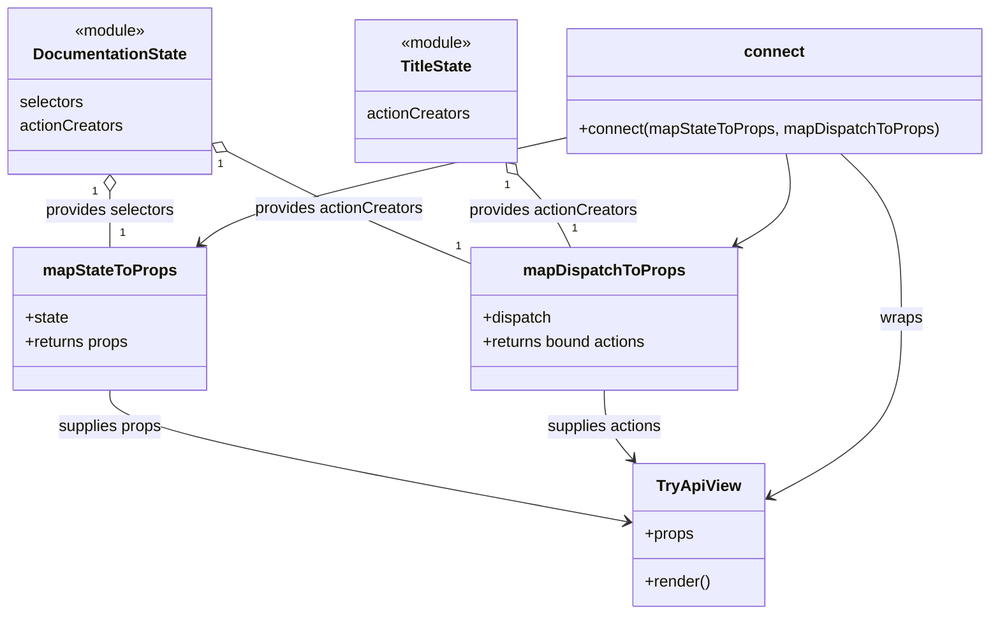

# Diagram: web/portal/src/modules/documentation/TryApiContainer.js


> Auto-generated by Obscura crawlers

## Diagram 1

```mermaid
flowchart LR
  subgraph ReduxState
    State[(state)]
  end

  subgraph DocumentationStateModule
    DS_selectors["DocumentationState.selectors\ngetApiSample()\ngetApiGroup()\ngetTryResponse()\ngetTryStatus()"]
    DS_actions["DocumentationState.actionCreators\ncallTryApi()\nfetchApiGroup()\nfetchApiSample()"]
  end

  subgraph TitleStateModule
    TS_actions["TitleState.actionCreators\nsetTitle()"]
  end

  State -->|passed to| DS_selectors
  DS_selectors -->|returns| apiSample[apiSample]
  DS_selectors -->|returns| apiGroup[apiGroup]
  DS_selectors -->|returns| tryResponse[tryResponse]
  DS_selectors -->|returns| isLoading[isLoading]
  apiSample --> MapState[mapStateToProps]
  apiGroup --> MapState
  tryResponse --> MapState
  isLoading --> MapState
  MapState -->|provides props| ConnectedComponent[connect(...)(TryApiView)]

  DS_actions --> MapDispatch[mapDispatchToProps]
  TS_actions --> MapDispatch
  MapDispatch -->|bindActionCreators| BoundActions[callTryApi, fetchApiSample, fetchApiGroup, setTitle]
  BoundActions --> ConnectedComponent

  ConnectedComponent --> TryApiView[TryApiView]
  style State fill:#f9f,stroke:#333,stroke-width:1px
  style DocumentationStateModule fill:#efe,stroke:#333
  style TitleStateModule fill:#efe,stroke:#333
  style ConnectedComponent fill:#fffbcc,stroke:#333
```

> SVG rendering failed for this diagram.

## Diagram 2



### SVG

<svg id="container" width="999.203125" xmlns="http://www.w3.org/2000/svg" class="classDiagram" height="620" viewBox="0 0 999.203125 620" role="graphics-document document" aria-roledescription="class"><style>#container{font-family:"trebuchet ms",verdana,arial,sans-serif;font-size:16px;fill:#333;}@keyframes edge-animation-frame{from{stroke-dashoffset:0;}}@keyframes dash{to{stroke-dashoffset:0;}}#container .edge-animation-slow{stroke-dasharray:9,5!important;stroke-dashoffset:900;animation:dash 50s linear infinite;stroke-linecap:round;}#container .edge-animation-fast{stroke-dasharray:9,5!important;stroke-dashoffset:900;animation:dash 20s linear infinite;stroke-linecap:round;}#container .error-icon{fill:#552222;}#container .error-text{fill:#552222;stroke:#552222;}#container .edge-thickness-normal{stroke-width:1px;}#container .edge-thickness-thick{stroke-width:3.5px;}#container .edge-pattern-solid{stroke-dasharray:0;}#container .edge-thickness-invisible{stroke-width:0;fill:none;}#container .edge-pattern-dashed{stroke-dasharray:3;}#container .edge-pattern-dotted{stroke-dasharray:2;}#container .marker{fill:#333333;stroke:#333333;}#container .marker.cross{stroke:#333333;}#container svg{font-family:"trebuchet ms",verdana,arial,sans-serif;font-size:16px;}#container p{margin:0;}#container g.classGroup text{fill:#9370DB;stroke:none;font-family:"trebuchet ms",verdana,arial,sans-serif;font-size:10px;}#container g.classGroup text .title{font-weight:bolder;}#container .nodeLabel,#container .edgeLabel{color:#131300;}#container .edgeLabel .label rect{fill:#ECECFF;}#container .label text{fill:#131300;}#container .labelBkg{background:#ECECFF;}#container .edgeLabel .label span{background:#ECECFF;}#container .classTitle{font-weight:bolder;}#container .node rect,#container .node circle,#container .node ellipse,#container .node polygon,#container .node path{fill:#ECECFF;stroke:#9370DB;stroke-width:1px;}#container .divider{stroke:#9370DB;stroke-width:1;}#container g.clickable{cursor:pointer;}#container g.classGroup rect{fill:#ECECFF;stroke:#9370DB;}#container g.classGroup line{stroke:#9370DB;stroke-width:1;}#container .classLabel .box{stroke:none;stroke-width:0;fill:#ECECFF;opacity:0.5;}#container .classLabel .label{fill:#9370DB;font-size:10px;}#container .relation{stroke:#333333;stroke-width:1;fill:none;}#container .dashed-line{stroke-dasharray:3;}#container .dotted-line{stroke-dasharray:1 2;}#container #compositionStart,#container .composition{fill:#333333!important;stroke:#333333!important;stroke-width:1;}#container #compositionEnd,#container .composition{fill:#333333!important;stroke:#333333!important;stroke-width:1;}#container #dependencyStart,#container .dependency{fill:#333333!important;stroke:#333333!important;stroke-width:1;}#container #dependencyStart,#container .dependency{fill:#333333!important;stroke:#333333!important;stroke-width:1;}#container #extensionStart,#container .extension{fill:transparent!important;stroke:#333333!important;stroke-width:1;}#container #extensionEnd,#container .extension{fill:transparent!important;stroke:#333333!important;stroke-width:1;}#container #aggregationStart,#container .aggregation{fill:transparent!important;stroke:#333333!important;stroke-width:1;}#container #aggregationEnd,#container .aggregation{fill:transparent!important;stroke:#333333!important;stroke-width:1;}#container #lollipopStart,#container .lollipop{fill:#ECECFF!important;stroke:#333333!important;stroke-width:1;}#container #lollipopEnd,#container .lollipop{fill:#ECECFF!important;stroke:#333333!important;stroke-width:1;}#container .edgeTerminals{font-size:11px;line-height:initial;}#container .classTitleText{text-anchor:middle;font-size:18px;fill:#333;}#container .label-icon{display:inline-block;height:1em;overflow:visible;vertical-align:-0.125em;}#container .node .label-icon path{fill:currentColor;stroke:revert;stroke-width:revert;}#container :root{--mermaid-font-family:"trebuchet ms",verdana,arial,sans-serif;}</style><g><defs><marker id="container_class-aggregationStart" class="marker aggregation class" refX="18" refY="7" markerWidth="190" markerHeight="240" orient="auto"><path d="M 18,7 L9,13 L1,7 L9,1 Z"></path></marker></defs><defs><marker id="container_class-aggregationEnd" class="marker aggregation class" refX="1" refY="7" markerWidth="20" markerHeight="28" orient="auto"><path d="M 18,7 L9,13 L1,7 L9,1 Z"></path></marker></defs><defs><marker id="container_class-extensionStart" class="marker extension class" refX="18" refY="7" markerWidth="190" markerHeight="240" orient="auto"><path d="M 1,7 L18,13 V 1 Z"></path></marker></defs><defs><marker id="container_class-extensionEnd" class="marker extension class" refX="1" refY="7" markerWidth="20" markerHeight="28" orient="auto"><path d="M 1,1 V 13 L18,7 Z"></path></marker></defs><defs><marker id="container_class-compositionStart" class="marker composition class" refX="18" refY="7" markerWidth="190" markerHeight="240" orient="auto"><path d="M 18,7 L9,13 L1,7 L9,1 Z"></path></marker></defs><defs><marker id="container_class-compositionEnd" class="marker composition class" refX="1" refY="7" markerWidth="20" markerHeight="28" orient="auto"><path d="M 18,7 L9,13 L1,7 L9,1 Z"></path></marker></defs><defs><marker id="container_class-dependencyStart" class="marker dependency class" refX="6" refY="7" markerWidth="190" markerHeight="240" orient="auto"><path d="M 5,7 L9,13 L1,7 L9,1 Z"></path></marker></defs><defs><marker id="container_class-dependencyEnd" class="marker dependency class" refX="13" refY="7" markerWidth="20" markerHeight="28" orient="auto"><path d="M 18,7 L9,13 L14,7 L9,1 Z"></path></marker></defs><defs><marker id="container_class-lollipopStart" class="marker lollipop class" refX="13" refY="7" markerWidth="190" markerHeight="240" orient="auto"><circle stroke="black" fill="transparent" cx="7" cy="7" r="6"></circle></marker></defs><defs><marker id="container_class-lollipopEnd" class="marker lollipop class" refX="1" refY="7" markerWidth="190" markerHeight="240" orient="auto"><circle stroke="black" fill="transparent" cx="7" cy="7" r="6"></circle></marker></defs><g class="root"><g class="clusters"></g><g class="edgePaths"><path d="M109.994,193.25L109.983,196.542C109.972,199.833,109.95,206.417,109.939,215.875C109.928,225.333,109.928,237.667,109.928,243.833L109.928,250" id="id_DocumentationState_mapStateToProps_1" class="edge-thickness-normal edge-pattern-solid relation" style=";;;" data-edge="true" data-et="edge" data-id="id_DocumentationState_mapStateToProps_1" data-points="W3sieCI6MTEwLjA1MTM2MjM0NTA0MTMzLCJ5IjoxNzZ9LHsieCI6MTA5LjkyNzczNDM3NSwieSI6MjEzfSx7IngiOjEwOS45Mjc3MzQzNzUsInkiOjI1MH1d" marker-start="url(#container_class-aggregationStart)"></path><path d="M228.028,152.087L247.913,162.239C267.799,172.391,307.57,192.696,349.117,211.756C390.663,230.817,433.984,248.634,455.644,257.542L477.305,266.451" id="id_DocumentationState_mapDispatchToProps_2" class="edge-thickness-normal edge-pattern-solid relation" style=";;;" data-edge="true" data-et="edge" data-id="id_DocumentationState_mapDispatchToProps_2" data-points="W3sieCI6MjEyLjY2NDA2MjUsInkiOjE0NC4yNDMzMTQ3MzY4MzM0NH0seyJ4IjozNDcuMzQxNzk2ODc1LCJ5IjoyMTN9LHsieCI6NDc3LjMwNDY4NzUsInkiOjI2Ni40NTA1MjUwNzQ2MTU5fV0=" marker-start="url(#container_class-aggregationStart)"></path><path d="M524.886,176.282L530.921,182.402C536.956,188.521,549.026,200.761,557.962,213.047C566.898,225.333,572.699,237.667,575.6,243.833L578.501,250" id="id_TitleState_mapDispatchToProps_3" class="edge-thickness-normal edge-pattern-solid relation" style=";;;" data-edge="true" data-et="edge" data-id="id_TitleState_mapDispatchToProps_3" data-points="W3sieCI6NTEyLjc3MzUzNDM0OTE3MzYsInkiOjE2NH0seyJ4Ijo1NjEuMDk1NzAzMTI1LCJ5IjoyMTN9LHsieCI6NTc4LjUwMTExMDk1MTgzNDksInkiOjI1MH1d" marker-start="url(#container_class-aggregationStart)"></path><path d="M109.928,394L109.928,400.167C109.928,406.333,109.928,418.667,197.721,440.831C285.514,462.996,461.099,494.991,548.892,510.989L636.685,526.987" id="id_mapStateToProps_TryApiView_4" class="edge-thickness-normal edge-pattern-solid relation" style=";;;" data-edge="true" data-et="edge" data-id="id_mapStateToProps_TryApiView_4" data-points="W3sieCI6MTA5LjkyNzczNDM3NSwieSI6Mzk0fSx7IngiOjEwOS45Mjc3MzQzNzUsInkiOjQzMX0seyJ4Ijo2NDIuNTg3ODkwNjI1LCJ5Ijo1MjguMDYyMzMxODQ0NDIxOH1d" marker-end="url(#container_class-dependencyEnd)"></path><path d="M612.371,394L612.371,400.167C612.371,406.333,612.371,418.667,617.127,430.249C621.883,441.831,631.395,452.661,636.151,458.076L640.907,463.492" id="id_mapDispatchToProps_TryApiView_5" class="edge-thickness-normal edge-pattern-solid relation" style=";;;" data-edge="true" data-et="edge" data-id="id_mapDispatchToProps_TryApiView_5" data-points="W3sieCI6NjEyLjM3MTA5Mzc1LCJ5IjozOTR9LHsieCI6NjEyLjM3MTA5Mzc1LCJ5Ijo0MzF9LHsieCI6NjQ0Ljg2NjA5NDQ2Njc0MzEsInkiOjQ2OH1d" marker-end="url(#container_class-dependencyEnd)"></path><path d="M850.308,155L860.64,164.667C870.971,174.333,891.635,193.667,901.967,221.5C912.299,249.333,912.299,285.667,912.299,322C912.299,358.333,912.299,394.667,890.066,424.701C867.834,454.735,823.369,478.47,801.137,490.337L778.904,502.205" id="id_connect_TryApiView_6" class="edge-thickness-normal edge-pattern-solid relation" style=";;;" data-edge="true" data-et="edge" data-id="id_connect_TryApiView_6" data-points="W3sieCI6ODUwLjMwNzc3MDUzMjAyNDcsInkiOjE1NX0seyJ4Ijo5MTIuMjk4ODI4MTI1LCJ5IjoyMTN9LHsieCI6OTEyLjI5ODgyODEyNSwieSI6MzIyfSx7IngiOjkxMi4yOTg4MjgxMjUsInkiOjQzMX0seyJ4Ijo3NzMuNjExMzI4MTI1LCJ5Ijo1MDUuMDMwMzM5NTUwNDU0M31d" marker-end="url(#container_class-dependencyEnd)"></path><path d="M574.742,138.51L519.159,150.925C463.575,163.34,352.408,188.17,290.164,206.113C227.921,224.056,214.602,235.112,207.943,240.64L201.283,246.168" id="id_connect_mapStateToProps_7" class="edge-thickness-normal edge-pattern-solid relation" style=";;;" data-edge="true" data-et="edge" data-id="id_connect_mapStateToProps_7" data-points="W3sieCI6NTc0Ljc0MjE4NzUsInkiOjEzOC41MDk4MzcxNDcxNzMyNH0seyJ4IjoyNDEuMjQwMjM0Mzc1LCJ5IjoyMTN9LHsieCI6MTk2LjY2NjI2NjQ4NTA5MTc0LCJ5IjoyNTB9XQ==" marker-end="url(#container_class-dependencyEnd)"></path><path d="M795.259,155L797.144,164.667C799.029,174.333,802.8,193.667,794.57,209.011C786.341,224.354,766.111,235.709,755.996,241.386L745.882,247.063" id="id_connect_mapDispatchToProps_8" class="edge-thickness-normal edge-pattern-solid relation" style=";;;" data-edge="true" data-et="edge" data-id="id_connect_mapDispatchToProps_8" data-points="W3sieCI6Nzk1LjI1OTAzOTI1NjE5ODMsInkiOjE1NX0seyJ4Ijo4MDYuNTcwMzEyNSwieSI6MjEzfSx7IngiOjc0MC42NDk0NzY3Nzc1MjMsInkiOjI1MH1d" marker-end="url(#container_class-dependencyEnd)"></path></g><g class="edgeLabels"><g class="edgeLabel" transform="translate(109.927734375, 213)"><g class="label" data-id="id_DocumentationState_mapStateToProps_1" transform="translate(-66.1640625, -12)"><foreignObject width="132.328125" height="24"><div xmlns="http://www.w3.org/1999/xhtml" class="labelBkg" style="display: table-cell; white-space: nowrap; line-height: 1.5; max-width: 200px; text-align: center;"><span class="edgeLabel"><p>provides selectors</p></span></div></foreignObject></g></g><g class="edgeLabel" transform="translate(342.58195, 210.56997)"><g class="label" data-id="id_DocumentationState_mapDispatchToProps_2" transform="translate(-86.1015625, -12)"><foreignObject width="172.203125" height="24"><div xmlns="http://www.w3.org/1999/xhtml" class="labelBkg" style="display: table-cell; white-space: nowrap; line-height: 1.5; max-width: 200px; text-align: center;"><span class="edgeLabel"><p>provides actionCreators</p></span></div></foreignObject></g></g><g class="edgeLabel" transform="translate(561.095703125, 213)"><g class="label" data-id="id_TitleState_mapDispatchToProps_3" transform="translate(-86.1015625, -12)"><foreignObject width="172.203125" height="24"><div xmlns="http://www.w3.org/1999/xhtml" class="labelBkg" style="display: table-cell; white-space: nowrap; line-height: 1.5; max-width: 200px; text-align: center;"><span class="edgeLabel"><p>provides actionCreators</p></span></div></foreignObject></g></g><g class="edgeLabel" transform="translate(109.927734375, 431)"><g class="label" data-id="id_mapStateToProps_TryApiView_4" transform="translate(-53.4765625, -12)"><foreignObject width="106.953125" height="24"><div xmlns="http://www.w3.org/1999/xhtml" class="labelBkg" style="display: table-cell; white-space: nowrap; line-height: 1.5; max-width: 200px; text-align: center;"><span class="edgeLabel"><p>supplies props</p></span></div></foreignObject></g></g><g class="edgeLabel" transform="translate(612.37109375, 431)"><g class="label" data-id="id_mapDispatchToProps_TryApiView_5" transform="translate(-59.1328125, -12)"><foreignObject width="118.265625" height="24"><div xmlns="http://www.w3.org/1999/xhtml" class="labelBkg" style="display: table-cell; white-space: nowrap; line-height: 1.5; max-width: 200px; text-align: center;"><span class="edgeLabel"><p>supplies actions</p></span></div></foreignObject></g></g><g class="edgeLabel" transform="translate(912.298828125, 322)"><g class="label" data-id="id_connect_TryApiView_6" transform="translate(-21.390625, -12)"><foreignObject width="42.78125" height="24"><div xmlns="http://www.w3.org/1999/xhtml" class="labelBkg" style="display: table-cell; white-space: nowrap; line-height: 1.5; max-width: 200px; text-align: center;"><span class="edgeLabel"><p>wraps</p></span></div></foreignObject></g></g><g class="edgeLabel"><g class="label" data-id="id_connect_mapStateToProps_7" transform="translate(0, 0)"><foreignObject width="0" height="0"><div xmlns="http://www.w3.org/1999/xhtml" class="labelBkg" style="display: table-cell; white-space: nowrap; line-height: 1.5; max-width: 200px; text-align: center;"><span class="edgeLabel"></span></div></foreignObject></g></g><g class="edgeLabel"><g class="label" data-id="id_connect_mapDispatchToProps_8" transform="translate(0, 0)"><foreignObject width="0" height="0"><div xmlns="http://www.w3.org/1999/xhtml" class="labelBkg" style="display: table-cell; white-space: nowrap; line-height: 1.5; max-width: 200px; text-align: center;"><span class="edgeLabel"></span></div></foreignObject></g></g><g class="edgeTerminals" transform="translate(94.9929749004014, 193.4497818454881)"><g class="inner" transform="translate(0, 0)"><foreignObject style="width: 9px; height: 12px;"><div xmlns="http://www.w3.org/1999/xhtml" style="display: inline-block; padding-right: 1px; white-space: nowrap;"><span class="edgeLabel">1</span></div></foreignObject></g></g><g class="edgeTerminals" transform="translate(221.42987229546515, 165.56022545682637)"><g class="inner" transform="translate(0, 0)"><foreignObject style="width: 9px; height: 12px;"><div xmlns="http://www.w3.org/1999/xhtml" style="display: inline-block; padding-right: 1px; white-space: nowrap;"><span class="edgeLabel">1</span></div></foreignObject></g></g><g class="edgeTerminals" transform="translate(514.3812081900535, 186.99272498191087)"><g class="inner" transform="translate(0, 0)"><foreignObject style="width: 9px; height: 12px;"><div xmlns="http://www.w3.org/1999/xhtml" style="display: inline-block; padding-right: 1px; white-space: nowrap;"><span class="edgeLabel">1</span></div></foreignObject></g></g><g class="edgeTerminals" transform="translate(119.92773218749988, 227.499998125)"><g class="inner" transform="translate(0, 0)"></g><foreignObject style="width: 9px; height: 12px;"><div xmlns="http://www.w3.org/1999/xhtml" style="display: inline-block; padding-right: 1px; white-space: nowrap;"><span class="edgeLabel">1</span></div></foreignObject></g><g class="edgeTerminals" transform="translate(461.8254746868041, 240.92161671687398)"><g class="inner" transform="translate(0, 0)"></g><foreignObject style="width: 9px; height: 12px;"><div xmlns="http://www.w3.org/1999/xhtml" style="display: inline-block; padding-right: 1px; white-space: nowrap;"><span class="edgeLabel">1</span></div></foreignObject></g><g class="edgeTerminals" transform="translate(579.6250693334474, 222.7795787431982)"><g class="inner" transform="translate(0, 0)"></g><foreignObject style="width: 9px; height: 12px;"><div xmlns="http://www.w3.org/1999/xhtml" style="display: inline-block; padding-right: 1px; white-space: nowrap;"><span class="edgeLabel">1</span></div></foreignObject></g></g><g class="nodes"><g class="node default" id="classId-DocumentationState-0" transform="translate(110.33203125, 92)"><g class="basic label-container"><path d="M-102.33203125 -84 L102.33203125 -84 L102.33203125 84 L-102.33203125 84" stroke="none" stroke-width="0" fill="#ECECFF" style=""></path><path d="M-102.33203125 -84 C-40.024679900332 -84, 22.282671449335993 -84, 102.33203125 -84 M-102.33203125 -84 C-41.094276404298796 -84, 20.143478441402408 -84, 102.33203125 -84 M102.33203125 -84 C102.33203125 -45.82416999606385, 102.33203125 -7.648339992127703, 102.33203125 84 M102.33203125 -84 C102.33203125 -39.60047098310284, 102.33203125 4.799058033794324, 102.33203125 84 M102.33203125 84 C22.308029434917813 84, -57.715972380164374 84, -102.33203125 84 M102.33203125 84 C28.77632865889214 84, -44.77937393221572 84, -102.33203125 84 M-102.33203125 84 C-102.33203125 30.793656714693967, -102.33203125 -22.412686570612067, -102.33203125 -84 M-102.33203125 84 C-102.33203125 27.192392466737836, -102.33203125 -29.61521506652433, -102.33203125 -84" stroke="#9370DB" stroke-width="1.3" fill="none" stroke-dasharray="0 0" style=""></path></g><g class="annotation-group text" transform="translate(-36.6015625, -60)"><g class="label" style="" transform="translate(0,-12)"><foreignObject width="73.203125" height="24"><div xmlns="http://www.w3.org/1999/xhtml" style="display: table-cell; white-space: nowrap; line-height: 1.5; max-width: 123px; text-align: center;"><span class="nodeLabel markdown-node-label" style=""><p>«module»</p></span></div></foreignObject></g></g><g class="label-group text" transform="translate(-75.3203125, -36)"><g class="label" style="font-weight: bolder" transform="translate(0,-12)"><foreignObject width="150.640625" height="24"><div xmlns="http://www.w3.org/1999/xhtml" style="display: table-cell; white-space: nowrap; line-height: 1.5; max-width: 199px; text-align: center;"><span class="nodeLabel markdown-node-label" style=""><p>DocumentationState</p></span></div></foreignObject></g></g><g class="members-group text" transform="translate(-90.33203125, 12)"><g class="label" style="" transform="translate(0,-12)"><foreignObject width="65.46875" height="24"><div xmlns="http://www.w3.org/1999/xhtml" style="display: table-cell; white-space: nowrap; line-height: 1.5; max-width: 115px; text-align: center;"><span class="nodeLabel markdown-node-label" style=""><p>selectors</p></span></div></foreignObject></g><g class="label" style="" transform="translate(0,12)"><foreignObject width="105.34375" height="24"><div xmlns="http://www.w3.org/1999/xhtml" style="display: table-cell; white-space: nowrap; line-height: 1.5; max-width: 155px; text-align: center;"><span class="nodeLabel markdown-node-label" style=""><p>actionCreators</p></span></div></foreignObject></g></g><g class="methods-group text" transform="translate(-90.33203125, 84)"></g><g class="divider" style=""><path d="M-102.33203125 -12 C-44.17676462287396 -12, 13.978502004252078 -12, 102.33203125 -12 M-102.33203125 -12 C-25.21229905386484 -12, 51.90743314227032 -12, 102.33203125 -12" stroke="#9370DB" stroke-width="1.3" fill="none" stroke-dasharray="0 0" style=""></path></g><g class="divider" style=""><path d="M-102.33203125 60 C-52.94858515092817 60, -3.5651390518563346 60, 102.33203125 60 M-102.33203125 60 C-34.76044685538295 60, 32.811137539234096 60, 102.33203125 60" stroke="#9370DB" stroke-width="1.3" fill="none" stroke-dasharray="0 0" style=""></path></g></g><g class="node default" id="classId-TitleState-1" transform="translate(441.76953125, 92)"><g class="basic label-container"><path d="M-82.97265625 -72 L82.97265625 -72 L82.97265625 72 L-82.97265625 72" stroke="none" stroke-width="0" fill="#ECECFF" style=""></path><path d="M-82.97265625 -72 C-32.69508533007951 -72, 17.582485589840985 -72, 82.97265625 -72 M-82.97265625 -72 C-48.155021856872615 -72, -13.33738746374523 -72, 82.97265625 -72 M82.97265625 -72 C82.97265625 -14.788583337378114, 82.97265625 42.42283332524377, 82.97265625 72 M82.97265625 -72 C82.97265625 -20.71703668822456, 82.97265625 30.56592662355088, 82.97265625 72 M82.97265625 72 C31.08775486187899 72, -20.797146526242017 72, -82.97265625 72 M82.97265625 72 C44.151559465133964 72, 5.330462680267928 72, -82.97265625 72 M-82.97265625 72 C-82.97265625 31.44385131278257, -82.97265625 -9.11229737443486, -82.97265625 -72 M-82.97265625 72 C-82.97265625 30.387343324856296, -82.97265625 -11.225313350287408, -82.97265625 -72" stroke="#9370DB" stroke-width="1.3" fill="none" stroke-dasharray="0 0" style=""></path></g><g class="annotation-group text" transform="translate(-36.6015625, -48)"><g class="label" style="" transform="translate(0,-12)"><foreignObject width="73.203125" height="24"><div xmlns="http://www.w3.org/1999/xhtml" style="display: table-cell; white-space: nowrap; line-height: 1.5; max-width: 123px; text-align: center;"><span class="nodeLabel markdown-node-label" style=""><p>«module»</p></span></div></foreignObject></g></g><g class="label-group text" transform="translate(-35.6484375, -24)"><g class="label" style="font-weight: bolder" transform="translate(0,-12)"><foreignObject width="71.296875" height="24"><div xmlns="http://www.w3.org/1999/xhtml" style="display: table-cell; white-space: nowrap; line-height: 1.5; max-width: 119px; text-align: center;"><span class="nodeLabel markdown-node-label" style=""><p>TitleState</p></span></div></foreignObject></g></g><g class="members-group text" transform="translate(-70.97265625, 24)"><g class="label" style="" transform="translate(0,-12)"><foreignObject width="105.34375" height="24"><div xmlns="http://www.w3.org/1999/xhtml" style="display: table-cell; white-space: nowrap; line-height: 1.5; max-width: 155px; text-align: center;"><span class="nodeLabel markdown-node-label" style=""><p>actionCreators</p></span></div></foreignObject></g></g><g class="methods-group text" transform="translate(-70.97265625, 72)"></g><g class="divider" style=""><path d="M-82.97265625 0 C-37.54257354711111 0, 7.887509155777778 0, 82.97265625 0 M-82.97265625 0 C-33.50689410348983 0, 15.958868043020345 0, 82.97265625 0" stroke="#9370DB" stroke-width="1.3" fill="none" stroke-dasharray="0 0" style=""></path></g><g class="divider" style=""><path d="M-82.97265625 48 C-21.530735194378664 48, 39.91118586124267 48, 82.97265625 48 M-82.97265625 48 C-20.426621039245475 48, 42.11941417150905 48, 82.97265625 48" stroke="#9370DB" stroke-width="1.3" fill="none" stroke-dasharray="0 0" style=""></path></g></g><g class="node default" id="classId-mapStateToProps-2" transform="translate(109.927734375, 322)"><g class="basic label-container"><path d="M-97.49609375 -72 L97.49609375 -72 L97.49609375 72 L-97.49609375 72" stroke="none" stroke-width="0" fill="#ECECFF" style=""></path><path d="M-97.49609375 -72 C-20.745326255071703 -72, 56.005441239856594 -72, 97.49609375 -72 M-97.49609375 -72 C-48.22950199088907 -72, 1.0370897682218612 -72, 97.49609375 -72 M97.49609375 -72 C97.49609375 -40.118420831267116, 97.49609375 -8.236841662534232, 97.49609375 72 M97.49609375 -72 C97.49609375 -32.44210249450505, 97.49609375 7.115795010989899, 97.49609375 72 M97.49609375 72 C44.82402499608579 72, -7.848043757828421 72, -97.49609375 72 M97.49609375 72 C28.760867149907142 72, -39.974359450185716 72, -97.49609375 72 M-97.49609375 72 C-97.49609375 25.036709450553893, -97.49609375 -21.926581098892214, -97.49609375 -72 M-97.49609375 72 C-97.49609375 36.21754586591451, -97.49609375 0.4350917318290186, -97.49609375 -72" stroke="#9370DB" stroke-width="1.3" fill="none" stroke-dasharray="0 0" style=""></path></g><g class="annotation-group text" transform="translate(0, -48)"></g><g class="label-group text" transform="translate(-64.7109375, -48)"><g class="label" style="font-weight: bolder" transform="translate(0,-12)"><foreignObject width="129.421875" height="24"><div xmlns="http://www.w3.org/1999/xhtml" style="display: table-cell; white-space: nowrap; line-height: 1.5; max-width: 177px; text-align: center;"><span class="nodeLabel markdown-node-label" style=""><p>mapStateToProps</p></span></div></foreignObject></g></g><g class="members-group text" transform="translate(-85.49609375, 0)"><g class="label" style="" transform="translate(0,-12)"><foreignObject width="44.09375" height="24"><div xmlns="http://www.w3.org/1999/xhtml" style="display: table-cell; white-space: nowrap; line-height: 1.5; max-width: 101px; text-align: center;"><span class="nodeLabel markdown-node-label" style=""><p>+state</p></span></div></foreignObject></g><g class="label" style="" transform="translate(0,12)"><foreignObject width="106.28125" height="24"><div xmlns="http://www.w3.org/1999/xhtml" style="display: table-cell; white-space: nowrap; line-height: 1.5; max-width: 164px; text-align: center;"><span class="nodeLabel markdown-node-label" style=""><p>+returns props</p></span></div></foreignObject></g></g><g class="methods-group text" transform="translate(-85.49609375, 72)"></g><g class="divider" style=""><path d="M-97.49609375 -24 C-29.690511945312196 -24, 38.11506985937561 -24, 97.49609375 -24 M-97.49609375 -24 C-20.42686359023692 -24, 56.64236656952616 -24, 97.49609375 -24" stroke="#9370DB" stroke-width="1.3" fill="none" stroke-dasharray="0 0" style=""></path></g><g class="divider" style=""><path d="M-97.49609375 48 C-25.862559176588846 48, 45.77097539682231 48, 97.49609375 48 M-97.49609375 48 C-58.2502553214173 48, -19.0044168928346 48, 97.49609375 48" stroke="#9370DB" stroke-width="1.3" fill="none" stroke-dasharray="0 0" style=""></path></g></g><g class="node default" id="classId-mapDispatchToProps-3" transform="translate(612.37109375, 322)"><g class="basic label-container"><path d="M-135.06640625 -72 L135.06640625 -72 L135.06640625 72 L-135.06640625 72" stroke="none" stroke-width="0" fill="#ECECFF" style=""></path><path d="M-135.06640625 -72 C-59.10727312621371 -72, 16.851859997572575 -72, 135.06640625 -72 M-135.06640625 -72 C-62.49131846853446 -72, 10.083769312931082 -72, 135.06640625 -72 M135.06640625 -72 C135.06640625 -39.9856293249687, 135.06640625 -7.971258649937397, 135.06640625 72 M135.06640625 -72 C135.06640625 -41.86638748196853, 135.06640625 -11.73277496393706, 135.06640625 72 M135.06640625 72 C57.34684643729507 72, -20.37271337540986 72, -135.06640625 72 M135.06640625 72 C30.148437681494343 72, -74.76953088701131 72, -135.06640625 72 M-135.06640625 72 C-135.06640625 37.59871991313374, -135.06640625 3.197439826267484, -135.06640625 -72 M-135.06640625 72 C-135.06640625 14.634975875285896, -135.06640625 -42.73004824942821, -135.06640625 -72" stroke="#9370DB" stroke-width="1.3" fill="none" stroke-dasharray="0 0" style=""></path></g><g class="annotation-group text" transform="translate(0, -48)"></g><g class="label-group text" transform="translate(-77.1953125, -48)"><g class="label" style="font-weight: bolder" transform="translate(0,-12)"><foreignObject width="154.390625" height="24"><div xmlns="http://www.w3.org/1999/xhtml" style="display: table-cell; white-space: nowrap; line-height: 1.5; max-width: 203px; text-align: center;"><span class="nodeLabel markdown-node-label" style=""><p>mapDispatchToProps</p></span></div></foreignObject></g></g><g class="members-group text" transform="translate(-123.06640625, 0)"><g class="label" style="" transform="translate(0,-12)"><foreignObject width="70.15625" height="24"><div xmlns="http://www.w3.org/1999/xhtml" style="display: table-cell; white-space: nowrap; line-height: 1.5; max-width: 128px; text-align: center;"><span class="nodeLabel markdown-node-label" style=""><p>+dispatch</p></span></div></foreignObject></g><g class="label" style="" transform="translate(0,12)"><foreignObject width="168.9375" height="24"><div xmlns="http://www.w3.org/1999/xhtml" style="display: table-cell; white-space: nowrap; line-height: 1.5; max-width: 226px; text-align: center;"><span class="nodeLabel markdown-node-label" style=""><p>+returns bound actions</p></span></div></foreignObject></g></g><g class="methods-group text" transform="translate(-123.06640625, 72)"></g><g class="divider" style=""><path d="M-135.06640625 -24 C-71.83664349582764 -24, -8.606880741655303 -24, 135.06640625 -24 M-135.06640625 -24 C-62.582779412953144 -24, 9.900847424093712 -24, 135.06640625 -24" stroke="#9370DB" stroke-width="1.3" fill="none" stroke-dasharray="0 0" style=""></path></g><g class="divider" style=""><path d="M-135.06640625 48 C-35.67827555130552 48, 63.709855147388964 48, 135.06640625 48 M-135.06640625 48 C-42.439104475580066 48, 50.18819729883987 48, 135.06640625 48" stroke="#9370DB" stroke-width="1.3" fill="none" stroke-dasharray="0 0" style=""></path></g></g><g class="node default" id="classId-TryApiView-4" transform="translate(708.099609375, 540)"><g class="basic label-container"><path d="M-65.51171875 -72 L65.51171875 -72 L65.51171875 72 L-65.51171875 72" stroke="none" stroke-width="0" fill="#ECECFF" style=""></path><path d="M-65.51171875 -72 C-14.466901801153774 -72, 36.57791514769245 -72, 65.51171875 -72 M-65.51171875 -72 C-20.695459133990795 -72, 24.12080048201841 -72, 65.51171875 -72 M65.51171875 -72 C65.51171875 -21.118700658201135, 65.51171875 29.76259868359773, 65.51171875 72 M65.51171875 -72 C65.51171875 -39.88611336952518, 65.51171875 -7.772226739050353, 65.51171875 72 M65.51171875 72 C34.840096870767724 72, 4.16847499153544 72, -65.51171875 72 M65.51171875 72 C24.801375976077146 72, -15.908966797845707 72, -65.51171875 72 M-65.51171875 72 C-65.51171875 27.704711837179588, -65.51171875 -16.590576325640825, -65.51171875 -72 M-65.51171875 72 C-65.51171875 32.334057067197065, -65.51171875 -7.331885865605869, -65.51171875 -72" stroke="#9370DB" stroke-width="1.3" fill="none" stroke-dasharray="0 0" style=""></path></g><g class="annotation-group text" transform="translate(0, -48)"></g><g class="label-group text" transform="translate(-40.4140625, -48)"><g class="label" style="font-weight: bolder" transform="translate(0,-12)"><foreignObject width="80.828125" height="24"><div xmlns="http://www.w3.org/1999/xhtml" style="display: table-cell; white-space: nowrap; line-height: 1.5; max-width: 129px; text-align: center;"><span class="nodeLabel markdown-node-label" style=""><p>TryApiView</p></span></div></foreignObject></g></g><g class="members-group text" transform="translate(-53.51171875, 0)"><g class="label" style="" transform="translate(0,-12)"><foreignObject width="49.515625" height="24"><div xmlns="http://www.w3.org/1999/xhtml" style="display: table-cell; white-space: nowrap; line-height: 1.5; max-width: 107px; text-align: center;"><span class="nodeLabel markdown-node-label" style=""><p>+props</p></span></div></foreignObject></g></g><g class="methods-group text" transform="translate(-53.51171875, 48)"><g class="label" style="" transform="translate(0,-12)"><foreignObject width="66.609375" height="24"><div xmlns="http://www.w3.org/1999/xhtml" style="display: table-cell; white-space: nowrap; line-height: 1.5; max-width: 124px; text-align: center;"><span class="nodeLabel markdown-node-label" style=""><p>+render()</p></span></div></foreignObject></g></g><g class="divider" style=""><path d="M-65.51171875 -24 C-13.985960291266501 -24, 37.539798167467 -24, 65.51171875 -24 M-65.51171875 -24 C-39.09069945440429 -24, -12.669680158808568 -24, 65.51171875 -24" stroke="#9370DB" stroke-width="1.3" fill="none" stroke-dasharray="0 0" style=""></path></g><g class="divider" style=""><path d="M-65.51171875 24 C-24.67386052484786 24, 16.16399770030428 24, 65.51171875 24 M-65.51171875 24 C-38.0712738505466 24, -10.630828951093207 24, 65.51171875 24" stroke="#9370DB" stroke-width="1.3" fill="none" stroke-dasharray="0 0" style=""></path></g></g><g class="node default" id="classId-connect-5" transform="translate(782.97265625, 92)"><g class="basic label-container"><path d="M-208.23046875 -63 L208.23046875 -63 L208.23046875 63 L-208.23046875 63" stroke="none" stroke-width="0" fill="#ECECFF" style=""></path><path d="M-208.23046875 -63 C-51.9569804072072 -63, 104.3165079355856 -63, 208.23046875 -63 M-208.23046875 -63 C-97.45394705022927 -63, 13.322574649541451 -63, 208.23046875 -63 M208.23046875 -63 C208.23046875 -28.187891480346522, 208.23046875 6.624217039306956, 208.23046875 63 M208.23046875 -63 C208.23046875 -18.70620113767137, 208.23046875 25.587597724657257, 208.23046875 63 M208.23046875 63 C76.70163344499366 63, -54.82720186001268 63, -208.23046875 63 M208.23046875 63 C64.43996940132791 63, -79.35052994734417 63, -208.23046875 63 M-208.23046875 63 C-208.23046875 19.36010483854802, -208.23046875 -24.279790322903963, -208.23046875 -63 M-208.23046875 63 C-208.23046875 32.39315270537146, -208.23046875 1.7863054107429193, -208.23046875 -63" stroke="#9370DB" stroke-width="1.3" fill="none" stroke-dasharray="0 0" style=""></path></g><g class="annotation-group text" transform="translate(0, -39)"></g><g class="label-group text" transform="translate(-28.9140625, -39)"><g class="label" style="font-weight: bolder" transform="translate(0,-12)"><foreignObject width="57.828125" height="24"><div xmlns="http://www.w3.org/1999/xhtml" style="display: table-cell; white-space: nowrap; line-height: 1.5; max-width: 108px; text-align: center;"><span class="nodeLabel markdown-node-label" style=""><p>connect</p></span></div></foreignObject></g></g><g class="members-group text" transform="translate(-196.23046875, 9)"></g><g class="methods-group text" transform="translate(-196.23046875, 39)"><g class="label" style="" transform="translate(0,-12)"><foreignObject width="363.546875" height="24"><div xmlns="http://www.w3.org/1999/xhtml" style="display: table-cell; white-space: nowrap; line-height: 1.5; max-width: 421px; text-align: center;"><span class="nodeLabel markdown-node-label" style=""><p>+connect(mapStateToProps, mapDispatchToProps)</p></span></div></foreignObject></g></g><g class="divider" style=""><path d="M-208.23046875 -15 C-68.78826315240147 -15, 70.65394244519706 -15, 208.23046875 -15 M-208.23046875 -15 C-49.635114611316254 -15, 108.96023952736749 -15, 208.23046875 -15" stroke="#9370DB" stroke-width="1.3" fill="none" stroke-dasharray="0 0" style=""></path></g><g class="divider" style=""><path d="M-208.23046875 9 C-86.11496369365172 9, 36.000541362696566 9, 208.23046875 9 M-208.23046875 9 C-107.6436245773006 9, -7.056780404601199 9, 208.23046875 9" stroke="#9370DB" stroke-width="1.3" fill="none" stroke-dasharray="0 0" style=""></path></g></g></g></g></g></svg>
