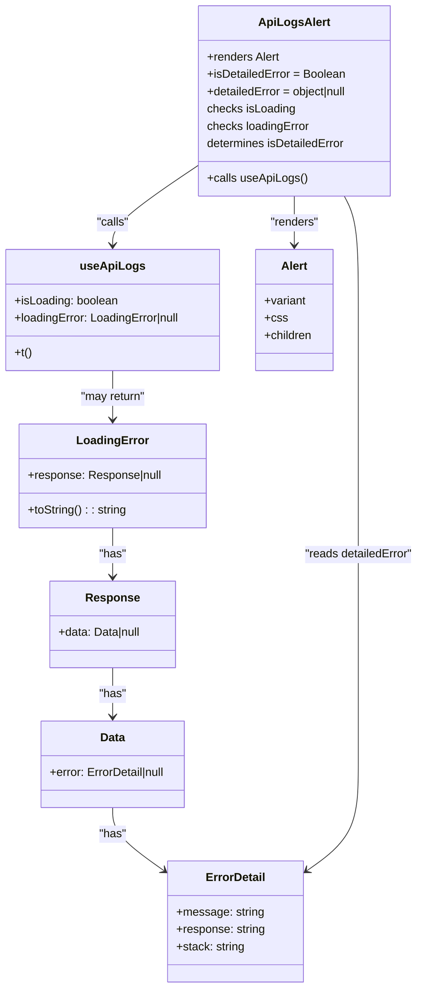

# Diagram: web/portal/src/modules/documentation/api-logs/ApiLogsAlert.js

> Auto-generated by Obscura crawlers

## Mermaid

### SVG

<svg id="container" width="585.9609375" xmlns="http://www.w3.org/2000/svg" class="classDiagram" height="1370" viewBox="0 0 585.9609375 1370" role="graphics-document document" aria-roledescription="class"><g><defs><marker id="container_class-aggregationStart" class="marker aggregation class" refX="18" refY="7" markerWidth="190" markerHeight="240" orient="auto"><path d="M 18,7 L9,13 L1,7 L9,1 Z"></path></marker></defs><defs><marker id="container_class-aggregationEnd" class="marker aggregation class" refX="1" refY="7" markerWidth="20" markerHeight="28" orient="auto"><path d="M 18,7 L9,13 L1,7 L9,1 Z"></path></marker></defs><defs><marker id="container_class-extensionStart" class="marker extension class" refX="18" refY="7" markerWidth="190" markerHeight="240" orient="auto"><path d="M 1,7 L18,13 V 1 Z"></path></marker></defs><defs><marker id="container_class-extensionEnd" class="marker extension class" refX="1" refY="7" markerWidth="20" markerHeight="28" orient="auto"><path d="M 1,1 V 13 L18,7 Z"></path></marker></defs><defs><marker id="container_class-compositionStart" class="marker composition class" refX="18" refY="7" markerWidth="190" markerHeight="240" orient="auto"><path d="M 18,7 L9,13 L1,7 L9,1 Z"></path></marker></defs><defs><marker id="container_class-compositionEnd" class="marker composition class" refX="1" refY="7" markerWidth="20" markerHeight="28" orient="auto"><path d="M 18,7 L9,13 L1,7 L9,1 Z"></path></marker></defs><defs><marker id="container_class-dependencyStart" class="marker dependency class" refX="6" refY="7" markerWidth="190" markerHeight="240" orient="auto"><path d="M 5,7 L9,13 L1,7 L9,1 Z"></path></marker></defs><defs><marker id="container_class-dependencyEnd" class="marker dependency class" refX="13" refY="7" markerWidth="20" markerHeight="28" orient="auto"><path d="M 18,7 L9,13 L14,7 L9,1 Z"></path></marker></defs><defs><marker id="container_class-lollipopStart" class="marker lollipop class" refX="13" refY="7" markerWidth="190" markerHeight="240" orient="auto"><circle stroke="black" fill="transparent" cx="7" cy="7" r="6"></circle></marker></defs><defs><marker id="container_class-lollipopEnd" class="marker lollipop class" refX="1" refY="7" markerWidth="190" markerHeight="240" orient="auto"><circle stroke="black" fill="transparent" cx="7" cy="7" r="6"></circle></marker></defs><g class="root"><g class="clusters"></g><g class="edgePaths"><path d="M276.551,229.938L256.727,243.115C236.904,256.292,197.257,282.646,177.433,300.99C157.609,319.333,157.609,329.667,157.609,334.833L157.609,340" id="id_ApiLogsAlert_useApiLogs_1" class="edge-thickness-normal edge-pattern-solid relation" style=";;;" data-edge="true" data-et="edge" data-id="id_ApiLogsAlert_useApiLogs_1" data-points="W3sieCI6Mjc2LjU1MDc4MTI1LCJ5IjoyMjkuOTM4NDIwODgyODE4Mzh9LHsieCI6MTU3LjYwOTM3NSwieSI6MzA5fSx7IngiOjE1Ny42MDkzNzUsInkiOjM0Nn1d" marker-end="url(#container_class-dependencyEnd)"></path><path d="M411.855,272L411.855,278.167C411.855,284.333,411.855,296.667,411.855,308C411.855,319.333,411.855,329.667,411.855,334.833L411.855,340" id="id_ApiLogsAlert_Alert_2" class="edge-thickness-normal edge-pattern-solid relation" style=";;;" data-edge="true" data-et="edge" data-id="id_ApiLogsAlert_Alert_2" data-points="W3sieCI6NDExLjg1NTQ2ODc1LCJ5IjoyNzJ9LHsieCI6NDExLjg1NTQ2ODc1LCJ5IjozMDl9LHsieCI6NDExLjg1NTQ2ODc1LCJ5IjozNDZ9XQ==" marker-end="url(#container_class-dependencyEnd)"></path><path d="M157.609,514L157.609,520.167C157.609,526.333,157.609,538.667,157.609,550C157.609,561.333,157.609,571.667,157.609,576.833L157.609,582" id="id_useApiLogs_LoadingError_3" class="edge-thickness-normal edge-pattern-solid relation" style=";;;" data-edge="true" data-et="edge" data-id="id_useApiLogs_LoadingError_3" data-points="W3sieCI6MTU3LjYwOTM3NSwieSI6NTE0fSx7IngiOjE1Ny42MDkzNzUsInkiOjU1MX0seyJ4IjoxNTcuNjA5Mzc1LCJ5Ijo1ODh9XQ==" marker-end="url(#container_class-dependencyEnd)"></path><path d="M157.609,732L157.609,738.167C157.609,744.333,157.609,756.667,157.609,768C157.609,779.333,157.609,789.667,157.609,794.833L157.609,800" id="id_LoadingError_Response_4" class="edge-thickness-normal edge-pattern-solid relation" style=";;;" data-edge="true" data-et="edge" data-id="id_LoadingError_Response_4" data-points="W3sieCI6MTU3LjYwOTM3NSwieSI6NzMyfSx7IngiOjE1Ny42MDkzNzUsInkiOjc2OX0seyJ4IjoxNTcuNjA5Mzc1LCJ5Ijo4MDZ9XQ==" marker-end="url(#container_class-dependencyEnd)"></path><path d="M157.609,926L157.609,932.167C157.609,938.333,157.609,950.667,157.609,962C157.609,973.333,157.609,983.667,157.609,988.833L157.609,994" id="id_Response_Data_5" class="edge-thickness-normal edge-pattern-solid relation" style=";;;" data-edge="true" data-et="edge" data-id="id_Response_Data_5" data-points="W3sieCI6MTU3LjYwOTM3NSwieSI6OTI2fSx7IngiOjE1Ny42MDkzNzUsInkiOjk2M30seyJ4IjoxNTcuNjA5Mzc1LCJ5IjoxMDAwfV0=" marker-end="url(#container_class-dependencyEnd)"></path><path d="M157.609,1120L157.609,1126.167C157.609,1132.333,157.609,1144.667,169.795,1159.409C181.982,1174.151,206.354,1191.303,218.54,1199.879L230.726,1208.454" id="id_Data_ErrorDetail_6" class="edge-thickness-normal edge-pattern-solid relation" style=";;;" data-edge="true" data-et="edge" data-id="id_Data_ErrorDetail_6" data-points="W3sieCI6MTU3LjYwOTM3NSwieSI6MTEyMH0seyJ4IjoxNTcuNjA5Mzc1LCJ5IjoxMTU3fSx7IngiOjIzNS42MzI4MTI1LCJ5IjoxMjExLjkwNzI4NTgyMTM4NzJ9XQ==" marker-end="url(#container_class-dependencyEnd)"></path><path d="M481.868,272L485.138,278.167C488.409,284.333,494.951,296.667,498.221,323C501.492,349.333,501.492,389.667,501.492,430C501.492,470.333,501.492,510.667,501.492,549C501.492,587.333,501.492,623.667,501.492,660C501.492,696.333,501.492,732.667,501.492,767C501.492,801.333,501.492,833.667,501.492,866C501.492,898.333,501.492,930.667,501.492,963C501.492,995.333,501.492,1027.667,501.492,1060C501.492,1092.333,501.492,1124.667,489.306,1149.409C477.12,1174.151,452.748,1191.303,440.562,1199.879L428.376,1208.454" id="id_ApiLogsAlert_ErrorDetail_7" class="edge-thickness-normal edge-pattern-solid relation" style=";;;" data-edge="true" data-et="edge" data-id="id_ApiLogsAlert_ErrorDetail_7" data-points="W3sieCI6NDgxLjg2NzU4MDQzNjM5MDU0LCJ5IjoyNzJ9LHsieCI6NTAxLjQ5MjE4NzUsInkiOjMwOX0seyJ4Ijo1MDEuNDkyMTg3NSwieSI6NDMwfSx7IngiOjUwMS40OTIxODc1LCJ5Ijo1NTF9LHsieCI6NTAxLjQ5MjE4NzUsInkiOjY2MH0seyJ4Ijo1MDEuNDkyMTg3NSwieSI6NzY5fSx7IngiOjUwMS40OTIxODc1LCJ5Ijo4NjZ9LHsieCI6NTAxLjQ5MjE4NzUsInkiOjk2M30seyJ4Ijo1MDEuNDkyMTg3NSwieSI6MTA2MH0seyJ4Ijo1MDEuNDkyMTg3NSwieSI6MTE1N30seyJ4Ijo0MjMuNDY4NzUsInkiOjEyMTEuOTA3Mjg1ODIxMzg3Mn1d" marker-end="url(#container_class-dependencyEnd)"></path></g><g class="edgeLabels"><g class="edgeLabel" transform="translate(157.609375, 309)"><g class="label" data-id="id_ApiLogsAlert_useApiLogs_1" transform="translate(-22.625, -12)"><foreignObject width="45.25" height="24">

"calls"

</foreignObject></g></g><g class="edgeLabel" transform="translate(411.85546875, 309)"><g class="label" data-id="id_ApiLogsAlert_Alert_2" transform="translate(-34.015625, -12)"><foreignObject width="68.03125" height="24">

"renders"

</foreignObject></g></g><g class="edgeLabel" transform="translate(157.609375, 551)"><g class="label" data-id="id_useApiLogs_LoadingError_3" transform="translate(-45.9765625, -12)"><foreignObject width="91.953125" height="24">

"may return"

</foreignObject></g></g><g class="edgeLabel" transform="translate(157.609375, 769)"><g class="label" data-id="id_LoadingError_Response_4" transform="translate(-18.9609375, -12)"><foreignObject width="37.921875" height="24">

"has"

</foreignObject></g></g><g class="edgeLabel" transform="translate(157.609375, 963)"><g class="label" data-id="id_Response_Data_5" transform="translate(-18.9609375, -12)"><foreignObject width="37.921875" height="24">

"has"

</foreignObject></g></g><g class="edgeLabel" transform="translate(157.609375, 1157)"><g class="label" data-id="id_Data_ErrorDetail_6" transform="translate(-18.9609375, -12)"><foreignObject width="37.921875" height="24">

"has"

</foreignObject></g></g><g class="edgeLabel" transform="translate(501.4921875, 769)"><g class="label" data-id="id_ApiLogsAlert_ErrorDetail_7" transform="translate(-76.46875, -12)"><foreignObject width="152.9375" height="24">

"reads detailedError"

</foreignObject></g></g></g><g class="nodes"><g class="node default" id="classId-ApiLogsAlert-0" transform="translate(411.85546875, 140)"><g class="basic label-container"><path d="M-135.3046875 -132 L135.3046875 -132 L135.3046875 132 L-135.3046875 132" stroke="none" stroke-width="0" fill="#ECECFF" style=""></path><path d="M-135.3046875 -132 C-51.141132571857455 -132, 33.02242235628509 -132, 135.3046875 -132 M-135.3046875 -132 C-46.060883647167145 -132, 43.18292020566571 -132, 135.3046875 -132 M135.3046875 -132 C135.3046875 -70.51260448570672, 135.3046875 -9.025208971413434, 135.3046875 132 M135.3046875 -132 C135.3046875 -47.75996125814453, 135.3046875 36.48007748371094, 135.3046875 132 M135.3046875 132 C73.35697795220986 132, 11.409268404419734 132, -135.3046875 132 M135.3046875 132 C54.91924680892694 132, -25.466193882146115 132, -135.3046875 132 M-135.3046875 132 C-135.3046875 34.059953060746736, -135.3046875 -63.88009387850653, -135.3046875 -132 M-135.3046875 132 C-135.3046875 51.79373159154002, -135.3046875 -28.412536816919953, -135.3046875 -132" stroke="#9370DB" stroke-width="1.3" fill="none" stroke-dasharray="0 0" style=""></path></g><g class="annotation-group text" transform="translate(0, -108)"></g><g class="label-group text" transform="translate(-46.296875, -108)"><g class="label" style="font-weight: bolder" transform="translate(0,-12)"><foreignObject width="92.59375" height="24">

ApiLogsAlert

</foreignObject></g></g><g class="members-group text" transform="translate(-123.3046875, -60)"><g class="label" style="" transform="translate(0,-12)"><foreignObject width="102.171875" height="24">

+renders Alert

</foreignObject></g><g class="label" style="" transform="translate(0,12)"><foreignObject width="192.71875" height="24">

+isDetailedError = Boolean

</foreignObject></g><g class="label" style="" transform="translate(0,36)"><foreignObject width="200.3125" height="24">

+detailedError = object|null

</foreignObject></g><g class="label" style="" transform="translate(0,60)"><foreignObject width="122.4375" height="24">

checks isLoading

</foreignObject></g><g class="label" style="" transform="translate(0,84)"><foreignObject width="143.28125" height="24">

checks loadingError

</foreignObject></g><g class="label" style="" transform="translate(0,108)"><foreignObject width="195.34375" height="24">

determines isDetailedError

</foreignObject></g></g><g class="methods-group text" transform="translate(-123.3046875, 108)"><g class="label" style="" transform="translate(0,-12)"><foreignObject width="136.765625" height="24">

+calls useApiLogs()

</foreignObject></g></g><g class="divider" style=""><path d="M-135.3046875 -84 C-55.00759904109033 -84, 25.28948941781934 -84, 135.3046875 -84 M-135.3046875 -84 C-52.532072198102654 -84, 30.240543103794693 -84, 135.3046875 -84" stroke="#9370DB" stroke-width="1.3" fill="none" stroke-dasharray="0 0" style=""></path></g><g class="divider" style=""><path d="M-135.3046875 84 C-30.760367983870324 84, 73.78395153225935 84, 135.3046875 84 M-135.3046875 84 C-72.84244805205788 84, -10.380208604115765 84, 135.3046875 84" stroke="#9370DB" stroke-width="1.3" fill="none" stroke-dasharray="0 0" style=""></path></g></g><g class="node default" id="classId-useApiLogs-1" transform="translate(157.609375, 430)"><g class="basic label-container"><path d="M-149.609375 -84 L149.609375 -84 L149.609375 84 L-149.609375 84" stroke="none" stroke-width="0" fill="#ECECFF" style=""></path><path d="M-149.609375 -84 C-77.38318800510842 -84, -5.157001010216845 -84, 149.609375 -84 M-149.609375 -84 C-65.2141954104688 -84, 19.180984179062392 -84, 149.609375 -84 M149.609375 -84 C149.609375 -19.190098494230426, 149.609375 45.61980301153915, 149.609375 84 M149.609375 -84 C149.609375 -17.621447401676463, 149.609375 48.757105196647075, 149.609375 84 M149.609375 84 C72.59604377681583 84, -4.417287446368334 84, -149.609375 84 M149.609375 84 C64.15433949694194 84, -21.300696006116112 84, -149.609375 84 M-149.609375 84 C-149.609375 32.34138884833744, -149.609375 -19.317222303325124, -149.609375 -84 M-149.609375 84 C-149.609375 42.1820734056714, -149.609375 0.36414681134280613, -149.609375 -84" stroke="#9370DB" stroke-width="1.3" fill="none" stroke-dasharray="0 0" style=""></path></g><g class="annotation-group text" transform="translate(0, -60)"></g><g class="label-group text" transform="translate(-41.390625, -60)"><g class="label" style="font-weight: bolder" transform="translate(0,-12)"><foreignObject width="82.78125" height="24">

useApiLogs

</foreignObject></g></g><g class="members-group text" transform="translate(-137.609375, -12)"><g class="label" style="" transform="translate(0,-12)"><foreignObject width="144.734375" height="24">

+isLoading: boolean

</foreignObject></g><g class="label" style="" transform="translate(0,12)"><foreignObject width="233.828125" height="24">

+loadingError: LoadingError|null

</foreignObject></g></g><g class="methods-group text" transform="translate(-137.609375, 60)"><g class="label" style="" transform="translate(0,-12)"><foreignObject width="24.0625" height="24">

+t()

</foreignObject></g></g><g class="divider" style=""><path d="M-149.609375 -36 C-35.15588594095 -36, 79.2976031181 -36, 149.609375 -36 M-149.609375 -36 C-86.24116116695541 -36, -22.87294733391083 -36, 149.609375 -36" stroke="#9370DB" stroke-width="1.3" fill="none" stroke-dasharray="0 0" style=""></path></g><g class="divider" style=""><path d="M-149.609375 36 C-67.4544330852576 36, 14.70050882948479 36, 149.609375 36 M-149.609375 36 C-38.663092426434275 36, 72.28319014713145 36, 149.609375 36" stroke="#9370DB" stroke-width="1.3" fill="none" stroke-dasharray="0 0" style=""></path></g></g><g class="node default" id="classId-Alert-2" transform="translate(411.85546875, 430)"><g class="basic label-container"><path d="M-54.63671875 -84 L54.63671875 -84 L54.63671875 84 L-54.63671875 84" stroke="none" stroke-width="0" fill="#ECECFF" style=""></path><path d="M-54.63671875 -84 C-17.896930949460845 -84, 18.84285685107831 -84, 54.63671875 -84 M-54.63671875 -84 C-21.47317348943386 -84, 11.690371771132277 -84, 54.63671875 -84 M54.63671875 -84 C54.63671875 -35.08338035843272, 54.63671875 13.83323928313456, 54.63671875 84 M54.63671875 -84 C54.63671875 -37.643421565495856, 54.63671875 8.713156869008287, 54.63671875 84 M54.63671875 84 C20.053318151085747 84, -14.530082447828505 84, -54.63671875 84 M54.63671875 84 C11.332754705096256 84, -31.971209339807487 84, -54.63671875 84 M-54.63671875 84 C-54.63671875 31.336623194186437, -54.63671875 -21.326753611627126, -54.63671875 -84 M-54.63671875 84 C-54.63671875 33.97471459864987, -54.63671875 -16.050570802700264, -54.63671875 -84" stroke="#9370DB" stroke-width="1.3" fill="none" stroke-dasharray="0 0" style=""></path></g><g class="annotation-group text" transform="translate(0, -60)"></g><g class="label-group text" transform="translate(-17.7734375, -60)"><g class="label" style="font-weight: bolder" transform="translate(0,-12)"><foreignObject width="35.546875" height="24">

Alert

</foreignObject></g></g><g class="members-group text" transform="translate(-42.63671875, -12)"><g class="label" style="" transform="translate(0,-12)"><foreignObject width="58.703125" height="24">

+variant

</foreignObject></g><g class="label" style="" transform="translate(0,12)"><foreignObject width="30.421875" height="24">

+css

</foreignObject></g><g class="label" style="" transform="translate(0,36)"><foreignObject width="67.5" height="24">

+children

</foreignObject></g></g><g class="methods-group text" transform="translate(-42.63671875, 84)"></g><g class="divider" style=""><path d="M-54.63671875 -36 C-23.951621430096644 -36, 6.733475889806712 -36, 54.63671875 -36 M-54.63671875 -36 C-21.134216361801528 -36, 12.368286026396945 -36, 54.63671875 -36" stroke="#9370DB" stroke-width="1.3" fill="none" stroke-dasharray="0 0" style=""></path></g><g class="divider" style=""><path d="M-54.63671875 60 C-30.214191956706788 60, -5.791665163413576 60, 54.63671875 60 M-54.63671875 60 C-17.345187725838393 60, 19.946343298323214 60, 54.63671875 60" stroke="#9370DB" stroke-width="1.3" fill="none" stroke-dasharray="0 0" style=""></path></g></g><g class="node default" id="classId-LoadingError-3" transform="translate(157.609375, 660)"><g class="basic label-container"><path d="M-129.04296875 -72 L129.04296875 -72 L129.04296875 72 L-129.04296875 72" stroke="none" stroke-width="0" fill="#ECECFF" style=""></path><path d="M-129.04296875 -72 C-43.65349119282938 -72, 41.735986364341244 -72, 129.04296875 -72 M-129.04296875 -72 C-40.380206664461596 -72, 48.28255542107681 -72, 129.04296875 -72 M129.04296875 -72 C129.04296875 -31.316867146368153, 129.04296875 9.366265707263693, 129.04296875 72 M129.04296875 -72 C129.04296875 -33.00052569796231, 129.04296875 5.99894860407538, 129.04296875 72 M129.04296875 72 C76.03019738988935 72, 23.017426029778704 72, -129.04296875 72 M129.04296875 72 C38.52757972010589 72, -51.98780930978822 72, -129.04296875 72 M-129.04296875 72 C-129.04296875 20.7389245399499, -129.04296875 -30.522150920100202, -129.04296875 -72 M-129.04296875 72 C-129.04296875 42.285788591539855, -129.04296875 12.571577183079704, -129.04296875 -72" stroke="#9370DB" stroke-width="1.3" fill="none" stroke-dasharray="0 0" style=""></path></g><g class="annotation-group text" transform="translate(0, -48)"></g><g class="label-group text" transform="translate(-47.1484375, -48)"><g class="label" style="font-weight: bolder" transform="translate(0,-12)"><foreignObject width="94.296875" height="24">

LoadingError

</foreignObject></g></g><g class="members-group text" transform="translate(-117.04296875, 0)"><g class="label" style="" transform="translate(0,-12)"><foreignObject width="186.9375" height="24">

+response: Response|null

</foreignObject></g></g><g class="methods-group text" transform="translate(-117.04296875, 48)"><g class="label" style="" transform="translate(0,-12)"><foreignObject width="138.078125" height="24">

+toString() : : string

</foreignObject></g></g><g class="divider" style=""><path d="M-129.04296875 -24 C-64.86888855983645 -24, -0.6948083696728986 -24, 129.04296875 -24 M-129.04296875 -24 C-54.48662474520209 -24, 20.069719259595814 -24, 129.04296875 -24" stroke="#9370DB" stroke-width="1.3" fill="none" stroke-dasharray="0 0" style=""></path></g><g class="divider" style=""><path d="M-129.04296875 24 C-74.784437158023 24, -20.525905566046006 24, 129.04296875 24 M-129.04296875 24 C-40.43276068674102 24, 48.17744737651796 24, 129.04296875 24" stroke="#9370DB" stroke-width="1.3" fill="none" stroke-dasharray="0 0" style=""></path></g></g><g class="node default" id="classId-Response-4" transform="translate(157.609375, 866)"><g class="basic label-container"><path d="M-87.94140625 -60 L87.94140625 -60 L87.94140625 60 L-87.94140625 60" stroke="none" stroke-width="0" fill="#ECECFF" style=""></path><path d="M-87.94140625 -60 C-19.081234822721953 -60, 49.778936604556094 -60, 87.94140625 -60 M-87.94140625 -60 C-45.31366961842593 -60, -2.685932986851867 -60, 87.94140625 -60 M87.94140625 -60 C87.94140625 -17.388685260318056, 87.94140625 25.22262947936389, 87.94140625 60 M87.94140625 -60 C87.94140625 -19.878809983515147, 87.94140625 20.242380032969706, 87.94140625 60 M87.94140625 60 C17.8973320000716 60, -52.1467422498568 60, -87.94140625 60 M87.94140625 60 C45.46887180639591 60, 2.99633736279182 60, -87.94140625 60 M-87.94140625 60 C-87.94140625 23.3411654836231, -87.94140625 -13.317669032753798, -87.94140625 -60 M-87.94140625 60 C-87.94140625 23.11599892904936, -87.94140625 -13.768002141901277, -87.94140625 -60" stroke="#9370DB" stroke-width="1.3" fill="none" stroke-dasharray="0 0" style=""></path></g><g class="annotation-group text" transform="translate(0, -36)"></g><g class="label-group text" transform="translate(-35.4453125, -36)"><g class="label" style="font-weight: bolder" transform="translate(0,-12)"><foreignObject width="70.890625" height="24">

Response

</foreignObject></g></g><g class="members-group text" transform="translate(-75.94140625, 12)"><g class="label" style="" transform="translate(0,-12)"><foreignObject width="116.4375" height="24">

+data: Data|null

</foreignObject></g></g><g class="methods-group text" transform="translate(-75.94140625, 60)"></g><g class="divider" style=""><path d="M-87.94140625 -12 C-38.35936515210586 -12, 11.222675945788282 -12, 87.94140625 -12 M-87.94140625 -12 C-25.24791382863929 -12, 37.44557859272142 -12, 87.94140625 -12" stroke="#9370DB" stroke-width="1.3" fill="none" stroke-dasharray="0 0" style=""></path></g><g class="divider" style=""><path d="M-87.94140625 36 C-24.933584031643285 36, 38.07423818671343 36, 87.94140625 36 M-87.94140625 36 C-48.91116391714862 36, -9.88092158429724 36, 87.94140625 36" stroke="#9370DB" stroke-width="1.3" fill="none" stroke-dasharray="0 0" style=""></path></g></g><g class="node default" id="classId-Data-5" transform="translate(157.609375, 1060)"><g class="basic label-container"><path d="M-103.0625 -60 L103.0625 -60 L103.0625 60 L-103.0625 60" stroke="none" stroke-width="0" fill="#ECECFF" style=""></path><path d="M-103.0625 -60 C-60.24661144069908 -60, -17.430722881398154 -60, 103.0625 -60 M-103.0625 -60 C-42.48753690182472 -60, 18.087426196350563 -60, 103.0625 -60 M103.0625 -60 C103.0625 -19.924792035324145, 103.0625 20.15041592935171, 103.0625 60 M103.0625 -60 C103.0625 -15.869734023176655, 103.0625 28.26053195364669, 103.0625 60 M103.0625 60 C40.99635263836149 60, -21.069794723277013 60, -103.0625 60 M103.0625 60 C40.92215471921438 60, -21.218190561571234 60, -103.0625 60 M-103.0625 60 C-103.0625 33.38435379863904, -103.0625 6.768707597278073, -103.0625 -60 M-103.0625 60 C-103.0625 21.275803636631828, -103.0625 -17.448392726736344, -103.0625 -60" stroke="#9370DB" stroke-width="1.3" fill="none" stroke-dasharray="0 0" style=""></path></g><g class="annotation-group text" transform="translate(0, -36)"></g><g class="label-group text" transform="translate(-16.890625, -36)"><g class="label" style="font-weight: bolder" transform="translate(0,-12)"><foreignObject width="33.78125" height="24">

Data

</foreignObject></g></g><g class="members-group text" transform="translate(-91.0625, 12)"><g class="label" style="" transform="translate(0,-12)"><foreignObject width="165.234375" height="24">

+error: ErrorDetail|null

</foreignObject></g></g><g class="methods-group text" transform="translate(-91.0625, 60)"></g><g class="divider" style=""><path d="M-103.0625 -12 C-24.705763798477406 -12, 53.65097240304519 -12, 103.0625 -12 M-103.0625 -12 C-21.73307861892654 -12, 59.59634276214692 -12, 103.0625 -12" stroke="#9370DB" stroke-width="1.3" fill="none" stroke-dasharray="0 0" style=""></path></g><g class="divider" style=""><path d="M-103.0625 36 C-32.40458299207296 36, 38.25333401585408 36, 103.0625 36 M-103.0625 36 C-24.30109954605892 36, 54.46030090788216 36, 103.0625 36" stroke="#9370DB" stroke-width="1.3" fill="none" stroke-dasharray="0 0" style=""></path></g></g><g class="node default" id="classId-ErrorDetail-6" transform="translate(329.55078125, 1278)"><g class="basic label-container"><path d="M-93.91796875 -84 L93.91796875 -84 L93.91796875 84 L-93.91796875 84" stroke="none" stroke-width="0" fill="#ECECFF" style=""></path><path d="M-93.91796875 -84 C-47.13728766724031 -84, -0.3566065844806161 -84, 93.91796875 -84 M-93.91796875 -84 C-20.08638878793073 -84, 53.74519117413854 -84, 93.91796875 -84 M93.91796875 -84 C93.91796875 -44.73693790293083, 93.91796875 -5.473875805861667, 93.91796875 84 M93.91796875 -84 C93.91796875 -45.667479958602605, 93.91796875 -7.334959917205211, 93.91796875 84 M93.91796875 84 C38.90313910004331 84, -16.111690549913376 84, -93.91796875 84 M93.91796875 84 C44.410432387671726 84, -5.097103974656548 84, -93.91796875 84 M-93.91796875 84 C-93.91796875 21.317716804495497, -93.91796875 -41.36456639100901, -93.91796875 -84 M-93.91796875 84 C-93.91796875 23.025436886049604, -93.91796875 -37.94912622790079, -93.91796875 -84" stroke="#9370DB" stroke-width="1.3" fill="none" stroke-dasharray="0 0" style=""></path></g><g class="annotation-group text" transform="translate(0, -60)"></g><g class="label-group text" transform="translate(-39.8203125, -60)"><g class="label" style="font-weight: bolder" transform="translate(0,-12)"><foreignObject width="79.640625" height="24">

ErrorDetail

</foreignObject></g></g><g class="members-group text" transform="translate(-81.91796875, -12)"><g class="label" style="" transform="translate(0,-12)"><foreignObject width="120.09375" height="24">

+message: string

</foreignObject></g><g class="label" style="" transform="translate(0,12)"><foreignObject width="124.015625" height="24">

+response: string

</foreignObject></g><g class="label" style="" transform="translate(0,36)"><foreignObject width="95.453125" height="24">

+stack: string

</foreignObject></g></g><g class="methods-group text" transform="translate(-81.91796875, 84)"></g><g class="divider" style=""><path d="M-93.91796875 -36 C-50.23076556172021 -36, -6.543562373440423 -36, 93.91796875 -36 M-93.91796875 -36 C-49.430678620985816 -36, -4.943388491971632 -36, 93.91796875 -36" stroke="#9370DB" stroke-width="1.3" fill="none" stroke-dasharray="0 0" style=""></path></g><g class="divider" style=""><path d="M-93.91796875 60 C-45.982045696138215 60, 1.9538773577235702 60, 93.91796875 60 M-93.91796875 60 C-30.80208097398176 60, 32.31380680203648 60, 93.91796875 60" stroke="#9370DB" stroke-width="1.3" fill="none" stroke-dasharray="0 0" style=""></path></g></g></g></g></g></svg>
