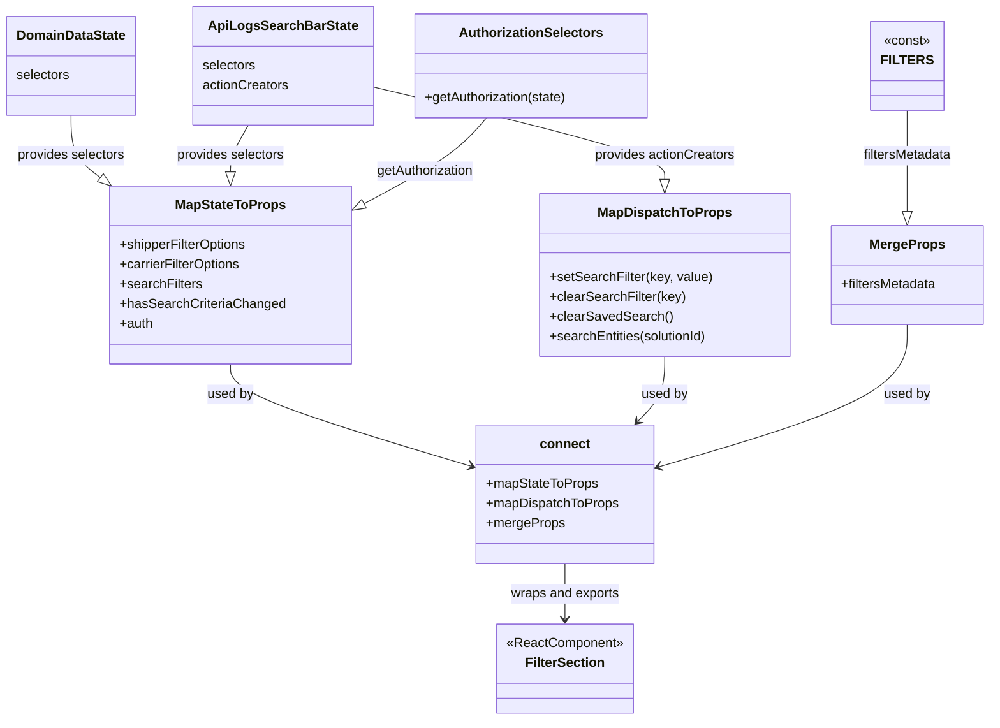

# Diagram: web/portal/src/modules/documentation/api-logs/ApiLogsFilterSectionContainer.js

> Auto-generated by Obscura crawlers

## Mermaid

### SVG

<svg id="container" width="1192.90625" xmlns="http://www.w3.org/2000/svg" class="classDiagram" height="874" viewBox="0 0 1192.90625 874" role="graphics-document document" aria-roledescription="class"><g><defs><marker id="container_class-aggregationStart" class="marker aggregation class" refX="18" refY="7" markerWidth="190" markerHeight="240" orient="auto"><path d="M 18,7 L9,13 L1,7 L9,1 Z"></path></marker></defs><defs><marker id="container_class-aggregationEnd" class="marker aggregation class" refX="1" refY="7" markerWidth="20" markerHeight="28" orient="auto"><path d="M 18,7 L9,13 L1,7 L9,1 Z"></path></marker></defs><defs><marker id="container_class-extensionStart" class="marker extension class" refX="18" refY="7" markerWidth="190" markerHeight="240" orient="auto"><path d="M 1,7 L18,13 V 1 Z"></path></marker></defs><defs><marker id="container_class-extensionEnd" class="marker extension class" refX="1" refY="7" markerWidth="20" markerHeight="28" orient="auto"><path d="M 1,1 V 13 L18,7 Z"></path></marker></defs><defs><marker id="container_class-compositionStart" class="marker composition class" refX="18" refY="7" markerWidth="190" markerHeight="240" orient="auto"><path d="M 18,7 L9,13 L1,7 L9,1 Z"></path></marker></defs><defs><marker id="container_class-compositionEnd" class="marker composition class" refX="1" refY="7" markerWidth="20" markerHeight="28" orient="auto"><path d="M 18,7 L9,13 L1,7 L9,1 Z"></path></marker></defs><defs><marker id="container_class-dependencyStart" class="marker dependency class" refX="6" refY="7" markerWidth="190" markerHeight="240" orient="auto"><path d="M 5,7 L9,13 L1,7 L9,1 Z"></path></marker></defs><defs><marker id="container_class-dependencyEnd" class="marker dependency class" refX="13" refY="7" markerWidth="20" markerHeight="28" orient="auto"><path d="M 18,7 L9,13 L14,7 L9,1 Z"></path></marker></defs><defs><marker id="container_class-lollipopStart" class="marker lollipop class" refX="13" refY="7" markerWidth="190" markerHeight="240" orient="auto"><circle stroke="black" fill="transparent" cx="7" cy="7" r="6"></circle></marker></defs><defs><marker id="container_class-lollipopEnd" class="marker lollipop class" refX="1" refY="7" markerWidth="190" markerHeight="240" orient="auto"><circle stroke="black" fill="transparent" cx="7" cy="7" r="6"></circle></marker></defs><g class="root"><g class="clusters"></g><g class="edgePaths"><path d="M84.785,140L84.785,148.167C84.785,156.333,84.785,172.667,90.848,185.384C96.911,198.102,109.036,207.204,115.099,211.755L121.161,216.306" id="id_DomainDataState_MapStateToProps_1" class="edge-thickness-normal edge-pattern-solid relation" style=";;;" data-edge="true" data-et="edge" data-id="id_DomainDataState_MapStateToProps_1" data-points="W3sieCI6ODQuNzg1MTU2MjUsInkiOjE0MH0seyJ4Ijo4NC43ODUxNTYyNSwieSI6MTg5fSx7IngiOjEzNC45NTcwMzEyNSwieSI6MjI2LjY2MTg4MDY4NzU2MzJ9XQ==" marker-end="url(#container_class-extensionEnd)"></path><path d="M297.676,152L294.388,158.167C291.1,164.333,284.525,176.667,281.237,186.125C277.949,195.583,277.949,202.167,277.949,205.458L277.949,208.75" id="id_ApiLogsSearchBarState_MapStateToProps_2" class="edge-thickness-normal edge-pattern-solid relation" style=";;;" data-edge="true" data-et="edge" data-id="id_ApiLogsSearchBarState_MapStateToProps_2" data-points="W3sieCI6Mjk3LjY3NTc0NTQxMjg0NDA0LCJ5IjoxNTJ9LHsieCI6Mjc3Ljk0OTIxODc1LCJ5IjoxODl9LHsieCI6Mjc3Ljk0OTIxODc1LCJ5IjoyMjZ9XQ==" marker-end="url(#container_class-extensionEnd)"></path><path d="M443.277,105.123L502.938,119.102C562.598,133.082,681.918,161.041,741.578,179.812C801.238,198.583,801.238,208.167,801.238,212.958L801.238,217.75" id="id_ApiLogsSearchBarState_MapDispatchToProps_3" class="edge-thickness-normal edge-pattern-solid relation" style=";;;" data-edge="true" data-et="edge" data-id="id_ApiLogsSearchBarState_MapDispatchToProps_3" data-points="W3sieCI6NDQzLjI3NzM0Mzc1LCJ5IjoxMDUuMTIyNTg0NzA4NDAxNTZ9LHsieCI6ODAxLjIzODI4MTI1LCJ5IjoxODl9LHsieCI6ODAxLjIzODI4MTI1LCJ5IjoyMzV9XQ==" marker-end="url(#container_class-extensionEnd)"></path><path d="M584.116,143L577.95,150.667C571.784,158.333,559.451,173.667,534.787,191.298C510.122,208.93,473.125,228.86,454.627,238.825L436.128,248.79" id="id_AuthorizationSelectors_MapStateToProps_4" class="edge-thickness-normal edge-pattern-solid relation" style=";;;" data-edge="true" data-et="edge" data-id="id_AuthorizationSelectors_MapStateToProps_4" data-points="W3sieCI6NTg0LjExNTgwNzc2OTQ5NTQsInkiOjE0M30seyJ4Ijo1NDcuMTE5MTQwNjI1LCJ5IjoxODl9LHsieCI6NDIwLjk0MTQwNjI1LCJ5IjoyNTYuOTcxMDg0NDI0NzcyMzZ9XQ==" marker-end="url(#container_class-extensionEnd)"></path><path d="M1092.469,134L1092.469,143.167C1092.469,152.333,1092.469,170.667,1092.469,191.125C1092.469,211.583,1092.469,234.167,1092.469,245.458L1092.469,256.75" id="id_FILTERS_MergeProps_5" class="edge-thickness-normal edge-pattern-solid relation" style=";;;" data-edge="true" data-et="edge" data-id="id_FILTERS_MergeProps_5" data-points="W3sieCI6MTA5Mi40Njg3NSwieSI6MTM0fSx7IngiOjEwOTIuNDY4NzUsInkiOjE4OX0seyJ4IjoxMDkyLjQ2ODc1LCJ5IjoyNzR9XQ==" marker-end="url(#container_class-extensionEnd)"></path><path d="M277.949,442L277.949,448.167C277.949,454.333,277.949,466.667,326.451,487.379C374.953,508.09,471.956,537.181,520.458,551.726L568.96,566.271" id="id_MapStateToProps_connect_6" class="edge-thickness-normal edge-pattern-solid relation" style=";;;" data-edge="true" data-et="edge" data-id="id_MapStateToProps_connect_6" data-points="W3sieCI6Mjc3Ljk0OTIxODc1LCJ5Ijo0NDJ9LHsieCI6Mjc3Ljk0OTIxODc1LCJ5Ijo0Nzl9LHsieCI6NTc0LjcwNzAzMTI1LCJ5Ijo1NjcuOTk0ODc4NTQ3MDE3Nn1d" marker-end="url(#container_class-dependencyEnd)"></path><path d="M801.238,433L801.238,440.667C801.238,448.333,801.238,463.667,795.836,476.789C790.434,489.912,779.629,500.824,774.227,506.28L768.824,511.736" id="id_MapDispatchToProps_connect_7" class="edge-thickness-normal edge-pattern-solid relation" style=";;;" data-edge="true" data-et="edge" data-id="id_MapDispatchToProps_connect_7" data-points="W3sieCI6ODAxLjIzODI4MTI1LCJ5Ijo0MzN9LHsieCI6ODAxLjIzODI4MTI1LCJ5Ijo0Nzl9LHsieCI6NzY0LjYwMjU5NTU1Nzg1MTMsInkiOjUxNn1d" marker-end="url(#container_class-dependencyEnd)"></path><path d="M1092.469,394L1092.469,408.167C1092.469,422.333,1092.469,450.667,1042.709,479.482C992.949,508.296,893.428,537.593,843.668,552.241L793.908,566.889" id="id_MergeProps_connect_8" class="edge-thickness-normal edge-pattern-solid relation" style=";;;" data-edge="true" data-et="edge" data-id="id_MergeProps_connect_8" data-points="W3sieCI6MTA5Mi40Njg3NSwieSI6Mzk0fSx7IngiOjEwOTIuNDY4NzUsInkiOjQ3OX0seyJ4Ijo3ODguMTUyMzQzNzUsInkiOjU2OC41ODM0MjA0NDc0MTc5fV0=" marker-end="url(#container_class-dependencyEnd)"></path><path d="M681.43,684L681.43,690.167C681.43,696.333,681.43,708.667,681.43,720C681.43,731.333,681.43,741.667,681.43,746.833L681.43,752" id="id_connect_FilterSection_9" class="edge-thickness-normal edge-pattern-solid relation" style=";;;" data-edge="true" data-et="edge" data-id="id_connect_FilterSection_9" data-points="W3sieCI6NjgxLjQyOTY4NzUsInkiOjY4NH0seyJ4Ijo2ODEuNDI5Njg3NSwieSI6NzIxfSx7IngiOjY4MS40Mjk2ODc1LCJ5Ijo3NTh9XQ==" marker-end="url(#container_class-dependencyEnd)"></path></g><g class="edgeLabels"><g class="edgeLabel" transform="translate(84.78515625, 189)"><g class="label" data-id="id_DomainDataState_MapStateToProps_1" transform="translate(-66.1640625, -12)"><foreignObject width="132.328125" height="24">

provides selectors

</foreignObject></g></g><g class="edgeLabel" transform="translate(277.94921875, 189)"><g class="label" data-id="id_ApiLogsSearchBarState_MapStateToProps_2" transform="translate(-66.1640625, -12)"><foreignObject width="132.328125" height="24">

provides selectors

</foreignObject></g></g><g class="edgeLabel" transform="translate(801.23828125, 189)"><g class="label" data-id="id_ApiLogsSearchBarState_MapDispatchToProps_3" transform="translate(-86.1015625, -12)"><foreignObject width="172.203125" height="24">

provides actionCreators

</foreignObject></g></g><g class="edgeLabel" transform="translate(510.01566, 208.98739)"><g class="label" data-id="id_AuthorizationSelectors_MapStateToProps_4" transform="translate(-60.3515625, -12)"><foreignObject width="120.703125" height="24">

getAuthorization

</foreignObject></g></g><g class="edgeLabel" transform="translate(1092.46875, 189)"><g class="label" data-id="id_FILTERS_MergeProps_5" transform="translate(-54.8671875, -12)"><foreignObject width="109.734375" height="24">

filtersMetadata

</foreignObject></g></g><g class="edgeLabel" transform="translate(277.94921875, 479)"><g class="label" data-id="id_MapStateToProps_connect_6" transform="translate(-28.3125, -12)"><foreignObject width="56.625" height="24">

used by

</foreignObject></g></g><g class="edgeLabel" transform="translate(801.23828125, 479)"><g class="label" data-id="id_MapDispatchToProps_connect_7" transform="translate(-28.3125, -12)"><foreignObject width="56.625" height="24">

used by

</foreignObject></g></g><g class="edgeLabel" transform="translate(1092.46875, 479)"><g class="label" data-id="id_MergeProps_connect_8" transform="translate(-28.3125, -12)"><foreignObject width="56.625" height="24">

used by

</foreignObject></g></g><g class="edgeLabel" transform="translate(681.4296875, 721)"><g class="label" data-id="id_connect_FilterSection_9" transform="translate(-66.7578125, -12)"><foreignObject width="133.515625" height="24">

wraps and exports

</foreignObject></g></g></g><g class="nodes"><g class="node default" id="classId-FilterSection-0" transform="translate(681.4296875, 812)"><g class="basic label-container"><path d="M-83.09375 -54 L83.09375 -54 L83.09375 54 L-83.09375 54" stroke="none" stroke-width="0" fill="#ECECFF" style=""></path><path d="M-83.09375 -54 C-25.867319015434973 -54, 31.359111969130055 -54, 83.09375 -54 M-83.09375 -54 C-26.540247007138774 -54, 30.013255985722452 -54, 83.09375 -54 M83.09375 -54 C83.09375 -21.50287992282898, 83.09375 10.994240154342037, 83.09375 54 M83.09375 -54 C83.09375 -14.937049192131767, 83.09375 24.125901615736467, 83.09375 54 M83.09375 54 C25.159992442425093 54, -32.773765115149814 54, -83.09375 54 M83.09375 54 C33.72749786819737 54, -15.638754263605264 54, -83.09375 54 M-83.09375 54 C-83.09375 24.61790052428357, -83.09375 -4.76419895143286, -83.09375 -54 M-83.09375 54 C-83.09375 26.089539496839535, -83.09375 -1.8209210063209298, -83.09375 -54" stroke="#9370DB" stroke-width="1.3" fill="none" stroke-dasharray="0 0" style=""></path></g><g class="annotation-group text" transform="translate(-71.09375, -30)"><g class="label" style="" transform="translate(0,-12)"><foreignObject width="142.1875" height="24">

«ReactComponent»

</foreignObject></g></g><g class="label-group text" transform="translate(-46.3203125, -6)"><g class="label" style="font-weight: bolder" transform="translate(0,-12)"><foreignObject width="92.640625" height="24">

FilterSection

</foreignObject></g></g><g class="members-group text" transform="translate(-71.09375, 42)"></g><g class="methods-group text" transform="translate(-71.09375, 72)"></g><g class="divider" style=""><path d="M-83.09375 18 C-38.00361649255778 18, 7.086517014884436 18, 83.09375 18 M-83.09375 18 C-29.0082341727268 18, 25.077281654546397 18, 83.09375 18" stroke="#9370DB" stroke-width="1.3" fill="none" stroke-dasharray="0 0" style=""></path></g><g class="divider" style=""><path d="M-83.09375 36 C-39.40584952156662 36, 4.282050956866755 36, 83.09375 36 M-83.09375 36 C-30.73962599159354 36, 21.614498016812917 36, 83.09375 36" stroke="#9370DB" stroke-width="1.3" fill="none" stroke-dasharray="0 0" style=""></path></g></g><g class="node default" id="classId-connect-1" transform="translate(681.4296875, 600)"><g class="basic label-container"><path d="M-106.72265625 -84 L106.72265625 -84 L106.72265625 84 L-106.72265625 84" stroke="none" stroke-width="0" fill="#ECECFF" style=""></path><path d="M-106.72265625 -84 C-56.735738938054475 -84, -6.748821626108949 -84, 106.72265625 -84 M-106.72265625 -84 C-57.958048459084324 -84, -9.193440668168648 -84, 106.72265625 -84 M106.72265625 -84 C106.72265625 -29.73400184153016, 106.72265625 24.531996316939683, 106.72265625 84 M106.72265625 -84 C106.72265625 -28.473216238980534, 106.72265625 27.053567522038932, 106.72265625 84 M106.72265625 84 C45.3227921692486 84, -16.0770719115028 84, -106.72265625 84 M106.72265625 84 C60.24916282455646 84, 13.775669399112914 84, -106.72265625 84 M-106.72265625 84 C-106.72265625 37.33552571075727, -106.72265625 -9.328948578485466, -106.72265625 -84 M-106.72265625 84 C-106.72265625 45.64348787894416, -106.72265625 7.286975757888314, -106.72265625 -84" stroke="#9370DB" stroke-width="1.3" fill="none" stroke-dasharray="0 0" style=""></path></g><g class="annotation-group text" transform="translate(0, -60)"></g><g class="label-group text" transform="translate(-28.9140625, -60)"><g class="label" style="font-weight: bolder" transform="translate(0,-12)"><foreignObject width="57.828125" height="24">

connect

</foreignObject></g></g><g class="members-group text" transform="translate(-94.72265625, -12)"><g class="label" style="" transform="translate(0,-12)"><foreignObject width="134.984375" height="24">

+mapStateToProps

</foreignObject></g><g class="label" style="" transform="translate(0,12)"><foreignObject width="160.53125" height="24">

+mapDispatchToProps

</foreignObject></g><g class="label" style="" transform="translate(0,36)"><foreignObject width="94.140625" height="24">

+mergeProps

</foreignObject></g></g><g class="methods-group text" transform="translate(-94.72265625, 84)"></g><g class="divider" style=""><path d="M-106.72265625 -36 C-26.656949215264547 -36, 53.40875781947091 -36, 106.72265625 -36 M-106.72265625 -36 C-46.08436892428445 -36, 14.553918401431105 -36, 106.72265625 -36" stroke="#9370DB" stroke-width="1.3" fill="none" stroke-dasharray="0 0" style=""></path></g><g class="divider" style=""><path d="M-106.72265625 60 C-29.935197960921954 60, 46.85226032815609 60, 106.72265625 60 M-106.72265625 60 C-24.18587446623299 60, 58.35090731753402 60, 106.72265625 60" stroke="#9370DB" stroke-width="1.3" fill="none" stroke-dasharray="0 0" style=""></path></g></g><g class="node default" id="classId-MapStateToProps-2" transform="translate(277.94921875, 334)"><g class="basic label-container"><path d="M-142.9921875 -108 L142.9921875 -108 L142.9921875 108 L-142.9921875 108" stroke="none" stroke-width="0" fill="#ECECFF" style=""></path><path d="M-142.9921875 -108 C-71.40102970129277 -108, 0.19012809741445835 -108, 142.9921875 -108 M-142.9921875 -108 C-53.65656925785227 -108, 35.67904898429546 -108, 142.9921875 -108 M142.9921875 -108 C142.9921875 -63.98642559061531, 142.9921875 -19.972851181230624, 142.9921875 108 M142.9921875 -108 C142.9921875 -29.50324604602156, 142.9921875 48.99350790795688, 142.9921875 108 M142.9921875 108 C84.66461170055487 108, 26.337035901109758 108, -142.9921875 108 M142.9921875 108 C30.338259352593425 108, -82.31566879481315 108, -142.9921875 108 M-142.9921875 108 C-142.9921875 26.519133191422497, -142.9921875 -54.961733617155005, -142.9921875 -108 M-142.9921875 108 C-142.9921875 50.880059115689825, -142.9921875 -6.23988176862035, -142.9921875 -108" stroke="#9370DB" stroke-width="1.3" fill="none" stroke-dasharray="0 0" style=""></path></g><g class="annotation-group text" transform="translate(0, -84)"></g><g class="label-group text" transform="translate(-64.234375, -84)"><g class="label" style="font-weight: bolder" transform="translate(0,-12)"><foreignObject width="128.46875" height="24">

MapStateToProps

</foreignObject></g></g><g class="members-group text" transform="translate(-130.9921875, -36)"><g class="label" style="" transform="translate(0,-12)"><foreignObject width="157.234375" height="24">

+shipperFilterOptions

</foreignObject></g><g class="label" style="" transform="translate(0,12)"><foreignObject width="149.921875" height="24">

+carrierFilterOptions

</foreignObject></g><g class="label" style="" transform="translate(0,36)"><foreignObject width="99.609375" height="24">

+searchFilters

</foreignObject></g><g class="label" style="" transform="translate(0,60)"><foreignObject width="197.75" height="24">

+hasSearchCriteriaChanged

</foreignObject></g><g class="label" style="" transform="translate(0,84)"><foreignObject width="40.921875" height="24">

+auth

</foreignObject></g></g><g class="methods-group text" transform="translate(-130.9921875, 108)"></g><g class="divider" style=""><path d="M-142.9921875 -60 C-61.38282027740708 -60, 20.226546945185845 -60, 142.9921875 -60 M-142.9921875 -60 C-85.24052228365098 -60, -27.48885706730195 -60, 142.9921875 -60" stroke="#9370DB" stroke-width="1.3" fill="none" stroke-dasharray="0 0" style=""></path></g><g class="divider" style=""><path d="M-142.9921875 84 C-54.5587774698125 84, 33.874632560375005 84, 142.9921875 84 M-142.9921875 84 C-37.06128456899029 84, 68.86961836201942 84, 142.9921875 84" stroke="#9370DB" stroke-width="1.3" fill="none" stroke-dasharray="0 0" style=""></path></g></g><g class="node default" id="classId-MapDispatchToProps-3" transform="translate(801.23828125, 334)"><g class="basic label-container"><path d="M-148.79296875 -99 L148.79296875 -99 L148.79296875 99 L-148.79296875 99" stroke="none" stroke-width="0" fill="#ECECFF" style=""></path><path d="M-148.79296875 -99 C-56.51944246805671 -99, 35.75408381388658 -99, 148.79296875 -99 M-148.79296875 -99 C-49.62835734003265 -99, 49.5362540699347 -99, 148.79296875 -99 M148.79296875 -99 C148.79296875 -34.87368814900812, 148.79296875 29.252623701983765, 148.79296875 99 M148.79296875 -99 C148.79296875 -43.6067187799593, 148.79296875 11.786562440081397, 148.79296875 99 M148.79296875 99 C37.657852320671054 99, -73.47726410865789 99, -148.79296875 99 M148.79296875 99 C64.10741463173082 99, -20.578139486538362 99, -148.79296875 99 M-148.79296875 99 C-148.79296875 37.316339959004445, -148.79296875 -24.36732008199111, -148.79296875 -99 M-148.79296875 99 C-148.79296875 55.42205749734662, -148.79296875 11.844114994693243, -148.79296875 -99" stroke="#9370DB" stroke-width="1.3" fill="none" stroke-dasharray="0 0" style=""></path></g><g class="annotation-group text" transform="translate(0, -75)"></g><g class="label-group text" transform="translate(-76.7265625, -75)"><g class="label" style="font-weight: bolder" transform="translate(0,-12)"><foreignObject width="153.453125" height="24">

MapDispatchToProps

</foreignObject></g></g><g class="members-group text" transform="translate(-136.79296875, -27)"></g><g class="methods-group text" transform="translate(-136.79296875, 3)"><g class="label" style="" transform="translate(0,-12)"><foreignObject width="196.859375" height="24">

+setSearchFilter(key, value)

</foreignObject></g><g class="label" style="" transform="translate(0,12)"><foreignObject width="164.265625" height="24">

+clearSearchFilter(key)

</foreignObject></g><g class="label" style="" transform="translate(0,36)"><foreignObject width="146.046875" height="24">

+clearSavedSearch()

</foreignObject></g><g class="label" style="" transform="translate(0,60)"><foreignObject width="194.46875" height="24">

+searchEntities(solutionId)

</foreignObject></g></g><g class="divider" style=""><path d="M-148.79296875 -51 C-86.56243510113742 -51, -24.331901452274835 -51, 148.79296875 -51 M-148.79296875 -51 C-83.06977330917162 -51, -17.346577868343246 -51, 148.79296875 -51" stroke="#9370DB" stroke-width="1.3" fill="none" stroke-dasharray="0 0" style=""></path></g><g class="divider" style=""><path d="M-148.79296875 -27 C-64.90001095863087 -27, 18.992946832738255 -27, 148.79296875 -27 M-148.79296875 -27 C-64.41287703950927 -27, 19.967214670981463 -27, 148.79296875 -27" stroke="#9370DB" stroke-width="1.3" fill="none" stroke-dasharray="0 0" style=""></path></g></g><g class="node default" id="classId-MergeProps-4" transform="translate(1092.46875, 334)"><g class="basic label-container"><path d="M-92.4375 -60 L92.4375 -60 L92.4375 60 L-92.4375 60" stroke="none" stroke-width="0" fill="#ECECFF" style=""></path><path d="M-92.4375 -60 C-40.23641528552041 -60, 11.964669428959184 -60, 92.4375 -60 M-92.4375 -60 C-47.61308806673907 -60, -2.788676133478134 -60, 92.4375 -60 M92.4375 -60 C92.4375 -13.195338682955942, 92.4375 33.609322634088116, 92.4375 60 M92.4375 -60 C92.4375 -12.17163779823644, 92.4375 35.65672440352712, 92.4375 60 M92.4375 60 C49.959882786786345 60, 7.48226557357269 60, -92.4375 60 M92.4375 60 C21.852516449456388 60, -48.732467101087224 60, -92.4375 60 M-92.4375 60 C-92.4375 31.504421625304634, -92.4375 3.0088432506092673, -92.4375 -60 M-92.4375 60 C-92.4375 26.821108987997412, -92.4375 -6.357782024005175, -92.4375 -60" stroke="#9370DB" stroke-width="1.3" fill="none" stroke-dasharray="0 0" style=""></path></g><g class="annotation-group text" transform="translate(0, -36)"></g><g class="label-group text" transform="translate(-43.390625, -36)"><g class="label" style="font-weight: bolder" transform="translate(0,-12)"><foreignObject width="86.78125" height="24">

MergeProps

</foreignObject></g></g><g class="members-group text" transform="translate(-80.4375, 12)"><g class="label" style="" transform="translate(0,-12)"><foreignObject width="117.484375" height="24">

+filtersMetadata

</foreignObject></g></g><g class="methods-group text" transform="translate(-80.4375, 60)"></g><g class="divider" style=""><path d="M-92.4375 -12 C-28.79246012235844 -12, 34.85257975528312 -12, 92.4375 -12 M-92.4375 -12 C-48.05580702359421 -12, -3.674114047188425 -12, 92.4375 -12" stroke="#9370DB" stroke-width="1.3" fill="none" stroke-dasharray="0 0" style=""></path></g><g class="divider" style=""><path d="M-92.4375 36 C-54.54122577521967 36, -16.644951550439345 36, 92.4375 36 M-92.4375 36 C-43.47264383690935 36, 5.492212326181303 36, 92.4375 36" stroke="#9370DB" stroke-width="1.3" fill="none" stroke-dasharray="0 0" style=""></path></g></g><g class="node default" id="classId-DomainDataState-5" transform="translate(84.78515625, 80)"><g class="basic label-container"><path d="M-76.78515625 -60 L76.78515625 -60 L76.78515625 60 L-76.78515625 60" stroke="none" stroke-width="0" fill="#ECECFF" style=""></path><path d="M-76.78515625 -60 C-23.1897018347708 -60, 30.405752580458397 -60, 76.78515625 -60 M-76.78515625 -60 C-37.231120169580656 -60, 2.322915910838688 -60, 76.78515625 -60 M76.78515625 -60 C76.78515625 -35.52033069082495, 76.78515625 -11.04066138164989, 76.78515625 60 M76.78515625 -60 C76.78515625 -25.603341847150027, 76.78515625 8.793316305699946, 76.78515625 60 M76.78515625 60 C17.57534493614593 60, -41.63446637770814 60, -76.78515625 60 M76.78515625 60 C32.26281707469435 60, -12.259522100611306 60, -76.78515625 60 M-76.78515625 60 C-76.78515625 23.42144938028993, -76.78515625 -13.157101239420143, -76.78515625 -60 M-76.78515625 60 C-76.78515625 35.569843059540425, -76.78515625 11.13968611908085, -76.78515625 -60" stroke="#9370DB" stroke-width="1.3" fill="none" stroke-dasharray="0 0" style=""></path></g><g class="annotation-group text" transform="translate(0, -36)"></g><g class="label-group text" transform="translate(-64.1015625, -36)"><g class="label" style="font-weight: bolder" transform="translate(0,-12)"><foreignObject width="128.203125" height="24">

DomainDataState

</foreignObject></g></g><g class="members-group text" transform="translate(-64.78515625, 12)"><g class="label" style="" transform="translate(0,-12)"><foreignObject width="65.46875" height="24">

selectors

</foreignObject></g></g><g class="methods-group text" transform="translate(-64.78515625, 60)"></g><g class="divider" style=""><path d="M-76.78515625 -12 C-36.867667317646806 -12, 3.0498216147063886 -12, 76.78515625 -12 M-76.78515625 -12 C-41.19538020467697 -12, -5.605604159353945 -12, 76.78515625 -12" stroke="#9370DB" stroke-width="1.3" fill="none" stroke-dasharray="0 0" style=""></path></g><g class="divider" style=""><path d="M-76.78515625 36 C-26.142691703964168 36, 24.499772842071664 36, 76.78515625 36 M-76.78515625 36 C-29.390917282013838 36, 18.003321685972324 36, 76.78515625 36" stroke="#9370DB" stroke-width="1.3" fill="none" stroke-dasharray="0 0" style=""></path></g></g><g class="node default" id="classId-ApiLogsSearchBarState-6" transform="translate(336.0625, 80)"><g class="basic label-container"><path d="M-107.21484375 -72 L107.21484375 -72 L107.21484375 72 L-107.21484375 72" stroke="none" stroke-width="0" fill="#ECECFF" style=""></path><path d="M-107.21484375 -72 C-44.04049429346784 -72, 19.133855163064325 -72, 107.21484375 -72 M-107.21484375 -72 C-57.89664703085315 -72, -8.578450311706305 -72, 107.21484375 -72 M107.21484375 -72 C107.21484375 -19.888622899615044, 107.21484375 32.22275420076991, 107.21484375 72 M107.21484375 -72 C107.21484375 -18.414512112877553, 107.21484375 35.170975774244894, 107.21484375 72 M107.21484375 72 C45.69960440910902 72, -15.815634931781958 72, -107.21484375 72 M107.21484375 72 C36.841513918938745 72, -33.53181591212251 72, -107.21484375 72 M-107.21484375 72 C-107.21484375 40.06636144680117, -107.21484375 8.132722893602327, -107.21484375 -72 M-107.21484375 72 C-107.21484375 27.067799941368435, -107.21484375 -17.86440011726313, -107.21484375 -72" stroke="#9370DB" stroke-width="1.3" fill="none" stroke-dasharray="0 0" style=""></path></g><g class="annotation-group text" transform="translate(0, -48)"></g><g class="label-group text" transform="translate(-85.0859375, -48)"><g class="label" style="font-weight: bolder" transform="translate(0,-12)"><foreignObject width="170.171875" height="24">

ApiLogsSearchBarState

</foreignObject></g></g><g class="members-group text" transform="translate(-95.21484375, 0)"><g class="label" style="" transform="translate(0,-12)"><foreignObject width="65.46875" height="24">

selectors

</foreignObject></g><g class="label" style="" transform="translate(0,12)"><foreignObject width="105.34375" height="24">

actionCreators

</foreignObject></g></g><g class="methods-group text" transform="translate(-95.21484375, 72)"></g><g class="divider" style=""><path d="M-107.21484375 -24 C-45.04006788910848 -24, 17.134707971783044 -24, 107.21484375 -24 M-107.21484375 -24 C-34.11597215023906 -24, 38.98289944952188 -24, 107.21484375 -24" stroke="#9370DB" stroke-width="1.3" fill="none" stroke-dasharray="0 0" style=""></path></g><g class="divider" style=""><path d="M-107.21484375 48 C-55.956623995317116 48, -4.698404240634233 48, 107.21484375 48 M-107.21484375 48 C-64.03960333587312 48, -20.864362921746235 48, 107.21484375 48" stroke="#9370DB" stroke-width="1.3" fill="none" stroke-dasharray="0 0" style=""></path></g></g><g class="node default" id="classId-AuthorizationSelectors-7" transform="translate(634.78515625, 80)"><g class="basic label-container"><path d="M-141.5078125 -63 L141.5078125 -63 L141.5078125 63 L-141.5078125 63" stroke="none" stroke-width="0" fill="#ECECFF" style=""></path><path d="M-141.5078125 -63 C-76.03915805223632 -63, -10.570503604472634 -63, 141.5078125 -63 M-141.5078125 -63 C-81.04543824253386 -63, -20.583063985067724 -63, 141.5078125 -63 M141.5078125 -63 C141.5078125 -21.655142278850064, 141.5078125 19.68971544229987, 141.5078125 63 M141.5078125 -63 C141.5078125 -18.294611411251587, 141.5078125 26.410777177496826, 141.5078125 63 M141.5078125 63 C71.77569959757489 63, 2.04358669514977 63, -141.5078125 63 M141.5078125 63 C54.26314547692395 63, -32.981521546152095 63, -141.5078125 63 M-141.5078125 63 C-141.5078125 22.53601325559668, -141.5078125 -17.927973488806643, -141.5078125 -63 M-141.5078125 63 C-141.5078125 35.71983158459743, -141.5078125 8.439663169194851, -141.5078125 -63" stroke="#9370DB" stroke-width="1.3" fill="none" stroke-dasharray="0 0" style=""></path></g><g class="annotation-group text" transform="translate(0, -39)"></g><g class="label-group text" transform="translate(-83.875, -39)"><g class="label" style="font-weight: bolder" transform="translate(0,-12)"><foreignObject width="167.75" height="24">

AuthorizationSelectors

</foreignObject></g></g><g class="members-group text" transform="translate(-129.5078125, 9)"></g><g class="methods-group text" transform="translate(-129.5078125, 39)"><g class="label" style="" transform="translate(0,-12)"><foreignObject width="175.140625" height="24">

+getAuthorization(state)

</foreignObject></g></g><g class="divider" style=""><path d="M-141.5078125 -15 C-34.199411508890606 -15, 73.10898948221879 -15, 141.5078125 -15 M-141.5078125 -15 C-72.08221891842304 -15, -2.6566253368460764 -15, 141.5078125 -15" stroke="#9370DB" stroke-width="1.3" fill="none" stroke-dasharray="0 0" style=""></path></g><g class="divider" style=""><path d="M-141.5078125 9 C-45.95440177943661 9, 49.59900894112678 9, 141.5078125 9 M-141.5078125 9 C-33.56289157069267 9, 74.38202935861466 9, 141.5078125 9" stroke="#9370DB" stroke-width="1.3" fill="none" stroke-dasharray="0 0" style=""></path></g></g><g class="node default" id="classId-FILTERS-8" transform="translate(1092.46875, 80)"><g class="basic label-container"><path d="M-40.6171875 -54 L40.6171875 -54 L40.6171875 54 L-40.6171875 54" stroke="none" stroke-width="0" fill="#ECECFF" style=""></path><path d="M-40.6171875 -54 C-17.16477881955358 -54, 6.287629860892842 -54, 40.6171875 -54 M-40.6171875 -54 C-23.903845833482503 -54, -7.190504166965006 -54, 40.6171875 -54 M40.6171875 -54 C40.6171875 -18.32116183850308, 40.6171875 17.35767632299384, 40.6171875 54 M40.6171875 -54 C40.6171875 -17.247465469895552, 40.6171875 19.505069060208896, 40.6171875 54 M40.6171875 54 C22.316932610363697 54, 4.016677720727394 54, -40.6171875 54 M40.6171875 54 C10.460336095957743 54, -19.696515308084514 54, -40.6171875 54 M-40.6171875 54 C-40.6171875 23.913705394860646, -40.6171875 -6.1725892102787085, -40.6171875 -54 M-40.6171875 54 C-40.6171875 29.63362137439123, -40.6171875 5.267242748782458, -40.6171875 -54" stroke="#9370DB" stroke-width="1.3" fill="none" stroke-dasharray="0 0" style=""></path></g><g class="annotation-group text" transform="translate(-28.6171875, -30)"><g class="label" style="" transform="translate(0,-12)"><foreignObject width="57.234375" height="24">

«const»

</foreignObject></g></g><g class="label-group text" transform="translate(-27.5625, -6)"><g class="label" style="font-weight: bolder" transform="translate(0,-12)"><foreignObject width="55.125" height="24">

FILTERS

</foreignObject></g></g><g class="members-group text" transform="translate(-28.6171875, 42)"></g><g class="methods-group text" transform="translate(-28.6171875, 72)"></g><g class="divider" style=""><path d="M-40.6171875 18 C-17.857586325131223 18, 4.902014849737554 18, 40.6171875 18 M-40.6171875 18 C-19.23442843185886 18, 2.1483306362822816 18, 40.6171875 18" stroke="#9370DB" stroke-width="1.3" fill="none" stroke-dasharray="0 0" style=""></path></g><g class="divider" style=""><path d="M-40.6171875 36 C-14.525025409248286 36, 11.567136681503428 36, 40.6171875 36 M-40.6171875 36 C-15.166007857943377 36, 10.285171784113246 36, 40.6171875 36" stroke="#9370DB" stroke-width="1.3" fill="none" stroke-dasharray="0 0" style=""></path></g></g></g></g></g></svg>
