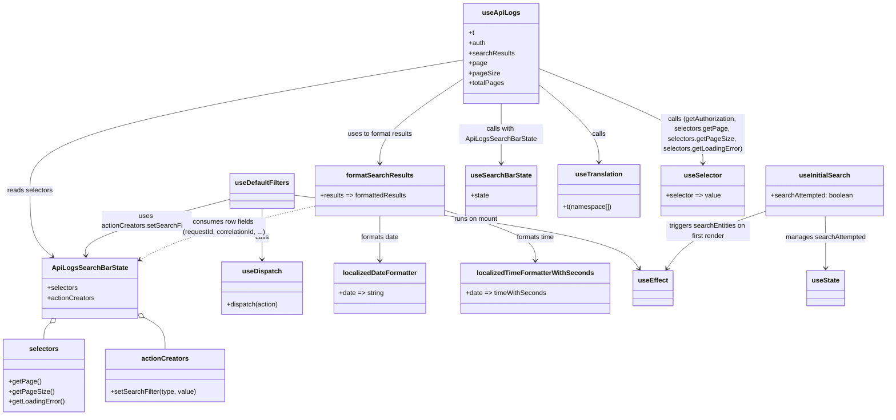

# Diagram: web/portal/src/modules/documentation/api-logs/ApiLogsHooks.js

> Auto-generated by Obscura crawlers

## Mermaid

### SVG

<svg id="container" width="2099.123046875" xmlns="http://www.w3.org/2000/svg" class="classDiagram" height="1018" viewBox="0 0 2099.123046875 1018" role="graphics-document document" aria-roledescription="class"><g><defs><marker id="container_class-aggregationStart" class="marker aggregation class" refX="18" refY="7" markerWidth="190" markerHeight="240" orient="auto"><path d="M 18,7 L9,13 L1,7 L9,1 Z"></path></marker></defs><defs><marker id="container_class-aggregationEnd" class="marker aggregation class" refX="1" refY="7" markerWidth="20" markerHeight="28" orient="auto"><path d="M 18,7 L9,13 L1,7 L9,1 Z"></path></marker></defs><defs><marker id="container_class-extensionStart" class="marker extension class" refX="18" refY="7" markerWidth="190" markerHeight="240" orient="auto"><path d="M 1,7 L18,13 V 1 Z"></path></marker></defs><defs><marker id="container_class-extensionEnd" class="marker extension class" refX="1" refY="7" markerWidth="20" markerHeight="28" orient="auto"><path d="M 1,1 V 13 L18,7 Z"></path></marker></defs><defs><marker id="container_class-compositionStart" class="marker composition class" refX="18" refY="7" markerWidth="190" markerHeight="240" orient="auto"><path d="M 18,7 L9,13 L1,7 L9,1 Z"></path></marker></defs><defs><marker id="container_class-compositionEnd" class="marker composition class" refX="1" refY="7" markerWidth="20" markerHeight="28" orient="auto"><path d="M 18,7 L9,13 L1,7 L9,1 Z"></path></marker></defs><defs><marker id="container_class-dependencyStart" class="marker dependency class" refX="6" refY="7" markerWidth="190" markerHeight="240" orient="auto"><path d="M 5,7 L9,13 L1,7 L9,1 Z"></path></marker></defs><defs><marker id="container_class-dependencyEnd" class="marker dependency class" refX="13" refY="7" markerWidth="20" markerHeight="28" orient="auto"><path d="M 18,7 L9,13 L14,7 L9,1 Z"></path></marker></defs><defs><marker id="container_class-lollipopStart" class="marker lollipop class" refX="13" refY="7" markerWidth="190" markerHeight="240" orient="auto"><circle stroke="black" fill="transparent" cx="7" cy="7" r="6"></circle></marker></defs><defs><marker id="container_class-lollipopEnd" class="marker lollipop class" refX="1" refY="7" markerWidth="190" markerHeight="240" orient="auto"><circle stroke="black" fill="transparent" cx="7" cy="7" r="6"></circle></marker></defs><g class="root"><g class="clusters"></g><g class="edgePaths"><path d="M1273.193,201.308L1296.829,221.257C1320.465,241.206,1367.738,281.103,1391.374,312.218C1415.01,343.333,1415.01,365.667,1415.01,376.833L1415.01,388" id="id_useApiLogs_useTranslation_1" class="edge-thickness-normal edge-pattern-solid relation" style=";;;" data-edge="true" data-et="edge" data-id="id_useApiLogs_useTranslation_1" data-points="W3sieCI6MTI3My4xOTMzNTkzNzUsInkiOjIwMS4zMDg0MTYzMjM2MDIyN30seyJ4IjoxNDE1LjAwOTc2NTYyNSwieSI6MzIxfSx7IngiOjE0MTUuMDA5NzY1NjI1LCJ5IjozOTR9XQ==" marker-end="url(#container_class-dependencyEnd)"></path><path d="M1186.334,248L1186.334,260.167C1186.334,272.333,1186.334,296.667,1186.334,320.5C1186.334,344.333,1186.334,367.667,1186.334,379.333L1186.334,391" id="id_useApiLogs_useSearchBarState_2" class="edge-thickness-normal edge-pattern-solid relation" style=";;;" data-edge="true" data-et="edge" data-id="id_useApiLogs_useSearchBarState_2" data-points="W3sieCI6MTE4Ni4zMzM5ODQzNzUsInkiOjI0OH0seyJ4IjoxMTg2LjMzMzk4NDM3NSwieSI6MzIxfSx7IngiOjExODYuMzMzOTg0Mzc1LCJ5IjozOTd9XQ==" marker-end="url(#container_class-dependencyEnd)"></path><path d="M1273.193,163.34L1337.776,189.617C1402.359,215.894,1531.524,268.447,1596.107,306.39C1660.689,344.333,1660.689,367.667,1660.689,379.333L1660.689,391" id="id_useApiLogs_useSelector_3" class="edge-thickness-normal edge-pattern-solid relation" style=";;;" data-edge="true" data-et="edge" data-id="id_useApiLogs_useSelector_3" data-points="W3sieCI6MTI3My4xOTMzNTkzNzUsInkiOjE2My4zNDAyODkwNDM1MjEyNH0seyJ4IjoxNjYwLjY4OTQ1MzEyNSwieSI6MzIxfSx7IngiOjE2NjAuNjg5NDUzMTI1LCJ5IjozOTd9XQ==" marker-end="url(#container_class-dependencyEnd)"></path><path d="M1099.475,142.999L927.674,172.666C755.874,202.333,412.273,261.666,240.472,314C68.672,366.333,68.672,411.667,68.672,455C68.672,498.333,68.672,539.667,78.633,569.811C88.594,599.955,108.516,618.909,118.477,628.387L128.438,637.864" id="id_useApiLogs_ApiLogsSearchBarState_4" class="edge-thickness-normal edge-pattern-solid relation" style=";;;" data-edge="true" data-et="edge" data-id="id_useApiLogs_ApiLogsSearchBarState_4" data-points="W3sieCI6MTA5OS40NzQ2MDkzNzUsInkiOjE0Mi45OTkwNDA2MTczNjAxfSx7IngiOjY4LjY3MTg3NSwieSI6MzIxfSx7IngiOjY4LjY3MTg3NSwieSI6NDU3fSx7IngiOjY4LjY3MTg3NSwieSI6NTgxfSx7IngiOjEzMi43ODQ3NTk3NTA5Mzk4NiwieSI6NjQyfV0=" marker-end="url(#container_class-dependencyEnd)"></path><path d="M1099.475,186.755L1066.398,209.129C1033.321,231.503,967.167,276.252,934.09,310.292C901.014,344.333,901.014,367.667,901.014,379.333L901.014,391" id="id_useApiLogs_formatSearchResults_5" class="edge-thickness-normal edge-pattern-solid relation" style=";;;" data-edge="true" data-et="edge" data-id="id_useApiLogs_formatSearchResults_5" data-points="W3sieCI6MTA5OS40NzQ2MDkzNzUsInkiOjE4Ni43NTQ1MjQ3OTM5NTQxNX0seyJ4Ijo5MDEuMDEzNjcxODc1LCJ5IjozMjF9LHsieCI6OTAxLjAxMzY3MTg3NSwieSI6Mzk3fV0=" marker-end="url(#container_class-dependencyEnd)"></path><path d="M622.912,499L622.912,512.667C622.912,526.333,622.912,553.667,622.912,578C622.912,602.333,622.912,623.667,622.912,634.333L622.912,645" id="id_useDefaultFilters_useDispatch_6" class="edge-thickness-normal edge-pattern-solid relation" style=";;;" data-edge="true" data-et="edge" data-id="id_useDefaultFilters_useDispatch_6" data-points="W3sieCI6NjIyLjkxMjEwOTM3NSwieSI6NDk5fSx7IngiOjYyMi45MTIxMDkzNzUsInkiOjU4MX0seyJ4Ijo2MjIuOTEyMTA5Mzc1LCJ5Ijo2NTF9XQ==" marker-end="url(#container_class-dependencyEnd)"></path><path d="M548.717,478.606L490.113,495.672C431.509,512.737,314.301,546.869,256.481,573.105C198.661,599.341,200.228,617.681,201.012,626.851L201.796,636.022" id="id_useDefaultFilters_ApiLogsSearchBarState_7" class="edge-thickness-normal edge-pattern-solid relation" style=";;;" data-edge="true" data-et="edge" data-id="id_useDefaultFilters_ApiLogsSearchBarState_7" data-points="W3sieCI6NTQ4LjcxNjc5Njg3NSwieSI6NDc4LjYwNTk3MDEyMTg3MDF9LHsieCI6MTk3LjA5Mzc1LCJ5Ijo1ODF9LHsieCI6MjAyLjMwNjM3NjI5MjI5MzI0LCJ5Ijo2NDJ9XQ==" marker-end="url(#container_class-dependencyEnd)"></path><path d="M697.107,467.987L824.306,486.822C951.504,505.658,1205.9,543.329,1342.447,576.494C1478.993,609.658,1497.689,638.317,1507.037,652.646L1516.385,666.975" id="id_useDefaultFilters_useEffect_8" class="edge-thickness-normal edge-pattern-solid relation" style=";;;" data-edge="true" data-et="edge" data-id="id_useDefaultFilters_useEffect_8" data-points="W3sieCI6Njk3LjEwNzQyMTg3NSwieSI6NDY3Ljk4Njg0NzUzNzMyNDR9LHsieCI6MTQ2MC4yOTY4NzUsInkiOjU4MX0seyJ4IjoxNTE5LjY2MjgyODk0NzM2ODMsInkiOjY3Mn1d" marker-end="url(#container_class-dependencyEnd)"></path><path d="M1951.658,517L1951.932,527.667C1952.206,538.333,1952.754,559.667,1953.029,584.5C1953.303,609.333,1953.303,637.667,1953.303,651.833L1953.303,666" id="id_useInitialSearch_useState_9" class="edge-thickness-normal edge-pattern-solid relation" style=";;;" data-edge="true" data-et="edge" data-id="id_useInitialSearch_useState_9" data-points="W3sieCI6MTk1MS42NTc1NzMwODQ2NzczLCJ5Ijo1MTd9LHsieCI6MTk1My4zMDI3MzQzNzUsInkiOjU4MX0seyJ4IjoxOTUzLjMwMjczNDM3NSwieSI6NjcyfV0=" marker-end="url(#container_class-dependencyEnd)"></path><path d="M1809.107,512.282L1779.894,523.735C1750.681,535.188,1692.255,558.094,1653.693,583.876C1615.132,609.658,1596.436,638.317,1587.088,652.646L1577.74,666.975" id="id_useInitialSearch_useEffect_10" class="edge-thickness-normal edge-pattern-solid relation" style=";;;" data-edge="true" data-et="edge" data-id="id_useInitialSearch_useEffect_10" data-points="W3sieCI6MTgwOS4xMDc0MjE4NzUsInkiOjUxMi4yODE5NTE4NDYwNjU1fSx7IngiOjE2MzMuODI4MTI1LCJ5Ijo1ODF9LHsieCI6MTU3NC40NjIxNzEwNTI2MzE3LCJ5Ijo2NzJ9XQ==" marker-end="url(#container_class-dependencyEnd)"></path><path d="M901.014,517L901.014,527.667C901.014,538.333,901.014,559.667,901.014,581.5C901.014,603.333,901.014,625.667,901.014,636.833L901.014,648" id="id_formatSearchResults_localizedDateFormatter_11" class="edge-thickness-normal edge-pattern-solid relation" style=";;;" data-edge="true" data-et="edge" data-id="id_formatSearchResults_localizedDateFormatter_11" data-points="W3sieCI6OTAxLjAxMzY3MTg3NSwieSI6NTE3fSx7IngiOjkwMS4wMTM2NzE4NzUsInkiOjU4MX0seyJ4Ijo5MDEuMDEzNjcxODc1LCJ5Ijo2NTR9XQ==" marker-end="url(#container_class-dependencyEnd)"></path><path d="M1054.92,509.431L1089.934,521.359C1124.947,533.288,1194.975,557.144,1229.988,580.239C1265.002,603.333,1265.002,625.667,1265.002,636.833L1265.002,648" id="id_formatSearchResults_localizedTimeFormatterWithSeconds_12" class="edge-thickness-normal edge-pattern-solid relation" style=";;;" data-edge="true" data-et="edge" data-id="id_formatSearchResults_localizedTimeFormatterWithSeconds_12" data-points="W3sieCI6MTA1NC45MTk5MjE4NzUsInkiOjUwOS40MzEyODk2NDA1OTE5Nn0seyJ4IjoxMjY1LjAwMTk1MzEyNSwieSI6NTgxfSx7IngiOjEyNjUuMDAxOTUzMTI1LCJ5Ijo2NTR9XQ==" marker-end="url(#container_class-dependencyEnd)"></path><path d="M747.107,497.136L693.509,511.113C639.91,525.09,532.713,553.045,462.304,577.323C391.896,601.6,358.277,622.2,341.467,632.5L324.657,642.8" id="id_formatSearchResults_ApiLogsSearchBarState_13" class="edge-thickness-normal edge-pattern-dashed relation" style=";;;" data-edge="true" data-et="edge" data-id="id_formatSearchResults_ApiLogsSearchBarState_13" data-points="W3sieCI6NzQ3LjEwNzQyMTg3NSwieSI6NDk3LjEzNTU0ODY2NDAyNDE2fSx7IngiOjQyNS41MTU2MjUsInkiOjU4MX0seyJ4IjozMTkuNTQxMDE1NjI1LCJ5Ijo2NDUuOTM1MjMwNzU5NTQwM31d" marker-end="url(#container_class-dependencyEnd)"></path><path d="M118.042,797.72L115.651,799.933C113.261,802.147,108.48,806.573,106.09,812.953C103.699,819.333,103.699,827.667,103.699,831.833L103.699,836" id="id_ApiLogsSearchBarState_selectors_14" class="edge-thickness-normal edge-pattern-solid relation" style=";;;" data-edge="true" data-et="edge" data-id="id_ApiLogsSearchBarState_selectors_14" data-points="W3sieCI6MTMwLjY5OTE1ODM0NDA3MjE1LCJ5Ijo3ODZ9LHsieCI6MTAzLjY5OTIxODc1LCJ5Ijo4MTF9LHsieCI6MTAzLjY5OTIxODc1LCJ5Ijo4MzZ9XQ==" marker-start="url(#container_class-aggregationStart)"></path><path d="M334.764,781.306L344.052,786.255C353.339,791.204,371.914,801.102,381.201,814.218C390.488,827.333,390.488,843.667,390.488,851.833L390.488,860" id="id_ApiLogsSearchBarState_actionCreators_15" class="edge-thickness-normal edge-pattern-solid relation" style=";;;" data-edge="true" data-et="edge" data-id="id_ApiLogsSearchBarState_actionCreators_15" data-points="W3sieCI6MzE5LjU0MTAxNTYyNSwieSI6NzczLjE5MzUzMjExOTQ0MzR9LHsieCI6MzkwLjQ4ODI4MTI1LCJ5Ijo4MTF9LHsieCI6MzkwLjQ4ODI4MTI1LCJ5Ijo4NjB9XQ==" marker-start="url(#container_class-aggregationStart)"></path></g><g class="edgeLabels"><g class="edgeLabel" transform="translate(1415.009765625, 321)"><g class="label" data-id="id_useApiLogs_useTranslation_1" transform="translate(-16.4453125, -12)"><foreignObject width="32.890625" height="24">

calls

</foreignObject></g></g><g class="edgeLabel" transform="translate(1186.333984375, 321)"><g class="label" data-id="id_useApiLogs_useSearchBarState_2" transform="translate(-100, -24)"><foreignObject width="200" height="48">

calls with ApiLogsSearchBarState

</foreignObject></g></g><g class="edgeLabel" transform="translate(1660.689453125, 321)"><g class="label" data-id="id_useApiLogs_useSelector_3" transform="translate(-100, -48)"><foreignObject width="200" height="96">

calls (getAuthorization, selectors.getPage, selectors.getPageSize, selectors.getLoadingError)

</foreignObject></g></g><g class="edgeLabel" transform="translate(68.671875, 457)"><g class="label" data-id="id_useApiLogs_ApiLogsSearchBarState_4" transform="translate(-54.8515625, -12)"><foreignObject width="109.703125" height="24">

reads selectors

</foreignObject></g></g><g class="edgeLabel" transform="translate(901.013671875, 321)"><g class="label" data-id="id_useApiLogs_formatSearchResults_5" transform="translate(-79.3125, -12)"><foreignObject width="158.625" height="24">

uses to format results

</foreignObject></g></g><g class="edgeLabel" transform="translate(622.912109375, 581)"><g class="label" data-id="id_useDefaultFilters_useDispatch_6" transform="translate(-16.4453125, -12)"><foreignObject width="32.890625" height="24">

calls

</foreignObject></g></g><g class="edgeLabel" transform="translate(343.51491, 538.36158)"><g class="label" data-id="id_useDefaultFilters_ApiLogsSearchBarState_7" transform="translate(-108.421875, -24)"><foreignObject width="216.84375" height="48">

uses actionCreators.setSearchFilter

</foreignObject></g></g><g class="edgeLabel" transform="translate(1132.44228, 532.45127)"><g class="label" data-id="id_useDefaultFilters_useEffect_8" transform="translate(-53.53125, -12)"><foreignObject width="107.0625" height="24">

runs on mount

</foreignObject></g></g><g class="edgeLabel" transform="translate(1953.302734375, 581)"><g class="label" data-id="id_useInitialSearch_useState_9" transform="translate(-96.265625, -12)"><foreignObject width="192.53125" height="24">

manages searchAttempted

</foreignObject></g></g><g class="edgeLabel" transform="translate(1670.88974, 566.47004)"><g class="label" data-id="id_useInitialSearch_useEffect_10" transform="translate(-100, -24)"><foreignObject width="200" height="48">

triggers searchEntities on first render

</foreignObject></g></g><g class="edgeLabel" transform="translate(901.013671875, 581)"><g class="label" data-id="id_formatSearchResults_localizedDateFormatter_11" transform="translate(-46.578125, -12)"><foreignObject width="93.15625" height="24">

formats date

</foreignObject></g></g><g class="edgeLabel" transform="translate(1265.001953125, 581)"><g class="label" data-id="id_formatSearchResults_localizedTimeFormatterWithSeconds_12" transform="translate(-46.6796875, -12)"><foreignObject width="93.359375" height="24">

formats time

</foreignObject></g></g><g class="edgeLabel" transform="translate(526.17918, 554.74904)"><g class="label" data-id="id_formatSearchResults_ApiLogsSearchBarState_13" transform="translate(-100, -36)"><foreignObject width="200" height="72">

consumes row fields (requestId, correlationId, ...)

</foreignObject></g></g><g class="edgeLabel"><g class="label" data-id="id_ApiLogsSearchBarState_selectors_14" transform="translate(0, 0)"><foreignObject width="0" height="0">

</foreignObject></g></g><g class="edgeLabel"><g class="label" data-id="id_ApiLogsSearchBarState_actionCreators_15" transform="translate(0, 0)"><foreignObject width="0" height="0">

</foreignObject></g></g></g><g class="nodes"><g class="node default" id="classId-useApiLogs-0" transform="translate(1186.333984375, 128)"><g class="basic label-container"><path d="M-86.859375 -120 L86.859375 -120 L86.859375 120 L-86.859375 120" stroke="none" stroke-width="0" fill="#ECECFF" style=""></path><path d="M-86.859375 -120 C-42.746928269414546 -120, 1.3655184611709075 -120, 86.859375 -120 M-86.859375 -120 C-38.53399786221045 -120, 9.791379275579104 -120, 86.859375 -120 M86.859375 -120 C86.859375 -44.96296078960533, 86.859375 30.074078420789334, 86.859375 120 M86.859375 -120 C86.859375 -25.26475959678629, 86.859375 69.47048080642742, 86.859375 120 M86.859375 120 C36.29758766893392 120, -14.264199662132157 120, -86.859375 120 M86.859375 120 C27.661835554544716 120, -31.53570389091057 120, -86.859375 120 M-86.859375 120 C-86.859375 25.62884192789099, -86.859375 -68.74231614421802, -86.859375 -120 M-86.859375 120 C-86.859375 62.795365641477424, -86.859375 5.590731282954849, -86.859375 -120" stroke="#9370DB" stroke-width="1.3" fill="none" stroke-dasharray="0 0" style=""></path></g><g class="annotation-group text" transform="translate(0, -96)"></g><g class="label-group text" transform="translate(-41.390625, -96)"><g class="label" style="font-weight: bolder" transform="translate(0,-12)"><foreignObject width="82.78125" height="24">

useApiLogs

</foreignObject></g></g><g class="members-group text" transform="translate(-74.859375, -48)"><g class="label" style="" transform="translate(0,-12)"><foreignObject width="13.6875" height="24">

+t

</foreignObject></g><g class="label" style="" transform="translate(0,12)"><foreignObject width="40.921875" height="24">

+auth

</foreignObject></g><g class="label" style="" transform="translate(0,36)"><foreignObject width="108.328125" height="24">

+searchResults

</foreignObject></g><g class="label" style="" transform="translate(0,60)"><foreignObject width="42.65625" height="24">

+page

</foreignObject></g><g class="label" style="" transform="translate(0,84)"><foreignObject width="71.5" height="24">

+pageSize

</foreignObject></g><g class="label" style="" transform="translate(0,108)"><foreignObject width="82.90625" height="24">

+totalPages

</foreignObject></g></g><g class="methods-group text" transform="translate(-74.859375, 120)"></g><g class="divider" style=""><path d="M-86.859375 -72 C-33.05514598934999 -72, 20.749083021300024 -72, 86.859375 -72 M-86.859375 -72 C-18.3234581242196 -72, 50.2124587515608 -72, 86.859375 -72" stroke="#9370DB" stroke-width="1.3" fill="none" stroke-dasharray="0 0" style=""></path></g><g class="divider" style=""><path d="M-86.859375 96 C-44.602731573440295 96, -2.3460881468805894 96, 86.859375 96 M-86.859375 96 C-22.045430975852454 96, 42.76851304829509 96, 86.859375 96" stroke="#9370DB" stroke-width="1.3" fill="none" stroke-dasharray="0 0" style=""></path></g></g><g class="node default" id="classId-useDefaultFilters-1" transform="translate(622.912109375, 457)"><g class="basic label-container"><path d="M-74.1953125 -42 L74.1953125 -42 L74.1953125 42 L-74.1953125 42" stroke="none" stroke-width="0" fill="#ECECFF" style=""></path><path d="M-74.1953125 -42 C-38.372852044800794 -42, -2.5503915896015883 -42, 74.1953125 -42 M-74.1953125 -42 C-42.005516173632834 -42, -9.815719847265669 -42, 74.1953125 -42 M74.1953125 -42 C74.1953125 -21.420558814425394, 74.1953125 -0.8411176288507889, 74.1953125 42 M74.1953125 -42 C74.1953125 -18.850432787848597, 74.1953125 4.299134424302807, 74.1953125 42 M74.1953125 42 C25.961270974136575 42, -22.27277055172685 42, -74.1953125 42 M74.1953125 42 C29.850386779821257 42, -14.494538940357486 42, -74.1953125 42 M-74.1953125 42 C-74.1953125 11.295988439805996, -74.1953125 -19.40802312038801, -74.1953125 -42 M-74.1953125 42 C-74.1953125 20.666683364789467, -74.1953125 -0.666633270421066, -74.1953125 -42" stroke="#9370DB" stroke-width="1.3" fill="none" stroke-dasharray="0 0" style=""></path></g><g class="annotation-group text" transform="translate(0, -18)"></g><g class="label-group text" transform="translate(-62.1953125, -18)"><g class="label" style="font-weight: bolder" transform="translate(0,-12)"><foreignObject width="124.390625" height="24">

useDefaultFilters

</foreignObject></g></g><g class="members-group text" transform="translate(-62.1953125, 30)"></g><g class="methods-group text" transform="translate(-62.1953125, 60)"></g><g class="divider" style=""><path d="M-74.1953125 6 C-40.27592246507464 6, -6.3565324301492865 6, 74.1953125 6 M-74.1953125 6 C-38.59731720925486 6, -2.9993219185097217 6, 74.1953125 6" stroke="#9370DB" stroke-width="1.3" fill="none" stroke-dasharray="0 0" style=""></path></g><g class="divider" style=""><path d="M-74.1953125 24 C-36.09019412599028 24, 2.0149242480194403 24, 74.1953125 24 M-74.1953125 24 C-32.63876379650255 24, 8.917784906994896 24, 74.1953125 24" stroke="#9370DB" stroke-width="1.3" fill="none" stroke-dasharray="0 0" style=""></path></g></g><g class="node default" id="classId-useInitialSearch-2" transform="translate(1950.115234375, 457)"><g class="basic label-container"><path d="M-141.0078125 -60 L141.0078125 -60 L141.0078125 60 L-141.0078125 60" stroke="none" stroke-width="0" fill="#ECECFF" style=""></path><path d="M-141.0078125 -60 C-40.54098360198431 -60, 59.92584529603138 -60, 141.0078125 -60 M-141.0078125 -60 C-66.19478447860354 -60, 8.618243542792925 -60, 141.0078125 -60 M141.0078125 -60 C141.0078125 -35.45531758991764, 141.0078125 -10.910635179835289, 141.0078125 60 M141.0078125 -60 C141.0078125 -22.75706784406993, 141.0078125 14.48586431186014, 141.0078125 60 M141.0078125 60 C46.66119458609026 60, -47.68542332781948 60, -141.0078125 60 M141.0078125 60 C72.28738963619132 60, 3.566966772382642 60, -141.0078125 60 M-141.0078125 60 C-141.0078125 20.210419629135906, -141.0078125 -19.579160741728188, -141.0078125 -60 M-141.0078125 60 C-141.0078125 14.678089353896759, -141.0078125 -30.643821292206482, -141.0078125 -60" stroke="#9370DB" stroke-width="1.3" fill="none" stroke-dasharray="0 0" style=""></path></g><g class="annotation-group text" transform="translate(0, -36)"></g><g class="label-group text" transform="translate(-58.8125, -36)"><g class="label" style="font-weight: bolder" transform="translate(0,-12)"><foreignObject width="117.625" height="24">

useInitialSearch

</foreignObject></g></g><g class="members-group text" transform="translate(-129.0078125, 12)"><g class="label" style="" transform="translate(0,-12)"><foreignObject width="199.203125" height="24">

+searchAttempted: boolean

</foreignObject></g></g><g class="methods-group text" transform="translate(-129.0078125, 60)"></g><g class="divider" style=""><path d="M-141.0078125 -12 C-75.55726244977525 -12, -10.106712399550503 -12, 141.0078125 -12 M-141.0078125 -12 C-64.99560595788124 -12, 11.016600584237523 -12, 141.0078125 -12" stroke="#9370DB" stroke-width="1.3" fill="none" stroke-dasharray="0 0" style=""></path></g><g class="divider" style=""><path d="M-141.0078125 36 C-43.147075275818125 36, 54.71366194836375 36, 141.0078125 36 M-141.0078125 36 C-73.22455957349626 36, -5.44130664699253 36, 141.0078125 36" stroke="#9370DB" stroke-width="1.3" fill="none" stroke-dasharray="0 0" style=""></path></g></g><g class="node default" id="classId-formatSearchResults-3" transform="translate(901.013671875, 457)"><g class="basic label-container"><path d="M-153.90625 -60 L153.90625 -60 L153.90625 60 L-153.90625 60" stroke="none" stroke-width="0" fill="#ECECFF" style=""></path><path d="M-153.90625 -60 C-82.59847858808736 -60, -11.29070717617472 -60, 153.90625 -60 M-153.90625 -60 C-31.49152947039272 -60, 90.92319105921456 -60, 153.90625 -60 M153.90625 -60 C153.90625 -20.651190223135366, 153.90625 18.697619553729268, 153.90625 60 M153.90625 -60 C153.90625 -15.824215922851167, 153.90625 28.351568154297667, 153.90625 60 M153.90625 60 C45.289482495303375 60, -63.32728500939325 60, -153.90625 60 M153.90625 60 C39.231166548160346 60, -75.44391690367931 60, -153.90625 60 M-153.90625 60 C-153.90625 32.42199666666912, -153.90625 4.843993333338247, -153.90625 -60 M-153.90625 60 C-153.90625 33.599129453400394, -153.90625 7.198258906800788, -153.90625 -60" stroke="#9370DB" stroke-width="1.3" fill="none" stroke-dasharray="0 0" style=""></path></g><g class="annotation-group text" transform="translate(0, -36)"></g><g class="label-group text" transform="translate(-76.59375, -36)"><g class="label" style="font-weight: bolder" transform="translate(0,-12)"><foreignObject width="153.1875" height="24">

formatSearchResults

</foreignObject></g></g><g class="members-group text" transform="translate(-141.90625, 12)"><g class="label" style="" transform="translate(0,-12)"><foreignObject width="207.21875" height="24">

+results =&gt; formattedResults

</foreignObject></g></g><g class="methods-group text" transform="translate(-141.90625, 60)"></g><g class="divider" style=""><path d="M-153.90625 -12 C-68.45012641259424 -12, 17.00599717481151 -12, 153.90625 -12 M-153.90625 -12 C-41.9871869693967 -12, 69.9318760612066 -12, 153.90625 -12" stroke="#9370DB" stroke-width="1.3" fill="none" stroke-dasharray="0 0" style=""></path></g><g class="divider" style=""><path d="M-153.90625 36 C-43.643735995215636 36, 66.61877800956873 36, 153.90625 36 M-153.90625 36 C-72.11707006354764 36, 9.672109872904713 36, 153.90625 36" stroke="#9370DB" stroke-width="1.3" fill="none" stroke-dasharray="0 0" style=""></path></g></g><g class="node default" id="classId-ApiLogsSearchBarState-4" transform="translate(208.458984375, 714)"><g class="basic label-container"><path d="M-111.08203125 -72 L111.08203125 -72 L111.08203125 72 L-111.08203125 72" stroke="none" stroke-width="0" fill="#ECECFF" style=""></path><path d="M-111.08203125 -72 C-45.1870376733208 -72, 20.707955903358396 -72, 111.08203125 -72 M-111.08203125 -72 C-54.73358956211386 -72, 1.6148521257722734 -72, 111.08203125 -72 M111.08203125 -72 C111.08203125 -34.353910119542405, 111.08203125 3.2921797609151895, 111.08203125 72 M111.08203125 -72 C111.08203125 -28.279278041489192, 111.08203125 15.441443917021616, 111.08203125 72 M111.08203125 72 C31.665707002269954 72, -47.75061724546009 72, -111.08203125 72 M111.08203125 72 C45.74159969748895 72, -19.598831855022098 72, -111.08203125 72 M-111.08203125 72 C-111.08203125 39.9525008358205, -111.08203125 7.905001671641003, -111.08203125 -72 M-111.08203125 72 C-111.08203125 42.49482224028108, -111.08203125 12.989644480562163, -111.08203125 -72" stroke="#9370DB" stroke-width="1.3" fill="none" stroke-dasharray="0 0" style=""></path></g><g class="annotation-group text" transform="translate(0, -48)"></g><g class="label-group text" transform="translate(-85.0859375, -48)"><g class="label" style="font-weight: bolder" transform="translate(0,-12)"><foreignObject width="170.171875" height="24">

ApiLogsSearchBarState

</foreignObject></g></g><g class="members-group text" transform="translate(-99.08203125, 0)"><g class="label" style="" transform="translate(0,-12)"><foreignObject width="73.453125" height="24">

+selectors

</foreignObject></g><g class="label" style="" transform="translate(0,12)"><foreignObject width="113.078125" height="24">

+actionCreators

</foreignObject></g></g><g class="methods-group text" transform="translate(-99.08203125, 72)"></g><g class="divider" style=""><path d="M-111.08203125 -24 C-49.133658225343254 -24, 12.814714799313492 -24, 111.08203125 -24 M-111.08203125 -24 C-39.579484173986884 -24, 31.92306290202623 -24, 111.08203125 -24" stroke="#9370DB" stroke-width="1.3" fill="none" stroke-dasharray="0 0" style=""></path></g><g class="divider" style=""><path d="M-111.08203125 48 C-58.99107197808583 48, -6.9001127061716545 48, 111.08203125 48 M-111.08203125 48 C-64.71654766468777 48, -18.351064079375533 48, 111.08203125 48" stroke="#9370DB" stroke-width="1.3" fill="none" stroke-dasharray="0 0" style=""></path></g></g><g class="node default" id="classId-selectors-5" transform="translate(103.69921875, 923)"><g class="basic label-container"><path d="M-95.69921875 -87 L95.69921875 -87 L95.69921875 87 L-95.69921875 87" stroke="none" stroke-width="0" fill="#ECECFF" style=""></path><path d="M-95.69921875 -87 C-52.66629254515779 -87, -9.633366340315575 -87, 95.69921875 -87 M-95.69921875 -87 C-30.24360270694463 -87, 35.21201333611074 -87, 95.69921875 -87 M95.69921875 -87 C95.69921875 -35.890226719555606, 95.69921875 15.219546560888787, 95.69921875 87 M95.69921875 -87 C95.69921875 -51.96064031525544, 95.69921875 -16.92128063051088, 95.69921875 87 M95.69921875 87 C34.96291099210969 87, -25.773396765780618 87, -95.69921875 87 M95.69921875 87 C30.00009893626185 87, -35.6990208774763 87, -95.69921875 87 M-95.69921875 87 C-95.69921875 34.636817632523254, -95.69921875 -17.726364734953492, -95.69921875 -87 M-95.69921875 87 C-95.69921875 47.40491694442617, -95.69921875 7.809833888852339, -95.69921875 -87" stroke="#9370DB" stroke-width="1.3" fill="none" stroke-dasharray="0 0" style=""></path></g><g class="annotation-group text" transform="translate(0, -63)"></g><g class="label-group text" transform="translate(-33.4609375, -63)"><g class="label" style="font-weight: bolder" transform="translate(0,-12)"><foreignObject width="66.921875" height="24">

selectors

</foreignObject></g></g><g class="members-group text" transform="translate(-83.69921875, -15)"></g><g class="methods-group text" transform="translate(-83.69921875, 15)"><g class="label" style="" transform="translate(0,-12)"><foreignObject width="74.65625" height="24">

+getPage()

</foreignObject></g><g class="label" style="" transform="translate(0,12)"><foreignObject width="103.5" height="24">

+getPageSize()

</foreignObject></g><g class="label" style="" transform="translate(0,36)"><foreignObject width="133.9375" height="24">

+getLoadingError()

</foreignObject></g></g><g class="divider" style=""><path d="M-95.69921875 -39 C-32.03608498215412 -39, 31.627048785691755 -39, 95.69921875 -39 M-95.69921875 -39 C-32.22252442404441 -39, 31.254169901911183 -39, 95.69921875 -39" stroke="#9370DB" stroke-width="1.3" fill="none" stroke-dasharray="0 0" style=""></path></g><g class="divider" style=""><path d="M-95.69921875 -15 C-43.816495859303934 -15, 8.066227031392131 -15, 95.69921875 -15 M-95.69921875 -15 C-26.100381305700168 -15, 43.498456138599664 -15, 95.69921875 -15" stroke="#9370DB" stroke-width="1.3" fill="none" stroke-dasharray="0 0" style=""></path></g></g><g class="node default" id="classId-actionCreators-6" transform="translate(390.48828125, 923)"><g class="basic label-container"><path d="M-141.08984375 -63 L141.08984375 -63 L141.08984375 63 L-141.08984375 63" stroke="none" stroke-width="0" fill="#ECECFF" style=""></path><path d="M-141.08984375 -63 C-55.94087853554804 -63, 29.208086678903925 -63, 141.08984375 -63 M-141.08984375 -63 C-40.22470489043765 -63, 60.6404339691247 -63, 141.08984375 -63 M141.08984375 -63 C141.08984375 -21.715585763687145, 141.08984375 19.56882847262571, 141.08984375 63 M141.08984375 -63 C141.08984375 -15.024654375517379, 141.08984375 32.95069124896524, 141.08984375 63 M141.08984375 63 C38.26818063178 63, -64.55348248644 63, -141.08984375 63 M141.08984375 63 C80.08923790830015 63, 19.088632066600297 63, -141.08984375 63 M-141.08984375 63 C-141.08984375 14.65735045223331, -141.08984375 -33.68529909553338, -141.08984375 -63 M-141.08984375 63 C-141.08984375 21.181152998227525, -141.08984375 -20.63769400354495, -141.08984375 -63" stroke="#9370DB" stroke-width="1.3" fill="none" stroke-dasharray="0 0" style=""></path></g><g class="annotation-group text" transform="translate(0, -39)"></g><g class="label-group text" transform="translate(-53.6328125, -39)"><g class="label" style="font-weight: bolder" transform="translate(0,-12)"><foreignObject width="107.265625" height="24">

actionCreators

</foreignObject></g></g><g class="members-group text" transform="translate(-129.08984375, 9)"></g><g class="methods-group text" transform="translate(-129.08984375, 39)"><g class="label" style="" transform="translate(0,-12)"><foreignObject width="204.546875" height="24">

+setSearchFilter(type, value)

</foreignObject></g></g><g class="divider" style=""><path d="M-141.08984375 -15 C-55.704645204089715 -15, 29.68055334182057 -15, 141.08984375 -15 M-141.08984375 -15 C-32.529825930032445 -15, 76.03019188993511 -15, 141.08984375 -15" stroke="#9370DB" stroke-width="1.3" fill="none" stroke-dasharray="0 0" style=""></path></g><g class="divider" style=""><path d="M-141.08984375 9 C-36.3029554846878 9, 68.4839327806244 9, 141.08984375 9 M-141.08984375 9 C-32.496994056199085 9, 76.09585563760183 9, 141.08984375 9" stroke="#9370DB" stroke-width="1.3" fill="none" stroke-dasharray="0 0" style=""></path></g></g><g class="node default" id="classId-useSearchBarState-7" transform="translate(1186.333984375, 457)"><g class="basic label-container"><path d="M-81.4140625 -60 L81.4140625 -60 L81.4140625 60 L-81.4140625 60" stroke="none" stroke-width="0" fill="#ECECFF" style=""></path><path d="M-81.4140625 -60 C-17.25094198043078 -60, 46.91217853913844 -60, 81.4140625 -60 M-81.4140625 -60 C-40.234090404487844 -60, 0.9458816910243115 -60, 81.4140625 -60 M81.4140625 -60 C81.4140625 -34.01164693992503, 81.4140625 -8.023293879850065, 81.4140625 60 M81.4140625 -60 C81.4140625 -15.260643373690279, 81.4140625 29.478713252619443, 81.4140625 60 M81.4140625 60 C40.29339279444523 60, -0.8272769111095357 60, -81.4140625 60 M81.4140625 60 C38.77529414852639 60, -3.8634742029472164 60, -81.4140625 60 M-81.4140625 60 C-81.4140625 29.085715369867785, -81.4140625 -1.8285692602644303, -81.4140625 -60 M-81.4140625 60 C-81.4140625 34.75779269100592, -81.4140625 9.515585382011835, -81.4140625 -60" stroke="#9370DB" stroke-width="1.3" fill="none" stroke-dasharray="0 0" style=""></path></g><g class="annotation-group text" transform="translate(0, -36)"></g><g class="label-group text" transform="translate(-69.4140625, -36)"><g class="label" style="font-weight: bolder" transform="translate(0,-12)"><foreignObject width="138.828125" height="24">

useSearchBarState

</foreignObject></g></g><g class="members-group text" transform="translate(-69.4140625, 12)"><g class="label" style="" transform="translate(0,-12)"><foreignObject width="44.09375" height="24">

+state

</foreignObject></g></g><g class="methods-group text" transform="translate(-69.4140625, 60)"></g><g class="divider" style=""><path d="M-81.4140625 -12 C-40.38437979758327 -12, 0.6453029048334571 -12, 81.4140625 -12 M-81.4140625 -12 C-39.11657613747369 -12, 3.180910225052614 -12, 81.4140625 -12" stroke="#9370DB" stroke-width="1.3" fill="none" stroke-dasharray="0 0" style=""></path></g><g class="divider" style=""><path d="M-81.4140625 36 C-21.126294588337927 36, 39.161473323324145 36, 81.4140625 36 M-81.4140625 36 C-29.837157668842067 36, 21.739747162315865 36, 81.4140625 36" stroke="#9370DB" stroke-width="1.3" fill="none" stroke-dasharray="0 0" style=""></path></g></g><g class="node default" id="classId-useTranslation-8" transform="translate(1415.009765625, 457)"><g class="basic label-container"><path d="M-97.26171875 -63 L97.26171875 -63 L97.26171875 63 L-97.26171875 63" stroke="none" stroke-width="0" fill="#ECECFF" style=""></path><path d="M-97.26171875 -63 C-40.39580113057819 -63, 16.470116488843615 -63, 97.26171875 -63 M-97.26171875 -63 C-46.15979054686555 -63, 4.942137656268898 -63, 97.26171875 -63 M97.26171875 -63 C97.26171875 -25.927703377517332, 97.26171875 11.144593244965336, 97.26171875 63 M97.26171875 -63 C97.26171875 -30.386797224368166, 97.26171875 2.2264055512636673, 97.26171875 63 M97.26171875 63 C57.30872946570348 63, 17.355740181406958 63, -97.26171875 63 M97.26171875 63 C28.988836872081734 63, -39.28404500583653 63, -97.26171875 63 M-97.26171875 63 C-97.26171875 36.84726368957839, -97.26171875 10.694527379156781, -97.26171875 -63 M-97.26171875 63 C-97.26171875 13.361079700239088, -97.26171875 -36.277840599521824, -97.26171875 -63" stroke="#9370DB" stroke-width="1.3" fill="none" stroke-dasharray="0 0" style=""></path></g><g class="annotation-group text" transform="translate(0, -39)"></g><g class="label-group text" transform="translate(-54.0859375, -39)"><g class="label" style="font-weight: bolder" transform="translate(0,-12)"><foreignObject width="108.171875" height="24">

useTranslation

</foreignObject></g></g><g class="members-group text" transform="translate(-85.26171875, 9)"></g><g class="methods-group text" transform="translate(-85.26171875, 39)"><g class="label" style="" transform="translate(0,-12)"><foreignObject width="116.4375" height="24">

+t(namespace[])

</foreignObject></g></g><g class="divider" style=""><path d="M-97.26171875 -15 C-36.92924715140653 -15, 23.403224447186943 -15, 97.26171875 -15 M-97.26171875 -15 C-35.219169111887666 -15, 26.823380526224668 -15, 97.26171875 -15" stroke="#9370DB" stroke-width="1.3" fill="none" stroke-dasharray="0 0" style=""></path></g><g class="divider" style=""><path d="M-97.26171875 9 C-36.28511322070355 9, 24.6914923085929 9, 97.26171875 9 M-97.26171875 9 C-47.15363873909726 9, 2.9544412718054787 9, 97.26171875 9" stroke="#9370DB" stroke-width="1.3" fill="none" stroke-dasharray="0 0" style=""></path></g></g><g class="node default" id="classId-useSelector-9" transform="translate(1660.689453125, 457)"><g class="basic label-container"><path d="M-98.41796875 -60 L98.41796875 -60 L98.41796875 60 L-98.41796875 60" stroke="none" stroke-width="0" fill="#ECECFF" style=""></path><path d="M-98.41796875 -60 C-43.57830684869168 -60, 11.261355052616636 -60, 98.41796875 -60 M-98.41796875 -60 C-47.16073162940058 -60, 4.09650549119884 -60, 98.41796875 -60 M98.41796875 -60 C98.41796875 -35.33838401726978, 98.41796875 -10.676768034539563, 98.41796875 60 M98.41796875 -60 C98.41796875 -13.3875796430711, 98.41796875 33.2248407138578, 98.41796875 60 M98.41796875 60 C41.939150036811846 60, -14.539668676376309 60, -98.41796875 60 M98.41796875 60 C42.63710964597767 60, -13.143749458044667 60, -98.41796875 60 M-98.41796875 60 C-98.41796875 26.606635814106014, -98.41796875 -6.786728371787973, -98.41796875 -60 M-98.41796875 60 C-98.41796875 22.510345750533695, -98.41796875 -14.97930849893261, -98.41796875 -60" stroke="#9370DB" stroke-width="1.3" fill="none" stroke-dasharray="0 0" style=""></path></g><g class="annotation-group text" transform="translate(0, -36)"></g><g class="label-group text" transform="translate(-43.2578125, -36)"><g class="label" style="font-weight: bolder" transform="translate(0,-12)"><foreignObject width="86.515625" height="24">

useSelector

</foreignObject></g></g><g class="members-group text" transform="translate(-86.41796875, 12)"><g class="label" style="" transform="translate(0,-12)"><foreignObject width="129.578125" height="24">

+selector =&gt; value

</foreignObject></g></g><g class="methods-group text" transform="translate(-86.41796875, 60)"></g><g class="divider" style=""><path d="M-98.41796875 -12 C-54.837536907539246 -12, -11.257105065078491 -12, 98.41796875 -12 M-98.41796875 -12 C-23.572010222167634 -12, 51.27394830566473 -12, 98.41796875 -12" stroke="#9370DB" stroke-width="1.3" fill="none" stroke-dasharray="0 0" style=""></path></g><g class="divider" style=""><path d="M-98.41796875 36 C-58.5191762434198 36, -18.6203837368396 36, 98.41796875 36 M-98.41796875 36 C-19.782631433424854 36, 58.85270588315029 36, 98.41796875 36" stroke="#9370DB" stroke-width="1.3" fill="none" stroke-dasharray="0 0" style=""></path></g></g><g class="node default" id="classId-useDispatch-10" transform="translate(622.912109375, 714)"><g class="basic label-container"><path d="M-97.265625 -63 L97.265625 -63 L97.265625 63 L-97.265625 63" stroke="none" stroke-width="0" fill="#ECECFF" style=""></path><path d="M-97.265625 -63 C-45.67997998729703 -63, 5.905665025405938 -63, 97.265625 -63 M-97.265625 -63 C-45.698971893338175 -63, 5.86768121332365 -63, 97.265625 -63 M97.265625 -63 C97.265625 -36.47089214140984, 97.265625 -9.941784282819683, 97.265625 63 M97.265625 -63 C97.265625 -28.20924266124765, 97.265625 6.5815146775047, 97.265625 63 M97.265625 63 C33.6396748454552 63, -29.986275309089606 63, -97.265625 63 M97.265625 63 C35.67730716955886 63, -25.911010660882283 63, -97.265625 63 M-97.265625 63 C-97.265625 32.295164118101134, -97.265625 1.590328236202268, -97.265625 -63 M-97.265625 63 C-97.265625 20.40371311005093, -97.265625 -22.19257377989814, -97.265625 -63" stroke="#9370DB" stroke-width="1.3" fill="none" stroke-dasharray="0 0" style=""></path></g><g class="annotation-group text" transform="translate(0, -39)"></g><g class="label-group text" transform="translate(-44.65625, -39)"><g class="label" style="font-weight: bolder" transform="translate(0,-12)"><foreignObject width="89.3125" height="24">

useDispatch

</foreignObject></g></g><g class="members-group text" transform="translate(-85.265625, 9)"></g><g class="methods-group text" transform="translate(-85.265625, 39)"><g class="label" style="" transform="translate(0,-12)"><foreignObject width="125.875" height="24">

+dispatch(action)

</foreignObject></g></g><g class="divider" style=""><path d="M-97.265625 -15 C-34.18649805628007 -15, 28.892628887439855 -15, 97.265625 -15 M-97.265625 -15 C-26.61805279074767 -15, 44.02951941850466 -15, 97.265625 -15" stroke="#9370DB" stroke-width="1.3" fill="none" stroke-dasharray="0 0" style=""></path></g><g class="divider" style=""><path d="M-97.265625 9 C-49.209253994493004 9, -1.1528829889860077 9, 97.265625 9 M-97.265625 9 C-21.011824011596815 9, 55.24197697680637 9, 97.265625 9" stroke="#9370DB" stroke-width="1.3" fill="none" stroke-dasharray="0 0" style=""></path></g></g><g class="node default" id="classId-localizedDateFormatter-11" transform="translate(901.013671875, 714)"><g class="basic label-container"><path d="M-108.15625 -60 L108.15625 -60 L108.15625 60 L-108.15625 60" stroke="none" stroke-width="0" fill="#ECECFF" style=""></path><path d="M-108.15625 -60 C-64.6483979004036 -60, -21.14054580080719 -60, 108.15625 -60 M-108.15625 -60 C-62.0289319094234 -60, -15.901613818846798 -60, 108.15625 -60 M108.15625 -60 C108.15625 -35.40854241867266, 108.15625 -10.81708483734532, 108.15625 60 M108.15625 -60 C108.15625 -19.514707977680786, 108.15625 20.97058404463843, 108.15625 60 M108.15625 60 C61.90415112922462 60, 15.652052258449245 60, -108.15625 60 M108.15625 60 C54.44294602762411 60, 0.7296420552482203 60, -108.15625 60 M-108.15625 60 C-108.15625 29.397258560333125, -108.15625 -1.2054828793337506, -108.15625 -60 M-108.15625 60 C-108.15625 33.46463852522245, -108.15625 6.929277050444895, -108.15625 -60" stroke="#9370DB" stroke-width="1.3" fill="none" stroke-dasharray="0 0" style=""></path></g><g class="annotation-group text" transform="translate(0, -36)"></g><g class="label-group text" transform="translate(-85.6875, -36)"><g class="label" style="font-weight: bolder" transform="translate(0,-12)"><foreignObject width="171.375" height="24">

localizedDateFormatter

</foreignObject></g></g><g class="members-group text" transform="translate(-96.15625, 12)"><g class="label" style="" transform="translate(0,-12)"><foreignObject width="106.625" height="24">

+date =&gt; string

</foreignObject></g></g><g class="methods-group text" transform="translate(-96.15625, 60)"></g><g class="divider" style=""><path d="M-108.15625 -12 C-62.798210753032976 -12, -17.44017150606595 -12, 108.15625 -12 M-108.15625 -12 C-63.4832259072956 -12, -18.810201814591196 -12, 108.15625 -12" stroke="#9370DB" stroke-width="1.3" fill="none" stroke-dasharray="0 0" style=""></path></g><g class="divider" style=""><path d="M-108.15625 36 C-36.36822447413347 36, 35.41980105173306 36, 108.15625 36 M-108.15625 36 C-58.217275733925845 36, -8.27830146785169 36, 108.15625 36" stroke="#9370DB" stroke-width="1.3" fill="none" stroke-dasharray="0 0" style=""></path></g></g><g class="node default" id="classId-localizedTimeFormatterWithSeconds-12" transform="translate(1265.001953125, 714)"><g class="basic label-container"><path d="M-174.51953125 -60 L174.51953125 -60 L174.51953125 60 L-174.51953125 60" stroke="none" stroke-width="0" fill="#ECECFF" style=""></path><path d="M-174.51953125 -60 C-74.65850428518803 -60, 25.20252267962394 -60, 174.51953125 -60 M-174.51953125 -60 C-103.94582689031768 -60, -33.37212253063535 -60, 174.51953125 -60 M174.51953125 -60 C174.51953125 -27.53142881332824, 174.51953125 4.937142373343519, 174.51953125 60 M174.51953125 -60 C174.51953125 -14.890768601916342, 174.51953125 30.218462796167316, 174.51953125 60 M174.51953125 60 C67.59364011667606 60, -39.33225101664789 60, -174.51953125 60 M174.51953125 60 C63.66772529808466 60, -47.18408065383068 60, -174.51953125 60 M-174.51953125 60 C-174.51953125 13.15700024576973, -174.51953125 -33.68599950846054, -174.51953125 -60 M-174.51953125 60 C-174.51953125 16.418326423800792, -174.51953125 -27.163347152398416, -174.51953125 -60" stroke="#9370DB" stroke-width="1.3" fill="none" stroke-dasharray="0 0" style=""></path></g><g class="annotation-group text" transform="translate(0, -36)"></g><g class="label-group text" transform="translate(-133.9140625, -36)"><g class="label" style="font-weight: bolder" transform="translate(0,-12)"><foreignObject width="267.828125" height="24">

localizedTimeFormatterWithSeconds

</foreignObject></g></g><g class="members-group text" transform="translate(-162.51953125, 12)"><g class="label" style="" transform="translate(0,-12)"><foreignObject width="191.125" height="24">

+date =&gt; timeWithSeconds

</foreignObject></g></g><g class="methods-group text" transform="translate(-162.51953125, 60)"></g><g class="divider" style=""><path d="M-174.51953125 -12 C-82.77527716338584 -12, 8.968976923228325 -12, 174.51953125 -12 M-174.51953125 -12 C-77.59235422095249 -12, 19.334822808095026 -12, 174.51953125 -12" stroke="#9370DB" stroke-width="1.3" fill="none" stroke-dasharray="0 0" style=""></path></g><g class="divider" style=""><path d="M-174.51953125 36 C-75.01170253130448 36, 24.49612618739104 36, 174.51953125 36 M-174.51953125 36 C-53.83031130200577 36, 66.85890864598846 36, 174.51953125 36" stroke="#9370DB" stroke-width="1.3" fill="none" stroke-dasharray="0 0" style=""></path></g></g><g class="node default" id="classId-useEffect-13" transform="translate(1547.0625, 714)"><g class="basic label-container"><path d="M-45.859375 -42 L45.859375 -42 L45.859375 42 L-45.859375 42" stroke="none" stroke-width="0" fill="#ECECFF" style=""></path><path d="M-45.859375 -42 C-12.395338733661227 -42, 21.068697532677547 -42, 45.859375 -42 M-45.859375 -42 C-23.582135331657444 -42, -1.3048956633148876 -42, 45.859375 -42 M45.859375 -42 C45.859375 -17.329146943288627, 45.859375 7.341706113422745, 45.859375 42 M45.859375 -42 C45.859375 -16.21478758308022, 45.859375 9.57042483383956, 45.859375 42 M45.859375 42 C16.53500904795346 42, -12.789356904093083 42, -45.859375 42 M45.859375 42 C10.581078732391326 42, -24.697217535217348 42, -45.859375 42 M-45.859375 42 C-45.859375 17.11905705415524, -45.859375 -7.7618858916895235, -45.859375 -42 M-45.859375 42 C-45.859375 17.811471602598747, -45.859375 -6.377056794802506, -45.859375 -42" stroke="#9370DB" stroke-width="1.3" fill="none" stroke-dasharray="0 0" style=""></path></g><g class="annotation-group text" transform="translate(0, -18)"></g><g class="label-group text" transform="translate(-33.859375, -18)"><g class="label" style="font-weight: bolder" transform="translate(0,-12)"><foreignObject width="67.71875" height="24">

useEffect

</foreignObject></g></g><g class="members-group text" transform="translate(-33.859375, 30)"></g><g class="methods-group text" transform="translate(-33.859375, 60)"></g><g class="divider" style=""><path d="M-45.859375 6 C-25.21318922083562 6, -4.56700344167124 6, 45.859375 6 M-45.859375 6 C-17.242546356399906 6, 11.374282287200188 6, 45.859375 6" stroke="#9370DB" stroke-width="1.3" fill="none" stroke-dasharray="0 0" style=""></path></g><g class="divider" style=""><path d="M-45.859375 24 C-23.909793698589773 24, -1.9602123971795464 24, 45.859375 24 M-45.859375 24 C-12.524771589700968 24, 20.809831820598063 24, 45.859375 24" stroke="#9370DB" stroke-width="1.3" fill="none" stroke-dasharray="0 0" style=""></path></g></g><g class="node default" id="classId-useState-14" transform="translate(1953.302734375, 714)"><g class="basic label-container"><path d="M-44.171875 -42 L44.171875 -42 L44.171875 42 L-44.171875 42" stroke="none" stroke-width="0" fill="#ECECFF" style=""></path><path d="M-44.171875 -42 C-14.354205185382853 -42, 15.463464629234295 -42, 44.171875 -42 M-44.171875 -42 C-16.806482299322784 -42, 10.558910401354431 -42, 44.171875 -42 M44.171875 -42 C44.171875 -12.464104844128418, 44.171875 17.071790311743165, 44.171875 42 M44.171875 -42 C44.171875 -14.920833556455936, 44.171875 12.158332887088129, 44.171875 42 M44.171875 42 C21.553795195777592 42, -1.0642846084448152 42, -44.171875 42 M44.171875 42 C9.70842383658993 42, -24.75502732682014 42, -44.171875 42 M-44.171875 42 C-44.171875 17.49413567503158, -44.171875 -7.011728649936842, -44.171875 -42 M-44.171875 42 C-44.171875 11.395247177758492, -44.171875 -19.209505644483016, -44.171875 -42" stroke="#9370DB" stroke-width="1.3" fill="none" stroke-dasharray="0 0" style=""></path></g><g class="annotation-group text" transform="translate(0, -18)"></g><g class="label-group text" transform="translate(-32.171875, -18)"><g class="label" style="font-weight: bolder" transform="translate(0,-12)"><foreignObject width="64.34375" height="24">

useState

</foreignObject></g></g><g class="members-group text" transform="translate(-32.171875, 30)"></g><g class="methods-group text" transform="translate(-32.171875, 60)"></g><g class="divider" style=""><path d="M-44.171875 6 C-17.71821267409275 6, 8.735449651814498 6, 44.171875 6 M-44.171875 6 C-15.780824404679137 6, 12.610226190641725 6, 44.171875 6" stroke="#9370DB" stroke-width="1.3" fill="none" stroke-dasharray="0 0" style=""></path></g><g class="divider" style=""><path d="M-44.171875 24 C-23.5480720712969 24, -2.9242691425938006 24, 44.171875 24 M-44.171875 24 C-21.594743919913174 24, 0.9823871601736514 24, 44.171875 24" stroke="#9370DB" stroke-width="1.3" fill="none" stroke-dasharray="0 0" style=""></path></g></g></g></g></g></svg>
