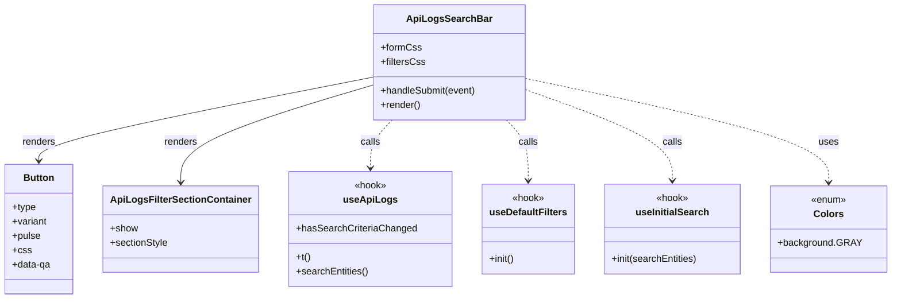

# Diagram: web/portal/src/modules/documentation/api-logs/ApiLogsSearchBar.js

> Auto-generated by Obscura crawlers

## Mermaid

```mermaid
classDiagram
class ApiLogsSearchBar {
  +formCss
  +filtersCss
  +handleSubmit(event)
  +render()
}
class Button {
  +type
  +variant
  +pulse
  +css
  +data-qa
}
class ApiLogsFilterSectionContainer {
  +show
  +sectionStyle
}
class useApiLogs <<hook>> {
  +t()
  +searchEntities()
  +hasSearchCriteriaChanged
}
class useDefaultFilters <<hook>> {
  +init()
}
class useInitialSearch <<hook>> {
  +init(searchEntities)
}
class Colors <<enum>> {
  +background.GRAY
}

ApiLogsSearchBar --> Button : renders
ApiLogsSearchBar --> ApiLogsFilterSectionContainer : renders
ApiLogsSearchBar ..> useApiLogs : calls
ApiLogsSearchBar ..> useDefaultFilters : calls
ApiLogsSearchBar ..> useInitialSearch : calls
ApiLogsSearchBar ..> Colors : uses
```

> SVG rendering failed for this diagram.
