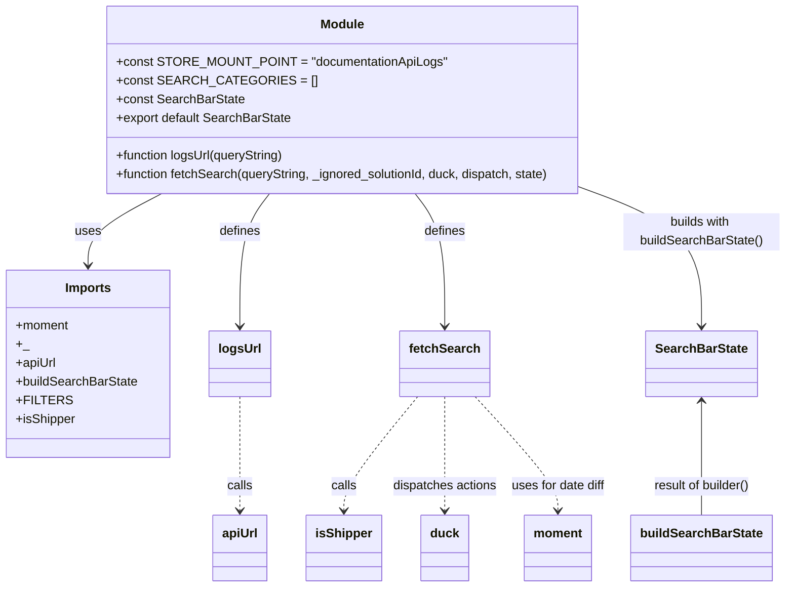

# Diagram: web/portal/src/modules/documentation/api-logs/ApiLogsSearchBarState.js


> Auto-generated by Obscura crawlers

## Diagram 1

```mermaid
flowchart TD
    Start([Start]) --> ReadState[/"Read state[documentationApiLogs].searchFilters"/]
    ReadState --> CheckRequired{Has required key "type"?}
    CheckRequired -- No --> Error1[/"dispatch REQUEST_ERROR: 'Please specify a Status Type'"/]
    CheckRequired -- Yes --> DateRange["Extract ts.from and ts.to"]
    DateRange --> ValidRange{Both from and to present and <=14 days?}
    ValidRange -- No --> Error4[/"dispatch REQUEST_ERROR: 'Please specify a Date Range of 14 days or less'"/]
    ValidRange -- Yes --> IsShipper{isActiveOrgShipper?}
    IsShipper -- Yes --> ShipperMin["Check shipper minimum keys:\n(requestId or shipmentId) OR (ts and orgName number)"]
    IsShipper -- No --> NonShipperMin["Check non-shipper minimum keys:\n(ts or requestId or shipmentId)"]
    ShipperMin --> HasMinShipper{Has minimum keys?}
    NonShipperMin --> HasMinNonShipper{Has minimum keys?}
    HasMinShipper -- No --> Error2[/"dispatch REQUEST_ERROR: 'Please specify a Request ID, Shipment ID, or a combination of Date Range and Carrier'"/]
    HasMinShipper -- Yes --> ProceedFetch
    HasMinNonShipper -- No --> Error3[/"dispatch REQUEST_ERROR: 'Please specify a Date Range, Request ID, or Shipment ID'"/]
    HasMinNonShipper -- Yes --> ProceedFetch
    ProceedFetch["Build url = apiUrl('/support/get_api_logs?'+queryString)\ncall dispatch(duck.fetch(url))"] --> End([End])
    Error1 --> End
    Error2 --> End
    Error3 --> End
    Error4 --> End
```

> SVG rendering failed for this diagram.

## Diagram 2



### SVG

<svg id="container" width="999.421875" xmlns="http://www.w3.org/2000/svg" class="classDiagram" height="752" viewBox="0 0 999.421875 752" role="graphics-document document" aria-roledescription="class"><style>#container{font-family:"trebuchet ms",verdana,arial,sans-serif;font-size:16px;fill:#333;}@keyframes edge-animation-frame{from{stroke-dashoffset:0;}}@keyframes dash{to{stroke-dashoffset:0;}}#container .edge-animation-slow{stroke-dasharray:9,5!important;stroke-dashoffset:900;animation:dash 50s linear infinite;stroke-linecap:round;}#container .edge-animation-fast{stroke-dasharray:9,5!important;stroke-dashoffset:900;animation:dash 20s linear infinite;stroke-linecap:round;}#container .error-icon{fill:#552222;}#container .error-text{fill:#552222;stroke:#552222;}#container .edge-thickness-normal{stroke-width:1px;}#container .edge-thickness-thick{stroke-width:3.5px;}#container .edge-pattern-solid{stroke-dasharray:0;}#container .edge-thickness-invisible{stroke-width:0;fill:none;}#container .edge-pattern-dashed{stroke-dasharray:3;}#container .edge-pattern-dotted{stroke-dasharray:2;}#container .marker{fill:#333333;stroke:#333333;}#container .marker.cross{stroke:#333333;}#container svg{font-family:"trebuchet ms",verdana,arial,sans-serif;font-size:16px;}#container p{margin:0;}#container g.classGroup text{fill:#9370DB;stroke:none;font-family:"trebuchet ms",verdana,arial,sans-serif;font-size:10px;}#container g.classGroup text .title{font-weight:bolder;}#container .nodeLabel,#container .edgeLabel{color:#131300;}#container .edgeLabel .label rect{fill:#ECECFF;}#container .label text{fill:#131300;}#container .labelBkg{background:#ECECFF;}#container .edgeLabel .label span{background:#ECECFF;}#container .classTitle{font-weight:bolder;}#container .node rect,#container .node circle,#container .node ellipse,#container .node polygon,#container .node path{fill:#ECECFF;stroke:#9370DB;stroke-width:1px;}#container .divider{stroke:#9370DB;stroke-width:1;}#container g.clickable{cursor:pointer;}#container g.classGroup rect{fill:#ECECFF;stroke:#9370DB;}#container g.classGroup line{stroke:#9370DB;stroke-width:1;}#container .classLabel .box{stroke:none;stroke-width:0;fill:#ECECFF;opacity:0.5;}#container .classLabel .label{fill:#9370DB;font-size:10px;}#container .relation{stroke:#333333;stroke-width:1;fill:none;}#container .dashed-line{stroke-dasharray:3;}#container .dotted-line{stroke-dasharray:1 2;}#container #compositionStart,#container .composition{fill:#333333!important;stroke:#333333!important;stroke-width:1;}#container #compositionEnd,#container .composition{fill:#333333!important;stroke:#333333!important;stroke-width:1;}#container #dependencyStart,#container .dependency{fill:#333333!important;stroke:#333333!important;stroke-width:1;}#container #dependencyStart,#container .dependency{fill:#333333!important;stroke:#333333!important;stroke-width:1;}#container #extensionStart,#container .extension{fill:transparent!important;stroke:#333333!important;stroke-width:1;}#container #extensionEnd,#container .extension{fill:transparent!important;stroke:#333333!important;stroke-width:1;}#container #aggregationStart,#container .aggregation{fill:transparent!important;stroke:#333333!important;stroke-width:1;}#container #aggregationEnd,#container .aggregation{fill:transparent!important;stroke:#333333!important;stroke-width:1;}#container #lollipopStart,#container .lollipop{fill:#ECECFF!important;stroke:#333333!important;stroke-width:1;}#container #lollipopEnd,#container .lollipop{fill:#ECECFF!important;stroke:#333333!important;stroke-width:1;}#container .edgeTerminals{font-size:11px;line-height:initial;}#container .classTitleText{text-anchor:middle;font-size:18px;fill:#333;}#container .label-icon{display:inline-block;height:1em;overflow:visible;vertical-align:-0.125em;}#container .node .label-icon path{fill:currentColor;stroke:revert;stroke-width:revert;}#container :root{--mermaid-font-family:"trebuchet ms",verdana,arial,sans-serif;}</style><g><defs><marker id="container_class-aggregationStart" class="marker aggregation class" refX="18" refY="7" markerWidth="190" markerHeight="240" orient="auto"><path d="M 18,7 L9,13 L1,7 L9,1 Z"></path></marker></defs><defs><marker id="container_class-aggregationEnd" class="marker aggregation class" refX="1" refY="7" markerWidth="20" markerHeight="28" orient="auto"><path d="M 18,7 L9,13 L1,7 L9,1 Z"></path></marker></defs><defs><marker id="container_class-extensionStart" class="marker extension class" refX="18" refY="7" markerWidth="190" markerHeight="240" orient="auto"><path d="M 1,7 L18,13 V 1 Z"></path></marker></defs><defs><marker id="container_class-extensionEnd" class="marker extension class" refX="1" refY="7" markerWidth="20" markerHeight="28" orient="auto"><path d="M 1,1 V 13 L18,7 Z"></path></marker></defs><defs><marker id="container_class-compositionStart" class="marker composition class" refX="18" refY="7" markerWidth="190" markerHeight="240" orient="auto"><path d="M 18,7 L9,13 L1,7 L9,1 Z"></path></marker></defs><defs><marker id="container_class-compositionEnd" class="marker composition class" refX="1" refY="7" markerWidth="20" markerHeight="28" orient="auto"><path d="M 18,7 L9,13 L1,7 L9,1 Z"></path></marker></defs><defs><marker id="container_class-dependencyStart" class="marker dependency class" refX="6" refY="7" markerWidth="190" markerHeight="240" orient="auto"><path d="M 5,7 L9,13 L1,7 L9,1 Z"></path></marker></defs><defs><marker id="container_class-dependencyEnd" class="marker dependency class" refX="13" refY="7" markerWidth="20" markerHeight="28" orient="auto"><path d="M 18,7 L9,13 L14,7 L9,1 Z"></path></marker></defs><defs><marker id="container_class-lollipopStart" class="marker lollipop class" refX="13" refY="7" markerWidth="190" markerHeight="240" orient="auto"><circle stroke="black" fill="transparent" cx="7" cy="7" r="6"></circle></marker></defs><defs><marker id="container_class-lollipopEnd" class="marker lollipop class" refX="1" refY="7" markerWidth="190" markerHeight="240" orient="auto"><circle stroke="black" fill="transparent" cx="7" cy="7" r="6"></circle></marker></defs><g class="root"><g class="clusters"></g><g class="edgePaths"><path d="M205.541,248L190.024,256.167C174.507,264.333,143.472,280.667,127.955,296C112.438,311.333,112.438,325.667,112.438,332.833L112.438,340" id="id_Module_Imports_1" class="edge-thickness-normal edge-pattern-solid relation" style=";;;" data-edge="true" data-et="edge" data-id="id_Module_Imports_1" data-points="W3sieCI6MjA1LjU0MTM1MDc3NjYyNzIsInkiOjI0OH0seyJ4IjoxMTIuNDM3NSwieSI6Mjk3fSx7IngiOjExMi40Mzc1LCJ5IjozNDZ9XQ==" marker-end="url(#container_class-dependencyEnd)"></path><path d="M342.189,248L335.971,256.167C329.754,264.333,317.318,280.667,311.1,309C304.883,337.333,304.883,377.667,304.883,397.833L304.883,418" id="id_Module_logsUrl_2" class="edge-thickness-normal edge-pattern-solid relation" style=";;;" data-edge="true" data-et="edge" data-id="id_Module_logsUrl_2" data-points="W3sieCI6MzQyLjE4ODkwOTk0ODIyNDgsInkiOjI0OH0seyJ4IjozMDQuODgyODEyNSwieSI6Mjk3fSx7IngiOjMwNC44ODI4MTI1LCJ5Ijo0MjR9XQ==" marker-end="url(#container_class-dependencyEnd)"></path><path d="M524.913,248L531.13,256.167C537.348,264.333,549.783,280.667,556.001,309C562.219,337.333,562.219,377.667,562.219,397.833L562.219,418" id="id_Module_fetchSearch_3" class="edge-thickness-normal edge-pattern-solid relation" style=";;;" data-edge="true" data-et="edge" data-id="id_Module_fetchSearch_3" data-points="W3sieCI6NTI0LjkxMjY1MjU1MTc3NTIsInkiOjI0OH0seyJ4Ijo1NjIuMjE4NzUsInkiOjI5N30seyJ4Ijo1NjIuMjE4NzUsInkiOjQyNH1d" marker-end="url(#container_class-dependencyEnd)"></path><path d="M741.309,241.593L766.327,250.828C791.346,260.062,841.384,278.531,866.403,307.932C891.422,337.333,891.422,377.667,891.422,397.833L891.422,418" id="id_Module_SearchBarState_4" class="edge-thickness-normal edge-pattern-solid relation" style=";;;" data-edge="true" data-et="edge" data-id="id_Module_SearchBarState_4" data-points="W3sieCI6NzQxLjMwODU5Mzc1LCJ5IjoyNDEuNTkzMjYwMjQ4MjYxNzR9LHsieCI6ODkxLjQyMTg3NSwieSI6Mjk3fSx7IngiOjg5MS40MjE4NzUsInkiOjQyNH1d" marker-end="url(#container_class-dependencyEnd)"></path><path d="M304.883,508L304.883,527.167C304.883,546.333,304.883,584.667,304.883,609C304.883,633.333,304.883,643.667,304.883,648.833L304.883,654" id="id_logsUrl_apiUrl_5" class="edge-thickness-normal edge-pattern-dashed relation" style=";;;" data-edge="true" data-et="edge" data-id="id_logsUrl_apiUrl_5" data-points="W3sieCI6MzA0Ljg4MjgxMjUsInkiOjUwOH0seyJ4IjozMDQuODgyODEyNSwieSI6NjIzfSx7IngiOjMwNC44ODI4MTI1LCJ5Ijo2NjB9XQ==" marker-end="url(#container_class-dependencyEnd)"></path><path d="M528.411,508L512.983,527.167C497.556,546.333,466.7,584.667,451.272,609C435.844,633.333,435.844,643.667,435.844,648.833L435.844,654" id="id_fetchSearch_isShipper_6" class="edge-thickness-normal edge-pattern-dashed relation" style=";;;" data-edge="true" data-et="edge" data-id="id_fetchSearch_isShipper_6" data-points="W3sieCI6NTI4LjQxMTQyNTE1OTIzNTcsInkiOjUwOH0seyJ4Ijo0MzUuODQzNzUsInkiOjYyM30seyJ4Ijo0MzUuODQzNzUsInkiOjY2MH1d" marker-end="url(#container_class-dependencyEnd)"></path><path d="M562.219,508L562.219,527.167C562.219,546.333,562.219,584.667,562.219,609C562.219,633.333,562.219,643.667,562.219,648.833L562.219,654" id="id_fetchSearch_duck_7" class="edge-thickness-normal edge-pattern-dashed relation" style=";;;" data-edge="true" data-et="edge" data-id="id_fetchSearch_duck_7" data-points="W3sieCI6NTYyLjIxODc1LCJ5Ijo1MDh9LHsieCI6NTYyLjIxODc1LCJ5Ijo2MjN9LHsieCI6NTYyLjIxODc1LCJ5Ijo2NjB9XQ==" marker-end="url(#container_class-dependencyEnd)"></path><path d="M602.237,508L620.5,527.167C638.762,546.333,675.287,584.667,693.55,609C711.813,633.333,711.813,643.667,711.813,648.833L711.813,654" id="id_fetchSearch_moment_8" class="edge-thickness-normal edge-pattern-dashed relation" style=";;;" data-edge="true" data-et="edge" data-id="id_fetchSearch_moment_8" data-points="W3sieCI6NjAyLjIzNzQ2MDE5MTA4MjgsInkiOjUwOH0seyJ4Ijo3MTEuODEyNSwieSI6NjIzfSx7IngiOjcxMS44MTI1LCJ5Ijo2NjB9XQ==" marker-end="url(#container_class-dependencyEnd)"></path><path d="M891.422,514L891.422,532.167C891.422,550.333,891.422,586.667,891.422,611C891.422,635.333,891.422,647.667,891.422,653.833L891.422,660" id="id_SearchBarState_buildSearchBarState_9" class="edge-thickness-normal edge-pattern-solid relation" style=";;;" data-edge="true" data-et="edge" data-id="id_SearchBarState_buildSearchBarState_9" data-points="W3sieCI6ODkxLjQyMTg3NSwieSI6NTA4fSx7IngiOjg5MS40MjE4NzUsInkiOjYyM30seyJ4Ijo4OTEuNDIxODc1LCJ5Ijo2NjB9XQ==" marker-start="url(#container_class-dependencyStart)"></path></g><g class="edgeLabels"><g class="edgeLabel" transform="translate(112.4375, 297)"><g class="label" data-id="id_Module_Imports_1" transform="translate(-16.4921875, -12)"><foreignObject width="32.984375" height="24"><div xmlns="http://www.w3.org/1999/xhtml" class="labelBkg" style="display: table-cell; white-space: nowrap; line-height: 1.5; max-width: 200px; text-align: center;"><span class="edgeLabel"><p>uses</p></span></div></foreignObject></g></g><g class="edgeLabel" transform="translate(304.8828125, 297)"><g class="label" data-id="id_Module_logsUrl_2" transform="translate(-26.53125, -12)"><foreignObject width="53.0625" height="24"><div xmlns="http://www.w3.org/1999/xhtml" class="labelBkg" style="display: table-cell; white-space: nowrap; line-height: 1.5; max-width: 200px; text-align: center;"><span class="edgeLabel"><p>defines</p></span></div></foreignObject></g></g><g class="edgeLabel" transform="translate(562.21875, 297)"><g class="label" data-id="id_Module_fetchSearch_3" transform="translate(-26.53125, -12)"><foreignObject width="53.0625" height="24"><div xmlns="http://www.w3.org/1999/xhtml" class="labelBkg" style="display: table-cell; white-space: nowrap; line-height: 1.5; max-width: 200px; text-align: center;"><span class="edgeLabel"><p>defines</p></span></div></foreignObject></g></g><g class="edgeLabel" transform="translate(891.421875, 297)"><g class="label" data-id="id_Module_SearchBarState_4" transform="translate(-100, -24)"><foreignObject width="200" height="48"><div xmlns="http://www.w3.org/1999/xhtml" class="labelBkg" style="display: table; white-space: break-spaces; line-height: 1.5; max-width: 200px; text-align: center; width: 200px;"><span class="edgeLabel"><p>builds with buildSearchBarState()</p></span></div></foreignObject></g></g><g class="edgeLabel" transform="translate(304.8828125, 623)"><g class="label" data-id="id_logsUrl_apiUrl_5" transform="translate(-16.4453125, -12)"><foreignObject width="32.890625" height="24"><div xmlns="http://www.w3.org/1999/xhtml" class="labelBkg" style="display: table-cell; white-space: nowrap; line-height: 1.5; max-width: 200px; text-align: center;"><span class="edgeLabel"><p>calls</p></span></div></foreignObject></g></g><g class="edgeLabel" transform="translate(435.84375, 623)"><g class="label" data-id="id_fetchSearch_isShipper_6" transform="translate(-16.4453125, -12)"><foreignObject width="32.890625" height="24"><div xmlns="http://www.w3.org/1999/xhtml" class="labelBkg" style="display: table-cell; white-space: nowrap; line-height: 1.5; max-width: 200px; text-align: center;"><span class="edgeLabel"><p>calls</p></span></div></foreignObject></g></g><g class="edgeLabel" transform="translate(562.21875, 623)"><g class="label" data-id="id_fetchSearch_duck_7" transform="translate(-67.71875, -12)"><foreignObject width="135.4375" height="24"><div xmlns="http://www.w3.org/1999/xhtml" class="labelBkg" style="display: table-cell; white-space: nowrap; line-height: 1.5; max-width: 200px; text-align: center;"><span class="edgeLabel"><p>dispatches actions</p></span></div></foreignObject></g></g><g class="edgeLabel" transform="translate(711.8125, 623)"><g class="label" data-id="id_fetchSearch_moment_8" transform="translate(-61.875, -12)"><foreignObject width="123.75" height="24"><div xmlns="http://www.w3.org/1999/xhtml" class="labelBkg" style="display: table-cell; white-space: nowrap; line-height: 1.5; max-width: 200px; text-align: center;"><span class="edgeLabel"><p>uses for date diff</p></span></div></foreignObject></g></g><g class="edgeLabel" transform="translate(891.421875, 623)"><g class="label" data-id="id_SearchBarState_buildSearchBarState_9" transform="translate(-63.8125, -12)"><foreignObject width="127.625" height="24"><div xmlns="http://www.w3.org/1999/xhtml" class="labelBkg" style="display: table-cell; white-space: nowrap; line-height: 1.5; max-width: 200px; text-align: center;"><span class="edgeLabel"><p>result of builder()</p></span></div></foreignObject></g></g></g><g class="nodes"><g class="node default" id="classId-Module-0" transform="translate(433.55078125, 128)"><g class="basic label-container"><path d="M-307.7578125 -120 L307.7578125 -120 L307.7578125 120 L-307.7578125 120" stroke="none" stroke-width="0" fill="#ECECFF" style=""></path><path d="M-307.7578125 -120 C-95.21136047343967 -120, 117.33509155312066 -120, 307.7578125 -120 M-307.7578125 -120 C-113.08464538183662 -120, 81.58852173632675 -120, 307.7578125 -120 M307.7578125 -120 C307.7578125 -39.0515628211252, 307.7578125 41.896874357749596, 307.7578125 120 M307.7578125 -120 C307.7578125 -31.18374964894835, 307.7578125 57.6325007021033, 307.7578125 120 M307.7578125 120 C146.76653232271593 120, -14.224747854568136 120, -307.7578125 120 M307.7578125 120 C86.39330563881668 120, -134.97120122236663 120, -307.7578125 120 M-307.7578125 120 C-307.7578125 42.96149000010314, -307.7578125 -34.07701999979372, -307.7578125 -120 M-307.7578125 120 C-307.7578125 24.815493866691995, -307.7578125 -70.36901226661601, -307.7578125 -120" stroke="#9370DB" stroke-width="1.3" fill="none" stroke-dasharray="0 0" style=""></path></g><g class="annotation-group text" transform="translate(0, -96)"></g><g class="label-group text" transform="translate(-27.09375, -96)"><g class="label" style="font-weight: bolder" transform="translate(0,-12)"><foreignObject width="54.1875" height="24"><div xmlns="http://www.w3.org/1999/xhtml" style="display: table-cell; white-space: nowrap; line-height: 1.5; max-width: 104px; text-align: center;"><span class="nodeLabel markdown-node-label" style=""><p>Module</p></span></div></foreignObject></g></g><g class="members-group text" transform="translate(-295.7578125, -48)"><g class="label" style="" transform="translate(0,-12)"><foreignObject width="405.71875" height="24"><div xmlns="http://www.w3.org/1999/xhtml" style="display: table-cell; white-space: nowrap; line-height: 1.5; max-width: 463px; text-align: center;"><span class="nodeLabel markdown-node-label" style=""><p>+const STORE_MOUNT_POINT = "documentationApiLogs"</p></span></div></foreignObject></g><g class="label" style="" transform="translate(0,12)"><foreignObject width="228.46875" height="24"><div xmlns="http://www.w3.org/1999/xhtml" style="display: table-cell; white-space: nowrap; line-height: 1.5; max-width: 286px; text-align: center;"><span class="nodeLabel markdown-node-label" style=""><p>+const SEARCH_CATEGORIES = []</p></span></div></foreignObject></g><g class="label" style="" transform="translate(0,36)"><foreignObject width="162.1875" height="24"><div xmlns="http://www.w3.org/1999/xhtml" style="display: table-cell; white-space: nowrap; line-height: 1.5; max-width: 220px; text-align: center;"><span class="nodeLabel markdown-node-label" style=""><p>+const SearchBarState</p></span></div></foreignObject></g><g class="label" style="" transform="translate(0,60)"><foreignObject width="226.046875" height="24"><div xmlns="http://www.w3.org/1999/xhtml" style="display: table-cell; white-space: nowrap; line-height: 1.5; max-width: 283px; text-align: center;"><span class="nodeLabel markdown-node-label" style=""><p>+export default SearchBarState</p></span></div></foreignObject></g></g><g class="methods-group text" transform="translate(-295.7578125, 72)"><g class="label" style="" transform="translate(0,-12)"><foreignObject width="218.6875" height="24"><div xmlns="http://www.w3.org/1999/xhtml" style="display: table-cell; white-space: nowrap; line-height: 1.5; max-width: 276px; text-align: center;"><span class="nodeLabel markdown-node-label" style=""><p>+function logsUrl(queryString)</p></span></div></foreignObject></g><g class="label" style="" transform="translate(0,12)"><foreignObject width="564.421875" height="24"><div xmlns="http://www.w3.org/1999/xhtml" style="display: table-cell; white-space: nowrap; line-height: 1.5; max-width: 622px; text-align: center;"><span class="nodeLabel markdown-node-label" style=""><p>+function fetchSearch(queryString, _ignored_solutionId, duck, dispatch, state)</p></span></div></foreignObject></g></g><g class="divider" style=""><path d="M-307.7578125 -72 C-121.91722496996792 -72, 63.92336256006416 -72, 307.7578125 -72 M-307.7578125 -72 C-178.24960643911044 -72, -48.741400378220874 -72, 307.7578125 -72" stroke="#9370DB" stroke-width="1.3" fill="none" stroke-dasharray="0 0" style=""></path></g><g class="divider" style=""><path d="M-307.7578125 48 C-111.62774956515631 48, 84.50231336968739 48, 307.7578125 48 M-307.7578125 48 C-110.87538751280707 48, 86.00703747438587 48, 307.7578125 48" stroke="#9370DB" stroke-width="1.3" fill="none" stroke-dasharray="0 0" style=""></path></g></g><g class="node default" id="classId-Imports-1" transform="translate(112.4375, 466)"><g class="basic label-container"><path d="M-104.4375 -120 L104.4375 -120 L104.4375 120 L-104.4375 120" stroke="none" stroke-width="0" fill="#ECECFF" style=""></path><path d="M-104.4375 -120 C-25.137241168650036 -120, 54.16301766269993 -120, 104.4375 -120 M-104.4375 -120 C-42.99923581995709 -120, 18.439028360085814 -120, 104.4375 -120 M104.4375 -120 C104.4375 -49.46893978115398, 104.4375 21.062120437692045, 104.4375 120 M104.4375 -120 C104.4375 -36.04096868297708, 104.4375 47.91806263404584, 104.4375 120 M104.4375 120 C49.23193603776381 120, -5.973627924472382 120, -104.4375 120 M104.4375 120 C42.17040774557298 120, -20.09668450885404 120, -104.4375 120 M-104.4375 120 C-104.4375 66.13818124264597, -104.4375 12.27636248529194, -104.4375 -120 M-104.4375 120 C-104.4375 47.693312068694866, -104.4375 -24.61337586261027, -104.4375 -120" stroke="#9370DB" stroke-width="1.3" fill="none" stroke-dasharray="0 0" style=""></path></g><g class="annotation-group text" transform="translate(0, -96)"></g><g class="label-group text" transform="translate(-28.71875, -96)"><g class="label" style="font-weight: bolder" transform="translate(0,-12)"><foreignObject width="57.4375" height="24"><div xmlns="http://www.w3.org/1999/xhtml" style="display: table-cell; white-space: nowrap; line-height: 1.5; max-width: 107px; text-align: center;"><span class="nodeLabel markdown-node-label" style=""><p>Imports</p></span></div></foreignObject></g></g><g class="members-group text" transform="translate(-92.4375, -48)"><g class="label" style="" transform="translate(0,-12)"><foreignObject width="68.625" height="24"><div xmlns="http://www.w3.org/1999/xhtml" style="display: table-cell; white-space: nowrap; line-height: 1.5; max-width: 126px; text-align: center;"><span class="nodeLabel markdown-node-label" style=""><p>+moment</p></span></div></foreignObject></g><g class="label" style="" transform="translate(0,12)"><foreignObject width="15.03125" height="24"><div xmlns="http://www.w3.org/1999/xhtml" style="display: table-cell; white-space: nowrap; line-height: 1.5; max-width: 73px; text-align: center;"><span class="nodeLabel markdown-node-label" style=""><p>+_</p></span></div></foreignObject></g><g class="label" style="" transform="translate(0,36)"><foreignObject width="51.921875" height="24"><div xmlns="http://www.w3.org/1999/xhtml" style="display: table-cell; white-space: nowrap; line-height: 1.5; max-width: 110px; text-align: center;"><span class="nodeLabel markdown-node-label" style=""><p>+apiUrl</p></span></div></foreignObject></g><g class="label" style="" transform="translate(0,60)"><foreignObject width="156.15625" height="24"><div xmlns="http://www.w3.org/1999/xhtml" style="display: table-cell; white-space: nowrap; line-height: 1.5; max-width: 214px; text-align: center;"><span class="nodeLabel markdown-node-label" style=""><p>+buildSearchBarState</p></span></div></foreignObject></g><g class="label" style="" transform="translate(0,84)"><foreignObject width="62.328125" height="24"><div xmlns="http://www.w3.org/1999/xhtml" style="display: table-cell; white-space: nowrap; line-height: 1.5; max-width: 120px; text-align: center;"><span class="nodeLabel markdown-node-label" style=""><p>+FILTERS</p></span></div></foreignObject></g><g class="label" style="" transform="translate(0,108)"><foreignObject width="76.484375" height="24"><div xmlns="http://www.w3.org/1999/xhtml" style="display: table-cell; white-space: nowrap; line-height: 1.5; max-width: 135px; text-align: center;"><span class="nodeLabel markdown-node-label" style=""><p>+isShipper</p></span></div></foreignObject></g></g><g class="methods-group text" transform="translate(-92.4375, 120)"></g><g class="divider" style=""><path d="M-104.4375 -72 C-48.10246994348647 -72, 8.232560113027063 -72, 104.4375 -72 M-104.4375 -72 C-27.5765833393137 -72, 49.2843333213726 -72, 104.4375 -72" stroke="#9370DB" stroke-width="1.3" fill="none" stroke-dasharray="0 0" style=""></path></g><g class="divider" style=""><path d="M-104.4375 96 C-27.072000096192554 96, 50.29349980761489 96, 104.4375 96 M-104.4375 96 C-29.70927893984593 96, 45.01894212030814 96, 104.4375 96" stroke="#9370DB" stroke-width="1.3" fill="none" stroke-dasharray="0 0" style=""></path></g></g><g class="node default" id="classId-logsUrl-2" transform="translate(304.8828125, 466)"><g class="basic label-container"><path d="M-38.0078125 -42 L38.0078125 -42 L38.0078125 42 L-38.0078125 42" stroke="none" stroke-width="0" fill="#ECECFF" style=""></path><path d="M-38.0078125 -42 C-12.942292330794867 -42, 12.123227838410266 -42, 38.0078125 -42 M-38.0078125 -42 C-12.765980882306891 -42, 12.475850735386217 -42, 38.0078125 -42 M38.0078125 -42 C38.0078125 -10.32416453266757, 38.0078125 21.35167093466486, 38.0078125 42 M38.0078125 -42 C38.0078125 -8.446569974500164, 38.0078125 25.10686005099967, 38.0078125 42 M38.0078125 42 C17.919696915810764 42, -2.1684186683784716 42, -38.0078125 42 M38.0078125 42 C17.26562785826875 42, -3.476556783462499 42, -38.0078125 42 M-38.0078125 42 C-38.0078125 24.51276775858847, -38.0078125 7.025535517176941, -38.0078125 -42 M-38.0078125 42 C-38.0078125 22.760574011008174, -38.0078125 3.521148022016348, -38.0078125 -42" stroke="#9370DB" stroke-width="1.3" fill="none" stroke-dasharray="0 0" style=""></path></g><g class="annotation-group text" transform="translate(0, -18)"></g><g class="label-group text" transform="translate(-26.0078125, -18)"><g class="label" style="font-weight: bolder" transform="translate(0,-12)"><foreignObject width="52.015625" height="24"><div xmlns="http://www.w3.org/1999/xhtml" style="display: table-cell; white-space: nowrap; line-height: 1.5; max-width: 101px; text-align: center;"><span class="nodeLabel markdown-node-label" style=""><p>logsUrl</p></span></div></foreignObject></g></g><g class="members-group text" transform="translate(-26.0078125, 30)"></g><g class="methods-group text" transform="translate(-26.0078125, 60)"></g><g class="divider" style=""><path d="M-38.0078125 6 C-22.74079801640491 6, -7.473783532809815 6, 38.0078125 6 M-38.0078125 6 C-8.547525995316345 6, 20.91276050936731 6, 38.0078125 6" stroke="#9370DB" stroke-width="1.3" fill="none" stroke-dasharray="0 0" style=""></path></g><g class="divider" style=""><path d="M-38.0078125 24 C-13.567641462180738 24, 10.872529575638524 24, 38.0078125 24 M-38.0078125 24 C-11.85390051399709 24, 14.30001147200582 24, 38.0078125 24" stroke="#9370DB" stroke-width="1.3" fill="none" stroke-dasharray="0 0" style=""></path></g></g><g class="node default" id="classId-fetchSearch-3" transform="translate(562.21875, 466)"><g class="basic label-container"><path d="M-55.2890625 -42 L55.2890625 -42 L55.2890625 42 L-55.2890625 42" stroke="none" stroke-width="0" fill="#ECECFF" style=""></path><path d="M-55.2890625 -42 C-24.441556087551746 -42, 6.405950324896509 -42, 55.2890625 -42 M-55.2890625 -42 C-26.491827374636767 -42, 2.3054077507264665 -42, 55.2890625 -42 M55.2890625 -42 C55.2890625 -20.190424940956614, 55.2890625 1.6191501180867718, 55.2890625 42 M55.2890625 -42 C55.2890625 -10.67152909058861, 55.2890625 20.65694181882278, 55.2890625 42 M55.2890625 42 C32.459012069531354 42, 9.628961639062716 42, -55.2890625 42 M55.2890625 42 C13.883320641475123 42, -27.522421217049754 42, -55.2890625 42 M-55.2890625 42 C-55.2890625 23.36440553043193, -55.2890625 4.728811060863862, -55.2890625 -42 M-55.2890625 42 C-55.2890625 21.72978868848996, -55.2890625 1.4595773769799223, -55.2890625 -42" stroke="#9370DB" stroke-width="1.3" fill="none" stroke-dasharray="0 0" style=""></path></g><g class="annotation-group text" transform="translate(0, -18)"></g><g class="label-group text" transform="translate(-43.2890625, -18)"><g class="label" style="font-weight: bolder" transform="translate(0,-12)"><foreignObject width="86.578125" height="24"><div xmlns="http://www.w3.org/1999/xhtml" style="display: table-cell; white-space: nowrap; line-height: 1.5; max-width: 135px; text-align: center;"><span class="nodeLabel markdown-node-label" style=""><p>fetchSearch</p></span></div></foreignObject></g></g><g class="members-group text" transform="translate(-43.2890625, 30)"></g><g class="methods-group text" transform="translate(-43.2890625, 60)"></g><g class="divider" style=""><path d="M-55.2890625 6 C-18.377311651617774 6, 18.534439196764453 6, 55.2890625 6 M-55.2890625 6 C-23.27901424408735 6, 8.731034011825301 6, 55.2890625 6" stroke="#9370DB" stroke-width="1.3" fill="none" stroke-dasharray="0 0" style=""></path></g><g class="divider" style=""><path d="M-55.2890625 24 C-32.40352317630678 24, -9.517983852613547 24, 55.2890625 24 M-55.2890625 24 C-22.466752680206433 24, 10.355557139587134 24, 55.2890625 24" stroke="#9370DB" stroke-width="1.3" fill="none" stroke-dasharray="0 0" style=""></path></g></g><g class="node default" id="classId-SearchBarState-4" transform="translate(891.421875, 466)"><g class="basic label-container"><path d="M-68.5546875 -42 L68.5546875 -42 L68.5546875 42 L-68.5546875 42" stroke="none" stroke-width="0" fill="#ECECFF" style=""></path><path d="M-68.5546875 -42 C-39.195539069701184 -42, -9.836390639402374 -42, 68.5546875 -42 M-68.5546875 -42 C-19.290854729993917 -42, 29.972978040012165 -42, 68.5546875 -42 M68.5546875 -42 C68.5546875 -20.624492317824817, 68.5546875 0.7510153643503656, 68.5546875 42 M68.5546875 -42 C68.5546875 -24.18055214978525, 68.5546875 -6.361104299570499, 68.5546875 42 M68.5546875 42 C15.519882151247018 42, -37.514923197505965 42, -68.5546875 42 M68.5546875 42 C31.82504271521237 42, -4.904602069575262 42, -68.5546875 42 M-68.5546875 42 C-68.5546875 14.14104117245573, -68.5546875 -13.717917655088542, -68.5546875 -42 M-68.5546875 42 C-68.5546875 19.67709046576566, -68.5546875 -2.6458190684686826, -68.5546875 -42" stroke="#9370DB" stroke-width="1.3" fill="none" stroke-dasharray="0 0" style=""></path></g><g class="annotation-group text" transform="translate(0, -18)"></g><g class="label-group text" transform="translate(-56.5546875, -18)"><g class="label" style="font-weight: bolder" transform="translate(0,-12)"><foreignObject width="113.109375" height="24"><div xmlns="http://www.w3.org/1999/xhtml" style="display: table-cell; white-space: nowrap; line-height: 1.5; max-width: 161px; text-align: center;"><span class="nodeLabel markdown-node-label" style=""><p>SearchBarState</p></span></div></foreignObject></g></g><g class="members-group text" transform="translate(-56.5546875, 30)"></g><g class="methods-group text" transform="translate(-56.5546875, 60)"></g><g class="divider" style=""><path d="M-68.5546875 6 C-40.59014305683081 6, -12.62559861366163 6, 68.5546875 6 M-68.5546875 6 C-29.99748337201312 6, 8.559720755973757 6, 68.5546875 6" stroke="#9370DB" stroke-width="1.3" fill="none" stroke-dasharray="0 0" style=""></path></g><g class="divider" style=""><path d="M-68.5546875 24 C-20.223823639233387 24, 28.107040221533225 24, 68.5546875 24 M-68.5546875 24 C-25.660471644901904 24, 17.233744210196193 24, 68.5546875 24" stroke="#9370DB" stroke-width="1.3" fill="none" stroke-dasharray="0 0" style=""></path></g></g><g class="node default" id="classId-apiUrl-5" transform="translate(304.8828125, 702)"><g class="basic label-container"><path d="M-34.2109375 -42 L34.2109375 -42 L34.2109375 42 L-34.2109375 42" stroke="none" stroke-width="0" fill="#ECECFF" style=""></path><path d="M-34.2109375 -42 C-13.474379722718322 -42, 7.262178054563357 -42, 34.2109375 -42 M-34.2109375 -42 C-16.99863822275434 -42, 0.21366105449131823 -42, 34.2109375 -42 M34.2109375 -42 C34.2109375 -21.451347314736022, 34.2109375 -0.9026946294720446, 34.2109375 42 M34.2109375 -42 C34.2109375 -16.400295672700807, 34.2109375 9.199408654598386, 34.2109375 42 M34.2109375 42 C13.585972994200695 42, -7.03899151159861 42, -34.2109375 42 M34.2109375 42 C16.52193315861403 42, -1.1670711827719416 42, -34.2109375 42 M-34.2109375 42 C-34.2109375 15.231954567814682, -34.2109375 -11.536090864370635, -34.2109375 -42 M-34.2109375 42 C-34.2109375 10.212528473015169, -34.2109375 -21.574943053969662, -34.2109375 -42" stroke="#9370DB" stroke-width="1.3" fill="none" stroke-dasharray="0 0" style=""></path></g><g class="annotation-group text" transform="translate(0, -18)"></g><g class="label-group text" transform="translate(-22.2109375, -18)"><g class="label" style="font-weight: bolder" transform="translate(0,-12)"><foreignObject width="44.421875" height="24"><div xmlns="http://www.w3.org/1999/xhtml" style="display: table-cell; white-space: nowrap; line-height: 1.5; max-width: 94px; text-align: center;"><span class="nodeLabel markdown-node-label" style=""><p>apiUrl</p></span></div></foreignObject></g></g><g class="members-group text" transform="translate(-22.2109375, 30)"></g><g class="methods-group text" transform="translate(-22.2109375, 60)"></g><g class="divider" style=""><path d="M-34.2109375 6 C-12.959407399792596 6, 8.292122700414808 6, 34.2109375 6 M-34.2109375 6 C-18.876494800690416 6, -3.542052101380829 6, 34.2109375 6" stroke="#9370DB" stroke-width="1.3" fill="none" stroke-dasharray="0 0" style=""></path></g><g class="divider" style=""><path d="M-34.2109375 24 C-19.747096767963107 24, -5.283256035926218 24, 34.2109375 24 M-34.2109375 24 C-12.314328232211842 24, 9.582281035576315 24, 34.2109375 24" stroke="#9370DB" stroke-width="1.3" fill="none" stroke-dasharray="0 0" style=""></path></g></g><g class="node default" id="classId-isShipper-6" transform="translate(435.84375, 702)"><g class="basic label-container"><path d="M-46.75 -42 L46.75 -42 L46.75 42 L-46.75 42" stroke="none" stroke-width="0" fill="#ECECFF" style=""></path><path d="M-46.75 -42 C-15.32744373481691 -42, 16.09511253036618 -42, 46.75 -42 M-46.75 -42 C-22.867765658670674 -42, 1.0144686826586522 -42, 46.75 -42 M46.75 -42 C46.75 -18.451512166286744, 46.75 5.096975667426513, 46.75 42 M46.75 -42 C46.75 -15.782457694415019, 46.75 10.435084611169962, 46.75 42 M46.75 42 C24.324659475935057 42, 1.8993189518701143 42, -46.75 42 M46.75 42 C12.1236578473696 42, -22.5026843052608 42, -46.75 42 M-46.75 42 C-46.75 21.754245464908514, -46.75 1.5084909298170288, -46.75 -42 M-46.75 42 C-46.75 19.084300517664225, -46.75 -3.83139896467155, -46.75 -42" stroke="#9370DB" stroke-width="1.3" fill="none" stroke-dasharray="0 0" style=""></path></g><g class="annotation-group text" transform="translate(0, -18)"></g><g class="label-group text" transform="translate(-34.75, -18)"><g class="label" style="font-weight: bolder" transform="translate(0,-12)"><foreignObject width="69.5" height="24"><div xmlns="http://www.w3.org/1999/xhtml" style="display: table-cell; white-space: nowrap; line-height: 1.5; max-width: 119px; text-align: center;"><span class="nodeLabel markdown-node-label" style=""><p>isShipper</p></span></div></foreignObject></g></g><g class="members-group text" transform="translate(-34.75, 30)"></g><g class="methods-group text" transform="translate(-34.75, 60)"></g><g class="divider" style=""><path d="M-46.75 6 C-22.99364890306688 6, 0.7627021938662395 6, 46.75 6 M-46.75 6 C-22.0213636835618 6, 2.7072726328764034 6, 46.75 6" stroke="#9370DB" stroke-width="1.3" fill="none" stroke-dasharray="0 0" style=""></path></g><g class="divider" style=""><path d="M-46.75 24 C-14.69180524275724 24, 17.36638951448552 24, 46.75 24 M-46.75 24 C-16.23225709188172 24, 14.285485816236559 24, 46.75 24" stroke="#9370DB" stroke-width="1.3" fill="none" stroke-dasharray="0 0" style=""></path></g></g><g class="node default" id="classId-duck-7" transform="translate(562.21875, 702)"><g class="basic label-container"><path d="M-29.625 -42 L29.625 -42 L29.625 42 L-29.625 42" stroke="none" stroke-width="0" fill="#ECECFF" style=""></path><path d="M-29.625 -42 C-14.575875439795615 -42, 0.4732491204087701 -42, 29.625 -42 M-29.625 -42 C-13.916195268379603 -42, 1.7926094632407938 -42, 29.625 -42 M29.625 -42 C29.625 -14.879365958771242, 29.625 12.241268082457516, 29.625 42 M29.625 -42 C29.625 -8.927844379166046, 29.625 24.144311241667907, 29.625 42 M29.625 42 C8.811123716118818 42, -12.002752567762364 42, -29.625 42 M29.625 42 C15.150041210622092 42, 0.6750824212441842 42, -29.625 42 M-29.625 42 C-29.625 24.01680014088124, -29.625 6.033600281762482, -29.625 -42 M-29.625 42 C-29.625 14.671980384962794, -29.625 -12.656039230074413, -29.625 -42" stroke="#9370DB" stroke-width="1.3" fill="none" stroke-dasharray="0 0" style=""></path></g><g class="annotation-group text" transform="translate(0, -18)"></g><g class="label-group text" transform="translate(-17.625, -18)"><g class="label" style="font-weight: bolder" transform="translate(0,-12)"><foreignObject width="35.25" height="24"><div xmlns="http://www.w3.org/1999/xhtml" style="display: table-cell; white-space: nowrap; line-height: 1.5; max-width: 86px; text-align: center;"><span class="nodeLabel markdown-node-label" style=""><p>duck</p></span></div></foreignObject></g></g><g class="members-group text" transform="translate(-17.625, 30)"></g><g class="methods-group text" transform="translate(-17.625, 60)"></g><g class="divider" style=""><path d="M-29.625 6 C-8.509793012293866 6, 12.605413975412269 6, 29.625 6 M-29.625 6 C-9.824044309913326 6, 9.976911380173348 6, 29.625 6" stroke="#9370DB" stroke-width="1.3" fill="none" stroke-dasharray="0 0" style=""></path></g><g class="divider" style=""><path d="M-29.625 24 C-14.347270687815818 24, 0.930458624368363 24, 29.625 24 M-29.625 24 C-15.469005526549733 24, -1.3130110530994656 24, 29.625 24" stroke="#9370DB" stroke-width="1.3" fill="none" stroke-dasharray="0 0" style=""></path></g></g><g class="node default" id="classId-moment-8" transform="translate(711.8125, 702)"><g class="basic label-container"><path d="M-42.3125 -42 L42.3125 -42 L42.3125 42 L-42.3125 42" stroke="none" stroke-width="0" fill="#ECECFF" style=""></path><path d="M-42.3125 -42 C-24.099401131797116 -42, -5.8863022635942315 -42, 42.3125 -42 M-42.3125 -42 C-17.244072257380463 -42, 7.824355485239074 -42, 42.3125 -42 M42.3125 -42 C42.3125 -17.814404273050464, 42.3125 6.371191453899073, 42.3125 42 M42.3125 -42 C42.3125 -23.23155353824742, 42.3125 -4.463107076494843, 42.3125 42 M42.3125 42 C14.190874835919352 42, -13.930750328161295 42, -42.3125 42 M42.3125 42 C25.333110408672493 42, 8.353720817344986 42, -42.3125 42 M-42.3125 42 C-42.3125 8.542384874876703, -42.3125 -24.915230250246594, -42.3125 -42 M-42.3125 42 C-42.3125 19.972292439147342, -42.3125 -2.055415121705316, -42.3125 -42" stroke="#9370DB" stroke-width="1.3" fill="none" stroke-dasharray="0 0" style=""></path></g><g class="annotation-group text" transform="translate(0, -18)"></g><g class="label-group text" transform="translate(-30.3125, -18)"><g class="label" style="font-weight: bolder" transform="translate(0,-12)"><foreignObject width="60.625" height="24"><div xmlns="http://www.w3.org/1999/xhtml" style="display: table-cell; white-space: nowrap; line-height: 1.5; max-width: 111px; text-align: center;"><span class="nodeLabel markdown-node-label" style=""><p>moment</p></span></div></foreignObject></g></g><g class="members-group text" transform="translate(-30.3125, 30)"></g><g class="methods-group text" transform="translate(-30.3125, 60)"></g><g class="divider" style=""><path d="M-42.3125 6 C-15.074137455150058 6, 12.164225089699883 6, 42.3125 6 M-42.3125 6 C-20.79629490339643 6, 0.7199101932071414 6, 42.3125 6" stroke="#9370DB" stroke-width="1.3" fill="none" stroke-dasharray="0 0" style=""></path></g><g class="divider" style=""><path d="M-42.3125 24 C-24.417764082205117 24, -6.523028164410235 24, 42.3125 24 M-42.3125 24 C-8.775304540667065 24, 24.76189091866587 24, 42.3125 24" stroke="#9370DB" stroke-width="1.3" fill="none" stroke-dasharray="0 0" style=""></path></g></g><g class="node default" id="classId-buildSearchBarState-9" transform="translate(891.421875, 702)"><g class="basic label-container"><path d="M-87.296875 -42 L87.296875 -42 L87.296875 42 L-87.296875 42" stroke="none" stroke-width="0" fill="#ECECFF" style=""></path><path d="M-87.296875 -42 C-37.31407705478783 -42, 12.66872089042434 -42, 87.296875 -42 M-87.296875 -42 C-29.272365055181474 -42, 28.75214488963705 -42, 87.296875 -42 M87.296875 -42 C87.296875 -14.590239079552465, 87.296875 12.81952184089507, 87.296875 42 M87.296875 -42 C87.296875 -13.464945012175132, 87.296875 15.070109975649736, 87.296875 42 M87.296875 42 C36.35570254027566 42, -14.585469919448684 42, -87.296875 42 M87.296875 42 C22.447880246707 42, -42.401114506586 42, -87.296875 42 M-87.296875 42 C-87.296875 13.189844653981826, -87.296875 -15.620310692036348, -87.296875 -42 M-87.296875 42 C-87.296875 23.368705820020498, -87.296875 4.737411640040996, -87.296875 -42" stroke="#9370DB" stroke-width="1.3" fill="none" stroke-dasharray="0 0" style=""></path></g><g class="annotation-group text" transform="translate(0, -18)"></g><g class="label-group text" transform="translate(-75.296875, -18)"><g class="label" style="font-weight: bolder" transform="translate(0,-12)"><foreignObject width="150.59375" height="24"><div xmlns="http://www.w3.org/1999/xhtml" style="display: table-cell; white-space: nowrap; line-height: 1.5; max-width: 198px; text-align: center;"><span class="nodeLabel markdown-node-label" style=""><p>buildSearchBarState</p></span></div></foreignObject></g></g><g class="members-group text" transform="translate(-75.296875, 30)"></g><g class="methods-group text" transform="translate(-75.296875, 60)"></g><g class="divider" style=""><path d="M-87.296875 6 C-32.69853224173429 6, 21.899810516531417 6, 87.296875 6 M-87.296875 6 C-27.200630610588306 6, 32.89561377882339 6, 87.296875 6" stroke="#9370DB" stroke-width="1.3" fill="none" stroke-dasharray="0 0" style=""></path></g><g class="divider" style=""><path d="M-87.296875 24 C-51.90587282387224 24, -16.514870647744473 24, 87.296875 24 M-87.296875 24 C-32.94741228595875 24, 21.402050428082504 24, 87.296875 24" stroke="#9370DB" stroke-width="1.3" fill="none" stroke-dasharray="0 0" style=""></path></g></g></g></g></g></svg>
