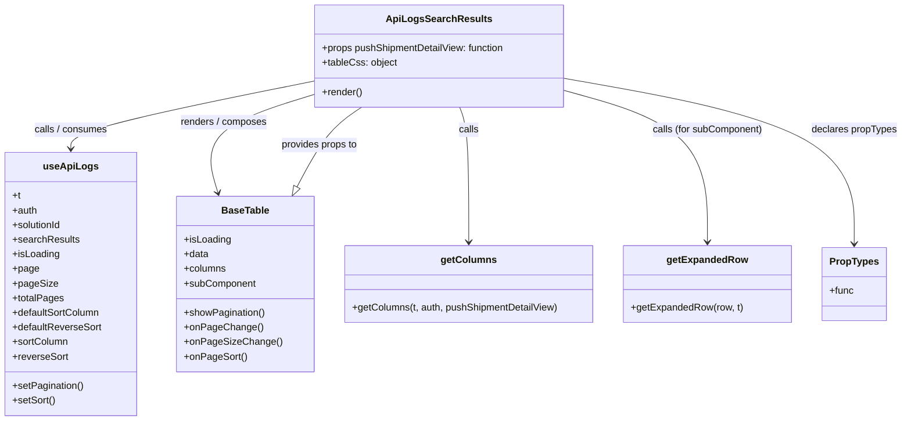

# Diagram: web/portal/src/modules/documentation/api-logs/ApiLogsSearchResults.js


> Auto-generated by Obscura crawlers

## Diagram 1



### SVG

<svg id="container" width="1464.03125" xmlns="http://www.w3.org/2000/svg" class="classDiagram" height="690" viewBox="0 0 1464.03125 690" role="graphics-document document" aria-roledescription="class"><style>#container{font-family:"trebuchet ms",verdana,arial,sans-serif;font-size:16px;fill:#333;}@keyframes edge-animation-frame{from{stroke-dashoffset:0;}}@keyframes dash{to{stroke-dashoffset:0;}}#container .edge-animation-slow{stroke-dasharray:9,5!important;stroke-dashoffset:900;animation:dash 50s linear infinite;stroke-linecap:round;}#container .edge-animation-fast{stroke-dasharray:9,5!important;stroke-dashoffset:900;animation:dash 20s linear infinite;stroke-linecap:round;}#container .error-icon{fill:#552222;}#container .error-text{fill:#552222;stroke:#552222;}#container .edge-thickness-normal{stroke-width:1px;}#container .edge-thickness-thick{stroke-width:3.5px;}#container .edge-pattern-solid{stroke-dasharray:0;}#container .edge-thickness-invisible{stroke-width:0;fill:none;}#container .edge-pattern-dashed{stroke-dasharray:3;}#container .edge-pattern-dotted{stroke-dasharray:2;}#container .marker{fill:#333333;stroke:#333333;}#container .marker.cross{stroke:#333333;}#container svg{font-family:"trebuchet ms",verdana,arial,sans-serif;font-size:16px;}#container p{margin:0;}#container g.classGroup text{fill:#9370DB;stroke:none;font-family:"trebuchet ms",verdana,arial,sans-serif;font-size:10px;}#container g.classGroup text .title{font-weight:bolder;}#container .nodeLabel,#container .edgeLabel{color:#131300;}#container .edgeLabel .label rect{fill:#ECECFF;}#container .label text{fill:#131300;}#container .labelBkg{background:#ECECFF;}#container .edgeLabel .label span{background:#ECECFF;}#container .classTitle{font-weight:bolder;}#container .node rect,#container .node circle,#container .node ellipse,#container .node polygon,#container .node path{fill:#ECECFF;stroke:#9370DB;stroke-width:1px;}#container .divider{stroke:#9370DB;stroke-width:1;}#container g.clickable{cursor:pointer;}#container g.classGroup rect{fill:#ECECFF;stroke:#9370DB;}#container g.classGroup line{stroke:#9370DB;stroke-width:1;}#container .classLabel .box{stroke:none;stroke-width:0;fill:#ECECFF;opacity:0.5;}#container .classLabel .label{fill:#9370DB;font-size:10px;}#container .relation{stroke:#333333;stroke-width:1;fill:none;}#container .dashed-line{stroke-dasharray:3;}#container .dotted-line{stroke-dasharray:1 2;}#container #compositionStart,#container .composition{fill:#333333!important;stroke:#333333!important;stroke-width:1;}#container #compositionEnd,#container .composition{fill:#333333!important;stroke:#333333!important;stroke-width:1;}#container #dependencyStart,#container .dependency{fill:#333333!important;stroke:#333333!important;stroke-width:1;}#container #dependencyStart,#container .dependency{fill:#333333!important;stroke:#333333!important;stroke-width:1;}#container #extensionStart,#container .extension{fill:transparent!important;stroke:#333333!important;stroke-width:1;}#container #extensionEnd,#container .extension{fill:transparent!important;stroke:#333333!important;stroke-width:1;}#container #aggregationStart,#container .aggregation{fill:transparent!important;stroke:#333333!important;stroke-width:1;}#container #aggregationEnd,#container .aggregation{fill:transparent!important;stroke:#333333!important;stroke-width:1;}#container #lollipopStart,#container .lollipop{fill:#ECECFF!important;stroke:#333333!important;stroke-width:1;}#container #lollipopEnd,#container .lollipop{fill:#ECECFF!important;stroke:#333333!important;stroke-width:1;}#container .edgeTerminals{font-size:11px;line-height:initial;}#container .classTitleText{text-anchor:middle;font-size:18px;fill:#333;}#container .label-icon{display:inline-block;height:1em;overflow:visible;vertical-align:-0.125em;}#container .node .label-icon path{fill:currentColor;stroke:revert;stroke-width:revert;}#container :root{--mermaid-font-family:"trebuchet ms",verdana,arial,sans-serif;}</style><g><defs><marker id="container_class-aggregationStart" class="marker aggregation class" refX="18" refY="7" markerWidth="190" markerHeight="240" orient="auto"><path d="M 18,7 L9,13 L1,7 L9,1 Z"></path></marker></defs><defs><marker id="container_class-aggregationEnd" class="marker aggregation class" refX="1" refY="7" markerWidth="20" markerHeight="28" orient="auto"><path d="M 18,7 L9,13 L1,7 L9,1 Z"></path></marker></defs><defs><marker id="container_class-extensionStart" class="marker extension class" refX="18" refY="7" markerWidth="190" markerHeight="240" orient="auto"><path d="M 1,7 L18,13 V 1 Z"></path></marker></defs><defs><marker id="container_class-extensionEnd" class="marker extension class" refX="1" refY="7" markerWidth="20" markerHeight="28" orient="auto"><path d="M 1,1 V 13 L18,7 Z"></path></marker></defs><defs><marker id="container_class-compositionStart" class="marker composition class" refX="18" refY="7" markerWidth="190" markerHeight="240" orient="auto"><path d="M 18,7 L9,13 L1,7 L9,1 Z"></path></marker></defs><defs><marker id="container_class-compositionEnd" class="marker composition class" refX="1" refY="7" markerWidth="20" markerHeight="28" orient="auto"><path d="M 18,7 L9,13 L1,7 L9,1 Z"></path></marker></defs><defs><marker id="container_class-dependencyStart" class="marker dependency class" refX="6" refY="7" markerWidth="190" markerHeight="240" orient="auto"><path d="M 5,7 L9,13 L1,7 L9,1 Z"></path></marker></defs><defs><marker id="container_class-dependencyEnd" class="marker dependency class" refX="13" refY="7" markerWidth="20" markerHeight="28" orient="auto"><path d="M 18,7 L9,13 L14,7 L9,1 Z"></path></marker></defs><defs><marker id="container_class-lollipopStart" class="marker lollipop class" refX="13" refY="7" markerWidth="190" markerHeight="240" orient="auto"><circle stroke="black" fill="transparent" cx="7" cy="7" r="6"></circle></marker></defs><defs><marker id="container_class-lollipopEnd" class="marker lollipop class" refX="1" refY="7" markerWidth="190" markerHeight="240" orient="auto"><circle stroke="black" fill="transparent" cx="7" cy="7" r="6"></circle></marker></defs><g class="root"><g class="clusters"></g><g class="edgePaths"><path d="M506.883,133.379L441.396,146.649C375.909,159.919,244.935,186.46,179.448,204.896C113.961,223.333,113.961,233.667,113.961,238.833L113.961,244" id="id_ApiLogsSearchResults_useApiLogs_1" class="edge-thickness-normal edge-pattern-solid relation" style=";;;" data-edge="true" data-et="edge" data-id="id_ApiLogsSearchResults_useApiLogs_1" data-points="W3sieCI6NTA2Ljg4MjgxMjUsInkiOjEzMy4zNzg3MTgxOTg2NDg0N30seyJ4IjoxMTMuOTYwOTM3NSwieSI6MjEzfSx7IngiOjExMy45NjA5Mzc1LCJ5IjoyNTB9XQ==" marker-end="url(#container_class-dependencyEnd)"></path><path d="M506.883,155.562L476.129,165.135C445.375,174.708,383.867,193.854,358.431,220.638C332.996,247.422,343.632,281.845,348.95,299.056L354.269,316.267" id="id_ApiLogsSearchResults_BaseTable_2" class="edge-thickness-normal edge-pattern-solid relation" style=";;;" data-edge="true" data-et="edge" data-id="id_ApiLogsSearchResults_BaseTable_2" data-points="W3sieCI6NTA2Ljg4MjgxMjUsInkiOjE1NS41NjIyOTgzOTMxNzQ3Nn0seyJ4IjozMjIuMzU5Mzc1LCJ5IjoyMTN9LHsieCI6MzU2LjAzOTg0OTkyNTg4OTMsInkiOjMyMn1d" marker-end="url(#container_class-dependencyEnd)"></path><path d="M745.863,176L748.417,182.167C750.97,188.333,756.077,200.667,758.63,237.5C761.184,274.333,761.184,335.667,761.184,366.333L761.184,397" id="id_ApiLogsSearchResults_getColumns_3" class="edge-thickness-normal edge-pattern-solid relation" style=";;;" data-edge="true" data-et="edge" data-id="id_ApiLogsSearchResults_getColumns_3" data-points="W3sieCI6NzQ1Ljg2MzI4MTI1LCJ5IjoxNzZ9LHsieCI6NzYxLjE4MzU5Mzc1LCJ5IjoyMTN9LHsieCI6NzYxLjE4MzU5Mzc1LCJ5Ijo0MDN9XQ==" marker-end="url(#container_class-dependencyEnd)"></path><path d="M915.281,148.315L954.373,159.096C993.465,169.877,1071.648,191.438,1110.74,232.886C1149.832,274.333,1149.832,335.667,1149.832,366.333L1149.832,397" id="id_ApiLogsSearchResults_getExpandedRow_4" class="edge-thickness-normal edge-pattern-solid relation" style=";;;" data-edge="true" data-et="edge" data-id="id_ApiLogsSearchResults_getExpandedRow_4" data-points="W3sieCI6OTE1LjI4MTI1LCJ5IjoxNDguMzE0NzcwMjk5MTQ1M30seyJ4IjoxMTQ5LjgzMjAzMTI1LCJ5IjoyMTN9LHsieCI6MTE0OS44MzIwMzEyNSwieSI6NDAzfV0=" marker-end="url(#container_class-dependencyEnd)"></path><path d="M915.281,128.624L993.688,142.687C1072.094,156.75,1228.906,184.875,1307.313,230.104C1385.719,275.333,1385.719,337.667,1385.719,368.833L1385.719,400" id="id_ApiLogsSearchResults_PropTypes_5" class="edge-thickness-normal edge-pattern-solid relation" style=";;;" data-edge="true" data-et="edge" data-id="id_ApiLogsSearchResults_PropTypes_5" data-points="W3sieCI6OTE1LjI4MTI1LCJ5IjoxMjguNjI0MzExNjk1NTMwNn0seyJ4IjoxMzg1LjcxODc1LCJ5IjoyMTN9LHsieCI6MTM4NS43MTg3NSwieSI6NDA2fV0=" marker-end="url(#container_class-dependencyEnd)"></path><path d="M482.548,306.662L490.583,291.052C498.618,275.442,514.688,244.221,531.913,222.444C549.138,200.667,567.518,188.333,576.708,182.167L585.898,176" id="id_BaseTable_ApiLogsSearchResults_6" class="edge-thickness-normal edge-pattern-solid relation" style=";;;" data-edge="true" data-et="edge" data-id="id_BaseTable_ApiLogsSearchResults_6" data-points="W3sieCI6NDc0LjY1Mzk4MDM2MDY3MTk0LCJ5IjozMjJ9LHsieCI6NTMwLjc1NzgxMjUsInkiOjIxM30seyJ4Ijo1ODUuODk4Mjc2MDg0NzEwNywieSI6MTc2fV0=" marker-start="url(#container_class-extensionStart)"></path></g><g class="edgeLabels"><g class="edgeLabel" transform="translate(113.9609375, 213)"><g class="label" data-id="id_ApiLogsSearchResults_useApiLogs_1" transform="translate(-61.2109375, -12)"><foreignObject width="122.421875" height="24"><div xmlns="http://www.w3.org/1999/xhtml" class="labelBkg" style="display: table-cell; white-space: nowrap; line-height: 1.5; max-width: 200px; text-align: center;"><span class="edgeLabel"><p>calls / consumes</p></span></div></foreignObject></g></g><g class="edgeLabel" transform="translate(360.15625, 201.23474)"><g class="label" data-id="id_ApiLogsSearchResults_BaseTable_2" transform="translate(-72.59375, -12)"><foreignObject width="145.1875" height="24"><div xmlns="http://www.w3.org/1999/xhtml" class="labelBkg" style="display: table-cell; white-space: nowrap; line-height: 1.5; max-width: 200px; text-align: center;"><span class="edgeLabel"><p>renders / composes</p></span></div></foreignObject></g></g><g class="edgeLabel" transform="translate(761.18359375, 213)"><g class="label" data-id="id_ApiLogsSearchResults_getColumns_3" transform="translate(-16.4453125, -12)"><foreignObject width="32.890625" height="24"><div xmlns="http://www.w3.org/1999/xhtml" class="labelBkg" style="display: table-cell; white-space: nowrap; line-height: 1.5; max-width: 200px; text-align: center;"><span class="edgeLabel"><p>calls</p></span></div></foreignObject></g></g><g class="edgeLabel" transform="translate(1149.83203125, 213)"><g class="label" data-id="id_ApiLogsSearchResults_getExpandedRow_4" transform="translate(-91.265625, -12)"><foreignObject width="182.53125" height="24"><div xmlns="http://www.w3.org/1999/xhtml" class="labelBkg" style="display: table-cell; white-space: nowrap; line-height: 1.5; max-width: 200px; text-align: center;"><span class="edgeLabel"><p>calls (for subComponent)</p></span></div></foreignObject></g></g><g class="edgeLabel" transform="translate(1385.71875, 213)"><g class="label" data-id="id_ApiLogsSearchResults_PropTypes_5" transform="translate(-70.3125, -12)"><foreignObject width="140.625" height="24"><div xmlns="http://www.w3.org/1999/xhtml" class="labelBkg" style="display: table-cell; white-space: nowrap; line-height: 1.5; max-width: 200px; text-align: center;"><span class="edgeLabel"><p>declares propTypes</p></span></div></foreignObject></g></g><g class="edgeLabel" transform="translate(517.90073, 237.97908)"><g class="label" data-id="id_BaseTable_ApiLogsSearchResults_6" transform="translate(-63.7578125, -12)"><foreignObject width="127.515625" height="24"><div xmlns="http://www.w3.org/1999/xhtml" class="labelBkg" style="display: table-cell; white-space: nowrap; line-height: 1.5; max-width: 200px; text-align: center;"><span class="edgeLabel"><p>provides props to</p></span></div></foreignObject></g></g></g><g class="nodes"><g class="node default" id="classId-ApiLogsSearchResults-0" transform="translate(711.08203125, 92)"><g class="basic label-container"><path d="M-204.19921875 -84 L204.19921875 -84 L204.19921875 84 L-204.19921875 84" stroke="none" stroke-width="0" fill="#ECECFF" style=""></path><path d="M-204.19921875 -84 C-51.90914729677698 -84, 100.38092415644604 -84, 204.19921875 -84 M-204.19921875 -84 C-64.01079918357968 -84, 76.17762038284064 -84, 204.19921875 -84 M204.19921875 -84 C204.19921875 -46.617647443771915, 204.19921875 -9.23529488754383, 204.19921875 84 M204.19921875 -84 C204.19921875 -20.020460774742098, 204.19921875 43.959078450515804, 204.19921875 84 M204.19921875 84 C87.7793862971086 84, -28.640446155782797 84, -204.19921875 84 M204.19921875 84 C58.31868591816777 84, -87.56184691366445 84, -204.19921875 84 M-204.19921875 84 C-204.19921875 22.358924303377215, -204.19921875 -39.28215139324557, -204.19921875 -84 M-204.19921875 84 C-204.19921875 37.415300373473485, -204.19921875 -9.16939925305303, -204.19921875 -84" stroke="#9370DB" stroke-width="1.3" fill="none" stroke-dasharray="0 0" style=""></path></g><g class="annotation-group text" transform="translate(0, -60)"></g><g class="label-group text" transform="translate(-80.2421875, -60)"><g class="label" style="font-weight: bolder" transform="translate(0,-12)"><foreignObject width="160.484375" height="24"><div xmlns="http://www.w3.org/1999/xhtml" style="display: table-cell; white-space: nowrap; line-height: 1.5; max-width: 207px; text-align: center;"><span class="nodeLabel markdown-node-label" style=""><p>ApiLogsSearchResults</p></span></div></foreignObject></g></g><g class="members-group text" transform="translate(-192.19921875, -12)"><g class="label" style="" transform="translate(0,-12)"><foreignObject width="304.15625" height="24"><div xmlns="http://www.w3.org/1999/xhtml" style="display: table-cell; white-space: nowrap; line-height: 1.5; max-width: 362px; text-align: center;"><span class="nodeLabel markdown-node-label" style=""><p>+props pushShipmentDetailView: function</p></span></div></foreignObject></g><g class="label" style="" transform="translate(0,12)"><foreignObject width="122.203125" height="24"><div xmlns="http://www.w3.org/1999/xhtml" style="display: table-cell; white-space: nowrap; line-height: 1.5; max-width: 180px; text-align: center;"><span class="nodeLabel markdown-node-label" style=""><p>+tableCss: object</p></span></div></foreignObject></g></g><g class="methods-group text" transform="translate(-192.19921875, 60)"><g class="label" style="" transform="translate(0,-12)"><foreignObject width="66.609375" height="24"><div xmlns="http://www.w3.org/1999/xhtml" style="display: table-cell; white-space: nowrap; line-height: 1.5; max-width: 124px; text-align: center;"><span class="nodeLabel markdown-node-label" style=""><p>+render()</p></span></div></foreignObject></g></g><g class="divider" style=""><path d="M-204.19921875 -36 C-89.94145935774198 -36, 24.316300034516047 -36, 204.19921875 -36 M-204.19921875 -36 C-108.86749669293232 -36, -13.535774635864641 -36, 204.19921875 -36" stroke="#9370DB" stroke-width="1.3" fill="none" stroke-dasharray="0 0" style=""></path></g><g class="divider" style=""><path d="M-204.19921875 36 C-99.83237340422025 36, 4.534471941559502 36, 204.19921875 36 M-204.19921875 36 C-112.32892050686497 36, -20.45862226372995 36, 204.19921875 36" stroke="#9370DB" stroke-width="1.3" fill="none" stroke-dasharray="0 0" style=""></path></g></g><g class="node default" id="classId-BaseTable-1" transform="translate(400.53515625, 466)"><g class="basic label-container"><path d="M-107.03125 -144 L107.03125 -144 L107.03125 144 L-107.03125 144" stroke="none" stroke-width="0" fill="#ECECFF" style=""></path><path d="M-107.03125 -144 C-54.01190198653834 -144, -0.9925539730766815 -144, 107.03125 -144 M-107.03125 -144 C-37.50569249724235 -144, 32.0198650055153 -144, 107.03125 -144 M107.03125 -144 C107.03125 -48.085924820757725, 107.03125 47.82815035848455, 107.03125 144 M107.03125 -144 C107.03125 -33.668068503570154, 107.03125 76.66386299285969, 107.03125 144 M107.03125 144 C47.82513832149539 144, -11.380973357009225 144, -107.03125 144 M107.03125 144 C22.2603123172384 144, -62.5106253655232 144, -107.03125 144 M-107.03125 144 C-107.03125 77.31124139441995, -107.03125 10.622482788839903, -107.03125 -144 M-107.03125 144 C-107.03125 46.74998425337968, -107.03125 -50.50003149324064, -107.03125 -144" stroke="#9370DB" stroke-width="1.3" fill="none" stroke-dasharray="0 0" style=""></path></g><g class="annotation-group text" transform="translate(0, -120)"></g><g class="label-group text" transform="translate(-37.359375, -120)"><g class="label" style="font-weight: bolder" transform="translate(0,-12)"><foreignObject width="74.71875" height="24"><div xmlns="http://www.w3.org/1999/xhtml" style="display: table-cell; white-space: nowrap; line-height: 1.5; max-width: 123px; text-align: center;"><span class="nodeLabel markdown-node-label" style=""><p>BaseTable</p></span></div></foreignObject></g></g><g class="members-group text" transform="translate(-95.03125, -72)"><g class="label" style="" transform="translate(0,-12)"><foreignObject width="77.203125" height="24"><div xmlns="http://www.w3.org/1999/xhtml" style="display: table-cell; white-space: nowrap; line-height: 1.5; max-width: 135px; text-align: center;"><span class="nodeLabel markdown-node-label" style=""><p>+isLoading</p></span></div></foreignObject></g><g class="label" style="" transform="translate(0,12)"><foreignObject width="40.625" height="24"><div xmlns="http://www.w3.org/1999/xhtml" style="display: table-cell; white-space: nowrap; line-height: 1.5; max-width: 98px; text-align: center;"><span class="nodeLabel markdown-node-label" style=""><p>+data</p></span></div></foreignObject></g><g class="label" style="" transform="translate(0,36)"><foreignObject width="69.21875" height="24"><div xmlns="http://www.w3.org/1999/xhtml" style="display: table-cell; white-space: nowrap; line-height: 1.5; max-width: 127px; text-align: center;"><span class="nodeLabel markdown-node-label" style=""><p>+columns</p></span></div></foreignObject></g><g class="label" style="" transform="translate(0,60)"><foreignObject width="118.078125" height="24"><div xmlns="http://www.w3.org/1999/xhtml" style="display: table-cell; white-space: nowrap; line-height: 1.5; max-width: 176px; text-align: center;"><span class="nodeLabel markdown-node-label" style=""><p>+subComponent</p></span></div></foreignObject></g></g><g class="methods-group text" transform="translate(-95.03125, 48)"><g class="label" style="" transform="translate(0,-12)"><foreignObject width="132.90625" height="24"><div xmlns="http://www.w3.org/1999/xhtml" style="display: table-cell; white-space: nowrap; line-height: 1.5; max-width: 190px; text-align: center;"><span class="nodeLabel markdown-node-label" style=""><p>+showPagination()</p></span></div></foreignObject></g><g class="label" style="" transform="translate(0,12)"><foreignObject width="123.859375" height="24"><div xmlns="http://www.w3.org/1999/xhtml" style="display: table-cell; white-space: nowrap; line-height: 1.5; max-width: 181px; text-align: center;"><span class="nodeLabel markdown-node-label" style=""><p>+onPageChange()</p></span></div></foreignObject></g><g class="label" style="" transform="translate(0,36)"><foreignObject width="152.703125" height="24"><div xmlns="http://www.w3.org/1999/xhtml" style="display: table-cell; white-space: nowrap; line-height: 1.5; max-width: 210px; text-align: center;"><span class="nodeLabel markdown-node-label" style=""><p>+onPageSizeChange()</p></span></div></foreignObject></g><g class="label" style="" transform="translate(0,60)"><foreignObject width="100.84375" height="24"><div xmlns="http://www.w3.org/1999/xhtml" style="display: table-cell; white-space: nowrap; line-height: 1.5; max-width: 158px; text-align: center;"><span class="nodeLabel markdown-node-label" style=""><p>+onPageSort()</p></span></div></foreignObject></g></g><g class="divider" style=""><path d="M-107.03125 -96 C-50.893643304390594 -96, 5.243963391218813 -96, 107.03125 -96 M-107.03125 -96 C-51.13546239314494 -96, 4.760325213710118 -96, 107.03125 -96" stroke="#9370DB" stroke-width="1.3" fill="none" stroke-dasharray="0 0" style=""></path></g><g class="divider" style=""><path d="M-107.03125 24 C-22.656590597353897 24, 61.718068805292205 24, 107.03125 24 M-107.03125 24 C-61.459308021221645 24, -15.88736604244329 24, 107.03125 24" stroke="#9370DB" stroke-width="1.3" fill="none" stroke-dasharray="0 0" style=""></path></g></g><g class="node default" id="classId-useApiLogs-2" transform="translate(113.9609375, 466)"><g class="basic label-container"><path d="M-105.9609375 -216 L105.9609375 -216 L105.9609375 216 L-105.9609375 216" stroke="none" stroke-width="0" fill="#ECECFF" style=""></path><path d="M-105.9609375 -216 C-48.6910989317611 -216, 8.578739636477806 -216, 105.9609375 -216 M-105.9609375 -216 C-27.826114204325847 -216, 50.308709091348305 -216, 105.9609375 -216 M105.9609375 -216 C105.9609375 -111.59297030338965, 105.9609375 -7.1859406067792975, 105.9609375 216 M105.9609375 -216 C105.9609375 -44.915411067531096, 105.9609375 126.16917786493781, 105.9609375 216 M105.9609375 216 C27.75718257539802 216, -50.44657234920396 216, -105.9609375 216 M105.9609375 216 C62.843132752308506 216, 19.725328004617012 216, -105.9609375 216 M-105.9609375 216 C-105.9609375 71.47812049955746, -105.9609375 -73.04375900088507, -105.9609375 -216 M-105.9609375 216 C-105.9609375 71.23244522384488, -105.9609375 -73.53510955231025, -105.9609375 -216" stroke="#9370DB" stroke-width="1.3" fill="none" stroke-dasharray="0 0" style=""></path></g><g class="annotation-group text" transform="translate(0, -192)"></g><g class="label-group text" transform="translate(-41.390625, -192)"><g class="label" style="font-weight: bolder" transform="translate(0,-12)"><foreignObject width="82.78125" height="24"><div xmlns="http://www.w3.org/1999/xhtml" style="display: table-cell; white-space: nowrap; line-height: 1.5; max-width: 131px; text-align: center;"><span class="nodeLabel markdown-node-label" style=""><p>useApiLogs</p></span></div></foreignObject></g></g><g class="members-group text" transform="translate(-93.9609375, -144)"><g class="label" style="" transform="translate(0,-12)"><foreignObject width="13.6875" height="24"><div xmlns="http://www.w3.org/1999/xhtml" style="display: table-cell; white-space: nowrap; line-height: 1.5; max-width: 71px; text-align: center;"><span class="nodeLabel markdown-node-label" style=""><p>+t</p></span></div></foreignObject></g><g class="label" style="" transform="translate(0,12)"><foreignObject width="40.921875" height="24"><div xmlns="http://www.w3.org/1999/xhtml" style="display: table-cell; white-space: nowrap; line-height: 1.5; max-width: 98px; text-align: center;"><span class="nodeLabel markdown-node-label" style=""><p>+auth</p></span></div></foreignObject></g><g class="label" style="" transform="translate(0,36)"><foreignObject width="82.109375" height="24"><div xmlns="http://www.w3.org/1999/xhtml" style="display: table-cell; white-space: nowrap; line-height: 1.5; max-width: 139px; text-align: center;"><span class="nodeLabel markdown-node-label" style=""><p>+solutionId</p></span></div></foreignObject></g><g class="label" style="" transform="translate(0,60)"><foreignObject width="108.328125" height="24"><div xmlns="http://www.w3.org/1999/xhtml" style="display: table-cell; white-space: nowrap; line-height: 1.5; max-width: 166px; text-align: center;"><span class="nodeLabel markdown-node-label" style=""><p>+searchResults</p></span></div></foreignObject></g><g class="label" style="" transform="translate(0,84)"><foreignObject width="77.203125" height="24"><div xmlns="http://www.w3.org/1999/xhtml" style="display: table-cell; white-space: nowrap; line-height: 1.5; max-width: 135px; text-align: center;"><span class="nodeLabel markdown-node-label" style=""><p>+isLoading</p></span></div></foreignObject></g><g class="label" style="" transform="translate(0,108)"><foreignObject width="42.65625" height="24"><div xmlns="http://www.w3.org/1999/xhtml" style="display: table-cell; white-space: nowrap; line-height: 1.5; max-width: 100px; text-align: center;"><span class="nodeLabel markdown-node-label" style=""><p>+page</p></span></div></foreignObject></g><g class="label" style="" transform="translate(0,132)"><foreignObject width="71.5" height="24"><div xmlns="http://www.w3.org/1999/xhtml" style="display: table-cell; white-space: nowrap; line-height: 1.5; max-width: 129px; text-align: center;"><span class="nodeLabel markdown-node-label" style=""><p>+pageSize</p></span></div></foreignObject></g><g class="label" style="" transform="translate(0,156)"><foreignObject width="82.90625" height="24"><div xmlns="http://www.w3.org/1999/xhtml" style="display: table-cell; white-space: nowrap; line-height: 1.5; max-width: 140px; text-align: center;"><span class="nodeLabel markdown-node-label" style=""><p>+totalPages</p></span></div></foreignObject></g><g class="label" style="" transform="translate(0,180)"><foreignObject width="144.859375" height="24"><div xmlns="http://www.w3.org/1999/xhtml" style="display: table-cell; white-space: nowrap; line-height: 1.5; max-width: 202px; text-align: center;"><span class="nodeLabel markdown-node-label" style=""><p>+defaultSortColumn</p></span></div></foreignObject></g><g class="label" style="" transform="translate(0,204)"><foreignObject width="146.53125" height="24"><div xmlns="http://www.w3.org/1999/xhtml" style="display: table-cell; white-space: nowrap; line-height: 1.5; max-width: 204px; text-align: center;"><span class="nodeLabel markdown-node-label" style=""><p>+defaultReverseSort</p></span></div></foreignObject></g><g class="label" style="" transform="translate(0,228)"><foreignObject width="91.828125" height="24"><div xmlns="http://www.w3.org/1999/xhtml" style="display: table-cell; white-space: nowrap; line-height: 1.5; max-width: 149px; text-align: center;"><span class="nodeLabel markdown-node-label" style=""><p>+sortColumn</p></span></div></foreignObject></g><g class="label" style="" transform="translate(0,252)"><foreignObject width="91.015625" height="24"><div xmlns="http://www.w3.org/1999/xhtml" style="display: table-cell; white-space: nowrap; line-height: 1.5; max-width: 149px; text-align: center;"><span class="nodeLabel markdown-node-label" style=""><p>+reverseSort</p></span></div></foreignObject></g></g><g class="methods-group text" transform="translate(-93.9609375, 168)"><g class="label" style="" transform="translate(0,-12)"><foreignObject width="117.203125" height="24"><div xmlns="http://www.w3.org/1999/xhtml" style="display: table-cell; white-space: nowrap; line-height: 1.5; max-width: 175px; text-align: center;"><span class="nodeLabel markdown-node-label" style=""><p>+setPagination()</p></span></div></foreignObject></g><g class="label" style="" transform="translate(0,12)"><foreignObject width="70.34375" height="24"><div xmlns="http://www.w3.org/1999/xhtml" style="display: table-cell; white-space: nowrap; line-height: 1.5; max-width: 128px; text-align: center;"><span class="nodeLabel markdown-node-label" style=""><p>+setSort()</p></span></div></foreignObject></g></g><g class="divider" style=""><path d="M-105.9609375 -168 C-51.1807367137692 -168, 3.5994640724616005 -168, 105.9609375 -168 M-105.9609375 -168 C-33.45336110755973 -168, 39.05421528488054 -168, 105.9609375 -168" stroke="#9370DB" stroke-width="1.3" fill="none" stroke-dasharray="0 0" style=""></path></g><g class="divider" style=""><path d="M-105.9609375 144 C-23.81187717688762 144, 58.33718314622476 144, 105.9609375 144 M-105.9609375 144 C-53.486509918635775 144, -1.0120823372715506 144, 105.9609375 144" stroke="#9370DB" stroke-width="1.3" fill="none" stroke-dasharray="0 0" style=""></path></g></g><g class="node default" id="classId-getColumns-3" transform="translate(761.18359375, 466)"><g class="basic label-container"><path d="M-203.6171875 -63 L203.6171875 -63 L203.6171875 63 L-203.6171875 63" stroke="none" stroke-width="0" fill="#ECECFF" style=""></path><path d="M-203.6171875 -63 C-118.4349415773266 -63, -33.252695654653195 -63, 203.6171875 -63 M-203.6171875 -63 C-46.24521450097666 -63, 111.12675849804668 -63, 203.6171875 -63 M203.6171875 -63 C203.6171875 -32.6586413702593, 203.6171875 -2.317282740518614, 203.6171875 63 M203.6171875 -63 C203.6171875 -23.89933040753415, 203.6171875 15.201339184931697, 203.6171875 63 M203.6171875 63 C62.6455193597437 63, -78.3261487805126 63, -203.6171875 63 M203.6171875 63 C84.42189915140128 63, -34.773389197197446 63, -203.6171875 63 M-203.6171875 63 C-203.6171875 36.85201177654267, -203.6171875 10.704023553085335, -203.6171875 -63 M-203.6171875 63 C-203.6171875 20.03780832079908, -203.6171875 -22.92438335840184, -203.6171875 -63" stroke="#9370DB" stroke-width="1.3" fill="none" stroke-dasharray="0 0" style=""></path></g><g class="annotation-group text" transform="translate(0, -39)"></g><g class="label-group text" transform="translate(-43.046875, -39)"><g class="label" style="font-weight: bolder" transform="translate(0,-12)"><foreignObject width="86.09375" height="24"><div xmlns="http://www.w3.org/1999/xhtml" style="display: table-cell; white-space: nowrap; line-height: 1.5; max-width: 135px; text-align: center;"><span class="nodeLabel markdown-node-label" style=""><p>getColumns</p></span></div></foreignObject></g></g><g class="members-group text" transform="translate(-191.6171875, 9)"></g><g class="methods-group text" transform="translate(-191.6171875, 39)"><g class="label" style="" transform="translate(0,-12)"><foreignObject width="340.1875" height="24"><div xmlns="http://www.w3.org/1999/xhtml" style="display: table-cell; white-space: nowrap; line-height: 1.5; max-width: 398px; text-align: center;"><span class="nodeLabel markdown-node-label" style=""><p>+getColumns(t, auth, pushShipmentDetailView)</p></span></div></foreignObject></g></g><g class="divider" style=""><path d="M-203.6171875 -15 C-57.986902696160456 -15, 87.64338210767909 -15, 203.6171875 -15 M-203.6171875 -15 C-77.12466124230153 -15, 49.367865015396944 -15, 203.6171875 -15" stroke="#9370DB" stroke-width="1.3" fill="none" stroke-dasharray="0 0" style=""></path></g><g class="divider" style=""><path d="M-203.6171875 9 C-106.26736360684231 9, -8.917539713684619 9, 203.6171875 9 M-203.6171875 9 C-63.42467007179329 9, 76.76784735641343 9, 203.6171875 9" stroke="#9370DB" stroke-width="1.3" fill="none" stroke-dasharray="0 0" style=""></path></g></g><g class="node default" id="classId-getExpandedRow-4" transform="translate(1149.83203125, 466)"><g class="basic label-container"><path d="M-135.03125 -63 L135.03125 -63 L135.03125 63 L-135.03125 63" stroke="none" stroke-width="0" fill="#ECECFF" style=""></path><path d="M-135.03125 -63 C-33.58776100749749 -63, 67.85572798500502 -63, 135.03125 -63 M-135.03125 -63 C-45.872646615321955 -63, 43.28595676935609 -63, 135.03125 -63 M135.03125 -63 C135.03125 -26.41717176589122, 135.03125 10.165656468217563, 135.03125 63 M135.03125 -63 C135.03125 -17.03147279186608, 135.03125 28.93705441626784, 135.03125 63 M135.03125 63 C39.95144624127444 63, -55.12835751745112 63, -135.03125 63 M135.03125 63 C74.73327448938122 63, 14.435298978762418 63, -135.03125 63 M-135.03125 63 C-135.03125 32.77136210776581, -135.03125 2.5427242155316208, -135.03125 -63 M-135.03125 63 C-135.03125 18.891122969926947, -135.03125 -25.217754060146106, -135.03125 -63" stroke="#9370DB" stroke-width="1.3" fill="none" stroke-dasharray="0 0" style=""></path></g><g class="annotation-group text" transform="translate(0, -39)"></g><g class="label-group text" transform="translate(-63.234375, -39)"><g class="label" style="font-weight: bolder" transform="translate(0,-12)"><foreignObject width="126.46875" height="24"><div xmlns="http://www.w3.org/1999/xhtml" style="display: table-cell; white-space: nowrap; line-height: 1.5; max-width: 175px; text-align: center;"><span class="nodeLabel markdown-node-label" style=""><p>getExpandedRow</p></span></div></foreignObject></g></g><g class="members-group text" transform="translate(-123.03125, 9)"></g><g class="methods-group text" transform="translate(-123.03125, 39)"><g class="label" style="" transform="translate(0,-12)"><foreignObject width="182.828125" height="24"><div xmlns="http://www.w3.org/1999/xhtml" style="display: table-cell; white-space: nowrap; line-height: 1.5; max-width: 240px; text-align: center;"><span class="nodeLabel markdown-node-label" style=""><p>+getExpandedRow(row, t)</p></span></div></foreignObject></g></g><g class="divider" style=""><path d="M-135.03125 -15 C-28.318543659733365 -15, 78.39416268053327 -15, 135.03125 -15 M-135.03125 -15 C-74.44343825198624 -15, -13.85562650397246 -15, 135.03125 -15" stroke="#9370DB" stroke-width="1.3" fill="none" stroke-dasharray="0 0" style=""></path></g><g class="divider" style=""><path d="M-135.03125 9 C-56.91005753402804 9, 21.211134931943917 9, 135.03125 9 M-135.03125 9 C-40.70077692864935 9, 53.629696142701306 9, 135.03125 9" stroke="#9370DB" stroke-width="1.3" fill="none" stroke-dasharray="0 0" style=""></path></g></g><g class="node default" id="classId-PropTypes-5" transform="translate(1385.71875, 466)"><g class="basic label-container"><path d="M-50.85546875 -60 L50.85546875 -60 L50.85546875 60 L-50.85546875 60" stroke="none" stroke-width="0" fill="#ECECFF" style=""></path><path d="M-50.85546875 -60 C-25.371154716816115 -60, 0.11315931636777066 -60, 50.85546875 -60 M-50.85546875 -60 C-21.81972461031159 -60, 7.216019529376823 -60, 50.85546875 -60 M50.85546875 -60 C50.85546875 -31.130487300418196, 50.85546875 -2.2609746008363913, 50.85546875 60 M50.85546875 -60 C50.85546875 -21.75909276637418, 50.85546875 16.48181446725164, 50.85546875 60 M50.85546875 60 C19.269037340637357 60, -12.317394068725285 60, -50.85546875 60 M50.85546875 60 C22.708855681693613 60, -5.437757386612773 60, -50.85546875 60 M-50.85546875 60 C-50.85546875 32.276928433008294, -50.85546875 4.553856866016595, -50.85546875 -60 M-50.85546875 60 C-50.85546875 30.6897725167642, -50.85546875 1.3795450335284016, -50.85546875 -60" stroke="#9370DB" stroke-width="1.3" fill="none" stroke-dasharray="0 0" style=""></path></g><g class="annotation-group text" transform="translate(0, -36)"></g><g class="label-group text" transform="translate(-38.2578125, -36)"><g class="label" style="font-weight: bolder" transform="translate(0,-12)"><foreignObject width="76.515625" height="24"><div xmlns="http://www.w3.org/1999/xhtml" style="display: table-cell; white-space: nowrap; line-height: 1.5; max-width: 125px; text-align: center;"><span class="nodeLabel markdown-node-label" style=""><p>PropTypes</p></span></div></foreignObject></g></g><g class="members-group text" transform="translate(-38.85546875, 12)"><g class="label" style="" transform="translate(0,-12)"><foreignObject width="39.453125" height="24"><div xmlns="http://www.w3.org/1999/xhtml" style="display: table-cell; white-space: nowrap; line-height: 1.5; max-width: 97px; text-align: center;"><span class="nodeLabel markdown-node-label" style=""><p>+func</p></span></div></foreignObject></g></g><g class="methods-group text" transform="translate(-38.85546875, 60)"></g><g class="divider" style=""><path d="M-50.85546875 -12 C-19.067759598641384 -12, 12.719949552717232 -12, 50.85546875 -12 M-50.85546875 -12 C-24.35941043411222 -12, 2.136647881775559 -12, 50.85546875 -12" stroke="#9370DB" stroke-width="1.3" fill="none" stroke-dasharray="0 0" style=""></path></g><g class="divider" style=""><path d="M-50.85546875 36 C-16.58882816963986 36, 17.67781241072028 36, 50.85546875 36 M-50.85546875 36 C-11.021233329586714 36, 28.813002090826572 36, 50.85546875 36" stroke="#9370DB" stroke-width="1.3" fill="none" stroke-dasharray="0 0" style=""></path></g></g></g></g></g></svg>

## Diagram 2

```mermaid
flowchart TD
    A[useApiLogs hook] -->|provides data| B[ApiLogsSearchResults component]
    B -->|calls getColumns(t, auth, pushShipmentDetailView)| C[getColumns]
    B -->|creates expandedRow using row -> getExpandedRow(row, t)| D[getExpandedRow]
    B -->|passes props| E[BaseTable]
    E --> F[Render table rows]
    E --> G[Pagination controls]
    G -->|onPageChange(newPage)| H[setPagination(solutionId, newPage, pageSize)]
    G -->|onPageSizeChange(newPageSize)| I[setPagination(solutionId, 0, newPageSize)]
    E --> J[Sorting controls]
    J -->|onPageSort(column, isReverse)| K[setSort(solutionId, column, isReverse)]
    H --> A
    I --> A
    K --> A
```

> SVG rendering failed for this diagram.
