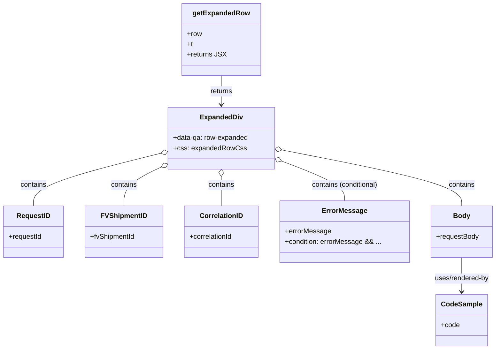

# Diagram: web/portal/src/modules/documentation/api-logs/ApiLogsTableExpandedRow.js

> Auto-generated by Obscura crawlers

## Mermaid

### SVG

<svg id="container" width="1151.03125" xmlns="http://www.w3.org/2000/svg" class="classDiagram" height="814" viewBox="0 0 1151.03125 814" role="graphics-document document" aria-roledescription="class"><g><defs><marker id="container_class-aggregationStart" class="marker aggregation class" refX="18" refY="7" markerWidth="190" markerHeight="240" orient="auto"><path d="M 18,7 L9,13 L1,7 L9,1 Z"></path></marker></defs><defs><marker id="container_class-aggregationEnd" class="marker aggregation class" refX="1" refY="7" markerWidth="20" markerHeight="28" orient="auto"><path d="M 18,7 L9,13 L1,7 L9,1 Z"></path></marker></defs><defs><marker id="container_class-extensionStart" class="marker extension class" refX="18" refY="7" markerWidth="190" markerHeight="240" orient="auto"><path d="M 1,7 L18,13 V 1 Z"></path></marker></defs><defs><marker id="container_class-extensionEnd" class="marker extension class" refX="1" refY="7" markerWidth="20" markerHeight="28" orient="auto"><path d="M 1,1 V 13 L18,7 Z"></path></marker></defs><defs><marker id="container_class-compositionStart" class="marker composition class" refX="18" refY="7" markerWidth="190" markerHeight="240" orient="auto"><path d="M 18,7 L9,13 L1,7 L9,1 Z"></path></marker></defs><defs><marker id="container_class-compositionEnd" class="marker composition class" refX="1" refY="7" markerWidth="20" markerHeight="28" orient="auto"><path d="M 18,7 L9,13 L1,7 L9,1 Z"></path></marker></defs><defs><marker id="container_class-dependencyStart" class="marker dependency class" refX="6" refY="7" markerWidth="190" markerHeight="240" orient="auto"><path d="M 5,7 L9,13 L1,7 L9,1 Z"></path></marker></defs><defs><marker id="container_class-dependencyEnd" class="marker dependency class" refX="13" refY="7" markerWidth="20" markerHeight="28" orient="auto"><path d="M 18,7 L9,13 L14,7 L9,1 Z"></path></marker></defs><defs><marker id="container_class-lollipopStart" class="marker lollipop class" refX="13" refY="7" markerWidth="190" markerHeight="240" orient="auto"><circle stroke="black" fill="transparent" cx="7" cy="7" r="6"></circle></marker></defs><defs><marker id="container_class-lollipopEnd" class="marker lollipop class" refX="1" refY="7" markerWidth="190" markerHeight="240" orient="auto"><circle stroke="black" fill="transparent" cx="7" cy="7" r="6"></circle></marker></defs><g class="root"><g class="clusters"></g><g class="edgePaths"><path d="M514.273,176L514.273,182.167C514.273,188.333,514.273,200.667,514.273,212C514.273,223.333,514.273,233.667,514.273,238.833L514.273,244" id="id_getExpandedRow_ExpandedDiv_1" class="edge-thickness-normal edge-pattern-solid relation" style=";;;" data-edge="true" data-et="edge" data-id="id_getExpandedRow_ExpandedDiv_1" data-points="W3sieCI6NTE0LjI3MzQzNzUsInkiOjE3Nn0seyJ4Ijo1MTQuMjczNDM3NSwieSI6MjEzfSx7IngiOjUxNC4yNzM0Mzc1LCJ5IjoyNTB9XQ==" marker-end="url(#container_class-dependencyEnd)"></path><path d="M372.822,357.303L323.608,369.586C274.394,381.869,175.967,406.434,126.753,426.884C77.539,447.333,77.539,463.667,77.539,471.833L77.539,480" id="id_ExpandedDiv_RequestID_2" class="edge-thickness-normal edge-pattern-solid relation" style=";;;" data-edge="true" data-et="edge" data-id="id_ExpandedDiv_RequestID_2" data-points="W3sieCI6Mzg5LjU1ODU5Mzc1LCJ5IjozNTMuMTI2MjgzNDk2MTE4Mn0seyJ4Ijo3Ny41MzkwNjI1LCJ5Ijo0MzF9LHsieCI6NzcuNTM5MDYyNSwieSI6NDgwfV0=" marker-start="url(#container_class-aggregationStart)"></path><path d="M374.006,389.29L359.514,396.241C345.023,403.193,316.041,417.097,301.55,432.215C287.059,447.333,287.059,463.667,287.059,471.833L287.059,480" id="id_ExpandedDiv_FVShipmentID_3" class="edge-thickness-normal edge-pattern-solid relation" style=";;;" data-edge="true" data-et="edge" data-id="id_ExpandedDiv_FVShipmentID_3" data-points="W3sieCI6Mzg5LjU1ODU5Mzc1LCJ5IjozODEuODI4NDc2NjI3NjQxMX0seyJ4IjoyODcuMDU4NTkzNzUsInkiOjQzMX0seyJ4IjoyODcuMDU4NTkzNzUsInkiOjQ4MH1d" marker-start="url(#container_class-aggregationStart)"></path><path d="M514.273,411.25L514.273,414.542C514.273,417.833,514.273,424.417,514.273,435.875C514.273,447.333,514.273,463.667,514.273,471.833L514.273,480" id="id_ExpandedDiv_CorrelationID_4" class="edge-thickness-normal edge-pattern-solid relation" style=";;;" data-edge="true" data-et="edge" data-id="id_ExpandedDiv_CorrelationID_4" data-points="W3sieCI6NTE0LjI3MzQzNzUsInkiOjM5NH0seyJ4Ijo1MTQuMjczNDM3NSwieSI6NDMxfSx7IngiOjUxNC4yNzM0Mzc1LCJ5Ijo0ODB9XQ==" marker-start="url(#container_class-aggregationStart)"></path><path d="M655.113,375.52L679.446,384.767C703.779,394.014,752.444,412.507,776.777,427.92C801.109,443.333,801.109,455.667,801.109,461.833L801.109,468" id="id_ExpandedDiv_ErrorMessage_5" class="edge-thickness-normal edge-pattern-solid relation" style=";;;" data-edge="true" data-et="edge" data-id="id_ExpandedDiv_ErrorMessage_5" data-points="W3sieCI6NjM4Ljk4ODI4MTI1LCJ5IjozNjkuMzkyNjU5Njc1ODgxOH0seyJ4Ijo4MDEuMTA5Mzc1LCJ5Ijo0MzF9LHsieCI6ODAxLjEwOTM3NSwieSI6NDY4fV0=" marker-start="url(#container_class-aggregationStart)"></path><path d="M655.918,349.689L725.243,363.241C794.569,376.793,933.22,403.896,1002.546,425.615C1071.871,447.333,1071.871,463.667,1071.871,471.833L1071.871,480" id="id_ExpandedDiv_Body_6" class="edge-thickness-normal edge-pattern-solid relation" style=";;;" data-edge="true" data-et="edge" data-id="id_ExpandedDiv_Body_6" data-points="W3sieCI6NjM4Ljk4ODI4MTI1LCJ5IjozNDYuMzc5NDM4ODU5NTA0N30seyJ4IjoxMDcxLjg3MTA5Mzc1LCJ5Ijo0MzF9LHsieCI6MTA3MS44NzEwOTM3NSwieSI6NDgwfV0=" marker-start="url(#container_class-aggregationStart)"></path><path d="M1071.871,600L1071.871,608.167C1071.871,616.333,1071.871,632.667,1071.871,646C1071.871,659.333,1071.871,669.667,1071.871,674.833L1071.871,680" id="id_Body_CodeSample_7" class="edge-thickness-normal edge-pattern-solid relation" style=";;;" data-edge="true" data-et="edge" data-id="id_Body_CodeSample_7" data-points="W3sieCI6MTA3MS44NzEwOTM3NSwieSI6NjAwfSx7IngiOjEwNzEuODcxMDkzNzUsInkiOjY0OX0seyJ4IjoxMDcxLjg3MTA5Mzc1LCJ5Ijo2ODZ9XQ==" marker-end="url(#container_class-dependencyEnd)"></path></g><g class="edgeLabels"><g class="edgeLabel" transform="translate(514.2734375, 213)"><g class="label" data-id="id_getExpandedRow_ExpandedDiv_1" transform="translate(-26.265625, -12)"><foreignObject width="52.53125" height="24">

returns

</foreignObject></g></g><g class="edgeLabel" transform="translate(77.5390625, 431)"><g class="label" data-id="id_ExpandedDiv_RequestID_2" transform="translate(-30.890625, -12)"><foreignObject width="61.78125" height="24">

contains

</foreignObject></g></g><g class="edgeLabel" transform="translate(287.05859375, 431)"><g class="label" data-id="id_ExpandedDiv_FVShipmentID_3" transform="translate(-30.890625, -12)"><foreignObject width="61.78125" height="24">

contains

</foreignObject></g></g><g class="edgeLabel" transform="translate(514.2734375, 431)"><g class="label" data-id="id_ExpandedDiv_CorrelationID_4" transform="translate(-30.890625, -12)"><foreignObject width="61.78125" height="24">

contains

</foreignObject></g></g><g class="edgeLabel" transform="translate(801.109375, 431)"><g class="label" data-id="id_ExpandedDiv_ErrorMessage_5" transform="translate(-79.3828125, -12)"><foreignObject width="158.765625" height="24">

contains (conditional)

</foreignObject></g></g><g class="edgeLabel" transform="translate(1071.87109375, 431)"><g class="label" data-id="id_ExpandedDiv_Body_6" transform="translate(-30.890625, -12)"><foreignObject width="61.78125" height="24">

contains

</foreignObject></g></g><g class="edgeLabel" transform="translate(1071.87109375, 649)"><g class="label" data-id="id_Body_CodeSample_7" transform="translate(-65.3203125, -12)"><foreignObject width="130.640625" height="24">

uses/rendered-by

</foreignObject></g></g></g><g class="nodes"><g class="node default" id="classId-getExpandedRow-0" transform="translate(514.2734375, 92)"><g class="basic label-container"><path d="M-87.0625 -84 L87.0625 -84 L87.0625 84 L-87.0625 84" stroke="none" stroke-width="0" fill="#ECECFF" style=""></path><path d="M-87.0625 -84 C-39.22250786623977 -84, 8.617484267520453 -84, 87.0625 -84 M-87.0625 -84 C-17.63886824363442 -84, 51.78476351273116 -84, 87.0625 -84 M87.0625 -84 C87.0625 -27.4110230928433, 87.0625 29.177953814313398, 87.0625 84 M87.0625 -84 C87.0625 -41.809113182265655, 87.0625 0.38177363546869003, 87.0625 84 M87.0625 84 C47.96234542016524 84, 8.862190840330484 84, -87.0625 84 M87.0625 84 C45.27254540279545 84, 3.4825908055909025 84, -87.0625 84 M-87.0625 84 C-87.0625 33.052959034663274, -87.0625 -17.89408193067345, -87.0625 -84 M-87.0625 84 C-87.0625 18.26695613599408, -87.0625 -47.46608772801184, -87.0625 -84" stroke="#9370DB" stroke-width="1.3" fill="none" stroke-dasharray="0 0" style=""></path></g><g class="annotation-group text" transform="translate(0, -60)"></g><g class="label-group text" transform="translate(-63.234375, -60)"><g class="label" style="font-weight: bolder" transform="translate(0,-12)"><foreignObject width="126.46875" height="24">

getExpandedRow

</foreignObject></g></g><g class="members-group text" transform="translate(-75.0625, -12)"><g class="label" style="" transform="translate(0,-12)"><foreignObject width="34.5" height="24">

+row

</foreignObject></g><g class="label" style="" transform="translate(0,12)"><foreignObject width="13.6875" height="24">

+t

</foreignObject></g><g class="label" style="" transform="translate(0,36)"><foreignObject width="86.890625" height="24">

+returns JSX

</foreignObject></g></g><g class="methods-group text" transform="translate(-75.0625, 84)"></g><g class="divider" style=""><path d="M-87.0625 -36 C-45.41681405743765 -36, -3.771128114875296 -36, 87.0625 -36 M-87.0625 -36 C-49.977254184455525 -36, -12.89200836891105 -36, 87.0625 -36" stroke="#9370DB" stroke-width="1.3" fill="none" stroke-dasharray="0 0" style=""></path></g><g class="divider" style=""><path d="M-87.0625 60 C-30.469763163610587 60, 26.122973672778826 60, 87.0625 60 M-87.0625 60 C-24.062494962340935 60, 38.93751007531813 60, 87.0625 60" stroke="#9370DB" stroke-width="1.3" fill="none" stroke-dasharray="0 0" style=""></path></g></g><g class="node default" id="classId-ExpandedDiv-1" transform="translate(514.2734375, 322)"><g class="basic label-container"><path d="M-124.71484375 -72 L124.71484375 -72 L124.71484375 72 L-124.71484375 72" stroke="none" stroke-width="0" fill="#ECECFF" style=""></path><path d="M-124.71484375 -72 C-70.74915932876075 -72, -16.783474907521523 -72, 124.71484375 -72 M-124.71484375 -72 C-43.18948047579947 -72, 38.33588279840106 -72, 124.71484375 -72 M124.71484375 -72 C124.71484375 -41.330690696080374, 124.71484375 -10.661381392160749, 124.71484375 72 M124.71484375 -72 C124.71484375 -34.277837795287304, 124.71484375 3.4443244094253913, 124.71484375 72 M124.71484375 72 C65.9252069832479 72, 7.135570216495822 72, -124.71484375 72 M124.71484375 72 C49.82483261125674 72, -25.065178527486523 72, -124.71484375 72 M-124.71484375 72 C-124.71484375 18.761101072849222, -124.71484375 -34.477797854301556, -124.71484375 -72 M-124.71484375 72 C-124.71484375 33.06900946148485, -124.71484375 -5.861981077030293, -124.71484375 -72" stroke="#9370DB" stroke-width="1.3" fill="none" stroke-dasharray="0 0" style=""></path></g><g class="annotation-group text" transform="translate(0, -48)"></g><g class="label-group text" transform="translate(-47.5859375, -48)"><g class="label" style="font-weight: bolder" transform="translate(0,-12)"><foreignObject width="95.171875" height="24">

ExpandedDiv

</foreignObject></g></g><g class="members-group text" transform="translate(-112.71484375, 0)"><g class="label" style="" transform="translate(0,-12)"><foreignObject width="177.84375" height="24">

+data-qa: row-expanded

</foreignObject></g><g class="label" style="" transform="translate(0,12)"><foreignObject width="163.90625" height="24">

+css: expandedRowCss

</foreignObject></g></g><g class="methods-group text" transform="translate(-112.71484375, 72)"></g><g class="divider" style=""><path d="M-124.71484375 -24 C-62.10950411823199 -24, 0.4958355135360222 -24, 124.71484375 -24 M-124.71484375 -24 C-48.06269038045173 -24, 28.589462989096546 -24, 124.71484375 -24" stroke="#9370DB" stroke-width="1.3" fill="none" stroke-dasharray="0 0" style=""></path></g><g class="divider" style=""><path d="M-124.71484375 48 C-25.108081032122314 48, 74.49868168575537 48, 124.71484375 48 M-124.71484375 48 C-63.54477266126645 48, -2.3747015725328993 48, 124.71484375 48" stroke="#9370DB" stroke-width="1.3" fill="none" stroke-dasharray="0 0" style=""></path></g></g><g class="node default" id="classId-RequestID-2" transform="translate(77.5390625, 540)"><g class="basic label-container"><path d="M-69.5390625 -60 L69.5390625 -60 L69.5390625 60 L-69.5390625 60" stroke="none" stroke-width="0" fill="#ECECFF" style=""></path><path d="M-69.5390625 -60 C-26.35001124994355 -60, 16.839040000112902 -60, 69.5390625 -60 M-69.5390625 -60 C-19.047853832594306 -60, 31.443354834811387 -60, 69.5390625 -60 M69.5390625 -60 C69.5390625 -25.719886244413537, 69.5390625 8.560227511172926, 69.5390625 60 M69.5390625 -60 C69.5390625 -34.1953285413439, 69.5390625 -8.390657082687788, 69.5390625 60 M69.5390625 60 C38.699847502318306 60, 7.860632504636612 60, -69.5390625 60 M69.5390625 60 C16.537458697723473 60, -36.464145104553054 60, -69.5390625 60 M-69.5390625 60 C-69.5390625 16.251991863363457, -69.5390625 -27.496016273273085, -69.5390625 -60 M-69.5390625 60 C-69.5390625 28.137942774552393, -69.5390625 -3.7241144508952146, -69.5390625 -60" stroke="#9370DB" stroke-width="1.3" fill="none" stroke-dasharray="0 0" style=""></path></g><g class="annotation-group text" transform="translate(0, -36)"></g><g class="label-group text" transform="translate(-37.53125, -36)"><g class="label" style="font-weight: bolder" transform="translate(0,-12)"><foreignObject width="75.0625" height="24">

RequestID

</foreignObject></g></g><g class="members-group text" transform="translate(-57.5390625, 12)"><g class="label" style="" transform="translate(0,-12)"><foreignObject width="77.546875" height="24">

+requestId

</foreignObject></g></g><g class="methods-group text" transform="translate(-57.5390625, 60)"></g><g class="divider" style=""><path d="M-69.5390625 -12 C-28.55230234604914 -12, 12.434457807901723 -12, 69.5390625 -12 M-69.5390625 -12 C-26.18566021549252 -12, 17.167742069014963 -12, 69.5390625 -12" stroke="#9370DB" stroke-width="1.3" fill="none" stroke-dasharray="0 0" style=""></path></g><g class="divider" style=""><path d="M-69.5390625 36 C-19.032826728759893 36, 31.473409042480213 36, 69.5390625 36 M-69.5390625 36 C-32.45069179518385 36, 4.6376789096322995 36, 69.5390625 36" stroke="#9370DB" stroke-width="1.3" fill="none" stroke-dasharray="0 0" style=""></path></g></g><g class="node default" id="classId-FVShipmentID-3" transform="translate(287.05859375, 540)"><g class="basic label-container"><path d="M-89.98046875 -60 L89.98046875 -60 L89.98046875 60 L-89.98046875 60" stroke="none" stroke-width="0" fill="#ECECFF" style=""></path><path d="M-89.98046875 -60 C-47.245226452972496 -60, -4.509984155944991 -60, 89.98046875 -60 M-89.98046875 -60 C-18.945125928185647 -60, 52.09021689362871 -60, 89.98046875 -60 M89.98046875 -60 C89.98046875 -21.990551559965795, 89.98046875 16.01889688006841, 89.98046875 60 M89.98046875 -60 C89.98046875 -31.65056566944408, 89.98046875 -3.301131338888162, 89.98046875 60 M89.98046875 60 C24.482232192675752 60, -41.016004364648495 60, -89.98046875 60 M89.98046875 60 C48.88637579139288 60, 7.792282832785759 60, -89.98046875 60 M-89.98046875 60 C-89.98046875 33.65253946856335, -89.98046875 7.3050789371267015, -89.98046875 -60 M-89.98046875 60 C-89.98046875 28.034929135851748, -89.98046875 -3.9301417282965048, -89.98046875 -60" stroke="#9370DB" stroke-width="1.3" fill="none" stroke-dasharray="0 0" style=""></path></g><g class="annotation-group text" transform="translate(0, -36)"></g><g class="label-group text" transform="translate(-50.9921875, -36)"><g class="label" style="font-weight: bolder" transform="translate(0,-12)"><foreignObject width="101.984375" height="24">

FVShipmentID

</foreignObject></g></g><g class="members-group text" transform="translate(-77.98046875, 12)"><g class="label" style="" transform="translate(0,-12)"><foreignObject width="104.96875" height="24">

+fvShipmentId

</foreignObject></g></g><g class="methods-group text" transform="translate(-77.98046875, 60)"></g><g class="divider" style=""><path d="M-89.98046875 -12 C-20.733197971413887 -12, 48.51407280717223 -12, 89.98046875 -12 M-89.98046875 -12 C-32.86635577868705 -12, 24.247757192625897 -12, 89.98046875 -12" stroke="#9370DB" stroke-width="1.3" fill="none" stroke-dasharray="0 0" style=""></path></g><g class="divider" style=""><path d="M-89.98046875 36 C-35.89472155594748 36, 18.191025638105046 36, 89.98046875 36 M-89.98046875 36 C-47.51195904765352 36, -5.043449345307039 36, 89.98046875 36" stroke="#9370DB" stroke-width="1.3" fill="none" stroke-dasharray="0 0" style=""></path></g></g><g class="node default" id="classId-CorrelationID-4" transform="translate(514.2734375, 540)"><g class="basic label-container"><path d="M-87.234375 -60 L87.234375 -60 L87.234375 60 L-87.234375 60" stroke="none" stroke-width="0" fill="#ECECFF" style=""></path><path d="M-87.234375 -60 C-27.31172709398831 -60, 32.61092081202338 -60, 87.234375 -60 M-87.234375 -60 C-37.821696321694226 -60, 11.590982356611548 -60, 87.234375 -60 M87.234375 -60 C87.234375 -15.671216138335723, 87.234375 28.657567723328555, 87.234375 60 M87.234375 -60 C87.234375 -33.27263625788112, 87.234375 -6.5452725157622424, 87.234375 60 M87.234375 60 C51.85400517269746 60, 16.473635345394925 60, -87.234375 60 M87.234375 60 C20.105110995764164 60, -47.02415300847167 60, -87.234375 60 M-87.234375 60 C-87.234375 21.297984300392727, -87.234375 -17.404031399214546, -87.234375 -60 M-87.234375 60 C-87.234375 12.814253897386912, -87.234375 -34.371492205226176, -87.234375 -60" stroke="#9370DB" stroke-width="1.3" fill="none" stroke-dasharray="0 0" style=""></path></g><g class="annotation-group text" transform="translate(0, -36)"></g><g class="label-group text" transform="translate(-48.609375, -36)"><g class="label" style="font-weight: bolder" transform="translate(0,-12)"><foreignObject width="97.21875" height="24">

CorrelationID

</foreignObject></g></g><g class="members-group text" transform="translate(-75.234375, 12)"><g class="label" style="" transform="translate(0,-12)"><foreignObject width="101.859375" height="24">

+correlationId

</foreignObject></g></g><g class="methods-group text" transform="translate(-75.234375, 60)"></g><g class="divider" style=""><path d="M-87.234375 -12 C-50.17125800906088 -12, -13.108141018121756 -12, 87.234375 -12 M-87.234375 -12 C-32.62458833858066 -12, 21.985198322838684 -12, 87.234375 -12" stroke="#9370DB" stroke-width="1.3" fill="none" stroke-dasharray="0 0" style=""></path></g><g class="divider" style=""><path d="M-87.234375 36 C-25.656335687161338 36, 35.921703625677324 36, 87.234375 36 M-87.234375 36 C-48.6020421737341 36, -9.969709347468196 36, 87.234375 36" stroke="#9370DB" stroke-width="1.3" fill="none" stroke-dasharray="0 0" style=""></path></g></g><g class="node default" id="classId-ErrorMessage-5" transform="translate(801.109375, 540)"><g class="basic label-container"><path d="M-149.6015625 -72 L149.6015625 -72 L149.6015625 72 L-149.6015625 72" stroke="none" stroke-width="0" fill="#ECECFF" style=""></path><path d="M-149.6015625 -72 C-60.356717210758276 -72, 28.888128078483447 -72, 149.6015625 -72 M-149.6015625 -72 C-62.020717970743576 -72, 25.56012655851285 -72, 149.6015625 -72 M149.6015625 -72 C149.6015625 -32.93742534707474, 149.6015625 6.125149305850513, 149.6015625 72 M149.6015625 -72 C149.6015625 -35.68669861238526, 149.6015625 0.626602775229486, 149.6015625 72 M149.6015625 72 C71.52207139669171 72, -6.557419706616571 72, -149.6015625 72 M149.6015625 72 C56.59520089534881 72, -36.41116070930238 72, -149.6015625 72 M-149.6015625 72 C-149.6015625 21.496963118289564, -149.6015625 -29.006073763420872, -149.6015625 -72 M-149.6015625 72 C-149.6015625 23.677808821601303, -149.6015625 -24.644382356797394, -149.6015625 -72" stroke="#9370DB" stroke-width="1.3" fill="none" stroke-dasharray="0 0" style=""></path></g><g class="annotation-group text" transform="translate(0, -48)"></g><g class="label-group text" transform="translate(-49.4375, -48)"><g class="label" style="font-weight: bolder" transform="translate(0,-12)"><foreignObject width="98.875" height="24">

ErrorMessage

</foreignObject></g></g><g class="members-group text" transform="translate(-137.6015625, 0)"><g class="label" style="" transform="translate(0,-12)"><foreignObject width="105.21875" height="24">

+errorMessage

</foreignObject></g><g class="label" style="" transform="translate(0,12)"><foreignObject width="225.765625" height="24">

+condition: errorMessage &amp;&amp; ...

</foreignObject></g></g><g class="methods-group text" transform="translate(-137.6015625, 72)"></g><g class="divider" style=""><path d="M-149.6015625 -24 C-76.90931268875721 -24, -4.217062877514422 -24, 149.6015625 -24 M-149.6015625 -24 C-61.22194482633087 -24, 27.15767284733826 -24, 149.6015625 -24" stroke="#9370DB" stroke-width="1.3" fill="none" stroke-dasharray="0 0" style=""></path></g><g class="divider" style=""><path d="M-149.6015625 48 C-73.92899932034666 48, 1.7435638593066756 48, 149.6015625 48 M-149.6015625 48 C-39.08962650508663 48, 71.42230948982674 48, 149.6015625 48" stroke="#9370DB" stroke-width="1.3" fill="none" stroke-dasharray="0 0" style=""></path></g></g><g class="node default" id="classId-Body-6" transform="translate(1071.87109375, 540)"><g class="basic label-container"><path d="M-71.16015625 -60 L71.16015625 -60 L71.16015625 60 L-71.16015625 60" stroke="none" stroke-width="0" fill="#ECECFF" style=""></path><path d="M-71.16015625 -60 C-35.17925125985186 -60, 0.8016537302962803 -60, 71.16015625 -60 M-71.16015625 -60 C-24.2433198131328 -60, 22.6735166237344 -60, 71.16015625 -60 M71.16015625 -60 C71.16015625 -22.25542144519914, 71.16015625 15.48915710960172, 71.16015625 60 M71.16015625 -60 C71.16015625 -20.537853486173894, 71.16015625 18.92429302765221, 71.16015625 60 M71.16015625 60 C16.039574068874096 60, -39.08100811225181 60, -71.16015625 60 M71.16015625 60 C19.756003033109522 60, -31.648150183780956 60, -71.16015625 60 M-71.16015625 60 C-71.16015625 35.78495736948487, -71.16015625 11.56991473896975, -71.16015625 -60 M-71.16015625 60 C-71.16015625 30.269828110015265, -71.16015625 0.5396562200305297, -71.16015625 -60" stroke="#9370DB" stroke-width="1.3" fill="none" stroke-dasharray="0 0" style=""></path></g><g class="annotation-group text" transform="translate(0, -36)"></g><g class="label-group text" transform="translate(-18.5546875, -36)"><g class="label" style="font-weight: bolder" transform="translate(0,-12)"><foreignObject width="37.109375" height="24">

Body

</foreignObject></g></g><g class="members-group text" transform="translate(-59.16015625, 12)"><g class="label" style="" transform="translate(0,-12)"><foreignObject width="99.765625" height="24">

+requestBody

</foreignObject></g></g><g class="methods-group text" transform="translate(-59.16015625, 60)"></g><g class="divider" style=""><path d="M-71.16015625 -12 C-25.626424101525835 -12, 19.90730804694833 -12, 71.16015625 -12 M-71.16015625 -12 C-25.909699612275368 -12, 19.340757025449264 -12, 71.16015625 -12" stroke="#9370DB" stroke-width="1.3" fill="none" stroke-dasharray="0 0" style=""></path></g><g class="divider" style=""><path d="M-71.16015625 36 C-25.958759796258235 36, 19.24263665748353 36, 71.16015625 36 M-71.16015625 36 C-20.569600189628865 36, 30.02095587074227 36, 71.16015625 36" stroke="#9370DB" stroke-width="1.3" fill="none" stroke-dasharray="0 0" style=""></path></g></g><g class="node default" id="classId-CodeSample-7" transform="translate(1071.87109375, 746)"><g class="basic label-container"><path d="M-57.578125 -60 L57.578125 -60 L57.578125 60 L-57.578125 60" stroke="none" stroke-width="0" fill="#ECECFF" style=""></path><path d="M-57.578125 -60 C-19.477378024884622 -60, 18.623368950230756 -60, 57.578125 -60 M-57.578125 -60 C-34.30437380580012 -60, -11.030622611600236 -60, 57.578125 -60 M57.578125 -60 C57.578125 -34.44473204823986, 57.578125 -8.88946409647972, 57.578125 60 M57.578125 -60 C57.578125 -23.324763804414495, 57.578125 13.35047239117101, 57.578125 60 M57.578125 60 C34.14751931644526 60, 10.716913632890524 60, -57.578125 60 M57.578125 60 C33.18610661449195 60, 8.794088228983895 60, -57.578125 60 M-57.578125 60 C-57.578125 15.64783457689228, -57.578125 -28.70433084621544, -57.578125 -60 M-57.578125 60 C-57.578125 22.46112580594967, -57.578125 -15.077748388100659, -57.578125 -60" stroke="#9370DB" stroke-width="1.3" fill="none" stroke-dasharray="0 0" style=""></path></g><g class="annotation-group text" transform="translate(0, -36)"></g><g class="label-group text" transform="translate(-45.578125, -36)"><g class="label" style="font-weight: bolder" transform="translate(0,-12)"><foreignObject width="91.15625" height="24">

CodeSample

</foreignObject></g></g><g class="members-group text" transform="translate(-45.578125, 12)"><g class="label" style="" transform="translate(0,-12)"><foreignObject width="42.953125" height="24">

+code

</foreignObject></g></g><g class="methods-group text" transform="translate(-45.578125, 60)"></g><g class="divider" style=""><path d="M-57.578125 -12 C-18.22174896839809 -12, 21.134627063203823 -12, 57.578125 -12 M-57.578125 -12 C-20.94073682468698 -12, 15.696651350626041 -12, 57.578125 -12" stroke="#9370DB" stroke-width="1.3" fill="none" stroke-dasharray="0 0" style=""></path></g><g class="divider" style=""><path d="M-57.578125 36 C-28.053245728266113 36, 1.4716335434677745 36, 57.578125 36 M-57.578125 36 C-34.39632657262999 36, -11.214528145259969 36, 57.578125 36" stroke="#9370DB" stroke-width="1.3" fill="none" stroke-dasharray="0 0" style=""></path></g></g></g></g></g></svg>
