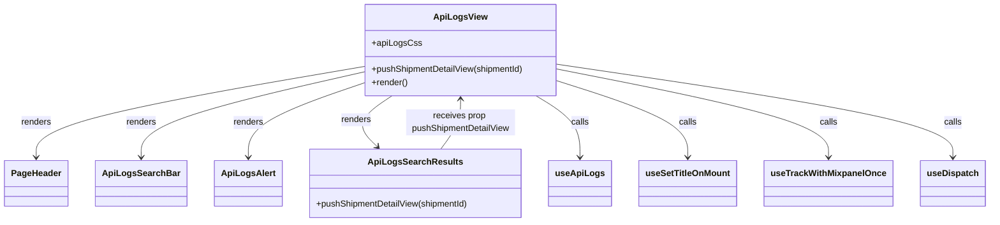

# Diagram: web/portal/src/modules/documentation/api-logs/ApiLogsView.js

> Auto-generated by Obscura crawlers

## Mermaid

### SVG

<svg id="container" width="1755.2421875" xmlns="http://www.w3.org/2000/svg" class="classDiagram" height="408" viewBox="0 0 1755.2421875 408" role="graphics-document document" aria-roledescription="class"><g><defs><marker id="container_class-aggregationStart" class="marker aggregation class" refX="18" refY="7" markerWidth="190" markerHeight="240" orient="auto"><path d="M 18,7 L9,13 L1,7 L9,1 Z"></path></marker></defs><defs><marker id="container_class-aggregationEnd" class="marker aggregation class" refX="1" refY="7" markerWidth="20" markerHeight="28" orient="auto"><path d="M 18,7 L9,13 L1,7 L9,1 Z"></path></marker></defs><defs><marker id="container_class-extensionStart" class="marker extension class" refX="18" refY="7" markerWidth="190" markerHeight="240" orient="auto"><path d="M 1,7 L18,13 V 1 Z"></path></marker></defs><defs><marker id="container_class-extensionEnd" class="marker extension class" refX="1" refY="7" markerWidth="20" markerHeight="28" orient="auto"><path d="M 1,1 V 13 L18,7 Z"></path></marker></defs><defs><marker id="container_class-compositionStart" class="marker composition class" refX="18" refY="7" markerWidth="190" markerHeight="240" orient="auto"><path d="M 18,7 L9,13 L1,7 L9,1 Z"></path></marker></defs><defs><marker id="container_class-compositionEnd" class="marker composition class" refX="1" refY="7" markerWidth="20" markerHeight="28" orient="auto"><path d="M 18,7 L9,13 L1,7 L9,1 Z"></path></marker></defs><defs><marker id="container_class-dependencyStart" class="marker dependency class" refX="6" refY="7" markerWidth="190" markerHeight="240" orient="auto"><path d="M 5,7 L9,13 L1,7 L9,1 Z"></path></marker></defs><defs><marker id="container_class-dependencyEnd" class="marker dependency class" refX="13" refY="7" markerWidth="20" markerHeight="28" orient="auto"><path d="M 18,7 L9,13 L14,7 L9,1 Z"></path></marker></defs><defs><marker id="container_class-lollipopStart" class="marker lollipop class" refX="13" refY="7" markerWidth="190" markerHeight="240" orient="auto"><circle stroke="black" fill="transparent" cx="7" cy="7" r="6"></circle></marker></defs><defs><marker id="container_class-lollipopEnd" class="marker lollipop class" refX="1" refY="7" markerWidth="190" markerHeight="240" orient="auto"><circle stroke="black" fill="transparent" cx="7" cy="7" r="6"></circle></marker></defs><g class="root"><g class="clusters"></g><g class="edgePaths"><path d="M639.201,123.18L543.303,140.15C447.405,157.12,255.609,191.06,159.711,218.697C63.813,246.333,63.813,267.667,63.813,278.333L63.813,289" id="id_ApiLogsView_PageHeader_1" class="edge-thickness-normal edge-pattern-solid relation" style=";;;" data-edge="true" data-et="edge" data-id="id_ApiLogsView_PageHeader_1" data-points="W3sieCI6NjM5LjIwMTE3MTg3NSwieSI6MTIzLjE3OTk4MDkyNTgwMDMyfSx7IngiOjYzLjgxMjUsInkiOjIyNX0seyJ4Ijo2My44MTI1LCJ5IjoyOTV9XQ==" marker-end="url(#container_class-dependencyEnd)"></path><path d="M639.201,133.258L573.901,148.548C508.6,163.839,377.999,194.419,312.699,220.376C247.398,246.333,247.398,267.667,247.398,278.333L247.398,289" id="id_ApiLogsView_ApiLogsSearchBar_2" class="edge-thickness-normal edge-pattern-solid relation" style=";;;" data-edge="true" data-et="edge" data-id="id_ApiLogsView_ApiLogsSearchBar_2" data-points="W3sieCI6NjM5LjIwMTE3MTg3NSwieSI6MTMzLjI1Nzc3Mzc4OTAxNTF9LHsieCI6MjQ3LjM5ODQzNzUsInkiOjIyNX0seyJ4IjoyNDcuMzk4NDM3NSwieSI6Mjk1fV0=" marker-end="url(#container_class-dependencyEnd)"></path><path d="M639.201,153.358L604.912,165.298C570.624,177.239,502.046,201.119,467.757,223.726C433.469,246.333,433.469,267.667,433.469,278.333L433.469,289" id="id_ApiLogsView_ApiLogsAlert_3" class="edge-thickness-normal edge-pattern-solid relation" style=";;;" data-edge="true" data-et="edge" data-id="id_ApiLogsView_ApiLogsAlert_3" data-points="W3sieCI6NjM5LjIwMTE3MTg3NSwieSI6MTUzLjM1NzgyODQ3MjY1OTA0fSx7IngiOjQzMy40Njg3NSwieSI6MjI1fSx7IngiOjQzMy40Njg3NSwieSI6Mjk1fV0=" marker-end="url(#container_class-dependencyEnd)"></path><path d="M693.308,176L681.438,184.167C669.568,192.333,645.828,208.667,641.496,224.296C637.163,239.926,652.239,254.852,659.776,262.315L667.314,269.779" id="id_ApiLogsView_ApiLogsSearchResults_4" class="edge-thickness-normal edge-pattern-solid relation" style=";;;" data-edge="true" data-et="edge" data-id="id_ApiLogsView_ApiLogsSearchResults_4" data-points="W3sieCI6NjkzLjMwODI4NTM2MTg0MjEsInkiOjE3Nn0seyJ4Ijo2MjIuMDg3ODkwNjI1LCJ5IjoyMjV9LHsieCI6NjcxLjU3NzUxNDY0ODQzNzUsInkiOjI3NH1d" marker-end="url(#container_class-dependencyEnd)"></path><path d="M952.225,176L965.527,184.167C978.83,192.333,1005.434,208.667,1018.737,227.5C1032.039,246.333,1032.039,267.667,1032.039,278.333L1032.039,289" id="id_ApiLogsView_useApiLogs_5" class="edge-thickness-normal edge-pattern-solid relation" style=";;;" data-edge="true" data-et="edge" data-id="id_ApiLogsView_useApiLogs_5" data-points="W3sieCI6OTUyLjIyNDgxNDk2NzEwNTIsInkiOjE3Nn0seyJ4IjoxMDMyLjAzOTA2MjUsInkiOjIyNX0seyJ4IjoxMDMyLjAzOTA2MjUsInkiOjI5NX1d" marker-end="url(#container_class-dependencyEnd)"></path><path d="M991.6,149.623L1030.014,162.186C1068.428,174.749,1145.257,199.874,1183.672,223.104C1222.086,246.333,1222.086,267.667,1222.086,278.333L1222.086,289" id="id_ApiLogsView_useSetTitleOnMount_6" class="edge-thickness-normal edge-pattern-solid relation" style=";;;" data-edge="true" data-et="edge" data-id="id_ApiLogsView_useSetTitleOnMount_6" data-points="W3sieCI6OTkxLjU5OTYwOTM3NSwieSI6MTQ5LjYyMzEzNDgxMjE5NjU1fSx7IngiOjEyMjIuMDg1OTM3NSwieSI6MjI1fSx7IngiOjEyMjIuMDg1OTM3NSwieSI6Mjk1fV0=" marker-end="url(#container_class-dependencyEnd)"></path><path d="M991.6,127.727L1071.556,143.939C1151.512,160.151,1311.424,192.576,1391.38,219.454C1471.336,246.333,1471.336,267.667,1471.336,278.333L1471.336,289" id="id_ApiLogsView_useTrackWithMixpanelOnce_7" class="edge-thickness-normal edge-pattern-solid relation" style=";;;" data-edge="true" data-et="edge" data-id="id_ApiLogsView_useTrackWithMixpanelOnce_7" data-points="W3sieCI6OTkxLjU5OTYwOTM3NSwieSI6MTI3LjcyNjgyNzQzODE0NzQ0fSx7IngiOjE0NzEuMzM1OTM3NSwieSI6MjI1fSx7IngiOjE0NzEuMzM1OTM3NSwieSI6Mjk1fV0=" marker-end="url(#container_class-dependencyEnd)"></path><path d="M991.6,118.777L1108.097,136.481C1224.595,154.184,1457.59,189.592,1574.088,217.963C1690.586,246.333,1690.586,267.667,1690.586,278.333L1690.586,289" id="id_ApiLogsView_useDispatch_8" class="edge-thickness-normal edge-pattern-solid relation" style=";;;" data-edge="true" data-et="edge" data-id="id_ApiLogsView_useDispatch_8" data-points="W3sieCI6OTkxLjU5OTYwOTM3NSwieSI6MTE4Ljc3NjYwMzE3NTY2NTg3fSx7IngiOjE2OTAuNTg1OTM3NSwieSI6MjI1fSx7IngiOjE2OTAuNTg1OTM3NSwieSI6Mjk1fV0=" marker-end="url(#container_class-dependencyEnd)"></path><path d="M780.316,274L786.163,265.833C792.011,257.667,803.706,241.333,809.553,226C815.4,210.667,815.4,196.333,815.4,189.167L815.4,182" id="id_ApiLogsSearchResults_ApiLogsView_9" class="edge-thickness-normal edge-pattern-solid relation" style=";;;" data-edge="true" data-et="edge" data-id="id_ApiLogsSearchResults_ApiLogsView_9" data-points="W3sieCI6NzgwLjMxNTc5NTg5ODQzNzUsInkiOjI3NH0seyJ4Ijo4MTUuNDAwMzkwNjI1LCJ5IjoyMjV9LHsieCI6ODE1LjQwMDM5MDYyNSwieSI6MTc2fV0=" marker-end="url(#container_class-dependencyEnd)"></path></g><g class="edgeLabels"><g class="edgeLabel" transform="translate(63.8125, 225)"><g class="label" data-id="id_ApiLogsView_PageHeader_1" transform="translate(-27.75, -12)"><foreignObject width="55.5" height="24">

renders

</foreignObject></g></g><g class="edgeLabel" transform="translate(247.3984375, 225)"><g class="label" data-id="id_ApiLogsView_ApiLogsSearchBar_2" transform="translate(-27.75, -12)"><foreignObject width="55.5" height="24">

renders

</foreignObject></g></g><g class="edgeLabel" transform="translate(433.46875, 225)"><g class="label" data-id="id_ApiLogsView_ApiLogsAlert_3" transform="translate(-27.75, -12)"><foreignObject width="55.5" height="24">

renders

</foreignObject></g></g><g class="edgeLabel" transform="translate(629.01026, 220.23738)"><g class="label" data-id="id_ApiLogsView_ApiLogsSearchResults_4" transform="translate(-27.75, -12)"><foreignObject width="55.5" height="24">

renders

</foreignObject></g></g><g class="edgeLabel" transform="translate(1032.0390625, 225)"><g class="label" data-id="id_ApiLogsView_useApiLogs_5" transform="translate(-16.4453125, -12)"><foreignObject width="32.890625" height="24">

calls

</foreignObject></g></g><g class="edgeLabel" transform="translate(1222.0859375, 225)"><g class="label" data-id="id_ApiLogsView_useSetTitleOnMount_6" transform="translate(-16.4453125, -12)"><foreignObject width="32.890625" height="24">

calls

</foreignObject></g></g><g class="edgeLabel" transform="translate(1471.3359375, 225)"><g class="label" data-id="id_ApiLogsView_useTrackWithMixpanelOnce_7" transform="translate(-16.4453125, -12)"><foreignObject width="32.890625" height="24">

calls

</foreignObject></g></g><g class="edgeLabel" transform="translate(1690.5859375, 225)"><g class="label" data-id="id_ApiLogsView_useDispatch_8" transform="translate(-16.4453125, -12)"><foreignObject width="32.890625" height="24">

calls

</foreignObject></g></g><g class="edgeLabel" transform="translate(815.400390625, 225)"><g class="label" data-id="id_ApiLogsSearchResults_ApiLogsView_9" transform="translate(-100, -24)"><foreignObject width="200" height="48">

receives prop pushShipmentDetailView

</foreignObject></g></g></g><g class="nodes"><g class="node default" id="classId-ApiLogsView-0" transform="translate(815.400390625, 92)"><g class="basic label-container"><path d="M-176.19921875 -84 L176.19921875 -84 L176.19921875 84 L-176.19921875 84" stroke="none" stroke-width="0" fill="#ECECFF" style=""></path><path d="M-176.19921875 -84 C-100.40052797371315 -84, -24.601837197426306 -84, 176.19921875 -84 M-176.19921875 -84 C-52.784276114070835 -84, 70.63066652185833 -84, 176.19921875 -84 M176.19921875 -84 C176.19921875 -26.45642753312886, 176.19921875 31.08714493374228, 176.19921875 84 M176.19921875 -84 C176.19921875 -29.478367386229436, 176.19921875 25.043265227541127, 176.19921875 84 M176.19921875 84 C86.69602498345105 84, -2.807168783097893 84, -176.19921875 84 M176.19921875 84 C93.72217265799426 84, 11.245126565988528 84, -176.19921875 84 M-176.19921875 84 C-176.19921875 20.882569405727217, -176.19921875 -42.234861188545565, -176.19921875 -84 M-176.19921875 84 C-176.19921875 46.78011334736687, -176.19921875 9.560226694733743, -176.19921875 -84" stroke="#9370DB" stroke-width="1.3" fill="none" stroke-dasharray="0 0" style=""></path></g><g class="annotation-group text" transform="translate(0, -60)"></g><g class="label-group text" transform="translate(-45.7578125, -60)"><g class="label" style="font-weight: bolder" transform="translate(0,-12)"><foreignObject width="91.515625" height="24">

ApiLogsView

</foreignObject></g></g><g class="members-group text" transform="translate(-164.19921875, -12)"><g class="label" style="" transform="translate(0,-12)"><foreignObject width="86.59375" height="24">

+apiLogsCss

</foreignObject></g></g><g class="methods-group text" transform="translate(-164.19921875, 36)"><g class="label" style="" transform="translate(0,-12)"><foreignObject width="282.640625" height="24">

+pushShipmentDetailView(shipmentId)

</foreignObject></g><g class="label" style="" transform="translate(0,12)"><foreignObject width="66.609375" height="24">

+render()

</foreignObject></g></g><g class="divider" style=""><path d="M-176.19921875 -36 C-87.23585747406246 -36, 1.7275038018750877 -36, 176.19921875 -36 M-176.19921875 -36 C-37.49350804101027 -36, 101.21220266797945 -36, 176.19921875 -36" stroke="#9370DB" stroke-width="1.3" fill="none" stroke-dasharray="0 0" style=""></path></g><g class="divider" style=""><path d="M-176.19921875 12 C-69.70545549689788 12, 36.78830775620423 12, 176.19921875 12 M-176.19921875 12 C-78.9669489516187 12, 18.26532084676259 12, 176.19921875 12" stroke="#9370DB" stroke-width="1.3" fill="none" stroke-dasharray="0 0" style=""></path></g></g><g class="node default" id="classId-PageHeader-1" transform="translate(63.8125, 337)"><g class="basic label-container"><path d="M-55.8125 -42 L55.8125 -42 L55.8125 42 L-55.8125 42" stroke="none" stroke-width="0" fill="#ECECFF" style=""></path><path d="M-55.8125 -42 C-17.073268531817682 -42, 21.665962936364636 -42, 55.8125 -42 M-55.8125 -42 C-19.415562649842528 -42, 16.981374700314944 -42, 55.8125 -42 M55.8125 -42 C55.8125 -16.163025053559693, 55.8125 9.673949892880614, 55.8125 42 M55.8125 -42 C55.8125 -17.57362241399536, 55.8125 6.852755172009282, 55.8125 42 M55.8125 42 C22.213908887659464 42, -11.384682224681072 42, -55.8125 42 M55.8125 42 C22.82414429938946 42, -10.164211401221081 42, -55.8125 42 M-55.8125 42 C-55.8125 13.766105239764126, -55.8125 -14.467789520471747, -55.8125 -42 M-55.8125 42 C-55.8125 21.99636739853163, -55.8125 1.9927347970632567, -55.8125 -42" stroke="#9370DB" stroke-width="1.3" fill="none" stroke-dasharray="0 0" style=""></path></g><g class="annotation-group text" transform="translate(0, -18)"></g><g class="label-group text" transform="translate(-43.8125, -18)"><g class="label" style="font-weight: bolder" transform="translate(0,-12)"><foreignObject width="87.625" height="24">

PageHeader

</foreignObject></g></g><g class="members-group text" transform="translate(-43.8125, 30)"></g><g class="methods-group text" transform="translate(-43.8125, 60)"></g><g class="divider" style=""><path d="M-55.8125 6 C-18.13974558262 6, 19.533008834759997 6, 55.8125 6 M-55.8125 6 C-25.464763790850025 6, 4.88297241829995 6, 55.8125 6" stroke="#9370DB" stroke-width="1.3" fill="none" stroke-dasharray="0 0" style=""></path></g><g class="divider" style=""><path d="M-55.8125 24 C-25.517247815798104 24, 4.778004368403792 24, 55.8125 24 M-55.8125 24 C-13.054806510319963 24, 29.702886979360073 24, 55.8125 24" stroke="#9370DB" stroke-width="1.3" fill="none" stroke-dasharray="0 0" style=""></path></g></g><g class="node default" id="classId-ApiLogsSearchBar-2" transform="translate(247.3984375, 337)"><g class="basic label-container"><path d="M-77.7734375 -42 L77.7734375 -42 L77.7734375 42 L-77.7734375 42" stroke="none" stroke-width="0" fill="#ECECFF" style=""></path><path d="M-77.7734375 -42 C-43.85697333538177 -42, -9.940509170763534 -42, 77.7734375 -42 M-77.7734375 -42 C-35.112401276106134 -42, 7.548634947787733 -42, 77.7734375 -42 M77.7734375 -42 C77.7734375 -8.836587689722876, 77.7734375 24.326824620554248, 77.7734375 42 M77.7734375 -42 C77.7734375 -24.512955643123917, 77.7734375 -7.025911286247833, 77.7734375 42 M77.7734375 42 C15.979727104681267 42, -45.813983290637466 42, -77.7734375 42 M77.7734375 42 C30.987860535930096 42, -15.797716428139807 42, -77.7734375 42 M-77.7734375 42 C-77.7734375 18.450752027403936, -77.7734375 -5.098495945192127, -77.7734375 -42 M-77.7734375 42 C-77.7734375 24.86846979522825, -77.7734375 7.736939590456501, -77.7734375 -42" stroke="#9370DB" stroke-width="1.3" fill="none" stroke-dasharray="0 0" style=""></path></g><g class="annotation-group text" transform="translate(0, -18)"></g><g class="label-group text" transform="translate(-65.7734375, -18)"><g class="label" style="font-weight: bolder" transform="translate(0,-12)"><foreignObject width="131.546875" height="24">

ApiLogsSearchBar

</foreignObject></g></g><g class="members-group text" transform="translate(-65.7734375, 30)"></g><g class="methods-group text" transform="translate(-65.7734375, 60)"></g><g class="divider" style=""><path d="M-77.7734375 6 C-30.747312477576706 6, 16.278812544846588 6, 77.7734375 6 M-77.7734375 6 C-21.25898799751878 6, 35.25546150496244 6, 77.7734375 6" stroke="#9370DB" stroke-width="1.3" fill="none" stroke-dasharray="0 0" style=""></path></g><g class="divider" style=""><path d="M-77.7734375 24 C-33.58233095983346 24, 10.608775580333074 24, 77.7734375 24 M-77.7734375 24 C-40.77351405382799 24, -3.7735906076559758 24, 77.7734375 24" stroke="#9370DB" stroke-width="1.3" fill="none" stroke-dasharray="0 0" style=""></path></g></g><g class="node default" id="classId-ApiLogsAlert-3" transform="translate(433.46875, 337)"><g class="basic label-container"><path d="M-58.296875 -42 L58.296875 -42 L58.296875 42 L-58.296875 42" stroke="none" stroke-width="0" fill="#ECECFF" style=""></path><path d="M-58.296875 -42 C-14.058960788206797 -42, 30.178953423586407 -42, 58.296875 -42 M-58.296875 -42 C-21.534948527512775 -42, 15.22697794497445 -42, 58.296875 -42 M58.296875 -42 C58.296875 -14.927519767456868, 58.296875 12.144960465086264, 58.296875 42 M58.296875 -42 C58.296875 -15.973860777619425, 58.296875 10.05227844476115, 58.296875 42 M58.296875 42 C21.559462631257624 42, -15.177949737484752 42, -58.296875 42 M58.296875 42 C13.449061523191702 42, -31.398751953616596 42, -58.296875 42 M-58.296875 42 C-58.296875 8.863048634584516, -58.296875 -24.27390273083097, -58.296875 -42 M-58.296875 42 C-58.296875 23.11420554433485, -58.296875 4.228411088669702, -58.296875 -42" stroke="#9370DB" stroke-width="1.3" fill="none" stroke-dasharray="0 0" style=""></path></g><g class="annotation-group text" transform="translate(0, -18)"></g><g class="label-group text" transform="translate(-46.296875, -18)"><g class="label" style="font-weight: bolder" transform="translate(0,-12)"><foreignObject width="92.59375" height="24">

ApiLogsAlert

</foreignObject></g></g><g class="members-group text" transform="translate(-46.296875, 30)"></g><g class="methods-group text" transform="translate(-46.296875, 60)"></g><g class="divider" style=""><path d="M-58.296875 6 C-23.709480948346098 6, 10.877913103307804 6, 58.296875 6 M-58.296875 6 C-16.073162597031505 6, 26.15054980593699 6, 58.296875 6" stroke="#9370DB" stroke-width="1.3" fill="none" stroke-dasharray="0 0" style=""></path></g><g class="divider" style=""><path d="M-58.296875 24 C-24.486477251337412 24, 9.323920497325176 24, 58.296875 24 M-58.296875 24 C-33.29909194226346 24, -8.301308884526911 24, 58.296875 24" stroke="#9370DB" stroke-width="1.3" fill="none" stroke-dasharray="0 0" style=""></path></g></g><g class="node default" id="classId-ApiLogsSearchResults-4" transform="translate(735.20703125, 337)"><g class="basic label-container"><path d="M-193.44140625 -63 L193.44140625 -63 L193.44140625 63 L-193.44140625 63" stroke="none" stroke-width="0" fill="#ECECFF" style=""></path><path d="M-193.44140625 -63 C-42.958653252337285 -63, 107.52409974532543 -63, 193.44140625 -63 M-193.44140625 -63 C-98.63740184155562 -63, -3.83339743311123 -63, 193.44140625 -63 M193.44140625 -63 C193.44140625 -23.367821117008006, 193.44140625 16.264357765983988, 193.44140625 63 M193.44140625 -63 C193.44140625 -22.727236252783477, 193.44140625 17.545527494433045, 193.44140625 63 M193.44140625 63 C81.97271065958756 63, -29.495984930824875 63, -193.44140625 63 M193.44140625 63 C56.61827497853409 63, -80.20485629293182 63, -193.44140625 63 M-193.44140625 63 C-193.44140625 32.360284132658975, -193.44140625 1.7205682653179437, -193.44140625 -63 M-193.44140625 63 C-193.44140625 26.44760627776025, -193.44140625 -10.104787444479499, -193.44140625 -63" stroke="#9370DB" stroke-width="1.3" fill="none" stroke-dasharray="0 0" style=""></path></g><g class="annotation-group text" transform="translate(0, -39)"></g><g class="label-group text" transform="translate(-80.2421875, -39)"><g class="label" style="font-weight: bolder" transform="translate(0,-12)"><foreignObject width="160.484375" height="24">

ApiLogsSearchResults

</foreignObject></g></g><g class="members-group text" transform="translate(-181.44140625, 9)"></g><g class="methods-group text" transform="translate(-181.44140625, 39)"><g class="label" style="" transform="translate(0,-12)"><foreignObject width="282.640625" height="24">

+pushShipmentDetailView(shipmentId)

</foreignObject></g></g><g class="divider" style=""><path d="M-193.44140625 -15 C-54.803543031753776 -15, 83.83432018649245 -15, 193.44140625 -15 M-193.44140625 -15 C-86.24931392050999 -15, 20.94277840898002 -15, 193.44140625 -15" stroke="#9370DB" stroke-width="1.3" fill="none" stroke-dasharray="0 0" style=""></path></g><g class="divider" style=""><path d="M-193.44140625 9 C-55.91759661685589 9, 81.60621301628822 9, 193.44140625 9 M-193.44140625 9 C-43.547048480466685 9, 106.34730928906663 9, 193.44140625 9" stroke="#9370DB" stroke-width="1.3" fill="none" stroke-dasharray="0 0" style=""></path></g></g><g class="node default" id="classId-useApiLogs-5" transform="translate(1032.0390625, 337)"><g class="basic label-container"><path d="M-53.390625 -42 L53.390625 -42 L53.390625 42 L-53.390625 42" stroke="none" stroke-width="0" fill="#ECECFF" style=""></path><path d="M-53.390625 -42 C-18.192450726918956 -42, 17.005723546162088 -42, 53.390625 -42 M-53.390625 -42 C-11.607385610699701 -42, 30.175853778600597 -42, 53.390625 -42 M53.390625 -42 C53.390625 -23.553167897416998, 53.390625 -5.106335794833996, 53.390625 42 M53.390625 -42 C53.390625 -13.920509845646492, 53.390625 14.158980308707015, 53.390625 42 M53.390625 42 C28.951940896217835 42, 4.513256792435669 42, -53.390625 42 M53.390625 42 C25.01024649401649 42, -3.370132011967023 42, -53.390625 42 M-53.390625 42 C-53.390625 8.761492095167696, -53.390625 -24.477015809664607, -53.390625 -42 M-53.390625 42 C-53.390625 10.449795722407739, -53.390625 -21.100408555184522, -53.390625 -42" stroke="#9370DB" stroke-width="1.3" fill="none" stroke-dasharray="0 0" style=""></path></g><g class="annotation-group text" transform="translate(0, -18)"></g><g class="label-group text" transform="translate(-41.390625, -18)"><g class="label" style="font-weight: bolder" transform="translate(0,-12)"><foreignObject width="82.78125" height="24">

useApiLogs

</foreignObject></g></g><g class="members-group text" transform="translate(-41.390625, 30)"></g><g class="methods-group text" transform="translate(-41.390625, 60)"></g><g class="divider" style=""><path d="M-53.390625 6 C-30.748545649838317 6, -8.106466299676633 6, 53.390625 6 M-53.390625 6 C-12.82593735093721 6, 27.73875029812558 6, 53.390625 6" stroke="#9370DB" stroke-width="1.3" fill="none" stroke-dasharray="0 0" style=""></path></g><g class="divider" style=""><path d="M-53.390625 24 C-28.530683100036875 24, -3.670741200073749 24, 53.390625 24 M-53.390625 24 C-12.574143881720829 24, 28.242337236558342 24, 53.390625 24" stroke="#9370DB" stroke-width="1.3" fill="none" stroke-dasharray="0 0" style=""></path></g></g><g class="node default" id="classId-useSetTitleOnMount-6" transform="translate(1222.0859375, 337)"><g class="basic label-container"><path d="M-86.65625 -42 L86.65625 -42 L86.65625 42 L-86.65625 42" stroke="none" stroke-width="0" fill="#ECECFF" style=""></path><path d="M-86.65625 -42 C-31.219746884134274 -42, 24.216756231731452 -42, 86.65625 -42 M-86.65625 -42 C-33.86187333399997 -42, 18.932503332000067 -42, 86.65625 -42 M86.65625 -42 C86.65625 -13.264729293568774, 86.65625 15.470541412862453, 86.65625 42 M86.65625 -42 C86.65625 -14.177989251913395, 86.65625 13.64402149617321, 86.65625 42 M86.65625 42 C35.16685323833363 42, -16.32254352333274 42, -86.65625 42 M86.65625 42 C24.529114564531888 42, -37.598020870936224 42, -86.65625 42 M-86.65625 42 C-86.65625 13.042747286087199, -86.65625 -15.914505427825603, -86.65625 -42 M-86.65625 42 C-86.65625 23.038707089035903, -86.65625 4.077414178071805, -86.65625 -42" stroke="#9370DB" stroke-width="1.3" fill="none" stroke-dasharray="0 0" style=""></path></g><g class="annotation-group text" transform="translate(0, -18)"></g><g class="label-group text" transform="translate(-74.65625, -18)"><g class="label" style="font-weight: bolder" transform="translate(0,-12)"><foreignObject width="149.3125" height="24">

useSetTitleOnMount

</foreignObject></g></g><g class="members-group text" transform="translate(-74.65625, 30)"></g><g class="methods-group text" transform="translate(-74.65625, 60)"></g><g class="divider" style=""><path d="M-86.65625 6 C-23.239310776295426 6, 40.17762844740915 6, 86.65625 6 M-86.65625 6 C-33.61584059875204 6, 19.424568802495926 6, 86.65625 6" stroke="#9370DB" stroke-width="1.3" fill="none" stroke-dasharray="0 0" style=""></path></g><g class="divider" style=""><path d="M-86.65625 24 C-35.861467420415664 24, 14.933315159168671 24, 86.65625 24 M-86.65625 24 C-31.72078611146543 24, 23.21467777706914 24, 86.65625 24" stroke="#9370DB" stroke-width="1.3" fill="none" stroke-dasharray="0 0" style=""></path></g></g><g class="node default" id="classId-useTrackWithMixpanelOnce-7" transform="translate(1471.3359375, 337)"><g class="basic label-container"><path d="M-112.59375 -42 L112.59375 -42 L112.59375 42 L-112.59375 42" stroke="none" stroke-width="0" fill="#ECECFF" style=""></path><path d="M-112.59375 -42 C-26.010363421410204 -42, 60.57302315717959 -42, 112.59375 -42 M-112.59375 -42 C-60.30322669878781 -42, -8.01270339757562 -42, 112.59375 -42 M112.59375 -42 C112.59375 -18.108989723410353, 112.59375 5.782020553179294, 112.59375 42 M112.59375 -42 C112.59375 -12.362540600815436, 112.59375 17.27491879836913, 112.59375 42 M112.59375 42 C55.32210752558935 42, -1.9495349488212952 42, -112.59375 42 M112.59375 42 C66.96597432999192 42, 21.33819865998383 42, -112.59375 42 M-112.59375 42 C-112.59375 8.472181647961577, -112.59375 -25.055636704076846, -112.59375 -42 M-112.59375 42 C-112.59375 22.476327837276916, -112.59375 2.9526556745538315, -112.59375 -42" stroke="#9370DB" stroke-width="1.3" fill="none" stroke-dasharray="0 0" style=""></path></g><g class="annotation-group text" transform="translate(0, -18)"></g><g class="label-group text" transform="translate(-100.59375, -18)"><g class="label" style="font-weight: bolder" transform="translate(0,-12)"><foreignObject width="201.1875" height="24">

useTrackWithMixpanelOnce

</foreignObject></g></g><g class="members-group text" transform="translate(-100.59375, 30)"></g><g class="methods-group text" transform="translate(-100.59375, 60)"></g><g class="divider" style=""><path d="M-112.59375 6 C-36.219010730338425 6, 40.15572853932315 6, 112.59375 6 M-112.59375 6 C-48.746035101337476 6, 15.101679797325048 6, 112.59375 6" stroke="#9370DB" stroke-width="1.3" fill="none" stroke-dasharray="0 0" style=""></path></g><g class="divider" style=""><path d="M-112.59375 24 C-37.48493684147638 24, 37.623876317047234 24, 112.59375 24 M-112.59375 24 C-52.53715630388524 24, 7.51943739222952 24, 112.59375 24" stroke="#9370DB" stroke-width="1.3" fill="none" stroke-dasharray="0 0" style=""></path></g></g><g class="node default" id="classId-useDispatch-8" transform="translate(1690.5859375, 337)"><g class="basic label-container"><path d="M-56.65625 -42 L56.65625 -42 L56.65625 42 L-56.65625 42" stroke="none" stroke-width="0" fill="#ECECFF" style=""></path><path d="M-56.65625 -42 C-31.672885575344473 -42, -6.689521150688947 -42, 56.65625 -42 M-56.65625 -42 C-14.231309751810919 -42, 28.193630496378162 -42, 56.65625 -42 M56.65625 -42 C56.65625 -19.795659636687425, 56.65625 2.4086807266251498, 56.65625 42 M56.65625 -42 C56.65625 -21.9575878034171, 56.65625 -1.9151756068341967, 56.65625 42 M56.65625 42 C12.71422058154642 42, -31.22780883690716 42, -56.65625 42 M56.65625 42 C15.730132733974543 42, -25.195984532050915 42, -56.65625 42 M-56.65625 42 C-56.65625 14.466052922448036, -56.65625 -13.067894155103929, -56.65625 -42 M-56.65625 42 C-56.65625 15.130222309011788, -56.65625 -11.739555381976423, -56.65625 -42" stroke="#9370DB" stroke-width="1.3" fill="none" stroke-dasharray="0 0" style=""></path></g><g class="annotation-group text" transform="translate(0, -18)"></g><g class="label-group text" transform="translate(-44.65625, -18)"><g class="label" style="font-weight: bolder" transform="translate(0,-12)"><foreignObject width="89.3125" height="24">

useDispatch

</foreignObject></g></g><g class="members-group text" transform="translate(-44.65625, 30)"></g><g class="methods-group text" transform="translate(-44.65625, 60)"></g><g class="divider" style=""><path d="M-56.65625 6 C-33.958923747810175 6, -11.261597495620357 6, 56.65625 6 M-56.65625 6 C-28.041779910061823 6, 0.5726901798763535 6, 56.65625 6" stroke="#9370DB" stroke-width="1.3" fill="none" stroke-dasharray="0 0" style=""></path></g><g class="divider" style=""><path d="M-56.65625 24 C-25.22063672003942 24, 6.214976559921162 24, 56.65625 24 M-56.65625 24 C-30.83873351798998 24, -5.021217035979959 24, 56.65625 24" stroke="#9370DB" stroke-width="1.3" fill="none" stroke-dasharray="0 0" style=""></path></g></g></g></g></g></svg>
